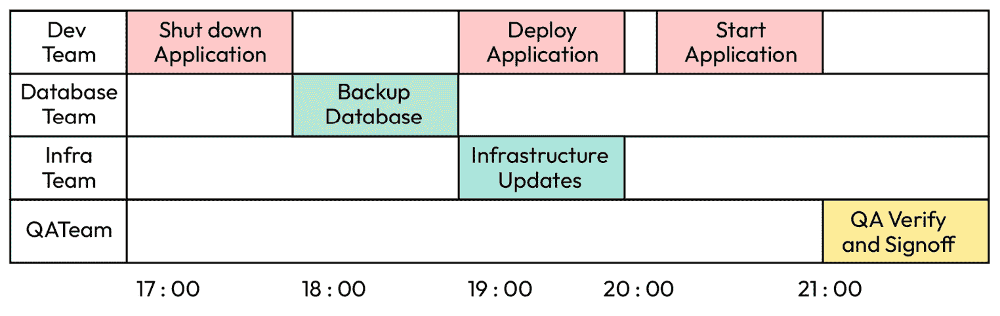
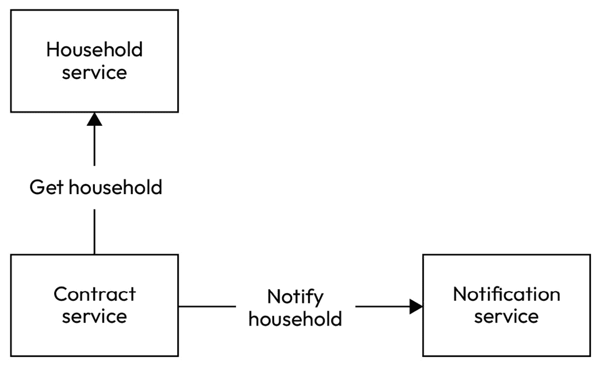
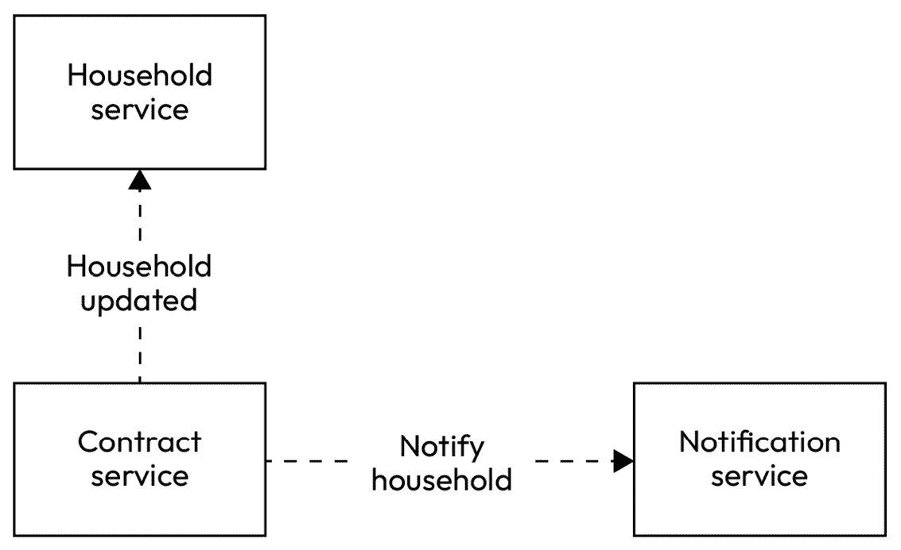
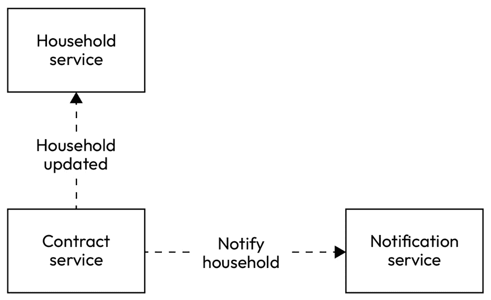
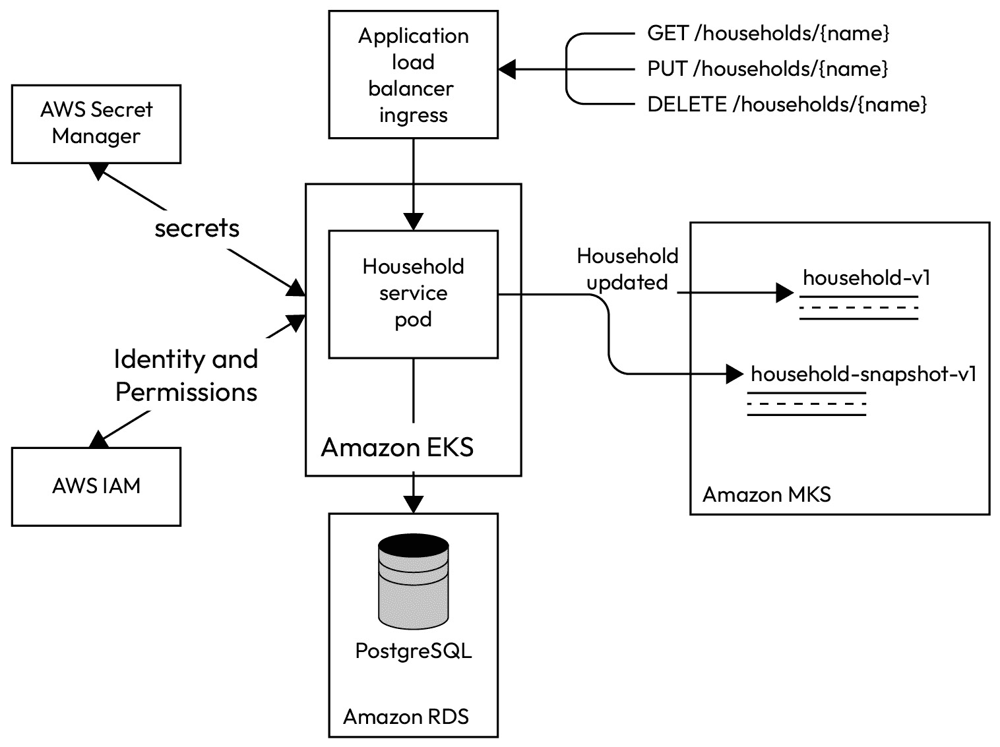
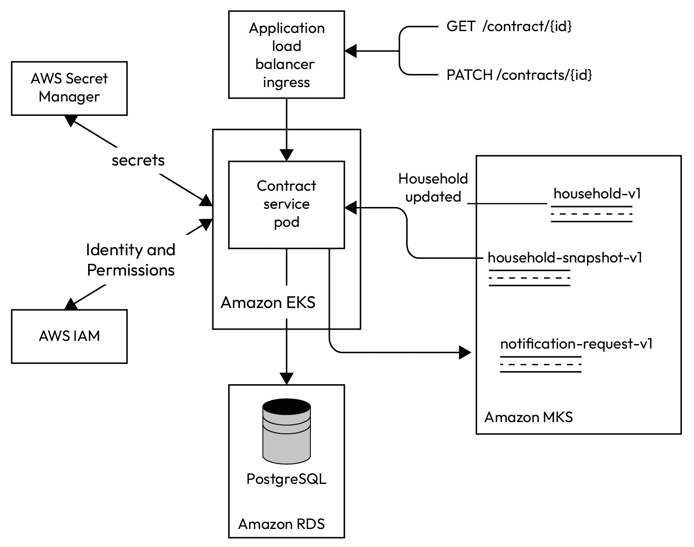
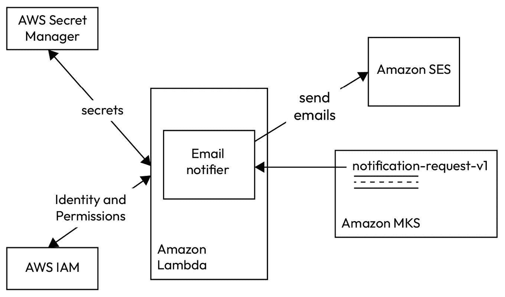
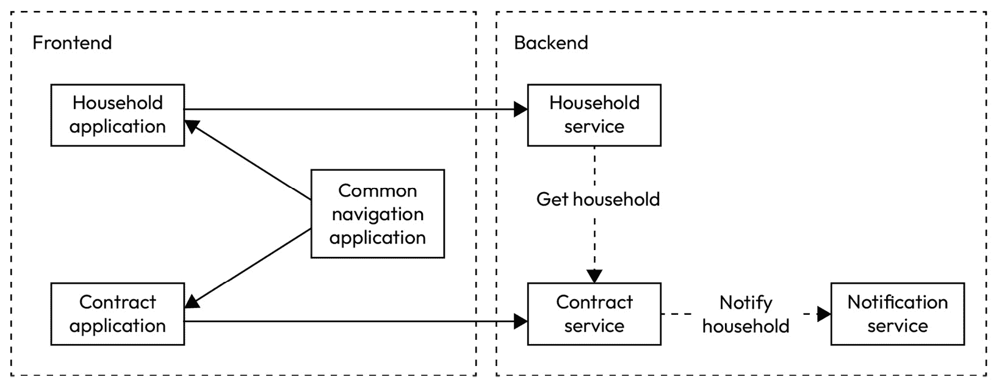
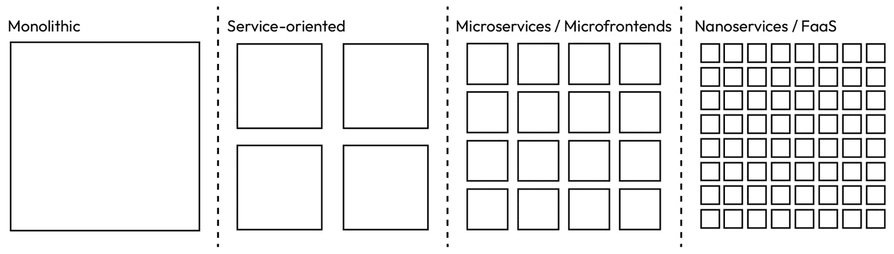

# 第六章：微服务、无服务器和微前端

在本章中，我们将深入探讨微服务、无服务器和微前端架构风格。它们彻底改变了我们设计、开发和部署应用程序的方式。它们还使组织能够构建强大、灵活和可扩展的系统。我们将探讨每种方法的根本原则、独特特性和实际益处。到本章结束时，您将全面了解这些架构及其在现代软件工程中的应用。

我们的探索从描述传统的单体架构开始，其中整个系统被设计和发展为一个单一单元。然后，我们将讨论许多开发者面临此方法带来的挑战，从而产生将单体分解为更小、松散耦合组件的需求。

然后，我们将关注微服务架构，并检查微服务如何解决单体架构的挑战。我们将介绍如何将单体转换为微服务，然后讨论随之而来的分布式架构风格的益处、挑战和权衡。

接下来，我们将讨论无服务器计算如何帮助开发者专注于编写代码，而无需担心基础设施。我们将讨论无服务器架构的最佳用例，并解决与此范式相关的挑战。

最后，我们将探讨如何将单体应用程序转换为微服务和微前端。我们将讨论自包含组件如何使开发者受益以及如何与微服务和无服务器后端集成。

本章将涵盖以下主题：

+   单体架构

+   微服务

+   纳微服务

+   无服务器

+   微前端

# 技术要求

您可以在 GitHub 上找到本章中使用的所有代码文件：[`github.com/PacktPublishing/Software-Architecture-with-Kotlin/tree/main/chapter-6`](https://github.com/PacktPublishing/Software-Architecture-with-Kotlin/tree/main/chapter-6)

# 单体架构

**单体**意味着“由一块石头制成”。在软件架构的背景下，单体指的是作为一个单一单元设计和开发的庞大系统。在单体架构中，通常有一个单一的代码库、统一的数据库和一个可部署的工件。

拥有一个单一的代码库意味着它通常依赖于个别开发者的努力来保持代码整洁和干净。由于所有代码都托管在同一个地方，因此很难通过设计来强制实施关注点的分离。这通常会导致应用程序的所有组件、模块和功能紧密耦合和相互依赖。

在单体应用中，通常只有关系型数据库，可能会产生一个主要的——如果不是唯一的——模式，该模式包含所有功能的所有实体。此外，每个实体表将包含所有涉及实体的业务相关列。表格之间还可能存在一个复杂的键约束网。它通常将用于事务和报告的数据库的担忧合并为一个。

虽然单体在代码质量和数据库设计方面范围很广，但它们有一个共同点：单体应用有一个可部署的工件，包含整个系统。它很大，发布需要很长时间。发布过程通常需要首先关闭所有单体应用实例，然后进行基础设施更改，新的可部署工件替换旧的工件，应用开始更新版本。每次发布通常还需要进行密集的预先规划和团队间的协调，以确定依赖关系。发布计划可能看起来像甘特图或项目计划，如图*6.1*所示：



图 6.1 – 发布计划作为甘特图

在这个发布计划中，开发团队首先关闭单体应用。然后，数据库团队备份数据库。之后，开发团队开始部署应用，同时基础设施团队应用更改，如网络或中间件升级。当这一切完成时，开发团队启动应用。最后，质量保证团队验证环境并签署发布。一些组织可能有一个专门的发布团队或运营团队，为每次发布制定一个操作手册，并作为一个团队执行计划。

发布计划被可视化为一个甘特图，以显示团队之间的依赖关系，并显示从左到右的发布时间线。

接下来，我们将介绍单体方法的优点和挑战，作为介绍即将到来的三种架构风格的基础。

## 优点

现在，很少有组织会公开倡导单体架构作为最佳风格。然而，还有一些优点使得它被认为是一种架构选择：

+   **简单性**：单体应用具有一个代码库、一个数据库和一个可部署工件的简单性。一旦建立构建、部署和运行的常规，开发者就可以遵循这个随着时间的推移重复的模式。正如我们在*第二章*中提到的，这被称为**你不是真的需要它**（YAGNI）原则。如果这种简单性是我们现在所需要的，那么最初采用单体方法不是一个坏主意。

+   **上市时间短**：这种情况通常与在初创公司工作的开发者产生共鸣，在初创公司中，上市时间是首要任务，其他一切都不重要。有时，这甚至是一个立即行动或放弃的情况。这也适用于可能不需要复杂架构的实验性应用程序。

+   **先构建，后优化**：单体架构的另一个好处是情境性的。如果业务领域是新的，每个人都正在寻找如何将系统构建成产品的路径，那么推迟任何重构或优化是有益的——也就是说，直到包括技术和非技术利益相关者在内的每个人都对这个主题有更多经验，并认识到需要分解单体应用程序的需要。此外，在尝试通过合理的边界将其分解并确定哪些功能自然地一起使用之前，更好地了解业务生态系统是更好的。

**以单体架构为首选**

这种有意识地选择单体架构的方法被称为**以单体架构为首选**。这个术语是由马丁·福勒在 2015 年的工程博客中推广的。

## 挑战

虽然单体架构已被广泛使用，但它有一些缺点。组件之间的紧密耦合使得独立更新应用程序的特定部分变得困难。换句话说，改变系统的一部分可能会无意中影响其他部分：

+   **缓慢的开发过程**：这使得任何变更都比实际需要的更大，因此增加了发布的风险。由于每个变更都更大，工程师之间发生代码冲突的概率显著更高。工程师将花费更多时间审查代码和解决代码冲突。需要更多的测试区域来确保系统功能正常。这些因素共同导致开发周期变慢，灵活性降低。

+   **难以扩展和调整性能**：此外，在单体架构中扩展资源可能效率低下，因为整个应用程序需要被复制，而不是仅需要更多资源的单个组件。由于可能存在其他进程与同一资源竞争，因此精确调整性能也更加困难。

+   **耗时的测试套件**：在单体应用程序中，不同的组件和模块紧密耦合，这意味着应用程序某一部分的变更可能会在其他部分产生意外的后果。测试需要验证没有对业务案例造成意外的变更，导致测试场景更加复杂，测试执行时间更长。相互依赖性也使得独立隔离和运行测试变得困难，限制了并行执行和缩短测试执行时间的潜力。即使是单体应用程序中的微小变更也需要回归测试。这需要一套全面的测试用例，这可能很耗时。

+   **风险高、周期长、规模大**：发布单体应用通常需要很长时间，因为整个系统作为一个单元进行部署。即使是微小的更改，也会导致整个单体需要重新部署，这意味着持续交付系统变得更加困难。更糟糕的是，由于单体无法快速和持续地部署，可能会积累更多更改以定期发布。工程师可能会花费一个漫长的夜晚来发布单体应用，而这些漫长和晚上的时间可能会因为疲劳而引入更多人为错误。

    相反，在分布式系统中发布一个小型应用同样具有挑战性。然而，由于更改范围较小，可以使用现代策略，如滚动发布、**蓝绿发布**或**金丝雀发布**。这些发布策略可以在工作时间进行，此时可以获得最多的帮助，从而降低人为错误的风险。

+   **技术锁定**：单体应用通常具有较长的生命周期。这意味着它可能很久以前就选择了一个技术栈。开发者面临的是要么升级技术，这会导致代码库发生重大变化，要么在某些代码库的部分采用不同的技术，这会导致多个工具做相同的工作。这也意味着在技术上进行实验的空间严重受限。

+   **整个系统故障**：单体应用的故障很容易导致整个系统故障。即使是操作部分也可能关闭，因为它是一个单体单元的一部分。由于组件之间没有明确的分离，因此隔离和限制故障变得更加困难。

+   **团队依赖**：最后，多个团队共享一个可部署的工件，可能还有同一个代码库，这会创建大量的依赖。一个团队可能已经完成了一个需要尽快发布的特性，而另一个团队可能仍在开发一个尚未准备好的特性。

+   **上市时间慢**：由于它们共享一个可部署的工件和一个单体，第一个团队可能无法在其他团队完成他们的工作之前及时将他们的功能推向市场。这种缓慢的上市时间可能意味着竞争对手可能已经抓住了机会，并在单体发布时吸引了客户。如果系统不断追赶竞争对手，这对业务是有害的。

有了这些，我们已经设定了工程师在实施单体应用时面临的挑战的背景。接下来，我们将探讨旨在克服这些挑战的架构风格。

# 微服务

在微服务架构这个术语被提出之前，**面向服务的架构**（**SOA**）的概念在 21 世纪初变得流行，作为对单体架构提出的挑战的早期回应。

SOA 强调将业务功能封装到独立的服务中。每个服务都有一个明确的接口，并与其他服务通信。用于通信的标准协议如 **企业服务总线**（**ESB**）被使用。SOA 中正式化的原则和概念为分解单体提供了未来微服务发展的基础。

2011 年，随着参与者越来越意识到新架构的出现，微服务一词在软件架构研讨会上被提出。2012 年，微服务一词正式确定。*詹姆斯·刘易斯* 和 *弗雷德·乔治* 是这一风格的最初主要贡献者。

大约在同一时期，像 *Netflix* 和 *Amazon* 这样的公司也在尝试类似的架构模式。Netflix 通过采用其可扩展流媒体平台的架构来推广微服务，发挥了重要作用。他们在各种会议和博客文章中分享了他们的经验和见解，从而促进了微服务日益增长的兴趣和理解。

接下来，我们将介绍塑造微服务设计和实现的核心理念。

## 核心理念

首先，一个微服务应该在业务能力或功能级别符合 **单一职责原则**（**SRP**）。

让我们考虑一下本书中使用的例子，关于村庄家庭通过合同交换服务的例子。记录家庭信息、谈判合同、执行合同和通知家庭等功能都是微服务的候选者。

一个微服务应该有一个明确的责任，处理单个关注点或业务领域。对于这个例子，我们可以这样定义每个微服务：

+   **家庭服务**：掌握家庭记录

+   **合同服务**：维护从起草到完全执行的合同谈判工作流程

+   **通知服务**：向电子邮件服务提供商发送代理通知请求

如何将系统分解为适当的业务领域的细节将在 *第八章* 中深入讨论，我们将涵盖 **领域驱动开发**（**DDD**）。然而，一些架构问题表明微服务是否有明确的责任：

+   每个微服务不应该由超过一个工程师团队开发。然而，可能会有例外，例如如果责任没有分配给团队。这让我们回到了 *第一章*，当时提到了 **康威定律**。建议重新组织团队，以便每个团队都有明确的责任，并且这些责任不与其他团队重叠。重新组织团队以追求更好架构的方法被称为 **逆向** **康威行动**。

+   微服务不应该频繁地与其他微服务通信以完成其功能。更糟糕的是，如果它迭代地调用另一个微服务的端点。这很可能是服务边界“泄漏”的迹象。也许这个微服务需要从另一个微服务中获取的部分应该被带回并归这个微服务所有。

+   微服务在发布过程中不应该依赖于另一个微服务。如果一个微服务因为其他微服务不可用而不可用，这表明可能存在技术依赖。

+   两个微服务在交换消息方面存在相互依赖性可能表明责任定义得不够充分。如果是同步通信而不是异步通信，这个问题就更大。如果服务 A 同步调用服务 B，当服务 B 处理来自服务 A 的调用时，服务 B 会同步调用服务 A。这种情况很容易耗尽请求处理程序池中的所有线程。

+   微服务不应该与其他微服务共享代码库、构建过程、数据库模式以及可部署的工件。共享它们可能会在构建和发布期间暗示微服务之间可能存在依赖关系。你最不希望的是，你的微服务直到另一个微服务部署后才能部署。

出现之前讨论的任何症状可能表明这些微服务已经变成了**分布式单体**，这比传统的单体应用程序更糟糕。

## 通信和集成

微服务通过定义良好的接口，即**应用程序编程接口**（**APIs**）相互通信。通信是同步的或异步的。

通过 API 发生的同步和异步通信分别由流行的**Open API**和**Async API**标准指定：

+   同步通信通常是通过一个微服务向另一个微服务发送请求并在继续执行之前等待响应来实现的。API 可以公开为**超文本传输协议/安全**（**HTTP/HTTPS**）、**远程过程调用**（**RPC**）、**简单对象访问协议**（**SOAP**）等。

+   异步通信通常涉及消息系统，以便微服务可以发送消息并立即继续其执行。其他微服务在消息可用时接收消息。

**Webhooks**是微服务之间异步通信的替代和流行方式，无需消息系统。而不是响应请求，微服务通常通过 HTTP/REST 协议向另一个微服务发送消息，但不需要响应以继续执行。Webhooks 通常需要静态配置才能与目标端点一起使用。

考虑到四个潜在的微服务示例，它们可以以下方式进行通信：



图 6.2 – 微服务通信的示例

在前面的图中，**合同服务**需要从**家务服务**获取家庭数据以验证请求并管理其工作流程。然后，**合同服务**向**通知服务**发送请求，以便向家庭发送电子邮件，通知他们工作流程中的任何变化。

## 可伸缩性和弹性

微服务架构由于其模块化特性，提供了固有的可伸缩性。每个微服务可以根据其特定的资源需求独立扩展。

在我们的微服务示例中，使用模式可能大相径庭。以下是一些可能适用的情况：

+   **家务服务**：由于家庭数量有限，交通流量较低

+   **合同服务**：用户最常使用的服务

+   **通知服务**：电子邮件请求的处理量中等，但没有严格的延迟要求

假设这确实是其使用情况的真实反映，我们可能需要比其他任何服务更多的**合同服务**实例。或者，其他微服务可以发送异步消息请求通知，结合接收端的排队和批处理机制。然后，**合同服务**将能够批量处理大量的电子邮件请求；其他微服务不需要等待从**合同服务**获得响应才能继续其流程。

**家务服务**经常被请求以从**合同服务**获取家庭数据。换句话说，**家务服务**的可用性已经比其他服务更重要。然而，我们也可以考虑在**合同服务**中保留家庭数据的本地缓存。当家庭数据被创建、更新和删除时，**家务服务**需要发送异步消息。它可以向所有感兴趣的微服务广播消息，尽管消息可以保持在**最后值队列**消息结构中，以便其他微服务可以将数据复制到它们的本地存储。

通过结合这些变化来解决可伸缩性、性能、可用性和弹性的问题，这些服务可能会这样通信：



图 6.3 – 更新后的微服务通信示例

注意，系统中不再有同步请求-响应消息。这意味着每个微服务可以在没有其他微服务可用的情况下独立运行，从而提高了系统的弹性。例如，如果**家务服务**宕机，与家庭数据相关的维护操作将不可用，但所有其他微服务仍然可以正常运行，因为它们使用保存在本地存储中的最后已知家庭数据。

然而，它更多地依赖于消息系统来提供如队列、批处理和最后值队列等功能。消息系统通常配置和部署为基础设施，因此它们比微服务更具有弹性。

即使有同步通信，也有如断路器、隔舱和优雅降级等技术可以用来优雅地应对故障。

想象一下，它只是一个由四个模块组成的单体应用。在这种情况下，这些问题无法单独解决。此外，如果单体应用出现故障，我们最终会面临整个系统故障，而不是部分系统故障。将没有任何操作可用。

## 可维护性和技术选择

每个微服务都应该有一个代码仓库。微服务在业务能力层面专注于单一职责，因此一个微服务的代码更改不太可能改变另一个微服务中的内容。此外，保持代码更改小可以减少工程师之间的代码冲突机会，这也减少了审查拉取请求所需的时间。随着使用微服务风格的代码的可维护性提高，工程师的生产力也会增加。

由于每个微服务都有自己的项目、构建脚本和代码仓库，因此关于使用技术和库的选择都限制在项目内部。当涉及到使用新库作为依赖项或库的新版本时，工程师可以从一个微服务开始尝试，学习和熟悉它，通过一个微服务证明其工作，然后将经过验证的方法应用到其他微服务中。为微服务专设的代码仓库在尝试新技术时减少了许多风险。它也增加了它们在系统中被使用的可能性，并保持了系统的现代化。

## 测试和质量保证

将微服务作为黑盒进行测试的范围比测试单体应用的范围小。端到端测试用例可能涉及来自不同模块的行为组合。

然而，在微服务架构中，这些模块已经变成了微服务。有了定义良好的 API，现在可以模拟外部接口的行为，从而使测试用例专注于测试它如何使用和响应外部 API。这简化了测试套件，每个微服务都专注于测试自己的行为。从不同微服务通信的行为的穷举组合可以推断出来，从而消除了通过端到端测试全面测试所有业务案例的需要。

话虽如此，在考虑 URL 路由、安全控制和 API 兼容性等其他因素的同时，端到端测试可能仍然需要验证微服务之间的整体通信。通常，端到端测试只包含关键业务案例，并关注整体系统正确性。

由于微服务使用 API 进行通信对于确保整体系统功能至关重要，**合同测试**可以引入以验证这些 API 是否符合其规范，以及微服务是否遵守这些规范。这涉及到对 API 的消费者和提供者两端的测试。

消费者根据他们的期望创建合同测试，通过 API 模拟与微服务的交互。这些测试验证消费者的需求是否得到满足。另一方面，提供者执行消费者对其实施的合同测试。这些测试确保提供者满足 API 的要求，并且不会引入任何破坏性变更。

这些改进使得工程师可以更快地验证系统的质量，从而缩短更改的上市时间。我们将在*第十三章*中深入探讨软件测试。

## 部署和基础设施

单体应用的一个关键特征是单个主要的可部署工件。相比之下，一个微服务应该有自己的可部署工件。这使我们能够实施**持续集成和持续部署（CI/CD**）的实践，从而在发布过程中减少或甚至消除停机时间。

在我们的实际生活例子中，以及之前展示的微服务之间的更新通信，每个微服务都可以独立发布。结合滚动部署流程，可以在发布过程中保持系统运行。

此外，每个微服务都可以根据自己的节奏进行部署。无需像在单体应用时代那样等待其他微服务部署。这鼓励工程师在准备就绪时部署微服务，从而加快软件作为产品的上市时间。

微服务架构通常使用如**Docker**这样的容器化技术以及如**Kubernetes**这样的容器编排平台。通常，构建微服务会生成其自己的 Docker 镜像，其中已经设置了依赖项和配置。这导致了一致、可重复和可预测的部署，并且每个微服务都有一个隔离的环境。

Kubernetes 提供了一种声明式方法来管理微服务的部署方式。每个微服务的期望状态是通过 Kubernetes 清单文件定义的，包括用作运行微服务的 Docker 镜像。正如我们在实际生活例子中所展示的，每个微服务的多样化需求可以通过在这些清单文件中声明副本数量和资源需求来实现。

复制设置定义了期望运行的**家庭服务**实例的数量。Kubernetes 的**水平 Pod 自动扩展器（HPA**）使用这个数字根据资源利用率进行扩展和缩减。

Kubernetes 还提供了微服务发现和相互通信的机制，例如**域名系统**（**DNS**）或环境变量。

总体而言，这些工具允许您以自动化的方式配置、扩展和管理部署和运行微服务所需的基础设施。

## 团队组织

微服务架构与现代团队组织紧密相连。系统被分解为微服务，团队也应如此。

金科玉律是，一个微服务应该由一个——而且只有一个——团队拥有。这个团队对指定微服务的整个开发周期负责并承担责任。

团队应在遵守关于系统中所用技术选择的更广泛指南的同时，在其范围内自主做出小的技术决策。

有更广泛的指南来保持团队之间一定程度的连贯性，例如选择商业消息传递，这样公司可以减少拥有过多技术的复杂性和成本。此外，这些指南为所有团队提供了达成一致的原则和约定，但每个团队都有权决定如何执行和遵守这些指南。

## 微服务的缺点

虽然微服务提供了诸如模块化、可维护性和可测试性等好处，但它们也带来了一些必须考虑的缺点：

+   **增加的复杂性**：微服务架构引入了一个具有更多移动部件的分布式系统。微服务之间的通信导致开发、测试和部署的额外复杂性。

    工程师必须考虑 API 版本化和兼容性。在 API 中引入破坏性更改将破坏仍停留在较旧 API 版本中的其他微服务。维护向后兼容的 API 或过渡到新的主要 API 版本可能是一个挑战。

    在端到端测试套件中使用了多个微服务，这意味着在运行端到端测试用例之前，这些服务必须处于运行状态。更糟糕的是，每个微服务通常由其自己的团队管理，这意味着同时有多个变更流在进行。现在有更多失败端到端测试的原因。可能是某个微服务未能启动，一个微服务的更改最终与其它微服务不兼容，等等。最终，工程团队可能花费大量精力来修复端到端测试。

    微服务架构需要更复杂的基础设施，包括服务路由、负载均衡和容器编排。这种基础设施作为配置也可以作为样板，因为每个微服务可能具有相似的配置，但只在少数部分有所不同。管理和维护这种基础设施的开销可能很大，尤其是对于较小的组织或团队。

+   **网络延迟和开销**：将单体应用分解为微服务意味着本地函数调用变为远程调用。这可能会引入延迟和性能问题，尤其是如果服务在地理上分布的话。

    网络通信的开销，包括协议、序列化和反序列化，可能会影响系统的整体性能。

+   **分布式数据管理**：在微服务架构中，数据通常分布在多个微服务之间，这带来了保持数据可管理和一致性的挑战。数据可能分布在两个微服务之间，也可能在多个微服务中用不同的方式表示。更糟糕的是，微服务之间可能存在不一致的数据，这使得理解整体情况变得困难。

+   **监控和可观察性**：与单体应用相比，追踪穿越多个微服务的业务旅程可能更具挑战性。有一些技术可以克服这个问题，但它们需要额外的工具和努力。这些技术将在*第十一章*中介绍。

+   **细粒度、不频繁、按需或小型任务**：如果你正在运行特定的流程，微服务架构的开销可能会超过其带来的好处。例如，如果需要将用户活动摘要报告导出为文件并每月上传到 SFTP 文件夹，那么很难证明建立一个每月只使用一次的长期运行微服务的合理性。类似的情况也适用于按需触发的任务。

当范围太小，无法证明开销的合理性时，微服务架构有另一种方法。我们将在下一节中讨论这一点。

# 纳微服务

如其名所示，纳微服务架构将微服务的原则进一步细化。微服务专注于将单体应用分解为小型、独立和松散耦合的服务，每个服务对应一个业务能力。纳微服务通过将系统分解为极其细粒度、单一用途的组件，将这一概念进一步深化。

纳微服务旨在处理高度特定、自主、独立和原子化的功能。纳微服务通常负责整体系统中的单个任务或一小块逻辑。每个纳微服务都有一个可部署的工件，并且可以独立部署。其中一些纳微服务组合起来可以被视为微服务。

使用关于微服务的先前示例，**家庭服务**可以被分解为几个纳微服务：

1.  通过名称获取家庭记录。

1.  创建或更新一个家庭记录。

这两个纳米服务共享相同的数据库模式，而只有一个专注于通过名称返回家庭记录。另一个纳米服务专注于执行创建/更新操作，并在家庭记录更新后发送异步消息。

## 优点

与微服务相比，纳米服务拥有更小的代码库、更少的依赖和更少的资源利用（CPU、内存和磁盘）。这种减少的足迹导致部署和配置更加简单。扩展纳米服务是高效的，因为它只涉及一个函数的需求。

由于纳米服务之间需要的协调和通信较少，纳米服务可以被看作是一个只关注输入、处理和输出的管道单元。

纳米服务的简化复杂性和开销使它们特别适合资源受限的环境、实时系统或对容错和快速扩展至关重要的场景。

## 缺点

即使管理纳米服务比管理微服务更容易，但将系统分解成纳米服务后，需要管理的服务数量显著增加。这个数量可能超过了管理单个纳米服务的便利性。

纳米服务数量众多可能会带来显著的网络安全和协作挑战。单个纳米服务的小资源足迹在整体资源消耗（CPU、内存和磁盘）方面可能并不理想。

此外，一些纳米服务可能为了不同的操作而共享相同的数据库模式。以我们关于**家庭服务**的读取和更新纳米服务的例子来说，它们共享相同的数据库模式。如果模式需要演进，那么如何在数据库模式中应用变更，以及随后在两个纳米服务中的变更，将带来额外的复杂性。正因为这些碎片化的担忧，有些人可能会认为纳米服务架构是一种反模式。

在大量高度自治的纳米服务之间维护数据一致性和连贯性可能是一个重大的挑战，需要仔细的设计和协调机制。想象一下，有一个纳米服务用于创建操作，另一个用于更新操作；保持两个纳米服务的验证逻辑一致可能是一个挑战。

## 在微服务和纳米服务之间做出决定

是否采用一个微服务还是多个纳米服务，是在不同开销之间进行权衡的决定。一般来说，如果功能简单且独立，纳米服务会表现得更好。任何与其他纳米服务协调的努力都应该仔细考虑。

在我们之前的例子中，**通知服务**与其他服务相比目标简单。它仅仅是将内部事件转换为包含地址的电子邮件，并请求电子邮件服务提供商发送电子邮件。这是一个合适的纳米服务候选者，因为其任务简单。如果我们调整**通知服务**，使其接受具有通用结构的电子邮件请求，那么它就可以成为一个自主且独立的纳米服务，不依赖于其他服务。

管理大量纳米服务的开销仍然是许多工程师的担忧。然而，无服务器架构的出现可能通过让云服务提供商管理纳米服务来解决了这个问题。接下来，我们将考虑无服务器架构。

# 无服务器

无服务器架构是一种计算风格，在这种风格中，工程师不再需要关注容量规划、配置、管理、维护、弹性、可伸缩性、物理服务器或虚拟服务器。尽管仍然有服务器在运行，但它们被抽象化了。

部署网络服务曾经是一个昂贵的过程。需要购买物理服务器机器（**裸机**方面）、网络电缆和其他配件，并确保有正确的存储、内存和带宽。操作工程师需要将它们安装并保存在数据中心现场。物理服务器需要正确设置并连接到网络。只有这样，网络服务才能部署到并托管在这些服务器上。

裸机服务器不仅包括购买时的初始成本，还包括持续成本，如电力、从数据中心租赁以及工程师的访问，以确保服务器始终保持在线状态。此外，由于这些物理机器可能遭到损坏或被盗，还存在安全问题。

大多数工程师不是服务器专家。公司可能需要要么培训他们的工程师成为系统管理员，要么使用硬件和网络专业承包商，或者雇佣这些专业工程师与应用程序一起工作。

每当系统需要扩展时，都需要购买新机器或升级现有机器。它们需要配置，以便与其他机器兼容并被应用程序使用。有时，购买和交付新机器需要时间，因此当系统最需要扩展时，扩展并没有发生。

今天，裸机服务器仍然是需要超低延迟和高频处理系统的首选，例如交易系统。

无服务器架构旨在解决裸机服务器时代的问题。让我们看看它是如何做到的。

无服务器架构的概念深深植根于分布式计算。其演化的历史可以追溯到**网格计算**，其中计算任务被分布在一个机器网络中。

无服务器架构在商业系统中并不流行，直到 2006 年*亚马逊*推出了**亚马逊网络服务**（**AWS**）。AWS 为商业提供了一套服务，使企业可以通过互联网（**云**）访问计算资源。最初，AWS 提供了**弹性计算云**（**EC2**）作为虚拟服务器来运行计算，以及**简单存储服务**（**S3**）作为分布式文件存储。

2010 年，*微软*推出了**Azure**，并提供了包括虚拟服务器和存储在内的云服务。2011 年，*谷歌*推出了**谷歌云平台**（**GCP**），以在云服务方面与微软和亚马逊竞争。AWS、Azure 和 GCP 仍然是当今最受欢迎的三个云服务，大公司如*IBM*、*Oracle*、*阿里巴巴*和*腾讯*也提供了云服务。随着云服务提供的多样化，无服务器架构得以实现，并且仍在不断发展。

通过使用云服务来运行应用程序，用户是订阅服务的**租户**。租户按需租用和使用云中的计算资源，因此成本更具灵活性。云服务取代了采购、配置计算机硬件并在数据中心托管的需求。

云服务提供商提供了四种主要的无服务器服务类别。让我们更详细地了解一下。

## 基础设施即服务（IaaS）

IaaS 提供基于按需的云计算资源，如虚拟服务器、存储和网络。这就像租用一个空旷的空间，租户必须配置其中的所有内容。

用户被赋予管理员账户，以便他们可以通过管理控制台图形界面、**命令行界面**（**CLI**）或如**Terraform**之类的声明性配置工具来设置基础设施。

以下是一些典型的基础设施提供：

+   **虚拟服务器**：这些是虚拟化的机器，可以运行租户设置的任何内容。租户需要指定基本需求，例如 CPU、RAM、磁盘空间和网络地址，以便访问服务器。

+   **密钥管理**：在许多情况下，我们需要将敏感数据作为应用程序的配置来保存。这包括加密密钥和 API 密钥，以及访问数据库的外部系统或凭证。在 IaaS 中，这些密钥可以单独管理，并注入到运行在虚拟服务器中的应用程序的运行时中。因此，这些密钥可以由更少的人查看和管理，并从代码库中抽象出来。云提供商还提供了如密钥轮换和过期等高级功能，以提供额外的安全性。

+   **分布式文件存储**：云服务提供商提供可扩展且持久的存储服务，这些服务可以被应用程序访问。它们允许租户存储几乎任何大小的文件，并且存储容量会根据需要扩展。它们可以将文件复制到多个位置，以实现冗余和恢复目的。它们还支持文件版本控制，因此可以检索同一文件对象的先前版本。最后，它们支持对文件的细粒度访问控制，并为特定文件提供下载目的的限时访问。

+   **数据库**：由于有各种各样的选择，托管数据库服务是一个大类别。大多数云服务提供商提供关系型数据库和非关系型数据库，而其中一些还提供特殊类型的数据库，如数据仓库。还有一个供应商和版本列表，为应用程序从裸机迁移到云提供了平滑的路径。它们提供托管服务，处理基础设施配置、升级、扩展、复制、故障转移和监控。其中一些提供高级功能，如数据加密，用于处理敏感信息。

+   **消息传递**：与数据库类似，托管消息传递服务在云服务提供商那里也是一个大类别。有四种主要的消息传递类型。第一种是一个简单的队列服务，其中消息从发送者发送到接收者。第二种是**发布/订阅**（**Pub/Sub**）模式，其中消息通过代理发布到主题，所有订阅该主题的订阅者都会收到该消息。第三种是流式传输，其中消息在发送时作为连续的流被消费。最后一种类型是专门的消息传递服务，针对特定的用例，如电子邮件和移动应用程序通知。

    云服务提供商抽象化了设置和管理所需的消息基础设施的复杂性。这些托管服务根据需求进行扩展和缩减，并处理复制、安全和监控问题。

在下一节中，我们将讨论另一个大类别服务，这些服务作为平台而不是基础设施提供服务。

## 平台即服务（PaaS）

PaaS 为工程师提供了一个云平台，这样他们就可以在不自己设置基础设施的情况下开发、运行和管理应用程序。工程师仍然需要配置和管理他们的应用程序、运行时、数据和服务。配置的细节被抽象化并以声明性方式指定。云服务提供商负责处理底层问题，例如硬件、操作系统和网络设置。

这些服务支持特定的编程语言和框架，使工程师能够专注于应用程序本身。服务处理提供服务器、负载均衡、扩展和监控的细节。

进一步来说，如果我们不想在平台上构建系统，也许我们可以简单地使用并集成现有的软件。这是下一节的主题。

## 软件即服务（SaaS）

SaaS 提供的是供最终用户使用或与应用程序集成的软件。这项服务涉及租户只需使用一些软件，无需编写代码、管理环境，甚至不需要具备技术知识。这个类别的服务范围从云中的完整可使用软件解决方案和无代码应用程序构建到可以通过 API 与应用程序集成的无头系统。在后一种情况下，租户仍然需要通过其他方式运行他们的应用程序，并设置与 SaaS 服务的网络连接。

这个类别拥有最多样化的软件应用。大多数公司至少会使用一种 SaaS 服务，许多公司都希望在这个开放空间中提供 SaaS 服务。

使用 SaaS（软件即服务）为我们提供了一整套业务功能。当业务功能是必需的但不是组织核心时，这种情况尤为流行。

现在我们已经讨论了更大的单元，比如软件，接下来我们将看看更小的单元，即无服务器架构中的函数。

## 函数即服务（FaaS）

FaaS（函数即服务）允许工程师编写代码并将其作为函数部署，通常是在响应事件或触发器时。这些函数本身不存储状态，但它们可以利用其他资源，例如文件存储和数据库。工程师不需要管理任何基础设施。它们旨在作为可重用函数，以便在其他函数之上构建高级函数。

云服务提供商根据工作负载对正在执行函数的运行时环境进行扩展。他们还根据函数的使用情况收费，这有助于优化成本。请注意，一些服务有限制，例如最大执行时间、内存使用量和并发进程数。

使用这些服务，我们可以将我们的函数作为代码放入云环境中执行。云服务提供商将为我们完成剩余的工作。

因此，我们已经涵盖了支持无服务器架构的云计算服务的四个类别。接下来，我们将深入探讨如何使用这些服务来构建系统。我们将讨论这些服务的优势，并解释如何使用它们来创建一个现代、可扩展且易于维护的系统。

## 好处

无服务器架构的核心价值是基础设施问题被云提供商抽象化和实现。以下是随之而来的好处：

+   **可伸缩性**：无服务器架构可以根据需求自动扩展资源。当应用程序承受重负载时，云服务提供商会动态分配资源来处理增加的负载并确保最佳性能。当工作负载减少或变为空闲时，资源会缩减，从而实现优化成本和有效资源利用。

+   **成本效益**：云服务提供商提供按使用付费的定价模式，租户根据其实际使用情况付费。这种定价模式优化了成本，消除了购买和维护闲置资源的需求。这对寻找成本效益解决方案的组织来说很有吸引力，尤其是初创公司和中小企业。

+   **上市时间**：由于启动基础设施以托管应用程序的速度很快，工程师可以将时间集中在开发业务功能和特定功能上。此外，基础设施设置现在比处理每个基础设施组件的细节具有更声明性的配置。这导致开发部署周期更快，能够持续部署更改，并且上市时间更短。

+   **适应性和迁移**：可用的服务范围允许工程师从大型应用程序托管到小型功能。

    许多公司将其系统从裸机单体应用程序迁移到云中的虚拟服务器作为第一步，即将其分解为微服务和功能。由于云服务提供商在基础设施服务方面的全面支持，这种方法比首先分解单体应用程序然后迁移到虚拟服务器更经济高效且更快。

    在另一端，有许多 FaaS 支持，只需编写一个小函数来执行小任务。云服务提供商在应用程序大小方面的广泛支持使得工程师适应和迁移现有系统到无服务器架构变得相当容易。

+   **支持多种业务领域**：无服务器架构适用于事件驱动和高度可伸缩的系统。它通常用于构建微服务、实时处理系统、Web 和移动后端、**物联网**（**IoT**）应用程序等。

    有许多现成的 SaaS 服务，工程师可以在他们的业务领域集中精力。例如，Amazon **简单电子邮件服务**（**SES**）可用于向客户发送电子邮件，Azure 通知中心可用于向移动设备发送推送通知，而 Google Cloud IAM 可以提供**多因素认证**（**MFA**）和 reCAPTCHA 来验证用户的身份。

然而，需要注意的是，无服务器架构可能并不适合所有用例。此外，每个云服务提供商都提供了许多服务，因此您需要谨慎行事，以确保选择合适的服务来满足需求。

## **注意事项**

虽然无服务器架构提供了许多好处，但在采用这种方法时，还有一些重要的缺点需要考虑：

+   **冷启动延迟**：FaaS 函数是按需启动的，这意味着当函数首次被触发或经过一段时间的空闲后，可能需要一段时间才能启动。这种延迟被称为“冷启动”，发生在云服务提供商动态分配必要资源的过程中。

    如果函数被触发的频率不高，这通常会导致冷启动，那么正常请求的延迟会增加。如果应用程序需要无明显的延迟响应，那么应该使用 PaaS 或虚拟服务器。

+   **供应商锁定**：云服务提供商提供了一系列服务，其中许多提供了专有的 API、框架、运行时环境和甚至语言。虽然从云服务提供商在各个领域的支持是方便的，但过度依赖特定的云服务提供商是很容易发生的。这导致了供应商锁定，使得迁移到另一个提供商变得具有挑战性。

    这为迁移到另一个云服务提供商或切换回裸金属基础设施设置了障碍。虽然大多数云服务提供商保持其定价具有竞争力，但许多公司发现，如果出现这种情况，拥有迁移能力至关重要。为此，一些公司选择使用多云架构，并在不同的云平台之间进行数据同步过程。

+   **函数粒度**：适当地将应用程序分解成更小的函数是服务器无架构的关键方面。然而，将功能分解成过于细粒度的 FaaS 函数可能会导致由于大量函数的调用和协调而增加开销，从而导致发布依赖、更高的成本、更高的延迟和更复杂的系统。

    将应用程序分割并分组成适当大小的函数是可扩展和成本效益系统的关键因素。我们将详细探讨这一方面，同时考虑我们即将讨论的现实生活案例。

+   **状态管理**：无服务器函数通常设计为无状态，这意味着它们不会保留之前执行的记忆。当有一系列函数和触发器与数据一起协作共享时，如何在多个函数调用之间共享状态就构成了一个挑战。这种模式通常涉及其他 IaaS 服务，例如队列、数据库或内存缓存。状态管理必须谨慎处理，因为它涉及到并发、数据维护和兼容性等方面的问题。

+   **监控和调试**：与传统架构相比，排查和监控无服务器应用程序可能更加复杂。当业务工作流程分布在多个函数和流程中时，诊断、重现和解决问题变得具有挑战性。我们应该投资于可观察性工具，如日志聚合、监控、仪表板和警报。我们还需要设计系统，使其能够优雅地处理错误。

+   **成本管理**：虽然无服务器架构通常由于按使用付费的模式而优化成本，但监控和优化资源消耗至关重要。基于使用的细粒度计费可能导致意外成本，如果应用程序设计效率低下或经历意外的流量峰值。这可能是由不高效的系统设计或随着时间的推移使用模式的变化引起的。需要适当的监控、性能测试和优化策略，以有效控制成本。这也是发现系统低效的机会，以便系统可以根据新的发现进行改进。

+   **长时间运行的过程**：FaaS 函数通常是由云服务提供商设定的执行时间限制。换句话说，FaaS 函数旨在小型化并快速执行。如果某个操作需要大量的处理时间或必须持续运行，那么寻找 PaaS 或 IaaS 的替代方案可能更好，例如虚拟服务器。在决定适当的方法时需要仔细考虑。

+   **安全和合规性**：无服务器架构引入了新的安全考虑。确保安全地调用函数、管理访问控制和保护无服务器环境中的敏感数据至关重要。应彻底评估符合法规和行业标准，以确保适当的安全措施得到实施。

+   **非功能性需求（NFRs）**：即使云服务提供商也提供了一系列服务，这些服务通常包括基础设施的担忧，这些担忧往往是 NFRs 的组成部分。我们选择的無服务器服务需要满足这些要求。有时，由于工程师只能配置所需的资源，最终是平台根据配置提供资源以满足所需资源，因此很难控制满足这些要求。有时，很难控制满足这些要求，因为工程师只能配置所需的资源，最终是平台根据配置提供资源以满足所需资源。

    在极端情况下，可能有必要回到裸金属服务器，以完全控制硬件和网络，从而满足高端 NFRs。

通过理解和解决这些注意事项，组织在采用无服务器架构时可以做出明智的决定，并减轻其实施过程中可能出现的潜在风险。接下来，我们将通过利用本章提供的实际案例来练习采用无服务器架构。

## 在我们的实际案例中采用无服务器架构

考虑本章前面用过的相同现实生活示例，其中家庭之间相互交换服务。之前，我们确定了三个潜在的微服务。让我们回顾一下它们是什么：

+   **家庭服务**：掌握家庭的记录

+   **合同服务**：维护从起草到完全执行的合同谈判工作流程

+   **通知服务**：向电子邮件服务提供商发送代理通知请求

*图 6**.4* 展示了这四个微服务之间的通信方式：



图 6.4 – 更新后的微服务通信回顾示例

在这个练习中，我们假设我们希望系统托管在 AWS 上。我们需要决定使用哪种云服务以及期望的设置是什么。

### 函数粒度和选择计算服务

之前，我们提到我们需要谨慎考虑函数粒度，因为这会影响系统效率和成本。我们将回顾这些服务如何执行以及我们可能会使用哪种计算服务。

**家庭服务**提供经典的**创建、读取、更新和删除**（**CRUD**）操作，并连接到关系型数据库进行持久化存储。这些操作高度内聚，因为它们涵盖了家庭的整个生命周期。它们都假设相同的数据库架构。此外，为了确保架构能够可靠地演变，似乎有理由让**家庭服务**拥有自己的架构。这意味着可以使用增量数据库迁移工具，如**Flyway**，并且增量**数据定义语言**（**DDL**）文件应与将转换为执行家庭 CRUD 操作的**结构化查询语言**（**SQL**）命令的源代码一起托管。

增量数据库迁移作为服务启动的一部分运行。迁移工具将检查最新的 DDL 文件是否与迁移历史记录中注册的版本相同。如果是相同版本，迁移将以**无操作**（**no-op**）结束；如果脚本版本高于记录的版本，则工具将运行增量脚本，直到版本再次匹配。在这种设置下，数据库架构的任何演变都在一次部署操作中发布，架构更改和相应的代码更改以同步方式进行。

此外，还有三个操作（创建、更新和删除）需要发布更新后的家庭事件。这些操作将假设特定的消息格式。如果消息格式将要改变，可能会影响所有三个操作。这也表明它们应该被组合成一个可部署的组件，以确保平稳、可靠的变更。

相反，如果 CRUD 操作被分离成四个 FaaS 函数或纳米服务，任何数据结构或消息结构的更改都要求这些函数的协调发布。这意味着函数耦合、发布依赖、停机时间和部分部署失败的风险。

因此，在这个例子中，使用`GET`、`PUT`（创建和更新）和`DELETE`动词。

本例中的消息传递技术将是 Kafka。我们打算在正常主题和压缩主题上发布事件。正常主题用于宣布创建、更新和软删除，而压缩主题用作最后值队列，以保持家庭记录的最后快照。

下一个考虑因素是**家庭服务**应该使用哪种无服务器计算。以下是一个使用 AWS 的示例：



图 6.5 – 使用 AWS 的家庭服务

我们可以使用 Amazon **弹性 Kubernetes 服务**（**EKS**）来运行**家庭服务**。这需要我们实现以下基础设施设置：

+   指定 AWS 区域

+   创建一个**虚拟私有云**（**VPC**）和子网

+   在 AWS **身份和访问管理**（**IAM**）中为 EKS 创建一个角色，以便 EKS 集群假定该角色

+   定义使用 VPC、子网和 IAM 角色的 EKS 集群

+   为 EKS 集群创建一个安全组

+   将 EKS 集群和 EKS 服务策略附加到 IAM 角色

+   创建一个带有 PostgreSQL 及其子网的 Amazon **关系数据库服务**（**RDS**）

+   配置 Kubernetes 提供者

+   配置 Kubernetes 命名空间和配置映射

+   配置 Kubernetes 密钥，以便从 AWS Secrets Manager 导入，例如密码

+   配置入口（入站流量路由）和**应用程序负载均衡器**（**ALB**），以便请求可以到达 REST 端点

+   在 Kafka 主题和安全组上配置 Amazon **托管 Kafka 服务**（**MSK**），以允许 EKS pod 发布和消费消息

由于**家庭服务**已设置基础设施，我们可以开始一个 Kotlin 项目。互联网上有许多现成的项目创建器可供选择，包括以下内容：

+   Spring Boot

+   Ktor

+   HTTP4K

+   Vert.x

这些工具都创建了一个可以使用各自服务器框架构建的骨架项目。在这个例子中，我们使用 Ktor 作为服务器框架和 REST 端点路由。在 Ktor 中，端点路由定义如下：

```kt
routing {
    get("/households/{name}") {
     ...
    }
    put("/households/{name}") {
     ...
    }
    delete("/households/{name}") {
     ...
    }
}
```

我们使用 Kotlin 代码的声明性配置，并预期定义一个有效载荷格式，并使用 Ktor 内容协商设置相应的序列化。

Kafka 主题可以使用 Terraform 定义，它为指定基础设施提供了一个标准的声明性格式。正常主题需要设置一个保留策略，以确定消息应在主题上保留多长时间。

压缩主题有不同的设置。压缩主题中的消息应尽可能保留。通过压缩日志，相同键的新消息将替换旧消息。压缩主题的清理策略应设置为`"compact"`，保留期设置为`–1`。以下是在 Terraform 中指定压缩主题的示例：

```kt
config {
    cleanup_policy = "compact"
    retention_bytes = -1
    retention_ms = -1
    ...
}
```

更新的家庭记录将被发送到两个主题。以下代码使用**Apache Kafka API**说明了这一点：

```kt
topicProducer.send(ProducerRecord(topic, household))
compactedTopicProducer.send(ProducerRecord(topic, key, household))
```

发送到压缩主题的消息包含一个用于识别和删除相同键的旧消息的关键。在这种情况下，使用家庭名称作为键。

**合同服务**提供对合同谈判和合同执行的流程的受控操作。它使用某种形式的持久存储来保留家庭的本地副本并维护其工作流程中的合同状态。它使用与**家庭服务**类似的无服务器计算服务，如图*6.6*所示：



图 6.6 – 使用 AWS 的合同服务

**合同服务**从**家庭服务**发布的主题接收家庭记录。最初，它消费压缩主题中的所有消息以构建其本地家庭缓存，随后从正常主题接收家庭记录的更新。它还向一个将被**通知服务**消费的主题发送通知请求。

在这种设置下，当在`household-v1`和`household-snapshot-v1`主题更新家庭时，队列中的事件现在正在等待**合同服务**恢复。一个**合同服务**实例变得可用并处理此事件。

**合同服务**在 IAM、密钥管理、ALB、Kubernetes 和数据库服务方面使用与**家庭服务**相同的 AWS 组件。

另一方面，**通知服务**很简单，它接受通知请求并将请求代理到电子邮件服务提供商。没有立即发送电子邮件的严格要求，电子邮件晚几分钟发送是可以接受的。也不需要维护状态，因为请求消息已经包含了家庭电子邮件地址和消息内容。

这是一个适合 FaaS 服务的合适候选者。虽然我们可以使用 AWS Lambda 来满足需求，但纳米服务也是一个同样合适的选择。因此，在物理部署中，**通知服务**被称为**电子邮件通知器**，如图*6.7*所示：



图 6.7 – 使用 AWS 的通知服务

我们可以配置函数，使其由 Kafka 主题中的新消息触发。该函数将请求转换为电子邮件格式，并将其传递给 Amazon SES，以便发送电子邮件。

函数必须配置为使用常量 Kafka 消费者组，这样同一函数的多个实例就不会消费相同的消息，从而有效地作为队列运行。

函数是无状态的，AWS 提供了连接到 SQS 和 SES 的所有手段。由于没有严格的延迟要求，因此无需担心冷启动的发生。该函数还根据流量自动扩展，并由 AWS 控制。同样，此函数使用 IAM 和秘密管理来控制可访问的资源机密。

到目前为止，我们已经介绍了无服务器架构的基本原则，并结合了主要云提供商提供的四大类服务所提供的内容。我们还讨论了应用无服务器架构的益处和注意事项。最后，我们针对本章指定的现实生活示例进行了采用无服务器架构的练习。

接下来，我们将简要介绍微前端架构，其原理上与微服务类似。

# 微前端

微前端架构旨在通过将 UI 分解成更小、自包含的前端模块来增强模块化、可扩展性和自主性。

术语“微前端”首次于 2016 年在 Thoughtworks 技术雷达中出现，由“评估”推荐。它通常与后端上的微服务概念相比较。微前端架构促进将前端分解为独立部署和维护的单位，每个单位负责 UI 的特定部分。

## 单体应用程序时代的相同症状

传统的单体前端应用程序有一个单一的代码库来处理整个 UI。通常情况下，有多个工程师团队在开发它，这会导致代码冲突、发布依赖、构建时间慢、每个团队自主性有限，以及在大规模应用中的扩展和维护挑战。这种情况与微服务相同，只是这发生在前端。

微前端架构通过允许不同团队独立工作于 UI 的不同部分，让他们选择自己的技术和框架，以及发布周期来解决这些问题。

## 许多小型前端模块作为独立的应用程序

在微前端架构中，UI 由多个前端模块组成。每个模块都是一个可以独立开发、测试、部署和扩展的应用程序。像微服务一样，一个前端模块应该由一个——并且只有一个——团队拥有，但作为一个公共库。

每个模块是一组功能。考虑到本章提供的现实生活示例，应该有两个前端应用程序：

+   **家庭应用**，用于管理家庭账户的创建、更新和删除。每个家庭都可以通过此应用管理自己的账户详情。此应用主要与后端的**家庭服务**进行通信。

+   **合同应用**，允许两个家庭从草稿合同进展到协议。它支持起草合同，类似于我们在*第五章*中看到的屏幕。涉及的两个家庭可以同意合同或修改它，直到两个家庭都同意细节。它还跟踪涉及的两个家庭如何执行约定的合同。关于合同中可能提到的不同服务的多态性，如*第三章*中所述，可能存在多个屏幕供家庭报告基于合同的执行服务的状态。此应用主要与后端的**合同服务**进行通信。

所有这些应用都打包成自包含的工件，可以独立启动，允许不同的团队专注于他们的业务领域。

然而，还应该有一个与其他所有应用集成的应用。此应用不包含业务逻辑；相反，它只是一个过度委派的模块，通常为用户提供一个菜单来访问其他应用。这是在构建时间或运行时创建统一 UI 的应用，具体取决于它是 Web 平台还是移动平台。

总体而言，这些前端应用可以这样表示，连同它们与之通信的后端服务：



图 6.8 – 真实案例的前端和后端通信

在前面的图中，每个前端应用都有一个后端的主要微服务进行通信。每个前端应用与其他前端应用进行通信。微服务之间也相互通信。每个前端应用和每个微服务的角色和责任都定义得很好，也很清晰。

这种架构使得每个前端应用及其主要微服务只能由一个团队拥有。这与*第一章*中提到的按业务功能组织团队的想法是一致的。

## 前端模块之间的通信

在微前端架构中，前端模块之间的通信和协调至关重要。有各种技术和模式来促进这一点，例如异步消息传递、事件驱动架构或共享状态管理。

在我们的例子中，由后端微服务集合管理的共享状态用于为每个前端模块提供服务。

这些技术使得不同模块之间能够实现无缝集成和协作，同时保持松散耦合和封装。一个良好集成的 UI 和微前端架构带来了连接和一致的用户体验。

## 为一致的用户体验设计系统

可视化是任何前端应用程序的一个基本元素。尽管较小的前端应用程序由其负责的团队独立运行，但确保集成 UI 具有一致的外观和感觉至关重要。设计系统提供了常见的 UI 组件，例如按钮、复选框、文本字段和交互样式，使所有前端模块保持一致，以便它们以相同的方式表现。从这个意义上说，当用户导航到另一个前端模块时，他们可以享受到无缝的体验，几乎不需要学习。

## 好处

微前端架构为工程团队和组织提供了多项好处。通过允许团队独立工作，它促进了更快的开发周期、更简单的维护，以及在不影响整个应用程序的情况下采用新技术和框架的能力。这导致更高的生产率和更快的上市时间。它还通过允许独立扩展单个模块，提供了在管理流量和资源方面的灵活性。

此外，微前端架构通过重用来自设计系统的 UI 组件来倡导代码的可重用性，这些组件可以在多个应用程序之间共享。这可能导致一致性的提高、重复的减少、用户学习的减少以及前端开发生产力的提高。

## 挑战

尽管微前端架构提供了许多优势，但它也引入了复杂性，例如模块通信、版本控制和编排，当将所有前端模块集成到一个应用程序中时。成功的实施需要仔细规划、设计考虑以及选择适当的工具和框架。

## 网络和其他平台之间的差异

在应用微前端架构时，网络和其他平台存在细微的差异。网络平台可以通过使用超链接将前端模块集成来实现独立发布。

移动和桌面应用程序更为复杂，因为它们需要生成一个用于用户下载和安装的单一文件。发布一个前端模块需要重新生成单一文件并更新构建版本。一些组织可能会选择以特定的节奏发布应用程序，以避免应用程序需要过多的更新。

总体而言，微前端架构是一种强大的范式，它通过将前端分解成更小、独立的模块，使工程团队能够创建可扩展、模块化和可维护的前端应用。通过采用这种架构风格，组织可以在其前端开发过程中实现更大的灵活性、敏捷性和可扩展性。

# 整体视角

到目前为止，我们从历史的角度讨论了单体应用的演变。我们讨论了单体架构如何演变成 SOA，其中一个大应用被分解成更小的应用块。然后，随着它们被进一步分解成更小的应用，微服务和微前端架构的时代开始了。

最后，无服务器架构出现，它允许单个函数作为云基础设施中的一个单元执行。同时，它仍然支持更大的云应用，并允许它们运行。

将它们综合起来看，我们可以开始看到每种架构的大小差异：



图 6.9 – 覆盖的架构风格大小比较

值得注意的是，无服务器架构可以适应所有规模。它甚至可以适应单体应用，尽管通常情况下，第一步是将单体应用分解成更小的服务。这是一个典型的“*先让改变变得容易，然后再让容易的改变变得容易*”的例子。

注意

“*先让改变变得容易，然后再让容易的改变变得容易*”这句话被归功于极限编程（**XP**）和敏捷方法论的先驱肯特·贝克（Kent Beck）。

# 摘要

在本章中，我们讨论了几种情况下单体架构是合理的。我们讨论了如何将单体应用分解成微服务和纳米服务的基本原则，以及如何检测分解是否正确。我们使用一个真实案例来深入探讨设计微服务和纳米服务的思维过程。

然后，我们介绍了无服务器架构和最受欢迎的云服务提供商。我们涵盖了云计算服务的四大主要类别（IaaS、PaaS、SaaS 和 FaaS），并讨论了使用无服务器架构时的益处和注意事项。之后，我们进行了一项练习，采用无服务器架构并选择合适的云计算服务来满足需求。

最后，我们简要介绍了微前端架构，其中单体前端应用被分解成前端应用。我们使用了之前相同的真实案例来展示分解过程以及每个前端模块如何与后端组件通信。最后，我们讨论了设计系统的重要性，以确保一致的用户体验，并简要提到了使用微前端架构的益处和挑战。

在下一章中，我们将深入探讨使用精选方法来分离关注点，以帮助我们朝着高效、可扩展和可维护的应用程序迈进。
