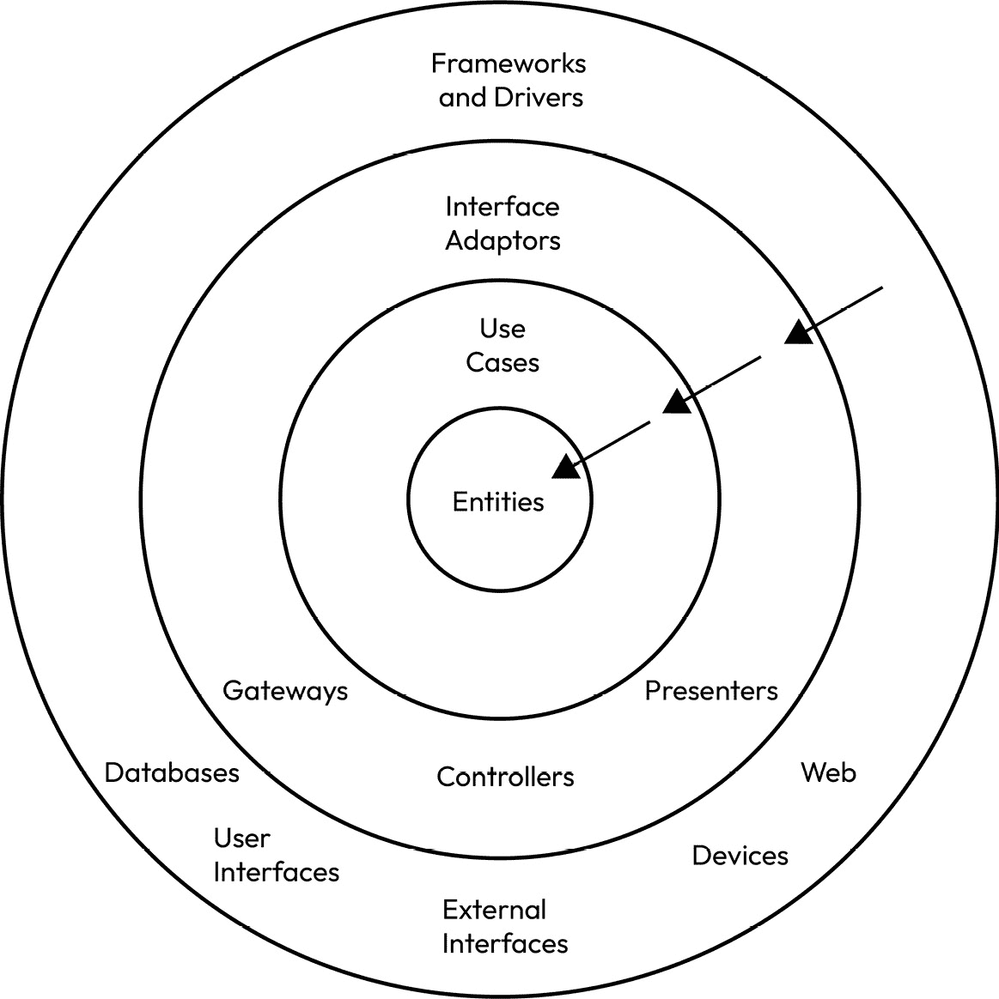
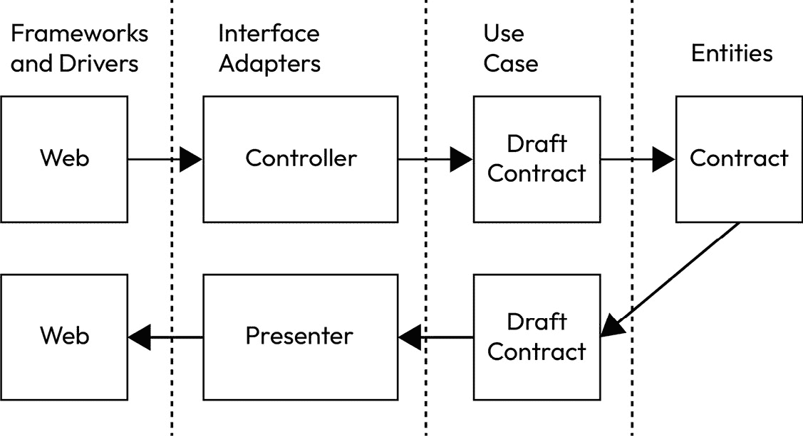
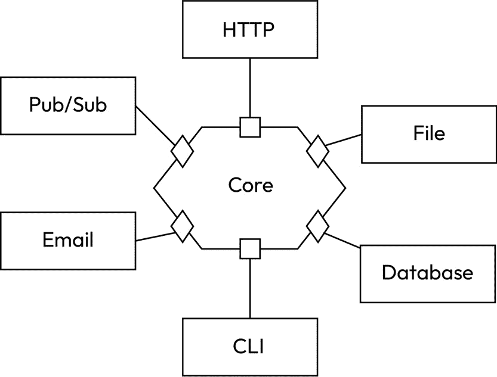
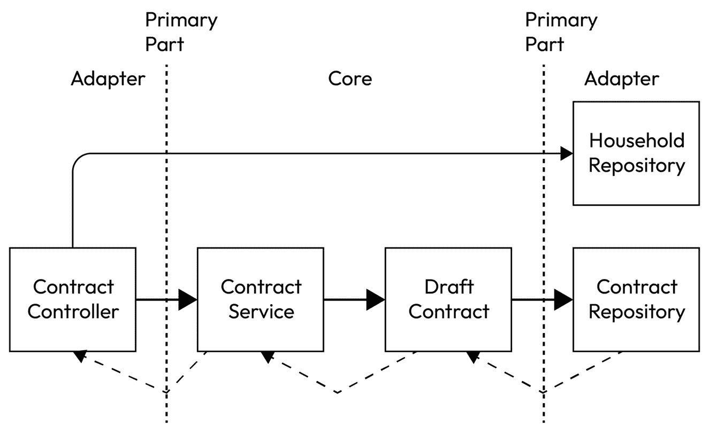
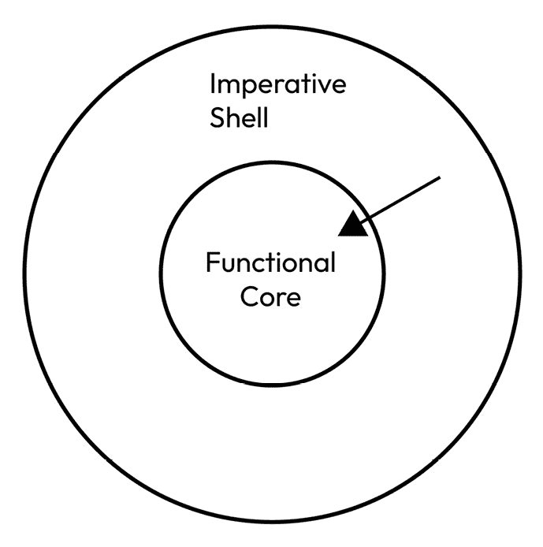
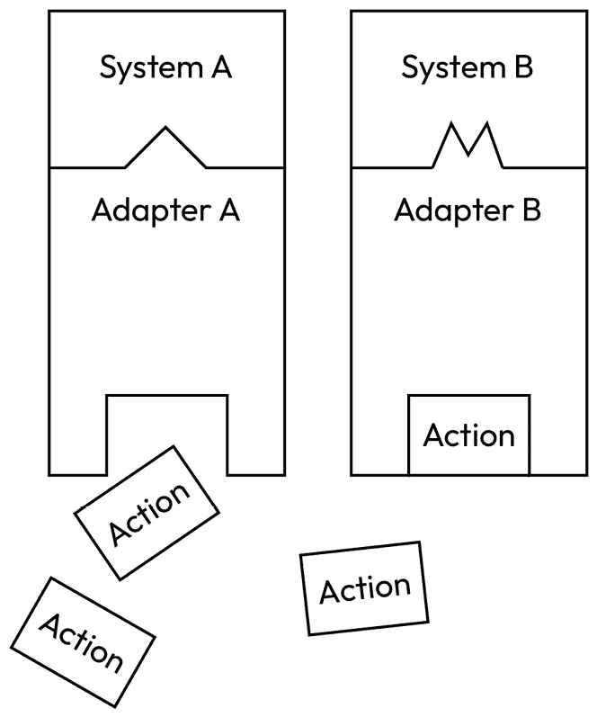

# 模块化和分层架构

前几章反复提到了适当模块化系统以及单独处理关注点的重要性。在本章中，我们将深入研究四种突出的架构模式，这些模式提供了在层次中分离关注点、模块化代码以及在模块之间设置清洁边界的途径。

所有这些模式都将使用相同的真实生活示例来突出这些模式的相似性和差异性。

通过在 Kotlin 中使用代码示例理解这些模式，工程师可以做出明智的选择，创建松散耦合且高度内聚的模块，这些模块是可测试的、灵活的且可维护的。

以下将介绍以下架构模式：

+   清洁架构

+   六边形架构

+   **功能核心，命令** **壳** （**FCIS**）

+   连接模式

最后，我们将简要比较这些模式。我们还将探讨从每个模式中提取元素以创建混合模式以满足需求的可能性。

# 技术要求

您可以在 GitHub 上找到本章使用的代码文件：[`github.com/PacktPublishing/Software-Architecture-with-Kotlin/tree/main/chapter-7`](https://github.com/PacktPublishing/Software-Architecture-with-Kotlin/tree/main/chapter-7%0D)

# 清洁架构

**清洁架构**是一种架构模式，主张将软件系统组织成具有各自责任和依赖的独立层。

术语“清洁架构”由罗伯特·马丁（也称为“Uncle Bob”）在他的 2017 年出版的书籍《Clean Architecture: A Craftsman’s Guide to Software Structure and Design》中引入。这种方法的基础建立在几个较早的架构模式之上：

+   **六边形架构** （也称为**端口和适配器**）由 Alistair Cockburn 提出

+   **洋葱架构**由 Jeffrey Palermo 提出

+   **罗伯特·马丁的尖叫架构**

+   **数据、上下文和交互** （**DCI**）由 James Coplien 和 Trygve Reenskaug 提出

+   **边界控制实体** （**BCE**）由 Ivar Jacobson 提出

清洁架构通过多个层次剖析软件系统，其中每个层次都像洋葱一样一层层包裹，**依赖规则**指出清洁架构的外层始终依赖于内层。



图 7.1 – 清洁架构

由于依赖规则，外层任何变化都不会影响内层。相反，内层任何变化都可能影响外层。

让我们按照从内层到外层的顺序，通过我们在前几章中使用的真实生活示例——村庄家庭之间互相提供服务——来演示这些层次。

## 实体

**实体层**是内层最深的层，不依赖于其他任何层。这一层的设计是为了封装应用程序之间共享的业务规则。

它主要包含数据结构和函数。它很少依赖于外部库。它所依赖的库很可能是那些提供专用数据结构的库。这一层也最不可能发生变化。

在我们的实际例子中，有几个候选者适合托管在实体层中。`Household`、`Contract`、`Service` 以及 `Service` 的子类作为 Kotlin 数据类属于实体层。某些规则和政策也可以存在于实体层中。以下是一些示例规则。

### 规则 1 – 家庭名称不能为空且必须至少有一个成员

此规则通过数据类中的 Kotlin 非空字段语法和在 `init` 函数中的验证强制执行：

```kt
data class Household(
    val name: String,
    val members: List<String>
) {
    init {
        require(members.isNotEmpty()) { "Household must have at least one member" }
    }
}
```

### 规则 2 – 合同必须在指定的状态之一

此规则通过 Kotlin 枚举功能强制执行：

```kt
enum class ContractState {
    DRAFTED,
    UNDER_REVIEW,
    AGREED,
    REJECTED,
    PARTIALLY_EXERCISED,
    FULLY_EXERCISED,
    WITHDRAWN
}
```

### 规则 3 – 合同由两个家庭对象和一个状态组成

此规则通过 Kotlin 数据类强制执行：

```kt
data class Party(
    val household: Household,
    val serviceProvided: String,
    val agreedAt: Instant? = null,
    val completedAt: Instant? = null
)
data class Contract(
    val partyA: Party,
    val partyB: Party,
    val contractState: ContractState
)
```

这些类是纯 Kotlin 编写的，可以在我们之前在*第六章*中定义的四个服务之间共享，即 *家庭服务*、*合同服务*和*通知服务*。可以说，家庭服务不需要 `Contract` 类，这可能是在大多数服务共享实体类但不是所有服务之间的一种权衡。

## 用例

**用例层**位于实体层之上。它旨在封装应用内的业务规则。

它包含使用实体层数据结构和函数的用例。此层的任何更改都不应影响实体层。此层还应保持对框架和技术选择的中立性，例如数据库和消息传递。

在我们的实际例子中，我们有一个用例，即一个家庭使用协商服务与另一个家庭草拟合同：

```kt
fun draftContract(
    householdA: Household,
    householdB: Household,
    serviceProvidedByHouseholdA: String,
    serviceProvidedByHouseholdB: String,
): Contract {
    require(householdA != householdB) { "Parties must be from different households" }
    return Contract(Party(
        householdA,
        serviceProvidedByHouseholdA,
    ), Party(
        householdB,
        serviceProvidedByHouseholdB,
    ), ContractState.DRAFTED)
}
```

`draftContract` 函数验证两个家庭不是同一个。如果一切看起来都很好，它将创建一个包含两个家庭及其提供的服务合同的合同。此外，它将合同状态设置为 `DRAFTED`。此用例层的 `draftContract` 函数使用了实体层中的 `Household`、`Party`、`ContractState` 和 `Contract` 类。

实体层和用例层之间可能存在一定的灵活性。如果实体层中的一个特性被认为仅与一个应用相关，则它可以移动到用例层。同样，如果不同应用中的用例层存在重复的逻辑，则可以将这些逻辑提取到实体层。

## 接口适配器

实体和用例层被视为内部模型，其中数据结构不会暴露在应用程序之外。**接口适配器层**充当内部模型和外部模型之间的翻译。外部模型的典型例子包括关系数据库表、消息负载、HTTP 请求和响应负载、文件格式以及**图形用户界面**（**GUI**）中的视觉表示。

我们已经有一些例子说明代码应该保留在接口适配器层：

+   在*第四章*中介绍的点对点架构展示了在`Contract`对象和用于**用户数据报协议**（**UDP**）传输的二进制负载之间的转换示例代码。

+   在同一章节中，有一个类似的例子，但转换是在一个`Contract`对象和由**OpenAPI**规范定义的**JavaScript 对象表示法**（**JSON**）负载之间进行的，在客户端-服务器架构下。

+   在*第五章*中介绍的三个前端架构风格，MVC、MVP 和 MVVM，在这个层中会有相应的代码，因为它们将内部模型转换为作为 GUI 渲染的视图。

如果应用程序使用查询语言，如 SQL，用于关系数据库，它们也应该保留在接口适配器层。

这些外部模型及其相应的转换不应泄漏到其他层。该层也不应包含业务逻辑。内部模型关注的问题与接口适配器层之外的其他层分离，外部模型关注的问题与接口适配器层之内的其他层分离。

## 框架和驱动器

**框架和驱动器层**位于接口适配器层之外的一层。这是添加外部框架以使其成为应用程序的地方。典型例子包括 HTTP 端点路由配置、数据库连接细节、Kubernetes 配置和依赖关系管理。这个层通常包含比源代码更多的配置文件。

这个层永远不应该包含业务用例。它不知道任何内部模型，因此没有从外部模型转换。这个层专注于支持将代码转换为在运行时可以执行的应用程序的可执行配置。它应该只解决非功能性需求，例如启动时间或冗余。

## 一个使用 Clean 架构的示例用例

让我们以一个用例为例，说明如何使用不同的层。一个家庭被要求提交一个草案合同表单，这是一个位于框架和驱动器层的网页。

然后，家庭将表单作为 JSON 值提交，并在接口适配器层中进入控制器。控制器将表单转换为几个内部对象，例如`Household`对象和作为字符串提供的服务。然后，这些内部对象被传递到用例层的`draftContract`函数：

```kt
fun draftContract(
    householdA: Household,
    householdB: Household,
    serviceProvidedByHouseholdA: String,
    serviceProvidedByHouseholdB: String,
): Contract
```

该函数创建一个来自实体层的`Contract`对象。函数将`Contract`对象传递给接口适配器层中的展示者。展示者将`Contract`对象转换为 JSON 值，以便在框架和驱动层中的网页上渲染。整个过程在*图 7.2*中展示。2*：



图 7.2 – 清洁架构的示例用例

## 清洁架构的好处

清洁架构的核心是依赖规则，而不是四个定义的层。有合理的理由，层的结构可能会有所不同，但依赖规则仍然适用。

总体而言，在清洁架构中，每个层都关注于分离关注点。每个层都致力于解决特定的问题，而其他层不处理：

+   **实体层**：应用程序之间共享的功能需求

+   **用例层**：应用程序内的功能需求

+   **接口适配器层**：内部和外部模型之间的转换

+   **框架和驱动层**：非功能需求

通过清晰的关注点分离，我们现在有了实体层和用例层，它们独立于框架和技术的选择。它们对外部世界一无所知。它们可以在没有**用户界面**（**UIs**）、数据库、消息传递、文件或任何外部表示的情况下进行测试。在这两层执行测试的计算成本很低，因此我们可以承担运行一个全面的测试套件，而不会对构建时间产生重大影响。

由于技术和框架选择仅存在于接口适配器层和框架和驱动层，工程师可以在这些层中对框架进行更改，同时知道实体层和用例层中的功能逻辑保持完整。此外，这些层中可能有测试用例，以确保内部-外部模型转换的正确性，以及这些层中框架配置的正确性。

此外，它还使得技术变更的过渡变得顺畅。可以引入新技术，并与旧技术共存。工程师可以逐步对新技术所需的变更进行提交。可以设置开关，用于在测试目的之间切换新旧技术。一旦团队对变更感到满意，他们就可以切换到新技术，并在之后清理代码。

六边形架构是 Clean Architecture 构建在之上的几种架构模式之一。我们将在下一节中探讨六边形架构。

# 六边形架构

**六边形架构**，也称为**端口和适配器架构**，旨在解决核心业务逻辑与外部依赖（如数据库、UI 和外部系统）之间的耦合问题。

六边形架构是由 Alistair Cockburn 在他的论文《六边形架构》中引入的，该论文于 2005 年发表。

这种架构风格的两个基本概念是**端口**和**适配器**。端口定义了内部世界和外部世界之间的交互，适配器提供了这些交互的实现细节。

六边形架构的概念在*图 7.3*中被可视化为一个六边形。值得注意的是，这种架构允许尽可能多的边，不仅限于名称*六边形*所暗示的六个边。



图 7.3 – 六边形架构的一个示例

我们将在接下来的章节中介绍六边形架构的每个元素。

## 核心组件

六边形架构的核心以纯方式封装了应用程序的业务逻辑，不涉及任何技术和框架。核心通常被称为“领域”。唯一的例外可能是一个提供支持业务逻辑所需数据结构的库。核心不依赖于任何适配器实现。

核心包含表示纯业务逻辑的数据结构和函数。以我们之前提到的家庭交换服务的现实生活例子为例，我们应该在核心中包含以下元素：

+   `HouseHold`、`Party`和`Contract`数据类；`ContractState`枚举类

+   `draftContract`函数

## 端口

**端口**是描述应用程序能做什么的接口。在六边形架构中，有两种类型的端口：

+   **主要端口**：也称为驱动端口，它决定了核心执行操作所需的输入。

+   **次要端口**：也称为驱动端口，它决定了核心为外部世界消费产生的输出。

端口接口应由核心需求定义，而不是外部世界。如果我们从头开始编写一个新应用程序，我们应该从核心开始，定义核心需要的端口接口，即使适配器中没有任何代码。

除了我们在核心中的代码外，我们还需要为外部世界定义端口接口，以便使用核心并消费核心产生的结果。

在现实生活中，如果一个家庭打算起草一份合同，核心会验证请求并生成一份草拟的合同。核心需要一个存储库来存储草拟的合同。

我们需要一个主端口以允许草拟合同。`ContractService`接口对外公开，但其实现保持在核心中：

```kt
 interface ContractService {
    fun draftContract(
        householdA: Household,
        householdB: Household,
        serviceProvidedByHouseholdA: String,
        serviceProvidedByHouseholdB: String,
    ): Contract
}
```

我们还需要一个次要端口以允许草拟合同被持久化。`ContractRepository`接口由适配器实现，以提供如何保存`Contract`对象的详细技术信息：

```kt
interface ContractRepository {
    fun save(contract: Contract)
}
```

主端口接口`ContractService`的实现验证草拟合同，并创建一个具有`DRAFTED`状态的`Contract`对象。然后，将`Contract`对象传递给`ContractRepository`进行保存：

```kt
 class ContractServiceImpl(
    private val contractRepository: ContractRepository,
) : ContractService {
    override fun draftContract(
        householdA: Household,
        householdB: Household,
        serviceProvidedByHouseholdA: String,
        serviceProvidedByHouseholdB: String,
    ): Contract =
        draftContract(
            householdA,
            householdB,
            serviceProvidedByHouseholdA,
            serviceProvidedByHouseholdB,
        ).also { contractRepository.save(it) }
}
```

`ContractServiceImpl`类是核心逻辑的一部分，并保持在核心中。它能够实现业务行为，而无需指定如何保存`Contract`。换句话说，核心专注于业务规则，不受技术选择和框架的约束。

## 适配器

适配器负责将外部模型转换为在核心中定义的内部模型。

适配器使用主端口作为进入核心的入口并运行业务操作。一个适配器至少绑定到一个框架，并且它具有涉及实体的外部表示。

在实际示例中，适配器可以是创建草拟合同的`POST`端点。负载是一个由`DraftContractRequest`类表示的 JSON 值，它可以被转换成一个`Contract`对象：

```kt
data class DraftContractRequest(
    val householdA: String,
    val householdB: String,
    val serviceProvidedByHouseholdA: String,
    val serviceProvidedByHouseholdB: String
)
```

合同服务在本地缓存了`Household`对象，可以通过`HouseholdRepository`存储库从家庭名称进行查找：

```kt
interface HouseholdRepository {
    fun findByName(householdName: String): Household?
}
```

如果找到给定名称的家庭，则函数返回一个`Household`对象。否则，它返回一个`null`值。定义了 REST 控制器类`ContractController`以接受草拟合同的 HTTP 请求。此控制器使用 Spring Boot 作为框架来注册 URI 映射：

```kt
@RestController
@RequestMapping("/contracts/")
class ContractController(
    private val contractService: ContractService,
    private val householdRepository: HouseholdRepository,
) {
```

控制器注入了`ContractService`主端口以进入核心并草拟合同。它还注入了`HouseholdRepository`次要端口以查找用于验证的`Household`对象。

```kt
    @PostMapping(
        value = ["draft"],
        consumes = [MediaType.APPLICATION_JSON_VALUE],
        produces = [MediaType.APPLICATION_JSON_VALUE],
    )
```

控制器定义了一个映射`POST /contracts/draft`，它接受 JSON 值作为输入和输出。

```kt
    fun draftContract(
        @RequestBody request: DraftContractRequest,
    ): ResponseEntity<ContractDto> {
        val householdA = householdRepository.findByName(request.householdA) ?: return ResponseEntity(HttpStatus.NOT_FOUND)
        val householdB = householdRepository.findByName(request.householdB) ?: return ResponseEntity(HttpStatus.NOT_FOUND)
```

控制器将`DraftContractRequest`请求负载转换为 JSON，并验证负载中的家庭名称是否存在。如果任何家庭不存在，则向请求者返回一个`404 (Not Found)` HTTP 状态码。

```kt
         val contract =
            contractService.draftContract(
                householdA,
                householdB,
                request.serviceProvidedByHouseholdA,
                request.serviceProvidedByHouseholdB,
            )
```

控制器调用`ContractNegotiationService`主端口中的`draftContract`函数，该函数验证请求并在存储库中持久化草拟合同。

```kt
         return ResponseEntity(contract.toDto(), HttpStatus.CREATED)
}
```

最后，操作已完成，控制器向请求者返回一个`201 (Created)` HTTP 状态码，并附带草拟合同的详细信息。响应负载由`ContractDto`类表示：

```kt
 data class ContractDto(
    val householdA: String,
    val householdB: String,
    val serviceProvidedByHouseholdA: String,
    val serviceProvidedByHouseholdB: String,
    val contractState: String,
)
```

对于合同从内部模型到外部模型的转换，存在一个`toDto`函数：

```kt
 fun Contract.toDto(): ContractDto =
    ContractDto(
        partyA.household.name,
        partyB.household.name,
        this.partyA.serviceProvided,
        this.partyB.serviceProvided,
        this.contractState.name,
    )
```

在这个例子中，数据被转换并通过六角架构的层级传递，如*图 7.4*所示：



图 7.4 – 六角架构的示例用例

请求负载作为 JSON 值在`ContractController`适配器中通过`HouseholdRepository`二级端口进行验证。然后，负载被转换为核心中定义的`Household`对象。核心运行业务流程，并使用`ContractRepository`二级端口持久化一个有效的草稿`Contract`对象。然后，结果被填充到`ContractController`适配器中。最后，适配器将`Contract`对象转换为响应负载。

## 六角架构的好处

在六角架构的层级中分离源代码确实会使代码库更加复杂。通过在核心和适配器之间分离源代码，它确实带来了一些好处。

核心封装了纯业务规则，而适配器包含所有技术细节。这种分离使得独立测试正确性和技术集成问题变得极其容易。

核心部分包含一个全面的测试套件，确保业务规则按照预期执行，而不涉及任何技术。

另一方面，适配器包含测试用例，以验证所选技术和框架的配置是否按预期工作，而不混合业务规则。

适配器被设计成可以在任何时候被拉出并替换为另一个适配器。适配器专门为选定的技术或框架实现，但端口对此一无所知。例如，如果请求和响应使用消息传递技术，如队列，那么我们可以用不同的适配器替换`ContractController`，例如`DraftContractRequestConsumer`。

如果需要，也可以替换作为适配器的二级端口实现。例如，我们可以有一个`HouseholdRepository`的内存缓存或关系型数据库实现。它们可以共存，并且我们可以使用配置来决定在运行时使用哪一个。每个适配器都可以单独进行测试。

这种关注点的分离使得工程师能够遵循**单一职责原则**（**SRP**），其中核心只有一个改变的理由，每个适配器也只有一个改变的理由。

接下来，我们将介绍一种旨在解决类似挑战的架构模式，但以功能风格实现。

# 功能核心，命令式外壳

**FCIS** 逐渐在函数式编程社区中成为了一种架构模式。它是一种设计原则，主张将不可变的核心业务逻辑与可变方面（如持久化存储或外部系统集成）分离。它将函数式编程原则与无状态函数和不可变数据结构的使用相结合。

无状态函数有时被称为纯函数。它们可以在不引起副作用的情况下执行，换句话说，对于给定的输入，函数总是产生相同的输出。不可变数据结构永远不会改变其内容。

FCIS 原则受到了各种软件开发范式和架构模式的影响。它与六边形架构相似，也促进了将核心逻辑与基础设施关注点分离。

FCIS 有两个主要组成部分。功能核心包含代表业务逻辑和实体的无状态函数和不可变数据结构。

另一方面，命令式外壳是功能核心之外与外部世界交互的层，例如数据库操作、消息传递或用户界面。这一层负责执行系统所需的命令式和可变操作。

FCIS 架构可以在 *图 7.5* 中展示：



图 7.5 – FCIS

我们将在这里介绍这种架构风格的这两个组成部分。

## 函数核心

函数核心专注于核心业务逻辑，仅包含无状态函数和不可变数据结构。

使用我们为家庭交换服务提供的相同真实生活示例，核心中应该有这些元素：

+   `HouseHold`、`Party` 和 `Contract` 数据类以及 `ContractState` 枚举类

+   `draftContract` 函数

在我们的示例中，所有数据类都是不可变的，所有函数都是无状态的。它们通过简单地验证给定输入的函数输出进行隔离测试。

然而，`draftContract` 函数需要从“清洁架构”部分示例中的实现进行微调，因为我们需要构建带有潜在错误的更高阶函数。

要开始这种方法，我们需要定义我们可能遇到的错误。我们首先定义错误的类型：

```kt
enum class ErrorType {
    HOUSEHOLD_NOT_FOUND,
    SAME_HOUSEHOLD_IN_CONTRACT
}
```

我们还需要为错误本身提供一个包装数据类：

```kt
data class Error(
    val reason: String,
    val type: ErrorType
)
```

我们需要能够传达函数可以返回预期的结果，但同时也存在发生错误的可能性。这种新的 `draftContract` 实现使用了 **Arrow** 库中的 `Either` 类来表示这种结果：

Arrow

使用 `Either` 进行错误处理的 `Option` 和结果类型。它还提供了各种函数式编程模式，如函子、单子和应用。Arrow 通过允许开发者以函数式风格表达计算，旨在提高代码的可读性、可维护性和健壮性，使 Kotlin 应用中的复杂数据流和副作用管理变得更加容易。

```kt
 fun draftContract(
    householdA: Household,
    householdB: Household,
    serviceProvidedByHouseholdA: String,
    serviceProvidedByHouseholdB: String,
): Either<Error, Contract> =
```

`draftContract` 函数返回一个 `Either` 对象，其中左侧类型参数始终是潜在的错误，右侧类型参数始终是预期结果：

```kt
    if (householdA.name == householdB.name) {
        Either.Left(
            Error("Parties must be from different households", ErrorType.SAME_HOUSEHOLD_IN_CONTRACT),
        )
    }
```

同样的验证确保合同在两侧没有相同的 `Household`。然而，而不是抛出异常，该函数返回左侧值，这由之前定义的 `Error` 类表示。

```kt
      else {
        Either.Right(
            Contract(
                partyA = Party(householdA, serviceProvidedByHouseholdA),
                partyB = Party(householdB, serviceProvidedByHouseholdB),
                contractState = ContractState.DRAFTED,
            ),
        )
    }
```

如果一切正常，函数返回右侧值，即 `Contract` 对象本身。

## 命令式壳

命令式壳处理与外部世界的必要交互，提供必要的集成点和适配器。

在实际示例中，这包括 `Contract` 对象的持久化和接受 HTTP `POST` 请求以起草合同的 REST 端点控制器。

除了 REST 控制器之外，还有两个涉及命令式操作。第一个是通过名称查找 `Household` 对象，第二个是持久化 `Contract` 对象。我们在这个示例中使用 `typealias` 定义它们：

```kt
typealias HouseholdLookup = (String) -> Household?
typealias ContractPersist = (Contract) -> Either<Error, Contract>
```

除了这两个定义的函数之外，我们还需要一个函数来确保请求中提到的家庭存在：

```kt
fun DraftContractRequest.ensureHouseholdExist(
    householdLookup: HouseholdLookup
): Either<Error, Pair<Household, Household>> {
    val householdARecord = householdLookup(householdA)
    val householdBRecord = householdLookup(householdB)
    return if (householdARecord == null) {
        Either.Left(
            Error("Households not found: $householdA", ErrorType.HOUSEHOLD_NOT_FOUND),
        )
    } else if (householdBRecord == null) {
        Either.Left(
            Error("Households not found: $householdB", ErrorType.HOUSEHOLD_NOT_FOUND),
        )
    } else {
        Either.Right(
            householdARecord to householdBRecord,
        )
    }
}
```

`ensureHouseholdExist` 函数使用 `HouseholdLookup` 检查 `DraftContractRequest` 请求中提到的两个家庭是否存在。如果不存在，`Either` 的左侧将返回以报告家庭未找到错误。如果两个家庭都存在，将返回家庭记录以进行进一步处理。

定义了这个函数后，我们现在可以将它们注入到命令式控制器实现中：

```kt
 @RequestMapping("/contracts/")
class ContractControllerShell(
    private val householdLookup: HouseholdLookup,
    private val contractPersist: ContractPersist,
) {
    @PostMapping(
        value = ["draft"],
        consumes = [MediaType.APPLICATION_JSON_VALUE],
        produces = [MediaType.APPLICATION_JSON_VALUE],
    )
```

`draft` 函数现在充分利用了 `Either` 类，通过 `flatMap` 函数将右侧类型参数折叠：

```kt
    fun draft(
        @RequestBody draftContractRequest: DraftContractRequest,
    ): ResponseEntity<ContractDto> =
        draftContractRequest
            .ensureHouseholdExist(householdLookup)
            .flatMap { (householdA, householdB) ->
                draftContract(
                    householdA,
                    householdB,
                    draftContractRequest.serviceProvidedByHouseholdA,
                    draftContractRequest.serviceProvidedByHouseholdB,
                )
            }.flatMap { contractPersist(it) }
            .flatMap { Either.Right(it.toDto()) }
            .fold(
                { error -> ResponseEntity(error.type.toHttpStatus()) },
                { contractDto -> ResponseEntity(contractDto, HttpStatus.CREATED) },
            )
```

`flatMap` 函数将 `Either` 的结果链式连接，返回左侧的第一个错误或右侧的最终预期结果。前面的代码首先检查并确保请求中提到的两个家庭都存在。接下来的链式调用从 `ensureHouseholdExist` 函数获取家庭记录，并将所有参数传递给 `draftContract` 函数以验证业务规则并返回一个 `DRAFTED` 状态的 `Contract` 对象。

下一个链式调用接收 `DRAFTED` 状态的 `Contract` 对象，并调用 `ContractPersist` 函数以持久化此合同。

在 `Contract` 记录持久化后，它被转换为一个 **数据传输对象**（**DTO**），该对象将被公开并返回给发起请求的 HTTP 客户端。

在链式调用的最后部分，调用`fold`函数来将响应区分回 HTTP 客户端。成功的结果作为一个`Contract`对象，右侧，通过`toDto`函数被转换为`ContractDto`响应负载。返回一个包含响应负载的`201 (Created)` HTTP 状态码。

所有可能的错误都被折叠到左侧，并且它们被映射到 HTTP 状态码，如下所示：

```kt
fun ErrorType.toHttpStatus(): HttpStatus = when (this) {
    ErrorType.HOUSEHOLD_NOT_FOUND -> HttpStatus.NOT_FOUND
    ErrorType.SAME_HOUSEHOLD_IN_CONTRACT -> HttpStatus.BAD_REQUEST
}
```

## 函数式核心和命令式壳层的优势

FCIS 将代码分为两部分。

函数式核心是一个纯函数式区域，只包含无状态函数和不可变数据结构，这些可以很容易地进行测试和推理。没有状态管理和副作用。每个测试都是关于验证给定输入值的功能输出。

函数式核心也是技术选择自由的。它使函数式核心只关注业务问题。如果我们决定使用其他技术来接收请求和生成响应，则无需更改代码。这使得核心逻辑可靠、可适应和可维护。

唯一的例外，正如我们在示例中所展示的，是使用从 Arrow 库中引入的`Either`类，以表达一个操作可能失败并返回不同对象的情况。

这鼓励工程师组织代码以符合 SRP，其中每个函数只有一个改变的理由。尽管如此，我们仍然需要按照最佳实践组织我们的函数以符合 SRP。例如，每个函数需要小、可重用、无状态，并且只有一个目的。

将函数式核心与命令式壳层分离，可以更容易地进化核心逻辑，而无需与外部系统或实现细节紧密耦合。这也允许有更大的灵活性和可维护性，从而产生更健壮和灵活的软件架构。

我们接下来要讨论的下一个架构模式侧重于适应远程 API 调用。

# 连接模式

连接模式最初由 David Denton 在他的技术文章《Smash your Adapter Monolith with the Connect pattern》中提出，该文章于 2011 年发布在互联网上。

然而，这个模式与之前讨论的三个架构模式有不同的重点。它专门针对远程系统集成。它的目标是提供一个可测试和可扩展的方法来封装远程 API 交互。

连接模式的概念在*图 7.6*中得到了说明：



图 7.6 – 连接模式

集成操作被抽象为 Action。它理解如何生成请求以及如何将响应转换为一个内部对象。然而，它不知道与外部系统的连接细节。

相反，适配器是为了适应特定的系统而精心制作的。它可以在将实际请求-响应交换委托给操作的同时，与外部系统建立连接。

## 操作

**操作**负责将请求从内部格式转换为外部格式，并将响应从外部格式转换为内部格式。使用相同的现实生活例子，即村民交换服务，我们需要从家庭服务中获取一些支持函数，其中之一就是通过给定的家庭名称获取家庭，这个操作非常简单。

与家庭服务通信相关的操作定义如下：

```kt
interface HouseholdApiAction<R> {
    fun toRequest(): Request
    fun fromResponse(response: Response): R
}
```

只有两个简单的函数。`toRequest`函数生成一个外部格式请求，用于与家庭服务通信。`fromResponse`函数将家庭服务响应转换为内部对象。类型变量`R`对于给定的操作是特定的，并且可能不同。

通过给定的家庭名称获得家庭名称的操作定义如下：

```kt
val householdLens = Body.auto<Household>().toLens()
data class GetHousehold(
    val householdName: String,
) : HouseholdApiAction<Household> {
    override fun toRequest(): Request = Request(Method.GET, "/households/$householdName")
    override fun fromResponse(response: Response): Household = householdLens(response)
}
```

`GetHousehold`类封装了生成发送到家庭服务的 HTTP 请求所需的详细信息。家庭服务响应通过使用`Household`数据类转换为内部数据类，`Household`数据类在此定义：

```kt
data class Household(
    val name: String,
    val emailAddress: String,
)
```

到目前为止，还没有与家庭服务的连接细节，但适配器将涵盖这一点。

## 适配器

适配器类提供了一种将连接细节和机制抽象到外部系统的方式。`Household` API 在此定义：

```kt
interface HouseholdApi {
    operator fun <R : Any> invoke(action: HouseholdApiAction<R>): R
    companion object
}
```

`HouseholdApi`接口充当特定操作的包装和处理程序。伴随对象被定义为扩展函数的占位符，稍后将会介绍。与本地家庭服务通信的 HTTP 实现如下：

```kt
val token = "fakeToken"
fun HouseholdApi.Companion.Http(client: HttpHandler) =
    object : HouseholdApi {
        private val http =
 SetBaseUriFrom(Uri.of("http://localhost:9000"))
                .then(
                    Filter { next -> { next(it.header("Authorization", "Bearer $token")) } },
                ).then(client)
        override fun <R : Any> invoke(action: HouseholdApiAction<R>) = action.fromResponse(http(action.toRequest()))
    }
```

这个`Household` API 实现是一个匿名内部类，将家庭服务的宿主设置为 localhost，并设置授权令牌。它假定所有`HouseholdAction`都会使用相同的连接设置。

此外，定义了一个扩展函数来使使用代码更整洁：

```kt
fun HouseholdApi.getHousehold(householdName: String) = invoke(GetHousehold(householdName))
```

代码使用示例将在下一节中介绍。

## 使用

在设置好操作和适配器后，使用家庭服务通过给定的名称获取家庭只需要三行代码：

```kt
val app: HttpHandler =
    routes(
        "/households/{name}" bind GET to { request ->
            val householdName = request.path("name")!!.toString()
            Response(OK).with(householdLens of Household(name = householdName, emailAddress = "same.address@domain.com"))
        },
    )
fun main() {
    val householdApi = HouseholdApi.Http(JavaHttpClient())
    val household: Household = householdApi.getHousehold("Whittington")
    println(household)
}
```

变量 app 是`HttpHandler`，它定义了 URI 路由。在这个例子中，只定义了一个`GET`端点，以及一个返回给 HTTP 客户端的预定义响应。

在`main`函数中，创建了一个 HTTP 客户端实现，用于创建`HouseholdApi`的 HTTP 实现。然后，使用扩展函数获取名为*Whittington*的家庭。内部，创建了一个`GetHousehold`操作并将其传递给`HouseholdApi`，启动 API 通信。然而，从使用角度来看，返回的是内部`Household`数据类的对象。

## 测试用例

Connect 模式的一个优势是更好的可测试性。每个 Action 和与 Household Service 一起的 API 都可以单独测试。这是从 Household API 获取家庭的测试用例：

```kt
    @Test
    fun `Get the household from Household API`() {
        assertEquals(
            Response(OK)
                .contentType(ContentType.APPLICATION_JSON)
                .body("{\"name\":\"Whittington\",\"emailAddress\":\"same.address@domain.com\"}"),
            app(Request(GET, "/households/Whittington")),
        )
    }
```

当有更多 Action 时，会有更多的测试用例，但每个测试用例都是隔离的。换句话说，Action 和测试用例的扩展不会创建具有许多功能的接口。

## 优势

Connect 模式的重大优势在于可扩展性和可测试性。考虑到通常需要使用外部系统的多个 API，工程师们往往最终会得到一个具有许多功能的单一外部系统接口。使用 Connect 模式，每个 API 调用都由一个 Action 表示，从而将大接口分解成更小的部分。

此模式自然符合 SRP（单一职责原则），因为 Action 只代表一个 API 调用。此外，每个 Action 都有自己的专用测试用例，这比测试具有许多功能的接口要简单得多。

适配器将连接到远程系统的细节关注点抽象化，因此 Action 类可以专注于消息格式和交互。

Kotlin 扩展函数的使用使代码使用更加流畅、整洁和简洁。许多细节都被隐藏并封装在 Action 和适配器类中。

尽管示例使用了 HTTP 和 Kotlin，但 Connect 模式本身并不局限于它们。

此模式在用于与暴露单个接口中许多功能的单体应用程序通信时特别有用。

接下来，我们将简要比较这些架构风格。

# 架构风格比较

我们在本章中讨论的前三种架构风格有许多相似之处。它们都旨在解决相同的问题；差异在于方法。

同时，Connect 模式专注于远程系统交互的可测试性和可扩展性。

## 依赖框架和技术

传统架构通常将业务逻辑与特定的框架、库或技术紧密耦合。这使得在没有对代码库进行广泛更改的情况下切换或升级这些组件变得困难。

清洁架构提出实体层用于企业业务规则，用例层用于特定于应用的业务规则。两者都对框架和技术选择保持中立。

六角架构提出将核心作为业务逻辑的中心，同时不受框架和技术选择的限制。

FCIS（功能核心信息系统）提出业务逻辑的功能核心，但使用无状态函数和不可变数据结构。

Connect 模式使用 Action 作为单个操作和与远程系统交互的传输细节的集成点，并使用适配器。

## 可测试性

在传统架构中，由于依赖于外部系统、数据库或 UI 框架，测试核心业务逻辑可能具有挑战性。

测试一个与技术选择耦合的函数通常需要大量的设置和拆除资源，如果背后有异步过程，则更糟。这意味着需要工程师付出更多努力才能使测试工作，相同时间内可以编写的测试较少，测试套件运行时间更长，并且可能存在偶尔失败的不可靠测试，这是由于涉及的一些异步过程。任何并行执行的测试都可能使测试套件更加不可靠。

清洁架构为仅业务逻辑提供专用层（实体和用例层），可以在不涉及任何技术选择的情况下单独测试。接口适配器层专注于内部和外部模型转换，也可以独立测试。框架和驱动器层的配置可以在不涉及业务规则的情况下进行测试。

六边形架构倡导核心作为一个技术中立区域，在这里可以轻松编写单元测试，无需复杂的设置或模拟大量的外部组件。每个适配器都可以单独测试，而不涉及任何业务逻辑。

FCIS 建议将业务逻辑仅作为无状态函数和不可变数据结构放在功能核心中。这通过简单验证由输入给出的输出结果来减少对功能核心的测试。通过在功能核心中交换低阶函数，命令式外壳也可以轻松测试，因此，系统的不可变和可变部分可以单独测试。

连接模式将单体应用程序的大远程接口分解为每个 API 调用一个操作。这减少了大量的开销、过度的模拟、测试双倍或接口的存根。在隔离状态下测试 API 调用的能力提高了可测试性，并使得远程 API 的使用扩展变得容易。

## 可维护性

随着时间的推移，应用程序往往会发展和变化，通常需要修改核心业务逻辑或框架的选择。在传统架构中，进行更改可能存在风险，因为这些修改可能在整个系统中产生意外的后果。更新业务逻辑可能与已弃用的库交织在一起，最终两者都需要进行更改。

清洁架构、六边形架构和 FCIS 在核心业务逻辑和周围基础设施之间提供了清晰的分离，这使得在不影响核心业务规则的情况下修改或扩展应用程序变得更容易。

连接模式非常轻量级，动作之间没有重叠。连接性和消息交互关注点被分离到适配器和动作类中，这些类的维护简单，代码更改小。

## 灵活性和适应性

应用程序通常需要与各种外部资源集成，例如文件、数据库、第三方服务或用户界面。在传统的架构中，这些集成深深嵌入到应用程序代码中，使得切换或修改这些集成变得具有挑战性。

清洁架构促进接口适配器和框架以及驱动程序层的包含外部依赖。这允许更多的灵活性和适应性，因为业务规则与特定的技术或协议解耦。

六边形架构促进使用端口和适配器，这些作为核心逻辑和外部系统之间的接口和适配器。不同的框架选择会导致适配器的单独实现，但端口接口保持不变。通过交换相同接口的实现，改变技术或协议变得容易。

FCIS 使用命令式外壳层来处理与外部世界的所有交互。任何技术或协议的变化只需要在命令式外壳层进行更改。通过高级的小函数重用，只需进行微小的更改即可适应新技术。

连接模式允许工程师在需要与新的远程系统集成时实现新的适配器。如果需要适应新的通信协议，则需要实现新的适配器和新的动作，但无需更新当前代码。

# 何时使用哪种架构风格

清洁架构、六边形架构和 FCIS 在许多方面有相似之处，工程师可能难以为他们的应用程序选择。这些三种架构风格的层可以大致映射如下：

| **清洁架构** | **六边形架构** | **FCIS** |
| --- | --- | --- |
| **实体** | 共享/通用库 | 共享/通用库 |
| **用例** | 核心/领域/端口 | 核心 |
| **接口适配器** | 适配器 | 外壳 |
| **框架和驱动程序** | 适配器 | 外壳 |

表 7.1 – 三种架构风格之间的近似映射

如果我们接受这种观点，即三种风格可以松散地映射，那么选择将变成工程师之间的惯例。以下是一些供参考的意见，但它们并非严格规则：

+   拥有更多函数式编程经验的工程师会更倾向于 FCIS。

+   清洁架构为单体应用程序或拥有大型源代码库的系统提供了更好的支持。话虽如此，清洁架构绝对可以支持较小的代码库或微服务。

+   六边形架构在范围和规模方面适合微服务应用程序。

在创建混合风格方面有很多空间。例如，一个使用六边形架构的应用程序可以借鉴 FCIS 的概念，因此所有端口和适配器基本上是使用 Kotlin 操作符重载功能实现的函数：

```kt
class DummyContractPersist: ContractPersist {
    override fun invoke(p1: Contract): Either<Error, Contract> {
```

`ContractPersist`是我们用于 FCIS 的类型别名，我们可以定义一个实现类型别名接口并提供具有操作符重载的`invoke`函数的类。因此，在实践中，调用者可以跳过`invoke`关键字，将其视为一个函数，如下所示：

```kt
    val persist = DummyContractPersist()
    val result = persist(contract)
```

因此，这个概念可以扩展到端口接口，其中它们只是具有一个函数的唯一类型别名或接口。

Connect 模式是一种集成模式，它解决的问题不同于本章中涵盖的其他三种风格。当需要在外部系统中执行具有业务意义的相同操作，但希望将技术集成细节与业务逻辑解耦时，可以使用 Connect 模式。

# 与贫血领域模型相关

**贫血领域模型**（ADM）是一种有争议的架构风格，一些人将其归类为反模式，而另一些人发现在某些情况下它是有用的。在 ADM 中，核心或用例层主要包含数据结构，几乎没有或没有业务行为。

本章对 ADM 的深入讨论超出了范围，然而，如果一个团队选择使用 ADM，那么不建议将其与 Clean Architecture、六边形架构或 FCIS 结合使用。

主要原因是这些架构旨在将业务行为保留在核心或用例层；换句话说，它们旨在仅与**丰富领域模型**（RDM）一起工作。应用程序采用本章中涵盖的 Clean Architecture、六边形架构或 FCIS 的层不会获得任何好处。

ADM 的使用

虽然 AD（贫血领域模型）可能被一些人视为反模式，但缺乏业务行为可能意味着应用程序的目标仅仅是数据处理和基础设施管道。例如，一个 AD 应用程序可能负责接收一个大文件，将文件中的数据分割成块，并并行处理每个块。该应用程序专注于数据操作和可扩展性，同时，处理后的数据被包含实际与数据相关的业务行为的下游应用程序读取。另一个例子可能是一个消费外部消息头并将其转发到相应内部主题以进行进一步处理的应用程序。

# 按层组织源代码

按层组织源代码有两种流行的选择。在 Kotlin 中，第一种方法是将文件放入它们所属的包中作为层。

在我们使用的实际生活示例中，我们可以在每个架构风格中拥有以下包：

+   **Clean Architecture**：

    ```kt
    org.example.service.negotiation.entity
    org.example.service.negotiation.usecase
    org.example.service.negotiation.interface
    org.example.service.negotiation.framework
    org.example.service.negotiation.framework.rest
    ```

+   **六边形架构**：

    ```kt
    org.example.service.negotiation.core
    org.example.service.negotiation.core.port
    org.example.service.negotiation.adapter
    org.example.service.negotiation.adapter.rest
    ```

+   **FCIS**：

    ```kt
    org.example.service.negotiation.core
    org.example.service.negotiation.shell
    org.example.service.negotiation.shell.rest
    ```

强制执行分层架构，其中只有外层可以使用内层，反之则不行，可以通过使用测试用例并作为成功构建的一部分来轻松实现。

这是一个强制执行 FCIS 层依赖的测试用例示例，使用 **ArchUnit** 作为测试驱动程序：

```kt
    val classes = ClassFileImporter().importPackages("fcis")
    @Test
    fun `layer dependencies are_respected`() {
        layeredArchitecture()
            .consideringAllDependencies()
            .layer("Imperative Shell")
            .definedBy("fcis.shell..")
            .layer("Functional Core")
            .definedBy("fcis.core..")
            .whereLayer("Imperative Shell")
            .mayNotBeAccessedByAnyLayer()
            .whereLayer("Functional Core")
            .mayOnlyBeAccessedByLayers("Imperative Shell")
            .check(classes)
    }
```

第二种方法是使用构建框架内的源代码模块，例如 **Gradle** 或 **Maven**。我们为应用程序创建多模块项目，并且外层模块声明对内层模块的依赖。

例如，协商服务的命令行外壳可以在命令行模块的 Gradle Kotlin 脚本中声明显式依赖。

```kt
implementation("com.example:service-negotiation-core")
```

重要的是要注意，这种方法比包方法更重量级，因为它创建了内层的实际工件。

然而，Connect 模式是一个模块化但非分层架构，因此没有必要强制执行层依赖。

# 摘要

在本章中，我们讨论了三种旨在解决传统架构中相同问题的架构风格，其中业务逻辑和技术选择紧密耦合。这三个架构被深入探讨：清洁架构、六边形架构和 FCIS。我们还讨论了 Connect 模式，该模式侧重于分解大型远程接口以与远程系统集成。

我们使用我们的真实生活示例说明了每种架构风格，以及每种风格如何在代码中实现。

我们还比较了四种架构风格在解决传统架构问题方面的方法。我们简要介绍了在分层架构下如何在存储库中组织代码。

我们提到，在六边形架构中，核心有时被称为 *领域*。然而，"领域" 这个术语本身值得深入讨论。在下一章中，我们将探讨与领域相关的概念，其中一个共同的主题是 **领域驱动** **开发**（**DDD**）。
