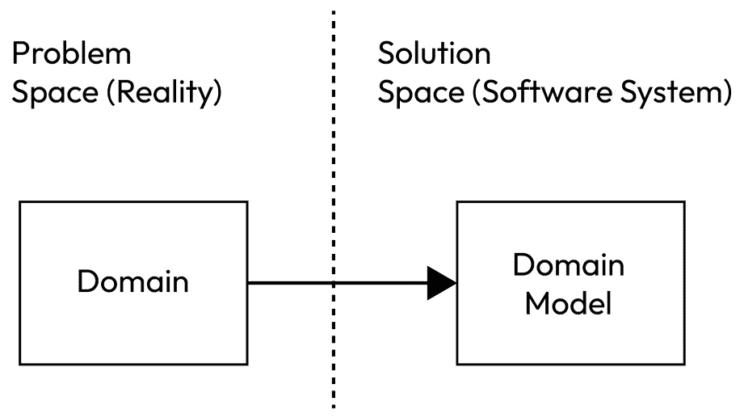

# 第八章：领域驱动设计 (DDD)

工程师通常不是业务领域的专家。然而，他们负责构建代表现实世界领域的复杂应用程序。传统上，软件架构往往难以有效地表达业务领域的复杂性和微妙之处，导致系统难以理解、维护和演进。这就是领域驱动设计（**DDD**）发挥作用的地方。

在 *第七章* 中，我们介绍了围绕在应用程序中为业务逻辑设置专用层的三种架构风格。DDD 的目标是帮助工程师识别属于相应领域及其边界的业务行为，以便它们可以在应用程序的核心、领域或用例层中实现。

本章探讨了 DDD 的强大软件设计方法，该方法围绕软件设计过程中的业务领域。它侧重于捕捉和表达核心业务概念、规则和行为。

首先，我们将深入探讨 DDD 的理论原则和实际实施策略，并通过实际案例进行说明。然后，我们将探讨如何使用这种方法构建与业务需求紧密对齐的、可维护的、可扩展和灵活的软件系统。

通过应用 DDD，我们可以更好地理解领域，并在领域专家和软件开发者之间建立一个共同语言。

在本章中，我们将涵盖以下主题：

+   DDD 的基础

+   DDD 中的战略和战术设计

+   DDD 中的建模活动

# 技术要求

您可以在 GitHub 上找到本章使用的代码文件：[`github.com/Packt Publishing/Software-Architecture-with-Kotlin/tree/main/chapter-8`](https://github.com/PacktPublishing/Software-Architecture-with-Kotlin/tree/main/chapter-8%0D)

# DDD 的基础

DDD 的目标是缩小软件技术实现与它所服务的业务领域之间的差距。DDD 侧重于构建准确模型核心概念、业务规则和行为的软件，以便软件系统与业务需求紧密对齐。这使其具有价值、可维护、灵活和可持续性。

DDD 强调了问题空间和解决方案空间之间的区别：

+   **问题空间**：问题空间是业务现实——即业务运营的当前状况

+   **解决方案空间**：解决方案空间是我们拥有的或将要构建的软件系统，用于解决问题空间中的特定业务案例

问题空间的主导部分是**领域**，它代表特定的业务用例和操作。解决方案空间提供了一种建模领域以解决给定业务用例的方法，因此得名**领域模型**。这种关系在*图 8*.*1*中得到了说明：



图 8.1 – 问题空间和解决方案空间

领域模型抽象和选择领域中的某些元素，以便在它之上构建软件系统。这种抽象和选择的结果在领域模型中永远不会是 100%正确和完整的。这正是统计学家 *George Box* 在 1976 年发表在 *《美国统计协会杂志》* 上的论文中所写的：

“*所有模型都是错误的，但其中一些是有用的。*”

在 DDD 中，领域模型的目标不是完整和准确；相反，它们的目标是在特定的业务环境中是有用的。

DDD 鼓励工程师深入了解他们正在为构建软件的领域。有领域专家了解他们需要什么软件来完成工作。这对于最初使用手动流程或纸质文件来运营业务的领域尤其如此。软件系统通常被视为业务运营的自动化工具。拥有运营业务的领域专家为工程师在构建相应的软件中带来了很多价值。

DDD 包含两种设计方法：

+   **战略设计**：这侧重于更大业务领域内多个连贯区域（称为边界上下文）之间的整体结构和组织。它通过定义它们的协作，致力于在边界上下文之间实现灵活和松散耦合的系统。

+   **战术设计**：这指的是使构建有用的领域模型更简单的模式、工具和实践。当我们有复杂的业务逻辑要建模或未来可能引入复杂性时，我们使用战术设计。

需要指出的是，DDD 与选择的技术和框架无关。对业务领域的建模纯粹是软件系统应该构建的方式，而不是使用的工具。

# DDD – 战略设计

建议从战略设计开始 DDD，在深入到更细粒度的战术设计之前建立整体图景。第一步被称为**通用语言**。

## 通用语言

在工程师和领域专家之间使用一种共同的语言对于软件系统的成功至关重要。业务领域通常涉及许多行业术语、专业概念和微妙规则。然而，并非所有这些都可以应用于软件系统的范围。另一方面，工程涉及许多技术术语、方法和最佳实践，所有这些对于给定的软件系统都是必需的。

**通用语言**是由*埃里克·埃文斯*在他的 2004 年出版的书籍《领域驱动设计：软件核心的复杂性处理》中引入的术语。它作为工程师和领域专家之间共享的业务领域共同理解和心智模型。它旨在使用一致、明确和精确的语言来消除误解和歧义。它是一个持续、协作的努力，旨在为有效的和有意义的沟通建立一个共同的基础。通用语言是领域和领域模型之间的共同语言。

通用语言也是文档和系统知识库的一种形式。一旦建立，新团队成员可以快速理解领域和现有的代码库。它还促进了团队和利益相关者之间的知识转移，从而促进了更好的协作，并降低了信息丢失的风险。

通用语言是领域专家语言和工程语言的重叠部分，如图*图 8.2*所示，它暗示了一种相互理解：


图 8.2 – DDD 中的通用语言

通用语言的好处以各种形式体现：

+   **术语表**：术语表包含术语和概念及其定义，可供每个人阅读和学习业务领域。每个术语都经过参与开发过程的所有人的审查和同意。理想情况下，应该有一个流程，可以提交、审查、批准和跟踪更改，例如在**GitHub**这样的可审计仓库中。

+   **文档**：所有与业务领域相关的文档都应使用术语表中定义的相同术语和概念。这些文档包括用户手册、操作说明、项目计划、架构设计文档、图表、用户故事、屏幕原型、演示文稿、API 文档等。任何新的术语和概念都应添加到术语表中。

+   **私有大型语言模块（LLMs）**：业务领域知识，包括术语、概念、规则和流程，可以用来训练 LLM，使其能够回答问题、完成文本、生成对话，甚至成为客户服务机器人的组成部分。然而，这确实需要精心设计提供给模型的输入，以生成期望的输出或响应。这个过程被称为**提示工程**，但超出了本书的范围。OpenAI 的文档有一个关于提示工程的章节，提供了实用的指导：https://platform.openai.com/docs/guides/prompt-engineering。

+   **源代码**：源文件、函数、接口、类甚至变量的命名应使用在词汇表中定义的相同术语。消息负载、数据库表和字段、日志消息和错误消息也应在使用时使用这些术语和概念。这些术语在代码库的每个元素中都被使用。对于软件系统，我们将其定义为通用语言的是在业务域中随处可见的相同语言。

## 子域

**子域**是业务域中的一个独立区域，它有自己的概念集和业务规则。子域中使用的语言是通用语言的组成部分，子域内的相应概念自然形成自己的群体。

子域有助于将大型域的复杂性分解为更小、更易于管理的部分，使团队能够专注于理解和解决每个子域的独特需求和挑战。子域属于问题空间，并且它们可能并不总是与解决方案空间中的一部分一一对应。

子域可以分为三个组：

+   **核心域**：核心域是业务运营的核心。没有它们，就没有问题需要解决，也就没有理由构建软件系统。核心子域是组织区分竞争对手的最关键部分，它们也拥有最复杂的业务案例。

+   **支持子域**：支持子域提供辅助工具和功能，这些工具和功能补充并加速核心子域，但它们不是业务的主要专业领域。它们通常是众所周知的能力，相应的解决方案可以在市场上找到或外包。它们对业务仍然相关，但并不提供显著的竞争优势。

+   **通用子域**：通用子域指的是不特定于业务的常见问题。它们相应的解决方案是现成的商业产品。它们对于运行业务运营至关重要，但它们并不直接贡献于业务的核心理念。

通过识别和建模子域，领域驱动设计（DDD）使得开发出凝聚、模块化和松散耦合的软件系统成为可能。这引出了解决方案空间中的一个重要概念，即有界上下文。

## 有界上下文

在*第六章*中，我们提到了识别高度凝聚的功能并将它们分组为独立的可部署工件的重要性，这样我们就不会最终构建出一个庞大且难以维护的单体应用，这种应用难以理解，几乎无法优化。系统可以被分解为有界上下文。

**有界上下文**是解决方案空间中的一个概念。它代表业务域的一个连贯区域。它有自己的范围、责任和规则，这些规则与其他有界上下文不重叠。一个有界上下文应该有一个明确的目的和一个清晰的边界。一个定义良好的有界上下文可以清楚地回答一个术语或规则是否属于上下文内部或外部。在有界上下文中，每个构建块都有特定的语义和目的。

它移除了一些复杂业务域的部分，并将它们转化为更小、更易于管理的单元。最终，足够数量的有界上下文的总和构成了整体域模型，从而消除了它成为一个单体应用的机会。

一个有界上下文应该只代表一个子域，但一个子域模型可能需要另一子域模型的一小部分才能正常工作。

此外，一个有界上下文应该有自己的源代码仓库。它有自己的数据模式和数据，这些数据仅通过 API 文档中定义的外部表示与其他有界上下文共享。它还应拥有专门的部署工件。它们可以独立发布，而不依赖于或影响其他有界上下文。它们应该有自己的发布周期。

有界上下文应由一个团队拥有。团队在选择框架和开发方法上拥有完全的自主权。在*第一章*中，我们提到了**康威定律**，该定律指出，一个组织通常会生产出反映组织内部结构的软件系统。团队不应受组织结构的限制，而应根据在 DDD 过程中发现的有界上下文进行重组。

## 上下文映射

因为有界上下文分解了一个系统，所以它们需要协作以使系统能够运行并实现整体目标。**上下文映射**是一种可以用来识别有界上下文之间关系和交互的技术。

这里是这个关系中的常见模式：

+   **合作**：两个或更多有界上下文建立合作关系。这包括建立紧密合作、共享理解和联合决策，以解决特定的业务需求。即使有界上下文有自己的目标，但它们的目标是相互连接以帮助解决特定问题。因此，它们共同成功或失败：


图 8.3 – 合作

+   **共享内核**：两个有界上下文共享它们模型或代码的子集。它们可能共享相同的数据模式、源代码模块或作为工件的可编译代码。然而，在两个有界上下文之间共享数据模式或原始源代码被视为反模式。然而，两个有界上下文依赖于同一被视为共享库的工件是可以接受的：


图 8.4 – 共享内核

+   **客户-供应商**：上游边界上下文提供数据，而下游边界上下文消费这些数据。客户和供应商合作并就数据协议达成一致：


图 8.5 – 客户-供应商

+   **一致者**：上游边界上下文提供数据并规定数据协议。下游边界上下文遵守该协议并消费这些数据。上游边界上下文可以是外部系统或使用行业标准协议，这使得它无法适应下游边界上下文：


图 8.6 – 一致者

+   **反腐败层**：上游边界上下文提供数据并主导数据协议。然而，下游边界上下文并不愿意遵守该协议。相反，下游边界上下文构建一个反腐败层来消费数据并将其转换为它所需的结构：


图 8.7 – 反腐败层

有几种情况下，下游边界上下文决定不遵守：

+   上游边界上下文使用的数据协议不方便，这使得集成和消费数据变得困难

+   上游边界上下文不可靠，经常变化，或偶尔带来破坏性的变更，下游边界上下文试图最小化这些变更，以便减少上游边界上下文带来的任何问题的影响

+   上游边界上下文中使用的数据协议将冲突或不相关的数据带到下游边界上下文

+   下游边界上下文反映了核心领域，这为不依赖外国数据协议提供了理由

+   **分道扬镳**：由于它们决定分道扬镳，边界上下文之间没有交互。这可能是因为集成成本过高、不可持续或不可能。以下是一些已经发生这种情况的示例场景：

    +   每个边界上下文的团队在协作和达成一致方面都遇到了困难。这可能是由于涉及遗留系统或仅仅是组织政治问题。而不是让漫长的谈判过程拖延下去，边界上下文发现复制其自身空间中的逻辑更容易且更快。

    +   边界上下文之间的模型差异太大，无法使用一致模式，或者与在其自身边界上下文中实现定制逻辑相比，使用反腐败层模式成本太高。上游边界上下文可能只提供下游边界上下文所需的部分数据，而下游边界上下文可以复制部分逻辑，但创建一个适合其特定目的的完整模型。

    +   通常，在通用子领域中，与在各自的边界上下文中复制逻辑相比，协作的价值很小。可能某些库被用来生成数据，这就是为什么集成成本不合理的理由。

+   **开放式主机服务**：一个边界上下文定义并公开了一个公共 API，其他边界上下文可以使用它来扩展其功能。公共 API 有意与内部模型解耦，以便两者可以独立演进。边界上下文的内部模型也保持私有：


图 8.8 – 开放式主机服务

+   **发布语言**：发布语言侧重于在边界上下文中建立共享语言和术语表。发布语言并不旨在符合其通用语言，尽管如果通用语言中已经存在合适的术语，则无需重新发明词汇。

    发布语言旨在暴露一个方便消费边界上下文的协议。它用一种通常与任何编程语言无关的集成导向语言表达。此外，每个边界上下文都应该能够将发布语言与相应的内部模型之间进行转换。

    发布语言确保了对领域概念的统一理解，并促进了边界上下文之间的沟通。

    发布语言可以定义在许多知名格式中，例如**OpenAPI**、**Avro**、**Protobuf**、固定长度值和逗号分隔值。

## 将战略设计应用于实际案例

到目前为止，我们已经概述了在领域驱动设计中战略设计所使用的技巧和方法。现在，我们将把它们应用到本书中一直使用的相同实际案例中。

### 第 1 步 – 业务问题摘要

让我们回顾一下家庭交换服务的实际案例。团队设法找到了一位开始在该村庄交换服务的资深女士。团队对她进行了采访，并记录了他们的笔记。以下是经过她作为领域专家验证和澄清的摘要：

“我们是一个紧密团结的社区，村民经常交换服务以支持彼此。村庄由各种家庭组成，每个家庭都有其独特的技能、才能和需求。家庭认识到，通过提供他们的服务，他们可以帮助彼此并创建一个更强大的社区。

在这个村庄里，有专门从事不同领域的家庭，如木工、农业、烹饪和育儿。例如，惠丁顿先生是一位技艺高超的木匠，他制作和修理家具。当巴克太太需要一张新的餐桌时，她找到惠丁顿先生请求他的服务。

作为惠丁顿先生木工工作的回报，巴克太太全年向木匠家庭提供她农场的新鲜农产品。

巴克夫人起草了一份合同，以记录交换的细节，例如桌子的材料和尺寸，提供什么和多少新鲜农产品，以及时间表。惠廷顿先生审查了合同并做了一些调整。最后，惠廷顿先生和巴克夫人都签署了合同。

这种安排帮助惠廷顿先生和他的家庭获得了稳定的营养食品供应，同时允许巴克夫人在家中享受精美制作的家具。

这些交换构成了村庄社会和经济生态系统的框架。它们在家庭之间培养了信任、合作和相互支持，创造了一个和谐且具有弹性的社区。”

通过这次访谈，团队捕捉到了村庄家庭服务交换的本质。现在，团队理解了过程中涉及到的动机、互动和利益。

### 第 2 步 – 通用语言

在这一点上，领域专家和团队可以通过识别以下在领域故事中提到的概念来开始开发对领域的共同理解：

+   **家庭**：居住在同一居住地的一群村民。

+   **服务**：家庭专长并能提供给另一个家庭的能力。

+   **合同**：两个家庭之间交换的服务细节的协议。

+   **起草合同**：由一个家庭发起，供另一个家庭审查的合同。

+   **已达成协议的合同**：合同细节已由双方家庭共同商定并签署。已达成协议的合同准备执行。

+   **已执行合同**：一项双方家庭执行的服务已完成的合同，按照每个服务的详细信息。

这是**通用语言**的基础，以**术语表**的形式存在。它由领域专家和团队共同开发。

### 第 3 步 – 子域

识别子域是 DDD 过程的下一步。在术语表的帮助下，团队已将**合同**识别为核心域，将**家庭**识别为支持子域。

+   **合同**是核心域，因为它是业务域的核心。没有它，就没有必要构建系统。家庭是一个必要的支持子域，以便识别每个合同中涉及的家庭。

+   **家庭**本身不能作为核心域，因为技术上可能仅使用家庭子域就能解决业务问题。如果家庭在合同中仅仅是名称而没有验证和识别的能力，那么可能存在一个没有家庭子域的系统简化版本。

团队也认识到在合同的几个阶段需要通知家庭，例如当合同双方达成一致并准备执行时。在这里，“通知”也被识别为一个通用子域。

核心域和已识别的子域在**图 8**.9 中展示：


图 8.9 – 核心域和子域

### 第 4 步 – 有限上下文

在问题空间中定义了核心域和子域后，现在是时候在解决方案空间中识别有限上下文了。如前所述，有限上下文由其范围、责任和目的定义。

团队理解“合同”是核心域，并且有两个涉及合同的流程。第一个流程从起草合同开始，直到达成协议。第二个流程从达成协议开始，直到执行。团队还理解这两个流程的唯一连接点是达成协议的合同。

有团队成员建议为整个合同核心域创建一个有限上下文。也有其他人建议为第一个旅程创建一个有限上下文，为第二个旅程创建另一个。

团队决定将合同的第一个旅程从起草到执行视为一个有限上下文，并将其命名为**合同服务**。这个有限上下文维护从起草到达成协议，再到执行的合同流程。然而，合同必须涉及两个不同的家庭以及每个家庭提供的服务。因此，**合同服务**覆盖了合同域的大部分以及家庭子域的一小部分以验证合同。

支持子域“家庭”也需要一个有限上下文来支持家庭的经典**创建、读取、更新和删除**（**CRUD**）操作。相应的有限上下文命名为**家庭服务**。

解决方案旨在在合同达成或执行时通知涉及该合同的家庭。这个通用子域“通知”由名为**通知服务**的有限上下文覆盖。

*图 8**.10* 展示了有限上下文如何覆盖核心域和子域：


图 8.10 – 有限上下文、核心域和子域

**家庭服务**是唯一一个专门针对其子域的有限上下文。其他有限上下文有一个主要子域或核心域，同时覆盖其他子域的小部分，以便它们能够运行。

### 第 5 步 – 上下文映射

需要通过上下文映射来定义有限上下文之间的关系。

**家庭服务**没有上游依赖，但**合同服务**需要接收家庭信息以执行其操作。

在“家庭服务”下的家庭包含诸如家庭名称、联系电子邮件地址、成员名单、居住地址等信息。“合同服务”只关心家庭名称以验证合同，以及联系电子邮件地址以便能够请求发送通知给指定的家庭。

由于 **Contract Service** 代表核心领域，因此在与 **Household Service** 通信时，使用反腐败层避免引入来自其他边界上下文的内容是有益的。

**通知服务**作为一个通用边界上下文，只需要从家庭接收通知请求并与电子邮件服务提供商集成以实现其目标。它支持由 **Household Service** 和 **Contract Service** 支持的一小部分概念，但它们溶解为一个电子邮件地址、一个标题和正文文本。这是一个客户-供应商关系，其中 **通知服务** 是客户，其他边界上下文是供应商。

整体 **上下文映射**如 *图 8.11* 所示：


图 8.11 – 上下文映射

团队和领域专家已经通过输出词汇表建立了通用语言。他们还确定了核心领域和子领域。最后，他们确定了边界上下文及其之间的映射。

团队现在对整个家庭交换服务业务模型有了战略设计的大图景，这是 DDD 的一部分。从现在起，团队可以专注于每个边界上下文及其内部模型。

# DDD – 战术设计

战术设计关注于边界上下文内部的模型和关系。它的目标是创建一个高度内聚的领域模型，该模型表达了基本业务概念并与上下文中使用的通用语言保持一致。

战术设计由几个构建块组成，为在复杂业务域内设计和构建边界上下文提供基础：

+   `Address` 类是一个值对象，因为它没有标识符，但封装了构成地址的多个字段：

    ```kt
    data class Address(
        val line1: String,
        val line2: String? = null,
        val line3: String? = null,
        val postalCode: String,
        val city: String,
        val country: String
    )
    ```

+   `Household` 类是一个通过 `name` 标识的实体：

    ```kt
    data class Household(
        val name: String,
        val emailAddress: String
    )
    ```

+   `Party` 类是一个聚合，因为它包含 `Household` 实体类：

    ```kt
    data class Party(
        val household: Household,
        val serviceProvided: String,
        val agreedAt: Instant? = null,
        val completedAt: Instant? = null,
    )
    ```

    `Contract` 类是一个聚合根，因为它是对其他聚合（如 `Party`）和其他实体（如 `Household`）的最高级别入口：

    ```kt
    data class Contract(
        val partyA: Party,
        val partyB: Party,
        val contractState: ContractState,
    )
    ```

    读取和修改聚合状态入口点被称为 **聚合根**。聚合参与维护领域模型的完整性并确保所有相关实体都合理地链接在一起。

+   **领域服务**：领域服务封装了与特定实体或值对象无关的领域行为。它们强制多个对象之间的协作。领域服务有助于维护领域模型的内聚性和完整性。

+   **仓储**：仓储存储和检索领域对象。它定义了领域对象的可能存储和检索选项，但抽象了实际的存储实现。仓储可以是持久的，类似于数据库或文件。它也可以是瞬时的，类似于内存缓存。持久性、可用性、隔离级别和底层存储方法是唯一的实现细节。换句话说，**领域服务**不需要为数据存储做出技术选择。

+   **领域事件**：领域事件代表在边界上下文中发生的事情。它们都使用过去时态命名，且不可变。

将这些构建块组合起来，DDD 中战术设计的范围可以如下表示：


图 8.12 – DDD 中的战术设计

在这里，**边界上下文**是应用的核心。然后，我们有**核心**，这是我们在*第七章*中讨论分层架构时提到的相同概念——它是一个没有技术选择纯业务关注区域。这也是战术设计所有元素所在的地方。

应用将外部请求转换为**领域服务**处理的内部请求。请求由**领域服务**或相应的**聚合**中的业务规则进行验证和处理。然后，**领域服务**从根**实体**访问**聚合**以访问底层实体和其他值对象。之后，**领域服务**使用**仓储**作为处理过程的一部分来持久化和检索实体。

最后，**领域服务**将响应返回给请求的发起者。应用将内部响应转换为外部响应。同时，由于请求处理，产生域事件。这些事件被应用捕获，转换为外部事件，并发布。

## 将战术设计应用于实际案例

在之前，团队在针对家庭交换服务的实际案例的战略设计中定义了三个边界上下文。在这里，团队将选择一个边界上下文，并完成战术设计练习。

### 第 1 步 – 识别聚合、实体和值对象

这里选择的边界上下文是**合同服务**，它代表**合同**的核心领域。这个边界上下文的目标是维护合同的整个生命周期，从最初起草到双方共同执行。

```kt
data class Contract(
    val partyA: Party,
    val partyB: Party,
    val contractState: ContractState,
)
data class Party(
    val household: Household,
    val serviceProvided: String,
    val agreedAt: Instant? = null,
    val completedAt: Instant? = null,
)
enum class ContractState {
    DRAFTED,
    UNDER_REVIEW,
    AGREED,
    REJECTED,
    PARTIALLY_EXERCISED,
    FULLY_EXERCISED,
    WITHDRAWN,
}
data class Household(
    val name: String,
    val emailAddress: String
)
```

**合同**聚合从根**合同**实体开始。**合同**实体通过一个 ID 来识别。合同实体包含两个相同类型的值对象：**当事人**。**当事人**值对象只包含表示合同一方所需的必要字段。**当事人**值对象包含一个**住户**实体。

**住户**实体在**合同服务**中是本地的，因为它只包含与边界上下文相关的名称和电子邮件地址。在这里，**住户服务**从**住户服务**的边界上下文中提供完整的**住户**实体。外部的实体包含其他字段，如住宅地址；当**合同服务**中的反腐败层将外部实体转换为本地**住户**实体时，这些字段被忽略。

因此，本地的**住户**实体只包含一个名称和一个联系电子邮件地址。本地的**住户**实体通过其名称来识别。

### 第 2 步 – 识别领域服务、存储库和领域事件

在定义了根、其下的实体和值对象之后，团队可以确定边界上下文为实现其目标所需的操作。

在这个边界上下文中有三个主要操作：

+   合同由一个住户起草

+   所有参与的住户都同意合同

+   合同由所有参与的住户执行

当这些操作发生时，应在合同上设置相应的时间戳。服务还应通过事件通知下游的边界上下文。

**合同服务**验证传入的请求，例如合同和住户是否存在，以及合同是否应该更改。如果一切顺利，则在合同中设置对应服务的相应时间戳。如果合同已被起草、同意或执行，则发布相应的领域事件。

为了支持这个操作，**合同服务**需要知道两个住户。它们由上游边界上下文发布的领域事件提供。

这个边界上下文消费由**住户服务**发布的**住户更新事件**。**住户**实体从这个事件转换而来，并存储在**住户存储库**中。

**合同服务**中的本地**住户**实体是**住户服务**中原始**住户**实体的一个简化版。**合同服务**应只取**住户**中与其边界上下文内的操作相关的字段。同时，**住户服务**包含与整个业务领域相关的**住户**的全部字段集。

这些存储库作为本地缓存，因此如果其他边界上下文不可用，**合同服务**仍然存在。

边界上下文的内部结构可以在*图 8.13*中看到。13*：


图 8.13 – 边界上下文内部 – 合同服务

领域专家和团队已经针对现实生活中的例子进行了战略和战术设计的演练。他们涵盖了通用语言、子域、边界上下文、上下文映射、聚合、实体、值对象、领域服务、领域事件和存储库。通过这些练习，领域专家和团队建立了对业务问题的共同理解，并且现在他们有一个有用的模型，可以作为构建软件系统的基础。

有几种领域驱动设计工作坊的格式，任何组织都可以考虑引入，以改善利益相关者和工程师之间的沟通和协作。下一节将简要介绍它们及其格式。

# 领域驱动设计的建模活动

在我们的现实生活例子中，我们介绍了解决方案是如何从团队和领域专家的输入中演变和出现的。了解领域驱动设计中涉及的实际建模活动非常重要，这样我们才能将其付诸实践。

有几种流行的建模活动可以推动团队和领域专家设计方向的发展。

## 领域专家访谈

领域专家访谈的概念是由*埃里克·埃文斯*在他的书中提出的，这本书是《领域驱动设计：软件核心的复杂性处理》，于 2003 年出版。

进行领域专家访谈是一种可以用来深入了解业务领域并理解其复杂性的方法。它特别适用于以下场景：

+   领域专家是组织外部的

+   领域专家参与的时间有限

+   组织开始新的业务线并引入领域专家

+   团队是新的，对领域没有太多先前的知识

下面是一些在领域驱动设计中进行有效领域专家访谈的指南：

+   **识别合适的专家**：识别内部和外部具有特定领域深入知识和专业知识的个人。寻找主题专家、经验丰富的实践者或对涉及的业务流程和规则有深刻理解的个人。

+   **准备访谈计划**：明确访谈的目标。为每个主题制定大纲。准备一个问题清单，最好是开放式问题，以便提问。注意潜在的痛点和不明确区域。

+   **建立一个舒适的环境**：在访谈过程中与领域专家建立协作氛围。让他们感到舒适和受重视。清楚地解释访谈的目的和概述要讨论的主题。强调他们的意见对项目成功至关重要。创造一个让他们能够自由分享知识和经验的环境。

+   **积极倾听**：在面试期间，练习积极倾听。密切关注专家的口头回答和非语言交流。在必要时澄清他们的答案，并就特定兴趣领域提出后续问题以深入了解。表现出对他们见解的真实兴趣，并验证他们的贡献。

+   **记录笔记**：在面试期间做详尽的详细笔记。记录专家分享的重要概念、术语、流程和例子。记录关键细节，如业务规则、决策标准以及例外情况。使用图表或草图等视觉辅助工具来捕捉他们的解释和心智模型。

+   **验证和澄清信息**：在面试后，回顾所记录的笔记并验证收集到的信息。与领域专家进行澄清，或就模糊性或不确定性进行后续讨论。确保团队对领域有清晰和准确的理解非常重要。

+   **分享和验证你的发现**：在面试后，与领域专家和其他利益相关者分享你的发现以验证你的理解。积极寻求他们的反馈，并吸收他们可能提供的任何纠正或额外见解。通过吸收他们的意见，领域模型可以得到改进和优化，确保软件系统准确反映业务领域的复杂性和需求。

领域专家访谈是一个迭代过程。随着团队对领域了解的加深，新的问题会出现。在整个项目过程中与领域专家持续进行协作和反馈，可以显著促进你的领域驱动设计（DDD）实施的成功。

## 事件风暴

事件风暴是一种由 *Alberto Brandolini* 在 2013 年开发的领域建模技术。事件风暴要求团队、领域专家和其他利益相关者聚集在同一地点，最好是面对面，汇集关于领域的不同观点和知识。

现场事件风暴会议需要一个大的白板、多种颜色的许多记号笔和许多颜色的便签。或者，具有相同元素的在线协作绘图工具也可以满足需求。

预期参与者将积极参与过程中的每一个活动。他们需要同时移动一些便签、擦除线条并在白板上绘制线条。

会议开始于概述会议范围。它应该专注于参与者想要探索的特定业务流程或领域。这也可以是一个特定功能、用户旅程或领域的关键方面。

之后，会议可以按照以下顺序进行。如果需要，参与者可以在后续步骤中学习更多内容时，返回并纠正任何有问题的便签：

1.  `合同已签订` 或 `家庭信息已更新`。

1.  **安排事件**：一旦收集到一组域事件，就在白板上处理这些域事件。分组重复事件，删除不相关的事件，或纠正模糊的事件。将事件按时间顺序排列，从左到右创建时间线。这有助于可视化事件的流动和它们的顺序。

1.  **添加演员和命令**：识别事件中涉及的演员或实体。这些可能是系统组件或人类用户。将演员以贴纸形式捕捉，但使用不同的颜色（例如，黄色）。将它们放置在相关事件上方或下方。

    识别触发事件的任何命令或动作，并将它们与相应的事件关联起来。命令是用户想要做某些事情的意图。命令或动作应使用新的颜色（例如，蓝色）的贴纸。

    识别触发事件的任何外部系统。使用专用颜色（例如，红色）的贴纸。

1.  **探索策略和业务规则**：注意与事件相关的策略、约束和业务规则。将它们作为新颜色的单独贴纸捕捉（例如，紫色），并将它们链接到相关的事件、命令或演员。这些规则有助于塑造域内的行为和交互。

1.  **讨论和细化模型**：在贴纸旁边促进参与者之间的讨论，包括事件、演员、命令、外部系统和策略。鼓励他们分享与事件及其关系相关的知识、洞察和问题。通过在讨论期间重新排列、添加或删除贴纸来细化模型。

1.  **识别聚合和边界上下文**：寻找经常一起出现的事件和模式。这个事件群可能表明潜在的聚合。识别边界上下文，这是具有明确目的、边界和语言的域的凝聚区域。

1.  **捕捉洞察和下一步行动**：捕捉任何有价值的洞察、问题或不确定区域。记录任何后续行动或进一步调查以细化域模型所需的行动。

事件风暴也是一个迭代的过程。有时，需要多次会议才能完全探索和细化域模型。鼓励参与者之间的协作、积极参与和思想共享，以获得共同的理解并推动与业务目标一致的软件系统。

## 域叙事

**域叙事**由*Stefan Hofer*和*Henning Schwentner*在 2019 年他们所著的《域叙事：域驱动设计的协作方法》一书中提出。

域叙事是一种协作和互动的方法，旨在更深入地理解复杂的企业域。团队、域专家和其他利益相关者聚集在一起，理想情况下是亲自，以开发描绘业务域各个方面的故事。

与事件风暴类似，面对面的领域叙事会议需要一个大的白板、许多记号笔和许多便利贴。同样，具有相同元素的在线白板协作工具也足够使用。

领域专家和利益相关者通过在白板上贴上便利贴并用记号笔连接它们，绘制出一个真实的业务场景。

关于起草合同的领域故事可能看起来像这样：


图 8.14 – 关于起草合同的领域故事

这些故事捕捉了领域内的上下文、挑战、交互和关系。当故事被讲述时，每个人都积极参与地倾听、提问，提供背景信息，如业务规则、动机和痛点，甚至拿起笔绘制草图。

参与者可能希望采用某种格式，例如在*第二章*中提到的**业务流程建模符号**（**BPMN**），但这并非强制要求。练习的本质是沟通和协作，以确保大家对共同的理解达成一致。此外，领域专家可能不熟悉标准的视觉概念。为了避免他们为了获得正确的概念而挣扎，参与者应专注于获取正确的信息。

参与者应利用这个机会澄清任何含糊不清、不明确和误用的语言，以实现通用语言。

视觉表示作为共享工件，可以在整个开发过程中被参考和改进。

领域叙事通过共同努力实现共享语言和领域理解，帮助弥合团队和领域专家之间的差距。它有助于揭示隐藏的需求、边缘情况和异常场景，这些通常在开发的中后期被发现。因此，它减少了设计修改的成本，并降低了范围蔓延的风险。

此外，领域叙事通过强调故事中用户的需求、目标和经验，为软件系统提供了一个以用户为中心的视角。它帮助团队和领域专家识别边界上下文、聚合根和领域实体，从而促进构建一个强大且准确的领域模型。

总体而言，领域叙事作为领域探索、分析和沟通的有力工具，有助于建立对领域的共同理解，促进利益相关者和团队之间的协作，并支持构建准确反映业务领域复杂性和需求的软件系统。

## 模型活动比较

在领域驱动设计中，所有的模型活动都是迭代的。随着参与者对主题内容的理解不断深入，以及业务的不断发展，这些活动持续地精炼和塑造软件系统。

然而，这三个活动的动态是不同的。在领域专家访谈中，团队通过准备主题和问题来驱动访谈。领域专家主要对这些材料做出反应，团队则积极倾听并做出回应。在事件风暴中，每个人都根据领域专家和利益相关者之间共享的知识在板上的所有便签上工作。最后，在领域故事讲述中，领域专家和利益相关者的叙述是在白板上进行的，团队则积极倾听、反应和提问。

这些都是很好的工具。如果难以让领域专家可用，领域专家访谈尤其有用。如果每个人都对领域有一些知识和经验，事件风暴就很有用。它侧重于从左到右可视化事件流的时间线。领域故事讲述侧重于用叙述故事捕捉领域知识。它不需要创建从左到右的时间线，也不需要使用事件风暴所用的所有标签。

# 摘要

在这一章中，我们深入探讨了 DDD 中的两种主要设计方法。我们涵盖了战略设计的基本概念，以获得领域的大图景，同时提供了一个现实生活中的例子。在这里，我们涵盖了通用语言、子域、边界上下文和上下文映射等概念。

之后，我们通过使用战略设计示例中的边界上下文来探索战术设计。我们展示了如何识别聚合、实体、值对象、领域服务、存储库和领域事件。

我们还涵盖了 DDD 中的三个流行建模活动，并讨论了它们的议程：领域专家访谈、事件风暴和领域故事讲述。

到目前为止，你应该能够使用至少一种概述的建模活动来规划和设计使用 DDD 方法架构。

在下一章中，我们将深入探讨基于 DDD 的某些架构模式，即**命令查询责任分离**（**CQRS**）和**事件溯源**。
