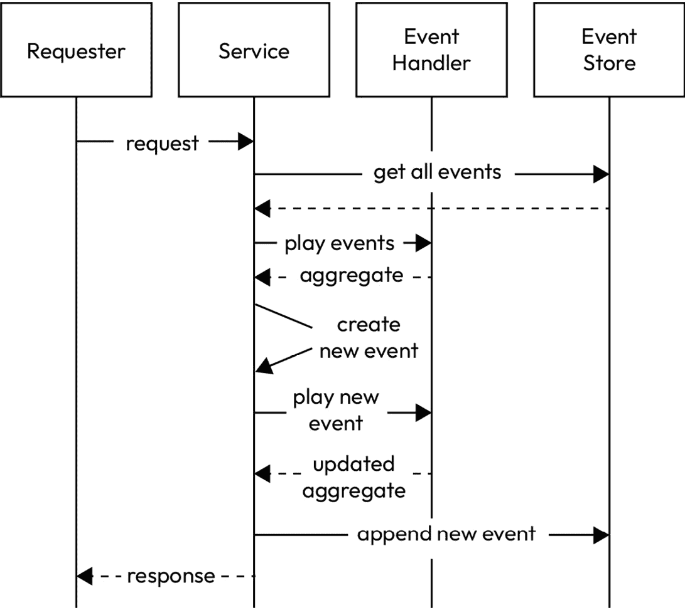
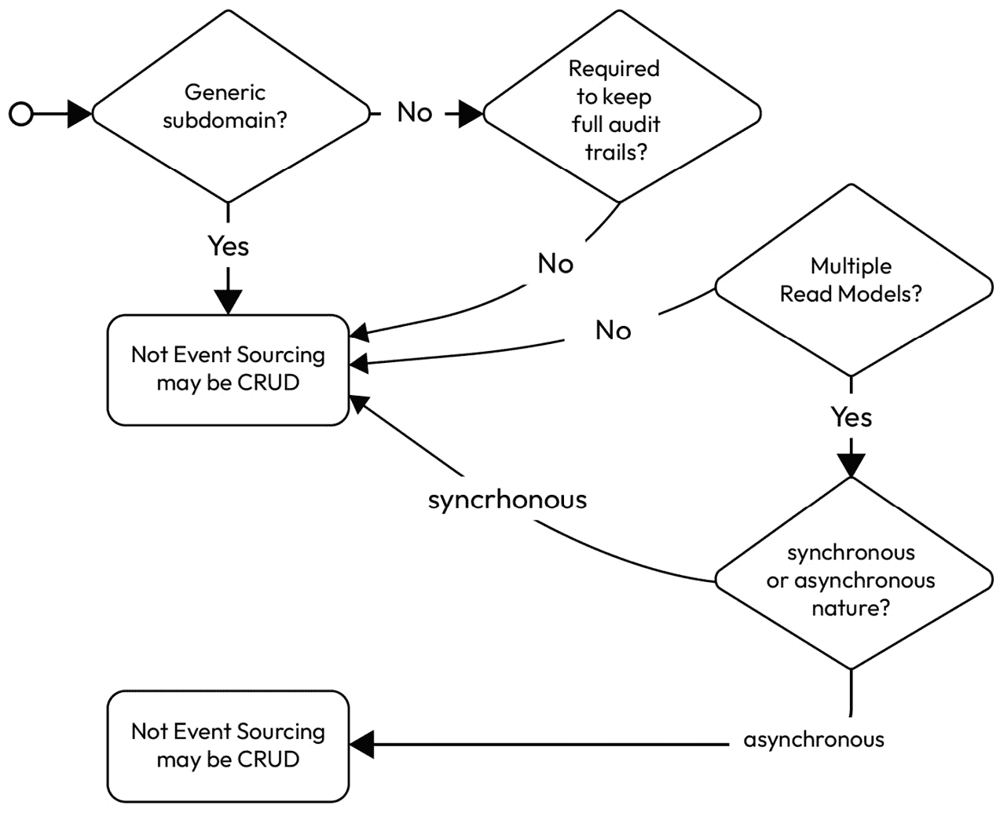
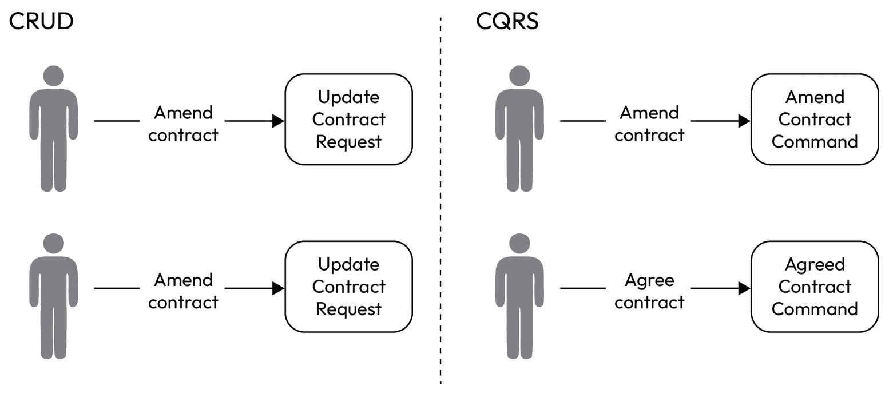
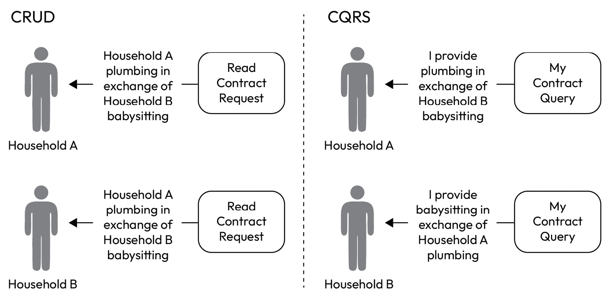
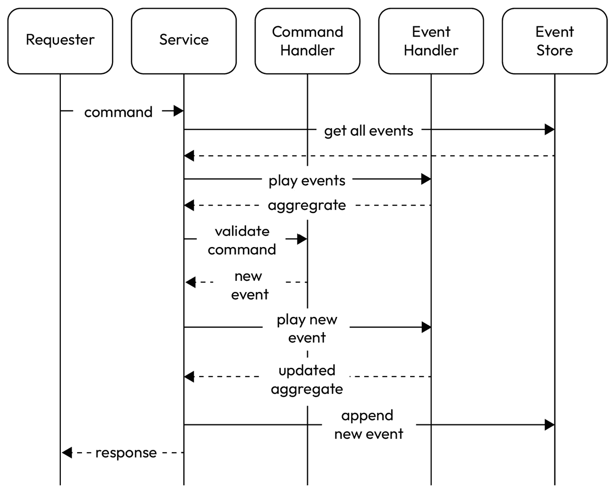
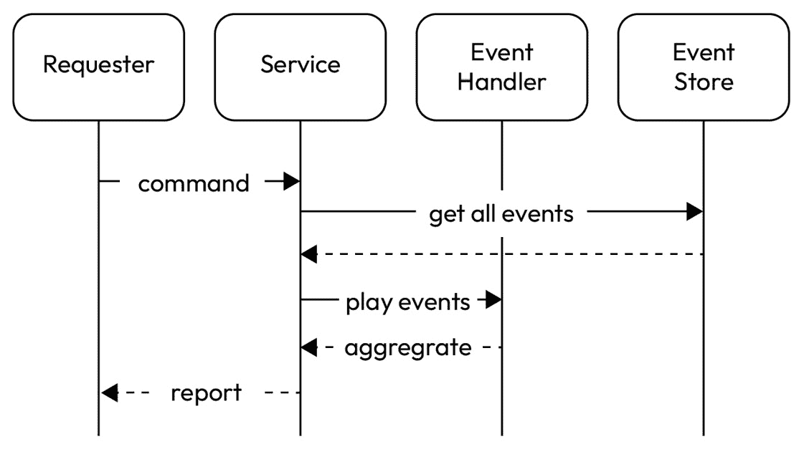

# 第九章：事件源和 CQRS

上一章关于**领域驱动设计（DDD**）为我们奠定了基础，让我们深入探讨两种强大的架构模式，这些模式满足了可扩展、响应和可维护应用程序的需求：**事件源**和**命令-查询责任分离（CQRS**）。

首先，我们将探讨事件源的基础。我们将讨论如何使用事件源来建模我们的领域，如何持久化领域状态，以及如何从持久化的事件中重建当前状态。我们将探讨这种方法的优点。

接下来，我们将把注意力转向 CQRS，探讨它如何分离命令（写）和查询（读）的责任。我们将讨论 CQRS 架构的关键组件，包括命令和查询处理器、领域模型和事件存储。我们将深入探讨这种分离的优点。

随着我们进一步深入，我们将检查实现 CQRS 和事件源相结合的实际考虑因素，包括数据建模、事件架构设计和处理最终一致性。我们还将讨论将这些模式集成到现有软件生态系统中的策略，确保无缝且可扩展的过渡。

通过实际示例和最佳实践，您将全面了解如何将 CQRS 和事件源转化为您对软件设计和开发的方法。到本章结束时，您将具备利用这些模式的力量并释放应用程序全部潜能的知识和工具。

我们将按照以下顺序介绍以下主要内容：

+   事件源

+   命令-查询责任分离（CQRS）

+   结合 CQRS 和事件源

# 技术要求

您可以在 GitHub 上找到本章使用的所有代码文件：[`github.com/PacktPublishing/Software-Architecture-with-Kotlin/tree/main/chapter-9`](https://github.com/PacktPublishing/Software-Architecture-with-Kotlin/tree/main/chapter-9)

# 事件源

**事件源**是一种数据管理模式，其起源可以追溯到 20 世纪 90 年代，当时工程师认识到传统数据存储**创建、读取、更新和删除（CRUD**）的局限性，尤其是在构建复杂和事件驱动系统的背景下。

事件源起源于领域驱动设计（**DDD**）的原则，如*第八章*所述。DDD 引入了**聚合**作为领域模型的基本构建块的概念，并且聚合通常需要保存在数据存储中。

## 经典的 CRUD 方法及其局限性

经典的 CRUD 方法通过 CRUD 操作捕获聚合的最新快照是足够的，通常使用关系数据库。然而，这种方法存在局限性：

+   **历史、可审计性和可追溯性**：虽然 CRUD 方法可以捕捉聚合体的当前快照，但其保留所有随时间对聚合体所做的变更的审计轨迹的能力有限。

    这通常通过自定义数据持久化代码来保持历史记录，或者通过数据库更新触发器的辅助来实现。这可能会使得跟踪变更历史、理解系统如何达到特定状态以及遵守监管要求变得具有挑战性。

+   **建模复杂领域**：基于 CRUD 的系统与简单直接的数据模型配合良好，但它们在有效表示和管理复杂领域模型随时间演进方面可能会遇到困难。

    传统上，使用关系型数据库时，复杂的聚合对象会导致复杂的数据库模式、复杂的数据持久化操作，以及维护和演进系统的困难。

+   **事件驱动能力**：CRUD 方法不支持事件驱动架构，在这种架构中，系统需要以解耦和可扩展的方式对变化做出反应并传播。

+   **并发和一致性**：基于 CRUD 的系统通常依赖于传统的锁定机制来确保数据一致性，这往往会导致在分布式、并发和高负载环境中的性能瓶颈。

    在并发更新的情况下维护强一致性在 CRUD 系统中可能是一个重大的挑战。

+   **版本控制和演进**：更新和演进基于 CRUD 的系统可能会出现问题，因为数据模型或业务逻辑的更改可能需要复杂的迁移和数据转换。

    在以 CRUD 为中心的方法中，版本控制和处理历史数据也可能更加复杂。

+   **分析和报告**：CRUD 系统关注聚合体的当前快照，这可能会使得分析、生成报告或从聚合体的历史数据中提取洞察变得具有挑战性。

面对这些挑战，捕捉聚合体变更全历史的想法开始受到关注。

## 事件作为一等公民

事件溯源旨在通过将事件作为一等公民来解决这些挑战。这里的“事件”一词与在*第八章*中提到的 DDD 中的“事件”具有相同的概念。一个事件捕捉了聚合体的变化，使其成为该框架中的关键元素。

事件溯源将聚合体的所有事件持久化存储在事件存储中。事件没有更新或删除操作，因为事件代表了已经发生变化的聚合体。换句话说，事件是不可变的，并且按时间顺序存储为日志。事件存储通常不是关系型数据库；它们可以是 NoSQL 数据库或持久队列。

与 CRUD 不同，在 CRUD 中，一个聚合的最新快照是一个一等公民，事件源通过从第一个事件到最新事件重放聚合中的事件来推导出聚合的最新快照。因此，聚合的完整历史被保留，并且不需要自定义代码来提供聚合的审计跟踪。

此外，聚合的历史被捕获为一个线性时间线，并自然地消除了保持并发更新强一致性的挑战。然而，在接收对聚合进行更改的请求之前，应该进行版本验证，并最终生成事件。这是为了防止**丢失更新**问题，即并发更新相同聚合时，不知情地覆盖彼此。

## 事件源的功能表示

将系统的状态表示为不可变事件的序列的想法与函数式编程范式很好地一致。聚合和事件都是不可变的。每次更改都是通过通过无状态函数从事件创建聚合的新版本来执行的。这可以通过两个基本函数表达，这两个函数被写成 Kotlin lambda 表达式：

```kt
(CreatedEvent) -> Aggregate
(UpdatedEvent, Aggregate) -> Aggregate
```

第一个函数创建一个初始聚合。随后，更新函数获取聚合的当前版本并创建一个新版本。

## 使用事件源处理请求的一个示例

假设有一个请求要更新现有的聚合。接收请求的服务需要获取聚合的最新版本以验证请求。因此，服务从事件存储中获取聚合的所有事件。

所有事件都被重放以重新创建聚合的最新快照。假设请求一切正常，服务创建一个新事件。然后服务将此事件播放到当前聚合上，并创建聚合的更新版本。

通过在事件存储中附加新事件来提交事务。更新的聚合版本可以用作对原始请求者的响应。

整个交互被表示为一个序列图，如图*图 9.1*所示：



图 9.1 – 事件源的一个示例

需要指出的是，聚合不是由服务直接更新的。这是通过处理新事件来实现的。此外，事件存储负责将新事件分发给对这些事件感兴趣的所有订阅者。

## 事件源的好处

事件源的好处来自于聚合完整审计跟踪的持久性：

+   **带有意图的完整审计跟踪**：不仅保留了聚合的完整审计跟踪，而且每个更改的意图也被捕获。聚合的每个事件的名称理想情况下应来自通用语言，使其成为业务感知和用户友好的历史。

+   **时间旅行**：由于完整的历史被捕获为一系列线性的事件，因此可以回到过去构建聚合体的历史表示。这有助于工程师重现过去发生的场景，用于调查和故障排除。它还使用户能够将历史聚合体作为一个功能来查看。

+   **创建读取模型**：一个聚合体的事件有多个消费者时，就会开启多个读取模型的大门。每个读取模型都消费相同的事件，但将其转换为满足其特定需求。这种方法提供了针对特定商业目的的定制化视图。

## 决定是否使用事件溯源

选择将事件溯源作为存储聚合体及其审计跟踪的方式不应轻率行事。这在我们对数据的推理方式上是一个根本性的转变，并且需要显著的努力才能使其工作。

从我们在*第一章*中提到的*YAGNI*原则来看，工程师应该构建最简单可行的事物。当有多种解决方案时，应该选择最简单的解决方案。

简单的解决方案与容易的解决方案不同

简单的解决方案不复杂，或者容易推理。容易的解决方案需要更少的努力来实现。以捕获一个新字段为例。如果我们认为该字段应该属于一个新实体，那么创建一个具有该字段的新实体是最直观和直接的方法。然而，新实体可能意味着添加新的数据库表、新的验证和新的公开 API。另一方面，如果我们将新字段附加到现有实体上，我们只需要增强现有实体、数据库表和 API。在编码和测试中涉及的精力更少，即使该字段不属于现有实体。这是一个容易的解决方案，因为需要的努力较少，但它并不简单，因为它不直观，而且看到不属于实体的字段会让人困惑。

*图 9.2*展示了确定聚合体是否应该使用事件溯源的决策树：



图 9.2 – 是否使用事件溯源的决策树

最决定性的因素是考虑使用事件溯源的聚合体是否属于通用子域。在*第八章*中，我们确定了核心域、支持子域和通用子域。通用子域有很大可能性被现成的软件产品完全取代，这使得使用事件溯源的好处并不显著。

如果涉及的聚合属于核心域或支持子域，下一步考虑的是是否需要保留聚合的完整审计跟踪。完整审计跟踪可用于监管报告、回放事件以获取聚合的特定历史状态，或进行时间序列数据分析。这是事件源的一个强大功能，但并非所有聚合都需要这种功能。

另一个有助于考虑事件源的提示是，如果聚合有多个读取模型。这里的读取模型定义与在**第八章**（*Chapter 8*）中提到的**事件风暴**期间可以发现的读取模型相同。

需要多个读取模型的聚合可以从事件源中受益。每个读取模型都可以消费聚合的相同事件，但将其转换为聚合的物化视图的独特表示。有时，读取模型甚至可能结合来自其他聚合或实体的数据。

事件源广泛使用事件来记录聚合的每个变化，事件通常异步处理。如果聚合的操作主要是同步的，那么在聚合中实现事件源会带来挑战。有技术可以同步处理事件以更新聚合，但实现会有成本。

重要的是要重申，这只是一个示例决策树。每个组织在决策中可能有其他因素。有时，即使面对相同的问题，也可能做出不同的决定。

## 使用事件源的实际示例

让我们回顾一下村民交换服务的实际示例，这是在**第八章**（*Chapter 8*）中确定的三个边界上下文：

+   核心域：**合同服务**

+   支持子域：**家庭服务**

+   通用子域：**通知服务**

按照前一小节中提到的决策树（见*图 9**.2*），作为通用子域的通知服务可以安全地排除使用事件源。

在家庭服务中作为聚合的家庭户不需要保留完整审计跟踪，因为仅需要家庭户的最新状态来处理业务案例。CRUD 方法就足够了。

作为合同服务中聚合的合同可能需要保留完整审计跟踪，因为家庭之间在合同协议上可能发生争议。

还涉及多个涉及合同的读取模型。合同的主体读取模型是规定两个家庭之间合同细节的那个。

每个家庭也可以有一个单方面的读取模型。它包含一个家庭应提供的服务列表以及应提供服务的家庭。还有一个列表，列出了家庭期望接收的服务以及期望提供服务的家庭。

此外，还有一个潜在的读取模型，旨在突出村庄中最受欢迎的服务和最活跃的服务交换家庭。

合同的谈判过程涉及多轮修改，直到双方家庭达成一致。当一个家庭起草合同时，会异步地向另一个家庭发送电子邮件。在谈判过程中，一个家庭所做的任何更改都会导致涉及的家庭收到电子邮件通知。在根据合同提供服务的过程中，两个家庭之间也有多个消息。这种通信的异步性质表明，合同是合约服务中使用事件溯源的合适候选者。

在这个例子中，我们将专注于使用事件溯源来捕获合约服务中聚合合约的完整历史。

让我们重新审视聚合合约作为数据类：

```kt
data class Contract(
    val id: UUID,
    val draftedAt: Instant,
    val updatedAt: Instant? = null,
    val version: Int,
    val partyA: Party,
    val partyB: Party,
)
data class Party(
    val householdName: String,
    val serviceProvided: String,
    val agreedAt: Instant? = null
)
```

`Contract`数据类包含一个`id`字段，该字段唯一标识此聚合。还有一个名为`version`的字段，它是一个单调递增的整数，显示为该聚合播放了多少事件。

`ContractEvent`的基本结构应包含聚合的唯一标识符和事件发生的时间：

```kt
interface ContractEvent {
    val contractId: UUID
    val targetVersion: Int
    val time: Instant
}
```

它还有一个目标版本，这是事件应用后的聚合版本。

在这个例子中，我们使用一个简单的内存事件存储。它有两个基本功能。`append`函数通过聚合 ID 在序列末尾添加新事件，而`get`函数根据聚合 ID 返回事件的按时间顺序的序列：

```kt
class EventStore<KEY, AGGREGATE> {
    private val aggregatesByKey = mutableMapOf<KEY, List<AGGREGATE>>()
    fun append(id: KEY, payload: AGGREGATE) {
        aggregatesByKey.merge(id, listOf(payload)) { t1, t2 -> t1 + t2 }
    }
    fun get(id: KEY): List<AGGREGATE>? = aggregatesByKey[id]
}
```

如果这是一个真实系统，应使用信誉良好的事件存储中间件来确保其持久性、高可用性和弹性。

聚合合约的创建始于起草了合同的家庭，并且它应包含创建聚合第一个版本所需的所有信息：

```kt
data class ContractDraftedEvent(
    override val contractId: UUID,
    override val targetVersion: Int = 0,
    override val time: Instant,
    val draftedByHousehold: String,
    val counterpartyHousehold: String,
    val serviceProvided: String,
    val serviceReceived: String,
) : ContractEvent
```

`Contract Drafted Event`类应提供一个创建聚合的函数。这是一个简单的函数，将值放入适当的结构中：

```kt
fun ContractDraftedEvent.play(): Contract = Contract(
    id = contractId,
    draftedAt = time,
    version = targetVersion,
    partyA = Party(
        householdName = draftedByHousehold,
        serviceProvided = serviceProvided
    ),
    partyB = Party(
        householdName = counterpartyHousehold,
        serviceProvided = serviceReceived
    )
)
```

任何后续事件都必须使用聚合的当前版本作为参数来生成新版本。例如，一个捕捉家庭修改并同意起草合同的事件的示例可能如下所示：

```kt
data class ContractAmendedEvent(
    override val contractId: UUID,
    override val targetVersion: Int,
    override val time: Instant,
    val amendedByHousehold: String,
    val serviceProvidedUpdate: String?,
    val serviceReceivedUpdate: String?,
) : ContractEvent
data class ContractAgreedEvent(
    override val contractId: UUID,
    override val targetVersion: Int,
    override val time: Instant,
    val agreedByHousehold: String,
) : ContractEvent
```

注意，此事件不一定遵循聚合的数据结构。关键点是保持事件简洁简单。因此，此事件仅提及一个家庭，并依赖于相应的`play`函数来正确应用更改。注意，`play`函数接受当前聚合的参数：

```kt
fun ContractAmendedEvent.play(current: Contract): Contract {
    validate(current, amendedByHousehold)
    return if (amendedByHousehold == current.partyA.householdName) {
        current.copy(
            version = targetVersion,
            updatedAt = time,
            partyA = current.partyA.copy(
                serviceProvided = serviceProvidedUpdate ?: current.partyA.serviceProvided
            ),
            partyB = current.partyB.copy(
                serviceProvided = serviceReceivedUpdate ?: current.partyB.serviceProvided
            )
        )
    } else {
        current.copy(
            version = targetVersion,
            updatedAt = time,
            partyA = current.partyA.copy(
                serviceProvided = serviceReceivedUpdate ?: current.partyA.serviceProvided
            ),
            partyB = current.partyB.copy(
                serviceProvided = serviceProvidedUpdate ?: current.partyB.serviceProvided
            )
        )
    }
}
fun ContractAgreedEvent.play(current: Contract): Contract {
    validate(current, agreedByHousehold)
    return if (agreedByHousehold == current.partyA.householdName) {
        current.copy(
            version = targetVersion,
            updatedAt = time,
            partyA = current.partyA.copy(agreedAt = time),
        )
    } else {
        current.copy(
            version = targetVersion,
            updatedAt = time,
            partyB = current.partyB.copy(agreedAt = time)
        )
    }
}
```

你会注意到有一个`validate`函数，这对于确保数据完整性非常重要：

```kt
fun <T : ContractEvent> T.validate(current: Contract, expectedHouseholdName: String): T {
    require(contractId == current.id) {
        "Aggregate ID mismatch - expected: $contractId, was ${current.id}"
    }
    require(targetVersion == current.version + 1) {
        "Unexpected version - expected: ${targetVersion - 1}, was ${current.version}"
    }
    require(
        expectedHouseholdName == current.partyA.householdName ||
            expectedHouseholdName == current.partyB.householdName
    ) {
        "Unexpected household - expected: ${expectedHouseholdName}, was ${
            listOf(current.partyA.householdName, current.partyB.householdName)
        }"
    }
    return this
}
```

此`validate`函数断言事件引用的是参数中的聚合。然后，它断言当前聚合比事件的目标版本低一个版本。最后，它断言涉及的户主在聚合合同中被提及。

应该有一个迭代函数，它接受一个`Contract Events`列表，并最终返回一个`Contract`对象：

```kt
fun List<ContractEvent>.play(): Contract? {
    if (isEmpty()) return null
    var current: Contract = (first() as ContractDraftedEvent).play()
    var index = 1
    while (index < size) {
        val event = get(index++)
        current = when (event) {
            is ContractAmendedEvent -> event.play(current)
            is ContractAgreedEvent -> event.play((current))
            else -> throw IllegalArgumentException("Unsupported event")
        }
    }
    return current
}
```

该函数使用合同事件的`List`作为接收者。在空列表的情况下，返回类型是可空的。它假设第一个事件是`ContractCreatedEvent`，它设置了`Contract`的初始快照。它从第二个事件循环到最后一个事件，生成一个新的`Contract`版本，将其设置为`current`以传递给下一个事件，并在最后返回`Contract`对象。其用法示例如下。同一聚合的事件列表是有序的，并且是顺序播放的：

```kt
    val contractId = UUID.randomUUID()
    val eventStore = EventStore<UUID, ContractEvent>()
    val createdEvent = ContractDraftedEvent(
        contractId = contractId,
        time = Instant.now(),
        draftedByHousehold = "HouseholdA",
        counterpartyHousehold = "HouseholdB",
        serviceProvided = "Cleaning",
        serviceReceived = "Babysitting"
    )
    val amendedEvent = ContractAmendedEvent(
        contractId = contractId,
        targetVersion = 1,
        time = Instant.now(),
        amendedByHousehold = "HouseholdB",
        serviceReceivedUpdate = "Dish washing",
        serviceProvidedUpdate = null
    )
    val agreedEventByHouseholdA = ContractAgreedEvent(
        contractId = contractId,
        targetVersion = 2,
        time = Instant.now(),
        agreedByHousehold = "HouseholdA"
    )
    val agreedEventByHouseholdB = ContractAgreedEvent(
        contractId = contractId,
        targetVersion = 3,
        time = Instant.now(),
        agreedByHousehold = "HouseholdB"
    )
    listOf(
        createdEvent,
        amendedEvent,
        agreedEventByHouseholdA,
        agreedEventByHouseholdB
    ).forEach { eventStore.append(contractId, it) }
    val aggregate = eventStore.get(contractId)?.play()
    println("Aggregate is of version: ${aggregate?.version}")
```

代码不会直接更新聚合。相反，它创建了一些事件，并让它们通过。最终版本应该是`3`，因为第一个版本是`0`。当执行前面的代码时，以下内容应打印到控制台：

```kt
Aggregate is of version: 3
```

此示例说明了事件溯源的一种简单形式，其中每个事件都会生成聚合的新版本。这些事件应持久化到事件存储中作为永久存储，并由订阅者接收，以便可以构建其他读取模型。

在复杂系统中，处理一个事件可能会产生一系列作为反应的事件，这需要递归函数来遍历处理。它还可能需要将相关事件分组为一个事务，因为连锁反应。

虽然这里的例子很简单，但事件溯源可能会出错的方式有很多。我们将讨论一些在实现中应考虑的最佳实践。

## 事件溯源最佳实践

事件溯源是一种从经典 CRUD 方法中不同的方式来推理领域中的聚合。它只有在我们将系统和架构设计为将事件视为一等公民的心态时才有效。否则，它可能成为一种反模式，并抵消它带来的所有好处。以下是一些基本最佳实践。

### 随机化和幂等性

对于一个聚合，重新播放相同的事件序列每次都应该生成相同的聚合快照。换句话说，事件的处理必须是幂等的。有两个主要因素可能会违反这种行为：时间和随机化。

如果事件处理包含利用事件处理时间的逻辑，那么它将根据处理时间生成不同的结果。例如，以下`expire`变量将根据系统时钟具有不同的布尔值：

```kt
val expire = If (event.time < System.currentMillis()) true else false
```

与系统时钟相关的任何信息都应该在事件上盖章。这样，结果就已经确定，并且不会随时间改变。任何基于时间的触发器或计划作业都应该获取系统时间，并将值捕获在事件中。

事件处理过程中的任何随机化都会在每次迭代中产生不同的结果。从随机化生成的值应该被捕获在事件有效负载中，事件处理过程中不涉及任何随机化。如果在处理过程中必须生成标识符，它们可以是事件范围内的唯一值。在外部，它们与事件标识符一起用作复合键。以下是一个例子：

```kt
val externalValueId = "${event.id}-${event.value.id}"
```

事件内部的价值可以通过事件 ID 和事件内部的价值 ID 的连接来外部识别，这两个 ID 由连字符分隔。

### 事件设计

一个事件应该只有一个聚合。混合多个聚合，无论是同一类型还是不同类型，都会导致聚合之间不必要的耦合。在一个事件中由混合聚合产生的耦合使得扩展事件及其主题变得困难。

可能存在多个聚合受到影响的情况。在这种情况下，应该创建多个事件作为结果，并且每个事件描述了每个聚合发生了什么。

每个事件都应该捕捉到聚合变化的目的。例如，`ContractCreatedEvent`是一个不好的名称，因为它没有描述聚合合同创建的原因。更好的名称应该符合通用语言，例如`ContractDraftedEvent`。

### 事件拓扑

事件被发布供订阅者接收，并且可以逻辑上分组为**主题**。这里的主题不要与传统 pub-sub 消息中的主题混淆，在所有订阅者确认收到消息后，消息不再属于任何主题。在事件源中，事件旨在永久保留，作为事件的只追加和顺序日志。例如，一个具有无限保留期的 Kafka 主题可以用来保存事件，每个主题代表事件的逻辑分组。

一个聚合的所有事件应该只发送到一个主题。这是为了简化创建和读取聚合的线性历史。

将聚合事件分散到多个主题会给重建聚合完整历史带来困难。这也使得性能扩展和吞吐量增加变得更加困难，这些都是与事件设计无关的独立问题。

### 事件模式兼容性

由于事件源旨在保留所有历史事件，因此所有事件都应该是向后兼容的；换句话说，当事件模式演变时，旧事件仍然可以被读取和处理。

维护向后兼容性本身就是一个大话题。有许多因素可以保持或破坏向后兼容性。以下是一些例子：

+   **保持**：

    +   添加可选字段

    +   向类型中添加更多枚举值

    +   减少字段的约束

+   **中断**：

    +   添加必填字段

    +   重命名字段

    +   改变字段的类型

    +   删除字段

    +   增加字段的约束

在事件源的场景中，一个向后兼容的事件架构确保系统总能读取聚合的完整历史来重新创建聚合的最新快照。

前向和完全兼容性

前向兼容性意味着旧消费者可以读取和处理新架构的事件。完全兼容的架构意味着它既向后兼容又向前兼容。

## 性能和备忘录

虽然当前版本的聚合可以从该聚合从时间开始的所有事件中推导出来，但如果请求当前快照，则播放这些事件并不总是理想的。

一种性能优化是将聚合的最新版本持久化为派生记录。这种模式称为**备忘录**。如果频繁请求当前快照，则使用此模式是有道理的。

在使用事件恢复聚合的最新状态的情况下，使用备忘录模式也可能是合理的。原因在于事件的数量会持续增长，因此重放所有事件的总时间会越来越长。应用备忘录模式将恢复所需的总时间与事件数量从线性变为对特定聚合的常数。

## 从 CRUD 迁移

将聚合从 CRUD 迁移到事件源是有趣的，因为通常 CRUD 没有完整的审计跟踪来允许完全重建事件的历史。相反，聚合的最新快照被视为第一版本，然后后续事件被持久化。

在这种情况下，类似于`ContractMigratedEvent`的事件将是第一个事件。

此外，聚合的变更将通过事件的播放来完成，而不是直接更新聚合。因此，任何直接更新聚合的代码都需要被弃用。

我们已经通过一个真实世界的示例和源代码介绍了事件源的基本知识。还有一个与事件源一起工作且基于领域驱动设计（DDD）的架构模式。我们现在将介绍这个模式。

# 命令-查询责任分离（CQRS）

CQRS 的起源可以追溯到另一个称为**命令查询分离**（**CQS**）的设计模式。CQS 是定义系统中处理两种类型操作的核心概念：执行任务的命令和返回信息的查询，并且不应该有一个函数同时执行这两项工作。

术语 CQS 是由伯特兰·梅耶在 1988 年他的书《面向对象软件构造》中提出的。他将其作为他在 Eiffel 编程语言上的工作的一部分。

CQRS 将 CQS 的定义原则扩展到系统中的特定对象，一个用于检索数据，一个用于修改数据。CQRS 是一个更广泛的架构模式，而 CQS 是行为的一般原则。

术语 CQRS 由 Greg Young 在 2010 年提出。从那时起，CQRS 获得了关注，并开发了各种框架和库来支持在 Java 和 .NET 等流行语言中实现该模式的实现。

CQRS 有四个基本元素：**聚合体**、**查询**、**命令**和**事件**。

## 聚合

在 CQRS 中，聚合体的含义与事件源和 DDD 中相同。它是一个表示领域模型当前状态的聚合实体。聚合体包含一系列其他实体和值对象，以表示通用语言中定义的领域概念。

## 查询

查询是客户端请求检索领域模型状态的表示。处理查询是只读操作，不会改变任何聚合体的状态。然而，查询可能针对与聚合体相关的特定读取模型。

## 命令

命令是客户端请求意图改变领域模型中聚合体的状态。处理意图以确定是否应该更改状态以及如何更改。命令可能只包含更改所需的信息，而不是请求中的整个聚合体。

## 事件

事件是聚合体状态的确认和不可变更改。事件可以由命令创建，也可以由处理另一个事件创建。这与 DDD 和事件源中的事件概念相同。

## CQRS 如何分解 CRUD

CQRS 将经典的 CRUD 分解成许多小的查询、命令和事件。每个都精确地表达了正在发生的事情，以至于它与通用语言相匹配。

以两个家庭之间服务合同的谈判过程为例。两个家庭都可以修改合同，并最终达成一致。



图 9.3 – CRUD 与 CQRS – 更新与命令

在 CRUD 风格中，合同的修改和同意都导致更新合同的请求，区别在于合同的内容。在 CQRS 风格中，修改和同意有专门的命令来捕捉不仅需要更新的内容，还包括更新的意图和业务背景。

CQRS 风格导致修改和同意操作被分离。这导致设计更加清晰和模块化。分离还允许独立扩展和命令的优化。

在查询方面，如图所示，家庭 A 和 B 可以通过使用 CRUD 读取请求来获取它们之间的合同，并且对两个家庭来说，响应将是相同的。然而，CQRS 查询允许多个读取模型，在这种情况下，它可以返回一个根据哪个家庭发起查询而定的自定义读取模型。



图 9.4 – CRUD 与 CQRS – 读与查询

CQRS 风格可以通过消费命令接受时产生的事件为每个家庭构建一个物化视图作为读取模型。在 CRUD 风格中，这些自定义视图通常使用 SQL 命令实现，并且这些自定义视图不会物化。

物化读取模型可以在不担心命令的情况下独立扩展。例如，如果聚合体合同的读写比严重偏向于读取，那么在单独的数据存储基础设施中物化相应的读取模型是合理的，这样即使在查询操作的重压下，写入也不会受到影响。

由于读取模型是通过异步消息消费事件而物化的，因此聚合体的变化可能不会立即反映在读取模型中，但最终会同步。

需要指出的是，处理命令确实需要一些现有信息进行验证、完整性检查和并发控制。这些读取操作对于处理命令是必要的，但不是用于服务请求。

## 何时应考虑使用 CQRS？

与事件溯源一样，当满足一些先决条件并且存在可以通过 CQRS 解决的合法问题时，应考虑使用 CQRS。CQRS 是我们思考系统的一种范式转变，正确实现它需要付出巨大的努力。将 CQRS 应用于错误系统会增加复杂性而没有带来任何好处。

CQRS 是建立在 DDD（领域驱动设计）基础上的架构模式。如果当前系统没有 DDD、边界上下文或聚合的概念，那么它就不是一个起点。即使系统包括边界上下文，由于它们的复杂性有限，对于通用子域来说，使用 CQRS 可能并不必要。CQRS 最有可能对核心域有益，因为域本身足够复杂，足以证明其使用价值。

然而，有几个迹象表明可以在领域内考虑使用 CQRS：

+   多个角色在同一个聚合体上工作。这通常意味着并非所有角色都关心聚合体中的每一件事。一些角色可能只处理聚合体的一部分，而不是全部。

+   更新聚合体的多种用例。存在一些特定的用例，其中只需要更新聚合体的一部分。

+   同一个聚合体的多个视图。存在同一聚合体的替代视图，有时甚至可能有一个结合多个实体的视图，这些实体与聚合体有所偏离。

+   读写比例不平衡。如果读取或写入操作比另一个操作显著频繁，那么读取和写入需要以不同的方式扩展，因为它们的需求不同。

## CQRS 的益处和成本

CQRS 将读取（查询）和写入（命令）操作的关注点分开，以便它们可以独立满足需求。这导致每个函数或类都有更小的代码量，但由于分离，会有更多的函数或类。

这种分离推动了代码向**单一职责原则**（**SRP**）发展，正如在*第二章*中提到的，即应该只有一个理由来更改一个类。每个演员的每个用例都有自己的类，无论是作为查询还是作为命令。

查询和命令的分离使得独立性能优化成为可能，从而在整体上提高了系统性能和可扩展性。例如，由于有专门的读取模型，查询可以优化以实现更快的执行，而命令可以优化以实现高吞吐量和一致性。然而，这也导致系统中移动部件增多，从而增加了其复杂性。

查询和命令被分解为其自己的函数或类。这意味着扩展功能不太可能需要更改现有的查询和命令，因此比 CRUD 更容易，在 CRUD 中有一个包含所有 CRUD 操作的大仓库类。

为每个业务案例提供专门的查询和命令消除了客户端处理与聚合无关的字段和细节，或创建 CRUD 风格的更新或读取请求的需要。这与在*第二章*中提到的**接口隔离原则**（**ISP**）相一致，即客户端不应被迫依赖于它不使用的字段和函数。

使用 CRUD 支持多个读取模型具有挑战性。这通常需要复杂的 SQL 语句来联合相关数据。此外，由于不同的读取模型有不同的需求，优化性能也变得困难。很多时候，需要做出妥协，以便不同的读取模型具有合理可接受的性能。

使用 CQRS，读取模型通过消费聚合的事件来实现。它们有自己的存储，因此可以扩展并优化针对非功能性需求的独特性能。这以在多种形式复制数据为代价，并且需要更多的存储来保持这些读取模型。此外，每个读取模型都需要自己的代码来转换事件并持久化与其数据结构相关的数据。

你可能已经注意到了 CQRS 和事件溯源之间的协同作用。我们将通过一个具体的例子来说明它们是如何一起工作的。

# 结合 CQRS 和事件溯源

CQRS 和事件溯源是互补的模式，在构建健壮、可扩展和可维护的分布式系统时协同工作得很好。

在 CQRS 架构中，**命令处理器**负责验证写请求。如果命令有效，则将事件持久化到事件存储中，这是事件溯源模式的核心。CQRS 命令和事件溯源如何集成的示例显示在*图 9.5*中：



图 9.5 – CQRS 命令和事件溯源

**服务**从**请求者**接收命令。**服务**需要聚合的当前状态，该状态通过重新播放从**事件存储**检索的事件来重建。**命令**通过验证，因此生成新的事件。新事件在聚合上播放以生成新状态。新事件附加到**事件存储**，并将更新的聚合返回给**请求者**。

事件溯源回答了 CQRS 如何更新聚合并通知订阅者聚合变化的问题。CQRS 回答了事件溯源如何创建事件的问题。

查询反过来通过重新播放存储在事件存储中的事件来重建应用程序的当前状态。此外，通过将事件有效负载转换为构建它们独特的数据结构，重建多个读取模型。CQRS 查询和事件溯源如何集成的示例显示在*图 9.6*中：



图 9.6 – CQRS 查询和事件溯源

事件溯源提供了一种方法，使 CQRS 查询能够重建给定聚合的快照。它使查询能够根据请求构建任何给定的读取模型。它还允许从给定的时间戳构建聚合的历史视图。

命令和查询模型之间的关注点分离，加上事件溯源的事件驱动特性，允许高度可扩展、灵活和可维护的系统，这些系统可以轻松适应不断变化的企业需求。

## 使用 CQRS 和事件溯源

从事件溯源的先例扩展，添加 CQRS 需要创建几个命令和查询类。我们需要一个类来捕获家庭之间合同当前状态的查询，以及一个类来捕获起草合同的命令。相应的代码如下：

```kt
data class CurrentContractQuery(
    val contractId: UUID
)
data class DraftContractCommand(
    val draftedByHousehold: String,
    val counterpartyHousehold: String,
    val serviceProvided: String,
    val serviceReceived: String,
)
data class AgreeContractCommand(
    val contractId: UUID,
    val agreedByHousehold: String,
)
```

你会发现这些命令类看起来很像事件类。区别如下：

+   创建聚合的命令中不包含聚合 ID

+   命令中不包含聚合版本或时间戳

这是因为在处理命令时填充了聚合 ID、版本和时间戳。在这个例子中，命令处理不是幂等的。它使用随机化聚合 ID 和系统时钟来标记时间戳。

可能会有各种实现来提供随机值和系统时间戳，以使命令处理具有幂等性。如果它们是一致的并且被充分理解，这两种方法都可以被证明是合理的。

在此示例中，每个命令的处理都有两种潜在的结果。成功的结果会创建一个事件，并且这个事件需要被持久化。失败的结果会通知调用者原因，并且不会创建事件。需要有一个类来封装失败结果的信息：

```kt
data class Failure<T>(
    val request: T,
    val message: String? = null,
    val error: Throwable? = null
)
```

`Failure`类包含原始请求、可选消息和可选的`Throwable`对象。

每个查询和命令都需要一个处理程序。利用事件源示例中的`EventStore`类，查询处理程序使用 Kotlin 扩展和事件存储作为参数，操作简单：

```kt
fun CurrentContractQuery.handle(
    eventStore: EventStore<UUID, ContractEvent>
): Contract? = eventStore.get(contractId)?.play()
```

查询处理程序简单地获取给定`contractId`的所有事件，然后播放所有事件以重新创建`Contract`的最新版本作为返回值。

命令处理程序有两种主要风格：创建和更新。创建命令的处理程序生成一个随机的**通用唯一标识符**（**UUID**）和时间戳。这些字段被捕获在创建事件中：

```kt
fun DraftContractCommand.handle(
    eventStore: EventStore<UUID, ContractEvent>,
    onSuccess: (ContractDraftedEvent) -> Unit,
    onFailure: (Failure<DraftContractCommand>) -> Unit
) {
    if (draftedByHousehold == counterpartyHousehold) {
        onFailure(Failure(this, "Same household is not allowed: $draftedByHousehold"))
    } else {
        ContractDraftedEvent(
            contractId = UUID.randomUUID(),
            time = Instant.now(),
            draftedByHousehold = draftedByHousehold,
            counterpartyHousehold = counterpartyHousehold,
            serviceReceived = serviceReceived,
            serviceProvided = serviceProvided
        ).also{
            eventStore.append(it.contractId, it)
        }.also(onSuccess)
    }
}
```

命令处理程序需要两个回调函数，一个用于成功，一个用于失败。在执行过程中只会调用其中一个回调函数。如果命令验证失败（在这种情况下，当使用相同的家庭用于草案合同时），则不会创建事件，并调用失败回调函数。否则，将创建一个事件来捕获随机合同 ID、事件时间以及其他字段。该事件被持久化到事件存储中。然后，该事件传递给成功回调函数。

更新命令的处理程序需要验证聚合是否存在，以及是否保留了相同的聚合 ID。其余的实现是创建命令的处理程序：

```kt
fun AgreeContractCommand.handle(
    eventStore: EventStore<UUID, ContractEvent>,
    onSuccess: (ContractAgreedEvent) -> Unit,
    onFailure: (Failure<AgreeContractCommand>) -> Unit) {
    validate(
        eventStore = eventStore,
        contractId = contractId,
        householdName = agreedByHousehold,
        onSuccess = { contract ->
            ContractAgreedEvent(
                contractId = contractId,
                targetVersion = contract.version + 1,
                time = Instant.now(),
                agreedByHousehold
            ).also { eventStore.append(contractId, it)
            }.also(onSuccess)
        },
        onFailure = { onFailure(it)}
    )
}
```

有一个名为`validate`的函数，旨在与其他更新命令处理程序共享：

```kt
fun <T> T.validate(
    eventStore: EventStore<UUID, ContractEvent>,
    contractId: UUID,
    householdName: String,
    onSuccess: (Contract) -> Unit,
    onFailure: (Failure<T>) -> Unit) {
    val events = eventStore.get(contractId)
    if (events == null) {
        onFailure(Failure(this, "Contract not found: $contractId"))
    } else {
        val contract = events.play()
        if (contract == null) {
            onFailure(Failure(this, "Failed to reconstruct Contract: $contractId"))
        } else if (contractId != contract.id) {
            onFailure(Failure(this, "Contract ID mismatched. Expected: $contractId, was: ${contract.id}"))
        } else if (householdName != contract.partyA.householdName
            && householdName != contract.partyB.householdName) {
            onFailure(Failure(this, "Household not found in contract: $householdName"))
        } else {
            onSuccess(contract)
        }
    }
}
```

成功回调函数将传入`Contract`，因为已经找到了并重新创建了聚合的最新版本。失败回调函数将传入`Failure`对象以进行委托。

最后，当使用此 CQRS 和事件源示例时，客户端只需创建一个命令并将其传递到事件存储中即可开始。然后，调用扩展`handle`函数：

```kt
    var contractId: UUID? = null
    val eventStore = EventStore<UUID, ContractEvent>()
    DraftContractCommand(
        draftedByHousehold = "HouseholdA",
        counterpartyHousehold = "HouseholdB",
        serviceProvided = "Cleaning",
        serviceReceived = "Babysitting"
    ).handle(
        eventStore = eventStore,
        onSuccess = { contractId = it.contractId
            println("Contract drafted: $contractId") },
        onFailure = { "Failed to draft contract: $it"}
    )
    AmendContractCommand(
        contractId = contractId!!,
        amendedByHousehold = "HouseholdB",
        serviceReceivedUpdate = "Dish washing",
        serviceProvidedUpdate = null
    ).handle(eventStore = eventStore,
        onSuccess = { println("Contract amended: $contractId") },
        onFailure = { println("Failed to amend contract: $contractId")}
    )
```

成功回调函数捕获`contractId`以供未来的更新使用。要更新聚合，需要创建一个更新命令并指定合同 ID。之后，调用`handle`扩展函数：

```kt
    AgreeContractCommand(
        contractId = contractId!!,
        agreedByHousehold = "HouseholdA"
    ).handle(eventStore = eventStore,
        onSuccess = { println("Contract agreed: $contractId") },
        onFailure = { println("Failed to amend contract: $contractId")}
    )
    AgreeContractCommand(
        contractId = contractId!!,
        agreedByHousehold = "HouseholdB"
    ).handle(eventStore = eventStore,
        onSuccess = { println("Contract agreed: $contractId") },
        onFailure = { println("Failed to amend contract: $contractId")}
    )
```

在所有这些更新之后，我们可以查询最新的 `Contract` 并查看所有这些更新是否已累积。通过捕获的合同 ID 创建了一个查询。调用 `handle` 扩展函数，并将事件存储传递进去：

```kt
    val aggregate = CurrentContractQuery(contractId!!).handle(eventStore)
    println("Aggregate is of version: ${aggregate?.version}")
```

因为事件存储在处理命令时持续捕获事件，它已经拥有了聚合的完整历史。这是执行所有命令和查询后得到的控制台输出：

```kt
Contract drafted: 3a25642c-fc9b-4024-b862-daf10fc645a6
Contract amended: 3a25642c-fc9b-4024-b862-daf10fc645a6
Contract agreed: 3a25642c-fc9b-4024-b862-daf10fc645a6
Contract agreed: 3a25642c-fc9b-4024-b862-daf10fc645a6
Aggregate is of version: 3
```

这个示例展示了 CQRS 和事件溯源在工作中的强大组合。它们相互补充，无缝协作。它还演示了每个命令和查询都有自己的类和函数。这打破了传统的 CRUD 方法，其中通常有一个包含所有四种操作的大文件的仓库类。

## Outbox 模式

值得指出的是，在实际系统中，也存在一种趋势，即也将 **Outbox** 模式应用于以可靠和容错的方式管理事件交付。这是通过在持久存储中（如关系数据库表）拥有消息的 Outbox 来实现的。

有一个独立的过程读取未发送的 Outbox 消息并将它们发送到目标目的地。如果消息已发送，则相应的记录被视为已发送并将被删除。

如果事件存储不可用，此交付过程将自动重试交付，直到事件存储再次可用。交付过程还可以独立扩展，并可能并行地将消息发送到不同的目标。

与 Outbox 模式类似的是 **变更数据捕获**（**CDC**）模式。CDC 通过数据库触发器、事务日志或变更跟踪器检测记录的变化，并创建一个事件。创建的事件最终进入事件流或主题。虽然事件在 Outbox 过程之前创建，但 CDC 中的事件是事后创建的。这意味着 CDC 在捕获事件意图方面不太直观。

传统的关联数据库提供强一致性事务保证。这意味着我们可以有一个事务用于常规数据库操作和事件交付，作为 Outbox 或 CDC 的数据库记录，实现全有或全无的事务行为。

通过在关系数据库中存储 Outbox 消息，事件发送的可靠性、容错性、一致性和可扩展性也得到了提高。

# CQRS 和事件溯源的流行框架和基础设施

CQRS 和事件溯源是架构概念，不依赖于特定的技术或框架。它们对编程语言也是中立的。然而，有一些框架和基础设施旨在支持 CQRS 或事件溯源。

+   CQRS / 事件溯源框架：

    +   Axon 框架 ([`www.axoniq.io/products/axon-framework`](https://www.axoniq.io/products/axon-framework))

    +   Akka ([`akka.io/`](https://akka.io/))

+   事件存储：

    +   EventStore ([`www.eventstore.com/`](https://www.eventstore.com/))

    +   Apache Cassandra ([`cassandra.apache.org/`](https://cassandra.apache.org/))

    +   MongoDB ([`www.mongodb.com/`](https://www.mongodb.com/))

+   消息基础设施：

    +   RabbitMQ 流 ([`www.rabbitmq.com/docs/streams`](https://www.rabbitmq.com/docs/streams))

    +   Apache Kafka ([`kafka.apache.org/`](https://kafka.apache.org/))

需要强调的是，使用这些工具并不能自动使 CQRS 或事件溯源在你的系统中生效。只要团队使用 CQRS 和事件溯源的语义实现系统，你的当前框架和基础设施可能已经为这些架构风格做好了准备。

# 摘要

我们首先介绍了经典的 CRUD 架构及其局限性。然后，我们介绍了事件溯源作为管理数据的替代方法，并探讨了其历史。我们深入探讨了团队如何决定是否应该在他们的系统中考虑事件溯源。

我们通过村民交换服务的现实生活例子来展示事件溯源的实施方法。我们还简要概述了 CRUD 系统迁移到事件溯源的计划。

之后，我们转向了 CQRS 架构的主题。我们讨论了使用命令作为写操作和查询作为读操作。我们提到了 CQRS 的基本结构以及它们与 DDD 和事件溯源架构的关系。我们看到了 CRUD 和 CQRS 在分解多个更新操作时的对比。

我们接着讨论了使用 CQRS 和事件溯源。我们描述了如何通过扩展现实生活中的例子来使这两种架构相互补充。

最后，我们简要介绍了使用 Outbox 模式与 CQRS 和事件溯源的结合使用。

在下一章中，我们将讨论分布式系统的幂等性、复制和恢复方面。
