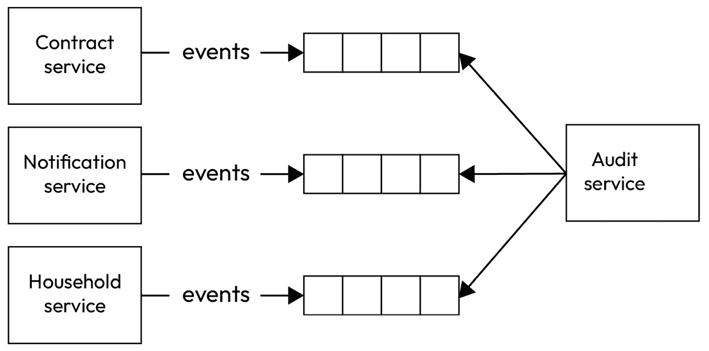
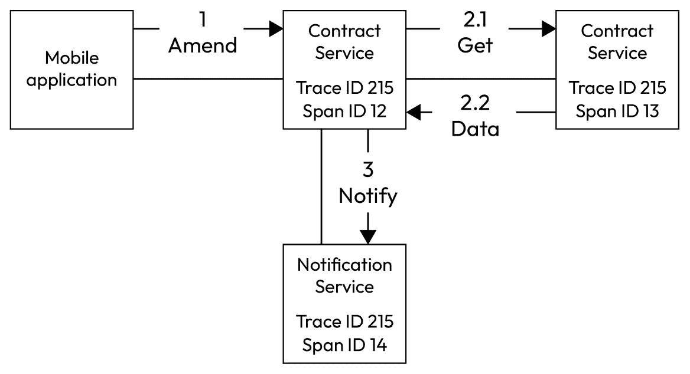
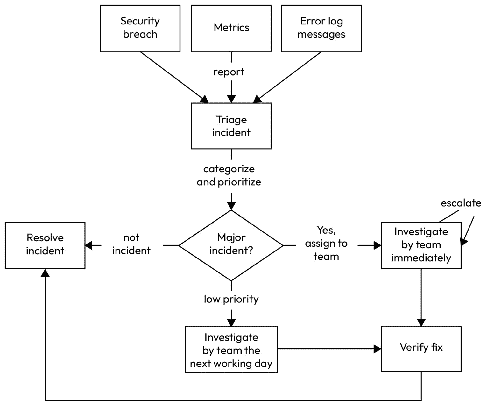

# 审计和监控模型

本章致力于涵盖软件系统的审计和监控方面。实施强大的审计和监控策略对于组织提高其系统的整体可靠性、安全性和性能至关重要，同时还能获得有价值的见解，以支持数据驱动的决策和持续改进。

这对于分布式系统尤为重要，因为与传统的单体应用相比，分布式系统的增加复杂性和相互依赖性引入了额外的挑战。

本章将探讨以下主题：

+   审计和监控的重要性

+   分布式系统审计和监控的挑战

+   审计和监控的关键方面

+   有意义审计跟踪的基本要素

到本章结束时，你将牢固地理解如何为你的系统建立强大的审计和监控能力，使你能够主动识别和解决问题，确保合规性，并维护整体系统健康。

# 技术要求

你可以在 GitHub 上找到本章使用的代码文件：[`github.com/Packt Publishing/Software-Architecture-with-Kotlin/tree/main/chapter-11`](https://github.com/PacktPublishing/Software-Architecture-with-Kotlin/tree/main/chapter-11%0D)

# 审计和监控的重要性

审计和监控是两个不同但又紧密相关的概念，对于系统的有效管理和监督至关重要。

## 审计

**审计**是一种系统性的方法，用于审查、检查和验证系统的各个方面，以确保其合规性、安全性和整体完整性。审计涵盖以下关键领域：

+   **合规性**：检查系统是否符合相关法律、权威机构的规定、行业标准和企业政策。

+   **安全**：评估系统的安全基础设施、政策和程序。这包括漏洞评估、渗透测试、数据保护机制和访问控制。

+   **变更管理**：审查与系统更改和更新相关的流程和文档。

+   **事件管理**：检查对系统事件和灾难恢复程序的响应的有效性。

+   **性能**：评估系统操作的效率、资源利用和整体性能。

审计过程通常涉及收集和分析各种系统日志、配置文件、用户活动、文档和其他相关数据，以识别潜在问题、漏洞和改进领域。

审计过程通常定期进行。组织通常会有季度、半年和年度审计。周期通常由监管要求、系统的复杂性、关键性、风险概况以及组织的整体风险管理策略等因素决定。

高风险系统可能需要更频繁的审计周期，某些组织甚至可能实施持续的审计过程。

在面对某些事件时，例如重大的系统变更、安全事件、主要行业变化或监管更新，可能需要临时审计过程。

## 监控

**监控**，另一方面，涉及持续观察和跟踪系统的运行状态、性能和行为。以下是一些监控活动：

+   **实时监控**：持续收集和分析系统指标，如系统可用性、资源利用率、网络流量和错误率，以便及时检测和响应问题

+   **异常检测**：识别不寻常或意外的系统行为，这可能会表明潜在的问题或安全威胁

+   **趋势分析**：通过检查历史数据来识别系统性能和使用的模式、趋势和变化

+   **警报和通知**：当达到预定义的阈值或条件时触发警报和通知，使问题能够得到主动解决

+   **仪表板和报告**：提供系统健康、性能和关键指标的可视化表示，以支持数据驱动的决策

监控通常涉及部署各种监控中间件组件、代理和框架，它们从系统的不同组件收集、汇总和分析数据。

## 为什么审计和监控很重要？

审计和监控对于任何系统的有效管理和运营至关重要。以下是审计和监控之所以如此重要的几个关键原因：

+   **确保可靠性和可用性**：主动监控有助于在问题升级为系统故障或停机之前识别和解决问题。实时警报和事件管理能够快速响应和解决问题，最小化对最终用户的影响。全面的审计跟踪提供了必要的有关系统故障根本原因的信息，从而提高了系统的可靠性和可用性。

+   **维护安全和合规性**：审计日志和数据监控可以用来检测和调查安全漏洞、未经授权的访问尝试和其他恶意活动。合规法规通常要求实施强大的审计和监控能力，以确保敏感数据和系统的完整性和机密性。审计报告和监控仪表板可以证明组织遵守合规要求，降低处罚和声誉损害的风险。

+   **优化性能和效率**：监控系统指标和资源利用率可以帮助识别瓶颈、优化资源分配并提高整体系统性能。审计数据可以提供对使用模式、工作负载趋势和潜在优化领域的见解。

+   **启用数据驱动决策**：审计和监控数据可以用来识别模式并生成有价值的商业智能，支持战略规划和决策。详细的报告和可视化可以给利益相关者提供一个对系统健康状况、性能和整体状况的全面理解。历史数据和趋势分析有助于预测未来的资源需求，规划容量扩展，并识别流程改进的机会。

+   **促进故障排除和根本原因分析**：全面的审计轨迹和监控数据可以帮助工程师和支持团队快速识别问题的根本原因，减少问题解决所需的时间。详细的事件日志和上下文信息有助于重建系统行为和重现问题场景。审计和监控数据可以用来验证实施的修复措施的有效性，并确保问题不会再次发生。

通过投资于强大的审计和监控能力，组织可以确保其分布式系统的可靠性、安全性和优化，最终为最终用户和利益相关者提供更好的体验。

## 审计、监控和测量系统

“*你不能改进你没有测量的东西*”是管理顾问和作家**彼得·德鲁克**的一句话。

没有测量，组织可能会陷入以下情况：

+   **基于意见的决策制定**：没有定量证据，人们只能表达基于很少依据的意见。这会导致利益相关者和工程师之间沟通无效，以及对问题的理解碎片化。

+   **试错改进**：任何试图改进系统功能或质量属性的努力都可能成为试错。由于对问题的理解不足，其中一些可能有效，而另一些可能无效。更糟糕的是，几乎没有客观反映改进效果的方法。因此，组织可能会陷入基于意见的决策的恶性循环。

相反，通过监控来衡量系统对组织有以下好处：

+   **建立基线**：衡量系统的当前状态，无论是性能指标、安全完整性还是合规性，为未来改进提供了必要的基线，以便评估和比较未来的改进。

+   **识别机会**：测量和监控数据可以揭示系统内部可能没有量化证据就难以显现的问题、瓶颈或低效。

+   **跟踪进度**：一旦实施改进或变更，持续的测量和监控使组织能够跟踪这些变更的影响和有效性，确保它们产生积极影响，并实现预期结果。如果没有，组织可以决定从原始变更中转向，以避免进一步恶化。

+   **基于信息的决策**：可靠的数据和指标能够支持数据驱动的决策，使组织能够更有效地优先排序和分配资源，以实现最大的改进。这也有助于对抗基于意见的决策。定量证据是使人们理解一致并有效推动对所需改进达成共识的最好方式之一。

+   **持续优化**：通过建立一个测量和监控的文化，组织可以持续识别新的改进机会，创造一个持续优化和精炼的循环。

## 何时审计和监控不是必需的？

有一些例外情况，在这些情况下，审计和监控可能不是必需的。

如果系统极其简单，组件非常少，依赖性最小，那么对全面审计和监控的需求可能会减少。

在实验性、低保真度或概念验证系统中，当主要关注验证特定概念、假设或功能时，对审计和监控的投资可能不是首要任务。然而，如果该系统后来证明是一个可行的持续业务，那么在审计和监控上投入更多是值得的。

用于测试、个人实验或其他低影响用例的系统可能不需要与关键任务生产系统相同级别的审计和监控。

注意，某些系统或组织可能不受严格的监管或合规要求约束，这些要求强制实施全面的审计和监控功能。

此外，一些系统是隔离的，甚至与互联网断开连接。如果它们有严格的安全控制，那么广泛的审计和监控可能就不那么关键了。

如果系统设计为临时或短期使用，具有明确的生命周期，那么在全面的审计和监控上的投资可能是不合理的。这适用于一次性数据处理任务或具有预定停用日期的系统。

审计和监控的结合为管理系统的完整性、安全性和性能提供了一个全面的方法，尤其是在复杂的分布式环境中。审计发现可以帮助指导和增强监控策略，而监控数据可以为审计过程提供宝贵的输入。对于任何组织来说，审计和监控相辅相成是最有益的。

在现代系统中实施审计和监控并不简单，因为它们通常被分布到多个组件中。我们将在下一节中探讨这些挑战。

# 分布式系统审计和监控的挑战

分布式系统提出了几个独特的挑战，使得它们的审计和监控比传统的单体架构更为复杂：

+   **分布式数据源**：在分布式系统中，相关的数据和日志分散在多个节点、服务和通信渠道中。收集、汇总和关联这些信息是一项关键但具有挑战性的任务。

+   **动态基础设施**：分布式系统通常涉及高度动态的基础设施，节点和服务可以根据需求添加、删除或扩展。跟踪不断演变的拓扑结构和资源利用率对于有效的监控至关重要。

+   **相互依赖和级联故障**：分布式系统中组件之间的复杂相互依赖可能导致级联故障，即系统某一部分的故障会触发其他区域的故障。识别和追踪这些复杂关系对于根本原因分析和恢复至关重要。

+   **各种技术的混合**：分布式系统通常包含各种技术，包括各种编程语言、数据存储和中间件组件。开发一种可以处理这种异质性的统一审计和监控方法是一个重大挑战。

+   **实时响应性**：分布式系统通常需要提供实时响应，这要求审计和监控解决方案能够以高速处理和分析数据，同时不引入显著的延迟或性能开销。

+   **合规性和监管要求**：许多行业和组织都有严格的合规性规定，要求有全面的审计轨迹和监控能力。确保分布式系统满足这些要求是一项关键责任。

为了克服这些挑战，我们将通过具体示例探讨审计和监控的关键方面。

# 捕获适当的数据

为了解决这些挑战并为分布式系统建立有效的审计和监控实践，我们需要捕获最合适的、基本的构建块。

# 审计跟踪

以下是在审计跟踪中通常捕获的基本字段：

+   **时间戳**：事件发生时的日期和时间。对于所有审计跟踪来说，拥有一个通用时区非常重要。**协调世界时**（**UTC**）是一个明智的选择，因为它是一致的，不依赖于任何时区。没有夏令时或时钟变化的复杂性。它可以轻松转换为任何本地时区。它也是全球时间标准。这对于关联在相同时间发生的不同操作以反映模式非常有价值。

+   **用户 ID**：执行或受该操作影响用户的标识符。用户的身份必须被标记化，且不得包含任何 PII（个人身份信息）。这通常受到当地法律和法规的规范，尤其是在数据保护和隐私方面。因此，使用标记化用户 ID 可以减少暴露用户详细信息的大部分法律麻烦。通过用户 ID 访问用户信息仅限于授权个人和当地当局。

+   **事件或操作类型**：已执行的事件或操作类型（例如，登录、注销、数据访问或数据修改）。

+   **执行操作的详细信息**：操作的特定细节，通常是操作的输入参数。不同的操作通常具有不同的数据结构。请注意，细节可能包含需要保护敏感信息。敏感信息的保护技术将在*第十四章*中介绍。

+   **访问的资源**：涉及已执行操作的资源。它通常与聚合、实体或值对象相关联。通常涉及多个对象。

+   **结果**：操作的结果或后果。值得注意的是，成功和失败的结果在捕获审计跟踪方面同等重要。对于成功，重要的是要捕获接下来会发生什么。对于失败，应包括任何错误消息或调用堆栈跟踪。此外，捕获任何副作用也很重要，以便可以进一步调查它们。

+   **会话 ID**：发生事件时的会话标识符。拥有会话 ID 有助于任何关联调查确定在相同会话中可能执行的其他操作。

+   **应用程序 ID**：发生事件的程序的标识符。此信息有助于工程师确定问题可能发生的位置，以便改进情况。

## 监控数据

用于监控捕获的数据可能看起来与审计跟踪非常相似。然而，监控的独特焦点在于指标、可用性和系统的非功能性属性。以下是基本字段：

+   **时间戳**：事件的日期和时间。大多数现代系统使用协调世界时（UTC）而不是其他时区。

+   **系统指标**：CPU 使用率、内存使用率、磁盘 I/O、网络流量、消息基础设施、数据库和缓存。

+   **应用程序指标**：API 调用次数、后台作业执行次数、响应时间、请求速率和错误率。

+   **服务健康**：服务状态（例如，运行中、已关闭或降级）。

+   **性能指标**：操作的延迟和吞吐量。

+   **日志**：应用程序日志和系统日志。

+   **警报**：符合预定义标准的通知。

+   **用户活动或业务指标**：一般用户活动模式，而不是具体动作。这通常涵盖与业务相关的模式，例如“在过去 2 小时内有多少新用户注册”或“在过去 30 分钟内创建了多少交易。”

## 应用程序日志消息

应用程序级别的日志消息是由工程师编写并使用日志框架辅助生成的代码生成的。因此，日志消息的质量取决于工程师。

每个组织都应该为其日志消息定义其惯例和最佳实践。有几个方面需要标准化。

### 日志级别

通过分层级别组织日志消息提供了系统在多个抽象层次上的视角。它就像一个可以放大和缩小的系统地图。此外，它还定义了系统发生事件所需的响应级别。通常，有六个级别：

1.  **TRACE**：信息最详细和粒度最细的级别。消息非常冗长，充满了可以参考源代码的技术数据。TRACE 日志通常仅在本地开发环境中开启，或者在更高环境中解决关键问题时例外。

1.  **DEBUG**：比 trace 级别更简洁，DEBUG 日志消息提供可能需要用于诊断和解决问题的信息。DEBUG 级别通常在生产环境中关闭，但在较低环境中开启以进行测试目的。

1.  **INFO**：标准级别的日志消息，宣布应用程序状态的变化或发生了某事。在之前用于村民的实际情况中，INFO 日志消息可能是一个新家庭记录创建的公告，以及一些基本信息，如家庭名称。INFO 日志消息旨在仅捕获成功案例的结果，并且不需要采取纠正措施。这也是在生产环境中显示的最低级别的日志消息。

1.  **WARN**：应用程序中发生了意外情况。在此实例的流程中可能存在问题，但应用程序可以继续工作。例如，可能有一个请求删除不存在的家庭。这可能表明该家庭记录存在数据一致性问题的迹象，但应用程序可以继续处理其他请求。WARN 日志消息可能需要工程师进行调查，但不是紧急情况。

1.  **ERROR**：一个或多个功能无法完成。这不是失败的单一实例，而是系统一部分的持续失败。系统已经降级，可能需要采取纠正措施来恢复失败的功能。

1.  **FATAL**：关键功能中的基本错误不再工作。一个例子是失去与数据库的连接，以至于无法完成任何持久性功能。需要采取紧急纠正措施甚至人工干预来恢复情况。

### 日志消息格式

在日志消息中保持一致的格式有助于工程师快速分类和识别问题。一个好的日志消息应包含时间戳、记录器的名称、日志级别、线程名称、记录消息的类名以及消息本身。

幸运的是，大部分这些信息都是由日志框架提供的。然而，工程师仍然需要编写日志消息的内容。

一个好的日志消息应具备以下特点：

1.  **简洁**：消息应简短，最好是一句话。

1.  **注意时态的使用**：应使用两种主要时态。过去时用于描述发生的事情。进行时用于记录仍在运行的流程，并且应以宣布流程完成的日志消息结束。

1.  **关键信息**：消息应包含必要的 ID，以便阅读消息的工程师可以排除相关故障。编写日志消息的工程师可以从控制台读取内容并运行故障排除会话。

1.  **激发行动**：工程师可以针对日志消息采取行动，无论是作为调查还是确认流程的结果，因为这将是宝贵的。

1.  **一致的样式**：一致的样式有助于更容易地理解日志消息，并更快地响应。

### 日志框架

尽管不同的组件可能使用不同的技术和语言，但在可能的情况下，应尽可能使用相同的日志框架。这将减少系统中日志消息的不一致性，从而减少工程师在故障排除目的下使用日志消息时的认知负荷。

### 结构化日志与非结构化日志

一个**非结构化日志**消息是一个带有一些格式的普通字符串，如下所示：

```kt
09:50:22.261 [main] INFO  o.e.household.HouseholdRepository - Created a new household 'Whittington'
```

由于格式一致，它并不太糟糕，并且可以被人阅读。然而，当涉及到日志聚合、警报触发和分析时，很难准确和一致地提取确切信息。

然而，**结构化日志**提倡定义良好的字段和结构，以便数据可以轻松提取。之前的普通非结构化文本日志消息可以表示为一个 JSON 对象：

```kt
{
  "@timestamp": "2024-08-20T09:50:22.261878+01:00",
  "@version": "1",
  "message": "Created a new household 'Whittington'",
  "logger_name":
  "org.example.household.HouseholdRepository",
  "thread_name": "main",
  "level": "INFO",
  "level_value": 20000,
  "householdName": "Whittington"
}
```

结构化日志允许自定义字段，这为日志消息提供了更多的价值，以便进行进一步的监控和分析。这个特性由大多数日志框架提供支持。

上述日志消息由 `build.gradle.kts` 支持：

```kt
    implementation("io.github.oshai:kotlin-logging-jvm:7.0.0")
    implementation("org.slf4j:slf4j-api:2.0.16")
    implementation("ch.qos.logback:logback-classic:1.5.7")
    implementation("net.logstash.logback:logstash-logback-encoder:8.0")
```

在 Logback 配置文件 `logback.xml` 中，使用 Logstash 编码器将日志消息格式化为 JSON 字符串：

```kt
    <appender name="structuredAppender" class="ch.qos.logback.core.ConsoleAppender">
        <encoder class="net.logstash.logback.encoder.LogstashEncoder">
        </encoder>
    </appender>
    <root level="debug">
        <appender-ref ref="structuredAppender" />
    </root>
```

然后，`structuredAppender` 被附加到根节点作为日志追加器。记录结构化消息的代码如下：

```kt
        log.atInfo {
            message = "Created a new household '$householdName'"
            payload = mapOf(
                "householdName" to householdName
            )
        }
```

除了主要消息外，`payload` 字段支持键值对格式的自定义字段。

应该强调的是，日志消息内容是在 Lambda 表达式中创建的，而不是作为参数。这是最优的，因为日志框架可以选择不执行 Lambda 表达式，如果此消息的日志级别低于配置。

相反，作为日志函数参数传递的值在日志框架决定使用它们之前会被评估。如果我们要在低日志级别（如 TRACE）中记录非常详细的信息，这可能会对性能产生影响。

### 上下文日志，或称为映射诊断上下文（MDC）

**上下文日志**，也称为 **映射诊断上下文**（**MDC**），旨在通过使用 ID（例如用户 ID、请求 ID、会话 ID 等）来分组或关联日志消息。它强调了这些日志消息属于更广泛的业务上下文或过程的事实。这有助于工程师通过查看同一上下文下的一小部分日志消息来识别和诊断问题。

这些上下文数据也可以用于监控和警报。例如，可以通过会话 ID 监控用户活动，以了解在会话中一起执行的操作。

上下文日志也可以穿透日志消息中的抽象层。服务层可能有日志记录，而存储层可以根据上下文数据分组。

上下文日志也与结构化日志兼容。上下文数据作为自定义字段添加到作用域内的日志消息中，以便这些日志消息可以分组和分析。

从提供的结构化日志示例扩展，Kotlin Logging 提供了一个 `withLoggingContext` 函数来简化 MDC 的使用：

```kt
        withLoggingContext("session" to sessionId) {
            log.atInfo {
                message = "Created a new household '$householdName'"
                payload = mapOf(
                    "householdName" to householdName
                )
            }
        }
```

`withLoggingContext`函数接受多个键值对作为上下文数据。在这个例子中，`session`被添加为上下文数据。随后的 Lambda 表达式定义了上下文的范围，因此 Lambda 表达式中的所有函数调用都将自动将上下文数据添加为自定义字段到结构化日志消息中。

可选地，可以通过在日志格式中添加上下文字段来在日志消息的内容中展示上下文数据：

```kt
    <appender name="plainTextWithMdc" class="ch.qos.logback.core.ConsoleAppender">
        <encoder>
            <pattern>%d{HH:mm:ss.SSS} [%thread] %-5level %logger{36} MDC=%X{session} - %msg%n</pattern>
        </encoder>
    </appender>
```

因此，JSON 字符串日志消息通过添加上下文字段得到了增强：

```kt
{
  "@timestamp": "2024-08-20T09:50:22.261878+01:00",
  "@version": "1",
  "message": "Created a new household 'Whittington'",
  "logger_name": "org.example.household.HouseholdRepository",
  "thread_name": "main",
  "level": "INFO",
  "level_value": 20000,
  "session": "57fa4035-0390-406c-9f2b-7dfcfc131d5a",
  "householdName": "Whittington"
}
```

`session`字段由`withLoggingContext`函数自动添加到所有在范围内记录的消息中。这种方法也将记录上下文数据的问题与主要应用程序逻辑分离。这些上下文数据不需要传递到任何在范围内调用的函数中。

在如何集中和汇总数据以进行监控和审计方面有更广泛的范围。我们将在下一部分讨论这些内容。

# 集中和汇总数据

之前，我们讨论了审计和监控分布式系统所面临的挑战，其中之一是分散在多个地方的数据。在分布式系统中，一个业务流程通常被视为一个单元，但在多个服务和设备上执行。

在这种情况下，审计和监控数据只有在我们可以将其汇总到一个集中的地方进行合并和分析时才有意义。

## 集中审计日志汇总

让我们重新审视村民交换服务的真实生活例子，并想象我们需要从众多服务中汇总审计和监控数据。这里有三种服务：**家庭服务**、**合同服务**和**通知服务**。汇总审计日志的需求将需要一个新的通用子域服务，该服务收集在其他服务中发生的所有事件。新的服务，**审计服务**，以及它与其他服务的交互，在*图 11.1*中展示：



图 11.1 – 审计服务交互的示例

**审计服务**消费由其他四个服务生成的所有事件。它负责理解这些事件，将它们转换为标准数据结构，并将它们持久化到永久存储中，以便将来查询。

这种交互模式不需要其他服务知道**审计服务**的存在，减少了耦合或依赖。其他服务可能只需要更改代码来通知消费者在其领域内发生了什么，但无需承担审计要求的重担。

替代方法

另一种方法是让其他服务强制通知**审计服务**，通常是通过调用**REST 端点**。这将使其他服务依赖于**审计服务**。与异步事件相比，同步 REST 通信提供相同的可靠性保证也更加复杂。现在，所有其他服务都意识到了审计要求，这在审计的边界上下文中被认为是一个泄露。因此，这不是一个推荐的方法。

### 审计数据结构统一

这种方法的缺点是**审计服务**必须知道所有服务中所有可审计事件的模式。在**审计服务**中需要管理很多依赖关系。

对于这个问题有一个解决方案。如果系统能够调整以采用所有事件的标准化信封，那么审计字段在信封级别定义，而特定领域的字段在内容级别定义。

话虽如此，仍然有必要将特定领域的字段作为审计跟踪的一部分进行捕获。这些字段可以以它们的原生格式存储，无需转换。这种转换仅在检索数据时才需要。

### 使用 ID 链接相关的审计跟踪

在报告完整的业务旅程时，能够链接相关的审计跟踪至关重要。这通常是通过为入口服务或分布式系统需要关联的任何其他组件生成一个**关联 ID**来实现的。这些事件不一定属于同一个请求或事务。

关联 ID 对于故障排除和理解业务旅程中不同组件之间的关系非常有用，即使它们不是同一个请求流的一部分。

### 事件主题的可发现性

在一个大型分布式系统中，需要跟踪**审计服务**将要消费的新事件主题可能会是一项耗时的任务。理想情况下，**审计服务**应该能够发现并动态消费事件主题。有几种方法可以实现这一点：

1.  使用服务发现机制，如服务注册表或服务网格，来发现可用的事件主题或事件流。

1.  使用集中式事件目录，它可以是一个独立的服务，或者只是一个可以被**审计服务**访问的资源，例如最后一个值队列。

1.  使用消息代理。一些（例如，RabbitMQ 和 Kafka）提供 API 来发现事件主题。

1.  使用配置管理工具，如 Spring Cloud Config 或 Kubernetes，因为它们提供 API，可以用来查找事件主题。

一旦动态查找了事件主题以及标准信封，**审计服务**就可以自动消费并将事件持久化到用于审计报告的专用数据库中。

### 审计跟踪事件示例

结合我们之前讨论的审计跟踪的关键方面，我们可以给出一个审计跟踪作为 Kotlin 数据类的示例。审计跟踪最重要的元素是参与事件的参与者：

```kt
data class Actor(
    val id: UUID,
    val type: String,
    val involvement: String,
)
```

`Actor` 类使用 UUID 作为标记化标识符。虽然它通常代表人类用户，但有时可能是一个计划触发器或启动业务旅程的外部系统。参与者的类型（例如，用户、外部系统或调度器）由 `type` 字段捕获。参与者的参与由 `involvement` 字段捕获——例如，“由...执行”、“代表...”等等。

他们使用 `String` 类型而不是枚举有两个原因：

+   添加新的枚举值不具有向后兼容性

+   移除现有的枚举值不具有向前兼容性

将其作为普通字符串可以确保它始终可以被解析，从而从时间的开始构建完整的审计跟踪，考虑到未来可能会引入值的变化。

另一个重要元素是涉及的资源：

```kt
data class Resource (
    val id: UUID,
    val type: String,
    val applicationId: String,
    val version: Int? = null
)
```

每个资源都由一个 UUID 标识，但它也可以是一个普通字符串。资源还作为一个 `type` 字段出现，这可以是聚合、实体或值对象（例如，“家庭”、“合同”等）的名称。捕获资源所属的应用程序也很有用。此信息作为 `application ID`（例如，“家庭服务”）捕获。如果资源是版本化的，那么这也被捕获。

从这两个数据类中，可以定义事件信封数据类如下：

```kt
data class EventEnvelope<E>(
    val id: UUID,
    val sessionId: UUID? = null,
    val correlationId: UUID? = null,
    val happenedAt: Instant,
    val action: String,
    val outcome: String,
    val actor: Actor,
    val otherActors: Set<Actor>? = null,
    val resource: Resource,
    val otherResources: Set<Resource>? = null,
    val content: E,
    val diffs: List<Difference>? = null,
)
```

它以一个作为 UUID 类型的事件 ID 作为唯一标识符开始。会话 ID 被捕获以关联同一登录会话中发生的活动。有一个关联 ID 将多个业务活动链接在一起。事件的时间戳作为 `happenedAt` 字段捕获。`action` 字段捕获启动业务旅程的内容，而 `outcome` 字段捕获事件发生时的结果。

信封以两种方式使用 `Actor` 类：它启动业务旅程并设置参与此事件的其它参与者。空集合被视为与空集合相同。`Resource` 类遵循相同的模式，即有一个主要资源和其他资源。

事件的内容使用了通用的 `E` 类型，因为信封下将会有许多形式的事件。

最后，有一个事件前后主要资源差异的通用列表。Kotlin 数据类可以表示为 JSON 对象，并且有开源库可以根据两个 JSON 对象生成 JSON Patch 格式的列表。然后，差异列表可以通过数据类表示——即 `Difference`：

```kt
data class Difference(
    val op: String,
    val path: String,
    val fromValue: Any? = null,
    val toValue: Any? = null
)
```

此类有四个字段。`op` 字段表示数据操作类型，如“添加”、“替换”或“删除”。

`path`字段是字段路径，就像它是一个 JSON 对象一样——例如，*/party/0/householdName*。事件前后更改的值分别捕获为`fromValue`和`toValue`。

这个审计跟踪信封只是一个例子，每个组织都应该有一个适合其需求的信封。接下来，我们将关注监控数据收集和聚合。

## 监控数据收集和聚合

监控工具使用多种不同的方法来收集其数据。它们使用多种方法从各种来源收集数据，如下所示：

+   **代理或守护进程**：在要监控的系统中安装了称为代理的小型软件组件。这些代理收集数据并将其发送到中央监控服务器。

+   **系统级指标**：这些代理可以收集各种指标，例如 CPU 使用率、内存使用率、磁盘 I/O、网络流量等等。

+   **应用级指标**：应用可以以这种格式记录消息，以便它们可以作为指标进行记录，或者应用可以直接将指标数值提交给监控工具。例如，一个 Kotlin/JVM 应用可以使用**Java 管理扩展**（**JMX**）来公开资源使用情况、应用数据、配置和性能指标。JMX 可以通过**管理 Bean**（**MBeans**）访问，也可以与第三方监控工具集成，用于可视化和警报目的。

+   **日志文件收集**：这些代理可以监听系统标准输出和系统错误输出。这些代理还可以跟踪日志文件并将它们发送到监控数据源。日志消息也可以直接提交到数据源，例如 Elastic Store，用于聚合目的。

+   **无代理**：通过使用标准网络协议，可以收集监控数据，尤其是网络监控数据，而无需安装代理。例如，**Windows 管理规范**（**WMI**）提供了一个操作系统接口，其中启用了来自节点的通知和设备相关信息。另一个例子是在多播 UDP 网络中的一个额外节点，它捕获要发送到监控工具的网络指标。

+   **API 集成**：一些监控中间件软件使用与服务、应用和云平台的直接 API 集成。它可以双向进行：要么被监控的节点提供一个 API 来公开监控数据，例如 Spring Actuator，要么监控工具提供一个 API 供节点提交监控数据。

+   `measureTimeMillis`）和一个用于纳秒精度（`measureNanoTime`）的另一个：

    ```kt
    val elapsedInMillis = measureTimeMillis { someProcess() }
    val elapsedInNanos = measureNanoTime { someProcess() }
    ```

+   **跟踪 ID 和跨度 ID**：一个**跟踪 ID**是一个唯一的标识符，它代表一个端到端业务流程或请求，在它通过分布式系统流动时。它用于将所有属于分布式事务或请求的各个单独的跨度（见下一段）分组在一起。跟踪 ID 使我们能够理解请求在跨越多个服务、组件和系统时的完整旅程。

    **跨度 ID**是一个用于分布式事务或请求中单个操作或工作单元的唯一标识符。跨度代表作为更大跟踪（如 HTTP 请求、数据库查询或函数调用）一部分执行的单个步骤或操作。跨度是分层的，可以在跟踪内部嵌套以表示处理单个请求涉及的不同组件、服务或进程。跟踪 ID 和跨度 ID 之间的关系如图*11.2*所示：

    

图 11.2 – 实际示例中的跟踪 ID 和跨度 ID

在这里，一个请求从移动应用程序通过**Contract Service**来修改合同，同时为这个请求分配了**跟踪 ID 215**和**跨度 ID 12**。**Contract Service**在处理请求时请求家庭信息从**Household Service**。这意味着**Household Service**参与了处理这个请求，如**跟踪 ID 215**所示，但具有不同的跨度值——即**跨度 ID 13**。**Contract Service**通知**Notification Service**向受影响的家庭发送电子邮件，因此**Notification Service**也参与了此请求，使用相同的跟踪——即**跟踪 ID 215**——但一个新的跨度——即**跨度 ID 14**。

由于市场上存在许多第三方监控工具（例如，**Elastic Slack**（**ELK**）、Splunk、Datadog、Kibana、Prometheus、Grafana、New Relic、Jaeger 等）以及各种收集数据的方法，建议避免供应商锁定问题。如果系统使用专有方法与监控工具集成，考虑其他监控工具可能会变得过于昂贵。

## OpenTelemetry (OTel)

**OpenTelemetry**（**OTel**）是一个由社区驱动的开源框架，旨在标准化我们从应用程序收集、处理和导出可观察数据的方式。它提供了一套 API、库、代理和仪器工具，可以支持各种编程语言和框架。这种互操作性使得能够跟踪和监控使用不同技术的应用程序，我们可以全面地监控系统。

此外，由于它们都使用 OTel 作为标准，因此从一种监控工具迁移到另一种监控工具的成本更低，因此我们不会局限于只使用一个供应商。

设置 OTel 从使用其库开始。以下代码展示了这一点，它使用了 Gradle Kotlin DSL：

```kt
    implementation("io.opentelemetry:opentelemetry-api:1.43.0")
    implementation("io.opentelemetry:opentelemetry-sdk:1.43.0")
    implementation("io.opentelemetry:opentelemetry-exporter-otlp:1.43.0")
    implementation("io.opentelemetry:opentelemetry-extension-annotations:1.18.0")
```

下一步是配置`tracer`和`span`处理器：

```kt
val tracer: Tracer = run {
    val oltpEndpont = "http://localhost:8123"
    val otlpExporter = OtlpGrpcSpanExporter.builder()
        .setEndpoint(oltpEndpont)
        .build()
    val spanProcessor = SimpleSpanProcessor.create(otlpExporter)
    val tracerProvider = SdkTracerProvider.builder()
        .addSpanProcessor(spanProcessor)
        .build()
    OpenTelemetrySdk.builder()
        .setTracerProvider(tracerProvider)
        .buildAndRegisterGlobal()
    GlobalOpenTelemetry.getTracer("example-tracer")
}
```

上述代码定义了一个端点，用于将遥测数据导出到`Tracer`对象，该对象被创建用于在可追踪过程中使用。让我们看看这个对象是如何在开始和结束 span 时使用的：

```kt
fun main() {
    val span: Span = tracer
        .spanBuilder("process data")
        .startSpan()
        .apply { setAttribute("data.source", "memory") }
    try {
        println("process finished")
    } catch (e: Exception) {
        span.recordException(e)
    } finally {
        span.end()
    }
}
```

这个示例`main()`函数通过添加自定义属性来启动一个 span，以提供上下文信息。如果过程成功，span 将被确认并结束。否则，span 将记录已捕获的异常。

需要注意的是，监控 API 的设计是为了不抛出会干扰实际过程的错误。在这个例子中，即使无法连接到 OTLP 服务器，代码也会运行。

这些数据将被导出到监控工具以供进一步使用，我们将在下一节中介绍这一点。

## 指标、可视化和仪表板

由于监控数据是集中和汇总的，监控工具可以开始将此数据用于许多目的。例如，心跳消息和应用程序的常规健康检查提供每个应用程序的运行时间比作为指标。这个指标可以在仪表板上可视化，供操作员和工程师观察。

我们必须创建直观的可视化和仪表板，以便提供对分布式系统健康、性能和整体状态的清晰、一目了然的理解。

在仪表板上测量和可视化的指标可以分为两类。

+   **服务级指标**：被称为**服务级指标**（**SLIs**），这些指标衡量系统在服务级别的可靠性、可用性、延迟和性能。它侧重于向用户和外部系统提供的**服务质量**（**QoS**）。

    除了常见的指标，如 CPU 利用率、网络延迟、内存使用和磁盘空间利用率之外，还应突出显示作为**服务级目标**（**SLO**）和**服务级协议**（**SLA**）一部分的指标。这些是可能影响客户满意度、与外部实体的关系以及组织声誉的敏感指标。

    一个典型的服务级指标是对常用功能的响应时间。应用程序的响应时间很可能是 SLO 或 SLA 的一部分，应该持续进行测量和可视化。

SLA 与 SLO 与 SLI 的比较

SLA 是服务提供商和客户之间的一项正式合同，它定义了预期的服务水平，包括保证的具体性能指标以及未达到协议的处罚。

SLO 是一个具体且可衡量的目标，它定义了服务的目标水平。它设定了服务提供商旨在实现的服务性能标准。

SLI 是用于衡量服务性能的指标，特别是针对 SLO。它提供了确定 SLO 是否得到满足所需的数据。

+   **业务级指标**：业务级指标关注的是应该引起业务关注的模式和用法。例如，电子商务系统可能会对监控系统中注册了多少新用户感兴趣。

    业务级指标通常与定义的**关键绩效指标**（KPIs）进行比较，这些指标用于展示组织如何有效地实现其**目标和关键结果**（OKRs）。

    OKR 的**目标**部分是一个定性和具有前瞻性的目标，可能不可衡量。然而，**关键结果**是可衡量的，并且通常定期设定。

    在这个用户注册电子商务系统的例子中，目标可以是“*尽可能多地注册活跃的购买用户*”。这个目标可以转化为以下关键结果：

    1.  在第三季度（Q3）注册 30%的新用户

    1.  确保在第三季度（Q3）有 80%的新用户保持活跃

    1.  确保在第三季度（Q3）有 50%的新用户在过去 30 天内至少购买了一件系统内的商品

    这些关键结果是在时间边界内的任务。它们是可衡量的目标，旨在激发大胆的目标。

    另一方面，关键绩效指标（KPIs）持续衡量绩效。为了支持上述 OKR，需要衡量以下 KPIs：

    1.  在过去 3 个月内注册的用户数量（即新用户）

    1.  在过去 30 天内登录系统的新的用户数量

    1.  在过去 30 天内至少购买了一件商品的新的用户数量

    这些数据可以从应用程序日志消息或直接从持久数据库中收集和汇总。

### 全面指标的示例 – DORA

如果有操纵数字的方法但无法改善任何东西，衡量指标可能成为一种反模式。例如，如果指标仅关于服务正常运行时间，那么对于只能执行健康检查之外的操作的服务，可能实现 100%的正常运行时间。

拥有一个全面的指标套件来填补这个漏洞是很重要的。如果多个指标衡量主题的各个方面，操纵一个指标就会扭曲其他指标，因此不可能隐藏。在本节中，我们将通过一个全面指标示例以及它们如何避免作弊来进行分析。

**DevOps 研究和评估**（DORA）指标是一组 KPIs，以确保软件开发和交付过程的有效性和效率。这些指标帮助组织了解其 DevOps 绩效并确定改进领域。四个主要的 DORA 指标如下：

+   **部署频率**：生产发布成功发生的频率。更高的频率表明更高的速度和响应式开发过程。

+   **变更的领先时间**：将代码提交到生产所需的时间。较短的领先时间代表更高效的开发流程。

+   **变更失败率**：导致生产中失败的部署的百分比。较低的比率表明发布更稳定、更可靠。

+   **平均恢复时间（MTTR）**：从生产中的故障恢复的平均时间。更快的恢复时间表明更好的事件响应和弹性。

任何试图操纵这些指标的行为都会被其他指标检测到。例如，如果开发跳过运行测试，变更的领先时间会减少，但由于缺乏测试，变更失败率会增加。

DORA 团队还开发了**SPACE**指标，除了软件交付效率外，还提供了对工程生产力的全面视角。让我们看看 SPACE 代表什么：

+   **满意度**：这是对工程师对其工作、工作与生活平衡和工具满意度的定量和定性测量

+   **性能**：这指定了已交付软件的质量、有效性和影响

+   **活动量**：对工作完成有贡献的活动量——例如，提交和拉取请求的数量

+   **沟通与协作**：这涉及到评估团队会议、跨团队合作和协作工具的有效性

+   **效率**：这衡量了时间、努力和工具如何有效利用以达到预期结果、交付和减少浪费

SPACE 指标旨在涵盖团队生产力的多个角度，以及避免任何指标被其他指标操纵。例如，过多的会议可能会增加活动量，但缺乏有效性将通过评估沟通和协作而被捕捉到。

DORA 和 SPACE 是互补的，可以同时测量，以提供对团队健康及其软件产品交付的全面洞察。

良好的指标应该作为一个综合套件提供，以提供对组织绩效的更全面视角。

## 自动警报和事件管理

拥有一个显示指标的视觉仪表板是好的，但当涉及到检测系统故障和发出警报时，组织不能依赖于人类的眼睛。应该有自动警报和定义良好的事件管理流程，以便组织能够尽快恢复系统。

我们必须建立实时警报和事件管理的机制，以便我们能够快速响应并解决分布式系统中出现的问题。

监控工具允许组织在多种条件下触发警报：

1.  资源利用率过高（例如，10 分钟内 CPU 使用率超过 90%）

1.  给定的指标已超过阈值（例如，在过去的 5 分钟内有超过 20 个状态码为`400`的 HTTP 响应）

1.  当检测到安全威胁或异常，例如未经授权的访问尝试

1.  检测到定制的错误日志模式（例如，检测到错误日志消息“无法授权支付”）

事件管理流程在每个组织中都不同。一些组织有专门的 24 小时支持团队来响应事件，而其他组织则有工程师轮流担任支持人员。此外，一些组织在重大事件无法立即解决的情况下设有三个级别的升级。

没有黄金事件管理程序，但有一些事件管理原则应该考虑。

+   **建立并记录事件管理流程**：该流程需要被定义和记录，以便参与事件管理的人员有一个遵循的过程。

+   **实施沟通渠道**：建议为每个事件设立一个专门的即时通讯渠道，以便在人员之间进行相关且专注的协作。电子邮件和电话应用于通知目的，因为它们没有良好的结构化对话格式。后来加入调查过程的其他人员会发现很难跟进。

    此外，即时通讯渠道内置了时间戳和参与者识别，这对于编制事件报告的沟通部分很有用。

+   **记录每个事件的过程**：记录每个事件很重要，以捕捉问题的发现、故障排除过程、问题的解决以及事件期间的沟通。这对于内部改进、审计和监管要求很有用。事件报告也应标准化，以便进行比较和进一步分析。

+   **进行后续会议**：这种类型的会议还有三个其他已知名称：**事后审查**（AAR）、尸检和尸检会议。这次会议的目的是回顾和重放事件，确定从这次事件中学到了什么，并讨论预防措施和任何潜在的改进（流程、沟通、工具等）。

这次会议的行动项目被优先考虑并纳入负责团队的待办事项列表中，并与事件相关联，以激励变革。

事件管理的示例工作流程展示在*图 11.3*中：



图 11.3 – 事件管理示例工作流程

在这个图中，多个来源可以报告发生的事件。支持人员通过电子邮件、电话、即时消息或电话应用程序由事件管理工具通知。支持人员通过回答以下问题对事件进行分类：

1.  这是不是一个实际的事件，还是只是一个误报？

1.  哪个业务区域受到影响？

1.  哪些人受到这次事件的影响？

1.  业务区域受到的影响有多严重？

1.  哪个团队负责受影响的业务领域？

1.  是否需要立即修复？

如果事件最终证明是误报，则事件得到解决。如果它是实际事件但不需要立即修复，则事件将在下一个工作日由负责团队处理。

如果事件重大或严重，那么负责团队的第二级支持人员将介入，立即开始调查。在此阶段，调查可能会根据调查进展而升级。有时，需要另一支团队介入，或者需要上级管理层做出重大决策。一旦修复方案被应用并验证，事件即得到解决。

如果系统是关键任务系统，那么考虑一个支持升级策略、轮换支持管理、通信渠道、自动报告和待办事项票证集成的企业级事件管理系统是值得的。

事件管理改进通常是在事件发生后进行的。对于组织来说，持续学习和改进其事件管理流程非常重要。

# 摘要

在本章中，我们探讨了审计和监控的重要性。我们强调了测量系统的重要性，以避免组织陷入基于意见的决策的恶性循环。提到了一些不需要审计和监控的例外情况。

我们还确定了在审计和监控分布式系统时遇到的几个挑战。在突出我们面临的挑战后，我们开始涵盖审计和监控的关键方面。

用于审计和监控的数据是不同的。我们通过 Kotlin 代码演示了审计跟踪的样本，以便我们能够涵盖可用于监控的各种类型的数据。

接着，我们通过示例代码和一些日志框架展示了应用级日志的最佳实践。我们涵盖了结构化日志和上下文日志的技术。

之后，我们转向集中和汇总审计和监控数据方面。我们提出了标准封套和可发现主题的审计跟踪方法。我们还提到了收集监控数据的多种方法。

然后，我们确定了两个级别的指标：服务级别和业务级别。我们介绍了如何将定性目标转化为可量化的指标，并以**DORA**指标作为一个综合指标套件的例子，以防止指标游戏化。

最后，我们讨论了自动化警报和事件管理的方面。我们展示了事件管理的一个示例工作流程，以说明适当工具、有效沟通和文档的重要性。

下一章将涵盖软件系统的性能和可扩展性方面。
