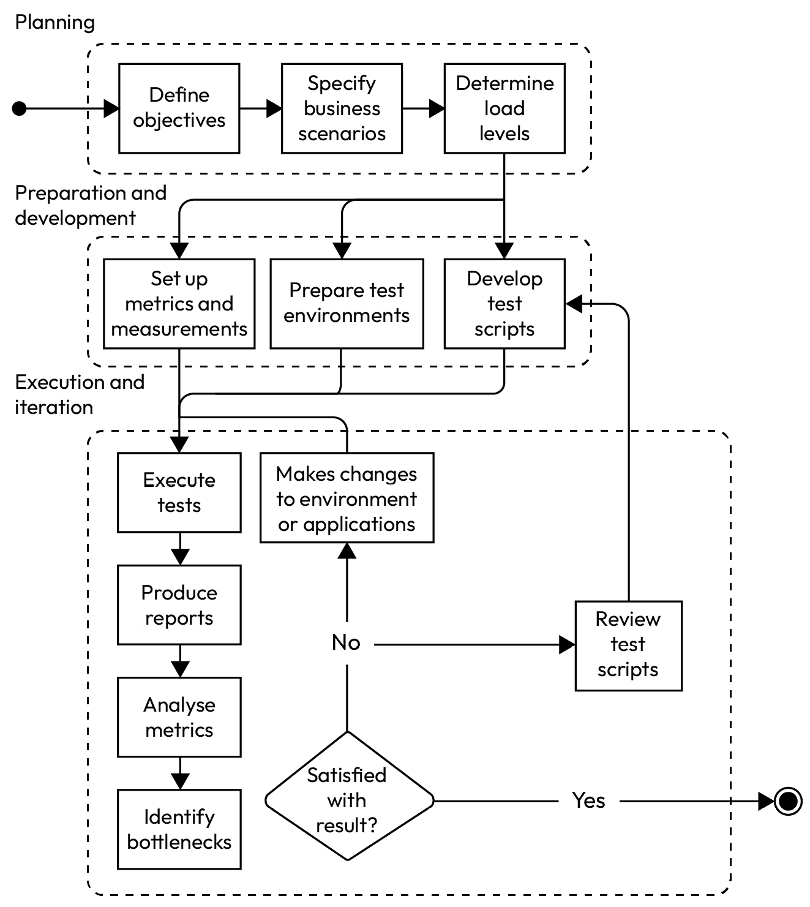
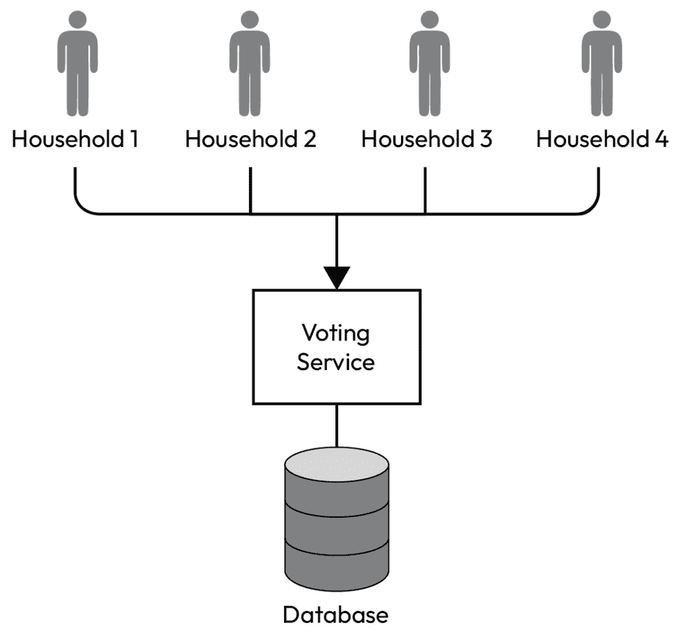
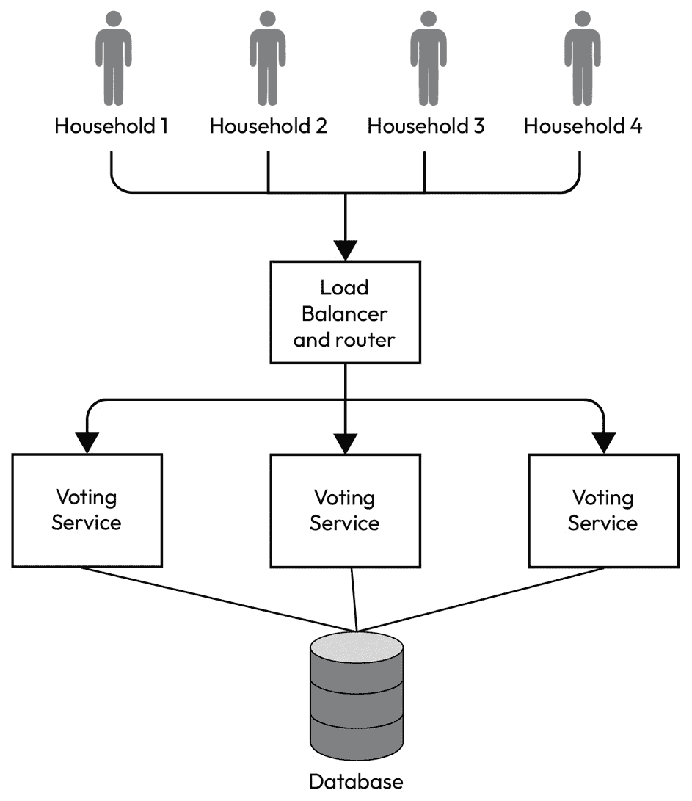
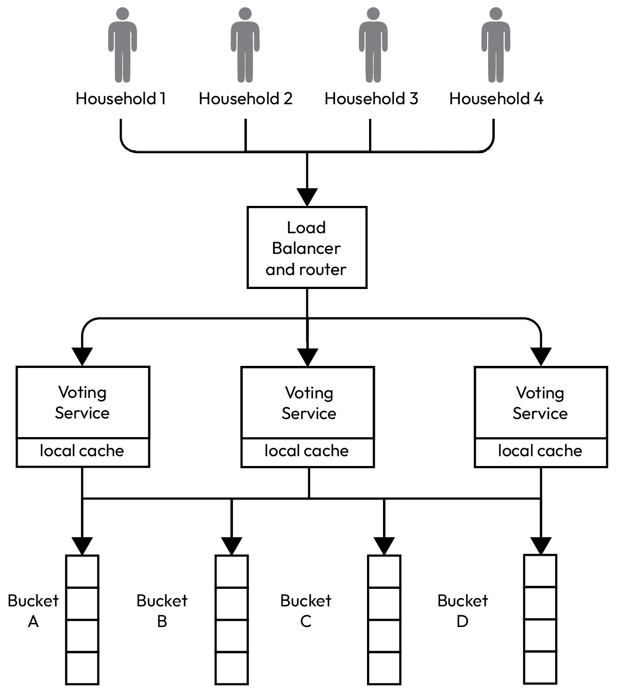
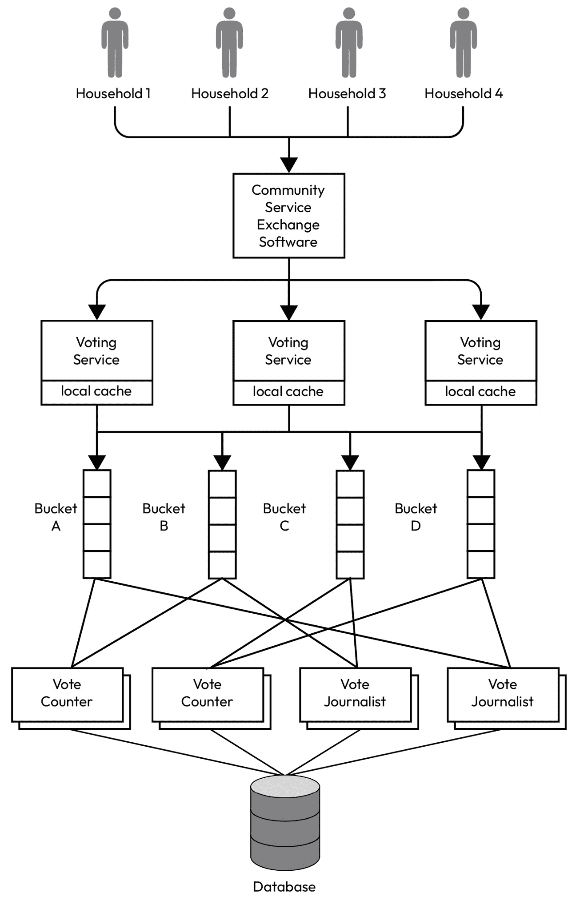

# 第十二章：性能和可扩展性

软件系统随着业务和不断变化的环境而增长，表现为更高的复杂性、更多样化的用户需求和更重的负载。在增长过程中保持高性能和可扩展性变得至关重要。性能指的是系统处理和响应请求的速度，而可扩展性描述的是系统随着时间的推移处理更高流量和使用的容量。

低性能可能导致令人沮丧的用户体验、生产力下降，甚至完全的系统故障。而无法扩展以满足日益增长需求的系统将很快变得不堪重负，无法使用。因此，确保最佳性能和可扩展性是任何软件工程项目的关键挑战。

在本章中，我们将探讨性能工程和可扩展系统设计的核心概念和原则。我们将讨论常见的性能瓶颈和缓解策略，回顾负载测试和基准测试的技术，并涵盖支持水平和垂直扩展的架构模式和设计选择。

到本章结束时，您将深入了解如何构建高性能、可扩展的系统，以承受现实世界需求的压力。

在本章中，我们将涵盖以下主题：

+   性能和可扩展性的维度

+   现在还是稍后优化性能？

+   性能测试规划

+   执行性能测试

+   微基准测试

+   性能提升策略

+   极低延迟系统

# 技术要求

您可以在 GitHub 上找到本章使用的所有代码文件：[`github.com/PacktPublishing/Software-Architecture-with-Kotlin/tree/main/chapter-12`](https://github.com/PacktPublishing/Software-Architecture-with-Kotlin/tree/main/chapter-12)

# 性能和可扩展性的维度

性能是系统执行任务和响应请求的效率。它通过各种指标来衡量：

+   **延迟**：系统响应请求所需的时间。

+   **吞吐量**：在给定时间框架内处理的请求数量。

+   **资源利用率**：在操作期间使用的资源（例如 CPU、内存、网络、文件等）的百分比。

+   **并发用户**：系统同时有效服务而不会降低性能的用户数量。

+   **页面加载时间**：屏幕完全加载所需的总时间，包括所有资源（图像、视频、脚本等）

+   **队列大小**：等待服务器处理的请求数量

+   **首次字节时间**（**TTFB**）：从客户端发起请求到客户端从服务器接收到第一个字节所经过的时间。

+   **缓存命中率**：从缓存中服务请求的百分比与从较慢的二级数据源中服务请求的百分比。更高的比率表明缓存效率更高。

+   **错误率**：导致错误的请求百分比（例如，HTTP 错误状态）。高错误率表明应用程序或基础设施存在问题。

可扩展性是指系统在不降低性能的情况下处理增加负载的能力。它表明系统可以增长并适应用户流量和数据量的增加。可扩展性可以分为两种类型：

+   **垂直扩展**：向单个节点添加更多资源（例如，CPU 或 RAM）以增加其容量。这也被称为**向上扩展**。

+   **水平扩展**：向分布式系统中添加更多节点以分散负载并提高容量。这也被称为**向外扩展**。

可扩展性也是系统在负载减少时缩小规模的能力。缩小规模通常涉及资源的灵活使用和成本节约。这仍然是可扩展性的一个重要方面，但重点通常放在向上扩展和向外扩展上。

可扩展性可以通过以下指标来衡量：

+   **可扩展性比率**：性能增加与资源增加（如服务器数量）之间的比率

+   **扩展时间**：向系统中添加资源到额外资源变为可操作之间的时间

这些指标有助于衡量系统中的变化可能如何影响性能和可扩展性。没有它们，很难决定是否应该优化性能。我们将在下一节深入讨论这个决定。

# 现在优化性能还是以后再优化？

工程师和架构师经常面临是否应该现在优化性能还是以后再优化的问题。这发生在系统设计的早期阶段，以及已经建立的生产系统中。

我们都知道优化性能至关重要，但是否从第一天开始就优先考虑它并不是一个简单的是非问题。

你可能听说过有人说过“*过早优化是万恶之源*”。这个说法本身很戏剧化，但其中确实有一些优点。

你可能也听说过一句名言，“*先让它工作，再让它正确，最后让它变快*。” 这是由软件工程师*Kent Beck*提出的。

那么，如果系统过早优化，或者如果我们过早地“让它变快”，会有什么后果呢？

在了解用户行为和需求之前花费太多时间进行性能改进可能导致努力白费。此外，它创建了一个不必要的复杂架构，阻碍了团队的效率。团队可能不得不简化过度设计的系统，这也需要付出努力。从这个意义上说，团队因为过早提高性能而受到了两次惩罚。

## 优化性能和可扩展性的考虑因素

在考虑系统是否应该为了性能和可扩展性进行优化时，有几个因素需要考虑：

+   **核心功能完整性**：如果一个系统的核心功能仍在开发中，那么最初专注于交付核心功能和功能通常更为重要。这是第一步：“*让它工作*。”

    此外，我们必须确保系统按照功能要求的行为符合预期。正确性始终应该优于性能。这是第二步：“*让它正确*。”

+   **性能指标**：在优化性能或提高可扩展性之前，拥有当前的性能指标作为基准至关重要。性能基准可以提供关于当前系统瓶颈的见解，帮助团队确定哪个区域应该首先改进。

    性能基准测试可以经验性地和客观地比较一个变更是否导致了更好的或更差的表现，或者是否尝试改进性能已经达到了其目标。

+   **非功能性需求**：非功能性需求是关于系统是否需要现在进行优化的有用指导。性能的非功能性需求可能由监管约束、外部系统集成合规性或用户体验原则驱动。

+   **关键用例、用户体验和竞争对手**：如果一个应用从一开始就预计要处理大量流量（例如，产品发布活动、培训或营销活动），那么早期优化是必不可少的。如果一个应用的性能直接影响用户满意度，那么早期解决性能问题以避免负面反馈很重要。竞争对手的当前性能指标也表明了应用性能应该优化多少。

+   **可扩展性需求**：如果一个应用预计会有快速增长或扩展需求，那么从一开始就实施良好的性能实践可以在以后节省时间和精力。

## 性能最佳实践

即使现在可能不是优化性能的最佳时机，也有一些最佳实践至少可以避免性能变得更差：

+   **先测量**：测量当前的性能指标，理想情况下是所有操作，但底线是测量核心功能和最频繁的操作。

+   **实现基本优化**：在开发早期阶段，实现基本性能最佳实践，例如高效的数据库查询。

+   **可扩展性规划**：在设计系统架构时，考虑到可扩展性，以便在以后更容易优化而无需进行大规模重构。有时，这关乎不要设置限制，这些限制会限制可扩展性。

虽然不一定需要在第一天就优化性能，但将基本性能考虑纳入您的开发流程可以导致更好的长期结果。首先关注交付价值，然后随着应用的演变对性能进行迭代。让我们通过一个性能测量的例子来更好地理解这一点。

# 基本性能测量的示例

这是一个要测量的操作的基本示例：

```kt
fun sampleOperation() {
    Thread.sleep(1)
}
```

此示例的目标是找出以下方面：

+   **吞吐量**：每秒可以执行多少操作

+   **延迟**：平均完成一个操作所需的时间

必须定义一个小的函数`measureTotalTimeElapsed`来测量操作所有迭代的总时间消耗：

```kt
fun measureTotalTimeElapsed(
    iterations: Int,
    operation: (Int) -> Unit,
): Long =
    measureTimeMillis {
        repeat(iterations, operation)
    }
```

此函数使用标准库中的`measureTimeMillis` Kotlin 函数来捕获重复操作所花费的时间。

最后，这是启动测试的`main`函数：

```kt
fun main() {
    val iterations = 1_000
    val operationTime = measureTotalTimeElapsed(iterations) { sampleOperation() }
    println("Total time elapsed: ${operationTime / 1000.0} second")
    println("Throughput: ${iterations / (operationTime / 1000.0)} operations per second")
    println("Latency (average): ${operationTime / iterations} ms")
}
```

此函数定义了要执行 1,000 次的操作。通过使用 Lambda 表达式调用`measure` **TotalTimeElapsed**函数，该表达式运行`sampleOperation`函数，返回总的毫秒时间消耗。然后，吞吐量计算为迭代次数除以总消耗时间（秒）。平均延迟计算为吞吐量的倒数倒数——总时间消耗除以迭代次数。

这是运行测试的样本输出：

```kt
Total time elapsed: 1.264 second
Throughput: 791.1392405063291 operations per second
Latency (average): 1 ms
```

由于示例函数`sampleOperation`仅使线程休眠 1 毫秒，因此平均延迟如预期为 1 毫秒。在此运行中，吞吐量接近 800，但每次运行都会有所不同。

Kotlin 标准库提供了一些时间测量的函数：

+   返回时间消耗的毫秒数（在本例中使用）：`measureTimeMillis`

+   返回时间消耗的纳秒数：`measureNanoTime`

+   返回时间消耗作为`Duration`：`measureTime`

+   返回时间消耗和 Lambda 表达式返回的值：`measureTimedValue`

对于现实生活中的性能关键系统，这当然是不够的。因此，在下一节中，我们将介绍性能测试的主要类型。

# 性能测试

性能测试是一类测试，它评估系统在给定负载下的速度、响应性和稳定性。在本节中，我们将探讨性能测试的主要类型。

## 负载测试

负载测试旨在评估系统在预期负载条件下的行为，例如配置的并发请求数量。目标是识别在负载下性能可能下降的应用程序或基础设施中的瓶颈。它确保系统可以处理预期的流量而不会出现性能下降。

## 压力测试

压力测试旨在评估系统在超出其正常操作容量极限的极端负载条件下的性能。它们还帮助我们确定系统的断裂点以及它在压力下的失败方式，因此可以部署主动监控和警报以采取预防措施。

## 耐久性测试（浸泡测试）

耐久性测试，也称为浸泡测试，专注于系统在长时间内的稳定性和性能。这个长时间是用来识别随着时间的推移积累或出现的问题，例如内存泄漏、资源耗尽或性能下降。

## 峰值测试

峰值测试引入突然增加的负载（即“峰值”），以便我们可以观察系统在这种情况下的反应。结果说明了系统如何处理突然的交通变化而不会失败。

## 体积和延迟测试

体积测试评估系统在大量数据下的性能。延迟测试测量请求和相应响应之间的时间延迟。它们通常测量吞吐量和延迟等指标，以确保应用程序可以满足**服务级别协议**（**SLAs**）或**服务级别****目标**（**SLOs**）。

## 可伸缩性测试

可伸缩性测试旨在确定系统在响应增加或减少的负载时如何扩展或缩小。它测量在添加或移除资源时系统的性能。

## 配置测试

配置测试旨在确定性能的最佳配置。这包括在不同的配置下运行性能测试，包括硬件、软件和网络。

# 性能测试规划

虽然有不同类型的性能测试，但规划和执行性能测试的过程是相似的。区别在于每个步骤的细节。在本节中，我们将探讨规划和执行性能测试的旅程。

## 规划

在规划阶段，首先，应该定义测试的目标。这意味着我们必须定义我们希望从测试中获得的信息——例如，能否在 50 毫秒内创建一个家庭记录？系统能否在不降级的情况下处理 5,000 个并发请求？这些目标是规划执行性能测试的主要驱动力。它们还决定了可以使用哪种类型的性能测试。

然后，应该定义性能测试的业务场景。通常，目标会给出关于将使用哪些场景的很大提示，但值得探索每个场景中涉及的步骤的细节，并将它们正式化为测试脚本的蓝图。

规划的最后部分是指定要运行的负载级别，包括用户数量和测试持续时间。有时，并不清楚要运行哪个级别，特别是如果我们想找到系统的断点。这最初是可以接受的，因为性能测试旨在迭代运行。

## 准备和开发

一旦有了初步计划，性能测试就可以准备和开发。这些活动可以并行进行。

测试脚本是测试执行的核心。测试需要自动化以实现一致的结果。这涉及到一个重大的决定，即使用哪个工具。以下是一份常用工具的列表：

+   **Apache JMeter** ([`jmeter.apache.org/`](https://jmeter.apache.org/)): 开源，免费，支持图形用户界面，分布式测试，插件支持，基于 Java

+   **OpenText 的 LoadRunner** ([`www.opentext.com/`](https://www.opentext.com/)): 商业许可证，图形用户界面，与 CI/CD 工具集成，支持分析和报告，以及 Java 支持

+   **Gatling** ([`docs.gatling.io/`](https://docs.gatling.io/)): 开源，带有额外功能的商业许可证，脚本可以用 Kotlin 编写

+   **K6** ([`k6.io/`](https://k6.io/)): 开源，基于订阅的云功能，可以与用**JavaScript**（**JS**）编写的 CI/CD 脚本集成

+   **Locust** ([`locust.io/`](https://locust.io/)): 开源，支持图形用户界面，分布式测试，脚本用 Python 编写

+   **BlazeMeter** ([`www.blazemeter.com/`](https://www.blazemeter.com/)): 免费版功能有限，商业许可证，基于云，支持图形用户界面，实时报告和分析，与 CI/CD 集成，支持 JMeter 脚本

这些工具提供全面的功能，例如组织测试脚本、管理多个测试配置、度量测量、分析和报告。您还可以选择构建自己的性能测试驱动程序。如果测试简单且没有外部工具的度量测量足够，则适用。

需要根据测试脚本的要求设置适当的度量测量。这些度量可以通过测试工具或如前所述已嵌入系统的监控工具进行测量。任何缺失的度量在执行测试之前都需要设置。

同时，需要设置一个测试环境以进行执行。理想情况下，环境应该与系统实际运行的实际生产环境相当。如果成本太高，可以使用较小规模的环境来预测预期性能，同时考虑到一定的误差。

测试环境应该是一个隔离的沙盒，只进行性能测试。对于某些组织来说，复制类似生产环境的性能测试环境可能是一个挑战。仅用数据复制环境可能对某些组织来说已经是一个挑战。此外，环境需要具备运行测试场景所需的数据。

有时，系统会与第三方系统集成。在这种情况下，外部集成需要使用模拟器进行模拟。

## 执行和迭代

一旦我们设置了测试脚本、测试环境和相应的指标，我们就可以执行性能测试。允许迭代反馈循环至关重要，其中测试可以多次运行，并且每次测试之间可能会有变化。在每次迭代中，应执行相同的操作多次，以便我们有足够的数据点进行分析。

至少应运行两次测试，初始运行识别瓶颈，然后进行更改以消除瓶颈，最后再次运行以证明瓶颈不再存在，如指标所示。

实际上，在消除最大的瓶颈之后，另一个瓶颈将会出现。性能景观将随着为提高性能所做的每一次改变而改变。当目标完成时，迭代可以结束，或者在这个过程中可能会发现新的问题。

性能测试的迭代执行可以在*图 12.1*中看到：



图 12.1 – 性能测试的示例工作流程

在每次运行中，测试通过执行测试脚本进行。测试脚本通常以预热操作开始。例如，如果我们打算发送 10,000 个请求 100 次，前 10 次可以被视为预热，因此这些指标不考虑。

预热允许系统在实际性能测量之前达到稳定状态。处理初始请求触发缓存，使其填充频繁访问的数据。它还允许系统有效地分配资源，如线程、内存和数据库连接。通过预热系统，可以减少其他瞬态因素，如即时编译、垃圾收集和资源竞争。

在运行测试后，应从收集到的指标数据生成报告。报告应构建成一个允许迭代进行比较的格式。然后分析原始数据以生成如下统计图表：

+   响应时间的平均值和中位数百分位数

+   平均和峰值吞吐量；吞吐量的增加除以资源的增加，这表明了扩展效率

+   总体错误率和按类型划分的错误率

+   平均和最大延迟

+   能够处理而不降级的并发用户数量

+   维持负载的时间

从这些数字中，可以识别出一些瓶颈。一些数字可能低于非功能性需求、SLA 或 SLO。一些数字可能与其他数字相比特别慢。这些瓶颈推动了为提高整体性能所需的变化。

尤其是在早期迭代中，可能会发现测试脚本中的缺陷。测试脚本本身效率低下并导致系统变慢的情况并不少见。测试脚本可能包含不必要的循环或复杂的逻辑，这会减慢脚本的执行时间。测试脚本可能在请求之间有虚假的等待时间，这结果限制了吞吐量。其他因素，如错误处理、同步操作、资源竞争和网络性能，也可能扭曲性能测试的结果。这些发现导致测试脚本被审查和更新以供未来运行。

在进行修改后，应再次执行性能测试，以检查目标性能统计指标是否有所提升，同时确保这些更改不会在其他区域降低系统性能。

这种重复的练习会持续进行，直到我们对结果感到满意。有几个可能的情况，迭代应该停止：

+   测试目标已经完成——例如，我们已经检测到系统在不降低性能的情况下可以处理的最大请求数量。

+   性能指标已满足非功能性需求、SLA 或 SLO

+   性能测试所花费的时间已经超过了最初的时间盒限制

性能测试应被视为一种反复进行的练习。一次成功且令人满意的表现测试只能支持假设系统能够在测试脚本中的配置和参数下处理请求。由于业务增长和新功能的引入，系统使用模式会不断变化。

## 性能测试的好处

性能测试提供了在预配置负载下系统性能的见解。它表明我们如何优化系统以提供快速且可靠的用户体验，即使在重负载下也是如此。它帮助利益相关者了解系统限制并就扩展和基础设施做出明智的决定。它还在这些问题影响用户之前识别潜在问题，从而降低停机或服务退化的风险。

性能测试对于确保应用程序满足用户期望并在不同条件下保持稳定性至关重要。通过进行不同类型的性能测试，组织可以识别和解决潜在问题，优化性能，并提高整体用户满意度。

接下来，我们将考虑一种迭代使用的技术来衡量函数的性能。这种技术被称为微基准测试。

# 微基准测试

虽然性能测试关注的是系统级性能，但微基准测试是在函数级别对一小块独立代码的性能测量。微基准测试通常适用于以下领域：

+   整个系统核心处的算法——例如，互联网搜索引擎的搜索算法

+   用户最频繁使用的功能

+   作为 API 暴露给外部系统的功能

+   至关重要的代码路径和性能敏感

+   当比较一个函数、算法或代码更改的实现时

**Kotlin 基准测试** ([`github.com/Kotlin/kotlinx-benchmark`](https://github.com/Kotlin/kotlinx-benchmark)) 是运行 Kotlin 代码基准测试最流行的工具。它封装了经典的**Java 微基准工具**（**JMH**）框架，并通过**Java 虚拟机**（**JVM**）、JS、本地和甚至**Web Assembly**（**WASM**）支持 Kotlin。

## 使用 Gradle Kotlin DSL 脚本设置微基准测试

使用 Gradle Kotlin DSL 脚本设置基准测试很简单。例如，对于 JVM，我们需要以下插件：

```kt
plugins {
    id("org.jetbrains.kotlinx.benchmark") version "0.4.11"
    kotlin("plugin.allopen") version "2.0.20"
}
```

第一个插件用于 Kotlin 微基准测试，而第二个插件用于打开最终的 Kotlin 类以进行测试。现在，我们需要确保可以从存储库中查找插件和依赖项：

```kt
repositories {
    mavenCentral()
    gradlePluginPortal()
}
```

接下来，需要声明对 Kotlin 微基准测试的代码依赖项：

```kt
    implementation("org.jetbrains.kotlinx:kotlinx-benchmark-runtime:0.4.11")
```

然后，我们需要配置`allOpen`插件，使其仅打开带有`State`注解的 Kotlin 类：

```kt
allOpen {
    annotation("org.openjdk.jmh.annotations.State")
}
```

设置的最后部分是设置微基准测试本身：

```kt
benchmark {
    targets {
        register("main")
    }
    configurations {
        named("main") {
        }
    }
}
```

配置被命名为`main`并已被选中运行。可以配置预热迭代次数、要测量的迭代次数以及每次迭代应持续多长时间。然而，此示例中使用了基于注解的配置。

## 微基准测试

实际的基准测试运行器代码被注释，以便运行器可以按照特定配置执行它。请注意，此测试应放置在`main`源文件夹（而不是`test`源文件夹）中，以便插件可以捕获：

```kt
@State(Scope.Benchmark)
@Fork(1)
@Warmup(iterations = 10)
@Measurement(iterations = 20, time = 1, timeUnit = TimeUnit.MILLISECONDS)
class MicrobenchmarkingTest {
    private var data = emptyList<UUID>()
    @Setup
    fun setUp() {
        data = (1..2).map { UUID.randomUUID() }
    }
    @Benchmark
    fun combineUUIDBenchmark(): UUID = data.reduce { one, two -> one + two }
    private operator fun UUID.plus(another: UUID): UUID {
        val mostSignificant = mostSignificantBits xor another.mostSignificantBits
        val leastSignficant = leastSignificantBits xor another.leastSignificantBits
        return UUID(mostSignificant, leastSignficant)
    }
}
```

此微基准测试评估了结合两个`State`注解触发`allOpen`插件打开此类进行测试的功能的性能。然后，`Fork`注解定义了用于执行的线程数。其他注解指定了预热、执行迭代的次数以及每次迭代的持续时间。

例如，`setup`注解函数用于创建运行测试所需的数据，而具有`Benchmark`注解的`combineUUIDBenchmark`函数是主要要测量的功能。

## 微基准测试运行器

要运行微基准测试，我们可以使用以下 Gradle 命令：

```kt
./gradlew benchmark
```

结果摘要打印到控制台，而详细报告生成在`/``build/reports/benchmarks/main`文件夹下：

```kt
Success: 109349297.194 ±(99.9%) 15493649.408 ops/s [Average]
  (min, avg, max) = (55205844.260, 109349297.194, 132224154.121), stdev = 17842509.699
  CI (99.9%): [93855647.787, 124842946.602] (assumes normal distribution)
```

微基准测试的格式旨在比较运行情况。可以在运行之间进行改进，并且下一次运行应该展示这些更改是否产生了影响。

微基准测试是性能测试的一个有价值的子集，它专注于代码实现。通过了解独立函数的性能特征，工程师可以进行有针对性的优化。相比之下，性能测试采用整体方法来评估整个系统在各种条件下的性能。这两种实践对于交付高性能系统都是必不可少的。

另有一个工具可以测量和分析应用程序的性能，但通过图形用户界面进行可视化。这个工具被称为应用程序性能分析器，我们将在下一节中介绍它。

# 应用程序性能分析

性能分析通过监控和分析应用程序在运行时的性能来工作。性能分析器对代码进行仪器化并拦截调用以收集性能度量，例如已用时间和调用次数。它可以生成应用程序的堆栈跟踪，以可视化函数之间的关系。

性能分析工具还监控内存分配和释放，分析堆转储，并识别潜在的内存泄漏。

同时，性能分析工具测量代码各个部分消耗的 CPU 周期，并识别计算密集型函数。性能分析工具还监控其他资源的使用情况，例如文件操作、网络活动以及线程之间的交互，以提供资源利用的全面视图。

性能分析工具附带详细的报告，这些报告在用户界面中以可视化形式呈现，以帮助工程师定位需要优化的区域。

然而，由于侵入性的仪器化和测量，使用性能分析器运行应用程序会显著降低性能。捕获的度量数据应被视为实际运行时间的放大，并用于查找运行缓慢、效率低下或资源消耗大的区域。

对于 Kotlin 工程师，有几种流行的性能分析工具可供选择：

+   **YourKit Java 性能分析器** ([`www.yourkit.com/java/profiler/`](https://www.yourkit.com/java/profiler/))

+   **VisualVM** ([`visualvm.github.io/startupprofiler.html`](https://visualvm.github.io/startupprofiler.html))

+   **IntelliJ IDEA 性能分析器** ([`www.jetbrains.com/pages/intellij-idea-profiler/`](https://www.jetbrains.com/pages/intellij-idea-profiler/))

+   **JProfiler** ([`www.ej-technologies.com/jprofiler`](https://www.ej-technologies.com/jprofiler))

+   **Async Profiler** ([`github.com/async-profiler/async-profiler`](https://github.com/async-profiler/async-profiler))

+   **Java Mission Control** ([`www.oracle.com/java/technologies/jdk-mission-control.html`](https://www.oracle.com/java/technologies/jdk-mission-control.html))

应用程序剖析器应用于分析性能关键操作。由于仪器显著减慢，它们通常不会在生产环境中运行。在较低的环境中运行剖析器，输入模拟生产环境是很常见的。

接下来，我们将介绍一些性能提升策略。

# 性能提升策略

提升系统的性能通常需要一种多样化的方法，以解决各个方面的问题。没有银弹可以神奇地提升性能。然而，一些常见的策略有助于工程师解决问题，以满足非功能性需求。

## 测试，测试，测试

性能测试应持续和重复进行。当出现感知的性能问题时，如果不运行性能测试，很难知道根本原因。工程师不应盲目应用“性能修复”，而应首先执行性能测试以了解问题。

性能测试应被视为故障排除和发现工具。系统中总是存在让工程师感到意外的瓶颈。

## 避免昂贵的操作

更多的时候，性能问题是由操作的性质与实际实现之间的不匹配引起的。换句话说，资源被用于不必要的区域，这会导致过度使用资源和计算能力。如果过度消耗资源在昂贵的操作上，那么就会出现性能问题。

让我们考虑一个示例场景，该场景通过避免昂贵的操作来展示性能优化。

### 场景 – 对昂贵操作的迭代

想象一下有一个执行成本很高的函数。这种成本高的原因有几个：

+   这是一个远程同步调用到另一个应用程序

+   它计算成本高且/或资源密集

+   它涉及文件、数据库、消息传递、网络或其他资源

+   它可能被阻塞，直到结果返回

我们知道以下函数并不昂贵，但为了讨论的目的，让我们假装它是昂贵的：

```kt
fun someExpensiveOp(n: Int): Int = n
```

在这个函数之上，我们希望运行一些过滤、映射和选择：

```kt
    val result = listOf(1, 7, 3, 23, 63).filter {
        println("filter:$it"); it > 3
    }.map {
        println("expensive:$it"); someExpensiveOp(it)
    }.take(2)
    println(result)
```

首先，这段代码通过只过滤出大于 3 的数字来筛选。然后，它调用`expensive`函数并得到一个新的数字。最后，只选择昂贵的操作中的前两个数字。调用`println`函数以显示在`filter`、`map`或`take`函数中评估的值。

执行此段代码会产生以下控制台输出：

```kt
filter:1
filter:7
filter:3
filter:23
filter:63
expensive:7
expensive:23
expensive:63
[7, 23]
```

如果这些数字大于 3，则评估所有五个数字。数字`7`、`23`和`63`大于 3，因此它们被传递给`expensive`操作。最后，只返回昂贵的操作中的前两个数字。

对于第三个数字的昂贵操作是不必要的，因为最终只选择了前两个数字。此外，它可以在过滤过程中找到前两个数字并停止检查其他值。

使用 Kotlin 标准库中的`asSequence`函数优化后，代码如下所示：

```kt
    val result = listOf(1, 7, 3, 23, 63)
        .asSequence().filter {
            println("filter:$it"); it > 3
        }.map {
            println("expensive:$it"); someExpensiveOp(it)
        }.take(2)
    println(result)
```

然而，执行前面的代码会在控制台打印以下内容：

```kt
kotlin.sequences.TakeSequence@246b179d
```

没有过滤，没有昂贵的操作或选择被运行。这是因为`asSequence`函数直到有终端函数才会构建列表。让我们更新代码：

```kt
    println(result.toList())
```

现在，执行会在控制台打印以下内容：

```kt
filter:1
filter:7
expensive:7
filter:3
filter:23
expensive:23
[7, 23]
```

序列操作只理解只取前两个数字，因此它寻找大于 3 的第一个两个数字并停止。数字`63`甚至没有被处理。第一个大于 3 的数字是`7`，所以`7`被传递到`昂贵的`操作。第二个大于 3 的数字是`23`，所以`23`也被传递到`昂贵的`操作。与之前的实现相比，这种实现节省了一个`昂贵的`操作。

## 性能改进之旅的例子

村庄中的住户已经决定运行一项调查来评估每个住户的服务。投票包括从 1 到 3 的评分：

+   **1**: 好

+   **2**: 一般

+   **3**: 差

一个住户可以为所有其他住户投票，但每个住户只能投一票。住户有 1 天时间提交所有投票。让我们也假设一个住户只提供一项服务。

每个住户都有一个“得分”，这是所有投票的排名数字之和。得分最高的住户成为村庄中提供最佳服务的住户。

因此，如果村庄中有*n*个住户，最大投票数将是`n x (n- 1)`。我们需要一个系统来计算所有被投票住户的得分，并记录所有投票作为审计记录。系统还需要在投票进行时显示每个住户的非最终得分。

这个投票系统的简单架构可能如下所示：



图 12.2 – 模拟调查架构 v0.1

所有住户将他们的投票提交给**投票服务**进行验证。服务验证以下方面：

+   所有参与的住户都是有效的

+   一个住户不能为自己投票

+   一个住户只能对另一个住户投一次票

+   投票具有有效排名

由于投票在村庄的一天内进行，系统需要快速响应（**延迟**），以便在特定时间段内处理大量投票并支持大量住户（**可扩展性**）。

系统预期在某一时刻会有许多并发请求到**投票服务**，这可能会导致峰值。

可以通过添加更多资源（CPU、内存等）来垂直扩展服务。然而，在 CPU 插座数量或最大支持的 RAM 方面存在物理限制。添加更多资源也会导致收益递减，即由于其他瓶颈，性能不会成比例提高。唯一的运行实例也是单点故障，如果这个实例失败，整个系统将不可用。

或者，如果我们添加更多服务实例，系统可以水平扩展。可以部署一个**负载均衡器**来在服务的多个实例之间分配负载，防止任何单个实例成为瓶颈。这通过启用并行处理显著提高了吞吐量。

负载均衡器对每个实例的负载有一些了解，因此它可以路由下一个请求到负载最少的实例。这使我们能够添加更多实例来处理增加的负载。因此，架构已经改变，如*图 12.3*所示：



图 12.3 – 模拟调查架构 v0.2

现在，**投票服务**有两个状态验证规则。第一个是参与的家庭必须是有效的。第二个是每个家庭只能对其他家庭投票一次。

家庭记录经常被访问，并且可以在数据库中远程查询。在每个服务实例中**缓存**所有家庭记录是一种合理的策略，可以加快验证速度。

执行一条规则，即一个家庭只能为另一个家庭投票，将受益于缓存。如果我们缓存一个给定家庭已投票的家庭列表（即*x-voted-by-y 列表*），那么我们可以执行这项业务规则。然而，如果任何实例可以处理任何家庭，那么它意味着共享这个列表，这会带来复杂性。

我们可以考虑两种选择。第一种选择是我们可以使用如 Redis 这样的分布式内存数据库，这样*x-voted-by-y 列表*就可以共享，但代价是拥有一个分布式内存数据库和潜在的资源竞争。

第二种选择是配置负载均衡器，使其支持粘性路由。来自一个家庭的请求总是路由到负责的实例。每个实例都知道自己的分配，并在启动时可以本地缓存数据库中的*x-voted-by-y 列表*。本地缓存也会在处理传入请求时更新。

到目前为止，瓶颈已经转移到数据库，因为所有流量最终都会流入其中，每个请求只有在数据库操作完成后才能得到响应。这影响了每个投票请求的响应延迟。

需要为每个被投票的家庭计算分数。这是一个累积数，几乎没有并行处理的空间。每个经过验证的投票也需要作为审计记录保留在数据库中。

然而，由**投票服务**验证的投票可以进一步异步处理。每个投票可以根据被投票的家庭进行分区，因此如果**家庭 1**为**家庭 2**投票，则该投票将进入**家庭 2**的“桶”。

将一个家庭解析到桶中可以像模函数一样简单，即一个哈希数除以桶数的余数：

```kt
Bucket number = (hash number of household name) mod (number of buckets)
```

每个桶都是一个事件流。**投票服务**可以在将事件发布到代表该桶的事件主题后响应投票请求。投票计数、评分计算和投票持久化指标将在下游组件消费事件时进行处理。这种变化将显著降低每个投票请求的延迟。

更新的架构看起来像这样：



图 12.4 – 模拟调查架构 v0.3

这种方法有一个限制：运行时固定的桶的数量。事件已经路由到桶中，我们需要维护桶分配以正确计算分数。

下游操作最终需要在数据库中持久化结果，而我们希望避免数据库过载。让我们检查需要持久化的数据：

+   **每个家庭的分数**：每个家庭一个累积数；历史数字无关紧要

+   **投票审计记录**：每条记录都需要保留，并且每条记录之间相互独立

分数数字和投票审计记录在性质上不同，因此它们以不同的方式处理是有意义的。最好将这种临时数据保存在瞬态本地缓存中，以减少数据库负载，但定期持久化这些值。

在这里，我们可以介绍两个组件：

+   第一个组件，**投票计数器**，消费其分配的桶的事件流，并为它负责的家庭计算分数。它不会立即更新数据库中的分数记录。相反，它会按照固定的时间表刷新最新的分数到数据库中——例如，每 10 分钟一次。这种机制“吸收”了投票的峰值，并将其转化为常规更新。

    有多个**投票计数器**实例，并且至少应该有两个实例消费一个桶以提供可用性。每个分数记录应包括家庭名称、投票数、分数和时间戳。应该有去重规则，只持久化较新的记录并跳过旧的记录。

+   第二个组件，**投票记者**，一次消费一批事件，并将更新在一个事务中刷新到数据库。如果事务失败，批次中的事件不会被确认，并将稍后再次处理。**投票记者**实例应配置为只有一个实例接收事件批次。批量处理显著增加了投票审计记录持久化的吞吐量。然而，它需要性能测试来发现可以随着投票数量扩展且仍在进程内存限制内处理的最佳批次大小。

考虑到所有这些性能问题，我们得到了最终的 1.0 架构，如图*图 12.5*所示：



图 12.5 – 模拟调查架构 v1.0

在这个架构中，我们优化了将传入请求负载均衡到多个**投票服务**实例以进行验证的过程。这增加了吞吐量和可伸缩性。然后，我们在每个服务实例中引入了住户和*x-voted-by-y-lists*的本地缓存，以加快验证过程。它还通过添加更多实例支持水平扩展。

然后，我们为每个只负责几个住户的事件流创建了一些桶。在**投票服务**验证请求有效后，它响应原始请求并向相应的桶发布事件流。这减少了投票请求响应的延迟：

+   **投票计数器**被引入以计算分配给给定桶的住户的分数。它定期将最新分数发送到数据库，并吸收峰值。

+   **投票记者**被引入以一次接收一批事件，并将它们在一个事务中持久化到数据库。批量处理增加了投票审计记录持久化的吞吐量。

在这个例子中，我们学习了如何优化系统的吞吐量、延迟和可伸缩性。性能改进是非常情境化的。我们绝对不应该将一个模式复制到另一个系统中并相信它将表现良好。性能需要被衡量和测试。只有当指标证明时，一个变化才被认为是性能改进。然而，一些已知的性能最佳实践可以改进，我们将在下一节中介绍。

## Kotlin 的性能最佳实践

Kotlin 有一些旨在减少开销并因此提高性能的功能。然而，这些功能都有合理的依据，以便工程师可以在使用它们时做出有意识的决策。它们并不期望在没有理由的情况下被到处使用。

### 内联函数

内联 Kotlin 函数简单地复制到调用者以减少调用函数本身的必要性。这在存在函数调用栈较深或存在高阶函数的情况下特别有用。

内联函数可以通过在函数级别添加修饰符来声明，如下所示：

```kt
inline fun <T> measureTime(block: () -> T): T {
    val start = System.nanoTime()
    val result = block()
    val timeTaken = System.nanoTime() - start
    return result.also { println("taken: $timeTaken") }
}
```

### 使用不可变和可变数据结构

不可变数据消除了多线程环境中的锁定需求。在 Kotlin 中，`List`、`Set`和`Map`集合使用不可变数据。

然而，如果我们正在构建一个更大的对象，例如字符串，建议使用可变集合或`StringBuilder`类来避免不必要的对象创建，这可能会在 Kotlin/JVM 中触发垃圾回收。

### 使用协程进行异步操作

Kotlin 的协程库使程序能够调用异步操作，这样线程就不会被阻塞，可以在等待异步结果返回的同时执行其他操作。它使应用程序的资源管理更好，响应更快。

例如，想象有两个耗时的函数：

```kt
suspend fun task1(): Int {
    delay(1000)
    println("Task 1 completed")
    return 42
}
suspend fun task2(): Int {
    delay(1500) // Simulate a 1.5-second delay
    println("Task 2 completed")
    return 58
}
```

这两个函数具有`suspend`修饰符，表示它们可以在不阻塞线程的情况下暂停和恢复。使用这两个挂起函数的`main`函数如下所示：

```kt
fun main() =
    runBlocking {
        val result1 = async { task1() }
        val result2 = async { task2() }
        val combinedResult = result1.await() + result2.await()
        println("Combined Result: $combinedResult")
    }
```

`runBlocking`函数启动一个协程，直到其执行完成才释放当前线程。在这个块中，有两个`async`函数来调用两个耗时的`suspend`函数。`async`函数返回一个`Deferred`对象，我们在这个对象上调用`await`函数以阻塞，直到结果返回。两个耗时函数返回的数字相加，并将总和打印到控制台。

注意，即使考虑到性能的最佳实践，用 Kotlin 编写的代码仍需进行测量。经验结果才是唯一的证明。

接下来，我们将简要介绍超低延迟系统以及它们如何将性能和可扩展性推向极致。

# 超低延迟系统

超低延迟系统在微秒或纳秒量级运行。它们在一个低响应时间至关重要的环境中运行，甚至可以说是必不可少的。这些系统可以在金融交易、电信、游戏和工业自动化中看到。

这些系统旨在实现尽可能低的延迟、最高的效率、高可预测性和高并发性，以处理。它们涉及系统的各个方面以减少响应时间，例如网络优化、硬件加速、负载均衡和高效算法。

这些系统通常用系统级编程语言如 C++和 Rust 编写。然而，也有一些超低延迟系统是用 Kotlin 或 Java 编写的，它们在微秒量级运行。

Kotlin 或 Java 中的低延迟系统采用了一些不太常见的技术设计：

+   重复使用对象，避免创建对象，并避免垃圾回收。

+   使用特定的 JVM 供应商以获得更好的性能。

+   避免使用第三方库以减少开销并确保您对性能有完全的控制。

+   使用 **Disruptor 模式**，因为它提供了一个大环形缓冲区，用于线程间的无锁通信，并在线程中提供内存屏障以实现数据可见性。

+   为每个 JVM 进程使用单线程模型以减少上下文切换、锁竞争以及同步和并发处理的需求。

+   编写或设计对底层硬件和网络基础设施有意识且针对其优化的代码或系统。这也被称为 **机械同理心**。

超低延迟系统有理由打破一些设计原则（例如，不可变对象），以换取更高的性能。由于对低延迟、高吞吐量和快速响应时间的严格要求，它们是特殊情况。在开发这些系统时，性能测试至关重要，应成为常规开发活动的一部分。

开发超低延迟系统是一个专业话题，其内容超出了本章的范围。然而，有一些阅读材料可能对您有所帮助：

+   *机械同理心*，由马丁·汤普森撰写 ([`mechanical-sympathy.blogspot.com/`](https://mechanical-sympathy.blogspot.com/))

+   *LMAX Disruptor* ([`lmax-exchange.github.io/disruptor/`](https://lmax-exchange.github.io/disruptor/))

+   *简单二进制编码* ([`github.com/real-logic/simple-binary-encoding`](https://github.com/real-logic/simple-binary-encoding))

+   *Aeron 消息传递* ([`github.com/real-logic/aeron`](https://github.com/real-logic/aeron))

# 摘要

在本章中，我们涵盖了性能和可扩展性的不同维度，并提到了一些衡量系统性能和可扩展性的基本指标。我们强调了性能测试的重要性，几种类型的性能测试以及如何规划它们。我们还提供了一个 Kotlin 中的微基准测试示例，然后讨论了使用分析器以实现更好性能的方法。

然后，我们深入探讨了性能提升的一些策略。我们考虑了一个只执行必要昂贵操作的场景。我们还观察了一个在现实情况下系统性能提升的例子。这使我们能够通过代码示例考虑一些关于 Kotlin 性能的最佳实践。

最后，我们简要介绍了超低延迟系统及其应用领域。

在下一章中，我们将讨论软件测试这一主题。
