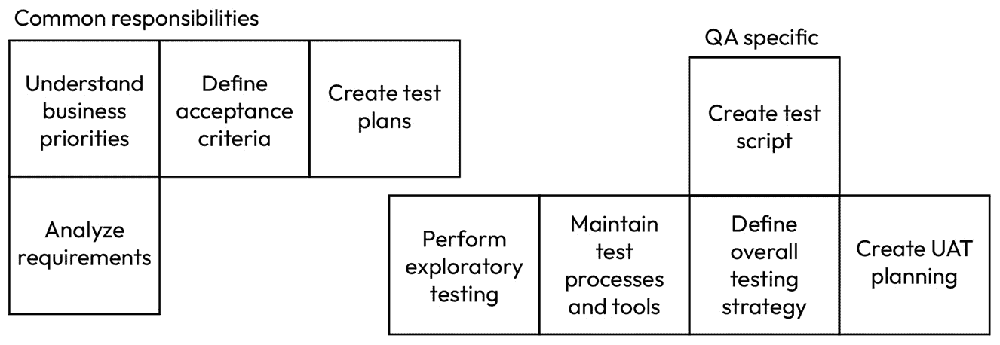
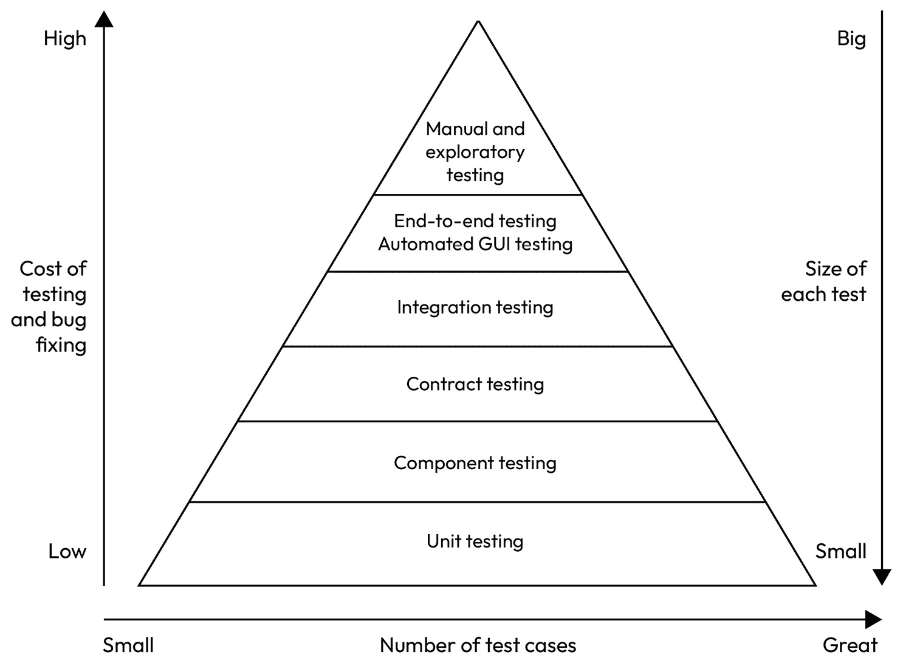
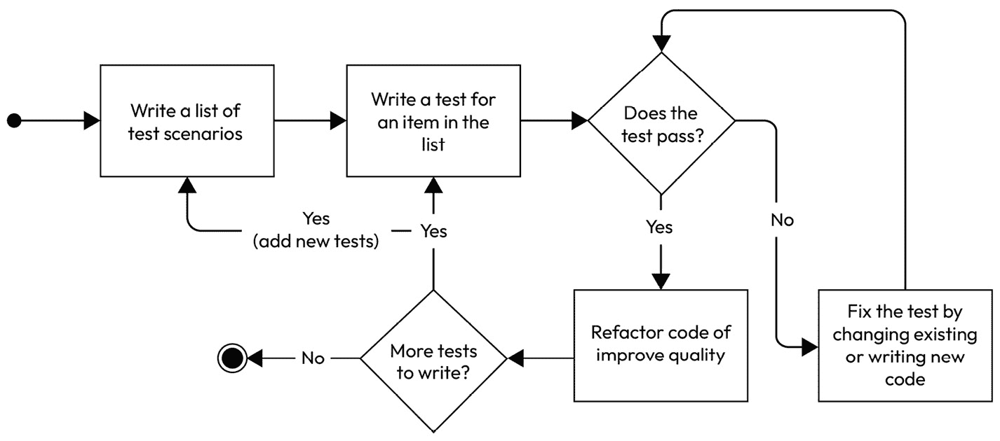

# 第十三章：测试

软件测试是软件开发生命周期中的一个关键部分，作为缺陷的防护措施，并提高软件产品的整体质量。**质量保证（QA**）的认证通常用作软件产品是否准备发布的指标。

本章深入探讨了软件测试的基本原则，探讨了其重要性、方法和最佳实践。

我们将讨论 QA 和软件测试人员在行业中的作用。我们将总结对这个角色的理解以及它可能对不同的人意味着不同的事情。

我们将探讨几种类型的软件测试和测试金字塔。此外，我们还将讨论自动化测试实践，这些实践因其提高效率和确保一致测试覆盖率的特性而受到欢迎。

我们还将通过使用 Kotest 进行严格的**测试驱动开发（TDD**）练习，深入了解这一方法。

本章旨在提供软件测试的全面概述，为您提供实施有效测试策略所需的知识和工具。本章将使您能够为创建满足用户期望并经得起时间考验的高质量软件做出贡献。本章将涵盖以下主题：

+   QA 的作用及其在软件开发中的参与

+   测试金字塔

+   带练习的 TDD

+   BDD

+   现场测试、A/B 测试和细分

# 技术要求

您可以在 GitHub 上找到本章中使用的所有代码文件：

[`github.com/PacktPublishing/Software-Architecture-with-Kotlin/tree/main/chapter-13`](https://github.com/PacktPublishing/Software-Architecture-with-Kotlin/tree/main/chapter-13%0D)

# QA 和软件测试人员的作用

软件测试的主要目标如下：

+   在产品达到最终用户之前识别和纠正缺陷

+   确保软件产品的行为符合功能规范或业务期望

即使对于初创公司或新公司首次发布的产品，这也是至关重要的。

QA 或软件测试人员的作用可能令人困惑，并且经常被误解。就像软件架构师作为一个角色一样，QA 不一定是一个职位名称，尽管您可能在就业市场上看到过这些标题：

+   QA

+   QA 测试人员

+   QA 工程师

+   质量工程师

+   软件测试人员

+   测试工程师

+   自动化测试人员

+   **测试开发工程师（SDET**）

不同的组织可能对每个标题有不同的解释或期望。在本章中，我们使用 QA 一词来代表负责软件质量的工程师。

QA 的作用如图 13.1 所示：



图 13.1 – QA 的作用

强调 QA 应该是一个全职的、嵌入到由业务功能组织的团队中的参与，正如在*第一章*中所述。QA 与其他工程师一样，参与理解业务优先级、需求分析、测试计划创建和验收标准定义。

然而，从这一点开始，QA 的关注点与为业务开发软件的工程师不同。QA 专注于整体测试策略、测试脚本创建、测试流程和工具、**用户验收测试**（**UAT**）规划和探索性测试。

QA 的目标与开发软件的工程师的目标相似。他们都希望软件具有完整的功能，足以满足业务期望。尽管如此，QA 在实现目标时确实有不同的关注点和方法——通过确保软件按照所需的高标准开发。

## 编码还是不编码？

关于 QA 是否应该编码的问题往往缺乏清晰性。QA 应利用所有可用的工具和资源来满足软件质量标准。编写代码对于创建特定的测试脚本或增强工具可能是必不可少的。最终，关于 QA 是否应该编码的争论有些误导；在许多情况下，编写代码是他们角色中必要的一部分。

行业中 QA 的职位通常包括术语*工程师*（例如，QA 工程师），当组织期望 QA 人员编写代码时。

## 软件质量是每个人的责任

说软件质量是每个人的责任似乎很显然，但对于某些组织来说可能并不那么清楚。软件质量最好是从软件开发过程开始到结束都嵌入其中。

这包括软件开发生命周期中的所有活动，从明确的企业优先级到编写良好的代码，最终到业务用户签字和软件发布。这涉及到团队中的每个成员，而不仅仅是 QA。

QA 是确保软件质量在每个步骤都得到关注的角色，因此结果是高质量且经过良好测试的软件产品。

随着软件系统复杂性的增加和对稳健应用需求的增长，有效的测试策略是必不可少的。通过采用系统化的测试方法，组织可以降低风险，减少与发布后缺陷相关的成本，并培养用户信任。

通过营造优先考虑 QA 的环境，组织不仅可以提高产品结果，还可以增强团队合作和沟通。

# QA 在软件开发生命周期中的参与

团队，包括质量保证人员，共同理解业务优先级。然后团队一起分析需求，并创建几个用户故事。每个用户故事代表一个工作单元，是更大业务功能的一部分，但每个故事也给业务带来一些价值。

用户故事需要细化，以便有一套验收标准，这些标准决定故事是否满足了利益相关者的期望。每个验收标准都应该是简洁且可测试的。

验收标准的惯例

验收标准可以遵循流行的**给定-当-然后**结构。*给定*提供了在执行操作之前系统状态的初始上下文。*当*是在给定上下文的情况下执行的操作。*然后*是执行操作后的预期结果。一个给定-当-然后结构中的验收标准示例如下：“*给定系统中不存在家庭，当在系统中创建家庭账户时，然后相应的家庭记录* *被创建。”*

从验收标准开始，工程师开始进行技术设计，以确定如何进行更改以满足条件。同时，质量保证人员开始创建测试计划，以验证更改是否满足条件。

测试计划应分解为实际的测试脚本。测试脚本是一系列详细的可执行脚本，描述了如何对软件进行测试。它包括设置数据（即*给定*），执行操作（即*当*），以及验证结果（即*然后*）。测试脚本可以是任何格式，例如步骤文档、自动化脚本，甚至是一个独立执行程序。测试内容的重要性高于格式。

除了脚本测试之外，质量保证人员还执行探索性测试，这强调测试人员的自主性和创造力。质量保证人员可以自由地探索应用程序，在积极测试的同时了解它。通常，质量保证人员会发现系统行为不一致、漏洞或隐藏缺陷，这些缺陷无法通过固定脚本发现。探索性测试通常有时间限制。还将有一份关于发现、发现的错误、异常行为和需要进一步调查的领域的文档。这些文档通常托管在**问题跟踪系统**中，如 JIRA、Asana、Trello、GitHub Issues 等。

质量保证人员也参与规划用户验收测试（UAT），其中涉及业务测试人员（利益相关者和可能的实际用户）。质量保证人员帮助塑造测试过程，并负责回应业务测试人员的查询。这也是质量保证人员确认需求是否完全捕获并识别任何遗漏在范围之外的功能的机会。

除了以业务交付为重点的测试活动之外，质量保证（QA）人员还负责制定整体测试策略，以与其他团队保持一致并分享最佳实践。QA 人员还负责维护测试流程和工具。通常情况下，QA 人员会增强现有的测试框架并维护端到端测试套件。

接下来，我们将专注于测试方法，从测试金字塔开始。

# 测试金字塔

测试金字塔是一个概念框架，其中软件开发中的各种测试层级以层次结构的形式出现。这个概念由马丁·福勒在 2009 年的*《测试金字塔》*文章中推广。测试金字塔在*图 13.2*中展示。2*：



图 13.2 – 测试金字塔

在本节中，我们将探讨测试金字塔的所有层级。

## 单元测试

金字塔的底层是单元测试。单元测试是测试金字塔的基础。它们关注可以独立测试的最小构建块。它们通常测试函数的行为，并且作为本地项目构建的一部分执行。

由于规模小和范围有限，单元测试相对容易编写和执行。单元测试可以在**集成开发环境**（**IDE**）中运行，这提供了最快的反馈循环。单元测试可以在几分钟内（如果不是几秒钟内）找到并报告错误。

如果任何单元测试失败，本地项目构建通常会失败。将自动化单元测试集成到构建过程中有助于在开发早期识别错误。在单元测试中测试和修复错误是最具成本效益的，因为错误规模较小，需要较少的努力来解决，并且与其他测试阶段相比提供更快的反馈。此外，系统通常比任何其他类型的测试都有更多的单元测试，因为单元测试针对的是最小的组件，与较大的测试相比，数量更多。

单元测试应该是具有意义的

虽然单元测试是可以测试的最小构建块，但也有一些情况下，一个函数太小而无法进行测试。如果工程师难以解释测试旨在验证的内容，那么这个函数可能太小而无法进行测试。通常，私有函数不需要单元测试，但被其他包（即公共函数）调用的函数应该有单元测试。仅仅为了避免代码重复而提取的函数不太可能形成需要测试的意义。总之，单元测试应该是具有意义的。

这里是一个由 Kotest 框架驱动的 Kotlin 单元测试的例子：

```kt
class FindBiggestNumberKtTest : FunSpec({
    test("Find the biggest out of positive numbers") {
        findBiggestNumber(listOf(17, 18, 6)) shouldBe 18
    }
})
```

Kotest 框架提供了许多作为规范的测试模板。`FunSpec` 是示例中使用的。测试用例作为 lambda 表达式传入。`test` 函数接受测试名称作为参数。在 `TestScope` 范围内的 lambda 表达式被传入以进行实际测试。这个单元测试针对 `findBiggestNumber` 函数，它接受一个整数列表：`17`、`18` 和 `6`。`shouldBe` 内联函数模仿自然英语语言，并验证预期结果是否为 `18`。

### 参数化测试

你可能会质疑是否一个测试用例不足以彻底测试这个函数。Kotest 框架支持以下参数化测试：

```kt
class FindBiggestNumberParameterizedTest : FunSpec({
    context("Find the biggest out of positive numbers") {
        withData(
            emptyList<Int>() to null,
            listOf(8) to 8,
            listOf(99, 8) to 99,
            listOf(17, 18, 6) to 18,
            listOf(944, 0, 633) to 944,
            listOf(0, -32, 76) to 76,
            listOf(-11, -32, -102) to -11,
            listOf(-25, -57, 0) to 0,
            listOf(
                Integer.MAX_VALUE + 1,
                Integer.MAX_VALUE,
                0,
                Int.MIN_VALUE,
                -Int.MIN_VALUE - 1,
                -Int.MAX_VALUE,
                Int.MIN_VALUE - 1
            ) to Integer.MAX_VALUE,
        ) { (allNumbers, expectedMax) ->
            findBiggestNumber(allNumbers) shouldBe expectedMax
        }
    }
})
```

对于一个接受整数列表并返回最大数字的函数，我们可以想到许多情况：

+   空列表

+   一个整数的列表

+   两个整数的列表

+   所有正整数

+   所有负整数

+   零、正数和负数的混合

+   最大值、最小值、最大值加一、最小值减一，以及这些整数的否定

使用参数化测试，可以以比我们必须将它们复制到单独的测试用例中更小的代码足迹测试它们所有。

在这一点上，你可能想查看正在测试的函数的源代码，以确保你已经覆盖了所有情况，但你需要吗？这里没有正确或错误的答案，因为它代表了两种软件测试方法：**黑盒测试**和**白盒测试**。请注意，这两种测试风格适用于金字塔中所有级别的测试。

在我们详细讨论这两种测试风格之前，让我们揭示实现：

```kt
fun findBiggestNumber(numbers: List<Int>): Int? = numbers.maxOrNull()
```

这是一个非常简单的实现，并使用内置的 `maxOrNull` Kotlin 函数在列表中找到最大数字或空列表的 null。

### 黑盒测试

黑盒测试评估被测试的功能，而不了解任何内部代码或结构。测试人员仅关注输入、预期输出和声称的功能（称为*合同*）。

### 白盒测试

白盒测试朝相反的方向进行。它涉及检查正在测试的功能的内部实现。测试人员了解代码和内部逻辑，使他们能够根据实现细节设计测试用例。

### 比较黑盒测试和白盒测试

黑盒测试关注会影响用户体验的结果和功能。不依赖于实现也使测试人员能够发现实际行为和预期行为之间的任何差异，揭示可能没有充分定义的需求。然而，它可能会在测试套件中错过一些代码分支，这可能会阻碍完整的代码覆盖率。通常，拥有独立 QA 团队且与开发团队分离的组织会使用黑盒测试作为其默认方法。

白盒测试能够全面测试内部逻辑，导致在特定情况下发现隐藏的漏洞或缺陷。了解代码也有助于测试人员识别安全漏洞和优化机会，这些可以帮助满足非功能性需求。了解代码也可能在测试用例中引入偏见，无意中省略了可以全面覆盖外部行为和用户体验的测试用例。

在这两种风格之间也存在人为因素。一旦测试人员看到了内部实现，就很难假装之前没有看到过，并编写无偏见的黑盒测试。

两种测试风格都有其优点和缺点。由于提到的人为因素，建议首先在不了解实现的情况下编写黑盒测试，并专注于测试外部行为。之后，检查实现来编写白盒测试用例，并专注于代码分支和非功能性需求。

这将导致一个称为 TDD 的话题，将在本章后面进行介绍。

## 组件测试

被称为**模块测试**的组件测试在金字塔中位于单元测试之上。它专注于测试自包含模块的高级行为。组件测试关注于由几个代码单元的交互产生的行为。

组件测试也被包括在本地项目构建的一部分。因此，如果组件测试失败，本地项目构建也会失败。它通常从 IDE 执行，以提供快速反馈循环。

然而，组件测试更大，需要更多的努力来编写。每个测试通常涉及在测试之前设置一组状态。测试本身通常涉及多个步骤，并且通常有多个地方需要验证结果。如果发现问题，问题所在并不立即明显，需要一些时间来调试和解决问题。因此，测试和修复错误的成本高于单元测试。

组件测试的一个例子可以在提到模块化和分层架构的应用程序中找到，如*第七章*所述。例如，如果我们使用**六边形架构**，可以在核心层进行组件测试，以验证纯业务逻辑，而不受技术选择的影响。如果应用程序的边界上下文属于核心域，这如*第八章*所述，这尤其有用。

核心域的核心层通常被视为整个系统的“皇冠上的宝石”。它作为一切围绕其旋转的心脏。它主张使用组件测试来确保在系统中的每一次变更中，核心的纯业务行为都保持完整。

使用黑盒测试首先对核心域的核心层进行组件测试将成为**行为驱动开发（BDD）**方法，这将在本章后面讨论。

### 模拟外部资源

在编写组件测试时，几乎不可避免地会遇到代码试图与外部资源（如队列、文件、数据库或其他应用程序）集成的场景。这些集成点给测试人员带来了准备测试环境和增加编写测试工作量的负担。

模拟使测试人员能够将正在测试的组件从外部依赖项中隔离出来。有一些常见的模拟场景：

+   验证组件是否按预期与外部依赖项交互，例如检查是否调用了具有预期参数的正确 API

+   使组件测试能够在不需要外部依赖项（例如数据库）可用的情况下运行

+   验证组件是否能够按预期处理外部依赖项的失败

+   维护允许测试不同条件的状态，例如根据测试的上下文返回不同的值

这里是一个使用 Kotest 进行组件测试的模拟示例：

```kt
class ExerciseExecutorTest : BehaviorSpec({
    Given("Today is sunny") {
        val exerciseLog = mockk<ExerciseLog>()
        val executor = ExerciseExecutor(exerciseLog)
        every { exerciseLog.record(any(), any()) } returns Unit
        val weather = Weather.SUNNY
        When("doing an exercise") {
            val now = Instant.now()
            Then("running in the park") {
                executor.doExercise(weather, now) shouldBe Exercise.RunInThePark
            }
            And("the exercise is logged") {
                verify { exerciseLog.record(Exercise.RunInThePark, now) }
            }
        }
    }
})
```

首先，这个组件测试使用了遵循给定-当-然后（given-when-then）格式的 Kotest 的`BehaviorSpec`。它还匹配**安排（Arrange）**、**执行（Act）**、**断言（Assert）**（**3A**）的测试模式。

3A 测试模式

3A 测试模式可以在单元测试中使用。它帮助工程师和测试人员通过将测试分为三个不同的部分来组织测试。因此，测试脚本更容易阅读、理解、推理和维护。"安排（Arrange）"是测试的先决条件和输入数据的初始化。"执行（Act）"是执行被测试的行为。"断言（Assert）"是验证实际结果与预期结果是否一致。

其次，存在一个外部的`ExerciseLog`依赖项，可能涉及在文件或数据库中持久化数据：

```kt
interface ExerciseLog {
    fun record(time: Instant, exercise: Exercise)
}
```

函数记录接受一个`Exercise`对象和练习完成时的相应时间：

```kt
enum class Weather {
    SUNNY,
    RAINY,
    CLOUDY,
    STORMY,
}
```

由于测试的重点是`ExerciseExecutor`的逻辑，而不是`ExerciseLog`，我们使用了`ExerciseLog`接口的`mockk`函数。我们设置模拟对象以接受任何参数的`record`函数调用，并返回一个`Unit`。

主要验证是当天气晴朗时，该函数返回由这个密封类定义的`RunInThePark`：

```kt
sealed class Exercise {
    data object RunInThePark: Exercise()
    data object GoToGym: Exercise()
}
```

第二个验证是`ExerciseExecutor`已将正确的参数传递给`ExerciseLog`以记录此练习。以下是`ExerciseExecutor`的完整实现：

```kt
class ExerciseExecutor(
    private val log: ExerciseLog
) {
    fun doExercise(
        weather: Weather,
        time: Instant
    ): Exercise {
        val exercise = when (weather) {
            Weather.SUNNY, Weather.CLOUDY -> Exercise.RunInThePark
            Weather.STORMY, Weather.RAINY -> Exercise.GoToGym
        }
        log.record(time, exercise)
        return exercise
    }
}
```

模拟是软件测试中使用的五种**测试替身（test doubles）**类型之一。以下是完整的列表：

+   **模拟（Mocks）**：这些预先编程了它们应该如何被使用的期望。它们被用来验证特定的函数是否以预期的参数被调用

+   **存根**：这些为函数提供预定义的响应，但不验证交互。

+   **间谍**：间谍记录使用的参数并计算函数调用次数。实际的函数仍然被调用。

+   **模拟**：这些允许在测试目的下简化外部依赖的实现。

+   **模拟对象**：模拟对象是一个简单的对象，仅用于满足参数要求，而不需要实现任何行为。

## 合同测试

**合同测试**：这主要关注 API 生产者和消费者之间的交互。它仅针对通信协议和消息内容。不应将其用于业务案例测试，因为我们已经有组件测试在测试金字塔的较低层次覆盖了这一点。

合同测试有两种类型：

+   **消费者测试**：这主要关注向其他服务发出请求的那个服务。它定义了它与生产者交互的期望，通常通过合同。它还验证消费者服务可以处理所有已记录的请求响应。消费者合同测试使用存根或模拟来设置目标服务以进行通信。

+   **生产者测试**：这主要关注提供其他服务所需功能或数据的那个服务。其目的是断言生产者已经履行了 API 合同并满足了消费者的期望。生产者测试可能涉及运行实际服务，这使得它似乎应该在测试金字塔的更高层次。也有可能生产者测试会模拟业务逻辑以产生合同中定义的消息和响应。生产者测试通常用于确保合同的更新和更改具有向后兼容性。

然而，重要的是让合同测试仅关注通信和消息内容。例如，`openapi.yaml`文件。这导致更可靠和可维护的系统，尤其是在微服务架构中。

## 集成测试

**集成测试**：这主要关注应用程序不同组件或模块之间的交互。在金字塔中，集成测试位于合同测试之上，因为集成测试不使用存根或模拟。它们在集成系统的各个部分时识别问题，并验证这些部分是否按预期协同工作。集成测试也是本地项目构建的一部分。

集成测试通常涉及数据库、文件系统、外部服务或 API。以下是一些常见的集成测试类型：

+   **API 集成测试**：使用公开的 API 与应用程序进行交互，以验证给定用例的结果和响应。

+   **数据库集成测试**：确认数据在数据库中正确处理。这通常与**创建、读取、更新、删除**（**CRUD**）操作相关。

+   **文件系统集成测试**：验证应用程序能否正确地从文件中读取或写入，并验证文件反映了测试中操作的结果。

+   **中间件或外部服务集成测试**：验证中间件或外部服务连接的集成配置是否正确，以及应用程序和中间件或外部服务能否按预期进行通信。

集成测试比组件和单元测试更大，因为需要配置和准备。集成测试编写和推理也更复杂。集成测试可能涉及各种配置组合，例如，支持多个可插拔数据库或消息提供者，而业务功能保持不变。

一些测试可能由于外部资源或外部服务的表现而变得不确定，尤其是如果存在应用程序之外的非同步处理。

参考组件测试，如果组件测试关注六边形架构应用的 Core 层，那么集成测试则关注适配器层。

在扩展练习代码示例的基础上，我们将编写一个针对`ExerciseLog`接口实现的集成测试，该接口为每次调用向文件追加一行。每行以 UTC 使用的本地日期时间开始，由冒号分隔，以锻炼的名称结束，如下所示：

```kt
2024-09-30T18:39:03.353250: GoToGym
```

集成测试可以编写如下：

```kt
class ExerciseExecutorIntegrationTest : StringSpec({
    "Gym when cloudy and run in the park when rainy as recorded in file log" {
        val file = File.createTempFile("Exer", "cise")
            .apply { deleteOnExit() }
        val exec = ExerciseExecutor(ExerciseFileLog(file))
        val now = Instant.now()
        val fourHoursLater = now.plus(4, HOURS)
        val utc = ZoneId.of("UTC")
        exec.doExercise(RAINY, now)
        exec.doExercise(CLOUDY, fourHoursLater)
        FileReader(file).readLines() shouldBe listOf(
"${now.atZone(utc).toLocalDateTime()}: GoToGym",
"${fourHoursLater.atZone(utc).toLocalDateTime()}: RunInThePark",
        )
    }
})
```

测试开始时创建一个临时文件，该文件将在退出时被删除。然后，将两个锻炼条目列表传递给`ExerciseFileLog`对象。验证开始时逐行读取文件，并断言每行包含预期的内容。

`ExerciseFileLog`类本身很简单：

```kt
class ExerciseFileLog(
    private val file: File,
) : ExerciseLog {
    val utc = ZoneId.of("UTC")
    override fun record(
        time: Instant,
        exercise: Exercise,
    ) {
        try {
            val utcDateTime = time.atZone(utc).toLocalDateTime()
            val text = "$utcDateTime: $exercise\n"
            file.appendText(text)
        } catch (e: IOException) {
            println("error writing to the file: $file")
        }
    }
}
```

测试脚本应主要是在支持性和通用子域应用程序中作为集成测试，如*第八章*中所述。这是因为这些子域通常不包含很多业务逻辑，或者业务用例的组合足够简单，可以被集成测试覆盖。

## 端到端和自动化 GUI 测试

到目前为止，我们讨论的所有测试都集中在单个后端服务或特定的软件组件组上。下一个层次是端到端自动化测试，这包括图形用户界面（GUI）测试和契约测试。此类测试评估系统在多个服务横向和多个层级纵向上的行为。此外，它对业务利益相关者来说更加透明。

端到端和自动化 GUI 测试专注于覆盖系统中的多个服务或组件的用户旅程。例如，端到端测试可能涉及创建两个家庭记录，然后一个家庭与另一个家庭签订合同。然后，两个家庭将协商以达成一致合同，最后，他们各自将执行合同中描述的服务合同。

端到端测试使用 API 与系统的各个部分进行通信，而自动化 GUI 测试模拟人类与系统的交互。

一些系统有一套公共 API，用于与外部**软件即服务（SaaS**）平台集成（如第六章所述）。在这种情况下，端到端测试应确保用户旅程可以通过调用公开的公共 API 来完成。这种公共 API 集成的测试，称为无头集成，与视觉 GUI 测试一样重要。

一个用户旅程的测试脚本复杂且脆弱。它需要在环境中运行多个服务，这意味着需要稳定的基础设施。测试所有用户旅程的变体并不实际，因为测试套件需要很长时间才能完成。

此层级的测试通常仅涵盖最关键和面向用户的功能。它们通常也仅涵盖成功案例。测试是定期运行或按需进行的。如果在测试过程中发现错误，则排查错误需要更长的时间，有时可能是由于环境中的稳定性问题而不是实际的错误。

## 手动和探索性测试

手动和探索性测试是金字塔中的最高层级。它不是自动化的，因此需要质量保证人员手动运行测试用例。这一层级的测试是最耗时和费力的。

如果可以自动化手册，质量保证人员将尽快自动化以降低成本。有一些情况下，手动测试是必要的：

+   **可用性测试**：评估用户体验需要主观分析，包括视觉布局、设计和整体满意度等元素。

+   **短期功能**：对短期功能的测试自动化投资可能是不合理的。

+   **上下文密集型测试**：一些测试高度依赖于复杂的流程、交互或上下文理解。自动化这些测试以使其可靠可能超过了手动测试的努力。

+   **安全性测试**：许多安全评估，如渗透测试，依赖于人类的安全专业知识来识别自动化测试可能无法捕捉到的漏洞。一些测试需要安全专家快速决定下一步；这些难以自动化。

手动和探索性测试通常是基于临时执行的；然而，一些组织允许质量保证人员将探索性测试时间框定以发现隐藏的缺陷和可用性问题。

## 测试金字塔的好处

测试金字塔作为软件开发生成测试策略的指导原则。随着测试和错误修复在每一级变得越来越昂贵，优先考虑单元测试，然后是组件测试，一直到最后是手动测试，这是很自然的，这样团队可以实现更高效和成本效益的 QA 流程。

通过将测试用例放在金字塔的适当层级，团队不仅提高了软件的整体质量，还允许快速迭代反馈循环，从而逐步改进软件开发实践。

到目前为止，本章中所有的测试用例示例都只使用了 Kotest。然而，还有几个其他框架也可以考虑：

+   Atrium: [`github.com/robstoll/atrium`](https://github.com/robstoll/atrium%0D)

+   Kluent: [`markusamshove.github.io/Kluent/`](https://markusamshove.github.io/Kluent/%0D)

+   Spek: [`spekframework.github.io/spek/docs/latest/`](https://spekframework.github.io/spek/docs/latest/%0D)

接下来，我们将讨论 TDD 方法。

# TDD

TDD 的历史可以追溯到 20 世纪 70 年代，当时讨论了“先测试”编程的想法。直到 TDD 成为 20 世纪 90 年代由 Kent Beck 引入的**极限编程**（**XP**）的一部分，它才变得流行。

XP

XP 是一种敏捷软件开发方法，旨在交付高质量的软件，满足不断变化的需求，并减少由于过程的不确定性带来的风险。它有五个核心价值观——*沟通*、*简洁*、*反馈*、*勇气*和*尊重*。它强调短迭代开发周期和开发人员与利益相关者之间的紧密合作，鼓励频繁的反馈以适应变化的需求。XP 的关键实践包括结对编程、TDD、持续集成和频繁发布小型和增量更改。

2002 年，Beck 出版了《Test-Driven-Development: By Example》一书，提供了关于 TDD 流程的详细指导，并自那时以来显著影响了大量的工程实践，甚至至今。在某些组织中，TDD 甚至已成为面试编码实践必备的技能。

TDD 使用一个简单的流程，即编写测试和生产代码，如图 *图 13.3* 所示：



图 13.3 – TDD 工作流程

TDD 的第一步是编写测试场景列表。测试场景是用业务语言编写的，不涉及技术实现。它描述了在特定条件下应用程序的预期行为，而不了解应用程序是如何实现它的。

从列表中选择一个测试场景，然后我们开始编写测试。这部分很有趣，因为测试用例代码通常无法编译，因为需要增强当前的 API 或创建一个新的 API。这是正常的，因为 API 合同应该从用户的需求中得出，而不是提供者。从用户的角度设计 API 自然符合我们之前讨论的**接口隔离原则**（**ISP**）。测试用例应该设置先决条件，尝试执行步骤，并验证结果。

此时，你面前的是一个要么不通过（**红色**）要么甚至无法编译的测试用例。下一步是更改代码，使测试通过（**绿色**）。确保所有其他测试也通过非常重要。这正是 TDD 的重要倡导者 Kent Beck 在他说“假装直到你做到”时提出的建议。

测试现在会通过，但你可能不会感到满意，因为代码可以被优化或组织得更好。这是你通过重构代码来提高质量的机会，同时确保所有测试继续通过。这就是为什么 TDD 另有一个名字：**红-绿-重构**。

可能还有更多需要编写测试用例的测试场景，或者我们可能会发现遗漏的测试场景。无论如何，这个循环会一直重复，直到没有更多的测试用例需要编写。

## TDD 练习

TDD 的精髓最好在实践中体验。所以，我们将进行一个小型的 TDD 练习。

团队被要求开发一个功能，允许用户在系统中创建家庭记录。这个功能还没有编写代码。

### 第 1 步 - 编写测试场景列表

TDD 的第一步是编写测试场景列表。QAs 和工程师应该向利益相关者提出很多问题，并将这些答案转化为测试场景。以下是一些例子：

+   家庭记录有哪些属性？答案是一个姓氏和电子邮件地址。

+   两个不同的家庭可以有相同的姓氏吗？不可以，这是一个小村庄，所有家庭都有不同的姓氏。

+   一个家庭可以没有姓氏吗？不可以。

这是测试场景的第一个草案列表：

+   尝试创建一个姓氏为空的家庭记录失败

+   成功创建家庭

+   如果姓氏已存在，则无法创建家庭

现在我们可以选择第一个测试场景并编写一个测试用例。

### 第 2 步 - 编写测试用例

我们想要断言创建一个姓氏为空的家庭记录会导致失败。再次，我们使用 Kotest 框架的 `StringSpec` 作为测试风格：

```kt
class HouseholdServiceTest : StringSpec({
        "fail to create household of empty surname" {
            val service = HouseholdService()
            service.createHousehold(Household(surname = "")) shouldBe Failure(
                "Surname must be non-empty"
            )
        }
    })
```

这个测试用例创建了一个 `HouseholdService` 对象，然后使用一个姓氏为空的 `Household` 对象调用 `createHousehold` 函数。测试预期该函数返回一个 `Failure` 对象，提供适当的失败原因。

显然，代码无法编译。`HouseholdService` 和 `Failure` 类是由测试用例虚构的。它们不存在。然而，编写这个测试用例要求我们考虑 API 应该如何构建以及用户的期望是什么。

### 第 3 步 - 使测试通过

您的 IDE 应该会显示非现有类和函数的编译错误。希望您的 IDE 有一个“快速修复”功能，可以为您创建类。建议首先让 IDE 创建所有类，然后创建函数，这样 IDE 就有上下文来生成带有新类的函数。这些类是空的，可能看起来像这样：

```kt
class Failure(reason: String) { }
class Household(surname: String) { }
class HouseholdService {
    fun createHousehold(household: Household): Failure {
        TODO("Not yet implemented")
    }
}
```

我们已经准备好运行测试。它失败了，并显示以下信息：

```kt
kotlin.NotImplementedError: An operation is not implemented: Not yet implemented.
```

这是一个好的开始。测试运行了，它是红色的（即，它失败了）。现在尝试用最简单的可能实现将其变为绿色。

将函数硬编码为返回预期的 `Failure` 对象可能是最简单的方法，不是吗？大多数工程师都会有修复一切并使类合理的冲动。然而，这里的目的是编写尽可能少的代码来使测试通过。以下是更改内容：

```kt
data class Failure(val reason: String)
class Household(surname: String) { }
class HouseholdService {
    fun createHousehold(household: Household) = Failure("Surname must be non-empty")
}
```

`Failure` 类已更改为 `data` 类，以便测试用例能够获取验证的原因。现在 `createHousehold` 函数仅返回一个硬编码的 `Failure` 对象以通过测试。`Household` 类没有变化。

目前，这只是一个临时解决方案。然而，随着更多测试用例的出现，它将不断发展。让我们选择下一个测试场景。

### 第 2 步再次 - 新的测试用例

下一个测试场景是成功创建一个家庭记录。家庭的姓氏不再为空，测试期望 `HouseholdService` 返回一个包含已创建 `Household` 记录的成功结果。请在此查看测试用例的代码：

```kt
"successfully create a household" {
    val service = HouseholdService()
    val household = Household(surname = Arb.string(minSize = 3).next())
    service.createHousehold(household) shouldBe Success(household)
}
```

测试用例使用 Kotest 属性模块（`io.kotest:kotest-property`）中的 `Arb` 类为 `Household` 对象生成一个随机姓氏。测试用例使用最小长度为三个的随机字符串作为姓氏。

再次，测试用例无法编译。`Success` 类不存在，`createHousehold` 函数也没有返回这种类型。

### 第 3 步再次 - 使所有测试通过

旨在让两个测试用例通过将推动代码的开发。这可以说是由测试驱动的开发。我们可以使用 IDE 功能来生成 `Success` 类。自己编写一个也是足够简单的：

```kt
data class Success(val household: Household)
```

编译错误已解决。在 TDD 循环中，我们需要运行 *所有* 测试。这是为了确保我们没有破坏现有的测试。测试结果显示第一个测试仍然通过，但第二个测试失败，并显示以下信息：

```kt
Expected :Success(household=example.tdd.step2_2.Household@1f958876)
Actual   :Failure(reason=Surname must be non-empty)
```

我们需要 `createHousehold` 函数返回一个 `Success` 对象以表示成功创建，或者返回一个 `Failure` 对象以表示失败。最简单的方法是使用 Kotlin 的 `sealed` 类。工程师们可能会使用其他结构，例如以下内容：

+   `Result4k<Household, String>` 来自 `String`

+   `Either<String, Household>` 来自 `String`，右边的参数是成功响应的类型

`sealed` 类的方法看起来是这样的：

```kt
sealed class Result {
    data class Success(val household: Household): Result()
    data class Failure(val reason: String): Result()
}
```

`createHousehold` 函数需要进化以处理这两个测试用例。这样做将需要移除之前的黑客实现并实现实际的验证逻辑。`Household` 类被改为 `data` 类，以便函数可以访问姓氏以执行验证：

```kt
data class Household(val surname: String)
```

函数已将返回类型更改为 `Result`。还添加了一个简单的验证，以确保只接受非空姓氏：

```kt
fun createHousehold(household: Household): Result =
    if (household.surname.isNotBlank()) {
        Success(household)
    } else {
        Failure("Surname must be non-empty")
    }
```

现在所有测试都通过了。然而，使用 `IsNotBlank` 函数可能会让你想到，应该导致失败的空字符串或只包含空格或制表符的字符串，但这些情况并未进行测试。

### 第 4 步 - 代码重构

我们希望通过参数化几个空字符串以及混合空格、制表符和换行符来增强第一个测试用例。Kotest 中的 `DescribeSpec` 更好地支持这种参数化，因此测试类被修改为继承自 `DescribeSpec`。这个更改也影响了第二个测试用例，并且所有测试名称都相应地进行了更新：

```kt
class HouseholdServiceTest : DescribeSpec({
  val blankStrings = listOf("", " ", "\t", "\n", "  ", " \t", " \t \n ")
  describe("household creation") {
    blankStrings.forEach { blankString ->
      it("ensures surname is not blank") {
        val service = HouseholdService()
        service.createHousehold(Household(surname = blankString)) shouldBe Failure("Surname must be non-empty")
      }
    }
    it("succeeds with non-blank surname") {
      val service = HouseholdService()
      val household = Household(surname = Arb.string(minSize = 3).next())
      service.createHousehold(household) shouldBe Success(household)
    }
  }
})
```

现在我们为第一个测试设置了一个参数化配置，覆盖了多个空字符串组合。我们现在对重复这个过程感到足够满意。

### 额外步骤

如果这个练习进一步扩展并选择了下一个测试场景，“如果姓氏已存在，则无法创建家庭”，那么它涉及到在某个地方保留已创建的家庭记录以提供状态验证，如果家庭已存在。为了驱动持久化实现，例如保存家庭记录，我们需要添加测试场景，如“检索由另一个家庭服务实例创建的家庭记录”。从某种意义上说，这鼓励我们编写更好和更多的测试场景。

此外，正如我们建议的，通过使用最简单的实现来使所有测试通过，我们最终得到了最简单但完整的实现，它满足了**简单至上，傻瓜也能理解**（**KISS**）和**你不会需要它**（**YAGNI**）的原则，正如在*第二章*中讨论的那样。

简单至上，傻瓜也能理解（**KISS**）原则

简单至上，傻瓜也能理解（**KISS**）原则是一种强调设计和实现中简单性的设计哲学。它首次出现在 1938 年的美国报纸《明尼苏达星报》上。KISS 的首字母缩略词是由首席军事工程师凯利·约翰逊提出的。KISS 原则主张系统应尽可能简单，避免不必要的复杂性。简单性提高了可维护性，减少了错误的可能性，并改善了用户体验。

TDD 旨在作为一种短周期和迭代的实践，如前面解释的 TDD 练习步骤所示。结合过程中最简单的实现，TDD 可以产生简单且自然地被测试覆盖 100%的实现。

如果 QA 和工程师在学习过程中学习功能，TDD 特别有用，因为 TDD 鼓励通过短周期迭代学习和改进测试用例和实现。

然而，对于已经建立良好的系统，严格的 TDD 方法可能并不那么有效。API 可能已经存在，并且可能只有一行代码需要更新以适应行为变化。可能直接更新现有测试以断言新行为并使它们失败，比更新实现以使所有测试通过要简单得多。可能没有必要从头开始。

接下来，我们将讨论 TDD 的兄弟——BDD。

# BDD

BDD 是从 TDD 演变而来的，旨在解决 TDD 的一些局限性，例如测试用例类中充满了非技术利益相关者难以阅读的技术语法。

BDD 的概念是由 Dan North 在 2003 年提出的，当时是在讨论技术团队和非技术团队成员之间的改进协作。这也是他开始开发**JBehave**框架作为**JUnit**框架替代品的年份，强调行为而不是测试。

**Gherkin**语言是在那一年创建的，作为一种接近自然英语的领域特定语言。该语言旨在使非技术利益相关者更接近技术团队成员。

我们在 TDD 练习中工作的测试场景可以用以下 Gherkin 语言表达：

```kt
Feature: Household creation
  Scenario: Creation of households with non-empty surnames
    Given the household surname is non-empty
    When the user requests to create the household
    Then the household is created
```

Gherkin 使用简单的结构化语法来定义测试场景。主要关键字包括以下内容：

+   **功能**：应用程序的功能

+   **场景**：特定的情境或示例

+   **给定**：测试开始前的条件

+   **当**：触发行为的动作或事件

+   **然后**：预期的结果

+   **和/但**：添加额外的步骤、条件或预期结果

用 Gherkin 语言编写的测试场景需要被翻译成编程语言才能执行。**Cucumber** ([`github.com/cucumber`](https://github.com/cucumber))是 BDD 的第一个主要工具，它大约在 2005 年开发。它可以将 Gherkin 语言中的测试场景翻译成多种编程语言的测试脚本，例如 Ruby、Rust、Java、Go、JavaScript 和 Kotlin。

## 规范化示例（SBE）

BDD 与**规范化示例**（**SBE**）有密切的关系。SBE 这个术语是由*Gojko Adzic*在他的书*规范化示例*中推广的，这本书于 2011 年出版。

SBE 倡导在现实场景中使用具体示例来阐明规范，并与非技术利益相关者进行沟通。这影响了用户故事的常规格式如下：*“作为一个[用户]，我想[功能]，以便[业务价值]”*。这确保了基于真实示例的清晰和可测试的规范。

用户故事进一步扩展，以包含验收标准，以确定功能是否满足用户的满意度。这些验收标准反映在测试场景中，可能是作为 BDD 实践在 Gherkin 语言中。

采用 SBE 和 BDD 有几个影响。测试场景是用 Gherkin 语言编写的，所使用的词汇应与通用语言一致，正如在*第八章*中讨论的那样。其次，可读性强的测试场景强烈暗示黑盒测试是主要方法。

最后，许多使用敏捷方法的团队甚至使用 SBE 和 BDD 来改进他们的需求收集和测试流程。从某种意义上说，SBE 的具体示例和 BDD 的测试场景成为非技术利益相关者对功能理解的事实上的协议。

## Kotlin 中的 BDD 采用

BDD 至今仍被许多团队积极采用。许多 Kotlin 工程师仍在使用 Cucumber 作为他们的 BDD 工具。然而，有些团队有意识地决定不使用 Gherkin 语言来定义测试场景。

Kotlin 语言比其前身 Java 更加简洁和简洁。Kotlin 提供了大量的语法支持和语法糖，以简化代码，提高可读性。

使用现代测试框架，如 Kotest、Spek ([`www.spekframework.org`](https://www.spekframework.org)) 和 Kluent ([`github.com/MarkusAmshove/Kluent`](https://github.com/MarkusAmshove/Kluent))，可以编写出可读性强的基于 Kotlin 的测试脚本，这些脚本在很大程度模仿了 Gherkin 格式的测试场景。

它减少了引入翻译层的需要，这有时会在测试期间引入错误。它也是阅读测试场景的好处和将 Gherkin 测试脚本转换为 Kotlin 的成本之间的平衡。

然而，在敏捷开发过程中始终考虑 BDD 和 SBE 是有益的，因为它在理解用户需求的过程中与非技术利益相关者进行有意义的对话。

在生产环境中进行了一些类型的测试。他们需要在面向客户的环境中运行的理由，我们将探讨这些理由背后的原因。

# 现场测试、A/B 测试和细分

现场测试不能替代在较低环境中进行的其他类型的测试。每种现场测试都有其独特的作用，因为它只能在现场环境中执行。

## 发布后测试

一些系统与不提供测试环境的第三方系统集成。工程师通常会通过在较低环境中运行模拟器来减轻这种风险。模拟器是一个假组件，它运行简化的逻辑，仅为了模仿目标外部系统。工程师依赖于文档或第三方公司的信息来实现模拟器。

这种方法并不理想，但比在较低环境中没有东西来检测缺陷要好。这种方法伴随着一些风险：

+   模拟器逻辑需要紧密遵循外部系统更改的步骤。否则，它会产生不一致的时间差距。

+   外部系统可能在不通知团队的情况下发布其更改，导致系统故障并需要热修复。

+   工程师必须确保模拟器永远不会在生产环境中运行以创建虚假数据。数据损坏和修复的成本非常高。

+   尽管采取了所有安全措施，外部系统在发布后可能仍然不可用。因此，系统只能部分运行。

无论是否存在外部系统集成测试环境，一些关键任务系统，如金融交易系统，都会进行“测试交易”，以最小金额确保关键功能正常运作且对应数据正确。

## A/B 测试和细分

一些测试由于 QA 以外的其他原因在生产环境中运行了更长的时间。A/B 测试和细分执行是为了发现市场和机会。

一些组织会将用户至少分成两组。细分可以通过以下方式进行：

+   无状态算法

+   用户数据，例如人口统计信息或偏好

+   用户自愿注册

+   随机和粘性分配

+   手动分配到小群体

每个组都有不同的用户体验，并设置了指标来衡量业务指标，如页面着陆次数、购买统计和客户满意度。这是一个典型的细分设置：

+   **对照组**：原始体验；比较的基线

+   **变体组**：修改后的体验

通过进行 A/B 测试，组织可以收集有关用户和市场的有用信息。收集的数据提供了对哪些用户体验导致更好结果的定量视角。这通过经验证据提供了对真实用户行为的洞察，并促进了假设检验和数据驱动决策的文化。

一些 A/B 测试可能只能运行有限的时间，只是为了收集足够的数据进行分析，而另一些则可能运行很长时间以进行持续改进。一些组织甚至会同时运行多个 A/B 测试，但这在执行统计分析时会导致指数级复杂性的增加。

# 摘要

在本章中，我们讨论了质量保证（QA）在软件开发周期中的作用和参与。我们深入探讨了测试金字塔，通过代码示例探讨了每一层，并提到了测试脚本中使用的某些技术，例如黑盒和白盒测试、模拟和参数化测试。

我们探讨了测试驱动开发（TDD）的概念。我们通过使用真实生活例子，进行小而频繁迭代的 TDD 练习。

我们讨论了行为驱动开发（BDD），它是 TDD 的近亲。我们详细介绍了它的历史以及它是如何从 TDD 演变而来的。我们还介绍了 SBE，它与 BDD 实践紧密合作。最后，我们简要讨论了 Kotlin 中 BDD 的现代采用情况。

我们还简要介绍了在实时环境中执行的一些测试类型和示例及其背后的原因。

下一章将涵盖软件系统的一个重要方面——安全性。
