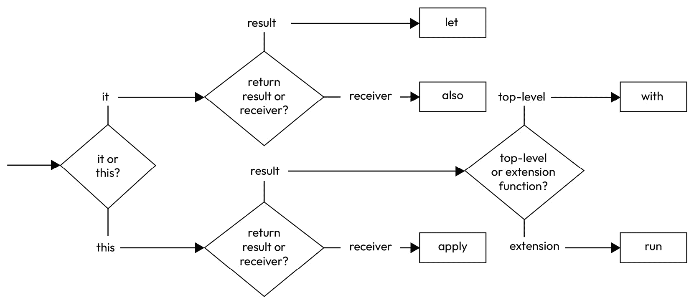
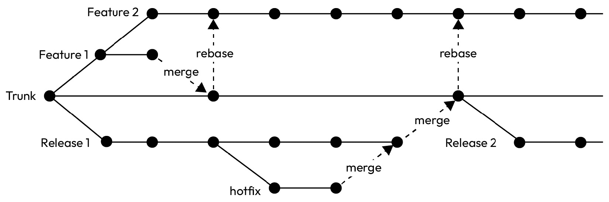
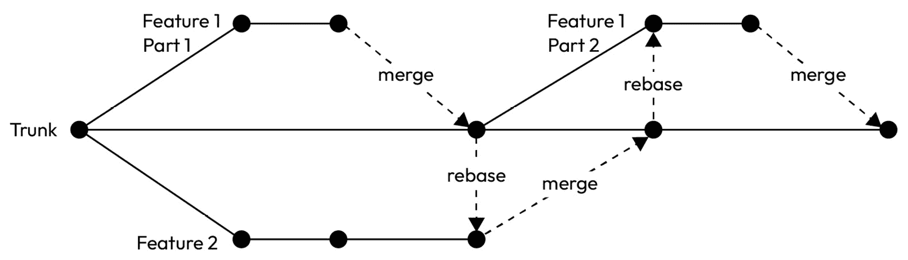
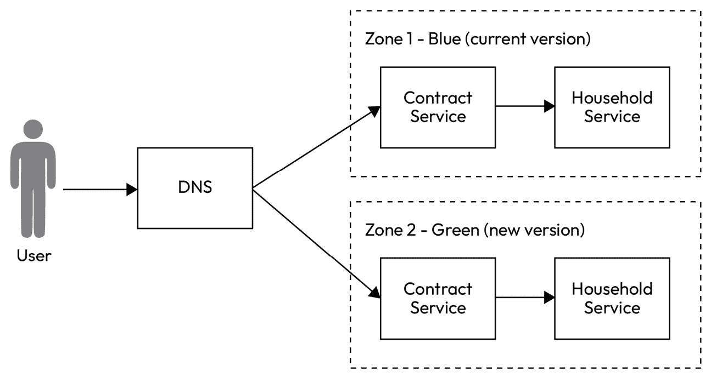
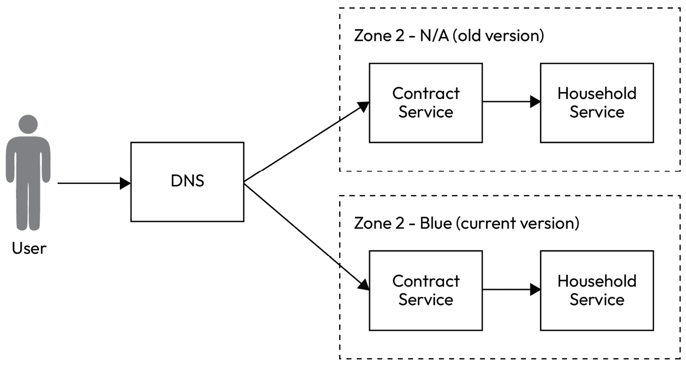
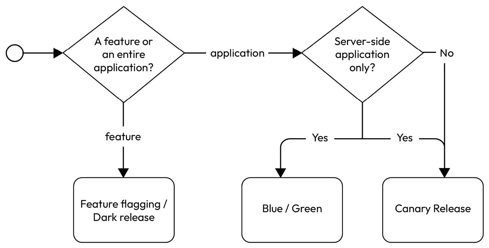

# 超越架构

本章我们将探讨一些有助于工程师构建更好软件的主题。其中一些主题可能不直接与软件架构相关，但考虑它们的用法将支持和增强更好的架构。

阅读本章后，工程师应该掌握一些技巧，以提高他们的生产力，并在考虑特定架构风格实现软件时消除障碍。这些工具如果以代码形式实现，则与 Kotlin 相关；否则，其中一些是通用的工程工具。

希望在前几章中所有建筑主题的概念理解能够通过本章的工具箱转化为实际和实用的解决方案。

本章我们将涵盖以下主题：

+   由 Kotlin 驱动

+   从 Java 过渡

+   持续集成和交付

+   开发者体验很重要

+   关于软件架构的最终思考

# 技术要求

您可以在 GitHub 上找到本章使用的所有代码文件：[`github.com/PacktPublishing/Software-Architecture-with-Kotlin/tree/main/chapter-15`](https://github.com/PacktPublishing/Software-Architecture-with-Kotlin/tree/main/chapter-15)

# 由 Kotlin 驱动

作为一种编程语言，Kotlin 为工程师提供了大量的语法支持，使他们能够简洁地表达代码的意图。此外，一些特性允许工程师分离关注点并组织代码，使其更易于管理。

## 扩展函数

Kotlin 扩展函数允许在不修改其源代码的情况下向现有类添加额外功能。这个特性对于以下用例非常有用，甚至可以说是必需的：

+   向来自外部库或最终类的类添加更多函数。例如，我们想要提取每个单词的首字母并用点连接起来，所以`Sam Payne`将变成`S.P`。Kotlin 字符串不提供这样的函数，因此我们可以编写一个扩展函数来代替：

    ```kt
    fun String.getFirstLetters(): String =
        split(" ").joinToString(".") {
            it.first().toString()
        }
    ```

+   增强一个类以适应某些 Kotlin 语言特性，例如操作符重载（`+`、`-`、`in`等）。操作符重载的使用将在后续章节中详细讨论。

+   向处理诸如尝试连接一个可空字符串列表等场景的函数添加空安全功能。在扩展函数中将接收者作为`List<String>?`确保，无论列表是否为空，都会创建一个字符串。实现方式如下：

    ```kt
    fun List<String>?.concat(): String = this?.joinToString(",")?: ""
    ```

然而，也存在一种用例可以支持更好的架构。扩展函数可以通过将类的函数隔离到具有非公开可见性的不同包中来分离类的关注点。

例如，我们有一个来自上一个示例的`Name`数据类。这个数据类是一个域实体，需要根据操作上下文转换为不同的格式。

由于 `Name` 类的对象需要转换为 JSON 字符串，因此存在几种常见的函数签名样式：

+   `Name` 类已将对象的 JSON 表示暴露给所有使用场景：

    ```kt
    data class Name(val value: String) {
        fun toJson(): String = "{\"name\":\"$value\"}"
    }
    ```

    然而，并非所有使用场景都需要这个功能。业务逻辑不太可能需要对象的 JSON 表示。这种方法将业务逻辑和外部表示的关注点混合在一起，而且更糟糕的是，这种外部表示也不适用于所有情况。

+   `toJson` 现在对所有可以访问 `Name` 类的项目都是公开的：

    ```kt
    fun toJson(name: Name): String = "{\"name\":\"${name.value}\"}"
    ```

它在功能上等同于**非局部扩展函数**实现；区别在于扩展函数将参数移动到函数接收者：

```kt
fun Name.toJson(): String = "{\"name\":\"$value\"}"
```

当工程师搜索以 `to` 开头的函数名称时，原始函数实现会创建噪声，尤其是在 IDE 中，如果所有数据类都有单独的 `toJson` 函数。这种现象被称为**作用域污染**，因为我们暴露了比必要的更多函数。一个快速的解决方案是有一个类或 Kotlin 单例对象，其中包含一个成员函数用于此目的：

```kt
object NameJsonConverter {
    fun toJson(name: Name): String = "{\"name\":\"${name.value}\"}"
}
```

然而，如果 JSON 转换仅适用于外部集成，那么将转换函数与外部集成代码一起定位可能是有可能的，并且函数可以作为**局部****扩展函数**是私有的：

```kt
private fun Name.toJson(): String = "{\"name\":\"$value\"}"
```

这种方法允许工程师在仅限于同一文件上下文的情况下扩展类的功能。换句话说，可以通过将源库中的本地扩展函数按文件分组来分离实体周围的不同关注点。

这并不是什么新东西，因为私有可见性修饰符对函数确实如此。尽管如此，将数据类作为函数的接收者并扩展其行为的能力带来了几个好处：

+   列表中的参数少一个

+   专注于实体，因为它成为接收者

+   调用函数就像它是类的一个成员一样

+   无需继承

+   与成员函数或扩展函数的流畅调用链

Kotlin 扩展函数通过允许工程师以模块化方式向现有类添加新功能，增强了代码的灵活性和可读性。同时，有一种方法可以限制使用以避免作用域污染并分离关注点。毕竟，Kotlin 扩展函数促进了更好的编码实践，并使代码更容易理解和维护。

## Infix 修饰符

Kotlin 的 infix 修饰符是创建更易读和更具表现力的代码的另一种方式。我们在这里讨论了 `When`：

```kt
object When
```

让我们定义一个与整数（`Int`）相关的 `PreCondition` 类和一个 `Action` 类，如下所示：

```kt
typealias PreCondition = () -> Int
typealias Action = (Int) -> Int
```

**类型别名**在 Kotlin 中允许工程师为现有类型创建新名称。它们还允许工程师快速将名称映射到函数类型。对于函数类型，类型别名在声明单个函数的接口时特别有益，这有助于工程师实现符合**单一职责原则**（**SRP**）的代码，如在第 *2 章* 中讨论的。

到目前为止，它们看起来像 BDD 测试场景的 Gherkin 语言可能仍然令人困惑。当我们添加`infix`函数时，代码将开始支持自然语言：

```kt
infix fun When.number(n: Int): PreCondition = { n }
infix fun PreCondition.then(action: Action): Int = action(this())
```

在这里，`PreCondition`用作返回类型和另一个函数的接收者。我们需要实现`Action`并有一个函数来验证结果，以完成一个简单的测试场景：

```kt
object Square: Action {
    override fun invoke(p1: Int): Int = p1 * p1
}
infix fun Int.shouldBe(expected: Int) {
    require(this == expected) {
        "Expected: $expected but was $this"
    }
}
```

将它们全部放在一起，我们可以生成如下测试场景：

```kt
((When.number(2)).then(Square)).shouldBe(5)
```

当运行此行时，它应该抛出一个包含以下消息的异常：

```kt
Expected: 5 but was 4
```

这个示例令人兴奋的部分是，Kotlin 的中缀特性让我们可以省略函数调用的点和中缀函数单个参数的括号。因此，代码变得非常接近自然语言和 Gherkin 语言语法：

```kt
When number 2 then Square shouldBe 5
```

当然，从这个点开始，要有一个完整的 Gherkin 风格的 BDD 测试场景代码将需要很长时间。然而，这个例子已经展示了 Kotlin 中缀函数如何使代码可读和表达。

在 Kotlin 中拥有中缀函数有一些基本规则需要遵循：

+   它是类的一个成员函数或一个带有接收者的扩展函数

+   只能有一个参数

中缀函数通常用于构建直观和可读的**领域特定语言**（**DSL**）。它们在链式操作中用得很多，例如我们刚刚演示的例子。

## 操作符重载

操作符重载是使您的代码可读性和直观性的另一种方法。它允许工程师为`+`、`-`等运算符定义自定义行为。当我们在讨论扩展函数时，已经展示了语法：

```kt
data class Name(val value: String)
operator fun Name.plus(other: Name): Name =
    Name("$value ${other.value}")
fun main() { println(Name("Sam") + Name("Payne")) }
```

在`fun`关键字之前使用`operator`修饰符表示要重载内置运算符。返回类型需要与接收者或所属类相同。所有可以重载的运算符都列在*表 15.1*中：

| **运算符** | **函数名** | **示例** |
| --- | --- | --- |

|

```kt
+
```

|

```kt
plus
```

|

```kt
a + b
```

|

|

```kt
+
```

|

```kt
unaryPlus
```

|

```kt
+a
```

|

|

```kt
-
```

|

```kt
minus
```

|

```kt
a - b
```

|

|

```kt
-
```

|

```kt
unaryMinus
```

|

```kt
-a
```

|

|

```kt
*
```

|

```kt
times
```

|

```kt
a * b
```

|

|

```kt
/
```

|

```kt
div
```

|

```kt
a / b
```

|

|

```kt
%
```

|

```kt
rem
```

|

```kt
a % b
```

|

|

```kt
==
```

|

```kt
equals
```

|

```kt
a == b
```

|

|

```kt
!=
```

|

```kt
notEquals
```

|

```kt
a != b
```

|

|

```kt
>
```

|

```kt
compareTo
```

|

```kt
a > b
```

|

|

```kt
[]
```

|

```kt
get
```

|

```kt
val value = a[key]
```

|

|

```kt
[]
```

|

```kt
set
```

|

```kt
a[key] = value
```

|

|

```kt
+
```

|

```kt
unaryPlus
```

|

```kt
+a
```

|

|

```kt
()
```

|

```kt
invoke
```

|

```kt
a()
```

|

表 15.1 – Kotlin 可以重载的运算符

操作符的重载需要具有兼容的语义。例如，`+`运算符应该创建一个新实例，该实例由相同类型的两个对象组合而成。如果`plus`函数有副作用，例如更新现有对象的值，那么重载运算符是不合适的。

## 作用域函数

Kotlin 中的作用域函数在对象的上下文中执行代码块。作用域从开括号 `{` 开始，以闭括号 `}` 结束，这对编程语言来说已经很自然了。我们已经有类作用域、函数作用域和 lambda 作用域，所有这些作用域都使用括号来表示边界。此外，内部作用域可以访问外部作用域中声明的值和函数。例如，成员函数可以访问其包含类中的其他函数。

### 内置作用域函数

Kotlin 中的作用域函数提供了另一种拥有有限作用域的方法，该作用域专注于上下文对象。提供了五个作用域函数，如图 *图 15.1* 所示：



图 15.1 – Kotlin 内置作用域函数

五个作用域函数（`let`、`apply`、`run`、`with` 和 `also`）各有其用途和行为。它们之间有两个主要区别。第一个区别是上下文对象是 `it` 还是 `this`。

以下三个语句返回相同的 `"35"` 结果：

```kt
"3".let { it + "5" }
"3".run { this + "5" }
with("3") { this + "5" }
```

`let` 函数使用 `it` 作为上下文对象，而 `run` 和 `with` 使用 `this` 作为上下文对象。

还值得注意的是，`run` 和 `with` 在功能上是等价的，但语法不同。`run` 函数是一个扩展函数，而 `with` 是一个顶层函数。工程师可以利用这种差异来传达使用意图。通常，当使用 `run` 函数时，上下文对象是操作的重点。如果另一个对象是操作的重点，则可以使用 `with` 函数。

第二个区别是 lambda 或接收者的结果是否返回。这就像是一个窥视函数，工程师想要插入一个额外的操作，但不想改变结果。以下两个语句返回相同的 `"3"` 结果：

```kt
    "3".also { println(it) }
    "3".apply { println(this) }
```

在 lambda 表达式中评估的任何输出都不用作返回值。

### 自定义作用域函数

编写自己的作用域函数可以为您的系统带来强大的功能。这在构建预定义作用域内的结果时尤其有用。通常情况下，系统需要在一个传入请求上执行全面验证，并在响应中报告所有验证失败。

我们需要一个可以累积验证错误的构建器类，如下所示：

```kt
class ValidationBuilder {
    private val failures = mutableListOf<String>()
    fun evaluate(
        result: Boolean,
        failureMessage: () -> String
    ) {
        if (!result) failures.add(failureMessage())
    }
    fun getErrors() = failures.toList()
}
```

`ValidationBuilder` 类使用可变字符串列表来收集在过程中找到的所有验证错误。然后，我们可以定义一个自定义作用域函数，该函数定义验证的开始和结束，并在作用域内执行验证：

```kt
fun <T> T.validate(
    build: ValidationBuilder.(T) -> Unit
): List<String> =
    ValidationBuilder()
        .also { builder -> builder.build(this) }
        .getErrors()
```

此作用域函数是一个使用泛型类型作为接收器的扩展函数，因此可以在任何对象上调用`validate`函数。它接受一个 lambda 表达式作为参数，其中将`ValidationBuilder`实例作为通过`this`标识的上下文对象传递。在`validate`函数的末尾，所有收集的错误都作为不可变的`List`返回。

一个示例用法可能如下所示：

```kt
fun main() {
    val failures = "Some very%long nickname".validate {
        evaluate(it.length < 20) { "Must be under 20 characters: \"$it\"" }
        evaluate(it.contains("%").not()) { "Must not contains % character"}
    }
    println("failures: $failures")
}
```

这是一个对`String`对象进行的简单验证，包含两个规则：

+   必须少于 20 个字符

+   不能包含百分号，`%`

验证从具有`validate`扩展函数的`String`对象开始。在 lambda 作用域内，`evaluate`函数被调用两次，用于评估和错误消息。如果评估失败，`ValidationBuilder`会收集错误消息。返回一个验证错误列表并打印到控制台。控制台应该有如下输出：

```kt
failures: [Must be under 20 characters: "Some very%long nickname", Must not contains % character]
```

输出显示了如何使用自定义作用域函数对字符串执行完整验证。

自定义作用域函数在构建复杂对象，如大型域对象时也很受欢迎。实际上，它在流行的框架**Ktor**中用于构建服务器端路由配置：

```kt
routing {
    route("/hello", HttpMethod.Get) {
        handle {
            call.respondText("Hello")
        }
    }
}
```

我们已经展示了使用自定义作用域函数来执行完整验证并收集所有验证错误的方法。自定义作用域函数在收集作用域内的元素时特别有用，其中传递给构建器的对象作为上下文对象。

我们将在下一节中介绍从 Java 过渡到 Kotlin 的主题。

# 从 Java 过渡

作为一种编程语言，Kotlin 由 JetBrains 开发，这是一家以 IntelliJ IDEA 等软件开发工具而闻名的软件公司。该项目始于 2010 年，旨在创建一种与 Java 兼容但改进了 Java 一些缺点的新语言。名称*Kotlin*来自俄罗斯圣彼得堡附近波罗的海的科特林岛。

Kotlin 1.0 于 2011 年 7 月发布，具有 null 安全、静态类型和类型推断等功能。它在 2016 年引入了 100% Java 互操作性、扩展函数、lambda 表达式和高级函数等特性后开始流行。

2017 年，谷歌宣布正式支持 Kotlin 在 Android 上的使用。谷歌与 JetBrains 合作支持 Kotlin 在 Android 上的使用，使 Kotlin 成为 Android 开发者的热门选择。2018 年，JetBrains 推出了 Kotlin Multiplatform，它使得 Kotlin 代码可以翻译和编译为在 Android、iOS 和 Web 应用程序中运行。大约在同一时间，Kotlin 后端服务开始受到越来越多的后端工程师的关注，尤其是那些有 Java 背景的工程师。

100%的 Java 互操作性使得许多 Java 工程师能够顺利过渡到为商业应用编写 Kotlin 代码。我们将与您分享一些工具和技巧。

JetBrains 的 IntelliJ IDEs 提供了一个工具，可以将 Java 文件代码转换为 Kotlin 文件代码。这听起来可能很神奇，但现实是，仍然需要做一些调整才能使 Kotlin 代码真正符合规范。

## 在 Java 项目中启用 Kotlin

由于已经有一个 Java 项目，我们需要设置项目以编译 Kotlin 源代码。

如果项目使用 Gradle，添加 Kotlin 插件就足够了，例如以下使用 Gradle Kotlin DSL 的代码：

```kt
plugins {
    kotlin("jvm") version "2.0.20"
}
```

这与 Gradle Groovy 的设置等效：

```kt
plugins {
    id 'org.jetbrains.kotlin.jvm' version '2.0.20'
}
```

使用 Maven 的项目需要在`pom.xml`中进行以下更改：

```kt
<properties>
    <kotlin.version>2.0.20</kotlin.version>
</properties>
<plugins>
    <plugin>
        <artifactId>kotlin-maven-plugin</artifactId>
        <groupId>org.jetbrains.kotlin</groupId>
        <version>2.0.20</version>
    </plugin>
</plugins>
```

前面的配置将 Kotlin 版本定义为`2.0.20`。它还导入了一个插件，该插件启用了对 Kotlin 源代码的编译。

## 转换 Java 文件并将它们移动到 Kotlin 文件夹

Kotlin 文件可以位于`src/main/java`和`src/test/java`文件夹下，但建议分别存储在`src/main/kotlin`和`src/test/kotlin`。

让我们使用 IntelliJ 的转换工具将以下 Java 类转换为 Kotlin：

```kt
public class Household {
    private final String name;
    private final List<String> members = new ArrayList<>();
    public Household(String name, List<String> members) {
        this.name = name;
        this.members.addAll(members);
    }
    public String getName() {
        return name;
    }
    public List<String> getMembers() {
        return new ArrayList(members);
    }
}
```

这个 Java 类是不可变的，所以所有字段都是私有的，列表在 getter 中也没有暴露以保证不可变性。当你使用转换工具转换 Java 文件时，IntelliJ 会提醒你还需要进行一些修正。

这是工具转换后的 Kotlin 类（在 IntelliJ 中，右键单击 Java 文件并选择**Convert Java File to** **Kotlin File**）：

```kt
class Household(val name: String, members: List<String?>) {
    private val members: MutableList<String?> = ArrayList()
    init {
        this.members.addAll(members)
    }
    fun getMembers(): List<String?> {
        return ArrayList<Any?>(members)
    }
}
```

为了成为一个符合规范的 Kotlin 类，有一些立即需要做出的更改：

1.  更新为 Kotlin 数据类，因为这个类打算作为一个实体类。

1.  尽可能地将`init`块替换为构造函数。只有真正的初始化逻辑应该保留在`init`块中。

1.  使用 Kotlin 的不可变`List`接口作为成员字段。同样的规则也应该适用于其他`Collection`接口。使用 Kotlin 的集合接口可以消除集合被修改的风险。

1.  由于不可变的`List`接口，不需要返回列表的新副本，因此可以移除`getMembers`getter 函数。

1.  除非有理由预期可能为 null 的值，否则请移除可空符号（`?`）。这是工程师们消除在转换为 Kotlin 后变得不必要的 null 检查的机会。

这是转换的结果，它从工具开始，以一些手动修正结束：

```kt
data class Household(val name: String, val members: List<String>)
```

如果 Java 实体类使用了像 Lombok([`projectlombok.org/`](https://projectlombok.org/))这样的外部库来自动生成 setter 和 getter 函数，那么我们也需要移除 Lombok 注解。

Java 14 引入了一个名为**record classes**的新特性，它的工作方式类似于 Kotlin 数据类。这里展示了一个 Java 记录类的示例：

```kt
public record Account(String number, String holderName) {}
```

转换为 Kotlin 相对简单，但有一个`JvmRecord`注解保留了下来：

```kt
@JvmRecord
data class Account(val number: String, val holderName: String)
```

注释仅用于保留一些函数名称，例如 `account.getNumber()` 以便向后兼容。如果这不是一个关注点，我们可以删除这个注释，并让这个类的用户使用 `account.number` 代替。

## 惯用表达式、代码风格和约定

将 Java 文件转换为 Kotlin 文件是工程师开始采用 Kotlin 的惯用表达式和约定的绝佳机会。强烈建议工程师从开始就选择一个 lint 工具来统一 Kotlin 风格：

+   Ktlint ([`github.com/pinterest/ktlint`](https://github.com/pinterest/ktlint))

+   KtFmtFormat ([`github.com/facebook/ktfmt`](https://github.com/facebook/ktfmt))

+   Detekt ([`github.com/detekt/detekt`](https://github.com/detekt/detekt)) – 同样也是一个静态代码分析工具

+   Spotless ([`github.com/diffplug/spotless`](https://github.com/diffplug/spotless)) – 也支持其他语言

选择“最佳”代码风格对工程质量的关注最少，但拥有统一风格对于团队集中精力在更重要方面（如正确性和响应性）非常重要。

## 转换顺序

对于现有的 Java 项目，也建议按以下顺序转换 Java 类：

1.  测试类，因为这些代表最低风险。这是一个工程师学习 Kotlin 和犯错误影响较低的安全空间。

1.  没有其他类依赖的顶层类。

1.  如果应用程序使用分层架构，如第 *第七章* 中所述，则应首先转换外层（即适配器、命令壳、框架和驱动器）中的类，然后向内转换，直到达到代码。当 Kotlin 代码调用 Java 代码时，与 Java 的 Kotlin 兼容性比反过来更平滑。

在转换过程中，工程师通常会开始寻找用 Kotlin 中的等效库替换 Java 中的框架；我们将在下一节讨论这些内容。

## 框架替换

在转换之旅中，不可避免地会有人提出讨论是否应该用支持原生 Kotlin 的库替换 Java 库。我们在 *第一章* 中讨论了新框架的悖论，在从 Java 到 Kotlin 的转换具体话题上，我们应该注意以下几点：

+   一切仍然正常工作！这似乎很明显，但团队可以选择不替换任何现有框架，因为 Java 兼容性达到 100%。

+   这可能是一次单程之旅。新的 Kotlin 库可能并不旨在支持 Java 项目，除非这些库在 Kotlin 流行之前就已经存在。如果项目仍然使用 Java 但需要使用新的 Kotlin 库与 Java 一起使用，使用可能会显得尴尬。

+   开源社区已经贡献了多个 Kotlin 库，以提供以 Kotlin 为主的库体验。其中一些在方法、活动和贡献者数量方面看起来很相似。团队可能会陷入分析瘫痪，不知道该使用哪一个。这更多的是一个普遍的开源框架采用问题，但它影响了从 Java 到 Kotlin 的过渡。

+   对于贡献者来说，停止一些 Kotlin 为主的较新框架的努力并不罕见。这是一个自然的演变，其中一些想法最终证明并不可行或可行。团队可以始终等待 Kotlin 为主的库成熟。再次强调，这是一个普遍的开源项目关注的问题。

+   一些现有的 Java 框架将 Kotlin 支持作为一个额外依赖项，以帮助工程师进行过渡。Kotlin 模块可能就足够了，没有必要完全淘汰该框架。

+   由受欢迎的社区或值得信赖的组织开发的以 Kotlin 为主的框架可能具有更强的支持和连续性。

尽管有众多框架替换的因素，但有一些以 Kotlin 为主的框架值得关注：

+   **客户端和** **服务器框架**:

    +   Spring: [`spring.io/`](https://spring.io/)

    +   Ktor: [`ktor.io/`](https://ktor.io/)

    +   Http4K: [`www.http4k.org/`](https://www.http4k.org/)

    +   Micronaut: [`micronaut.io/`](https://micronaut.io/)

    +   Vert.x: [`github.com/vert-x3/vertx-lang-kotlin`](https://github.com/vert-x3/vertx-lang-kotlin)

    +   Retrofit: [`square.github.io/retrofit/`](https://square.github.io/retrofit/)

+   **语言增强框架**:

    +   Arrow: [`arrow-kt.io/`](https://arrow-kt.io/)

    +   Result4K: [`github.com/npryce/result4k`](https://github.com/npryce/result4k)

    +   Coroutines: [`github.com/Kotlin/kotlinx.coroutines`](https://github.com/Kotlin/kotlinx.coroutines)

+   **依赖注入框架**:

    +   Koin: [`insert-koin.io/`](https://insert-koin.io/)

+   **持久化框架**:

    +   Exposed: [`github.com/JetBrains/Exposed`](https://github.com/JetBrains/Exposed)

+   **测试框架**:

    +   Kotest: [`kotest.io/`](https://kotest.io/)

    +   Spek: [`www.spekframework.org/`](https://www.spekframework.org/)

    +   Mockk: [`mockk.io/`](https://mockk.io/)

+   **UI 框架**:

    +   Jetpack: [`developer.android.com/jetpack`](https://developer.android.com/jetpack)

    +   Compose Multiplatform: [`github.com/JetBrains/compose-multiplatform`](https://github.com/JetBrains/compose-multiplatform)

## 持续过渡

转向 Kotlin 的一个挑战是与其他变化的结合，这些变化是由业务或技术利益相关者推动的。

重要的是，转向 Kotlin 的过程应该是渐进的和持续的。例如，一个新业务功能可以完全用 Kotlin 编写，同时使用一些现有的 Java 类。

当有足够的时间和空间时，工程师们也可以逐步引入 Kotlin 转换后的代码，甚至在开发其他更改的过程中也是如此。团队可以采取一项政策，即如果需要更新 Java 类，它也将被转换为 Kotlin。这项政策为每次更改添加了少量的开销，但可以保持过渡的连续性，而无需停止。

保持风险可控是将 Java 项目迁移到 Kotlin 的关键。

## Kotlin 的未来

Kotlin 已经从仅仅是一个更好的 Java 语言发展而来。特别是随着 Kotlin Multiplatform 的推出，Kotlin 已经成为市场上最灵活的编程语言之一，因为它可以用来编写 Android、iOS、桌面、Web、数据科学和后端应用程序。随着 Kotlin V2 的最新发布，Kotlin 的流行度和使用率仍在持续增长。工程师们应该关注 Kotlin 的新兴趋势（例如 Kotlin Multiplatform、Kotlin Native 和云集成），并拥抱其令人兴奋的即将到来的进步。

接下来，我们将讨论持续集成和交付。

# 持续集成和交付

**持续集成**（**CI**）和**持续交付**（**CD**）在软件开发生产力中发挥着至关重要的作用。由于它们之间紧密的关系，在许多讨论中它们被统称为 **CI/CD**。

当我们在*第十三章*中讨论了发现和修复应用程序问题的成本时，我们提到，如果在开发过程中早期发现问题，修复问题的成本会更低。在一个典型的环境中，工程师团队协作在源代码库上工作时，由于代码冲突而引起的问题修复成本也较低。

CI 是一种软件开发实践，工程师们频繁地将他们的更改集成到一个共享的源代码库中。CI 的主要目标是早期发现集成问题，并减少发布新功能或修复所需的时间。CI 的实践包括以下内容：

+   **频繁提交**：团队成员频繁提交更改。每个工程师也频繁更新他们的本地源项目以接收其他团队成员的更改。提交的频率可能高达每天多次。

+   **自动项目构建**：每次提交都会与源代码库集成，并触发自动构建以编译所有源代码。

+   **自动化测试和反馈**：每次提交还会触发一个自动化测试套件，包括各种测试和质量保证指标，如在第 12、13 和 14 章中所述：

    +   单元测试

    +   组件测试

    +   集成测试

    +   自动化 GUI 测试

    +   端到端测试

    +   性能测试

    +   代码漏洞扫描

    +   代码风格检查

    +   静态代码分析

    +   测试覆盖率

    这些测试检查是代码编译后项目构建的一部分。如果任何前面的检查失败，项目构建将失败，并且工程师将被通知。工程师将根据反馈进行故障排除并修复问题。

+   **版本控制**：CI 使用版本控制系统来管理代码库。它支持保留提交的完整历史记录和审计记录。它允许工程师从主代码仓库分支，并在稍后将其合并回主分支。

+   **与部署的集成**：CI 是质量的第一道门，它认证应用程序是否足够好以进行部署。一旦所有检查和测试都通过，构建过程就可以继续为部署做准备。

通过缩短*代码集成-测试-修复*的反馈循环，团队可以更频繁地交付新特性和修复，缩短上市时间，并快速响应用户反馈。它还通过为每次集成进行自动化测试来提高团队内的协作，并提高整体软件质量。

然而，还有一个重要的因素会影响软件开发的生产力。大多数在团队中工作的工程师都会讨论在版本控制系统下的分支策略问题。在这个永无止境的辩论中，有两种流行的策略不断出现：基于特性的开发和主干开发。

## 基于特性的开发

基于特性的开发可以以其较高的分支数量和较长的生命周期为特征。工程师可以在自己的分支上独立工作。每个分支包含一大块连贯的工作，如特性或发布，因此它持续较长时间以收集所有必需的更改。同时，还有其他长期存在的分支代表其他特性。基于特性的开发的一个示例在*图 15**.2*中展示：



图 15.2 – 基于特性的开发示例

在这个例子中，**主干**是吸收来自其他分支所有更改的主要分支。**特性 1**从**主干**分支出来，并在该特性分支中继续开发。同时，团队需要准备一个新的发布，因此从**主干**创建了**发布 1**分支。发布分支作为发布候选部署到 UAT 环境进行验收测试。

在**特性 1**分支中进行几次提交后，**特性 2**需要开始开发，并且它需要从**特性 1**分支中进行一些更改，因此**特性 2**从**特性 1**分支分支出来，并在新分支中继续**特性 2**的开发。**特性 1**开发完成后，因此，创建了一个拉取请求进行审查，随后该分支被合并到**主干**。

在 **功能 2** 上工作的工程师希望保持其分支是最新的，所以他们从最新的 **主干** 分支重新合并 **功能 2** 分支。**发布 1** 分支不需要重新合并，因为 **功能 1** 不包含在即将发布的版本中。

**发布 1** 分支已经部署到生产环境中。在生产发布后发现了几个错误，不幸的是，其中之一是一个关键错误。因此，**发布 1** 分支还不能合并到 **主干** 分支。当一些工程师在 **发布 1** 分支上处理低优先级的修复时，几位工程师需要立即进行热修复并立即在生产环境中修复关键错误。因此，为关键错误修复创建了一个热修复分支。

关键错误修复已完成，已部署并在用户验收测试（UAT）中进行了验证。因此，它被发布到生产环境中。然后，热修复分支被合并到 **发布 1** 分支。之后，所有生产错误修复都已完成，并在用户验收测试（UAT）中进行了部署和验证。因此，还有另一个生产发布来总结这个版本。然后，**发布 1** 分支被合并到 **主干** 分支。

**功能 2** 分支尚未完成，因此需要从 **主干** 分支进行重新合并。同时，工程师们开始准备新的发布版本，通过从 **主干** 分支创建一个新的发布分支来开始。

基于功能的开发将分支隔离开来，并使它们专注于其目的。示例中的 **发布 1** 分支自然防止了 **功能 1** 影响发布。此外，热修复分支为工程师提供了一个稳定和安全的空间，专注于修复关键生产错误，知道关键修复可以作为优先级进行修补，而无需考虑其他无关的更改。基于功能的开发使用拉取请求，鼓励工程师之间的代码审查和协作。

然而，许多长期存在的分支带来了分支管理的开销。它在合并或重新合并分支时引入了高度复杂性的冲突。当在一个分支中将文件移动到另一个文件夹，而另一个分支中文件被更新时，这种类型的树冲突通常会导致复杂、耗时且容易出错的代码合并。缓解这种问题的方法是频繁地重新合并长期存在的分支。

## 基于主干的开发

基于主干的开发鼓励工程师在一个单一的分支上工作，这个分支是 *主干*（也称为 **main**）。然而，对 *主干* 分支的每次提交都是通过合并来自短期分支的拉取请求来完成的。

它提倡频繁提交小、频繁和增量更改到 *主干*。每个分支都是短期存在的，通常不会持续超过几天。每个分支都有频繁的重新合并或合并操作，以从 *主干* 获取最新更改。基于主干开发的示例在 *图 15**.3* 中展示：



图 15.3 – 基于主干的开发示例

在这个例子中，**特性 1**分支是从**主干**创建用于开发的。**特性 2**分支也是从**主干**创建用于开发的。

**特性 1**分支已经将代码开发到里程碑阶段，此时代码经过测试、验证和可发布，但特性本身尚未完成。因此，为**特性 1**创建了一个拉取请求以供审查，随后该分支被合并到**主干**。

**特性 1**的开发需要继续。因此，为**特性 1**的继续开发从**主干**创建了一个新分支。

同时，**特性 2**分支检测到在**主干**中有一个提交，因此相应的工程师将分支从**主干**重新基座以获取最新代码。

之后，**特性 2**的开发在其分支中完成、测试和验证。因此，为**特性 2**创建了一个拉取请求以供审查。然后该分支被批准并合并到**主干**。

**特性 1**分支检测到在**主干**中有一个提交，因此相应的工程师将分支从**主干**重新基座以获取最新代码。

基于主干的开发强调，*主干*分支在任何时候也应该足够好以供发布。没有发布分支的概念。这就是为什么所有分支都应该在合并前由同行进行测试、验证和审查。

为了扩展这个概念，每个提交都可以触发软件向环境发布，甚至到生产环境。这种方法非常适合 CD 实践，其中软件频繁地交付给客户，大大缩短了上市时间。这也意味着在开发的早期阶段，自动测试应该更加严格和彻底，以确保软件质量。

基于主干的开发也与敏捷开发方法中提倡的快速开发和短迭代周期很好地结合。快速的迭代和短的反馈循环使团队能够更快地演进软件产品。

频繁的提交和重新基座也减少了合并冲突解决的复杂性。任何集成问题都可以在早期识别和修复，因此工程师的反馈循环更短。分支管理简化了，因为*主干*分支是唯一关注的焦点。

在主干基于开发中，长期存在的分支是一个反模式。对于较大的特性开发，变更需要分割成多个分支，因此需要对*主干*分支进行多次提交。

工程师需要在合理地分割变更时做出判断。这要求工程师有更多的思考和纪律，以确保每个提交到*主干*的变更都是安全的，并且可以被发布。**特性标志**是在开发中隐藏特性同时仍然允许代码发布到生产环境的常用技术。特性标志将在下一节中介绍。

工程师不小心添加了尚未准备好生产的更改，尽管这些更改已经合并到 *Trunk* 中，这种情况并不少见。更糟糕的是，之后还有其他更改被提交。此时，*Trunk* 还未准备好发布。这种情况让工程师面临一些艰难的选择：

+   **Roll back**：撤销所有提交，使 *Trunk* 仍然安全发布。这将生成一个额外的提交用于回滚。在回滚后，重新应用来自新分支的其他所需更改。

+   ** cherry-picking**：从最新的 *Trunk* 创建一个新分支，并仔细撤销不希望的变化。将此分支合并回 *Trunk*。

+   **Roll forward**：从最新的 *Trunk* 创建一个新分支，并继续对变化进行工作，重点是使 *Trunk* 再次准备好发布。将此分支合并回 *Trunk*。

所有上述选择都需要工程师谨慎执行，并且都不是容易的。许多工程师宁愿前进以保持开发流程的连续性，而牺牲在 *Trunk* 中留下一些不适合发布的提交。

## 基于功能和基于 Trunk 的开发比较

在基于功能和基于 Trunk 之间的选择高度相关于团队和组织的工作方式。这是一个康威定律适用的例子，如在第*第一章*中所述，组织结构影响软件开发过程。

| **基于功能的开发** | **基于 Trunk 的开发** |
| --- | --- |
| 长期分支 | 短期分支 |
| 专门的发布分支 | *Trunk* 是发布分支 |
| 在长期分支中开发大型功能 | 将大型功能拆分为多个短期分支 |
| 合并和变基操作中的高复杂性 | 合并和变基操作中的低复杂性 |
| 集成问题的反馈较慢 | 集成问题的反馈较快 |
| 独立开发 | 协作开发 |
| 回滚更常见 | 前进更常见 |
| 用于紧急问题的热修复分支 | 没有热修复分支的概念 |
| 发布分支是稳定的 | 在主分支中修复不可发布提交的复杂操作 |
| 发布频率较低 | 发布可以更频繁 |

表 15.2 – 基于功能和基于 Trunk 的开发比较

这两种开发方法都有其优点和权衡。最终的选择取决于团队规模、项目复杂度和开发实践。一些团队可能会采用混合方法，以最大化每种方法的优势并减少其缺点。

例如，一个团队可能会决定采用基于 Trunk 的开发，但创建一个发布分支以针对每个发布。这减少了撤销不希望的变化以进行发布的需要，并将发布准备与其他正在开发的功能的开发隔离开来。

上述例子可以被视为一种发布策略；然而，我们还想介绍更多发布策略，并将它们放在下一节中介绍。

## 发布与部署与推出

一旦应用程序准备发布，就会面临如何将其交付给客户和最终用户的一系列新的关注点和策略。在历史上某些时期，这只是一个是否发布的二元条件。现代发布更加复杂和精细。

首先，我们需要区分三个概念：发布、部署和推出。这些概念可能在某些组织中可以互换使用；然而，它们之间存在细微的差别，应该进行讨论。

**部署**是最不容易误解的概念。部署意味着从源代码和配置构建的可执行软件工件已加载到目标环境中。本节重点介绍生产环境。这是一个操作和技术任务，通常通过脚本自动化，可选地涉及人工干预的审批流程。

**发布**意味着应用程序现在在目标环境中可供用户使用。有时，我们可能还会说发布一个功能，这意味着使该功能可供用户使用的意图。部署是发布的先决条件。即使应用程序已经部署，应用程序中的某些功能可能仍然不可用给某些用户。

**推出**是这三个概念中最不涉及技术的一个。术语*推出*并不意味着启动应用程序。相反，它意味着软件产品被营销、广告，并且可选地举办新闻发布会或展览等推出活动。推出软件产品不是 CI/CD 生命周期的组成部分。发布是推出的先决条件，因为用户需要访问应用程序。推出将涉及市场推广计划，涉及各种非技术利益相关者（例如，市场营销、销售、客户服务等）。

通过这些区分，软件产品的发布策略与 CD 相关的复杂性在于。接下来，我们将介绍一些常见的发布策略。

## 蓝色-绿色发布

**蓝色-绿色发布**保留应用程序在生产环境中的当前版本（*蓝色*），并将新版本（*绿色*）部署到生产环境的副本中。这种策略允许在保持当前版本对用户可用的情况下部署新版本的应用程序。

这种策略通常适用于服务器端基于 Web 的应用程序以及**域名系统**（**DNS**）将 Web 请求路由到应用程序的新版本或当前版本。蓝色-绿色发布策略可以在*图 15.4*中看到：



图 15.4 – 蓝色-绿色发布的示例

默认情况下，DNS 将 Web 请求路由到**Zone 1**（**蓝**），其中运行着当前版本的应用程序。**蓝**区的应用程序只与彼此通信，通过将它们保持在相同的**本地****网络**（**LAN**）中。

与通用的`api.contract.system`相比，`api.zone2.contract.system`）。工程师甚至可以排查和修复在新版本中发现的问题。

一旦新版本经过验证并准备好供用户使用，可以在 DNS 中切换流量，因此 Web 请求被路由到**Zone 2**。**Zone 2**现在是有效的新的**蓝**区。没有更多的**绿**区，如*图 15.5*所示。5*：



图 15.5 – 蓝绿发布（切换后）

**Zone 1**现在运行着可以关闭到下一次部署的旧版本应用程序，这使得该区域成为新的**绿**区。重要的是要注意，**蓝**/**绿**是区域将随着时间的推移相互翻转的角色。

蓝绿发布不同于滚动部署。滚动部署旨在在部署进行时保持服务可用。滚动部署通常采取以下步骤：

1.  将当前应用程序实例的数量缩减到一。

1.  将应用程序的新版本部署到目标数量的新实例。

1.  启动新版本的所有实例。

1.  通知负载均衡器新运行实例的存在，或者让它们被发现。

1.  一旦探测端点确认新版本的实例正在运行，关闭旧的应用程序实例。

与蓝绿发布不同，工程师和 QA 没有时间窗口可以在用户无法访问的情况下测试应用程序的新版本。此外，这是一种部署技术。它不关心应用程序是否对用户可用。它只关心应用程序是否已过渡到新版本，而没有中断或停机。

## 暗色发布/功能开关

有方法可以在不向用户开放的情况下验证新功能。新功能可以正常部署到生产环境，但仍然对用户隐藏，使用**功能开关**（也称为**暗色发布**）。

特性开关可以通过几种方式管理：

+   **集中式**：有一个中心服务或资源决定某个功能是否对特定用户可用。

+   **个人**：每个组件或服务管理自己的功能开关。

+   **按请求**：使用一个非公开的请求参数来启用功能以服务此请求。

无论如何管理特性标志，这种方法都允许工程师和 QA 在特性对用户可用之前验证预发布特性。只有当团队对验证结果满意时，特性才会打开。此外，即使在特性对用户可用之后，也可以将其关闭，从而最大限度地减少相关问题的影响。

特性标志与** trunk-based development**实践相结合效果良好，如前文所述。当特性标志关闭时，工程师可以继续开发特性并将他们的更改合并到主干。然而，所有自动化测试都必须通过，以确保现有功能在代码库中未完成和关闭的特性下仍然按预期工作。

特性标志主要关注发布和将特性提供给用户。一些组织可能会将特性标志扩展到支持用户细分和 A/B 测试，如*第十三章*中所述。这并不是反模式，而只是对特性标志系统的一种增强。

## 金丝雀发布

**金丝雀发布**是一种分阶段发布策略，在向所有目标用户推出之前，先将新部署的软件提供给一小部分用户。它是在应用程序层面操作，而不是在应用程序中的某个特性。它旨在逐步向用户提供可用性，并且在用户初始选择和可用性战略增加方面有很多变化。有几个因素会影响这一策略：

+   团队可能希望邀请主题专家或领域专家首先使用该应用程序，以收集可能在公众使用之前塑造产品的反馈。

+   组织可能希望最初将软件产品发布到选定的地理区域用户。这可能是由于应用程序的地理背景、法律限制或相关的营销活动。组织可能希望逐步扩大其地理领土。

+   团队可能希望最初将应用程序发布到某些类型的设备或设备的操作系统。这可能是由于兼容性考虑，特别是在 Android 应用程序领域，或者由于市场上某些设备的流行。

金丝雀发布有时会被误认为是 beta 测试的概念。在软件产品被内部 QA 签批后，一些组织可能希望邀请专家用户进行内部测试。通常使用**白盒测试**技术进行内部测试，如*第十三章*中所述，这被称为**alpha 测试**。在公开发布之前由外部用户进行的测试称为**beta 测试**。

然而，由于正在测试的软件产品版本通常不是最终版本，因此 beta 测试不被视为生产发布。beta 测试仅限于有限的时间。

从选定的用户那里收集反馈和建议，以验证产品概念、可用性和功能。它们也用于产品的进一步改进。发布软件产品的非最终版本进行 beta 测试不需要使用金丝雀发布策略。

## 选择发布策略

选择发布策略并不容易或直接。然而，我们绝对不推荐像我们在*第六章*中讨论的那样进行大爆炸发布并计划停机，因为决策中涉及其他因素，如基础设施准备情况、营销策略、服务正常运行时间目标等。从纯粹的技术角度来看，我们可以使用决策树来推荐发布策略，如图*15*.*6*所示：



图 15.6 – 发布策略的技术决策树示例

在应用程序中发布一个新功能时，应首先考虑使用功能标志或暗色发布，因为这与其他选择相比成本最低。如果涉及到发布整个应用程序，并且是一个服务器端应用程序，可以考虑使用蓝绿发布或金丝雀发布。如果应用程序涉及桌面、移动或 Web 应用程序，那么应考虑使用金丝雀发布。

请注意，这更多是关于哪些发布策略可以使用的技术限制，而不是考虑由于涉及的其他非技术因素而提供的最佳结果。

我们已经讨论了 CI/CD 的讨论。一个高度自动化的 CI/CD 管道可以为工程师节省大量时间，以便与其他人的工作集成并将应用程序交付到多个环境。从某种意义上说，它改善了软件产品工程师的工作体验。在下一节中，我们将进一步探讨开发者体验的主题。

# 开发者体验

**开发者体验**（**DX**）是工程师在开发软件时的体验。它包括从工具、流程、环境、团队、组织到开发文化的一切。在接下来的几节中，我们将提出一些改进 DX 的建议。

## 为什么 DX 很重要？

从表面上看，DX 可能看起来是任何参与项目的人的一般满意度。然而，优秀的 DX 不仅给工程师本人带来很多好处，也给软件产品和组织带来很多好处：

+   **生产力和效率**：高效的工具、自动化的工作流程、简洁的文档和流畅的开发流程减轻了工程师的负担，使他们能够专注于编码和解决问题。

+   **产品质量**：稳定的环境和直观的工具减少了工程师日常工作的摩擦，使他们能够专注于以关注细节的方式交付高质量的代码。

+   **运营成本**：自动化的工具和流程降低了工程师支持系统的劳动力成本。更好的工具导致错误更少，从而减少了修复问题的时间和资源。

+   **学习曲线**：简化的入职流程、良好的文档和直观的过程使新工程师更快地熟悉并变得高效。

+   **协作**：良好的 DX 鼓励团队内部的沟通和协作，提高团队士气。它还改善了工程师与利益相关者之间的互动，从而带来更好的结果。

+   **创新**：一个安全和支持的环境培养了创新和实验的文化。工程师可以在不担心失败的情况下发挥创造力。高质量的工具有助于共同尝试新想法并集体学习。

+   **工作满意度和留存率**：令人满意的工作环境使工程师更加投入和有动力。当他们享受自己的工作时，员工流失率可以降低。反过来，这可以节省招聘和培训的时间和资源。

+   **人才招聘**：如果一个组织在技术社区中享有卓越的 DX 声誉，它将吸引顶尖人才加入团队并提升组织的品牌形象。

DX 在交付高质量软件产品中发挥着有影响力的作用，最终导致更健康的企业和更好的商业成果。我们将介绍一些可以改善 DX 的领域。 

## 入职

除了一般的入职流程外，还应该为工程主题提供全面的文档，例如以下内容：

+   开发流程（看板、敏捷等）。

+   组织使用的技术栈。

+   内部库和框架。

+   如*第一章*中提到的**架构决策记录**（**ADRs**）。

+   工程实践和约定。

+   设置专门的工程环境（例如，后端、前端、数据、平台等）。

这些文档最好由加入组织的每位新工程师更新，因为这可以保持信息的时效性。

指派一名技术同伴作为入职伙伴是一个有益的欢迎举动。入职伙伴可以帮助新工程师设置工作环境、请求适当的权限、将新工程师添加到相应的沟通渠道，并回答问题。

## 工具

工具在工程师的生产力中扮演着重要角色。投资于良好的工程工具不仅带来卓越的开发体验（DX），还为工程团队带来了实际的生产力。这些工具包括但不限于以下内容：

+   一个用于访问所有其他第三方工具的**单点登录**（**SSO**）门户。通过中央门户登录这些工具，而不是让每个人记住每个第三方工具的密码，可以节省大量时间。这适用于所有超出工程工具的工具。

+   一种简化的登录方法，在不影响安全和审计的情况下访问任何环境或基础设施。历史上，工程师需要使用终端工具等手段，如**安全外壳协议（SSH**）来访问服务器。在当今时代，有更好的方法在任何环境中访问服务器。这些工具（如 Teleport、JumpCloud、CyberArk 等）支持简单的请求-审批工作流程，围绕终端工具建立隧道，限制某些访问，并在访问过程中记录所有活动，以确保环境安全。

+   每位工程师可能都有自己的工具包，例如某些任务的脚本。建议有一个源代码库来托管所有这些脚本和小型工具包，使所有工程师都能访问。这不仅可以让组织吸收工程师的秘密强大脚本，还可以建立一个标准工具包，帮助工程师完成日常任务。

+   在某些情况下，工程师需要调用 API 端点来执行某些任务，例如通过请求发布者再次发布所有消息来重新激活事件主题。建议组织拥有一个共享的操作端点集合，以减少工程师自己构建这些步骤所需的时间。此外，这些 API 端点可能需要获取一个作为令牌的授权令牌来调用端点（参见*第十四章*以获取详细流程）；获取这些令牌的编排应被脚本化并在工程师之间共享。此类工具的例子是**Postman Collections**。

+   Kotlin 项目的依赖项随着时间的推移会默默过时。使用自动化工具如**Dependabot**自动创建更新依赖项的拉取请求。

+   在软件开发的多领域使用**人工智能（AI**）应用。除了 IDE 提供的正常语法代码补全功能外，还有通过理解现有代码库来提示语义代码补全的人工智能助手。还有嵌入的**大型语言模型（LLM**）聊天机器人，它们提供带有示例代码片段的实时技术建议。还有理解拉取请求意图并提供有用反馈的拉取请求机器人。

## 开发流程

组织应该投资于支持软件开发流程的工具。每个团队可能采用了略微不同的方法，如 Scrum 或 Kanban，并且团队需要一个仪表板来运行每日站立会议。

随着远程办公成为一种趋势，组织应该投资于诸如问题跟踪系统、数字看板或 Scrum 看板以及在线回顾工具等工具，以使团队能够运行任何软件开发流程。

## 沟通与协作

现代组织已经投资了多个即时通讯、视频会议、屏幕共享和配对以及电子邮件的通信工具。建议仅将电子邮件用于外部沟通。即时通讯应该是主要的沟通方式。

此外，建议每个团队都有一个渠道，工程师可以在其中大声思考他们的问题解决方法。渠道的成员应养成使用线程发布特定问题消息的习惯。通过集中讨论问题，可以引入 AI 机器人来总结讨论，以便其他人跟上进度。

即时通讯系统应与其他工具集成，以便工程师能够一站式接收通知并反应性地工作。这可以包括从设计协作工具接收视觉设计变更的通知、问题管理工具中问题变更的通知、监控工具的警报、拉取请求的批准，或者简单的每日会议日程摘要。

工程师需要拥有能够立即加入远程配对编程小组的工具，这些工具能够共享屏幕甚至接管输入设备的控制。

一些 IDE，如 IntelliJ Ultimate，具有运行配对编程会议的能力。这些工具增强了工程师之间的协作并鼓励集体学习。

有其他工具可以增强工程师与其他团队学科的协作。例如，可以使用 Figma 或 Miro 等在线协作设计工具作为工程师与设计师和产品经理一起工作的草图板，以了解需求。

同一专业领域的工程师（后端、前端、数据、测试、平台等）可以拥有自己的论坛，作为*行会*，工程师可以在其中分享他们的学习和讨论与工作密切相关的话题。

## 反馈和持续改进

定期从工程师那里获得定性和定量反馈以发现任何改进空间非常重要。建议定期进行问卷调查、反馈会议或回顾会议，以了解工程师的满意度并确定改进领域。

如在第*第十一章*中讨论的，**SPACE**指标提供了一个全面和全面的工程团队生产力和福祉评估。

最重要的是，工程管理需要认可反馈并实施相应的变化以改善开发体验（DX）。被倾听并看到反馈被采纳将极大地提高工程团队的满意度和士气。

## 认可和奖励

工程团队和管理层应该认可和庆祝团队或个人的成就。这可以通过明确指出团队及其成员的成就，或者为成功的发布、创新想法和实施的改进提供实际奖励来实现。认可和奖励可以提升士气和动力。

# 关于软件架构的最终思考

随着本书的结束，我想分享我对软件架构的最终思考。我将涵盖当前趋势以及我们如何装备自己以驾驭不断变化的浪潮。

## 小型、响应式和独立的服务

虽然正如在*第六章*中讨论的那样，有一些理由可以写出一个单体应用，但软件组件正变得越来越小。如今，很少看到有新项目是以成为单体为目标而编写的。相反，工程师会积极地将小型服务分离出来，这些服务通过 API 或事件进行通信。

小型服务提高可扩展性、灵活性和部署的简便性。团队可以独立地开发、部署和扩展服务。微服务和纳米服务足够小，可以由一个团队拥有，因此它们鼓励自主性，并赋予团队做出自己决策的能力。即使做出了错误的决定（例如，选择了错误的框架），相对而言，在不影响其他软件组件的情况下重新定位和重构服务也相对容易。

应用逻辑也从命令式转变为响应式，从同步处理转变为异步处理。许多新系统采用事件驱动架构和响应式处理。许多业务用例不需要完成所有操作才能收到响应。许多处理可以通过实时异步地响应事件来完成。我们在*第九章*中探讨了 CQRS 和事件溯源的结合，它提供了一个在早期响应同步请求并异步执行其余过程的示例。

将系统拆分为小型服务带来了保持整体系统行为一致性的挑战。这导致了对幂等性、复制和恢复的讨论，正如在*第十章*中所述。

这种思维方式的改变提高了响应性和可扩展性，使得与众多服务集成以及处理高吞吐量场景变得更加容易。我们在*第十二章*中深入探讨了性能和可扩展性。我们还在

## 左移范式——API 优先和安全性优先的方法

继续进行软件组件精简的过程中，API 变得更为重要。事实上，API 优先的设计方法在当今越来越受欢迎。API 优先的方法倡导在功能实际实现之前先开发 API。

这种方法促进了团队之间的沟通和协作。它提前解决了消费者端（例如，另一个服务或前端应用程序）的开发问题，并允许并行开发。首先开发 API 还让工程师在实施之前发现边缘用例的视角。我们在*第四章*中提供了一个使用 OpenAPI 规范示例。

如*第十四章*中讨论的，DevSecOps 的日益普及将安全问题带到了工程师的注意中。通过将安全实践集成到软件开发中（例如，威胁建模），团队可以解决安全问题并将它们纳入早期技术设计。这种方法提高了应用程序的安全态势并减少了漏洞。

## 云和服务器端架构的影响

云计算和无服务器架构已经永远改变了软件开发的面貌。云提供商管理基础设施并自动扩展资源。工程师可以专注于用代码满足业务需求，而不是解决基础设施问题。此外，无服务器架构具有成本效益并降低运营成本。

云环境中的众多服务和工具，如 Kubernetes，允许应用程序利用云提供商的功能来提高可扩展性和弹性。

此外，云上运行着广泛的 PaaS 和 SaaS 服务，这使得将这些服务与任何应用程序集成变得更加容易。这些服务包括关系数据库、消息服务、身份提供者、电子邮件服务，甚至完整的企业级软件系统。我们在*第六章*中讨论了无服务器架构。

## 可组合架构

小服务的理念扩展到将软件分解成独立的模块或组件，这些模块或组件可以轻松组装或替换。这种构建块方法导致了可组合架构，其中每个块旨在解决特定问题。这些模块被设计成内聚的，以便与任何应用程序集成。

这种方法增加了整体架构的敏捷性和灵活性。它使应用程序能够快速适应技术，并以较低的成本进行多种选项的实验。

例如，在许多章节中提到的*家庭服务*可以用于除家庭交换服务以外的商业问题。由于其模块化和高度内聚性，该服务可以轻松地与其他系统（例如，投票、回收等）集成。我们在*第八章*中详细讨论了如何定义边界上下文，从而产生定义良好的服务。我们还在*第七章*中讨论了分层和模块化架构。

架构模式持续增长和演变。拥有可组合架构使得每个模式可以独立地进步和改进。

## 可观察性和监控

可观察性和监控已成为当今软件架构的一个基本组成部分。工程师不仅希望通过日志、跟踪和监控工具了解系统行为，还希望更快地识别问题。

可观察性和监控工具在云中运行，易于集成，通常使用如*第十四章*中提到的 Sidecar 模式，这也是一种可组合架构的方法。

审计也已成为软件产品的一个重要方面。能够理解系统中执行的操作，可以深入了解技术和业务流程。这对于需要遵守规定的系统尤其有帮助。

我们在*第十一章*中讨论了审计和监控模型。

## AI 和机器学习

AI 和**机器学习**（ML）正在显著塑造软件架构的未来。ML 是 AI 的一个子集，专注于从数据中学习以生成预测并帮助决策。

AI/ML 需要消耗大量数据来训练其模型，这使得软件架构越来越以数据为中心。使用 AI/ML 的系统需要有效地收集、存储和处理大量数据。

云服务提供商提供现成的 AI/ML 服务，工程师可以无需管理基础设施即可运行它们，并可以根据需求自动扩展它们。这些服务（例如 AWS Bedrock、Azure OpenAI 和 GCP Vertex AI）包括自然语言处理、行为分析、预测分析、生成推荐、数据摘要和模式识别，而且这个列表还在增长。

更好的是，这些 AI/ML API 使用工程师已经熟悉的格式和传输方式，例如 JSON 有效载荷和 HTTP 请求。工程师可以利用高级 AI 功能，而无需深入了解 AI/ML。这种易于集成的特性加速了开发周期。

除了在商业应用中使用 AI/ML 之外，它们还用于监控、事件响应、威胁检测、语义代码补全和工程师的聊天框支持。由 AI/ML 驱动的无处不在的功能正在推动软件架构的转型性变革，促进以数据为中心的设计、模块化和将高级分析集成到应用程序中。

AI 和 ML 不仅将塑造应用程序的构建方式，还将塑造它们与实时数据的交互方式。我们仍在见证 AI 和 ML 的演变，我们还没有看到它们的全部规模。

# 摘要

我们讨论了一些可以帮助工程师实现更好架构的 Kotlin 语言特性，包括扩展函数、中缀函数、操作符重载和作用域函数。

然后，我们介绍了将 Java 项目过渡到 Kotlin 项目的必要步骤。我们详细介绍了将 Java 类转换为惯用 Kotlin 类所需的工具和手动修正。我们还提到了在转换过程中提高代码质量的一些机会。我们深入探讨了转换策略，包括转换顺序和框架转换。我们强调了持续过渡到 Kotlin 的重要性，以及过渡如何可以逐步在日常业务功能编码工作中进行。

我们转向了 CI/CD 的话题，并介绍了两种主要的集成方法：基于功能的开发和基于主干线的开发。我们比较了它们在组织结构背景下的优缺点和适用性。

我们区分了三个概念：软件产品的部署、发布和上线。然后，我们介绍了三种发布策略：蓝绿部署、功能标志和金丝雀发布。我们展示了一个示例决策树，以帮助工程师从技术角度选择合适的发布策略。

我们还涵盖了 DX 的话题，解释了其重要性以及它如何使软件产品、团队和组织受益。

我们提出了许多改进 DX 的建议，包括入职、工具、开发流程、沟通、协作、反馈、持续改进、认可和奖励。

最后，我们回顾了整本书中讨论的软件架构，重点关注当前趋势和未来发展方向。
