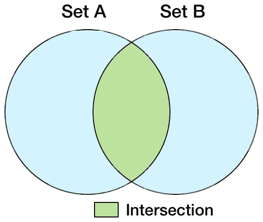
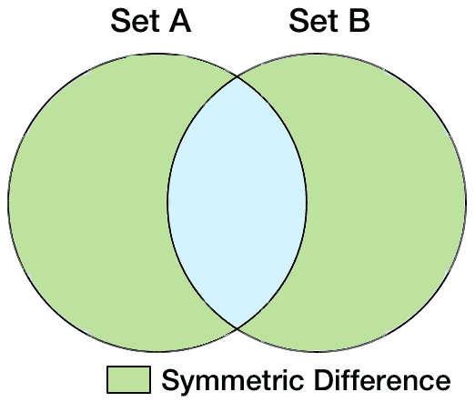
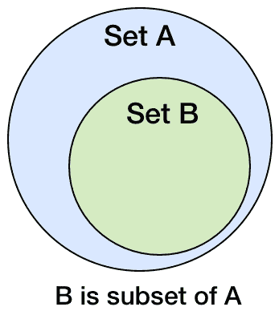
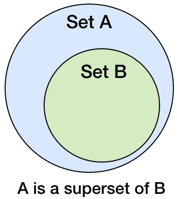
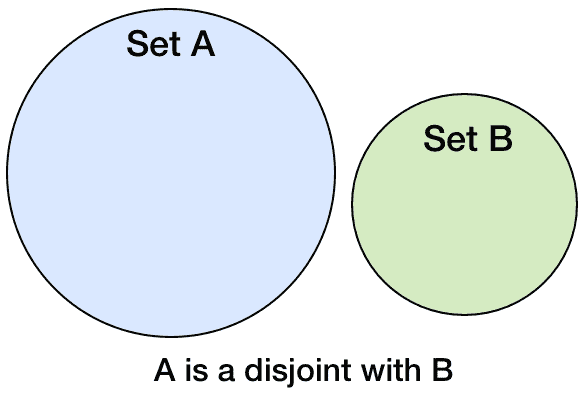
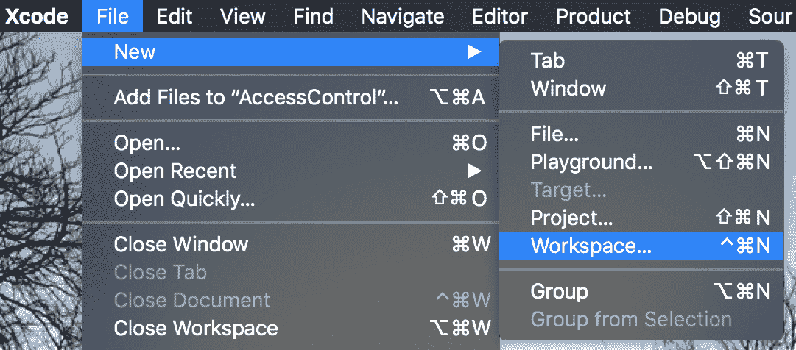
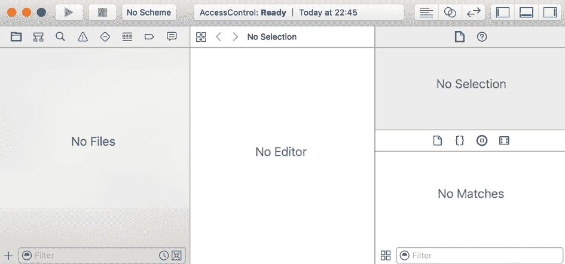
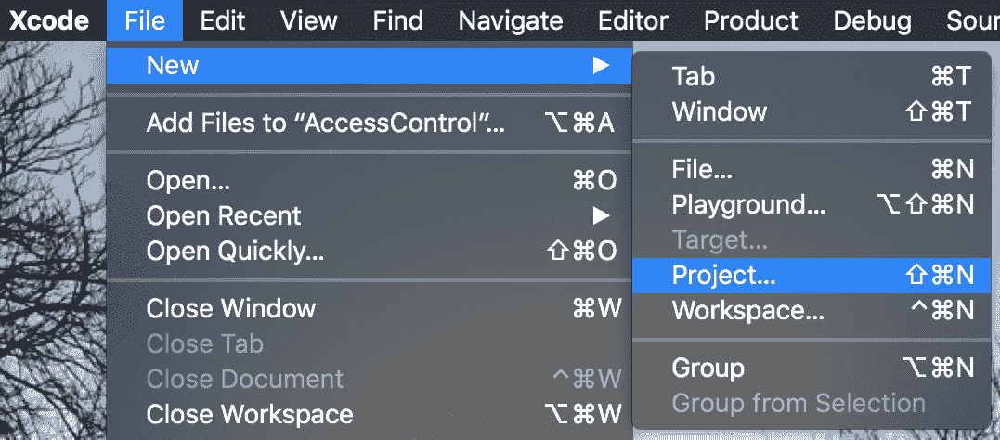
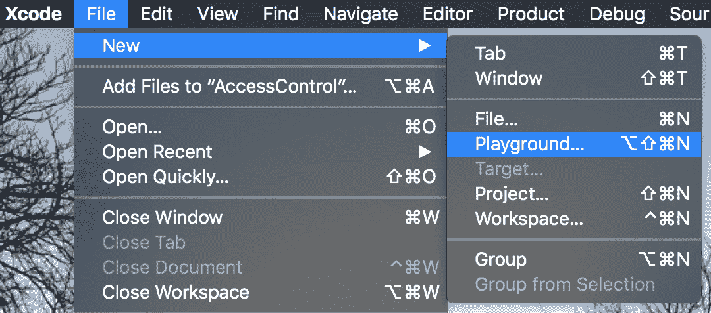
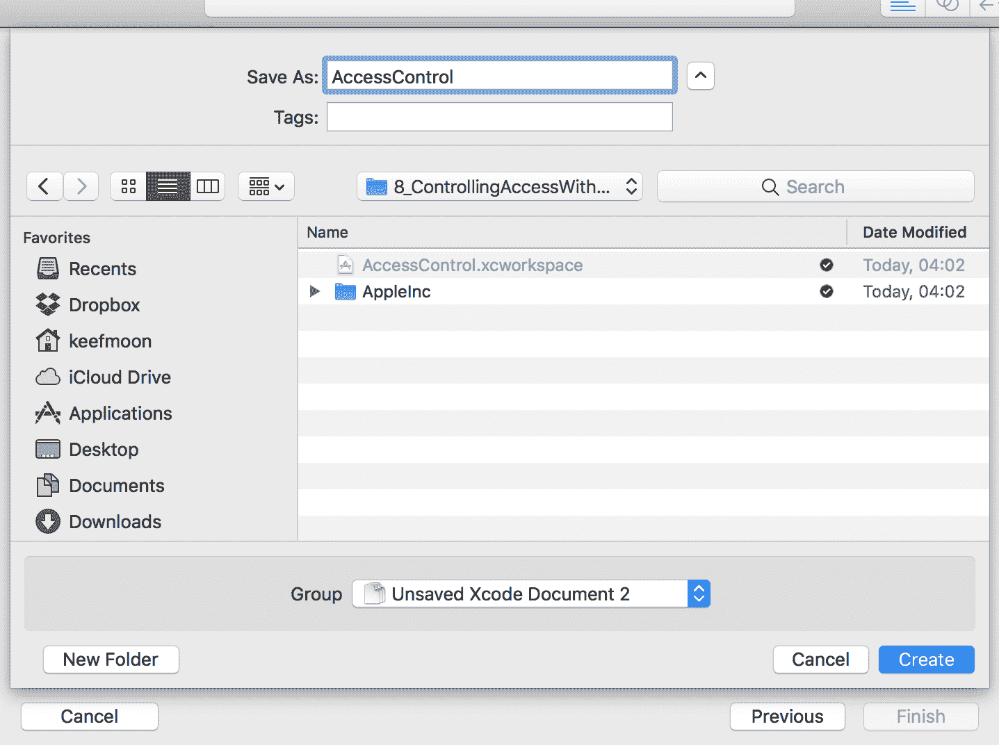

掌握构建块

上一章解释了构成 Swift 语言基石的基本类型。在本章中，我们将在此基础上创建更复杂的数据结构，如数组和字典，然后再探讨 Swift 提供的一些小宝藏，如元组和 typealias。最后，我们将通过探讨扩展和访问控制来结束本章，这两者都是对构建稳健且高效的代码库至关重要的组件。

在本章中，我们将介绍以下食谱：

+   将变量打包成元组

+   使用数组对数据进行排序

+   使用集合来存储数据

+   使用字典存储键值对

+   自定义类型的下标

+   使用 typealias 更改你的名字

+   使用属性观察器获取属性更改通知

+   使用扩展扩展功能

+   使用访问控制来控制访问

让我们开始吧！

# 第三章：技术要求

本章的所有代码都可以在这本书的 GitHub 仓库中找到：[`github.com/PacktPublishing/Swift-Cookbook-Second-Edition/tree/master/Chapter02`](https://github.com/PacktPublishing/Swift-Cookbook-Second-Edition/tree/master/Chapter02)

查看以下视频，了解代码的实际应用：[`bit.ly/2YGayJh`](https://bit.ly/2YGayJh)

# 将变量打包成元组

**元组**是由两个或更多值组成的组合，可以被视为一个整体。如果你曾经希望从一个函数或方法中返回多个值，你应该会发现元组非常有趣。

## 准备工作

创建一个新的游乐场并添加以下语句：

```swift
import Foundation 
```

此示例使用 `Foundation` 中的一个函数。我们将在第五章“超越标准库”中更详细地探讨 Foundation，但就目前而言，我们只需要导入它。

## 如何做到这一点...

让我们想象我们正在构建一个应用程序，该应用程序从多个来源获取电影评分并将它们一起展示，以帮助用户决定看哪部电影。这些来源可能使用不同的评分系统，如下所示：

+   5 星中的星级数量

+   10 分中的得分

+   百分比得分

我们希望将这些评分标准化，以便可以直接比较并并排显示。我们希望所有评分都表示为 5 星中的星级数量，因此我们将编写一个函数，该函数将返回 5 星中的整星级数。然后我们将使用这个函数来显示用户界面（UI）中正确的星级数量。

我们的 UI 还包括一个标签，它将读取 x 星电影，其中 **x** 是星级数。如果我们的函数返回星级数和可以放入 UI 的字符串将非常有用。我们可以使用元组来完成这个任务。让我们开始吧：

1.  创建一个函数来标准化星级评分。以下函数接受一个评分和一个可能的总评分，然后返回一个包含标准化评分和用于 UI 显示的字符串的元组：

```swift
func normalizedStarRating(forRating rating: Float, 
   ofPossibleTotal total: Float) -> (Int, String) {

} 
```

1.  在函数内部，计算总分数的分数。然后，将这个分数乘以我们的标准化总分数 5，并四舍五入到最接近的整数：

```swift
let fraction = rating / total 
let ratingOutOf5 = fraction * 5 
let roundedRating = round(ratingOutOf5) // Rounds to the nearest 
  // integer.
```

1.  仍然在函数内部，将四舍五入的分数从`Float`转换为`Int`。然后，创建显示字符串，并将`Int`和`String`作为元组返回：

```swift
let numberOfStars = Int(roundedRating) // Turns a Float into an Int 
let ratingString = "\(numberOfStars) Star Movie" 
return (numberOfStars, ratingString) 
```

1.  调用我们新的函数，并将结果存储在一个常量中：

```swift
let ratingAndDisplayString = normalisedStarRating(forRating: 5, 
                               ofPossibleTotal: 10)
```

1.  从元组中检索星级评分并打印结果：

```swift
let ratingNumber = ratingAndDisplayString.0 
print(ratingNumber) // 3 - Use to show the right number of stars
```

1.  从元组中检索显示字符串并打印结果：

```swift
let ratingString = ratingAndDisplayString.1 
print(ratingString) // "3 Star Movie" - Use to put in the label
```

有了这个，我们就创建并使用了元组。

## 它是如何工作的...

元组被声明为一个逗号分隔的类型列表，用括号括起来。在上面的代码中，你可以看到一个被声明为`(Int, String)`的元组。函数`normalizedStarRating`标准化评分，并将`numberOfStars`作为最接近的星级数，`ratingString`作为显示字符串。然后，将这些值通过在括号内用逗号分隔组合成一个元组；即`(numberOfStars, ratingString)`。这个元组值随后由函数返回。

接下来，让我们看看我们可以用返回的元组值做什么：

```swift
let ratingAndDisplayString = normalizedStarRating(forRating: 5, 
                               ofPossibleTotal: 10) 
```

调用我们的函数返回一个元组，我们将其存储在一个名为`ratingAndDisplayString`的常量中。我们可以通过访问元组的编号成员来访问元组的组件：

```swift
let ratingNumber = ratingAndDisplayString.0 
print(ratingNumber) // 3 - Use to show the right number of stars 

let ratingString = ratingAndDisplayString.1 
print(ratingString) // "3 Star Movie" - Use to put in the label 
```

与大多数编程语言中的编号系统一样，成员编号系统从`0`开始。用于识别编号集合中某个位置的数字称为索引。

有另一种方法可以检索元组的组件，这可能比使用编号索引更容易记住。通过指定一个变量名元组，元组的每个值将被分配给相应的变量名。因此，我们可以简化访问元组值和打印结果：

```swift
let (nextNumber, nextString) = normalizedStarRating(forRating: 8, 
                                 ofPossibleTotal: 10)
print(nextNumber) // 4
print(nextString) // "4 Star Movie"
```

由于数值是返回元组中的第一个值，因此它被分配给`nextNumber`常量，而第二个值，即字符串，被分配给`nextString`。然后，它们可以像任何其他常量一样使用，从而消除了记住哪个索引对应哪个值的需求。

## 还有更多...

正如我们之前提到的，通过数字访问元组的组件并不理想，因为我们必须记住它们在元组中的顺序以确保我们访问的是正确的组件。为了提供一些上下文，我们可以在元组组件上添加标签，这样在访问它们时就可以用来识别。元组标签的定义方式与参数标签类似，位于类型之前，并用冒号分隔。让我们给这个菜谱中创建的函数添加标签，然后使用这些标签来访问元组值：

```swift
func normalizedStarRating(forRating rating: Float, 
                          ofPossibleTotal total: Float) 
                          -> (starRating: Int, displayString: String) { 

    let fraction = rating / total 
    let ratingOutOf5 = fraction * 5 
    let roundedRating = round(ratingOutOf5) // Rounds to the nearest 
      // integer. 
    let numberOfStars = Int(roundedRating) // Turns a Float into an Int 
    let ratingString = "\(numberOfStars) Star Movie" 

    return (starRating: numberOfStars, displayString: ratingString) 
} 

let ratingAndDisplayString = normalizedStarRating(forRating: 5, 
                              ofPossibleTotal: 10) 

let ratingInt = ratingAndDisplayString.starRating 
print(ratingInt) // 3 - Use to show the right number of stars 

let ratingString = ratingAndDisplayString.displayString 
print(ratingString) // "3 Stars" - Use to put in the label 
```

作为函数声明的一部分，我们可以看到元组是如何被声明的：

```swift
(starRating: Int, displayString: String)
```

当创建这种类型的元组时，提供的值前面有一个标签：

```swift
return (starRating: numberOfStars, displayString: ratingString)
```

要访问元组的组件，我们可以使用这些标签（尽管索引的数量仍然有效）：

```swift
let ratingValue = ratingAndDisplayString.starRating 
print(ratingValue) // 3 - Use to show the right number of stars 

let ratingString = ratingAndDisplayString.displayString 
print(ratingString) // "3 Stars" - Use to put in the label
```

元组是捆绑值的一种方便且轻量级的方式。

在这个例子中，我们创建了一个包含两个组件的元组。然而，元组可以包含任意数量的组件。

## 参见

关于元组的更多信息可以在 Apple 的 Swift 语言文档中找到，请参阅[`docs.swift.org/swift-book/ReferenceManual/Types.html`](https://docs.swift.org/swift-book/ReferenceManual/Types.html)。

# 使用数组对数据进行排序

到目前为止，在这本书中，我们已经学习了多种不同的 Swift 构造：**类**、**结构体**、**枚举**、**闭包**、**协议**和**元组**。然而，单独处理这些构造中的一个实例的情况很少见。通常，我们会拥有许多这样的构造，我们需要一种方法来收集多个实例并将它们放置在有用的数据结构中。在接下来的几个菜谱中，我们将检查 Swift 提供的三个集合数据结构；即，**数组**、**集合**和**字典**（在其他编程语言中，字典通常被称为**哈希表**）：


图 2.1 – 数据结构集合

在做这件事的时候，我们将看看如何使用它们来存储和访问信息，然后检查它们的相对特性。

## 开始

首先，让我们研究**数组**，它们是有序元素列表。我们不会使用之前菜谱中的任何组件，因此你可以为这个菜谱创建一个新的游乐场。

## 如何做到这一点...

让我们使用数组来组织要观看的电影列表：

1.  创建一个名为 `moviesToWatch` 的数组。这将存储我们的字符串：

```swift
var moviesToWatch: Array<String> = Array()
```

1.  将三部电影追加到我们的电影列表数组末尾：

```swift
moviesToWatch.append("The Shawshank Redemption") 
moviesToWatch.append("Ghostbusters") 
moviesToWatch.append("Terminator 2")
```

1.  按顺序打印列表中每部电影的名称：

```swift
print(moviesToWatch[0]) // "The Shawshank Redemption"
print(moviesToWatch[1]) // "Ghostbusters"
print(moviesToWatch[2]) // "Terminator 2"
```

1.  打印到目前为止列表中电影的数量：

```swift
print(moviesToWatch.count) // 3
```

1.  在列表中插入一部新电影，使其成为第三个。由于数组是基于 0 的，这是在索引 2 处完成的：

```swift
moviesToWatch.insert("The Matrix", at: 2)
```

1.  打印列表计数以检查它是否增加了 1，并打印更新后的新列表：

```swift
print(moviesToWatch.count) // 4
print(moviesToWatch)
// The Shawshank Redemption
// Ghostbusters
// The Matrix
// Terminator 2
```

1.  使用 `first` 和 `last` 数组属性访问它们各自的值并打印它们：

```swift
let firstMovieToWatch = moviesToWatch.first 
print(firstMovieToWatch as Any) // Optional("The Shawshank 
  Redemption") 
let lastMovieToWatch = moviesToWatch.last 
print(lastMovieToWatch as Any) // Optional("Terminator 2") 
```

1.  使用索引下标访问列表中的第二部电影并打印它。然后，将新值设置到相同的下标。一旦完成，打印列表计数以检查未更改的电影数量，并打印列表以检查第二个数组元素是否已更改：

```swift
let secondMovieToWatch = moviesToWatch[1] 
print(secondMovieToWatch) // "Ghostbusters"
moviesToWatch[1] = "Ghostbusters (1984)" 
print(moviesToWatch.count) // 4 
print(moviesToWatch) 
// The Shawshank Redemption 
// Ghostbusters (1984) 
// The Matrix 
// Terminator 2 
```

1.  使用数组字面量语法初始化一个新的间谍电影数组：

```swift
let spyMovieSuggestions: [String] = ["The Bourne Identity", 
                                     "Casino Royale", 
                                     "Mission Impossible"] 
```

1.  使用加法运算符（`+`）将我们创建的两个数组合并，并将它们赋值回 `moviesToWatch` 变量。然后，打印数组计数以反映合并的两个列表，并打印新列表：

```swift
moviesToWatch = moviesToWatch + spyMovieSuggestions 
print(moviesToWatch.count) // 7 
print(moviesToWatch) 
// The Shawshank Redemption 
// Ghostbusters (1984) 
// The Matrix 
// Terminator 2 
// The Bourne Identity 
// Casino Royale 
// Mission Impossible 
```

1.  接下来，使用数组便利初始化器创建一个包含三个相同条目的数组。然后，更新每个数组元素，以便显示其余的电影标题：

```swift
var starWarsTrilogy = Array<String>(repeating: "Star Wars: ", 
  count: 3) 
starWarsTrilogy[0] = starWarsTrilogy[0] + "A New Hope"  
starWarsTrilogy[1] = starWarsTrilogy[1] + "Empire Strikes Back"  
starWarsTrilogy[2] = starWarsTrilogy[2] + "Return of the Jedi"  
print(starWarsTrilogy)  
// Star Wars: A New Hope 
// Star Wars: Empire Strikes Back 
// Star Wars: Return of the Jedi
```

1.  让我们将我们现有的电影列表的一部分替换为我们的 `starWarsTrilogy` 列表，然后打印计数和列表：

```swift
moviesToWatch.replaceSubrange(2...4, with: starWarsTrilogy) 
print(moviesToWatch.count) // 7 
print(moviesToWatch) 
// The Shawshank Redemption 
// Ghostbusters (1984) 
// Star Wars: A New Hope 
// Star Wars: Empire Strikes Back 
// Star Wars: Return of the Jedi 
// Casino Royale 
// Mission Impossible
```

1.  最后，删除列表中的最后一部电影，并检查数组计数是否减少了一个：

```swift
moviesToWatch.remove(at: 6) 
print(moviesToWatch.count) // 6 
print(moviesToWatch) 
// The Shawshank Redemption 
// Ghostbusters (1984) 
// Star Wars: A New Hope 
// Star Wars: Empire Strikes Back 
// Star Wars: Return of the Jedi 
// Casino Royale
```

这样，我们就探讨了多种创建和操作数组的方法。

## 它是如何工作的...

在创建数组时，我们需要指定将存储在数组中的元素类型。数组元素类型在数组的类型声明中用尖括号声明。在我们的例子中，我们存储字符串：

```swift
var moviesToWatch: Array<String> = Array() 
moviesToWatch.append("The Shawshank Redemption") 
moviesToWatch.append("Ghostbusters") 
moviesToWatch.append("Terminator 2") 
```

上一段代码使用了 Swift 语言的一个特性，称为 **泛型**，这在许多编程语言中都可以找到，将在第四章中详细介绍，*泛型、运算符和嵌套类型*。

`Array` 的 `append` 方法将在数组的末尾添加一个新元素。现在我们已经将一些元素放入数组中，我们可以检索并打印这些元素：

```swift
print(moviesToWatch[0]) // "The Shawshank Redemption" 
print(moviesToWatch[1]) // "Ghostbusters" 
print(moviesToWatch[2]) // "Terminator 2" 
```

数组中的元素使用基于零的索引编号，因此数组中的第一个元素在索引 0，第二个在索引 1，第三个在索引 2，依此类推。我们可以使用下标访问数组中的元素，其中我们提供要访问的元素的索引。下标在数组实例名称后用方括号指定。

当使用索引下标访问元素时，不会进行检查以确保你提供了有效的索引。实际上，如果提供了一个数组不包含的索引，这将导致崩溃。相反，我们可以使用 `Array` 上的某些索引辅助方法来确保我们有一个适用于此数组的有效索引。让我们使用这些辅助方法之一来检查我们已知适用于我们数组的索引，然后使用另一个我们知道不是有效索引的索引：

```swift
let index5 = moviesToWatch.index(moviesToWatch.startIndex,
                                 offsetBy: 5,
                                 limitedBy: moviesToWatch.endIndex)
print(index5 as Any) // Optional(5)

let index10 = moviesToWatch.index(moviesToWatch.startIndex,
                                  offsetBy: 10,
                                  limitedBy: moviesToWatch.endIndex)
print(index10 as Any) // nil
```

`index` 方法允许我们指定我们想要的索引作为第一个索引参数的偏移量，但作为受最后一个索引参数限制的偏移量。如果它在范围内，这将返回有效索引，如果不在范围内，则返回 `nil`。到游乐场结束时，`moviesToWatch` 数组包含六个元素，在这种情况下，检索索引 5 是成功的，但索引 10 返回 `nil`。

在下一章中，我们将介绍如何根据该索引是否存在来做出决策，但到目前为止，了解这种方法可用就足够了。

数组有一个 `count` 属性，它告诉我们它们存储了多少个元素。因此，当我们添加一个元素时，这个值将改变：

```swift
print(moviesToWatch.count) // 3 
```

可以使用与前面代码中相同的基于零的索引在任何位置插入数组中的元素：

```swift
moviesToWatch.insert("The Matrix", at: 2) 
```

因此，通过在索引 2 处插入 `"The Matrix"`，它将被放置在我们数组中的第三个位置，并且索引 2 或更大的所有元素都将向下移动 1 位。

这增加了数组的计数：

```swift
print(moviesToWatch.count) // 4
```

数组还提供了一些有用的计算属性，用于访问数组的两端元素：

```swift
let firstMovieToWatch = moviesToWatch.first 
print(firstMovieToWatch as Any) // Optional("The Shawshank Redemption") 
let lastMovieToWatch = moviesToWatch.last 
print(firstMovieToWatch as Any) // Optional("Terminator 2") 
let secondMovieToWatch = moviesToWatch[1] 
print(secondMovieToWatch) // "Ghostbusters" 
```

这些属性是可选值，因为数组可能为空，如果是这样，这些值将是 `nil`。然而，通过索引下标访问数组元素返回的是一个非可选值。

除了通过下标检索值之外，我们还可以将值赋给数组下标：

```swift
moviesToWatch[1] = "Ghostbusters (1984)" 
```

这将用新值替换给定索引处的元素。

当我们创建第一个数组时，我们创建了一个空数组，然后向其中添加了值。此外，还可以使用数组字面量来创建一个已经包含值的数组：

```swift
let spyMovieSuggestions: [String] = ["The Bourne Identity", 
                                     "Casino Royale", 
                                     "Mission Impossible"] 
```

可以使用方括号内的元素类型来指定数组类型，并且可以通过方括号内用逗号分隔的元素来定义数组字面量。因此，我们可以这样定义一个整数数组：

```swift
let fibonacci: [Int] = [1, 1, 2, 3, 5, 8, 13, 21, 34, 55] 
```

正如我们在上一章中学到的，编译器通常可以从我们分配的值中推断类型，并且当类型被推断时，我们不需要指定它。在前面的两个数组中，`spyMovieSuggestions` 和 `fibonacci`，数组中的所有元素都是同一类型；即 `String` 和 `Int`，分别。由于这些类型可以推断，我们不需要定义它们：

```swift
let spyMovieSuggestions = ["The Bourne Identity", "Casino Royale", 
  "Mission Impossible"]
let fibonacci = [1, 1, 2, 3, 5, 8, 13, 21, 34, 55] 
```

可以使用 `+` 运算符组合数组：

```swift
moviesToWatch = moviesToWatch + spyMovieSuggestions
```

这将通过将第二个数组中的元素追加到第一个数组中来创建一个新的数组。

数组提供了一个方便的初始化器，该初始化器将重复元素填充到数组中。我们可以使用这个初始化器来创建一个包含著名电影三部曲名称的数组：

```swift
var starWarsTrilogy = Array<String>(repeating: "Star Wars: ", count: 3)
```

然后，我们可以结合下标访问、字符串连接和下标赋值，将完整的电影名称添加到我们的三部曲数组中：

```swift
starWarsTrilogy[0] = starWarsTrilogy[0] + "A New Hope" 
starWarsTrilogy[1] = starWarsTrilogy[1] + "Empire Strikes Back" 
starWarsTrilogy[2] = starWarsTrilogy[2] + "Return of the Jedi" 
```

数组还提供了一个辅助函数，用于将一组值替换为另一个数组中的值：

```swift
moviesToWatch.replaceSubrange(2...4, with: starWarsTrilogy)
```

在这里，我们使用 `...` 来指定两个整数值之间的范围，包括这些值。因此，这个范围包含整数 2、3 和 4。

在后续章节中，我们将以这种方式指定范围。或者，您可以指定一个范围，该范围向上到但不包括范围的顶部。这被称为半开区间：

```swift
moviesToWatch.replaceSubrange(2..<5, with: starWarsTrilogy)  
```

对于我们的数组，我们已经添加了元素、访问了它们，并替换了它们，因此我们需要知道如何从数组中删除元素：

```swift
moviesToWatch.remove(at: 6) 
```

将元素的索引提供给 `remove` 方法。通过这样做，该索引处的元素将从数组中移除，并且所有后续元素将向上移动一个位置以填充空位。这将使数组的计数减少 1：

```swift
print(moviesToWatch.count) // 6 
```

## 还有更多...

如果你熟悉 Objective-C，你将使用 `NSArray`，它提供了与 Swift 数组类似的功能。你可能也记得 `NSArray` 是不可变的，这意味着一旦创建，其内容就不能更改。如果你需要更改其内容，则应使用 `NSMutableArray`。因此，你可能想知道 Swift 是否有类似可变和不可变数组的概念。它确实有，但与使用单独的可变和不可变类型不同，你通过将其声明为变量来创建可变数组，通过将其声明为常量来创建不可变数组：

```swift
let evenNumbersTo10 = [2, 4, 6, 8, 10] 
evenNumbersTo10.append(12) // Doesn't compile 

var evenNumbersTo12 = evenNumbersTo10
evenNumbersTo12.append(12) // Does compile
```

要理解为什么是这样，重要的是要知道数组是一个值类型，Swift 中的其他集合类型也是值类型。

正如我们在上一章中看到的，值类型本质上是不可变的，并且每次它被修改时都会创建一个更改后的副本。因此，通过使用 `let` 将数组分配给常量，我们防止了任何新值被分配，这使得修改数组成为不可能。

## 参见

更多关于数组的信息可以在 Apple 的 Swift 语言文档中找到，链接为 [`developer.apple.com/documentation/swift/array`](https://developer.apple.com/documentation/swift/array)。

数组使用泛型来定义它们包含的元素类型。泛型将在第四章 Generics, Operators, and Nested Types 中详细讨论。

# 在集合中保存你的数据

我们将要查看的下一个集合类型是 **集合**。集合与数组在两个重要方面有所不同。集合中的元素是 **无序** 存储的，并且每个唯一的元素只保留一次。在这个菜谱中，我们将学习如何创建和操作集合。

## 如何做到这一点...

首先，让我们探索一些我们可以创建集合并在其上执行集合代数的方法：

1.  创建一个包含前九个斐波那契数的数组，以及一个包含相同元素的集合：

```swift
let fibonacciArray: Array<Int> = [1, 1, 2, 3, 5, 8, 13, 21, 34] 
let fibonacciSet: Set<Int> = [1, 1, 2, 3, 5, 8, 13, 21, 34] 
print(fibonacciArray.count) // 9 
print(fibonacciSet.count) // 8
```

1.  使用 `count` 属性打印出每个集合中的元素数量。尽管它们是由相同的元素创建的，但计数值是不同的：

```swift
print(fibonacciArray.count) // 9 
print(fibonacciSet.count) // 8 
```

1.  向一个动物集合中插入一个元素，删除一个元素，并检查集合是否包含一个给定的元素：

```swift
var animals: Set<String> = ["cat", "dog", "mouse", "elephant"] 
animals.insert("rabbit") 
print(animals.contains("dog")) // true 
animals.remove("dog") 
print(animals.contains("dog")) // false
```

1.  创建包含常见数学数字组的集合。我们将使用这些集合来探索一些集合代数的方法：

```swift
let evenNumbers = Set<Int>(arrayLiteral: 2, 4, 6, 8, 10) 
let oddNumbers: Set<Int> = [1, 3, 5, 7, 9] 
let squareNumbers: Set<Int> = [1, 4, 9] 
let triangularNumbers: Set<Int> = [1, 3, 6, 10]
```

1.  获取两个集合的并集并打印结果：

```swift
let evenOrTriangularNumbers = evenNumbers.union(triangularNumbers) 
  // 2, 4, 6, 8, 10, 1, 3, unordered 
print(evenOrTriangularNumbers.count) // 7 
```

1.  获取两个集合的交集并打印结果：

```swift
let oddAndSquareNumbers = oddNumbers.intersection(squareNumbers) 
  // 1, 9, unordered 
print(oddAndSquareNumbers.count) // 2 
```

1.  获取两个集合的对称差并打印结果：

```swift
let squareOrTriangularNotBoth = 
  squareNumbers.symmetricDifference(triangularNumbers) 
   // 4, 9, 3, 6, 10, unordered 
print(squareOrTriangularNotBoth.count) // 5
```

1.  获取从另一个集合中减去一个集合的结果并打印结果：

```swift
let squareNotOdd = squareNumbers.subtracting(oddNumbers) // 4 
print(squareNotOdd.count) // 1 
```

接下来，我们将检查可用的集合成员比较方法：

1.  创建一些具有重叠成员的集合：

```swift
let animalKingdom: Set<String> = ["dog", "cat", "pidgeon", 
                                  "chimpanzee", "snake", "kangaroo", 
                                  "giraffe", "elephant", "tiger", 
                                  "lion", "panther"] 

let vertebrates: Set<String> = ["dog", "cat", "pidgeon", 
                                "chimpanzee", "snake", "kangaroo", 
                                "giraffe", "elephant", "tiger", 
                                "lion", "panther"]

let reptile: Set<String> = ["snake"] 

let mammals: Set<String> = ["dog", "cat", "chimpanzee", 
                            "kangaroo", "giraffe", "elephant", 
                            "tiger", "lion", "panther"]

let catFamily: Set<String> = ["cat", "tiger", "lion", "panther"] 

let domesticAnimals: Set<String> = ["cat", "dog"]
```

1.  使用 `isSubset` 方法确定一个集合是否是另一个集合的子集。然后，打印结果：

```swift
print(mammals.isSubset(of: animalKingdom)) // true
```

1.  使用 `isSuperset` 方法确定一个集合是否是另一个集合的超集。然后，打印结果：

```swift
print(mammals.isSuperset(of: catFamily)) // true
```

1.  使用 `isStrictSubset` 方法确定一个集合是否是另一个集合的严格子集。然后，打印结果：

```swift
print(vertebrates.isStrictSubset(of: animalKingdom)) // false 
print(mammals.isStrictSubset(of: animalKingdom)) // true
```

1.  使用`isStrictSuperset`方法确定一个集合是否是另一个集合的严格超集。然后，打印结果：

```swift
print(animalKingdom.isStrictSuperset(of: vertebrates)) // false 
print(animalKingdom.isStrictSuperset(of: domesticAnimals))  // true 
```

1.  使用`isDisjoint`方法确定一个集合是否与另一个集合不交集。然后，打印结果：

```swift
print(catFamily.isDisjoint(with: reptile)) // true
```

## 它是如何工作的...

集合的创建几乎与数组相同，并且像数组一样，我们必须指定将要存储在其中的元素类型：

```swift
let fibonacciArray: Array<Int> = [1, 1, 2, 3, 5, 8, 13, 21, 34] 
let fibonacciSet: Set<Int> = [1, 1, 2, 3, 5, 8, 13, 21, 34] 
```

数组和集合存储元素的方式不同。如果你向数组提供多个相同值的元素，它将会多次存储它们。集合的工作方式不同；它只会存储每个唯一元素的单一版本。因此，在先前的斐波那契数列中，数组存储了前两个值`1, 1`的两个元素，但集合只会存储这个`1`元素。这导致集合具有不同的计数，尽管它们是用相同的值创建的：

```swift
print(fibonacciArray.count) // 9 
print(fibonacciSet.count) // 8
```

这种唯一存储元素的能力是由于集合对其可以持有的元素类型的要求。集合的元素必须符合`Hashable`协议。该协议要求提供一个`hashValue`属性作为`Int`，集合使用这个`hashValue`来进行唯一性比较。`Int`和`String`类型都符合`Hashable`，但任何将存储在集合中的自定义类型也需要符合`Hashable`。

集合的`insert`、`remove`和`contains`方法按预期工作，编译器强制执行提供正确的类型。这种编译器类型检查是通过所有集合类型都具有的泛型约束来完成的。我们将在第四章中更详细地介绍泛型，*泛型、运算符和嵌套类型*。

### 并集

`union`方法返回一个包含调用该方法时集合的所有唯一元素以及作为参数提供的集合的集合：

```swift
let evenOrTriangularNumbers = evenNumbers.union(triangularNumbers) 
  // 2,4,6,8,10,1,3,unordered 
```

以下图表描述了集合 A 和集合 B 的并集：


图 2.2 – 集合并集

### 交集

`intersection`方法返回一个集合，其中包含调用该方法时集合和作为参数提供的集合中共同包含的唯一元素：

```swift
let oddAndSquareNumbers = oddNumbers.intersection(squareNumbers) 
  // 1, 9, unordered
```

以下图表描述了集合 A 和集合 B 的交集：



图 2.3 – 集合交集

### 对称差集

`symmetricDifference`方法返回一个集合，其中包含调用该方法时集合或提供的参数集合中的唯一元素，但不包括两个集合都有的元素：

```swift
let squareOrTriangularNotBoth =
  squareNumbers.symmetricDifference(triangularNumbers)  
// 4, 9, 3, 6, 10, unordered 
```

这种`set`操作有时被称为方法，因为在其他编程语言中，包括 Swift 的早期版本，都称为`exclusiveOr`。

以下图表描述了集合 A 和集合 B 的对称差集：



图 2.4 – 对称差集

### 减法

`subtracting` 方法返回一个唯一的元素集合，这些元素可以在调用该方法所在的集合中找到，但不在传递作为参数的集合中。与我们所提到的其他集合操作方法不同，如果您交换调用该方法所在的集合与提供的参数集合，则此方法不一定返回相同的值：

```swift
let squareNotOdd = squareNumbers.subtracting(oddNumbers) // 4 
```

以下图示展示了从集合 A 中减去集合 B 所创建的集合：


图 2.5– 减去一个集合

### 成员比较

除了集合操作方法之外，还有一些我们可以用来确定集合成员信息的方法。

`isSubset` 方法将在调用该方法所在的集合中的所有元素都包含在传递作为参数的集合中时返回 true：

```swift
print(mammals.isSubset(of: animalKingdom)) // true
```

以下图示展示了集合 B 是集合 A 的子集：



图 2.6 – 子集

如果两个集合相等（它们包含相同的元素），这也会返回 true。如果您只想在调用该方法所在的集合是子集且不相等时返回 true，则可以使用 `isStrictSubset`：

```swift
print(vertebrates.isStrictSubset(of: animalKingdom)) // false 
print(mammals.isStrictSubset(of: animalKingdom)) // true 
```

`isSuperset` 方法将在所有作为参数传递到集合中的元素都包含在调用该方法所在的集合中时返回 true：

```swift
print(mammals.isSuperset(of: catFamily)) // true 
```

以下图示展示了集合 A 是集合 B 的超集：



图 2.7 – 超集

如果两个集合相等（它们包含相同的元素），这也会返回 true。如果您只想在调用该方法所在的集合是超集且不相等时返回 true，则可以使用 `isStrictSuperset`：

```swift
print(animalKingdom.isStrictSuperset(of: vertebrates))     // false 
print(animalKingdom.isStrictSuperset(of: domesticAnimals)) // true
```

`isDisjoint` 方法将在调用该方法所在的集合和传递作为参数的集合之间没有共同元素时返回 true：

```swift
print(catFamily.isDisjoint(with: reptile)) // true 
```

以下图示表明集合 A 和集合 B 是互斥的：



图 2.8 – 互斥

与数组一样，可以通过将其分配给 `let` 常量而不是 `var` 变量来声明集合为不可变：

```swift
let planets: Set<String> = ["Mercury", "Venus", "Earth", 
                            "Mars", "Jupiter", "Saturn", 
                            "Uranus", "Neptune", "Pluto"] 
planets.remove("Pluto") // Doesn't compile 
```

这是因为集合，就像其他集合类型一样，是一个值类型。移除一个元素将修改集合，这会创建一个新的副本，但 `let` 常量不能分配新的值，因此编译器会阻止任何修改操作。

## 参见

关于数组的更多信息可以在苹果公司关于 Swift 语言的文档中找到，请参阅[`docs.swift.org/swift-book/LanguageGuide/CollectionTypes.html`](https://docs.swift.org/swift-book/LanguageGuide/CollectionTypes.html)。

集合使用泛型来定义它们包含的元素类型。泛型将在第四章中详细讨论，*泛型、运算符和嵌套类型*。

# 使用字典存储键值对

我们将要查看的最后一种集合类型是**字典**。这是编程语言中的一个熟悉的结构，有时被称为**哈希表**。字典包含键和值之间的配对集合。**键**可以是符合`Hashable`协议的任何元素（就像集合中的元素一样），而**值**可以是任何类型。字典的内容不是按顺序存储的，与数组不同；相反，*键*在存储值和检索值时都使用。

## 准备工作

在这个菜谱中，我们将使用字典来存储工作场所的人员详细信息。我们需要根据人员在组织中的角色（例如公司目录）来存储和检索个人信息。为了保存此人的信息，我们将使用从第一章，“Swift 构建块”中修改过的`Person`类。

将以下代码输入到一个新的游乐场中：

```swift
struct PersonName { 
    let givenName: String 
    let familyName: String 
} 

enum CommunicationMethod { 
    case phone 
    case email 
    case textMessage 
    case fax 
    case telepathy 
    case subSpaceRelay 
    case tachyons 
} 

class Person { 
    let name: PersonName 
    let preferredCommunicationMethod: CommunicationMethod 

    convenience init(givenName: String, 
                     familyName: String, 
                     commsMethod: CommunicationMethod) { 
        let name = PersonName(givenName: givenName, familyName: 
          familyName) 
        self.init(name: name, commsMethod: commsMethod) 
    } 

    init(name: PersonName, commsMethod: CommunicationMethod) { 
        self.name = name 
        preferredCommunicationMethod = commsMethod 
    } 

    var displayName: String {
        return "\(name.givenName) \(name.familyName)"
    }
} 
```

## 如何操作...

让我们使用之前定义的`Person`对象，通过字典构建我们的工作场所目录：

1.  创建一个员工目录的`Dictionary`：

```swift
var crew = Dictionary<String, Person>()
```

1.  用员工详细信息填充字典：

```swift
crew["Captain"] = Person(givenName: "Jean-Luc", 
                         familyName: "Picard", 
                         commsMethod: .phone)

crew["First Officer"] = Person(givenName: "William", 
                               familyName: "Riker", 
                               commsMethod: .email)

crew["Chief Engineer"] = Person(givenName: "Geordi", 
                                familyName: "LaForge", 
                                commsMethod: .textMessage)

crew["Second Officer"] = Person(givenName: "Data", 
                                familyName: "Soong", 
                                commsMethod: .fax)

crew["Councillor"] = Person(givenName: "Deanna", 
                            familyName: "Troi", 
                            commsMethod: .telepathy)

crew["Security Officer"] = Person(givenName: "Tasha", 
                                  familyName: "Yar", 
                                  commsMethod: .subSpaceRelay)

crew["Chief Medical Officer"] = Person(givenName: "Beverly", 
                                       familyName: "Crusher", 
                                       commsMethod: .tachyons)
```

1.  获取字典中所有键的数组。这将给我们一个包含组织中所有角色的数组：

```swift
let roles = Array(crew.keys) 
print(roles)
```

1.  使用键检索一名员工并打印结果：

```swift
let firstRole = roles.first! // Chief Medical Officer 
let cmo = crew[firstRole]! // Person: Beverly Crusher 
print("\(firstRole): \(cmo.displayName)")
// Chief Medical Officer: Beverly Crusher
```

1.  通过对现有键分配新值来替换字典中的值。当设置新值时，将丢弃该键的旧值：

```swift
print(crew["Security Officer"]!.name.givenName) // Tasha

crew["Security Officer"] = Person(givenName: "Worf", 
                                  familyName: "Son of Mogh", 
                                  commsMethod: .subSpaceRelay)

print(crew["Security Officer"]!.name.givenName) // Worf
```

通过这样，我们已经学会了如何创建、填充和查找字典中的值。

## 它是如何工作的...

与其他集合类型一样，当我们创建一个字典时，我们需要提供字典将持有的类型。对于字典，我们需要定义两种类型。第一种是键的类型（必须符合`Hashable`），第二种是存储在键上的值的类型。对于我们的字典，我们使用`String`作为键，`Person`作为存储的值：

```swift
var crew = Dictionary<String, Person>() 
```

与数组一样，我们可以使用方括号指定`dictionary`类型，并使用字典字面量创建一个，其中`:`分隔键和值：

```swift
let intByName: [String: Int] = ["one": 1, "two": 2, "three": 3] 
```

因此，我们可以更改我们的字典定义，使其看起来像这样：

```swift
var crew: [String: Person] = [:] 
```

`[:]`符号表示一个空字典作为字典字面量。

使用下标向字典中添加元素。与数组不同，数组在下标中使用`Int`索引，而字典使用键，然后将给定的值与给定的键配对。在以下示例中，我们将一个`Person`对象分配给`"Captain"`键：

```swift
crew["Captain"] = Person(givenName: "Jean-Luc", 
                         familyName: "Picard", 
                         commsMethod: .phone) 
```

如果当前不存在值，则将分配的值添加。如果给定键已存在值，则旧值将被新值替换，并且旧值将被丢弃。

字典上有一些属性提供了所有的键和值。这些属性是自定义集合类型，可以传递给数组初始化器以创建一个数组：

```swift
let roles = Array(crew.keys)  
print(roles)  
```

要显示字典的所有键，如`keys`属性所提供的，我们可以创建一个数组或直接迭代集合。我们将在下一章中介绍迭代集合的值，所以现在我们将创建一个数组。

接下来，我们将使用数组中的一个键值，与船员一起检索关联的`Person`的完整详细信息：

```swift
let firstRole = roles.first! // Chief Medical Officer 
let cmo = crew[firstRole]! // Person: Beverly Crusher 
print("\(firstRole): \(cmo.displayName)")
// Chief Medical Officer: Beverly Crusher
```

我们使用`first`属性获取第一个元素，但由于这是一个可选类型，我们需要使用`!`来强制解包。我们可以将`firstRole`传递给字典下标，它现在是一个非可选的`String`，以获取与该键关联的`Person`对象。通过下标检索值的返回类型也是可选的，因此在我们打印其值之前也需要强制解包。

**强制解包**通常是不安全的事情，因为如果我们强制解包一个最终是`nil`的值，我们的代码将会崩溃。我们建议你在解包可选值之前检查该值不是`nil`。我们将在下一章中介绍如何做到这一点。

## 还有更多...

在这个菜谱中，我们使用了字符串作为字典的键。然而，我们也可以使用符合`Hashable`协议的类型。

使用`String`作为员工目录的键的一个缺点是，很容易误输入员工的职位或查找一个你期望存在但实际上不存在的职位。因此，我们可以通过使用符合`Hashable`协议并且更适合作为模型中键的东西来改进我们的实现。

在我们的模型中，我们有一组有限的员工职位，枚举是表示有限数量选项的完美选择，所以让我们将我们的角色定义为枚举：

```swift
enum Role: String { 
    case captain = "Captain" 
    case firstOfficer = "First Officer" 
    case secondOfficer = "Second Officer" 
    case chiefEngineer = "Chief Engineer" 
    case councillor = "Councillor" 
    case securityOfficer = "Security Officer" 
    case chiefMedicalOfficer = "Chief Medical Officer" 
}
```

现在，让我们改变我们的`字典`定义，使其使用这个新的`枚举`作为键，然后插入我们的员工，使用这些`枚举`值：

```swift
var crew = Dictionary<Role, Person>() 

crew[.captain] = Person(givenName: "Jean-Luc", 
                        familyName: "Picard", 
                        commsMethod: .phone) 

crew[.firstOfficer] = Person(givenName: "William", 
                             familyName: "Riker", 
                             commsMethod: .email) 

crew[.chiefEngineer] = Person(givenName: "Geordi", 
                              familyName: "LaForge", 
                              commsMethod: .textMessage) 

crew[.secondOfficer] = Person(givenName: "Data", 
                              familyName: "Soong", 
                              commsMethod: .fax) 

crew[.councillor] = Person(givenName: "Deanna", 
                           familyName: "Troi", 
                           commsMethod: .telepathy) 

crew[.securityOfficer] = Person(givenName: "Tasha", 
                                familyName: "Yar", 
                                commsMethod: .subSpaceRelay) 

crew[.chiefMedicalOfficer] = Person(givenName: "Beverly", 
                                    familyName: "Crusher", 
                                    commsMethod: .tachyons) 
```

你还需要更改所有其他使用`crew`的地方，使它们使用新的基于枚举的键。

让我们看看它是如何以及为什么这样工作的。我们创建了一个基于`String`的`Role`枚举：

```swift
enum Role: String { 
    //... 
} 
```

以这种方式定义有两个好处：

+   我们打算向用户显示这些职位，所以我们需要一个`Role`枚举的字符串表示形式，无论我们如何定义它。

+   枚举中包含一点协议和泛型魔法，这意味着如果一个枚举由实现`Hashable`协议的类型（如`String`）支持，那么枚举也会自动实现`Hashable`协议。因此，将`Role`定义为基于字符串的枚举，满足了字典对键必须是`Hashable`的要求，而无需我们做任何额外的工作。

由于我们的`crew`字典现在定义为基于`Role`键，所有下标操作都必须使用角色枚举中的值：

```swift
crew[.captain] = Person(givenName: "Jean-Luc", 
                        familyName: "Picard", 
                        commsMethod: .phone) 
let cmo = crew[.chiefMedicalOfficer] 
```

编译器强制执行此操作，因此在与我们的员工目录交互时不再可能使用不正确的角色。使用 Swift 的构造和类型系统来强制正确使用你的代码是我们应该努力做到的，因为它可以减少错误并防止我们的代码以意外的方式被使用。

## 参见

关于字典的更多信息可以在苹果公司关于 Swift 语言的文档中找到，请参阅[`swiftbook.link/docs/collections`](http://swiftbook.link/docs/collections)。

# 自定义类型的下标

通过使用集合类型，我们已经看到它们的元素是通过下标访问的。然而，不仅仅是集合类型可以有下标；你的自定义类型也可以提供下标功能。

## 准备工作

在这个菜谱中，我们将创建一个简单的井字棋游戏，也称为“圈叉游戏”。为此，我们需要一个三行三列的位置网格，每个位置由玩家 1 的零、玩家 2 的叉或空位填充。我们可以将这些位置存储在数组数组中。

初始游戏设置代码使用了我们在本书中已经介绍的概念，所以我们将不会深入其实现。将以下代码输入到一个新的游乐场中，以便我们可以看到下标如何改进其使用：

```swift
enum GridPosition: String { 
    case player1 = "o" 
    case player2 = "x" 
    case empty = " " 
} 

struct TicTacToe { 

    var gridStorage: [[GridPosition]] = [] 

    init() { 
        gridStorage.append(Array(repeating: .empty, count: 3)) 
        gridStorage.append(Array(repeating: .empty, count: 3)) 
        gridStorage.append(Array(repeating: .empty, count: 3)) 
    } 

    func gameStateString() -> String { 
        var stateString = "-------------\n" 
        stateString += printableString(forRow: gridStorage[0]) 
        stateString += "-------------\n" 
        stateString += printableString(forRow: gridStorage[1]) 
        stateString += "-------------\n" 
        stateString += printableString(forRow: gridStorage[2]) 
        stateString += "-------------\n" 

        return stateString 
    } 

    func printableString(forRow row: [GridPosition]) -> String { 
        var rowString = "| \(row[0].rawValue) " 
        rowString += "| \(row[1].rawValue) " 
        rowString += "| \(row[2].rawValue) |\n" 
        return rowString 
    } 
} 
```

## 如何做...

让我们回顾一下如何使用之前定义的井字棋游戏，以及如何使用下标改进其使用方式。我们还将检查这是如何工作的：

1.  让我们创建一个`TicTacToe`网格的实例：

```swift
var game = TicTacToe()
```

1.  要让玩家进行移动，我们需要更改分配给数组中相关位置的`GridPosition`值。这用于存储网格位置。玩家 1 将在网格中间位置放置一个零，这将位于行位置 1，列位置 1（因为它是基于零的数组）：

```swift
// Move 1 
game.gridStorage[1][1] = .player1 
print(game.gameStateString()) 
/* 
------------- 
|   |   |   | 
------------- 
|   | o |   | 
------------- 
|   |   |   | 
------------- 
*/
```

1.  接下来，玩家 2 将他们的叉放在右上角的位置，这是行位置 0，列位置 2：

```swift
// Move 2 
game.gridStorage[0][2] = .player2 
print(game.gameStateString()) 
/* 
------------- 
|   |   | x | 
------------- 
|   | o |   | 
------------- 
|   |   |   | 
------------- 
*/  
```

我们可以在游戏中进行移动。我们可以通过直接向`gridStorage`数组添加信息来实现这一点，但这并不理想。玩家不需要知道移动是如何存储的，而且我们应该能够更改存储游戏信息的方式，而无需更改移动方式。为了解决这个问题，让我们创建游戏结构体的下标，以便在游戏中进行移动就像为数组赋值一样。

1.  将以下下标方法添加到`TicTacToe`结构体中：

```swift
struct TicTacToe { 
    var gridStorage: [[GridPosition]] = [] 
    //... 
    subscript(row: Int, column: Int) -> GridPosition { 
        get { 
            return gridStorage[row][column] 
        } 
        set(newValue) { 
            gridStorage[row][column] = newValue 
        } 
    } 
    //... 
} 
```

1.  因此，现在我们可以改变每个玩家如何移动并完成游戏：

```swift
// Move 1 
game[1, 1] = .player1 
print(game.gameStateString()) 
/*  
 ------------- 
 |   |   |   | 
 ------------- 
 |   | o |   | 
 ------------- 
 |   |   |   | 
 ------------- 
 */  

// Move 2 
game[0, 2] = .player2 
print(game.gameStateString()) 
/*  
 ------------- 
 |   |   | x | 
 ------------- 
 |   | o |   | 
 ------------- 
 |   |   |   | 
 ------------- 
 */  

// Move 3 
game[0, 0] = .player1 
print(game.gameStateString()) 
/*  
 ------------- 
 | o |   | x | 
 ------------- 
 |   | o |   | 
 ------------- 
 |   |   |   | 
 ------------- 
 */  

// Move 4 
game[1, 2] = .player2 
print(game.gameStateString()) 
/*  
 ------------- 
 | o |   | x | 
 ------------- 
 |   | o | x | 
 ------------- 
 |   |   |   | 
 ------------- 
 */  

// Move 5 
game[2, 2] = .player1 
print(game.gameStateString()) 
/*  
 ------------- 
 | o |   | x | 
 ------------- 
 |   | o | x | 
 ------------- 
 |   |   | o | 
 ------------- 
 */  
```

1.  就像使用数组一样，我们可以使用下标来访问值，以及为其赋值：

```swift
let topLeft = game[0, 0] 
let middle = game[1, 1] 
let bottomRight = game[2, 2] 
let p1HasWon = (topLeft == .player1)
                && (middle == .player1)
                && (bottomRight == .player1) 
```

## 它是如何工作的...

下标功能可以在类、结构体或枚举中定义，也可以在协议中声明为要求。为此，我们可以定义`subscript`（这是一个保留关键字，用于激活所需功能），并带有输入参数和输出类型：

```swift
subscript(row: Int, column: Int) -> GridPosition
```

这个 `subscript` 定义的工作方式就像是一个计算属性，其中 `get` 可以定义为允许你通过 `subscript` 访问值，而 `set` 可以定义为使用 `subscript` 分配值：

```swift
subscript(row: Int, column: Int) -> GridPosition {
    get {
        return gridStorage[row][column]
    }
    set(newValue) {
        gridStorage[row][column] = newValue
    }
}
```

可以定义任意数量的输入参数，并且这些参数应以逗号分隔的值在 `subscript` 中提供：

```swift
game[1, 2] = .player2 // Assigning a value
let topLeft = game[0, 0] // Accessing a value
```

## 还有更多...

就像在函数中定义的参数一样，`subscript` 参数可以有额外的标签。如果定义了，这些标签在调用位置是必需的，因此我们添加的 `subscript` 可以定义为以下形式：

```swift
subscript(atRow row: Int, atColumn column: Int) -> GridPosition 
```

在这种情况下，当使用 `subscript` 时，我们还会在 `subscript` 中提供标签：

```swift
game[atRow: 1, atColumn: 2] = .player2 // Assigning a value 
let topLeft = game[atRow: 0, atColumn: 0] // Accessing a value
```

## 参见

关于下标的更多信息可以在苹果关于 Swift 语言的文档中找到，请参阅 [`swiftbook.link/docs/subscripts`](http://swiftbook.link/docs/subscripts)。

# 使用 `typealias` 更改名称

`typealias` 声明允许你为类型创建别名（因此它的命名非常准确！）。你可以指定一个可以用来替代任何给定类型定义的名称。如果这个类型相当复杂，`typealias` 可以是一种简化其使用的方法。

## 如何做到这一点...

我们将使用 `typealias` 来替换数组定义：

1.  首先，让我们创建一些可以存储在数组中的东西。在这个例子中，让我们创建一个 `Pug` 结构体：

```swift
struct Pug { 
    let name: String 
}
```

1.  现在，我们可以创建一个数组，它将包含 `Pug` 结构体的实例：

```swift
let pugs = [Pug]() 
```

你可能知道也可能不知道，一群哈巴狗的集体名词叫做 **grumble**。

1.  我们可以设置一个 `typealias` 来定义哈巴狗数组为 `Grumble`：

```swift
typealias Grumble = [Pug] 
```

1.  定义之后，我们可以在任何使用 `[Pug]` 或 `Array<Pug>` 的地方替换为 `Grumble`：

```swift
var grumble = Grumble()
```

1.  然而，这并不是某种新型别——它只是一个具有所有相同功能的数组：

```swift
let marty = Pug(name: "Marty McPug") 
let wolfie = Pug(name: "Wolfgang Pug") 
let buddy = Pug(name: "Buddy") 
grumble.append(marty) 
grumble.append(wolfie) 
grumble.append(buddy)
```

## 还有更多...

上述示例使我们能够以更自然和表达的方式使用类型。此外，我们可以使用 `typealias` 来简化可能在多个地方使用的更复杂类型。

为了看到这可能有什么用，我们可以部分构建一个对象来获取节目信息：

```swift
enum Channel { 
    case BBC1 
    case BBC2 
    case BBCNews 
    //... 
} 

class ProgrammeFetcher { 

    func fetchCurrentProgrammeName(forChannel channel: Channel, 
       resultHandler: (String?, Error?) -> Void) { 
        // ...  
        // Do the work to get the current programme 
        // ... 
        let exampleProgramName = "Sherlock" 
        resultHandler(exampleProgramName, nil) 
    } 

    func fetchNextProgrammeName(forChannel channel: Channel, 
       resultHandler: (String?, Error?) -> Void) { 
        // ...  
        // Do the work to get the next programme 
        // ... 
        let exampleProgramName = "Luther" 
        resultHandler(exampleProgramName, nil) 
    } 
} 

```

在 `ProgrammeFetcher` 对象中，我们有两个方法，它们接受一个频道和一个结果处理闭包。结果处理闭包具有以下定义。我们必须为每个方法定义两次：

```swift
(String?, Error?) -> Void 
```

相反，我们可以使用名为 `FetchResultHandler` 的 `typealias` 来定义这个闭包定义，并用这个 `typealias` 的引用替换每个方法定义：

```swift
class ProgrammeFetcher { 

    typealias FetchResultHandler = (String?, Error?) -> Void 

    func fetchCurrentProgrammeName(forChannel channel: Channel, 
                                   resultHandler: FetchResultHandler) { 
        // Get next programme 
        let programmeName = "Sherlock" 
        resultHandler(programmeName, nil) 
    } 

    func fetchNextProgrammeName(forChannel channel: Channel, 
                                resultHandler: FetchResultHandler) { 
        // Get next programme 
        let programmeName = "Luther" 
        resultHandler(programmeName, nil) 
    } 
} 

```

不仅这使我们免于两次定义闭包类型，而且它也是对闭包执行的功能的更好描述。

使用 `typealias` 并不影响我们向方法提供闭包的方式：

```swift
let fetcher = ProgrammeFetcher() 
fetcher.fetchCurrentProgrammeName(forChannel: .BBC1, 
   resultHandler: { programmeName, error in  
    print(programmeName as Any) 
})
```

## 参见

关于 `typealias` 的更多信息可以在苹果关于 Swift 语言的文档中找到，请参阅 [`swiftbook.link/docs/declarations`](http://swiftbook.link/docs/declarations)。

# 使用属性观察器获取属性更改通知

想要知道属性值何时发生变化是很常见的。可能你想要更新另一个属性的值或更新一些用户界面元素。在 Objective-C 中，这通常是通过编写自己的 getter 和 setter 或使用 **键值观察**（**KVO**）来实现的，但在 Swift 中，我们有了对属性观察器的原生支持。

## 准备工作

要检查属性观察器，我们应该创建一个具有我们想要观察的属性的物体。让我们创建一个管理用户和包含当前用户名的属性的物体：

```swift
class UserManager { 
    var currentUserName: String = "Emmanuel Goldstein" 
} 
```

当当前用户更改时，我们想要显示一些友好的消息。我们将使用属性观察器来完成这个任务。

## 如何实现...

让我们开始吧：

1.  修改 `currentUserName` 属性定义，使其看起来如下：

```swift
class UserManager { 
    var currentUserName: String = "Emmanuel Goldstein" { 
        willSet (newUserName) { 
            print("Goodbye to \(currentUserName)") 
            print("I hear \(newUserName) is on their way!") 
        } 
        didSet (oldUserName) { 
            print("Welcome to \(currentUserName)") 
            print("I miss \(oldUserName) already!") 
        } 
    } 
} 
```

1.  创建一个 `UserManager` 的实例并更改当前用户名。这将生成友好的消息：

```swift
let manager = UserManager() 

manager.currentUserName = "Dade Murphy" 
// Goodbye to Emmanuel Goldstein 
// I hear Dade Murphy is on their way! 
// Welcome to Dade Murphy 
// I miss Emmanuel Goldstein already! 

manager.currentUserName = "Kate Libby" 
// Goodbye to Dade Murphy 
// I hear Kate Libby is on their way! 
// Welcome to Kate Libby 
// I miss Dade Murphy already! 
```

## 它是如何工作的...

属性观察器可以添加在属性声明之后的括号内，并且有两种类型：`willSet` 和 `didSet`。

`willSet` 观察器将在属性设置之前调用，并提供将要设置在属性上的值。这个新值可以在括号内命名；例如，`newUserName`：

```swift
willSet (newUserName) { 
    //... 
} 

```

`didSet` 观察器将在属性设置后调用，并提供属性设置之前的值。这个旧值可以在括号内命名；例如，`oldUserName`：

```swift
didSet (oldUserName) { 
    //... 
}
```

## 还有更多...

传递给属性观察器的新值和旧值具有隐含的名称，因此没有必要显式地命名它们。`willSet` 观察器传递一个具有隐含名称 `newValue` 的值，而 `didSet` 观察器传递一个具有隐含名称 `oldValue` 的值。

因此，我们可以移除显式名称并使用隐含值名称：

```swift
class UserManager { 
    var currentUserName: String = "Emmanuel Goldstein" { 
        willSet { 
            print("Goodbye to \(currentUserName)") 
            print("I hear \(newValue) is on their way!") 
        } 
        didSet { 
            print("Welcome to \(currentUserName)") 
            print("I miss \(oldValue) already!") 
        } 
    } 
} 
```

## 相关内容

更多关于属性观察器的信息可以在 Apple 的 Swift 语言文档中找到，请参阅[`swiftbook.link/docs/properties`](http://swiftbook.link/docs/properties)。

# 使用扩展扩展功能

扩展让我们能够向现有的类、结构体、枚举和协议添加功能。当原始类型由外部框架提供时，这特别有用，这意味着你无法直接添加功能。

## 准备工作

想象一下，我们经常需要从一个给定的字符串中获取第一个单词。而不是反复编写将字符串拆分为单词并检索第一个单词的代码，我们可以扩展 `String` 的功能以提供它自己的第一个单词。

## 如何实现...

让我们开始吧：

1.  创建一个 `String` 的扩展：

```swift
extension String { 

} 
```

1.  在扩展的括号内添加一个返回字符串中第一个单词的函数：

```swift
extension String {
    func firstWord() -> String {
        let spaceIndex = firstIndex(of: " ") ?? endIndex
        let word = prefix(upTo: spaceIndex)
        return String(word)
    }
}
```

1.  现在，我们可以使用这个新的方法在 `String` 上获取短语中的第一个单词：

```swift
let llap = "Live long, and prosper" 
let firstWord = llap.firstWord() 
print(firstWord) // Live 
```

## 它是如何工作的...

我们可以使用 `extension` 关键字定义一个扩展，然后指定我们想要扩展的类型。这个扩展的实现定义在大括号内：

```swift
extension String { 
    //... 
} 
```

方法和计算属性可以在扩展中定义，就像它们可以在类、结构体和枚举中定义一样。在这里，我们将向 `String` 结构体添加一个 `firstWord` 函数：

```swift
extension String {
    func firstWord() -> String {
        let spaceIndex = firstIndex(of: " ") ?? endIndex
        let word = prefix(upTo: spaceIndex)
        return String(word)
    }
}
```

`firstWord` 方法的实现对于这个食谱来说并不重要，所以我们只是简要地提及它。

在 Swift 中，`String` 是一个集合，因此我们可以使用集合方法来找到空格的第一个索引。然而，这可能是 `nil`，因为字符串可能只包含一个单词或没有任何字符，所以如果索引是 `nil`，我们必须使用 `endIndex`。nil 合并操作符（`??`）仅用于在 `firstIndex(of: " ")` 是 `nil` 时分配 `endIndex`。更一般地说，它将评估操作符左侧的值，除非它是 `nil`，在这种情况下，它将分配操作符右侧的值。

然后，我们使用第一个空格的索引来检索直到该索引的子字符串，它具有 `SubString` 类型。然后我们使用它来创建并返回一个 `String`。

扩展可以实现使用现有功能的一切，但不能在新的属性中存储信息。因此，可以添加计算属性，但不能添加存储属性。让我们将 `firstWord` 方法改为计算属性：

```swift
extension String {
   var firstWord: String {
       let spaceIndex = firstIndex(of: " ") ?? endIndex
       let word = prefix(upTo: spaceIndex)
       return String(word)
   }
} 
```

## 还有更多...

扩展也可以用来添加协议符合性，所以让我们创建一个我们想要添加符合性的协议：

1.  协议声明某物可以表示为 `Int`：

```swift
protocol IntRepresentable { 
    var intValue: Int { get } 
}
```

1.  我们可以将 `Int` 扩展并使其符合 `IntRepresentable`，通过返回其自身：

```swift
extension Int: IntRepresentable { 
    var intValue: Int { 
        return self 
    } 
} 
```

1.  接下来，我们将扩展 `String`，并使用一个接受 `String` 并返回 `Int` 的 `Int` 构造函数，如果我们的 `String` 包含表示整数的数字：

```swift
extension String: IntRepresentable { 
    var intValue: Int { 
        return Int(self) ?? 0 
    } 
} 
```

1.  我们也可以扩展我们自己的自定义类型，并添加对同一协议的符合性，所以让我们创建一个可以 `IntRepresentable` 的 `enum`：

```swift
enum CrewComplement: Int { 
    case enterpriseD = 1014  
    case voyager = 150  
    case deepSpaceNine = 2000  
} 
```

1.  由于我们的枚举基于 `Int`，我们可以通过提供 `rawValue` 来符合 `IntRepresentable`：

```swift
extension CrewComplement: IntRepresentable { 
    var intValue: Int { 
        return rawValue 
    } 
} 
```

1.  现在，`String`、`Int` 和 `CrewComplement` 都符合 `IntRepresentable`，由于我们没有定义 `String` 或 `Int`，我们只能通过使用扩展来添加符合性。这种共同的符合性允许我们将它们视为相同类型：

```swift
var intableThings = [IntRepresentable]() 
intableThings.append(55) 
intableThings.append(1200) 
intableThings.append("5") 
intableThings.append("1009") 
intableThings.append(CrewComplement.enterpriseD) 
intableThings.append(CrewComplement.voyager) 
intableThings.append(CrewComplement.deepSpaceNine) 

let over1000 = intableThings.compactMap { $0.intValue > 1000 ? 
  $0.intValue: nil } 
print(over1000) 
```

上述示例中包含了 `compactMap` 和三元操作符的使用，这些在本章中尚未介绍。更多信息可以在 *参见* 部分找到。

## 参见

关于扩展的更多信息可以在 Apple 的 Swift 语言文档中找到，请参阅 [`swiftbook.link/docs/extensions`](http://swiftbook.link/docs/extensions)。

`compactMap` 的文档可以在[`developer.apple.com/documentation/swift/sequence/2950916-compactmap`](https://developer.apple.com/documentation/swift/sequence/2950916-compactmap)找到。

关于三元运算符的更多信息可以在[`docs.swift.org/swift-book/LanguageGuide/BasicOperators.html#ID71`](https://docs.swift.org/swift-book/LanguageGuide/BasicOperators.html#ID71)找到。

# 使用访问控制控制访问

Swift 提供了细粒度的访问控制，允许你指定你的代码对其他代码区域的可见性。这使你可以有意识地决定提供给系统其他部分的接口，从而封装实现逻辑并帮助分离关注点。

Swift 有五个访问级别：

+   **私有**：只能在现有作用域（由大括号定义）或同一文件中的扩展内访问。

+   **文件私有**：同一文件中的任何内容都可以访问，但文件外部的内容则不能。

+   **内部**：同一模块中的任何内容都可以访问，但模块外的内容则不能。

+   **公开**：在模块内部和外部都可以访问，但不能在定义模块之外进行子类化或重写。

+   **公开**：在所有地方都可以访问，使用上没有限制，因此可以被子类化和重写。

这些可以应用于类型、属性和函数。

## 准备工作

要探索这些访问级别中的每一个，我们需要走出我们的游乐场舒适区并创建一个模块。为了有一个可以包含我们的模块以及可以使用它的游乐场，我们需要创建一个 Xcode 工作区：

1.  在 Xcode 中，从菜单中选择文件 | 新 | 工作区...：



图 2.9 – Xcode – 新项目

1.  给你的工作区起一个名字，例如 `AccessControl`，并选择一个保存位置。你现在将看到一个空的工作区：



图 2.10 – Xcode – 新项目结构

在这个工作区中，我们需要创建一个模块。为了说明可用的访问控制，让我们让我们的模块代表一个紧密控制其暴露哪些信息以及隐藏哪些信息的实体。符合这个定义的一个例子是苹果公司；即，这家公司。

1.  通过从 Xcode 菜单中选择文件 | 新 | 项目...来创建一个新项目：



图 2.11 – 新项目

1.  从模板选择器中选择框架：


图 2.12 – 新项目框架

1.  将项目命名为 `AppleInc`：


图 2.13 – 命名项目

1.  选择一个位置。然后，在窗口底部，确保“添加到”已设置为刚刚创建的工作区：


图 2.14 – 新项目工作区组

1.  现在我们已经有一个模块了，让我们设置一个游乐场来使用它。从 Xcode 菜单中选择 File | New | Playground...：



图 2.15 – 新的游乐场

1.  给游乐场起一个名字并将其保存到位置：



图 2.16 – 新项目

1.  此游乐场将不会自动添加到工作区中；您需要找到您刚刚创建的游乐场并将其拖放到工作区左侧的文件资源管理器窗格中。

1.  在 Xcode 工具栏上按运行按钮来构建`AppleInc`模块：


图 2.17 – Xcode 工具栏

1.  从文件导航器中选择游乐场，并将导入语句添加到文件顶部：

```swift
import AppleInc 
```

我们现在可以查看可用的不同访问控制。

## 如何做到这一点...

让我们调查最限制性的访问控制：`private`。标记为`private`的结构仅在其定义的类型的作用域内可见，以及位于同一文件中的该类型的任何扩展。我们知道苹果有超级秘密的区域，在那里它正在开发新产品，因此让我们创建一个：

1.  在文件导航器中选择`AppleInc`组，然后从菜单中选择 File | New | File...来创建一个新文件。让我们称它为`SecretProductDepartment`。

1.  在这个新文件中，使用`private`访问控制创建一个`SecretProductDepartment`类：

```swift
class SecretProductDepartment { 

    private var secretCodeWord = "Titan" 
    private var secretProducts = ["Apple Glasses", 
                                  "Apple Car", 
                                  "Apple Brain Implant"] 

    func nextProduct(codeWord: String) -> String? { 
        let codeCorrect = codeWord == secretCodeWord 
        return codeCorrect ? secretProducts.first : nil 
    } 
} 
```

接下来，让我们看看`fileprivate`访问控制。标记为`fileprivate`的结构仅在其定义的文件内部可见，因此同一文件中定义的相关结构集合将相互可见，但文件外部的内容将看不到这些结构。

当你在苹果商店购买 iPhone 时，它不是在店内制造的；它是在公众无法访问的工厂制造的。因此，让我们使用`fileprivate`来模拟这一点。

1.  创建一个名为`AppleStore`的新文件。然后，使用`fileprivate`访问控制创建`AppleStore`和`Factory`的结构：

```swift
public enum DeviceModel {
    case iPhone12
    case iPhone12Mini
    case iPhone12Pro
    case iPhone12ProMax 
}

public class AppleiPhone { 

    public let model: DeviceModel 

    fileprivate init(model: DeviceModel) { 
        self.model = model 
    } 
} 

fileprivate class Factory { 
    func makeiPhone(ofModel model: DeviceModel) -> AppleiPhone { 
        return AppleiPhone(model: model) 
    } 
} 

public class AppleStore { 

    private var factory = Factory() 

    public func selliPhone(ofModel model: DeviceModel) 
                           -> AppleiPhone { 
        return factory.makeiPhone(ofModel: model) 
    } 
}
```

要调查`公共`访问控制，我们将定义一些在定义模块外部可见但不能进行子类化或覆盖的东西。苹果本身是模拟这种行为的完美候选者，因为它的某些部分对公众可见。然而，它非常重视其形象和品牌，因此不允许对苹果进行子类化以进行更改和定制。

1.  创建一个名为`Apple`的新文件，并为苹果创建一个使用`public`访问控制的类：

```swift
public class Person { 

    public let name: String 

    public init(name: String) { 
        self.name = name 
    } 
} 

public class Apple { 

    public private(set) var ceo: Person 
    private var employees = [Person]() 
    public let store = AppleStore() 
    private let secretDepartment = SecretProductDepartment() 

    public init() { 
        ceo = Person(name: "Tim Cook") 
        employees.append(ceo) 
    } 

    public func newEmployee(person: Person) { 
        employees.append(person) 
    } 

    func weeklyProductMeeting() { 

        var superSecretProduct = 
          secretDepartment.nextProduct(codeWord: "Not sure...
            Abracadabra?") // nil

        // Try again 
        superSecretProduct = 
          secretDepartment.nextProduct(givenCodeWord: "Titan") 
        print(superSecretProduct as Any) // "Apple Glasses" 
    } 
} 
```

最后，我们有`开放`访问控制。被定义为`开放`的结构可以在模块外部使用，并且可以无限制地进行子类化和覆盖。为了解释这种最后的控制，我们想要模拟苹果领域内存在但完全开放且不受限制的东西。因此，为此，我们可以使用 Swift 语言本身！

Swift 已经被苹果开源，因此尽管他们维护该项目，源代码对其他人来说是完全可用的，他们可以获取、修改和改进。

1.  创建一个名为 `SwiftLanguage` 的新文件，并创建一个使用 `open` 访问控制的 Swift 语言类：

```swift
open class SwiftLanguage { 

    open func versionNumber() -> Float { 
        return 5.1 
    } 

    open func supportedPlatforms() -> [String] { 
        return ["iOS", "macOS", "tvOS", "watchOS", "Linux"] 
    } 
} 
```

现在我们有一个模块，它使用 Swift 的访问控制来提供与我们的模型相匹配的接口，并提供适当的可见性。

## 它是如何工作的...

让我们检查我们的 `SecretProductDepartment` 类，看看它的可见性是如何与我们的模型相匹配的：

```swift
class SecretProductDepartment { 

    private var secretCodeWord = "Titan" 
    private var secretProducts = ["Apple Glasses", 
                                  "Apple Car", 
                                  "Apple Brain Implant"]

    func nextProduct(codeWord: String) -> String? { 
        let codeCorrect = codeWord == secretCodeWord 
        return codeCorrect ? secretProducts.first : nil 
    } 
} 
```

`SecretProductDepartment` 类没有声明访问控制关键字，当没有指定访问控制时，默认控制为 `internal`。由于我们希望秘密产品部门在苹果公司内部可见，但不在苹果公司外部可见，这是正确的访问控制方式。

`secretCodeWord` 和 `secretProducts` 类的两个属性被标记为私有，因此隐藏了它们的值和存在性，使其无法从 `SecretProductDepartment` 类外部访问。要查看此限制的实际效果，请将以下内容添加到同一文件中，但位于类外部：

```swift
let insecureCodeWord = SecretProductDepartment().secretCodeWord 

```

当你尝试构建模块时，你会被告知由于 `private` 保护级别，无法访问 `secretCodeWord`。

虽然这些属性不能直接访问，但我们可以提供一个接口，以受控的方式提供信息。这正是 `nextProduct` 方法提供的：

```swift
func nextProduct(codeWord: String) -> String? { 
    let codeCorrect = codeWord == secretCodeWord 
    return codeCorrect ? secretProducts.first : nil 
} 
```

如果传递了正确的密码词，它将提供秘密部门的下一个产品的名称，但所有其他产品的细节以及密码词本身都将被隐藏。由于此方法没有指定访问控制，它被设置为默认的 `internal`。

结构内的内容不能比结构本身有更宽松的访问控制。例如，我们不能将 `nextProduct` 方法定义为 `public`，因为这比定义它的类（仅 `internal`）更宽松。

想想看，这是显而易见的结果，因为你不能在定义模块之外创建内部类的实例，那么你怎么可能调用一个你甚至无法创建的类的实例上的方法呢？

接下来，让我们看看我们创建的 `AppleStore.swift` 文件。这里的目的是让苹果公司以外的人能够通过苹果商店购买 iPhone，但将 iPhone 的创建限制在它们被制造的工厂，然后仅将访问权限限制在苹果商店：

```swift
public enum DeviceModel {
    case iPhone12
    case iPhone12Mini
    case iPhone12Pro
    case iPhone12ProMax 
}

public class AppleiPhone { 

    public let model: DeviceModel 

    fileprivate init(model: DeviceModel) { 
        self.model = model 
    } 
} 

public class AppleStore { 

    private var factory = Factory() 

    public func selliPhone(ofModel model: DeviceModel) 
                           -> AppleiPhone { 
        return factory.makeiPhone(ofModel: model) 
    } 
}   

```

由于我们希望能够在 `AppleInc` 模块外部销售 iPhone，因此 `DeviceModel` 枚举以及 `AppleiPhone` 和 `AppleStore` 类都被声明为 `public`。这有利于使它们在模块外部可用，但防止它们被继承或修改。考虑到苹果对其手机和商店的外观和感觉的保护，这似乎是正确的模型。

苹果商店需要从某处获取他们的 iPhone；也就是说，从工厂：

```swift
fileprivate class Factory { 

    func makeiPhone(ofModel model: DeviceModel) -> AppleiPhone { 
        return AppleiPhone(model: model) 
    } 
} 
```

通过将 `Factory` 类声明为 `fileprivate`，它只在本文件中可见，这是完美的，因为我们只想让苹果商店能够使用工厂来创建 iPhone。

我们还限制了 iPhone 的初始化方法，使其只能从本文件中的结构体访问：

```swift
fileprivate init(model: DeviceModel) 
```

结果生成的 iPhone 是 `public` 的，但只有本文件中的结构体才能首先创建 iPhone 类对象。在这种情况下，这是由工厂完成的。

接下来，让我们看看 `Apple.swift` 文件：

```swift
public class Person { 

    public let name: String 

    public init(name: String) { 
        self.name = name 
    } 
} 

public class Apple { 

    public private(set) var ceo: Person 
    private var employees = [Person]() 
    public let store = AppleStore() 
    private let secretDepartment = SecretProductDepartment() 

    public init() { 
        ceo = Person(name: "Tim Cook") 
        employees.append(ceo) 
    } 

    public func newEmployee(person: Person) { 
        employees.append(person) 
    } 

    func weeklyProductMeeting() { 

        var superSecretProduct = 
          secretDepartment.nextProduct(givenCodeWord: "Not sure... 
            Abracadabra?") // nil 

        // Try again 
        superSecretProduct = 
          secretDepartment.nextProduct(givenCodeWord: "Titan") 
        print(superSecretProduct) // "Apple Glasses"
    } 
} 
```

上述代码使 `Person` 和 `Apple` 类以及 `newEmployee` 方法都变为 `public`，这允许新员工加入公司。然而，CEO 被定义为既是 `public` 也是 `private`：

```swift
public private(set) var ceo: Person 
```

我们可以为设置属性定义一个比获取属性时设置的更严格的单独访问控制。这会使它从定义结构外部成为一个只读属性。这提供了我们所需要的访问权限，因为我们希望 CEO 在 `AppleInc` 模块外部可见，但我们只想从苹果内部更改 CEO。

最终的访问控制是 `open`。我们将其应用于 `SwiftLanguage` 类：

```swift
open class SwiftLanguage { 

    open func versionNumber() -> Float { 
        return 5.0
    } 

    open func supportedPlatforms() -> [String] { 
        return ["iOS", "macOSX", "tvOS", "watchOS", "Linux"] 
    } 
} 
```

通过将类和方法声明为 `open`，我们允许任何人（包括 `AppleInc` 模块外的人）对其进行子类化、重写和修改。由于 Swift 语言是完全开源的，这符合我们想要实现的目标。

## 还有更多...

在我们的模块完全定义后，让我们看看模块外部的样子。我们需要构建模块以使其在 playground 中可用。选择 playground；它应该包含一个导入 `AppleInc` 模块的语句：

```swift
import AppleInc 
```

首先，让我们看看我们创建的最易访问的类；那就是 `SwiftLanguage`。让我们对 `SwiftLanguage` 类进行子类化并重写其行为：

```swift
class WinSwift: SwiftLanguage { 

    override func versionNumber() -> Float { 
        return 5.3 
    } 

    override func supportedPlatforms() -> [String] { 

        var supported = super.supportedPlatforms() 
        supported.append("Windows") 

        return supported 
    } 
} 
```

由于 `SwiftLanguage` 是 `open` 的，我们可以通过它来创建子类，以添加更多支持的平台并增加其版本号。

接下来，让我们创建 `Apple` 类的一个实例并看看我们如何与之交互：

```swift
let apple = Apple() 

let keith = Person(name: "Keith Moon") 
apple.newEmployee(person: keith) 

print("Current CEO: \(apple.ceo.name)") 
let craig = Person(name: "Craig Federighi") 
apple.ceo = craig // Doesn't compile 
```

由于 `Person` 类和 `newEmployee` 方法被声明为 `public`，我们可以创建 `Person` 并将其提供给苹果作为新员工。我们可以获取关于 CEO 的信息，但无法设置新的 CEO，因为我们定义的属性为 `private (set)`。

模块提供的另一个公共接口 `selliPhone` 允许我们从苹果商店购买 iPhone：

```swift
// Buy new iPhone  
let boughtiPhone = apple.store.selliPhone(ofModel: .iPhone12Pro) 
// This works 

// Try and create your own iPhone 
let buildAniPhone = AppleiPhone(model: .iPhone12Pro) 
// Doesn't compile 

```

我们可以从苹果商店获取一个新的 iPhone，因为我们声明了 `selliPhone` 方法为 `public`。然而，我们无法直接创建一个新的 iPhone，因为 iPhone 的 `init` 方法被声明为 `fileprivate`。

## 参考也

更多关于访问控制的信息可以在苹果关于 Swift 语言的文档中找到，请参阅 [`swiftbook.link/docs/access-control`](http://swiftbook.link/docs/access-control)。
