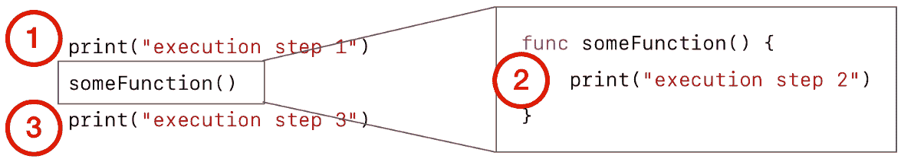
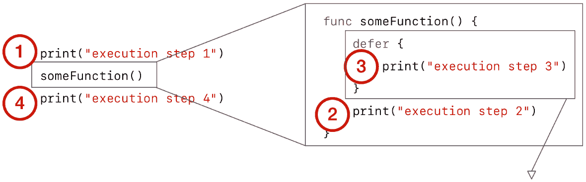

使用 Swift 控制流进行数据处理

编程全部关于做决定。大多数代码的目的涉及获取信息，检查它，做出决定，并产生输出。到目前为止，我们已经看到了许多表示信息的方法，但在这个章节中，我们将探索如何使用 Swift 的多个控制流语句根据这些信息做出决定。我们将了解它们的区别以及每种情况适用的场景。

在本章中，我们将介绍以下食谱：

+   使用`if`/`else`做出决定

+   使用`switch`处理所有情况

+   使用`for`循环进行循环

+   使用`while`循环进行循环

+   使用`try`、`throw`、`do`和`catch`处理错误

+   使用`guard`提前检查

+   使用`defer`稍后处理

+   使用`fatalError`和`precondition`退出

# 技术要求

本章的所有代码都可以在这个书的 GitHub 仓库中找到：[`github.com/PacktPublishing/Swift-Cookbook-Second-Edition/tree/master/Chapter03`](https://github.com/PacktPublishing/Swift-Cookbook-Second-Edition/tree/master/Chapter03)

查看以下视频以查看代码的实际运行情况：[`bit.ly/3aq66Us`](https://bit.ly/3aq66Us)

# 使用 if/else 做出决定

if/else 语句是几乎所有编程语言的基础。它使代码能够根据布尔语句的结果有条件地执行。在这个食谱中，我们将看到 if/else 如何使用，包括一些 Swift 特有的方法。

## 准备工作

如果你曾经玩过台球，你会知道游戏的目标（当玩标准 8 球台球时）是将一种类型的所有球都入袋，然后入袋黑球。当使用美国台球球时，它们编号为 1-15，并且根据它们的类型有不同的图案。1-7 号球是实心颜色，9-15 号球是带有彩色条纹的白色球，8 号球是黑色的：


图 3.1 – 美国台球球

在这个食谱中，我们将编写一个函数，该函数将接受台球上的数字并返回球的类型。

## 如何做到...

让我们使用 if/else 控制流语句编写一个函数来返回正确的台球类型：

1.  创建一个`enum`来描述可能的球类型：

```swift
enum PoolBallType { 
    case solid 
    case stripe 
    case black 
}
```

1.  创建一个方法，该方法将接受一个`Int`并返回`PoolBallType`：

```swift
func poolBallType(forNumber number: Int) -> PoolBallType { 
    if number < 8 { 
        return .solid 
    } else if number > 8 { 
        return .stripe 
    } else { 
        return .black 
    } 
}
```

1.  使用此函数并测试我们是否得到预期的结果：

```swift
let two = poolBallType(forNumber: 2) // .solid 
let eight = poolBallType(forNumber: 8) // .black 
let twelve = poolBallType(forNumber: 12) // .stripe 
```

## 它是如何工作的...

在函数内部，我们定义了三个代码路径：`if`、`else if`和`else`：

```swift
if <#a boolean expression#> { 
    <#executed if boolean expression above is true#> 
} else if <#other boolean expression#> { 
    <#executed if other boolean expression above is true#> 
} else { 
    <#executed if neither boolean expressions are true#> 
} 
```

首先，我们想要确定球是否是实心。由于我们知道 1-7 号球是实心的，我们可以测试球号是否小于 8，使用`number < 8`。如果是`true`，我们返回`enum`的`.solid`情况。

如果它是`false`，则评估`else if`布尔表达式。由于 9-15 号球是条纹球，我们可以测试球号是否大于 8，使用`number > 8`。如果是`true`，我们返回`enum`的`.stripe`情况。

最后，如果前面的布尔表达式都是`false`，我们返回枚举的`.black`情况，因为那只能发生在数字正好是 8 的情况下。

`else if`和`else`块是可选的，并且你可以声明多个`else if`来覆盖额外的条件。让我们通过添加一个额外的`else if`来扩展前面的示例，以更好地确定台球类型。

如我们之前所述，台球编号介于 1 到 15 之间，但我们在实现中并没有考虑这些上下限。所以如果我们向函数提供球号 0，它将返回`.solid`，如果我们提供球号 16，它将返回`.stripe`，这并不准确地反映我们的意图：

```swift
let zero = poolBallType(forNumber: 0) // .solid 
let sixteen = poolBallType(forNumber: 16) // .stripe
```

让我们修改我们的函数，使其仅在数字介于 1 到 15 之间时返回台球类型，否则返回`nil`：

```swift
func poolBallType(forNumber number: Int) -> PoolBallType? {
    if number > 0 && number < 8 {
        return .solid
    } else if number > 8 && number < 16 {
        return .stripe
    } else if number == 8 {
        return .black
    } else {
        return nil
    }
}
```

现在我们有四个代码分支在我们的`if`语句中，我们可以使用 AND 运算符`&&`来组合布尔语句（也有可用的 OR 运算符`||`）。

现在，我们可以为预期范围内的数字以及范围外的数字调用我们的函数：

```swift
let two = poolBallType(forNumber: 2) // .solid 
let eight = poolBallType(forNumber: 8) // .black 
let twelve = poolBallType(forNumber: 12) // .stripe 
let zero = poolBallType(forNumber: 0) // nil 
let sixteen = poolBallType(forNumber: 16) // nil 
```

我们改进的函数将为预期范围之外的数字产生`nil`。

## 还有更多...

我们还可以使用其他一些方式来使用 if/else 语句。

### 理解条件展开

我们创建的函数返回一个可选值，所以如果我们想对结果值做些有用的事情，我们需要`unwrap`可选值。到目前为止，我们看到的唯一方法是通过强制展开，如果值是`nil`，这将导致崩溃。

相反，我们可以使用一个`if`语句来**条件性地展开**可选值，将其转换为更有用的非可选值。

让我们创建一个函数，用于打印给定数字的台球信息。如果提供的数字适用于台球，它将打印球号和类型；否则，它将打印一条消息说明这不是一个有效的数字。

由于我们希望打印`PoolBallType`枚举的值，让我们将其改为`String`支持的，这将使打印其值更容易：

```swift
enum PoolBallType: String {
    case solid
    case stripe
    case black
}
```

现在，让我们编写一个函数来打印台球详细信息：

```swift
func printBallDetails(ofNumber number: Int) { 
    let possibleBallType = poolBallType(forNumber: number) 
    if let ballType = possibleBallType { 
        print("\(number) - \(ballType.rawValue)") 
    } else { 
        print("\(number) is not a valid pool ball number") 
    } 
} 
```

在我们的`printBallDetails`函数中，我们首先获取给定数字的球类型：

```swift
let possibleBallType = poolBallType(forNumber: number) 
```

在我们改进的函数版本中，这返回了`PoolBallType`枚举的可选版本。我们希望在打印球详细信息时包括返回的`enum`的`rawValue`。由于返回值是可选的，我们需要首先展开它：

```swift
if let ballType = possibleBallType { 
    print("\(number) - \(ballType.rawValue))") 
} 
```

在这个 `if` 语句中，我们不是定义一个布尔表达式，而是将我们的可选值赋给一个常量；`if` 语句使用这个常量来 *条件性地解包* 可选值。可选值被检查以确定它是否为 `nil`；如果不是 `nil`，则值被解包并赋给常量作为非可选值。这个常量在 `if` 语句后面的花括号作用域内可用。我们使用这个 `ballType` 非可选值来获取 `print` 语句的原始值。

由于当可选值有值时跟随 `if-else` 语句的 `if` 分支，那么当可选值为 `nil` 时，就跟随 `else` 分支。

由于这意味着给定的数字对于球桌球来说不是有效的，我们打印一条相关的消息：

```swift
else { 
    print("\(number) is not a valid pool ball number") 
}
```

我们现在可以用之前相同的值来调用我们的新函数，以打印出球桌球类型：

```swift
printBallDetails(ofNumber: 2)  // 2 - solid
printBallDetails(ofNumber: 8)  // 8 - black
printBallDetails(ofNumber: 12) // 12 - stripe
printBallDetails(ofNumber: 0)  // 0 is not a valid pool ball number
printBallDetails(ofNumber: 16) // 16 is not a valid pool ball number
```

我们已经使用条件解包来打印球桌球类型，如果有效，或者解释它为什么无效。

### 链式可选解包

`if` 语句能够条件性地解包可选值的能力可以链式组合起来，生成一些有用且简洁的代码。以下示例可能有些牵强，但它说明了我们如何使用单个 `if` 语句来解包一系列可选值。

当你玩一局斯诺克，称为 *frame*，你第一个入袋的球类型将成为整个帧中你需要入袋的类型，而你的对手则需要入袋相反类型的球。

让我们定义一个斯诺克帧，并说我们想要跟踪每个玩家将要入袋的球类型：

```swift
class PoolFrame { 
    var player1BallType: PoolBallType? 
    var player2BallType: PoolBallType? 
} 
```

我们还将创建一个具有可选的 `currentFrame` 属性的 `PoolTable` 对象，该属性将包含有关当前帧的信息，如果正在进行的话：

```swift
class PoolTable { 
    var currentFrame: PoolFrame? 
} 
```

现在我们有一个球桌，它有一个可选的帧，每个玩家都有一个可选的球类型。

现在，让我们编写一个函数来打印当前帧中玩家 1 的球类型。当前帧可能是 `nil`，因为没有正在进行的帧，或者玩家 1 的球类型是 `nil`，因为还没有入袋的球。因此，我们需要考虑这两种情况中的任何一种：

```swift
func printBallTypeOfPlayer1(forTable table: PoolTable) { 
    if let frame = table.currentFrame, let ballType = 
      frame.player1BallType { 
        print(ballType.rawValue) 
    } else { 
        print("Player 1 has no ball type or there is no current frame") 
    } 
} 
```

我们的函数接收一个 `PoolTable`，要打印玩家 1 的球类型，我们首先需要检查并解包 `currentFrame` 属性，然后我们需要检查并解包当前帧的 `player1BallType` 属性。

我们可以通过嵌套我们的 `if` 语句来实现这一点：

```swift
func printBallTypeOfPlayer1(forTable table: PoolTable) { 
    if let frame = table.currentFrame { 
        if let ballType = frame.player1BallType { 
            print(ballType.rawValue) 
        } //... handle else 
    } //... handle else 
} 
```

相反，我们可以通过按顺序执行解包语句（用逗号分隔）来在一个 `if` 语句中处理这种链式解包，每个语句都可以访问前一个语句解包的值：

```swift
func printBallTypeOfPlayer1(forTable table: PoolTable) { 
    if let frame = table.currentFrame, let ballType = 
      frame.player1BallType { 
        print("\(ballType)") 
    } //... handle else  
} 
```

第一个语句解包了 `currentFrame` 属性，第二个语句使用这个解包的帧来解包玩家 1 的球类型。

让我们使用我们刚刚创建的函数：

1.  首先，我们将创建一个表格，并且在没有当前帧的情况下打印玩家 1 的球类型，这将不可用：

```swift
//
// Table with no frame in play
//
let table = PoolTable()
table.currentFrame = nil
printBallTypeOfPlayer1(forTable: table)
// Player 1 has no ball type or there is no current frame
```

1.  接下来，我们可以创建一个当前帧，但由于玩家 1 的球类型仍然是`nil`，函数会打印出相同的输出：

```swift
//
// Table with frame in play, but no balls potted
//
let frame = PoolFrame()
frame.player1BallType = nil
frame.player2BallType = nil
table.currentFrame = frame
printBallTypeOfPlayer1(forTable: table)
// Player 1 has no ball type or there is no current frame

```

1.  如果我们设置玩家 1 的球类型，现在我们的函数会打印出类型：

```swift
//
// Table with frame in play, and a ball potted
//
frame.player1BallType = .solid
frame.player2BallType = .stripe
printBallTypeOfPlayer1(forTable: table)
// solid
```

我们创建了一种方法，可以链式调用条件展开，只有当链中的所有值都不是 nil 时才打印一个值。

### 使用具有关联值的枚举

正如我们在第一章的*使用枚举枚举值*菜谱中看到的，*Swift Building Blocks*，枚举可以有关联值，我们可以使用`if`语句在一个表达式中同时检查枚举的 case 并提取关联值。

让我们创建一个枚举来表示台球游戏的结果，每个 case 都有一个关联的消息：

```swift
enum FrameResult { 
    case win(congratulations: String) 
    case lose(commiserations: String) 
}
```

接下来，我们将创建一个函数，它接受一个`Result`并打印祝贺消息或慰问消息：

```swift
func printMessage(forResult result: FrameResult) { 
    if case Result.win(congratulations: let winMessage) = result { 
        print("You won! \(winMessage)") 
    } else if case Result.lose(commiserations: let loseMessage) = 
        result { 
        print("You lost :( \(loseMessage)") 
    } 
} 
```

调用此函数将打印结果，然后是相关的消息：

```swift
let result = Result.win(congratulations: "You're simply the best!") 
printMessage(forResult: result) // You won! You're simply the best! 
```

如果`=`右侧的值与左侧的 case 匹配，则将执行`if case`块。此外，你可以指定一个局部常量来表示关联值（以下示例中的`winMessage`），然后在后续块中可用：

```swift
if case Result.win(congratulationsMessage: let winMessage) = result { 
    print("You won! \(winMessage)") 
} 
```

我们使用了`if case`语句一次性检查枚举值的 case 并访问其关联值。

## 相关内容

关于 if/else 的更多信息可以在苹果关于 Swift 语言的文档中找到，请参阅[`swiftbook.link/docs/statements`](http://swiftbook.link/docs/statements)。

# 使用 switch 处理所有情况

`switch`语句允许你通过多种方式测试一个特定的值来控制执行流程。在 Objective-C 和其他语言中，`switch`语句只能用于可以表示为整数的值，并且最常用于基于枚举案例做出决策。

正如我们所见，**枚举**在 Swift 中变得更加强大，因为它们可以基于不仅仅是整数，同样`switch`语句也是如此。

Swift 中的`switch`语句可以用于任何类型，并具有高级的模式匹配功能。

在这个菜谱中，我们将探索`switch`控制流语句的简单和高级用法来控制逻辑。

## 准备工作

如果你足够老，记得家用电脑的早期日子，你可能也会记得基于文本的冒险游戏。这些游戏通常描述一个场景，然后让你通过输入命令来移动北、南、东或西。你可以找到并捡起物品，并且通常可以将它们组合起来解决问题。

我们可以使用`switch`语句来控制简单文本冒险的逻辑。

## 如何做到这一点...

让我们创建一个基于文本的冒险游戏的部分，并使用`switch`语句来做出决定：

1.  定义一个`enum`来表示我们可以旅行的方向：

```swift
enum CompassPoint { 
    case north 
    case south 
    case east 
    case west 
}
```

1.  创建一个函数，描述玩家在朝某个方向看时将看到的内容：

```swift
func lookTowards(_ direction: CompassPoint) { 

    switch direction { 
    case .north: 
        print("To the north lies a winding road") 
    case .south: 
        print("To the south is the Prancing Pony tavern") 
    case .east: 
        print("To the east is a blacksmith") 
    case .west: 
        print("The the west is the town square") 
    } 
} 

lookTowards(.south) // To the south is the Prancing Pony tavern
```

在我们的文字冒险游戏中，用户可以捡起物品并尝试将它们组合起来以产生新的物品并解决问题。

1.  将我们的可用物品定义为 `enum`：

```swift
enum Item { 
    case key 
    case lockedDoor 
    case openDoor 
    case bluntKnife 
    case sharpeningStone 
    case sharpKnife 
} 
```

1.  编写一个函数，它接受两个物品并尝试将它们组合成一个新的物品。如果物品无法组合，它将返回 `nil`：

```swift
func combine(_ firstItem: Item, with secondItem: Item) -> Item? { 

    switch (firstItem, secondItem) { 
    case (.key, .lockedDoor): 
        print("You have unlocked the door!") 
        return .openDoor 
    case (.bluntKnife, .sharpeningStone): 
        print("Your knife is now sharp") 
        return .sharpKnife 
    default: 
        print("\(firstItem) and \(secondItem) cannot be combined") 
        return nil 
    } 
} 
let door = combine(.key, with: .lockedDoor) // openDoor 
let oilAndWater = combine(.bluntKnife, with: .lockedDoor) // nil
```

1.  在我们的文字冒险游戏中，玩家会遇到不同的角色，并且可以与他们互动。定义玩家可以遇到的角色：

```swift
enum Character: String { 
    case wizard 
    case bartender 
    case dragon 
}
```

1.  编写一个函数，允许玩家说些什么，并且可以选择性地提供一个角色，对他说。互动将取决于所说的内容以及所说的角色：

```swift
func say(_ textToSay: String, to character: Character? = nil) { 

    switch (textToSay, character) { 
    case ("abracadabra", .wizard?): 
        print("The wizard says, \"Hey, that's my line!\"") 
    case ("Pour me a drink", .bartender?): 
        print("The bartender pours you a drink") 
    case ("Can I have some of your gold?", .dragon?): 
        print("The dragon burns you to death with his fiery breath") 
    case (let textSaid, nil): 
        print("You say \"\(textSaid)\", to no-one.") 
    case (_, let anyCharacter?): 
        print("The \(anyCharacter) looks at you, blankly") 
    } 
} 
say("Is anybody there?") 
  // You say "Is anybody there?", to no-one. 
say("Pour me a drink", to: .bartender) 
  // The bartender pours you a drink 
say("Can I open a tab?", to: .bartender) 
  // The bartender looks at you, blankly 
```

## 它是如何工作的...

在 `lookTowards` 函数中，我们希望为每个可能的 `CompassPoint` 案例打印不同的消息；为此，我们使用 `switch` 语句：

```swift
func lookTowards(_ direction: CompassPoint) { 

    switch direction { 
    case .north: 
        print("To the north lies a winding road") 
    case .south: 
        print("To the south is the Prancing Pony tavern") 
    case .east: 
        print("To the east is a blacksmith") 
    case .west: 
        print("The the west is the town square") 
    }
}
```

在 `switch` 语句的顶部，我们定义想要切换的值；然后我们定义当该值与定义的每个案例匹配时想要执行的操作，使用 `case` 关键字和匹配的模式：

```swift
switch <#value#> { 
case <#pattern#>: 
    <#code#> 
case <#pattern#>: 
    <#code#> 
//... 
} 
```

每个 `case` 语句依次评估，如果模式与值匹配，则执行后续代码。

如果你熟悉 Objective-C 中的 `switch` 语句，你可能记得你需要在每个 `case` 语句的末尾添加 `break;` 来停止执行从下一个 `case` 语句中掉落。在 Swift 中不需要这样做；执行的断开是由下一个 `case` 语句的开始隐含的。唯一不是这种情况的时候，是因为你的 `case` 语句是故意为空的；在这些情况下，你需要添加 `break` 来告诉编译器它故意为这个案例留空。如果你确实想让执行掉落到下一个 `case` 语句，你可以在 `case` 语句的末尾添加 `fallthrough`。

在我们的 `combine` 函数中，我们有两个基于其值需要切换的值。我们可以将多个值以元组的形式提供给 `switch` 语句：

```swift
func combine(_ firstItem: Item, with secondItem: Item) -> Item? { 

    switch (firstItem, secondItem) { 
    //.... 
    } 
} 
```

对于每个 `case` 语句，我们定义元组每个部分的合法值：

```swift
case (.key, .lockedDoor): 
    print("You have unlocked the door!") 
    return .openDoor
```

Swift 中的 `switch` 语句要求覆盖所有可能的案例；然而，你可以使用 `default` 案例一次性覆盖所有剩余的可能性：

```swift
switch (firstItem, secondItem) { 
//... 
default: 
    print("\(firstItem) and \(secondItem) cannot be combined") 
    return nil 
} 
```

对于我们之前的 `combine` 函数，你会注意到，玩家只有在提供正确的顺序时才能组合物品：

```swift
let door1 = combine(.key, with: .lockedDoor) // openDoor 
let door2 = combine(.lockedDoor, with: .key) // nil 
```

这不是期望的行为，因为玩家无法知道正确的顺序。为了解决这个问题，我们可以在每个 `case` 语句中添加多个模式。因此，当玩家提供 `key` 和 `lockedDoor` 物品时，我们可以使用相同的 `case` 语句处理 `key`，`lockedDoor` 的顺序和 `lockedDoor`，`key` 的顺序，格式如下：

```swift
switch <#value#> { 
case <#pattern#>, <#pattern#>: 
    <#code#> 
default: 
    <#code#> 
} 
```

因此，我们可以将相反的物品顺序作为另一个模式添加到每个案例中：

```swift
func combine(_ firstItem: Item, with secondItem: Item) -> Item? { 

    switch (firstItem, secondItem) { 
    case (.key, .lockedDoor), (.lockedDoor, .key): 
        print("You have unlocked the door!") 
        return .openDoor 
    case (.bluntKnife, .sharpeningStone), (.sharpeningStone, 
      .bluntKnife): 
        print("Your knife is now sharp") 
        return .sharpKnife 
    default: 
        print("\(firstItem) and \(secondItem) cannot be combined") 
        return nil 
    } 
} 

```

现在物品可以以任何顺序组合：

```swift
let door1 = combine(.key, with: .lockedDoor) // openDoor 
let door2 = combine(.lockedDoor, with: .key) // openDoor
```

对于我们的`say`方法，我们再次有两个值想要切换：玩家说的文本和所说的角色。由于`character`值是可选的，我们需要展开值以与非可选值进行比较：

```swift
func say(_ textToSay: String, to character: Character? = nil) { 

    switch (textToSay, character) { 
    case ("abracadabra", .wizard?): 
        print("The wizard says, "Hey, that's my line!"") 
        //... 
    } 
} 
```

在`switch`语句中，当值是可选的，你可以通过添加`?`将其包装为可选值来将其与非可选值进行比较，使比较有效。在上一个例子中，我们正在将可选的`character`值与`.wizard?`进行比较。

当对于一组特定选项有两个值时，我们可能只关心其中一个值，另一个值可以是任何值，并且情况仍然有效。在我们的例子中，一旦处理了所有特定的`textToSay`和字符配对，以及处理了没有字符的情况，我们想要展开并检索字符，但我们不关心`textToSay`的值，因此我们可以使用`_`来表示任何值都是可接受的：

```swift
func say(_ textToSay: String, to character: Character? = nil) { 

    switch (textToSay, character) { 
    //... 
    case (_, let anyCharacter?): 
        print("The \(anyCharacter) looks at you, blankly)") 
    } 
} 
```

要检索作为此`case`语句一部分输入的字符值，而不是声明一个要匹配的值，我们定义一个将接收值的常量，并且由于我们正在切换的值是可选的，我们也添加了`?`，如果值不是`nil`，它将展开值并将其分配给常量。

## 参见

更多关于`switch`的信息可以在苹果关于 Swift 语言的文档中找到，请参阅[`swiftbook.link/docs/switch`](http://swiftbook.link/docs/switch)。

# 使用`for`循环进行循环

`for`循环允许你对集合或范围中的每个元素执行代码。在本食谱中，我们将探讨如何使用`for`循环对集合中的每个元素执行操作。

## 如何做到这一点...

让我们创建一些集合，然后使用`for`循环对集合中的每个元素进行操作：

1.  创建一个元素数组，这样我们就可以对数组中的每个元素进行操作：

```swift
let theBeatles = ["John", "Paul", "George", "Ringo"]
```

1.  创建一个循环来遍历我们的`theBeatles`数组，并打印出`for`循环提供的每个字符串元素：

```swift
for musician in theBeatles { 
    print(musician) 
} 
```

1.  创建一个执行固定次数代码的`for`循环，而不是遍历数组。我们可以通过提供一个范围而不是集合来实现这一点：

```swift
// 5 times table 
for value in 1...12 { 
    print("5 x \(value) = \(value*5)") 
}
```

1.  创建一个`for`循环来打印字典的键和值。字典包含键和值的配对，因此当遍历字典时，我们将以元组的形式提供键和值：

```swift
let beatlesByInstrument = ["rhythm guitar": "John", 
                           "bass guitar": "Paul", 
                           "lead guitar": "George", 
                           "drums": "Ringo"] 
for (key, value) in beatlesByInstrument { 
    print("\(value) plays \(key)") 
}
```

## 它是如何工作的...

让我们看看我们是如何遍历我们的`theBeatles`数组的：

```swift
for musician in theBeatles { 
    print(musician) 
} 
```

我们指定`for`关键字，然后为将用于集合或范围中每个元素的局部变量提供一个名称。然后，提供`in`关键字，后面跟着将要遍历的集合或范围：

```swift
for <#each element#> in <#collection or range#> { 
    <#code to execute#> 
} 
```

对于基于范围的循环，每个循环提供的值是范围内的下一个整数：

```swift
for value in 1...12 { 
    print("5 x \(value) = \(value*5)") 
} 

```

范围可以是一个**闭区间**，其中范围包括起始值和结束值，就像上面指定的那样。或者它可以是**半开区间**，它向上到但不包括最后一个值，如下面的代码所示：

```swift
for value in 1..<13 { 
    print("5 x \(value) = \(value*5)") 
} 
```

当遍历字典时，我们需要同时提供键和值；为此，我们提供一个元组，它将接收字典中的每个键和值：

```swift
for (key, value) in beatlesByInstrument { 
    print("\(value) plays \(key)") 
} 
```

我们可以定义一个元组并为每个值命名。这个名称随后可以在执行块中使用。让我们将元组的标签改为更好地描述这些值：

```swift
for (instrument, musician) in beatlesByInstrument { 
    print("\(musician) plays \(instrument)") 
} 
```

在前面的例子中给元组赋予有意义的名称使代码更容易阅读。

## 参考资料还有

更多关于`for-in`循环的信息可以在 Apple 关于 Swift 语言的文档中找到，请参阅[`swiftbook.link/docs/for-in`](http://swiftbook.link/docs/for-in)。

# 使用 while 循环进行循环

`for`循环在您知道要循环多少次时很棒，但如果您想循环直到满足某个条件，则需要使用`while`循环。

`while`循环的语法如下：

```swift
while <#boolean expression#> { 
    <#code to execute#> 
} 
```

代码块将反复执行，直到布尔表达式返回`false`。因此，在代码块中更改某些值以使布尔表达式变为`false`是一种常见的模式。

如果布尔表达式没有变为`true`的机会，代码将无限循环，这可能会锁定您的应用程序。

在这个菜谱中，我们将探讨`while`循环可以用于重复操作的情况。

## 准备工作

这个菜谱将涉及模拟随机抛硬币。为了抛硬币，我们需要随机选择正面或反面，因此我们需要使用来自 Foundation 框架的随机数生成器。我们将在第五章，*超越标准库*中进一步讨论 Foundation，但到目前为止，我们只需要在 playground 的顶部导入 Foundation 框架：

```swift
import Foundation
```

这将使我们能够生成一个随机数，我们现在将使用它。

## 如何做到这一点...

让我们来计算一下连续抛硬币得到正面的次数：

1.  创建一个表示硬币抛掷的`enum`，并使用随机数生成器随机选择正面或反面：

```swift
enum CoinFlip: Int { 
    case heads 
    case tails 

    static func flipCoin() -> CoinFlip { 
        return CoinFlip(rawValue: Int(arc4random_uniform(2)))! 
    } 
} 
```

1.  创建一个函数，该函数将返回连续抛硬币得到正面的次数。该函数将在`while`循环中抛硬币，并在硬币抛掷结果为正面时继续循环：

```swift
func howManyHeadsInARow() -> Int { 

    var numberOfHeadsInARow = 0 
    var currentCoinFlip = CoinFlip.flipCoin() 

    while currentCoinFlip == .heads { 
        numberOfHeadsInARow = numberOfHeadsInARow + 1 
        currentCoinFlip = CoinFlip.flipCoin() 
    } 
    return numberOfHeadsInARow 
} 

let noOfHeads = howManyHeadsInARow()
```

## 它是如何工作的...

在我们的函数中，我们首先跟踪连续抛硬币得到正面的次数，并保留对当前硬币抛掷的引用，这将形成`while`循环的条件：

```swift
func howManyHeadsInARow() -> Int { 

    var numberOfHeadsInARow = 0 
    var currentCoinFlip = CoinFlip.flipCoin() 
    //... 
}
```

在我们的`while`循环中，我们将继续循环并执行以下代码块中的代码，只要当前的硬币抛掷结果是正面：

```swift
while currentCoinFlip == .heads { 
    numberOfHeadsInARow = numberOfHeadsInARow + 1 
    currentCoinFlip = CoinFlip.flipCoin() 
} 
```

在代码块中，我们将运行总金额加一，并重新翻转硬币。我们正在翻转硬币并将其分配给`currentCoinFlip`，这将在下一次循环中重新检查，如果它仍然是正面，则下一次循环将被执行。由于我们正在更改影响`while`条件的东西，这样它最终可能是`false`，我们可以确信我们不会永远卡在循环中。

一旦硬币翻转结果为反面，`while`循环条件将为`false`，因此执行将继续并返回我们一直在保持的运行总金额：

```swift
return numberOfHeadsInARow 
```

现在，每次你调用该函数时，硬币都会随机翻转，并返回连续出现正面次数，所以每次调用时，你可能会得到不同的返回值。试几次看看：

```swift
let noOfHeads = howManyHeadsInARow() 
```

## 还有更多...

实际上，我们可以通过将硬币翻转作为循环延续检查的一部分来简化我们的`while`循环：

```swift
func howManyHeadsInARow() -> Int {

    var numberOfHeadsInARow = 0

    while CoinFlip.flipCoin() == .heads {
        numberOfHeadsInARow = numberOfHeadsInARow + 1
    }
    return numberOfHeadsInARow
}
```

每次通过循环时，都会评估`while`条件，这涉及到重新翻转硬币并检查结果。

这更简洁，并且消除了跟踪`currentCoinFlip`的需要。

## 参见

更多关于`while`循环的信息可以在苹果公司关于 Swift 语言的文档中找到，请参阅[`swiftbook.link/docs/while`](http://swiftbook.link/docs/while)。

# 使用 try、throw、do 和 catch 处理错误

编程过程中会发生错误。这些错误可能是由于你自己的代码以意想不到的方式运行，或者由于来自外部系统的意外信息或行为。当这些错误发生时，正确处理它们非常重要。良好的错误处理可以将一个优秀的应用程序与一个伟大的应用程序区分开来。

Swift 提供了一种故意且灵活的错误处理模式，允许特定的错误通过复杂系统级联。

在这个菜谱中，我们将了解如何定义错误，并在必要时抛出它们。

## 如何做到这一点...

为了检查错误处理，我们将模拟一个可能会出错的过程，对我来说，那就是烹饪餐点：

1.  首先，让我们定义烹饪餐点涉及的步骤，作为餐点将经历的状态：

```swift
enum MealState { 
    case initial 
    case buyIngredients 
    case prepareIngredients 
    case cook 
    case plateUp 
    case serve 
}
```

1.  创建一个对象来表示我们将要烹饪的餐点。该对象将持有餐点在过程中移动的状态：

```swift
class Meal {
    var state: MealState = .initial
}
```

我们希望允许餐点在状态之间转换，但并非所有状态转换都是可能的。例如，你不能从购买食材直接过渡到上菜。餐点应该按顺序从一个状态转换到下一个状态。我们可以通过只允许在对象内部设置状态来提供这些限制，使用我们在上一章中探讨的访问控制。

1.  将`state`属性定义为只能私有设置：

```swift
class Meal {
    private(set) var state: MealState = .initial
}
```

1.  为了允许从对象外部更改状态，创建一个函数，如果状态转换不可行，则抛出错误：

```swift
class Meal {

    private(set) var state: MealState = .initial

    func change(to newState: MealState) throws {

        switch (state, newState) {

        case (.initial, .buyIngredients),
             (.buyIngredients, .prepareIngredients),
             (.prepareIngredients, .cook),
             (.cook, .plateUp),
             (.plateUp, .serve):

            state = newState

        default:
            throw MealError.canOnlyMoveToAppropriateState
        }
    }
}
```

遵循 Swift 的协议导向方法，Swift 中的错误被定义为协议，即 `Error` 协议。这种方法允许你创建自己的类型来表示代码中的错误，并且只需让它符合 `Error` 协议即可。

一种常见的做法是将错误定义为枚举，枚举的案例代表可能发生的不同类型的错误。

1.  定义前面 `Meal` 类中抛出的错误：

```swift
enum MealError: Error { 
    case canOnlyMoveToAppropriateState 
}
```

1.  尝试在一个 `do` 块中执行我们的错误抛出方法并捕获可能发生的任何错误：

```swift
let dinner = Meal() 
do { 
    try dinner.change(to: .buyIngredients) 
    try dinner.change(to: .prepareIngredients) 
    try dinner.change(to: .cook) 
    try dinner.change(to: .plateUp) 
    try dinner.change(to: .serve) 
    print("Dinner is served!") 
} catch let error { 
    print(error) 
}
```

## 它是如何工作的...

Swift 错误处理中使用的隐喻（以及其他语言）是 *抛出* 和 *捕获*。如果一个方法在执行过程中遇到问题，它可以 *抛出* 一个错误，此时方法中的其他代码将不会执行，错误将被传递回方法被调用的地方。

为了接收这个错误（可能为了向用户提供错误的详细信息），你必须在方法被调用的地方 *捕获* 这个错误。

要抛出一个错误，你必须声明该方法有抛出错误的可能性。声明一个方法 `throws` 允许编译器期望方法中可能出现的错误，并确保你不会忘记捕获这些错误。

可以使用 `throws` 关键字声明方法可能抛出错误：

```swift
func change(to newState: MealState) throws { 
    //... 
} 
```

在我们的状态转换方法中，我们只有在移动到下一个顺序状态时才会改变状态。其他任何操作都是不允许的，应该抛出一个错误。我们可以使用 `throw` 关键字，后跟一个符合 `Error` 协议的值来完成这个操作：

```swift
func change(to newState: MealState) throws {
    //...
    default:
         throw MealError.canOnlyMoveToAppropriateState
    }
}
```

当我们创建 `Meal` 对象并遍历准备餐点的状态时，每个状态的变化都可能抛出一个错误。当我们调用标记为可能抛出错误的函数时，我们必须以某种方式执行。我们定义一个 `do` 块，在其中我们可以调用可能抛出的方法，然后定义一个 `catch` 块，如果这些方法中的任何一个抛出错误，它将被执行。每个抛出方法的调用都必须以 `try` 关键字为前缀：

```swift
let dinner = Meal() 
do { 
    try dinner.change(to: .buyIngredients) 
    try dinner.change(to: .prepareIngredients) 
    try dinner.change(to: .cook) 
    try dinner.change(to: .plateUp) 
    try dinner.change(to: .serve) 
    print("Dinner is served!") 
} catch let error { 
    print(error) 
} 
```

如果这些方法中的任何一个抛出错误，执行将立即转移到 `catch` 块。因此，通过在 `try` 方法调用之后放置代码，我们确保只有在方法没有抛出错误的情况下才会执行这些代码。在所有状态转换调用之后打印 `Dinner is served!`，我们知道这只会打印出来，如果我们已经成功通过了所有状态。尝试改变这些状态转换调用的顺序，你会看到错误会被打印出来，而 `Dinner is served!` 不会。

在我们的 `catch` 块中，在 `catch` 关键字之后，我们可以定义想要将捕获的错误分配到的局部常量。然而，如果我们在这里没有指定局部常量，Swift 会隐式地为我们创建一个名为 `error` 的常量，因此我们实际上可以在 `catch` 块中省略常量声明并仍然打印错误的值：

```swift
do { 
    //... 
} catch { 
    print(error) 
} 
```

Swift 已经为我们定义了错误，所以我们仍然可以打印其值。

## 还有更多...

我们已经看到了如何抛出和捕获错误，但在介绍中我们提到我们可以通过系统级联错误，所以让我们看看我们如何做到这一点。

在我们的餐点准备示例中，我们允许通过可以抛出错误的 `change` 方法从外部更改餐点状态。相反，让我们将其更改为私有方法，这样我们就只能从类内部调用它：

```swift
class Meal { 

    private(set) var state: MealState = .initial 

    private func change(to newState: MealState) throws { 

        switch (state, newState) { 
        case (.initial, .buyIngredients), 
             (.buyIngredients, .prepareIngredients),  
             (.prepareIngredients, .cook),  
             (.cook, .plateUp),  
             (.plateUp, .serve): 
            state = newState 

        default: 
            throw MealError.canOnlyMoveToAppropriateState 
        } 
    } 
} 
```

接下来，让我们创建一些具体的方法来移动到每个状态：

```swift
class Meal { 

    //...

    func buyIngredients() throws { 
        try change(to: .buyIngredients) 
    } 

    func prepareIngredients() throws { 
        try change(to: .prepareIngredients) 
    } 

    func cook() throws { 
        try change(to: .cook) 
    } 

    func plateUp() throws { 
        try change(to: .plateUp) 
    } 

    func serve() throws { 
        try change(to: .serve) 
    } 
} 
```

你会注意到，当我们从每个新方法内部调用 `change` 方法时，我们不需要使用 `do` 和 `catch` 块来捕获错误；这是因为我们已经将每个新方法定义为可能抛出错误的，所以如果 `change` 方法的调用抛出错误，这个错误将作为抛出错误传递给我们的新方法的调用者。

这种机制允许在代码的多个层级中可能发生的错误暴露出来并得到适当的处理。

现在我们需要修改我们的餐点准备代码以使用这些新方法：

```swift
let dinner = Meal() 
do { 
    try dinner.buyIngredients() 
    try dinner.prepareIngredients() 
    try dinner.cook() 
    try dinner.plateUp() 
    try dinner.serve() 
    print("Dinner is served!") 
} catch let error { 
    print(error) 
} 
```

让我们添加实际影响我们的餐点的功能。我们将添加一个向餐点中加盐的方法和一个属性，以便我们可以跟踪添加了多少盐。将这些添加到 `Meal` 类的末尾：

```swift
class Meal { 
    //... 
    private(set) var saltAdded = 0 

    func addSalt() throws { 
        if saltAdded >= 5 { 
            throw MealError.tooMuchSalt 
        } else if case .initial = state, case .buyIngredients = state { 
            throw MealError.wrongStateToAddSalt 
        } else { 
            saltAdded = saltAdded + 1 
        } 
    } 
} 
```

添加盐分可能导致两种错误，要么是因为我们处于不适合添加盐的状态（我们只能在购买食材之后才能添加盐），要么是因为我们添加了过多的盐。让我们将这些两个新的错误添加到我们的 `MealError` 枚举中：

```swift
enum MealError: Error { 
    case canOnlyMoveToAppropriateState 
    case tooMuchSalt 
    case wrongStateToAddSalt 
}
```

现在我们有三种可能发生在准备餐点过程中的错误，我们可能希望以不同的方式处理这些错误。我们可以使用多个 `catch` 块来过滤仅特定的错误，这样我们就可以单独处理每个错误：

```swift
let dinner = Meal() 
do { 
    try dinner.buyIngredients() 
    try dinner.prepareIngredients() 
    try dinner.cook() 
    try dinner.plateUp() 
    try dinner.serve() 
    print("Dinner is served!") 
} catch MealError.canOnlyMoveToAppropriateState { 
    print("It's not possible to move to this state") 
} catch MealError.tooMuchSalt { 
    print("Too much salt!") 
} catch MealError.wrongStateToAddSalt { 
    print("Can't add salt at this stage") 
} catch { 
    print("Some other error: \(error)") 
} 
```

确保所有可能的错误都被 `catch` 块处理非常重要，因为未处理的错误会导致程序崩溃。因此，最安全的方法是在最后添加一个未过滤的 `catch` 块来捕获之前块未捕获的任何错误。

由于函数可以抛出错误，而闭包是一种可以作为参数传递的函数类型，因此我们可以有一个接受抛出闭包的函数，其中它也可以抛出错误。可能的情况是，我们的函数将抛出的唯一错误是由作为参数传递的抛出闭包产生的错误。

当这是真的时，可以使用 `rethrows` 关键字定义一个函数作为重新抛出。

这种情况相当令人困惑，所以让我们看看一个例子：

```swift
func makeMeal(using preparation: (Meal) throws -> ()) rethrows -> Meal { 
    let newMeal = Meal() 
    try preparation(newMeal) 
    return newMeal 
}  
```

这个 `makeMeal` 函数接受一个闭包作为参数；这个闭包接受一个 `Meal` 对象作为参数，并且不返回任何内容，但可能会抛出错误。

这个函数的目的是为你处理 `meal` 对象的创建，只让你在块内进行任何餐点准备；然后它返回创建并准备好的餐点。让我们看看它是如何使用的：

```swift
do { 
    let dinner = try makeMeal { meal in 
        try meal.buyIngredients() 
        try meal.prepareIngredients() 
        try meal.cook() 
        try meal.addSalt() 
        try meal.plateUp() 
        try meal.serve() 
    } 
    if dinner.state == .serve { 
        print("Dinner is served!") 
    } 
} catch MealError.canOnlyMoveToAppropriateState { 
    print("It's not possible to move to this state") 
} catch MealError.tooMuchSalt { 
    print("Too much salt!") 
} catch MealError.wrongStateToAddSalt { 
    print("Can't add salt at this stage") 
} 
```

`makeMeal`函数只抛出闭包参数抛出的错误，因此它可以声明为重新抛出。使用`rethrows`关键字声明这种类型的函数不是必需的，可以用`throws`来声明。然而，编译器可以为重新抛出函数进行额外的优化。

## 参见

更多关于错误处理的信息可以在 Apple 关于 Swift 语言的文档中找到，请参阅[`swiftbook.link/docs/error-handling`](http://swiftbook.link/docs/error-handling)。

# 使用`guard`语句提前检查

在之前的菜谱中，我们看到了如何使用`if`语句来检查布尔表达式和展开可选值。在代码块的开头进行一些检查和条件展开是一个常见的用例，然后只有在一切如预期的情况下才执行后续代码。这通常会导致将整个代码块包裹在一个`if`语句中：

```swift
if <#boolean check and unwrapping#> { 
    <#a block of code#> 
    <#that could be quite long#> 
}
```

Swift 有一个专门为此目的的更好解决方案；`guard`语句。

在这个菜谱中，我们将学习如何使用`guard`语句从方法中提前返回。

## 准备工作

让我们假设我们有一些来自外部来源的数据，我们希望将其转换为我们的代码可以理解的模型对象，目的是将其显示给用户。我们可以使用`guard`语句来确保数据格式正确，如果不正确则提前退出。

## 如何做到这一点...

我们将取一些关于太阳系行星的信息，这些信息可能来自外部来源，并将其转换为我们可以理解的模型：

1.  以字典数组的形式创建行星数据：

```swift
// From https://en.wikipedia.org/wiki/Solar_System 
let inputData: [[String: Any]] = [ 
    ["name": "Mercury", 
     "positionFromSun": 1, 
     "fractionOfEarthMass": 0.055,
     "distanceFromSunInAUs": 0.4, 
     "hasRings": false], 
    ["name": "Venus", 
     "positionFromSun": 2, 
     "fractionOfEarthMass": 0.815, 
     "distanceFromSunInAUs": 0.7, 
     "hasRings": false], 
    ["name": "Earth", 
     "positionFromSun": 3, 
     "fractionOfEarthMass": 1.0, 
     "distanceFromSunInAUs": 1.0, 
     "hasRings": false], 
    ["name": "Mars", 
     "positionFromSun": 4, 
     "fractionOfEarthMass": 0.107, 
     "distanceFromSunInAUs": 1.5, 
     "hasRings": false], 
    ["name": "Jupiter", 
     "positionFromSun": 5, 
     "fractionOfEarthMass": 318.0,
     "distanceFromSunInAUs": 5.2, 
     "hasRings": false], 
    ["name": "Saturn", 
     "positionFromSun": 6, 
     "fractionOfEarthMass": 95.0, 
     "distanceFromSunInAUs": 9.5, 
     "hasRings": true], 
    ["name": "Uranus", 
     "positionFromSun": 7, 
     "fractionOfEarthMass": 14.0, 
     "distanceFromSunInAUs": 19.2, 
     "hasRings": false], 
    ["name": "Neptune", 
     "positionFromSun": 8, 
     "fractionOfEarthMass": 17.0, 
     "distanceFromSunInAUs": 30.1, 
     "hasRings": false] 
] 
```

1.  定义一个`Planet`结构体，它将根据数据创建：

```swift
struct Planet { 
    let name: String 
    let positionFromSun: Int 
    let fractionOfEarthMass: Double 
    let distanceFromSunInAUs: Double 
    let hasRings: Bool 
}
```

1.  一步一步来，创建一个函数，该函数将接受单个行星字典并创建一个`Planet`结构体，如果可能的话。我们将使用`guard`语句来确保字典包含我们期望的所有值：

```swift
func makePlanet(fromInput input: [String: Any]) -> Planet? { 

    guard 
        let name = input["name"] as? String, 
        let positionFromSun = input["positionFromSun"] as? Int, 
        let fractionOfEarthMass = input["fractionOfEarthMass"] as? 
          Double, 
        let distanceFromSunInAUs = input["distanceFromSunInAUs"] as? 
          Double, 
        let hasRings = input["hasRings"] as? Bool 
        else { 
            return nil 
        } 

    return Planet(name: name, 
                  positionFromSun: positionFromSun, 
                  fractionOfEarthMass: fractionOfEarthMass, 
                  distanceFromSunInAUs: distanceFromSunInAUs, 
                  hasRings: hasRings)
}
```

1.  现在我们能够处理单个行星数据，创建一个函数，该函数将接受一个行星字典数组并生成一个`Planet`结构体的数组，使用`guard`语句来确保我们成功创建一个`Planet`结构体：

```swift
func makePlanets(fromInput input: [[String: Any]]) -> [Planet] { 

    var planets = [Planet]() 
    for inputItem in input { 
        guard let planet = makePlanet(fromInput: inputItem) else { 
          continue } 
        planets.append(planet) 
    } 

    return planets 
}
```

## 它是如何工作的...

`guard`语句的工作方式与`if`语句非常相似，因为可选值可以以相同的方式展开和链接。由于我们的行星数据包含字符串、整数、浮点数和布尔值，字典的类型是`[String: Any]`。因此，为了创建我们的`Planet`结构体，我们需要检查给定键的预期值是否存在，并将它们转换为正确的类型。

在我们的`makePlanet`函数中，我们使用`guard`关键字，然后从行星数据字典中访问和条件地转换我们所需的所有值。如果这些条件转换中的任何一个失败，那么在`guard`语句之后定义的`else`块将被执行。我们定义我们的函数返回一个可选的`Planet`，所以如果我们没有预期的信息，`guard`将失败，并返回`nil`：

```swift
func makePlanet(fromInput input: [String: Any]) -> Planet? { 

    guard  
        let name = input["name"] as? String,  
        let positionFromSun = input["positionFromSun"] as? Int,  
        let fractionOfEarthMass = input["fractionOfEarthMass"] as? 
          Double,  
        let distanceFromSunInAUs = input["distanceFromSunInAUs"] as? 
          Double,  
        let hasRings = input["hasRings"] as? Bool  
        else { 
            return nil 
    } 
     return Planet(name: name,  
                  positionFromSun: positionFromSun,  
                  fractionOfEarthMass: fractionOfEarthMass,  
                  distanceFromSunInAUs: distanceFromSunInAUs,  
                  hasRings: hasRings) 
} 
```

`guard`语句解包的任何值都可在同一作用域内`guard`语句下面的任何代码中使用；这使得`guard`语句非常适合在继续之前确保输入值符合预期。这消除了在`if`块内嵌套代码的需要。解包的值随后用于初始化`Planet`结构体。

正如我们所见，`guard`语句用于在`guard`条件失败时中断执行，因此编译器确保在`else`块中放置一个中断执行的语句；这可以是，例如，`return`、`break`或`continue`。

在`makePlanets`函数中，我们使用`for`循环遍历字典，并尝试从每个字典中创建一个`Planet`结构体。如果我们的`makePlanet`调用返回`nil`，我们调用`continue`来跳过这个`for`循环的迭代，并跳到下一个迭代：

```swift
func makePlanets(fromInput input: [[String: Any]]) -> [Planet] { 
    //... 
    for inputItem in input { 
        guard let planet = makePlanet(fromInput: inputItem) else { 
          continue } 
        planets.append(planet) 
    } 
    //... 
} 
```

## 还有更多...

`makePlanets`函数接受一个包含行星数据字典的数组，并返回一个`Planet`结构体的数组。如果提供的数组为空，我们可能决定这不是我们函数的有效输入，并且我们想要抛出一个错误；`guard`也可以帮助做到这一点。

我们可以使用`guard`检查任何条件语句是否为真，如果不是，我们可以抛出一个错误：

```swift
enum CreationError: Error {
    case noData
}

func makePlanets(fromInput input: [[String: Any]]) throws -> [Planet] { 

    guard input.count > 0 else { throw CreationError.noData } 
    //... 
} 
```

## 参见

关于`guard`语句的更多信息可以在 Apple 关于 Swift 语言的文档中找到，链接为[`swiftbook.link/docs/guard`](http://swiftbook.link/docs/guard)。

# 使用 defer 延迟执行

通常，当我们调用一个函数时，控制从调用站点传递到函数，然后函数内的语句按顺序执行，直到函数的末尾或直到出现`return`语句。然后控制返回到调用站点。在以下图中，`print`语句按顺序 1、2、然后 3 执行：



图 3.2 – print 语句

有时，在函数返回后但在控制返回到调用站点之前执行一些代码可能很有用。这是 Swift 的`defer`语句的目的。在以下示例中，步骤 3 在步骤 2 之后执行，即使它定义在步骤 2 之上：



图 3.3 – defer 语句

在这个菜谱中，我们将探讨如何使用`defer`，以及它在什么情况下可能有用。

## 准备工作

`defer`语句在函数执行完成后更改状态或清理不再需要的值时非常有用。让我们看看使用`defer`语句更新状态的例子。

## 如何做...

想象一下，我们有一些带有星级评分的电影评论，我们想要根据它们的星级评分对它们进行分类：

1.  定义电影评论可能被分类为的选项：

```swift
enum MovieReviewClass { 
    case bad 
    case average 
    case good 
    case brilliant 
} 
```

1.  创建一个用于分类的对象：

```swift
class MovieReviewClassifier { 

    func classify(forStarsOutOf10 stars: Int) -> MovieReviewClass { 
        if stars > 8 { 
            return .brilliant // 9 or 10 
        } else if stars > 6 { 
            return .good // 7 or 8 
        } else if stars > 3 { 
            return .average // 4, 5 or 6 
        } else { 
            return .bad // 1, 2 or 3 
        } 
    } 
} 
```

1.  使用分类器对评论进行分类：

```swift
let classifier = MovieReviewClassifier() 
let review1 = classifier.classify(forStarsOutOf10: 9) 
print(review1) // brilliant
```

这工作得很好，但为了本例的目的，让我们假设这个分类是一个长时间运行的过程，我们想要跟踪分类器的状态，以便我们可以外部检查分类器是否正在分类过程中或已完成。

1.  定义可能的分类状态：

```swift
enum ClassificationState { 
    case initial 
    case classifying 
    case complete 
}
```

1.  更新我们的分类器类以保存和更新状态，使用 `defer` 语句将状态移动到完成状态：

```swift
class MovieReviewClassifier { 

    var state: ClassificationState = .initial 

    func classify(forStarsOutOf10 stars: Int) -> MovieReviewClass { 

        state = .classifying 

        defer { 
            state = .complete 
        } 

        if stars > 8 { 
            return .brilliant // 9 or 10 
        } else if stars > 6 { 
            return .good // 7 or 8 
        } else if stars > 3 { 
            return .average // 4, 5 or 6 
        } else { 
            return .bad // 1, 2 or 3 
        } 
    } 
} 
```

1.  使用分类器对评论进行分类并检查状态：

```swift
let classifier = MovieReviewClassifier() 
let review1 = classifier.classify(forStarsOutOf10: 9) 
print(review1) // brilliant 
print(classifier.state) // complete 
```

## 它是如何工作的...

我们上面定义的 `classify` 方法接受一个输入评分，然后根据这个评分返回 `MovieReviewClass`：

```swift
func classify(forStarsOutOf10 stars: Int) -> MovieReviewClass { 

    //... 

    if stars > 8 { 
        return .brilliant // 9 or 10 
    } else if stars > 6 { 
        return .good // 7 or 8 
    } else if stars > 3 { 
        return .average // 4, 5 or 6 
    } else { 
        return .bad // 1, 2 or 3 
    }
} 
```

在执行此操作的同时，它还会更新一个 `state` 值，以指示方法在分类过程中的位置：

```swift
state = .classifying 

defer { 
    state = .complete 
}
```

`defer` 语句允许在方法返回后更新状态。

如果我们不使用 `defer` 语句来编写这个方法，我们必须在返回值之前的每个 `if` 语句分支中转换到 `complete` 状态，因为在此之后将不会执行任何操作。该方法的结尾将如下所示：

```swift
if stars > 8 { 
    state = .complete 
    return .brilliant // 9 or 10 
} else if stars > 6 { 
    state = .complete 
    return .good // 7 or 8 
} else if stars > 3 { 
    state = .complete 
    return .average // 4, 5 or 6 
} else { 
    state = .complete 
    return .bad // 1, 2 or 3 
} 
```

当我们使用 `defer` 语句时，可以避免这种更新状态的重复：

```swift
defer { 
    state = .complete 
} 
```

要延迟代码，只需使用 `defer` 关键字，并将要延迟的代码定义在大括号内；这段代码将在方法返回后、控制流返回给调用者之前运行。

## 还有更多...

你可以在方法中定义多个 `defer` 语句，并且它们将按照它们定义的相反顺序执行，所以最后定义的 `defer` 语句是在方法返回后首先执行的一个。

为了演示，添加一个新的状态，当完成第一次分类之后的分类时，我们将切换到该状态：

```swift
enum ClassificationState { 
    case initial 
    case classifying 
    case complete 
    case completeAgain 
} 
```

现在，让我们修改我们的分类器以跟踪其进行的分类数量，并在完成超过一个分类时将其更改为 `completeAgain` 状态：

```swift
class MovieReviewClassifier { 

    var state: ClassificationState = .initial 
    var numberOfClassifications = 0 

    func classify(forStarsOutOf10 stars: Int) -> MovieReviewClass { 

        state = .classifying 

        defer { 
            numberOfClassifications += 1 
        } 
        defer { 
            if numberOfClassifications > 0 { 
                state = .completeAgain 
            } else { 
                state = .complete 
            } 
        } 

        if stars > 8 { 
            return .brilliant // 9 or 10 
        } else if stars > 6 { 
            return .good // 7 or 8 
        } else if stars > 3 { 
            return .average // 4, 5 or 6 
        } else { 
            return .bad // 1, 2 or 3 
        } 
    } 
} 
```

现在更改我们使用分类器的方式；第二次使用它时，它将以不同的状态完成：

```swift
let classifier = MovieReviewClassifier() 
let review1 = classifier.classify(forStarsOutOf10: 9) 
print(review1) // brilliant 
print(classifier.state) // complete 
print(classifier.numberOfClassifications) // 1 

let review2 = classifier.classify(forStarsOutOf10: 2) 
print(review2) // bad 
print(classifier.state) // completeAgain 
print(classifier.numberOfClassifications) // 2 
```

由于我们现在已经定义了两个 `defer` 语句，让我们再次查看它们的执行顺序：

```swift
defer { 
    numberOfClassifications += 1 
} 
defer { 
    if numberOfClassifications > 0 { 
        state = .completeAgain 
    } else { 
        state = .complete 
    } 
} 
```

如前所述，最后定义的 `defer` 语句首先执行。因此，在第一次分类中，一旦方法返回，最后一个 `defer` 语句将执行，状态将更改为 `complete`，因为 `numberOfClassifications` 将为 `0`。接下来，第一个 `defer` 语句执行，将 `1` 添加到 `numberOfClassifications` 变量中，这将现在是 `1`。

在第二次分类中，一旦方法返回，最后一个 `defer` 语句将执行并将状态更改为 `completeAgain`，因为 `numberOfClassifications` 大于 `0`。最后，第一个 `defer` 语句将执行，增加 `numberOfClassifications` 的值，使其变为 `2`。

如果`defer`语句的顺序相反，状态将始终变为`completeAgain`，因为`numberOfClassifications`会在检查之前增加到`1`。

## 参见

关于`defer`语句的更多信息可以在苹果关于 Swift 语言的文档中找到，请访问[`swiftbook.link/docs/defer`](http://swiftbook.link/docs/defer)。

# 使用 fatalError 和 precondition 退出

想到你写的代码中，一切都会如预期发生，并且你的程序可以处理任何事件，这是令人欣慰的。然而，有时事情可能会出错——真的会出错。可能会出现一种你知道是可能的但从未期望发生的情况，如果发生，程序应该终止。在这个菜谱中，我们将探讨这类问题：`fatalError`和`precondition`。

## 准备工作

让我们重用之前的示例；我们有一个可以根据评论中给出的 10 颗星中的多少颗来对电影评论进行分类的对象。然而，让我们简化它的使用，并说我们只打算让分类器对象对一部电影评论进行一次分类。

## 如何做...

让我们设置我们的电影分类器，使其只能使用一次，并且只能接受 10 分制的评分：

1.  定义分类状态和电影评论类：

```swift
enum ClassificationState { 
    case initial 
    case classifying 
    case complete 
} 

enum MovieReviewClass { 
    case bad 
    case average 
    case good 
    case brilliant 
}
```

1.  使用`precondition`和`fatalError`重新定义我们的分类器对象，以指示那些不应该发生且会导致问题的情形：

```swift
class MovieReviewClassifier { 

    var state: ClassificationState = .initial 

    func classify(forStarsOutOf10 stars: Int) -> MovieReviewClass { 

        precondition(state == .initial, "Classifier state must be 
          initial") 

        state = .classifying 

        defer { 
            state = .complete 
        } 

        if stars > 8 && stars <= 10 { 
            return .brilliant // 9 or 10 
        } else if stars > 6 { 
            return .good // 7 or 8 
        } else if stars > 3 { 
            return .average // 4, 5 or 6 
        } else if stars > 0 { 
            return .bad // 1, 2 or 3 
        } else { 
            fatalError("Star rating must be between 1 and 10") 
        } 
    } 
} 

let classifier = MovieReviewClassifier() 
let review1 = classifier.classify(forStarsOutOf10: 9) 
print(review1) // brilliant 
print(classifier.state) // complete 
```

## 它是如何工作的...

我们只想使用分类器一次；因此，当我们开始对电影评论进行分类时，当前状态应该是`initial`，因为这个对象之前从未进行过分类，不应该处于分类的中间状态。如果不是这种情况，分类器正在被错误地使用，我们应该终止代码的执行：

```swift
func classify(forStarsOutOf10 stars: Int) -> MovieReviewClass { 

    precondition(state == .initial, "Classifier state must be initial") 
    //... 
} 
```

我们使用`precondition`关键字声明一个前置条件，提供一个我们期望为真的布尔语句和一个可选的消息。如果这个布尔语句不为真，代码的执行将终止，并且消息将在控制台显示。

在我们的示例中，我们使状态必须为`initial`，当调用此方法时。

当我们的分类器执行分类时，它期望在 1 到 10 之间有一个星号的数量。然而，该方法接受一个`Int`作为参数；因此，可以提供任何整数值，无论是正数还是负数。如果提供的值不在 1 到 10 之间，并且分类器无法提供有效的`MovieReviewClass`，那么分类器正在被错误地使用，我们应该终止代码的执行：

```swift
func classify(forStarsOutOf10 stars: Int) -> MovieReviewClass { 
    //... 
    if stars > 8 && stars <= 10 { 
        return .brilliant // 9 or 10 
    } else if stars > 6 { 
        return .good // 7 or 8 
    } else if stars > 3 { 
        return .average // 4, 5 or 6 
    } else if stars > 0 { 
        return .bad // 1, 2 or 3 
    } else { 
        fatalError("Star rating must be between 1 and 10") 
    } 
}
```

如果-否则语句涵盖了提供的星星对应的所有有效的`MovieReviewClass`选项，所以如果没有触发这些选项之一，我们使用致命错误来指示错误的使用。这是通过使用`fatalError`关键字，并提供一个可选的消息来完成的。

## 参见

关于`fatalError`的更多信息可以在苹果公司关于 Swift 语言的文档中找到，请参阅[`swiftbook.link/docs/fatalerror`](http://swiftbook.link/docs/fatalerror)。
