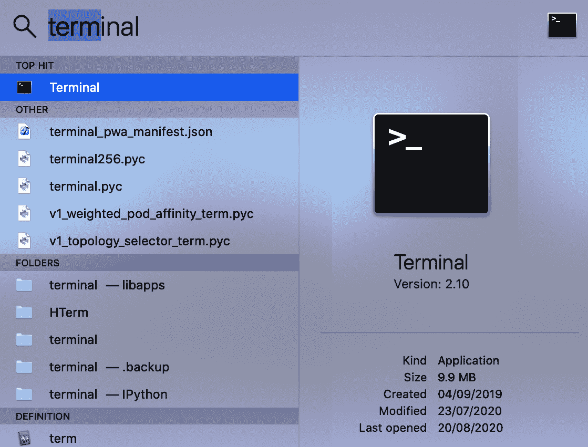
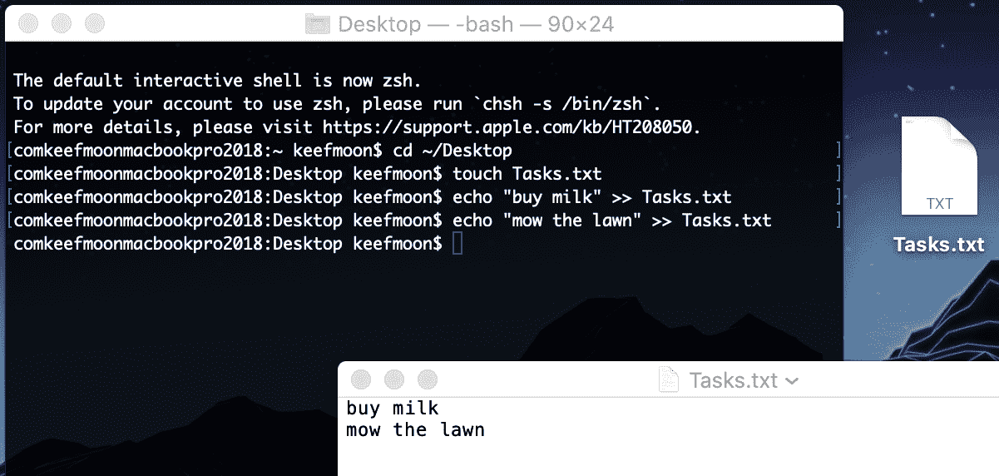

泛型、运算符和嵌套类型

Swift 提供了许多高级功能来构建灵活但定义良好的功能，这样它感觉就像是在扩展语言本身。在本章中，我们将检查其中两个功能：**泛型**和**运算符**。我们还将看到嵌套类型如何允许逻辑分组、访问控制和命名空间。

在本章中，我们将涵盖以下食谱：

+   使用泛型与类型

+   使用泛型与函数

+   使用泛型与协议

+   使用高级运算符

+   定义选项集

+   创建自定义运算符

+   嵌套类型和命名空间

# 技术要求

本章的所有代码都可以在这本书的 GitHub 仓库中找到：[`github.com/PacktPublishing/Swift-Cookbook-Second-Edition/tree/master/Chapter04`](https://github.com/PacktPublishing/Swift-Cookbook-Second-Edition/tree/master/Chapter04)

查看以下视频，了解代码的实际应用：[`bit.ly/39I7wuy`](https://bit.ly/39I7wuy)

# 使用泛型与类型

当我们在 Swift 中构建与其他类型交互的东西时，我们通常会直接指定我们正在与之交互的类型。这很有帮助，因为它意味着我们知道该类型具有哪些功能；我们可以使用这些功能，并确保输出具有正确的类型。然而，我们现在有一个只能与指定类型交互的构造；即使概念相同，它也不能与其他类型重用。

**泛型**让我们在泛型适用其他类型的同时拥有一个定义的类型。这或许可以通过一个例子来最好地说明。

在这个食谱中，我们将创建一个泛型类，该类存储它最后接收的五个项目，并在请求时返回所有这些项目。

## 准备工作

我们将创建一个自定义集合对象，该对象将存储用户最后复制的五个字符串，以便他们可以粘贴不仅仅是最后复制的字符串，而是最后五个中的任何一个。你可以向列表中添加字符串，并请求列表中的所有字符串，这些字符串将按最新到最旧的顺序返回：

```swift
class RecentList { 

    var slot1: String? 
    var slot2: String? 
    var slot3: String? 
    var slot4: String? 
    var slot5: String? 

    func add(recent: String) { 

        // Move each slot down 1 
        slot5 = slot4 
        slot4 = slot3 
        slot3 = slot2 
        slot2 = slot1 
        slot1 = recent 
    } 

    func getAll() -> [String] { 
        var recent = [String]() 
        if let slot1 = slot1 { 
            recent.append(slot1) 
        } 
        if let slot2 = slot2 { 
            recent.append(slot2) 
        } 
        if let slot3 = slot3 { 
            recent.append(slot3) 
        } 
        if let slot4 = slot4 { 
            recent.append(slot4) 
        } 
        if let slot5 = slot5 { 
            recent.append(slot5) 
        } 
        return recent 
    } 
} 
let recentlyCopiedList = RecentList() 
recentlyCopiedList.add(recent: "First") 
recentlyCopiedList.add(recent: "Next") 
recentlyCopiedList.add(recent: "Last") 
var recentlyCopied = recentlyCopiedList.getAll() 
print(recentlyCopied) // Last, Next, First 
```

这很棒——它正是我们想要的。现在，假设我们想在联系人应用中添加五个最近联系人的列表。这个概念与复制的字符串列表完全相同，因为我们想做到以下事情：

+   向列表中添加内容。

+   获取列表上的所有内容，以便我们可以向用户展示。

然而，因为我们指定了 `RecentList` 对象只能与字符串一起工作，所以它不能与我的自定义 `Person` 对象一起工作。我们可以使用泛型使这更有用。

让我们通过使 `RecentList` 使用泛型来看看如何做到这一点。

## 如何实现...

我们将更新我们的 `RecentList` 代码以使用泛型，使其可以与其他类型一起使用：

1.  修改 `RecentList` 对象以定义一个泛型类型 `ListItemType`，我们用它来代替 `String`：

```swift
class RecentList<ListItemType> { 

    var slot1: ListItemType? 
    var slot2: ListItemType? 
    var slot3: ListItemType? 
    var slot4: ListItemType? 
    var slot5: ListItemType? 

    func add(recent: ListItemType) { 
        // Move each slot down 1 
        slot5 = slot4 
        slot4 = slot3 
        slot3 = slot2 
        slot2 = slot1 
        slot1 = recent 
    } 

    func getAll() -> [ListItemType] { 
        var recent = [ListItemType]() 
        if let slot1 = slot1 { 
            recent.append(slot1) 
        } 
        if let slot2 = slot2 { 
            recent.append(slot2) 
        } 
        if let slot3 = slot3 { 
            recent.append(slot3) 
        } 
        if let slot4 = slot4 { 
            recent.append(slot4) 
        } 
        if let slot5 = slot5 { 
            recent.append(slot5) 
        } 
        return recent 
    } 
}
```

1.  在创建 `RecentList` 时提供指定的类型 `String`，这将用于替换此 `RecentList` 实例的泛型类型：

```swift
let recentlyUsedWordList = RecentList<String>() 
recentlyUsedWordList.add(recent: "First") 
recentlyUsedWordList.add(recent: "Next") 
recentlyUsedWordList.add(recent: "Last") 
var recentlyUsedWords = recentlyUsedWordList.getAll() 
print(recentlyUsedWords) // Last, Next, First
```

我们本可以用泛型来替换 `RecentlList` 中的所有 `String` 引用为 `Any`，这样它就可以接受任何类型。然而，这将允许列表由不同类型的事物组成，这并不是我们想要的。它还要求我们对返回的值进行类型转换，以便它们变得有用。

让我们来探讨一下如何将我们新泛化的 `RecentList` 用于我们之前讨论过的其他例子，即最近联系人的列表。

1.  创建一个简单的 `Person` 对象：

```swift
class Person { 

    let name: String 
    init(name: String) { 
        self.name = name 
    } 
}
```

1.  创建一些人员以添加到我们的最近联系人列表中：

```swift
let rod = Person(name: "Rod") 
let jane = Person(name: "Jane") 
let freddy = Person(name: "Freddy")  
```

1.  创建一个新的 `RecentList`，提供具体的 `Person` 类型：

```swift
let lastCalledList = RecentList<Person>() 
```

1.  向此列表添加人员对象：

```swift
lastCalledList.add(recent: freddy) 
lastCalledList.add(recent: jane) 
lastCalledList.add(recent: rod) 
```

1.  获取列表中所有人，由于这被类型化为 `Person` 对象的数组，因此打印它们的 `name` 属性：

```swift
let lastCalled = lastCalledList.getAll() 
for person in lastCalled {
    print(person.name)
}
// Rod
// Jane
// Freddy
```

我们现在有一个泛型 `RecentList` 类，我们已用它与字符串和自定义的 `Person` 类一起使用。

## 它是如何工作的...

要将泛型添加到 `class` 或 `struct` 中，泛型类型在类或结构体名称之后用尖括号定义，并且可以给出任何类型名称，尽管它应该以一个 *大写字母* 开头，就像其他类型名称一样：

```swift
class RecentList<ListItemType> { 
    //... 
}
```

这个泛型类型现在成为了一个替代品，用于在它被使用时指定的具体类型，我们可以在任何使用具体类型的地方使用它。

它可以用作属性类型：

```swift
var slot1: ListItemType? 
```

作为参数值：

```swift
func add(recent: ListItemType) 
```

以及作为返回类型：

```swift
func getAll() -> [ListItemType] 
```

在许多拥有泛型系统的其他编程语言中，泛型类型通常被赋予一个单字母的类型名称，通常是 `T`。Swift 旨在简洁，但又不失清晰，所以我建议使用更具描述性的类型名称。

如果你有多个泛型类型，这在尖括号内可以用逗号分隔的列表表示，描述性类型名称就变得尤为重要：

```swift
class RecentList<ListItemType, SomeOtherType> { 
    //... 
} 
```

我们现在创建了一个泛型 `RecentList` 对象，它可以与任何类型一起使用。

## 还有更多...

虽然极端泛型有其优点，但你可能希望限制可以用于泛型类型的类型，特别是如果你需要使用该受限类型的某些功能。

假设除了从 `RecentList` 返回一个项目数组外，我们还想能够直接打印出列表。为此，我们需要确保在 `RecentList` 中使用的项目类型是可以转换为要打印的 *字符串* 的。已经有一个 `CustomStringConvertible` 协议定义了这种行为，因此我们想确保任何与 `RecentList` 一起使用的特定类型都符合 `CustomStringConvertible`：

```swift
class RecentList<ListItemType: CustomStringConvertible> { 
    //... 
}
```

我们在泛型类型名称之后添加约束，用冒号分隔，类似于我们指定协议符合性和类继承的方式。实际上，虽然这个例子将泛型类型约束为实现一个协议，我们也可以指定一个特定类型必须是或继承自的类。

现在我们有了这个约束，我们可以确信任何给定的特定类型都将符合`CustomStringConvertible`，因此将有一个可以打印的`description`字符串，所以让我们创建一个方法来做这件事：

```swift
class RecentList<ListItemType: CustomStringConvertible> { 
func printRecentList() {
    for item in getAll() {
        let printableItem = String(describing: item)
        print(printableItem)
    }
}
 //... 

```

剩下的唯一事情就是让我们的`Person`类符合`CustomStringConvertible`，以便它可以在`RecentList`中继续作为特定类型使用：

```swift
extension Person: CustomStringConvertible { 
    public var description: String { 
        return name 
    } 
} 
```

现在，我们可以使用我们的`String`类型的`RecentlyList`和我们的`Person`类型的`RecentList`来使用此功能：

```swift
// Using String type
let recentlyUsedWordList = RecentList<String>()
recentlyUsedWordList.add(recent: "First")
recentlyUsedWordList.add(recent: "Next")
recentlyUsedWordList.add(recent: "Last")
recentlyUsedWordList.printRecentList()
// Last
// Next
// First

// Using Person type
let rod = Person(name: "Rod")
let jane = Person(name: "Jane")
let freddy = Person(name: "Freddy")
let lastCalledList = RecentList<Person>()
lastCalledList.add(recent: freddy)
lastCalledList.add(recent: jane)
lastCalledList.add(recent: rod)
lastCalledList.printRecentList()
// Rod
// Jane
// Freddy
```

通过约束泛型类型，我们可以使用我们知道类型将具有的功能，以提供额外的功能。

## 参见

更多关于泛型类型的信息可以在苹果关于 Swift 语言的文档中找到，请参阅[`swiftbook.link/docs/generics`](http://swiftbook.link/docs/generics)。

# 使用泛型与函数

除了可以指定泛型类型外，您还可以使用泛型构建既广泛适用又强类型的函数。在这个菜谱中，我们将使用泛型与函数。

## 如何做到...

我们将使用泛型创建一个函数来帮助将值放入字典中：

1.  创建一个泛型函数，将相同的值插入字典的多个键中：

```swift
func makeDuplicates<ItemType>(of item: ItemType, 
   withKeys keys: Set<String>) -> [String: ItemType] { 

    var duplicates = [String: ItemType]() 
    for key in keys { 
        duplicates[key] = item 
    } 
    return duplicates 
}
```

1.  使用此函数，传入单个值和多个键，值将存储在每个给定的键中：

```swift
let awards: Set<String> = ["Best Director",
                           "Best Picture", 
                           "Best Original Screenplay", 
                           "Best International Feature"] 
let oscars2020 = makeDuplicates(of: "Parasite", withKeys: awards) 
print(oscars2020["Best Picture"] ?? "") 
// Parasite 
print(oscars2020["Best International Feature"] ?? "") 
// Parasite
```

## 它是如何工作的...

就像类型泛型一样，函数的泛型类型在尖括号内指定：

```swift
func makeDuplicates<ItemType>(of item: ItemType, 
   withKeys keys: Set<String>) -> [String: ItemType] { 
    //... 
} 
```

定义好的泛型类型名称可以在函数定义的其余部分用作类型定义。在我们的例子中，我们希望定义输入项的类型为要复制的类型，并且我们还想让字典中持有的值返回的类型相同。

而不是使用泛型，我们可以用`Any`类型代替泛型类型：

```swift
func makeDuplicates(of item: Any, withKeys keys: Set<String>) -> [String: Any] { 
    //... 
} 
```

然而，这种方法给使用此函数的人带来了一些问题：

+   他们将得到一个包含`Any`类型值的字典，这需要被转换为一个更有用的类型。

+   没有看到实现，他们不能确定字典包含相同类型的值。一个键可能存储了一个`String`，另一个键可能存储了一个`Int`。

+   没有看到实现，他们不能确定返回字典中的值与提供的项具有相同的类型。

通过使用泛型类型，我们允许功能广泛适用，同时在编译时强制执行我们的类型逻辑。

你会注意到，与使用泛型实例化类型不同，我们不需要在执行函数时明确指定要使用的特定类型：

```swift
let oscars2020 = makeDuplicates(of: "Parasite", withKeys: awards)
```

这是因为编译器能够从提供的第一个参数的类型推断它。由于`Parasite`是一个字符串，编译器知道该参数具有`ItemType`泛型类型，因此编译器推断出，对于此方法的使用，`ItemType`泛型类型成为`String`的具体类型。

## 还有更多...

我们可以通过提供作为第二个参数提供的键集合的泛型类型来提高我们函数的可用性：

```swift
func makeDuplicates<ItemType, KeyType>(of item: ItemType, withKeys  
  keys: Set<KeyType>) -> [KeyType: ItemType] { 

    var duplicates = [KeyType: ItemType]() 
    for key in keys { 
        duplicates[key] = item 
    } 
    return duplicates 
} 
```

泛型类型定义与先前的食谱中一样，作为尖括号内的逗号分隔列表。

Swift 中的所有集合类型（数组、字典、集合等）都使用泛型，在先前的函数中，我们将泛型类型从我们的函数传递到集合中。因此，`KeyType`必须符合`Hashable`协议，因为这是在`Set`中使用所必需的。

如果我们想要使这个约束更明确，或者出于其他原因对泛型类型进行约束，那么这个约束定义在冒号之后：

```swift
func makeDuplicates<ItemType, KeyType: Hashable>(of item: ItemType, 
   withKeys keys: Set<KeyType>) -> [KeyType: ItemType] { 

    var duplicates = [KeyType: ItemType]() 
    for key in keys { 
        duplicates[key] = item 
    } 
    return duplicates 
} 
```

正如先前的例子一样，如果我们使用的具体类型可以从输入或输出中推断出来，我们就不需要指定它：

```swift
let awards: Set<String> = ["Best Director", 
                           "Best Picture", 
                           "Best Original Screenplay", 
                           "Best International Feature"] 
let oscars2020 = makeDuplicates(of: "Parasite", withKeys: awards) 
print(oscars2020["Best Picture"]) // Parasite 
print(oscars2020["Best International Feature"]) // Parasite
```

我们使用了两个泛型类型来提高函数的灵活性。

## 参见

更多关于泛型函数的信息可以在 Apple 关于 Swift 语言的文档中找到，请参阅[`swiftbook.link/docs/generic-functions`](http://swiftbook.link/docs/generic-functions)。

# 使用协议与泛型结合

到目前为止，在本章中，我们已经看到了如何在类型和函数中使用泛型。在本食谱中，我们将通过查看它们如何在协议中使用来结束我们在 Swift 中使用泛型的旅程。这将允许我们产生抽象接口，同时保持强类型要求，从而允许更详细的模型。

在这个食谱中，我们将构建一个英国交通应用模型，目标是提供不同运输方式的旅程距离和持续时间。

## 如何实现...

人们的旅行方式可能非常不同，所以让我们首先以泛型方式定义运输方式，然后指定那些旅行方法：

1.  定义一个协议来定义运输方式的功能：

```swift
protocol TransportMethod { 
    associatedtype CollectionPoint 
    var defaultCollectionPoint: CollectionPoint { get } 
    var averageSpeedInKPH: Double { get } 
}
```

1.  创建一个实现`TransportMethod`协议的用于火车旅行的结构体：

```swift
struct Train: TransportMethod { 
    typealias CollectionPoint = TrainStation 

    // User's home or nearest station 
    var defaultCollectionPoint: TrainStation { 
        return TrainStation.BMS 
    } 

    var averageSpeedInKPH: Double { 
        return 100 
    } 
}
```

1.  我们需要定义一个`TrainStation`类型，将其作为`CollectionPoint`使用。让我们以枚举的形式来完成它：

```swift
enum TrainStation: String { 
    case BMS = "Bromley South" 
    case VIC = "London Victoria" 
    case RAI = "Rainham (Kent)" 
    case BTN = "Brighton (East Sussex)" 
    // Full list of UK train stations codes at  
    // http://www.nationalrail.co.uk/static/documents/content
      // /station_codes.csv
}
```

1.  由于我们计划计算旅程的距离和持续时间，让我们创建一个`Journey`对象来表示从起点到终点的旅程：

```swift
class Journey<TransportType: TransportMethod> { 

    let start: TransportType.CollectionPoint 
    let end: TransportType.CollectionPoint 

    init(start: TransportType.CollectionPoint,  
         end: TransportType.CollectionPoint) { 
        self.start = start 
        self.end = end 
    } 
}
```

1.  将运输方式作为旅程的一个属性添加，因为这将被用于持续时间计算：

```swift
class Journey<TransportType: TransportMethod> { 

    let start: TransportType.CollectionPoint 
    let end: TransportType.CollectionPoint 
    let method: TransportType 

    init(method: TransportType,  
         start: TransportType.CollectionPoint,  
         end: TransportType.CollectionPoint) { 
        self.start = start 
        self.end = end 
        self.method = method 
    } 
}
```

1.  为了计算旅程的距离，我们需要起始点和终点有明确的位置。因此，定义一个协议来提供这个位置：

```swift
protocol TransportLocation { 
    var location: CLLocation { get } 
} 
```

1.  在游乐场的顶部导入`CoreLocation`框架：

```swift
import CoreLocation
```

1.  在`TransportMethod`上约束`CollectionPoint`关联类型，使其必须符合我们刚刚创建的`TransportLocation`协议：

```swift
protocol TransportMethod { 
    associatedtype CollectionPoint: TransportLocation 
    var defaultCollectionPoint: CollectionPoint { get } 
    var averageSpeedInKPH: Double { get } 
} 
```

1.  使用`CollectionPoint`的起始和结束位置来计算旅程的距离和持续时间：

```swift
class Journey<TransportType: TransportMethod> { 

    var start: TransportType.CollectionPoint 
    var end: TransportType.CollectionPoint 
    let method: TransportType 
    var distanceInKMs: Double 
    var durationInHours: Double  

    init(method: TransportType,  
         start: TransportType.CollectionPoint,  
         end: TransportType.CollectionPoint) { 
        self.start = start 
        self.end = end 
        self.method = method 
        // CoreLocation provides the distance in meters,  
        // so we divide by 1000 to get kilometers 
        distanceInKMs = end.location.distance(from: start.location) 
          / 1000 
        durationInHours = distanceInKMs / method.averageSpeedInKPH  
    } 
} 
```

1.  确保我们的`TrainStation`枚举符合`TransportLocation`协议，这是现在的要求：

```swift
enum TrainStation: String, TransportLocation { 
    case BMS = "Bromley South" 
    case VIC = "London Victoria" 
    case RAI = "Rainham (Kent)" 
    case BTN = "Brighton (East Sussex)" 
    // Full list of UK train stations codes can be found at  
    // http://www.nationalrail.co.uk/static/documents/content
      // /station_codes.csv 

    var location: CLLocation { 
        switch self { 
        case .BMS: 
            return CLLocation(latitude: 51.4000504, 
                              longitude: 0.0174237) 
        case .VIC: 
            return CLLocation(latitude: 51.4952103, 
                              longitude: -0.1438979) 
        case .RAI: 
            return CLLocation(latitude: 51.3663, 
                              longitude: 0.61137) 
        case .BTN: 
            return CLLocation(latitude: 50.829, 
                              longitude: -0.14125) 
        } 
    } 
}
```

1.  使用我们的`Journey`对象来计算火车旅程的距离和持续时间：

```swift
let trainJourney = Journey(method: Train(), 
                           start: TrainStation.BMS, 
                           end: TrainStation.VIC) 
let distanceByTrain = trainJourney.distanceInKMs 
let durationByTrain = trainJourney.durationInHours 
print("Journey distance: \(distanceByTrain) km") 
print("Journey duration: \(durationByTrain) hours") 
```

## 工作原理...

在一开始，可能不清楚使用哪种结构来定义传输方法最好，可能存在适用于不同旅行方法的不同结构。因此，我们可以定义一个传输方法为一种协议，适当的类型可以符合：

```swift
protocol TransportMethod { 
    associatedtype CollectionPoint 
    var defaultCollectionPoint: CollectionPoint { get } 
    var averageSpeedInKPH: Double { get } 
} 
```

我们定义了一个关联的泛型类型，我们将其命名为`CollectionPoint`，它将代表在使用此传输方法时某人可以被收集的类型。通过使用泛型，我们在如何定义可以作为集合点的任何内容方面具有最大的灵活性。

定义了一个关联类型后，它就可以在协议使用时定义的具体类型中作为占位符使用。我们用它来定义每个传输方法应该提供的一个默认集合点。

每个传输方法还提供了一个平均速度，这将在计算旅行时间时被使用。

让我们看看一个具体的传输方法示例，以帮助进一步定义模型：

```swift
struct Train: TransportMethod { 
    typealias CollectionPoint = TrainStation 

    // User's home or nearest station 
    var defaultCollectionPoint: TrainStationPoint { 
        return TrainStation.BMS 
    } 

    var averageSpeedInKPH: Double { 
        return 100 
    } 
}
```

为了使`Train`符合`TransportMethod`协议，我们必须提供一个协议所需的特定版本的`CollectionPoint`泛型类型。在乘坐火车旅行的情况下，集合点将是一个火车站，因此我们现在必须定义`TrainStation`类型：

```swift
enum TrainStation: String { 
    case BMS = "Bromley South" 
    case VIC = "London Victoria" 
    case RAI = "Rainham (Kent)" 
    case BTN = "Brighton (East Sussex)" 
    // Full list of UK train stations codes at  
    // http://www.nationalrail.co.uk/static/documents/content
      // /station_codes.csv
}
```

由于火车站的数量是有限的，并且可以离散地定义，所以`enum`是一个表示它们的良好方式。我上面只列出了少数几个，为了简洁。

我们的目的是模拟一个旅程并计算在特定传输方法上的旅程持续时间，所以让我们创建一个`Journey`对象：

```swift
class Journey<TransportType: TransportMethod> { 

    let start: TransportType.CollectionPoint 
    let end: TransportType.CollectionPoint 

    init(start: TransportType.CollectionPoint,  
         end: TransportType.CollectionPoint) { 
        self.start = start 
        self.end = end 
    } 
} 
```

旅程是从一个点到另一个点，因此我们将旅程的起点和终点作为输入参数。我们需要有灵活性来提供任何类型作为起点和终点，但我们需要它们是与传输方法相关联的类型，起点和终点的值类型相同。为了实现这一点，我们可以有一个泛型类型，它被约束为符合`TransportMethod`协议；然后我们可以通过引用泛型类型的`CollectionPoint`关联类型来定义我们的起点和终点属性类型。

我们的目标是计算旅程的持续时间。为此，我们需要旅程中的旅行速度和起点到终点的距离。我们的`TransportMethod`协议定义了它将提供一个平均速度，所以让我们也将传输方法作为旅程的输入：

```swift
class Journey<TransportType: TransportMethod> { 

    let start: TransportType.CollectionPoint 
    let end: TransportType.CollectionPoint 
    let method: TransportType 

    init(method: TransportType,  
         start: TransportType.CollectionPoint,  
         end: TransportType.CollectionPoint) { 
        self.start = start 
        self.end = end 
        self.method = method 
    } 
} 
```

为了获取旅程的距离，我们需要计算起点和终点之间的距离，但旅程的起点和终点的类型都是泛型`CollectionPoint`类型，这可以是任何类型，因此没有我们可以用来计算距离的位置信息。

为了解决这个问题，让我们约束`CollectionPoint`，使其必须符合一个新的协议`TransportLocation`：

```swift
protocol TransportLocation { 
    var location: CLLocation { get } 
} 
```

任何符合`TransportLocation`的都必须以`CLLocation`对象的形式提供一个位置。`CLLocation`对象是 iOS 上`CoreLocation`框架的一部分。对`CoreLocation`框架的进一步研究超出了本书的范围，但只需知道它提供了计算两个`CLLocation`对象之间距离的方法，我们只需要在 playground 的顶部包含以下内容来使用它：

```swift
import CoreLocation 
```

在定义了`TransportLocation`协议之后，我们可以在`TransportMethod`协议上约束`CollectionPoint`关联类型：

```swift
protocol TransportMethod { 
    associatedtype CollectionPoint: TransportLocation 
    var defaultCollectionPoint: CollectionPoint { get } 
    var averageSpeedInKPH: Double { get } 
} 
```

由于我们的`CollectionPoint`现在将符合`TransportLocation`，因此必须有一个位置属性，我们可以回到我们的`Journey`对象并使用它来计算行程的距离和持续时间：

```swift
class Journey<TransportType: TransportMethod> { 

    var start: TransportType.CollectionPoint 
    var end: TransportType.CollectionPoint 
    let method: TransportType 
    var distanceInKMs: Double 
    var durationInHours: Double  

    init(method: TransportType,  
         start: TransportType.CollectionPoint,  
         end: TransportType.CollectionPoint) { 
        self.start = start 
        self.end = end 
        self.method = method 
        // CoreLocation provides the distance in meters,  
        // so we divide by 1000 to get kilometers 
        distanceInKMs = end.location.distance(from: start.location) / 
          1000 
        durationInHours = distanceInKMs / method.averageSpeedInKPH  
    } 
} 
```

我们需要做的最后一件事是确保我们的`TrainStation`枚举符合`TransportLocation`，因为现在这是一个要求。为此，我们只需要声明符合性并添加一个`location`属性：

```swift
enum TrainStation: String, TransportLocation { 
    case BMS = "Bromley South" 
    case VIC = "London Victoria" 
    case RAI = "Rainham (Kent)" 
    case BTN = "Brighton (East Sussex)" 
    // Full list of UK train stations codes can be found at  
    // http://www.nationalrail.co.uk/static/documents/content
     // /station_codes.csv 

    var location: CLLocation { 
        switch self { 
        case .BMS: 
            return CLLocation(latitude: 51.4000504, 
                              longitude: 0.0174237) 
        case .VIC: 
            return CLLocation(latitude: 51.4952103, 
                              longitude: -0.1438979) 
        case .RAI: 
            return CLLocation(latitude: 51.3663, 
                              longitude: 0.61137) 
        case .BTN: 
            return CLLocation(latitude: 50.829, 
                              longitude: -0.14125) 
        } 
    } 
}
```

让我们看看我们如何使用我们的旅行模型来创建具有特定类型的行程：

```swift
let trainJourney = Journey(method: Train(), 
                           start: TrainStation.BMS, 
                           end: TrainStation.VIC) 
let distanceByTrain = trainJourney.distanceInKMs 
let durationByTrain = trainJourney.durationInHours 
print("Journey distance: \(distanceByTrain) km") 
print("Journey duration: \(durationByTrain) hours") 
```

我们使用泛型和协议创建了一个泛型系统，而没有规定我们需要使用的 Swift 构造类型。

## 还有更多...

在这个菜谱中，我们使一个类型符合`TransportMethod`——这是我们`Train`结构体。让我们看看另一个例子，看看以协议为中心的方式处理事物如何允许实现上的灵活性。

在下一个`TransportMethod`中，我们将实现`Road`，但我们可以使用多种不同的车辆类型通过公路旅行，它们可能有不同的平均速度。由于我们有有限的公路旅行选项，让我们使用一个`enum`来定义它：

```swift
enum Road: TransportMethod { 
    typealias CollectionPoint = CLLocation 

    case car 
    case motobike 
    case van 
    case hgv 

    // The users home or current location 
    var defaultCollectionPoint: CLLocation { 
        return CLLocation(latitude: 51.1, 
                          longitude: 0.1) 
    } 

    var averageSpeedInKPH: Double { 
        switch self {
        case .car: return 60 
        case .motobike: return 70 
        case .van: return 55 
        case .hgv: return 50 
        } 
    } 
}
```

火车旅行有一个有限的集合点列表，即火车站，但几乎任何地方在公路旅行时都可以是一个集合点。因此，我们可以将`Road`的集合点定义为任何`CLLocation`，但`CLLocation`不符合`TransportLocation`。我们可以通过扩展`CLLocation`来添加符合性来解决此问题：

```swift
extension CLLocation: TransportLocation { 
    var location: CLLocation { 
        return self 
    } 
} 
```

现在，我们可以通过道路定义一次行程并计算其持续时间：

```swift
let start = CLLocation(latitude: 51.3994669, 
                       longitude: 0.0116888) 
let end = CLLocation(latitude: 51.2968654, 
                     longitude: 0.5053609) 
let roadJourney = Journey(method: Road.car, 
                          start: start, 
                          end: end) 
let distanceByRoad = roadJourney.distanceInKMs 
let durationByRoad = roadJourney.durationInHours 
print("Journey distance: \(distanceByRoad) km") 
print("Journey duration: \(durationByRoad) hours") 
```

通过采用面向协议的方法来解决计算行程持续时间的任务，并使用协议泛型，我们能够使用完全不同但适当的实现来处理两种运输方式，同时提供了一个接口，以便它们可以以相同的方式进行处理。

对于火车旅行，我们使用一个`enum`来模拟火车站，并使用一个`struct`来模拟运输方式；对于`road`，我们实现了一个`enum`来表示运输方式，并使用`CLLocation`对象作为运输位置。

## 参见

更多关于关联类型的信息可以在 Apple 的 Swift 语言文档中找到，链接为[`swiftbook.link/docs/associated-types`](http://swiftbook.link/docs/associated-types)。

# 使用高级运算符

Swift 是一种编程语言，它采用相对较少的明确定义的原则，并在此基础上构建出表达性和强大的语言特性。数学运算符的概念，如*+*、*-*、***和*/*分别用于加法、减法、乘法和除法，似乎如此基本，以至于无需提及。然而，在 Swift 中，这种常见的数学功能是建立在可扩展和强大的底层运算符系统之上的。

在这个菜谱中，我们将查看 Swift 标准库提供的某些更高级的运算符，在下一个菜谱中，我们将创建我们自己的自定义运算符。

## 如何做到这一点...

我们将要探索的运算符被称为位运算符，用于操作数值的位表示。

在 Swift 中，可以通过在整型字面量前加上`0b`来表示整数的二进制形式：

```swift
let zero: Int  = 0b000 
let one: Int   = 0b001 
let two: Int   = 0b010 
let three: Int = 0b011 
let four: Int  = 0b100 
let five: Int  = 0b101 
let six: Int   = 0b110 
let seven: Int = 0b111 
```

位是计算机系统中最小的值，由 1 或 0 组成。这里提到的整数可以用三个位来表示，这在二进制形式中非常明显，如前一个片段所示。整数`six`可以用三个位 1、1 和 0 来表示。

当你需要在一个值中表示多个选项时，这些二进制表示非常有用。例如，假设我们想表示一个应用程序特定功能的受支持设备。可用的设备如下所示：

+   手机

+   平板电脑

+   手表

+   笔记本电脑

+   桌面

+   电视

+   脑植入

某些功能可能适用于所有设备，或者你可能仍在开发一个功能，因此目前不适合任何设备，或者它可能是不同设备的组合。我们可以为每个设备有布尔值来表示该功能是否支持该设备，但这不是最佳解决方案，因为没有内在地将属性相互关联，并且你可能忘记在情况变化时更新一些值。

相反，我们可以用一个整数值来表示所有受支持的设备，并使用整数的每一位来表示不同的设备：

```swift
let phone: Int        = 0b0000001 
let tablet: Int       = 0b0000010 
let watch: Int        = 0b0000100 
let laptop: Int       = 0b0001000 
let desktop: Int      = 0b0010000 
let tv: Int           = 0b0100000 
let brainImplant: Int = 0b1000000 

var supportedDevices: Int 
```

要看看这如何使我们能够在单个值中存储多个设备，让我们将几个设备值相加：

```swift
 phone  = 0b0000001  + 
 tablet = 0b0000010  + 
 tv     = 0b0100000 
 ------------------ 
 phone 
 tablet = 0b0100011 
 tv 
```

由于每个设备都由不同的位表示，设备值通过相加来组合，它们不会重叠。

要测试特定的设备或设备组合是否受支持，我们可以使用位运算的**AND**操作。位运算 AND 操作将比较两个不同二进制值对应的位，如果两个位输入值都是 1，则在新二进制值中将该位设置为 1。例如，让我们测试我们之前创建的合并值中是否支持手机：

```swift
 Supported Devices    = 0b 0 1 0 0 0 1 1 
 Phone                = 0b 0 0 0 0 0 0 1 
 AND Operation Result = 0b 0 0 0 0 0 0 1 
```

结果只对最右边的位有 1 位的值，因为这是在`Supported Devices`值和`Phone`值中唯一被设置为 1 的位。

一旦我们得到这个结果，我们可以直接将其与 `Phone` 的值进行比较，如果它们相等，那么我们知道支持的设备值中包含了 `Phone` 值：

```swift
 AND Operation Result = 0b 0 0 0 0 0 0 1 
 Phone                = 0b 0 0 0 0 0 0 1 
```

现在我们有了一种将可能的选项组合成一个值的方法，以及一种通过位运算比较这些值以查看一个是否包含在另一个中的方法。Swift 标准库包含位运算符，允许我们像其他数学运算（如 *+*, *-*, ***, 和 */*）一样轻松地执行这些操作。

通常，运算符将采用以下形式：

```swift
<#left hand side value#> <#operator#> <#right hand side value#>  
```

就像在相加两个数字时一样：

```swift
2 + 3
```

在前面的例子中，我们有这些：

+   `2`：这是左侧的值。

+   `+`：这是运算符。

+   `3`：这是右侧的值。

**位移运算符** (`<<`) 会将左侧的整数值向右移动指定的位数。因此，我们可以在声明设备值时更好地表达我们的意图：

```swift
let phone: Int        = 1 << 0 // 0b0000001 
let tablet: Int       = 1 << 1 // 0b0000010 
let watch: Int        = 1 << 2 // 0b0000100 
let laptop: Int       = 1 << 3 // 0b0001000 
let desktop: Int      = 1 << 4 // 0b0010000 
let tv: Int           = 1 << 5 // 0b0100000 
let brainImplant: Int = 1 << 6 // 0b1000000 
```

位运算 **AND** 运算符 (`&`) 将执行之前手动描述的相同位比较，我们可以使用这个来创建一个函数，以确定特定设备是否存在于支持的设备值中：

```swift
supportedDevices = phone + tablet + tv 

func isSupported(device: Int) -> Bool { 
    let bitWiseANDResult = supportedDevices & device 
    let containsDevice = bitWiseANDResult == device 
    return containsDevice 
} 

let phoneSupported = isSupported(device: phone) 
print(phoneSupported) // true 

let brainImplantSupported = isSupported(device: brainImplant) 
print(brainImplantSupported) // false 
```

Swift 标准库还提供了以下逻辑运算的运算符：

+   **OR**：OR 运算，用 `|` 表示，比较位，如果任一值将位设置为 1，则将相应的位设置为 1。对于我们的设备，这意味着在两个设备组合之间创建一个并集：

```swift
let deviceThatSupportUIKit = phone + tablet + tv 
let stationaryDevices = desktop + tv 
let stationaryOrUIKitDevices = deviceThatSupportUIKit | 
  stationaryDevices 
let orIsUnion = stationaryOrUIKitDevices == (phone + tablet + tv +
  desktop) 
print(orIsUnion) // true 
```

+   **XOR（异或）**：XOR 运算，用 `^` 表示，只有在任一值将位设置为 1 但不是两者都设置时，才会将位设置为 1：

```swift
let onlyStationaryOrUIKitDevices = deviceThatSupportUIKit ^ 
  stationaryDevices 
let xorIsUnionMinusIntersection = onlyStationaryOrUIKitDevices == (phone + 
  tablet + desktop) 
print(xorIsUnionMinusIntersection) // true
```

我们已经看到了 Swift 标准库为我们提供的某些高级运算符。

## 参见

关于高级运算符的更多信息可以在 Apple 的 Swift 语言文档中找到，请参阅 [`swiftbook.link/docs/advanced-operators`](http://swiftbook.link/docs/advanced-operators)。

# 定义选项集

在一个值中持有多个选项的位运算使用是一个常见的模式，并且在 **Cocoa Touch 框架** 中被广泛使用，一个例子是 `UIDeviceOrientation`。在 Swift 中，有一个协议 `OptionSet`，它正式化了这种模式并提供了一些便利。在这个菜谱中，我们将探讨如何定义自己的选项集。

## 如何做到...

让我们重写上一个菜谱中的示例，该示例定义了支持的设备值，以使用 `OptionSet`：

```swift
struct Devices: OptionSet { 

    let rawValue: Int 

    static let phone        = Devices(rawValue: 1 << 0) 
    static let tablet       = Devices(rawValue: 1 << 1) 
    static let watch        = Devices(rawValue: 1 << 2) 
    static let laptop       = Devices(rawValue: 1 << 3) 
    static let desktop      = Devices(rawValue: 1 << 4) 
    static let tv           = Devices(rawValue: 1 << 5) 
    static let brainImplant = Devices(rawValue: 1 << 6) 

    static let none: Devices = [] 
    static let all: Devices = [.phone, 
                               .tablet, 
                               .watch, 
                               .laptop, 
                               .desktop, 
                               .tv, 
                               .brainImplant] 
    static let stationary: Devices = [.desktop, .tv] 
    static let supportsUIKit: Devices = [.phone, 
                                         .tablet, 
                                         .tv] 
} 

let supportedDevices: Devices = [.phone, 
                                 .tablet, 
                                 .watch, 
                                 .tv] 
```

## 它是如何工作的...

`OptionSet` 协议需要一个 `rawValue` 属性，并且惯例是为每个选项定义静态常量。此外，还可以定义选项的方便组合作为静态常量，`OptionSet` 提供了一个便利的初始化器，允许提供选项数组，然后通过位运算加法将选项组合成一个值。

`OptionSet`协议提供了类似于集合的操纵和比较方法，这些方法执行与上一菜谱中覆盖的相同的位操作：

```swift
// Contains / AND and comparison 
let phoneIsSupported = supportedDevices.contains(.phone) 

// Union / OR  
let stationaryOrUIKitDevices = 
  Devices.supportsUIKit.union(Devices.stationary)  

// Intersection / AND 
let stationaryAndUIKitDevices =
  Devices.supportsUIKit.intersection(Devices.stationary) 
```

我们在第二章，“掌握构建块”中检查的许多集合方法也提供了。

## 参见

关于`OptionSet`协议的更多信息可以在 Apple 的 Swift 语言文档中找到，请参阅[`swiftbook.link/docs/optionset`](http://swiftbook.link/docs/optionset)。

# 创建自定义操作符

在之前的菜谱中，我们查看了一些 Swift 在常见数学操作符之上提供的先进操作符。在这个菜谱中，我们将探讨我们如何创建自己的操作符，使表达的行为非常简洁，感觉像是语言的一部分。

我们将要创建的自定义操作符将用于将一个值的信息追加到另一个值的信息中，产生一个新的值，该值包含第二个值，后跟第一个值。我们想要实现的功能类似于`>>` Unix 命令。

## 准备工作

让我们了解 Unix 命令`>>`是如何工作的，在这个菜谱中，我们将使用自定义操作符在 Swift 中实现类似的功能。

由于 macOS 是基于 Unix 的，我们可以在终端中提供 Unix 命令。打开你的 Mac 上的终端应用程序：



图 4.1 – 焦点搜索

输入`cd ~/Desktop`并按*Enter*移动到包含所有桌面文件和文件夹的文件夹。输入`touch Tasks.txt`然后按*Enter*在桌面上创建一个名为`Tasks.txt`的空白文本文件。

要将任务添加到我们的任务文本文件中，我们可以输入以下命令，然后按*Enter*：

```swift
echo "buy milk" >> Tasks.txt
```

如果你打开桌面上的文本文件，你会看到我们在第一行添加了购买牛奶。

以相同的方式输入另一个任务：

```swift
echo "mow the lawn" >> Tasks.txt 
```

重新打开`Tasks.txt`文件，你会看到割草已经被添加到第二行：



图 4.2 – 任务结果

以相同的方式添加更多任务，你会看到每个任务都被追加到文本文件的下一行。

我们在终端中发出的命令具有以下形式：

```swift
<#What to append#> >> <#Where to append it#>
```

让我们在 Swift 中创建类似的行为；然而，我们不能使用相同的命令字符串`>>`，因为这个已经被定义为向右位移位，所以让我们使用`>>>`。

## 如何做...

我们将定义并使用一个新的“追加”操作符`>>>`：

1.  声明一个`中缀操作符`：

```swift
infix operator >>>
```

1.  定义当使用两个字符串时我们的操作符的行为：

```swift
func >>> (lhs: String, rhs: String) -> String { 
    var combined = rhs 
    combined.append(lhs) 
    return combined 
}  
```

1.  定义当将`String`追加到字符串数组时我们的操作符的行为：

```swift
func >>> (lhs: String, rhs: [String]) -> [String] { 
    var combined = rhs 
    combined.append(lhs) 
    return combined 
}
```

1.  定义当将字符串数组追加到另一个字符串数组时我们的操作符的行为：

```swift
func >>> (lhs: [String], rhs: [String]) -> [String] { 
    var combined = rhs 
    combined.append(contentsOf: lhs) 
    return combined 
}
```

1.  在这些实现到位后，使用我们新的操作符来追加内容：

```swift
let appendedString = "Two" >>> "One" 
print(appendedString) // OneTwo

let appendedStringToArray = "three" >>> ["one", "two"] 
print(appendedStringToArray) // ["one", "two", "three"]

let appendedArray = ["three", "four"] >>> ["one", "two"] 
print(appendedArray)  // ["one", "two", "three", "four"]
```

1.  将前两个操作符实现重构，以使用数组通用的元素类型：

```swift
func >>> <Element>(lhs: Element, 
                   rhs: Array<Element>) -> Array<Element> { 
    var combined = rhs 
    combined.append(lhs) 
    return combined 
} 

func >>> <Element>(lhs: Array<Element>, 
                   rhs: Array<Element>) -> Array<Element> { 
    var combined = rhs 
    combined.append(contentsOf: lhs) 
    return combined 
} 
```

1.  使用操作符处理任何类型的数组：

```swift
let appendedIntToArray = 3 >>> [1, 2] 
print(appendedIntToArray) // [1, 2, 3]

let appendedIntArray = [3, 4] >>> [1, 2] 
print(appendedIntArray) // [1, 2, 3, 4]
```

我们也可以为我们自己的自定义类型实现我们的自定义追加操作符。

1.  创建一个`Task`和一个`TaskList`来保存它：

```swift
struct Task { 
    let name: String  
} 

class TaskList: CustomStringConvertible { 
    private var tasks: [Task] = [] 
    func append(task: Task) { 
        tasks.append(task) 
    } 
    var description: String { 
        return tasks.map { $0.name }.joined(separator: "\n") 
    } 
} 
```

1.  扩展`TaskList`以添加对新的追加操作符的支持：

```swift
extension TaskList { 
    static func >>> (lhs: Task, rhs: TaskList) { 
        rhs.append(task: lhs) 
    } 
}
```

1.  使用我们的自定义操作符将一个`Task`追加到`TaskList`中：

```swift
let shoppingList = TaskList() 
Task(name: "get milk") >>> shoppingList 
print(shoppingList) 
Task(name: "get teabags") >>> shoppingList 
print(shoppingList)
```

## 它是如何工作的...

首先，我们声明了一个`中缀操作符`：

```swift
infix operator >>>
```

操作符可以分为三种类型：

+   `前缀` – 对一个值进行操作，并将其放置在值之前。一个例子是 NOT 操作符：

```swift
let trueValue = !falseValue
```

+   `后缀` – 对一个值进行操作，并将其放置在值之后。一个例子是强制解包操作符：

```swift
let unwrapped = optional!
```

+   `中缀` - 对两个值进行操作，并将其放置在它们之间。一个例子是加法操作符：

```swift
let five = 2 + 3
```

一旦我们定义了操作符，我们可以编写顶层函数来实现每种类型对的行为：一个在**左侧**（**LHS**）和一个在**右侧**（**RHS**）。方法参数重载允许我们为多类型配对指定操作符实现。

当我们的操作符与字符串一起使用时，我们可以定义如何将一个字符串追加到另一个字符串上：

```swift
func >>> (lhs: String, rhs: String) -> String { 
    var combined = rhs 
    combined.append(lhs) 
    return combined 
}  
```

我们可以实现将一个`String`追加到字符串数组中：

```swift
func >>> (lhs: String, rhs: [String]) -> [String] { 
    var combined = rhs 
    combined.append(lhs) 
    return combined 
}
```

我们还可以实现将字符串数组中的元素追加到另一个字符串数组中：

```swift
func >>> (lhs: [String], rhs: [String]) -> [String] { 
    var combined = rhs 
    combined.append(contentsOf: lhs) 
    return combined 
}
```

这允许我们使用操作符与字符串和字符串数组一起使用，因为这些是我们定义的实现：

```swift
let appendedString = "Two" >>> "One" 
print(appendedString) // OneTwo

let appendedStringToArray = "three" >>> ["one", "two"] 
print(appendedStringToArray) // ["one", "two", "three"]

let appendedArray = ["three", "four"] >>> ["one", "two"] 
print(appendedArray)  // ["one", "two", "three", "four"]
```

我们可以在我们认为可能有用的每种数组类型上实现我们的追加操作符，但相反，我们可以将其实现为一个泛型函数，使其对所有数组都起作用。

因此，我们可以重构前面的两个数组实现，以使用泛型元素类型：

```swift
func >>> <Element>(lhs: Element, 
                   rhs: Array<Element>) -> Array<Element> { 
    var combined = rhs 
    combined.append(lhs) 
    return combined 
} 

func >>> <Element>(lhs: Array<Element>, 
                   rhs: Array<Element>) -> Array<Element> { 
    var combined = rhs 
    combined.append(contentsOf: lhs) 
    return combined 
} 
```

这允许我们使用整数数组，而无需显式地为整数数组定义它们：

```swift
let appendedIntToArray = 3 >>> [1, 2] 
print(appendedIntToArray) // [1, 2, 3]

let appendedIntArray = [3, 4] >>> [1, 2] 
print(appendedIntArray)  // [1, 2, 3, 4]
```

我们还可以为我们自己的自定义类型实现它。让我们创建`Task`和`TaskList`，这可能有助于使用操作符：

```swift
struct Task { 
    let name: String  
} 

class TaskList: CustomStringConvertible { 
    private var tasks: [Task] = [] 
    func append(task: Task) { 
        tasks.append(task) 
    } 
    var description: String { 
        return tasks.map { $0.name }.joined(separator: "\n") 
    } 
} 
```

我们添加了`CustomStringConvertible`一致性，以便我们可以轻松地打印出结果。

实现操作符作为顶层函数的替代方法是将其声明为相关类型中的静态函数。我们将在`TaskList`对象的扩展中声明它，但我们也可以轻松地在`TaskList`主类声明中声明它：

```swift
extension TaskList { 
  static func >>> (lhs: Task, rhs: TaskList) { 
    rhs.append(task: lhs) 
  } 
} 
```

在类型内部实现它有几个优点：实现代码紧挨着类型本身，这使得它更容易找到，并利用任何可能具有私有或受限制的访问控制的值或类型，这将防止它们对顶层函数可见。

现在，我们可以使用我们的`>>>`操作符将一个`Task`追加到`TaskList`中：

```swift
let shoppingList = TaskList() 
Task(name: "get milk") >>> shoppingList 
print(shoppingList) 
Task(name: "get teabags") >>> shoppingList 
print(shoppingList) 
```

我们已经创建了一个自定义操作符，以允许更简洁和更具表现力的代码。

## 更多...

操作符不仅单独工作，它们通常在同一个表达式中与其他操作符一起使用；数学操作符是这一点的有用例子：

```swift
let result = 6 + 8 / 2 / 4
```

每个这些操作执行的顺序将影响结果。为了理解操作执行的顺序，我们可以添加括号，它们将执行相同的功能：

```swift
let result = 6 + ((8 / 2) / 4) 
```

在 Swift 中，关于如何排序运算的决定是通过两个概念——优先级和结合性——来实现的：

+   **优先级**：这定义了操作类型的重要性。因此，具有最高优先级的操作首先执行；例如，乘法（*）的优先级高于加法（+），因此总是首先执行。

+   **结合性**：这定义了当值在两侧具有相同优先级的操作时，它应该将自己与哪一侧关联起来进行评估。这具有定义具有相同优先级的操作应该按何种顺序评估的效果：从左到右或从右到左。

让我们利用这些信息来理解前面数学运算的操作顺序。我们有一个包含一个加法和两个除法运算的表达式。除法运算的优先级高于加法运算；因此，除法运算首先被评估：

```swift
let result = 6 + (8 / 2 / 4) 
```

现在我们有两个需要在加法运算之前评估的除法运算。由于它们都是除法运算符，它们具有相同的优先级，因此我们必须查看结合性以确定它们的评估顺序。除法运算的结合性为 `left`，因此它们应该从左到右进行评估。因此，`8 / 2` 首先被评估，然后是 `4 / 4`。这给我们以下结果：

```swift
let result = 6 + ((8 / 2) / 4) 
```

我们需要为我们自定义的运算符定义优先级和结合性，因为编译器目前不知道它应该如何在包含多个运算的表达式中排序。因此，以下表达式将无法编译：

```swift
let multiOperationArray = [5,6] >>> [3,4] >>> [1,2] + [9,10] >>> [7,8] 
print(multiOperationArray) 
```

优先级和结合性是在优先级组内定义的，一个运算符可以符合一个现有的组或一个新定义的组。

让我们为我们的附加运算符定义一个新的优先级组：

```swift
precedencegroup AppendingPrecedence { 
    associativity: left 
    higherThan: AdditionPrecedence 
    lowerThan: MultiplicationPrecedence 
} 
```

在这里，我们将其命名为 `AppendingPrecedence` 并在花括号内定义其值。我们将将其结合性设置为左侧，以匹配数学运算，并为了建立优先级，我们定义这个优先级组比另一个优先级组高，但比一些其他优先级组低。对于附加运算符，我们将优先级设置为高于加法，因此它将在加法运算符之前但乘法运算符之后进行评估。`AdditionPrecendence` 和 `MultiplicationPrecedence` 组都是由 *标准库* 定义的。

现在我们已经定义了一个优先级组，我们可以确保我们的自定义运算符符合它：

```swift
infix operator >>> : AppendingPrecedence 
```

声明了优先级和结合性后，之前创建的复合表达式现在可以编译：

```swift
let multiOperationArray = [5,6] >>> [3,4] >>> [1,2] + [9,10] >>> [7,8] 
 print(multiOperationArray) // [1,2,3,4,5,6,7,8,9,10] 
```

我们已经定义了我们的自定义操作符如何与其他操作符一起工作，从而允许复杂的组合。

## 参见

关于自定义操作符的更多信息可以在苹果关于 Swift 语言的文档中找到，请参阅[`swiftbook.link/docs/custom-operators`](http://swiftbook.link/docs/custom-operators)。

# 嵌套类型和命名空间

在 Objective-C 中，所有对象都在**顶层**，并且具有全局作用域。它们可以说是在同一个**命名空间**中。这是包括苹果在内的 Objective-C 开发者遵循的惯例，即在类名前加上两到三个字母标识符的原因之一。

这些前缀字符允许来自不同框架的类似命名的类区分开来，例如，*UIView*来自*UIKit*和*SKView*来自*SpriteKit*。Swift 通过允许类型嵌套在其他类型中，通过嵌套类型和模块提供命名空间来解决此问题。

任何类型都可以定义为嵌套在另一个类型中。这允许我们将一个类型紧密地关联到另一个类型上，除了提供命名空间外，还有助于区分具有相同名称的类型。在这个菜谱中，我们将创建一些嵌套类型，看看它们是否会影响它们的引用方式。

## 如何做到这一点...

让我们构建一个系统来监控物理设备和它所显示的用户界面。设备和用户界面都有方向的概念，尽管每个的定义都不同：

1.  定义一个类来表示设备：

```swift
class Device { 

    enum Category { 
        case watch 
        case phone 
        case tablet 
    } 

    enum Orientation { 
        case portrait 
        case portraitUpsideDown 
        case landscapeLeft 
        case landscapeRight 
    } 

    let category: Category 
    var currentOrientation: Orientation = .portrait 

    init(category: Category) { 
        self.category = category 
    } 
} 
```

在这个类中，我们定义了两个枚举，这些枚举只有在与`Device`类相关联时才有值。嵌套类型也允许我们简化这些类型的名称。按照惯例，我们可以将它们命名为`DeviceCategory`和`DeviceOrientation`以避免混淆，但由于它们是嵌套的，我们可以去掉`Device`前缀。

在包含它们的类型内部使用嵌套类型时，可以不使用任何限定符；然而，在包含类型外部使用时并非如此。

1.  使用点符号从包含类型外部访问嵌套类型：

```swift
let phone = Device(category: .phone) 
let desiredOrientation: Device.Orientation = .portrait 
let phoneHasDesiredOrientation = phone.currentOrientation == 
  desiredOrientation  
```

要引用嵌套类型，我们必须首先指定包含类型，因此`Device`类中的`Orientation`枚举变为`Device.Orientation`。

1.  定义一个结构体来表示用户界面：

```swift
struct UserInterface { 

    struct Version { 
        let major: Int 
        let minor: Int 
        let patch: Int 
    } 

    enum Orientation { 
        case portrait 
        case landscape 
    } 

    let version: Version 
    var orientation: Orientation 
} 
```

我们的`UserInterface`结构体还包括一个嵌套的`Orientation`枚举，但由于这两个枚举位于不同的命名空间中，因此不存在命名冲突。与之前一样，嵌套类型可以在包含类型中不使用任何限定符使用。

让我们看看这两个嵌套类型如何相互结合使用。

1.  创建一个函数将设备方向转换为用户界面方向：

```swift
func uiOrientation(for deviceOrientation: Device.Orientation) -> 
  UserInterface.Orientation { 
    switch deviceOrientation { 
    case Device.Orientation.portrait, 
      Device.Orientation.portraitUpsideDown: 
        return UserInterface.Orientation.portrait 
    case Device.Orientation.landscapeLeft, 
      Device.Orientation.landscapeRight: 
        return UserInterface.Orientation.landscape 
    } 
} 
let phoneUIOrientation = uiOrientation(for: 
   phone.currentOrientation) 
print(phoneUIOrientation) // UserInterface.Orientation.portrait 
```

## 它是如何工作的...

我们的转换函数指定了`switch`语句和`return`语句的完整枚举情况；例如：

```swift
Device.Orientation.portrait 
UserInterface.Orientation.portrait 
```

然而，正如我们之前所看到的，当编译器知道枚举的类型时，只需要指定情况；可以移除枚举类型。对于我们的函数，输入参数类型是 `Device.Orientation`，返回类型是 `UserInterface.Orientation`，因此编译器知道枚举类型，因此我们可以移除类型：

```swift
func uiOrientation(for deviceOrientation: Device.Orientation) -> UserInterface.Orientation { 
    switch deviceOrientation { 
    case .portrait, .portraitUpsideDown: 
        return .portrait 
    case .landscapeLeft, .landscapeRight: 
        return .landscape 
    } 
} 
```

注意，`switch` 语句中的 `.portrait` 情况返回 `.portrait`，但这些是来自不同枚举的情况，编译器知道它们的区别。

## 还有更多...

我们已经看到了命名空间如何将嵌套在不同容器类型中的类型分开，但模块内的类型也是命名空间化的。这允许你命名你的类型，而不用担心与其他模块中的类型发生冲突。

让我们想象我们正在为医院开发一个应用程序，以跟踪其事件和资源。作为其中的一部分，我们创建了一个类来表示我们打算跟踪的手术操作：

```swift
class Operation { 

    let doctorsName: String 
    let patientsName: String 

    init(doctorsName: String, patientsName: String) { 
        self.doctorsName = doctorsName 
        self.patientsName = patientsName 
    } 
} 
```

另有一个名为 `Operation` 的类，由 **Foundation** 框架提供，可以用来执行和管理长时间运行的任务。我们可以同时使用这两种类型的 `Operation`，因为 `Foundation` 框架被公开为一个模块，因此可以通过引用 `Foundation` 模块来使用长时间运行的 `Operation` 类：

```swift
import Foundation 

let medicalOperation = Operation(doctorsName: "Dr. Crusher", 
                                 patientsName: "Commander Riker") 
let longRunningOperation = Foundation.Operation() 
```

我们已经看到了如何使用它们所属的模块来区分具有相同名称的两个类型。

## 参见

关于嵌套类型的更多信息可以在 Apple 的 Swift 语言文档中找到，请参阅 [`swiftbook.link/docs/nested-types`](http://swiftbook.link/docs/nested-types)。
