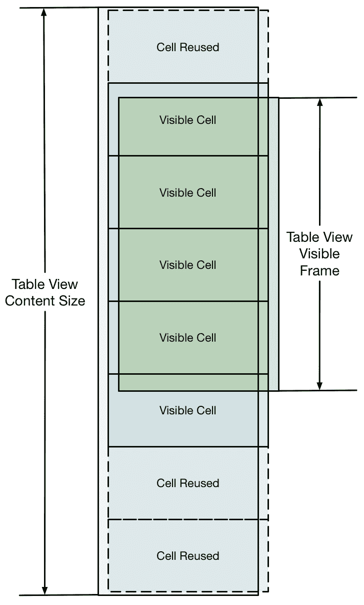

使用 Swift 构建 iOS 应用

在本章中，我们将使用 Swift 和 Xcode IDE 构建我们自己的 iOS 应用。一旦我们构建了我们的应用，我们将探讨如何集成单元测试和 **用户界面**（**UI**）测试。最后，我们将探讨 Swift 和 iOS 开发中的向后兼容性。

在本章中，我们将涵盖以下食谱：

+   使用 Cocoa Touch 构建 iOS 应用

+   使用 XCTest 进行单元和集成测试

+   使用 XCUITest 进行用户界面测试

+   向后兼容性

让我们开始吧！

# 技术要求

对于本章，您需要从 Mac App Store 获取 Xcode 的最新版本。

本章的所有代码都可以在本书的 GitHub 仓库中找到，地址为 [`github.com/PacktPublishing/Swift-Cookbook-Second-Edition/tree/master/Chapter06`](https://github.com/PacktPublishing/Swift-Cookbook-Second-Edition/tree/master/Chapter06)

查看以下视频，了解代码的实际应用：[`bit.ly/3pMG44r`](https://bit.ly/3pMG44r)

# 使用 Cocoa Touch 构建 iOS 应用

本书的核心重点是 Swift 编程语言本身，而不是使用该语言为 Apple 平台生成应用或构建服务器端服务。尽管如此，不能忽视的是，绝大多数正在编写的 Swift 代码是用来构建或基于 iOS 和 iPadOS 应用构建的。

在本食谱中，我们将简要了解如何使用 Swift 与 Apple 的 Cocoa Touch 框架交互，并开始构建和创建我们自己的 iOS 应用。

**Cocoa Touch** 是指作为 iOS SDK 部分提供的 UI 框架集合的名称。其名称来源于 macOS 上的 Cocoa 框架，它为 macOS 应用提供 UI 元素。虽然 macOS 上的 Cocoa 是一个独立的框架，但 Cocoa Touch 是一组提供 iOS 应用 UI 元素并处理应用生命周期的框架；这些框架的核心是 **UIKit**。

## 准备工作

首先，我们需要创建一个新的 iOS 应用项目：

1.  从 Xcode 菜单中选择文件，然后新建。

1.  在打开的对话框中，从 iOS 选项卡中选择 App：


图 6.1 – 选择模板

1.  下一个对话框会要求您输入有关您应用的详细信息，选择产品名称和组织名称，并添加以反向 DNS 风格的组织标识符。

反向 DNS 风格意味着取一个你或你的公司拥有的网站，并反转域名组件的顺序。例如，[`maps.google.com`](http://maps.google.com) 变为 `com.google.maps`：


图 6.2 – 新项目的选项

注意前面的选择，因为并非所有选项都默认选中。对于这个食谱，对我们来说重要的是**界面**和**包含测试**，这两个我们将在本章后面讨论，当我们查看使用 XCTest 进行单元测试和 XCUITest 进行用户界面测试时。

1.  一旦你在 Mac 上选择了保存位置，你将看到以下 Xcode 布局：


图 6.3 – 新项目模板

在这里，我们开始了我们的项目——它并不多，但这是所有新的 iOS 应用开始的地方。

从这个菜单中，按**产品** | **运行**。Xcode 现在将在模拟器中编译并运行你的应用。

## 如何做到这一点...

从之前的食谱继续，我们将基于从 Public GitHub API 返回的数据构建我们的应用：

1.  在文件资源管理器中，点击 Main.storyboard；这个视图是应用外观的表示，被称为界面构建器。目前，只有一个空白屏幕可见，这与我们之前运行应用时的外观相匹配。这个屏幕代表一个`View Controller`对象；正如其名所示，这是一个控制视图的对象。

1.  我们将在表格中显示我们的存储库列表。实际上，我们想要创建一个视图控制器类，它是`UITableViewController`的子类。因此，从菜单中选择文件，然后选择新建，并选择 Cocoa Touch 类模板：


图 6.4 – 新文件模板

1.  我们将在这个视图控制器中显示存储库，所以让我们称它为`ReposTableViewController`。指定它是`UITableViewController`的子类，并确保语言是 Swift：


图 6.5 – 新的文件名和子类

现在我们已经创建了我们的视图控制器类，让我们切换回`Main.storyboard`并删除为我们创建的空白视图控制器。

1.  从对象库中找到表格视图控制器选项，并将其拖入界面构建器编辑器：


图 6.6 – 对象库

1.  现在我们有一个表格视图控制器，我们希望这个控制器成为我们自定义子类的一部分。要做到这一点，选择控制器，进入类检查器，将类类型输入为`ReposTableViewController`，然后按*Enter*：


图 6.7：自定义类检查器

虽然我们有将显示存储库名称的视图控制器，但当用户选择一个存储库时，我们希望展示一个新的视图控制器来显示该特定存储库的详细信息。我们将很快介绍这种类型的视图控制器以及如何展示它，但首先，我们需要一种在视图控制器之间导航的机制。

如果你曾经使用过 iOS 应用，你将熟悉在视图之间导航的标准***推送***和***弹出***方式。以下截图显示了应用在过渡过程中的中间状态：


图 6.8 – 推送和弹出视图控制器

这些视图控制器的管理，以及它们的展示和消失转换，由一个导航控制器处理，这是 Cocoa Touch 以`UINavigationController`的形式提供的。让我们看看：

1.  要将我们的视图控制器放入导航控制器中，在 Interface Builder 中选择`ReposTableViewController`。然后，从 Xcode 菜单中，转到编辑，然后嵌入，并选择导航控制器。

这将在故事板中添加一个导航控制器，并将选定的视图控制器设置为它的根视图控制器（*如果故事板中已经存在一个从最初创建的项目中导入的视图控制器，可以将其突出显示并删除*）。

1.  接下来，我们需要定义当应用启动时屏幕上最初显示哪个视图控制器。在屏幕左侧选择导航控制器，然后在属性检查器中选择“是否为初始视图控制器”。你会看到一条箭头指向左侧的导航控制器，表示它将最初显示。

1.  使用这个设置，我们可以通过从文件导航菜单中选择它来开始工作我们的`ReposTableViewController`。

当我们创建视图控制器时，模板给我们提供了一堆代码，其中一些是注释掉的。模板提供的第一个方法是`viewDidLoad`。这是覆盖视图控制器管理的根视图生命周期的方法集的一部分。关于视图生命周期及其相关方法调用的完整详细信息，可以在[`swiftbook.link/docs/vc-lifecycle`](http://swiftbook.link/docs/vc-lifecycle)找到。

`viewDidLoad`在视图控制器生命周期中非常早的时候被触发，但在视图控制器对用户可见之前。由于这个原因，这是一个配置视图和检索任何你想要向用户展示的信息的好地方。

1.  让我们给视图控制器一个标题：

```swift
class ReposTableViewController: UITableViewController {

    override func viewDidLoad() {
        super.viewDidLoad()

        self.title = "Repos"
    }

    //...
}
```

现在，如果你构建并运行应用，你会看到一个带有我们刚刚通过编程添加的标题的导航栏。

1.  接下来，我们将获取并显示 GitHub 仓库列表。为了获取特定用户的仓库列表，实现以下代码片段：

```swift
@discardableResult   
 internal func fetchRepos(forUsername username: String,
      completionHandler: @escaping (FetchReposResult) -> Void) 
        -> URLSessionDataTask? {

        let urlString = "https://api.github.com/users/\
          (username)/repos"
        guard let url = URL(string: urlString) else {
            return nil
        }
        var request = URLRequest(url: url)
        request.setValue("application/vnd.github.v3+json", 
          forHTTPHeaderField: "Accept")
        let task = session.dataTask(with: request) { (data,
          response, error) in

            // First unwrap the optional data
            guard let data = data else {
                completionHandler(.failure(ResponseError.
                  requestUnsuccessful))
                return
            }

            do {
                let decoder = JSONDecoder()
                let responseObject = try decoder.
                  decode([Repo].self, from: data)

                completionHandler(.success(responseObject))
            } catch {
                completionHandler(.failure(error))
            }
        }
        task.resume()

        return task
    }
```

1.  让我们在文件的顶部添加以下突出显示的代码，在类定义之前。我们还将向视图控制器添加一个会话属性，这是网络请求所需的：

```swift
import UIKit

struct Repo: Codable {
    let name: String?
    let url: URL?

    enum CodingKeys: String, CodingKey {
        case name = "name"
        case url = "html_url"
    }

}

enum FetchReposResult {
    case success([Repo])
    case failure(Error)
}

enum ResponseError: Error {
    case requestUnsuccessful
    case unexpectedResponseStructure }

class ReposTableViewController: UITableViewController {

 internal var session = URLSession.shared

    //...
}
```

你可能会注意到前面的函数有一些不同，因为我们现在正在充分利用 Swift 的**Codable**协议。使用 Codable，我们可以将 API 的 JSON 响应直接映射到我们的结构模型，而无需将其转换为字典，然后迭代每个键值对到一个属性。

1.  接下来，在我们的表格视图中，表格的每一行将显示我们从 GitHub API 检索到的其中一个仓库的名称。我们需要一个地方来存储我们从 API 检索到的仓库：

```swift
class ReposTableViewController: UITableViewController {

   internal var session = URLSession.shared

 internal var repos = [Repo]()

    //...
}
```

`repos` 数组有一个初始为空的数组值，但我们将使用这个属性来存储从 API 获取的结果。

我们现在不需要获取仓库数据。因此，我们将学习如何提供用于表格视图的数据。让我们开始吧：

1.  让我们创建一些假仓库，这样我们就可以暂时填充我们的表格视图：

```swift
class ReposTableViewController: UITableViewController {

    let session = URLSession.shared

    var repos = [Repo]()

    override func viewDidLoad() {
        super.viewDidLoad()

 let repo1 = Repo(name: "Test repo 1", 
   url: URL(string: "http://example.com/repo1")!)
 let repo2 = Repo(name: "Test repo 2", 
   url: URL(string: "http://example.com/repo2")!)
 repos.append(contentsOf: [repo1, repo2])
    }

    //...
}
```

表格视图中的信息是从表格视图的数据源中填充的，这个数据源可以是任何符合 `UITableViewDataSource` 协议的对象。

协议。

当表格视图显示并且用户与之交互时，表格视图将要求数据源提供它需要的信息以填充表格视图。对于简单的表格视图实现，通常控制表格视图的视图控制器充当数据源。实际上，当你创建 `UITableViewController` 的子类时，正如我们所做的那样，视图控制器已经符合 `UITableViewDataSource` 协议，并被分配为表格视图的数据源。

1.  在 `UITableViewDataSource` 中定义的一些方法是在 `UITableViewController` 模板中创建的；我们将查看的三个如下：

```swift
// MARK: - Table view data source
override func numberOfSections(in tableView: UITableView) -> Int {
    // #warning Incomplete implementation, return the number of 
     // sections
    return 0
}

override func tableView(_ tableView: UITableView, 
                        numberOfRowsInSection section: Int) -> Int {
 // #warning Incomplete implementation, return the number of rows
    return 0
}

/*
override func tableView(_ tableView: UITableView, 
   cellForRowAt indexPath: IndexPath) -> UITableViewCell {
     let cell = tableView.dequeueReusableCell(withIdentifier: 
       "RepoCell", for: indexPath)
     // Configure the cell...
     return cell
}
*/
```

表格视图中的数据可以分成多个部分，信息在这些部分中以行形式呈现；信息通过一个由部分整数值和行整数值组成的 `IndexPath` 来引用。

1.  数据源方法首先要求我们提供表格视图将拥有的部分数量。我们的应用将只显示一个简单的仓库列表，因此我们只需要一个部分，所以我们将从这个方法中返回 `1`：

```swift
override func numberOfSections(in tableView: UITableView) -> Int {
   1
}
```

1.  我们接下来必须提供的是表格视图在给定部分中应该有的行数。如果我们有多个部分，我们可以检查提供的部分索引并返回正确的行数，但由于我们只有一个部分，我们可以在所有情况下返回相同的数字。

我们正在显示我们检索到的所有仓库，所以行数简单地就是 `repos` 数组中仓库的数量：

```swift
override func tableView(_ tableView: UITableView, 
  numberOfRowsInSection section: Int) -> Int {
   repos.count
}
```

注意，在前面的两个函数中，我们不再使用 `return` 关键字。这是因为，从 Swift 5.1 开始，你现在可以在函数中使用 ***隐式返回***。只要你的函数没有关于应该返回什么或不应该返回什么的歧义，编译器就可以为你解决这个问题。这允许有更简洁的语法。

现在我们已经告诉了表格视图要显示多少条信息，我们必须能够显示这些信息。表格视图通过一种称为 `UITableViewCell` 的视图类型来显示信息，而这个单元格就是我们接下来需要提供的。

对于我们提供的每个索引路径，包括节和行范围，我们都会被要求提供一个表格视图将要显示的单元格。表格视图可能非常大，因为它可能需要表示大量数据。然而，在任何时候只能向用户显示少量单元格。这是因为表格视图的只有一部分在任何时候是可见的：



图 6.9 – 表格视图单元格概述

为了提高效率并防止用户滚动时应用变慢，表格视图可以重用已经创建但随后移出屏幕的单元格。实现单元格重用分为两个阶段：

+   使用重用标识符将单元格的类型注册到表格视图中。

+   为给定的重用标识符出列单元格。这将返回一个已移出屏幕的单元格，如果没有可重用的单元格，则创建一个新的单元格。

单元格的注册方式取决于其创建方式。如果单元格已创建，并且其子视图也在代码中布局，则通过 `UITableView` 上的此方法将单元格的类注册到表格视图中：

```swift
func register(_ cellClass: AnyClass?, 
              forCellReuseIdentifier identifier: String)
```

如果单元格已在 `.xib` 中布局（通常由于历史原因称为“nib”），这是一个类似于故事板的视图视觉布局文件，则通过 `UITableView` 上的此方法将单元格的 nib 注册到表格视图中：

```swift
func register(_ nib: UINib?, forCellReuseIdentifier identifier: String)
```

最后，可以在表格视图中通过故事板定义和布局单元格。这种方法的优点是不需要像前两种方法那样手动注册单元格；与表格视图注册是免费的。然而，这种方法的缺点是单元格布局与表格视图绑定，因此不能像前两种实现那样在其他表格视图中重用。

让我们在故事板中布局我们的单元格，因为我们只会用它与一个表格视图一起使用：

1.  切换到我们的 `Main.storyboard` 文件，并选择 `ReposTableViewController` 中的表格视图。

1.  在属性检查器中，将原型单元格的数量更改为 `1`；这将向主窗口中的表格视图添加一个单元格。这个单元格将定义将在我们的表格视图中显示的所有单元格的布局。你应该为每种类型的单元格布局创建一个原型单元格；在我们的表格视图中，我们只显示一条信息，所以所有单元格都将具有相同的类型。

1.  在故事板中选择一个单元格。属性检查器将切换到显示单元格的属性。单元格样式将被设置为自定义，通常这正是你想要的。当你想在单元格中显示多个信息时，你通常会创建`UITableViewCell`的子类，在类检查器中将此设置为单元格的类，然后在自定义单元格类型中布局子视图。然而，对于这个例子，我们只想显示仓库的名称。因此，我们可以使用一个基本的单元格样式，它只有一个文本标签，没有自定义子类，所以从样式下拉菜单中选择基本样式。

1.  我们需要设置我们将用于稍后从队列中提取单元格的复用标识符，所以将适当的字符串，例如`RepoCell`，输入到属性检查器的复用标识符框中：


图 6.10 – 表格视图单元格标识符

1.  现在我们有一个已注册用于与表格视图重用的单元格，我们可以回到我们的视图控制器，并完成对`UITableViewDataSource`的遵守。

1.  我们的`ReposTableViewController`包含一些作为模板一部分创建的注释代码：

```swift
/*
override func tableView(_ tableView: UITableView, 
   cellForRowAt indexPath: IndexPath) -> UITableViewCell {
 let cell = tableView.dequeueReusableCell(withIdentifier:  
   "RepoCell", for: indexPath)
 // Configure the cell... return cell
}
*/
```

1.  到目前为止，你可以移除`/* */`注释标记，因为我们已经准备好实现这个方法。

每次表格视图需要将单元格放置在屏幕上时，都会调用此数据源方法；当表格第一次显示时，这就会发生，因为它需要单元格来填充表格视图的可见部分。当用户以某种方式滚动表格视图，从而揭示一个新单元格使其可见时，也会调用此方法。

1.  关于方法定义，我们可以看到我们提供了相关的表格视图和所需单元格的索引路径，我们预计将返回一个`UITableViewCell`。模板提供的代码实际上为我们做了大部分工作；我们只需要提供在故事板中设置的复用标识符，并设置单元格的标题标签，以便我们得到正确的仓库名称：

```swift
override func tableView(_ tableView: UITableView, 
  cellForRowAt indexPath: IndexPath) -> UITableViewCell {
    let cell = tableView.dequeueReusableCell(withIdentifier: 
      "RepoCell", for: indexPath)

    // Configure the cell...
    let repo = repos[indexPath.row]
    cell.textLabel?.text = repo.name

    return cell
}
```

单元的`textLabel`属性是可选的，因为它仅在单元格的样式不是自定义时存在。

1.  由于我们现在已经提供了表格视图显示我们的仓库信息所需的一切，让我们点击构建和运行，看看效果：


图 6.11 – 我们应用的第一次运行

太好了！现在我们已经在我们的表格视图中显示了两个测试仓库，让我们用 GitHub API 的实际仓库替换我们的测试数据。

我们之前添加了`fetchRepos`方法，所以我们只需要调用这个方法，将结果设置到我们的`repos`属性中，并告诉表格视图由于数据已更改，它需要重新加载：

```swift
class ReposTableViewController: UITableViewController {

    internal var session = URLSession.shared
    internal var repos = [Repo]()

    override func viewDidLoad() {
        super.viewDidLoad()

        title = "Repos"

        fetchRepos(forUsername:"SwiftProgrammingCookbook"){ [weak self]
          result in

            switch result {
            case .success(let repos):
                self?.repos = repos

            case .failure(let error):
                self?.repos = []
                print("There was an error: \(error)")
            }
            self?.tableView.reloadData()
        }
    }
    //...
}
```

正如我们在前面的食谱中所做的那样，我们从 GitHub API 获取了仓库，并收到了一个枚举结果，告诉我们这是成功还是失败。如果是成功的，我们将结果仓库数组存储在我们的`repos`属性中。一旦我们处理了响应，我们就在`UITableView`上调用`reloadData`方法，这指示表格视图重新查询其源以获取要显示的单元格。

我们还在闭包的捕获列表中提供了一个对`self`的弱引用，以防止保留周期。你可以在第一章 Swift 构建块的*闭包*食谱中了解更多为什么这很重要。

在这一点上，有一个重要的考虑因素需要解决。iOS 平台是一个多线程环境，这意味着它可以同时做很多事情。这对于保持响应式用户界面，同时能够处理数据和执行长时间运行的任务至关重要。iOS 系统使用队列来管理这项工作，并为涉及用户界面的任何工作保留“主”队列。因此，每次你需要与用户界面交互时，确保这项工作是在主队列中完成的是非常重要的。

我们的`fetchRepos`方法展示了这种情况可能并不总是成立。我们的`fetchRepos`方法执行网络操作，我们在创建`URLSessionDataTask`时向`URLSession`提供了一个闭包，但无法保证这个闭包将在主线程上执行。因此，当我们从`fetchRepos`收到响应时，我们需要将处理该响应的工作“调度”到主队列，以确保我们的 UI 更新发生在主队列上。我们可以使用`Dispatch`框架来做这件事，所以我们需要在文件顶部导入它：

```swift
class ReposTableViewController: UITableViewController {

    let session = URLSession.shared
    var repos = [Repo]()

    override func viewDidLoad() {
        super.viewDidLoad()

        title = "Repos"

        fetchRepos(forUsername:"SwiftProgrammingCookbook"){ [weak self] 
          result in

            DispatchQueue.main.async {

                switch result {
                case .success(let repos):
                    self?.repos = repos

                case .failure(let error):
                    self?.repos = []
                    print("There was an error: \(error)")
                }
                self?.tableView.reloadData()
            }
        }
    }
}
```

我们将在第九章性能和响应性中更深入地讨论多线程和`Dispatch`框架。

1.  点击构建和运行。几秒钟后，表格视图将填充来自 GitHub API 的各种仓库的名称。

现在我们已经向用户展示了仓库，我们将在我们的应用中实现的功能的下一部分是能够点击一个单元格，并在 WebView 中显示仓库的 GitHub 页面。

由表格视图触发的操作，例如当用户点击一个单元格时，会提供给表格视图的代理，这可以是任何符合`UITableViewDelegate`的任何东西。正如表格视图的数据源一样，我们的`ReposTableViewController`已经符合`UITableViewDelegate`，因为它是一个`UITableViewController`的子类。

1.  如果你查看`UITableViewDelegate`协议的文档，你会看到很多可选方法；该文档可以在[`developer.apple.com/reference/uikit/uitableviewdelegate`](https://developer.apple.com/reference/uikit/uitableviewdelegate)找到。与我们目的相关的一个如下：

```swift
 func tableView(_ tableView: UITableView, didSelectRowAt indexPath: 
   IndexPath)
```

1.  这将在用户选择表格视图中的单元格时在表格视图的代理上被调用，所以让我们在我们的视图控制器中实现这个功能：

```swift
override func tableView(_ tableView: UITableView, didSelectRowAt 
  indexPath: IndexPath) {

    let repo = repos[indexPath.row]
    let repoURL = repo.url

    // TODO: Present the repo's URL in a webview
}
```

1.  对于它提供的功能，我们将使用`SFSafariViewController`，传递给它存储库的 URL。然后，我们将该视图控制器传递给`show`方法，该方法将以最合适的方式显示视图控制器：

```swift
override func tableView(_ tableView: UITableView, 
                        didSelectRowAt indexPath: IndexPath) {

    let repo = repos[indexPath.row]
    guard let repoURL = repo.url else { return }    

    let webViewController = SFSafariViewController(url: repoURL)
    show(webViewController, sender: nil)
}
```

1.  不要忘记在文件顶部导入`SafariServices`。

1.  点击构建和运行，一旦加载了存储库，点击其中一个单元格。一个新的视图控制器将被推送到屏幕上，并加载相关的存储库网页。

恭喜你——你刚刚构建了你的第一个应用程序，它看起来很棒！

## 它是如何工作的...

目前，我们的应用程序从特定的硬编码 GitHub 用户名获取存储库。如果用户能够输入将要检索存储库的 GitHub 用户名而不是硬编码用户名，那就太好了。所以，让我们添加这个功能：

1.  首先，我们需要一种方式让用户输入他们的 GitHub 用户名；允许用户输入少量文本的最合适方式是通过使用`UITextField`。

1.  在主故事板中，在对象库中找到文本字段，将其拖动到主窗口，并将其放在我们的`ReposTableViewController`的导航栏上。现在，你需要增加文本字段的宽度。目前，只需通过突出显示相应的文本字段并选择大小检查器选项将其硬编码为大约 300px：


图 6.12 – 添加`UITextField`

与表格视图一样，`UITextField`通过代理与用户事件通信，该代理需要遵守`UITextFieldDelegate`。

1.  让我们切换回`ReposTableViewController`并添加对`UITextFieldDelegate`的遵守；将协议遵守添加到扩展中是一种常见做法，所以在`ReposTableViewController`的底部添加以下内容：

```swift
extension ReposTableViewController: UITextFieldDelegate {

}
```

1.  在此一致性设置完成后，我们需要将我们的视图控制器设置为`UITextField`的代理。回到主故事板，选择文本字段，然后打开连接检查器。你会看到文本字段有一个用于其代理属性的输出。现在，点击、按住并从代表我们的`ReposTableViewController`的代理旁边的圆圈拖动到符号：


图 6.13 – 带有 IBOutlet 的`UITextField`

现在代理输出应该有一个值：


图 6.14 – `UITextField`代理输出

通过查看`UITextFieldDelegate`的文档，我们可以看到当用户在输入文本后按下键盘上的*Return*按钮时，会调用`textFieldShouldReturn`方法，因此这是我们将会实现的方法。

1.  让我们回到我们的`ReposViewController`，并在我们的扩展中实现这个方法：

```swift
extension ReposTableViewController: UITextFieldDelegate {

    public func textFieldShouldReturn(_ textField: UITextField) 
      -> Bool {

    // TODO: Fetch repositories from username entered into text
    // field
 // TODO: Dismiss keyboard

 // Returning true as we want the system to have the default 
   // behaviour
 return true
    }
}
```

1.  由于仓库将在这里而不是在视图加载时获取，所以让我们将代码从`viewDidLoad`移动到这个方法中：

```swift
extension ReposTableViewController: UITextFieldDelegate {

    public func textFieldShouldReturn(_ textField: UITextField) 
     -> Bool {

        // If no username, clear the data
         guard let enteredUsername = textField.text else {
             repos.removeAll()
             tableView.reloadData()
             return true
         }

        // Fetch repositories from username entered into text field
        fetchRepos(forUsername: enteredUsername) { [weak self] 
          result in

                switch result {
                case .success(let repos):
                    self?.repos = repos

                case .failure(let error):
                    self?.repos = []
                    print("There was an error: \(error)")
                }
                DispatchQueue.main.async {
                   self?.tableView.reloadData()
            }
        }

        // TODO: Dismiss keyboard

        // Returning true as we want the system to have the default 
          // behaviour
        return true
    }
}
```

Cocoa Touch 实现了编程设计模式**MVC**，代表**模型-视图-控制器**；这是一种结构化代码的方式，以保持其元素的复用性，并具有明确的职责。在 MVC 模式中，所有与显示信息相关的代码大致分为三个责任区域：

+   **模型**对象持有最终将在屏幕上显示的数据；这可能是从网络或设备检索的数据，或者是在应用运行时生成的数据。这些对象可以在应用中的多个地方使用，可能需要不同的视图表示同一数据。

+   **视图**对象代表屏幕上显示的 UI 元素；这些元素可能只是显示提供的信息，或者从用户那里捕获输入。视图对象可以在需要相同视觉元素的多处使用，即使它们显示的是不同的数据。

+   **控制器**对象在模型和视图之间充当桥梁；它们负责获取相关的模型对象，并在正确的时间将数据提供给正确的视图对象。控制器对象还负责处理来自视图的用户输入，并根据需要更新模型对象：


图 6.15 – MVC 概述

关于显示网页内容，我们的应用为我们提供了许多显示网页内容的选择：

+   由 WebKit 框架提供的`WKWebView`是一个使用最新渲染和 JavaScript 引擎来加载和显示网页内容的视图。虽然它较新，但在某些方面还不够成熟，并且存在缓存内容的问题。

+   由`SafariServices`框架提供的`SFSafariViewController`是一个显示网页内容的视图控制器，它还提供了许多在 Mobile Safari 中可用的功能，包括分享、添加到阅读列表和书签。它还提供了一个方便的按钮，用于在 Mobile Safari 中打开当前网站。

## 还有更多...

我们需要做的最后一件事是关闭键盘。Cocoa Touch 将当前接收用户事件的对象称为第一响应者。目前，这个对象是文本框。

文本框变为第一响应者这一行为导致了屏幕上键盘的出现。因此，要关闭键盘，文本框只需要放弃其第一响应者的位置：

```swift
extension ReposTableViewController: UITextFieldDelegate {

    public func textFieldShouldReturn(_ textField: UITextField) 
      -> Bool {

        //...

        // Dismiss keyboard
        textField.resignFirstResponder()

        // Returning true as we want the system to have the default 
           // behaviour
        return true
    }
}
```

现在，点击“构建和运行”。在这个阶段，你可以在文本框中输入任何 GitHub 账户名称以检索其公共仓库列表。请注意，如果你的 Xcode 模拟器没有启用“软键盘”，你只需在物理键盘上按*Enter*键即可搜索仓库。

## 相关内容

有关本菜谱中涵盖内容的更多信息，请参阅以下链接：

+   **Apple Documentation for GCD**：[`developer.apple.com/documentation/dispatch`](https://developer.apple.com/documentation/dispatch)

+   **Apple Documentation UIKit**：[`developer.apple.com/documentation/uikit`](https://developer.apple.com/documentation/uikit)

# 使用 XCTest 进行单元和集成测试

不言而喻，测试在软件开发生命周期中扮演着重要角色。主要来说，很多关注点都集中在物理用户测试上——将你的代码放入那些日复一日使用它的人手中。在某种程度上，这应该是我们的主要关注点之一，但作为软件开发者，我们如何测试和检查我们的代码库的完整性呢？

这就是单元和集成测试发挥作用的地方。在这个菜谱中，我们将为之前编写的 Cocoa Touch 应用编写单元和集成测试。这将完全使用 Swift 语言和 Xcode IDE 编写。

## 准备工作

回到我们现有的 CocoaTouch 项目中，在**文件检查器**中查找名为`CocoaTouchTest`的文件夹。展开此文件夹并选择`CocoaTouchTests.swift`文件。

在此文件中，你会注意到一个名为`CocoaTouchTests`的类，它继承自`XCTestCase`类。`XCTestCase`提供了一系列函数，我们可以在编写单元测试时使用。

那么，单元测试究竟是什么呢？嗯，它是一个测试（或者在我们的情况下，只是一个函数），用于检查另一个函数是否正在执行其应有的操作。使用`XCTestCase`编写的测试或函数不仅允许我们使用之前提到的辅助工具套件，还允许 Xcode 可视化和报告测试覆盖率等指标。

有了这些，让我们开始编写我们的第一个单元测试！在`CocoaTouchTests.swift`文件中，你会看到一些已经被 Xcode 生成的覆盖函数。现在先忽略这些；当我们需要时再处理它们。

## 如何操作...

让我们先创建以下函数：

```swift
func testThatRepoIsNotNil() {
 XCTAssertNotNil(viewControllerUnderTest?.repos)
}
```

让我们一步一步地来分析这个问题。我们将从`testThatRepoIsNotNil`函数开始。在命名单元测试时，通常要求名称尽可能描述性。根据你的编码标准，你可以选择使用驼峰式命名法或蛇形命名法（我更偏爱驼峰式命名法），但当你使用 Xcode 编写测试时，你总是必须在这些名称前加上“test”这个词。

那么，我们在测试什么呢？在这里，我们正在检查我们的仓库数组是否不为空。

回顾我们的 `ReposTableViewController`，你会记得我们在变量声明的地方实例化了我们的 "repo" 模型，所以这是一个很好的测试开始。假设有人试图将其更改为可选的，就像这样：

```swift
internal var repos: [Repo]?
```

如果发生这种情况，我们的 CocoaTouch App 中的代码将编译，但测试将失败。

让我们再次看看我们的测试。注意，我们用来检查我们的仓库模型的函数是 `viewControllerUnderTest`。这是我们访问我们的 `RepoTableViewContoller` 的方式。我们可以通过在我们的文件中添加以下类级别变量来实现这一点：

```swift
var viewControllerUnderTest: ReposTableViewController?
```

现在，我们需要实例化这个。将以下来自 `XCTestCase` 的覆盖方法添加到你的类中：

```swift
override func setUp() {
    viewControllerUnderTest = ReposTableViewController()
}
```

当运行这个特定类的单元测试时，`setUp()` 将在运行任何测试用例之前执行，这允许你准备你可能需要的东西，比如实例化一个类。一旦测试完成，你想要释放任何东西或关闭任何东西，你只需使用 `tearDown()` 函数来做这件事。

这是一个非常基础的测试，但在这里的主要目的并不是看测试实践，而是看我们如何在 Swift 中做到这一点。然而，在我们继续之前，让我们看看我们可用的 `Assert` 选项。

之前，我们使用了 `XCTAssertNotNil`，这对于我们的场景来说效果完美。然而，以下选项也是可用的：

```swift
XCTAssert
XCTAssertEqual
XCTAssertTrue
XCTAssertGreaterThan
XCTAssertGreaterThanOrEqual
XCTAssertLessThan
XCTAssertLessThanOrEqual
XCTAssertNil
```

这些只是常见的一些，它们相当直观——一个额外的优点是，每个都有一个可选的 "message" 参数，这允许你添加一个自定义字符串。这允许你更具体地说明发生了什么断言（在 CI/CD 世界中报告时理想）。

现在我们已经了解了如何在 Swift 中编写测试的基础知识，我们需要学习如何运行它们。有两种方法可以实现这一点：

1.  首先，我们可以一次性运行我们班级中的所有测试。我们可以通过简单地点击类声明左侧的菱形来实现这一点：


图 6.16 – 类测试用例

1.  如果我们想单独运行测试，我们只需选择我们单个测试用例旁边的图标，就像这样：


图 6.17 – 方法测试用例

如果一切按计划进行并且测试通过，我们会看到图标变成绿色：


图 6.18 – 方法通过测试用例

然而，如果我们的班级中有一个或多个测试失败，我们会看到图标变成红色：


图 6.19 – 方法失败测试用例

或者，*CMD* + *U* 的快捷键也会让 Xcode 运行与主项目关联的任何测试。记住，只有以单词 `test` 开头的函数才会被视为测试用例（不包括类名），所以如果你需要，可以在测试用例中添加一个私有函数。

接下来，让我们看看如何使用模拟数据在 Swift 中测试网络逻辑，以帮助我们：

1.  我们将开始创建以下测试函数：

```swift
 func testThatFetchRepoParsesSuccessfulData() { }
```

1.  让我们先弄清楚我们将如何调用它。再一次，我们将利用我们的 `viewControllerUnderTest` 变量：

```swift
    func testThatFetchRepoParsesSuccessfulData() {
        viewControllerUnderTest?.fetchRepos(forUsername: "", completionHandler: { (response) in
            print("\(response)")
        })
    }
```

这按预期工作，但不幸的是，这并不简单——这会像我们的应用一样调用 API。如果我们想在代码中添加任何 XCAsserts，它们将不会被执行，因为我们的测试和函数已经完成并被拆解，而 API 没有机会响应。

1.  要做到这一点，我们需要在我们的 `viewControllerUnderTest` 中模拟一些对象，从 `URLSession` 和 `URLSessionDataTask` 开始。那么，为什么我们需要模拟这两个呢？让我们先看看我们在 CocoaTouch 应用中使用它们的地方：

```swift
let task = session.dataTask(with: request) { (data, response, error) in
```

在这里，我们通过模拟 `URLSession` 并使用其一个函数 `URLSessionDataTask` 来使用 `URLSession`。我们在这里创建了一个本地会话，然后可以使用它来调用我们的 `MockURLSessionDataTask`。所以，这里真正的疑问是，我们的 `MockURLSessionDataTask` 在做什么？我们使用这个来传递一些模拟数据——我们期望从 API 获得的数据——然后通过我们的逻辑运行这些数据。这保证了每次测试的完整性！

1.  我们可以在自己的文件中创建以下输入，但为了现在，我们只需将其追加到我们的 `CocoaTouchTests.swift` 文件底部。首先，让我们看看我们的 `MockURLSession`：

```swift
class MockURLSession: URLSession {
    override func dataTask(with request: URLRequest, completionHandler: @escaping (Data?, URLResponse?, Error?) -> Void) -> URLSessionDataTask {
        return MockURLSessionDataTask(completionHandler: completionHandler, request: request)
    }
}
```

前面的函数相当直观——我们只是用以下 `MockURLSessionDataTask` 覆盖了 `dataTask()` 函数：

```swift
class MockURLSessionDataTask: URLSessionDataTask {

    var completionHandler: (Data?, URLResponse?, Error?) -> Void
    var request: URLRequest

    init(completionHandler: @escaping (Data?, URLResponse?, Error?) -> Void, request: URLRequest) {
        self.completionHandler = completionHandler
        self.request = request
        super.init()
    }

    var calledResume = false

    override func resume() {
        calledResume = true
    }

}
```

乍一看，这似乎有点复杂，但我们在这里真正做的只是添加我们自己的 `completionHandler`。这将允许它从我们的测试中同步调用（阻止我们的测试失控）。

让我们把所有这些都放在一起，然后回到我们的新测试中：

1.  让我们先为我们的 `viewControllerUnderTest` 设置 `MockURLSession`。这是很棒且简单。现在，逐行添加以下内容：

```swift
func testThatFetchRepoParsesSuccessfulData() {

    viewControllerUnderTest?.session = MockURLSession()

    // ...

}
```

1.  首先，让我们添加我们的主要 `responseObject`。这是我们将要对其执行 XCAsserts 的内容。将其声明为一个可选变量：

```swift
var responseObject: FetchReposResult?
```

1.  现在，我们可以调用我们的函数，就像我们在本节前面尝试做的那样。然而，这次，我们将结果赋给一个变量，并将其转换为 `MockURLSessionDataTask`：

```swift
let result = viewControllerUnderTest?.fetchRepos(forUsername: "", completionHandler: { (response) in
        responseObject = response
    }) as? MockURLSessionDataTask
```

1.  记住，我们可以为 `userName` 变量传递任何我们想要的内容，因为我们不会调用 API。现在，让我们触发我们创建的完成处理程序，并强制通过我们的 `mockData`：

```swift
result?.completionHandler(mockData, nil, nil)
```

我在前面代码中突出显示了 `mockData` 变量，因为我们需要将其添加到我们想要测试的 JSON 响应中。你可以通过简单地访问 GitHub URL 并将其复制到项目中一个新的、**空**文件中来实现这一点。我为我的用户名做了这件事，创建了一个名为 `mock_Data.json` 的文件：


图 6.20 – 添加空文件

记住，当你将文件保存到磁盘时，请选择 CocoaTouch 目标；否则，以下步骤将无法工作。

1.  现在，在我们的`Test`类中创建一个计算属性，它简单地读取文件并输出`Data()`对象：

```swift
var mockData: Data {
    if let path = Bundle.main.path(forResource: "mock_Data", ofType: "json"), let contents = FileManager.default.contents(atPath: path){
        return contents
    }
    return Data()
}
```

1.  到目前为止，我们可以成功地将模拟数据通过我们的`fetchRepos`函数传递，而不需要调用 API。我们现在需要做的就是编写一些断言：

```swift
switch responseObject {
    case .success(let repos):

    // Our test data had 3 repos, lets check that parsed okay
 XCTAssertEqual(repos.count, 9)

    // We know the first repo has a specific name... let's check that
 XCTAssertEqual(repos.first?.name, "aerogear-ios-oauth2")
    default:
    // Anything other than success - failure...
 XCTFail()
}
```

你在这里要测试的内容完全取决于你——它完全基于你选择的测试用例。有时，当你已经编写了一个函数时，思考要测试什么可能是一项艰巨的任务。作为一个开发者，你很容易对项目“过于亲近”。这就是**测试驱动开发**（**TDD**）发挥作用的地方，这是一种在编写任何代码之前先编写测试的方法。让我们看看这个，以及我们可以用它实现什么。

## 它是如何工作的...

测试网络逻辑可能会很麻烦。我发现问题总是出现，比如，你应该测试什么？到底在测试什么？然而，如果你能理解这一点，那么你就已经走上了理解单元测试核心基础的良好道路。

让我们尝试将其分解。我们想要测试的逻辑是我们的`fetchRepos()`函数。这很简单——我们只需用我们知道的一个仓库用户名调用它，并对返回的仓库列表编写一些 XCAsserts。

虽然这现在会工作，但当用户删除一个仓库时会发生什么？你的测试将失败。这不是好事，因为你的逻辑实际上并没有错误——只是数据是错误的，就像如果 API 因为内部服务器错误而返回一些格式不正确的 JSON 一样。这不是你代码的错——这是 API 的错，API 有责任确保它能够正常工作。

你所想要做的只是检查如果服务器给你一个特定的响应，包含特定的数据，你的逻辑会按照它所说的那样去做。那么，我们如何保证从 API 返回的数据的完整性？我们不能——这就是为什么我们模拟数据，并且实际上根本不调用服务。

## 还有更多...

TDD 是一种方法，包括在实际上编写你想要的函数之前先编写单元测试。有些人认为这是编写代码的唯一方法，而有些人则宣传在何时以及仅在必要时使用它。据记录，我属于后者，但我们不是来讨论理论的——我们在这里是为了学习如何使用 XCTest 在 Swift 中实现这一点。

回到我们的 CocoaTouch 应用，假设我们想要编写一个验证 UITextField 中空白字符的函数。执行以下步骤以实现这一点：

1.  我们首先编写一个存根函数，它看起来可能像这样：

```swift
func isUserInputValid(withText text: String) -> Bool {
    return false
}
```

通常，在这里，我会在我的函数中添加关于我想实现什么的注释，但为了 TDD，我们将采取相反的方式。

1.  在`CocoaTouchTests.swift`文件内部，添加以下测试：

```swift
func testThatTextInputValidatesWithSingleWhitespace() {  
}
```

再次强调，以测试名称的字面描述为依据，我们将检查我们的函数是否正确地检测到 `String()` 中间的空白字符。

1.  那么，让我们为当前函数编写一个测试：

```swift
func testThatTextInputValidatesWithSingleWhitespaces() {
    let result = viewControllerUnderTest?.isUserInputValid(withText: "multiple white spaces")
    XCTAssertFalse(result!)
}
```

1.  有了这些，我们很高兴地确认我们在测试用例中设定的所有内容都已得到断言。现在，我们可以继续运行我们的测试。

如预期，我们的测试失败了，这有两个明显的原因。首先，我们并没有真正编写我们的函数，其次，我们将返回类型硬编码为 **false**。

我们实际上故意将返回类型硬编码为 `false`，我们这样做是因为 TDD 方法论分为三个阶段：

1.  **失败测试**：*完成了，我们做到了。*

1.  **通过测试**：*可以像你喜欢的样子一样混乱。*

1.  **重构代码**：*我们可以非常有信心地做到这一点。*

策略是在编写单元测试的同时，涵盖所有可能需要的场景和断言，并使其失败（就像我们做的那样）。

在基础设置完成后，我们现在可以自信地转向我们的函数并编写代码，放心地知道我们能够运行测试来检查我们的函数是否损坏：

```swift
func isUserInputValid(withText text: String) -> Bool {
    return !text.contains(" ")
}
```

这没有什么特别的，但为了本节的目的，它不需要特别处理。使用 Swift 进行 TDD 不必令人畏惧。毕竟，它只是与 XCTest 完美结合的方法论。

## 另请参阅

你可以在 [`developer.apple.com/documentation/xctest`](https://developer.apple.com/documentation/xctest) 找到更多关于**单元测试**的信息。

# 使用 XCUITest 进行用户界面测试

**用户界面**（**UI**）测试已经存在了一段时间。从理论上讲，任何使用、测试或检查应用的人每天都在进行，但在自动化方面，它也受到了不少批评。

然而，使用 Swift 和 XCTest，这从未如此简单，而且关于我们将如何实现这一点有一个惊人的隐藏好处。

## 准备工作

与单元测试不同，当我们测试一个函数、一段逻辑或算法时，用户界面测试正是其字面意义。这是我们测试应用 UI 和 UX 的方式——这些可能并不一定是由程序生成的。

直接前往在创建项目时自动生成的 `CocoaTouchUITests.swift` 文件。同样，就像单元测试一样，你会在其中注意到一些占位符函数。我们将首先查看一个名为 `testExample()` 的函数。

## 如何做到这一点...

考虑到我们在“准备”部分中提到的内容，让我们看看我们的应用并看看我们想测试什么。首先出现在我脑海中的是搜索栏：


图 6.21 – 搜索栏已选中

现在我们已经强制要求填充以使我们的应用工作，我们想确保这一点始终存在，所以让我们为这个编写一个 UI 测试：

```swift
func testExample() throws {
    // UI tests must launch the application that they test.
    let app = XCUIApplication()
    app.launch()
}
```

正如注释正确指出的那样，为了使测试成功，应用程序需要启动，这是由`launch()`函数处理的。然而，一旦我们的应用程序启动，我们如何让它检查 UITextField，更重要的是，一个特定的 UITextField（将来，我们可以在屏幕上有多个）？

要做到这一点，我们必须从基础开始：

1.  我已经编辑了函数的名称，使其更适用于我们在这里进行的测试。正如以下高亮代码所示，我们告诉测试选择`textFields`元素并点击它：

```swift
func testThatUsernameSearchBarIsAvailable() throws {
    let app = XCUIApplication()
    app.launch()
 app.textFields.element.tap()
}
```

1.  点击左边的菱形来运行测试，看看你的应用程序在模拟器中如何生动起来。如果你够快，你会在应用程序关闭前看到光标进入文本框。

太棒了！测试通过了，这意味着你已经编写了你的第一个 UI 测试。

关于我们之前的测试，我们没有具体说明要识别的元素。目前来说，这没问题，但构建一个更大、更复杂的应用程序可能需要你测试特定元素的某些方面。让我们看看我们如何实现这一点：

1.  一种方法是为我们的 UITextField 设置一个可访问性标识符——一个用于可访问性目的的特定标识符，反过来，这将允许我们的 UI 测试识别我们想要测试的控制项。

1.  回到我们的`RepoTableViewController.swift`文件，为相关的 UITextField 对象创建一个`IBOutlet`，并添加以下代码，记得将出口连接到你的 ViewController：

```swift
@IBOutlet weak var usernameTextField: UITextField! {
    didSet {
        usernameTextField.accessibilityIdentifier = 
          "input.textfield.username"
    }
}
```

1.  在设置好这些之后，将我们的通用`UTextField`点击测试注释掉或替换为以下内容：

```swift
app.textFields.element(matching: .textField, identifier: 
  "input.textfield.username").tap()
```

1.  现在，运行你的测试并观察它通过。太棒了！

注意我们正在识别一个`textField`，然后从`textField`中匹配一个控件类型。当我们在应用程序的特定视图中测试嵌套组件时，这种方法将非常有效。例如，你可能想要搜索并匹配一个你知道嵌入在特定的 UIScrollView 中的特定 UIButton：

```swift
app.scrollViews.element(matching: .button, identifier: 
  "action.button.stopscrolling").tap()
```

1.  完成这些后，让我们将测试再进一步。注意我们在元素识别的末尾调用的**`.tap()`**函数。有更多选项可供选择，但我们将从将元素拆分为其自己的变量开始：

```swift
let textField = app.textFields.element(matching: .textField,
  identifier: "input.textfield.username")
```

1.  注意我们已经移除了**`.tap()`**函数。现在，我们可以通过`textField`变量简单地调用这个函数和其他任何可用的函数：

```swift
textField.tap()
textField.typeText("MrChrisBarker")
```

1.  运行这个命令，自己看看效果。现在，如果我们再进一步呢？添加以下行，然后再次运行代码：

```swift
app.keyboards.buttons["return"].tap()
```

希望到这一点，你能够看到我们的方向。需要注意的是，由于我们这里没有模拟数据，我们正在进行一个实时、异步的 API 调用，这取决于你的连接速度或 API，可能会因测试而异。

1.  为了检查结果，我们需要我们的 UI 测试“等待”一个特定元素进入视图。按照设计，我们知道我们期望的是一个带有填充单元格的`UITableView`，因此让我们基于这一点编写我们的测试：

```swift
let tableView = app.tables.staticTexts["XcodeValidateJson"]
XCTAssertTrue(tableView.waitForExistence(timeout: 5))
```

上一段代码的第一行现在应该对我们来说已经很熟悉了——我们正在基于 UITableView 中的单元格构建一个元素（当时我们没有具体指定）来查找具有`XcodeValidateJson`标签的特定单元格。

然后，我们对这个元素执行 XCAssert。为此，我们允许有 5 秒的超时时间来等待这个元素出现。如果它提前出现，测试将通过；如果没有，测试将失败。

## 还有更多...

到目前为止，我们已经看到了如何在与应用交互时使用`.tap()`和**`.typeText()`**等函数。然而，这些并不是`UIButton`到`UITextField`的标准函数。当我们识别控件时，我们得到的返回类型是`XCUIElement()`。

我们有更多选项可以使用来增强我们的 UI 测试，从而允许进行复杂而有价值的自动化测试。让我们看看我们可用的额外选项：

```swift
tap()
doubleTap()
press()
twoFingerTap()
swipeUp()
swipeDown()
swipeLeft()
swipeRight()
pinch()
rotate()
```

每个测试都带有额外的参数，允许你具体化并覆盖应用中用户体验的所有方面（例如，`press()`有一个持续时间参数）。

在本节的开头，我提到 UI 测试带来了一个很大的额外好处，这是我们之前已经看到的东西：可访问性。可访问性是构建移动应用时的重要因素，苹果通过 Xcode 和 Swift 编程语言为我们提供了最好的工具来做这件事。然而，从理论的角度来看，如果你花时间将我们的可访问性构建到你的应用中，你间接地使构建和调整 UI 测试围绕这些标识符变得容易得多——几乎为你完成了 50%的工作——同时包括一个惊人的功能。

或者，编写一个好的 UI 测试可以提高你应用的可访问性，使你在构建应用时一个可以很好地补充另一个变得非常容易。

## 另请参阅

你可以在[`developer.apple.com/documentation/xctest/xcuielement`](https://developer.apple.com/documentation/xctest/xcuielement)找到更多关于**XCUITest**的信息。

# 向后兼容性

向后兼容性是不可避免的。除非你为 iOS 的最新版本构建应用并计划只支持那个版本，否则你将不得不在某个时候处理向后兼容性。在这个菜谱中，我们将看看苹果为构建使用旧版 Swift 构建的 API 提供了什么。

我们还将探讨从 Swift 的先前版本迁移的选项，以及是否以及如何将遗留项目更新到最新版本。

## 如何做到这一点...

我们都希望在我们的应用程序中使用最新的闪亮功能。幸运的是，苹果通过使用 **#available** 检查使我们能够相对容易地处理这个问题。那么，这是怎么工作的呢？好吧，主要来说，它可以在三个层面上工作：在函数级别、在类级别和在内联 API 级别。

让我们从后者开始，看看我们如何在 API 级别做这件事：

1.  这里是一个在 `UIView()` 中设置 `maskedCorners` 的示例：

```swift
UIView().layer.maskedCorners = [.layerMinXMaxYCorner, 
 .layerMaxXMaxYCorner]
```

这对于 iOS 11 及以上版本的 API 是标准的，但如果你支持 iOS 会怎样呢？在一个理想的世界里，你可能只想支持两个 iOS 版本（包括当前版本），但这并不总是可能的。例如，在一些零售应用程序中，你可能需要支持一定比例的现有客户。这种情况在现实世界中也会发生。

因此，如果你的 Xcode 项目已经设置为支持 iOS 10，你实际上会得到一个生成的错误，类似于以下内容：


图 6.22 – 可用 API 错误

1.  点击左侧的红色指示器，你会看到以下选项：


图 6.23 – 可用 API 错误选项

如我们之前提到的，这里有三种选择：对 API 本身添加版本检查、对方法添加检查，或者封装整个类。

1.  点击第一个选项的“修复”。你会看到以下内容：

```swift
if #available(iOS 11.0, *) {
    UIView().layer.maskedCorners = [.layerMinXMaxYCorner, 
      .layerMaxXMaxYCorner]
} else {
    // Fallback on earlier versions
}
```

这里，我们被赋予了编译针对特定 iOS 版本的 API 的选项，允许我们使用该 API，并在需要时使用回退或应急 API。

这是一种很好的方式，可以了解 iOS 所做的最新更改，并保持你的代码库新鲜。然而，这也可能带来一些缺点。例如，如果你针对的 API 是针对特定功能的，你可能会发现自己很难找到一个合适的回退方案（或者更糟，不得不依赖第三方库）。你还必须考虑测试——当你可能只需要对 iOS 的早期版本进行轻量级回归测试时，你实际上可能需要加倍测试努力。现在，你必须确保某些功能在多个版本上进行测试。

1.  接下来，让我们看看**封装实例方法**，它允许我们将整个函数围绕特定的版本检查进行包装：

```swift
@available(iOS 11.0, *)
func availableCheck() {
    UIView().layer.maskedCorners = [.layerMinXMaxYCorner,
      .layerMaxXMaxYCorner]
}
```

如我们所见，我们的函数及其内容保持不变——我们只是用高亮显示的更改装饰了函数。

1.  这一切都很不错，但让我们尝试从其他地方调用这个函数：


图 6.24 – 可用方法错误选项

对了——我们遇到了之前遇到过的同样的问题，但这确实有一些优点。例如，如果你的函数依赖于大量具有较高 API 级别的代码——这将是一个维护和管理代码库的好方法——当需要升级到更高 SDK 支持时，重构就不会成为一项艰巨的任务。

1.  最后的“封装类”选项遵循与方法类似的方法，但这是在类级别发生的。你的类只是这样装饰的：

```swift
@available(iOS 11.0, *)
class ReposTableViewController: UITableViewController { }
```

## 更多内容...

自从 2013 年发布以来，Swift 已经以多种形态和大小出现，每个新版本都提供了更广泛的 API 和稳定性。向开源的转变也在其中发挥了巨大作用，但每次发布从一个版本迁移到另一个版本通常都得到了 Xcode 迁移工具的帮助。

但要小心：你不能简单地拿一个用 Swift 1.1 构建的应用程序，并使用 Xcode 12 将其迁移到 Swift 5.3（尽管这听起来很美好...）。

从 Swift 3.0 开始的每个版本，都允许你通过迁移工具进行迁移。例如，Xcode 9 会让你从**Swift 2.2**迁移到**Swift 3**，Xcode 10 会让你从**Swift 3**迁移到**Swift 4**，依此类推。

这并不意味着你必须使用最新版本的 Xcode 来支持 Swift 的最新版本——升级选项也具有向后兼容性。

例如，我们的 CocoaTouch 项目使用**Swift 5**，但通过 Xcode 的构建设置，可以使用**Swift 4.2**和**Swift 4**的选项：


图 6.25 – 选择 Swift 语言版本选项

如果你需要回溯到更早的版本，你将不得不从苹果开发者门户下载 Xcode 的早期版本。通常情况下，多个版本的 Xcode 可以很好地协同工作，尽管这只有在 Xcode 9 及以后的版本中才真正得到支持——你已经收到警告了。

## 参见

你可以在[`www.javatpoint.com/history-of-swift`](https://www.javatpoint.com/history-of-swift)找到有关**Swift 版本历史**的更多信息。
