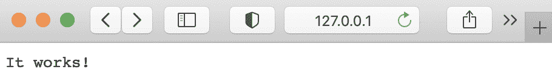
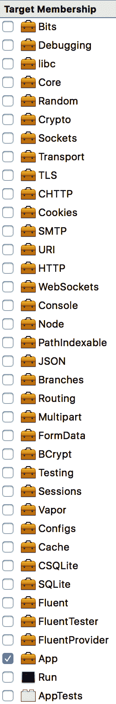
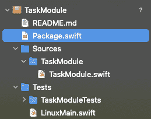
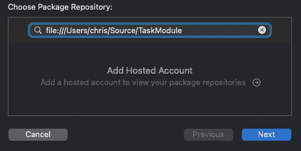
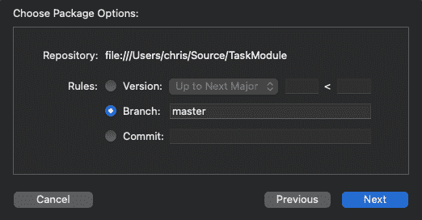

服务器端 Swift

从其诞生之初，Swift 就被设计成一种通用编程语言，适用于多种用例和多个平台，而不仅仅是用于构建 Apple 平台的应用程序。除了构建应用程序之外，另一个明显的用例是创建服务器端代码。毕竟，与服务器交互是几乎所有应用程序的一个关键组成部分。支撑互联网的大多数服务器都运行在 Linux 上，这在某种程度上比任何 Apple 平台更适合这项任务。因此，能够在 Linux 上运行 Swift 对于使 Swift 成为可行的服务器端编程语言选项至关重要。

在本章中，我们将探讨在 Linux 上安装 Swift 工具链，使用 Web 服务器框架构建 REST API，并通过托管服务托管我们的 API。

在本章中，我们将介绍以下食谱：

+   在 Linux 上运行 Swift

+   使用 Vapor 和 Fluent 构建 REST API

+   使用 Fluent 和 Postgres 进行数据库持久化

+   在 Heroku 上托管你的 Vapor 应用程序

+   Swift 包管理器

+   使用 WebSockets 进行实时通信

+   在服务器和应用程序之间打包和共享模型

# 第九章：技术要求

本章的所有代码都可以在这个书的 GitHub 仓库中找到：[`github.com/PacktPublishing/Swift-Cookbook-Second-Edition/tree/master/Chapter08`](https://github.com/PacktPublishing/Swift-Cookbook-Second-Edition/tree/master/Chapter08)

查看以下视频，了解代码的实际应用：[`bit.ly/3kgvhxe`](https://bit.ly/3kgvhxe)

# 在 Linux 上运行 Swift

Linux 操作系统在后台服务器领域是一个主导力量，因此为了在服务器端开发中发挥作用，Swift 需要在 Linux 上可用。幸运的是，Swift 开源发布的一部分包括 Linux 上的 Swift 工具链。让我们通过在 Linux 上的 Swift“Hello World”程序来启动它。

## 入门

这个食谱将使用 Ubuntu 20.04，因为这个 Linux 发行版非常受欢迎且广泛使用，20.04 是最新版的**长期支持**（**LTS**）版本。此外，Swift 开源团队还为这个发行版提供了预构建的二进制文件。作为一名 Mac 用户，我已经在 Ubuntu 的实例上测试了此过程，该实例在 VirtualBox 虚拟化环境中运行，但在裸机上运行时应该没有差异。

## 如何操作...

让我们安装 Swift 工具链并在 Linux 上运行我们的第一个 Swift 代码：

1.  我们需要安装一些与编译器相关的依赖项。如果你使用的是带有**图形用户界面**（**GUI**）的 Ubuntu，请打开一个终端窗口，并在提示符下运行以下命令以更新软件仓库：

```swift
sudo apt-get update
```

1.  运行以下命令以安装 Swift 工具链所需的多个依赖项：

```swift
sudo apt-get install \
 binutils \
 git \
 gnupg2 \
 libc6-dev \
 libcurl4 \
 libedit2 \
 libgcc-9-dev \
 libpython2.7 \
 libsqlite3-0 \
 libstdc++-9-dev \
 libxml2 \
 libz3-dev \
 pkg-config \
 tzdata \
 zlib1g-dev
```

Swift 团队为 Ubuntu 发布了预构建的工具链，因此我们需要下载最新发布的版本和相关`signature`文件。这些发布版本的链接可以在[`swift.org/download/#releases`](https://swift.org/download/#releases)找到。

1.  下载相关平台的工具链和 PGP 签名文件。例如，在撰写本文时，最新的发布版本可以使用以下`wget`命令下载：

```swift
wget https://swift.org/builds/swift-5.3-release/ubuntu2004/swift-5.3-RELEASE/swift-5.3-RELEASE-ubuntu20.04.tar.gz
wget https://swift.org/builds/swift-5.3-release/ubuntu2004/swift-5.3-RELEASE/swift-5.3-RELEASE-ubuntu20.04.tar.gz.sig
```

1.  我们下载的签名文件可以用来验证工具链存档在下载过程中没有被篡改或修改。验证将使用 Swift 项目提供的公共 PGP 密钥与签名文件一起进行。如果您之前还没有这样做，可以使用以下命令检索 PGP 密钥并将它们导入到您的密钥环中：

```swift
wget -q -O - https://swift.org/keys/all-keys.asc | gpg --import -
```

1.  接下来，我们需要检查是否有任何密钥吊销证书：

```swift
gpg --keyserver hkp://pool.sks-keyservers.net --refresh-keys Swift
```

1.  完成所有这些后，我们可以验证下载的工具链存档的完整性（将下面的签名文件名替换为下载的文件名）：

```swift
gpg --verify swift-5.3-RELEASE-ubuntu20.04.tar.gz.sig
```

1.  响应应包含`gpg: Good signature from "Swift 5.x Release Signing Key <swift-infrastructure@swift.org>"`行；如果是这样，存档已成功验证，如果不是，下载可能已被篡改，应从受信任网络上的受信任源检索。

如果它说密钥不是来自受信任的`signature`，请不要惊慌。这是因为系统无法从您的计算机到该密钥找到未中断的证书链；可以忽略此警告。

1.  在验证存档后，让我们解压存档并查看里面有什么（将下面的文件名替换为下载的工具链）：

```swift
tar -xzf swift-5.3-RELEASE-ubuntu20.04.tar.gz
```

在存档中有一个`usr`文件夹，在该文件夹中，有一个`bin`文件夹，其中包含与构建 Swift 相关的多个二进制文件；其中最重要的是`swift`二进制文件。

1.  我们希望仅使用`swift`命令与 Swift 工具链交互；为此，我们需要告诉系统在哪里查找 Swift 二进制文件。使用您首选的文本编辑器打开`~/.profile`，并将包含您的 Swift 工具链的文件夹添加到`$PATH`导出命令中：

```swift
PATH="$HOME/bin:$HOME/.local/bin:<path to extracted swift toolchain>/usr/bin:$PATH"
```

1.  保存你的`.profile`文件。

1.  退出并重新登录以使更改生效。

1.  现在，当您输入`swift`并按*Enter*时，Swift REPL 将启动。它代表**读取-评估-打印循环**（**REPL**）；这是一种以非常快速、简单的方式与 Swift 语言交互的方法，就像游乐场一样。

在 REPL 中，您可以编写 Swift 命令并按*Enter*键执行它们，每个命令都在与上一个命令相同的范围内。

1.  在 REPL 中，输入以下 Swift 表达式：

```swift
let greeting = "Hello world!"
```

1.  按下*Enter*，REPL 将显示您命令的结果，就像游乐场一样：

```swift
greeting: String = "Hello world!"
```

1.  现在我们可以打印我们的问候语：

```swift
print(greeting)
```

我们得到预期的响应：

```swift
Hello world!
```

1.  要离开 REPL 并返回到您的正常命令行，请输入以下内容并按*Enter*：

```swift
:quit
```

恭喜！你刚刚在 Ubuntu Linux 上执行了 Swift 代码。服务器端 Swift 的世界在等待着你。

## 还有更多...

在命令行中尝试 Swift 代码是很好的，但我们真正需要的是将我们的代码编译成一个可执行的二进制文件，我们可以按需运行它。让我们将我们的“Hello world!”示例编译成一个二进制文件：

1.  打开你喜欢的文本编辑器，将以下内容保存到一个名为`HelloWorld.swift`的文件中：

```swift
print("Hello world!")
```

1.  在命令行中，在包含我们的 Swift 文件的文件夹中，我们可以使用`swiftc`编译我们的二进制文件。我们可以指定要编译的文件或文件，并使用`-o`标志为输出二进制文件提供名称：

```swift
swiftc HelloWorld.swift -o HelloWorld
```

1.  现在，我们可以运行这个二进制文件：

```swift
> ./HelloWorld
> Hello world!
```

编译一个文件是很好的，但为了执行任何有用的任务，我们可能需要多个 Swift 文件来定义诸如模型、控制器和其他逻辑等，那么我们如何将它们编译成一个单一的、可执行的二进制文件呢？

当我们有多于一个文件时，我们需要能够在应用入口点定义一个。当编译包含多个文件的 Swift 二进制文件时，其中一个应该被命名为`main.swift`。这个文件作为入口点，所以当二进制文件运行时，`main.swift`文件中的代码会从头到尾执行。

让我们创建两个 Swift 文件，第一个文件命名为`Model.swift`：

```swift
// Model.swift

class Person {
    let name: String
    init(name: String) {
        self.name = name
    }
}
```

接下来，我们将创建`main.swift`文件：

```swift
// main.swift

let keith = Person(name: "Keith")
print("Hello \(keith.name)")
```

现在，让我们将这些两个文件编译成一个名为`Greeter`的二进制文件：

```swift
swiftc Model.swift main.swift -o Greeter
```

这可以被执行：

```swift
> ./Greeter
> Hello Keith!
```

我们现在已经在 Ubuntu 上的 Swift 中编写并编译了一个由多个文件组成的二进制文件。

# 使用 Vapor 和 Fluent 构建 REST API

服务器端 Swift 的主要用例之一是构建 REST API。与网络数据交互是几乎所有应用的关键功能，直到现在，这个服务器端组件必须由具有相关服务器端技能的其他人构建。或者，它要求应用开发者频繁地在编程语言和开发环境之间切换，以构建应用的前端和后端代码。

服务器端的 Swift 为开发者提供了在应用的所有方面工作的可能性，并且可以在客户端和服务器端之间无缝切换。

Swift 团队已经做了很多工作来鼓励在服务器上使用 Swift，包括创建一个新的用于运行服务器的网络框架。这个新的框架被称为 SwiftNIO，并且可以在 GitHub 上以开源的形式获得：[github.com/apple/swift-nio.](https://github.com/apple/swift-nio)

这个框架相当底层，存在许多高级框架，它们使用 Swift 使创建 REST API 变得更加容易。

在这个菜谱中，我们将使用一个更受欢迎的框架，Vapor，来构建一个用于存储用户任务的应用的 REST API。

## 入门

Vapor 是一个用于构建网络服务的 Swift 框架，它使完成常见任务变得非常容易。在撰写本文时，Vapor 处于版本 4，这是与 Swift 5.2 一起要求的。有关 Vapor 的更多信息，请访问其网站：[`vapor.codes.`](http://vapor.codes)

对于这个配方，我们将假设您正在 Mac 上开发 Swift 网络服务，即使它最终可能部署到 Linux 服务器。

当编写将在 Linux 上部署的 Swift 代码时，通过实际上在 Linux 上运行代码来测试您的代码非常重要，尤其是如果它最初是在 macOS 上开发的。Swift 在 macOS 和 Linux 上的操作之间存在重大差异。这些差异通常是由于不同平台对 Foundation 框架的不同实现。

让我们验证我们是否安装了正确的 Swift 版本以运行 Vapor。在终端中运行以下命令以检查您的 Swift 版本：

```swift
swift --version
```

输出应至少指示`版本 5.2`；如果不是这种情况，您需要更新您的 Xcode 版本。

接下来，我们需要安装 Vapor Toolbox，它是一组命令行工具，用于简化与基于 Vapor 的项目的工作。Vapor CLI 可通过 Homebrew 获得，Homebrew 是 macOS 的包管理器。您可以在其网站上找到有关 Homebrew 的更多详细信息：[`brew.sh`](https://brew.sh)[.](https://brew.sh)

在撰写本文时，Homebrew 尚未更新以支持最近发布的 Apple Silicon Macs。如果您使用的是这些 Mac 之一，请访问 Homebrew 网站以获取兼容性信息。

如果您尚未安装 Homebrew，请在终端中运行以下命令：

```swift
/usr/bin/ruby -e "$(curl -fsSL https://raw.githubusercontent.com/Homebrew/install/master/install)"
```

安装 Homebrew 后，我们可以添加 Vapor 的`tap`：

```swift
brew install vapor
```

让我们运行 Vapor 来检查它是否正确安装。您应该会看到如何使用 Vapor 的说明：

```swift
vapor
```

我们现在可以使用 Vapor 来构建我们的 REST API 了。

## 如何做到这一点...

我们将创建一个网络服务来存储和管理来自 iOS 应用的任务：

1.  创建一个名为`TaskAPI`的新 Vapor 项目，然后移动到创建的新文件夹：

```swift
vapor new TaskAPI
cd TaskAPI
```

在此过程中，您将被询问“您想使用 Fluent 吗？”回答“是”。然后您将被询问您想使用哪个数据库。选择**Postgres**（这应该是推荐的选项）。

此外，您将被询问是否想安装**Leaf**。目前选择**否**，因为这稍微超出了本配方的范围。

您可以使用任何 IDE 创建您的 Vapor 网络服务，但我们熟悉使用 Xcode，所以让我们使用它。

1.  Vapor 支持创建包含我们的 Vapor 代码的 Xcode 项目，所以让我们为我们的 Vapor 项目启动 Xcode：

```swift
 vapor xcode
```

Xcode 将打开，项目依赖项将自动获取并出现在项目导航器中的 Swift 包依赖项下。请耐心等待——这可能需要几分钟，您可能一开始看不到任何活动。

一旦所有依赖项都已获取，构建和运行按钮将变为活动状态。

1.  构建并运行项目以启动本地 Web 服务器，该服务器将处理对`http://127.0.0.1:8080`的请求。

1.  在浏览器中打开`http://127.0.0.1:8080`，您将看到以下网页：



图 8.1 – Vapor 项目

它工作了！现在您已经有了您的裸骨 Vapor 项目并正在运行。现在让我们看看 Vapor 为我们创建的 Xcode 项目。

在项目导航器中，您将找到一个名为“源”的组，以及两个子组：运行和应用程序。运行组包含`main.swift`文件，这是您运行应用程序时将执行的文件。应用程序组包含一些用于设置 REST API 的示例代码的多个文件。

打开`main.swift`文件；它将包含以下模板代码：

```swift
import App
import Vapor

var env = try Environment.detect()
try LoggingSystem.bootstrap(from: &env)
let app = Application(env)
defer { app.shutdown() }
try configure(app)
try app.run()
```

您实际上并不需要编辑此文件；它只是执行所需的设置并启动为我们提供 API 的 Web 服务器。我们需要做的是使用此设置过程来配置 Vapor 以提供我们所需的 API。

让我们看看默认 Vapor 模板是如何设置这些内容的。在应用程序组中，打开`configure.swift`文件：

```swift
import Vapor

// configures your application
public func configure(_ app: Application) throws {
    // uncomment to serve files from /Public folder
    // app.middleware.use(FileMiddleware(publicDirectory: 
      // app.directory.publicDirectory))

 if let databaseURL = Environment.get("DATABASE_URL"),
 var postgresConfig = PostgresConfiguration(url: databaseURL) {
 postgresConfig.tlsConfiguration =   
          .forClient(certificateVerification: .none)
 app.databases.use(.postgres(configuration: postgresConfig),
          as: .psql)

 } else {

        app.databases.use(.postgres(
            hostname: Environment.get("DATABASE_HOST") ?? "localhost",
            port: Environment.get("DATABASE_PORT").flatMap(
              Int.init(_:)) ?? PostgresConfiguration.ianaPortNumber,
            username: Environment.get("DATABASE_USERNAME") ?? 
              "vapor_username",
            password: Environment.get("DATABASE_PASSWORD") ?? 
              "vapor_password",
            database: Environment.get("DATABASE_NAME") ?? 
              "vapor_database"
        ), as: .psql)

 }

app.migrations.add(CreateTodo())
    // register routes
    try routes(app)
}
```

在此文件中，我们导入了`Vapor`模块，该模块包含设置和管理 Vapor Web 服务器的所有代码。我们还有我们的数据库代码，但我们会稍后进一步介绍。如果您回顾一下`main.swift`文件，您会看到它导入了`App`模块；这是包含您设置 Web 服务器和管理请求和响应的所有代码的模块。

注意在前面代码中，我突出显示了对最新版本 Vapor 的必要更改，这可能已包含在最新的模板中，如果您不确定，只需将前面的代码从此处复制到您的项目中，或者查看源文件。

接下来，让我们切换到`Routes.swift`文件，我们会看到这是我们的路由配置的地方：

```swift
import Vapor

func routes(_ app: Application) throws {
    app.get { req in
        return "It works!"
    }

    app.get("hello") { req -> String in
        return "Hello, world!"
    }
}
```

路由定义了 Web 服务器可能接收的请求类型以及要发送的响应。

您会注意到定义了`"plaintext"`路径，这是我们访问以确定一切配置正确的 URL：

```swift
app.get("hello") { req -> String in
    return "Hello, world!"
}
```

此路由是为`GET`请求，带有路径字符串参数`plaintext`；当我们的 Vapor 服务器在本地运行时，这与 URL`http://0.0.0.0:8080`相关。在 Vapor 中定义路由的过程涉及提供一个闭包，该闭包接受一个`Request`对象并返回符合`ResponseRepresentable`的对象；Vapor 已经定义了字符串符合`ResponseRepresentable`，因此可以在字符串中返回“Hello, world!”。

如果尚未运行，构建并运行运行方案，并访问`http://0.0.0.0:8080/hello`以查看定义的 JSON。

## 它是如何工作的...

**TaskAPI**将接受包含任务 JSON 表示的 POST 请求中的新任务，并通过`GET`请求返回所有现有任务。

首先，让我们定义一个任务 – 在你的 Xcode 项目的 App 组中，在名为`Models`的新组中创建一个名为`Task.swift`的新文件。

创建此文件后，请确保它是 App 目标的成员，而不是其他任何成员。我们新文件的目标成员面板应如下所示：



图 8.2 – 目标成员

现在，让我们定义我们的任务具有两个属性：`description`和`category`，以及一个标识符：

```swift
class Task { 
 let id: String 
 var description: String
 var category: String

 init(id: String, description: String, category: String) {
 self.id = id
 self.description = description
 self.category = category
 }
}
```

我们现在可以在代码中创建一个`Task`，如下所示：

```swift
let task = Task(id: "1", description: "Remember the milk", category: 
  "shopping")
```

然而，我们将始终从`POST`请求接收到的 JSON 创建我们的`Task`对象，所以能够直接从 JSON 创建我们的`Task`对象将非常有帮助，并且由于我们将返回我们的`Task`对象作为 JSON，所以能够将它们转换为 JSON 也将非常有帮助。

Vapor 有一个名为 Content 的框架，用于处理 JSON 数据。Content 是 Vapor 的`Codable`版本（我们在*第六章，使用 Swift 构建 iOS 应用*)中了解到的）。

我们创建的 Vapor 项目反过来创建了我们将要经历的示例代码。如果你在任何时候遇到困难，只需参考模板对应部分以获取指导，了解你可能出错的地方。

让我们给我们的`Task`模型对象添加`Content`一致性：

```swift
import Foundation
import Vapor

final class Task: Content {

    let id: String = UUID().uuidString

    var description: String
    var category: String

}
```

当我们创建一个新任务时，我们不会期望 JSON 包含标识符，所以如果它缺失，我们可以使用`Foundation`框架生成一个`UUID`。

现在我们有了可以转换为 JSON 并从 JSON 转换的`Task`模型对象，让我们为我们的 API 创建一些路由。

在`Routes.swift`中，我们需要一个`Task`对象的数组来保存创建的任务；目前，我们只需将其添加到文件顶部：

```swift
var tasks = [Task]()
```

接下来，我们将向`routes()`方法添加两个路由：

```swift
app.post("task") { request -> String in
    let task = try request.content.decode(Task.self)
    tasks.append(task)
    return "Task Added"
}

app.get("task") { request in
    return tasks
}
```

在第一个路由中，我们查找对`/task`路径的`POST`请求。如果请求包含 JSON，则我们可以使用它来尝试使用 JSON 创建一个`Task`对象；一旦创建，我们就可以将其存储在`tasks`数组中。

下一个路由查找对同一路径 – `/task` – 的`get`请求，并返回我们存储在数组中的任务的 JSON 表示。这是利用了 Vapor 有一个扩展名为`Sequence`的事实，而`Array`符合`Sequence`，如果`Sequence`中的所有项目都符合`JSONRepresentable`，则`Sequence`也可以表示为 JSON。定义了这些路由后，让我们构建并运行 Run 方案，并测试它们。

我们将添加一个任务，通过向`http://0.0.0.0:8080/task`发送`POST`请求；我们可以使用`curl`命令来做这件事：

```swift
curl -H "Content-Type: application/json" -X POST -d '{"description":"Remember the Eggs","category":"Shopping"}' http://0.0.0.0:8080/task
```

这应该返回我们刚刚创建的任务的 JSON 表示，如下所示，尽管`id`将不同：

```swift
{
  "id": "CEC93BB9-2487-4207-97D8-E41196B44D24",
  "category": "Shopping",
  "description": "Remember the Eggs"
}
```

接下来，让我们测试我们的路由以显示所有现有任务：

```swift
curl http://0.0.0.0:8080/task
```

这应该返回我们创建的一个`Task`数组：

```swift
[
  {
    "id": "CEC93BB9-2487-4207-97D8-E41196B44D24",
    "category": "shopping",
    "description": "Remember the milk"
  }
]
```

现在我们有一个简单的 API 来存储我们的任务。

尝试添加更多任务并检查它们是否从`GET`请求返回。

## 还有更多...

我们迄今为止创建的 API 允许我们在任务上执行一些操作；即创建一个任务和列出所有当前任务。实现这些操作，以及其他如修改、删除和列出单个任务的操作，在构建 REST API 时非常常见，因此 Vapor 使这变得非常简单。

在 Vapor 中，你可以定义一个资源，它将定义所有这些操作是如何执行的，Vapor 会处理遵循 REST API 标准实践的路线设置。

让我们创建一个名为`TaskController.swift`的新文件——这将是我们新的`TaskControllerAPI`，它将负责存放我们的 REST API 响应逻辑，并将允许我们的路由逻辑和业务逻辑之间有一定的分离：

```swift
import Foundation
import Vapor

var tasksByID = [String: Task]()

final class TaskControllerAPI {

    typealias Model = Task

    func getTasks(req: Request) -> [String: Task] {
        return tasksByID
    }

    func createTasks(request: Request) throws -> String {
        let task = try request.content.decode(Task.self)
        tasksByID[task.id] = task
        return "Task Added"
    }

}
```

我们正在将创建的任务存储在字典中，键是任务 ID；这使我们能够轻松检索当 ID 作为 URL 参数传递时。

要创建我们的资源，我们提供函数，为每个我们希望支持的`REST`操作提供响应。这些区域在此列出：

+   `index`

+   `store`

+   `show`

+   `replace`

+   `modify`

+   `destroy`

+   `clear`

+   `aboutItem`

+   `aboutMultiple`

如您从前面的代码中看到的，我们刚刚创建了一些以开始。我们可以根据需要稍后添加其余部分。

现在让我们添加一个扩展，使其符合**RouteCollection**：

```swift
extension TaskControllerAPI: RouteCollection {

    func boot(routes: RoutesBuilder) throws {
        routes.get("task", use: getTasks)
        routes.post("create", use: createTasks)
    }

}
```

这里是我们将针对`TaskControllerAPI`核心逻辑的特定路由提取出来，并按需定义它们的地方。在这里添加了路由代码后，我们不再需要在`Routes.swift`文件中保留这些代码，所以现在就去那里，用以下单行代码替换它们：

```swift
try app.register(collection: TaskControllerAPI())
```

重新运行项目，并测试是否一切仍然按预期工作。让我们创建一个任务：

```swift
curl -H "Content-Type: application/json" -X POST -d '{"description":"Remember the milk","category":"shopping"}' http://0.0.0.0:8080/create
```

然后，获取所有任务以检查我们新创建的任务是否被返回（注意我们如何将 URL 更改为`create`）：

```swift
curl http://0.0.0.0:8080/task
```

我们现在已经创建了一个简单的 REST API 来存储和检索任务。

在下一个菜谱中，我们将在此基础上构建，使其真正有用。

## 参见

更多关于 Vapor 框架的信息可以在其网站上找到：[`vapor.codes`](https://vapor.codes)。

这里有一些其他流行的 Swift 网络框架：

+   Kitura：[`www.kitura.io`](http://www.kitura.io)

+   完美：[`perfect.org`](http://perfect.org)

+   Zewo：[`www.zewo.io`](http://zewo.io/)

# 使用 Fluent 和 Postgres 进行数据库持久性

在我们之前的项目中，只要服务器保持运行，我们的任务编辑器就会工作得很好，但一旦快速重启，我们保存的所有内容都会永远丢失——这就是为什么持久性，尤其是在数据库方面，在软件开发中起着至关重要的作用。

在本节中，我们将继续构建我们的 TaskAPI 项目，添加持久性，以确保我们的数据始终得到保护。

## 准备工作

对于本节，你需要在你的 Mac 上安装 Docker。点击此链接获取有关 Docker 和容器化的信息，以及安装程序的链接：[`www.docker.com/products/docker-desktop`](https://www.docker.com/products/docker-desktop)。

## 如何操作...

首先，我们需要创建我们的数据库。幸运的是，Vapor 可以为我们做这件事：

1.  首先，在 `Migration` 文件夹下创建一个名为 `CreateTasks.swift` 的新文件，并复制以下内容：

```swift
struct CreateTask: Migration {
    func prepare(on database: Database) -> EventLoopFuture<Void> {
        return database.schema("task")
            .id()
            .field("description", .string, .required)
            .field("category", .string, .required)
            .create()
    }

    func revert(on database: Database) -> EventLoopFuture<Void> {
        return database.schema("task").delete()
    }
}
```

注意我们的结构符合 `Migration` – 不要担心，这是正常的。迁移在创建数据库时也会使用。在先前的代码中，我们正在执行以下操作：

+   创建一个名为 `task` 的数据库模式

+   在我们的数据库中创建名为 `"description"`、`"category"` 的字段，以及一个 **ID** 列

就这样，任务完成了。然而，我们需要告诉我们的服务器运行代码并执行迁移（对我们来说是 `create`）。

1.  返回到 `Configure.swift` 并添加以下行：

```swift
app.migrations.add(CreateTask())

try app.autoMigrate().wait()
```

当我们的服务器应用程序启动时，数据库将被创建。不要担心 – Vapor 只会这样做一次，所以如果你的数据库已经存在，它将不会尝试再次创建它。

1.  接下来，我们需要调整我们的代码，以便我们的模型可以持久化到数据库中，将模型中的属性与刚刚创建的字段相匹配。回到 `Task.swift` 文件并做出以下突出显示的更改：

```swift
import Fluent

final class Task: Content, Model {

    static let schema = "task"

    @ID(key: .id)
    var id: UUID?

    @Field(key: "description")
    var description: String

    @Field(key: "category")
    var category: String

    init() { }

    init(id: UUID? = nil, description: String, category: String) {
        self.id = id
        self.description = description
        self.category = category
    }

}
```

我们将在 *如何工作...* 部分稍后介绍这个结构的细节，但你现在只需确保更改已经实施。

1.  接下来，回到我们的 `TaskController.swift` 并进行以下更改：

```swift

final class TaskControllerAPI {

    func index(req: Request) throws -> EventLoopFuture<[Task]> {
        return Task.query(on: req.db).all()
    }

    func create(req: Request) throws -> EventLoopFuture<Task> {
 let task = try req.content.decode(Task.self)
 return task.save(on: req.db).map { task }
    }

    func delete(req: Request) throws -> EventLoopFuture<HTTPStatus> {
 return Task.find(req.parameters.get("taskID"), on: req.db)
 .unwrap(or: Abort(.notFound))
 .flatMap { $0.delete(on: req.db) }
 .transform(to: .ok)
    }

}

extension TaskControllerAPI: RouteCollection {

 func boot(routes: RoutesBuilder) throws {
 let tasks = routes.grouped("tasks")
 tasks.get(use: index)
 tasks.post(use: create)
 tasks.group(":taskID") { task in
 tasks.delete(use: delete)
 }
 }

}

```

我们几乎准备就绪了。现在我们只需要启动并运行我们的数据库实例。我们将通过使用 Docker 容器来实现这一点。

1.  如果你在使用 Mac（你应该在工具栏上有一个代表 Docker 的图标），在终端中输入以下命令：

```swift
$ docker run --name postgres -e POSTGRES_DB=vapor_database \
 -e POSTGRES_USER=vapor_username \
 -e POSTGRES_PASSWORD=vapor_password \
 -p 5432:5432 -d postgres
```

注意它们完美地匹配我们在 `Configure.swift` 文件中的详细信息。请随意根据您的具体需求/约定进行调整。

如果一切顺利，你应在终端中看到以下内容：

```swift
$ Unable to find image 'postgres:latest' locally
$ latest: Pulling from library/postgres
```

这意味着一切顺利。一旦安装完成，我们就准备好启动我们新的改进后的 REST API。从 Xcode 中运行项目。你应该会在 Xcode 的控制台窗口中注意到数据库迁移/创建。

1.  现在已启动，使用我们现有的 cURL 命令向我们的数据库添加多个项目：

```swift
curl -H "Content-Type: application/json" -X POST -d '{"description":"Remember the eggs","category":"shopping"}' http://0.0.0.0:8080/tasks
```

现在，通过 Xcode 重新启动服务器并调用我们的 `get` 请求。你应该能看到我们最近持久化的所有项目的列表。从现在起，你可以继续使用 `put` 和 `delete` 命令以及其他符合 API 标准的命令来更新你的 API。由于本书专注于 Swift 作为编程语言，我们将把这个留给你自己去尝试。

## 如何工作...

我们的 API 现在已经上线并运行，让我们深入探讨一下我们是如何实现持久化的。让我们首先仔细看看我们的`Task.swift`类模型：

```swift
import Fluent

final class Task: Content, Model {

    static let schema = "task"

    @ID(key: .id)
    var id: UUID?

    @Field(key: "description")
    var description: String

    @Field(key: "category")
    var category: String

    init() { }

    init(id: UUID? = nil, description: String, category: String) {
        self.id = id
        self.description = description
        self.category = category
    }

}
```

如你所见，我们的类现在符合 Model 协议——这是 Fluent 框架使用的协议。这允许我们向属性添加属性，以便我们可以将这些属性绑定到数据库中的字段，例如`category`属性：

```swift
@Field(key: "category")
var category: String
```

没有这个，Fluent 将不知道如何绑定它，这会导致持久化失败。另一个额外的优点是我们的属性不绑定到数据库的命名约定；当从零开始时这不是问题，但与遗留系统一起工作时这可能很有帮助。

你还会注意到我们那里的`schema = "task"`常量，这又是我们绑定内部工作的一部分，允许我们的模型仅绑定到特定的数据库模式。

回到我们的`TaskControllerAPI()`类，你会看到我们做的更改引用了一个`.db`属性。让我们来看看这些：

```swift
func create(req: Request) throws -> EventLoopFuture<Task> {
 let task = try req.content.decode(Task.self)
 return task.save(on: req.db).map { task }
}
```

在前面的代码中，我们使用`content`解码我们的数据，将其绑定到我们的模型`(Task())`。我们现在能够对`task`对象执行`.save`操作，因为现在它符合 Fluent 的**Model**。

保存操作是在`req.db`上执行的，然后依次被**.map**(映射)——一旦操作完成并成功，我们可以看到任务被返回（这就是为什么我们在执行 cURL 命令时在输出窗口中看到这个）。

如果你分解前面的内容，语法会更有意义：

```swift
func create(req: Request) throws -> EventLoopFuture<Task> {
    let task = try req.content.decode(Task.self)
    return task.save(on: req.db).map {
        task // Closure here is part of the return function, so will be 
          // passed back up
    }
}
```

对于熟悉 Vapor 中之前实现数据库方式的人来说，你肯定会欣赏这种新的、改进后的设置持久化的方式。

## 参考以下内容

Vapor 提供了一些其他数据库提供程序，可以用作 Postgres 的替代：

+   **MySQL**: [`github.com/vapor/mysql-provider`](https://github.com/vapor/mysql-provider)

+   **SQLite**: [`github.com/vapor-community/sqlite-provider`](https://github.com/vapor-community/sqlite-provider)

+   **Redis**: [`github.com/vapor/redis-provider`](https://github.com/vapor/redis-provider)

+   **Mongo**: [`github.com/vapor-community/mongo-provider`](https://github.com/vapor-community/mongo-provider)

# 在 Heroku 上托管你的 Vapor 应用

在本章前面的示例中，我们创建了一个 REST API，该 API 从 Postgres 数据库存储和检索信息。我们的 Vapor 网络服务器在我们的本地机器上运行，并且可以通过 HTTP 请求与之交互；然而，除非你打算让你的机器对公众互联网开放，否则这用处有限，我们需要找到一个地方来托管我们的数据和 REST 接口。

在撰写本文时，Swift 在托管服务上的支持是例外而不是常态；然而，支持正在增长。Heroku 是一个流行的托管服务，它提供资源的动态扩展和非常简单的部署机制。它还支持 Swift 和 Postgres，因此在本菜谱中，我们将部署我们的 REST API 到 Heroku。

## 入门

Heroku 为您的服务器端项目提供简单且可扩展的基础设施。一旦部署，您的应用实例被称为 Dymos，并且可以启动额外的 Dymos 以应对增加的负载。

将应用部署到 Heroku 是通过远程 Git 仓库完成的。当您准备好部署应用时，只需将代码推送到 Heroku。

首先，访问 [`www.heroku.com`](http://www.heroku.com) 并注册一个免费账户。接下来，我们将安装 Heroku CLI（**命令行界面**），因为这有助于与 Heroku 交互。由于我们在之前的菜谱中安装了 Homebrew，我们可以使用它来获取 Heroku CLI：

```swift
brew install heroku
```

接下来，我们需要使用我们刚刚创建的账户登录到 Heroku CLI。运行 `login` 命令并遵循指示：

```swift
heroku login
```

现在我们已经设置了 Heroku CLI 并准备好使用。

## 如何操作...

由于 Heroku 的部署机制是 Git，我们需要创建一个本地 Git 仓库。

在终端中，导航到包含我们之前菜谱中构建的 `TaskAPI` 应用程序的文件夹，并创建一个本地 Git 仓库：

```swift
git init
```

现在我们需要暂存所有文件：

```swift
git add .
```

然后，提交所有代码：

```swift
git commit -m "Initial commit"
```

接下来，我们将设置这个 Vapor 项目以使用 Heroku 并遵循以下说明：

```swift
vapor heroku init
```

您将被询问是否希望为您的应用提供一个自定义名称。如果您选择不使用自定义应用名称，则将随机分配一个由两个单词和一个数字组成的应用名称；例如，`afternoon-bastion-18185`。因此，应用的 URL 将是 `https://afternoon-bastion-18185.herokuapp.com`。

您还将被询问是否想要提供自定义构建包和自定义可执行名称。您可以对这两个问题都回答“否”。

我们需要将我们的本地 Git 仓库与刚刚创建的 Heroku 应用关联起来。运行以下命令，将最后的参数替换为 Heroku 为您创建的应用名称：

```swift
heroku git:remote -a afternoon-bastion-18185
```

为了在我们的本地机器上运行数据库支持的 API，我们运行了一个 `Postgresql` 服务，并使用 `Config`/`secret` 中的配置 JSON 文件配置了 Vapor 的连接。然而，这个配置仅针对我们的本地机器，因此我们需要在 Heroku 上启动一个 `PostgreSQL` 数据库服务，并配置 Vapor 以连接到它。

幸运的是，Heroku CLI 使得这个过程变得非常简单；只需运行以下命令：

```swift
heroku addons:create heroku-postgresql:hobby-dev
```

在这个命令中，`hobby-dev` 是用于数据库的定价计划，最多支持 10,000 条数据库记录，且免费。

这将使得数据库在你部署应用时对 Heroku Dymo 可用。通过运行 `heroku config`，我们可以看到创建了一个名为 `DATABASE_URL` 的环境变量，其中包含了数据库的连接 URL。

现在，我们需要确保 Vapor 在 Heroku 上运行时知道如何连接到数据库。为此，我们将在 `Procfile` 中添加一个配置，这是 Heroku 用于设置环境所使用的。

在项目的根目录下创建一个名为 `Procfile` 的文件；打开此文件并添加以下内容：

```swift
web: Run serve --env production" --hostname 0.0.0.0 --port \$PORT
```

这将允许 Vapor 使用在 Heroku 上设置的 PostgreSQL 数据库。

现在，让我们提交更改：

```swift
git add . 
git commit -m "Added Procfile with databse URL"
```

现在，我们已经准备好将代码推送到 Heroku，然后它将被部署：

```swift
git push heroku master
```

在撰写本书时 – 有一个针对缺失文件 `LinuxTests.swift` 问题的公开拉取请求，如果 Heroku 在执行上述推送时给你错误，只需创建一个名为 `LinuxTests.swift` 的空文件，然后重新提交并再次推送。

可能需要一段时间，但最终，Heroku 将会报告代码已部署，并提供已部署应用的 URL，其外观将类似于以下这样：

```swift
https://afternoon-bastion-18185.herokuapp.com
```

你有一个在 Heroku 上运行的 `TaskAPI` 部署版本。你可以重新运行上一配方中的所有 cURL 测试，但将前面的主机名替换为 `http://0.0.0.0:8080`。

## 相关内容

我们在本章中构建的只是 Vapor 能力的冰山一角。Vapor 内置了对身份验证、模板化等功能的支持，因此请查看 [`vapor.codes`](http://vapor.codes) 以获取完整的文档。

Vapor 背后的团队推出了自己的托管服务，Vapor Cloud。这极大地简化了将你的 Vapor 应用上线的过程。在撰写本文时，此服务处于公开测试版；你可以在 [`vapor.cloud`](https://vapor.cloud) 获取更多信息并注册。

# Swift 包管理器

依赖包管理在软件开发中已经存在了一段时间 – 能够在不进行任何重大集成的情况下将依赖框架或代码片段添加到你的代码库中，这通常被视为许多人的好处。

如 NuGet 和 NPM 这样的管理器被广泛使用并由社区维护。特别是对于 iOS 开发，CocoaPods 和 Carthage 一直是主要玩家；直到 **Swift Package Manager** 或简称 **SPM** 的引入。

尽管它存在的时间可能比你想象的要长，但最近在 WWDC 2019 上宣布，Xcode 11 将对 Swift 包管理器提供完整的集成支持。

在这个配方中，我们将学习如何使用 Swift 包管理器将依赖项添加到我们的项目中。

## 入门

对于这个项目，我们将继续使用我们最近实现的 Xcode 项目，其中包含了 Fluent 和 Postgres – 你可以在 GitHub 上的示例配方中跟随操作，或者你也可以在磁盘上创建当前项目的副本并从那里开始工作。

## 如何操作...

1.  首先，打开 Xcode 并从文件树中找到以下文件名：

```swift
Package.swift
```

1.  这里，您应该看到以下代码的开始部分：

```swift
import PackageDescription

let package = Package(
    name: "TaskAPI",
    platforms: [
       .macOS(.v10_15)
    ],
 dependencies: [
 // A server-side Swift web framework.
 .package(url: "https://github.com/vapor/vapor.git", from: 
          "4.0.0"),
 .package(url: "https://github.com/vapor/fluent.git", from: 
          "4.0.0"),
 .package(url: "https://github.com/vapor/fluent-postgres-
           driver.git", from: "2.0.0"),
    ],

    // ...

)
```

在先前的代码中，我已突出显示我们的主要关注区域。在这里，我们目前有一份现有依赖项的列表——在我们的案例中，是 Vapor 框架和两个 Fluent 依赖项。

1.  所以让我们再添加一个：

```swift
.package(url: "https://github.com/vapor/vapor.git", from: "4.0.0"),
.package(url: "https://github.com/vapor/fluent.git", from: "4.0.0"),
.package(url: "https://github.com/vapor/fluent-postgres-driver.git", 
  from: "2.0.0"),
.package(url: "https://github.com/Kitura/BlueSocket.git", from: 
  "1.0.0"),
```

1.  给 Xcode 一点时间，它应该开始下载新的依赖项。如果失败，您可以使用以下命令在终端中推动这个过程：

```swift
$ vapor build
```

如果您的包文件有任何错误，您将在这里看到它们。完成后，您将在 Xcode 左侧的文件资源管理器中看到您的新依赖项与现有依赖项并列。

Xcode 还允许您通过 GUI 从 Xcode 添加包依赖项，选择 File | Swift Packages 查看选项列表。不幸的是，这些选项目前仅支持 `.xcproject` 文件（Vapor 不使用此类文件）。

## 它是如何工作的...

因此，我们现在已经添加了我们的框架，SPM 是如何施展魔法的呢？我们将再次查看 `Packages.swift` 文件的依赖项部分：

```swift
.package(url: "https://github.com/vapor/vapor.git", from: "4.0.0"),
.package(url: "https://github.com/vapor/fluent.git", from: "4.0.0"),
.package(url: "https://github.com/vapor/fluent-postgres-driver.git", 
  from: "2.0.0"),
.package(url: "https://github.com/Kitura/BlueSocket.git", from: 
  "1.0.0"),
```

我在这里突出显示了最近添加的两个主要区域——第一个是 URL。与 Cocoapods 和 Carthage 等其他依赖项包类似，SPM 从（或您的）Git 仓库中拉取代码。

不深入探讨包是如何实际制作的，依赖项的版本控制是通过标签完成的。在先前的代码中，我们正在寻找任何从 1.0.0 版本开始的包版本（所以最新的可能是版本 10.2.2，我们无从得知），但我们已经决定至少版本 1.0.0 对我们来说已经足够好了。

但也许我们想要更具体一些。让我们看看我们该如何做到这一点：

```swift
.package(url: "https://github.com/Kitura/BlueSocket.git", .exact("1.2.3")),
```

这里，我们指定我们只想使用 1.2.3 版本。我们正在检查的版本号格式被称为语义版本控制。

这允许我们向我们的包添加额外的条件，例如从特定版本添加 `upToNextMajor` 和 `upToNextMinor`。以下是一个示例：

```swift
  .package(url: "https://github.com/Kitura/BlueSocket.git", 
    .upToNextMajor("1.2.3")),
  .package(url: "https://github.com/Kitura/BlueSocket.git", 
    .upToNextMinor("1.2.3")),
```

`upToNextMajor` 将包括所有版本，直到版本 2.0.0。

`upToNextMinor` 将包括所有版本，直到版本 1.3.0（即 1.2.x）。

更多时候，您实际上并不需要担心这个问题，但当一个框架依赖于其他框架时，有时这确实可以派上用场，以保持项目整洁有序。

## 还有更多...

最后，让我们看看 `Packages.swift` 文件中剩余的代码——让我们从顶部开始：

```swift
// swift-tools-version:5.2
```

虽然这看起来像是被注释掉了，但实际上它在我们的包文件中起着重要作用。在这里，我们正在设置我们的依赖项必须遵守的 Swift 版本。因此，如果一个正在下载的依赖项是用较旧的 Swift 版本构建的并且目前不受支持，SPM 将会通知我们。

另一方面，如果我们的依赖项版本比我们的 Swift 版本新，这也会得到处理。

接下来，让我们看看目标部分。乍一看，你可能会觉得这里发生的事情让你有些不知所措，但实际上它非常简单，对于那些熟悉其他依赖管理工具的人来说，这将是熟悉的领域：

```swift
targets: [
 .target(
 name: "App",
 dependencies: [
 .product(name: "Fluent", package: "fluent"),
 .product(name: "FluentPostgresDriver", package: "fluent-
               postgres-driver"),
 .product(name: "Vapor", package: "vapor")
 ],
        swiftSettings: [
            // Enable better optimizations when building in Release 
              // configuration. Despite the use of
            // the `.unsafeFlags` construct required by SwiftPM, this
              // flag is recommended for Release
            // builds. See <https://github.com/swift-
               // server/guides#building-for-production> for details.
            .unsafeFlags(["-cross-module-optimization"], 
              .when(configuration: .release))
        ]
    )

    // ..

]
```

在前面的代码中，我突出了一些关键区域。第一个是目标列表。我们在这里所做的只是识别我们的一个目标（在我们的例子中是我们的**App**目标）并为该目标添加一个特定的依赖列表。

这些名称是安装后的实际包名——不是 Git URL。这些在项目中的更全局范围内定义，在目标数组之外。在这里，我们只是挑选出应该用于特定目标的。

同样，对于`swiftSettings`也是如此，这是一个我们可以为发布或调试模式设置 Swift 特定优化构建的地方（但通常我们只为发布构建这样做）。

## 参见

更多信息，请参阅以下链接：

+   语义化版本控制：[`semver.org`](https://semver.org)

+   为生产构建：[`github.com/swift-server/guides#building-for-production`](https://github.com/swift-server/guides#building-for-production)

+   CocoaPods：[`cocoapods.org`](https://cocoapods.org)

+   Carthage：[`github.com/Carthage/Carthage`](https://github.com/Carthage/Carthage)

# 使用 WebSocket 进行实时通信

通过 WebSocket 进行通信已经存在很长时间，并在服务器到服务器、服务器到客户端和客户端到服务器通信中扮演着至关重要的角色。WebSocket 允许双方进行开放和持续的通信，从而允许在不需要“轮询”变化的情况下发送和接收数据。

你可能会在聊天窗口中看到 WebSocket 的应用，这是一个在各个设备之间（通常通过服务器）保持持续通信的窗口。把它想象成互联网的“电话线”（这实际上并不离真相太远）。

在本节中，我们将使用之前构建的 Vapor 项目，并与一个配套的 iOS 应用进行实时通信。

## 入门

对于本节，你需要我们上一节完成的项目。请随意继续在 Git 仓库中找到的示例项目上进行工作。

此外，你还需要**TaskAPIApp**项目。

## 如何做到这一点…

首先，让我们转到我们的`Routes.swift`文件，并添加以下内容：

```swift
app.webSocket("talk-back") { req, ws in

}
```

看起来熟悉吗？在这里，我们最终为我们的 WebSocket 创建了一个名为`"talk-back"`的“端点”。当成功连接时，所有数据将通过函数中的`ws`参数接收。但如何拦截它呢？实际上有几个方法。让我们看看：

```swift
app.webSocket("talk-back") { req, ws in

 ws.onText { ws, text in
 print(text)
 }

 ws.onBinary { (ws, buffer) in
 print(buffer)
 }

}
```

当我们的客户端通过 WebSocket 连接到我们的服务器时，它可以发送一系列特定的命令，例如发送纯文本或发送二进制文本。对于这个配方，我们将只使用`onText`。

添加以下代码并运行你的服务器：

```swift
app.webSocket("talk-back") { req, ws in

    ws.onText { ws, text in
 if text.lowercased() == "hello" {
 ws.send("Is it me your are looking for...?")
 }
    }

}
```

因此，本质上，我们在这里所做的是监听来自客户端的消息（任何消息），但如果消息符合我们的特定条件，我们将直接发送响应。

现在，从 GitHub 仓库中，在 Xcode 中启动 **TaskAPIApp** 项目。在这里，你会注意到我们正在使用一个名为 Starscream 的第三方依赖项来使我们的应用成为 WebSocket 客户端——我们本可以自己构建，但这超出了范围，并且对于这个配方来说是不必要的。

有一个需要注意的事项：我们使用了 SPM 来获取 Starscream 依赖项——看看 Xcode 项目，并与我们的 Vapor 项目进行比较，看看它们是如何匹配的！

好的，iOS 应用加载后，检查 `ViewController.swift` 文件，确保 localhost URL 与你的当前设置正确（如果你在跟随操作，它应该是相同的）：

```swift
guard let url = URL(string: "http://127.0.0.1:8080/talk-back") else {
  return }
```

如果你仔细查看 `ViewController.swift` 文件，你会看到以下内容连接到一个 `IBAction`：

```swift
@IBAction func onSendRequest(_ sender: Any) {
    socket.write(string: "Hello")
}
```

我们有通过 WebSocket 连接发送 String 的选项——砰！

启动项目（同时确保你的 Vapor 服务器在本地上运行）并点击按钮。你看到了什么？如果一切顺利，你应该会看到“你在找的是我吗...？”这些字样出现在 `UILabe``l` 中——不错！

## 它是如何工作的...

在 Vapor 中，WebSocket 的行为与路由类似。正如我们之前所说的，我们创建的回话端点的唯一区别是连接是开放的，这里的区别是没有任何额外的调用——我们的服务器不需要重建和重新连接新的 URL 请求，因此没有额外的授权或认证。我们的客户端（就像我们的服务器一样）只是在等待响应。

所有的 WebSocket 调用都是异步的——并且不会像我们在 HTTP 中看到的那样以通常的请求/响应模式回复。然而，这取决于你，客户端或服务器，来管理这个连接，确保它仍然活跃，并随时准备好处理请求。

## 还有更多...

我们之前提到了当从客户端接收消息时，我们可用的 `onText` 和 `onBinary` 函数，但默认情况下，WebSocket 会不断 ping 来确保它们仍然活跃（或存活）。我们可以通过以下函数来监控这些请求：

```swift
ws.onPong { (ws) in }
ws.onPing { (ws) in }
```

或者，我们也可以使用我们的 Vapor 项目来连接 WebSocket：

```swift
WebSocket.connect(to: "ws://talk-back.websocket.org", on: eventLoop) {
  ws in
    print(ws)
}
```

作为客户端连接时发送消息的方式与之前发送消息的方式相同，无论是通过纯文本还是二进制：

```swift
ws.send("Is it me your are looking for...?") // Plain "String" Text
ws.send([1, 2, 3]) // Binary as UIInt
```

虽然发送消息是异步进行的，但有时我们想知道我们的消息是否已成功发送——我们可以使用 `eventLoop` 的承诺来实现：

```swift
let promise = eventLoop.makePromise(of: Void.self)
ws.send("Hello", promise: promise)
promise.futureResult.whenComplete { result in
    // Succeeded or failed to send.
}
```

最后，我们有以下选项来关闭和处理我们的开放 WebSocket 连接：

```swift
ws.close()
ws.close(promise: nil)
ws.onClose.whenComplete { result in
    // Succeeded or failed to close.
}
```

WebSockets 确实是一种打开服务器，以便与客户端建立实时连接的方式。它通常可以用于许多事情，例如仪表板报告和聊天消息。

## 参见

WebSockets: [`docs.vapor.codes/4.0/websockets/`](https://docs.vapor.codes/4.0/websockets/)

# 在服务器和应用程序之间打包和共享模型

服务器端 Swift 被认为是网络应用程序开发者能够直接利用 Swift 编程语言的力量。这，加上其背后的开源社区的力量——即使在它仍被视为婴儿期的情况下——意味着服务器端 Swift 已经是一个值得生产质量的选项。

但其他优势又如何呢？特别是对于现在使用 Swift 构建应用程序的 iOS 开发者来说？除了对语法和特定 API 的了解之外，他们还能从中得到什么好处？

正如我们在本章前面所看到的，随着 Swift 包管理器集成到 Xcode 中，我们现在可以将一些代码构建成一个模块，我们可以在服务器端 Swift 应用程序和 iOS 应用程序中重用它。

## 开始使用

在本节中，我们将继续我们的 Vapor 项目，并继续在 Mac 上使用 Xcode 进行工作。

## 如何做到...

让我们暂时从我们的 Vapor 应用程序中退一步。我们将首先创建一个新的 Swift 包模块。在 Xcode 中，点击 **文件** | **新建** | **Swift 包**——命名为 `TaskModule` 并点击保存。你现在应该会看到一个全新的项目。

如果你查看文件资源管理器，你会看到一些熟悉的文件，例如 `Packages.swift`。我们主要关注位于 Sources 文件夹中的文件——这里将存放你的文件和类，并将作为你想要使用的模块的一部分而增长：



图 8.3 – Sources 文件夹

让我们首先创建一个名为 `TaskViewModel.swift` 的新文件——这个文件将是我们在 Vapor 项目中创建的模型的一个视图模型。

视图模型基本上是一个只包含用于渲染特定视图所需数据的模型，例如，来自服务器的响应模型可能有 20 个属性，包含诸如日期时间戳、创建者等信息，但我们的渲染视图可能只对其中的一小部分信息感兴趣，或者可能想要将一些数据操作或计算成一个单一的属性。

添加以下代码：

```swift
import Foundation

enum Category: String {
    case shopping = "shopping"
    case work = "work"
}

public final class TaskViewModel {

    var category: Category?
    var title: String?

    var imageUrl: URL?

    public convenience init(title: String, category: String) {
        self.init()

        self.category = Category(rawValue: category)
        self.title = title

        self.imageUrl = URL(string: "https://www.test.com/\(category)")

    }

}
```

在前面的代码中，我们构建了一个非常基本的视图模型，一个枚举类，将我们的类别绑定到标题属性的 1-1 匹配，以及一个用于图像 URL 的计算属性。

目前，这段代码可以用于我们的服务器端 Swift 项目或 iOS 应用程序——但我们如何让它两者都能做呢？很简单！因为我们将其创建为一个 Swift 包，我们可以直接将其作为 Swift 包导入。请从 Xcode 中关闭此项目（非常重要）并转到你的 Vapor 应用程序中的 `Packages.swift`。

添加以下突出显示的更改。注意，本地路径必须是你的机器上的路径——这需要指向你的 `Packages.swift` 文件所在的目录：

```swift
dependencies: [
        // A server-side Swift web framework.
    .package(url: "https://github.com/vapor/vapor.git", from: "4.0.0"),
    .package(url: "https://github.com/vapor/fluent.git", from: 
      "4.0.0"),
    .package(url: "https://github.com/vapor/fluent-postgres-
      driver.git", from: "2.0.0"),
 .package(path: "/path/to/your/TaskModule")
],
targets: [
    .target(
        name: "App",
        dependencies: [
            .product(name: "Fluent", package: "fluent"),
            .product(name: "FluentPostgresDriver", package: "fluent-
               postgres-driver"),
            .product(name: "Vapor", package: "vapor"),
 .product(name: "TaskModule", package: "TaskModule"),
],
```

在这里，我们做的就是像之前一样——添加我们的包，然后为我们的特定目标引用包中的模块名称。

给 Xcode 一点时间来获取这个更改，就像魔法一样，你将看到我们最近创建的模块在依赖树中。让我们继续尝试使用它。

目前，让我们将这个内容添加到我们的 `TaskControllerAPI()` 文件中，因为正是在这里我们找到了从响应中绑定我们的原始 **Task** 模型。

我们将开始导入我们的模块：

```swift
import TaskModule
```

如果一切顺利，这应该可以很好地解决。现在让我们尝试访问我们的视图模型：

```swift
let viewTask = TaskViewModel(title: "", category: "")
```

真的是这样简单。现在让我们从另一个角度来看这个问题，看看我们如何在 iOS 应用程序中使用这个相同的模块：

1.  首先，我们需要确保我们的 `TaskModule` 文件夹被初始化为一个 Git 仓库，并且执行了一个初始提交——我很快会解释原因，但现在是简单地执行以下命令在终端中为项目初始化一个仓库：

```swift
$ git init
$ git add .
$ git commit -m "Initial commit"
```

现在打开我们的现有项目，`TaskAPIApp`，在 Xcode 中，选择 **文件** | **Swift** **包** | **添加包依赖**。

你将看到一个 GUI，要求输入 Git 仓库的 URL。由于我们目前是本地的，我们需要以下格式提供：

```swift
file:///Users/chris/Source/TaskModule
```

Xcode 需要一个活动的 Git 仓库来拉取依赖项——所以我们已经在本地上创建了一个，而不是在远程。Xcode 很高兴，并允许我们继续：



图 8.4 - 选择包仓库

下一个屏幕现在应该看起来像这样：



图 8.5 - 选择包选项

指定一个 **分支** 并输入 `master`，然后点击 **下一步**。如果一切顺利，Xcode 应该准备好导入你的依赖项——点击完成。

返回到你的 Xcode 项目，你现在将看到 `TaskModule` 成功导入到你的项目中。让我们确保一切按预期工作。前往你的 `ViewControler.swift` 文件，让我们尝试使用我们的视图模型。

我们将开始导入我们的 `TaskModule`：

```swift
import TaskModule
```

现在我们应该能够从 iOS 代码库的任何地方完美地访问我们的视图模型：

```swift
let _ = TaskViewModel(title: "", category: "")
```

太棒了——我们现在已经在 iOS 和服务器端 Swift 项目中成功创建并重用了我们的视图模型。

## 它是如何工作的...

能够在我们的服务器端 Swift 和 iOS 项目中使用我们的代码的美妙之处并不仅限于视图模型；特定的计算逻辑也可以放在这里，但你必须注意几件事：记住你的服务器端 Swift 项目有 99%的可能性是在 Linux 服务器上运行的，所以像 UIKit 这样的框架将不可用；然而，这也同样适用。

在 Vapor 中，我们的 `Codable` 等价物 `Content` 在我们的 iOS 项目中不可用（因为它在那里根本不需要），所以仔细考虑你想要如何分割和共享你的逻辑。花时间了解你的需求以及开发应用程序时的关注点分离。

除了这些，还有方法可以针对特定的操作系统进行目标定位，我们的应用程序可能在这些操作系统上运行。让我们看看我们如何实现这一点：

```swift
#if os(Linux)
import LinuxModule
#else
import GlobalModule
#endif
```

如果你需要更加具体一些，你可以使用以下方式来识别操作系统：

```swift
#if os(macOS)
#if os(iOS)
#if os(watchOS)
#if os(tvOS)
```

再次强调，如果你在 macOS 上运行你的服务器端 Swift 项目，那么你没问题——但你并没有真正为你的代码提供未来保障，因为你可能会在未来某个时刻发现，在 Linux 服务器上运行你的应用程序将更加经济高效且灵活。

深入了解 Swift 包管理器的工作原理并不像你想象的那么复杂——尽管，我可能要补充一点，它具有非凡的便利性和功能。

对于熟悉 Xcode 中的工作区的人来说，这遵循了一个不太不同的模式——本质上，你的模块是我们之前创建的项目的一个链接。被拉入你项目的代码版本由我们指定的`版本号`、`分支`甚至`提交`来定义。

## 还有更多...

创建一个用于内部使用的包是一回事，但将其分发给他人——无论是在你的组织内部还是社区中——则是另一回事。

这就是为什么将你的包托管在远程 Git 仓库中非常有用。这不仅允许你独立地对包中的更改进行版本控制，而且你可以选择使用私有仓库来管理这些更改，从而实现受控的内部使用。
