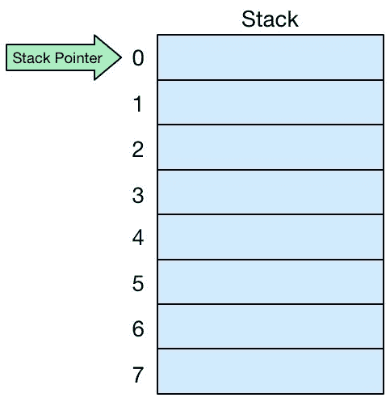
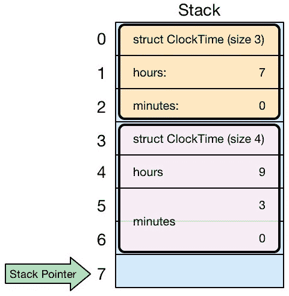
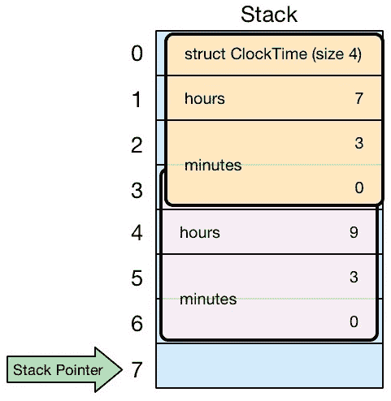
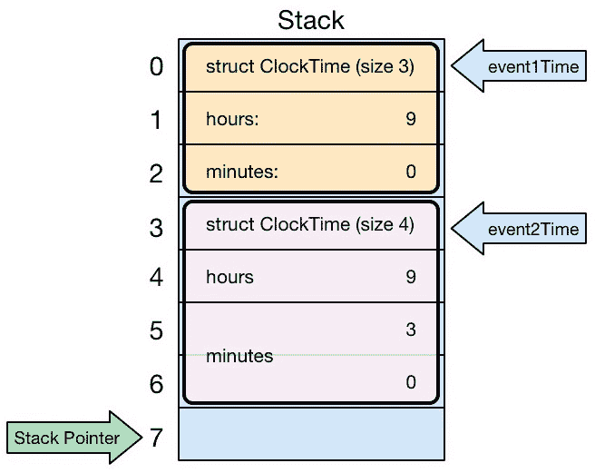
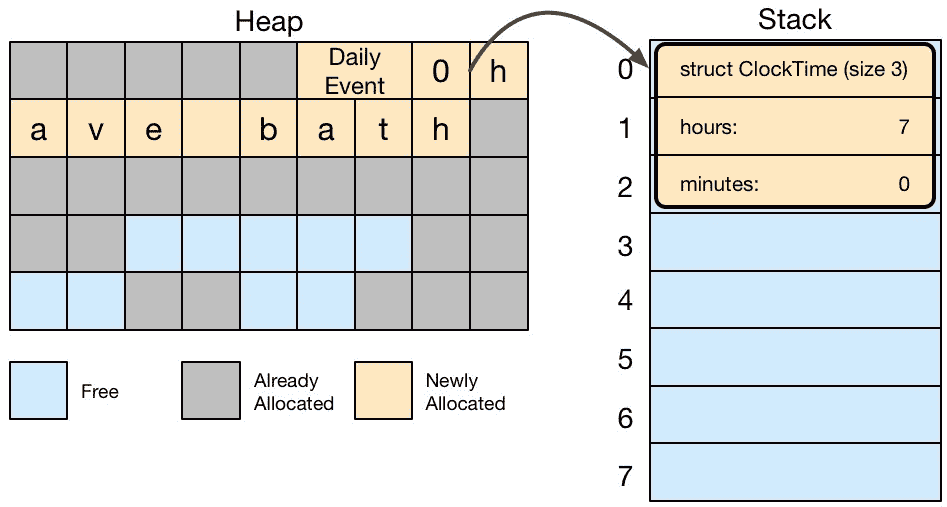
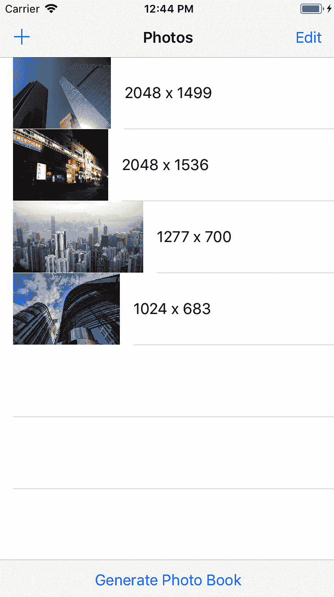
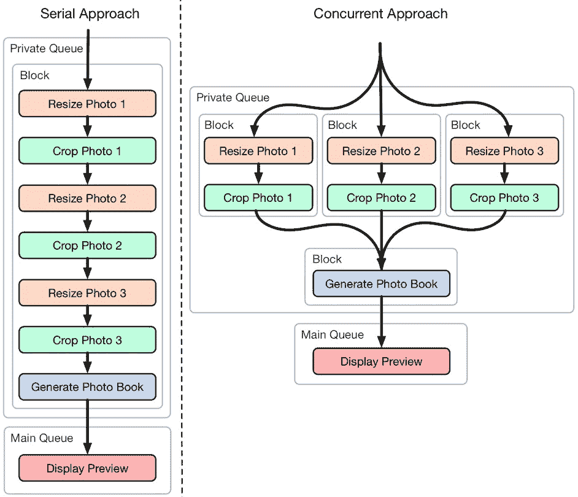
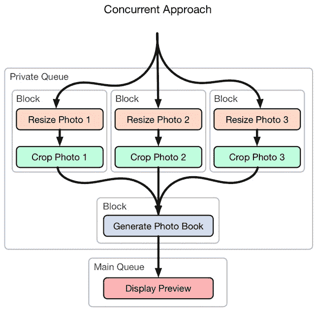
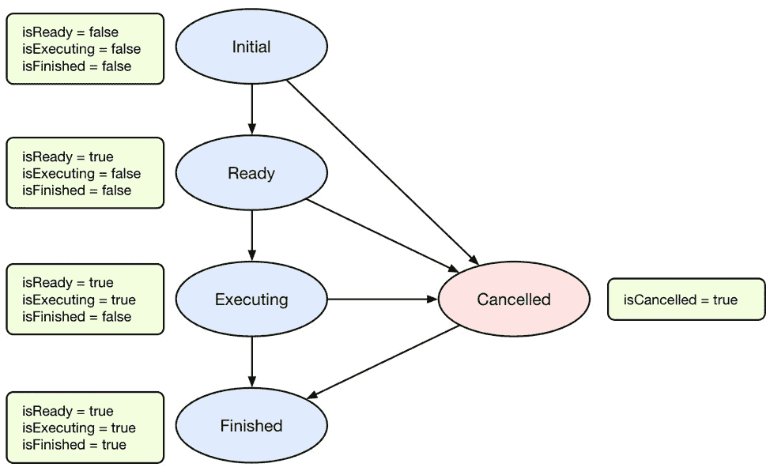

Swift 中的性能和响应性

在前面的章节中，我们已经覆盖了大量的内容，并且我们在工具箱中有许多 Swift 工具。现在是时候深入研究更高级的主题，看看某些 Swift 类型的实现方式，它们的使用方法以及它们的性能特征。我们还将探讨如何通过 Dispatch 框架和基于 GCD 的高层操作在 Foundation 框架中执行异步任务。

理解所有 Apple 平台上可用的多线程环境以及你使用的 Swift 构造的性能特征对于构建快速响应的应用程序至关重要。

在本章中，我们将涵盖以下内容：

+   值和引用语义

+   使用 Dispatch 队列进行并发操作

+   并发队列和调度组

+   实现操作类

# 第十章：技术要求

本章的所有代码都可以在本书的 GitHub 仓库中找到：[`github.com/PacktPublishing/Swift-Cookbook-Second-Edition/tree/master/Chapter09`](https://github.com/PacktPublishing/Swift-Cookbook-Second-Edition/tree/master/Chapter09)

查看以下视频以查看代码的实际操作：[`bit.ly/3bn2l2O`](https://bit.ly/3bn2l2O)

# 值和引用语义

在第一章“Swift 基础”中，我们了解到某些 Swift 类型与其他类型的行为不同，特别是在属性的所有权和修改方面。我们甚至定义了这种差异，指出类是**引用**类型，而结构体和枚举是**值**类型。在本节中，我们将探讨为什么这些类型的行为不同以及这种差异带来的性能影响。

让我们创建一个应用程序的模型，允许用户安排他们每天都会进行的事件，并在这些事件应该发生时提醒他们。

## 准备工作

我们需要决定如何建模我们的日常事件。这个决定的关键在于我们希望我们的事件具有引用语义还是值语义。我们在第一章“Swift 基础”中讨论了这两种语义的区别，但让我们重新审视这些区别。

**值**类型是简单的数据结构，你可以将其视为仅仅是数据包。Swift 通过允许这些类型拥有方法使其更加有用，但任何对底层数据的更改或**修改**都会导致一个全新的数据包。相比之下，**引用**类型是更复杂的数据结构，它们在其组件属性之外具有一个身份。因此，组件属性的任何更改都将通过任何对该对象的引用而可用。

值类型的简单组合在资源创建和维护方面具有非常低廉的优势。然而，这种简单性是以动态调度为代价的，它使得子类化成为可能。

## 如何操作...

给定这种区别，我们希望我们的日常活动有什么行为？如果我们更改事件名称，我们应该期望任何引用它的事物也会看到这种更改吗？这听起来就像是我们想要的行为，所以我们的日常活动应该是一个引用类型：

```swift
class DailyEvent {
    var name: String

    init(name: String) {
        self.name = name
    }
}
```

让我们检查这是否会给我们期望的行为：

```swift
var event1 = DailyEvent(name: "have bath")
var event2 = event1
print("Event 1 - \(event1.name)") // have bath
print("Event 2 - \(event2.name)") // have bath
event1.name = "have shower"
print("Event 1 - \(event1.name)") // have shower
print("Event 2 - \(event2.name)") // have shower
```

我们希望在每天特定时间提醒我们的活动，但就我们的目的而言，`Foundation` 中的 `Date` 确实有点过度，因为它包含了日期和时间信息，而我们只需要维护时间信息。让我们创建一个表示时间的实体，而不考虑日期。我们时间模型最合适的行为什么？它应该具有引用语义还是类型语义？

让我们尝试两种方法，看看哪一种似乎最能准确地模拟我们想要的情况：

1.  我们将创建一个表示时间的类，具有引用语义：

```swift
class ClockTime {
    var hours: Int
    var minutes: Int

    init(hours: Int, minutes: Int) {
        self.hours = hours
        self.minutes = minutes
    }
}
```

1.  现在，让我们看看当其属性更改时，这会如何表现：

```swift
let defaultEventTime = ClockTime(hours: 6, minutes: 30)
var event1Time = defaultEventTime // 6:30
var event2Time = defaultEventTime // 6:30
// Event 2 has been moved to 9:30
event2Time.hours = 9
print("Event 1 - \(event1Time.hours):\(event1Time.minutes)") 
  // Event 1 - 9:30
print("Event 2 - \(event2Time.hours):\(event2Time.minutes)")
  // Event 2 - 9:30
```

当我们更改 `ClockTime` 实例的属性时，它会产生一个意想不到的后果，即更改对该相同 `ClockTime` 实例的所有引用。由于引用语义并不完全适合 `ClockTime`，让我们将其更改为值类型，看看这是否更合适。

1.  现在，Swift 中对于值类型我们有两种选择；我们可以将 `ClockTime` 模型化为 `struct` 或 `enum`。枚举非常适合用于具有少量有限值的概念的建模。虽然一天中有有限分钟的数目，但这不是一个小的数字，我们可能想要对 `ClockTime` 中的小时和分钟进行数学计算，所以 `struct` 更合适：

```swift
struct ClockTime {
    var hours: Int
    var minutes: Int
}
```

1.  让我们看看当我们更改 `ClockTime` 实例的属性时，这会如何改变行为：

```swift
let defaultEventTime = ClockTime(hours: 6, minutes: 30)
var event1Time = defaultEventTime // 6:30
var event2Time = defaultEventTime // 6:30
// Event 2 has been moved to 9:30
event2Time.hours = 9
print("Event 1 - \(event1Time.hours):\(event1Time.minutes)") // Event 1 - 6:30
print("Event 2 - \(event2Time.hours):\(event2Time.minutes)") // Event 2 - 9:30
```

由于 `ClockTime` 是值类型，更改 `ClockTime` 实例的属性会导致创建一个新的实例，因此更改不会产生我们当它是引用类型时所看到的意外后果。

最后，让我们考虑一下，如果我们把 `ClockTime` 作为值类型，我们会放弃的一些动态特性。我们是否想要将 `ClockTime` 作为子类？这似乎不太可能，而且将 `ClockTime` 描述为简单的数据包是合适的。因此，在这种情况下，将 `ClockTime` 模型化为值类型是正确的决定。

1.  为了完成模型，我们将在 `DailyEvent` 类中添加一个 `ClockTime` 属性：

```swift
class DailyEvent {
    var name: String
    var time: ClockTime

    init(name: String, time: ClockTime) {
        self.name = name
        self.time = time
    }
}
```

## 它是如何工作的...

我们已经讨论了值类型与引用类型的不同之处。现在，让我们探讨它们为什么会有不同的行为。

当在内存中存储类型的新的实例时，Swift 有两种不同的数据结构可以用于存储：**栈**和**堆**。这些结构在许多编程语言中都是常见的。值类型存储在**栈**上，而引用类型存储在**堆**上**。即使在我们将要覆盖的表面层次上理解数据在这些结构中的存储方式，也将帮助我们理解为什么值类型和引用类型具有不同的行为。

栈可以被视为数据块序列。一个类型的实例可能由多个数据块表示，并且可以使用其实例的第一块数据的内存位置来引用实例。维护一个**栈指针**，它是对栈末尾内存位置的引用。新实例总是添加到栈的末尾，然后更新栈指针的位置到新的栈末尾。

让我们通过一个简化版的栈图来了解如何添加一个值类型实例。在添加任何内容之前，栈指针位于栈顶：



图 9.1 – 栈和栈指针的表示

为 07:00 添加一个`ClockTime`结构体到栈上。它占用三个块，栈指针移动到栈上的下一个空块：


图 9.2 – 添加 7:00 的 ClockTime 结构体后的栈指针

为 09:30 添加另一个`ClockTime`结构体到栈上。它占用四个块，栈指针移动到栈上的下一个空块：



图 9.3 – 添加 9:30 的 ClockTime 结构体后的栈指针

一旦数据被放置在栈上，它就是不可变的。为了了解为什么这是一个重要的限制，让我们尝试更改栈上的第一个`ClockTime`实例。栈的简单性和效率基于它是一个连续的内存块的事实。如果我们尝试更改栈上已经存在的任何数据，它可能会占用更多空间，这会导致后续块中的数据被覆盖：



图 9.4 – 修改栈上的第一个 ClockTime 实例

因此，对`struct`的任何更改都会在栈底追加一个新的、更改后的`struct`版本。

让我们逐步修改一个`ClockTime`实例，并看看在我们的简化栈表示中它看起来如何：

1.  我们将一个`ClockTime`结构体赋值给名为`event1Time`的变量：

```swift
var event1Time = ClockTime(hours: 9, minutes: 0)
```

以下图表显示了这种可能的外观：


图 9.5 – 将 event1Time 变量赋给 09:00 的 ClockTime 结构体

1.  `event1Time`的值也被赋给一个新的变量，称为`event2Time`：

```swift
var event2Time = event1Time
```


图 9.6 – 将 event1Time 的值赋给 event2Time

1.  当我们修改`event2Time`，将分钟值改为`30`时，一个新的具有更改后的分钟值的`ClockTime`实例被放置在栈底：

```swift
event2Time.minutes = 30
```



图 9.7 – 放置在栈底的新 ClockTime 实例

`event2Time`变量现在指向这个新的栈位置，而`event1Time`继续指向 09:00 的原始`ClockTime`结构体的栈位置。

如前所述的示例所示，栈是一个非常简单且高效的数据结构，其属性解释了当我们使用`struct`和`enums`等值类型时看到的行为。

相比之下，引用类型，如类对象，存储在堆上，这以牺牲效率为代价，使得行为更加动态和复杂。

对堆分配的准确分析超出了本书的范围，但让我们非常简化地看看引用类型实例是如何存储在**堆**上的。堆不是一个连续的块链，而是一个可能空闲或已分配的内存区域：


图 9.8 – 堆的表示

当一个类分配到堆上时，它必须搜索堆以找到适合其大小的空闲块集。引用类型实例可能通过存储它们的栈位置来包含对其他引用类型或值类型的引用：



图 9.9 – 堆中的类分配

多个变量可以持有对同一实例的引用：


图 9.10 – 持有对同一实例引用的多个变量

当引用类型被修改时，它们不会被复制。相反，必须找到额外的空间来容纳额外的信息。所有对实例的引用都有更改后的信息：


图 9.11 – 修改引用类型

这个配方描述了引用语义和值语义之间的区别，并希望说明这些行为源于它们在内存中的存储方式。

它们都有其用途，并且在构建你的模型时选择正确的类型非常重要。

## 参见

**Swift 博客**：值类型和引用类型：[`swiftbook.link/blog/type-semantics`](http://swiftbook.link/blog/type-semantics)

**Apple 开发者视频（需要开发者账户）**：

+   WWDC 2016 - UIKit 应用中的协议和面向值编程：[`developer.apple.com/videos/play/wwdc2016/419`](https://developer.apple.com/videos/play/wwdc2016/419)

# 使用调度队列进行并发

我们生活在一个多核计算的世界。从我们的笔记本电脑、移动电话到我们的手表，到处都可以找到多核处理器。这些多个核心带来了并行工作的能力。这些并行的工作流被称为*线程*，以多线程方式编程可以使你的代码充分利用处理器的核心。决定何时以及如何创建新线程和管理可用资源是复杂任务，因此苹果为我们构建了一个框架来处理这些困难的工作。它被称为*Grand Central Dispatch*。

**Grand Central Dispatch**（**GCD**）负责线程维护并监控可用资源，同时提供了一个简单、基于队列的接口来执行并发工作。随着 Swift 的开放源代码，苹果也将 GCD 以`libdispatch`的形式开源，因为 Swift 还没有内置的并发功能。

在这个菜谱中，我们将探索`libdispatch`的一些特性，也称为调度框架，并看看我们如何使用并发来构建高效且响应迅速的应用程序。

## 准备工作

我们将看到如何使用 GCD 提高应用程序的响应性，因此首先，我们需要从一个需要改进的应用程序开始。访问[`github.com/PacktPublishing/Swift-Cookbook-Second-Edition/tree/master/Chapter09/PhotobookCreator_DispatchGroups`](https://github.com/PacktPublishing/Swift-Cookbook-Second-Edition/tree/master/Chapter09/PhotobookCreator_DispatchGroups)。在这里，你可以找到一个应用程序的仓库，该应用程序将一组照片转换成 PDF 相册。你可以直接从 GitHub 或使用`git`下载应用程序源代码：

```swift
git clone https://github.com/PacktPublishing/Swift-Cookbook-Second-
Edition/tree/master/Chapter09/PhotobookCreator_DispatchGroups/ PhotobookCreator.git
```

如果你构建并运行应用程序，你将看到一系列样本图像，并能够添加更多：



图 9.12 – 样本图像

当你点击生成相册时，应用程序将选择你选择的照片，将它们调整到相同的大小，并将它们保存为可以导出或分享的多页 PDF。根据包含的照片数量和设备的性能，这个过程可能需要一些时间来完成。在这段时间内，整个界面都无响应；例如，你不能滚动图片。

## 如何操作...

让我们分析为什么在生成相册时应用程序会变得无响应，以及我们如何修复这个问题：

1.  打开`PhotoBookCreator`项目并导航到`PhotoCollectionViewController.swift`。在这个文件中，你会找到以下方法：

```swift
func generatePhotoBook(with photos: [UIImage]) {

    let resizer = PhotoResizer()
    let builder = PhotoBookBuilder()

    // Scale down (can take a while)
    var photosForBook = resizer.scaleToSmallest(of: photos)
    // Crop (can take a while)
    photosForBook = resizer.cropToSmallest(of: photosForBook)
    // Generate PDF (can take a while)
    let photobookURL = builder.buildPhotobook(with:  
       photosForBook)

    let previewController = UIDocumentInteractionController(url: 
      photobookURL)
    previewController.delegate = self
    previewController.presentPreview(animated: true)
}
```

在这个方法中，我们调用三个可能需要相当长时间才能完成的函数。我们取一个函数的输出并将其输入到下一个函数中，结果是相册的 URL，然后我们使用一些 UI 来预览和导出。

这个工作，包括调整和裁剪照片，然后生成相册，正在处理 UI 触摸事件的同一个队列中进行，也就是主队列，这就是为什么我们的 UI 变得无响应。

1.  为了释放主队列以处理 UI 事件，我们可以创建自己的私有队列，我们可以使用它来执行我们的长时间运行函数：

```swift
import Dispatch

class PhotoCollectionViewController: UIViewController {
    //...
    let processingQueue = DispatchQueue(label: "Photo processing 
      queue")

    func generatePhotoBook(with photos: [UIImage]) {

        processingQueue.async { [weak self] in

            let resizer = PhotoResizer()
            let builder = PhotoBookBuilder()            

            // Get smallest common size
            let size = resizer.smallestCommonSize(for: photos)

            // Scale down (can take a while)
            var photosForBook = resizer.scaleWithAspectFill(photos, 
              to: size)

            // Crop (can take a while)
            photosForBook = resizer.centerCrop(photosForBook, to: 
              size)
            // Generate PDF (can take a while)
            let pbURL = builder.buildPhotobook(with: photosForBook)

            // Show preview with export options
            let previewController = 
              UIDocumentInteractionController(url: pbURL)

            previewController.delegate = self
            previewController.presentPreview(animated: true)
        }
    }
}
```

通过在我们的 `DispatchQueue` 上调用 `async` 方法并提供一段代码块，我们正在安排该代码块被执行。当资源可用时，GCD 将执行该代码块。现在，我们的长时间运行代码不会阻塞主队列，因此我们的 UI 将保持响应；然而，如果你只运行这个更改后的应用，当应用尝试显示预览视图控制器时，你会得到一些非常奇怪的行为。

我们刚才讨论了 UI 触摸事件被发送到主队列的事实，这就是为什么我们想要避免阻塞它；然而，`UIKit` 预期所有 UI 事件都在主队列上发生。由于我们目前是从我们的私有队列创建和展示预览视图控制器，我们违反了 `UIKit` 的这个预期，这可能导致许多错误，包括 UI 元素永远不会出现，或者出现得比它们展示的时间长得多。

1.  为了解决这个问题，我们需要确保当我们准备好展示我们的 UI 时，我们在主队列上执行这个操作：

```swift
func generatePhotoBook(with photos: [UIImage], using builder:  
  PhotoBookBuilder) {

    processingQueue.async { [weak self] in

        let resizer = PhotoResizer()
        let builder = PhotoBookBuilder()        

        // Get smallest common size
        let size = resizer.smallestCommonSize(for: photos)

        // Scale down (can take a while)
        var photosForBook = resizer.scaleWithAspectFill(photos, to: 
          size)
        // Crop (can take a while)
        photosForBook = resizer.centerCrop(photosForBook, to: size)
        // Generate PDF (can take a while)
        let pbURL = builder.buildPhotobook(with: photosForBook)

        DispatchQueue.main.async {
          // Show preview with export options
          let previewController = UIDocumentInteractionController
            (url: pbURL)
          previewController.delegate = self
          previewController.presentPreview(animated: true)
        }
    }
}
```

现在，如果你运行应用，你会发现你可以在与 UI 交互的同时生成相册；例如，能够滚动表格视图。

## 它是如何工作的...

GCD 使用队列在多线程环境中管理工作代码块。队列按照 **先进先出**（**FIFO**）策略操作。当 GCD 确定资源可用时，它将从队列中取出下一个代码块并执行它。一旦代码块执行完成，它将从队列中移除：


图 9.13 – FIFO 策略

`DispatchQueue` 有两种类型：*串行* 和 *并发*。在队列的最简单形式中，即串行队列，GCD 将一次只从队列顶部执行一个代码块。当每个代码块执行完成时，它将从队列中移除，每个代码块向上移动一个位置。

处理所有 UI 事件的主队列是一个串行队列的例子，这也解释了为什么在主队列上执行长时间运行的操作会导致你的 UI 变得无响应。当你的长时间运行操作正在执行时，主队列上的其他任何操作都不会执行，直到长时间运行的操作完成。

使用第二种类型的队列，即并发队列，GCD 将在允许的资源范围内，在不同的线程上执行尽可能多的代码块。下一个要执行的代码块将是堆栈顶部最近的一个尚未执行的代码块，当代码块执行完成后，它们将从堆栈中移除：


图 9.14 – 添加第二种队列时的执行情况

当你有许多相互独立的操作时，并发队列非常有用。我们将在 *并发队列和调度组* 菜谱中进一步探讨并发队列。

## 参见

+   `libdispatch` 的 GitHub 仓库：[`github.com/apple/swift-corelibs-libdispatch`](https://github.com/apple/swift-corelibs-libdispatch)

+   分发队列的文档：[`swiftbook.link/docs/dispatchqueue`](http://swiftbook.link/docs/dispatchqueue)

# 并发队列和分发组

在上一个菜谱中，我们探讨了使用私有串行队列来通过将长时间运行的操作从主队列中移除来保持我们的应用响应。在本菜谱中，我们将把我们的操作分解成更小、独立的块，并将它们放置在并发队列中。

## 准备工作

我们将在上次菜谱中改进的应用程序的基础上构建，这是一个从照片集合中生成 PDF 照片书的应用程序。您可以在[`github.com/PacktPublishing/Swift-Cookbook-Second-Edition/tree/master/Chapter09`](https://github.com/PacktPublishing/Swift-Cookbook-Second-Edition/tree/master/Chapter09)获取此应用程序的代码，并选择`PhotobookCreator_DispatchGroups`文件夹。

在 XCode 中打开项目，并导航到`PhotoCollectionViewController.swift`文件。

## 如何做到这一点...

在上一个菜谱中，我们看到了分发队列如何按照 FIFO 策略操作。GCD 将执行队列顶部的块，并在执行完成后将其从队列中移除。GCD 允许同时执行的块的数量将取决于所使用的队列类型。*串行*队列在任何时候都只会执行一个代码块；队列中的其他块将不得不等待队列顶部的块执行完毕。然而，对于*并发*队列，GCD 将并发执行尽可能多的块，直到有可用资源。我们可以通过将工作分解成更小、独立的块来更有效地使用并发队列，允许它们并发执行。 

看看`generatePhotoBook`方法的当前实现。自上次菜谱以来，唯一的变化是我们现在在传递给`generatePhotoBook`方法的完成回调中呈现预览 UI。这简化了方法，并防止我们在`async`块中弱捕获`self`：

```swift
func generatePhotoBook(with photos: [UIImage], completion: @escaping 
  (URL) -> Void) {

    processingQueue.async {

        let resizer = PhotoResizer()
        let builder = PhotoBookBuilder()

        // Get smallest common size
        let size = resizer.smallestCommonSize(for: photos)

        // Scale down (can take a while)
        var photosForBook = resizer.scaleWithAspectFill(photos, 
          to: size)
        // Crop (can take a while)
        photosForBook = resizer.centerCrop(photosForBook, to: size)
        // Generate PDF (can take a while)
        let photobookURL = builder.buildPhotobook(with: photosForBook)

        DispatchQueue.main.async {
            // Fire completion handler which will show the preview UI
            completion(photobookURL)
        }
    }
}
```

我们正在执行的工作是在一个代码块中，我们将其放置在队列上。让我们看看我们是否可以将它分解成更小、独立的工作块，这些工作块可以并发执行。我们不能并发执行缩放和裁剪操作，因为它们将操作相同的`UIImage`对象，如果图像在缩放之前被裁剪，我们将不会得到预期的结果。

然而，我们可以分别对每张照片应用缩放和裁剪操作，并在其他照片上并发执行该操作。一旦每张照片都被缩放和裁剪，我们可以使用处理过的图像来生成照片书：



图 9.15 – 串行方法和并发方法

以这种方式分割工作可能不会使整体操作更快，因为每个工作块都有开销。将工作分割成并发块带来的效率提升将取决于涉及的操作以及可以运行的并发操作的数量。

我们现在有可以并发运行的工作块，但我们给自己带来了一个新的问题；我们如何协调所有这些并发工作，以便我们知道它们都已经完成，我们可以开始生成相册？在这里，GCD 可以帮助我们。我们可以使用`DispatchGroup`来协调我们对每个图像的操作，并在它们全部完成时得到通知。

分发组就像体育场的大门。每次有人进入体育场，他们都会通过大门，并且有一个人被计算为在体育场内，到了最后一天，当人们离开体育场并通过大门时，体育场内的人数会减少。一旦体育场内没有人了，就可以关灯了。

让我们使用分发组来协调相册创建者的工作：

1.  首先，我们将创建一个分发组：

```swift
let group = DispatchGroup()
```

1.  每次我们开始一个块来调整照片大小时，我们将进入组：

```swift
group.enter()
```

1.  工作完成后，我们将离开小组：

```swift
group.leave()
```

1.  最后，我们将要求小组在最后一次调整大小操作完成后并离开小组时通知我们。然后，我们可以取走处理过的文件并生成相册：

```swift
group.notify(queue: processingQueue) {
    //.. generate photo book
    //.. execute completion handler
}
```

1.  让我们看看我们的`generatePhotoBook`方法，现在使用并发队列和分发组：

```swift
let processingQueue = DispatchQueue(label: "Photo processing 
  queue", attributes: .concurrent)

func generatePhotoBook(with photos: [UIImage], completion: @escaping 
  (URL) -> Void) {

    let resizer = PhotoResizer()
    let builder = PhotoBookBuilder()

    // Get smallest common size
    let size = resizer.smallestCommonSize(for: photos)

    let processedPhotos = NSMutableArray(array: photos)

    let group = DispatchGroup()

    for (index, photo) in photos.enumerated() {

        group.enter()

        processingQueue.async {

            // Scale down (can take a while)
            var photosForBook = resizer.scaleWithAspectFill(
              [photo], to: size)
            // Crop (can take a while)
            photosForBook = resizer.centerCrop([photo], to: size)

            // Replace original photo with processed photo
            processedPhotos[index] = photosForBook[0]

            group.leave()
        }
    }

    group.notify(queue: processingQueue) {

        guard let photos = processedPhotos as? [UIImage] else { 
          return }

        // Generate PDF (can take a while)
        let photobookURL = builder.buildPhotobook(with: photos)

        DispatchQueue.main.async {
            completion(photobookURL)
        }
    }
}
```

## 它是如何工作的...

分发队列默认是串行的，因此要创建一个并发队列，我们可以在创建时传递`.concurrent`属性：

```swift
let processingQueue = DispatchQueue(label: "Photo processing queue", 
                                    attributes: .concurrent)
```

在我们遍历所有照片之前，我们设置任何不是针对每张照片的特定内容：

```swift
let resizer = PhotoResizer()
let builder = PhotoBookBuilder()
// Get smallest common size
let size = resizer.smallestCommonSize(for: photos)
let processedPhotos = NSMutableArray(array: photos)
let group = DispatchGroup()
```

这包括创建`DispatchGroup`，我们将用它来协调工作。由于我们的照片调整大小现在将并发进行，我们需要一个地方来收集处理过的照片。我们可以使用 Swift 数组来做到这一点；然而，Swift 数组是一个值类型，所以我们不能在多个块中使用它，因为每个块都会复制数组，而不是原始数组本身。

要用 Swift 数组解决这个问题，我们需要在视图控制器中将`processedPhotos`数组属性设置为，这意味着我们必须在需要解包的块中弱捕获 self。解决这个问题的更简单的方法是使用具有引用语义的集合；`Foundation`框架以`NSArray`和`NSMutableArray`的形式提供这种语义。正如我们在本章前面所看到的，理解正在使用的构造的语义并选择合适的工具来完成工作是很重要的：

```swift
for (index, photo) in photos.enumerated() {

    group.enter()

    processingQueue.async {

        // Scale down (can take a while)
        var photosForBook = resizer.scaleWithAspectFill([photo], 
          to: size)
        // Crop (can take a while)
        photosForBook = resizer.centerCrop([photo], to: size)

        // Replace original photo with processed photo
        processedPhotos[index] = photosForBook[0]

        group.leave()
    }
}
```

对于每张照片，我们进入组，并将缩放工作放在并发队列上。我们可以使用之前使用的相同的缩放和裁剪方法，只需传递包含一张照片的数组。一旦工作完成，我们将用处理过的照片替换数组中的原始照片，并离开组。

一旦每个块都离开组，这个`notify`块将执行。我们检索处理过的照片，并使用它们来生成照片簿。最后，我们确保完成处理程序在主队列上执行：

```swift
group.notify(queue: processingQueue) {

    guard let photos = processedPhotos as? [UIImage] else { return }

    // Generate PDF (can take a while)
    let photobookURL = builder.buildPhotobook(with: photos)

    DispatchQueue.main.async {
        completion(photobookURL)
    }
}
```

如果你构建并运行应用程序，你仍然可以生成照片簿，UI 仍然响应，现在 GCD 可以最好地利用可用资源来生成我们的照片簿。

## 相关内容

+   与派发队列相关的文档：[`swiftbook.link/docs/dispatchqueue`](http://swiftbook.link/docs/dispatchqueue)

+   与派发组相关的文档：[`swiftbook.link/docs/dispatchgroup`](http://swiftbook.link/docs/dispatchgroup)

# 实现操作类

到目前为止，我们将长时间运行的操作作为代码块，称为**闭包**，在派发队列上进行调度。这使得将长时间运行代码从主队列中移除变得非常容易，但如果我们的意图是重用这段长时间运行的代码，传递它，跟踪其状态，并以面向对象的方式处理它，闭包并不是理想的选择。

为了解决这个问题，`Foundation`框架提供了一个名为`Operation`的对象，它允许我们将工作块封装在一个封装的对象中。

在这个菜谱中，我们将使用本章中使用的照片簿应用程序，并将我们的长时间运行代码块转换为`Operation`实例。

## 准备工作

我们将在上一个菜谱中改进的应用程序的基础上进行构建，这是一个从照片集合生成 PDF 照片簿的应用程序。你可以在这个应用程序的代码在[`github.com/PacktPublishing/Swift-Cookbook-Second-Edition/tree/master/Chapter09`](https://github.com/PacktPublishing/Swift-Cookbook-Second-Edition/tree/master/Chapter09)中找到，并选择`PhotobookCreator_StartOperations`文件夹。

打开文件夹并导航到`PhotoCollectionViewController.swift`文件。

## 如何做到这一点...

让我们回顾一下我们如何将工作分解成独立的部分：



图 9.16 – 并发方法块

我们可以将这些工作块中的每一个转换成单独的操作：

1.  让我们创建一个操作来缩放和裁剪每张照片。

1.  我们通过子类化`Operation`类来定义一个操作，因此在这个项目中，创建一个新的 Swift 文件，并将其命名为`PhotoResizeOperation.swift`。

1.  在最简单的`操作`实现中，我们只需要重写一个方法，即`main()`方法，因此让我们从我们的`generatePhotobook`方法中复制并粘贴相关代码。这个`main()`方法将在操作开始时执行：

```swift
import UIKit

class PhotoResizeOperation: Operation {

    override func main() {

        // Scale down (can take a while)
        var photosForBook = resizer.scaleWithAspectFill([photo], 
          to: size)
        // Crop (can take a while)
        photosForBook = resizer.centerCrop([photo], to: size)

        // Replace original photo with processed photo
        processedPhotos[index] = photosForBook[0]
    }
}
```

1.  仅复制和粘贴代码是不够的，因为之前有一些依赖项被代码块捕获。现在我们必须明确地提供这些依赖项给操作：

```swift
class PhotoResizeOperation: Operation {

    let resizer: PhotoResizer
    let size: CGSize
    let photos: NSMutableArray
    let photoIndex: Int

    init(resizer: PhotoResizer, size: CGSize, 
         photos: NSMutableArray, photoIndex: Int) {

        self.resizer = resizer
        self.size = size
        self.photos = photos
        self.photoIndex = photoIndex
    }

    override func main() {

        // Retrieve the photo to be resized.
        guard let photo = photos[photoIndex] as? UIImage else { 
          return }

        // Scale down (can take a while)
        var photosForBook = resizer.scaleWithAspectFill([photo], 
          to: size)
        // Crop (can take a while)
        photosForBook = resizer.centerCrop(photosForBook, to: size)

        photos[photoIndex] = photosForBook[0]
    }
}
```

1.  我们已经将调整大小的代码块转换成了操作。现在我们需要对生成照片书的代码块做同样的处理：

```swift
import UIKit

class GeneratePhotoBookOperation: Operation {

    let builder: PhotoBookBuilder
    let photos: NSMutableArray
    var photobookURL: URL?

    init(builder: PhotoBookBuilder, photos: NSMutableArray) {
        self.builder = builder
        self.photos = photos
    }

    override func main() {

        guard let photos = photos as? [UIImage] else { return }

        // Generate PDF (can take a while)
        photobookURL = builder.buildPhotobook(with: photos)
    }
}
```

我们将依赖项传递给操作，就像在`PhotoResizeOperation`中一样。这个操作的输出是一个结果照片书的 URL。我们将其作为操作的属性公开，以便可以在操作外部检索。

1.  在将我们的工作代码块转换为操作后，让我们切换到`PhotoCollectionViewController.swift`并更新我们的`generatePhotoBook`方法以使用这个新操作：

```swift
let processingQueue = OperationQueue()

func generatePhotoBook(with photos: [UIImage], completion: @escaping
  (URL) -> Void) {

    let resizer = PhotoResizer()
    let builder = PhotoBookBuilder()

    // Get smallest common size
    let size = resizer.smallestCommonSize(for: photos)

    let processedPhotos = NSMutableArray(array: photos)

    let generateBookOp = GeneratePhotoBookOperation(builder: 
      builder, photos: processedPhotos)

    for index in 0..<processedPhotos.count {

        let resizeOp = PhotoResizeOperation(resizer: resizer,
                                          size: size,
                                          photos: processedPhotos,
                                          photoIndex: index)

        generateBookOp.addDependency(resizeOp)
        processingQueue.addOperation(resizeOp)
    }

    generateBookOp.completionBlock = { [weak generateBookOp] in

        guard let pbURL = generateBookOp?.photobookURL else {
            return
        }

        OperationQueue.main.addOperation {
            completion(pbURL)
        }
    }

    processingQueue.addOperation(generateBookOp)
}
```

让我们一步一步地看看这些更改：

1.  在我们之前使用`DispatchQueue`来管理代码块的执行的地方，现在使用`OperationQueue`来管理操作：

```swift
let processingQueue = OperationQueue()
```

1.  以下代码中的方法签名和我们需要提前生成的依赖项保持不变：

```swift
func generatePhotoBook(with photos: [UIImage], completion: @escaping (URL) -> Void) {

    let resizer = PhotoResizer()
    let builder = PhotoBookBuilder()

    // Get smallest common size
    let size = resizer.smallestCommonSize(for: photos)

    let processedPhotos = NSMutableArray(array: photos)
```

1.  接下来，我们创建生成照片书的操作，传递依赖项：

```swift
let generateBookOp = GeneratePhotoBookOperation(builder: builder, 
   photos: processedPhotos)
```

1.  尽管操作将在最后执行，但我们首先创建它，以便我们可以使其依赖于我们即将创建的调整大小操作。一个操作在创建时不会立即执行。它只有在调用`Operation`的`start()`方法时才会执行，这可以手动调用，或者如果将`Operation`放置在`OperationQueue`上，它将由队列在适当的时候调用：

```swift
for index in 0..<processedPhotos.count {

    let resizeOp = PhotoResizeOperation(resizer: resizer,
                                        size: size,
                                        photos: processedPhotos,
                                        photoIndex: index)

    generateBookOp.addDependency(resizeOp)
    processingQueue.addOperation(resizeOp)
}
```

现在，正如您可以从前面的代码中看到的那样，我们遍历我们打算处理的照片数量，并为每一张照片创建一个调整大小的操作，传递依赖项。

在我们转向使用`Operation`的过程中，我们失去了一件事，那就是`DispatchGroup`的使用，我们曾用它来确保只有在所有照片调整大小代码块完成之后才生成照片书。然而，我们可以通过操作依赖项达到相同的目标。一个操作可以被声明为依赖于一组其他操作，因此它将不会开始执行，直到它所依赖的操作完成。为了确保我们刚刚创建的`generateBookOp`操作仅在所有`PhotoResizeOperation`操作完成时执行，我们将它们中的每一个都添加为`generateBookOp`的依赖项。

完成这些操作后，我们可以将每个`PhotoResizeOperation`放置在`OperationQueue`上：

```swift
generateBookOp.completionBlock = { [weak generateBookOp] in

    guard let pbURL = generateBookOp?.photobookURL else {
        return
    }

    OperationQueue.main.addOperation {
        completion(pbURL)
    }
}
```

`Operation`有一个`completionBlock`属性；任何设置在这里的块将在操作完成后执行。我们可以使用这个属性在主队列上触发我们的完成处理程序。由于我们需要向完成处理程序提供由`generateBookOp`创建的相册的 URL，我们可以在块内部检索它，因为我们知道操作将完成，URL 将存在。然而，我们需要小心。我们向`generateBookOp`提供了一个闭包，它将被保留，并且我们在同一个块中使用它，因此捕获并保留了`generateBookOp`操作。这将导致保留循环，`generateBookOp`将永远不会从内存中释放。为了避免这种保留循环，我们在提供的块中指定我们想要弱捕获`generateBookOp`，使用`[weak generateBookOp]`捕获列表。这不会增加保留计数，从而防止保留循环的发生。

与`DispatchQueue`类似，`OperationQueue`有一个可用的属性，它提供了一个对主队列的引用，UI 事件在此队列上处理。此外，`OperationQueue`有一个便利方法，它将代码块包装在一个`Operation`中，并将其添加到队列中。我们使用这个方法来确保完成处理程序在主队列上执行：

```swift
processingQueue.addOperation(generateBookOp)
```

作为最后一步，我们将`generateBookOp`操作放在处理队列上。我们这样做作为最后一步非常重要，因为一旦放置在队列上，操作可能会立即执行，但我们不希望它立即执行。我们只想在所有调整大小操作完成后执行`generateBookOp`，如果我们在此之前将操作放在队列上，这可能会发生。

现在我们已经将我们的应用程序过渡到使用`Operation`，让我们构建并运行它，然后验证一切是否如预期那样工作。

我们相册应用程序的用户目前没有在过程开始后取消相册生成的能力，所以让我们添加这个功能：

1.  我们将检查我们的两个操作，寻找检查`isCancelled`属性并提前退出的机会。切换到`PhotoResizeOperation.swift`并在`main()`方法中添加`isCancelled`检查：

```swift
 override func main() {

    // Check if operation has been cancelled
    guard isCancelled == false else { return }

    guard let photo = photos[photoIndex] as? UIImage else { return }
    // Scale down (can take a while)
    var photosForBook = resizer.scaleWithAspectFill(
      [photo], to: size)

    // Check if operation has been cancelled
    guard isCancelled == false else { return }

    // Crop (can take a while)
    photosForBook = resizer.centerCrop(photosForBook, to: size)

    photos[photoIndex] = photosForBook[0]
}
```

在每项长时间运行的工作之前，我们检查`isCancelled`属性，如果它是`true`，我们就提前返回，这将完成操作。

1.  我们同样可以在`GeneratePhotoBookOperation.swift`中这样做：

```swift
override func main() {

    // Check if operation has been cancelled
    guard isCancelled == false else { return }

    guard let photos = photos as? [UIImage] else { return }

    // Generate PDF (can take a while)
    photobookURL = builder.buildPhotobook(with: photos)
}
```

1.  接下来，我们需要添加一些用户界面，允许用户在生成过程中取消相册的生成。这是一个练习，或者你可以切换到`end-operations`分支来查看我是如何实现的。

1.  一旦用户选择取消生成相册，我们可以调用以下命令：

```swift
processingQueue.cancelAllOperations()
```

这将在队列中的所有操作上触发`cancel()`方法。

现在我们有一个具有可取消的长时间运行操作的应用程序。

## 它是如何工作的...

`OperationQueue` 如何知道何时开始一个操作以及何时从队列中移除它？它是通过监控操作的状态来知道的。`Operation` 类在其生命周期中会经历多个状态转换。以下图表描述了这些状态转换是如何发生的：



图 9.17 – 操作生命周期

通过 `Operation` 上的多个布尔属性暴露操作的状态信息，操作队列使用这些属性来知道何时对操作执行某些操作。让我们逐一查看这些属性：

```swift
 var isReady: Bool
```

当所有依赖项完成时，操作将返回 `true` 给 `isReady`。如果没有依赖项，它将始终返回 `true`。队列只有在 `isReady` 为 `true` 时才会开始执行操作：

```swift
 var isExecuting: Bool
```

一旦对操作调用 `start`，无论是手动还是由队列调用，`isExecuting` 将返回 `true`，当操作执行完毕时，`isExecuting` 将恢复为返回 `false`。

由于操作会保留在队列中，直到它们完成，因此队列使用 `isExecuting` 属性来确保它不会对一个已经开始的操作调用 `start`：

```swift
 var isFinished: Bool
```

一旦操作完成了所需的任何处理，`isFinished` 应该返回 `true`。当 `isFinished` 开始返回 `true` 时，它将被从队列中移除，并且队列将不再保持对操作的引用。对于我们在前面实现的 `Operation` 的最简单实现，`isFinished` 在 `main()` 方法执行完毕时会自动返回 `true`：

```swift
 var isCancelled: Bool
```

可以通过在操作上调用 `cancel()` 方法来取消操作。一旦调用，`isCancelled` 属性将返回 `true`。这可以用来提前退出长时间运行的操作，但是检查 `isCancelled` 方法并在它返回 `true` 时中断任何长时间运行的代码取决于你。

## 参见

与 `Operation` 类相关的文档：[`swiftbook.link/docs/operation`](http://swiftbook.link/docs/operation)
