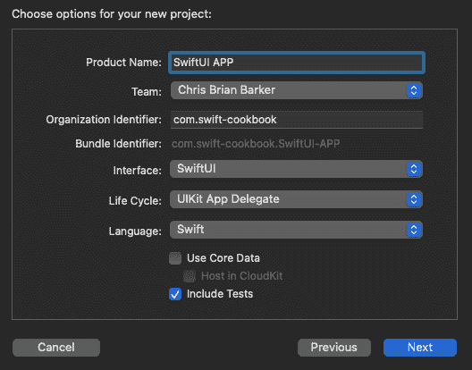
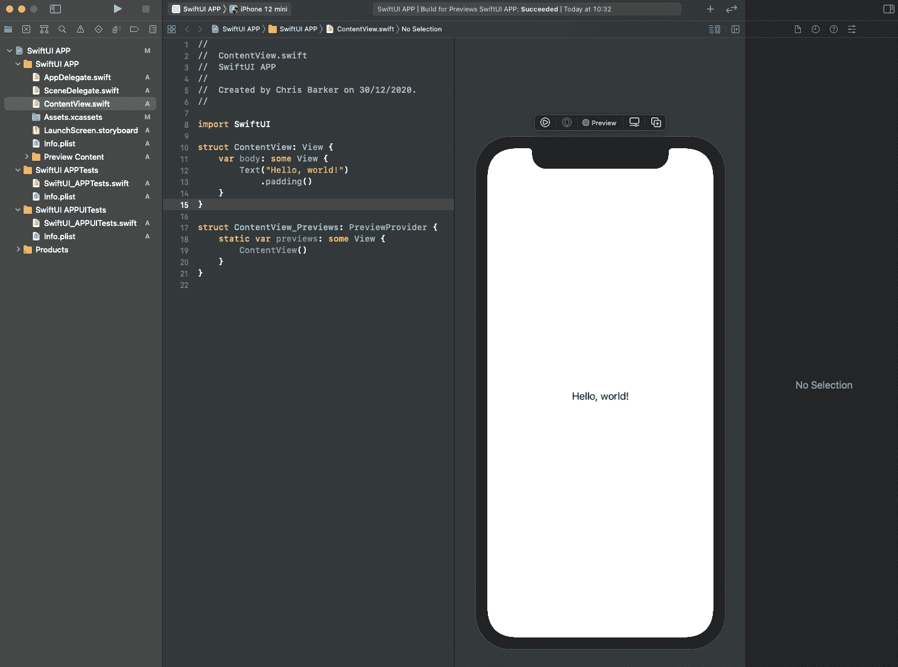
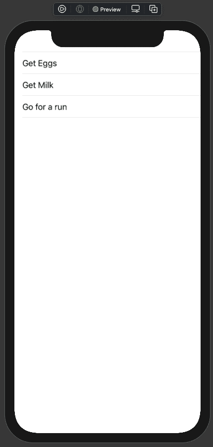
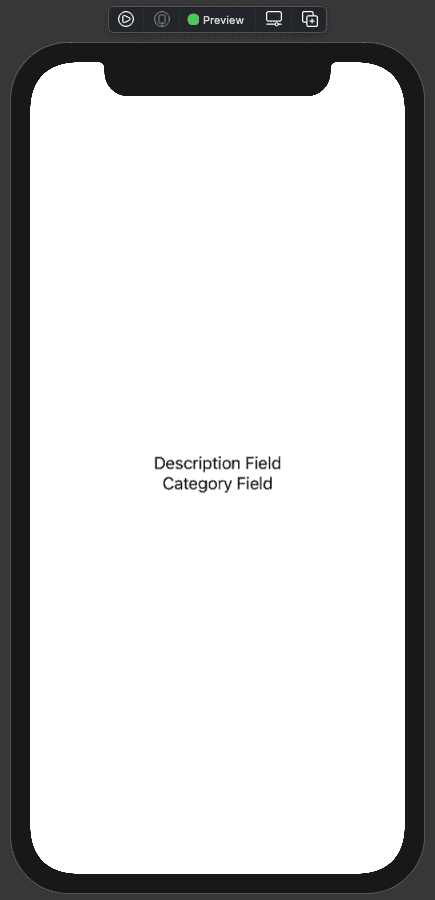
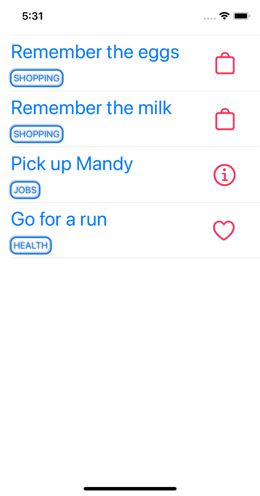

SwiftUI 和 Combine 框架

在 2019 年的 Apple **全球开发者大会**（**WWDC**）上，苹果公司宣布了 SwiftUI，这是一个全新的、从头开始用 Swift 编写的 **用户界面**（**UI**）框架，让很多人感到惊讶。

利用声明式编程范式，SwiftUI 不仅提供了一种强大的方式来程序化创建和设计你的 UI，还提供了一种功能性和逻辑性的方法。

在 WWDC 19 的许多其他公告中，苹果公司还宣布了其进入响应式编程流的新框架，名为 **Combine**。Combine 替换了我们在 iOS 和 macOS 开发中习惯使用的传统代理模式。

随着 SwiftUI 对 UI 模式编写程序化动态的改变，Combine 是 SwiftUI 框架的一个受欢迎的补充。在本章中，我们将深入了解 SwiftUI 的内部工作原理以及如何构建我们自己的应用程序——同时，我们将整合 Combine 的强大功能，以提供真正独特和响应式的流程。

在本章中，我们将涵盖以下食谱：

+   声明式语法

+   函数构建器、属性包装器和不可见返回类型

+   在 SwiftUI 中构建简单视图

+   Combine 和 SwiftUI 中的数据流

# 技术要求

你可以在 GitHub 上找到本章的代码文件，链接为 [`github.com/PacktPublishing/Swift-Cookbook-Second-Edition/tree/master/Chapter10`](https://github.com/PacktPublishing/Swift-Cookbook-Second-Edition/tree/master/Chapter10)

观看以下视频以查看代码的实际操作：[`bit.ly/3qE2mpv`](https://bit.ly/3qE2mpv)

# 声明式语法

随着 SwiftUI 的引入，出现了一种新的编程范式，称为声明式语法。好吧，我说是“新的”——实际上它已经存在一段时间了；只是我们从未真正在 iOS 或 macOS 开发中使用过。在本节中，我们将探讨声明式语法的确切含义以及它与我们已经习惯看到的语法风格的比较。

## 准备工作

对于本节，你需要从 Mac App Store 获取的最新版本的 Xcode。

## 如何操作...

1.  打开 Xcode 并选择 **文件** | **新建** | **Playground**，然后选择 ***空白*** 以打开一个新的 Playground 画布进行工作。

1.  打开之后，添加以下语法：

```swift
import PlaygroundSupport
import SwiftUI
```

我们之前已经看到过的第一个 `import` 语句，应该已经熟悉了。下一个是我们对 SwiftUI 的 `import` 语句——为什么需要它，解释得很清楚。

1.  现在，让我们通过添加以下突出显示的代码来在 SwiftUI 中创建一个视图：

```swift
import PlaygroundSupportimport SwiftUI struct MyView: View {
 var body: some View {
 VStack {
 Text("Swift Cookbook")
 }
 }
}

```

所有 SwiftUI 视图都是在符合 `View` 类型的结构体中构建的——然后它包含另一个结构体，这个结构体看起来有点像计算属性 `body`，它反过来又符合 `some View`。在这个属性（或称为“函数构建器”，我们将在本章后面讨论）内部，我们有某些元素开始构成我们的 UI。

有一个`VStack`或**垂直堆叠**，它将把所有封装的视图“垂直”地包裹在其中。VStack 再次是一个`View`。

在这里，我们有一个`Text()`视图，我们设置要显示的文本。

1.  如果我们在 Playground 中添加以下内容，我们就能看到 SwiftUI 的实际应用：

```swift
PlaygroundPage.current.setLiveView(MyView())
```

然而，声明式语法在这个过程中的作用在哪里？嗯，它已经做到了；你已经在你的 struct 中写下了它。让我们更深入地了解声明式语法是如何工作的。

## 它是如何工作的...

在 SwiftUI 中，一切都是由`View`组成的，从展示给应用窗口的主容器，到文本、按钮，甚至是切换器。

回想一下 UIKit 的工作方式，这个理论并不太相似——大多数对象都是`UIView()`的子类。

唯一的基本区别是，在 SwiftUI 中，所有这些布局和构建都更加可见；这是声明式语法的作用。最好以功能和逻辑的方式思考声明式语法。

我想在视图中垂直对齐项目：

```swift
VStack {}
```

然后我想添加一个`Text`框：

```swift
Text("Swift Cookbook")
```

然后，让我们添加一个按钮：

```swift
Button(action: {
    print("Set Action Here...")
}, label: {
    Text("I'm going to perform an action")
})
```

甚至按钮的构建本身也是声明式的：**设置一个动作**；**设置一个标签**。一切都是功能性的。

另一种思考方式可以类似于我们处理食物食谱的方式：

1.  切洋葱。

1.  炒洋葱。

1.  添加调味料。

1.  以此类推...

使用我们更传统的编程风格（或称为**命令式**编程，正如它所知），你可能执行的事情会有所不同，并且逻辑性会稍微差一些：

1.  获取调味料

1.  获取洋葱

1.  剥洋葱

1.  切洋葱

1.  热锅

1.  以此类推...

虽然使用声明式语法，所有前面的步骤仍然需要存在才能使其工作，但构建它的框架为你做了很多工作——我们只是简单地“告诉它”要做什么。

## 还有更多...

声明式语法已经存在了一段时间；你可能在使用它之前甚至没有意识到。让我们看看以下**结构化查询语言**（**SQL**）的语法：

```swift
SELECT column1, column2, ...
FROM table_name
WHERE condition;
```

注意到什么熟悉的东西了吗？没错：就在那里...给我从**特定表格**中的`column1`和`column2`，其中满足这个`条件`。

最近，声明式语法已经进入甚至更多的 UI 框架，如 Google 的 Flutter，以及最新的 Android 的新 Jetpack Compose，这两个框架都使用声明式语法风格，允许开发者和设计师构建 UI。

我们已经提到好几次了，声明式语法给我们提供了一个更功能性和逻辑性的编程方法。它们是作为整体声明范式之下的范式。例如，SQL 位于**领域特定语言**（**DSL**）中，以及 HTML 和其他标记语言。

## 参见

+   Android Jetpack Compose: [`developer.android.com/jetpack/compose`](https://developer.android.com/jetpack/compose)

+   Google 的 Flutter: [`flutter.dev/`](https://flutter.dev/)

# 函数构建器、属性包装器和不可见返回类型

SwiftUI 确实带来了很多好处，尤其是在它完全使用 Swift 的核心构建时。这本身就有很多好处，包括利用我们将在本节中介绍的一些功能。

## 准备工作

对于这一部分，你需要从 Mac App Store 获取的最新版本的 Xcode。

## 如何做到这一点...

1.  继续使用我们现有的 Playground 项目，让我们再次看看事物是如何“堆叠”起来的。我们将首先再次审视我们的`VStack`：

```swift
VStack {
    Text("Swift Cookbook")
    Button(action: {
        print("Set Action Here...")
    }, label: {
        Text("I'm going to perform an action")
    })
}
```

这里有一段代码，在 SwiftUI 术语中，这是一个要显示的视图。这个视图是一个垂直堆叠——想象一下`UITableView`，但同时不要把它和`UITableView`相比较，因为试图将 SwiftUI 与 UIKit 相比较是不好的做法。

所有的代码都位于我们的`VStack`内部，将垂直显示，然后返回到主视图，但添加我们的`Text()`和`Button()`视图到`VStack`的逻辑在哪里？没有`item`或`row`用于索引（看，与`UITableView`比较是不好的）；也没有在构建数组时你会看到的`.add()`或`.append()`函数。所有的一切都位于所谓的**函数构建器**内部。

1.  为了增加趣味性，我们再添加一个：

```swift
VStack {
    Text("Swift Cookbook")
    Button(action: {
        print("Set Action Here...")
    }, label: {
        Text("I'm going to perform an action")
    })
 HStack {
 Text("By Keith & Chris")
 Image(systemName: "book")
 }
}
```

在前面的代码中，我们添加了一个`HStack`，正如你所猜到的，它给我们提供了一个水平堆叠的视图——另一个像之前一样的函数构建器，这次它包含了一个`Text()`和一个`Image()`视图。

注意我们如何在现有的`VStack`内部添加了我们的`HStack`函数构建器？正如我们之前所说的：我们的堆叠只是视图，所以顶层`VStack`只是把它当作那样处理，而`HStack`则负责安排它的`Text()`和`Image()`视图。

但这里返回的是什么？在函数中程序性地构建视图时，你可能会期望看到`return`关键字，以及特定于返回对象类型的返回类型。

1.  然而，随着 Swift 5.1 的推出，我们可以利用不可见返回类型的强大功能。让我们回顾一下我们的 SwiftUI 视图的主体：

```swift
struct MyView: View {
    var body: some View {
    }
}
```

注意`some View`的返回类型。这是一个不可见返回类型，它允许 SwiftUI 返回任何符合 View 协议的类型，例如`Text`、`Button`、`Image`等等。没有这个，SwiftUI 在允许我们构建视图方面就不会如此灵活，我们的视图构建器也将不存在。

但不可见返回类型的美丽之处在于它们不是 SwiftUI 特有的；它们只是 Swift 语言的自然演变，再次证明了 SwiftUI 是如何从核心 Swift 编程语言构建起来的。

在这里我们看到的另一个特点是省略了`return`关键字。再次强调，这是 Swift 5.1 中引入的新特性：我们的 SwiftUI 代码现在可以解释一个最终的返回类型，并将其传递回视图层次结构。那么我们的`HStack`或`VStack`呢？嗯，因为这些是**函数构建器**，它们不会被作为返回值返回；更多的是它们被添加到栈中，然后栈再向上传递。

然而，总有这样的可能性，你可能需要一个`HStack`与一个`VStack`并排放置**，**如下所示：

```swift
VStack { }
HStack {
    Text("I'm sitting underneath a HStack")
}
```

到目前为止，编译器需要一点帮助。不幸的是，我们无法简单地添加一个`return`关键字，因为我们希望两者都返回，所以我们可以将这些添加到另一个 Stack 中——但因为我们实际上不需要一个，所以这是不必要的，所以我们只是将这些包装在`Group()`视图中：

```swift
Group {
    VStack { }
    HStack {
        Text("I'm sitting underneath a HStack")
    }
}
```

`Group`视图本身也是一个可以向上传递为`some View`的视图——真不错！

1.  我们当然正在收集所有必要的成分，以便开始使用 SwiftUI，但在我们深入之前，让我们看看 SwiftUI 中引入的另一个特性，再次来自我们不断发展的 Swift 编程语言。

SwiftUI 中的**属性包装器**是真正帮助其发光的特性之一，用于广泛的各种用途。每个包装器的主要目的是减少你对特定视图所需的维护量。让我们看看你可能使用的一些更常见的例子：

```swift
@State
```

`@State`允许 SwiftUI 在不调用特定函数的情况下修改特定视图的特定属性。例如，对你的代码进行以下突出显示的更改：

```swift
struct MyView: View {

    @State var count: Int = 0

    var body: some View {

        Group {
            VStack {
                Text("Swift Cookbook")
                Button(action: {
                    count += 1
                }, label: {
 if actionPerformed > 0 {
 Text("Performed \(count) times")
 } else {
 Text("I'm going to perform an action")
 }
                })
                HStack {
                    Text("By Keith & Chris")
                    Image(systemName: "book")
                }
            }
            HStack {
                Text("I'm sitting underneath a HStack")
            }
        }
    }
}
```

我们添加了一个名为`count`的变量，并给它赋予了`@State`属性包装器，现在我们更新了按钮点击，使整数增加`1`。接下来，我们根据`count`的值添加一些逻辑**。**

通过改变`count`的值，我们现在将 SwiftUI 中使用的属性绑定到值和任何更改，从而使 SwiftUI 布局无效，并使用新值重建我们的视图。

好吧——在 Playground 中运行它，亲自试试。

`@Binding`是另一个常用的属性包装器，专门用于与传递给可能存在于另一个视图中的状态属性值一起使用。让我们看看我们可能如何做到这一点，首先通过分离一些代码并创建另一个 SwiftUI 视图。我们可以在当前的`MyView`下面这样做：

```swift
struct ResultView: View {

    @Binding var count: Int

    var body: some View {
        Text("Performed \(count) times")
    }
}
```

在这里，我们只是创建了一个返回`Text`视图的 SwiftUI 视图，但这是一种很好的方式，可以看看如何轻松地分离出你可能想要单独工作（或使其可重用）的特定视图逻辑。

注意，我们在这里也使用了`count`变量，尽管这次使用了`@Binding`包装器。这是因为我们不会在这个视图中控制`count`的值；这将在`MyView`外部完成：

```swift
struct MyView: View {

 @State var count: Int = 0

    var body: some View {

        Group {
            VStack {
                Text("Swift Cookbook")

 ResultView(count: $count)

                Button(action: {
 count += 1
                }, label: {
                    Text("Perform Action")
                })

                HStack {
                    Text("By Keith & Chris")
                    Image(systemName: "book")
                }
            }
            HStack {
                Text("I'm sitting underneath a HStack")
            }
        }
    }
}
```

在前面的高亮代码中，请注意我们仍然有我们的`@State`变量，并且我们的`Button`动作仍然在每次点击时更新这个值。我们还添加了新的`ResultView`，传递我们的`@State`变量并将其“绑定”到`ResultView`中的变量，从而在`count`更新时强制更改该视图。现在就试试吧。

## 还有更多...

我们已经介绍了一些您在 SwiftUI 中一开始可能会遇到的属性包装器，但还有很多其他的，其中一些我们将在本章后面介绍，特别是当涉及到与 Combine 框架一起工作时。然而，这里是一些其他属性包装器的概述以及它们能提供什么：

```swift
@EnvironmentObject
```

将其视为一个全局对象——有时您可能想在您的应用中跟踪某些事物，而这些事物您可能并不一定需要或觉得有必要传递给每个视图。然而，重要的是要知道`EnvironmentObject`不是一个单一的真实来源；它是数据——它只是从源中引用它，如果源发生变化，`EnvironmentObject`将触发状态变化（这正是我们想要的）。

我们可以使用这个示例来创建一个我们想要观察的类，使其符合`ObservableObject`：

```swift
class BookStatus: ObservableObject {
    @Published var released = true
    @Published var title = ""
    @Published var authors = [""]
}
```

然后，您可以从我们的 SwiftUI 项目中的任何地方引用它，如下所示：

```swift
@EnvironmentObject var bookStatus: BookStatus
```

另一个很棒且确实方便的属性包装器是`@AppStorage`，它用作访问存储在`UserDefaults`中的数据的方式。截至 iOS 14，我们可以直接将其集成到我们的 SwiftUI 视图中，而无需额外的逻辑或函数。让我们看看我们如何做到这一点：

```swift
@AppStorage("book.title") var title: String = "Book Title"
```

注意这里，如果没有已经持久化的数据，我们将有一个默认值。如果我们想写入这个值，我们只需将属性赋值：

```swift
title = "Swift Cookbook"
```

在您的 Playgrounds 中尝试这个。如果您遇到困难，请查看 GitHub 资源以了解我是如何做到的。

由于 SwiftUI 的架构，将有一个——并且将会是一个不断增长的可用属性包装器列表。我们将在本章后面介绍更多内容，但这里有一些其他需要了解的：

+   `@GestureState`——跟踪正在执行的手势

+   `@FetchRequest`——执行对 Core Data 实体的检索

## 参见

+   状态：[`developer.apple.com/documentation/swiftui/state`](https://developer.apple.com/documentation/swiftui/state)

+   绑定：[`developer.apple.com/documentation/swiftui/binding`](https://developer.apple.com/documentation/swiftui/binding)

# 在 SwiftUI 中构建简单视图

我们已经介绍了一些从 Swift 编程语言构建 SwiftUI 的基础知识，但现在是我们深入了解如何在 SwiftUI 中构建实际应用的时候了。

在本节中，我们将把到目前为止所学的所有知识应用到构建一个类似于我们之前创建的应用程序列表中。

## 准备工作

对于本节，您需要从 Mac App Store 获取 Xcode 的最新版本。

## 如何做到...

1.  让我们开始吧。首先，我们将创建一个全新的项目——在 Xcode 中，点击文件 | **新建** | **项目**。然后，选择单视图应用程序，并确保你已经选择了 `SwiftUI` 作为界面样式，就像我这里做的那样：



图 10.1 – 创建新项目

1.  点击“下一步”并选择你的磁盘上的一个位置。一旦完成，熟悉的 Xcode 界面应该会出现；然而，你可能注意到一些新内容。在右侧，你会看到实时窗口屏幕。点击“Resume”——你应该能看到以下内容：



图 10.2 – Xcode 和实时窗口屏幕

这里，我们有一个我们样板 SwiftUI 代码的生成预览。注意我们的 `ContentView()` 结构体，正如我们预期的那样，有它的 **body**。现在，看看下面的结构体：

```swift
struct ContentView_Previews: PreviewProvider {
    static var previews: some View {
        ContentView()
    }
}
```

这是我们的 `PreviewProvider` 结构体，它允许我们在设计时测试我们的 SwiftUI 视图，而无需不断重新运行模拟器和重新构建我们的应用程序——真方便！

现在，对于我们的初始列表，我们需要一些模拟数据：

1.  创建以下结构体（如果你愿意，可以放在一个新文件中）：

```swift
struct Task: Identifiable {
    var description: String
    var category: String
    var id = UUID()
}
```

将其与 第八章 中的 `Task` 模型进行比较，*服务器端 Swift*，在属性和我们要它持有的数据方面几乎完全相同。我们唯一需要做出的不同是让我们的模型符合 `Identifiable` 并赋予一个唯一的 ID——这是 SwiftUI 对任何我们将迭代的内容的要求。

1.  接下来，让我们创建一个用于一些模拟数据的小助手函数：

```swift
struct MockHelper {
    static func getTasks() -> [Task] {
        var tasks = [Task]()
        tasks.append(Task(description: "Get Eggs", category: 
          "Shopping"))
        tasks.append(Task(description: "Get Milk", category: 
          "Shopping"))
        tasks.append(Task(description: "Go for a run", category: 
          "Health"))
        return tasks
    }
}
```

这组模拟数据在 SwiftUI 中将非常有用，但我们会很快看到。让我们将其连接到我们的应用程序。

1.  返回到我们的 `ContentView`，将 `Hello World` 文本视图替换为以下内容：

```swift
List(MockHelper.getTasks()) { task in
    Text(task.description)
}
```

注意到我们的 `List()` 视图有什么特点？没错：另一个函数构建器接受一个项目数组的参数，其中项目符合 `Identifiable`。在闭包中返回一个变量给我们，代表这些项目中的每一个，这样我们就可以在列表构建器中使用它们，就像我们想要的那样。

1.  在这里，我们只是暂时将描述添加到一个文本视图中。如果实时预览中没有显示，请点击 R**esume**（有时在 Xcode 中需要这样做），你现在应该能看到以下内容：



图 10.3 – 预览屏幕

现在，在模拟器中运行这个，你应该看到完全相同的内容——做得好！

现在是时候进行一点重构了，所以请对 `ContentView` 进行以下突出显示的更改：

```swift
var tasks = [Task]()

var body: some View {
    List(tasks) { task in
        Text(task.description)
    }
}
```

在这里，我们正在移除对模拟数据助手的调用，因为在生产代码中，我们不应该在这里调用它。进行此更改后，让我们转到 `PreviewProvider` 并进行以下突出显示的更改：

```swift
struct ContentView_Previews: PreviewProvider {
    static var previews: some View {
        ContentView(tasks: MockHelper.getTasks())
    }
}
```

由于我们的 `ContentView` 结构体现在有一个非可选的 `tasks` 变量，它需要我们传递一些数据；在这里，我们将传递我们的 `MockHelper` 函数。

如果还没有显示，请继续进行实时预览。一切顺利的话，一切应该都按预期工作。然而，让我们看看在模拟器中运行时会发生什么——没错：没有数据。

如果你仔细看看我们刚才做的更改，你就会明白为什么我们现在只通过预览提供者将模拟数据注入到我们的`ContentView`中，这样当我们的实际应用程序运行时，我们的`tasks`数组是空的。

但这是正确的；因为我们将在我们的应用程序中连接到我们在第八章中创建的**表示状态传输应用程序编程接口**（**REST API**），通过预览提供者注入模拟数据，我们可以在构建任何网络功能之前继续构建我们的 UI，所以让我们继续。

记得在上一节中我们如何重构了我们的`Result`视图吗？我们将在这里为`List`视图中的每一行做同样的事情。

创建一个新的 SwiftUI 文件，并将其命名为`ListRowView`，然后更新模板代码，使其看起来如下：

```swift
var description: String = ""
var category: String = ""

var body: some View {
 VStack {
 Text(description)
 Text(category)
 }
}
```

从这里，回到`ContentView.swift`并做出以下突出显示的更改：

```swift
var body: some View {
    List(tasks) { task in
 ListRowView(description: task.description,
 category: task.category)
 }
}
```

就像之前一样，我们用我们刚刚创建的视图替换了我们的文本视图。点击“继续”以查看实时预览并亲自看看。

现在我们知道它正在工作，我们想要稍微修改一下`ListRowView`的样式，所以现在让我们回到那里，并首先更新预览提供者，这样我们就可以从那里开始工作：

```swift
struct ListRowView_Previews: PreviewProvider {
    static var previews: some View {
 ListRowView(description: "Description Field",
 category: "Category Field")
    }
}
```

如前所述的突出显示代码所示，我们为我们的实时预览添加了一些模拟数据。如果这还没有显示，请点击“继续”，你应该会看到以下内容：



图 10.4 – 带有模拟数据的实时预览屏幕

它确实可以工作，但看起来并不像`List`行，但这没关系——我们只需要告诉预览提供者我们打算用它来做什么：

```swift
List {
    ListRowView(description: "Description Field",
                category: "Category Field")
}
```

真的是很简单。我们只是将其包裹在一个`List`视图中，SwiftUI 就会完成剩下的工作，现在我们可以开始装饰我们的行。

在我们的`ListRowView`的主体中，进行以下突出显示的更改：

```swift
var body: some View {
    VStack(alignment: .leading) {
        Text(description)
 .font(.title)
 .padding(EdgeInsets(top: 0,
 leading: 0,
 bottom: 2,
 trailing: 0))
 .foregroundColor(.blue)
        Text(category)
 .font(.title3)
 .foregroundColor(.blue)
    }
}
```

在这里，我们向我们的视图添加了修饰符。修饰符允许我们装饰和样式化我们的视图，就像我们在 UIKit 中使用属性一样，每个修饰符都与特定类型的视图紧密相关。

SwiftUI 在可用的一些修饰符方面又前进了一步，为我们提供了丰富的选项。以`.font`修饰符为例：

```swift
.font(.largeTitle) // A font with the large title text style.
.font(.title) // A font with the title text style.
.font(.title2) // Create a font for second level hierarchical headings.
.font(.title3) // Create a font for third level hierarchical headings.
.font(.headline) // A font with the headline text style.
.font(.subheadline) // A font with the subheadline text style.
.font(.footnote) // A font with the footnote text style.
.font(.caption) // A font with the caption text style.
.font(.caption2) // Create a font with the alternate caption text 
                   // style.
```

之前提到的字体都可以直接使用；然而，如果你仍然想指定自己的字体，你可以使用以下方式：

```swift
public static func system(_ style: Font.TextStyle, design: Font.Design 
  = .default) -> Font
```

让我们通过添加基于类别类型的图片来完善我们应用程序的基础：

```swift
HStack {
    VStack(alignment: .leading) {
        Text(description)
            .font(.title)

            .padding(EdgeInsets(top: 0,
                                leading: 0,
                                bottom: 2,
                                trailing: 0))
            .foregroundColor(.blue)
        Text(category)
            .font(.title3)
            .foregroundColor(.blue)
    }
 Spacer()
 Image(systemName: "book")
 .foregroundColor(.blue)
 .padding()
}
```

注意在前面代码中，我们如何现在引入了一个 `HStack` 并将其包裹在当前的 `VStack` 中，这使得我们现在可以添加原始 `VStack` 之外的观点，并使它们水平对齐，就像我们对 `Image` 视图所做的那样。

在 SwiftUI 中，`Spacer()` 视图的用法将我们的两个水平视图（左边的 `VStack` 和右边的 `Image`）推离，使它们作为父视图（在这个例子中是主体）的引导和尾随视图。

## 它是如何工作的...

我们的应用程序的基础现在已准备好连接到外部数据源，但首先，让我们了解一下修饰符的工作原理以及我们如何创建自己的修饰符。你可以将以下代码添加到你的 `ListRowView.swift` 文件中，或者创建一个新的文件（由你决定）：

```swift
struct CategoryText: ViewModifier {
    func body(content: Content) -> some View {
        content
            .font(.title3)
            .foregroundColor(.blue)
    }
}
```

在这里，我们创建了一个名为 `CategoryText` 的结构体，它符合 `ViewModifier` 协议。在这里，有一个名为 `Body` 的函数，我们正在设置 `.font` 和 `.foregroundColor` 的修饰符。这些修饰符适用于从 `View` 继承的任何内容。

随意尝试一些可用的修饰符。你可以添加以下内容，并真正为 `Category` 标签增添一些活力：

```swift
struct CategoryText: ViewModifier {
    func body(content: Content) -> some View {
        content
            .font(.footnote)
            .foregroundColor(.blue)
 .padding(4)
 .overlay(
 RoundedRectangle(cornerRadius: 8)
 .stroke(Color.blue, lineWidth: 2)

 )
 .shadow(color: .grey, radius: 2, x: -1, y: -1)
    }
}
```

现在让我们将它添加到我们的 `Text` 视图中：

```swift
Text(category)
    .modifier(CategoryText())
```

我们使用 `.modifier`（修饰符）来调用我们的自定义结构体；从可读性的角度来看，这很好，因为它允许你快速识别任何可能被自定义的内容，而不是系统 API 中的内容。然而，如果你像我一样，想要它看起来恰到好处，只需创建 `View` 的扩展：

```swift
extension View {
    func styleCategory() -> some View {
        self.modifier(CategoryText())
    }
}
```

然后，像这样使用它：

```swift
Text(category)
    .styleCategory()
```

你可能已经注意到我们略过了为某个类别分配特定图像的过程。这是出于很好的原因，因为我想要进一步探讨 SF Symbols 在 SwiftUI 中的使用。

SF Symbols 也可以与 UIKit 一起使用，在 SwiftUI 中表现异常出色，尤其是在使用我们刚刚玩过的修饰符时。

SF Symbols 正如其名——符号（不是图像），它们是字体，也可以像字体一样处理：

```swift
Image(systemName: "book")
 .font(.system(size: 32, weight: .regular))
    .foregroundColor(.blue)
    .padding()
```

没有必要拉伸图像或**2x**或**3x**图像的资产。SF Symbols 将像处理你自己的矢量一样处理这些，额外的优点是它全部包含在 Swift API 中，无需额外的资产来增加你的应用程序的体积。

由于符号的名称只是以纯文本形式书写，让我们编写一个简单的函数来确定我们需要显示的内容：

```swift
struct Helper {
    static func getCategoryIcon(category: String) -> String {

        switch category.lowercased() {
        case "shopping":
            return "bag"
        case "health":
            return "heart"
        default:
            return "info.circle"
        }

    }
}
```

在理想的世界里，我们的类别将是具有 `String` 值的枚举，我们可以将其转换为，但在这个演示中，基本的字符串匹配就足够了。现在，将 `Image` 构造函数中的静态文本替换为调用这个新的静态函数：

```swift
Image(systemName: Helper.getCategoryIcon(category: category))
```

唯一的缺点是以下：你想要使用的图像是否包含在库中？

在 iOS 14 中，苹果引入了更广泛的 SF Symbols。甚至有一个你可以下载的 Mac 应用程序，它会以漂亮的**图形用户界面**（**GUI**）为你整理所有这些符号。

## 还有更多...

我们已经几次提到了预览提供者，但 SwiftUI 这个小巧实用的功能还有一些其他技巧。

默认情况下，它将预览的设备将是当前在 Xcode 中选定的设备，但如果你想要更改这一点，只需添加以下内容：

```swift
struct ListRowView_Previews: PreviewProvider {
    static var previews: some View {
        List {
            ListRowView(description: "Description Field",
                        category: "Category Field")
        }
 .previewDevice(PreviewDevice(rawValue: "iPhone 12 Pro Max"))
 .previewDisplayName("iPhone 12 Pro Max")
    }
}
```

`.previewDevice`——这指定了你想要使用的设备——原始值字符串与特定设备的内部枚举值匹配（基本上是你在模拟器列表中看到的字符串名称）。

`.previewDisplayName`——这是为该设备提供的自定义名称，如实时预览窗口中所示。

显示名称在其他情况下也可能很有用，特别是如果我们有多个预览正在运行：

```swift
struct ListRowView_Previews_MockData2: PreviewProvider {
    static var previews: some View {
        List {
            ListRowView(description: "Very Long Description Field, Very 
              Long Description Field", category: "Very Long Category 
                Field, Very Long Category Field")
        }
        .previewDevice(PreviewDevice(rawValue: "iPhone 12 Pro"))
 .previewDisplayName("iPhone 12 Pro - Data #2")
    }
}
```

如同所强调的，我们创建了一个额外的预览来在我们的实时预览窗口中运行，它反过来传递不同的数据和在不同设备上的测试。

通过这种方式，我们可以为每个我们想要的条件或样式创建模拟数据，并在所有类型的设备上预览，这样我们就可以直接测试，而无需在每个模拟器版本上启动。

SwiftUI 无疑非常强大，尤其是在 2020 年 WWDC 上最新发布的 iOS 14 中，事物有了极大的改进，但我们不能忘记，它还不到 2 年的历史，仍然处于婴儿期，你将不止一次需要回退到 UIKit 来使用某些组件。

幸运的是，Apple 已经为我们准备好了 `UIViewRepresentable` 协议，这是一个我们可以用来利用 UIKit 组件并将其作为 SwiftUI 视图返回的协议。

一个很好的例子是 `UITextView()`，目前 SwiftUI 或任何直接等效功能中都没有（尽管在 iOS 14 中，SwiftUI 的 TextEditor 现在已经做了我们想要的很多事情，但仍然不是直接替代品）。

创建一个新的 Swift 文件，并将其命名为 `TextView`，然后逐个粘贴以下方法：

```swift
struct TextView: UIViewRepresentable {

    @Binding var text: String

    func makeUIView(context: Context) -> UITextView {

        let textView = UITextView()
        return textView
    }

}
```

我们的 `UIViewRepresentable` 协议要求我们符合某些函数，例如 `makeUIView()`，它反过来负责实例化我们想要包装的 UIKit 组件。

接下来，添加以下内容：

```swift
struct TextView: UIViewRepresentable {

    // ...

 func updateUIView(_ uiView: UITextView, context: Context) {
 uiView.text = text
 }

 func makeCoordinator() -> Coordinator {
 Coordinator($text)
 }

    // ...

}
```

通过 `updateUIView()`，我们设置我们的 `UITextView` 实例为我们想要的任何内容。在这里，我们正在设置变量的 `text` 值。

接下来，我们将添加 `makeCoordinator()` 函数，它返回一个 `Coordinator` 实例，填充我们的 `@Binding` 文本字段。将 `Coordinator` 视为处理我们可能用于 UIKit 组件的代理方法的一种方式。添加以下内容，这应该会更有意义：

```swift
struct TextView: UIViewRepresentable {

    // ...

 class Coordinator: NSObject, UITextViewDelegate {
 var text: Binding<String>

 init(_ text: Binding<String>) {
 self.text = text
 }

 func textViewDidChange(_ textView: UITextView) {
 self.text.wrappedValue = textView.text
 }
 }

}
```

看看我们的 `Coordinator` 如何符合 `UITextViewDelegate` 协议，并且我们在其中实现了 `textViewDidChange()` 方法。由于我们传递的文本变量是一个 `Binding` 字符串，所做的更改将反映在被调用的代理方法中，就像在 UIKit 中一样：

```swift
@State var textViewString = ""
TextView(text: $textViewString)
```

为了调用这个功能，我们只需像添加任何其他 SwiftUI 视图一样添加它。

## 参见

SF Symbols Mac 应用：[`developer.apple.com/design/human-interface-guidelines/sf-symbols/overview/`](https://developer.apple.com/design/human-interface-guidelines/sf-symbols/overview/)

`UIViewRepresentable`：[`developer.apple.com/documentation/swiftui/uiviewrepresentable`](https://developer.apple.com/documentation/swiftui/uiviewrepresentable)

# SwiftUI 中的组合和数据流

多年来，响应式编程流在 iOS 和 macOS 的开发架构中扮演了重要角色。你可能听说过 RxSwift 和 RxCocoa，这是一个致力于响应式流的庞大社区，它允许异步事件被处理。

如果你不太熟悉 Rx 或响应式编程的术语，你可能已经在你的代码库中看到了**发布者**、**订阅者**和**操作符**的使用。如果你看到了，那么你很可能在某些时候受到了响应式编程的影响。

在本节中，我们将探讨苹果为响应式编程提供的解决方案，称为**Combine**。在 2019 年 WWDC 上与 SwiftUI 一同推出，Combine 是 SwiftUI 新布局和结构的完美伴侣（尽管不仅仅局限于 SwiftUI）。我们将探讨如何从 REST API 创建无缝的数据流，直到我们的 UI 层。

## 准备工作

对于本节，你需要从 Mac App Store 获取最新版本的 Xcode 以及上一节的项目。

## 如何做到这一点...

首先，我们将通过以下突出显示的更改将我们的`Task`模型更新为类：

```swift
class Task: Identifiable {

    var id = UUID()

    let response: TaskResponse

 init(taskResponse: TaskResponse) {
 self.response = taskResponse
 }

 var category: String {
 return response.category ?? ""
 }

 var description: String {
 return response.description ?? ""
 }

}
```

在这里，我们已经将我们的模型转换为类（关于这一点稍后讨论），并添加了一个自定义初始化器和几个计算属性。

我们还添加了一个类型为`TaskResponse`的变量，所以现在让我们在新的文件中创建它：

```swift
struct TaskResponse: Codable {
    let category: String?
    let description: String?
}
```

在这里，我们有一个来自我们之前创建的 REST API 的基本`codable`响应。

现在，为了编写一些样板式的网络代码；创建一个名为`NetworkManager.swift`的新文件，并将以下代码添加到其中：

```swift
class NetworkManager {

    static func loadData(url: URL, completion: @escaping 
      ([TaskResponse]?) -> ()) {

        URLSession.shared.dataTask(with: url) { data, response, error 
          in

            guard let data = data, error == nil else {
                completion(nil)
                return
            }

            if let response = try? JSONDecoder().decode(
              [TaskResponse].self, from: data) {
                DispatchQueue.main.async {
                    completion(response)
                }
            }
        }.resume()

    }

}
```

在这里，我们有一个基本的`URLSession`实现，它接收一个**统一资源定位符**（**URL**），将**JavaScript 对象表示法**（**JSON**）响应解析为一个`Codable`对象（我们的`TaskResponse`模型）。我们创建的函数有一个完成处理程序，如果响应和解码成功，则返回一个`TaskResponse`模型的数组。

接下来，创建一个名为`TaskViewModel`的新文件，并添加以下代码：

```swift
class TaskViewModel: ObservableObject {

    init() {
        getTasks()
    }
    @Published var tasks = [Task]()

    private func getTasks() {

        guard let url = URL(string: "http://0.0.0.0:8080/tasks") else {
            return
        }

        NetworkManager.loadData(url: url) { taskResponse in

            if let taskResponse = taskResponse {
                self.tasks = taskResponse.map(Task.init)
            }

        }

    }

}
```

在前面的代码中，我突出显示了一些感兴趣的区域。首先是我们的类如何符合`ObservableObject`——这是必需的，因为我们的`tasks`变量有`@Published`包装器，并且将根据它们发生的情况寻找变化。

接下来是我们传递给`NetworkingManager`的本地 URL——这是我们之前创建的 REST API 的本地实例。

现在，回到我们的`ContentView.swift`文件，进行以下突出显示的更改：

```swift
struct ContentView: View {

    @ObservedObject var model = TaskViewModel()

    var body: some View {
        List(model.tasks) { task in
            ListRowView(description: task.description,
                        category: task.category)
        }

    }
}
```

我们现在已将`tasks`变量重命名为`model`，这反过来又创建了一个新的`TaskViewModel()`实例。

由于我们在这里更新了一些东西，因此我们需要调整注入模拟数据的方式的结构，因此对我们的`MockHelper`函数进行以下突出显示的更改：

```swift
var task = [Task]()
task.append(Task(taskResponse: TaskResponse(category: "Get Eggs", 
  description: "Shopping")))
task.append(Task(taskResponse: TaskResponse(category: "Get Milk", 
  description: "Shopping")))
task.append(Task(taskResponse: TaskResponse(category: "Go for a run", 
  description: "Health")))

let taskViewModel = TaskViewModel()
taskViewModel.tasks = task

return taskViewModel
```

由于我们的`ContentView`现在接受`TaskResponse`数组，我们已相应地进行了调整。

接下来是魔法——从我们之前的项目中，启动我们的本地 Task API 实例，并在数据库中添加一些内容：

```swift
curl -H "Content-Type: application/json" -X POST -d '{"description":"Remember the Eggs","category":"Shopping"}' http://0.0.0.0:8080/tasks

```

```swift
curl -H "Content-Type: application/json" -X POST -d '{"description":"Bread","category":"Shopping"}' http://0.0.0.0:8080/tasks
```

```swift
curl -H "Content-Type: application/json" -X POST -d '{"description":"Ring Mandy","category":"Home"}' http://0.0.0.0:8080/tasks
```

完成这些后，是时候见证魔法发生了。启动应用，如果一切顺利，你应该会看到类似这样的东西：



图 10.5 – 启动应用

这是一个简单但非常有效的演示，说明了 Combine 如何在 SwiftUI 中使用，以及应该如何使用。现在让我们看看这一切是如何实际工作的。

## 它是如何工作的...

让我们从`ContentView`开始，逐步回溯：

```swift
@ObservedObject var model = TaskViewModel()
```

这里有两个需要注意的地方——我们的模型是`@ObservedObject`的模型，这意味着对模型所做的任何更改都将触发更新并因此强制刷新我们的 UI（就像我们之前看到的`@State`一样）。

接下来，我们在`ContentView`渲染时实例化`TaskViewModel()`。让我们深入了解`TaskViewModel`并看看为什么：

```swift
class TaskViewModel: ObservableObject {

    init() {
 getTasks()
 }
 @Published var tasks = [Task]()

    // ...

}
```

我们之前已经提到我们的类符合`ObservableObject`。这就是我们能够在`ContentView`中声明`@ObservedObject`的原因（我们正在创建一种**数据流**连接，可以说）。

注意这里，我们还添加了对`getTasks()`函数的调用，这样当我们在`ContentView`中初始化类时，我们将启动一个网络请求以获取任务列表。

如果我们现在快速查看我们的`getTasks()`函数，你会看到一旦我们得到成功的响应，我们就将其分配给我们的`@Published tasks`变量：

```swift
NetworkManager.loadData(url: url) { articles in

    if let articles = articles {
        self.tasks = articles.map(Task.init)
    }

}
```

一旦变量更新，我们的`Observable`对象类就会让任何监听者知道有变化（例如，我们的`ContentView`中的`@ObservedObject`）。

如果你回顾一下`UITableView`的工作方式，如果有任何更新或更改数据源，我们随后必须手动调用`UITableView.reloadData()`，并在我们的 UI 层中。

采用这种方法，一切都被处理得恰到好处，并且处于正确的位置，将数据更改从真实来源传递到 UI 层。

## 参见

+   Swift Combine: [`developer.apple.com/documentation/combine`](https://developer.apple.com/documentation/combine)
