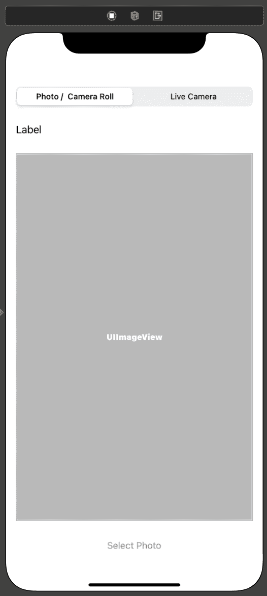
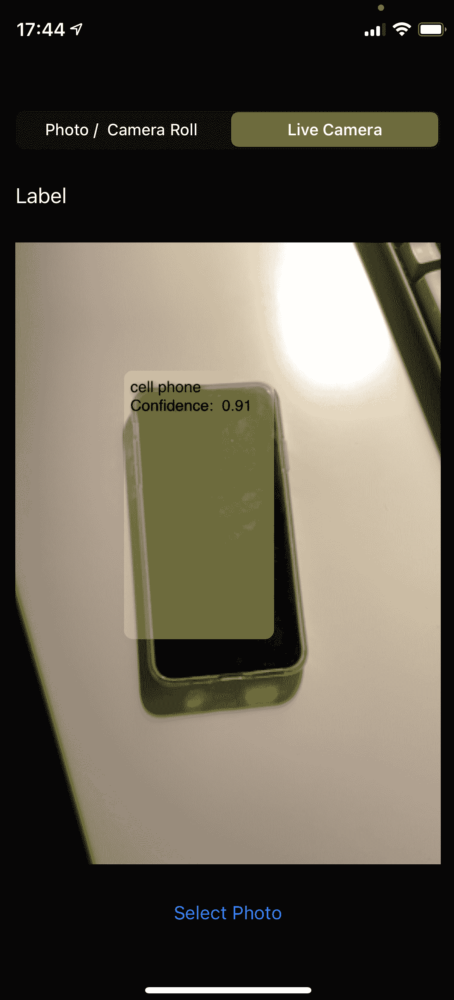

使用 Swift 中的 CoreML 和 Vision

Swift 编程语言自从首次推出以来已经走了很长的路，与许多其他编程语言相比，它仍然处于婴儿期。

然而，考虑到这一点，随着 Swift 及其在开源社区中的地位每一次发布，我们都看到它在如此短的时间内从强到更强。我们已经在第八章中介绍了服务器端 Swift，*服务器端 Swift*，这是又一次由开源社区推动的演变。

另一个快速发展的领域是机器学习，它再次受到社区力量的推动，并且行业中的巨头，如 TensorFlow，现在也支持 Swift 编程语言。

在本章中，我们将探讨苹果的机器学习产品——CoreML——以及我们如何使用 Swift 构建应用程序来读取和处理机器学习模型，从而实现智能图像识别。

我们还将探讨苹果的 Vision 框架以及它是如何与 CoreML 协同工作，使我们能够实时处理流到我们设备上的视频，并在飞行中识别对象。

在本章中，我们将介绍以下食谱：

+   构建图像捕获应用程序

+   使用 CoreML 模型检测图像中的对象

+   构建视频捕获应用程序

+   使用 CoreML 和 Vision 框架实时检测对象

# 技术要求

您可以在 GitHub 上找到本章中提供的代码文件，网址为[`github.com/PacktPublishing/Swift-Cookbook-Second-Edition/tree/master/Chapter11`](https://github.com/PacktPublishing/Swift-Cookbook-Second-Edition/tree/master/Chapter11)

查看以下视频以查看代码的实际操作：[`bit.ly/2NmP961`](https://bit.ly/2NmP961)

# 构建图像捕获应用程序

在这个第一个食谱中，我们将创建一个应用程序，它可以捕获来自您的相册或相机拍摄的照片。这将使我们的 iOS 应用程序准备好，以便我们能够将 CoreML 集成到我们的照片中检测对象。

## 准备工作

对于这个食谱，您需要从 Mac App Store 获取的最新版本的 Xcode。

## 如何操作...

打开 Xcode 后，让我们开始吧：

1.  在 Xcode 中创建一个新的项目。转到**文件** | **新建** | **项目** | **iOS App**。

1.  在`Main.storyboard`中添加以下内容：

    1.  添加带有两个选项的`UISegmentedControl`（**照片/相册**和**实时相机**）。

    1.  接下来，在下面添加一个`UILabel`视图。

    1.  在下面添加一个`UIImageView`视图。

    1.  最后，添加一个`UIButton`组件。

1.  使用 AutoLayout 约束相应地间隔使用`UIImageView`作为突出对象：



图 11.1 – 摄像头/照片应用程序

1.  一旦我们有了这个，就让我们将这些连接到我们的`ViewController.swift`文件中：

```swift
@IBOutlet weak var imageView: UIImageView!
@IBOutlet weak var labelView: UILabel!
@IBAction func onSelectPhoto(_ sender: Any)
```

注意，在前面的内容中，我们有两个`IBOutlet`和一个`IBAction`（我们不需要`UIButton`的出口，我们只关心它的动作）。

1.  接下来，用以下代码填充 `IBAction`：

```swift
@IBAction func onSelectPhoto(_ sender: Any) {
 let picker = UIImagePickerController()
 picker.delegate = self
 picker.allowsEditing = false
 picker.sourceType = 
      UIImagePickerController.isSourceTypeAvailable(.camera) ? 
        .camera : .photoLibrary

 present(picker, animated: true) 
}
```

1.  现在，让我们创建一个 `UIViewController` 的扩展。如果你喜欢，可以在 `ViewController` 类的底部做这件事：

```swift
extension ViewController: UIImagePickerControllerDelegate,
  UINavigationControllerDelegate
```

1.  我们的扩展需要遵守 `UIImagePickerControllerDelegate` 和 **`UINavigationControllerDelegate`** 协议。现在我们可以继续填充我们的扩展，以下是一个委托方法：

```swift
func imagePickerControllerDidCancel(_ picker: 
   UIImagePickerController) {
  dismiss(animated: true, completion: nil)
}

func imagePickerController(_ picker: UIImagePickerController, 
  didFinishPickingMediaWithInfo info: 
    [UIImagePickerController.InfoKey : Any]) {

    guard let image = info[UIImagePickerController.InfoKey
      .originalImage] as? UIImage else {
        return
    }

    imageView.image = image

    labelView.text = "This is my image!"

    dismiss(animated: true, completion: nil)
}
```

1.  在我们继续之前，我们需要在我们的 `info.plist` 中添加几行：

```swift
NSCameraUsageDescription
NSPhotoLibraryUsageDescription
```

9. 使用以下字符串描述添加这些内容：`Chapter 11 wants to detect cook Stuff`。这是一个 iOS 安全功能，当任何应用/代码尝试访问相机、照片库或位置服务时，会提示用户。如果没有添加这个，可能会导致应用崩溃。

对于我们的应用，我们可以添加任何我们想要的，但对于一个生产应用，确保你输入的文本对用户有用且信息丰富。苹果会在审查你的应用时检查这一点，并且已知在解决这个问题之前可能会阻止发布。

继续运行你的代码，然后启动应用。以下情况之一应该会发生：

+   如果你正在从模拟器运行应用，我们的 `UIButton` 点击应该会显示照片选择器（以及 iOS 模拟器提供的默认图片）。

+   如果你正在从设备上运行，那么你应该会看到相机视图，允许你拍照。

无论哪种方式，无论是选择了照片还是拍了照片，最终的结果图像都应该显示在 `UIImageView` 中！

## 它是如何工作的...

让我们一步一步回顾一下我们刚刚所做的工作。我们从 `IBAction` 开始，看看我们创建的 `UIPickerView` 视图：

```swift
let picker = UIImagePickerController() // 1
picker.delegate = self // 2
picker.allowsEditing = false // 3
picker.sourceType = UIImagePickerController.isSourceTypeAvailable
  (.camera) ? .camera : .photoLibrary // 4

present(picker, animated: true) // 5
```

让我们逐行分析这一行：

1.  我们实例化一个 `UIImagePickerController` 的实例——这是一个可用的 API，它将允许我们根据特定的来源选择一个图片。

1.  我们将委托设置为 `self`，这样我们就可以利用由 `UIImagePickerController` 引起的任何结果或操作。

1.  我们将 `allowEditing` 设置为 `false`，这用于在相机是我们来源时隐藏控件。

1.  在这种情况下，我们根据相机是否可用设置源类型（因此它与模拟器配合得很好）。

1.  最后，我们展示我们的视图控制器。

现在，让我们看看我们的委托方法：

```swift
func imagePickerControllerDidCancel(_ picker: UIImagePickerController)
func imagePickerController(_ picker: UIImagePickerController, 
  didFinishPickingMediaWithInfo info: [UIImagePickerController.InfoKey 
    : Any])
```

第一个方法相当直观；`imagePickerControllerDidCancel` 处理用户取消 `UIImagePickerController` 的任何实例。在我们的情况下，我们只是关闭返回的实例——任务完成！

`didFinishPickingMediaWithInfo` 是有趣的事情发生的地方。注意我们得到的响应中有一个 **info** 字典。在这里，我们有各种信息片段。我们要找的是在 `UIImagePickerController.InfoKey.originalImage` 键下的。这给我们一个 `UIImage`，显示我们刚刚选择的图片，允许我们直接将其分配给 `UIImageView`。

现在我们有一个允许我们拍照或选择照片的应用程序，我们可以利用 CoreML 和对象检测的力量将其应用于一些实际工作。

## 更多...

简要说明：你也会注意到我们被要求使我们的扩展符合 `UINavigationControllerDelegate`。这是 iOS 所要求的，以便正确处理和展示从其“呈现”堆栈（在我们的实例中是 `ViewController`）的 `UIImageContoller`。

## 参见

关于 `UIImagePickerController` 的更多信息，请参阅 [`developer.apple.com/documentation/uikit/uiimagepickercontroller`](https://developer.apple.com/documentation/uikit/uiimagepickercontroller)。

# 使用 CoreML 模型检测图像中的对象

在这个菜谱中，我们将使用我们刚刚构建的应用程序并集成 CoreML 框架，以便在我们的图像中检测对象。

我们还将查看可用于我们使用和直接从苹果开发者门户下载的生成的 CoreML 模型。

## 准备工作

对于这个菜谱，你需要从 Mac App Store 获取的最新版本的 Xcode。

接下来，前往以下地址的 Apple 开发者门户：[`developer.apple.com/machine-learning/models/`](https://developer.apple.com/machine-learning/models/)。

在这里，你将了解到更多关于我们可以下载和使用在我们 Xcode 项目中的模型的信息。

你会注意到有图像模型和文本模型的选择。对于这个菜谱，我们将使用图像模型，具体是一个名为 Resnet50 的模型，它使用残差神经网络，试图识别和分类它感知到的图像中的主要对象。

关于不同类型机器学习模型的更多信息，请参阅本菜谱末尾的 *参见* 部分的链接。

从这里，下载 Resnet50.mlmodel（32 位）模型。如果你在下载文件时遇到麻烦，你可以直接从我们的 GitHub 仓库中的示例项目中复制一份。

下载完成后，只需将其拖动到我们之前应用程序的文件资源管理器树中即可将其添加到你的 Xcode 项目中。

## 如何操作...

让我们从我们上一个项目中中断的地方开始：

1.  一切准备就绪后，返回 `ViewController.swift` 并将以下全局变量添加到我们的 `viewDidLoad()` 函数中：

```swift
var model: Resnet50!

override func viewDidLoad() {
    super.viewDidLoad()
    model = Resnet50()
}
```

1.  现在，前往示例项目并获取一个名为 `ImageHelpers.swift` 的文件；将其添加到我们的项目中。一旦添加，我们将回到 `didFinishPickingMediaWithInfo` 代理并进一步扩展它。

1.  添加以下突出显示的更改：

```swift
guard let image = info[UIImagePickerController.InfoKey.
  originalImage] as? UIImage else {
    return
}

let (newImage, pixelBuffer) =   
  ImageHelper.processImageData(capturedImage: image)

imageView.image = newImage

var imagePredictionText = "no idea... lol"

 guard let prediction = try? model.prediction(
      image: pixelBuffer!) else {
 labelView.text = imagePredictionText
 dismiss(animated: true, completion: nil)
 return
 }

 imagePredictionText = prediction.classLabel

labelView.text = "I think this is a \(imagePredictionText)"

dismiss(animated: true, completion: nil)    
```

一切准备就绪后，运行应用程序并选择一张照片。只要你没有对着空墙拍照，你应该会看到一些有趣的反馈。

一切就绪后，让我们分析我们刚刚所做的更改，以便更好地理解刚刚发生了什么。

## 它是如何工作的...

第一件事是查看我们添加的以下行：

```swift
let (newImage, pixelBuffer) = 
  ImageHelper.processImageData(capturedImage: image)
```

在这里，我们添加了一个从我们的示例项目中取出的辅助方法的调用。这个辅助方法包含以下两个函数：

```swift
static func processImageData(capturedImage: UIImage) -> (UIImage?, 
  CVPixelBuffer?)
static func exifOrientationFromDeviceOrientation() -> 
  CGImagePropertyOrientation
```

这些函数及其功能略超出了本书的范围，尤其是这一章。然而，从非常高的层面来看，第一个函数`processImageData()`接受一个`UIImage`实例并将其转换为`CVPixelBuffer`格式。

这实际上将`UIImage`对象返回到其捕获的原始格式（`UIImage`仅仅是我们的真实原始图像的 UIKit 包装器）。

在这个过程中，我们还需要翻转方向，就像所有捕获的图像一样。这几乎肯定是在横幅模式下（而且通常情况下，你是在肖像模式下拍照或选择照片）。

进行这一操作的另一个原因是我们的 ResNet50 模型被训练来观察只有 224 x 224 像素的图像。因此，我们需要调整捕获的图像到这个大小。

如果你需要关于项目中模型的更多信息，只需在文件资源管理器中选择文件，然后在主窗口中查看详细信息。从这里，预测标签将提供你需要的所有关于输入文件的信息。

因此，在实现辅助函数之后，我们接收一个新的`UIImage`对象（修改为我们的新规范）和`CVPixelBuffer`格式的图像，所有这些都准备好传递给 CoreML 进行处理。

现在，让我们看一下下面的代码：

```swift
guard let prediction = try? model.prediction(image: pixelBuffer!) else {
    labelView.text = imagePredictionText
    dismiss(animated: true, completion: nil)
    return
}

imagePredictionText = prediction.classLabel
```

在前面的代码中，我突出显示了几个感兴趣的区域。首先是我们的`prediction()`函数调用在`model`对象上。在这里，我们传入从之前辅助方法中获取的`CVPixelBuffer`格式的图像。基于此，在`try`语句中包裹，CoreML 现在将尝试在照片中检测一个对象。如果成功，我们将优雅地退出`guard`语句，并能够访问`prediction`变量中可用的属性。

如果你查看我们 ResNet50 模型中可用的属性，你会看到我们拥有的各种选项：

```swift
.classLabel
.classLabelProbs
```

我们已经看到了类标签，但类标签概率将返回一个字典，其中包含我们图像最可能的类别及其基于置信度分数的值。

每个模型都将根据其预期的意图和构建方式拥有自己的属性集。

## 还有更多...

在本节的开头，我们获得了一个允许我们在图像中检测对象的模型。进一步探讨这个主题，模型是一组经过训练以识别某种描述的模式或特征的数据集。

例如，我们想要一个检测猫的模型；因此，我们通过给它大约 10,000 张不同猫的图像来训练我们的模型。我们的模型训练将识别共同的特征和形状，并相应地进行分类。

当我们给模型提供一个猫的图像时，我们希望它能够识别图像中那些分类特征并成功识别出猫。

你训练的图片越多，性能就越好；然而，这仍然取决于图片的完整性。用同一只猫的图片（只是不同的姿势）训练 1,000 次可能给你带来的结果与拍摄 10,000 张同一只猫的图片（再次是不同的姿势）的结果相同。

同样的情况也适用于相反的方向；如果你用 50,000 张豹子的图片和 50,000 张小猫的图片进行训练，这根本就不会起作用。

离开 CoreML，你现在可以使用 Swift 和 TensorFlow 训练模型。TensorFlow 是谷歌的产品，在机器学习领域处于领先地位，拥有不断增长的开发者社区，以及 Swift 自己的开源社区。这一特定技术的进步前景确实光明。

## 相关内容

更多信息，请参阅以下链接：

+   Apple CoreML 文档：[`developer.apple.com/documentation/coreml`](https://developer.apple.com/documentation/coreml)

+   TensorFlow Swift: [`www.tensorflow.org/swift/tutorials/model_training_walkthrough`](https://www.tensorflow.org/swift/tutorials/model_training_walkthrough)

# 构建视频捕获应用

所以，到目前为止，我们所看到的 CoreML 内容至少是非常不错的。但是回顾一下到目前为止的章节，我们可能花在构建应用以利用 CoreML 功能上的时间比实际实现它的时间还要多。

在这一节中，我们将通过流式传输实时摄像头视频来进一步扩展我们的应用，这样我们就可以拦截每一帧并在实时中检测对象。

## 准备工作

对于这一部分，你需要从 Mac App Store 获取最新版本的 Xcode。

请注意，对于这一部分，你需要连接到真实设备才能使其工作。目前，iOS 模拟器没有模拟前后摄像头的方法。

## 如何做到这一点...

让我们开始：

1.  请转到我们的`ViewContoller.swift`文件，并做出以下修改：

```swift
import AVFoundation

private var previewLayer: AVCaptureVideoPreviewLayer! = nil
var captureSession = AVCaptureSession()

var bufferSize: CGSize = .zero
var rootLayer: CALayer! = nil

private let videoDataOutput = AVCaptureVideoDataOutput()
private let videoDataOutputQueue = DispatchQueue(label:
  "video.data.output.queue", qos: .userInitiated, attributes: [], 
    autoreleaseFrequency: .workItem)
```

1.  现在，创建一个名为`setupCaptureSession()`的函数，我们首先添加以下内容：

```swift
func setupCaptureSession() {

 var deviceInput: AVCaptureDeviceInput!

 guard let videoDevice =
            AVCaptureDevice.DiscoverySession(deviceTypes: 
              [.builtInWideAngleCamera], mediaType: .video,
                 position: .back).devices.first else {
        return
    }

    do {
        deviceInput = try AVCaptureDeviceInput(device: videoDevice)
    } catch {
        print(error.localizedDescription)
        return
    }    // More to go here

}
```

在前面的代码中，我们正在检查设备上是否有可用的摄像头，特别是后置的`.builtInWideAngleCamera`。如果找不到设备，我们的保护措施将会失败。

1.  接下来，我们使用新的`videoDevice`对象初始化`AVCaptureDeviceInput`。

1.  现在，继续在我们的函数中添加以下代码：

```swift
captureSession.beginConfiguration()
captureSession.sessionPreset = .medium

guard captureSession.canAddInput(deviceInput) else {
    captureSession.commitConfiguration()
    return
}
captureSession.addInput(deviceInput)

if captureSession.canAddOutput(videoDataOutput) {
    captureSession.addOutput(videoDataOutput)
    videoDataOutput.setSampleBufferDelegate(self, queue: 
      videoDataOutputQueue)
} else {
    captureSession.commitConfiguration()
    return
}

do {
    try videoDevice.lockForConfiguration()
    let dimensions = CMVideoFormatDescriptionGetDimensions(
      (videoDevice.activeFormat.formatDescription))
    bufferSize.width = CGFloat(dimensions.width)
    bufferSize.height = CGFloat(dimensions.height)
    videoDevice.unlockForConfiguration()
} catch {
    print(error)
}
```

实际上，在这里我们正在将设备连接到一个捕获会话中，这样我们就可以将设备输入（摄像头）处理的结果程序化地直接输入到我们的代码中。现在我们只需将其指向我们的视图，这样我们就可以看到输出。

1.  在我们的函数中添加以下附加代码：

```swift
captureSession.commitConfiguration()

previewLayer = AVCaptureVideoPreviewLayer(session: captureSession)
previewLayer.videoGravity = AVLayerVideoGravity.resizeAspectFill
rootLayer = imageView.layer
previewLayer.frame = rootLayer.bounds
rootLayer.addSublayer(previewLayer)

```

通过我们刚刚添加的代码，我们实际上是从当前的捕获会话中创建了一个可见层。为了让我们能够在屏幕上处理它，我们需要将其分配给`rootLayer`（我们之前添加的`CALayer`变量）。虽然这看起来有点过度，我们本可以直接将其添加到`UIImageView`的层中，但我们正在为我们的下一个菜谱做准备。

1.  最后，当我们的摄像头和设备都设置好了，是时候让摄像头开始工作了：

```swift
captureSession.startRunning()
```

现在运行应用程序。再次注意，这只能在真实设备上工作，而不是在模拟器上。一切顺利的话，你应该有来自摄像头的实时流。

## 它是如何工作的...

最好的解释方式是将捕获会话想象成设备硬件和软件之间的包装器或配置。摄像头硬件有很多选项，因此我们配置捕获会话以选择我们特定实例所需的内容。

让我们回顾一下这一行代码：

```swift
AVCaptureDevice.DiscoverySession(deviceTypes: 
  [.builtInWideAngleCamera], mediaType: .video, position: .back)
```

在这里，你可以根据 UI 切换控制枚举基，使用户能够指定要使用哪个摄像头。你甚至可以使用以下：

```swift
captureSession.stopRunning()
```

重新配置会话然后再次调用`startRunning()`。本质上（尽管在更复杂的层面上），这就是当你从前置摄像头切换到后置摄像头拍照时发生的事情。

在会话捕获后，我们现在可以直接将输出流式传输到我们喜欢的任何视图，就像我们在这里做的那样：

```swift
previewLayer = AVCaptureVideoPreviewLayer(session: captureSession)
```

但有趣的是，当我们想要通过逐帧捕获来操作正在流式传输的图像时。我们通过实现`AVCaptureVideoDataOutputSampleBufferDelegate`协议来完成这项工作，它允许我们重写以下代理方法：

```swift
func captureOutput(_ output: AVCaptureOutput, didOutput sampleBuffer: 
  CMSampleBuffer, from connection: AVCaptureConnection) { }
```

注意这里有什么熟悉的地方...我们被提供了`sampleBuffer`，就像我们在`UIImagePickerDelegate`中得到的那样。这里的区别在于，这将在每一帧上被调用，而不仅仅是当选择了一个时。

## 还有更多...

在捕获会话和`AVCaptureOutputs`上玩耍是一个昂贵的操作。始终确保在不需要时停止会话运行，并确保你的代理在不需要时不要不必要地处理数据。

另一个需要注意的事项是，在某些情况下，捕获设备的初始化可能很慢，所以请确保你有适当的 UI 来处理它可能引起的潜在阻塞。

最后的注意事项：如果你在内存泄漏和高 CPU 时间上遇到困难，请查看一套名为 Instruments 的工具。Xcode Instruments 的工具包可以提供一系列性能跟踪工具，这可以帮助你充分利用 Swift 代码。

## 参见

更多信息，请参阅以下链接：

+   仪器概述：[`help.apple.com/instruments/mac/current/#/dev7b09c84f5`](https://help.apple.com/instruments/mac/current/#/dev7b09c84f5)

+   AVFoundation：[`developer.apple.com/documentation/avfoundation`](https://developer.apple.com/documentation/avfoundation)

# 使用 CoreML 和 Vision 框架进行实时物体检测

我们已经看到了 CoreML 在物体检测方面的能力，但考虑到我们迄今为止所做的一切，我们当然可以更进一步。苹果的 Vision 框架提供了一套独特的检测工具，从图像中的地标检测和面部检测到跟踪识别。

对于后者，跟踪识别，Vision 框架允许我们使用用 CoreML 构建的模型，并将其与 CoreML 的物体检测结合使用，以识别和跟踪相关对象。

在本节中，我们将利用我们迄今为止所学的所有知识，从 AVFoundation 的工作原理到实现 CoreML，并使用设备摄像头构建一个实时物体检测应用程序。

## 准备工作

对于本节，您需要从 Mac App Store 获取的最新版本的 Xcode。

接下来，前往以下地址的 Apple 开发者门户：[`developer.apple.com/machine-learning/models/`](https://developer.apple.com/machine-learning/models/)。

在这里，您将了解到有关我们可以在 Xcode 项目中下载和使用的一些模型的更多信息。您会注意到有图像模型或文本模型的选择。对于这个食谱，我们将使用图像模型，特别是名为 **YOLOv3** 的一个模型，它使用残差神经网络，试图识别和分类它感知到的图像中的主要对象。

关于不同类型机器学习模型的更多信息，请参阅本食谱末尾的 *See also* 部分的链接。

从这里，下载 YOLOv3.mlmodel（32 位）模型。如果您在下载文件时遇到麻烦，您可以直接从我们的 GitHub 仓库中的示例项目中复制一份。

下载完成后，只需将其拖动到我们之前应用程序的文件资源管理器树中，即可将其添加到您的 Xcode 项目中。

## 如何做到这一点...

我们将创建一个新的 `UIViewController` 来处理所有视觉工作，在 Xcode 中：

1.  前往 File | New | File。

1.  选择 **Cocoa Touch Class**。

1.  将其命名为 `VisionViewController`。

1.  使其成为 `UIViewController` 的子类。

完成这些后，我们现在可以前往我们的新 `VisionViewController` 并添加以下高亮代码。我们首先导入 Vision 框架：

```swift
import Vision
```

现在，我们将对现有的 `ViewController` 进行子类化，以便我们可以兼得两者之长（无需大量代码重复）：

```swift
class VisionViewController: ViewController
```

完成这些后，我们现在可以覆盖一些我们在 `ViewContoller.swift` 中的函数。我们首先从 `setupCaptureSession()` 开始：

```swift
override func setupCaptureSession() {

    super.setupCaptureSession()

    setupDetectionLayer()
    updateDetectionLayerGeometry()

    startVision()

}
```

当从另一个类覆盖时，始终记得首先调用基类函数。在前面代码的情况下，可以通过调用 `super.setupCaptureSession()` 来实现，如高亮所示。

您会注意到在 ViewControler.swift 文件中一些我们尚未创建的函数。让我们现在逐一过一遍：

1.  首先，我们将向之前创建的`rootLayer`中添加一个检测层。这个`CALayer`将用作我们检测到的对象区域的绘图平面：

```swift
func setupDetectionLayer() {
    detectionlayer = CALayer()
    detectionlayer.name = "detection.overlay"
    detectionlayer.bounds = CGRect(x: 0.0,
                                        y: 0.0,
                                        width: bufferSize.width,
                                        height: bufferSize.height)
    detectionlayer.position = CGPoint(x: rootLayer.bounds.midX, y: 
      rootLayer.bounds.midY)
    rootLayer.addSublayer(detectionlayer)
}
```

如代码所示，我们根据从`bufferSize`属性（在`ViewController`类中共享）中获取的高度和宽度创建其边界。

1.  接下来，我们需要在`detectionLayer()`中添加一些几何形状。这将根据设备的当前几何形状重新调整和缩放检测层：

```swift
func updateDetectionLayerGeometry() {

    let bounds = rootLayer.bounds
    var scale: CGFloat

    let xScale: CGFloat = bounds.size.width / bufferSize.height
    let yScale: CGFloat = bounds.size.height / bufferSize.width

    scale = fmax(xScale, yScale)
    if scale.isInfinite {
        scale = 1.0
    }

    CATransaction.begin()
    CATransaction.setValue(kCFBooleanTrue, forKey: 
      kCATransactionDisableActions)
    detectionlayer.setAffineTransform(CGAffineTransform(rotationAngle: 
  CGFloat(.pi / 2.0)).scaledBy(x: scale, y: -scale))
detectionlayer.position = CGPoint(x: bounds.midX, y: 
  bounds.midY)

    CATransaction.commit()

}
```

1.  最后，让我们连接我们的`startVision()`函数：

```swift
func startVision(){

    guard let localModel = Bundle.main.url(forResource: "YOLOv3", 
      withExtension: "mlmodelc") else {
        return
    }

    do {
        let visionModel = try VNCoreMLModel(for: MLModel(
          contentsOf: localModel))
        let objectRecognition = VNCoreMLRequest(model: visionModel, 
          completionHandler: { (request, error) in

            DispatchQueue.main.async(execute: {
                if let results = request.results {
                    self.visionResults(results)
                }
            })

        })
        self.requests = [objectRecognition]
    } catch let error {
        print(error.localizedDescription)
    }

}
```

1.  这将带来一个新的函数，`visionResults()`。请在前面的`VisionViewController`中也创建这个函数。

我们本可以直接在我们的原始`ViewController`中扩展所有这些新功能，但这样做可能会使我们的视图控制器过载，变得难以维护。此外，我们的`UIImagePicker`的逻辑和扩展也在这里，所以这种分离是很好的。

1.  现在，让我们构建`visionResults()`函数。我们将分部分进行，以确保一切都有意义：

```swift
func visionResults(_ results: [Any]) {

    CATransaction.begin()
 CATransaction.setValue(kCFBooleanTrue, forKey: 
      kCATransactionDisableActions)

 detectionlayer?.sublayers = nil

    // Other code to follow    
}
```

我们从一些基本的维护工作开始；执行`CATransaction`会将我们即将对`CALayer`所做的任何更改锁定在内存中，在我们最终提交它们以供使用之前。在这段代码中，我们将修改`detectionLayer`。

1.  接下来，我们将遍历`results`参数，提取出任何属于类类型`VNRecognizedObjectObservation`的对象：

```swift
for observation in results where observation is 
  VNRecognizedObjectObservation {

    guard let objectObservation = observation as? 
      VNRecognizedObjectObservation else {
        continue
    }

    let labelObservation = objectObservation.labels.first
    let objectBounds = VNImageRectForNormalizedRect(
      objectObservation.boundingBox, Int(bufferSize.width), Int(bufferSize.height)) 

    let shapeLayer = createRoundedRectLayer(with: objectBounds)
    let textLayer = createTextSubLayer(with: objectBounds,
      identifier: labelObservation?.identifier ?? "",
        confidence: labelObservation?.confidence ?? 0.0)
    shapeLayer.addSublayer(textLayer)
    detectionlayer.addSublayer(shapeLayer)

updateDetectionLayerGeometry()
CATransaction.commit()

}
```

从这里，我们将继续使用 Vision 通过`VNImageRectForNormalizedRect`获取已识别对象（的）`Rect`和位置。我们还可以获取一些关于检测到的对象的文本信息并加以利用。

1.  最后，我们将优雅地关闭对`detectionLayer`的任何更改，并更新几何形状以匹配检测到的对象。您会注意到我们刚刚引入了两个新函数：

```swift
createRoundedRectLayer()
createTextSubLayer()
```

这些同样是辅助函数，一个用于绘制检测对象的矩形，另一个用于写入文本。这些函数是通用的样板代码，可以从 Apple 的文档中获得。请随意根据您的需求进行尝试。有一点我要提到：您会注意到我们如何再次使用层而不是添加`UIView`和`UILabel`来完成所有这些。这再次是因为 UIKit 是围绕许多核心功能的一个包装器。但在另一个组件之上添加 UIKit 组件是不必要的，而且考虑到这已经是一个密集的程序，通过直接更新和操作 UIKit 对象上的层来执行这可以更加高效。

这些对象可以在 GitHub 上的示例项目中找到；只需将它们复制到你的项目中（无论是`VisionViewController`还是你自己的辅助文件）。

在我们的 AV Foundation 相机流就绪，Vision 和 CoreML 准备施展魔法之后，我们还需要在`VisionViewController`中添加一个最后的重写：

```swift
override func captureOutput(_ output: AVCaptureOutput, didOutput 
  sampleBuffer: CMSampleBuffer, from connection: AVCaptureConnection) {

    guard let pixelBuffer = CMSampleBufferGetImageBuffer(sampleBuffer) 
      else {
        return
    }

    let exifOrientation = 
      ImageHelper.exifOrientationFromDeviceOrientation()

    let imageRequestHandler = VNImageRequestHandler(cvPixelBuffer: 
      pixelBuffer, orientation: exifOrientation, options: [:])
    do {
        try imageRequestHandler.perform(self.requests)
    } catch {
        print(error)
    }
}
```

使用 AV Foundation 的代理，我们再次抓取每一帧，将其转换为 `CVPixelBuffer` 以创建 `VNImageRequestHander`。现在，在 `startVision()` 函数中启动请求，将一切很好地拼接在一起。

我们几乎完成了；让我们现在完成一些将所有这些联系在一起的片段：

1.  转到 `ViewController.swift` 并添加我们之前创建的 `UISegmentedControl` 的以下 `IBAction` 和逻辑：

```swift
@IBAction func onInputTypeSelected(_ sender: UISegmentedControl) {

    switch sender.selectedSegmentIndex {
    case 0:
        captureSession.stopRunning()
    case 1:
        startLivePreview()
    default:
        print("Default case")
    }

}
```

1.  现在，创建一个名为 `startLivePreview()` 的函数：

```swift
func startLivePreview() {
    captureSession.startRunning()
}
```

1.  从 `setupCaptureSession()` 中移除 `captureSession.startRunning()`。

1.  最后，在我们的 `Main.storyboard` 视图控制器中，将类从 `ViewController` 更改为 `VisionViewController`。

1.  现在，运行应用程序。一切顺利的话，你应该能够实时检测图像，并带有如下覆盖层：



图 11.2 – 视觉检测

如您所见，视觉和 CoreML 都成功检测到了我的手机及其在图像中的位置（全部为实时）。

## 它是如何工作的...

高级概述大致如下：

1.  捕获实时相机流（使用 AV Foundation）。

1.  使用训练好的 CoreML 模型来检测图像中是否包含（它所识别的）物体。

1.  使用视觉检测图片中物体的位置。

我们在之前的配方中涵盖了相机流元素，但让我们更深入地看看步骤 2 和 3 是如何工作的。

让我们实际上从 *步骤 3* 开始。在上一个部分中，我们看到了我们如何使用 `VNImageRequestHander` 来传递每个图像帧的 `CVPixelBuffer`。现在，这将在我们的 `setupVision()` 函数中触发调用，让我们在那里仔细看看。

首先，我们从应用的包中获取我们的模型，以便我们可以将其传递给视觉：

```swift
guard let localModel = Bundle.main.url(forResource: "YOLOv3", 
  withExtension: "mlmodelc") else {
    return
}
```

接下来，我们回到 *步骤 2*，在那里我们创建一个 `VNCoreMLModel()` 的实例，传入我们的 `localModel`。有了这个 `visionModel`，我们现在可以创建我们的 `VNCoreMLRequest` 调用，以及它的完成处理程序，它将来自通过我们的 AV Foundation 代理传入的请求。

这个简单的请求完成了视觉框架和 CoreML 的双重工作——首先检测是否找到了物体，然后提供有关该物体在图像中位置的详细信息。

这是我们大部分工作的地方。如果您再次查看我们的 `visionResults()` 函数以及其中的所有辅助函数，这些只是解析返回数据的几种方式，并进而装饰我们的视图。

在我们来自 `VNCoreMLRequest()` 响应的“结果”中，我们取一个 `VNRecognizedObjectObservation` 的实例，它反过来给我们两个属性，一个标签（CoreML 认为它找到了什么）以及一个置信度分数。

## 参见

更多关于 `CALayer` 的信息，请参阅 [`developer.apple.com/documentation/quartzcore/calayer`](https://developer.apple.com/documentation/quartzcore/calayer)。
