# 第二章. 玩转 Swift

Xcode 随带一个命令行解释器（在 第一章 中介绍过），*探索 Swift* 和一个名为 **playground** 的图形界面，可以用来原型设计和测试 Swift 代码片段。在 playground 中输入的代码将被编译并交互式执行，这允许流畅的开发风格。此外，用户界面可以显示变量的图形视图以及时间轴，可以显示循环的执行情况。最后，playground 可以混合和匹配代码和文档，从而有可能提供作为 playground 的示例代码，并使用 playground 来学习如何使用现有的 API 和框架。

本章将介绍以下主题：

+   如何创建 playground

+   在时间轴中显示值

+   使用快速查看展示对象

+   运行异步代码

+   使用 playground 的实时文档

+   在 playground 中创建多个页面

+   playground 的限制

# 开始使用 playground

当 Xcode 启动时，将显示带有各种选项的欢迎屏幕，包括创建 playground 的能力。可以通过 *Command* + *Shift* + *1* 显示欢迎屏幕，或通过导航到 **窗口** | **欢迎使用 Xcode**：


## 创建 playground

可以通过 Xcode 欢迎屏幕（可以通过导航到 **窗口** | **欢迎使用 Xcode** 打开）或通过导航到 **文件** | **新建** | **Playground** 来创建位于合适位置的 `MyPlayground`，目标为 **iOS**。在 `桌面` 上创建 playground 将允许轻松访问测试 Swift 代码，但它可以位于文件系统的任何位置。

playground 可以针对 OS X 应用程序或 iOS 应用程序。这可以在创建 playground 时进行配置，或者通过导航到 **视图** | **实用工具** | **显示文件检查器** 或按 *Command* + *Option* + *1* 并将下拉菜单从 OS X 更改为 iOS 或反之亦然来切换到 **实用工具** 视图：


初始创建时，playground 将包含如下所示的代码片段：

```swift
// Playground - noun: a place where people can play
import UIKit
var str = "Hello, playground"
```

### 小贴士

针对 OS X 的 playground 将读取 `import Cocoa`。

在右侧，将显示每行代码执行时的值。通过抓住 Swift 代码和输出之间的垂直分隔线，可以调整输出的大小以显示文本的完整值：

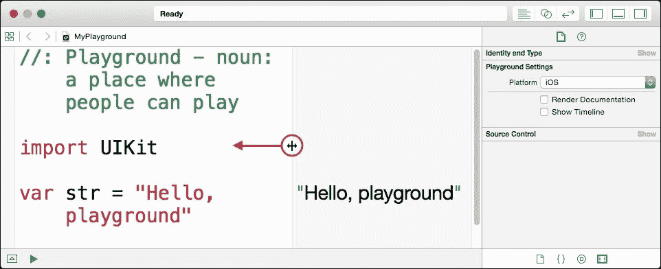

或者，通过将鼠标移至 playground 的右侧，将出现 **快速查看** 图标（眼睛符号）。如果点击它，将显示一个弹出框，显示完整详情：

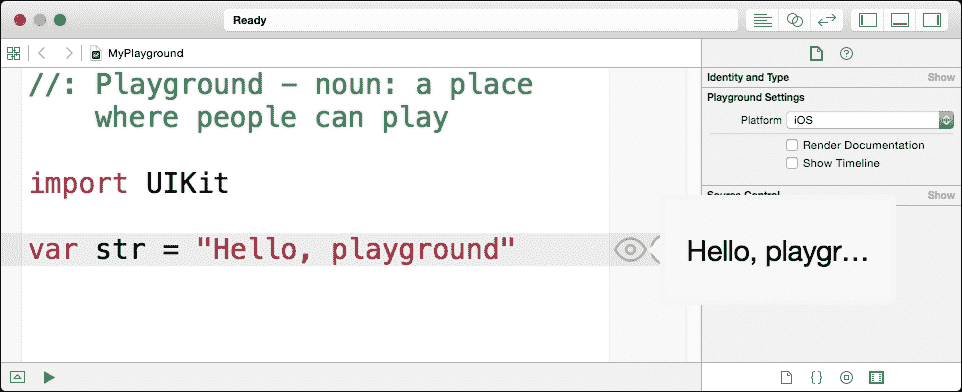

## 查看控制台输出

控制台输出可以在*调试区域*中查看。这可以通过按*Command* + *Shift* + *Y*或通过导航到**查看** | **调试区域** | **显示调试区域**来实现。这将显示代码中执行的任何`print`语句的结果。

在游乐场中添加一个简单的`for`循环：

```swift
for i in 1...12 {
  print("I is \(i)")
}
```

输出显示在下面的调试区域中：

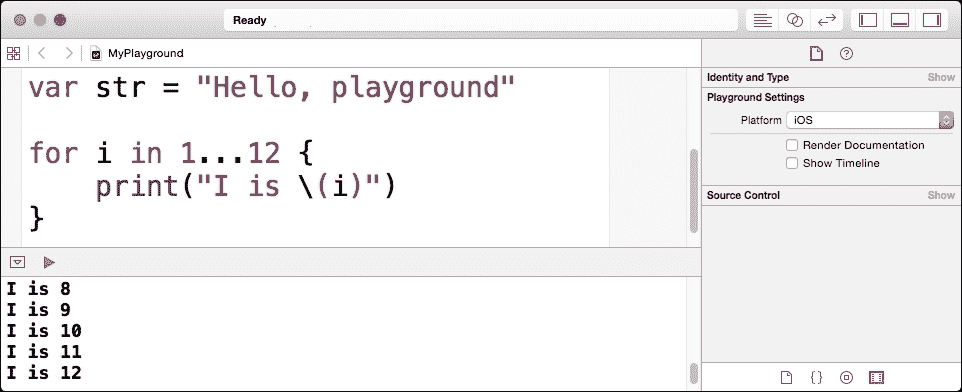

## 查看时间线

时间线显示了特定时间点的值。在之前显示的打印循环的情况下，输出显示在**调试区域**中。然而，可以使用游乐场来检查表达式在行上的值，而无需直接显示它。此外，结果可以绘制成图表，以显示这些值随时间的变化。图表的值与源代码在同一行显示，这与 Xcode 的早期版本不同，后者将它们显示在右侧。

在`print`语句上方添加另一行来计算表达式`(i-6)*(i-7)`的执行结果，并将其存储在`j`常量中。

在变量定义旁边的行上，点击添加变量历史（**+**）符号，该符号位于右侧列（当鼠标移过该区域时可见）。点击后，它将变为（**o**）符号，并在右侧显示图表。这也可以应用于`print`语句：

```swift
for i in 1...12 {
  let j = (i-7) * (i-6)
  print("I is \(i)")
}
```

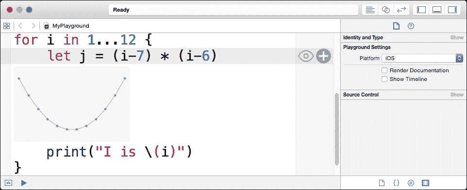

通过在**实用工具**区域中选择**显示时间线**复选框，可以在窗口底部显示时间线滑块。这将添加一个带有红色标记的时间线滑块在底部，并且可以使用它来滑动垂直条以查看特定点的确切值：

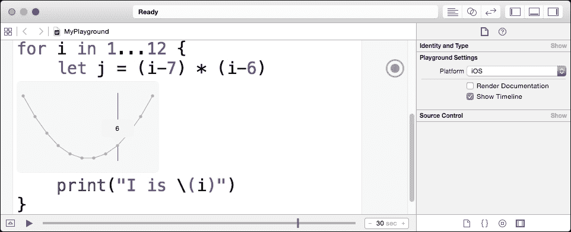

要同时显示多个值，请使用额外的变量来保存这些值，并在时间线中显示它们：

```swift
for i in 1...12 {
  let j = (i-7) * (i-6)
  let k = i
  print("I is \(i)")
}
```

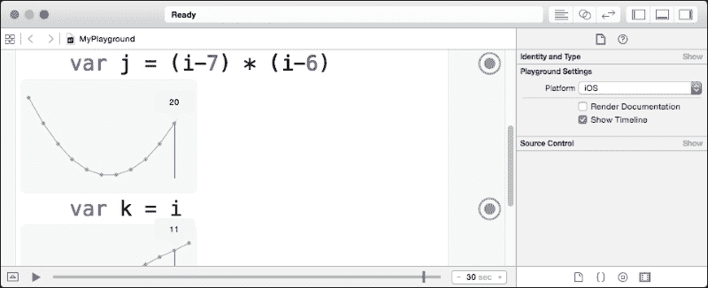

当拖动时间线滑块时，两个值将同时显示。

# 使用快速查看显示对象

游乐场时间线可以显示对象以及数字和简单的字符串。使用类，如`UIImage`（或在 OS X 上的`NSImage`）可以在游乐场中加载和查看图像。这些被称为*快速查看支持的对象*，默认包括：

+   字符串（有归属和无归属）

+   视图

+   类和结构体类型（成员显示）

+   颜色

### 小贴士

通过实现返回数据图形视图的`debugQuickLookObject`方法，可以将对自定义类型的支持构建到 Swift 中。

## 显示彩色标签

要显示彩色标签，首先需要获取颜色。当针对 iOS 构建时，这将使用`UIColor`；但当针对 OS X 构建时，它将使用`NSColor`。这两个方法类型在很大程度上是等效的，但本章将演示使用 iOS 类型。

可以通过初始化器或使用 Swift 中暴露的预定义颜色之一来获取颜色，如下所示：

```swift
import UIKit // AppKit for OS X
let blue = UIColor.blueColor() // NSColor.blueColor() for OS X
```

### 小贴士

在 Xcode 7.1 及以上版本中，可以从颜色选择器中直接拖动颜色到 Swift 代码中，它将被转换为具有特定硬编码颜色值的颜色初始化器。

颜色可以用作 `UILabel` 的 `textColor`，它以特定的大小和颜色显示文本字符串。`UILabel` 需要一个大小，这由一个 `CGRect` 表示，并且可以使用 `x` 和 `y` 位置以及 `width` 和 `height` 来定义。`x` 和 `y` 位置对于游乐场来说不相关，因此可以将其保留为零：

```swift
let size = CGRect(x:0,y:0,width:200,height:100)
let label = UILabel(frame:size)// NSLabel for OS X
```

最后，文本需要以蓝色和更大的字体大小显示：

```swift
label.text = str // from the first line of the code
label.textColor = blue
label.font = UIFont.systemFontOfSize(24) // NSFont for OS X
```

当游乐场运行时，颜色和字体将在时间轴上显示，并且可供快速查看。尽管显示的是相同的 `UILabel` 实例，但时间轴和快速查看值显示了对象在每个点的状态快照，这使得查看变化之间发生的事情变得容易：

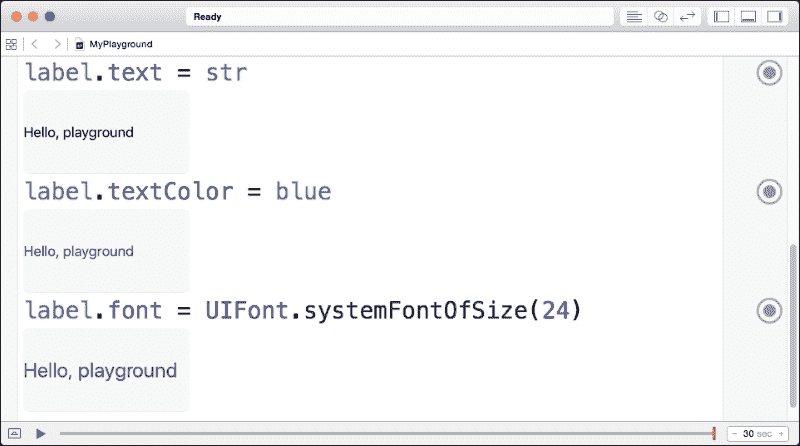

## 显示图片

可以使用 `UIImage` 构造函数（或在 OS X 上的 `NSImage`）创建和加载到游乐场中。两者都接受一个 `named` 参数，该参数用于从游乐场的 `Resources` 文件夹中查找和加载具有给定名称的图像。

要将文件复制到游乐场的 `Resources` 文件夹，首先下载一个图像，例如 `http://alblue.bandlem.com/images/AlexHeadshotLeft.png`，并将其保存为 `alblue.png` 在一个合适的位置，如 `桌面`。为了将其添加到游乐场，需要使用 *Command* + *1* 或通过导航到 **视图** | **导航器** | **显示项目导航器** 打开项目导航器。一旦打开，文件可以拖放到树中的 `Resources` 元素：


### 小贴士

Xcode 7.1 允许直接将图片拖动到源代码区域。它将填充一个 `UIImage`（或 `NSImage`），并将其复制到资源区域。Xcode 7.0 及以下版本如果拖动图片，则仅复制源文件的完整路径。

或者，要使用命令行下载徽标，打开 `Terminal.app` 并运行以下命令：

```swift
$ mkdir MyPlayground.playground/Resources
$ curl http://alblue.bandlem.com/images/AlexHeadshotLeft.png > MyPlayground.playground/Resources/alblue.png

```

现在可以使用以下方式在 Swift 中创建图像：

```swift
let alblue = UIImage(named:"alblue")
```

### 小贴士

与游乐场关联的 `Resources` 的位置可以在 **文件检查器** 工具视图中查看，该工具可以通过按 *Command* + *Option* + *1* 打开。

创建的图像可以使用 **快速查看** 或将其添加到值历史记录中显示：

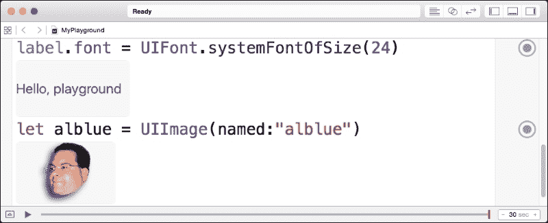

### 小贴士

可以通过创建一个 `NSURL` 对象 `NSURL(string:"http://...")!` 来使用 URL 获取图像，然后使用 `NSData(contentsOfURL:)!` 加载 URL 的内容，最后使用 `UIImage(data:)` 将其转换为图像。然而，由于 Swift 会反复执行代码，URL 在单个调试会话中会被多次访问而不会缓存。建议在 playground 中避免使用 `NSData(contentsOfURL:)` 和类似的网络类。

# 高级技巧

playground 有自己的 `XCPlayground` 框架，可以用来执行某些任务。例如，可以在循环中捕获单个值以供后续分析。它还允许在 playground 完成运行后继续执行异步代码。

## 显式捕获值

可以通过导入 `XCPlayground` 框架并使用 `XCPlaygroundPage.currentPage`，然后调用 `captureValue` 方法来显式地向时间轴添加值，该方法需要一个标识符，该标识符既用作标题，也用于在相同系列中分组相关的数据值。当选择值历史按钮时，它实际上会插入一个调用 `captureValue` 的调用，其中表达式的值作为标识符。

例如，要自动将徽标添加到时间轴上：

```swift
import XCPlayground
let page = XCPlaygroundPage.currentPage
let alblue = UIImage(named:"alblue")
page.captureValue(alblue, withIdentifier:"Al Blue")
```

打开 **辅助编辑器** 将会显示时间轴以及记录的值：


可以使用标识符来分组循环中显示的数据，标识符代表值的类别。例如，要显示 `1` 到 `6` 之间所有偶数和奇数的列表，可以使用以下代码：

```swift
for n in 1...6 {
  if n % 2 == 0 {
    page.captureValue(n,withIdentifier:"even")
    page.captureValue(0,withIdentifier:"odd")
  } else {
    page.captureValue(n,withIdentifier:"odd")
    page.captureValue(0,withIdentifier:"even")
  }
}
```

执行后，结果将看起来像：

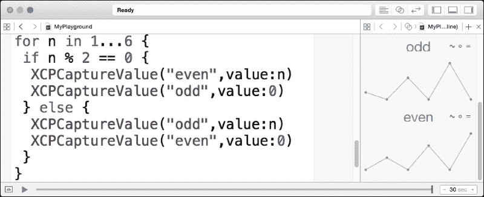

## 运行异步代码

默认情况下，当执行到达当前 playground 页面的末尾时，执行会停止。在大多数情况下这是期望的，但当涉及异步代码时，即使主代码已经执行完成，执行可能还需要继续运行。这可能涉及网络数据或存在多个需要同步结果的任务。

例如，将之前的偶数/奇数分割包裹在一个异步调用中，将不会显示任何数据：

```swift
dispatch_async(dispatch_get_main_queue()) {
  for n in 1...6 {
    // as before
  }
}
```

### 小贴士

这使用了 Swift 的一种语言特性：`dispatch_async` 方法，它实际上是一个接受队列和块类型的两个参数的方法。然而，如果最后一个参数是块类型，那么它可以表示为一个尾随闭包而不是一个参数。

要允许 playground 在达到末尾后继续执行，请添加以下赋值：

```swift
page.needsIndefiniteExecution = true

```

虽然这表明执行将永远运行，但它被限制在 30 秒的运行时间内，或者屏幕右下角显示的任何值。可以通过输入新值或使用**+**和**–**按钮来增加/减少一秒来更改此超时。此外，可以通过点击窗口左下角的方块图标来停止执行：


# 游乐场与文档

游乐场可以包含代码和文档的混合。这允许将一组代码、示例和说明与游乐场本身混合在一起。

## 使用游乐场学习

由于游乐场可以包含代码和文档的混合体，这使得它们成为查看注释代码片段的理想格式。实际上，Apple 的 Swift Tour 手册可以作为一个游乐场文件打开。

可以通过导航到**帮助** | **文档和 API 参考**或按*Command* + *Shift* + *0*来搜索 Xcode 文档。在显示的搜索对话框中，键入`Swift Tour`并选择第一个结果。Swift Tour 手册应该在 Xcode 的帮助系统中显示，如下所示：


在第一部分提供了一个下载并作为游乐场打开文档的链接；如果下载，它可以在 Xcode 中以独立游乐场的形式打开。这提供了相同的信息，但它允许代码示例是动态的，并在窗口中显示结果：

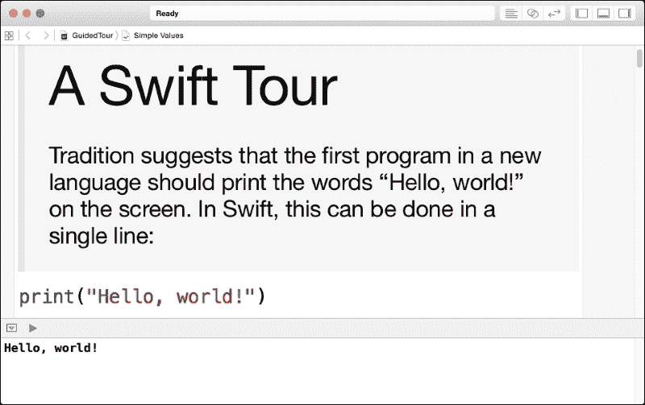

通过基于游乐场文档的学习方式的一个关键优势是代码可以进行实验。在文档的*简单值*部分，其中`myVariable`被分配，游乐场的右侧显示了值。如果更改了字面数字，新的值将被重新计算并在右侧显示。

## 理解游乐场格式

游乐场是一个*OS X bundle*，这意味着它看起来像一个单独的文件。如果在`TextEdit.app`或`Finder`中选择游乐场，它看起来就像一个普通文件：


在幕后，它实际上是一个目录：

```swift
$ ls -F
MyPlayground.playground/

```

在目录内，有一些文件：

```swift
$ ls -1 MyPlayground.playground/*
MyPlayground.playground/Contents.swift
MyPlayground.playground/Resources
MyPlayground.playground/contents.xcplayground
MyPlayground.playground/playground.xcworkspace
MyPlayground.playground/timeline.xctimeline

```

文件如下：

+   `Contents.swift`文件，这是创建新游乐场时默认创建的 Swift 文件，它包含任何新游乐场内容的输入代码

+   之前创建的`Resources`目录，用于存储标志图像

+   `contents.xcplayground`文件，是构成游乐场的文件的 XML 目录表

+   `playground.xcworkspace`，用于在 Xcode 中存储项目元数据

+   `timeline.xctimeline`文件，包含执行 Swift 文件时由运行时生成的执行时间戳文件，当时间线打开时

目录文件定义了正在针对哪个运行时环境（例如，iOS 或 OS X）以及时间线文件的引用：

```swift
<playground version='5.0' target-platform='ios' requires-full-environment='true' timelineScrubberEnabled='true' display-mode='raw'>
  <timeline fileName='timeline.xctimeline'/>
</playground>
```

### 小贴士

当在 Xcode 中进行更改时，Xcode 的 playground 目录会被删除并重新创建。在该目录中打开的任何 `Terminal.app` 窗口将不再显示任何文件。因此，使用外部工具或就地编辑文件可能会导致更改丢失。此外，使用过时的控制系统版本，如 SVN 和 CVS，可能会在保存之间丢失版本控制元数据。Xcode 随带行业标准的 Git 版本控制系统，应优先使用。

## 添加页面

默认情况下，Xcode playground 只打开一个页面。然而，对于更全面的文档示例，可能更倾向于多个单独的页面。例如，与其创建一个包含子标题的非常长的页面（这可能需要一些时间来解释和执行），不如添加额外的页面，每个页面都有其特定的示例。这也具有这样的优势，即可以交互式地实验代码，因为只有页面上的示例需要重新计算。

要向现有的 playground 添加新页面，在项目导航器中右键单击 **MyPlayground** 顶级元素，并选择 **New Playground Page** 菜单项。或者，导航到 **文件** | **新建** | **Playground 页面** 或其快捷键，*Command* + *Option* + *N*。完成此操作后，第一个页面变为 **未命名页面**，新添加的页面变为 **未命名页面 2**：

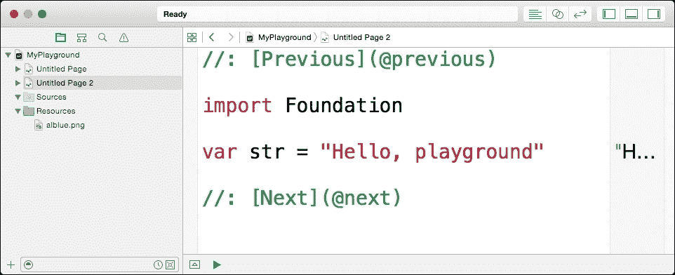

可以通过在左侧的项目导航器中拖放页面来重新排序页面。还可以通过选择页面，然后单击它以显示可以重命名的文本字段来重命名页面。这与在 `Finder` 中重命名文件类似。文档的 `@previous` 和 `@next` 链接允许读者在以下部分中描述的页面上导航。

### 注意

当与具有页面的 playground 一起工作时，`contents.xcplayground` 文件的版本号更新为 `6.0`，并创建一个新的 `Pages` 目录，该目录位于 `Resources` 顶级文件夹旁边。在 `Pages` 目录中，每个页面都表示为其自己的 `.xcplaygroundpage` 文件夹，其中包含一个 `Contents.swift` 文件和一个单独的 `timeline.xctimeline` 文件。

## 代码文档化

Swift 2 采用了新的文档标记方案，用于与 playground 一起使用，同时也用于文档化 Swift 代码。因此，文档注释被描述为适用于 *Playground 注释* 或 *符号文档*。

游乐场注释以 `//:` 开头用于单行注释，并使用 `/*:` 和 `*/` 用于块级注释。这些在游乐场中作为内联文档呈现，并取代了先前版本的 Xcode 中存在的嵌套 HTML。标记默认显示为原始文本，但可以通过导航到 **编辑器** | **显示渲染标记** 来查看渲染内容。要将它切换回显示原始标记并允许编辑文本，请导航到 **编辑器** | **显示原始标记**。此设置也保存在 `xcplayground` 文件中，带有 `display-mode='rendered'` 或 `display-mode='raw'` 属性。

符号文档以 `///` 开头用于单行注释，并使用 `/**` 和 `*/` 用于块级注释。符号文档适用于变量和常量、函数和类型。符号定义上方只能有一个类型的符号文档注释（单行或多行，但不能同时存在）。多个连续的单行注释将被合并为一个块。

### 小贴士

符号文档可以通过在标识符上按下 *Command* + *Control* + *?* 来揭示，或者通过在 Xcode 中按下 *Alt* 并单击标识符来揭示。

无论是游乐场还是符号文档，都允许使用一些标记来格式化文本。此外，还有一些可以指定为带有短横线的符号 *格式命令*，后跟命令名称和冒号。这些用于引入文档，例如，对于函数的特定参数、返回类型或抛出的错误。

### 游乐场导航文档

在多页游乐场中，可以在页面之间创建导航链接。每个页面都有一个名称（最初为 **未命名页面**、**未命名页面 2** 等），但可以在项目导航器中重命名。

要重命名页面，请使用 *Command* + *1* 打开项目导航器，然后在导航视图中选择页面。可以通过双击页面名称使其可编辑，从而将其转换为文本字段：

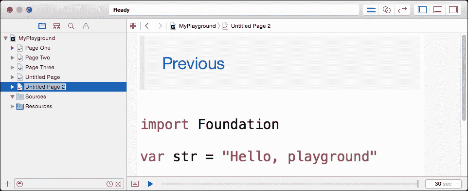

通过链接到特定页面来执行，链接表示为 `链接名称`。例如，要创建到刚刚显示的第一个页面的链接，可以使用以下内容：

```swift
//: Go back to the first page
```

### 小贴士

页面名称中的空格需要使用 URL 转义，因此空格表示为 `%20`。使用 `+` 是无效的。

由于页面名称可能很脆弱，建议使用 **下一页** 和 **上一页** 链接。这些可以使用 `@next` 和 `@previous` 特殊标识符来表示页面名称，如下所示：

```swift
//: Go back to the previous page,
//: or move forward to the next page.
```

建议使用 `@next` 和 `@previous` 来连接多个页面，因为这允许在不修改内容的情况下重新排序页面。可以通过在项目导航器中拖放项目上下来重新排序页面。

### 注意

页面导航仅在游乐场中可用。

### 文本格式化

游戏场和符号文档可以使用多种不同的格式化样式，使用标记语言来表示不同类型的文本。以下是一些：

+   列表项，使用`*`、`+`或`–`字符之一作为项目符号，后跟一个空格和文本

+   编号列表，使用数字，后跟一个点，一个空格和文本

+   水平线，使用四个破折号`----`在文本中生成水平线

+   引用块，每行以`>`后跟一个空格开始

+   块代码，要么从开头缩进四个空格，要么以```swift`` ```` ```swift``
*   Headings, using `#`, `##`, or `###` for level 1, 2, or 3 headings, respectively. Alternatively, heading level 1 can use a `===` underneath the title and heading level 2 can use `---` underneath the title

### Tip

Exactly a single space is required between the end of the list delimiter (the bullet or the period) and the following text; otherwise it will not be rendered as expected

In addition to the block-level formatting, it is possible to use in-line formatting elements:

*   Code can be represented with `` `backticks` `` around the words
*   Text can be emphasized in italics `_like this_` or `*like this*`
*   Text can be marked as bold using `__this__` or `**this**`

Images and links can also be used in documentation:

*   Images are represented with ``
*   Links are represented with `link text`
*   Links can also be declared with `[link title]: url "hover text"`, and then referred to later with `[link title]`

For example, here is a markup block consisting of many single-line comments, which will be concatenated into a single documentation block:

```开始和结束

//: # 示例文档

//: 导航到上一页或下一页页面

//: ----

//: 列表项：

//: 1\. 第一项

//: 2\. 第二项

//: 3\. 第三项

//:

//: 列表项：

//: * 第一项

//: * 第二项

//:   + 子项

//:   + 子项

//: * 第三项

//:

//: 如何使用`for`在 Swift 中做循环：

//:

//:     for i in 1...12 {

//:       print("Looping \(i)")

//:     }

//:

//: > 这是一个引用块

//: > 这被合并在一起

//: > 使用斜体或**粗体**

//:

//: 链接到[AlBlue 的博客](http://alblue.bandlem.com)

//: 

```swift

When viewed in a rendered markup view, it will look like:

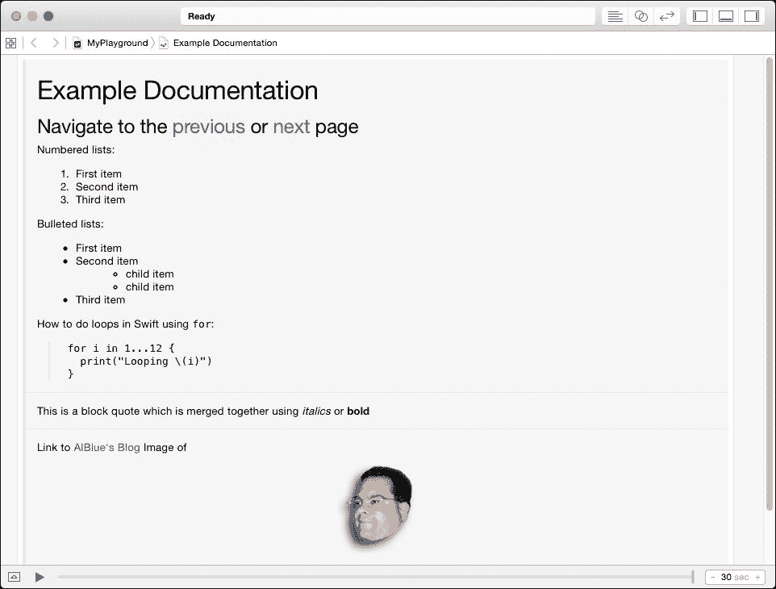

### Symbol documentation

When writing documentation for symbols (variables, constants, functions, and so on), additional commands can be used to indicate particular values. These are represented with a `–` dash, followed by a command name, and then a colon. These include the following:

*   `- parameter name: description`: This is the `description` of a `parameter` called `name` in the function or method
*   `- parameters:`: This is a group of related `parameter` elements
*   `- returns: description`: This is the `description` of the return result
*   `- throws: description`: This is the `description` of any errors that may occur

There are also a number of field commands that can be used with symbols. These are all represented with `– name: description`, and they all have exactly the same effect but with a different text name in the symbol reference. These include the following:

*   `author`: This is the name of the author who wrote this section.
*   `authors`: This is a series of paragraphs with one author name per paragraph.
*   `bug`: This is a description of a known bug.
*   `complexity`: This is a description of the complexity of the function, such as `O(1)` or `O(N)`. Use `\*` to represent an escaped `*` character or to denote higher orders, for example, `O(N\*N)`.
*   `copyright`: This is a copyright statement.
*   `date`: This is a date reference; please note that the text field is not parsed in any way.
*   `experiment`: This is a block-denoting experiment.
*   `important`: This marks something as important.
*   `invariant`: This describes an invariant of the function.
*   `note`: This introduces a note.
*   `precondition`: This describes what must be true for the function that has to be called.
*   `postcondition`: This describes what must be true after the function returns.
*   `remark`: This adds general notes to the symbol.
*   `requires`: This notes what is required, such as module dependencies, or a minimum version of the operating system.
*   `seealso`: This adds a **See Also** link to the documentation.
*   `since`: This is documentation indicating when the functionality first arrived.
*   `todo`: This adds a note to do later.
*   `version`: This documents the version number of the location.
*   `warning`: This adds a warning note.

The following combines a number of these documentation examples into a multi-line documentation block:

```

/**

返回大写字母的字符串

- 参数 input：输入字符串

- 作者：Alex Blewitt

- 返回值：输入字符串，但为大写

- 抛出：不抛出错误

- 注意：请不要大喊大叫

- 参考信息：String.uppercaseString

- 自：2015

*/

func shout(input:String) -> String {

return input.uppercaseString

}

```

当鼠标悬停在`shout`函数上时，将看到以下文档：

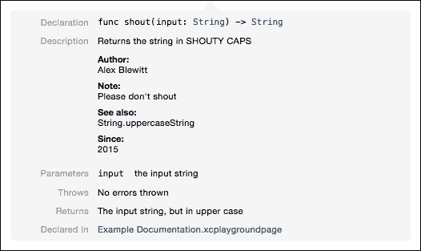

# 游戏场的限制

虽然游戏场可以非常强大地与代码交互，但也有一些值得注意的限制。游戏场中没有调试支持，因此无法添加断点并使用调试器来找出值。

由于 UI 允许跟踪值——并且只需添加新行并跟踪值就非常容易——这并不是什么大问题。游戏场的其他限制包括以下内容：

+   只有模拟器可以用于执行基于 iOS 的游戏场。这防止了使用可能仅在设备上存在的特定硬件功能。

+   游戏场脚本的性能主要基于执行了多少行代码以及调试器保存了多少输出。它不应用于测试对性能敏感的代码的性能。

+   虽然游戏场非常适合展示用户界面组件，但不能用于用户输入。

+   在当前写作时，需要权限（如应用内购买或访问 iCloud）的功能在游戏场中是不可能的。

# 摘要

本章介绍了游乐场，这是一种运行 Swift 代码的创新方式，它通过图形化展示值和运行代码的检查来呈现。表达式和时序都被展示为显示程序在任何时刻状态的方式，以及使用快速查看（Quick Look）图形化检查对象。`XCPlayground` 框架还可以用来记录特定值，并允许异步代码执行。

下一章将探讨如何使用 Swift 创建 iOS 应用程序。
