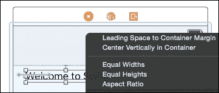

# 第四章. 使用 Swift 和 iOS 的 Storyboard 应用

Storyboard 首先在 Xcode 4.2 和 iOS 5.0 中引入。Storyboard 解决了在 iOS 应用程序中图形化展示屏幕流程的问题，并且还提供了一种方法，可以在一个地方而不是多个单独的 `xib` 文件中编辑这些屏幕的内容。Storyboard 与 Swift 的工作方式与 Objective-C 相同，*Swift 和 storyboard* 部分展示了如何将 Swift 代码与 storyboard 切换集成。

本章将介绍以下主题：

+   如何创建 storyboard 项目

+   创建多个场景

+   使用切换在场景之间导航

+   编写自定义视图控制器

+   在 Swift 中将视图连接到输出口

+   使用自动布局排列视图

+   使用约束构建可调整大小的视图

# Storyboard、场景和切换

默认情况下，Xcode 7 为新创建的 iOS 项目创建一个 `Main.storyboard` 文件，而不是 `MainWindow.xib` 文件。`Info.plist` 文件中的 `UIMainStoryboardFile` 键指向应用程序的主 storyboard 名称（不带扩展名）。当应用程序启动时，将加载 `Main.storyboard` 文件而不是 `NSMainNib` 条目。Xcode 的早期版本允许开发者选择是否使用 storyboard，但 Xcode 7 中，storyboard 是默认选项，开发者无法轻易选择退出。尽管如此，仍然可以使用 `xib` 文件为应用程序的各个部分或用于加载原型表格单元格的自定义类。此外，Xcode 7 创建一个 `LaunchScreen.storyboard` 文件，在应用程序加载时显示为启动画面（在 iOS 8 及更高版本上），优先于固定分辨率的预渲染屏幕。这允许具有许多不同分辨率的设备（包括未来未宣布的设备）渲染像素完美的启动画面，而无需为每个新设备尺寸渲染不同分辨率的画面。

*Storyboard* 是由 *segues*（发音为 *seg-ways*）连接的 *场景*（独立的屏幕）集合。每个场景由一个 *视图控制器* 表示，它有一个相关的 *视图*。切换通过可定制的用户界面过渡（如滑动或淡入淡出）在不同场景之间进行转换，并且可以从 UI 控件或以编程方式触发。

## 创建 storyboard 项目

由于 Xcode 7 的默认模板默认使用故事板，因此任何模板都将工作。实际上，每个应用程序模板都设置了一个特定的视图控制器和模板代码。最简单且易于定制的工作模板是**单视图应用程序**，可以通过导航到**文件** | **新建** | **项目…**来选择。创建一个名为 `Storyboards` 的项目，使用单视图应用程序，以实验本章内容。（有关如何创建新应用程序的更多详细信息，请参阅第三章中的*创建单视图 iOS 应用程序*部分，*创建 iOS Swift 应用*。）

## 场景和视图控制器

标准视图控制器可以用来构建应用程序，包括以下内容：

+   使用 `UISplitViewController` 类的分割视图，该类可以包含以下任何一种，但不能嵌入到任何其他视图控制器中

+   使用 `UITabBarController` 类的标签视图，该类可以包含以下任何一种，但只能嵌入到分割视图中或用作根控制器

+   可以使用 `UINavigationController` 类向现有控制器添加导航控件，该类可以包含以下任何一种，并且可以嵌入到前面的任何一种或用作根视图控制器

+   使用 `UIPageViewController` 类的翻页视图，该类提供滑动和翻页显示选项

+   使用 `UITableViewController` 类的表格视图

+   使用 `UICollectionViewController` 类的网格视图

+   使用 `AVPlayerViewController` 类的音频-视频内容

+   使用 `GLKViewController` 类的 OpenGL ES 内容

+   使用 `UIViewController` 类或自定义子类创建自定义控制器内容

这些类可以混合使用，但必须遵循明确的顺序以满足苹果的**人类界面指南**（也称为**HIG**）。这些都是可选的，但如果组合使用，则需要遵守此顺序：


除了标准视图控制器类之外，还可以使用自定义子类。这将在本章后面的“自定义视图控制器”部分中更详细地介绍。

## 向场景添加视图

可以通过在项目导航器中单击文件来打开 `Main.storyboard` 文件。将打开一个编辑器，它将故事板显示为一系列场景，同时在左侧显示文档大纲。在单页应用程序中，只有一个视图控制器存在。


视图控制器左侧的箭头表示此场景是 *初始视图控制器*。这也可以通过选择场景中的 **视图控制器** 并导航到 *属性检查器*（转到 **视图** | **实用工具** | **显示属性检查器**，或按 *Command* + *Option* + *4*）来设置。也可以通过拖放箭头指向不同的场景来将初始视图控制器更改为不同的场景。

通过从 Xcode 右下角的 *对象库* 中拖放来添加视图。可以通过导航到 **视图** | **实用工具** | **显示对象库**，或者按 *Command* + *Option* + *Control* + *3* 来显示对象库。点击一个视图，例如 **标签**，然后将其拖放到视图中：


可以通过在视图中双击标签并输入或通过选择对象并在属性检查器中编辑文本属性来修改标签的文本内容：


当元素被拖动时，可能会显示蓝色引导线。它们建议视图的位置；标准做法是在视图和屏幕边缘之间保持 20pt 的间隔，在相邻视图之间保持 8pt 的间隔。

将 **欢迎使用 Swift** 标签拖放到场景的左上角，然后从对象库中拖放一个 **按钮** 到场景中。将按钮的标题重命名为 **按我**。此按钮应与标签保持标准空间（8pt）的距离，并对齐在基线（文本自然坐落的水平）上。


### 注意

在此阶段，视图中的文本在用户界面文件中是硬编码的，对齐是手动的，这意味着如果修改父视图，视图将不会调整大小。这些问题将在本章后面的 *将视图连接到 Swift 中的出口* 和 *使用自动布局* 部分中解决。

要在模拟器中查看故事板，请点击顶部的 **播放** 按钮，或按 *Command* + *R* 来运行应用程序。应该会显示一个包含 **欢迎使用 Swift** 和 **按我** 的窗口。在此阶段，按按钮将没有效果，这将在下一节中修复。

## 转场

*转场* 是在故事板中转到不同场景的过渡。转场可以连接到屏幕上的视图，也可以通过代码触发。最常见的过渡是当用户在用户界面中选择了视图，例如按钮、表格行或详情图标时，会显示新的场景。

为了演示过渡，需要一个新场景。从对象库中拖动一个**View Controller**并将其拖放到故事板中。视图控制器的确切位置无关紧要，但传统上，场景按照它们将被查看的顺序从左到右组织，因此建议将其拖放到现有视图控制器的右侧，如下面的截图所示：


一旦添加了**View Controller**，将标签拖到左上角并将文本更改为**请不要再按此按钮**。这将提供一个视觉线索，表明当跟随过渡时屏幕已更改。

现在，选择**Press Me**按钮，在拖动鼠标的同时按住**Control**键到新创建的视图控制器。当鼠标按钮释放时，将显示一个弹出菜单，其中包含多个选项，这些选项被分组为**动作过渡**和**非自适应动作过渡**。前者是首选的；后者仅用于向后兼容，未来可能会被移除。


### 小贴士

或者，可以从左侧的*文档大纲*中选择该对象，并将其拖到文档大纲下的对象。可以从编辑器区域中的视图拖动到文档大纲中的对象，反之亦然。将拖动到文档大纲有时更快、更准确，尤其是在故事板中有多个场景时。可以通过导航到**编辑器** | **显示文档大纲**来显示文档大纲，如果它不可见，或者通过点击编辑器左下角的图标。

选择**显示**选项，将在两个视图之间创建一个过渡。这表示为连接它们的箭头和文档大纲中的另一个对象。圆形过渡线内的图标显示了将发生的过渡类型；**推送**将有一个指向左边的箭头，而**模态显示**将表示为一个方形框。**弹出**类型将在过渡中显示一个小弹出图标。


在模拟器中运行应用程序并点击**Press Me**按钮。应该会弹出一个窗口并显示第二条消息。

### 注意

将无法关闭或退出第二个屏幕。这是故意的，将在下一节中修复。

# 添加导航控制器

当有多个屏幕需要显示时，需要一个父控制器来跟踪当前显示哪个屏幕以及下一步（或上一步）是什么。这就是*导航控制器*的目的；尽管它没有直接的可视表示，但在故事板中它被表示为一个场景，并且可以影响故事板中各个元素的位置布局。

要将初始场景嵌入到导航控制器中，选择初始视图，然后转到**编辑器** | **嵌入** | **导航控制器**。这将创建一个新的导航控制器视图并将其放置在第一个场景的左侧。它还将初始视图控制器更改为导航控制器，并在导航控制器和第一个场景（由一个类似百分符号的图标表示，但线条方向相反）之间设置名为**root view controller**的*关系转换*：


有必要将标签和按钮移动到新添加的导航栏下方，以便它们仍然可见。这可以在引入导航控制器之前完成，或者通过选择重叠的对象来完成。

要暂时隐藏导航栏，删除导航控制器和欢迎场景之间的关系转换，导航栏将消失。这将允许暂时选择并移动对象到其他地方，以便重新定位。要再次添加它，按住*Control*键并将鼠标光标从导航控制器拖动到欢迎场景，并在**关系转换**下选择**root view controller**；或者，在属性检查器中将**顶栏**属性设置为**无**。

或者，要选择重叠的对象，首先在文档大纲中选择对象，以便显示拖动框的位置。然后，按住*Shift*键并右键单击它，以在任何深度显示鼠标位置下的对象弹出菜单。从这里，可以选择对象，然后使用箭头键将其移动到其他位置。


现在当应用程序运行并点击**Press Me**按钮时，消息将再次显示，但还会显示一个**< 返回**导航菜单项，如下所示：


## 命名场景和视图

当处理许多场景时，将它们全部称为**视图控制器场景**没有帮助。为了区分它们，可以在故事板编辑器中重命名控制器。

要更改场景的名称，请在文档大纲中选择其视图控制器，然后转到**视图** | **实用工具** | **显示属性检查器**，或者按*Command* + *Option* + *3*，然后钻到**文档**部分，其中标签提示将显示为**文档标签**。输入另一个值，例如`Press` `Me`，`Message`或`Initial`，将重命名文档大纲中的视图控制器和场景：


### 小贴士

默认情况下，文档大纲中元素的名称取自元素的文本值或如果没有文本值则取类型。这意味着标签或按钮文本的更新将自动反映在大纲中。然而，可以在文档大纲中的任何视图中添加文档标签。

# Swift 和故事板

到目前为止，本章中的故事板内容不涉及任何 Swift 或其他编程内容——它使用了故事板编辑器的拖放功能。幸运的是，使用自定义视图控制器（*custom view controller*）集成 Storyboard 和 Swift 非常容易。

## 自定义视图控制器

每个标准视图控制器都有一个相应的超类（在本章之前提到的*场景和视图控制器*部分中列出）。这可以被替换为自定义子类，然后它就有能力影响和改变用户界面中发生的事情。要替换**Message Scene**中的消息，创建一个名为`MessageViewCotroller.swift`的新文件，并包含以下内容：

```swift
import UIKit
class MessageViewController: UIViewController {
}
```

创建了这个类之后，可以通过在故事板中选择它，然后通过导航到**View** | **Utilities** | **Show Identity Inspector**或按*Command* + *Option* + *3*来切换到身份检查器来将其与视图控制器关联。在**Custom Class**部分，**Class**将显示`UIViewController`作为提示。在这里输入`MessageViewController`将自定义控制器与视图控制器关联：


这将对消息场景没有明显的影响；运行应用程序将与之前相同。要显示差异，创建一个带有`override`关键字的`viewDidLoad`方法，然后创建一个随机的背景颜色，如下所示：

```swift
override func viewDidLoad() {
  super.viewDidLoad()
  let red = CGFloat(drand48())
  let green = CGFloat(drand48())
  let blue = CGFloat(drand48())
  view.backgroundColor = UIColor(
    red:red,
    green:green,
    blue:blue,
    alpha:1.0
  )
}
```

运行应用程序并按下**Press Me**按钮会导致每次创建不同颜色的视图。

### 提示

这并不展示良好的用户体验，但在这里使用它来展示每次发生转场时都会调用`viewDidLoad`的事实。它通常用于在向用户显示视图之前设置视图状态。

## 在 Swift 中将视图连接到出口

每个视图控制器都有一个与其视图的隐式关系，每个视图都有自己的`backgroundColor`属性。这个例子将适用于任何视图。如果视图控制器需要以某种方式与视图的内容交互呢？视图控制器可以程序性地遍历视图，寻找特定类型的视图或具有特定标识符的视图，但有一种更好的方法来做这件事。

接口构建器和故事板都有*出口（outlets）*的概念，它们是在类中的一个预定义点，可以公开并可以在 UI 和代码之间建立连接。在 Objective-C 中，这是通过`IBOutlet`限定符来实现的。在 Swift 中，这是通过`@IBOutlet`属性来实现的。实际上，它们是可以绑定到 UI 的变量。

### 注意

当定义一个具有`@IBOutlet`属性的类时，`@objc`属性也会隐式添加，标记这个 Swift 类使用 Objective-C 运行时。由于所有`UIKit`类已经是 Objective-C 类型，这并不重要；但对于不应该使用 Objective-C 运行时的类型，在添加属性时，如`@IBOutlet`，应小心谨慎。`@objc`属性也可以用于需要使用 Objective-C 运行时的非 UI 类。

创建 Swift 视图控制器中的输出需要以下步骤：

1.  在视图控制器代码中使用`@IBOutlet` `weak` `var`定义一个可选类型的输出。

1.  通过按*Control*并从视图拖动鼠标光标到输出，将视图控制器中的输出连接到视图。

要这样做，请按*Command* + *Option* + *Enter*或转到**视图** | **辅助编辑器** | **显示辅助编辑器**来打开**辅助编辑器**。这将显示关联源文件的并排视图。这对于显示故事板中选定的视图的关联自定义视图控制器非常有用（或接口文件）。

一旦显示辅助编辑器，从故事板中打开**消息场景**，按*Control*并从消息标签拖动鼠标光标到辅助编辑器，并在类声明后释放鼠标。


一个弹出对话框将询问如何命名字段并显示一些其他信息；确保选择**输出**，命名为`message`，并确保它具有**弱**存储类型：


这将在`MessageViewController`类中添加以下行，并将标签连接到属性如下：

```swift
class MessageViewController: UIViewController {
  @IBOutlet weak var message: UILabel!
  … 
}
```

`@IBOutlet`属性（在`UIKit`中定义）允许界面构建器绑定到属性。**弱**存储类型——可以在弹出对话框中更改——表示此类不会持有对象的强引用，因此当视图被关闭时，控制器不会拥有它。

### 小贴士

通常，所有`@IBOutlet`连接都应标记为`weak`，因为故事板或`xib`文件是对象的拥有者，而不是控制器。从界面构建器分配属性时，所有权不会传递。将其更改为其他类型可能导致循环引用。由于 Swift 使用引用计数方法来确定对象何时不再被引用，强引用之间的循环引用可能导致内存泄漏。

类型 `UILabel!` 末尾的感叹号表示它是一个**隐式展开的可选类型**。这个属性以可选类型存储，但在使用时访问器代码会自动展开它。由于视图控制器在初始化时不会有对 `message` 的引用，它将是 `nil`，因此必须存储为可选类型。然而，由于在视图加载后知道值不是 `nil`，隐式展开的可选类型节省了每次使用时都会使用的 `?.` 调用。

### 注意

隐式展开的可选类型在底层仍然是一个可选值；每次访问值时在使用的点展开它是语法糖。当视图加载时，但在调用 `viewDidLoad` 方法之前，出口的值将被连接到屏幕上的实例化视图。

这些连接可以在连接检查器中看到，可以通过选择消息标签并按 *Command* + *Option* + *6* 或通过导航到 **视图** | **实用工具** | **显示连接检查器** 来显示检查器。检查器还可以用来删除现有连接或添加新的连接。


现在消息视图和自定义控制器之间已经建立了连接，而不是更改视图的背景颜色，而是更改 `message` 的背景颜色，如下所示：

```swift
message.backgroundColor = UIColor(...)
```

运行应用程序，每次场景显示时消息的背景颜色都会改变：


## 从界面构建器调用动作

与界面构建器中的出口变量一样，*动作*是可以从界面构建器中的视图触发的函数/方法。`@IBAction` 属性用于注释可以连接的方法或函数。

### 注意

与 `@IBOutlet` 类似，在函数上使用 `@IBAction` 会导致编译器隐式地向类添加一个 `@objc` 属性，以强制它使用 Objective-C 运行时。

要在按钮被调用时更改消息，需要一个合适的 `changeMessage`。从历史上看，动作方法的签名是一个返回 `void`、标记为 `IBAction` 并接受 `sender` 参数的方法，该参数可以是任何对象。在 Swift 中，这个签名转换为以下形式：

```swift
@IBAction func changeMessage(sender:AnyObject) { … }
```

然而，在 Swift 中，`sender` 已不再是必需的参数。因此，可以绑定以下签名的动作：

```swift
@IBAction func changeMessage() { … }
```

如果更改签名，必须删除并重新创建任何现有绑定，否则将报告错误。

### 提示

将不带参数的 `func` 转换为带参数的 `func` 是困难的。有一个带参数但不必需的 `func` 更容易。如果不清楚，请选择接受发送者对象的函数签名，然后只需忽略它即可。

`changeMessage`函数可以随机选择一条消息并设置标签上的文本，如下所示：

```swift
let messages = [
  "Ouch, that hurts",
  "Please don't do that again",
  "Why did you press that?",
]
@IBAction func changeMessage() {
  message.text = messages[
    Int(arc4random_uniform(
      UInt32(messages.count)))]
}
```

当函数被调用时，消息文本将更改为数组中定义的值。要调用该函数，需要在故事板编辑器中将其连接起来。从对象库中添加一个新的**按钮**到消息场景，并带有`Change Message`标签。要连接到操作，按*Control*并从**消息场景**中的**更改消息**按钮拖动鼠标光标，并将其放在顶部的**消息**视图控制器上：


然后将显示一个弹出菜单，列出可以连接到的出口和操作。从列表中选择**changeMessage**：


### 小贴士

如果**changeMessage**没有列出，请检查视图控制器是否定义为`MessageViewController`，并验证是否已将`@IBAction`属性添加到`changeMessage`函数中。

现在当应用程序运行并按下**更改消息**按钮时，标签将更改为预定义的值之一。

### 注意

消息标签的大小不会改变，因为与之关联的视图没有自动布局。本章中“使用自动布局”部分解释了如何解决这个问题。

## 使用代码触发 segues

如果需要额外的设置或需要从一个视图控制器传递数据参数到另一个视图控制器（例如当前选定的对象），可以使用代码来触发 segues。

Segues 有命名的**segue 标识符**，在代码中用于触发特定的 segues。为了测试这一点，从库中拖动一个新的**视图控制器**（通过按*Command* + *Option* + *Control* + *3*或通过导航到**视图** | **实用工具** | **显示对象库**）到主故事板，并将其命名为`About`。拖动一个**标签**并给它输入文本：`About` `this` `App`。

接下来，通过按*Control*并拖动鼠标光标在**消息**场景和新的场景之间创建一个 segues。可以通过属性检查器设置命名标识符为`about`（通过按*Command* + *Option* + *4*或通过导航到**视图** | **实用工具** | **显示属性检查器**）：


最后，将一个新的**按钮**拖到**更改消息**场景，并命名为`About`。而不是直接调用 segues，创建一个新的`@IBAction`名为`about`。当这个按钮被按下时，将运行以下代码：

```swift
@IBAction func about(sender: AnyObject) {
  performSegueWithIdentifier("about", sender: sender)
}
```

当按下**关于**按钮时，将显示**关于**屏幕。

## 通过 segues 传递数据

通常，在主从应用程序中，需要将数据从一个场景传递到下一个场景。这可能是指当前选定的对象，或者可能需要传递额外的信息以进行处理。当调用 `segue` 时，会调用视图控制器的 `prepareForSegue` 方法，并带有目的地 `segue` 和发送对象。这允许将视图控制器任何内部状态传递给新的 `segue`。

`UIStoryboardSegue` 包含一个标识符，该标识符在上一节中已设置。由于 `prepareForSegue` 方法可能对 `MessageViewController` 的任意数量的 `segue` 进行调用，因此通常会在标识符上使用 `switch` 语句，以便采取正确的操作。对于单个 `segue`，可以使用以下 `if` 语句：

```swift
override func prepareForSegue(segue: UIStoryboardSegue,
  sender: AnyObject?) {
  if segue.identifier == "about" {
      let dest = segue.destinationViewController as UIViewController
      dest.view.backgroundColor = message.backgroundColor
  }
}
```

在这里，使用 `segue` 调用 `prepareForSegue` 方法，其中包含目的地（场景）和标识符。`if` 语句确保匹配正确的标识符。在这种情况下，消息标签的背景颜色（在视图加载时随机选择）被传递到目的地视图的背景颜色；然而，可以在这里设置视图控制器或视图上的任何属性。

# 使用自动布局

**自动布局（Auto Layout**）已经成为了 Xcode 的几个版本的一部分，并且它的加入是为了支持从之前预 dating Mac OS X 的弹簧和支柱方法向其演变。首次在 iOS 6.0 中发布，它已经发展到可以创建默认的无尺寸依赖的显示。

## 理解约束

在 Xcode 5 中，界面构建器首次默认启用自动布局。当将标签拖动到父视图的顶部或底部时，一条虚线蓝色的线会指示标签被正确地间隔，并且会生成一个 *约束*。

然而，在许多情况下，约束没有被正确创建或者产生了不期望的效果。例如，将按钮放置在顶部中央的位置可能不会保持位置，这取决于添加的约束是绝对位置（距离右侧 200 像素）还是相对位置（屏幕中央）。在这两种情况下，按钮可能看起来被正确地定位，但设备屏幕方向旋转或在不同尺寸的屏幕上运行时可能会失败。

在 Xcode 6 中，尽管指南在视图移动时仍然以视图的形式显示，但不会创建相对约束。相反，每个视图都被赋予了一个确切的硬编码位置，这个位置不会随着屏幕旋转或显示尺寸的改变而改变。

在 Xcode 7 中，自动布局是创建应用的推荐方式，视图会隐式选择自动布局。此外，可以为不同的*大小类别*创建单独的用户界面，这使得像计算器和邮件这样的应用能够根据设备的旋转提供不同的用户界面。在具有将应用并排停靠能力的大屏幕设备上，大小类别用于确定每个应用的外观和行为。

为了恢复正确的行为，必须手动将约束添加到视图中，并且随着手动约束的添加，绝对约束将被移除。

## 添加约束

在示例应用中，“欢迎使用 Swift”标签和“按我”按钮相邻，距离顶部一小段距离。然而，当在模拟器中旋转屏幕时，通过按下*命令*键和左右箭头键，标签与顶部之间的间距不会改变，因此标签看起来更远。

所期望的结果是标签与左上角保持标准距离，按钮与标签的基线对齐。

需要对标签应用两个独立的约束：

+   与父视图的顶部保持标准垂直距离

+   与父视图的左侧保持标准水平距离

需要对按钮应用以下两个约束：

+   与标签的基线对齐

+   与标签保持标准垂直距离

添加约束有不同的方法，以下章节将进行介绍。

### 使用拖放添加约束

添加约束的一个快捷方法是按下*控制*键并从视图拖动鼠标光标到容器的顶部。根据拖动的方向，将显示不同的选项。垂直向上拖动将显示垂直对齐选项：


**垂直间距到顶部布局指南**选项将在导航栏和标签之间插入一个推荐的间隔。还有一个**在容器中水平居中**选项，这也是一种垂直分隔，但在此情况下不适用。

其他激活的类型——**等宽**、**等高**和**宽高比**——允许多个视图相对于彼此进行尺寸调整。

水平拖动将显示顶部的一组不同选项，包括**到容器边距的领先空间**和**在容器中垂直居中**：



如果鼠标以一定角度拖动，将显示两组选项，如下所示：


### 向“按我”场景添加约束

要设置欢迎标签的约束，请按*Control*键并从标签拖动鼠标光标到左侧，并选择**到容器边距的领先空间**。将出现一条橙色线，并显示一个橙色轮廓：


### 注意

橙色线表示一个**模糊的约束**，这意味着已经向视图添加了一些约束，但不足以唯一地定位标签。在这种情况下，标签从容器的左侧定位，但它相对于屏幕的顶部或底部可以是任何位置。红色虚线显示了自动布局算法将放置具有当前指定约束的视图的位置。

要解决这个问题，请按*Control*键并将鼠标指针从标签拖动到顶部并选择**到顶部布局指南的垂直间距**。完成此操作后，将显示两个蓝色的约束，代表关于对象的约束：


### 提示

如果标签周围有一个橙色框，并显示警告信息**在运行时标签的框架将不同**，这可以通过下一节中讨论的**更新框架**选项来修复。

约束也可以在左侧的文档大纲中看到：


如果现在运行应用程序并旋转，标签将正确重新定位，但按钮不会：


### 添加缺失的约束

要找出哪些视图没有约束，请逐个在文档大纲中点击视图，并检查大小检查器（可以通过按*Command* + *Option* + *5*或导航到**视图** | **实用工具** | **显示大小检查器**来查看）。对于已设置约束的视图，将在**约束**部分下显示内容：


如果一个视图没有与之关联的约束，那么本节将是空的。界面构建器有一个选项可以为选定的视图创建缺失的约束，可以通过导航到**编辑器** | **解决自动布局问题** | **添加缺失的约束**或从底部的**解决自动布局问题**菜单（看起来像两条垂直线之间的三角形）来访问。

当选中时，上半部分的选项仅适用于选定的视图，而下半部分的选项作用于选定视图控制器中的所有视图：


选项包括：

+   **更新框架**：这是基于当前约束；它自动重新定位和调整视图的大小，以对应运行时的情况

+   **更新约束**：这是基于对象的当前位置，并尝试重新计算现有的约束（但不创建新的约束）

+   **添加缺失约束**：这是基于组件的大致位置，添加创建相同结果的约束

+   **重置为建议的约束**：这相当于清除与视图相关联的所有约束，然后读取缺失的约束

+   **清除约束**：这会移除与视图相关联的所有约束

要向**Press Me**按钮添加约束，请点击视图，然后导航到**编辑器** | **解决自动布局问题** | **所选视图** | **添加缺失约束**。应该添加两个约束：与标签的基线对齐，以及到标签的水平间距。

要查看**更新框架**操作的效果，请将标签和按钮移动到视图控制器中的不同位置。将显示橙色线条和虚线轮廓，指示存在模糊的约束。导航到**选择编辑器** | **解决自动布局问题** | **视图控制器中的所有视图** | **更新框架**，视图将自动移动到正确的位置并调整大小。

### 注意

视图的大小设置为它们的**固有大小**，即刚好适合内容的大小。例如，标签的固有大小是文本可以适应当前字体空间的大小。这可以用来固定**消息场景**中标签的大小；通过添加约束，文本的变化将导致固有大小重新计算，背景色将正确调整大小。

现在，运行应用程序并旋转设备，通过按**Command**键和左右箭头键来查看视图是否正确调整大小。

# 摘要

本章介绍了故事板的概念，它是一系列通过转场连接的场景，这些场景可以是与 GUI 有线连接，也可以是程序驱动。最后，可以使用自动布局来构建能够响应屏幕方向或大小变化的以及响应视图大小或其他属性变化的程序。

下一章将介绍如何在 Swift 中创建自定义视图。
