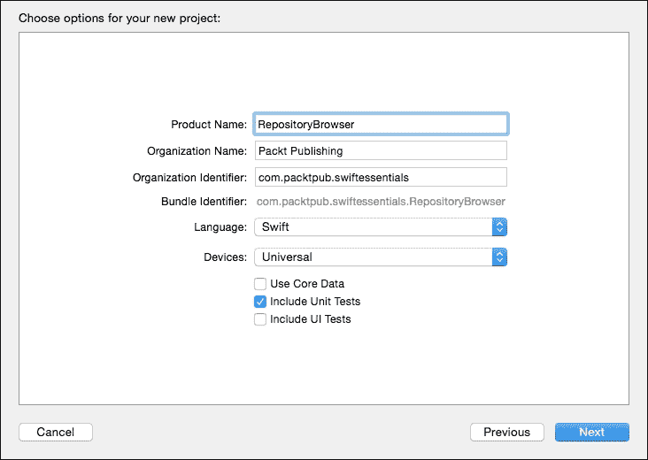
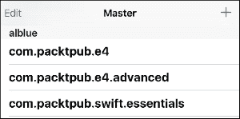
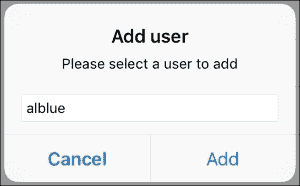
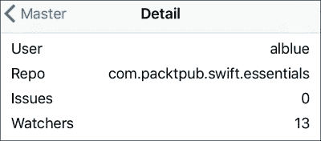
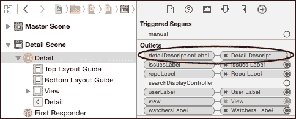
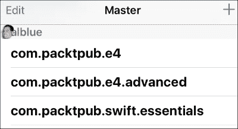

# 第七章：构建仓库浏览器

在介绍了如何集成构建应用程序所需的组件后，本章将创建一个仓库浏览器，允许使用 GitHub API 显示用户仓库。

本章将介绍以下主题：

+   GitHub API 概述

+   使用 Swift 与 GitHub API 通信

+   创建仓库浏览器

+   在视图控制器之间保持选择

# GitHub API 概述

GitHub API 提供了一个基于 REST 的接口，使用 JSON 返回有关用户和仓库的信息。API 的第 3 版在 [`developer.github.com/v3/`](https://developer.github.com/v3/) 有文档说明，并且是本书中使用的版本。

### 小贴士

API 有速率限制；在撰写本文时，匿名请求每小时最多可以发出六十次，而登录用户有更高的限制。本书的代码仓库有用于测试和开发目的的示例响应。

## 根端点

GitHub 的主要入口点是 *根端点*。对于主 GitHub 网站，这是 [`api.github.com`](https://api.github.com)，而对于 GitHub Enterprise 安装，它将是 `https://hostname.example.org/api/v3/` 的形式，并带有用户凭据。端点提供了一组可用于查找特定资源的 URL：

```swift
{
 ...
  "issue_search_url": "https://api.github.com/search/issues?q={query}{&page,per_page,sort,order}",
  "issues_url": "https://api.github.com/issues",
  "repository_url": "https://api.github.com/repos/{owner}/{repo}","user_url": "https://api.github.com/users/{user}"  "user_repositories_url": "https://api.github.com/users/{user}/repos{?type,page,per_page,sort}", }
```

这些服务是 *URI 模板*。花括号 `{}` 中的文本将在需要时用参数的值替换；以 `{?a,b,c}` 开头的文本如果存在，则展开为 `?a=&b=&c=`，否则不展开。例如，对于 `user` 为 `alblue` 的情况，用户资源在 `https://api.github.com/users/{user}` 上的 `user_url` 变为 `https://api.github.com/users/alblue`。

## 用户资源

特定用户的用户资源包含有关其仓库 (`repos_url`)、姓名以及其他信息，例如位置和博客（如果提供）。此外，`avatar_url` 提供了一个可以用来显示用户头像的 URL。例如，`https://api.github.com/users/alblue` 包含：

```swift
{
  ...
  "login": "alblue",
  "avatar_url": "https://avatars.githubusercontent.com/u/76791?v=2",
  "repos_url": "https://api.github.com/users/alblue/repos",
  "name": "Alex Blewitt",
  "blog": "http://alblue.bandlem.com",
  "location": "Milton Keynes, UK",
  ...
}
```

可以使用 `repos_url` 链接来查找用户的仓库。这是在根端点报告的 `user_repositories_url`，其中 `{user}` 已经替换为用户名。

## 仓库资源

用户仓库可以通过 `repos_url` 或 `user_repositories_url` 引用访问。这返回一个包含信息的 JSON 对象数组，例如：

```swift
[{ 
  "name": "com.packtpub.e4.swift.essentials",
  "html_url":
    "https://github.com/alblue/com.packtpub.swift.essentials",
  "clone_url":
    "https://github.com/alblue/com.packtpub.swift.essentials.git",
  "description": "Swift Essentials",
},{
  "name": "com.packtpub.e4",
  "html_url":
    "https://github.com/alblue/com.packtpub.e4",
  "clone_url":
    "https://github.com/alblue/com.packtpub.e4.git",
  "description":
    "Eclipse Plugin Development by Example: Beginners Guide",
},{
  "name": "com.packtpub.e4.advanced",
  "html_url":
    "https://github.com/alblue/com.packtpub.e4.advanced",
  "clone_url":
    "https://github.com/alblue/com.packtpub.e4.advanced.git",
  "description":
    "Advanced Eclipse plug-in development",
}...]
```

# 仓库浏览器项目

`RepositoryBrowser` 客户端将从 **主从模板** 创建。这设置了一个空的应用程序，可以在大设备上使用分割视图控制器，或在小型设备上使用导航视图控制器。此外，还会创建添加条目的操作。

要创建带有测试的项目，确保在创建项目时选择 **包含单元测试** 选项：



要构建显示内容所需的 API，需要几个实用类：

+   `URITemplate` 类使用一组键/值对处理 URI 模板

+   `Threads` 类允许函数在后台或主线程中运行

+   `NSURLExtensions` 类提供了从 URL 解析 JSON 对象的简便方法

+   `DictionaryExtensions` 类提供了一种从 JSON 对象创建 Swift 字典的方法

+   `GitHubAPI` 类提供了对 GitHub 远程 API 的访问

## URI 模板

URI 模板在 RFC 6570 中定义，见 [`tools.ietf.org/html/rfc6570`](https://tools.ietf.org/html/rfc6570)。它们可以用来替换 URI 中由 `{}` 包围的文本序列。尽管 GitHub 的 API 使用可选值 `{?...}`，但本章中展示的示例客户端不需要使用这些，因此在本实现中可以忽略它们。

模板类使用字典中的值替换参数。要创建 API，首先编写一个测试用例是有用的，遵循测试驱动开发。可以通过导航到 **文件** | **新建** | **文件…** | **iOS** | **源** | **单元测试用例类** 来创建一个 `XCTestCase` 的子类，在 Swift 中创建一个测试用例类。测试代码将类似于：

```swift
import XCTest
class URITemplateTests: XCTestCase {
  func testURITemplate() {
    let template = "http://example.com/{blah}/blah/{?blah}"
    let replacement = URITemplate.replace(
     template,values: ["blah":"foo"])
    XCTAssertEqual("http://example.com/foo/blah/",
     replacement,"Template replacement")
  }
}
```

### 提示

不要忘记确保将 `URITemplateTests.swift` 文件添加到必要的测试目标中。

`replace` 函数需要字符串处理。虽然该函数可以是类函数或 `String` 的扩展，但将其作为一个单独的类可以使测试更容易。函数签名看起来像：

```swift
import Foundation
class URITemplate {
  class func replace(template:String, values:[String:String])
   -> String {
    var replacement = template
    while true {
      // replace until no more {…} are present
    }
    return replacement
  }
}
```

### 提示

确保将 `URITemplate` 类也添加到测试目标中；否则，测试脚本将无法编译。

参数是通过正则表达式进行匹配的，例如 `{[^}]}`。要从字符串中搜索或访问这些，涉及到 `String.Index` 值的 `Range`。这些类似于字符串中的整数索引，但与通过字节偏移量引用字符不同，索引是一个抽象表示（某些字符编码，如 UTF8，使用多个字节来表示单个字符）。

`rangeOfString` 方法接受一个字符串或正则表达式，如果存在匹配项则返回一个范围（如果没有匹配项则返回 `nil`）。这可以用来检测是否存在模式或从 `while` 循环中退出：

```swift
// replace until no more {…} are present
if let parameterRange = replacement.rangeOfString(
  "\\{[^}]*\\}",
  options: NSStringCompareOptions.RegularExpressionSearch) {
  // perform a replacement of parameterRange
} else {
  break
}
```

`parameterRange` 包含一个表示 `{` 和 `}` 字符位置的 `start` 和 `end` 索引。可以使用 `replacement.substringWithRange(parameterRange)` 提取参数值。如果它以 `{?` 开头，则替换为空字符串：

```swift
// perform a replacement of parameterRange
var value:String
let parameter = replacement.substringWithRange(parameterRange)
if parameter.hasPrefix("{?") {
  value = ""
} else {
  // substitute with real replacement
}
replacement.replaceRange(parameterRange, with: value)
```

最后，如果替换的形式是 `{user}`，则从字典中获取 `user` 的值并将其用作替换值。要获取参数的名称，`startIndex` 必须前进到 `successor`，而 `endIndex` 必须反转到 `predecessor` 以考虑 `{` 和 `}` 字符：

```swift
// substitute with real replacement
let start = parameterRange.startIndex.successor()
let end = parameterRange.endIndex.predecessor()
let name = replacement.substringWithRange(
 Range<String.Index>(start:start,end:end))
value = values[name] ?? ""
```

现在当测试通过导航到 **产品** | **测试** 或按 *Command + U* 运行时，字符串替换将通过。

### 注意

`??` 是一个可选测试，用于在存在时返回第一个参数，如果它是 `nil`，则返回第二个参数。

## 后台线程

后台线程允许函数在适当的 UI 线程或后台线程上轻松启动。这已在 第六章，*解析网络数据*，在 *网络和用户界面* 部分中解释过。将以下内容作为 `Threads.swift` 添加：

```swift
import Foundation
class Threads {
  class func runOnBackgroundThread(fn:()->()) {
    dispatch_async(dispatch_get_global_queue(
     DISPATCH_QUEUE_PRIORITY_DEFAULT, 0),fn)
  }
  class func runOnUIThread(fn:()->()) {
    if NSMainThread.isMainThread() {
      fn()
    } else {
      dispatch_async(dispatch_get_main_queue(), fn)
    }
  }
}
```

可以使用以下测试用例测试 `Threads` 类：

```swift
import XCTest
class ThreadsTest: XCTestCase {
  func testThreads() {
    Threads.runOnBackgroundThread {
      XCTAssertFalse(NSThread.isMainThread(), 
       "Running on background thread")
      Threads.runOnUIThread {
        XCTAssertTrue(NSThread.isMainThread(),
         "Running on UI thread")
      }
    }
  }
}
```

当测试使用 *Command* + *U* 运行时，测试应该通过。

## 解析 JSON 字典

由于许多网络响应以 JSON 格式返回，为了使 JSON 解析更容易，可以向 `NSURL` 类添加扩展，以方便从网络位置获取和解析内容。而不是设计一个同步扩展，它会阻塞直到数据可用，使用回调函数是最佳实践。创建一个名为 `NSURLExtensions.swift` 的文件，并包含以下内容：

```swift
import Foundation
extension NSURL {
  func withJSONDictionary(fn:[String:String] -> ()) {
    let session = NSURLSession.sharedSession()
    session.dataTaskWithURL(self) {
      data,response,error -> () in
      if let json = try? NSJSONSerialization.JSONObjectWithData(
        data!, options: .AllowFragments) as? [String:AnyObject] {
        fn(json!) // will give a compile time error
      } else {
        fn([String:String]())
      }
    }.resume()
  }
}
```

这为 `NSURL` 提供了一个扩展，以提供 JSON 字典。然而，从 `JSONObjectWithData` 方法返回的数据类型是 `[String:AnyObject]`，而不是 `[String:String]`。尽管可能期望它可以直接转换为正确的类型，但 `as` 将执行一个测试，如果存在混合值（如数字或 `nil`），则整个对象将被视为无效。相反，必须将 JSON 数据结构转换为 `[String:String]` 类型。将以下内容作为独立函数添加到 `NSURLExtensions.swift`：

```swift
func toStringString(dict:[String:AnyObject]) -> [String:String] {
  var result:[String:String] = [:]
  for (key,value) in dict {
    if let valueString = value as? String {
      result[key] = valueString
    } else {
      result[key] = "\(value)"
    }
  }
  return result
}
```

这可以用于将 JSON 函数中的 `[String:AnyObject]` 转换：

```swift
fn(toStringString(json!)) // fixes compile time error
```

可以通过使用 `data:` 协议并通过传递表示 JSON 数据的 *base64* 编码字符串来测试该函数，使用测试类。为了创建一个 `base64` 表示，创建一个字符串，将其转换为 UTF8 数据对象，然后使用 `data:` 前缀将其转换回字符串表示：

```swift
import XCTest
class NSURLExtensionsTest: XCTestCase {
  func testNSURLJSON() {
    let json = "{\"test\":\"value\"}".
     dataUsingEncoding(NSUTF8StringEncoding)!
    let base64 = json.base64EncodedDataWithOptions(     .EncodingEndLineWithLineFeed)
    let data = String(data: base64, 
     encoding: NSUTF8StringEncoding)!
    let dataURL = NSURL(string:"data:text/plain;base64,\(data)")!
    dataURL.withJSONDictionary {
      dict in
      XCTAssertEqual(dict["test"] ?? "", "value",
       "Value is as expected")
    }
    sleep(1)
  }
}
```

请注意，`sleep(1)` 是必需的，因为解析响应必须在后台线程中发生，因此可能不会立即可用。通过向函数添加延迟，它为断言执行提供了机会。

## 解析字典数组

可以使用类似的方法来解析字典数组（例如，由列出存储库资源返回的数组）。这里的区别在于类型签名（它有一个额外的 `[]` 来表示数组），以及正在使用 `map` 处理列表中的元素：

```swift
func withJSONArrayOfDictionary(fn:[[String:String]] -> ()) {
  … 
  if let json = try? NSJSONSerialization.JSONObjectWithData(
   data, options: .AllowFragments) as? [[String:AnyObject]] {
    fn(json!.map(toStringString))
  } else {
    fn([[String:String]]())
  }
```

测试也可以扩展：

```swift
let json = "[{\"test\":\"value\"}]".
 dataUsingEncoding(NSUTF8StringEncoding)!
…
dataURL.withJSONArrayOfDictionary {
  dict in XCTAssertEqual(dict[0]["test"] ?? "", "value",
 "Value is as expected")
}
```

# 创建客户端

现在工具已经完成，可以创建 GitHub 客户端 API。一旦完成，就可以将其与用户界面集成。

## 与 GitHub API 通信

将会创建一个 Swift 类来与 GitHub API 通信。这将连接到根端点主机并下载服务 URL 的 JSON，以便后续的网络连接可以建立。

为了确保网络请求不被重复，将使用 `NSCache` 来保存响应。当应用程序在内存压力下时，这将自动清空：

```swift
import Foundation
class GitHubAPI {
  let base:NSURL
  let services:[String:String]
  let cache = NSCache()
  class func connect() -> GitHubAPI? {
    return connect("https://api.github.com")
  }
  class func connect(url:String) -> GitHubAPI? {
    if let nsurl = NSURL(string:url) {
      return connect(nsurl)
    } else {
      return nil
    }
  }
  class func connect(url:NSURL) -> GitHubAPI? {
    if let data = NSData(contentsOfURL:url) {
      if let json = try? NSJSONSerialization.JSONObjectWithData(
       data,options:.AllowFragments) as? [String:String] {
        return GitHubAPI(url,json!)
      } else {
       return nil
      }
    } else {
      return nil
    }
  }
  init(_ base:NSURL, _ services:[String:String]) {
    self.base = base
    self.services = services
  }
}
```

这可以通过在项目的根级别创建一个 `api` 目录并将 GitHub API 主站点的响应保存到 `api/index.json` 文件中来测试，从终端提示符运行 `curl https://api.github.com > api/index.json`。在 Xcode 中，通过导航到 **文件** | **将文件添加到项目…** 或按 *Command* + *Option* + *A* 将 `api` 目录添加到项目中，并确保它与测试目标相关联。

然后，可以使用 `NSBundle` 来访问：

```swift
import XCTest
class GitHubAPITests: XCTestCase{
  func testApi() {
    let bundle = NSBundle(forClass:GitHubAPITests.self)
 if let url = bundle.URLForResource("api/index",
 withExtension:"json") {
      if let api = GitHubAPI.connect(url) {
        XCTAssertTrue(true,"Created API \(api)")
      } else {
        XCTAssertFalse(true,"Failed to parse \(url)")
      }
    } else {
      XCTAssertFalse(true,"Failed to find sample API")
    }
  }
}
```

### 小贴士

模拟 API 不应该成为主应用程序的目标，而应该是测试目标的一部分。因此，而不是使用 `NSBundle.mainBundle` 来获取应用程序的包，使用 `NSBundle(forClass)`。

## 返回用户的仓库

从服务查找返回的 API 包括 `user_repositories_url`，这是一个可以实例化为特定用户的模板。可以向 `GitHubAPI` 类添加一个方法 `getURLForUserRepos`，它将返回用户仓库的 URL。由于它将被频繁调用，结果应该使用 `NSCache` 来缓存：

```swift
func getURLForUserRepos(user:String) -> NSURL {
  let key = "r:\(user)"
  if let url = cache.objectForKey(key) as? NSURL {
    return url
  } else {
    let userRepositoriesURL = services["user_repositories_url"]!
    let userRepositoryURL = URITemplate.replace(
     userRepositoriesURL, values:["user":user])
    let url = NSURL(string:userRepositoryURL, relativeToURL:base)!
    cache.setObject(url, forKey:key)
    return url
  }
}
```

一旦知道了 URL，就可以使用异步回调函数解析数据，该函数在数据准备好时通知：

```swift
func withUserRepos(user:String, fn:([[String:String]]) -> ()) {
  let key = "repos:\(user)"
  if let repos = cache.objectForKey(key) as? [[String:String]] {
    fn(repos)
  } else {
    let url = getURLForUserRepos(user)
    url.withJSONArrayOfDictionary {
      repos in
      self.cache.setObject(repos,forKey:key)
      fn(repos)
    }
  }
}
```

这可以通过向 `GitHubAPITests` 类添加一个简单的测试来验证：

```swift
api.withUserRepos("alblue") {
  array in
  XCTAssertEqual(24,array.count,"Number of repos")
}
```

### 注意

样本数据包含以下文件中的 24 个仓库，但 GitHub API 在未来可能为该用户提供不同的值：

[`raw.githubusercontent.com/alblue/com.packtpub.swift.essentials/master/RepositoryBrowser/api/users/alblue/repos.json`](https://raw.githubusercontent.com/alblue/com.packtpub.swift.essentials/master/RepositoryBrowser/api/users/alblue/repos.json)

## 通过 AppDelegate 访问数据

当构建一个管理数据的 iOS 应用程序时，决定在哪里声明变量是必须做出的第一个决定。在实现视图控制器时，通常将特定于视图的数据与该类关联；但如果数据需要在多个视图控制器之间使用，就有更多的选择。

一种常见的方法是将所有内容封装到一个 *单例* 中，这是一个只实例化一次的对象。这通常通过实现类中的 `private var` 和一个返回（或按需实例化）单例的 `class func` 来实现。

### 小贴士

Swift 中的`private`关键字确保变量仅在当前源文件中可见。默认的可视性是`internal`，这意味着代码仅在当前模块中可见；`public`关键字表示它也可以在模块外部可见。

另一种方法是使用`AppDelegate`本身。实际上，它已经是一个单例，可以通过`UIApplication.sharedApplication().delegate`来访问，并且在任何其他对象访问它之前就已经设置好了。

### 小贴士

应该避免过度使用`AppDelegate`来存储数据。而不是添加过多的属性，考虑创建一个单独的类或结构来保存值。

`AppDelegate`将用于存储对`GitHubAPI`的引用，这可能使用偏好存储或其他外部方式来定义要连接的实例，以及用户列表和仓库缓存：

```swift
class AppDelegate {
  var api:GitHubAPI!
  var users:[String] = []
  var repos:[String:[[String:String]]] = [:]
  func application(application: UIApplication,
   didFinishLaunchingWithOptions: [NSObject: AnyObject]?)
   -> Bool {
    api = GitHubAPI.connect()
    users = ["alblue"]
    return true
  }
}
```

为了方便从视图控制器加载仓库，可以在`AppDelegate`中添加一个函数来为特定用户提供仓库列表：

```swift
func loadRepoNamesFor(user:String, fn:([[String:String]])->()) {
  repos[user] = []
  api.withUserRepos(user) {
    results in
    self.repos[user] = results
    fn(results)
  }
}
```

# 从视图控制器访问仓库

在`MasterViewController`（从**主从**模板创建或创建一个新的`UITableViewController`子类）中，定义一个实例变量`AppDelegate`，并在`viewDidLoad`方法中分配它：

```swift
class MasterViewController:UITableViewController {
  var app:AppDelegate!
  override func viewDidLoad() {
    app = UIApplication.sharedApplication().delegate
     as? AppDelegate
    …
  }
}
```

表视图控制器在多个部分和行中提供数据。`numberOfSections`方法将返回具有用户名（通过用户列表索引）作为部分标题的用户数量：

```swift
override func numberOfSectionsInTableView(tableView: UITableView)
 -> Int {
  return app.users.count
}
override func tableView(tableView: UITableView,
 titleForHeaderInSection section: Int) -> String? {
  return app.users[section]
}
```

`numberOfRowsInSection`函数被调用以确定每个部分中有多少行。如果数量未知，可以在运行后台查询以找到正确答案的同时返回`0`：

```swift
override func tableView(tableView: UITableView,
 numberOfRowsInSection section: Int) -> Int {
  let user = app.users[section]
  if let repos = app.repos[user] {
    return repos.count
  } else {
    app.loadRepoNamesFor(user) { _ in
      Threads.runOnUIThread {
        tableView.reloadSections(
         NSIndexSet(index: section),
         withRowAnimation: .Automatic)
      }
    }
    return 0
  }
}
```

### 小贴士

记得在 UI 线程上重新加载部分内容；否则，更新将无法正确显示。

最后，需要在单元格的值中显示仓库名称。如果使用默认的`UITableViewCell`，则可以在`textLabel`上设置值；如果是从 Storyboard 原型单元格加载的，则可以使用标签适当地访问内容：

```swift
override func tableView(tableView: UITableView,
 cellForRowAtIndexPath indexPath: NSIndexPath)
 -> UITableViewCell {
  let cell = tableView.dequeueReusableCellWithIdentifier(
   "Cell", forIndexPath: indexPath)
  let user = app.users[indexPath.section]
  let repo = app.repos[user]![indexPath.row]
  cell.textLabel!.text = repo["name"] ?? ""
  return cell
}
```

当应用程序运行时，将按用户分组显示仓库列表：



## 添加用户

在此时刻，用户列表被硬编码到应用程序中。最好移除这个硬编码的列表，并允许按需添加用户。在`AppDelegate`类中创建一个`addUser`函数：

```swift
func addUser(user:String) {
  users += [user]
  users.sortInPlace({ $0 < $1 })
}
```

这允许详细控制器调用`addUser`函数并确保用户列表按字母顺序排列。

### 注意

`$0`和`$1`是`sort`函数期望的匿名参数。这是`users.sort({ user1, user2 in user1 < user2})`的简写形式。也可以使用数组本身的`<`函数通过`users.sortInPlace(<)`来对数组进行排序。

可以在`MasterViewController`的`viewDidLoad`方法中创建添加按钮，以便在点击时调用`insertNewObject`方法：

```swift
override func viewDidLoad() {
  super.viewDidLoad()
  let addButton = UIBarButtonItem(barButtonSystemItem: .Add,
   target: self, action: "insertNewObject:")
  self.navigationItem.rightBarButtonItem = addButton
  …
}
```

当选择添加按钮时，可以通过`UIAlertController`对话框显示一系列操作，这些操作将调用以添加用户。

在`MasterViewController`中添加（或替换）`insertNewObject`，如下所示：

```swift
func insertNewObject(sender: AnyObject) {
  let alert = UIAlertController(
   title: "Add user",
   message: "Please select a user to add",
   preferredStyle: .Alert)
  alert.addAction(UIAlertAction(
   title: "Cancel", style: .Cancel, handler: nil))
  alert.addAction(UIAlertAction(
   title: "Add", style: .Default) {
    alertAction in
    let username = alert.textFields![0].text
    self.app.addUser(username!)
    Threads.runOnUIThread {
      self.tableView.reloadData()
    }
  })
  alert.addTextFieldWithConfigurationHandler {
    textField -> Void in
    textField.placeholder = "Username";
  }
  presentViewController(alert, animated: true, completion: nil)
}
```

现在，用户可以通过在应用程序右上角的**添加**（**+**）按钮上点击来在 UI 中添加。每次应用程序启动时，用户数组将为空，用户可以重新添加。



### 小贴士

用户可以使用`NSUserDefaults.standardUserDefaults`和`setObject:forKey`以及`stringArrayForKey`方法在启动之间持久化。此实现的细节留给读者。

## 实现详细视图

最后一步是实现详细视图，以便在从主屏幕选择存储库时显示每个存储库的信息。在从主屏幕选择存储库时，已知用户名和存储库名。可以使用这些信息从存储库中提取更多信息并将项目添加到详细视图中。

更新故事板中的视图，添加四个标签和四个标签标题，用于用户名、存储库名、监视者数量和开放问题数量。将这些连接到`DetailViewController`的输出：

```swift
@IBOutlet weak var userLabel: UILabel?
@IBOutlet weak var repoLabel: UILabel?
@IBOutlet weak var issuesLabel: UILabel?
@IBOutlet weak var watchersLabel: UILabel?
```

要在详细视图中设置内容，`user`和`repo`将作为（可选的）字符串存储，而额外的`data`将存储在字符串键/值对中。当它们发生变化时，应调用`configureView`方法以重新显示内容：

```swift
var user: String? { didSet { configureView() } }
var repo: String? { didSet { configureView() } }
var data:[String:String]? { didSet { configureView() } }
```

在调用`viewDidLoad`方法之后，还需要调用`configureView`方法以确保 UI 按预期设置：

```swift
override func viewDidLoad() { configureView() }
```

在`configureView`方法中，标签可能尚未设置，因此在设置内容之前需要使用`if let`语句进行测试：

```swift
func configureView() {
  if let label = userLabel { label.text = user }
  if let label = repoLabel { label.text = repo }
  if let label = issuesLabel {
    label.text = self.data?["open_issues_count"]
  }
  if let label = watchersLabel {
    label.text = self.data?["watchers_count"]
  }
}
```

如果使用标准模板，需要在详细视图修改后，将`AppDelegate`的`splitViewController`更改为返回`true`：

```swift
func splitViewController(
 splitViewController: UISplitViewController,
 collapseSecondaryViewController 
  secondaryViewController:UIViewController!,
 ontoPrimaryViewController
  primaryViewController:UIViewController!) -> Bool {
  return true
}
```

### 注意

`splitViewController:collapseSecondaryViewController`方法确定显示的第一页是主页（`true`）还是详细页（`false`）。

## 在主视图和详细视图之间切换

主视图和详细视图之间的连接是通过`MasterViewController`中的`showDetail`切换来触发的。这可以用来从表中提取所选行，然后可以用来提取所选行和部分：

```swift
override func prepareForSegue(segue: UIStoryboardSegue,
 sender: AnyObject?) {
  if segue.identifier == "showDetail" {
    if let indexPath = self.tableView.indexPathForSelectedRow {
      // get the details controller
      // set the details
    }
  }
}
```

可以从切换的目的控制器访问详细控制器——除了目的控制器是导航控制器，因此需要进一步解包：

```swift
// get the details controller
let controller = (segue.destinationViewController as!
 UINavigationController).topViewController
 as! DetailViewController
// set the details
```

接下来，需要传递详细内容，这些内容可以从`indexPath`中提取，如应用程序的前几部分所示：

```swift
let user = app.users[indexPath.section]
let repo = app.repos[user]![indexPath.row]
controller.repo = repo["name"] ?? ""
controller.user = user
controller.data = repo
```

最后，为了确保应用程序在`SplitViewController`的分割模式下正常工作，如果处于分割模式，则需要显示返回按钮：

```swift
controller.navigationItem.leftBarButtonItem =
 self.splitViewController?.displayModeButtonItem()
controller.navigationItem.leftItemsSupplementBackButton = true
```

现在运行应用程序将显示一系列仓库，当选择其中一个时，将显示其详细信息：



### 提示

如果在显示详细视图时出现崩溃，请检查`Main.storyboard`中不存在字段的连接器是否未定义。否则可能会看到类似**此类对于键 detailDescriptionLabel 不遵守键值编码**的错误，这是由于 Storyboard 运行时试图在代码中分配缺失的出口而引起的。打开`Main.storyboard`，转到连接检查器，并删除到缺失出口的连接。



## 加载用户的头像

用户可能有一个上传到 GitHub 的头像或图标。这些信息存储在用户信息中，可以通过 GitHub API 的单独查找访问。每个用户的头像都将作为参考存储在用户信息文档中的`avatar_url`下，例如[`api.github.com/users/alblue`](https://api.github.com/users/alblue)，它将返回类似以下的内容：

```swift
{
  … 
  "avatar_url": "https://avatars.githubusercontent.com/u/76791?v=2",
  … 
}
```

此 URL 代表一个可用于用户仓库头部的图像。

为了支持这一点，需要将用户信息添加到`GitHubAPI`类中：

```swift
func getURLForUserInfo(user:String) -> NSURL {
  let key = "ui:\(user)"
  if let url = cache.objectForKey(key) as? NSURL {
    return url
  } else {
    let userURL = services["user_url"]!
    let userSpecificURL = URITemplate.replace(userURL,
     values:["user":user])
    let url = NSURL(string:userSpecificURL, relativeToURL:base)!
    cache.setObject(url,forKey:key)
    return url
  }
}
```

这从 GitHub API 中查找`user_url`服务，返回以下 URI 模板：

```swift
  "user_url": "https://api.github.com/users/{user}",
```

这可以通过用户实例化，然后异步加载图像：

```swift
import UIKit
...
func withUserImage(user:String, fn:(UIImage -> ())) {
  let key = "image:\(user)"
  if let image = cache.objectForKey(key) as? UIImage {
    fn(image)
  } else {
    let url = getURLForUserInfo(user)
    url.withJSONDictionary {
      userInfo in
      if let avatar_url = userInfo["avatar_url"] {
        if let avatarURL = NSURL(string:avatar_url,
         relativeToURL:url) {
          if let data = NSData(contentsOfURL:avatarURL) {
            if let image = UIImage(data: data) {
              self.cache.setObject(image,forKey:key)
              fn(image)
} } } } } } }
```

一旦实现了加载用户头像的支持，就可以将其添加到视图的头部，以在用户界面中显示它。

### 提示

这里的嵌套`if`语句集表明可能最好重构为 Swift 的`guard`语句。这将确保在每次条件检查时不会增加缩进。重构留给读者作为练习。

## 显示用户的头像

通过用户展示仓库信息的表格视图可以被修改，以便除了用户的名称外，同时显示他们的头像。目前，这是在`tableView:`**title**`ForHeaderInSection`方法中完成的，但有一个等效的`tableView:`**view**`ForHeaderInSection`方法，它提供了更多的自定义选项。

尽管方法签名表明返回类型是`UIView`，但实际上它必须是`UITableViewHeaderFooterView`的子类型。不幸的是，Storyboard 中没有支持编辑或自定义这些视图，因此必须通过编程实现。

要实现`viewForHeaderInSection`方法，像以前一样获取用户名，并将其设置为新建的`UITableViewHeaderFooterView`的`textLabel`。然后，在异步图像加载器中，创建一个具有相同原点但正方形大小的图像框架，然后创建并添加图像作为头部视图的子视图。该方法看起来像这样：

```swift
override func tableView(tableView: UITableView,
 viewForHeaderInSection section: Int) -> UIView? {
  let cell = UITableViewHeaderFooterView()
  let user = app.users[section]
  cell.textLabel!.text = user
  app.api.withUserImage(user) {
    image in
    let minSize = min(cell.frame.height, cell.frame.width)
    let squareSize = CGSize(width:minSize, height:minSize)
    let imageFrame = CGRect(origin:cell.frame.origin,
     size:squareSize)
    Threads.runOnUIThread {
      let imageView = UIImageView(image:image)
      imageView.frame = imageFrame
      cell.addSubview(imageView)
      cell.setNeedsLayout()
      cell.setNeedsDisplay()
    }
  }
  return cell
}
```

现在当应用程序运行时，头像将显示在用户的仓库上叠加：



# 摘要

本章展示了如何将本书中创建的主题集成，以便将它们整合成一个功能应用，用于与远程网络服务（如 GitHub）交互，并能以表格形式展示这些信息。

通过确保所有网络请求都在后台线程中实现，并且返回的数据在 UI 线程上更新，应用程序将保持对用户输入的响应。可以创建图形和自定义视图来提供标题，或者可以将 Storyboard 修改为包含每个仓库的更多图形。
