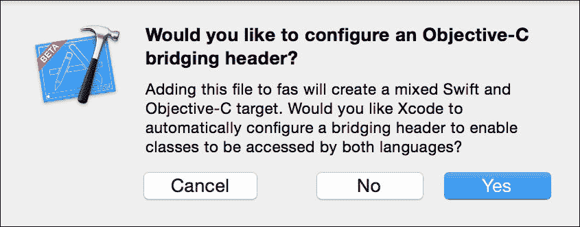
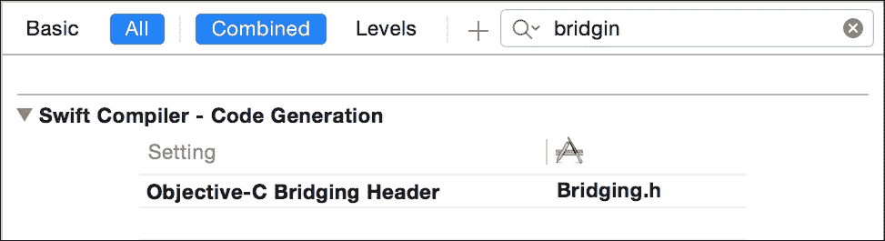

# 第一章. 探索 Swift 的功能和性能

在 2014 年，苹果发布了一种新的编程语言，名为 Swift。Swift 是从头开始设计的，具有许多强大的功能。它是静态类型的，非常安全。它拥有简洁且优美的语法，运行速度快，灵活，并且还有许多其他优点，你将在本书后面的章节中了解到。Swift 看起来非常强大，具有巨大的潜力。苹果对 Swift 设定了很高的期望，他们的主要目标是让 Swift 成为 Objective-C 的替代品，这将在不久的将来实现。

在本章中，你将熟悉 Swift 编程语言，了解它是为什么而设计的，以及它的优势和功能。我们还将制作我们的第一个 Swift 应用程序，并看看它如何容易地与现有的 Objective-C 代码集成。

在本章中，我们将涵盖以下主题：

+   欢迎来到 Swift

+   编写 Swift 代码

+   Swift 互操作性

+   性能和性能关键指标的重要性

# 极速

我可以猜到你打开这本书是因为你对速度感兴趣，可能正在想，“Swift 能有多快？”在你开始学习 Swift 并发现它的所有优点之前，让我们在这里立即回答这个问题。

让我们用一个包含 100,000 个随机数的数组为例；使用 `stdlib` 中的标准 `sort` 函数（在 Swift 中是 `sort`，在 C 中是 `qsort`，在 Objective-C 中是 `compare`）在 Swift、Objective-C 和 C 中对其进行排序，并测量每个操作所需的时间。

对包含 100,000 个整数元素的数组进行排序，我们得到以下结果：

| 技术 | 耗时 |
| --- | --- |
| Swift | 0.00600 秒 |
| C | 0.01396 秒 |
| Objective-C | 0.08705 秒 |

而赢家是，Swift！Swift 比 Objective-C 快 **14.5** 倍，比 C 快 **2.3** 倍。

在其他示例和实验中，C 通常比 Swift 快，而 Swift 比 Objective-C 快得多。这些测量是在 Xcode 7.0 beta 6 和 Swift 2.0 下进行的。重要的是要强调，Swift 2.0 的改进主要集中在使其更简洁、更强大、更安全、更稳定，并为开源做准备。Swift 的性能尚未达到其全部潜力，未来非常令人兴奋！

# 欢迎来到 Swift

Swift 编程语言是由苹果从头开始设计的。它的口号是“没有 C 的 Objective-C”。这个短语的意思是 Swift 没有任何向后兼容性的限制。它是全新的，没有任何旧的重负。在你开始学习 Swift 的全部力量之前，我认为回答一些关于为什么你应该学习它的问题会有所帮助，如果你对此有任何疑问，我应该消除它们。

## 为什么我应该学习 Swift？

Swift 是一种非常新的编程语言，但它已经变得非常流行，并获得了巨大的关注。然而，许多 iOS 和 OS X 开发者提出了这些问题：

+   我应该学习 Swift 吗？

+   我应该学习 Swift 还是 Objective-C？

+   Objective-C 会继续存在还是消亡？

+   Swift 是否准备好用于生产应用程序？

+   Swift 比 Objective-C 或 C 快吗？

+   我可以用 Swift 编写哪些应用程序？

我的回答是，“是的，绝对！”你应该学习 Swift。无论你是新的 iOS 和 OS X 开发者，还是有一些 Objective-C 的背景，你都应该学习 Swift。

如果你是一名新开发者，那么从 Swift 开始是非常有用的，因为你在 Swift 中将学习编程基础和技术，进一步学习 Swift 会更容易。尽管学习 Objective-C 也绝对有用，但我建议先学习 Swift，这样你就可以在 Swift 上建立你的编程思维。

如果你已经有一些 Objective-C 的经验，那么你应该尽快尝试 Swift。它不仅会给你带来一门新编程语言的知识，还会打开在 Objective-C 中解决问题的新思路和方法。我们可以看到，由于 Swift 的出现，Objective-C 已经开始进化。

由于与 C 的向后兼容性，Objective-C 有很多限制。它是在 23 年前，即 1983 年创建的，但它会比 Swift 更早消亡。

在 Swift 1.0 版本发布后，仅仅一年时间，我们就看到了许多 Swift 应用程序在 App Store 上成功开发和发布。在这个时间段内，许多提高开发生产力的 Swift 工具和开源库也被创建。

在 2015 年的 WWDC 上，苹果宣布 Swift 将开源。这意味着 Swift 可以用来编写任何软件，而不仅仅是 iOS 或 OS X 应用程序。你可以用 Swift 编写一段服务器端代码或网络应用程序。这是你应该学习 Swift 的另一个原因。

另一方面，我们看到 Swift 正在持续发展中。在 1.2 版本中有很多变化和改进，在 2.0 版本中变化更多。尽管使用 Xcode 迁移器升级到新的 Swift 版本非常容易，但这仍然是你需要考虑的事情。

Swift 有一些有前景的性能特性。我们在 Swift 1.2 的发布中看到了巨大的性能提升，Swift 2.0 也有一些改进。你从之前的例子中已经看到了 Swift 的速度有多快，总的来说，Swift 比 Objective-C 有更多的潜力实现高性能。

最后，我想提到一个我非常喜欢的，由 Bryan Irace 提出的短语：

> *当 iOS SDK 说“跳”，你问“多高”？*

不要等待，学习 Swift！

# Swift 的特性和优势

到目前为止，你知道你应该学习 Swift，而且不应该有任何疑虑。让我们看看是什么让 Swift 如此神奇和强大。以下是我们将要介绍的一些重要特性列表：

+   清晰美观的语法

+   类型安全

+   可达的类型系统

+   强大的值类型

+   多范式语言——面向对象、协议导向和函数式

+   通用目的

+   快速

+   安全

## 清晰美观

强大的功能和性能很重要，但我认为整洁和美观同样重要。你每天都会编写和阅读代码，它必须整洁美观，这样你才能享受它。Swift 非常整洁美观，以下是一些使其如此的主要特性。

### 无分号

分号是为了编译器而创建的。它们帮助编译器理解源代码并将其拆分为命令和指令。但源代码是为人类编写的，我们可能应该从其中去除编译器指令：

```swift
var number = 10
number + 5

// Not recommended
var count = 1;
var age = 18; age++
```

每条指令的末尾不需要分号 (;)。这看起来可能是一个非常小的特性，但它使得代码更加美观，更容易编写和阅读。然而，如果你想的话，可以添加分号。当同一行有两个指令时，需要分号。还有一些情况下必须使用分号，例如 `for` 循环（`for var i = 0; i < 10; i++`），但在这个上下文中，它们用于不同的目的。

### 小贴士

我强烈建议不要使用分号，并避免在同一行中使用多个指令。

### 类型推断

使用类型推断，你不需要指定变量和常量的类型。Swift 会自动从上下文中检测正确的类型。有时，你不得不显式指定类型并提供类型注解。当变量没有赋值时，Swift 无法预测该变量的类型：

```swift
var count = 10            //count: Int
var name = "Sara"         //name: String
var empty = name.isEmpty   //empty: Bool

// Not recommended
var count: Int = 10
var name: String = "Sara"
var empty: Bool = name.isEmpty

// When you must provide type annotation
var count: Int
var name: String

count = 10
name = "Sara"
```

在大多数情况下，Swift 可以从分配给变量的值中理解变量的类型。

### 小贴士

如果不需要，不要使用类型注解。给变量起有描述性的名字应该足够了。这使得你的代码整洁且易于阅读。

### 其他干净的 Swift 代码特性

Swift 所有干净代码特性的列表非常长；这里列举其中一些：闭包语法、函数的默认参数值、函数的外部参数名称、默认初始化器、下标和运算符：

+   **干净的闭包语法**：闭包是一个独立的代码块，可以被视为一个轻量级的无名称函数。它具有与函数相同的功能，但语法更简洁。你可以将其分配给变量，调用它，或将它作为参数传递给函数。例如，`{ $0 + 10 }` 是一个闭包：

    ```swift
    let add10 = { $0 + 10 }
    add10(5)

    let numbers = [1, 2, 3, 4]
    numbers.map { $0 + 10 }
    numbers.map(add10)
    ```

+   **默认参数值和外部名称**：在声明函数时，你可以为参数定义默认值，并给它们不同的外部名称，这些名称在调用该函数时使用。使用默认参数，你可以定义一个函数，但可以用不同的参数来调用它。这减少了创建不必要的函数的需求：

    ```swift
    func complexFunc (x: Int, _ y: Int = 0, extraNumber z: Int = 0, name: String = "default") -> String{
        return  "\(name): \(x) + \(y) + \(z) = \(x + y + z)"
    }

    complexFunc(10)
    complexFunc(10, 11)
    complexFunc(10, 11, extraNumber: 20, name: "name")
    ```

+   **默认和成员初始化器**：Swift 在某些情况下可以为你创建结构体和基类的初始化器。代码更少，代码质量更高：

    ```swift
    struct Person {
        let name: String
        let lastName: String
        let age: Int
    }

    Person(name: "Jon", lastName: "Bosh", age: 23)
    ```

+   **下标**：这是访问集合成员元素的一种好方法。你可以使用任何类型作为键：

    ```swift
    let numbers = [1, 2, 3, 4]
    let num2 = numbers[2]

    let population = [
      "China" : 1_370_940_000,
      "Australia" : 23_830_900
    ]
    population["Australia"]
    ```

    您也可以为您的自定义类型定义下标运算符，或者通过向它们添加自己的下标运算符来扩展现有类型：

    ```swift
    // Custom subscript
    struct Stack {
      private var items: [Int]

      subscript (index: Int) -> Int {
        return items[index]
      }

      // Stack standard functions
      mutating func push(item: Int) {
        items.append(item)
      }

      mutating func pop() -> Int {
        return items.removeLast()
      }
    }

    var stack = Stack(items: [10, 2])
    stack.push(6)
    stack[2]
    stack.pop()
    ```

+   **运算符**：这些是表示功能的符号，例如，`+` 运算符。您可以通过扩展您的类型来支持标准运算符或创建自己的自定义运算符：

    ```swift
    let numbers = [10, 20]
    let array = [1, 2, 3]
    let res = array + numbers

    struct Vector {
      let x: Int
      let y: Int
    }

    func + (lhs: Vector, rhs: Vector) -> Vector {
      return Vector(x: lhs.x + rhs.x, y: lhs.y + rhs.y);
    }

    let a = Vector(x: 10, y: 5)
    let b = Vector(x: 2, y: 3)

    let c = a + b
    ```

    ### 提示

    仔细定义您的自定义运算符。它们可以使代码更简洁，但它们也可能给代码带来更多的复杂性，并使其难以理解。

+   **guard**：`guard` 语句用于在继续执行代码之前检查条件是否满足。如果条件不满足，它必须退出作用域。`guard` 语句消除了嵌套条件语句和“死亡金字塔”问题：

    ### 注意

    更多关于“死亡金字塔”（编程）的信息，请参阅[`en.wikipedia.org/wiki/Pyramid_of_doom_(programming)`](https://en.wikipedia.org/wiki/Pyramid_of_doom_(programming))。

    ```swift
    func doItGuard(x: Int?, y: Int) {
      guard let x = x else { return }
      //handle x 
      print(x)

      guard y > 10 else { return }
      //handle y
      print(y)
     }
    ```

### 清洁代码总结

如您所见，Swift 非常干净、漂亮。展示 Swift 如何干净和美丽最好的方式是尝试在 Swift 和 Objective-C 中实现相同的功能。

假设我们有一个人的列表，我们需要找到符合特定年龄标准的人，并将他们的名字转换为小写。

这就是这段代码的 Swift 版本将看起来像什么：

```swift
struct Person {
  let name: String
  let age: Int
}

let people = [
  Person(name: "Sam", age: 10),
  Person(name: "Sara", age: 24),
  Person(name: "Ola", age: 42),
  Person(name: "Jon", age: 19)
]

let kids = people.filter { person in person.age < 18 }
let names = people.map { $0.name.lowercaseString }
```

以下是将此代码转换为 Objective-C 版本的内容：

```swift
//Person.h File
@import Foundation;

@interface Person : NSObject

@property (nonatomic) NSString *name;
@property (nonatomic) NSInteger age;

- (instancetype)initWithName:(NSString *)name age:(NSInteger)age;

@end

//Person.m File
#import "Person.h"

@implementation Person

- (instancetype)initWithName:(NSString *)name age:(NSInteger)age {
  self = [super init];
  if (!self) return nil;

  _name = name;
  _age = age;

  return self;
}

@end

NSArray *people = @[
    [[Person alloc] initWithName:@"Sam" age:10],
    [[Person alloc] initWithName:@"Sara" age:24],
    [[Person alloc] initWithName:@"Ola" age:42],
    [[Person alloc] initWithName:@"Jon" age:19]
];

NSArray *kids = [people filteredArrayUsingPredicate:[NSPredicate predicateWithFormat:@"age < 18"]];

NSMutableArray *names = [NSMutableArray new];
for (Person *person in people) {
  [names addObject:person.name.lowercaseString];
}
```

结果相当惊人。Swift 代码有 14 行，而 Objective-C 代码有 40 行，包括 `.h` 和 `.m` 文件。现在您可以看到差异了。

## 安全

Swift 是一种非常安全的编程语言，它在编译时进行大量的安全检查。目标是尽可能在编译时而不是在运行应用程序时捕获尽可能多的问题。

Swift 是一种类型安全的编程语言。如果您在类型上犯了错误，例如尝试将 `Int` 和 `String` 相加或向函数传递错误的参数，您将得到一个错误：

```swift
let number = 10
let part = 1.5

number + part; // Error

let result = Double(number) + part
```

Swift 不会为您做任何类型转换；您必须显式地进行，这使得 Swift 更加安全。在这个例子中，我们在添加之前必须将一个 `Int` 数字转换为 `Double` 类型。

### 可选

Swift 中引入的一个非常重要的安全类型是 **可选**。可选是一种表示值不存在的方式——`nil`。您不能将 `nil` 分配给具有 `String` 类型的变量。相反，您必须通过将其声明为可选的 `String?` 类型来表明这个变量可以是 `nil`：

```swift
var name: String = "Sara"
name = nil //Error. You can't assign nil to a non-optional type

var maybeName: String?
maybeName = "Sara"
maybeName = nil // This is allowed now
```

要将一个类型转换为可选类型，您必须在类型后放置一个问号（`?`），例如，`Int?`、`String?` 和 `Person?`。

您也可以使用 `Optional` 关键字声明可选类型，例如 `Optional<String>`，但使用 `?` 的简短方式更受欢迎：

```swift
var someName: Optional<String>
```

可选就像一个包含某些值或无物的盒子。在使用值之前，您需要先解包它。这种技术称为解包可选，或者如果您将解包的值分配给一个常量，则称为可选绑定：

```swift
if let name = maybeName {
  var res = "Name - " + name
} else {
  print("No name")
}
```

### 提示

在访问可选值之前，你必须始终检查它是否有值。

### 错误处理

Swift 2.0 具有强大且非常易于使用的错误处理。其语法与其他语言的异常处理语法非常相似，但工作方式不同。它有`throw`、`catch`和`try`关键字。Swift 错误处理由以下组件组成，如下所述：

+   错误对象表示一个错误，并且它必须符合`ErrorType`协议：

    ```swift
    enum MyErrors: ErrorType {
      case NotFound 
      case BadInstruction
    }
    ```

    ### 提示

    Swift 枚举最适合表示一组相关的错误对象。

+   每个可能抛出错误的函数都必须在参数列表之后使用`throws`关键字进行声明：

    ```swift
    func dangerous(x: Int) throws
    func dangerousIncrease(x: Int) throws -> Int
    ```

+   要抛出一个错误，请使用`throw`关键字：

    ```swift
    throw MyErrors.BadInstruction
    ```

+   当你调用一个可能抛出错误的函数时，你必须使用`try`关键字。这表示函数可能会失败，并且后续代码将不会执行：

    ```swift
      try dangerous(10)
    ```

+   如果发生错误，必须使用`do`和`try`关键字来捕获和处理，或者通过声明该函数为`throws`来进一步抛出：

    ```swift
    do {
      try dangerous(10)
    }
    catch {
      print("error")
    }
    ```

让我们看看一个代码示例，展示如何在 Swift 中处理异常：

```swift
enum Error: ErrorType {
  case NotNumber(String)
  case Empty
}

func increase(x: String) throws -> String {
  if x.isEmpty {
    throw Error.Empty
  }

  guard let num = Int(x) else {
    throw Error.NotNumber(x)
  }

  return String(num + 1)
}

do {
  try increase("10")
  try increase("Hi")
}
catch Error.Empty {
  print("Empty")
}
catch Error.NotNumber (let string) {
  print("\"\(string)\" is not a number")
}
catch {
  print(error)
}
```

Swift 还有许多其他安全特性：

+   内存安全性确保在使用之前初始化值。

+   具有安全检查的两阶段初始化过程

+   必须的方法重写和许多其他功能

## 丰富的类型系统

Swift 有以下强大的类型：

+   **结构体**是灵活的构建块，可以存储数据以及操作这些数据的方法。结构体与类非常相似，但它们是值类型：

    ```swift
    struct Person {
      let name: String
      let lastName: String

      func fullName() -> String {
        return name + " " + lastName
      }
    }

    let sara = Person(name: "Sara", lastName: "Johan")
    sara.fullName()
    ```

+   **元组**是将多个值组合成一个类型的一种方式。元组内的值可以有不同的类型。元组对于从函数中返回多个值非常有用。如果元组有命名元素，你可以通过索引或名称访问元组内的值；或者你可以将元组中的每个项分配给一个常量或变量：

    ```swift
    let numbers = (1, 5.5)
    numbers.0
    numbers.1

    let result: (code: Int, message: String) = (404, "Not fount")
    result.code
    result.message

    let (code ,message) = (404, "Not fount")
    ```

+   **Range**表示从*x*到*y*的数字范围。还有两个范围运算符可以帮助创建范围：闭合范围运算符和半开范围运算符：

    ```swift
    let range = Range(start: 0, end: 100)
    let ten = 1...10 //Closed range, include last value 10
    let nine = 0..<10 //half-open, not include 10
    ```

+   **枚举**表示一组相关的常见值。枚举的成员可以是空的，有原始值，或者有任何类型的关联值。枚举是一等类型；它们可以有方法、计算属性、初始化器和其他功能。它们非常适合类型安全的编码：

    ```swift
    enum Action: String {
      case TakePhoto
      case SendEmail
      case Delete
    }

    let sendEmail = Action.SendEmail
    sendEmail.rawValue //"SendEmail"

    let delete = Action(rawValue: "Delete")
    ```

## 强大的值类型

Swift 中有两种非常强大的值类型：`struct`和`enum`。Swift 标准库中的几乎所有类型都是使用`struct`或`enum`实现的不可变值类型，例如`Range`、`String`、`Array`、`Int`、`Dictionary`、`Optionals`等。

值类型相对于引用类型有四个主要优势，它们是：

+   不可变

+   线程安全

+   单一所有者

+   在栈内存上分配

值类型是不可变的，并且只有一个所有者。值数据在赋值和将值作为函数参数传递时被复制：

```swift
var str = "Hello"
var str2 = str

str += " :)"
```

### 注意

Swift 足够智能，只有在值被修改时才会执行值复制。赋值操作不会发生值复制，即 `str2 = str`，而是在值修改时，即 `str += ":)"`。如果你删除那行代码，`str` 和 `str2` 将会共享相同的不可变数据。

## 多范式语言

Swift 是一种多范式编程语言。它支持许多不同的编程风格，例如面向对象、协议导向、函数式、泛型、块结构化、命令式和声明式编程。让我们在这里更详细地看看其中的一些。

### 面向对象

Swift 支持面向对象的编程风格。它具有单继承模型的类，能够遵守协议，访问控制，嵌套类型和初始化器，具有观察者的属性，以及其他面向对象的特性。

### 协议导向

协议和协议导向编程的概念并不新鲜，但 Swift 协议拥有一些强大的特性，使它们变得特别。协议导向编程的一般思想是使用协议而不是类型。这样，我们可以创建一个非常灵活的系统，具有对具体类型的弱绑定。

在 Swift 中，你可以扩展协议并提供方法的默认实现：

```swift
extension CollectionType {

  func findFirst (find: (Self.Generator.Element) -> Bool) -> Self.Generator.Element? {

    for x in self { 
      if find(x) {
        return x
      }
    }
    return nil
  }
}
```

现在，每个实现了 `CollectionType` 的类型都有一个 `findFirst` 方法：

```swift
let a = [1, 200, 400]
let r = a.findFirst { $0  > 100 }
```

使用协议导向编程的一个主要优势是，我们可以向相关类型添加方法，并使用点（`.`）语法进行方法链式调用，而不是使用自由函数和传递参数：

```swift
let ar = [1, 200, 400]

//Old way
map(filter(map(ar) { $0 * 2 }) { $0 > 50 }) { $0 + 10 } 

//New way
ar.map{ $0 * 2 } .filter{ $0 > 50 } .map{ $0 + 10 }
```

### 函数式

Swift 还支持函数式编程风格。在函数式语言中，函数是一种类型，它被以与其他类型相同的方式处理，例如 `Int`；它也被称作 **一等函数**。函数可以被分配给变量，并作为参数传递给其他函数。这实际上有助于解耦你的代码，并使其更具可重用性。

一个很好的例子是数组的 `filter` 函数。它接受一个执行实际过滤逻辑的函数，并给我们提供了如此多的灵活性：

```swift
// Array filter function from Swift standard library
func filter(includeElement: (T) -> Bool) -> [T]

let numbers = [1, 2, 4]

func isEven (x: Int) -> Bool {
    return x % 2 == 0
}
let res = numbers.filter(isEven)
```

### 通用目的

Swift 有一个非常强大的功能，称为 **泛型**。泛型允许你编写不提及特定类型的泛型代码。泛型对于构建算法、可重用代码和框架非常有用。解释泛型最好的方式是通过示例。让我们创建一个 `minimum` 函数，它将返回较小的值：

```swift
func minimum(x: Int, _ y: Int) -> Int {
  return (x < y) ? x : y
}

minimum(10, 11)
minimum(11,5, 14.3) // error
```

这个函数有一个限制；它只能与整数一起工作。然而，获取较小值的逻辑对所有类型都是相同的——比较它们并返回较小的值。这是一段非常通用的代码。

让我们的 `minimum` 函数变得通用，并支持不同的类型：

```swift
func minimum <T : Comparable>(x: T, _ y: T) -> T {
  return (x < y) ? x : y
}

minimum (10, 11)
minimum (10.5, 1.4)
minimum ("A", "ABC")
```

### 小贴士

Swift 的标准库已经实现了通用的 `min` 函数。请使用它而不是自己实现。

## 快速

Swift 被设计成快速且性能高，这是通过以下技术实现的：

+   编译时方法绑定

+   强类型和编译时优化

+   内存布局优化

之后，我们将更详细地介绍 Swift 如何使用这些技术来提高性能。

# Swift 互操作性

当苹果公司引入 Swift 时，他们考虑了两个主要点：

+   使用 Cocoa 框架和建立的 Cocoa 模式

+   易于采用和迁移

苹果公司理解这一点，并在开发 Swift 时非常重视。他们使 Swift 与 Objective-C 和 Cocoa 无缝协作。你可以在 Swift 中使用所有 Objective-C 代码，甚至可以在 Objective-C 中使用 Swift。

能够使用 Cocoa 框架非常重要。所有用 Objective-C 编写的代码都可以在 Swift 中使用，包括苹果框架和第三方库。

## 在 Swift 中使用 Objective-C

默认情况下，所有用 Objective-C 编写的 Cocoa 框架都在 Swift 中可用。你只需导入它们并使用它们。Swift 没有头文件；相反，你需要使用模块名称。你还可以以相同的方式包含你自己的 Swift 框架：

```swift
import Foundation
import UIKit
import Alamofire // Custom framework
```

### 设置

要包含你自己的 Objective-C 源文件，你首先需要进行一些小的设置。对于应用程序目标和框架目标，这个过程略有不同。主要思想是相同的——导入 Objective-C 头文件。

#### 应用程序目标

对于应用程序目标，你需要创建一个桥接头。桥接头是一个普通的 Objective-C 头文件，在其中你指定 Objective-C 的 `import` 语句。

当你第一次将 Objective-C 文件添加到 Swift 项目中，或者相反，Xcode 将会弹出一个提示，为你创建并设置桥接头。这是添加桥接头的最佳和最便捷的方式。



如果你拒绝了 Xcode 的帮助，你可以在任何时候自己创建桥接头。为此，你需要遵循以下步骤：

1.  向项目中添加一个新的头文件。

1.  前往 **目标** | **构建设置**。

1.  搜索 `Objective-C Bridging Header` 并指定步骤 1 中创建的桥接头文件路径。

一旦设置了桥接头，下一步就是向其中添加 `import` 语句：

`Bridging.h`

```swift
//
//  Use this file to import your target's public headers that you //  would like to expose to Swift.

#import "MyClass.h"
```

#### 框架目标

对于框架目标，你只需将 `.h` Objective-C 头文件导入到框架的伞形头文件中。Objective-C 头文件必须标记为公开。伞形头文件是你指定公开 API 的头文件。通常，它看起来像这样——`ExampleFramework.h` 伞形头文件：

```swift
#import <UIKit/UIKit.h>

//! Project version number for MySwiftKit.
FOUNDATION_EXPORT double MySwiftKitVersionNumber;

//! Project version string for MySwiftKit.
FOUNDATION_EXPORT const unsigned char MySwiftKitVersionString[];

// In this header, you should import all the public headers of your framework using statements like #import <MySwiftKit/PublicHeader.h>

#import <SimpleFramework/MyClass.h>
```

### 调用 Objective-C 代码

完成设置后，你就可以在 Swift 中使用所有 Objective-C API。你可以创建实例、调用方法、从 Objective-C 类继承、遵守协议，以及执行你在 Objective-C 中能做的其他操作。在这个例子中，我们将使用 `Foundation` 类，但对于第三方代码，规则也是相同的：

```swift
import UIKit
import Foundation

let date = NSDate()
date.timeIntervalSinceNow

UIColor.blackColor()
UIColor(red: 0.5, green: 1, blue: 1, alpha: 1)

class MyView: UIView {
    //custom implementation
}
```

### 小贴士

只有在你需要时才从 Objective-C 类继承。这可能会对性能产生负面影响。

Swift 类型与 Objective-C Foundation 类型之间存在免费桥接。自动桥接发生在赋值时，以及当你将其作为参数传递给函数时：

```swift
let array = [1, 2, 3]

func takeArray(array: NSArray) { }

var objcArray: NSArray = array
takeArray(array)
```

从 Objective-C 转换到 Swift 类型需要显式的类型转换。有两种类型的转换：向下转换和向上转换。转换通常是一个不安全的操作，可能会失败，这就是为什么它返回一个可选类型：

```swift
//Upcasting or safe casting
let otherArray: [AnyObject] = objcArray as [AnyObject]

//Downcasting, unsafe casting
if let safeNums = objcArray as? [Int] {
  safeNums[0] + 10 //11
}

let string: NSString = "Hi"
let str: String = string as String
```

`String` 类型又向前迈进了一步。你可以在 Swift 的 `String` 类型上调用 Objective-C 基础方法，而无需任何类型转换：

```swift
var name: String = "Name"
name.stringByAppendingString(": Sara")
```

Swift 对 Objective-C 代码进行了一些小的改进，使其看起来更像 Swift 风格。最大的变化是在实例创建和初始化代码的风格上。`init`、`initWith` 和其他工厂方法被转换成了 Swift 初始化器：

```swift
//Objective-C

- (instancetype)initWithFrame:(CGRect)frame;
+ (UIColor *)colorWithWhite:(CGFloat)white alpha:(CGFloat)alpha;

// Swift 
init(frame: CGRect)
init(white: CGFloat, alpha: CGFloat)
```

另一项更改是针对 `NS_ENUM` 和 `NS_OPTIONS`。它们变成了 Swift 的原生类型：`enum` 和 `RawOptionSetType`。

如你所见，API 看起来略有不同。因为 Swift 追求简洁，它从 API 命名法中删除了单词重复。其他方法调用、属性和名称与 Objective-C 中的相同，所以应该很容易找到并理解它们。

背后的操作是 Swift 生成特殊的接口文件来与 Objective-C 交互。你可以在我们的示例中通过按住 *command* 键并单击类型，例如 `NSDate` 和 `UIColor`，来查看这些 Swift 接口文件。

## 在 Objective-C 中使用 Swift

还可以使用 Swift 在 Objective-C 中。这使得 Swift 很容易适应现有的项目。你可以从添加一个 Swift 文件开始，然后随着时间的推移将更多功能转移到 Swift。

设置过程比在 Swift 中包含 Objective-C 要简单得多。你所需要做的就是导入 Swift 的自动生成的头文件到 Objective-C。对于应用程序目标，文件命名约定是 `ProductModuleName + -Swift.h`，而对于框架，则是 `<ProductName/ProductModuleName + -Swift.h>`。

看看下面的示例：

```swift
#import "SwiftApp-Swift.h"
#import <MySwiftKit/MySwiftKit-Swift.h>
```

你可以通过按住 *command* 键并单击来自检自动生成的文件的内容。默认情况下，Swift 类不公开用于 Objective-C。有两种方法可以使 Swift 类在 Objective-C 中可用：

+   使用 `@objc` 属性标记 Swift 类、协议或枚举。

    你可以使用 `@objc` 属性来标记类、方法、协议和枚举。`@objc` 属性还接受 Objective-C 中使用的替代名称。当你通过标记 `@objc` 属性来暴露 Swift 类时，它必须继承自 Objective-C 类，并且枚举必须有一个原始的 `Int` 值：

    ```swift
    @objc(KOKPerson) class Person: NSObject {
      @objc(isMan) func man() -> Bool {
        ...
      }
    }
    @objc enum Options: Int {
      case One
      case Two
    }
    ```

    现在，带有 `isMan` 方法的 `KOKPerson` 类可以在 Objective-C 中使用。

+   从 Objective-C 类，例如 `NSObject` 继承：

    当你从 Objective-C 类继承时，你的 Swift 类会自动在 Objective-C 中可用。在这种情况下，你不需要执行任何额外步骤。你还可以使用`@objc`属性标记它，并提供一个替代名称：

    ```swift
    class Person: NSObject {
    }
    ```

## Swift 中不可用的功能

Swift 有一些功能在 Objective-C 中不可用，所以如果你计划从 Objective-C 中使用 Swift 代码，你应该避免使用它们。以下是这些功能的完整列表：

+   结构体

+   泛型

+   元组

+   枚举

+   类型别名

+   顶级函数

+   偏函数

+   全局变量

+   Swift 风格的变长参数

+   嵌套类型

# 性能——含义和关键指标

代码有两个关键特性：

+   **代码质量**：它必须坚固、灵活，并且具有良好的架构

+   **代码性能**：它必须快速

使代码架构非常坚固和稳定是最重要的任务，但我们也不应该忘记让它变得快速。实现高性能可能是一个棘手且危险的任务。以下是一些你在进行性能改进时应该记住的几点：

+   不要一开始就优化你的代码

    关于这个话题有很多文章，讨论了它的危险性和为什么你不应该这样做。只是不要这样做，正如唐纳德·克努特所说：

    > *"过早优化是万恶之源"*

+   先测量

    首先，不要一开始就优化，其次，先测量。测量代码的性能特征，只优化那些慢的部分。几乎 95%的代码不需要性能优化。

    我完全同意这些观点，但我们应该提前考虑另一种类型的性能优化。

## 每日代码性能

我们每天所做的微小决定包括以下内容：

+   它应该是什么类型，`Int`还是`String`？

+   我应该为新的功能创建一个新的类，还是添加到现有的类中？

+   使用数组？或者也许是一个集合？

看起来这些似乎对应用程序的性能没有影响，在大多数情况下，它们确实没有。然而，做出正确的决定不仅可以提高应用程序的速度，还可以使其更加稳定。这为应用程序开发提供了更高的性能。我们每天所做的微小改变，到年底时会产生重大影响。

## 性能的重要性

高性能非常重要。应用程序的性能直接关系到用户体验。用户希望立即得到结果；他们不希望等待视图加载，看到长时间的**加载**指示器，或者看到卡顿的动画。

每年，我们的计算机和设备变得越来越强大，拥有更快的 CPU 速度、更多的内存、更多的存储和更快的存储速度。由于这一点，性能问题可能看起来并不相关，但软件的复杂性也在增加。我们需要存储和处理更复杂的数据。我们需要显示动画和做很多其他事情。

解决性能问题的第一种方法是通过增加更多功率。我们可以添加更多服务器来处理数据，但我们无法更新客户的 PC 和移动设备。此外，增加更多功率并不能解决代码性能问题本身，而只是暂时推迟了它。

第二个，也是正确的解决方案，是移除导致性能问题的原因。为此，我们需要识别问题，找出代码中的慢速部分，并对其进行改进。

## 关键指标

有许多因素会影响应用程序的性能和用户体验。我们将涵盖以下关键指标：

+   操作的性能速度

+   内存使用

+   磁盘空间使用

其中最重要的是**操作的性能速度**，它告诉我们特定任务可以执行得多快，例如，创建新用户、从文件中读取、下载图片、搜索具有特定名称的人等等。

# 摘要

Swift 是一种强大且快速的编程语言。在本章中，你了解了 Swift 的许多强大功能，以及如何轻松地在 Swift 中开始编码并将其集成到现有项目中。我们还讨论了为什么性能很重要，以及在使用它时应考虑哪些因素。

在下一章中，我们将使用 Swift 进行更多编码，你将学习如何使用 Swift 的所有功能来构建良好的应用程序架构。
