# 第三章. 使用 Swift Toolkit 测试和识别慢速代码

应用程序开发的过程通常可以分为三个阶段：

+   尝试新想法

+   实现代码并检查其是否正确工作

+   测量获得的结果的性能

第一阶段涉及尝试一个新想法。比如说，你想要实现一个排序算法，并且希望快速地原型化一个解决方案。

在第二阶段，你将实际实现解决方案并检查它是否正确工作。在本章中，我们将介绍如何测试和检查解决方案是否正确实现。

第三阶段和最终阶段涉及测量创建的软件的性能。当你已经编写了足够多的代码以进行测试，或者在你开发过程中看到不良的性能特征时，你会这样做。

# REPL

**REPL** 代表 **read-eval-print-loop**。Swift REPL 是一个交互式的 Swift 代码解释器，它立即执行代码。要启动 Swift REPL，打开 Terminal 应用程序并执行以下命令：

```swift
$ xcrun swift

```

现在，你可以开始输入 Swift 代码并查看结果。在 REPL 中评估代码的一个好处是，如果你犯了一个错误，这个错误如果编译并运行程序最终会停止应用程序的执行，你仍然可以继续评估代码并保留所有进度。让我们在 Swift REPL 中尝试这段代码：

```swift
let a = 10
let b = a + "c"
let b = a + 10

```

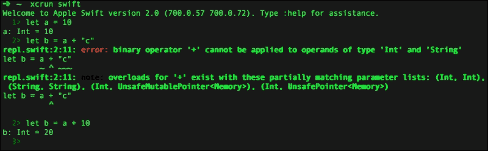

在 REPL 控制台中编写代码不如在现代 Xcode IDE 中方便，但熟悉它是一项有用的技能。在 Swift REPL 的基础上，Apple 开发了更强大的工具，例如 Playgrounds，它拥有一个不错的源代码编辑器和 Swift REPL 的灵活性。

# Playgrounds

Playgrounds 是一个强大的尝试代码并获取结果的工具。正如其名所示，它是一个玩耍的地方。在 Playgrounds 中，Swift 代码会立即被评估，这与 REPL 中的情况相同。你可以通过访问 **文件** | **新建** | **Playground** 来创建一个新的 Playgrounds。输入文件名并创建它。

Playgrounds 由两部分组成，下一张截图将展示：

+   编辑器

+   结果

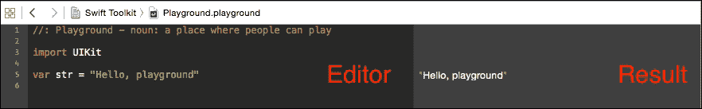

本书展示的大多数代码示例都是在 Playgrounds 中创建的。例如，让我们创建一个数组并与之互动。我们可以应用过滤和映射函数，并打印数组中对象的数量：

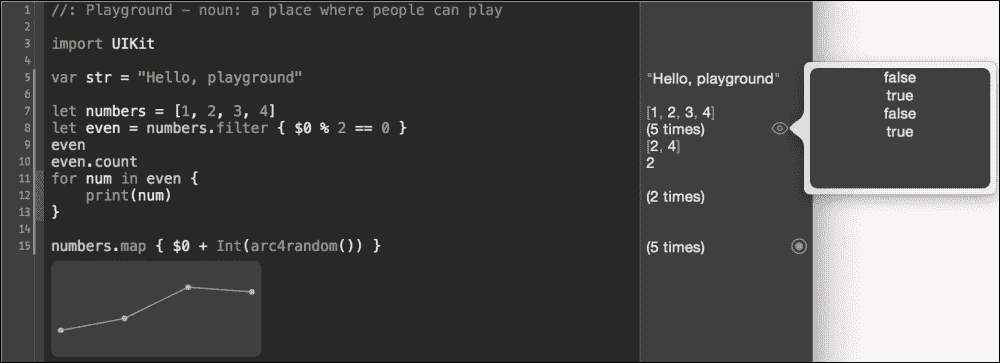

你会看到评估后的代码结果随着你的输入而出现。如果你将光标移到结果部分的一行，它将被突出显示，并出现两个按钮：

+   **快速查看**

+   **显示/隐藏结果**

**快速查看**将显示关于执行操作的更多详细信息。此功能对于函数尤其有趣。例如，如果您点击 `filter` 函数，您可以看到每次迭代的每个结果；结果是 `true` 或 `false` 值。如果您显示具有数值结果的函数的详细信息，例如 `map` 函数，它可以显示一个漂亮的图表。

**显示/隐藏结果**允许您将**快速查看**结果直接添加到操场编辑器中。除非您将其隐藏，否则它将始终可见并刷新数据。

当您使用数学函数并希望以视觉表示形式查看结果时，显示具有数值返回类型的函数的结果视图非常有用。例如，让我们显示 `sin` 和 `pow` 函数的结果，如以下截图所示：

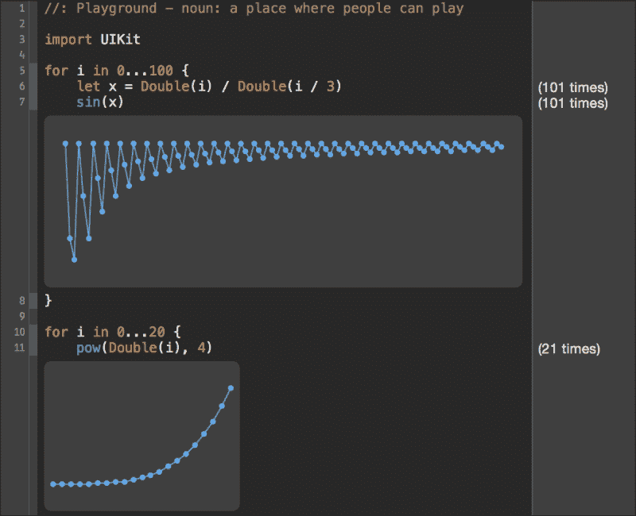

另一个有用的用例是用于显示算法的结果。我们将创建一个选择排序算法。在每一步看到算法的结果通常非常有用。您可以在操场中轻松检查它：

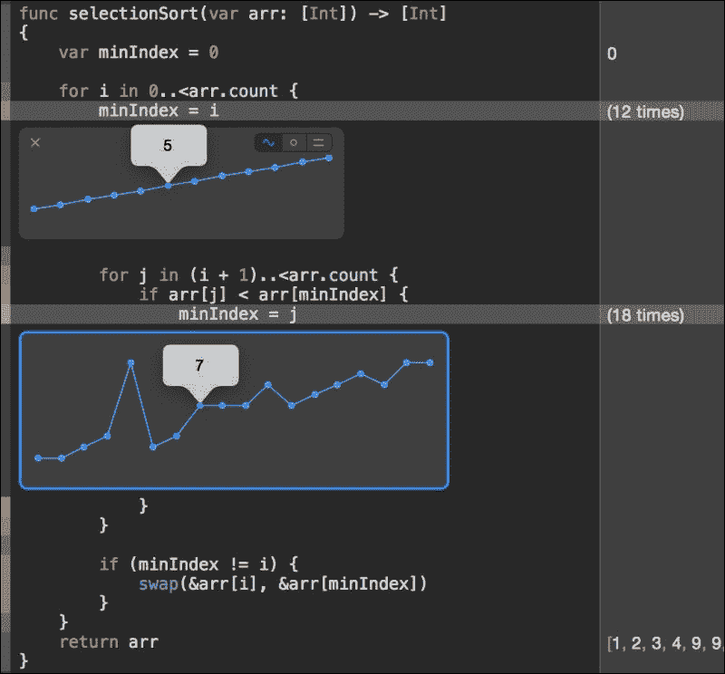

## 交互式文档

操场的另一个用例是在制作交互式文档。您可以将标记格式化的文本添加到操场中。这样，您可以将操场中运行的交互式代码示例与丰富的文本描述相结合。

标记语法基于众所周知的 Markdown 语法：

+   **标题**: `# 标题`

+   **粗体**: `**粗体文本**` 或 `__ 粗体文本 __`

+   **内联代码**: `` `Int` ``

完整的 Markdown 文档可以在[`daringfireball.net/projects/markdown/syntax`](http://daringfireball.net/projects/markdown/syntax)找到。

操场中有两种标记文本样式：

+   **单行**: 单行标记文本样式如下：

    ```swift
    //: Markup text

    ```

+   **多行**: 多行标记文本样式如下：

    ```swift
    /*:
     Markup text
    /*

    ```

现在让我们向操场添加一些标记文本：

```swift
//: # Array
//: Arrays is an ordered collection. [Read more here](https://developer.apple.com/library/ios/documentation/Swift/Conceptual/Swift_Programming_Language/CollectionTypes.html)
//: Arrays operations:
//: * Sort
//: * Map
//: * Etc.

```

标记文本可以在操场中以两种模式呈现，原始模式和渲染模式：

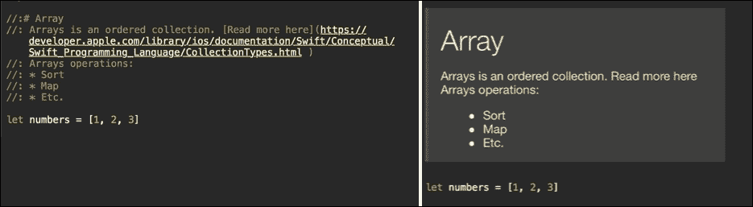

要在原始模式和渲染模式之间切换，请转到**编辑器** | **显示渲染标记/显示原始标记**。您也可以通过在**实用工具**面板中的**操场设置**部分启用**渲染文档**复选框来在这些模式之间切换，如图所示：

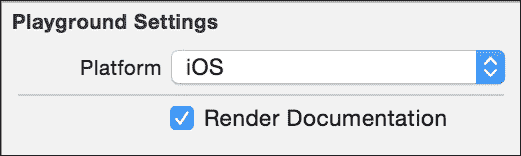

Playgrounds 标记格式的完整文档可以在[`developer.apple.com/library/ios/documentation/Xcode/Reference/xcode_markup_formatting_ref`](https://developer.apple.com/library/ios/documentation/Xcode/Reference/xcode_markup_formatting_ref)找到。

## 文件夹结构

操场文件实际上不是一个简单的文件，而是一个包含多个文件的包。您可以通过在**Finder**中打开它来探索其全部内容。右键点击**显示包内容**。

在 Xcode 中，你可以在 **项目导航器** 中展开 playground 文件。它包含三个项目：

+   **源**：用于 playground 的额外 Swift 源文件文件夹

+   **资源**：用于 playground 的额外资源文件夹，例如图像、文本文件和其他内容

+   **页面**：父 playground 的 playground 文件集合

### 源文件夹

通过将 playground 的源代码拆分为多个 Swift 源代码文件，你可以使 playground 更干净、更快。每次你在 playground 中进行更改时，它都会重新运行该 playground 中的所有代码。你放入 playground 的代码越多，它就越慢。`source` 文件夹中的 Swift 源文件不会在每次更改 playground 文件时重新运行；它们仅在更改该文件的内容时重新运行。例如，当我们与 `Person` 玩耍时，将 `Person` 类型添加到 `source` 文件夹中的单独 Swift 源文件是完美的用例。

### 小贴士

`source` 文件夹中的 Swift 文件被编译到框架中。在框架中，你必须使用 `public` 关键字标记你的类型和函数，以便它们在框架外部可见，在我们的例子中是在 playground 中。

### 资源

通过在 `Resources` 文件夹中包含资产，你可以在 playground 中引用它们。最简单的例子是添加一个 `circle.png` 图像文件：

```swift
let circle = UIImage(named: "circle.png")
```

`Resources` 文件夹中的文件可以通过 `NSBundle.mainBundle` 获取。让我们创建相同的圆，`UIImage`，但这次使用 `NSBundle` API：

```swift
if let path = NSBundle.mainBundle().pathForResource("circle", ofType: "png") {
  let cicrcle2 = UIImage(contentsOfFile: path)
}
```

### 页面

一个 playground 文件可以包含许多子 playground 文件，称为页面。一个页面是一个具有自己的源和资源文件夹的完整功能的 playground 文件。一个 playground 可以包含许多页面。要添加新页面，请转到 **文件** | **新建** | **Playground 页面**，或者简单地右键单击 playground 文件并选择 **新建 Playground 页面**。

Playground 页面非常适合将内容拆分为单独的部分，例如一本书的页面或章节。

为了在 playground 中的页面之间轻松导航，有一个页面导航标记。你可以跳转到第一个、最后一个、下一个、上一个或任何特定的页面。页面导航标记由两部分组成：`[可见文本]` 和 `(page-link)`。让我们看看这个标记的一些示例：

```swift
First and last pages links
//: First Page
//: Last Page 

Next and previous pages links
//: Next
//: Previous 

Page specific links. Use the same page name as a link. The space must be changed to "%20" 
//: Type Safe
//: Optionals
```

本书中的许多代码示例都是使用 playground 页面创建的。

### XCPlayground

`XCPlayground` 是一个专门为与 playground 一起工作而创建的模块。它是一个非常小的模块，有四个主要功能：

+   `XCPCaptureValue`

+   `XCPShowView`

+   `XCPSetExecutionShouldContinueIndefinitely`

+   `XCPSharedDataDirectoryPath`

让我们快速查看这些函数。所有这些函数的结果都显示在 Playground 时间轴上。要查看它，请转到 **视图** | **辅助编辑器** | **显示辅助编辑器**，然后选择当前 playground 的时间轴。

`XCPCaptureValue` 允许你手动捕获一个值并在时间轴视图中显示它。这样，你可以创建自己的图形结果：

```swift
for i in 0...100 {
  let r = arc4random_uniform(100)
  XCPCaptureValue("random", value: r)
}
```

`XCPShowView`在 playground 时间轴中显示一个视图：

```swift
let frame = CGRect(x: 10, y: 10, width: 100, height: 100)
let view = UIView(frame: frame)
view.backgroundColor = .redColor()

XCPShowView("View", view: view)
```

`XCPSetExecutionShouldContinueIndefinitely`对于在 playground 中执行异步代码非常有用。它告诉 playground 在最后一条指令完成后无限期地继续执行其运行循环，这样我们就可以等待异步回调。

`XCPSharedDataDirectoryPath`返回一个指向所有 playgrounds 之间共享的目录的路径。这样，你可以在 playgrounds 之间以及每个 playground 运行之间保存和共享数据。

# LLDB

LLDB 是一个高性能的命令行调试器。它在 Xcode 中可用。启动它的最简单方法是设置断点并运行应用程序。在 Xcode 的调试区域视图中，你会找到一个可以执行 LLDB 命令的控制台。因为我们制作了一个 iOS 应用程序，我们将在 AppDelegate 的`didFinishLaunchingWithOptions`方法中设置断点。

要打印变量的内容，我们可以使用`p` LLDB 命令。只需运行`p`并带上变量名，例如，`p name`，如下所示：

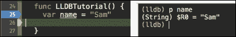

LLDB 是一个非常强大的调试器。你可以在[www.objc.io/issues/19-debugging/lldb-debugging/](http://www.objc.io/issues/19-debugging/lldb-debugging/)和[`developer.apple.com/library/ios/documentation/IDEs/Conceptual/gdb_to_lldb_transition_guide`](https://developer.apple.com/library/ios/documentation/IDEs/Conceptual/gdb_to_lldb_transition_guide)了解更多关于 LLDB 调试器的信息。

# Xcode 中的 REPL

Xcode LLDB 控制台提供的一些更有趣的功能之一是你可以在这里运行 Swift REPL。当你停止应用程序执行时，你可以输入并执行 Swift 代码。这对于调试非常有用。

### 注意

REPL 只能访问公共类型、函数和公共全局变量。局部变量在 REPL 中不可见。如果你需要与局部变量一起工作，请使用 LLDB 命令。

要进入 REPL 控制台，我们首先必须停止程序执行并进入 LLDB 调试器。有三个命令用于与 REPL 交互：

+   **进入 REPL**：`repl`

+   **退出 REPL**：`:`

+   **在 REPL 中执行 LLDB 命令**：`: command`，例如，`:p name`

我们可以执行之前相同的功能，但现在使用调试控制台中的 REPL 命令，如下所示：

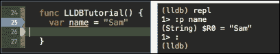

现在我们来看一些更有趣的 REPL 使用案例。当你进入 REPL 时，你可以输入并执行 Swift 代码。你还可以在 REPL 中访问应用程序中公开声明的 Swift 代码。总结一下，你可以运行现有代码，也可以添加新代码。

一个很好的用例是在调试应用程序的同时直接将测试代码添加到 REPL 中。作为一个例子，让我们实现一个跳过数组中负数的函数：

```swift
public func skipNegatives(a: [Int]) -> [Int] {
  return a.filter { $0 >= 0 }
}

func REPLTutorial() {
  let numbers = [2, -3, 1]
  let result = skipNegatives(numbers) 
}
```

`skipNegatives`函数的实现非常简单，在这个例子中很容易检查它是否正确工作，但你的其他函数可能更大且更难理解。此外，`numbers`数组只包含三个元素，而结果应该包含两个元素。我们可以通过在调试器视图中查找它来轻松检查这一点。

但如果我们的人数数组包含 1,000 个元素呢？遍历数组并验证它不包含负数元素会更困难。在这个例子中，数组中有 505 个非负元素：

```swift
func REPLTutorial() {

  let manyNumbers = makeNumbers()
  let bigResult = skipNegatives(manyNumbers)
}

public func makeNumbers() -> [Int] {
  var array = [Int]()
  for _ in 0..<1000 {
    let rand = Int(arc4random_uniform(10)) - 5
    array.append(rand)
  }
  return array
}
```

我们可以在 REPL 中编写一个测试函数来检查所有元素是否为正。让我们这样做，如下所示：

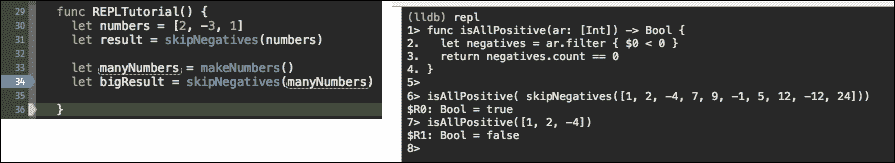

首先，像往常一样，运行程序并在断点处停止。下一步是进入 REPL 并编写一个`isAllPositive`函数来检查所有数字是否为正。然后，只需调用`skipNegatives`和`isAllPositive`，看看结果是否为`true`：

```swift
(lldb) repl
1> func isAllPositive(ar: [Int]) -> Bool { 
2\.   let negatives = ar.filter { $0 < 0 }
3\.   return negatives.count == 0
4\. }
5> 
6> isAllPositive( skipNegatives([1, 2, -4, 7, 9, -1, 5, 12, -12, 24]))
$R0: Bool = true
7> isAllPositive([1, 2, -4])
$R1: Bool = false
8>

```

### 小贴士

如果你打算在 REPL 中多次使用测试函数，最好创建一个 Swift 源文件用于调试目的，并将其添加到那里。然后，你可以在 REPL 中调用它。

# 控制台日志

另一个强大的调试工具，你可能已经熟悉，是控制台日志。控制台日志可以用来记录所有类型的信息，包括：

+   操作结果

+   活动

+   性能测量

要将语句记录到控制台，你可以使用以下这些函数之一：

+   `print`

+   `debugPrint`

这两个函数接受任何类型。

要为打印函数提供自定义文本格式，你必须遵守`CustomStringConvertible`协议，对于`debugPrint`，遵守`CustomDebugStringConvertible`协议。这两个协议都只需要实现一个属性。让我们创建一个简单的`Person`类型并实现自定义日志格式：

```swift
struct Person {
  let name: String
  let age: Int

extension Person: CustomStringConvertible, CustomDebugStringConvertible {

  // CustomStringConvertible
  var description: String {
    return "Name: \(name)"
  }

  // CustomDebugStringConvertible
  var debugDescription: String {
    return "Name: \(name) age: \(age)"
  }
}
```

现在，当使用`print`或`debugPrint`调用`Person`类型的实例时，它将显示自定义描述。

控制台日志的一个更有趣的使用案例是方法性能日志。我们想知道特定方法或代码片段运行了多长时间。

第一个想法可能是使用`NSDate`来测量时间。`NSDate`工作得很好，但在`QuartzCore`框架中有一个更好的解决方案——`CACurrentMediaTime`函数。它基于`mach_absolute_time`返回结果。我们案例的基础伪代码如下：

```swift
let startTime = CACurrentMediaTime()
// Perform code that we need to measure.
let endTime = CACurrentMediaTime()
print("Time - \(endTime - startTime)")
```

我们希望非常频繁地使用这个性能测量函数，将其提取到单独的可重用函数中将会非常有用。因为 Swift 支持函数式编程风格，我们可以轻松做到这一点。

我们将创建一个测量函数。它将接受另一个执行我们需要测量时间的任务的函数：

```swift
func measure(call: () -> Void) {
  let startTime = CACurrentMediaTime()
  call()
  let endTime = CACurrentMediaTime()

  print("Time - \(endTime - startTime)")
}
```

现在，假设我们想要找出创建 1,000 个`Person`类型实例所需的时间：

```swift
for i in 0...1000 {
  let person = Person(name: "Sam", age: i)
}
```

我们需要做的就是简单地将这段代码封装成一个闭包，并将其传递给`measure`函数：

```swift
measure {
  for i in 1...1000 {
    let person = Person(name: "Sam", age: i)
  }
}
```

在 playground 中运行此测量将给出以下结果：

```swift
Time 0.000434298478008714.

```

# 单元测试中的性能测量

当你创建一个新的项目时，Xcode 会为该项目创建一个名为`ProjectName` + `Tests`的单元测试目标。如果你不熟悉单元测试，你可以在 Xcode 中阅读有关测试的文档，链接为[`developer.apple.com/library/ios/documentation/DeveloperTools/Conceptual/testing_with_xcode`](https://developer.apple.com/library/ios/documentation/DeveloperTools/Conceptual/testing_with_xcode)。

Xcode 还会为你创建一个简单的单元测试文件。在我们的项目中，它是`Swift_ToolkitTests.swift`。单元测试有三个主要方法，具有不同的目的：

+   `setup`

+   `teardown`

+   `test`

    ### 注意

    单元测试函数必须以`test`前缀开始，例如：

    ```swift
    func testCreatingPerson
    func testChangingName

    ```

这些函数的名称反映了它们的作用。`setup`函数在运行单元测试之前执行额外的设置，`teardown`函数执行清理工作，但对我们来说最有趣的是`test`函数，它执行测试。

`XCTestCase`单元测试类有一个`measureBlock`函数，其工作方式与我们实现的`measure`函数类似。让我们实现一个单元测试来测量创建 1,000 个人的性能。

首先，我们需要使我们的应用程序中的`Person`类型和其他类型对单元测试目标可用。为此，我们需要导入一个带有`@testable`属性的 app 模块——`@testable import {ModuleName}`。现在，该模块中的所有`public`和`internal`类型和方法都可在单元测试目标中使用：

### 注意

要启用`@testable`，必须将**Enable Testability**项目构建设置设置为**是**。Xcode 默认将其设置为**是**，用于**调试**模式。你永远不应该在发布模式下启用它。

```swift
@testable import Swift_Toolkit

func testCreatingPeoplePerformance() {
  measureBlock() {
    for i in 1...1000 {
      _ = Person(name: "Sam", age: i)
    }
  }
}
```

当你运行单元测试时，通过访问**Product** | **Test**或使用*CMD* + *U*快捷键，你将在函数名称的右侧看到性能特征。当你点击它时，你将看到更多详细信息以及设置基线性能值的按钮，这些值将用于比较未来的测量。

`measureBlock`运行几块代码并显示平均时间。你可以在详细弹出窗口中看到 10 次不同迭代的性能，如图所示：

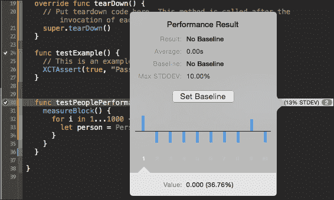

现在我们设置一个基线并再次运行单元测试。测试通过了！

性能单元测试的目的是测量性能并确保它不会大幅下降。默认情况下，允许的标准偏差为 10%。这意味着如果代码的性能下降超过 10%，则测试失败。让我们尝试模拟这种情况并看看会发生什么。为了模拟额外的工作，我们将在`person`初始化器中添加延迟：

```swift
init(name: String, age:Int) {
  self.name = name
  self.age = age
  usleep(100)
}
```

现在让我们再次运行测试。你会看到测试失败，并在测试函数名称旁边显示一个红色的标志。

这样，单元测试不仅可以帮助你测量性能，还可以确保你在开发应用时性能不会下降。

# 仪器

在本章中，我们将要探讨的最后一种工具是仪器。虽然我们是在章节的末尾提到它，但它却是测量应用各种特性的最强大工具：性能、内存使用和泄漏、网络、监控、动画、硬盘和文件活动。

启动 Instruments 进行应用的 simplest way 是通过转到**产品** | **分析**或使用*CMD* + *I*键盘快捷键。这将启动当前目标的仪器，并显示可用的仪器测量模板。我们将选择一个**时间分析器**模板，并点击**记录**。这将启动应用并记录每个被调用函数的性能。现在我们可以分析函数的性能：

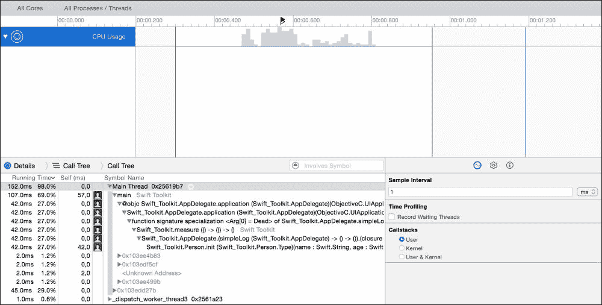

Instruments 是一个非常强大的工具，要完全介绍其功能需要单独的一章。如果你不熟悉 Instruments，你应该阅读更多关于它的信息，请参阅[`developer.apple.com/library/ios/documentation/DeveloperTools/Conceptual/InstrumentsUserGuide`](https://developer.apple.com/library/ios/documentation/DeveloperTools/Conceptual/InstrumentsUserGuide)。

# 提醒

无论何时进行任何性能测量，都应该在发布模式下进行。Swift 编译器在发布模式下执行许多优化步骤，从而显著提高性能。要设置发布模式，请转到**产品** | **方案** | **编辑方案** | **运行**，并将**构建配置**设置调整为**发布**。始终使用发布模式进行性能测试。

# 摘要

在本章中，我们介绍了许多可以提升你生产力的工具。REPL 和 Playgrounds 非常适合尝试新代码和快速代码原型设计。Playgrounds 还可以用来创建交互式文档和教程。然后我们介绍了 Xcode 中的调试工具（如 LLDB 和 REPL），这些工具对于检查运行时操作的结果非常有用。应用性能可以在仪器或使用控制台日志中进行测量。为了确保性能不会下降，你应该使用单元测试。

在本章中，你学习了众多用于发现缓慢和问题代码的工具，而在下一章中，你将学习如何改进和优化它们。
