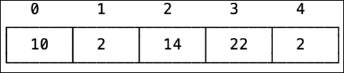
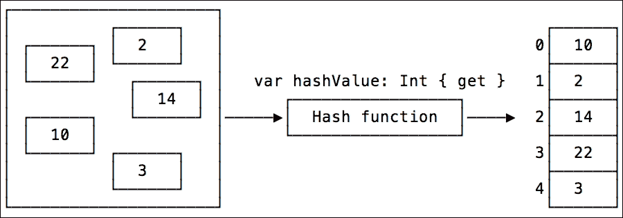
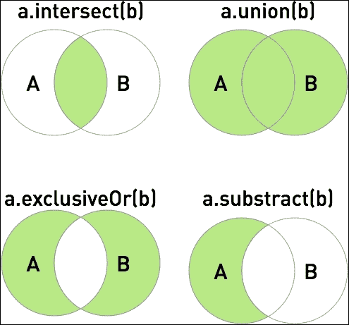
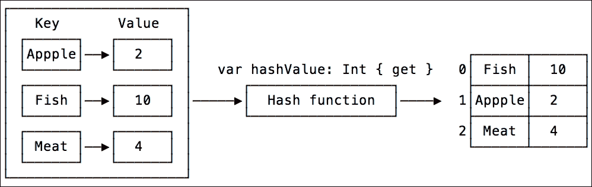

# 第五章。选择正确的数据结构

在上一章中，我们讨论了使 Swift 运行快速的 Swift 特定功能。为特定用例选择正确的数据结构同样重要。在本章中，我们将讨论不同的数据结构、它们的区别以及何时选择一个而不是另一个。

在本章中，我们将涵盖以下主题：

+   数据结构概述

+   Swift 标准库集合

+   数组、集合和字典

+   使用 Accelerate 和 Surge 加速

# 数据结构概述

每种编程语言都有内置的原始数据类型，例如整数、双精度浮点数、字符、字符串和布尔值。Swift 编程语言还有一些更复杂的数据类型，例如枚举、可选和元组。通过组合原始类型，我们可以构建更复杂的数据类型。要组合它们，我们使用结构和类。

数据结构是以特定方式组织数据的一种方式，以便它可以高效地用于特定任务，例如搜索、检查是否存在以及快速更新值。

# 集合类型

创建一个新的类型并为其选择正确的类型，无论是值类型还是引用类型，是一项重要的任务，我们之前在第二章中已经讨论过，即*在 Swift 中构建良好的应用程序架构*。当我们将相同类型的多个实例放入集合中时，对性能的影响更大。为特定任务选择正确的集合非常重要。

Swift 有一些强大的构建集合；我们首先应该看看它们。

# Swift 标准库集合

在你的应用程序中，你经常会使用不同的集合来存储和处理数据。Swift 有三种不同的内置集合类型：数组、字典和集合。

Swift 标准库还提供了许多用于处理这些集合的函数，例如排序、查找、过滤、映射等。这些函数具有非常高效的实现，你应该使用它们而不是自己实现。首先，让我们看看不同的集合。

## 数组

数组是有序值集合，通过索引提供对其元素的访问。这是一个非常简单且广为人知的集合。你会在这些情况下使用数组：

+   简单元素存储（通常从末尾添加/删除）

+   元素需要有序

+   随机访问元素

数组通常实现为一个连续的内存块，在其中存储值。因为内存块通常位于彼此旁边，所以对元素的访问通常可以转换为简单的指针算术：*第三个元素 = 数组起始位置 + (2 * 元素大小)*。



### 使用数组

数组非常适合存储用于 UITableView 的数据。项目需要排序。我们需要知道项目数量，通过索引获取项目，并且能够编辑集合。当你需要存储两个或更多相同类型的对象时，你会使用数组。

数组是一个非常简单且灵活的集合。但由于这一点，它们在应该使用集合、字典或其他自定义集合的情况下经常被过度使用。

#### 快速操作

数组对于某些操作具有非常高的性能，这些操作的复杂度为常数 O(1)，不会随着数组大小的增加而增加。你可以自由地使用它们：

+   **访问元素**：要访问元素，请使用这些操作，`array[i]`、`array.first` 和 `array.last`。大约需要 81 纳秒，或 0.000000081 秒。

+   **添加元素**：要添加元素，请使用此操作 `array.append(i)`。大约需要 100 纳秒或 0.0000001 秒。

在数组的开始位置和随机位置插入和删除元素也是一个非常快的操作，但它具有 O(n) 的复杂度。它随着数组大小的增加而增加，如下所示：

| 数组大小 | 时间（秒） |
| --- | --- |
| 0 to 50_000 | 0.00001 |
| 500_000 | 0.00019 |
| 5_000_000 | 0.0043 |
| 50_000_000 | 0.040 |
| 500_000_000 | 0.32 |

#### 较慢的操作

数组上的一些其他操作随着数组大小的增加而急剧增加。使用此类方法时请小心。

#### 搜索

查找元素具有 O(n) 的复杂度。数组中的元素越多，查找元素是否存在所需的时间就越长。为了确定元素是否存在于数组中，它必须遍历每个元素并比较它们：

```swift
let array: [Int]
let index = array.indexOf(3445)
```

如果搜索不是你在集合上执行的主要操作，并且数组的大小，例如，为 500_000_000 个元素，搜索将需要 0.5 秒。如果你必须非常频繁地执行搜索，并且这样做非常关键，请使用集合进行搜索操作，或者对数组进行排序并使用更有效的搜索算法，例如二分搜索。

#### 排序

排序的复杂度甚至比搜索元素还要大；它具有 O(n * n) 的复杂度。排序需要遍历数组以找到某个元素的正确位置，并对其中的每个元素重复此操作。`sort` 标准库函数有一个非常高效的实现，你应该使用它。它根据数组大小使用不同的排序算法。因为排序很昂贵，你应该缓存排序结果并在需要时重用它。对包含 500_000_000 个 `int` 元素的数组进行排序大约需要 67 秒。

## 集合

集合是一个无序的集合，用于存储唯一的对象。集合用于检查成员资格。

通常，集合被实现为哈希表。集合中的元素必须符合**可哈希**和**可比较**协议。

当您向集合添加元素或搜索元素时，它使用元素的哈希函数来找到该元素在存储中的索引。正因为如此，集合上的许多操作都非常快，并且具有 O(1) 的复杂度。



### 使用集合

集合非常适合检查对象是否存在于集合中。此外，它们非常适合获取两个集合之间的差异，例如，找出添加或删除的对象。

集合有两个重要的限制。它们是无序的，并且不能包含重复项：

```swift
var numbers: Set = [1, 1, 2, 3, 3, 4]
// {2, 3, 1, 4}
```

但是，集合将这些限制转化为特性。正因为如此，并且因为它使用哈希表来存储其元素，所以在某些操作中实现了令人难以置信的性能，这些操作的复杂度为 O(1)，并且不会随着集合大小的增加而增加。以下是一些操作：

+   插入：

    ```swift
    numbers.insert(10)
    ```

+   查找：`contains`、`IndexOf` 和 `subscript`：

    ```swift
    let number = numbers.contains(10)
    let foundIndex =  numbers.indexOf(101)
    let start: SetIndex = numbers.startIndex
    let first = numbers[start]
    ```

+   删除：`remove` 和 `removeAtIndex`：

    ```swift
    let number = numbers.remove(27)
    let number = numbers.removeAtIndex(numbers.startIndex)
    ```

所有这些操作都不到 6 微秒，即 0.000006 秒，即使是包含 50_000_000 个元素的集合。

### 提示

如果你打算进行元素的密集搜索，请使用集合。你可以同时使用数组来存储数据，以及集合来进行搜索操作。这将使用两倍多的内存，但搜索将瞬间完成。

#### 集合操作

您可以对两个不同的集合执行基本集合操作，例如合并、提取和获取公共值。



这些操作也非常快，但它们的复杂度为 O(n) 或 O(log n)，并且随着大小的增加，处理数据所需的时间也会增加：

```swift
let set = makeRandomSet(size)
let otherSet = makeRandomSet(set.count)

set.union(otherSet)
set.subtract(otherSet)
set.intersect(otherSet)
set.exclusiveOr(otherSet)
```

这些操作的性能相当令人印象深刻，如下表所示：

| 集合大小 | 并集 | 差集 | 交集 | 异或 |
| --- | --- | --- | --- | --- |
| 100 x 100 | 0.000015 | 0.000012 | 0.000013 | 0.00001 |
| 500_000 x 500_000 | 0.11 | 0.072 | 0.055 | 0.13 |

如果我们查看这些方法的声明，我们会看到它们接受的不是集合，而是 `SequenceType`：

```swift
func union<S : SequenceType where Element == Element>(sequence: S) -> Set<Element>
```

我们可以使用这些集合方法与任何 `SequenceType`。让我们尝试使用数组而不是集合，看看是否会有任何区别：

```swift
let set = makeRandomSet(size)
let otherSequence = makeRandomArray(set.count)

set.union(otherSequence)
...
```

| 集合大小 x 数组大小 | 并集 | 差集 | 交集 | 异或 |
| --- | --- | --- | --- | --- |
| 100 x 100 | 0.000013 | 0.0000045 | 0.000026 | 0.000032 |
| 500_000 x 500_000 | 0.10 | 0.058 | 0.13 | 0.18 |

如您所见，`intersect` 和 `exclusiveOr` 在集合上表现更好。尽管差异很小，不会对整体应用性能产生重大影响，但这仍然是一个您应该记住的重要观察。

让我们来看看集合中的一种更多方法——`isSubsetOf`：

```swift
func isSubsetOf<S : SequenceType where Element == Element>(sequence: S) -> Bool
```

它也具有 `SequenceType` 参数，因此可以使用集合和数组：

```swift
let set = makeRandomSet()

var otherSequence = Array(set)
otherSequence.append(random())
set.isSubsetOf(otherSequence)

var otherSet = set
otherSet.insert(random())
set.isSubsetOf(otherSequence)
```

结果非常有趣。当集合大小等于 5_000_000 时，使用数组参数的 `isSubsetOf` 需要 4 分钟，而使用集合则不到 1 秒。

### 提示

对于 `isSubsetOf` 方法，始终首选使用集合作为参数。

| 大小 | isSubsetOf (数组) | isSubsetOf (集合) |
| --- | --- | --- |
| 50_000 | 0.11 秒 | 0.0045 秒 |
| 5_000_000 | 237.2 秒 | 0.46 秒 |

## 字典

字典是一个无序集合，用于存储唯一的键值对。当需要通过键快速查找对象时，字典非常有用

字典也使用哈希表来存储它们的键和值。因此，字典具有与集合相似的性能特征。当需要连接两个对象并对其进行即时搜索和查找时，字典非常有用。



字典集合是一个非常简单的类型。它没有很多自己的方法。主要功能是查询键的值、更新它和删除它：

```swift
var capital = ["Germany" : "Berlin", "France"  : "Paris"]

capital["Norway"] = "Oslo"
capital.removeValueForKey("France")
capital["France"] = nil

if let index = capital.indexForKey("Spain") {
  print("found Spain at: \(index)")
}
capital.values
```

在你有两个数组并且想要找到它们之间联系的情况下，使用字典将导致性能的大幅提升。

# 集合内存分配

每个集合在实例化其实例时都有非常相似的性能优化。创建集合实例有三种不同的方式。

## 空的

你可以创建一个空集合。所有数组、集合和字典都有一个空的 `init` 方法：

```swift
let array = [Int]()
let set = Set<Int>()
let dic = [String : Int]()
```

## 预留容量

另一种方法是实例化一个集合并预留所需的内存容量。所有集合都具有动态大小，并在需要时分配更多内存。当你知道你将在集合中存储多少元素时，预先分配所需的确切数量的内存是有用的：

```swift
var array = [Int]()
array.reserveCapacity(500_000)

var set = Set<Int>(minimumCapacity: 500_000)
var dic = String : Int
```

## 默认值

数组还有一个实例化的方式。你可以创建一个数组，其中所有元素的默认值都已设置：

```swift
var array = Int
array[i] = 10
```

这里是秒数的结果：

| 大小 | 方法 | 数组 | 集合大小 | 字典 |
| --- | --- | --- | --- | --- |
| 500 |   |   |   |   |
|   | 空的 | 5.2e-06 | 2.4e-05 | 2.4e-05 |
|   | 容量 | 8.8e-07 | 1.6e-06 | 4.7e-06 |
|   | 默认值 | 4.8e-07 |   |   |
| 50_000_000 |   |   |   |   |
|   | 空的 | 1.29 | 11.7 | 12.9 |
|   | 容量 | 1.13 | 9.4 | 10.9 |
|   | 默认值 | 1.043 |   |   |

如从结果中可以看出，当你知道集合的大小，即使是很小的尺寸，为集合预留一些容量总是更好的。

对于数组，使用默认值是最快的方式，但你要记住数组是用默认值填充的，你必须处理它们或者用真实值替换它们。

此外，你可以看到创建一个数组是一个非常快速的操作，即使是大尺寸的数组也是如此。这是数组相对于其他集合的优势之一。

# CollectionType 协议方法

所提到的所有集合——数组、集合和字典——都实现了 `CollectionType` 协议。正因为如此，它们可以互换使用。你可以在需要 `CollectionType` 方法的地方使用任何一个。一个例子是具有 `CollectionType` 参数的函数：

```swift
func useCollection<T: CollectionType>(x: T) {
  print("collection has \(x.count) elements")
}

let array = [1, 2, 3]
let set: Set = [2, 2, 3, 4, 5]
let dic = ["A" : 1, "B" : 2]

useCollection(array)
useCollection(set)
useCollection(dic)
```

## 协议扩展

另一个非常有用的功能是协议扩展。使用协议扩展，我们可以在协议中直接添加方法和属性的实现。所有符合该协议的类型都可以免费使用这些方法。让我们向一个`CollectionType`方法添加我们自己的属性：

```swift
extension CollectionType {
  var middle: Self.Index.Distance {
    return count / 2
  }
}

array.middle
set.middle
dic.middle
```

符合该协议的类型可以为该方法提供自己的实现。在这种情况下，将使用该类型的实现而不是协议扩展中定义的实现：

```swift
extension Dictionary {
  var middle: Dictionary.Index.Distance {
    print("Dictionary middle")
    return count / 2 + 100 // :( wrong middle index 
  }
}
dic.middle // 101 :)
```

`CollectionType` 协议非常依赖这个功能，并且有许多方法和属性可用于 `CollectionType`，例如 `isEmpty`、`first`、`dropFirst(n: Int)`、`map`、`indexOf` 以及更多。让我们看看 `isEmpty` 和 `dropFirst(n: Int)`：

```swift
array.isEmpty
set.isEmpty
dic.isEmpty

array.dropFirst(1)
set.dropFirst(1)
dic.dropFirst(1)
```

让我们检查这些方法。按住 *command* 键并点击 `isEmpty` 属性以跳转到其声明。数组使用 `CollectionType` 版本的 `isEmpty`，但集合和字典为 `isEmpty` 属性提供了自己的实现。集合和字典之所以这样做，是因为它们存储元素的方式不同，并且它们可以提供更好、更高效的 `isEmpty` 属性实现。如果类型能够做得更好，它们通常会使用自己的实现而不是使用协议的默认实现。

你可以在 *The Swift Programming Language* 书籍的 *Protocols* 部分了解更多关于协议扩展的信息，链接为 [`developer.apple.com/library/prerelease/ios/documentation/Swift/Conceptual/Swift_Programming_Language/Protocols.html`](https://developer.apple.com/library/prerelease/ios/documentation/Swift/Conceptual/Swift_Programming_Language/Protocols.html)。

# 加速和激增

iOS 和 OS X SDK 都有一个非常强大的框架，它提供了用于处理矩阵、向量、信号、图像处理和数学运算的高性能函数。这个框架被称为 Accelerate 框架。Accelerate 框架相当庞大，所以我们将只查看与处理集合相关的一部分；它是 vDSP 部分。你可以在 [`developer.apple.com/library/prerelease/ios/documentation/Accelerate/Reference/vDSPRef/index.html`](https://developer.apple.com/library/prerelease/ios/documentation/Accelerate/Reference/vDSPRef/index.html) 上了解更多信息。

首先，让我们使用 Swift 标准库实现非常基本的映射、计算和求和操作：

```swift
let array = [1.0, 2.0]
let result = array.map { $0 + 3.0 }
result // [4.0, 5.0]

let sum = array.reduce(0, combine: +)
sum // 3
```

这段代码非常清晰易读，不需要任何注释。让我们尝试使用 Accelerate 来实现同样的功能：

```swift
let array = [1.0, 2.0]
var result = Double

var add = 3.0
vDSP_vsaddD(array, 1, &add, &result, 1, vDSP_Length(array.count))
result // [4.0, 5.0]

var sum = 0.0
vDSP_sveD(array, 1, &sum, vDSP_Length(array.count))
sum // 3
```

如您所见，代码比上一个版本更复杂。vDSP 库与向量和矩阵一起工作。对于 `vDSP_vsaddD` 函数调用，我们传递一个输入数组。第二个参数给出数组中元素之间的距离。因为数组中的元素是相邻的，所以我们使用 `1`。第三个是我们的第二个参数，第四和第五个是类似于第一个和第二个参数的结果数组。

因此，Accelerate 代码更复杂，但性能更好。让我们来比较一下：

```swift
let array = makeRandomDoubleArray(size)
var result = [Double]()

measure("map") {
  result = array.map { $0 + 3.0 }
}

// vDSP Version
let array = makeRandomDoubleArray(size)
var result = Double
var add = 3.0

measure("vDSP_vsaddD") {
  vDSP_vsaddD(array, 1, &add, &result, 1, vDSP_Length(array.count))
}
```

对于具有 500_000_000 个元素的较大数组，结果非常有趣。`map` 函数需要 `5.1` 秒，而 `vDSP_vsaddD` 需要 `0.6` 秒。它几乎快了 10 倍。

是的！Accelerate 的性能要好得多，但源代码变得非常复杂。然而，有一个解决方案。我们可以创建一个漂亮的 API 包装器来与 Accelerate 框架一起工作。幸运的是，这已经完成了。有一个非常棒的名为 **Surge** 的开源 Swift 框架。您可以从 GitHub [`github.com/mattt/Surge`](https://github.com/mattt/Surge) 下载它。

下载后，将 Surge 框架项目添加到您的项目中。将其作为链接框架添加，然后您就可以使用它了。现在，通过使用 Surge，代码看起来非常漂亮，并且性能出色。以下是一个使用 Surge 计算所有元素总和的示例。它甚至比使用 reduce 方法更优雅：

```swift
import Surge
let numbers = makeRandomDoubleArray(size)
let sum = Surge.sum(numbers)
```

# 其他集合

我们已经介绍了三个主要的 Swift 标准库集合。还有一些不太为人所知但经常使用的辅助集合，例如 `ArraySlice`、`MapCollection`、`CollectionOfOne`、`ContiguousArray`、`EmptyCollection` 和 `FilterCollection`。如果您想了解更多关于它们的信息，只需按 *command* 键并点击任何类型。您将看到 Swift 标准库的内容。然后，只需探索它！

如果需要，您也可以实现自己的集合。Swift 泛型允许您创建非常抽象的集合，可以与任何类型一起使用。例如，它可以是栈、链表、二叉树或任何满足您需求的集合。

# 摘要

在本章中，我们讨论了选择正确数据类型的重要性。我们介绍了具有其功能和限制的 Swift 标准库集合。您学习了哪个集合更适合哪种用例。此外，我们还展示了使用这些集合执行不同操作时的性能特征。此外，我们还提供了一些建议，以改善集合的性能和内存分配。

在下一章中，我们将看到如何创建一个有助于实现高性能的应用程序架构。
