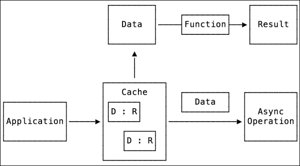

# 第六章：为高性能构建应用程序架构

在前面的章节中，我们讨论了不同的方法来改进代码以实现高性能。我们主要集中在一个小的代码部分以及如何改进一个函数、一个算法和一个数据结构。在本章中，我们将集中讨论更高层次的内容。我们将讨论如何设计一个可扩展、可维护且高性能的应用程序架构。

在本章中，我们将讨论以下主题：

+   高性能和并发概述

+   避免状态

+   分而治之

+   设计异步架构

# 实现高性能

提高应用程序性能的一种方法是通过并行运行代码。这不仅使我们能够更快地运行代码并更快地得到结果，而且还使主线程从做大量工作并被阻塞中解放出来。你应该知道主线程负责事件和用户输入处理。所有 UI 工作都在主线程上执行，为了实现真正流畅的用户交互，我们应该在主线程上尽可能少地做工作。

并行运行代码可能是一个棘手的问题，有时它可能导致操作运行时间的增加。构建稳固的并发应用程序架构也不是一个简单任务，你应该仔细规划。

为了充分利用并发，了解我们拥有的硬件，这对于我们来说非常有用，这一点非常重要。

## 设备架构

为了能够实现真正的高性能，首先我们需要学习和理解我们有哪些工具可以利用。如果你正在开发 iOS 应用程序，你的应用程序将在 iPhone 和 iPad 上运行；对于 OS X，它将在 Mac 上运行。尽管 iPhone 和 Mac 可能看起来有很大的不同，但它们共享相同的基本概念，我们可以将 Mac 视为一个更强大的 iPad 设备。

现在，所有计算机甚至手机都使用多核处理器，这使我们能够同时并行执行许多指令。从 iPhone 4s 开始，所有 iPhone 都配备了双核处理器，而 iPad Air 2 甚至配备了 3 核处理器。我们应该充分利用这种力量并利用它。

让我们看看我们如何设计可以在多核处理器上并行运行的代码。

# 并发概述

默认情况下，当你创建一个应用程序时，它将在单线程环境中运行代码，即主线程。例如，iOS 应用程序会在主线程上调用`application:` `didFinishLaunchingWithOptions`方法。

一个更简单的例子是一个 OS X 命令行工具应用程序。它只有一个文件：`main.swift`。当你启动它时，系统会创建一个主线程，并在该线程上运行`main.swift`文件中的所有代码。

对于测试代码，playgrounds 是最好的。默认情况下，playgrounds 在执行完最后一行代码后会停止，不会等待并发代码执行完成。我们可以通过告诉 playgrounds 无限期地运行来改变这种行为。为此，请在 playground 文件中包含这两行代码：

```swift
import XCPlayground
XCPSetExecutionShouldContinueIndefinitely()
```

现在，我们可以开始玩并发了。我们需要做的第一件事是为了并行运行代码，需要在一个不同的线程上安排一个任务。我们可以通过以下方式安排一个任务以进行并发执行：

+   线程

+   **GCD**（**Grand Central Dispatch**）

+   操作队列

## 线程

作为第一个选项，我们可以使用线程。线程是最底层的 API。所有并发都是建立在线程之上，并运行多个线程。我们可以使用来自 Foundation 框架的`NSThread`。这样做最简单的方式是创建一个新的类，其中包含一个将成为我们新线程起点的方法。

让我们看看我们如何安排新的线程：

```swift
class Handler: NSObject {
  @objc class func run() {
    print("run")
  }
}

NSThread.detachNewThreadSelector("run", toTarget: Handler.self, withObject: nil)

let thread = NSThread(target: Handler.self, selector: "run", object: nil)
thread.start()
```

你可以通过两种方式创建一个新线程：使用`detachNewThreadSelector`函数或创建`NSThread`的实例并使用`start`函数。我们必须将`run`函数标记为`@objc`属性，因为我们将其用作创建线程时的选择器，而`NSThread`是一个使用动态分派进行方法调用的 Objective-C 类。

`NSObject`有一个简单的 API 可以在不同的线程上执行一个方法。因为我们的处理程序继承自`NSObject`，所以我们可以使用它。

```swift
Handler.performSelectorInBackground("run", withObject: nil)
```

另一种方法是创建`NSThread`的子类并覆盖线程的起点，即`main`函数。这样我们就不需要处理程序类了。

```swift
class MyWorker: NSThread {

  override func main() {
    print("Do work here")
  }
}

let worker = MyWorker()
worker.start()
```

### 线程复杂度

尽管这里的代码相当简单，但处理线程却是一个相当复杂的操作。我们需要注意管理线程的状态，正确地终止它，并释放线程使用的资源。

创建一个新线程是一个非常昂贵且耗时的操作，我们应该尽可能避免它。解决这个问题的方法是重用创建的线程。创建和管理线程池会给应用程序增加不必要的复杂性。

当你需要在线程之间进行通信并同步数据时，这个过程变得更加困难。

### 线程解决方案

现在我们不是在解决我们想要并行运行的初始任务，而是在花费时间管理这个并发执行系统的复杂性。幸运的是，我们不需要这样做，因为有一个解决方案：*不要使用线程*。

*iOS 和 Mac 并发编程指南*建议不要使用线程，而是选择高级 API，如 GCD 或操作队列。

### 小贴士

本章仅展示线程 API 以供一般了解。你几乎永远不应该使用线程；请使用 GCD。

## GCD

**GCD**（**Grand Central Dispatch**）是一个建立在线程之上的高级 API，为你处理线程管理的所有方面。与线程工作不同，GCD 提供了一个队列和任务抽象。你将任务调度到队列中执行，队列负责其他所有事情。让我们看看我们如何使用 GCD 重写我们的代码：

```swift
let bgQueue = dispatch_get_global_queue(QOS_CLASS_BACKGROUND,0)
dispatch_async(bgQueue) {
  print("run")
}
```

如你所见，代码从一开始就看起来更简单。在我们深入细节之前，让我们看看 GCD 及其概念：

+   队列

+   任务

+   向队列添加任务

### 队列

**队列** 是一个负责管理和执行其任务的结构。队列是一个先进先出数据结构。这意味着队列中的任务以它们被添加到队列中的顺序启动。

### 注意

先入先出意味着任务以相同的顺序启动，但这并不意味着它们不能同时执行。并发队列可以同时启动许多任务。

队列本身没有太多功能。你需要执行的主要操作是创建一个队列或获取全局队列中的一个。

有三种队列类型：

+   主队列

+   并发：全局和自定义队列

+   串行

#### 主队列

**主队列** 代表与主线程关联的队列。它按顺序串行运行任务，一个接一个。你通常会使用这个队列将其他后台队列的执行结果传递到主队列以更新 UI 状态。你可以通过调用 `dispatch_get_main_queue` 函数来获取主队列。

```swift
let mainQueue = dispatch_get_main_queue()
```

#### 并发队列

**并发队列** 并行运行其任务。获取并发队列的最简单方法是使用全局并发队列。

```swift
func dispatch_get_global_queue(identifier: Int, flags: UInt) -> dispatch_queue_t!
```

要获取全局队列，我们需要指定所需的优先级类型。有五种类型的队列，任务优先级递减。`USER_INTERACTIVE` 是优先级最高的队列，而 `BACKGROUND` 是最低的。

+   `QOS_CLASS_USER_INTERACTIVE`

+   `QOS_CLASS_USER_INITIATED`

+   `QOS_CLASS_DEFAULT`

+   `QOS_CLASS_UTILITY`

+   `QOS_CLASS_BACKGROUND`

    ### 小贴士

    同样可用的还有旧的 `DISPATCH_QUEUE_PRIORITY` 常量，当指定队列优先级类型而不是 `QOS_CLASS` 时可以使用，但 `QOS_CLASS` 更受欢迎。

第二个标志参数是保留的，从不使用，所以我们只使用 0。全局队列可供整个系统使用，任何人都可以向它们添加任务。当你只需要运行一些任务时，这是一个完美的选择。

#### 自定义队列

当你需要进行更复杂的处理并完全控制添加到队列中的任务时，你可以创建自己的队列。自定义队列非常适合当你需要通知所有任务完成时，或者需要在任务之间进行更复杂的同步时。

你可以创建并发和串行队列。串行队列一次执行一个任务，一个接一个，而不是并发执行。

```swift
let concurentQ = dispatch_queue_create("my-c", DISPATCH_QUEUE_CONCURRENT)
let serialQ = dispatch_queue_create("my-s", DISPATCH_QUEUE_SERIAL)
```

### 任务

**任务** 是需要运行的一段代码。任务被定义为 `dispatch_block_t` 类型，并定义为 `() -> Void`。我们可以使用闭包或函数作为任务。

```swift
typealias dispatch_block_t = () -> Void

let tasks: dispatch_block_t = {
  print("do Work")
}

func doWork() {
  print("do Work Function")
}
```

### 将任务添加到队列中

我们有一个队列，我们有一个想要运行的任务。为了在特定队列上运行任务，我们需要将其调度到该队列。我们可以用两种方式来做这件事：

+   **同步**: `dispatch_sync`

+   **异步**: `dispatch_async`

这两个函数都非常简单，并且具有相同的类型。它们之间的唯一区别在于它们的名称和工作方式。

```swift
dispatch_sync(queue: dispatch_queue_t, _ block: dispatch_block_t)
dispatch_async(queue: dispatch_queue_t, _ block: dispatch_block_t)
```

#### 同步调度

同步调度提交一个任务以执行，并等待任务完成。

```swift
dispatch_sync(queue) { ... }
```

当您使用并发队列并以同步方式向其调度任务时，队列可以同时运行多个任务，但 `dispatch_sync` 方法会等待您提交的任务完成。

```swift
let queue = dispatch_get_global_queue(QOS_CLASS_BACKGROUND, 0)

dispatch_sync(queue) { print("Task 1") }
print("1 Done")

dispatch_sync(queue) { print("Task 2") }
print("2 Done")
```

### 小贴士

从同一队列中执行的任务中永远不要调用 `dispatch_sync` 函数。这会导致串行队列发生死锁，并且对于并发队列也应避免。

```swift
dispatch_sync(queue) {
  dispatch_sync(queue) {
    print("Never called") // Don't do this
  }
}
```

在这个示例中，`print("1 完成")` 指令和其余代码将等待 `任务 1` 完成。

#### 异步调度

另一方面，异步调度提交一个任务以执行，并立即返回。

```swift
dispatch_async(queue) { ... }
```

如果我们使用之前的示例并将其更改为使用 `dispatch_async`，则 `1 完成` 将不会等待任务完成。我们还可以通过使用 sleep 函数冻结当前线程来模拟额外的工作。

```swift
let queue = dispatch_get_global_queue(QOS_CLASS_BACKGROUND, 0)

dispatch_async(queue) {
  sleep(2) // sleep for 2 seconds
  print("Task 1")
}
print("1 Submitted")

dispatch_async(queue) { print("Task 2") }
print("2 Submitted")
```

因此，`任务 2` 在 `任务 1` 提交执行后立即提交执行，并在 `任务 1` 完成执行之前完成。以下是控制台输出：

```swift
1 Submitted
2 Submitted
Task 2
Task 1

```

GCD 还有一些用于同步提交任务的强大工具，但在这里我们不会介绍它们。如果您想了解更多，请阅读 Apple 库文档中的 *并发编程指南* 文章，网址为 [`developer.apple.com/library/ios/documentation/General/Conceptual/ConcurrencyProgrammingGuide`](https://developer.apple.com/library/ios/documentation/General/Conceptual/ConcurrencyProgrammingGuide)。

## 操作队列

`NSOperationQueue` 是建立在 GCD 之上的，它提供了更高层次的抽象和 API，使我们能够控制应用程序的控制流。

这个概念与 GCD 非常相似；它有一个队列，您可以将任务添加到特定的队列中。

```swift
let queue = NSOperationQueue()
queue.addOperationWithBlock {
  print("Some task")
}

NSOperationQueue.mainQueue().addOperationWithBlock {
  print("Some task")
}
```

NSOperationQueue 提供了一个更高层次的 API，但它也比 GCD 略慢。当需要链式任务、相互依赖的任务或需要取消的任务来控制应用程序流程时，NSOperationQueue 非常适合。您可以通过使用 GCD 实现相同的功能，但这需要实现一些已经由 NSOperationQueue 实现的额外逻辑。

当您需要执行一个任务并获取结果，而不需要控制应用程序流程时，GCD 工作得非常好。

在本章的后续内容中，我们将使用 GCD 进行并发编程。现在，让我们继续学习一些技巧，这些技巧将帮助我们使我们的代码架构在并发编程中更加稳固。

# 设计异步代码

异步代码的第一个特点是它立即返回，并在操作完成时通知调用者。最好的解决方案是返回计算结果。这样我们就能得到更多函数风格的*输入 -> 输出*函数风格。

让我们看看这个简单的例子。这段代码有很多问题，我们将全部重构它们。

```swift
class SalesData {

  var revenue: [Int]
  var average: Int?

  init (revenue: [Int]) {
    self.revenue = revenue
  }

  func calculateAverage() {

    let queue = GCD.backgroundQueue()
    dispatch_async(queue) {

      var sum = 0
      for index in self.revenue.indices {
      sum += self.revenue[index]
      }

      self.average = sum / self.revenue.count
    }
  }
}
```

### 注意

我们创建了一个 GCD 结构，它提供了一个很好的 API 来处理 GCD 代码。在先前的例子中，我们使用了 GCD 的`backgroundQueue`函数；下面是它的实现：

```swift
struct GCD {
  static func backgroundQueue() -> dispatch_queue_t {
    return dispatch_get_global_queue(QOS_CLASS_BACKGROUND, 0)
  }
}
```

总体来说，那个例子中的计算代码真的很糟糕，我们可以通过使用`reduce`方法来改进它，这实际上会解决许多问题，并使代码更安全、更易读。

```swift
let sum = self.revenue.reduce(0, combine: +)
```

但那个例子中的主要目的是展示它可能有多危险，以及你可能会遇到哪些问题。

让我们使用这段代码来看看问题：

```swift
let data = SalesData(revenue: makeRandomArray(100))
data.calculateAverage()
data.average // nil
```

问题在于`calculateAverage`立即返回，正如它应该做的那样，此时并没有计算平均值。为了解决这个问题，所有异步代码都应该有一种方式来通知调用者在任务完成时。最简单的方法是添加一个回调完成函数作为参数。

```swift
func calculateAverage(result: () -> Void ) {
  ...

  self.average = sum / self.revenue.count
  result()
}
```

现在，当使用这段代码时，我们可以为结果回调参数使用一个简洁明了的尾随闭包语法。

```swift
let data = SalesData(revenue: makeRandomArray(100))
data.calculateAverage {
  print(data.average)
}
```

这段代码有一个非常重要的问题。它是调用`result`回调函数在后台线程上。这意味着我们传递给`data.calculateAverage`的闭包将在后台调用，但对于我们来说，这并没有文档说明，这种行为也不明确。我们假设我们将得到在主线程上调用该闭包，因为我们是从主线程调用`calculateAverage`函数的。让我们这样做。我们需要做的是切换到主队列，并在主线程上调用`result`。

```swift
dispatch_async(GCD.mainQueue()) {
  result()
}
```

最佳实践是默认在主队列上调用回调方法，除非需要其他行为。如果你需要在特殊队列上调用回调，那么它应该作为参数传递给函数。

这段代码可以工作，但仍然有一个可以改进的地方。当结果回调被调用时，我们首先获取`average`实例。如果结果回调返回其计算结果会更好。

### 提示

一般而言，对于函数来说，以输入和返回结果的方式`X -> Y`进行函数式编程是一种很好的风格。这些函数更容易使用和测试。

让我们重构这段代码，将平均值结果传递给回调函数：

```swift
func calculateAverage(result: (Int?) -> Void ) {
  ...

  self.average = sum / self.revenue.count

  dispatch_async(GCD.mainQueue()) {
    result(self.average)
  }
}

// Use case
let data = SalesData(revenue: makeRandomArray(1000))
data.calculateAverage { average in
  print(average)
}
```

变化不大，但好处相当广泛。当我们使用`calculateAverage`函数时，我们直接在闭包中作为参数得到结果。现在我们不需要访问`SalesData`的实例变量。`SalesData`更像是一个封闭的盒子类型，具有隐藏的实现细节，因此我们将在未来能够进行更多的重构。

# 避免状态

第一条规则是避免状态。当你同时做两件事时，这两个过程应该尽可能独立和隔离。它们之间不应该有任何了解，也不应该共享任何可变资源。如果它们确实这样做了，那么我们就需要处理对这些共享资源的访问同步，这会给我们的系统带来我们不想要的复杂性。目前在我们的代码中，我们有两个状态：一个`revenue`数字数组和`average`结果。这两个过程都可以访问这个状态。

那段代码的第一个问题是它引用了自己。当你尝试访问闭包作用域之外的实例变量或方法时，你会看到一个错误信息：**在闭包中引用属性'revenue'需要显式的'self.'来使捕获语义明确**。

Xcode 也会提出对这个问题的修复，添加显式的自我捕获。这将解决 Xcode 的错误，但不会解决根本问题。当你看到这个错误时，停下来重新思考你的代码设计；在某些情况下，改变代码会更好，就像在我们的例子中一样。


第二个问题是拥有可变状态并修改实例变量。让我们再次使用我们的上一个例子，看看为什么在并发代码中拥有状态和访问实例变量是一个坏主意：

```swift
let data = SalesData(revenue: makeRandomArray(1000))
data.calculateAverage { average in
  print(average)
}
data.revenue.removeAll(keepCapacity: false)
```

如果你运行这段代码，它将因为通过索引操作从数组中获取数字而崩溃，出现**致命错误：数组索引超出范围**：

```swift
sum += self.revenue[index]
```

发生在这里的情况是，当我们调用`calculateAverage`时，收入数组有数据，但后来我们移除了所有的收入数字，数组变空了；然而，我们迭代的索引指向旧的数组大小，我们正在尝试访问超出范围的数组索引。

为了解决这个问题，我们应该始终尝试移除状态。一种方法是将所需的数据作为参数传递给函数，或者如果你想要像我们这样的某些状态，捕获闭包的不可变值。

## 捕获列表

使这段代码变得更好的第一步是移除访问可变数组变量。解决这个问题的最简单方法是创建一个局部常量并在闭包中使用它。

```swift
let revenue = self.revenue
dispatch_async(queue) {
  var sum = 0
  for index in revenue.indices {
    sum += revenue [index]
  }

  self.average = sum / revenue.count
  ...
}
```

这个解决方案是可行的，因为修改 `revenue` 实例变量不会影响我们创建的局部常量。这段代码有一个小问题。常量在闭包外部可见，但它的意图是仅在闭包内部使用。如果能将它移到闭包中会更好。我们可以通过使用闭包的捕获列表来实现这一点。我们唯一需要做的改动是移除局部常量声明，并将其添加到闭包捕获列表中。其余代码保持不变。

```swift
dispatch_async(queue) { [revenue] in
  ...
}
```

在这个例子中，我们使用了非常短的捕获列表表示法，但我们也可以为我们要捕获的常量提供一个替代名称，并添加额外的 ARC `weak` 或 `unowned` 属性。

```swift
dispatch_async(queue) { [numbers = revenue] in  ...
```

## 不可变状态

在并发代码中拥有状态是一个糟糕的设计，但有两种状态：可变和不可变。无论如何，你都需要在应用程序中拥有某种状态。如果你要拥有状态，请使其不可变；这样你就可以确保它不会被更改，并且可以安全地与之交互。

如果我们查看之前的代码示例，我们可以使 `revenue` 数字不可变，这将解决问题：

```swift
class SalesData {

  let revenue: [Int]
  ...
}
```

我们首先会做的微小改动是将收入数字数组改为不可变。因为 `revenue` 数组是不可变的，所以我们创建实例后无法修改它，因此我们需要移除这段代码。

```swift
  data.revenue.removeAll(keepCapacity: false)
```

因为 `revenue` 现在是不可变的，所以可以在并发代码中使用它，因此我们可以移除捕获列表，并直接使用不可变的收入，就像我们之前使用 `self` 一样。

```swift
func calculateAverage(result: (Int?) -> Void ) {

  let queue = GCD.backgroundQueue()
  dispatch_async(queue) {

    var sum = 0
    for index in self.revenue.indices {
      sum += self.revenue[index]
    }

    self.average = sum / self.revenue.count
    dispatch_async(GCD.mainQueue()) {
      result(self.average)
    }
  }
}
```

`SalesData` 包含不可变的销售数字，这些数字不能被更改。这意味着，一旦我们计算过平均值，它将始终对该实例保持不变。下次我们调用 `calculateAverage` 时，如果我们能重用它，就无需再次计算。

```swift
func calculateAverage(result: (Int?) -> Void ) {

  if let average = self.average {
    result(average)
  } else {

    let queue = GCD.backgroundQueue()
    dispatch_async(queue) {
      ...
    }
  }
}
```

我们甚至可以再走一步，使其不可变，并使用 `struct` 而不是 `class` 作为 `SalesData` 类型。当我们这样做时，我们会得到一个错误信息：

**无法分配属性：'self' 是不可变的**

**self.average = sum / self.revenue.count**

当你为 `self.average` 赋予新值时，你正在修改一个 `self` 实例，并且由于结构体默认是不可变的，我们需要将该方法标记为可变的：

```swift
struct SalesData {
  ...
  mutating func calculateAverage(result: (Int) -> Void ) {
    ...
  }
}
```

这些只是我们需要做的两个改动。此外，当我们使用它时，我们需要将 `SalesData` 实例作为一个变量来创建，因为 `calculateAverage` 会修改它。

```swift
var data = SalesData(revenue: makeRandomArray(1000))
data.calculateAverage { average in
  print(average)
}
```

因此，现在我们不能有一个常量 `let` 不可变的 `SalesData` 实例。这不是良好架构的标志，我们应该重构它。使用结构体作为数据实体是一个非常好的解决方案，因此我们应该继续使用这种方法重构代码。

# 分而治之

要实现良好的、稳固的应用程序架构，最好的方法是编写良好的代码结构，创建适当的抽象，并将其分解为具有单一职责的组件。

在函数式编程中，这更进一步。数据——以及处理这些数据的函数——也是分离的。面向对象的数据和与之相关的操作的概念被分成两部分。这使得代码更加灵活和可重用。

对于并发代码执行，特别重要的是将你的代码拆分成独立的单独部分，因为它们可以并发执行而不会相互阻塞。

在我们开始重构代码之前，让我们先分析它。目标是识别一个具有单一职责的组件。我已经做到了，以下是我识别出的这些组件：

+   **在数据中**：第一部分是我们的输入数据。在我们的例子中，它是一个`SalesData`结构，它在我们应用程序中持有不可变数据。

+   **计算函数**：下一部分是我们知道如何计算`SalesData`平均值的函数。它是一个简单的第一类函数，它接受`SalesData`并返回平均值。它的数学表示法是`f(x) = y`，代码表示法是`func calculateAverage(data: SalesData) -> Int`。

+   **结果数据**：这是计算函数返回的结果。在我们的例子中，它是一个简单的`Int`数字，表示平均值。

+   **异步执行操作**：下一部分是一个切换到后台线程再回到主线程的操作，这实际上允许我们执行异步代码。在我们的例子中，它是一个带有适当队列的`dispatch_async`函数调用。

+   **缓存**：一旦我们计算出一个平均值，我们就存储它，不再进行计算。这正是缓存的作用。

现在我们已经在我们应用程序中识别出独立的组件，让我们建立它们之间的联系和通信。



为了保持交互简单，我们的应用程序将向缓存请求`SalesData`的平均值。如果缓存包含平均值，它将返回它。否则，它将启动一个异步操作并将`SalesData`传递给它。异步操作将调用一个`calculateAverage`函数，获取平均结果，并将其返回给缓存。缓存将保存它并将其转发给应用程序。

当用言语解释时，这可能会听起来有点复杂，但在代码中它相当简单、直接且清晰。在我们开始重构之前，让我们看看我们为这个结构编写的代码：

```swift
struct SalesData {
  let revenue: [Int]
  var average: Int?

  init (revenue: [Int]) {
    self.revenue = revenue
  }

  mutating func calculateAverage(result: (Int?) -> Void ) {

    if let average = self.average {
      result(average)
    } else {

      let queue = GCD.backgroundQueue()
      dispatch_async(queue) {
        var sum = 0
        for index in self.revenue.indices {
          sum += self.revenue[index]
        }

        self.average = sum / self.revenue.count
        dispatch_async(GCD.mainQueue()) {
          result(self.average)
        }
      }
    }
  }
}
```

第一个出现在我脑海中的想法是遵循 FP 原则**保持数据和函数分离**，并将`calculateAverage`函数移出`SalesData`类型之外。

```swift
struct SalesData {
  let revenue: [Int]
  var average: Int?
}

func calculateAverage(data: SalesData, result: (Int) -> Void ) {
  ...
}
```

这将有效，但这个代码有一个问题。`calculateAverage`函数只能与`SalesData`类型一起工作，因此它应该隐藏在`SalesData`类型内部，而不对其他类型可见。此外，在 Swift 方法表示法中更受欢迎。

### 小贴士

Swift 2.0 将方法转移到自由函数之上，因此它更倾向于使用不可变方法。

示例：

+   **Swift 2.0 方法**：`[1,2,3].map { $0 + 1 }.filter { $0 > 1 }`

+   **Swift 1.2 函数**：`filter(map([1,2,3]) { $0 + 1 }) { $0 > 2 }`

我们不是将 `calculateAverage` 函数从 `SalesData` 类型中移除，而是将其改为不可变，并使其只执行平均计算，就像我们在我们的方案中所展示的那样。

`SalesData` 应该：

+   存储收入数字

+   成为计算平均值的不可变函数

让我们重构 `SalesData` 结构，并移除所有其他方法，以遵循我们的新结构

```swift
struct SalesData {
  let revenue: [Int]

  var average: Int {
    return revenue.reduce(0, combine: +) / revenue.count
  }
}
```

这里是解决方案，它非常干净简单。我们不是使用函数，而是使用了计算属性。Swift 倾向于使用更多只读属性来处理不可变数据，在我们的例子中，它将使未来的可读性更好。此外，我们最终使用了 `reduce` 方法来计算平均值。我们可以这样使用它：

```swift
  let data = SalesData(revenue: [145, 24, 3012])
  data.average
```

下一步是使其异步工作。让我们为它创建一个新的类型。它应该接受一个 `SalesData` 和一个回调闭包，该闭包将返回 `Int`，一个计算出的平均值结果。

```swift
struct AsyncOperation {

  static func calculate(data: SalesData, result: (Int) -> Void ) {
    GCD.asyncOnBackground {
      let average = data.average
      GCD.asyncOnMain {
        result(average)
      }
    }
  }
}
```

### 注意

我们已经为我们的 GCD 类型添加了两个额外的辅助方法：

```swift
struct GCD {
  static func asyncOnBackground(block: () -> Void ) {
    dispatch_async(self.backgroundQueue(), block)
  }
  static func asyncOnMain(block: () -> Void ) {
    dispatch_async(self.mainQueue(), block)
  }
}
```

这段代码看起来不错，但还有一个问题。调用平均值时，背景和主线程的切换是嵌入在一起的。如果我们保持这些函数分开，将更好，这样我们就可以在需要添加增长数字并为他们执行类似计算时重用这些函数。

```swift
static func calculateAverage(data: SalesData, result: (Int) -> Void ) {
  runAsync(data.average, result: result)
}

//MARK: - Private
private static func runAsync<T>(@autoclosure(escaping) work: () -> T, result: (T) -> Void ) {
  GCD.asyncOnBackground {
    let x = work()
    GCD.asyncOnMain {
      result(x)
    }
  }
}
```

在这里，我们创建了一个 `runAsync` 泛型函数，它在后台执行一些工作，并在主线程上返回其结果。我们在这里使用了 `@autoclosure(escaping)` 属性，以便能够传递一个表达式 `data.average, ...)` 而不是手动将其包装在闭包中。这使得代码语法更简洁。

现在，我们可以以异步的方式计算平均值。

```swift
let data = SalesData(revenue: [145, 24, 3012])
AsyncOperation.calculateAverage(data) { average in
  print(average)
}
```

现在是时候构建我们的最后一个组件，一个缓存。对于缓存功能，字典将是最佳选择。让我们添加一个字典来存储 `SalesData` 的平均结果。

```swift
struct SalesDataCache {
  var revenueCache = [SalesData : Int]()

  subscript (data: SalesData) -> Int? {
    return revenueCache[data]
  }

  mutating func getAverage(data: SalesData, result: (Int) -> Void) {
    if let average = self[data] {
      result(average)
    } else {
      AsyncOperation.calculateAverage(data) { average in
        self.revenueCache[data] = average
        result(average)
      }
    }
  }
}
```

我们创建了一个具有一个属性（缓存）和获取平均值函数的 `SalesDataCache` 结构体，该函数要么返回缓存的值，要么计算它并将其保存到缓存中，然后返回。这是一个非常简单的解决方案，但它不会工作。它显示了一个错误：**类型 'SalesData' 不符合协议 'Hashable'**。

字典中的键必须是 `Hashable`，因此我们需要在我们的 `SalesData` 类型中实现这一点。`Hashable` 协议要求我们实现 `hashValue` 属性和等式函数。

```swift
var hashValue: Int { get }
func ==(lhs: Self, rhs: Self) -> Bool
```

实现一个数字数组的良好哈希函数相当复杂。最简单的方法是为 `SalesData` 添加一个 `id` 属性，使其具有唯一标识。

```swift
struct SalesData {
  let id: Int
  revenue: [Int]
}

//MARK:- Hashable
extension SalesData: Hashable {
  var hashValue: Int {
    return id.hashValue
  }
}

func == (lhs: SalesData, rhs: SalesData) -> Bool {
  return lhs.id == rhs.id
}
```

现在我们的缓存将开始工作，我们最终可以在我们的应用程序中使用它。让我们这样做：

```swift
let range = 0...10
var cache = SalesDataCache()
let salesData = range.map {
  SalesData(id: $0, revenue: makeRandomArray(1000))
}

for data in salesData {
  cache.getAverage(data) { average in
    print(average)
  }
}
```

如您所见，我们创建的 API 真的非常容易使用。尽管幕后有很多逻辑在运行，但对于您来说，它就像调用一个方法：`getAverage`。

此外，我们以这种方式构建了底层组件，以便它们可以单独使用——例如，如果我们不需要缓存或异步执行。

为了总结这个示例的重构工作，让我们看看我们最终得到的完整代码：

```swift
struct SalesData {
  let id: Int
  let revenue: [Int]

  var average: Int {
    return revenue.reduce(0, combine: +) / revenue.count
  }
}

//MARK:- Hashable
extension SalesData: Hashable {
  var hashValue: Int {
    return id.hashValue
  }
}

func == (lhs: SalesData, rhs: SalesData) -> Bool {
  return lhs.id == rhs.id
}

struct AsyncOperation {

  static func calculateAverage(data: SalesData, result: (Int) -> Void) {
    runAsync(data.average, result: result)
  }

  //MARK: - Private
  private static func runAsync<T>(@autoclosure(escaping) work: () -> T, result: (T) -> Void ) {
    GCD.asyncOnBackground {
      let x = work()
      GCD.asyncOnMain {
        result(x)
      }
    }
  } 
}

struct SalesDataCache {
  private var revenueCache = [SalesData : Int]()

  subscript (data: SalesData) -> Int? {
    return revenueCache[data]
  }

  mutating func getAverage(data: SalesData, result: (Int) -> Void)  {
    if let average = self[data] {
      result(average)
    } else {
      AsyncOperation.calculateAverage(data) { average in
        self.revenueCache[data] = average
        result(average)
      }
    }
  }
}
```

# 控制生命周期

在我们的代码中，我们使用了 `@autoclosure(escaping)` 属性。这是一个非常强大的属性，值得详细探讨。还有一个 `@noescape` 属性。让我们更详细地探讨它们。

## 应用 @autoclosure 和 @noescape 属性

首先，让我们看看何时以及如何使用这些属性。我们可以将它们应用于具有函数类型的函数参数。函数类型可以表示为方法、函数或闭包，并且具有 `(parameters) -> (return)` 表示法。这里有一些示例：

```swift
func aFunc(f: () -> Void )
func increase(f: () -> Int ) -> Int
func multiply(f: (Int, Int) -> Int ) -> Int
```

## @autoclosure

`@autoclosure` 属性可以应用于没有参数并返回任何类型的函数类型的参数，`() -> T`。例如：

```swift
func check(@autoclosure condition: () -> Bool)
func increase(@autoclosure f: () -> Int ) -> Int
```

当我们使用不带 `@autoclosure` 属性的 `increase` 函数时，我们需要传递一个函数、一个方法或一个闭包作为参数。

```swift
let x = 10
let res = increase( { x } )
check( { x > 10 } )
```

但在这个用例中，如果我们能够简单地使用一个表达式而不需要将其包装在闭包中会更好，就像这样：

```swift
let x = 10
let res = increase(x)
check(x > 10)
```

正如 `@autoclosure` 允许我们做的那样。当你使用 `@autoclosure` 属性的参数时，你传递的表达式会自动为你包装成一个闭包。这使得你的代码更简洁。这就是它所做的全部。没有魔法；它只是为你移除了样板代码。

## @noescape

`@noescape` 关键字更为复杂和有趣。它可以应用于具有任何函数类型的函数参数。

`@noescape` 属性表示闭包将在函数体内部使用，在函数返回调用之前。这意味着它不会逃离函数体。

当你应用此属性时，它表示闭包将在函数体内部同步使用。这也意味着它将在你离开函数时释放。该闭包参数的生命周期不能超过函数调用。

应用此属性可以启用一些性能优化，但更重要的是，它禁用了在访问实例成员时显式指定 "`self.`" 的要求。

让我们看看一些示例，以更好地理解这一点。对于简单的示例，我们将使用相同的 `increase` 函数，但现在我们将它作为 `struct` 的一个方法：

```swift
func increase(f: () -> Int ) -> Int {
  return f() + 1
}

struct Data {
  var number: Int

  mutating func increaseNumber() {
    number = increase { number }
  }
}
```

`increase` 函数调用中存在错误：**闭包中引用属性 'number' 需要显式 'self.' 以使捕获语义明确**；我们需要显式引用 `self.number`。

但让我们看看 `increase` 函数。`f: ()-> Int` 参数在函数体内部使用，并且它没有离开其作用域。这是应用 `@noescape` 属性的一个很好的候选。

```swift
func increase(@noescape f: () -> Int ) -> Int {
  return f() + 1
}
```

现在我们不需要做任何进一步的更改，并且明确地引用 `self.numbers`，因为 `@noescape` 确保在离开该函数之前会调用闭包，我们可以安全地引用 `self`。

### 小贴士

尽可能地应用 `@noescape`。它为代码增加了额外的安全级别。同时，它还使优化更好，并提高性能。

如果我们查看 Swift 标准库中的方法，如 `map`、`reduce`、`contains` 等，你会发现它们被标记为 `@noescape` 属性。黄金法则：*如果你在离开函数之前调用闭包参数，请标记为 @noescape*。

也许在未来的 Swift 中，它将自动为你完成这些，但到目前为止，我们需要自己来做。

## @autoclosure (escaping)

`@autoclosure` 属性也隐式地应用了 `@noescape`。如果你想将一个参数作为一个自动闭包，同时表明它将比函数有更长的生命周期，请使用 `@autoclosure(escaping)` 属性。这对于异步代码执行可能很有用，就像我们在 `AsyncOperation` 的例子中那样。

# 摘要

在本章的第一部分，我们介绍了多线程并发和多核设备架构。这些一般信息使我们能够理解并发代码执行的核心原则。

在第二部分，我们介绍了在 Swift 中使用线程、GCD 和 NSOperation 运行代码的三个异步方法。我们探讨了它们之间的区别以及每种方法最适合的情况。

在本章的第三部分，我们专注于使用 GCD 架构异步 Swift 代码。我们涵盖了重要的提示，例如传递回调函数参数、避免状态、使用不可变值等。此外，我们还介绍了两个非常有用的 Swift 属性——`@noescape` 和 `@autoclosure`。

在下一章中，我们将介绍一种重要的性能优化技术：懒加载。
