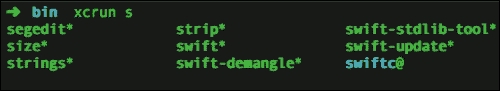
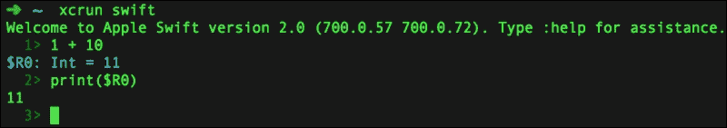
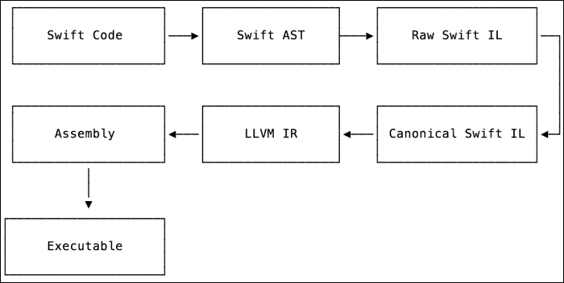
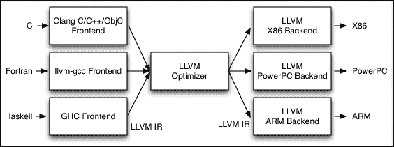
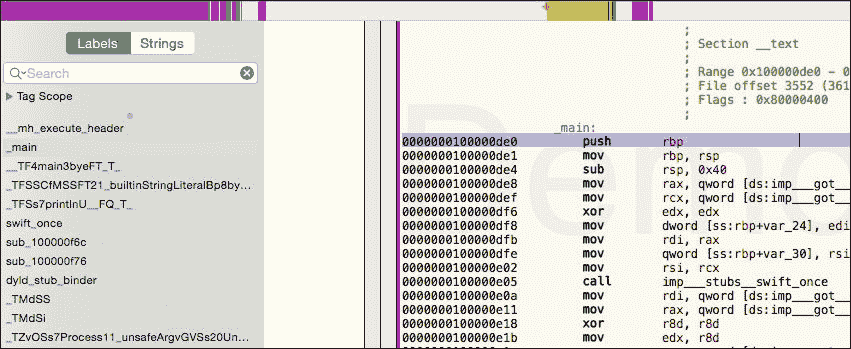

# 第八章. 发现所有 Swift 的潜在力量

在前面的章节中，我们讨论了许多关于 Swift、其强大功能和如何提高应用程序性能以及构建稳固的应用程序架构的话题。在本章中，我们将探讨一些工具并涵盖以下主题：

+   Swift 为什么会这么快

+   Swift 编译器和工具

+   分析汇编代码

+   回顾学习的重要信息

+   功能阅读

# Swift 为什么会这么快

首先，让我们快速回顾一下——也就是*为什么 Swift 会这么快*——并看看 Swift 及其酷炫功能有什么特别之处。

Swift 是一种强类型编译型编程语言。这使得它成为一个非常安全的编程语言。Swift 对类型非常严格，并验证源代码中所有类型的使用是否正确。它在编译时捕捉了大量问题。

Swift 也是一种静态编程语言。它的源代码被编译成汇编代码，然后使用 LLVM 工具将汇编代码编译成机器代码。运行本机机器代码指令是完成这项任务最快的方式。相比之下，Java 和 C# 被编译成一段中间代码，需要虚拟机来运行，或者另一个将其翻译成机器指令的工具。因为 Swift 在运行时不会这样做，所以它有非常大的性能提升。

通过混合强类型规则和编译成汇编代码，Swift 能够很好地分析代码并执行很好的汇编代码优化。Swift 还被构建得易于编写，拥有愉快且干净的语法、现代特性和类型。这种独特的语法、强大功能、安全性和性能的组合使 Swift 成为一个非常出色的编程语言。

# Swift 命令行工具

在这本书中，我们已经使用了一个终端工具——Swift REPL 控制台。我们通过在终端中输入 `xcrun swift` 命令来启动它。它启动了 REPL，然后我们可以输入 Swift 代码并评估它。

## xcrun

要启动一个 REPL，我们实际上使用了两个工具：`xcrun` 和 `swift`。`xcrun` 是一个 Xcode 命令行工具运行器。它可以帮助你通过名称从活动开发者目录中运行命令行工具。当你安装了多个版本的 Xcode 时，你可以在执行命令行工具时选择使用哪一个。你可以在 Xcode 中通过访问**Xcode** | **偏好设置** | **位置** | **命令行工具**，或者通过在终端中运行 `xcode-select` 命令来实现。这样，`xcrun` 允许你避免在要运行的命令行工具中指定完整路径，并使运行过程变得更加简单。

`xcrun` 有一些更有趣的选项，你应该尝试一下。要获取帮助，请运行 `xcrun -h` 帮助命令，这个命令通常对大多数其他命令行工具也是可用的。

### 小贴士

一些命令行工具需要使用完整的命令表示法：`–help`。一个例子是 `xcrun --help`。

这意味着通过运行 `xcrun swift` 命令，我们实际上是在启动一个 `swift` 命令行工具。如果你运行 `xcrun swift -h` 命令以获取帮助，你会看到 `swift` 实际上是一个具有许多选项可供选择的 Swift 编译器。

在 `xcrun` 中可用的另一个有趣的功能是通过名称获取工具的路径。这非常有用，因为这样我们可以探索这个工具所在的文件夹，并找到其他可用的工具。例如，让我们看看 `swift` 命令行工具的位置。为此，你需要运行 `xcrun -f swift` 命令，结果如下：

```swift
/Applications/Xcode.app/Contents/Developer/Toolchains/XcodeDefault.xctoolchain/usr/bin/swift

```

我们可以通过更改目录使用 `cd` 命令并执行 `open .` 命令简单地从这个终端打开这个文件夹：

```swift
cd /Applications ... /usr/bin/
open .

```

在这个文件夹中，有超过 50 个不同的命令行工具可用，例如 `libtool`、`otool`、`swift`、`swift-demangle` 以及其他工具。还有一个包含许多有趣工具的另一个目录，例如 `ibtool`、`simctl` 和 `xcrun`：

```swift
/Applications/Xcode.app/Contents/Developer/usr/bin

```

我们不会在这里涵盖所有这些；我们将把它们留给你作为作业去探索它们的强大功能。

另一种通过 `xcrun` 在当前目录中查找可运行工具的方法是开始输入命令并按 *Tab* 键。这将显示可用命令的建议。



# Swift 编译器

在上一步中，当我们玩弄 `xcrun` 时，我们发现有两个不同的 Swift 编译器工具：`swift` 和 `swiftc`。如果你使用 `-h` 命令获取帮助，你会注意到它们都是具有相似选项的 Swift 编译器，但存在一些差异。

## swift

`swift` 工具用于编译和执行 Swift 代码。如果你不带任何参数运行它，它将启动一个交互式解释器（REPL），并给你评估 Swift 代码的能力。



你也可以传递一个你想要运行的 Swift 文件作为参数。我们可以简单地从命令行创建一个 Swift 文件：

```swift
echo 'print("Hello World")' > main.swift 
xcrun swift main.swift
Hello World

```

你也可以传递额外的选项，例如 `-O` 以启用优化：

```swift
xcrun swift -O main.swift

```

## swiftc

`swiftc` 编译器编译 Swift 代码并生成结果，但它不会执行它。根据选项的不同，你可以得到一个二进制文件、汇编、LLVM IR 表示或其它。

与 `swift` 工具不同，`swiftc` 有一个必需的参数：一个输入的 Swift 文件。如果你尝试不传递此参数运行它，你会得到一个错误：

```swift
xcrun swiftc
<unknown>:0: error: no input files

```

如果你运行它并传递一个 Swift 文件作为参数，它将生成一个可执行文件。让我们使用相同的 `main.swift` 文件：

```swift
xcrun swiftc main.swift

```

结果，你将得到一个与名称相同的可执行文件——`main`。如果你运行它，你将在控制台得到相同的输出，`Hello World`。关于`swiftc`的有趣之处在于，它允许你传递许多 Swift 文件作为输入，将它们一起编译，并生成可执行文件。让我们再创建一个 Swift 文件，命名为`file.swift`，并将此函数添加到其中：

```swift
func bye() {
  print("Bye bye")
}
```

现在，我们将编辑我们的`main.swift`文件以及其中的`bye()`函数调用。如果我们现在尝试编译`main.swift`文件，它将显示一个错误：

```swift
xcrun swiftc main.swift 
main.swift:2:1: error: use of unresolved identifier 'bye'
bye()
^

```

毫不奇怪，Swift 编译器找不到`bye`函数声明，因此它失败了。我们需要做的是同时编译`file.swift`和`main.swift`文件：

```swift
xcrun swiftc main.swift file.swift

```

你传递给`swiftc`的文件顺序并不重要；我们也可以将它们命名为`swiftc file.swift main.swift`。如果你现在运行这个可执行文件，你将在控制台看到两个句子：

```swift
Hello World
Bye bye

[Process completed] 

```

现在你已经知道了如何使用 Swift 编译器，让我们继续到有趣的部分。让我们使用 Swift 编译器来产生不同的结果。为了简单起见，我们将我们的 Swift 代码与`main.swift`文件合并，并添加更多指令以获得更有趣的结果。以下是最终的代码：

```swift
func bye() {
  print("bye")
}

print("Hello World")

let a = 10
let b = 20
let c = a  + b
print(c)
bye()
```

# Swift 编译过程和 swiftc

Swift 源代码的编译过程相当有趣，涉及多个步骤。Swift 编译器使用 LLVM 进行优化和二进制生成。为了更好地理解整个过程，请参考此流程图：



首先，Swift 源代码被转换为一个**AST**（抽象语法树）。然后，它被转换为一个**SIL**（Swift 中间语言），首先是一个原始 SIL，然后是一个规范 SIL。之后，它被转换为一个 LLVM **IR**（中间表示）。在这一步中，LLVM 负责剩下的工作。它处理 IR，进行优化，并生成一个汇编，然后为特定架构生成一个可执行文件。

在前面的图中，有趣的部分是生成 SIL 的步骤。这是一个 Swift 特有的优化，它专门为 Swift 创建。其他编程语言，如 C，在生成 LLVM IR 之前不会进行这种优化，并且它们少了一个优化步骤。



使用`swiftc`，可以生成每个步骤的结果。这对于代码优化分析非常有用。要查看所有可用模式，只需运行`xcrun swiftc -h`。现在，让我们快速看一下它们。

## Swift AST

Swiftc 有三种不同的选项用于生成 AST。每个选项都生成不同详细程度的 AST。AST 代码表示显示了 Swift 编译器如何查看和分析代码：

```swift
xcrun swiftc -dump-ast main.swift
xcrun swiftc -dump-parse main.swift
xcrun swiftc -print-ast main.swift
```

`-dump-ast`命令的输出包含最大细节，可能难以分析。我们先来看一下`-dump-parse`的示例：

```swift
(source_file
  (var_decl "a" type='<null type>' let storage_kind=stored)
  (top_level_code_decl
    (brace_stmt
      (pattern_binding_decl
        (pattern_named 'a')
        (integer_literal_expr type='<null>' value=10)))
```

这个 AST 代码代表了 `var a = 10` Swift 代码。每条指令都被解析成单独的树节点，然后组合成树形表示。你可以在 [`clang.llvm.org/docs/IntroductionToTheClangAST.html`](http://clang.llvm.org/docs/IntroductionToTheClangAST.html) 找到更多关于 Clang 的 AST 信息。

## SIL

**Swift 中间语言**（**SIL**）是分析 Swift 代码最有用的工具之一。它包含许多细节，非常可读且易于分析。为了生成 SIL，xcrun 有两种模式；`-emit-silgen` 生成原始 SIL，`-emit-sil` 生成规范 SIL：

```swift
xcrun swiftc -emit-silgen main.swift
xcrun swiftc -emit-sil main.swift
```

原始 SIL 和规范 SIL 几乎相同。原始 SIL 简单一些，它不包括私有函数实现的细节和一些全局对象。让我们看看生成的原始 SIL：

```swift
sil_stage raw

import Builtin
import Swift
import SwiftShims

// main.a : Swift.Int
sil_global [let] @_Tv4main1aSi : $Int
...

// main
sil @main : $@convention(c) (Int32, UnsafeMutablePointer<UnsafeMutablePointer<Int8>>) -> Int32 {
...
}

// main.bye () -> ()
sil hidden @_TF4main3byeFT_T_ : $@convention(thin) () -> () {...
}

// static Swift.+ infix (Swift.Int, Swift.Int) -> Swift.Int
sil [transparent] [fragile] @_TZFSsoi1pFTSiSi_Si : $@convention(thin) (Int, Int) -> Int
```

SIL 的一个真正不错的特性是它包含注释，解释生成的代码。`let a: Int` 语句会被翻译成 `@_Tv4main1aSi : $Int`，我们可以从位于生成的 SIL 上方的注释中看到这一点：

```swift
// main.a : Swift.Int
sil_global @_Tv4main1aSi : $Int
```

SIL 以混淆格式表示 Swift 代码。名称包含大量关于类型、名称中符号的数量等信息。一些混淆名称可能非常长，难以阅读，例如 `_TZvOSs7Process11_unsafeArgvGVSs20UnsafeMutablePointerGS0_VSs4Int8__`。

我们可以使用 `swift-demangle` 工具将名称反混淆回其正常表示。让我们尝试反混淆 `@_Tv4main1aSi` 并看看它是否真的翻译成 `main.a : Swift.Int`：

```swift
xcrun swift-demangle _Tv4main1aSi
_Tv4main1aSi ---> main.a : Swift.Int 
```

如果你想了解更多关于名称混淆的信息，你可以阅读 Mike Ash 写的一篇关于它的精彩文章，链接为 [`mikeash.com/pyblog/friday-qa-2014-08-15-swift-name-mangling.html`](https://mikeash.com/pyblog/friday-qa-2014-08-15-swift-name-mangling.html)。

## LLVM IR

**中间表示**（**IR**）是一种更底层的代码表示。它不如 SIL 人类友好和可读。这是因为它为编译器提供了比人类更多的信息。我们可以使用 IR 来比较不同的编程语言。要获取 Swift 的 IR，使用 `-emit-ir` 选项，要获取 C 的 IR，我们可以使用 `clang -emit-llvm`：

```swift
xcrun swiftc -emit-ir main.swift
clang -S -emit-llvm  main.c -o C-IR.txt
```

## 其他 swiftc 选项

`swiftc` 编译器非常强大，拥有许多模式和选项。你可以创建汇编、二进制文件、链接库和对象文件。你还可以指定许多选项，例如使用 `-o` 选项指定输出文件、优化 `-O`、`-Onone` 以及许多其他选项：

```swift
xcrun swiftc -emit-assembly main.swift -o assembly
```

# 分析可执行文件

分析 swiftc 编译器生成的汇编代码非常困难。为了使我们的工作更轻松，我们将使用 Hopper Disassembler 工具来反汇编可执行文件，生成伪代码并进行分析。你可以从 [`www.hopperapp.com`](http://www.hopperapp.com) 下载 Hopper 的免费版本。

Hopper 反汇编工具可以与二进制、可执行和对象文件一起工作。使用它的最简单方法是使用 `swiftc main.swift` 命令生成一个可执行文件，然后在 Hopper 中打开它。您只需将 `main` 可执行文件拖放到 Hopper 中即可打开。



在左侧，您可以找到所有函数和变量的标签，并导航到它们。当您分析一个具有许多函数的大项目时，搜索功能非常有用。在中间是汇编代码；您可以按 *Alt* + *Enter* 来查看当前过程的伪代码。分析高级伪代码要容易得多。

我们还可以在 Xcode 中编译应用程序，并在 Hopper 中反汇编我们的 `SimpleApp.app`。这使得我们能够分析非常庞大和复杂的应用程序。

作为一项实验，让我们以两种方式编译相同的 swift 文件——启用优化和不启用优化——并比较生成的汇编代码。这样，您将看到优化选项的力量：

```swift
swiftc main.swift -O -o mainOptimized
```

# 摘要

本章介绍了 Swift 编译器、命令行工具以及 Swift 源代码的编译过程。了解可用的工具并掌握它们非常重要，因为它会使你更加高效。Xcode 有许多工具，我们向您展示了如何找到并使用它们。

对于分析和优化 Swift 代码，了解和理解编译过程非常有用。在本章中，我们带您经历了一次 Swift 编译器的完整旅程，从源代码开始，到可执行文件结束。我们还向您展示了如何获取特定编译步骤的结果，例如获取 SIL 或 IR 代码表示。

# 最后的想法

在本书中，我们的学习之旅即将结束，现在您已经掌握了 Swift 创建高性能应用程序的技术。让我们快速回顾一下。

到现在为止，您已经学会了如何利用 Swift 的力量并优化您的 Swift 代码，但您应该记住优化的主要规则——只在需要时优化，而不是一开始就优化。

稳定的架构和结构良好且干净的代码是优秀应用程序的两个最重要的特征。我们一直在本书中表达这一点，并有一个整个章节（第二章, *在 Swift 中创建良好的应用程序架构*)是专门为此而设的。

性能优化并不总是需要给源代码带来很多复杂性。有时，通过应用一些小的改动，例如添加`@noescape`属性、移除一些`print`语句、使用正确的数据结构，以及书中提到的其他技术，可以在不负面影响源代码的情况下提高性能。有时，源代码甚至可以变得更加简洁和易读；例如，通过使用`@noescape`，在引用实例成员时我们不需要显式指定`self.`。

在开始创建应用程序之前，学习 Swift 的功能和可用的工具非常重要。通过花一些时间进行规划和准备，从一开始就创建一个良好的应用程序要比后来尝试重构和修复性能以及代码架构问题容易得多。

现在，你已经准备好开始使用 Swift 创建令人难以置信的应用程序的旅程了！
