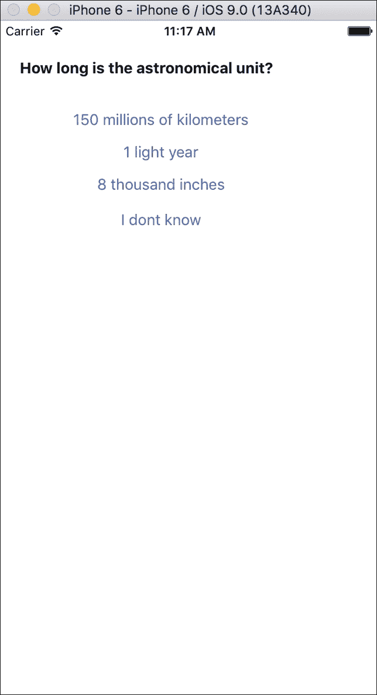
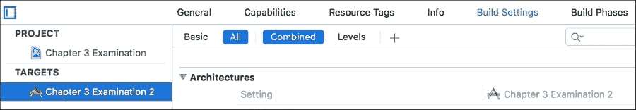
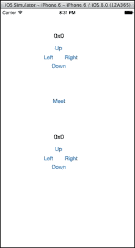
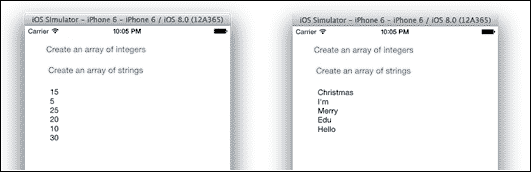
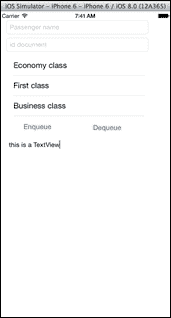

# 第三章. 使用结构体和泛型

在这一章中，我们将涵盖以下主题：

+   创建考试应用

+   检查正确答案

+   避免复制结构体

+   创建泛型数组初始化器

+   创建优先级列表

+   为优先级队列创建协议

# 简介

我们可以说结构体类似于类。它们存储具有属性的值，并且有初始化器和方法。但它们的用法略有不同。Swift 中结构体的想法来自 Objective-C，而 Objective-C 本身正在使用 C 结构体。

我们还将使用泛型，因此我们可以创建泛型容器。泛型的想法并不新鲜；像 C++和 Java 这样的其他语言已经有了它。然而，这个特性在 Objective-C 中并不存在，因此程序员负责转换检索到的数据，因此代码是不安全的。

# 创建考试应用

在这个菜谱中，我们将创建一个考试应用。对于这个考试，我们将选择一些随机问题，用户将回答它们。最后，应用将显示用户得分并重新开始新的考试。

## 准备工作

首先，打开 Xcode，创建一个名为`Chapter 3 Examination`的项目，然后创建一个名为`question.swift`的文件。这是我们定义考试问题的位置。

## 如何操作…

要创建一个考试应用，请按照以下步骤操作：

1.  打开故事板，并向视图控制器添加一个标签和三个按钮。您将得到以下截图类似的内容：

1.  将以下代码复制到`question.swift`文件中：

    ```swift
    struct Question {
        var question:String
        var answer1:String
        var answer2:String
        var answer3:String
        var rightAnswer:Int
        var userAnswer:Int?

        init(question:String, answer1:String, answer2:String, answer3:String, rightAnswer:Int){
           self.question = question
            self.answer1 = answer1
            self.answer2 = answer2
            self.answer3 = answer3
            self.rightAnswer = rightAnswer
        }
    }
    ```

1.  好的，现在我们可以创建我们的问题数组。这将像是一个模板，因为它还不是考试；它将是一个包含每个问题的容器。所以，前往我们唯一的视图控制器，并添加以下属性：

    ```swift
    private var examTemplate = [Question]()
    ```

1.  下一步是将问题填充到这个数组中；正如您可能想象的那样，在这个菜谱中，我们不会添加很多问题，但一个真实的应用程序可以有很多。在这种情况下，我们需要按类别将其分成不同的方法，如下所示：

    ```swift
    private func addGeneralKnowledgeQuestions(){
      examTemplate += [
        Question(question: "In which year was Packt Pub founded?",
          answer1: "2001", answer2: "2004", answer3: "1978", rightAnswer: 2),
        Question(question: "What is the capital of Luxembourg?",
          answer1: "Luxembourg City", answer2: "Diekirch", answer3: "Viena", rightAnswer: 1)
            ]
    }

    private func addComputersQuestions(){
        examTemplate += [
            Question(question: "In which year did Bob Bemer, the creator of the 'escape key', die?",
              answer1: "2004", answer2: "1980", answer3: "He is still alive", rightAnswer: 1),
            Question(question: "How much RAM did Macintosh 128Kb have?",
              answer1: "1 Gb", answer2: "1 byte", answer3: "128K", rightAnswer: 3)
            ]
    }

    private func addAstronomyQuestions(){
        examTemplate += [
            Question(question: "What is the name of the solar system star?",
              answer1: "Antonio Banderas", answer2: "Europe", answer3: "Sun", rightAnswer: 3),
            Question(question: "How long is the astronomical unit?",
              answer1: "150 millions of kilometers", answer2: "1 light year", answer3: "8 thousand inches", rightAnswer: 1)
            ]
    }
    ```

1.  好的！现在，我们可以初始化我们的考试了，所以让我们创建一个方法来完成它。我们还需要一个属性来包含当前考试，另一个属性知道当前问题：

    ```swift
        private lazy var exam:[Question] = []
        private lazy var currentQuestion = 0
        private func createExam(){
            func containsQuestion(question:String) -> Bool{
                for i in exam{
                    if question == i.question{
                        return true
                    }
                }
                return false
            }
            exam = []
            currentQuestion = 0
            while exam.count < 3 {
                var question = examTemplate[ Int(arc4random_uniform(UInt32(examTemplate.count)))]
                if !containsQuestion(question.question) {
                    exam.append(question)
                }
            }
        }
    ```

1.  好吧，是时候开始了！我们只需要显示问题及其可能的答案，就像这里显示的方法一样：

    ```swift
    @IBOutlet var labelQuestion: UILabel!
        @IBOutlet weak var buttonAnswer1: UIButton!
        @IBOutlet weak var buttonAnswer2: UIButton!
        @IBOutlet weak var buttonAnswer3: UIButton!
        @IBOutlet weak var buttonAnswerIdontKnow: UIButton!

        private func showCurrentQuestion(){
            if currentQuestion < exam.count {
                labelQuestion.text = exam[currentQuestion].question
                buttonAnswer1.setTitle(exam [currentQuestion].answer1, forState: .Normal)
                buttonAnswer2.setTitle(exam[currentQuestion].answer2, forState: .Normal)
                buttonAnswer3.setTitle(exam[currentQuestion].answer3, forState: .Normal)
                buttonAnswerIdontKnow.setTitle("I don't know", forState: .Normal)
            }else {
              var total = 0
              for i in exam {
                total += i.rightAnswer == i.userAnswer? ? 1 : 0
              }

              let alert = UIAlertController(title: "Score", message: "Your score is \(total)", preferredStyle:.Alert)
              let startAgainAction = UIAlertAction(title:"Start Again", style.Default) { (action) -> void in 
                createExam()
                showCurrentQuestion()
      }
      alert.addAction(startAgainAction)
        self.presentViewController(alert, animated: true, completion: nil)
            }
        }
    ```

1.  现在，我们只需要为按钮添加以下操作：

    ```swift
        @IBAction func answer(sender: UIButton) {
            switch sender {
            case buttonAnswer1:
                exam[currentQuestion].userAnswer = 1
            case buttonAnswer2:
                exam[currentQuestion].userAnswer = 2
            case buttonAnswer3:
                exam[currentQuestion].userAnswer = 3
            default:
                print("I don't know")

            }
            currentQuestion++
            showCurrentQuestion()
        }
    ```

1.  如果您点击“现在播放”，您会发现应用仍然不起作用；我们必须初始化它，所以让我们通过填充`viewDidLoad`方法来完成这个应用程序，如下所示：

    ```swift
         override func viewDidLoad() {
            super.viewDidLoad()
            addGeneralKnowledgeQuestions()
            addComputersQuestions()
            addAstronomyQuestions()
            createExam()
            showCurrentQuestion()
        }
    ```

## 它是如何工作的…

类和结构体之间的主要区别是结构体在每次赋值时都会被复制。这意味着什么？这意味着在这种情况下，如果我们用类创建了程序，考试属性和考试模板将指向相同的对象（问题）。

考虑到这个问题，你可以看到如果我们再次开始时使用类，新的考试将带有前一个用户的答案。还有更多；如果你想要存储带有答案的考试，你必须克隆对象；否则，每个人都会有相同的答案。使用结构体，你不必担心这个问题；每次你创建一个新的考试，你都会有新的对象。

我想评论的另一个有趣的部分是`createExam`函数。正如你所看到的，我们在这个函数内部还有一个函数。Swift 允许你拥有辅助函数。这在我们需要将代码分成小任务时非常有用。

在同一个函数（`createExam`）中，你可以看到我们有一个创建随机数的巨大调用。这个奇怪调用的原因是因为 Swift 还没有随机数的函数。实际上，Objective-C 也没有随机函数；我们必须使用 C 函数`arc4random_uniform`。

这个函数接收一个 32 位无符号整数作为参数，但 Swift 不能将其整数转换为这种类型。所以，我们使用了`UInt32`来转换这个数字。因为这个函数也返回一个无符号整数，所以有必要将其结果转换为 Swift 整数。

## 还有更多...

还有更多函数可以检索随机数，如`rand`、`random`和`arc4random`。查看命令行手册并检查它们的区别。

# 检查正确答案

这个菜谱将通过检查用户的答案并验证其正确性来完成前一个菜谱。如果由于任何原因答案接收到的值超出范围，这将设置为`nil`。当然，在这个应用程序中，不可能用错误的值回答，但请记住，一个好的开发者总是思考软件可能的演变。

## 准备中

复制前一个菜谱；如果你愿意，可以通过简单地重命名目标名称来将产品重命名为`Chapter 3 Examination 2`，如下所示：



## 如何做到这一点...

按以下步骤检查答案：

1.  前往`question.swift`文件。现在，用以下代码替换当前的类：

    ```swift
    struct Question {
        var question:String
        var answer1:String
        var answer2:String
        var answer3:String
        var rightAnswer:Int
        var userAnswer:Int? {
            willSet(newAnswer){
                if newAnswer < 2 || newAnswer > 3 {
                    userAnswer = nil
                     print("Wrong value, fixing it")
                }
            }
            didSet(oldValue){
                valid = userAnswer != nil && userAnswer != rightAnswer
            }
        }
        var valid = false

        init(question:String, answer1:String, answer2:String, answer3:String, rightAnswer:Int){
           self.question = question
           self.answer1 = answer1
           self.answer2 = answer2
           self.answer3 = answer3
           self.rightAnswer = rightAnswer
        }
    }
    ```

1.  现在，回到视图控制器，用以下代码替换`showCurrentQuestion`方法：

    ```swift
        private func showCurrentQuestion(){
            if currentQuestion < exam.count {
                labelQuestion.text = exam[currentQuestion].question
                buttonAnswer1.setTitle(exam[currentQuestion].answer1, forState: .Normal)
                buttonAnswer2.setTitle(exam[currentQuestion].answer2, forState: .Normal)
                buttonAnswer3.setTitle(exam[currentQuestion].answer3, forState: .Normal)
                buttonAnswerIdontKnow.setTitle("I don't know", forState: .Normal)
            }else {
                var total = 0
                for i in exam {
                    total += i.valid ? 1 : 0
                }
      let alert = UIAlertController(title: "Score", message: "Your score is \(total)", preferredStyle:.Alert) self.presentViewController(alert, animated: true, completion: nil)
            }
        }
    ```

1.  这个菜谱可以到此为止。然而，因为我们想检查这个，超出范围的值将被更正为`nil`；我们可以用这里的这个替换`answer`方法：

    ```swift
        @IBAction func answer(sender: UIButton) {
            switch sender {
            case buttonAnswer1:
                exam[currentQuestion].userAnswer = 1
            case buttonAnswer2:
                exam[currentQuestion].userAnswer = 2
            case buttonAnswer3:
                exam[currentQuestion].userAnswer = 3
            default:
                exam[currentQuestion].userAnswer = 0
            }
            currentQuestion++
            showCurrentQuestion()
        }
    ```

## 它是如何工作的...

Swift 有一个很好的属性特性，称为`property observer`。这个特性等同于关系数据库中的触发器。使用`willSet`，你可以纠正输入，使用`didSet`，你可以在值改变后触发所需的操作。

我们还改变了检查有效答案的方式；这样做是因为问题的逻辑应该在其类或结构内部。

## 还有更多...

如你所见，这个菜谱与第二章中的*用户问答*菜谱相关，*标准库和集合*。如果你想创建一个更完整的例子，你可以将两个应用程序合并为一个。

# 避免复制结构体

有时候我们在处理结构体时，并不想复制它们。在这个菜谱中，我们将通过创建一个小应用程序来展示这个例子和解决方案，用户可以在其中看到两个假设角色的坐标，我们可以按一个按钮来改变它们的坐标到一个中心点。

## 准备工作

创建一个名为`Chapter3 Vector2D`的新单视图项目。对于这个菜谱，我们只需要一个新文件，我们将称之为`Position.swift`。

## 如何做…

让我们创建一个防止复制结构体的应用程序：

1.  让我们像往常一样从模型部分开始。点击`Position.swift`文件。让我们创建一个具有相同名称的结构体，如下所示：

    ```swift
    struct Position:CustomStringConvertable {
        private var x:Int,y:Int
        init(){
            (x,y) = (0,0)
        }
        mutating func moveUp(){
            self.y--
        }
        mutating func moveDown(){
            self.y++
        }
        mutating func moveRight(){
            self.x++
        }
        mutating func moveLeft(){
            self.x--
        }
        mutating func meet(inout position:Position){
            let newx = (self.x + position.x) / 2
            var newy = (self.y + position.y) / 2
            self.x = newx
            self.y = newy
            position.x = newx
            position.y = newy
        }
        var description:String {
            return "\(self.x)x\(self.y)"
        }
    }
    ```

1.  现在，转到故事板，并向其中添加九个按钮和两个标签，类似于以下截图：

1.  现在，让我们将我们的标签与以下属性链接：

    ```swift
        @IBOutlet var labelC1: UILabel!
        @IBOutlet var labelC2: UILabel!
    ```

1.  然后，我们将创建两个表示角色坐标的属性。当然，在一个真正的游戏中，这些属性将属于另一种类型的对象，可能是类似角色的东西：

    ```swift
        var character1 = Position()
        var character2 = Position()
    ```

1.  如你所见，这些对象将从 0 x 0 位置开始，但如果我们没有使用`viewDidLoad`方法初始化它，标签将不知道这一点。所以，让我们向视图控制器添加以下代码：

    ```swift
        override func viewDidLoad() {
            super.viewDidLoad()
            displayPositionC1()
            displayPositionC2()
        }

        private func displayPositionC1(){
            labelC1.text = character1.description
        }

        private func displayPositionC2(){
            labelC2.text = character2.description
        }
    ```

1.  现在，我们可以添加移动角色的事件。正如你所想象的那样，它们非常直接，因为每个动作都将代理到结构体上的等效方法。以下是这段代码：

    ```swift
        @IBAction func upC1(sender: UIButton) {
            character1.moveUp()
            displayPositionC1()
        }

        @IBAction func downC1(sender: UIButton) {
            character1.moveDown()
            displayPositionC1()
        }
        @IBAction func leftC1(sender: UIButton) {
            character1.moveLeft()
            displayPositionC1()
        }

        @IBAction func rightC1(sender: UIButton) {
            character1.moveRight()
            displayPositionC1()
        }

        @IBAction func meet(sender: UIButton) {
            character1.meet(&character2)
            displayPositionC1()
            displayPositionC2()
        }
    ```

1.  现在，应用已经完成。点击播放并使用按钮移动角色。最重要的是没有复制或克隆任何结构体。

## 它是如何工作的…

如你所见，我们不得不在我们的结构体方法上添加一个修饰符。这是因为结构体方法默认是常量。如果你需要更改一个属性，你必须使用`mutating`修饰符。

当接收到你不想复制的参数时，例如结构体，你必须使用`inout`参数。这个参数将允许你修改相应的参数。然而，当使用这个功能时，你必须调用函数，在变量前加上一个连字符（`&`），并且不能将表达式作为参数传递。

# 创建一个泛型数组初始化器

在这个菜谱中，我们将学习如何使用泛型。这个特性在 C++、Java 和 C#等语言中使用得很多，因为这样我们就不需要为函数中可能使用的每种类型重载一个函数。

在这种情况下，我们将创建一个函数，它接收输入项并返回一个包含这些元素的数组，但完全打乱顺序。

## 准备工作

创建一个名为 `Chapter3 Array initializer` 的新 Swift 单视图项目。

## 如何操作…

要创建一个泛型数组初始化器，请按照以下步骤操作：

1.  添加一个名为 `ArrayInit` 的新文件，并将以下代码添加到其中：

    ```swift
    func arrayInit<T>(values:T...)->[T]{
        var newArray = values
        for var i=0;i < newArray.count * 2 ; ++i {
                    let pos1 = Int(arc4random_uniform(UInt32(newArray.count)))
            let pos2 = Int(arc4random_uniform(UInt32(newArray.count)))
            (newArray[pos1], newArray[pos2]) = (newArray[pos2], newArray[pos1])
        }
        return newArray
    }
    ```

1.  现在，我们需要在我们的故事板中添加两个按钮和一个文本视图来查看这个函数的工作情况。所以，让我们将文本视图链接到以下属性：

    ```swift
    @IBOutlet weak var textView: UITextView!
    ```

1.  下一步是创建每个按钮的事件，所以将这些操作添加到你的视图控制器中：

    ```swift
        @IBAction func arrayInt(sender: AnyObject) {
            let arr = arrayInit(5, 10, 15, 20, 25, 30)
              textView.text = arr.map({ (element) -> String in
                 return String(element)
            }).joinWithSeparator("\n")
    }

        @IBAction func arrayString(sender: AnyObject) {
            let arr = arrayInit("Hello", "I'm", "Edu","Merry", "Christmas")
            textView.text = arr.joinWithSeparator("\n")
        }
    ```

1.  现在，是时候测试我们的代码了。运行你的应用程序并按每个按钮，你应该得到以下截图所示的结果：

## 它是如何工作的…

面向对象编程的一个优点是避免代码重复。一些语言会强制你为字符串数组创建一个函数，为整数数组创建另一个函数，以及为每个我们需要与这个函数一起使用的新类型创建另一个新函数。

幸运的是，Swift 允许我们创建泛型函数。这意味着我们只需要实现一次函数，每次都会应用相同的代码。

### 注意

在函数内部，参数被视为一个常量数组，但用数组作为参数调用函数有另一个含义；编译器会认为你只有一个参数，它是一个数组。

这个函数有一些不同之处：在输入参数之后使用的省略号。这意味着该函数不受参数数量的限制；它具有可变数量的参数。在我们的例子中，我们可以用六个整数和五个字符串来调用它。这个特性非常有用，例如，在创建计算一些数字平均值的函数时。

## 还有更多…

允许泛型函数重载；当存在某种类型，由于任何原因需要不同的代码时，就会使用它。例如，现在你可以使用这段代码来洗牌。

# 创建优先列表

让我们想象一下，我们需要管理航班上的乘客队列。我们知道商务舱应该首先登机，然后是头等舱乘客，最后是经济舱乘客。

这是一个典型的优先队列案例，但一个令人烦恼的问题是，我们是否只能创建一个优先队列？或者我们应该在每一个新应用中创建一个新的优先队列？一个最近加入 Swift 的 Objective-C 程序员可能会创建一个存储 `AnyObject` 类型对象的容器。这个解决方案可能是可以接受的；然而，Swift 有一个更好的解决方案，甚至更安全，正如你所知，那就是泛型。

优先队列需要使用标准来组织其元素。在这种情况下，我们可以创建任何元素的队列，但确保它是为实现了 `Comparable` 协议的类的元素创建的；这就是我们所说的类型约束。

## 准备工作

创建一个名为 `Chapter3 Flight` 的新 Swift 单视图项目。

## 如何操作…

按照以下步骤创建优先列表：

1.  添加一个名为 `PriorityQueue.swift` 的新 Swift 文件。

1.  在这个文件中，让我们创建一个具有相同名称的类。在这里，我们需要一个数组作为属性来存储我们的元素，以及一些与队列一起工作的方法：`enqueue` 用于添加新元素；`dequeue` 用于从队列中移除第一个元素；`size` 返回队列上的元素数量；以及 `toArray`，它将队列的元素返回到一个数组中。所以，将以下代码添加到你的文件中：

    ```swift
    class PriorityQueue<T:Comparable> {

        private var elements = [T]()
        func enqueue(element:T) {
            elements.append(element)
            var index=elements.count-2
            while index>=0 && elements[index] < elements[index+1] {
                (elements[index],elements[index+1]) = (elements[index+1],elements[index])
                index--
            }
        }

        func dequeue() -> T {
            return elements.removeAtIndex(0)
        }

        var size: Int {
            return elements.count
        }

        func toArray() ->[T]{
            return elements
        }

    }
    ```

1.  现在创建一个名为 `Passenger.swift` 的新文件。在这里，我们将定义一个带有其数据的乘客。记住，我们需要比较乘客的优先级。因此，这个类必须实现 `Comparable` 协议：

    ```swift
    class Passenger:Comparable, CustomStringConvertable {
        enum Class:Int {
            case ECONOMY=0, FIRST=1, BUSINESS=2

            var value:Int{
                return self.rawValue
            }
        }
        var classtype:Class
        var name:String
        var id:String

        init (name:String, id:String, classtype:Class = .ECONOMY){
            self.name = name
            self.id = id
            self.classtype = classtype
        }

        var description:String{
            var seattype:String
                switch self.classtype{
                case .ECONOMY:
                    seattype = "economy"
                case .FIRST:
                    seattype = "first"
                case .BUSINESS:
                    seattype = "business"
                default:
                    seattype = "unkown"
                }

            return "\(self.name), with id \(self.id) on \(seattype) class"
        }
    }

    // Operators
    func <(lhs: Passenger, rhs: Passenger) -> Bool{
        return lhs.classtype.value < rhs.classtype.value
    }

    func ==(lhs: Passenger, rhs: Passenger) -> Bool{
        return lhs.classtype == rhs.classtype
    }

    func !=(lhs: Passenger, rhs: Passenger) -> Bool{
        return lhs.classtype != rhs.classtype
    }

    func <=(lhs: Passenger, rhs: Passenger) -> Bool{
        return lhs < rhs || lhs == rhs
    }

    func >=(lhs: Passenger, rhs: Passenger) -> Bool{
        return !(lhs < rhs)
    }

    func >(lhs: Passenger, rhs: Passenger) -> Bool{
        return lhs != rhs && !(lhs < rhs )
    }
    ```

1.  现在打开你的故事板，添加两个文本字段（一个用于乘客姓名，另一个用于他的身份证号和身份证件），一个用于选择座位类型的表格视图，两个用于入队和出队的按钮，以及一个用于显示当前队列状态的文本字段。你应该有一个类似于以下布局：

1.  下一步是打开视图控制器并添加协议 `UITableViewDataSource`：

    ```swift
    class ViewController: UIViewController, UITableViewDataSource {
    ```

1.  好的，现在将相应的组件与属性链接，并且在此旁边，创建一个乘客队列作为属性：

    ```swift
        @IBOutlet weak var passengerName: UITextField!
        @IBOutlet weak var idDocument: UITextField!
        @IBOutlet weak var seatType: UITableView!
        @IBOutlet weak var textView: UITextView!

        private var passengersQueue = PriorityQueue<Passenger>()
    ```

1.  在这个时刻，我们可以开始实现 `tableview` 代码。正如你所知，我们必须实现 `UITableViewDataSource` 至少两个强制方法。让我们从最简单的开始，即返回行数的方法。目前，我们还没有办法检测枚举元素的数量，所以我们将硬编码这个值：

    ```swift
    func tableView(tableView: UITableView, numberOfRowsInSection section: Int) -> Int{
        return 3
    }
    ```

1.  下一步是创建返回座位类型单元格的方法：

    ```swift
        func tableView(tableView: UITableView, cellForRowAtIndexPath indexPath: NSIndexPath) -> UITableViewCell{
            var cell:UITableViewCell
            if let auxCell = tableView.dequeueReusableCellWithIdentifier("cell") {
                cell = auxCell
            }else{
                cell = UITableViewCell()
            }
            switch indexPath.row {
            case 0:
                cell.textLabel!.text = "Economy class"
            case 1:
                cell.textLabel!.text = "First class"
            case 2:
                cell.textLabel!.text = "Business class"
            default:
                break;
            }

            return cell
        }
    ```

1.  如果你现在点击播放，你应该至少能看到带有其值的表格视图。现在，我们需要创建一个方法来显示当前队列乘客：

    ```swift
        private func displayQueue () {
                textView.text = (self.passengersQueue.toArray().map{
                (var p)-> String in
                return p.description
                }).joinWithSeperator("\n")
        }
    ```

1.  现在，我们只需要为我们的按钮创建动作：

    ```swift
        @IBAction func enqueue(sender: AnyObject) {
          if let indexPath = seatType.indexPathForSelectedRow {
             var passenger = Passenger(name: passengerName.text, id: idDocument.text, classtype: Passenger.Class(rawValue: indexPath.row)!)
                passengersQueue.enqueue(passenger)
                self.displayQueue()
            }else {
              let alert = UIAlertController(title: "Error", message: "You must select the seat type", preferredStyle:.Alert)
                self.presentViewController(alert, animated: true, completion: nil)

            }
        }

        @IBAction func dequeue(sender: AnyObject) {
            passengersQueue.dequeue()
            displayQueue()
        }
    ```

应用程序已经完成。现在，尝试添加不同的乘客并检查你的队列如何增长。

## 它是如何工作的…

泛型可以帮我们避免重写大量代码，但是因为它需要安全，你不能使用可能在你正在操作的类型上不存在的操作符或方法。为了解决这个问题，你可以指定一个约束，告诉编译器哪些方法可以与这个类型一起使用。在我们的例子中，我们指定了 T 是可比较的；因此我们可以使用比较器的操作符在我们的代码中。

从这段代码中我们可以获取的一些新知识是嵌套枚举。Swift 没有命名空间或包，但你可以创建嵌套枚举、类和结构体。这样我们可以避免名称冲突。

另一个新特性是类型化枚举；正如你所见，我们指定了每个枚举值都与一个整数相关联。你可以使用 `rawValue` 获取这个值，或者使用 `init(rawValue:)` 来执行逆过程。

### 注意

Swift 的第一个版本曾经有一个名为 `toRaw()` 的方法，而不是 `rawValue` 属性，以及 `fromRaw()` 而不是使用初始化器 `init(rawValue:)`。

你也可以像我们在这个枚举中做的那样实现你自己的函数或计算属性；有时，这比使用原始值更好。

### 小贴士

创建你的函数或计算属性以转换枚举是软件维护的良好实践。

## 还有更多…

解决这个问题不止一种方法；如果你需要性能，你可能使用双链表。

如果你想要，你可以使用 `where` 子句指定多个约束。例如，如果你想存储也是 `CustomStringConvertable` 的元素，你可以将类头更改为 `class PriorityQueue<T:Comparable where T: CustomStringConvertable > {`。

# 为优先队列创建一个协议

在之前的菜谱中，我们创建了一般化的代码，可以在未来的程序中使用，但我们必须记住，优先队列只是队列的一种类型。定义这个抽象数据类型的接口是一种良好的做法，然后，有不同的实现。

如你所知，在 Swift 中，我们有像这种情况的协议；然而，我们有一个问题：协议没有泛型。解决方案是什么？答案是 **关联类型**。

## 准备工作

复制之前菜谱的项目，并将其命名为 `Chapter 3 Flight Protocol`，然后创建一个名为 `Queue.swift` 的新文件。

## 如何做到这一点...

要为优先队列创建一个协议，请遵循以下步骤：

1.  将以下代码添加到 `Queue.swift` 文件中：

    ```swift
    protocol Queue {
        typealias ElementType
        func enqueue(element:ElementType)
        func dequeue() -> ElementType
        var size: Int{
            get
        }
    }
    ```

1.  现在，返回到优先队列并更改其头为以下这个：

    ```swift
    class PriorityQueue<T:Comparable>:Queue
    ```

1.  点击播放，当然，结果在视觉上是相同的，但你的代码现在更具可重用性。尝试删除一个方法，比如 `enqueue`，你就会看到编译器会抱怨缺少协议的方法。

## 它是如何工作的...

不幸的是，我们无法使用泛型创建协议，但我们可以通过关联类型解决这个问题。你只需要在协议内部创建 `typealias` 而不指定其实际类型，然后，我们可以使用此类型声明协议的方法。当你从这个协议继承时，你的类型可以是任何东西，甚至是泛型类型 `T`。

### 小贴士

当你有像队列、列表或栈这样的概念时，尽量使用协议。然后，你可以有不同的实现，并使用最适合当前场合的最佳实现。

## 还有更多…

现在你已经学会了如何使用泛型制作可重用代码，你将在下一章中进一步提高，我们将使用 Swift 中的设计模式。
