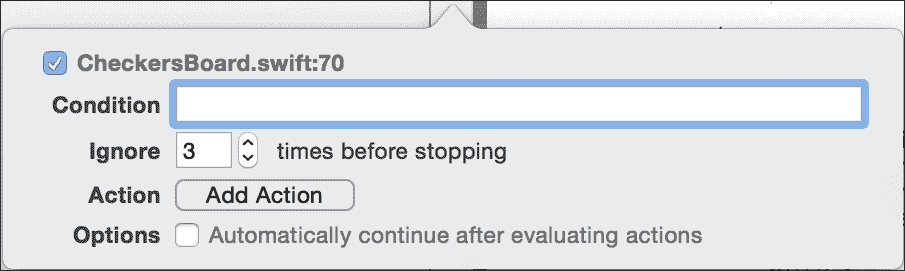

# 第七章. 使用 Xcode 进行 Swift 调试

在本章中，我们将介绍以下食谱：

+   验证值 - 开发税收收入模拟应用程序

+   使用 Xcode 和 Swift 进行调试 - 最佳检查运动

+   使用 LLDB 进行调试

+   应用程序分析

+   Swift 2.0 中的错误处理

+   Swift 2.0 中的自定义错误处理

+   Swift 2.0 中的可用性检查

# 简介

让我们面对现实，没有人会编写一个没有任何问题的完整程序。即使是最好的程序员也会遇到一些未被考虑的情况。有时找到错误很容易，有时却非常困难，主要是因为你有一个多线程应用程序。

在本章中，我们将逐步学习如何调试应用程序，这将使你更容易找出问题所在。

# 验证值 - 开发税收收入模拟应用程序

在编写代码和开发应用程序时，我们知道函数中的一些变量不应该包含某些值，但你确定吗？我们如何开发和检查一切是否具有正确的值？

在这个食谱中，我们将学习如何在开发阶段检查值是否正确。为了模拟这种情况，让我们创建一个应用程序，我们确信会有一些人试图篡改值；在这种情况下，让我们创建一个计算税收收入的程序。

## 准备工作

创建一个名为 `Chapter 7 Tax Income` 的项目，并确保你处于调试模式；要做到这一点，请点击项目方案并选择 **编辑方案…**，如下截图所示：


点击左侧的 **运行** 选项，然后确保选择 **信息** 选项卡，最后确保 **构建** 选项在 **调试** 上。之后我们将有一些解释：


一旦检查了这些步骤，我们需要打开项目设置并创建一个名为 `DEBUG_MODE` 的宏，仅在调试配置中。


## 如何做到这一点...

1.  首先，让我们创建一个名为 `Assertions.swift` 的新文件。在这里，我们将添加一些函数，所有这些函数都以 `assert_` 开头：

    ```swift
    // element must be one of the elements in the set
    func assert_in<T:Comparable>(element: @autoclosure () -> T, set: [T], message: @autoclosure () -> String){
        #if DEBUG_MODE
            if set.count == 0 {
            println("warning: comparing with an empty set")
            }
            assert(set.filter({(currentElement) -> Bool in
            return currentElement == element()
            }).count > 0, message)
        #endif
    }

    // element must be greater or equal to the other value
    func assert_ge<T:Comparable>(value:T, otherValue:T, message: @autoclosure () -> String){
        #if DEBUG_MODE
            assert(value >= otherValue , message)
        #endif
    }

    // element can't be nil
    func assert_not_nil<T>(element:@autoclosure () -> T?, message: @autoclosure () -> String){
        if element() == nil {
            #if DEBUG_MODE
                assertionFailure(message)
            #endif
        }
    }
    ```

1.  现在我们可以创建另一个文件，该文件将包含一个能够计算所得税的类。创建一个名为 `IncomeTaxCalculator.swift` 的新文件；以下是一个类头：

    ```swift
    class IncomeTaxCalculator: CustomStringConvertable {
    ```

1.  下一步是添加其属性；正如你可以想象的，我们必须为它存储一些值：

    ```swift
        var title:String?
        var name:String?
        lazy var grossIncome:Double = 0.0
        lazy var netIncome:Double = 0.0
        lazy var children:Int = 0
        lazy var education:Double = 0.0
    ```

1.  如你所见，所有这些都是在初始化或作为选项；在这种情况下，你不需要创建初始化器，除非你正在使用 Swift 的早期版本之一：

    ```swift
    init(){}
    ```

1.  如果你注意到了，这个类必须实现 `Printable` 协议。因此，我们需要向这个类添加描述：

    ```swift
        var description: String {
            assert_not_nil(self.title, "Title cant be nil")
            assert_not_nil(self.name, "Name cant be nil")
            assert_in(self.title!, ["Mr", "Dr", "Miss", "Mrs"], "Wrong title")
            return "\(self.title!) \(self.name!) - \(self.calculate())"
        } 
    ```

1.  为了完成这个类，我们需要一个方法来根据之前的属性计算所得税。当然，这是一个虚构的情况；不要使用这个应用程序来计算你的所得税：

    ```swift
        func calculate() -> Double {
            assert_ge(self.grossIncome, 0.0, "Gross income can't be negative")
            assert_ge(self.netIncome, 0.0, "Net income can't be negative")
            assert_ge(self.grossIncome, self.netIncome, "Net income cant be negative")

            let totalAlreadyPaid = self.grossIncome - self.netIncome
            var percentage:Double
            if self.grossIncome <= 9000.0 {
                percentage = 0.0
            } else if self.grossIncome <= 18000.0 {
                percentage = 0.15
            } else {
                percentage = 0.40
            }

            let childrenBonus = Double(self.children) * 100.0

            // 10 percent of education up to 1000 per child
            var educationBonus:Double
            var educationLimit = Double(self.children) * 1000.0
            if 0.1 * self.education < educationLimit {
                educationBonus = 0.1 * self.education
            }else {
                educationBonus = educationLimit
            }

            return self.grossIncome * percentage - childrenBonus - educationBonus - totalAlreadyPaid
        }
    }
    ```

1.  一旦完成，我们必须创建我们应用程序的图形部分，所以转到故事板并创建一个包含六个文本框、一个按钮和六个标签的布局；类似于以下的一个：

1.  如你所想，我们需要创建一些属性来与文本框链接：

    ```swift
        @IBOutlet var titleTextField: UITextField!
        @IBOutlet var nameTextField: UITextField!
        @IBOutlet var lastYearIncomeTextField: UITextField!
        @IBOutlet var numberOfChildrenTextField: UITextField!
        @IBOutlet var LastYearNetIncome: UITextField!
        @IBOutlet var educationTextField: UITextField!
    ```

1.  为了完成我们的图形部分，我们需要为按钮添加一个事件：

    ```swift
        @IBAction func calculateAction(sender: UIButton) {
            assert(countElements(self.nameTextField.text) >= 5, "Your name looks too short")
            var error:NSError?
            let regex = NSRegularExpression(pattern: "^[0-9]+[.[0-9]+]?$", options: .CaseInsensitive, error: &error)!
            if regex.matchesInString(self.lastYearIncomeTextField.text, options: nil, range: NSMakeRange(0, countElements(self.lastYearIncomeTextField.text))).count == 0{
                assertionFailure("Gross Income tax: wrong format")
            }
            let income = (self.lastYearIncomeTextField.text as NSString).doubleValue
            let incomeTaxCalculator:IncomeTaxCalculator = IncomeTaxCalculator()
            incomeTaxCalculator.title = self.titleTextField.text
            incomeTaxCalculator.name = self.nameTextField.text
            incomeTaxCalculator.grossIncome = (self.lastYearIncomeTextField.text as NSString).doubleValue
            incomeTaxCalculator.netIncome = (self.LastYearNetIncome.text as NSString).doubleValue
            incomeTaxCalculator.education = (self.educationTextField.text as NSString).doubleValue
            incomeTaxCalculator.children = self.numberOfChildrenTextField.text.toInt()!
            UIAlertView(title: "Income Tax", message: incomeTaxCalculator.description, delegate:nil, cancelButtonTitle:"Ok").show()
        }
    ```

1.  最后一步是测试我们的应用程序并观察断言的工作情况。按播放键，当应用程序出现时，按计算键，不要在文本框中添加任何信息。你应该看到应用程序停止运行，Xcode 应该显示在哪里：

1.  如果你注意的话，日志控制台会打开并显示发生了什么，打印出你写入的消息：

1.  让我们完成这个配方，将配置从**Debug**更改为**Release**；再次按播放键，你会看到第一个断言被忽略了。

## 它是如何工作的…

断言就像在找到意外值时中断应用程序的函数。当然，当程序发布时，它需要接受这些值，这意味着开发者不应该永远依赖断言的力量，他必须修复值，或者至少中断进程。

Swift 只提供了两个断言函数：

+   `assert`：此函数有两个参数。第一个是一个布尔元素，如果为假，将停止你的程序并显示下一个参数（消息）给开发者。

+   `assertionFailure`：此函数在未检查任何条件的情况下停止程序执行。此函数用于应用程序不应该通过的情况。想象一下，你有一个`switch`语句，理论上你的程序不应该进入默认情况，因为它没有被考虑，在这种情况下你需要添加一个断言。

另一个令人烦恼的问题是：`autoclosure`是什么意思？原因如下——`assert`、`assertionFailure`以及我们的断言函数实际上不接受值作为参数，原因是惰性。这意味着 Swift 在进入函数之前不会评估值。

Swift 将你的参数转换为一个函数，并且当断言函数调用它时，参数将在其中被评估。为什么？原因在于断言不应该在编译配置为 Release 而不是 Debug 时工作。记住，断言会停止你的程序，这在开发时是好事，但对于用户来说却不是好感觉。这就是为什么有时我们在`#ifdef NDEBUG`和`#endif`之间调用 autoclosure 函数的原因。

### 小贴士

在 Xcode 6 beta 5 之前，`@autoclosure`通常写作`@auto_closure`。如果你打算在网上搜索有关此修饰符的信息，尝试两种写法都试一试。

如果断言在发布模式下不起作用，为什么它们还有用？原因在于断言用于检测开发错误，你应该追踪错误的来源并修改它，以确保来源不会给你一个错误值。

我们为我们的断言函数创建了一个不同的文件，原因是你可能在这个文件之间共享项目；当然，你可以为所有事情使用 `assert` 函数，但我建议创建可以为我们节省工作的断言函数，比如我们用来检查元素是否在数组中的那个。

## 还有更多…

在这道菜谱中，我们学习了如何使用 Swift 断言，它是 Objective-C 中的 `NSAssert` 的等价物。如果你更喜欢使用 Objective-C 基础中的其他断言功能，如 `NSParameterAssert` 和 `NSAssertionHandler`，你仍然可以在 Swift 中使用它们。

断言对于找到接收错误值的路径非常有用，然而有时有必要逐步进入代码。我们将在下一道菜谱中看到如何使用 Xcode 和 Swift 来实现。

# 使用 Xcode 和 Swift 进行调试 – 最佳的棋子移动

如果你有一些编程经验，你就会知道有时我们需要一步一步地进入代码，主要是在我们遇到那种没有人知道为什么会发生的问题时。

在这道菜谱中，我们将学习如何使用 Xcode 和 Swift 进行调试。为了做到这一点，我们将回收我们的棋盘。在这种情况下，我们将使用白棋进行最佳移动。我们还将为这个应用程序的第二个版本做好准备，届时我们可以使用国王。

我们一开始不会创建正确的算法，我们的想法是调试并找到问题所在，然后我们将在之后进行修正。

## 准备工作

打开你上一章中的游乐场，其中包含棋盘。保持它打开，因为我们将要重用这段代码。一旦打开，创建一个名为 `第七章棋盘` 的新项目，然后开始编码。

## 如何操作…

1.  创建一个名为 `CheckersBoard.swift` 的新文件，如果尚未导入，请先导入 `UIKit` 库：

    ```swift
    import UIKit
    ```

1.  之后，你可以将游乐场中的类代码粘贴过来。然后，复制游乐场中的最后一部分（变量实例化和设置），并将其粘贴到视图控制器文件中的 `viewDidLoad` 方法上：

    ```swift
        override func viewDidLoad() {
            super.viewDidLoad()
            var board = CheckersBoard()
            board.board[2][5] = .WHITE
            board.board[2][3] = .BLACK
            board.board[4][3] = .WHITE
            board.board[2][1] = .BLACK
            board.board[0][5] = .WHITE
            board.board[1][0] = .BLACK
            board.board[7][6] = .WHITE
            board.board[5][6] = .BLACK
        }
    ```

1.  现在我们来在第三次分配棋子时设置一个断点，通过点击代码左侧的灰色区域：

1.  按下播放，等待 Xcode 在你的断点处停止，并将鼠标指针移到棋盘变量上。它可以是任何一个，比如第一个，变量正在被声明，或者其他的，我们在那里分配棋子。

1.  在短暂的间隔后，你将看到一个带有两个图标的小对话框。第一个图标是一个带有圆圈的**i**，它以类似于 JSON 格式的文本格式显示对象的内容：

    另一个图标对我们来说非常熟悉，因为它和我们在游乐场看到的图标一样，它是快速查看图标，我们也可以在这里使用它。这样我们就可以以更直观的方式查看跳棋棋盘：

    

    ### 小贴士

    不要为每个类创建`debugQuickLookObject`方法，只为那些难以可视化且需要频繁调试的类创建。

1.  现在我们知道了如何可视化我们的对象，我们需要区分传统棋子和国王。我们的下一个目标是向`BoardSpace`枚举添加一个布尔值。用以下枚举替换之前的枚举：

    ```swift
        enum BoardSpace {
            case FREE,
            WHITE(Bool),
            BLACK(Bool)
        }
    ```

1.  现在我们需要显示不同的内容，在这种情况下，我们将在棋子上添加字母`K`。将`debugQuickLookObject`中的`switch`语句替换为以下内容：

    ```swift
                    var isKing = false;

                    switch board[row][col] {
                    case .WHITE(let king):
                        isKing = king
                        UIColor.whiteColor().setFill()
                    case .BLACK(let king):
                        isKing = king
                        UIColor.brownColor().setFill()
                    default:
                        continue
                    }
    ```

1.  好的，现在在填充棋子之后，我们需要添加一个代码块，以处理当前棋子是国王的情况：

    ```swift
    ...
    bezier.fill()
    if isKing {
       ("K" as NSString).drawAtPoint(CGPointMake(offsetx + CGFloat( squareSize / 3 ) , offsety + CGFloat(squareSize / 5)), withAttributes: nil)
    }
    ```

1.  现在我们需要改变分配棋子的方式，如下所示：

    ```swift
            let board = CheckersBoard()
            board.board[2][5] = .WHITE(false)
            board.board[2][3] = .BLACK(false)
            board.board[4][3] = .WHITE(true)
            board.board[2][1] = .BLACK(false)
            board.board[0][5] = .WHITE(false)
            board.board[1][0] = .BLACK(false)
            board.board[7][6] = .WHITE(false)
            board.board[5][6] = .BLACK(false)
    ```

1.  通过按下播放并使用快速查看观察棋盘来重复此操作；现在你可以按步骤覆盖按钮，只需按下**F6**键。

    ### 注意

    新款苹果键盘为**F6**键分配了功能，所以你可能需要同时按下这个键和**fn**键。

1.  现在检查快速查看，看看你的一枚棋子上是否有字母`K`：

1.  好的，现在我们知道了如何可视化棋盘，我们将看看是否可以用一回合赢得游戏。要做到这一点，我们需要选择一个棋子并查看我们所有的可能性。这意味着我们需要频繁地克隆我们的对象。通常我们会为它创建一个结构体，但在这个情况下，我们将为克隆我们的对象创建一个方法。我们稍后会给出解释；只需将此代码添加到你的`CheckersBoard`类中：

    ```swift
        func clone() -> CheckersBoard {
            let board = CheckersBoard()
            for i in 0..<8 {
                for j in 0..<8 {
                    switch self.board[i][j] {
                    case .FREE:
                        continue
                    default:
                        board.board[i][j] = self.board[i][j]
                    }
                }
            }
            return board
        }
    ```

1.  接下来的步骤是担心如何捕获对手的棋子，要做到这一点，我们需要测试哪些方向是可能的。让我们在我们的`CheckersBoard`类中创建一个枚举来帮助我们：

    ```swift
        enum Direction {
            case NORTHWEST,
            NORTHEAST,
            SOUTHWEST,
            SOUTHEAST
        }
    ```

1.  现在我们需要创建一个方法来找到最佳移动；记住我们只使用白棋：

    ```swift
        func bestMovementWhite() -> CheckersBoard?{
            var boardCandidate:CheckersBoard?
            for i in 0..<8 {
                for j in 1..<8 {
                    var result: CheckersBoard?
                    switch self.board[i][j]{

                    case .WHITE(let king):
                        if king {
                            result = bestMovementKingWhite(i, y: j)
                        }else {
                          result = bestMovementSinglePieceWhite(i, y: j)
                        }
                    default:
                        continue
                    }

                    if let boardFound = result {
                        if let currentBoard = boardCandidate {
                            if currentBoard.countBlack() > boardFound.countBlack() {
                                boardCandidate = boardFound
                            }
                        }else {
                            boardCandidate = boardFound
                        }
                    }
                }
            }
            return boardCandidate
        }
    ```

1.  如你所见，我们有两个私有方法，一个用于普通棋子的最佳移动，另一个用于国王。在这里，我们将开发单个棋子的功能，其他的方法我将留作你的作业；否则，这将是一个非常庞大的食谱：

    ```swift
        private func bestMovementSinglePieceWhite(x:Int, y:Int) -> CheckersBoard {
            var clonedBoard = self.clone()
            if clonedBoard.capture(x, y: y, direction: .NORTHWEST) {
               return clonedBoard.bestMovementSinglePieceWhite(-1, y: -1)
            }

            if clonedBoard.capture(x, y: y, direction: .NORTHEAST) {
                return clonedBoard.bestMovementSinglePieceWhite(1, y: -1)
            }

            if clonedBoard.capture(x, y: y, direction: .SOUTHWEST) {
                return clonedBoard.bestMovementSinglePieceWhite(-1, y: 1)
            }

            if clonedBoard.capture(x, y: y, direction: .SOUTHEAST) {
                return clonedBoard.bestMovementSinglePieceWhite(1, y: 1)
            }
            return clonedBoard
        }

        private func bestMovementKingWhite(x:Int, y:Int) -> CheckersBoard? {
            // TODO Homework
            return nil
        }
    ```

1.  要完成这个课程，我们需要添加更多方法，一个用于计算黑棋的数量，另一个用于捕获对手的棋子：

    ```swift
        func countBlack() -> Int{
            var total = 0
            for row in self.board {
                for element in row {
                    switch element {
                    case .BLACK:
                        total++
                    default:
                        continue
                    }
                }
            }
            return total
        }
        private func capture(x: Int, y:Int, direction: Direction) -> Bool {
            var offset_x:Int
            var offset_y:Int
            switch(direction){
            case .NORTHWEST:
                offset_x = -1
                offset_y = -1
            case .NORTHEAST:
                offset_x = 1
                offset_y = -1
            case .SOUTHWEST:
                offset_x = -1
                offset_y = 1
            case .SOUTHEAST:
                offset_x = 1
                offset_y = 1
            }
            if x + 2*offset_x >= 0 && y + 2*offset_y >= 0 && x + 2*offset_x < 8 &&  y + 2*offset_y < 8 {
                // we are inside the board range
                switch (board[x + 2*offset_x][y+2*offset_y], board[x + offset_x][y+offset_y]) {
                    case (.FREE, .BLACK):
                        board[x + offset_x][y+offset_y] = .FREE
                        board[x + 2 * offset_x ][ y + 2 * offset_y] = board[x][y]
                        board[x][y] = .FREE
                    return true
                    default:
                    return false
                }
            }else {
                return false
            }
        }
    ```

    好的，现在想象一下今天是星期一。我们不得不输入这么多代码，有人（可能是你的老板）告诉我们有一个设置找不到最佳解决方案。审查代码的每一行可能非常无聊，而且很难找到问题所在。

1.  让我们从那个不起作用的设置开始调试，所以用这个代码替换设置代码：

    ```swift
            let board = CheckersBoard()
            board.board[0][1] = .WHITE(false)
            board.board[0][5] = .WHITE(false)
            board.board[2][7] = .WHITE(false)
            board.board[3][2] = .WHITE(false)
            board.board[2][1] = .BLACK(false)
            board.board[4][3] = .BLACK(false)
            board.board[4][5] = .BLACK(false)
            board.board[2][5] = .BLACK(false)
            board.board[2][3] = .BLACK(false)
            if let finalBoard = board.bestMovementWhite() {
                println(finalBoard.debugDescription)
            }else {
                println("no solution")
            }
    ```

    你可能首先注意到的是`debugDescription`。这类似于`debugQuickLookObject`，但它不返回不同类型的对象，而只返回文本，我们稍后会完成这个属性。

    如你所知，我们必须调试第四个白棋的移动。要做到这一点，转到名为`bestMovementWhite`的方法，并在调用`bestMovementSinglePieceWhite`方法的行上添加一个断点。右键单击此断点，你会看到一个如下所示的菜单：

    

1.  选择**编辑断点...**，正如你所知，我们不想检查前三个棋子的动作，所以说明你想要忽略**3**次然后停止：

1.  有时候我们知道在经过一定次数后必须停止，尝试使用它而不是多次点击播放。在这个相同的方法末尾（`return boardCandidate`）添加另一个断点并编辑它。现在我们将添加一个条件使其工作，并将动作更改为声音。不幸的是，大多数可用的声音都太弱了，我通常选择玻璃声，但如果你更喜欢，你可以选择另一个。要完成这个断点，选择**在评估动作后自动继续**选项：

1.  现在按播放并等待 Xcode 停止，按步骤进入按钮（指向下的箭头按钮）或按*F7*，你将进入`bestMovementSinglePieceWhite`。现在点击步骤跳过（或按*F6*）三次，用快速查看检查棋盘，看看我们将返回这个棋盘。一旦这个问题被发现，我们可以用这个算法替换我们的算法：

    ```swift
        private func bestMovementSinglePieceWhite(x:Int, y:Int) -> CheckersBoard {
            var clonedBoard = self.clone()
            var winner:CheckersBoard = self

            if clonedBoard.capture(x, y: y, direction: .NORTHWEST) {
                winner = clonedBoard.bestMovementSinglePieceWhite(x-2, y: y-2)
            }

            clonedBoard = self.clone()
            if clonedBoard.capture(x, y: y, direction: .NORTHEAST) {
                clonedBoard = clonedBoard.bestMovementSinglePieceWhite(x+2, y: y-2)
                if winner.countBlack() > clonedBoard.countBlack() {
                    winner = clonedBoard
                }
            }

            clonedBoard = self.clone()
            if clonedBoard.capture(x, y: y, direction: .SOUTHWEST) {
                clonedBoard = clonedBoard.bestMovementSinglePieceWhite(x-2, y: y+2)
                if winner.countBlack() > clonedBoard.countBlack() {
                    winner = clonedBoard
                }
            }

            clonedBoard = self.clone()
            if clonedBoard.capture(x, y: y, direction: .SOUTHEAST) {
                clonedBoard = clonedBoard.bestMovementSinglePieceWhite(x+2, y: y+2)
                if winner.countBlack() > clonedBoard.countBlack() {
                    winner = clonedBoard
                }
            }
            return winner
        }
    ```

1.  现在再次按播放，但不要按步骤进入，而是使用步骤跳过，用快速查看检查器检查棋盘，看看你现在是否有了正确的解决方案。所以，问题解决了，但不要过于庆祝，其他问题还在路上。

## 它是如何工作的…

Xcode 允许我们逐步调试。使用我们在我们的游乐场中调试的方法（`debugQuickLookObject`）可以帮助我们可视化当前对象的状态。在这种情况下，我们可以使用 NSString 的`drawAtPoint`方法改进我们的方法，但目前 Swift 字符串上没有等效的方法。

你可能还注意到，我们创建了自己的方法来克隆棋盘而不是使用结构体。原因是结构体不能继承，在这种情况下我们需要这样做，因为我们的快速查看方法。

当使用 Xcode 时，断点有一些特殊功能。您可以忽略它们几次，这在您知道问题发生在某些重复之后非常有用。想象一下，如果您必须按 50 次继续，然后您必须一次又一次地重复它，直到找到解决方案。您和您的鼠标都会在一天结束时筋疲力尽。

如您所见，您还可以向断点添加一个动作，例如添加一个调试器命令、播放一个声音（这对于知道后台已经完成了一些操作非常有用，但您不想停止），或者记录一条有助于我们分析程序轨迹的消息。

对于调试，有一些命令是开发者必须知道的，例如 step over（跳过），它执行整个代码行并停止在下一行，step into（进入），它进入当前函数，step out（*F8*）（退出），它从当前函数退出并停在调用它的同一位置，以及 continue（*control* + *command* + *Y*）（继续），它继续执行程序直到下一个断点。

不幸的是，没有正确或错误的方法来找到问题，有时您必须使用您的第六感来解决它。唯一的方法是收集尽可能多的信息，并一步一步地进行。

## 还有更多…

实际上，Xcode 并不是自己进行调试，现实是它使用另一个调试器来完成这项任务；在下一个菜谱中，我们将使用命令行调试器。

# 使用 LLDB 进行调试

使用 Xcode 进行调试是不错的，但有时我们受到限制，必须使用更低级别的调试器。为了做到这一点，我们必须知道实际上，Xcode 并没有在调试任何东西，它使用另一个名为 LLDB 的程序。

### 小贴士

旧版本的 Xcode 以前使用 GDB 而不是 LLDB 进行调试，不要尝试用 Swift 使用它们，因为 GDB 不支持 Swift。

如果您想调试大型程序，强烈建议您了解 LLDB 命令，还有一些情况下您必须连接到另一台机器（例如持续集成），在那里您必须通过 SSH shell 做所有事情。

## 准备工作

打开检查棋盘程序，检查您是否有任何断点，并删除所有断点。

## 如何操作…

1.  按下播放按钮，当程序开始时，使用组合键 *control* + *command* + *U* 按下暂停按钮。之后，您将看到 LLDB 控制台：

1.  现在点击 LLDB 控制台，输入 `break s -r bestMovement*`。您将看到答案是 `Breakpoint 1: 4 locations`。然后让我们列出这些断点，使用断点列表。在这里，您可能会看到一个丑陋的答案，但不要害怕，这比您想象的要简单。

1.  您还可以输入 `thread info` 来获取一些关于当前线程的信息。检查它是否指定了每个帧的语言，有了这些信息，您可以在程序崩溃的情况下更好地了解您的代码发生了什么。

1.  使用`thread list`列出你的线程，使用`thread select 2`切换到线程 2，然后再次写入`thread info`。

1.  现在输入`repl`并查看提示符是否变为`1>`。在这种情况下，我们将编写一个新的函数来测试我们的 REPL，所以输入以下代码：

    ```swift
    func num0(myArray:[Int]) -> Int {
        return myArray.reduce(0, {
      if $1 == 0 {
        return $0 + 1
      }else {
        return $0
      }})
    }
    ```

1.  一旦这个函数完成，让我们来测试它：

    ```swift
    num0([1,3,1,0,0,4,1])
    ```

正如你所见，`repl`可以帮助你在运行时编写函数，就像我们在 playground 中做的那样。

## 它是如何工作的…

LLDB 是当前的 Xcode 调试器；你可以使用正则表达式设置多个断点。记住，你在 LLDB 上所做的操作不一定会在 Xcode 中反映出来，我们设置的断点是一个很好的例子。

注意，我们的三个断点都有文件名和行号，例如`... at CheckersBoard.swift:158, …`这意味着你的断点在文件`CheckersBoard.swift`的第 158 行。

我们还使用了 REPL，这是一个 Swift 命令行，在这里你可以创建函数并测试一些代码。当然，你也可以使用 playground，但有时使用当前的调试器会更快。

## 参考信息

+   苹果有一些关于 LLDB 的文档值得一看。检查这个 URL：[`developer.apple.com/library/ios/documentation/IDEs/Conceptual/gdb_to_lldb_transition_guide/document/Introduction.html`](https://developer.apple.com/library/ios/documentation/IDEs/Conceptual/gdb_to_lldb_transition_guide/document/Introduction.html)。

+   对于用户抱怨但难以调试的功能，例如内存、性能或能耗，该怎么办？对于这类问题，你必须使用另一个工具，我们将在下一个菜谱中学习它。

# 分析应用程序

很常见听到问题，但如果一个应用程序没有任何重要的问题，并不意味着它运行良好。想象一下，你有一个有内存泄漏的程序。你可能在使用 10 分钟内不会发现任何问题，然而，用户可能在几天后就会发现问题。不要认为这种情况不可能发生，记住 iOS 应用程序不会终止，所以如果你有内存泄漏，它将一直保持到你的应用程序崩溃。

性能是另一个常见的话题，如果你的应用程序看起来没问题，但随着时间的推移变得缓慢，该怎么办？我们必须意识到这个问题。这类测试被称为**性能分析**，Xcode 提供了一个非常好的工具来实现这个操作，它被称为**Instruments**。

在这种情况下，我们将分析我们的应用程序以可视化应用程序浪费的能量，当然，我们也要尝试减少它。

## 准备工作

对于这个菜谱，你需要一个物理设备，并且为了在设备上安装你的应用程序，你需要注册 Apple 开发者计划。如果你满足这两个条件，下一步你要做的是创建一个名为`第七章 能量`的新项目。

## 如何做…

1.  在我们开始编码之前，我们需要将一个框架添加到项目中。点击项目中的**构建阶段**选项卡，转到**链接二进制与库**部分，然后按加号：

1.  一旦 Xcode 打开一个对话框询问要添加的框架，请选择**CoreLocation**和**MapKit**。

1.  现在转到故事板，放置一个标签和一个 MapKit 视图，你的布局可能类似于以下这个：

1.  将 MapKit 视图链接并命名为 map，将`UILabel`命名为 label：

    ```swift
        @IBOutlet var label: UILabel!
        @IBOutlet var map: MKMapView!
    ```

1.  继续在视图控制器中操作，让我们点击文件开头以添加`CoreLocation`和`MapKit`导入：

    ```swift
    import CoreLocation
    import MapKit
    ```

1.  之后，你必须在`viewDidLoad`方法中初始化位置管理器对象：

    ```swift
        override func viewDidLoad() {
            super.viewDidLoad()
            locationManager.delegate = self
            locationManager.desiredAccuracy = kCLLocationAccuracyBest
            locationManager.requestWhenInUseAuthorization()
            locationManager.startUpdatingLocation()
        }
    ```

    在这个时候，你可能遇到错误，因为你的视图控制器没有遵循`CLLocationManagerDelegate`协议，所以让我们转到视图控制器类的头文件，并指定它实现了这个协议。我们遇到的另一个错误是`locationManager`变量，因为它没有被声明，因此我们必须将其创建为一个属性。在我们声明属性的同时，我们将添加地理编码器，它将被稍后使用：

    ```swift
    class ViewController: UIViewController, CLLocationManagerDelegate {
        var locationManager = CLLocationManager()
        var geocoder = CLGeocoder()
    ```

1.  在我们实现接收定位的方法之前，让我们创建另一个方法来检测是否有任何授权错误：

    ```swift
        func locationManager(manager: CLLocationManager!,
            didChangeAuthorizationStatus status: CLAuthorizationStatus) {
                var locationStatus:String
                switch status {
                case CLAuthorizationStatus.Restricted:
                    locationStatus = "Access: Restricted"
                    break
                case CLAuthorizationStatus.Denied:
                    locationStatus = "Access: Denied"
                    break
                case CLAuthorizationStatus.NotDetermined:
                    locationStatus = "Access: NotDetermined"
                    break
                default:
                    locationStatus = "Access: Allowed"
                }
                NSLog(locationStatus)
        }
    ```

1.  然后，我们可以实现更新我们位置的方法：

    ```swift
        func locationManager(manager:CLLocationManager, didUpdateLocations locations:[AnyObject]) {
            if locations[0] is CLLocation {
              let location:CLLocation = locations[0] as CLLocation
              self.map.setRegion(MKCoordinateRegionMakeWithDistance(location.coordinate, 800,800), animated: true)

              geocoder.reverseGeocodeLocation(location, completionHandler: { (addresses, error) -> Void in
                      let placeMarket:CLPlacemark = addresses[0] as CLPlacemark
                    let curraddress:String = (placeMarket.addressDictionary["FormattedAddressLines"] as [String]) [0] as String
                        self.label.text = "You are at \(curraddress)"
                })
            }
        }
    ```

1.  在测试应用程序之前，还有另一个步骤要做。在你的项目中，导航到或点击展开“支持文件”，然后点击**info.plist**。通过右键点击列表并选择**添加行**来添加一行。

1.  在这一新行中，将`NSLocationWhenInUseUsageDescription`作为键，在值中输入“权限要求”，如下截图所示：

1.  选择一个设备并将此应用程序安装到该设备上，并在你街道周围（或者如果你想的话，在地球周围行走）测试应用程序。检查标签是否会改变，同时地图也会显示你的当前位置。

1.  现在回到你的电脑上，再次将设备连接上，现在不是按播放键，而是要按住播放键，直到你看到更多选项，然后你必须选择配置文件选项：

1.  接下来会发生的事情是，将打开“仪器”，可能弹出一个对话框要求管理员账户。这是由于“仪器”需要使用一些特殊权限来访问一些底层信息：

1.  在下一个对话框中，你会看到不同种类的仪器，其中一些是针对 OS X 的，一些是针对 iOS 的，还有一些是针对两者的。如果你选择了错误的平台仪器，记录按钮将会被禁用。对于这个菜谱，请选择能量诊断：

1.  一旦打开**能量诊断**窗口，您就可以按下记录按钮，它位于左上角，并尝试四处移动——是的，您需要保持设备与电脑连接，因此您必须同时移动这两个元素——并使用您的设备执行一些操作，例如按下主页按钮和关闭屏幕。现在您可能有一个类似于这样的屏幕：

1.  现在，您可以使用它来分析谁在您的应用上消耗了更多的能量。为了更好地了解这一点，请进入您的代码，将常量`kCLLocationAccuracyBest`替换为`kCLLocationAccuracyThreeKilometers`并检查您是否节省了一些能量。

## 它是如何工作的…

Instruments 是一个用于分析您应用程序的工具。它提供了有关您的应用程序的信息，这些信息无法通过代码获取，或者至少无法轻松获取。您可以检查您的应用程序是否有内存泄漏，是否正在失去性能，以及如您所见，是否正在浪费大量能量。

在这个食谱中，我们使用了 GPS，因为它是一个需要一些能量的传感器，并且您还可以检查您的仪器底部的表格，以查看是否进行了网络请求，如果您非常频繁地这样做，这也会快速耗尽您的电池。

您可能会问的问题之一是：为什么我们必须更改`info.plist`？自 iOS 8 以来，一些传感器需要用户权限；GPS 就是其中之一，因此您需要报告将要显示给用户的消息。

## 相关内容

+   建议您了解仪器的工作方式，主要是您将要使用的那部分。请查看 Apple 关于仪器的文档以获取更多详细信息：[`developer.apple.com/library/watchos/documentation/DeveloperTools/Conceptual/InstrumentsUserGuide/index.html`](https://developer.apple.com/library/watchos/documentation/DeveloperTools/Conceptual/InstrumentsUserGuide/index.html)。

+   如果您有 Objective-C 的经验，您可能会问如何使用 Swift 回收代码，在下一章中，我们将看到一些关于这个的食谱。

# Swift 2.0 中的错误处理

随着 Swift 2.0 的引入，Apple 提供了一种全新的错误处理方式，类似于其他编程语言。您不仅可以在自己的类中利用这一点，Apple 还更新了其所有类以使用新的错误处理方法。

## 准备工作

创建一个新的单视图项目，并将其命名为`Error Handling Chapter 7`。我们将为此食谱使用模板项目设置。

## 如何操作…

1.  打开`ViewController.swift`并添加以下函数：

    ```swift
    func performAnErrorProneTask() {

            var error: NSError?
            var someString: String = "string"
            var someURL: NSURL = NSURL(string: "http://www.someurl.com")!

            let success = someString.writeToURL(someURL, atomically: true, encoding: NSUTF8StringEncoding, error: &error)
            if !success {
                print("Error writing to URL: \(error!)")
            }

        }
    ```

    ### 注意

    运行此代码后，您应该收到一个错误`调用中多余的参数 'Error'`。在 Swift 2.0 中，您不再需要传递错误对象的内存地址，因此错误参数不再需要，并且已从 Apple 标准库中删除。

1.  更新方法调用中的代码如下：

    ```swift
    let someString: String = "string"
            let someURL: NSURL = NSURL(string: "http://www.someurl.com")!

            do {
                let success = try someString.writeToURL(someURL, atomically: true, encoding: NSUTF8StringEncoding)
            }
            catch let error as NSError {
                print(error.localizedDescription)
            }
    ```

## 它是如何工作的…

与 C++ 类似，Swift 2.0 现在也使用 do-try-catch 方法进行错误处理。在 do 块中，我们尝试执行可能引发错误的某些任务，并在前面加上 try 关键字。这会让 Xcode 知道这个方法可能会失败，并在发生失败时寻找 catch 块。

您可以通过查看方法声明来了解哪些方法需要这种错误处理。所有具有错误处理的方法将在声明末尾包含一个 throws 关键字。我们将在下一个食谱中学习如何定义自己的方法，这些方法包含错误处理。

此外，try 关键字可以与 ? 和 ! 一起使用以提供额外的功能。例如，使用 try? 将返回值包装在可选值中。您不必执行 do-while 循环并捕获错误来将值设置为 nil，只需简单地替换 try?，值现在将作为具有标准 nil 处理的可选值工作。当使用 try! 时，您明确忽略错误处理。这仅在您知道值不会产生错误时使用；例如，加载与应用程序一起分发的图像。

## 还有更多…

您通常会需要一些代码在出现错误的情况下也能运行。Swift 2.0 添加了一个非常适合这种场景的新功能：defer 关键字。任何在 defer 块内提供的代码将在到达包含作用域的末尾时自动执行。这个功能可以在代码的任何地方工作。

# Swift 2.0 中的自定义错误处理

Swift 2.0 中的新错误处理不仅限于 Apple 标准库。您可以将此新语法包含在自己的类和方法中。这样做可以构建能够适当处理所有错误的应用程序，通常会导致更好的用户体验和更少的崩溃。此外，这种新的错误处理可以用于更复杂的调试。

## 准备工作

创建一个新的单视图项目，并将其命名为 `Custom Error Handling Chapter 7`。我们将为此食谱使用样板项目设置。如果您遵循了本章前面的食谱，您可以使用那个项目继续。

## 如何做到这一点...

1.  导航到 `ViewController.swift` 文件，并将以下代码添加到文件底部：

    ```swift
    enum CustomError: ErrorType {
        case Minimal
        case Bad
        case Explosion
    }
    ```

1.  让我们实现一个使用我们刚刚创建的 `CustomError` 枚举的自定义方法。在我们的枚举声明下方添加以下代码：

    ```swift
    func performTaskWithString(taskString: String) throws -> String {
        // Do something that will result in a success or error.

        // If a minimal error occurs, throw a minimal error
        if (taskString.isEmpty) {
            throw CustomError.Minimal
        }

        // If a bad error occurs, throw a bad error
        if (taskString.containsString("Oops")) {
            throw CustomError.Bad
        }

        // If an explosixe error occurs, throw an explosion error
        if (taskString.containsString("ABORT ABORT ABORT")) {
            throw CustomError.Explosion
        }

        return "No errors!!"
    }
    ```

## 它是如何工作的...

我们最初创建一个自定义枚举来存储任何所需的自定义错误类型。这些类型可以是特定于您的应用程序的，也可以足够通用以用于框架。Swift 2.0 使用 throws 关键字放在方法返回值之前，以标识具有错误处理的方法。

在我们的自定义方法中，我们想要执行任何可能失败的任务，例如 URL 请求。接下来，我们验证可能的错误，并使用错误类型调用 `throw`。如果没有抛出错误，我们的检查之后的所有内容都将正常运行。

# Swift 2.0 中的可用性检查

Swift 2.0 引入了一种新的方法来检查代码中的操作系统可用性。这是通过 `@available` 形式实现的，并允许我们检查对调用方法和创建我们自己的方法的操作系统支持。使用这种新的可用性检查功能，您可以编写向后兼容的代码，而无需担心运行时错误。Xcode 7 与 `@available` 集成良好，为程序员提供了更好的体验，而无需许多警告。此外，您可以根据操作系统版本更清晰地定义任务，而无需使用宏。

## 准备工作

创建一个新的单视图项目，并将其命名为 `Availability Chapter 7`。我们将为此食谱使用模板项目设置。如果您遵循了本章前面的食谱，您可以使用该项目继续操作。

## 如何操作…

1.  要测试此功能，我们将使用苹果标准库中的注册通知的调用。iOS 8 引入了一种新的方法，因此我们只想针对 iOS 8 及以上版本。

1.  导航到项目设置，并将最低部署目标更改为 iOS 7.1 或以下。因为通知方法在 8.0 及以上版本中受支持，所以我们想使用 7.1 作为我们的目标。

1.  导航到项目的 `AppDelegate.swift` 文件，并在 `didFinishLaunchingWithOptions` 方法中添加以下代码：

    ```swift
    if #available(iOS 8.0, *) {
         let types = UIUserNotificationType([UIUserNotificationType.Alert, UIUserNotificationType.Sound, UIUserNotificationType.Badge])
         let settings = UIUserNotificationSettings(forTypes: types, categories: nil)
         application.registerUserNotificationSettings(settings)
      }
    ```

## 工作原理…

我们使用新的 `#available`(版本号) 语法来指定运行此代码块所需的版本。`*` 仅表示所有高于指定版本的版本。此外，此语法支持添加多个平台，例如 OS X 和 watchOS。

## 更多内容…

使用 `@available`(版本号) 语法，您可以指定单个函数和类仅在特定版本中可用。只需在函数或类声明上方直接包含此行即可。

## 参考以下内容…

+   苹果公司提供了许多可以与 `@available` 一起使用的属性。访问以下链接以了解有关属性的更多信息：[`developer.apple.com/library/ios/documentation/Swift/Conceptual/Swift_Programming_Language/Attributes.html`](https://developer.apple.com/library/ios/documentation/Swift/Conceptual/Swift_Programming_Language/Attributes.html)
