# 第十章。数据访问

在本章中，我们将涵盖以下菜谱：

+   创建 SQLite 数据库

+   检查你的 IP 地址来自哪里

+   跟踪你的手机活动

+   控制你的股票

+   使用 CouchDB 设计投票设备

# 简介

如你所知，如今很难想象一个不将任何内容存储在硬盘上的应用程序。像计算器或指南针这样的简单应用程序可能不需要存储任何信息，但通常你需要创建具有更复杂功能的应用程序，并且即使在设备重启的情况下也需要保留信息。

当你需要存储最小量的信息，如简单的日期或当前应用程序版本时，你可以使用文件，就像我们在本书的前几章中所做的那样，但当你需要存储具有不同数据结构的几个记录时，你需要数据库的帮助。

在本章中，我们将学习如何在 Swift 中使用数据库，你将看到每种方法的优点。

# 创建 SQLite 数据库

通常，在移动应用程序中存储信息是通过本地数据库完成的。为此，使用 SQLite 非常常见，因为尽管它有些限制，但这个数据库有一些优点，例如它是一个无服务器数据库，它是零配置的，并且它是内置在 iOS 和 Mac OS X 中的。

## 准备工作

对于这个菜谱，我们将下载一个 SQLite 文件；因此你需要一个 SQLite 客户端来读取这个文件。所以除了在上一章中下载的 iFunBox，你还需要下载一个程序，如 SQLiteBrowser ([`sqlitebrowser.org/`](http://sqlitebrowser.org/))。

创建一个名为 `Chapter 10 SQLite` 的新项目；请记住你保存此菜谱的位置，因为我们将在下一个菜谱中完成它。

## 如何实现…

1.  当项目创建完成后，点击 **常规** 选项卡，向下滚动直到你到达 **链接框架和库** 部分点击加号以添加新的库，并选择 `libsqlite3.tbd`：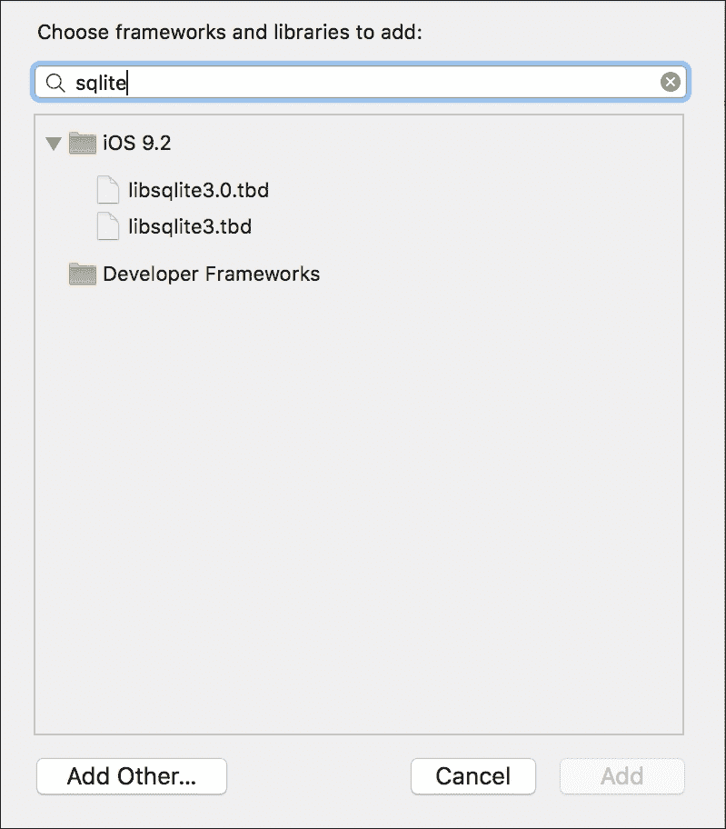

1.  之后，让我们创建一个新的桥接文件，通过添加一个名为 `BridgingHeader.h` 的新头文件；检查它是否在 **构建设置** 中设置为桥接头。在这个文件中，包含 `sqlite3.h`：

    ```swift
    #include <sqlite3.h>
    ```

1.  现在添加一个名为 `SQLite.swift` 的新文件；在这里，我们将开始编写一个名为 `SQLite` 的类，并在其中定义一个名为 `status` 的枚举：

    ```swift
    public class SQLite {
        public enum Status {
            case CONNECTED,
            DISCONNECTED
        }
    ```

1.  现在，让我们创建两个属性，一个用于与数据库的连接，另一个用于当前连接状态：

    ```swift
        private var _connection:COpaquePointer = nil
        private var _status = SQLite.Status.DISCONNECTED
    ```

1.  下一步是创建一个只读的计算属性，它返回当前连接状态：

    ```swift
        public var status:SQLite.Status {
            return _status
        }
    ```

1.  之后，你可以创建一个方法来打开与数据库的连接。对于这个方法，我们只需要一个文件名作为参数；然而，我们将将其存储在文档文件夹中：

    ```swift
        public func connect(filename:String)-> Bool{
            let documentsPath = (NSSearchPathForDirectoriesInDomains(.DocumentDirectory, .UserDomainMask, true)[0] as NSString).stringByAppendingPathComponent(filename)
            let error = sqlite3_open(documentsPath,&self._connection)
            if error == SQLITE_OK {
                // Adding a table just in case
                let statement = "CREATE TABLE IF NOT EXISTS ips " +
                                "(ipstart text, ipend text, " +
                                "iipstart integer, iipend integer, " +
                                "country text);" as NSString
                var errmessage:UnsafeMutablePointer<CChar> = nil
                if sqlite3_exec(self._connection, statement.UTF8String, nil, nil, &errmessage) == SQLITE_OK {
                    self._status = .CONNECTED
                    return true
                }
                return false
            return false
        }
    ```

1.  这个类的最后一个细节是析构器，它应该关闭数据库连接：

    ```swift
        deinit {
            switch self._status {
                case .CONNECTED:
                    sqlite3_close(self._connection)
                default:
                    break;
            }
        }
    }
    ```

1.  模型部分已完成；现在让我们通过点击故事板并添加一个标签、一个文本框和一个按钮来创建视图部分，布局类似于这个：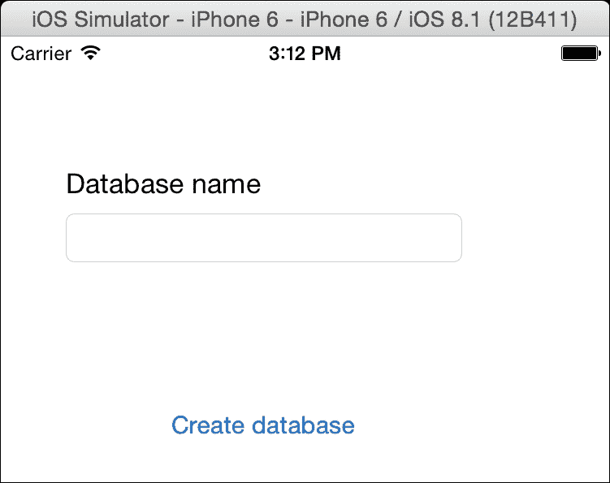

1.  现在将文本框与视图控制器连接，并命名为 `databaseNameTextField`：

    ```swift
        @IBOutlet var databaseNameTextField: UITextField!
    ```

1.  一旦完成，你就可以为唯一的按钮创建一个动作；在这种情况下，我们将打开数据库连接，创建一个表并检查是否一切操作都成功完成：

    ```swift
        @IBAction func createDatabase(sender: AnyObject) {
            var database = SQLite()
            if self.databaseNameTextField.text == "" {
            let alert = UIAlertController(title: "No database name", message: "You must introduce a database name", preferredStyle:.Alert)
            self.presentViewController(alert, animated: true, completion: nil)

            return

    }
            let dbname = self.databaseNameTextField.text + ".sqlite"
            if database.connect(dbname) {
                UIAlertView(title: nil, message: "Database was created", delegate: nil, cancelButtonTitle: "OK").show()
                let alert = UIAlertController(title: nil, message: "Database was created", preferredStyle:.Alert)
            self.presentViewController(alert, animated: true, completion: nil)

            }else {
                let alert = UIAlertController(title: nil, message: "Failed creating the database", preferredStyle:.Alert)
            self.presentViewController(alert, animated: true, completion: nil)
            }

        }
    ```

1.  这个应用完成了。更确切地说，这个第一个版本完成了；现在按播放按钮，为你的数据库输入一个文件名，例如 `mydatabase`，然后按创建数据库的按钮。

1.  现在让我们检查实际的应用程序，所以打开你的 iFunBox 并搜索应用程序 `第十章 SQLite`；打开其 `Document` 文件夹，选择这个文件夹中的唯一文件，然后按 **复制到 Mac** 按钮并将其保存在你的本地文档文件夹中：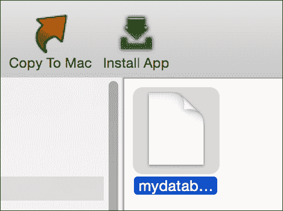

1.  一旦你有了空数据库，让我们检查我们是否能够打开它。打开你的 Sqlite 浏览器（仅支持 8.3 及以下版本）并点击 **打开** **数据库** 按钮：

1.  选择你下载的数据库文件并打开它。之后，你应该在主面板和数据库模式中看到一个名为 `ips` 的表，这意味着你的数据库已成功创建，并且可以无错误地创建一个表：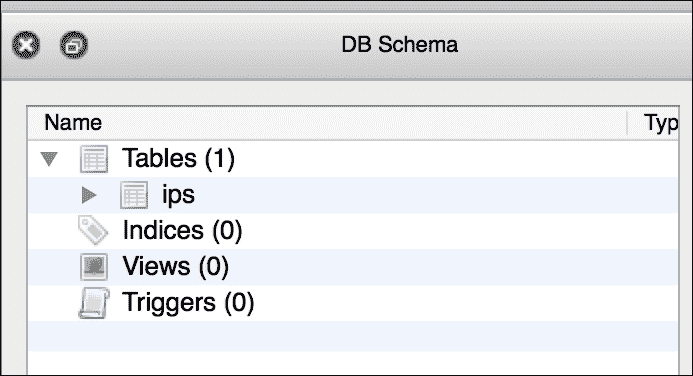

## 它是如何工作的…

SQLite 不是一个框架；而是一个库，它使用传统的 C 函数而不是 Objective-C 或 Swift 对象。

如你所知，使用 C 函数意味着使用 C 类型；这就是我们为什么必须使用 `UnsafeMutablePointer<CChar>` 来表示错误信息，以及 `COpaquePointer` 来表示数据库句柄的原因。

### 注意

`COpaquePointer` 表示一个 C 指针，例如 `UnsafeMutablePointer`，但它在你无法在 Swift 中表示指针类型时使用，例如一些结构体，例如。

在这个菜谱中，我们使用了三个 SQLite 函数：

+   `sqlite3_open`：这个函数打开一个数据库。如果不存在，它将创建一个新的数据库文件。这个函数接收文件名和一个句柄指针作为参数。

    ### 小贴士

    如果你不想创建数据库文件，你可以使用内存数据库；查看 [`www.sqlite.org/inmemorydb.html`](https://www.sqlite.org/inmemorydb.html)。

+   `sqlite3_close`：这个函数关闭与数据库的连接并释放用于此连接的资源。请注意，C 没有对象，没有垃圾回收器，也没有自动引用计数器；因此，如果你不释放资源，它们将一直存在，直到你的应用程序结束或崩溃。

+   `sqlite3_exec`：这个函数执行一个 SQL 语句；在这种情况下，这并不是真的必要，因为我们只是想检查文件是否已创建；然而，有时如果你不使用数据库，SQLite 只会创建一个空文件。

## 参见

+   SQLite 有很多选项和函数；你可以在官方网站上了解更多信息：[`www.sqlite.org/cintro.html`](https://www.sqlite.org/cintro.html)。现在你知道如何创建数据库了，让我们开始使用它，创建登记和查询结果。

# 检查你的 IP 地址来源

有时候你需要从远程数据库进行查询，但正如你所知，SQLite 与本地数据库一起工作，这意味着在查询之前你必须填充它。在这个菜谱中，我们将把 CSV 文件转换为 SQLite 数据库，然后查询一些结果。

## 准备工作

对于这个菜谱，我们需要一个包含每个国家 IP 地址范围的 CSV 文件。有一些网站会提供或出售给你。你可以从[`db-ip.com/db/download/country`](https://db-ip.com/db/download/country)免费下载它。解压它，并将其添加到你的 SQLite 应用程序中。

### 注意

目前这个文件名为`dbip-country-2014-12.csv`，但每个月都会更改其名称，所以将提到的文件名替换为你拥有的那个。

## 如何操作…

1.  让我们开始通过添加两个额外的方法来完善 SQLite 类，其中一个用于执行不返回任何结果的操作，例如插入、删除和更新查询。要做到这一点，请点击文件`SQLite.swift`，并在 SQLite 类中添加以下代码：

    ```swift
        func exec(statement: String) -> Bool {
            var errmessage:UnsafeMutablePointer<CChar> = nil
            return sqlite3_exec(self._connection, (statement as NSString).UTF8String, nil, nil, &errmessage) == SQLITE_OK
        }

        func query(statement:String) -> [[String]]? {
            var sqliteStatement:COpaquePointer = nil
            if sqlite3_prepare_v2(self._connection, (statement as NSString).UTF8String , -1, &sqliteStatement, nil) != SQLITE_OK {
                return nil
            }
            var result = [[String]]()
            while sqlite3_step(sqliteStatement) == SQLITE_ROW {
                var row = [String]()
                for i in 0..<sqlite3_column_count(sqliteStatement) {
                   row.append(String.fromCString(UnsafePointer<CChar>(sqlite3_column_text(sqliteStatement, i)))!)
                }
                result.append(row)
            }
            return result
        }
    ```

1.  现在，让我们在你的项目中添加一个名为`Functions.swift`的新文件。这个文件将包含一些辅助函数。我们将要创建的第一个函数是读取 CSV 文件并返回其内容的双字符串数组：

    ```swift
    func csv2array(filename: String) -> [[String]]? {
        var error: NSErrorPointer = nil
        var url = NSBundle.mainBundle().URLForResource(filename, withExtension: "csv")
        if let  fileContent = String(contentsOfURL: url!, encoding: NSUTF8StringEncoding, error: error){
            var records = [[String]] ()
            fileContent.enumerateLines({ (line, _) -> () in
                var fields:[String] = line.componentsSeparatedByString(",").map({ (field:String) -> String in
                    return field.stringByTrimmingCharactersInSet(NSCharacterSet(charactersInString: "\""))
                })
                if isIPv4(fields[0]) {
                    records.append(fields)
                }
            })

            return records
        }else {
            return nil
        }
    }
    ```

1.  现在，我们需要两个与 IP 字符串相关的额外函数；第一个将检查输入字符串是否具有 IPv4 格式：

    ```swift
    func isIPv4(ip:String) -> Bool {
        var error: NSErrorPointer = nil
        return try NSRegularExpression(pattern: "^\\d{1,3}\\.\\d{1,3}\\.\\d{1,3}\\.\\d{1,3}$", options: .CaseInsensitive, error: error)!.matchesInString(ip, options: nil, range:NSMakeRange(0, countElements(ip))).count > 0
    }
    ```

1.  下一个函数将把 IP 从字符串转换为无符号整数；这将允许我们比较 IP 是否在某个范围内：

    ```swift
        func ip2int(ip:String) -> UInt32 {
            return CFSwapInt32(inet_addr((ip as NSString).UTF8String))
        }
    ```

1.  我们已经完成了辅助函数，现在我们必须更新故事板。转到你的故事板，并添加两个额外的按钮，一个带有“Populate”这个词，另一个带有“Search”这个词，类似于以下截图：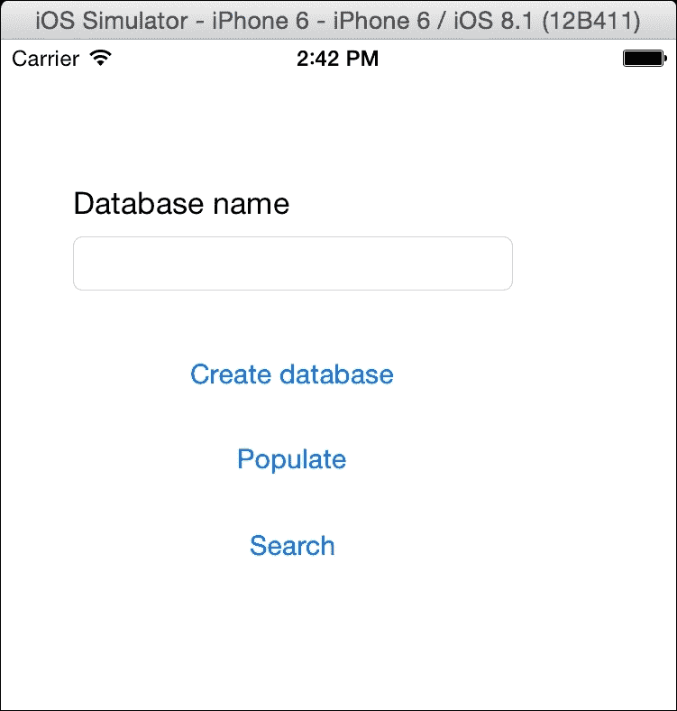

1.  现在，我们需要将这些按钮默认设置为隐藏，因为我们不会在创建数据库之前插入任何登记。要做到这一点，请点击这些新按钮中的一个，转到属性检查器，勾选“隐藏”选项，然后对另一个按钮重复此操作：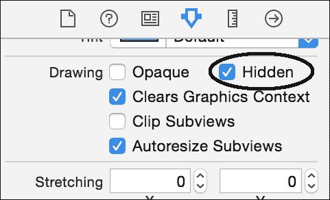

1.  一旦故事板完成，我们就需要更新视图控制器。让我们先从将标签和三个按钮与视图控制器连接开始：

    ```swift
        @IBOutlet var inputLabel: UILabel!
        @IBOutlet var createButton: UIButton!
        @IBOutlet var populateButton: UIButton!
        @IBOutlet var searchButton: UIButton!
    ```

1.  我们还需要另一个属性，即数据库连接，它在创建数据库的动作中，所以我们要做的是将声明和初始化从`createDatabase`方法内部移动到外部：

    ```swift
     var database = SQLite()
        @IBAction func createDatabase(sender: AnyObject) {

            if self.databaseNameTextField.text == "" {
    ```

1.  由于我们正在`createDatabase`方法附近工作，我们可以利用它并更新它，通过隐藏一些不需要的视图，只显示**填充**按钮：

    ```swift
        @IBAction func createDatabase(sender: AnyObject) {

            if self.databaseNameTextField.text == "" {
                let alert = UIAlertController(title: "No database name", message: "You must introduce a database name", preferredStyle:.Alert)
                self.presentViewController(alert, animated: true, completion: nil)

                return
            }
            let dbname = self.databaseNameTextField.text + ".sqlite"
            if database.connect(dbname) {
                let alert = UIAlertController(title: nil, message: "Database was created", preferredStyle:.Alert)
            self.presentViewController(alert, animated: true, completion: nil)

                self.createButton.hidden = true
                self.populateButton.hidden = false
                self.inputLabel.text = ""
                self.databaseNameTextField.text = ""
                self.databaseNameTextField.hidden = true
            }else {
                let alert = UIAlertController(title: nil, message: "Failed creating database", preferredStyle:.Alert)
                self.presentViewController(alert, animated: true, completion: nil)
            }
        }
    ```

1.  之后，我们可以将**填充**按钮与一个新的动作连接起来。这个动作将被命名为`populate`，它将在我们的数据库上调用一个`insert`语句，然后显示**搜索**按钮：

    ```swift
        @IBAction func populate(sender: AnyObject) {
            if let data = csv2array("dbip-country-2014-12"){
                print("total \(data.count)")
                var statements = data.map{ record -> String in
                    return "INSERT INTO ips (ipstart, ipend, iipstart, iipend, country) VALUES " +
                    "('\(record[0])', '\(record[1])', \(ip2int(record[0])), \(ip2int(record[1]))," +
                        "'\(record[2])' )"
                }

                database.exec("delete from ips;")

                for statement in statements {
                    database.exec(statement)
                }
                self.searchButton.hidden = false
                self.populateButton.hidden = true
                self.inputLabel.text = "Enter an IP"
                self.databaseNameTextField.text = ""
                self.databaseNameTextField.hidden = false
            }
            else {
                let alert = UIAlertController(title: nil, message: "Unable to parse the file", preferredStyle:.Alert)
            self.presentViewController(alert, animated: true, completion: nil)
            }
        }
    ```

1.  如你所想，我们需要开发搜索动作。首先，它需要检查输入是否正确，然后它将查找它所属的 IP 范围。如果它能找到，它将显示 IP 所属的国家，否则它将显示国家未找到：

    ```swift
        @IBAction func search(sender: AnyObject) {
            let iptext = self.databaseNameTextField.text
            if !isIPv4(iptext) {
                UIAlertView(title: "Error", message: "Wrong format", delegate: nil, cancelButtonTitle: "OK").show()
                return
            }
            let ipnumber = ip2int(iptext)
            let sql = "SELECT country FROM ips where \(ipnumber) between iipstart and iipend"
            if let result = database.query(sql){
                if result.count > 0 && result[0].count > 0 {
                  let alert = UIAlertController(title: "Found", message: " This ip belongs to \(result[0][0])", preferredStyle:.Alert)
                  self.presentViewController(alert, animated: true, completion: nil)
                }else {
                  let alert = UIAlertController(title: "Not found", message: "No result was found", preferredStyle:.Alert)
            self.presentViewController(alert, animated: true, completion: nil)

     }
            }else {
              let alert = UIAlertController(title: "Error", message: "Failed to execute your query", preferredStyle:.Alert)
            self.presentViewController(alert, animated: true, completion: nil)

    }
        }
    ```

1.  再次，我们完成了一个应用程序，我们需要对其进行测试。按播放，在测试字段中写入`mydatabase`，然后按**创建数据库**。现在你应该只看到屏幕上的**填充**按钮，点击它——它需要一段时间才能完成。

    ### 小贴士

    如果你想在开发时知道应用程序何时开始写入磁盘，你可以点击调试器导航器，然后点击磁盘报告，你应该会看到一些表示磁盘写入活动的条形图，如下面的图像所示：

    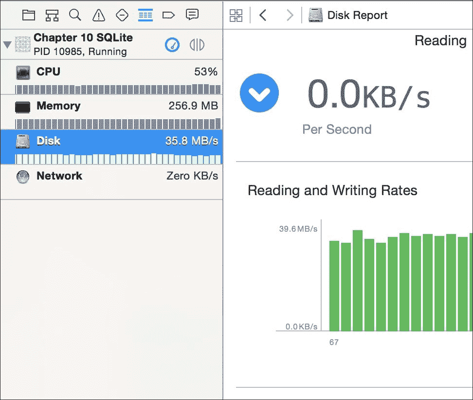

1.  最后一步是查找特定 IP 的国家，所以当文本字段出现时，在文本字段中输入一个 IP，例如`74.125.230.52`，然后按**搜索**。你应该会收到一个警报，显示这个 IP 来自哪里。

## 它是如何工作的…

SQL 有两种类型的查询：

+   有一些查询会修改数据结构，如`CREATE TABLE`和`ALTER TABLE`，或者修改数据内容，如`INSERT`、`DELETE`或`UPDATE`，这些将在下一节中展示。这些查询通常不会返回任何数据。对于这类查询，你可以使用`sqlite3_exec`函数。

+   查询信息，如`SELECT`。在这里，你需要以不同的方式工作；你需要使用`sqlite3_prepare_v2`函数来执行查询，并使用`sqlite3_step`来检索每条记录。

### 注意

如果你检查 SQLite API 文档，你会看到`sqlite3_exec`也可以从`SELECT`语句返回结果；但是它需要一个指向每个接收到的记录的函数的指针（称为回调函数）。

如果你用 C 开发了你的函数，你可以通过使用类型为`CFunctionPointer`的变量来拥有它的指针，但请记住，这种数据类型不能用于指向 Swift 函数。确保 SQLite 有自己的常量，例如`SQLITE_OK`用于指示操作已成功完成，`SQLITE_ROW`告诉我们它可以从语句结果中接收记录，或者`SQLITE_DONE`表示该语句结果上没有更多记录。

在这种情况下，我们遇到了将文本文件转换为数据库记录的常见情况。当你需要执行类似任务时，请详细检查。首先我们在一个数组中添加了每个记录；当我们完成插入记录时，大约需要 80 兆字节的 RAM。这不是问题，因为即使是低端设备如 iPhone 4S 也拥有 512 兆字节的 RAM，但如果你决定加载城市的 IP 数据库，它可能会消耗大量内存，因此你可能需要分割文件或将每个记录直接存储在数据库中，而不是使用中间数组。

另一个细节是我们没有使用事务，这意味着如果我们有任何原因需要在插入过程中停止，我们需要删除之前插入的每个记录；否则我们可能会出现重复记录或尝试重新插入所有内容时的错误。

另一个好问题是：为什么我们使用 IP 范围而不是每个 IP 一个记录？原因很简单：空间。如果我们为每个 IP 使用一个记录，我们需要 4,294,967,296 个记录；如果每个记录占用 1 千字节磁盘空间，它将需要 4,398,046,511,104 字节（约 4 太字节），这在我们任何苹果移动设备上都没有，除了苹果电脑，但为了仅一个 IP 表浪费这样的空间是不值得的。

另一个好问题是：为什么我们必须将 IP 字符串转换为无符号整数？即使你将 IP 视为一个数字序列，实际上它是一个 32 位无符号整数，这允许我们比较 IP 是否在某个范围内；否则我们将进行字符串比较，这是不正确的。

## 参见

+   SQLite 有很多函数，其中一些比其他函数使用得更频繁，一些比其他函数更专业；因此，检查 [`www.sqlite.org/c3ref/intro.html`](https://www.sqlite.org/c3ref/intro.html) 上的可用 C 函数和 [`www.sqlite.org/lang.html`](https://www.sqlite.org/lang.html) 上的 SQL 语句是个好主意。

+   在这里你学习了如何在应用程序中使用 SQLite，然而这给我们带来了一些工作要做，因为 SQLite 不是一个框架，它是一个 C 库。在下一个菜谱中，我们将学习如何使用 SQLite 的“预煮”类来节省开发时间。

# 跟踪你的手机活动

假设你想要通过记录人头顶靠近手机的时间来追踪你的手机接收（或拨打）的电话，因此你想要创建一个应用程序，每次当接近传感器检测到有东西靠近手机的前脸时，都会记录当前时间和手机坐标。

虽然我们还将使用 SQLite，但我们不会编写任何 SQL 语句。这次我们将使用一个仅使用 Swift 类型和对象的框架；这样我们就不必担心将类型从 Swift 转换为 C，再从 C 转换回 Swift。

## 准备工作

对于这个菜谱，我们需要下载一个名为 `SQLite.Swift` 的外部框架。要做到这一点，打开你喜欢的浏览器，并转到 [`github.com/stephencelis/SQLite.swift`](https://github.com/stephencelis/SQLite.swift)。一旦网站打开，点击下载 ZIP 图标。如果你使用了 Safari，下载的文件可能已经被解压。如果你使用的是其他网络浏览器，请通过在查找器窗口的文件图标上双击来自动解压它。使用此框架需要 Xcode 6.1 或更高版本，所以请确保你使用的是 Xcode 的更新版本。

由于这个菜谱将使用接近传感器，因此必须使用物理手机使用它，否则你将无法创建任何记录。

如果你已经准备好开始，创建一个名为 `Chapter 10 Activity Recording` 的新项目。

## 如何做…

1.  首先，我们需要将 `SQLite.Swift` 添加到我们的项目中。要做到这一点，只需将 `SQLite.Swift` Xcode 项目文件（`SQLite.xcodeproj`）拖入你的项目；你现在应该在项目导航器中看到两个项目：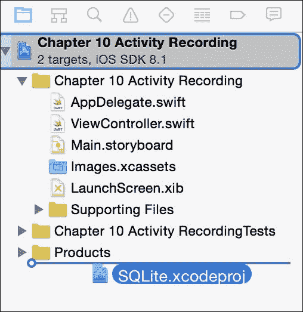

1.  现在点击你的项目以添加此框架，因此点击目标的目标**通用**选项卡，滚动到**链接的框架和库**，然后点击加号。当对话框出现时，你可以检查是否有名为**工作区**的部分，其中包含两个同名框架；选择为 iOS 准备的那个：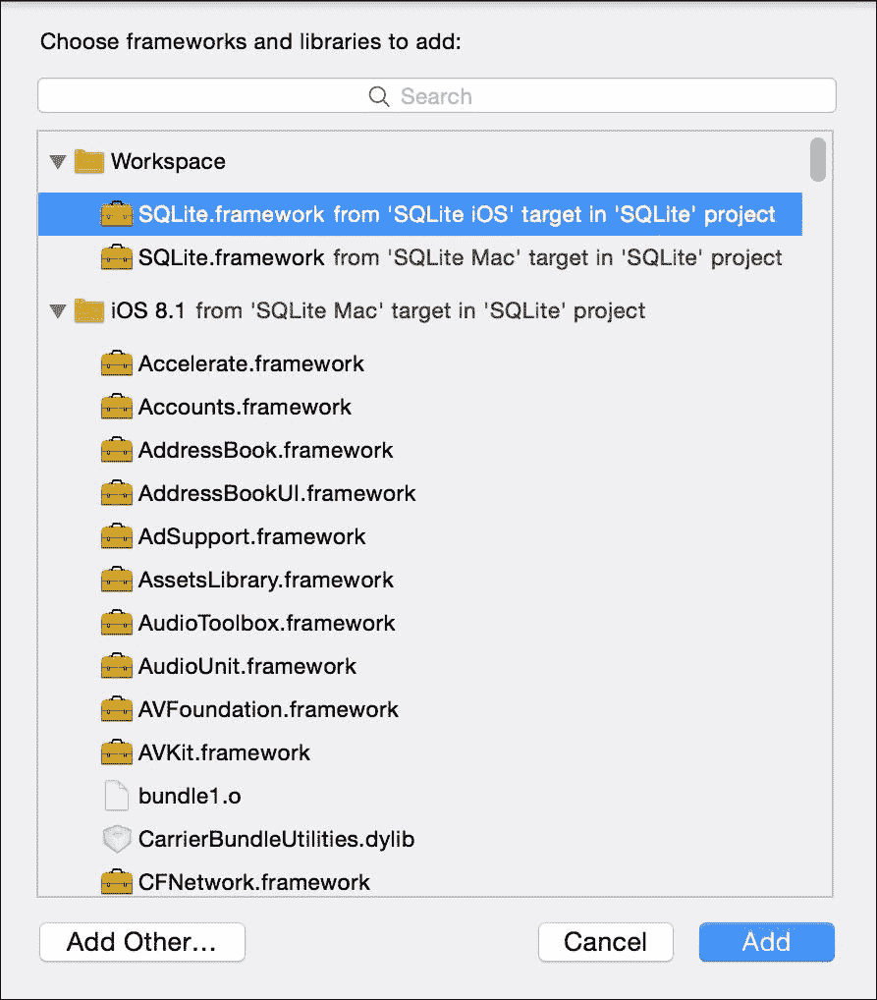

1.  再次按加号，并选择另一个框架：`CoreLocation` 框架。

1.  因为在这个菜谱中，我们只将开发视图控制器，所以我们不会添加任何新的文件。因此，直接点击故事板，向你的视图中添加一个文本字段和一个按钮。删除你的文本字段中的文本，并将按钮标签更改为**打印记录**。现在将文本字段与视图控制器连接，并命名为 `textView`：

    ```swift
        @IBOutlet var textView: UITextView!
    ```

1.  将按钮与一个名为 `printRecords` 的新操作连接起来；我们现在不会开发它，只是将其留空以供将来使用：

    ```swift
        @IBAction func printRecords(sender: AnyObject) {
        }
    ```

1.  现在点击视图控制器文件，并将提示放置在此文件的开始处。在这里，我们需要导入 UIKit 之外的 `SQLite` 和 `CoreLocation` 两个框架：

    ```swift
    import SQLite
    import CoreLocation
    ```

1.  在我们开始开发视图控制器代码之前，我们将为我们的公共变量创建一个辅助类型：

    ```swift
    typealias activityTuple = (activity: Query, id:Expression<Int>,
        latitude: Expression<Double?>, longitude:Expression<Double?>,
        time:Expression<String>, away:Expression<Bool>)
    ```

1.  由于我们将需要使用核心位置来接收当前位置，我们需要将视图控制器实现为核心位置代理：

    ```swift
    class ViewController: UIViewController, CLLocationManagerDelegate {
    ```

1.  现在我们可以添加属性，我们需要一个数据库连接用于位置管理器，另一个用于保存接收到的最后位置：

    ```swift
        var database:Database?
        var locationManager = CLLocationManager()
        var lastLocation: CLLocation?
    ```

1.  是时候开发方法了，从 `viewDidLoad` 开始；在这里，我们需要设置一切：

    ```swift
        override func viewDidLoad() {
            super.viewDidLoad()
            if !openDatabase(){
              let alert = UIAlertController(title: "Error", message: "Cant open the database", preferredStyle:.Alert)
              self.presentViewController(alert, animated: true, completion: nil)

              return
            }
            if !createStructure() {
                UIAlertView(title: "Error", message: "Can't create database structure", delegate: nil, cancelButtonTitle: "OK").show()
                return
            }
            setLocationManager()
            setProximitySensor()
        }
    ```

1.  如你所见，我们有几个方法需要实现。让我们从 `openDatabase` 开始，它创建数据库并处理连接：

    ```swift
        private func openDatabase() -> Bool{
            let documentsPath = (NSSearchPathForDirectoriesInDomains(.DocumentDirectory, .UserDomainMask, true)[0] as NSString).stringByAppendingPathComponent("database.sqlite")
            database = Database(documentsPath)
            return database != nil
        }
    ```

1.  下一步是创建数据库结构；它将创建一个名为 `activity` 的表，并包含以下列：

    ```swift
        private func createStructure() -> Bool {
            var actVars = self.activityVars()
            var result = database!.create(table: actVars.activity, ifNotExists: true) { t in
                // Autoincrement means that we don't have to set this value because it will be automatic.
                t.column(actVars.id, primaryKey: .Autoincrement)
                t.column(actVars.latitude)
                t.column(actVars.longitude)
                t.column(actVars.time, unique: true)
                t.column(actVars.away)
            }
            return !result.failed
        }
    ```

1.  数据库初始化已完成；我们需要通过设置核心位置来开始接收设备位置信息：

    ```swift
        private func setLocationManager(){
            locationManager.delegate = self
            locationManager.distanceFilter = kCLDistanceFilterNone
            locationManager.desiredAccuracy = kCLLocationAccuracyBest

            if (UIDevice.currentDevice().systemVersion as NSString).floatValue >= 8 && CLLocationManager.authorizationStatus() != CLAuthorizationStatus.AuthorizedAlways {
                locationManager.requestAlwaysAuthorization()
            }
            locationManager.startUpdatingLocation() 
        }
    ```

1.  如你所知，我们需要实现更新当前位置的方法：

    ```swift
        func locationManager(manager: CLLocationManager!, didUpdateLocations locations: [AnyObject]!){
            if locations.count > 0 {
                lastLocation = locations[0] as? CLLocation
            }
        }
    ```

1.  现在我们需要从接近传感器获取通知；为了做到这一点，我们需要使用通知中心：

    ```swift
        private func setProximitySensor(){
            var device = UIDevice.currentDevice()
            device.proximityMonitoringEnabled = true
            if device.proximityMonitoringEnabled {
                NSNotificationCenter.defaultCenter().addObserver(self, selector: Selector("proximity:"), name: UIDeviceProximityStateDidChangeNotification, object: device)
            }
        }
    ```

1.  如你所见，当我们收到接近传感器变化时，`proximity`方法将被调用；那就是我们必须在数据库中存储活动开始或结束的时刻：

    ```swift
        func proximity(notification:NSNotification){
            var device: AnyObject? = notification.object
            var latitude:Double?
            var longitude:Double?
            if lastLocation != nil {
                latitude = lastLocation!.coordinate.latitude
                longitude = lastLocation!.coordinate.longitude
            }
            let dateFormatter = NSDateFormatter()
            dateFormatter.dateFormat = "yyyy-MM-dd HH:mm:ss" // superset of OP's format
            let dateString:String = dateFormatter.stringFromDate(NSDate())

            let actVars = self.activityVars()

            if let id = actVars.activity.insert(actVars.away <- !device!.proximityState!,
                actVars.time <- dateString, actVars.latitude <- latitude, actVars.longitude <- longitude ) {
                print("Register inserted with id \(id)")
            }
        }
    ```

1.  现在我们需要创建一个返回与活动表相关的变量的方法：

    ```swift
        private func activityVars() -> activityTuple{
            return (activity:database!["activity"], id:Expression<Int>("id"),
                latitude: Expression<Double?>("latitude"), longitude:Expression<Double?>("longitude"),
                time:Expression<String>("time"), away:Expression<Bool>("away") )
        }
    ```

1.  开发的最后一部分是按钮事件，直到现在都是空的。我们只需要从活动表中检索数据并将其添加到文本视图中：

    ```swift
        @IBAction func printRecords(sender: AnyObject) {
            self.textView.text = ""
            let actVars = activityVars()
            for record in actVars.activity {

                textView.text = textView.text +  "id: \(record[actVars.id]), time: \(record[actVars.time]), away: \(record[actVars.away])"
                if record[actVars.latitude] != nil {
                textView.text = textView.text +  ", latitude: \(record[actVars.latitude]!), longitude: \(record[actVars.longitude]!)"
                }
                textView.text = textView.text +  "\n"
            }
        }
    ```

1.  你可能还需要执行另一个步骤：点击你的项目的 Info.plist 文件并添加一个新行。在这个行中，将键设置为`NSLocationAlwaysUsageDescription`，将值设置为`This app needs GPS`。这样做的原因是，在 iOS 8 中，当你请求使用 GPS（核心位置）的权限时，如果没有消息，它会被忽略。有些人说这是一个 bug，并且它应该很快得到修复。

1.  再次强调，应用已经完成，我们需要对其进行测试，所以按播放按钮，并将你的手机放在你的头部旁边，就像你在用它通话一样。重复几次，然后通过按按钮检查表内容。你的结果应该类似于这个截图：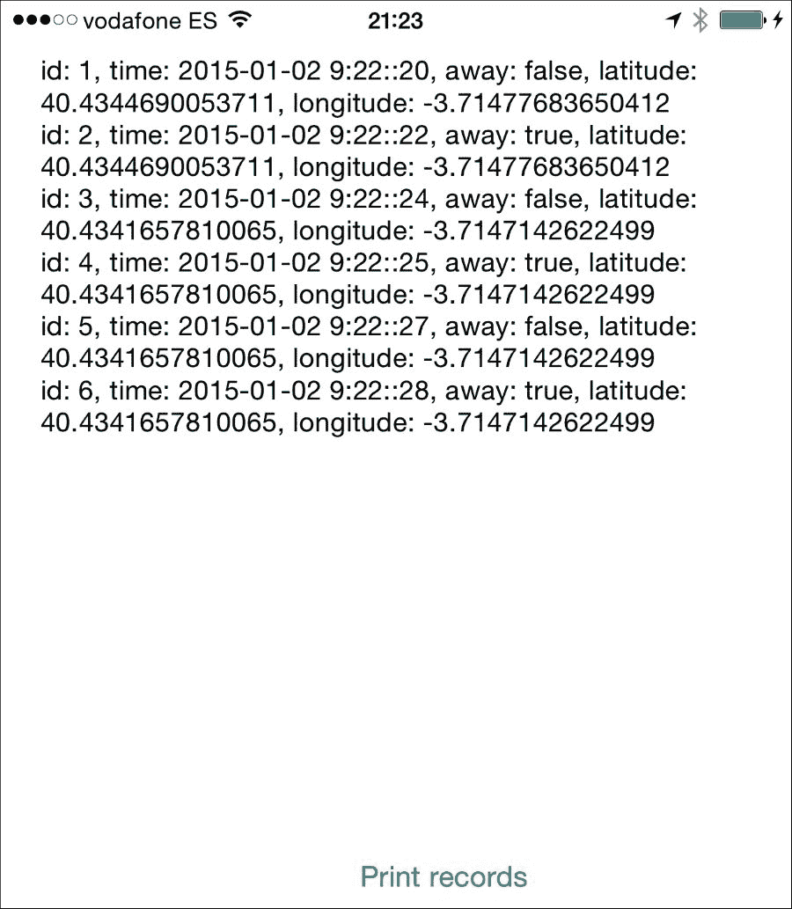

## 它是如何工作的…

`SQLite.Swift`是 SQLite 库的一个良好封装。你可以通过创建数据库类型的对象来创建数据库。你可以使用一个名为**Expression**的泛型类来定义表字段。这个类与整数（`Int`）、双精度（`Double`）、字符串和布尔类型（`Bool`）一起工作。所有这些都可以声明为可选的，这意味着数据库可以在其中存储 null 值。

你可以使用如`insert`或`update`这样的方法来添加或更改记录；这两个方法都接收一个名为 setter 的类型，它类似于字段和其值之间的关系。要创建 setter 类型的对象，你必须使用操作符`<-`。

对于检索结果，你可以像使用`for`循环一样遍历一个查询对象，并使用表达式作为索引通过下标访问其字段。

### 小贴士

你可以使用过滤方法来检索符合特定标准的记录，例如 SQL 语言中的 WHERE 子句。

## 还有更多…

正如你所看到的，我们不需要编写 SQL 语句；然而`SQLite.Swift`允许你在需要时使用 SQL 语句。为此，你可以使用如`run`或`prepare`这样的方法。

`SQLite.Swift`的另一个优秀特性是它支持事务。事务方法及其使用事务的方式。

苹果公司还有一个在其自身层上使用数据库的解决方案，称为**Core Data**。在下一个菜谱中，我们将学习如何使用它。

# 控制你的库存

一个应用程序与数据库相连的想法源于需要保留一些数据，即使应用程序已经结束。然而，SQL 是另一种语言，你必须重复一些开发工作，例如，在类中添加一个新字段，在数据库中也是一个新字段。

当施乐公司开发基于 Smalltalk 的第一个窗口系统时，它没有使用任何类型的数据库。它的论点是，如果一个应用程序没有结束，数据总是会留在 RAM 内存中。

这个想法非常聪明，然而我们知道现实世界并不总是这样运作。应用程序会崩溃并结束，设备有时需要重启。除了这些事实之外，你还需要考虑，直到今天，RAM 内存仍然比硬盘更贵。例如，新的 iPhone 6 只有 1GB 的 RAM 和至少 32GB 的永久存储。

基于上述提到的问题，苹果推荐使用其自己的 ORM（对象关系映射）框架，称为**Core Data**。ORM 是一种框架，允许你的对象存储在永久存储系统中，而无需浪费时间编写 SQL 语句。实际上，Core Data 为我们编写了 SQL。

在这个菜谱中，我们将通过模拟仓库的产品控制来开发一个小应用程序，使用 Core Data。

## 准备工作

开始创建一个名为`第十章库存控制`的新应用程序，但请确保已选中如下截图所示的**使用 Core Data**选项：

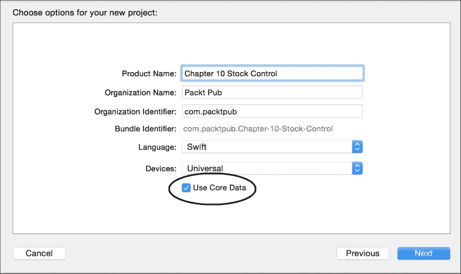

## 如何操作…

1.  首先，我们需要创建一个数据库模型。在创建此模型时，不要考虑 SQLite，因为这里会有一些不同类型。所以点击文件`Chapter_10_Stock_Control.xcdatamodeld`；你应该看到一个不同的布局和一些空字段。让我们先按一下位于文本**添加实体**上方的符号：

1.  将新实体重命名为`Product`：

1.  之后，为这个实体添加三个属性，一个名为`name`，类型为字符串，一个名为`price`，类型为双精度浮点数，还有一个名为`units`，类型为 32 位整数：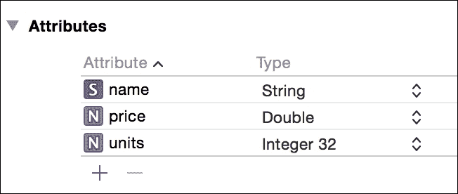

1.  数据部分就到这里。现在我们需要点击故事板文件。通过点击它来选择你拥有的唯一视图控制器，然后转到**编辑**菜单，展开**嵌入在**选项并选择**导航控制器**：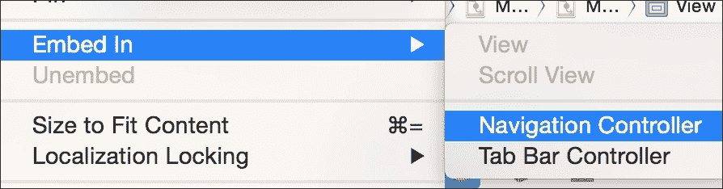

1.  由于我们不希望这个应用程序有导航栏，你可以点击刚刚创建的导航控制器，并在属性检查器中取消选中**显示导航栏**选项：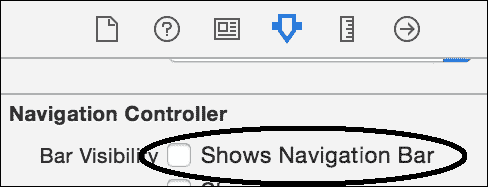

1.  现在在我们拥有的唯一视图控制器上添加一个带有文本**新产品**的按钮；在其下方添加一个表格视图。你应该有一个类似于以下布局：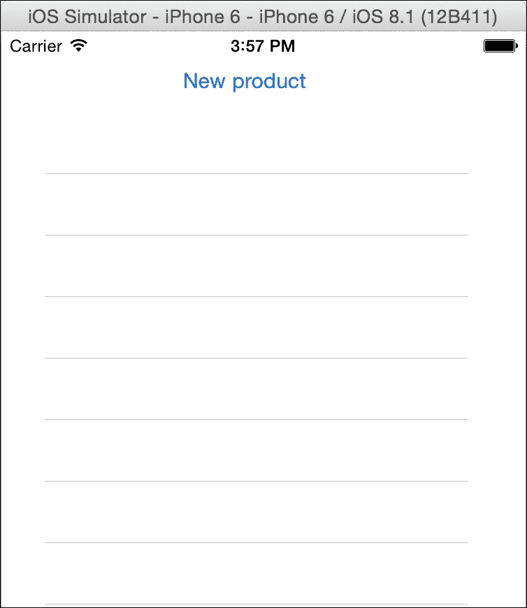

1.  现在转到视图控制器并导入`CoreData`：

    ```swift
    import CoreData
    ```

1.  之后，你必须将`UITableViewDataSource`协议添加到视图控制器中；这样我们就可以在表格视图中显示结果：

    ```swift
    class ViewController: UIViewController, UITableViewDataSource {
    ```

1.  现在将表格视图与视图控制器作为数据源和属性连接起来。因为我们正在添加一个属性，我们也可以添加一个新属性，它将包含我们的记录：

    ```swift
        @IBOutlet var tableView: UITableView!
        var products = [NSManagedObject]()
    ```

1.  一旦完成，我们就必须实现更新表格视图信息的那些方法。在这种情况下，记录的数量是数组的长度，但它们的值是`NSManagedObject`的一些键的值：

    ```swift
        func tableView(tableView: UITableView, numberOfRowsInSection section: Int) -> Int{
            return products.count
        }

        func tableView(tableView: UITableView, cellForRowAtIndexPath indexPath: NSIndexPath) -> UITableViewCell {
            var cell: UITableViewCell? = tableView.dequeueReusableCellWithIdentifier("cell") as UITableViewCell?
            if (cell == nil) {
                cell = UITableViewCell(style: UITableViewCellStyle.Value1, reuseIdentifier: "cell")
            } 
            cell!.textLabel?.text = products[indexPath.row].valueForKey("name") as? String
            var units = products[indexPath.row].valueForKey("units") as? Int
            cell!.detailTextLabel?.text = "\(units!) units"   
            return cell!
        }
    ```

1.  想象一下，当我们创建一个新记录时，重新加载表格视图数据是必要的。我们可以创建一个刷新按钮，但这样并不直观，所以我们能做的最好的方式是，当视图再次出现时，我们可以刷新数据以及更新产品数组：

    ```swift
        override func viewWillAppear(animated: Bool) {
            var appDelegate:AppDelegate = UIApplication.sharedApplication().delegate as AppDelegate
            var moc: NSManagedObjectContext = appDelegate.managedObjectContext!
            var request = NSFetchRequest(entityName: "Product")
            request.returnsObjectsAsFaults = false

            do {
              try products  = moc.executeFetchRequest(request) as [NSManagedObject]
        } catch {
            let alert = UIAlertController(title: "Error", message: "Error fetching the data.", preferredStyle:.Alert)
            self.presentViewController(alert, animated: true, completion: nil)
        }
            self.tableView.reloadData()
        }
    ```

1.  好的，按下播放，会发生什么？什么都没有！原因是我们可以列出记录，但不能插入它们，所以是时候给**新产品**按钮添加功能了。返回到故事板，添加一个新的视图控制器，将其放在上一个视图控制器的右侧，并按住**键点击**新产品**按钮，将其拖到新的视图控制器中。

1.  按下播放，当然你不会看到任何记录，但如果你点击按钮，你可以看到一个新视图被调用。在这个时候，我们需要开发这个视图，然而，在我们继续之前，它需要一个视图控制器文件；在这种情况下，你必须添加一个新文件，类型为 Cocoa Touch Class，并将其命名为`NewProductViewController`。确保它继承自**UIViewController**：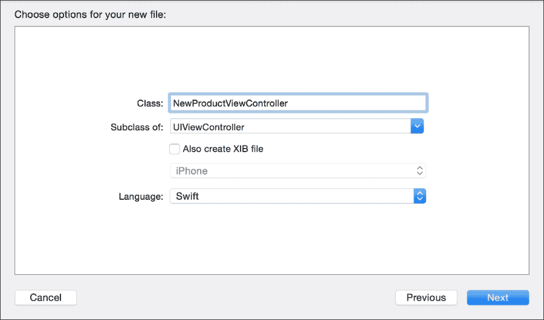

1.  返回到你的故事板，并在身份检查器中将此视图控制器的类更改为新创建的文件：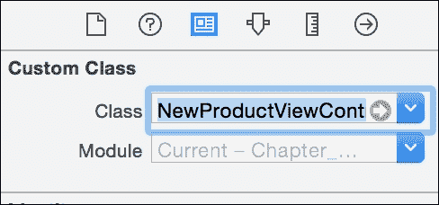

1.  现在让我们为这个视图创建一个布局。我们必须添加三个文本字段（每个实体字段一个），三个标签来解释这些字段的内容，一个用于保存记录的按钮，以及一个仅用于显示视图标题的标签（因为我们没有导航栏）：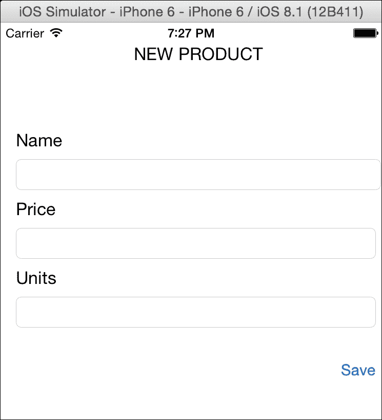

1.  一旦布局完成，我们必须将文本字段连接到新的产品视图控制器：

    ```swift
        @IBOutlet weak var nameTextField: UITextField!
        @IBOutlet weak var priceTextField: UITextField!
        @IBOutlet weak var unitsTextField: UITextField!
    ```

1.  我们需要做的最后一部分是保存按钮的开发。因为它将要使用几个`CoreData`类，所以你必须先导入它们：

    ```swift
    import CoreData
    ```

1.  现在将你的`save`按钮连接到一个名为`save`的动作，并通过检索文本字段的数据并使用核心数据保存它来开发它：

    ```swift
        @IBAction func save(sender: UIButton) {
            var appDelegate:AppDelegate = UIApplication.sharedApplication().delegate as AppDelegate
            var moc: NSManagedObjectContext = appDelegate.managedObjectContext!

            var newProduct = NSEntityDescription.insertNewObjectForEntityForName("Product", inManagedObjectContext: moc) as NSManagedObject
            newProduct.setValue(self.nameTextField.text, forKey: "name")
                newProduct.setValue( (priceTextField.text as NSString).floatValue, forKey: "price")
            newProduct.setValue(unitsTextField.text.toInt()!, forKey: "units")
            var err:NSError?
            moc.save(&err)
            if let error = err {
                print(error.localizedDescription)
            }else{
                print(newProduct)
            }
            self.navigationController?.popViewControllerAnimated(true)
        }
    ```

1.  最后一步是测试你的应用程序。按下播放，添加一些产品，如电脑、土豆和汽车，并检查它们是否出现在你的表格视图中。

## 它是如何工作的…

我们必须非常感谢苹果公司，因为旧版本的 Xcode 没有创建 `CoreData` 应用程序的选项，这意味着在 `AppDelegate` 类上执行的初始化代码必须手动完成。它所做的就是创建一些属性，例如 `managedObjectModel`，这些属性读取实体模型并对其进行解释；然后 `persistentStoreCoordinator` 将核心数据转换为持久化系统（默认为 SQLite，但可以配置为 XML 文件等），还有一个非常重要的一点：`managedObjectContext`；这个对象控制属于 `CoreData` 的对象/记录。

因此，每次我们需要使用 `CoreData` 中的某些东西时，我们都需要几次访问 `AppDelegate` 类。如果你愿意，你可以创建自己的单例类并将 `CoreData` 代码转移到那里。

当我们需要一个新的记录时，我们需要一个 `NSManagedObject` 类型的对象。如果它是一个新记录，我们可以请求 `NSEntityDescription` 类的 `insertNewObjectForEntityForName` 方法来帮忙。访问其字段非常简单；我们只需要使用 `valueForKey` 来获取其值或 `setValue` 来修改它。

如果你需要访问对象，你必须使用 `NSFetchRequest`，它就像一个 SQL 语句。`managedObjectContext` 是可以执行此请求并返回其数据的对象。

## 还有更多...

如果你想要过滤一些数据，你可以使用 `NSPredicate`，它类似于 SQL 的 where 子句。

我们已经看到了一些将数据存储到本地设备的方法，但关于网络数据库呢？在下一个菜谱中，我们将使用集中式数据库来存储我们的数据。

# 使用 CouchDB 设计投票设备

正如我们之前所学的，通常在移动应用中，我们访问本地数据库，但有时我们只需要使用一个与许多连接的设备共享的数据库。例如，当你进行 Google 搜索时，你不会将整个 Google 指数下载到你的手机上，你只是请求一些信息并检索结果。

在这个菜谱中，我们将学习如何使用集中式数据库，在这种情况下，我们将使用一个名为 CouchDB 的数据库。

## 准备中

对于这个菜谱，你需要下载一个 CouchDB 服务器。我假设你正在 Mac 计算机上开发，所以它将以 Mac OS X 进行演示。如果你更喜欢使用其他平台，如 Linux 或 Windows，请随意使用。

从 [`couchdb.apache.org`](http://couchdb.apache.org) 下载 CouchDB。一旦下载并解压，右键单击其图标，从菜单中选择 **显示包内容** 选项：

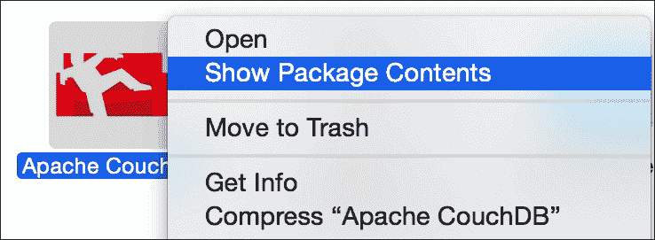

现在按照路径`Contents/Resources/couchdbx-core/etc/couchdb`前进；在这里你应该看到一个名为`default.ini`的文件。打开它，搜索变量`bind_address`。这里你必须将`127.0.0.1`更改为`0.0.0.0`。现在返回 CouchDB 应用所在的文件夹，通过双击打开应用。你的网络浏览器应该会打开，显示 CouchDB 前端（称为**Futon**）；保持它打开，以便稍后检查结果。

一个你必须牢记的重要细节是，如果你打算使用一个物理设备，它必须使用与你的电脑相同的 Wi-Fi 网络；否则，你的设备将无法找到你的数据库服务器。

返回你的 Xcode，创建一个名为`Chapter 10 Voting`的新项目。在这里，你不需要`CoreData`。

## 如何做到这一点…

1.  第一步是设置数据库。打开你的网络浏览器，点击创建数据库的按钮。如果你因为任何原因关闭了浏览器，只需输入 URL `http://127.0.0.1:5984/_utils/`。当网站要求输入数据库名称时，写下`voting`：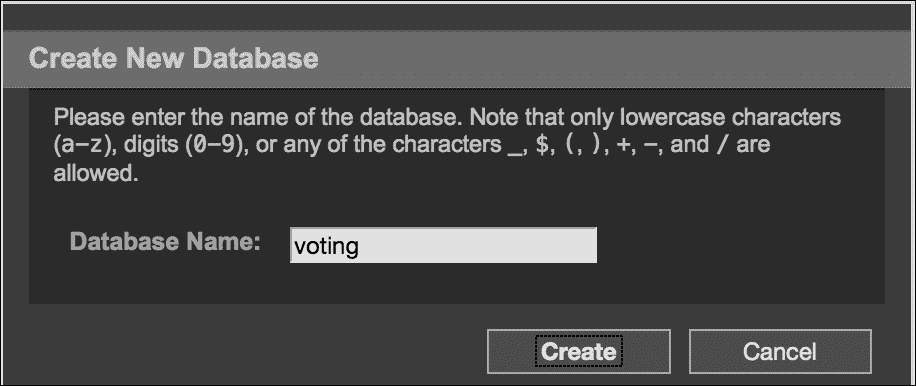

1.  在这个数据库中，我们需要添加一些文档。所以点击名为**新建文档**的按钮。

    ### 注意

    CouchDB 中的文档是 JSON 字典。

1.  对于第一个文档，点击**源**并按照以下代码完成。不要修改 _id 值，保留 CouchDB 给你的那个：

    ```swift
    {
       "_id": "608d7c9174f7caba4ab618d6810004cf",
       "question": "What is your favorite computer programming language?",
       "answers": [
           {
               "answer": "Swift",
               "votes": []
           },
           {
               "answer": "Objective-C",
               "votes": []
           },
           {
               "answer": "C",
               "votes": []
           }
       ]
    }
    ```

1.  好的，现在点击保存文档，然后让我们用另一个文档重复这个操作；这样我们可以确保问题是从数据库接收到的：

    ```swift
    {
       "_id": "608d7c9174f7caba4ab618d681001467",
       "_rev": "3-41c057820d6cbd595e7db2bdf05610fe",
       "question": "What is your favorite book?",
       "answers": [
           {
               "answer": "Swift cookbook",
               "votes": []
           },
           {
               "answer": "Divine Comedy",
               "votes": []
           },
           {
               "answer": "Oxford dictionary",
               "votes": []
           }
       ]
    }
    ```

1.  现在我们需要创建一个更新处理程序，它就像一个接收一些数据并为我们完成文档的函数。点击新建文档，这次我们需要更改文档 ID，因为它将被命名为`_design/voting`：

    ```swift
    {
       "_id": "_design/voting",
       "updates": {
           "addvote": "function(doc, req) { var json = JSON.parse(req.body); doc.answers[parseInt(json.answer)].votes.push(json.uid); return [doc, toJSON(doc)]}"
       }
    }
    ```

1.  数据库部分已经完成；因此，你必须回到你的 Xcode 项目中。

    ### 注意

    解释 CouchDB 的工作原理超出了本书的范围；如果你想学习如何使用这个数据库，有关于它的优秀书籍和教程。

1.  一旦你回到了你的 Xcode 项目，点击故事板，并在视图中添加两个标签和三个按钮。在视图顶部放置第一个标签，上面写着`TODAY'S QUESTION`。在其下方放置另一个标签，它将包含接收到的提问，然后在其下方放置三个按钮。不用担心这些组件的文本，它们将通过编程方式更改。

1.  如同往常，我们必须将一些组件与视图控制器链接起来；在这种情况下，我们必须连接问题标签和三个按钮：

    ```swift
        @IBOutlet var questionLabel: UILabel!
        @IBOutlet var answer1button: UIButton!
        @IBOutlet var answer2button: UIButton!
        @IBOutlet var answer3button: UIButton!
    ```

1.  此外，我们还将添加两个属性，一个用于文档 ID，另一个用于请求 URL 的公共部分。记住，如果你正在使用设备，你必须将 IP 从`127.0.0.1`更改为你的电脑的 IP：

    ```swift
        var documentId:String?

        let baseurl = "http://127.0.0.1:5984/voting/"
    ```

1.  将三个按钮连接到同一个名为`vote`的动作。现在暂时留这个动作为空：

    ```swift
        @IBAction func vote(sender: UIButton) {
        }
    ```

1.  当应用程序启动时，我们需要接收数据库中当前的问题，所以让我们在`viewDidLoad`方法中调用一个函数来帮我们完成这个任务：

    ```swift
        override func viewDidLoad() {
            super.viewDidLoad()
            self.chooseQuestion()
        }
    ```

1.  如你所想，我们必须实现`chooseQuestion`方法。这个方法将调用`_all_docs`动作，它返回数据库中每个文档的 ID，包括特殊文档`_design/voting`。一旦我们收到文档，我们就可以选择其中一个并请求其数据：

    ```swift
        private func chooseQuestion(){
            var url = NSURL(string: baseurl + "_all_docs")!
            var task = NSURLSession.sharedSession().dataTaskWithURL(url, completionHandler: {
                data, response, error -> Void in
                if error != nil {
                    print(error.localizedDescription)
                }
          var jsonResult = [:]
                do {
                jsonResult = try NSJSONSerialization.JSONObjectWithData(data, options: NSJSONReadingOptions.MutableContainers) as NSDictionary
        } catch {
            let alert = UIAlertController(title: "Error", message: "Error parsing JSON", preferredStyle:.Alert)
            self.presentViewController(alert, animated: true, completion: nil)
        }

    var invalid = true
                var docid:String = ""
                while invalid {
                let rows  = jsonResult.valueForKey("rows") as NSArray
                srandom(UInt32(time(nil)))
                var choosenRow:Int = random() % rows.count
                docid = (rows[choosenRow] as NSDictionary).valueForKey("id") as String
                    invalid = startsWith(docid, "_")
                }
                self.getQuestion( docid )
            })
            task.resume()
        }
    ```

1.  一旦应用程序决定它想要哪个文档，我们就可以请求它的数据。机制与之前类似，但不同之处在于当我们收到数据时，我们必须更新 UI。正如你所知，这必须在主线程上完成：

    ```swift
        private func getQuestion(id:String){
            self.documentId = id
            var url = NSURL(string: baseurl + id)!
            var task = NSURLSession.sharedSession().dataTaskWithURL(url, completionHandler: {
                data, response, error -> Void in
                if error != nil {
                    print(error.localizedDescription)
                }
          var jsonResult = [:]
                do {
           jsonResult = try NSJSONSerialization.JSONObjectWithData(data, options: NSJSONReadingOptions.MutableContainers) as NSDictionary
        } catch {
            let alert = UIAlertController(title: "Error", message: "Error parsing JSON", preferredStyle:.Alert)
            self.presentViewController(alert, animated: true, completion: nil)
        }

                dispatch_async(dispatch_get_main_queue(), {
                    self.questionLabel.text = jsonResult.valueForKey("question")
                    var answers = jsonResult.valueForKey("answers") as [NSDictionary]
                    self.answer1button.setTitle(answers[0].valueForKey("answer") as? String, forState: .Normal)
                    self.answer2button.setTitle(answers[1].valueForKey("answer") as? String, forState: .Normal)
                    self.answer3button.setTitle(answers[2].valueForKey("answer") as? String, forState: .Normal)

                })
            })
            task.resume()
        }
    ```

1.  如果你现在按下播放按钮，你会看到一个像下面的屏幕。这意味着你从数据库中收到了一个问题及其可能的答案。然而，如果你选择任何答案，什么也不会发生：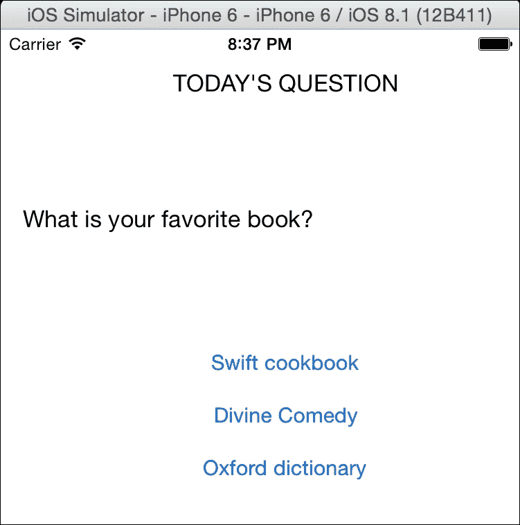

1.  现在是时候实现投票动作了。想法是检查哪个按钮被按下，然后将这个信息连同设备 ID 一起发送到数据库。这样我们的投票就会被记录：

    ```swift
       @IBAction func vote(sender: UIButton) {
            var answer:Int
            switch sender {
            case answer1button:
                answer = 0
            case answer2button:
                answer = 1
            case answer3button:
                answer = 2
            default:
                return
            }
            // input
            var params = ["answer":"\(answer)", "uid":UIDevice.currentDevice().identifierForVendor.UUIDString] as Dictionary<String, String>
            var request = NSMutableURLRequest(URL: NSURL(string: baseurl + "_design/voting/_update/addvote/\(documentId!)")!)
            request.HTTPMethod = "POST"
            do {
            request.HTTPBody = try NSJSONSerialization.dataWithJSONObject(params, options: nil)
        } catch {
            let alert = UIAlertController(title: "Error", message: "Error getting HTTP header", preferredStyle:.Alert)
            self.presentViewController(alert, animated: true, completion: nil)
        }
            request.addValue("application/json", forHTTPHeaderField: "Content-Type")
            request.addValue("application/json", forHTTPHeaderField: "Accept")
            var task = NSURLSession.sharedSession().dataTaskWithRequest(request, completionHandler: {data, response, error -> Void in
                UIAlertView(title: nil, message: "Thanks for voting", delegate: nil, cancelButtonTitle: "OK").show()
            })
            task.resume()
        }
    ```

1.  应用程序已经完成，所以现在我们必须检查它与数据库的正确通信。再次按下播放按钮并选择一个答案。你应该收到一个感谢你的警报视图，这是一个好兆头。之后，再次打开网页浏览器并打开所选文档；检查你的设备 ID 是否在所选答案中：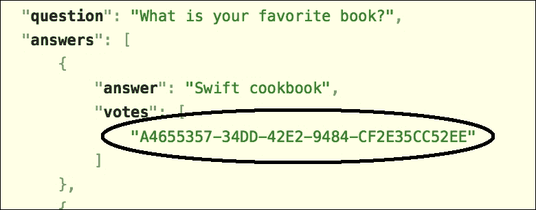

## 它是如何工作的…

如果你曾经与远程 SQL 数据库合作过，你可能知道通常你需要一个驱动器/连接器，它应该与你的平台兼容，也可能被某些防火墙阻止。

CouchDB 是一个通过 http 协议交换 JSON 消息工作的 NoSQL 数据库，这使得我们的生活更加容易，因为我们不需要添加任何控制器，只需接收和发送 JSON 消息。由于这个数据库的工作方式，我们不得不在客户端开发一个用于更新/插入新投票的函数；记住，Swift 不是 JavaScript：将新元素添加到 JSON 数组中可能会给我们带来比开发一个简单的函数更多的工作。

为什么我们不得不几次将`NSArray`和`NSDictionary`转换为类型？原因是`NSJSONSerialization`是在 Objective-C 时代创建的，这意味着它仍然不是 100%为 Swift 准备的。

诚然，我们工作的方式可能组织得更好。理想的方式是创建一个 CouchDB 层，比如一个框架或库，然而这项任务将被留作家庭作业。

## 还有更多…

在这一章中，我们学习了在 Swift 中使用数据库的不同方法；其中一些非常直接，而另一些则需要更好的分析。

在下一章中，我们将学习一些新的技巧，主要是与新的 Xcode 6 和 iOS 8 相关的新技巧。
