# 第一章 创建型模式

创建型模式旨在处理软件设计中的对象创建机制。使用这些模式后，系统变得独立于对象的创建方式，这意味着它独立于具体类的实例化方式。

这些模式封装了具体类的使用，并倾向于在对象之间的关系中使用接口，从而允许更好地抽象全局系统概念。

因此，如果我们分析**单例**模式，这是一个旨在仅实例化类的一个实例的模式，我们发现控制对这一实例唯一访问的机制完全封装在类中，这意味着这对消耗类实例的客户是完全透明的。

在本章中，我们将向您介绍五种创建型模式，并讨论如何使用 Swift 来应用它们：

+   原型模式

+   工厂方法模式

+   单例模式

+   抽象工厂模式

+   构建者模式

这些模式的目标在以下表格中描述：

| 模式 | 目标 |
| --- | --- |
| 原型模式 | 此模式允许您通过复制称为原型的现有对象来创建新对象。此模式具有克隆能力。 |
| 工厂方法模式 | 此模式向您介绍一个抽象方法，允许您通过告诉其子类关于对象有效创建的信息来创建对象。 |
| 单例模式 | 此模式确保一个类只有一个实例。此类提供了一个唯一的访问点，返回此实例。 |
| 抽象工厂模式 | 此模式允许您创建一个对象，该对象通过隐藏创建这些对象所需的具体类来按家族分组。 |
| 构建者模式 | 此模式允许您将复杂对象的创建与其实现分离。这允许客户端创建具有不同表示的复杂对象。 |

# 原型模式

我们首先介绍的是原型模式；我们将看到如何使用它来加速实例的创建。我们将看到如何使用它来复制现有实例，最终，我们将看到如何根据我们的需求修改新实例。

## 角色

原型模式通过复制称为**原型**的现有对象来创建新对象，并且它们具有克隆能力。

此模式在以下用例中使用：

+   当您需要创建一个实例，而不知道类的层次结构时

+   当您需要创建动态加载的类实例时

+   当您需要一个简单的对象系统，而不包括工厂类的并行层次结构时

## 设计

以下图显示了原型模式的通用类：

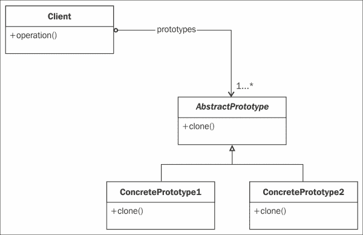

## 参与者

参与者到这个模式如下：

+   `Client`：这个类包含了一个对象列表，这些对象是`AbstractPrototype`抽象类的实例。`Client`类需要克隆这些原型，而无需了解它们的内部结构和子类层次结构。

+   `AbstractPrototype`：这是一个可以自我复制的抽象类。这个类包含一个名为`clone()`的克隆方法。

+   `ConcretePrototype1`和`ConcretePrototype2`：这些是继承自`AbstractPrototype`类的具体类。它们定义了一个原型，并且都有一个名为`clone()`的克隆方法。

## 协作

客户端请求一个或多个原型进行自我克隆。

## 插图

一个简单且真实的例子是来自*Blizzard*（*魔兽世界*的创造者）的著名游戏*炉石传说*。在这款策略卡牌游戏中，当你使用“法力”来使用法术、武器或将随从放在场上时，有一个特殊的随从具有克隆特定卡牌的能力。当玩家使用这张卡牌时，它会选择玩家想要克隆的随从，并且这张卡牌成为所选卡牌的精确副本。以下卡片代表具有这种行为的“炉石传说”卡牌：

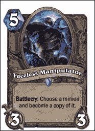

## 实现

以下代码展示了使用 Swift 实现该模式的代码示例：

```swift
import UIKit

class AbstractCard {
  var name: String?
  var mana: Int?
  var attack: Int?
  var defense: Int?

  init(name:String?, mana:Int?, attack:Int?, defense:Int?) {
    self.name = name
    self.attack = attack
    self.defense = defense
    self.mana = mana
  }

  func clone() -> AbstractCard {
    return AbstractCard(name: self.name, mana: self.mana, attack: self.attack, defense: self.defense)
  }
}

class Card: AbstractCard {

  override init(name:String?, mana:Int?, attack:Int?, defense:Int? ) {
    super.init(name: name,mana: mana,attack: attack,defense: defense)

  }
}
```

### 注意

`AbstractPrototype`类是我们的`AbstractCard`类，我们在其中实现了一种使用`clone()`方法返回自身副本的方式。

## 用法

以下代码模拟了客户端如何与实现原型模式的`Card`对象交互：

```swift
// Simulate our client

// This is the card that we will copy
let raidLeader = Card(name: "Raid Leader", mana: 3, attack: 2, defense: 2)

// Now we use our faceless Manipulator card to clone the raidleader
let facelessManipulator = raidLeader.clone()

print("\(facelessManipulator.name, facelessManipulator.mana, facelessManipulator.attack, facelessManipulator.defense)")
```

由于代码是写在 Playground 文件中的，你应该将其视为你将放入`Client`类中的代码。

首先，我们实例化一个新的卡牌名为`Raid Leader`。这是一个具体原型类。假设你有一张“无面操纵者”卡牌，并且你想用它来克隆`Raid Leader`卡牌，那么你只需使用`raidLeader.clone()`方法，这将返回一个具有与`Raid Leader`完全相同属性的新的实例。

通过检查 Playground 文件右侧的细节，你会看到`facelessManipulator`常量与`raidLeader`（第 39 行）具有完全相同的属性，如下面的截图所示：

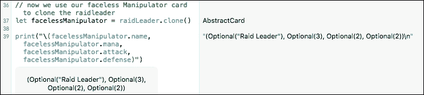

# 工厂方法模式

我们的第二个模式是一个非常著名的模式。它介绍了著名的概念：“面向接口编程，而不是面向实现。”实例化是在工厂类中完成的，该类依赖于我们需要的类型以及需要返回给客户端的类型。

## 角色

工厂方法模式是软件设计中用得最多的模式之一。这个模式的目的在于抽象对象的创建。工厂方法允许一个类将实例化推迟到子类。

你会时不时地看到我们提到“面向接口编程”。这正是这个模式所做的事情。在 Swift 中，你将使用“协议”而不是类本身来代替接口。

此模式在以下用例中使用：

+   一个类只知道与其有某些关系的抽象类或接口的对象

+   一个类希望其子类实例化对象以利用多态机制

## 设计

以下图展示了工厂方法模式的通用类：

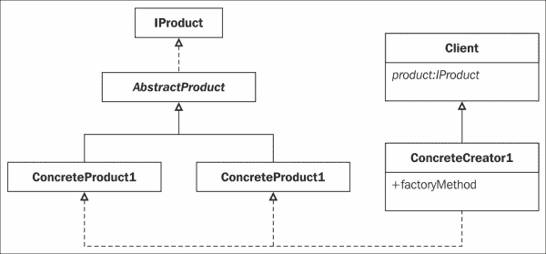

## 参与者

参与该模式的参与者如下：

+   **产品接口**：此类包含我们产品的定义。在这里我们将定义什么是卡片。

+   **抽象产品**：此抽象类实现了我们卡片的签名和一些方法。你会看到我们保留了原型模式，这允许我们最终克隆一个卡片。这些类定义了产品的属性。

+   **具体产品**：此类定义了我们的产品；在我们的例子中，`Raid Leader`卡片是一个具体产品，例如`Faceless Manipulator`卡片。

+   **具体创建者**：此类实现了我们的工厂方法。

## 示例

在我们之前的模式中，你会看到以下行：

```swift
let raidLeader = Card(name: "Raid Leader", mana: 3, attack: 2, defense: 2)
```

这里，我们直接编写实现。我们需要一种创建一些卡片的方法，但不知道确切如何构建卡片；我们只能告诉创建`raidLeader`和`Faceless Manipulator`卡片。在这个时候，客户端不想知道`Raid Leader`卡片需要三个法力值，所以它提供了两个攻击点和两个防御点。

## 实现方式

工厂方法模式的具体实现如下：

```swift
import UIKit
import Foundation

//Define what a card is
protocol Card {
  var name: String? {get set}
  var attack: Int? {get set}
  var defense: Int? {get set}
  var mana: Int? {get set}
  func clone() -> Card
  func toString() -> String
}

// AbstractCard
// implements the signature and some properties
class AbstractCard: NSObject, Card {
  private var _name: String?
  private var _mana: Int?
  private var _attack: Int?
  private var _defense: Int?

  init(name: String?, mana: Int?, attack: Int?, defense: Int?) {
    self._name = name
    self._attack = attack
    self._defense = defense
    self._mana = mana
    super.init()
  }

  override init(){
    super.init()
  }

  //property name
  var name: String?{
    get{ return _name }
    set{ _name = newValue }
  }

  //property mana
  var mana: Int? {
    get{ return _mana }
    set{ _mana = newValue }
  }

  //property attack
  var attack: Int? {
    get{ return _attack }
    set{ _attack = newValue }
  }

  //property attack
  var defense: Int? {
    get{ return _defense }
    set{ _defense = newValue }
  }

  func clone() -> Card {
    return AbstractCard(name: self.name, mana: self.mana, attack: self.attack, defense: self.defense)
  }

  func toString() -> String{
    return ("\(self.name, self.mana, self.attack,self.defense)")
  }
}

enum CardType {
  case FacelessManipulator, RaidLeader
}

// our Factory Class
// Depending what we need, this class return an instance of the 
// appropriate object.
class CardFactory{
  class func createCard(cardtype: CardType) -> Card?{

    switch cardtype {
    case .FacelessManipulator:
      return FacelessManipulatorCard()
    case .RaidLeader:
      return RaidLeaderCard()
    default:
      return nil
    }
  }
}

//Concrete Card "Raid Leader"
//This is the full definition of the Raid Leader Card
class RaidLeaderCard: AbstractCard {
  override init()
  {
    super.init()
    self._mana = 3
    self._attack = 2
    self._defense = 2
    self._name = "Raid Leader"
  }
}

//Concrete Card "Faceless Manipulator"
//this is the full definition of the FacelessManipulator Card.
class FacelessManipulatorCard: AbstractCard {
  override init()
  {
    super.init()
    self._mana = 5
    self._attack = 3
    self._defense = 3
    self._name = "Faceless Manipulator"

  }
}
```

## 用法

为了模拟客户端使用工厂方法模式，我们可以将卡片创建编写如下：

```swift
//simulate our client

var c = CardFactory.createCard(.FacelessManipulator)
c?.toString()
```

### 注意

为了模拟我们的客户端，我们只需告诉`CardFactory`方法我们想要一个`FacelessManipulator`卡片。

要做到这一点，我们使用`createCard`方法（我们的工厂方法），此方法将委派请求的卡片的实例化。

变量`c`的类型是`Card`而不是`FacelessManipulator`。

# 单例模式

这种模式无疑是每个开发者首先学习的模式。它通常与工厂或抽象工厂类一起使用，以确保只有一个类的实例。

## 角色

单例模式确保一个类只有一个实例，并提供一个全局访问点，此时它返回该类的实例。

在某些情况下，拥有只有一个实例的类可能很有用；例如，在抽象工厂的情况下，拥有多个实例是没有用的。

## 设计

以下图展示了单例模式的通用 UML 类图。使用 Swift 编写单例模式有许多方法。

这里，我们使用最简单的方法来做这件事。使用 Swift，你会发现我们可以通过类常量来改变我们应用它的方式：

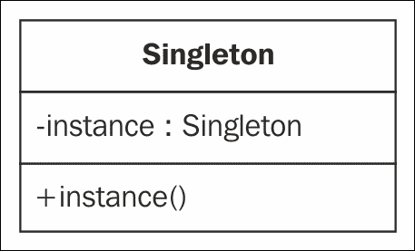

## 参与者

这个模式只有一个参与者：`Singleton`类。

这个类提供了一个返回类唯一实例的方法。该机制锁定其他实例的创建。它是在 Swift 1.2 中引入的。我们现在可以使用类常量。

使用 Swift 1.2，我们将使用类常量来为我们提供一种确保实例唯一创建的方法。

类常量定义如下：

```swift
static let myVariable = myObject()
```

## 协作

每个客户端都可以通过调用`Instance`方法来访问`Singleton`类的唯一实例。

使用 Swift，我们将考虑的方法是使用类常量来访问我们的`Singleton`类的唯一实例，我们将称之为`sharedInstance`。

## 示例

您正在开发您的卡牌游戏，并且需要管理当前游戏的所有数据。在我们的游戏中，我们有两个玩家；每个玩家都有一个牌组、法力储备、名字等等。我们有一个棋盘（我们放置卡牌的桌子）和一个游戏状态（谁正在玩）。为了管理所有这些信息，您需要一个`BoardManager`类。这个类将是一个单例类，因为我们不会同时有几个棋盘（我们只允许同时进行一个游戏）。单例模式可以是一个有趣的概念，可以在这里使用，以确保我们访问正确的数据。

## 实现

以下方法支持懒初始化，并且由于`let`的定义，它是线程安全的：

```swift
import UIKit

class BoardGameManager {

  static let sharedInstance = BoardGameManager()
  init() {
    println("Singleton initialized");
  }

}
```

## 用法

要使用我们的单例对象，每个客户端都将使用以下代码来访问它：

```swift
let boardManager = BoardGameManager.sharedInstance
```

`boardManager`变量包含我们单例对象中所有可用的成员，并且只初始化一次。

这种模式在以下情况下使用：

+   我们必须只有一个类的实例

+   这个实例必须从众所周知的访问点对客户端可访问。

# 抽象工厂模式

我们已经向您介绍了一个在设计模式中非常流行的概念：**工厂**。工厂是处理相关对象实例化的类，而不需要子类化。我们已经看到的工厂方法模式隐藏了对象实例化的类名。抽象工厂模式更完整，因为它创建相关或依赖对象的系列。

## 角色

抽象工厂模式旨在构建分组在家族中的对象，而不需要知道创建对象所需的具体类。

这种模式通常在以下领域使用：

+   使用产品的系统需要保持独立于这些产品如何分组和实例化

+   一个系统可以有多个可以演化的产品系列

## 设计

以下图表示抽象工厂模式的通用结构。您将看到产品和家庭是如何解耦的：

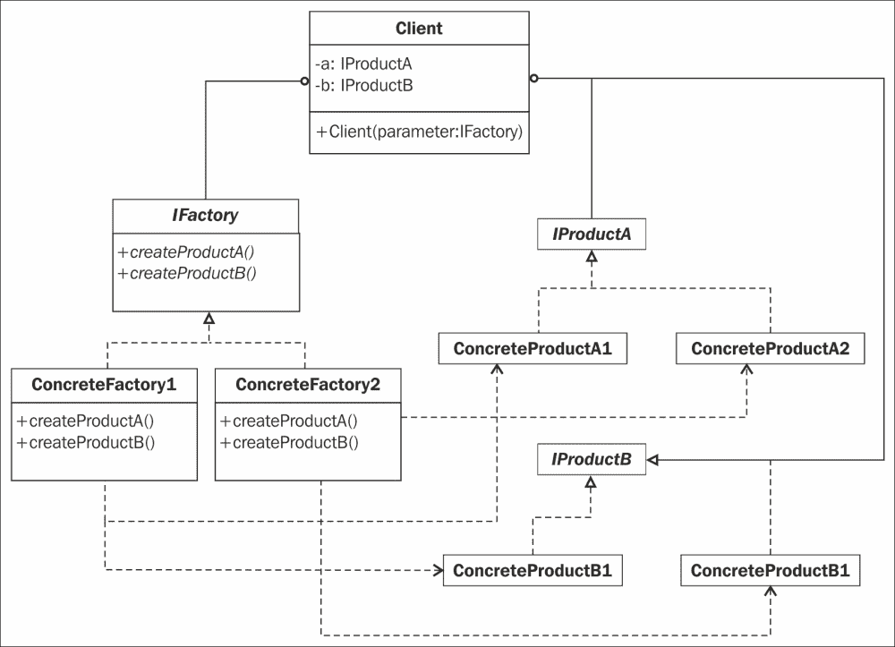

## 参与者

抽象工厂模式有很多参与者：

+   `Abstract Factory`：这个抽象类定义了创建我们产品的不同方法的签名。

+   `ConcreteFactory1` 和 `ConcreteFactory2`：这些是我们实现每个产品家族方法的具体类。通过了解家族和产品，工厂能够为该家族创建一个产品实例。

+   `IProductA` 和 `IProductB`：这些是我们定义的接口，它们定义了独立于其家族的产品。家族在其具体子类中引入。

+   `ProductA` 和 `ProductB`：这些是分别实现 `IProductA` 和 `IProductB` 的具体类。

## 协作

`Client` 类使用一个具体工厂的一个实例，通过抽象工厂的接口创建产品。

## 插图

我们的公司专门从事制造手表。我们的手表由两部分组成：表带和表盘。我们的手表有两种尺寸，因此我们必须根据我们手表的尺寸调整表带和表盘的制造。

为了简化我们手表制造的管理，方向团队决定使用一家专门生产适应我们手表 38 毫米型号产品的制造商，以及另一家其产品适应我们手表 42 毫米型号的制造商。

这些制造商中的每一个都将构建适应手表尺寸的表盘和表带。

## 实现

为了实现我们的模式，我们首先需要确定我们的参与者。两个制造商代表 `ConcreteFactory1` 和 `ConcreteFactory2` 类。这两个工厂实现了 `AbstractFactory` 方法，这告诉我们我们可以创建一个表带或表盘。当然，具体工厂将创建适应该工厂生产的表尺寸的表盘。

我们的 `ConcreteProductA` 和 `ConcreteProductB` 类是表带和表盘；每个产品都实现了它们各自的 `IProductA` 和 `IProductB` 接口，如下面的代码所示：

```swift
import UIKit

//Our interfaces
protocol IWatchBand {
  var color: UIColor{get set}
  var size: BandSize{get set}
  var type: BandType{get set}
  init(size: BandSize)
}

protocol IWatchDial {
  var material: MaterialType{get set}
  var size: WatchSize{get set}
  init(size: WatchSize)
}

//Enums
enum MaterialType: String {
  case Aluminium = "Aluminium",
  StainlessSteel = "Stainless Steel",
  Gold = "Gold"
}

enum BandType: String {
  case Milanese = "Milanese",
  Classic = "Classic",
  Leather = "Leather",
  Modern = "Modern",
  LinkBracelet = "LinkBracelet",
  SportBand = "SportBand"
}

enum WatchSize: String {
  case _38mm = "38mm", _42mm = "42mm"
}

enum BandSize: String {
  case SM = "SM", ML = "ML"
}

//prepare our Bands components
class MilaneseBand: IWatchBand {
  var color = UIColor.yellowColor()
  var size: BandSize
  var type = BandType.Milanese
  required init(size _size: BandSize) {
    size = _size
  }
 }

class Classic: IWatchBand {
  var color = UIColor.yellowColor()
  var size: BandSize
  var type = BandType.Classic
  required init(size _size: BandSize) {
    size = _size
  }
}
class Leather:IWatchBand{
  var color = UIColor.yellowColor()
  var size:BandSize
  var type = BandType.Leather
  required init(size _size: BandSize) {
    size = _size
  }
}
class Modern: IWatchBand {
  var color = UIColor.yellowColor()
  var size: BandSize
  var type = BandType.Modern
  required init(size _size: BandSize) {
    size = _size
  }
}

class LinkBracelet: IWatchBand {
  var color = UIColor.yellowColor()
  var size: BandSize
  var type = BandType.LinkBracelet
  required init(size _size: BandSize) {
    size = _size
  }
}
class SportBand: IWatchBand {
  var color = UIColor.yellowColor()
  var size: BandSize
  var type = BandType.SportBand
  required init(size _size: BandSize) {
    size = _size
  }
}

//Dials
class AluminiumDial: IWatchDial {
  var material: MaterialType = MaterialType.Aluminium
  var size: WatchSize
  required init(size _size:WatchSize){
    size = _size
  }
}

class StainlessSteelDial: IWatchDial {
  var material: MaterialType = MaterialType.StainlessSteel
  var size: WatchSize
  required init(size _size:WatchSize){
    size = _size
  }
}

class GoldDial: IWatchDial {
  var material: MaterialType = MaterialType.Gold
  var size: WatchSize
  required init(size _size:WatchSize){
    size = _size
  }
}

//Our AbstractFactory
class WatchFactory {

  func createBand(bandType: BandType) -> IWatchBand {
    fatalError("not implemented")
  }
  func createDial(materialtype: MaterialType) -> IWatchDial{
    fatalError("not implemented")
  }

  //our static method that return the appropriated factory.
  final class func getFactory(size: WatchSize) -> WatchFactory{
    var factory: WatchFactory?
    switch(size){
    case ._38mm:
      factory = Watch38mmFactory()
    case ._42mm:
      factory = Watch42mmFactory()
    }
    return factory!
  }

}

// Concrete Factory 1 for 42 mm
class Watch42mmFactory: WatchFactory {
  override func createBand(bandType: BandType) -> IWatchBand {
    switch bandType {
    case .Milanese:
      return MilaneseBand(size: .ML)
    case .Classic:
      return Classic(size: .ML)
    case .Leather:
      return Leather(size: .ML)
    case .LinkBracelet:
      return LinkBracelet(size: .ML)
    case .Modern:
      return Modern(size: .ML)
    case .SportBand:
      return SportBand(size: .ML)
    default:
      return SportBand(size: .ML)
    }
  }

  override func createDial(materialtype: MaterialType) -> IWatchDial {
    switch materialtype{
    case MaterialType.Gold:
      return GoldDial(size: ._42mm)
    case MaterialType.StainlessSteel:
      return StainlessSteelDial(size: ._42mm)
    case MaterialType.Aluminium:
      return AluminiumDial(size: ._42mm)
    }
  }
}

//Concrete Factory 2 for 38mm
class Watch38mmFactory: WatchFactory{
  override func createBand(bandType:BandType) -> IWatchBand {
    switch bandType {
    case .Milanese:
      return MilaneseBand(size: .SM)
    case .Classic:
      return Classic(size: .SM)
    case .Leather:
      return Leather(size: .SM)
    case .LinkBracelet:
      return LinkBracelet(size: .SM)
    case .Modern:
      return Modern(size: .SM)
    case .SportBand:
      return SportBand(size: .SM)
    default:
      return SportBand(size: .SM)
    }
  }

  override func createDial(materialtype: MaterialType) -> IWatchDial {
    switch materialtype{
    case MaterialType.Gold:
      return GoldDial(size: ._38mm)
    case MaterialType.Gold:
      return StainlessSteelDial(size: ._38mm)
    case MaterialType.Gold:
      return AluminiumDial(size: ._38mm)
    default:
      return AluminiumDial(size: ._38mm)

    }
  }
}
```

## 使用方法

为了模拟我们的客户端，我们将使用以下代码：

```swift
//Here we deliver products from the Manufacture 1 specialized in
//products for the 38 mm Watch
let manufacture1 = WatchFactory.getFactory(WatchSize._38mm)
let productA = manufacture1.createBand(BandType.Milanese)
productA.color
productA.size.rawValue
productA.type.rawValue

let productB = manufacture1.createDial(MaterialType.Gold)
productB.material.rawValue
productB.size.rawValue

//Here we delivers products from the Manufacture 2 specialized in
//products for the 42 mm Watch
let manufacture2 = WatchFactory.getFactory(WatchSize._42mm)
let productC = manufacture2.createBand(BandType.LinkBracelet)
productC.color
productC.size.rawValue
productC.type.rawValue

let productD = manufacture2.createDial(MaterialType.Gold)
productD.material.rawValue
productD.size.rawValue
```

### 小贴士

**下载示例代码**

您可以从您在 [`www.packtpub.com`](http://www.packtpub.com) 的账户下载所有已购买的 Packt 出版物的示例代码文件。如果您在其他地方购买了此书，您可以访问 [`www.packtpub.com/support`](http://www.packtpub.com/support) 并注册，以便将文件直接通过电子邮件发送给您。

操场文件将显示我们的产品属性，具体取决于使用的工厂。以下截图显示了 `manufacture1` 对象的产品 *A*（表带）和产品 *B*（表盘）的详细信息：

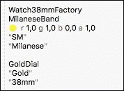

以下截图显示了 `manufacture2` 对象的产品 *C*（表带）和产品 *D*（表盘）的详细信息：

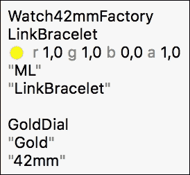

表带和表盘的尺寸将适应提供产品的制造商。

### 注意

我们应该使用单例模式来确保我们只有一个抽象工厂的实例。这个实例可以在多个客户端之间共享。

# 构建模式

与会生产同一家族产品部分的抽象工厂模式不同，构建模式将帮助我们构建由多个部分组成的最终产品。

## 角色

构建模式的主要目的是将复杂对象的构建过程与其实际构建过程抽象化。具有相同的构建过程可以创建不同表示的产品。

此模式可用于以下情况：

+   客户需要构建复杂对象，而不必了解其实现

+   客户需要构建需要具有多个实现或表示的复杂对象

## 设计

以下图展示了构建模式的通用 UML 类图：

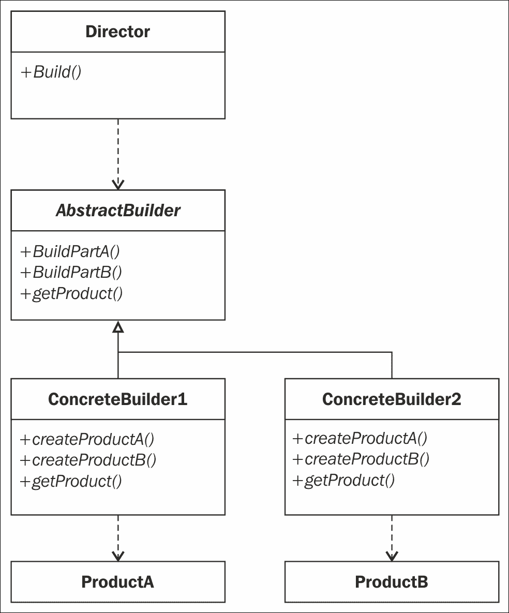

## 参与者

此模式相当简单，因为它只有少数参与者：

+   `Director`：此类使用`AbstractBuilder`类的接口构建产品。

+   `AbstractBuilder`：此类定义了构建产品所有部分的签名方法，并包含一个返回构建完成后的产品的签名方法。

+   `ConcreteBuilder`：这是实现`AbstractBuilder`类方法的`Concrete`类。

+   `Product`：这是最终产品。产品包含手表的所有部分。

## 协作

客户创建`ConcreteBuilder`和`Director`类。然后，如果客户要求，`Director`类将通过调用构造函数构建一个对象，并将最终产品返回给客户。

## 示例

使用`AbstractFactory`方法，我们可以使用构建模式来构建手表。正如我们所见，手表有几个部分：表盘和表带。手表还可以有两种尺寸，正如我们之前所看到的，表盘或表带的表示也取决于手表的尺寸。

## 实现

如果我们想要构建一些由表盘和表带表示的表，我们将定义一个`Director`类，该类将定义我们手表所有部分的构建顺序，并将最终完成的手表返回给客户。

`Director`类将调用所有负责构建手表一个部分的构造函数。为了实现这一点，我们将重用抽象工厂模式的现有代码，并添加以下代码。

在 Xcode 中打开`Builder.playground`文件，查看文件底部的添加代码：

```swift
//Our builder1
class BuilderGoldMilanese38mmWatch: AbstractWatchBuilder {
  override func buildDial() {
    watch.band = MilaneseBand(size: BandSize.SM)
  }
  override func buildBand() {
    watch.dial = GoldDial(size: WatchSize._38mm)
  }
}

//Our builder2
class BuilderAluminiumSportand42mmWatch:AbstractWatchBuilder {
  override func buildDial() {
    watch.band = SportBand(size: BandSize.ML)
  }
  override func buildBand() {
    watch.dial = AluminiumDial(size: WatchSize._42mm)
  }
}

//our Director class
class Director {
  var builder: AbstractWatchBuilder?
  init(){

  }

  func buildWatch(builder: AbstractWatchBuilder){
    builder.buildBand()
    builder.buildDial()
  }
}
```

## 用法

为了模拟我们的客户，我们将告诉我们的导演创建两块手表：

+   一款直径 42 毫米的铝合金表盘配运动表带

+   一款直径 38 毫米的金色表盘配米兰尼斯表带

示例代码如下：

```swift
//We will build 2 Watches :
//First is the Aluminium Dial of 42mm with Sport Band
let director = Director()
var b1 = BuilderAluminiumSportand42mmWatch()
director.buildWatch(b1)

// our watch 1
var w1 = b1.getResult()
w1.band?.color
w1.band?.type.rawValue
w1.band?.size.rawValue
w1.dial?.size.rawValue
w1.dial?.material.rawValue

//Our 2nd watch is a Gold 38mm Dial with Milanese Band
var b2 = BuilderGoldMilanese38mmWatch ()
director.buildWatch(b2)

// Our watch 1
var w2 = b2.getResult()
w2.band?.color
w2.band?.type.rawValue
w2.band?.size.rawValue
w2.dial?.size.rawValue
w2.dial?.material.rawValue
```

结果在 Playground 中显示如下：

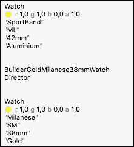

### 注意

Swift 允许使用闭包来简化我们复杂对象的创建。关于我们之前提供的示例，我们可以编写以下代码来构建我们的两个手表。

## 使用闭包的实现

在这里，我们不需要使用`Director`和`ConcreteBuilder`类。相反，我们将告诉我们的`Watch`类，构建器将在闭包中。

在前面的示例中，移除`Director`、`AbstractBuilder`和`ConcreteBuilder`类。

我们只需要编写如下的`Watch`类，如下代码所示（你可以在伴随本章的`BuilderClosures.playground`文件中找到以下代码）：

```swift
//our Product Class : a Watch
//The builder will be in the closure
class Watch{
  var dial:IWatchDial?
  var band:IWatchBand?
  typealias buildWatchClosure = (Watch) -> Void

  init(build:buildWatchClosure){
    build(self)
  }
}
```

然后，为了模拟我们的客户端，我们可以编写以下代码，该代码将调用分配给`Watch`对象带或表盘属性的适当构造函数：

```swift
//Simulate our clients

let Gold42mmMilaneseWatch = Watch(build: {
  $0.band = MilaneseBand(size: BandSize.ML)
  $0.dial = GoldDial(size: WatchSize._42mm)
})
```

结果如下：

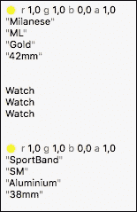

# 概述

好吧，我希望这一章对使用 Swift 的模式进行了良好的介绍。我们学习了五种创建型模式：原型模式、工厂方法模式、单例模式、抽象工厂模式和建造者模式。我们还学习了何时使用它们以及如何实现它们。

在下一章中，我们将向您介绍三种旨在简化实体之间关系的结构模式。
