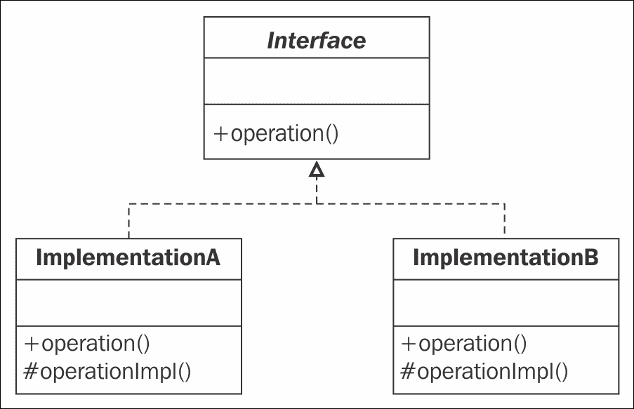
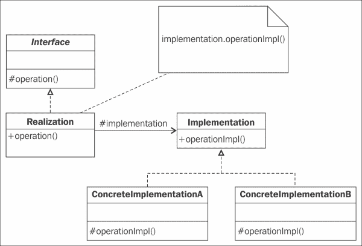
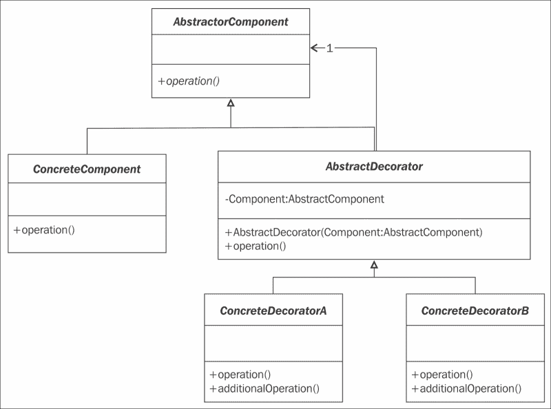
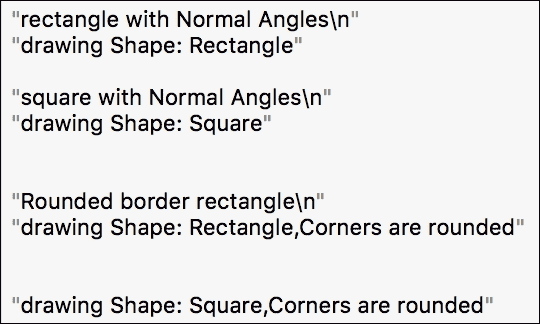
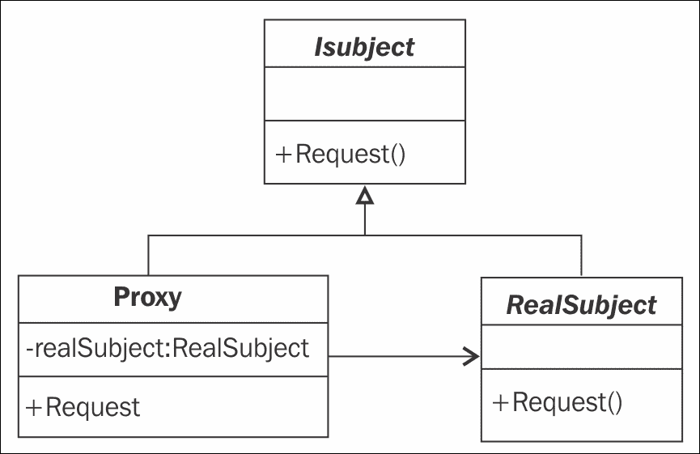
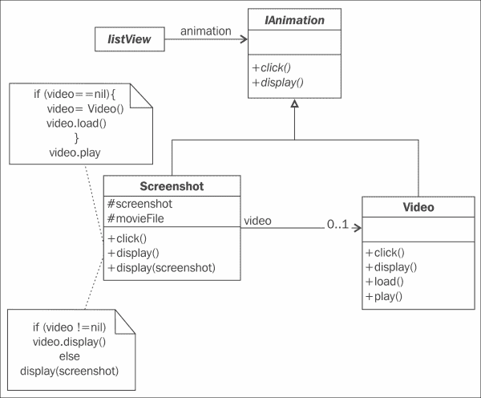
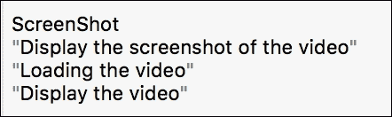
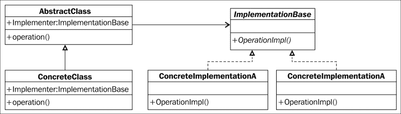
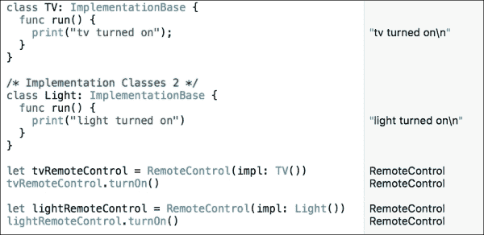

# 第二章 结构型模式 - 装饰器、代理和桥接

在上一章回顾了五种创建型模式之后，我们现在将讨论另一类模式：结构型模式。有七个模式要讨论；这些模式通过识别实体之间关系实现的一种简单方式来简化设计。

我们将看到这些模式如何通过使用接口来封装对象的组合，从而方便地抽象你的系统，就像创建型模式封装对象的创建一样。结构型模式强调了接口的使用。

你将看到组合是如何设计的；我们不会干扰对象本身，而是会干扰那个将传递结构化的对象。这个第二个对象与第一个对象有很强的关联。确实，第一个对象向客户端展示接口并管理它与第二个对象的关系，而第二个对象管理组合，并且不与客户端有任何接口。

需要注意的一个重要事项是，这种结构化通过允许动态修改组合，为你的系统提供了极大的灵活性。确实，如果两个对象继承自相同的类并使用相同的接口，我们可以用另一个对象替换它。

# 静态和动态组合

我们可以有几种可能的实现。设计这种模式的一种经典方法是区分这些实现，在子类中。在这种情况下，我们将提供一个接口，我们的类将实现这个接口。

这种解决方案由静态组合组成。确实，一旦选择了对象的实现类，我们就不能再更改它。下面的图展示了通过继承实现对象的实现：



另一种方法是将在另一个对象中分离实现。实现部分由`ConcreteImplementationA`类的实例或`ConcreteImplementationB`类管理。这个引用通过`implementation`属性进行引用。这个实例可以在运行时轻松地被另一个实例所替代。这种组合是动态的。

下面的 UML 类图清楚地展示了如何使用动态组合来结构化你的对象。`ConcreteImplementation`类可以在运行时切换，而不需要修改`Realization`对象。

我们最终可以修改实现对象，而不需要修改原始对象，如下面的图所示：



在本章中，你将看到如何使用桥接模式来使用这个解决方案。

结构型模式的研究将跨越三章。在本章中，我们将介绍其中的三个：

+   装饰器模式

+   代理模式

+   桥接模式

这三种模式提供了一种动态添加状态和行为的机制，控制对象的创建和访问，并保持规范和实现分离。

本章我们将看到的三个结构模式的目的是在以下表格中描述：

| 模式 | 目标 |
| --- | --- |
| 装饰者模式 | 这种模式允许您动态地向对象添加新的行为和功能。 |
| 代理模式 | 这种模式是另一个对象的替代品。它提供了一种可以适应优化或安全需求的行为。 |
| 桥接模式 | 这种模式解耦了抽象与其实现，使它们能够独立变化。 |

# 装饰者模式

我们将要讨论的第一个结构模式是装饰者模式。它通过添加新的功能或行为来介绍对象替代。

## 角色

这种模式的主要目标是动态地向对象添加新的功能。对象的接口将不会修改，因此从客户端的角度来看，这是完全透明的。

这种模式是向父类添加功能的子类添加的替代品。装饰者模式的一个关键实现点是装饰者既继承原始类，又包含其实例。

这种模式可以在以下情况下使用：

+   一个系统可以动态地向对象添加新的功能，而不必修改其接口，这意味着不必修改该对象的客户端

+   一个系统管理可以动态移除的行为

+   由于已经有一个复杂的类层次结构，使用继承不是一个好的选择

## 设计

装饰者模式的通用 UML 类图相当简单：`ConcreteComponent` 和 `AbstractDecorator` 类共享相同的接口，具有相同的方法名。我们的 `AbstractDecorator` 类定义了一个构造函数，其中我们传递我们的 `Abstractcomponent` 类作为参数。然后，在我们的 `ConcreteDecorator` 类中，我们将操作调用重定向到 `additionalOperation` 方法，以向原始组件添加新的功能或行为，如图所示：



## 参与者

在前面的图中，这个模式中有四个参与者：

+   `AbstractComponent`：这是组件和装饰器的公共接口。

+   `ConcreteComponent`：这是我们想要添加行为和/或功能的主要对象。

+   `AbstractDecorator`：这个抽象类包含对组件的引用。

+   `ConcreteDecoratorA` 和 `ConcreteDecoratorB`：这些是 `AbstractDecorator` 的具体子类。这些类实现了添加到组件的功能。

## 协作

当装饰者收到必须到达组件的消息时，它会通过先前的或后续操作将该消息重定向。

## 样例

为了说明这个模式，我们将举一个简单的例子。假设你有一个绘图软件，它允许你在屏幕上绘制一些形状：一个矩形和一个正方形。

你已经知道如何绘制这些形状。现在，你需要添加一个新功能，该功能将为你的形状添加一个圆角。为此，你需要决定使用哪种装饰器模式，这将允许你不对现有类方法签名进行干扰。

## 实现

首先，我们将创建我们的界面，它定义了形状。我们将模拟一个 `Draw()` 操作。实际上，该方法将返回一个字符串，告诉我们绘制了什么：

```swift
protocol IShape {
  func draw() -> String
}
```

现在，我们将创建我们的两个具体类，它们实现了 `IShape` 接口。我们将有 `Square` 和 `Rectangle` 类。它们都实现了 `draw` 函数。此函数返回当前绘制的形状：

```swift
class Square: IShape {
  func draw() -> String{
    return "drawing Shape: Square"
  }
}

class Rectangle: IShape {
  func draw() -> String {
    return "drawing Shape: Rectangle"
  }
}
```

我们已经准备好了类；现在，我们准备我们的抽象 `ShapeDecorator` 类，该类定义了我们未来具体装饰器的结构。这个类也实现了 `IShape` 接口，因此 `Draw()` 函数必须存在。然而，Swift 没有抽象类，所以我们实现了 draw 方法，但强制抛出异常来告诉我们必须实现此方法。`ShapeDecorator` 类本身不会被客户端使用。客户端将调用 `ConcreteDecorator` 对象来为其形状添加新功能：

```swift
class ShapeDecorator: IShape {
  private let decoratedShape: IShape

  required init(decoratedShape: IShape){
    self.decoratedShape = decoratedShape
  }

   func draw() -> String {
    fatalError("Not Implemented")
  }
}
```

现在，我们添加我们的具体装饰器类，该类继承自 `ShapeDecorator` 抽象类。我们将新的 `setRoundedCornerShape` 功能添加到这个类中，并重写 `draw` 函数以返回绘制的形状，但具有圆角：

```swift
class RoundedCornerShapeDecorator: ShapeDecorator{
  required init(decoratedShape: IShape) {
       super.init(decoratedShape: decoratedShape)
  }

  override func draw() ->String{
    //we concatenate our shape properties
     return  decoratedShape.draw() + "," + setRoundedCornerShape(decoratedShape)
  }

  func setRoundedCornerShape(decoratedShape: IShape) -> String{
    return "Corners are rounded"
  }
}
```

## 使用

现在，这是容易的部分，它展示了从客户端的角度如何使用我们已编写的所有代码。

我们首先创建我们的两个具体形状：

```swift
let rectangle = Rectangle()
let square = Square()
```

现在，我们想要一些具有圆角的形状。为此，我们只需调用我们感兴趣的 `ConcreteDecorator` 类，即 `RoundedCornerShapeDecorator` 类，并将新的形状（`Rectangle` 或 `Square`）作为构造函数的参数传递：

```swift
let roundedRectangle = RoundedCornerShapeDecorator(decoratedShape: Rectangle())

let roundedSquare = RoundedCornerShapeDecorator(decoratedShape: Square())
```

现在，我们通过调用 `draw` 操作来模拟我们的形状屏幕上的 `Draw()` 方法：

```swift
print("rectangle with Normal Angles")
rectangle.draw()

print("square with Normal Angles")
square.draw()

//rounded corners shapes
roundedRectangle.draw()
roundedSquare.draw()
```

操场将返回以下结果：



### 注意

Swift 允许你使用扩展的概念来实现装饰器模式。这允许你向具体类或结构添加额外的方法，而无需子类化或修改原始类。与子类不同，使用扩展可以添加新方法但不能添加新属性。

# 代理模式

本章我们将讨论的第二种模式是代理模式。它通常用于安全或优化目的。

## 角色

代理模式的目标是用另一个对象（主题）替换对象，该对象将控制其访问。替代主题的对象共享相同的接口，因此对消费者来说是透明的。代理通常是一个小的（公共）对象，代表一个更复杂的（私有）对象，一旦某些情况明确，就会激活。代理通过接受来自客户端对象的请求并将它们传递给真实主题作为必要的方式，增加了一层间接性。

代理模式用于面向对象编程。有几种类型的代理，如下所示：

+   **虚拟代理**：这允许你在适当的时候创建一个“大”对象（用于创建过程缓慢时）

+   **远程代理**：这允许你访问另一个环境（如多人游戏服务器）上可用的对象

+   **认证代理**：这检查请求的访问权限是否正确

## 设计

以下类图相当简单；我们有一个定义我们的主题（代理和`RealSubject`）的接口。

客户端将调用代理，而不是直接调用`RealSubject`对象。代理包含对`RealSubject`对象的引用。当代理收到请求时，它可以分析它，如果认为请求是有效的，它可以将其重新路由到`RealSubject.request()`方法。代理可以决定何时创建或不需要创建`RealSubject`对象，以避免在内存中管理无用的过大对象。以下图表示代理模式的通用类图：



## 参与者

这个模式中只有三个参与者：

+   `ISubject`：这是`Proxy`和`RealSubject`对象的公共接口

+   `RealSubject`: 这是被代理控制并操作的对象。

+   `Proxy`：这是替代`RealSubject`的对象。它具有与`RealSubject`对象相同的接口（`ISubject`接口）。它创建、控制、增强和验证对`RealSubject`对象的访问。

## 协作

代理接收来自客户端的传入请求，而不是`RealSubject`。如果需要，消息随后被委托给`RealSubject`对象。在这种情况下，在委托之前，如果尚未完成，代理会创建`RealSubject`对象。

## 插图

我们正在开发一个新的软件；这个软件以列表的形式展示视频目录。对于列表中的每个视频，我们都有一个视频占位符和描述。视频的占位符首先显示视频的截图。如果我们点击这张图片，视频将被启动。

视频目录包含视频，因此如果将这些视频全部保存在内存中，将会很重，而且通过网络传输这些视频将花费很长时间。代理模式将帮助我们组织所有这些。我们将在需要时创建主题，一旦点击截图。

两个优点如下：

+   列表加载迅速，主要是在从网络下载时

+   只创建、加载和播放我们想要观看的视频

代表视频的`Screenshot`类被称为`Video`主题的代理。代理代替显示`Video`主题。`Screenshot`类实现了与`Video`主题相同的接口（即`RealSubject`对象）。

在我们的例子中，代理模式设计如下：



当代理接收到`display()`消息时，如果该视频已存在，它将显示视频。如果它接收到`click()`消息，它将首先创建`Video`主题并加载视频。

## 实现

我们将首先定义我们的代理和真实主题将使用的接口。

当我们使用 Playground 模拟这些方法的真实行为时，这些方法返回一个字符串，告诉我们代码预期要做什么。我们可以通过检查 Playground 返回的消息来确保我们编写的代码是正确的。

接口将只有两种方法：`click()`和`display()`：

```swift
protocol IAnimation{
  func display() -> String
  func click() -> String
}
```

这里用视频类表示`RealSubject`对象。我们实现接口并根据动作显示消息：

```swift
class Video:IAnimation{
  func click() -> String{
    return ""
  }

  func display()->String{
    return "Display the video"
  }

  func load()->String{
    return "Loading the video"
  }

  func play()->String{
    return "Playing the video"
  }
}
```

代理现在实现了与`RealSubject`对象相同的接口：`IAnimation`接口，但具有在`click`方法中需要时创建`RealSubject`对象（这里指`video`对象）的智能：

```swift
class ScreenShot:IAnimation{
  var video:Video?

  func click() -> String {
    if let video = video {
      return video.play()
    } else {
      video = Video()
      return video!.load()
    }
  }

  func display() -> String {
    if let video = video {
      return video.display()
    } else {
      return "Display the screenshot of the video"
    }
  }
}
```

## 使用方法

最酷的部分是模拟客户端。

我们首先创建一个新的代理`Screenshot`，然后模拟操作。我们从代理调用`display`。由于视频尚未创建或加载，所以将显示截图。

然后，我们模拟一个点击。我们可以看到当我们调用`click`方法时，视频被加载。随着视频的创建和加载，我们调用`display`方法，它通知我们视频现在正在播放（而不是视频的截图）：

```swift
var animation = ScreenShot()
animation.display()
animation.click()
animation.display()
```

在 Playground 中的结果是：



### 注意

当你有以下对象时使用代理模式：

+   创建成本高昂

+   需要访问控制

+   访问远程站点

+   需要在访问时执行某些操作

此外，当你想要：

+   只有在请求操作时才创建对象

+   在访问对象时执行检查或维护工作

+   拥有一个本地对象，该对象将引用远程对象

+   在请求对象操作时对对象实施访问权限

# 桥接模式

记住，在章节开头，我们讨论了动态组合，它允许你在运行时更改对象的实现。桥接模式是另一种允许这种操作的构造型模式。

## 角色

桥接模式解耦了抽象与其实现。这意味着这个模式将对象的实现与其表示和接口分离。

因此，首先，实现可以完全封装，其次，实现和表示可以独立改变，而它们之间没有任何约束。

此模式可以用作：

+   避免对象表示与其实现之间的强链接

+   避免在对象及其客户端之间的交互受到对象实现修改的影响

+   为了允许通过创建新的子类来保持对象及其实现的可扩展性

+   为了避免获得非常复杂的类层次结构

## 设计

在桥接模式的类图中，抽象和实现之间的分离得到了很好的体现——注意以下图示的左侧和右侧：



## 参与者

桥接模式使用最少的四个参与者：

+   `AbstractClass` 代表领域对象。这个类包含客户端使用的接口，并包含一个实现 `Implementation` 接口的对象的引用。

+   `ConcreteClass` 是实现 `AbstractClass` 中定义的方法的类。

+   `ImplementationBase` 类定义了具体实现类的函数签名。这里定义的方法与 `Abstract` 类的方法不同。这两组方法不同。通常，`AbstractClass` 的方法是高级方法，而 `implementation` 类的方法是低级方法。

+   `ConcreteImplementationA` (`B` …) 类是具体类，它们实现了在 `ImplementationBase` 接口中引入的方法。

### 小贴士

`ImplementationBase` 接口代表桥。

## 协作

`AbstractClass` 及其子类操作调用 `ImplementationBase` 接口中定义的方法，这些方法代表桥。

## 描述

我们应该能够使用同一个对象来打开灯或电视。一旦我的代码实现了打开灯或电视，如果 `ConcreteImplementation` 结构发生变化，我就不需要修改它。使用桥接模式，我将使用一个继承自 `AbstractClass` 的对象。这个对象包含一个客户端将使用的方法。这个方法不会打开电视，但它调用在 `ImplementationBase` 类中定义的方法；因此，根据我们的抽象对象使用的对象，它将运行在 `ConcreteImplementation` 类中定义的操作，这些操作由电视或灯表示。

## 实现

给定前面的问题，我们首先定义一个方法和一个包含我们想要操作的对象的属性。这个对象将实现`ImplementationBase`接口，它代表桥接。

客户端将要操作的对象将有一个`turnOn()`方法。这是客户端所知的唯一方法：

```swift
// IAbstractBridge
protocol IAbstractBridge {
  var concreteImpl: ImplementationBase {get set}
  func turnOn()
}
```

现在，我们将定义`ImplementationBase`接口。它包含每个`ConcreteImplementation`类将实现的`run()`方法：

```swift
//Bridge
protocol ImplementationBase {
  func run()
}
```

我们现在可以创建客户端将使用的`RemoteControl`类；根据`concreteImpl`属性中引用的对象，`turnOn()`方法将调用`concreteImpl`对象的 run 方法。为了获取`concreteImpl`对象的引用，我们将在`RemoteControl`类的构造函数（`init`）中添加一个参数：

```swift
/* Concrete Abstraction */
class RemoteControl: IAbstractBridge {
  var concreteImpl: ImplementationBase

  func turnOn() {
    self.concreteImpl.run()
  }

  init(impl: ImplementationBase) {
    self.concreteImpl = impl
  }
}
```

最后，我们为`TV`和`Light`类实现我们的`ImplementationBase`类。每个类都需要一个`run()`方法。`run()`方法包含所有需要的逻辑，这将允许你打开灯或电视。在我们的例子中，我们只显示一个指示操作已完成的文本：

```swift
/* Implementation Classes 1 */
class TV: ImplementationBase {
  func run() {
    println("tv turned on");
  }
}

/* Implementation Classes 2 */
class Light: ImplementationBase {
  func run() {
    println("light turned on")
  }
}
```

## 使用

从客户端的角度来看，我们将使用我们的`RemoteControl`抽象类，在我们想要操作（`Light`或`TV`类）时将最终对象传递给构造函数，并调用`RemoteControl`对象的`turnOn()`方法来执行操作：

```swift
let tvRemoteControl = RemoteControl(impl: TV())
tvRemoteControl.turnOn()

let lightRemoteControl = RemoteControl(impl: Light())
lightRemoteControl.turnOn()
```

多亏了 Playground，我们现在可以看到实时结果，如下所示：



我们可以在 Playground 文件的右侧看到两条消息：**电视已打开**和**灯已打开**，这意味着每个最终对象的`run()`方法已经正确执行。

# 摘要

本章我们讨论了三种结构模式：装饰者模式、代理模式和桥接模式。从高层次来看，它们都帮助你在不使用继承的情况下扩展类，而是使用其类层次结构的动态组合。

扩展我们的原始类对我们的原始对象有一些影响，除了代理模式外，它保持完全不变。需要设计的装饰者模式需要原始类已经开发，因为每个具体的装饰者都需要根据原始对象结构实现一个接口。桥接模式更紧密地耦合，有一种理解是原始对象必须包含对整个系统的大量引用。

我们还讨论了所有依赖于重路由操作的模式。我们了解到重路由总是从新代码回溯到原始代码。

重要的是要注意，在需要性能的实时应用中，重路由操作所需的时间开销可能不可接受。

在下一章中，我们将继续我们的结构模式探索之旅，探讨组合模式和享元模式，这些模式可以应用于拥有大量数据对象的系统。
