# 第三章 结构模式 - 组合和享元

我们已经看到了三种结构模式：装饰者模式、代理模式和桥接模式，它们为我们提供了动态添加状态和行为、控制对象的创建和访问以及保持规范和实现分离的方法。现在，本章将重点关注组合模式和享元模式，这些模式旨在简化对一组对象或大量小对象的操作。组合模式经常被使用，我们还可以利用享元模式。

享元模式通过帮助您减少在许多值重复时的内存消耗或存储需求，有效地共享小对象中存在的公共信息。

在本章中，我们将讨论以下主题：

+   组合模式

+   享元模式

以下表格描述了这两种新结构模式的目标：

| 模式 | 目标 |
| --- | --- |
| 组合模式 | 此模式允许您将对象组合成树结构，并将对象组视为对象的一个实例。 |
| 享元模式 | 此模式允许您通过即时实例化来管理大量对象，从而有效地提高性能。 |

# 组合模式

此模式经常用于操作一组对象。Swift，像许多其他语言一样，已经在其内部结构中使用了组合模式。例如，在`cocoa`框架中可用的`UIView`类，它定义了应用布局的通用行为。然后，视图层次结构中的单个视图对象可以是叶节点（如标签）或具有其他视图集合的复合（如表视图控制器）。

## 角色

此模式允许您通过提供对象的分层结构来以相同的方式处理单个组件和一组组件。它允许您以树的形式构建对象结构，其中包含对象的组合和作为节点的单个对象。

使用此模式，我们可以创建复杂的树，并将它们作为一个整体或部分来处理。操作也可以应用于整体或部分。

我们通常在`Composite`类中找到`add`、`remove`、`display`、`find`和`group`操作。

当以下情况发生时，可以使用此模式：

+   在系统中必须有组合层次结构

+   如果客户端正在处理组合对象，则需要忽略它们。

## 设计

以下图表示了通用的 UML 类图：

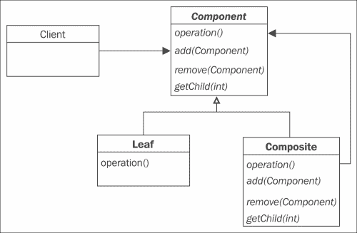

## 参与者

该模式的参与者如下：

+   `Component`：这是一个抽象类，它引入了对象的组合接口，实现了常用方法，并定义了管理组件添加或删除的方法签名。

+   `Leaf`：这是一个具体类，它定义了组成中元素的行为。它实现了 `Composite` 类支持的运算。`Leaf` 类没有自己的组件。

+   `Composite`：这是一个具体类，它定义了具有子组件并存储子组件的组件的行为。它实现了与 `Leaf` 类相关的操作。这个类聚合了 `Component` 类。

+   `Client`：这个类使用组件的接口来操作组成中的对象。

### 注意

`Composite` 包含组件。组件可以是 `Leaf` 或 `Composite`。这确实是递归的。一个复合体包含一组子组件；这些子组件可能是其他复合体或叶元素。

## 协作

客户端通过 `Component` 接口向叶组件发送请求。

当一个组件收到一个请求时，它会根据其类来反应。如果组件是叶组件，那么它将自行处理请求。

如果组件是复合体，它将首先处理自身，然后向每个子组件发送消息，这些子组件接着也会执行处理。然后，当每个子组件完成处理后，复合体将执行最后的处理。

## 插图

我们公司有一个在线的 **视频点播**（**VOD**）目录。我们所有的电影都按类型分类。由于这是一个按次付费的系统，我们每个视频都将有一个价格、名称和简短描述。

现在，我们希望通过这个新模式轻松地操作我们完整目录的显示。以下图表示了目录的组织结构：

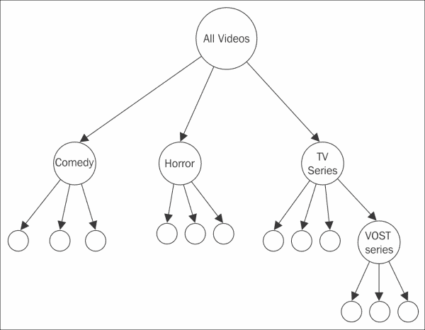

## 实现

因此，现在是时候将组合模式的通用设计应用到我们的案例中。首先，我们将根据我们的场景重新设计我们的模式，以便了解我们需要做什么，如下面的图所示：

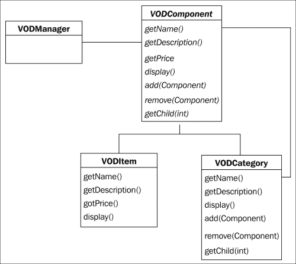

`VODManager` 类将使用 `VODComponent` 接口来访问 VOD 类别和 VOD 项目。`VODComponent` 类是我们提供的抽象类，它将提供定义方法的默认实现。`VODItem` 类将只覆盖有意义的方 法。`VODCategory` 类也将覆盖有意义的方 法，包括添加新的 `VODItem` 和 `VODCategory` 对象的方式。在重新组织我们的模式后，我们现在可以开始实现我们的解决方案。

### VODComponent 的实现

首先，我们创建我们的抽象类，`VODItem`和`VODCategory`都将从这个类继承。这个类将为叶子节点和组合节点提供接口。Swift 不支持抽象类；然而，没有什么应该阻止我们将默认行为应用到我们的方法上，比如使用**assert**来通知一个方法不被支持。assert 将只是通知我们，如果它在不适用的类中使用，那么该方法将不被支持。我们可以像这样编写我们的“假”抽象类：

```swift
// Abstract Class

class VODComponent {

  func add(vodComponent: VODComponent) {
    assert(false, "This method is not supported")
  }

  func remove(vodComponent: VODComponent) {
    assert(false, "This method is not supported")
  }

  func getName() -> String {
    assert(false, "This method is not supported")
  }

  func getDescription() -> String {
    assert(false, "This method is not supported")
  }

  func getPrice() -> Double {
    assert(false, "This method is not supported")
  }

  func getChild(i:Int) -> VODComponent {
    assert(false, "This method is not supported")
  }

  func display() {
    assert(false, "This method is not supported")
  }
}
```

### VODItem 叶子节点的实现

我们组件类已经准备好了；每个方法都有一个默认行为。我们现在可以实现我们的`VODItem`类。它是在组合图中的一个叶子类，实现了组合中元素的行为：

```swift
class VODItem: VODComponent {
  private var name: String!
  Private var description: String!
  private var price: Double!

  init(name:String!, description:String!, price:Double!){
    self.name = name
    self.description = description
    self.price = price
  }

  override func getName() -> String {
    return name!
  }

  override func getDescription() -> String {
    return description!
  }

  override func getPrice() -> Double {
    return price!
  }

  override func display() {
    print(" \(name!), \(price!),  ----  \(description!)")
  }
}
```

看看我是如何使用`!`定义私有变量的。这意味着这些变量的值在初始化后不能为 nil。这是因为我们添加了一个构造函数（`init`方法），其中所有我们的参数都必须传递以初始化我们的私有字段。

然后，我们只重写这个类中我们感兴趣的方法。`Add`/`Remove`和`GetChild`方法在这里不需要重写；这将在组合类中完成。

为了确保每个名称、描述和价格都有一个值，我们添加了一个感叹号来解包它。

现在是时候实现我们的组合类别类了。我们将把这个组合类命名为：`VODCategory`。它将包含`VODItems`或`VODCategory`。你会看到，我们在这里只重写这个类中我们感兴趣的方法。`getPrice()`方法不会引起我们的兴趣，因为它没有意义。

### VODCategory 组合的实现

`VodCategory`类的第一个版本可以写成如下：

```swift
class VODCategory: VODComponent{
  var vodComponents = [VODComponent]()
  private var name: String!
  private var description: String!

  init(name:String!, description:String!) {
    self.name = name
    self.description = description
  }

  override func add(vodComponent: VODComponent) {
    vodComponents.append(vodComponent)
  }

  override func remove(vodComponent: VODComponent) {
    vodComponents.remove(vodComponent)
  }

  override func getChild(i:Int) -> VODComponent {
    return vodComponents[i]
  }

  override func getName() -> String {
    return name!
  }

  override func getDescription() -> String {
    return description!
  }

  override func display() {
    print(" \(name!),  \(description!) \r\n ----------------")
  }
}
```

好吧，就像`VODComponent`一样，我们重写了我们感兴趣的方法。由于我们可以有任意数量的`VODComponent`，我们添加了一个类型为`VODComponent`的数组来保存它们。

我们添加了`Add`、`Remove`和`GetChild`方法。`Add`方法将允许我们添加一个项目、类别或子类别。我们也可以删除它，并基于其索引返回一个`VODComponent`类。

再次，我们可以给我们的组合添加一个名称和描述，当调用`display()`方法时将显示出来。

让我们看看以下代码：

```swift
  override func remove(vodComponent: VODComponent) {
    vodComponents.remove(vodComponent)
  }
```

如果你像前面的代码那样编写，你会得到一个错误，因为 Swift 没有为`Array`类型提供`remove`方法。

是时候对我们的实现做一些修改，并介绍扩展的使用了。

我们的问题是，我们想要能够通过一个名为`remove`（或任何其他名称）的方法从我们的`vodComponents`数组中移除一个`VODComponent`类型的对象，其中我们传递一个表示我们想要从列表中移除的对象的实例。

如果我们在自动完成时检查可用的方法，我们看不到任何可以帮助我们实现这个目的的方法，如下面的截图所示：

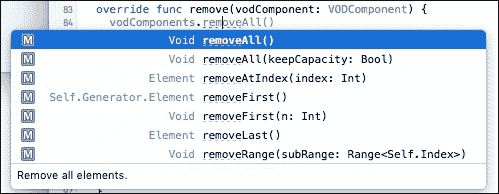

在第二章*结构型模式 – 装饰器、代理和桥接*中，你可以使用装饰器模式将此类方法添加到`Array`类型；你也可以提议简单地添加一个方法到类中，该方法将通过逐个比较来测试数组中的所有元素，如果它们相同，则从列表中删除它们。

我们想要的是可以重用和通用的东西。为此，Swift 有`extension`。这允许你非常容易地向类添加行为。让我们通过向`Array`类型添加`remove`方法来实现这一点。

扩展不能添加到类中。实际上，扩展是全局的。如果你要将扩展添加到 OS X 或 iOS 项目中，你通常会将其添加到一个专门的 Swift 文件中。

这里是我们的扩展：

```swift
extension Array {
  mutating func remove <T: Equatable> (object: T) {
    for i in (self.count-1).stride(through: 0, by: -1) {
      if let element = self[i] as? T {
        if element == object {
          self.removeAtIndex(i)
        }
      }
    }
  }
}
```

由于这个函数修改了`Array`类型及其属性，我们将此函数标记为可变。然后，我们从列表的末尾开始，比较我们想要在列表当前元素中找到的元素：

```swift
      if let element = self[i] as? T {
        if element == object {
          self.removeAtIndex(i)
        }
      }
```

再次，这里有一些棘手的事情要做，以使这段代码没有任何错误。这个函数告诉我们，我们想要`T`类型的`Array`实现`Equatable`（用`remove <T: Equatable>`表示）以便能够进行比较：

```swift
        if element == object {
```

因此，我们需要修改我们的抽象类，说明我们的类实现了`Equatable`协议：

```swift
class VODComponent : Equatable {

  func add(vodComponent:VODComponent){
    assert(false, "This method is not supported")
  }
```

当然，添加这个协议会稍微修改我们的类图，但没关系。通过实现这个协议，我们是在说`VODComponent`类型的元素可以使用`==`和`!=`进行比较。

如果这还没有完成，那么我们需要实现这个协议，所以最好的方法是在任何类之外创建一个全局函数：

```swift
// GLOBAL Func
func ==(left: VODComponent, right: VODComponent) -> Bool {
  return left === right
}
```

### 注意

`===`运算符告诉我们两个组件的实例是否相同。

因此，现在，这个类的所有代码都已经编写完成；`remove`方法可用且工作完美。

我们需要对我们的类进行一些改进，以完全完成组合的实现。

你看到我们如何在组合（`VODCategory`）中实现了`display`方法了吗？确实，组合的`display()`方法只显示它自己的信息，但它必须调用组合中每个元素的`display()`方法。为此，我们将简单地添加一小段代码，通过调用它们各自的`display()`方法来迭代组合中包含的所有元素。

让我们改变`VODCategory`类的`display()`方法，为所有我们的元素添加一个迭代：

```swift
//VODCategory
class VODCategory:VODComponent{

…
  override func display() {
    print(" \(name!),  \(description!) \r\n ----------------")
 for e in vodComponents{
 e.display()
 }
  }
}
```

因此，我们使用`for … in`遍历数组的每个元素，并调用每个元素的`display()`方法。

## 用法

我们的所有类现在都已准备就绪，现在是时候看看我们如何在客户端使用这个模式来测试所有这些了。

我们首先准备我们的`VODManager`类：

```swift
class VODManager{
  var catalog:VODComponent

  init(vod: VODComponent) {
      catalog = vod
  }

  func displayCatalog() {
      catalog.display()
  }
}
```

然后，我们编写我们的测试代码：

```swift
//USAGE
let horrorCategory = VODCategory(name: "Horror", description: "Horror movies category")
let tvSeriesCategory = VODCategory(name: "TV Series", description: "TV Series category")
let comedyCategory = VODCategory(name: "Comedy", description: "Comedy category")
let voSTTvSeries = VODCategory(name: "VOSTSeries", description: "VOST TV Series sub category")

let allVODComponents = VODCategory(name: "All VOD", description: "All vod components")
let vodManager = VODManager(vod: allVODComponents)

allVODComponents.add(horrorCategory)
allVODComponents.add(tvSeriesCategory)
allVODComponents.add(comedyCategory)

tvSeriesCategory.add(voSTTvSeries)

horrorCategory.add(VODItem(name: "Scream", description: "Scream movie", price: 9.99))
horrorCategory.add(VODItem(name: "Paranormal Activity", description: "Paranormal Activity movie", price: 9.99))
horrorCategory.add(VODItem(name: "Blair Witch Project", description: "Blair Witch movie", price: 9.99))

tvSeriesCategory.add(VODItem(name: "Game of thrones S1E1", description: "Game of thrones Saison 1 episode 1", price: 1.99))
tvSeriesCategory.add(VODItem(name: "Deadwood", description: "Deadwood Saison 1 episode 1", price: 1.99))
tvSeriesCategory.add(VODItem(name: "Breaking Bad", description: "Breaking Bad Saison 1 Episode 1 " , price: 1.99))

voSTTvSeries.add(VODItem(name: "Doc Martin", description: "Doc Martin French serie Saison 1 Episode 1", price: 1.99))
voSTTvSeries.add(VODItem(name: "Camping Paradis", description: "Camping Paradis French serie Saison 1 Episode 1", price: 1.99))

comedyCategory.add(VODItem(name: "Very Bad Trip", description: "Very Bad Trip Movie", price: 9.99))
comedyCategory.add(VODItem(name: "Hot Chick", description: "Hot Chick Movie", price: 9.99))
comedyCategory.add(VODItem(name: "Step Brothers", description: "Step Brothers Movie", price: 9.99))
comedyCategory.add(VODItem(name: "Bad teacher", description: "Bad Teacher Movie", price: 9.99))

vodManager.displayCatalog()
```

我们需要准备所有组件。所以，首先，我们准备我们的树形类别，然后向好的类别添加项目。

在脚本末尾，我们调用`vodManager.displayCatalog()`方法，这将调用所有组件的`display`方法。

那么，为什么我们在 Playground 中看不到有趣的东西呢？事实上，我们有一些线索告诉我们代码已经被正确执行。

在屏幕的右侧，我们可以看到方法被调用的次数，如下面的截图所示：

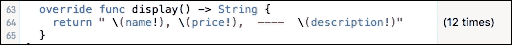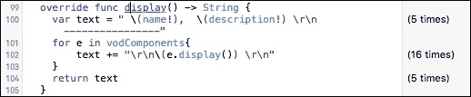

然而，我们将对其进行一点修改，以使测试结果更准确。我们将通过添加字符串`return`类型并替换`print`语句为包含要返回的字符串的`return`语句来修改每个`display()`方法：

```swift
 override func display() -> String{
    return " \(name!), \(price!),  ----  \(description!)"
  }
```

你需要更改`VODComponent`、`VODItem`和`VODCategory`类的`display()`方法。

对于`VODCategory`，你需要像以下代码那样修改它，以便它易于阅读：

```swift
override func display() -> String{
    var text = " \(name!),  \(description!) \r\n ----------------"
    for e in vodComponents {
        text += "\r\n\(e.display()) \r\n"
    }
    return text
  }
```

对于`VODManager`，你只需要添加返回类型并将`print`替换为`return`：

```swift
  func displayCatalog() -> String{
      return catalog.display()
  }
```

最后，将*Usage*部分（带有注释：// USAGE）中的`tvSeriesCategory.add(voSTTvSeries)`行（在`vodManager.display()`行之前）移动，这将使我们的结果更容易阅读。

现在，你将在`vodManager.display()`行后立即在右侧看到一些内容：


点击屏幕右侧的“眼睛”图标。你会看到我们的`vodManager.display()`调用的结果：


注意，组合或叶子的`display()`方法被递归调用。项目根据我们添加它们的类别进行组织。在前面的截图中，我们可以看到在调用`Horror VODCategory`之后，我们定义的所有恐怖电影（`VODItem`）都被显示出来，然后继续显示包含`VOST TV Series`子类别的电视剧，依此类推。

这标志着我们对组合模式的发现结束。

# 享元模式

当系统需要处理大量相似对象时，可以使用此模式。而不是逐个创建每个元素，此模式允许您重用具有相同数据的对象。

## 角色

享元模式通过减少创建的对象数量来减少包含数百甚至数千个相似对象的复杂模型的内存和资源使用。它试图重用相似现有的对象，或者在找不到匹配项时创建一个新的对象。

当以下情况发生时，可以使用此模式：

+   我们需要操作很多小而相似的对象

+   此操作的代价（内存/执行时间）很高

## 设计

下面的类图代表了该模式的通用结构：

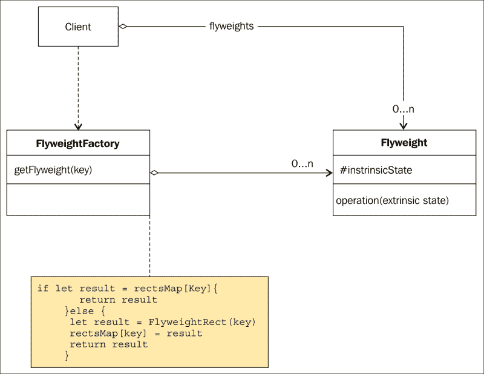

## 参与者

享元模式有三个参与者，如下所示：

+   `Flyweight`：这个接口声明了一个包含内在状态并实现方法的接口。这些方法可以接收并作用于享元的额外状态。

+   `FlyweightFactory`：这个工厂创建并管理享元对象。它通过返回享元的引用来确保享元的共享。

+   `Client`：这包含了对使用的享元对象的引用。它还包含这些享元的额外状态。

### 注意

**外在状态**：这是属于对象上下文的状态（外部）或对该实例唯一的状态。

**内在状态**：这是属于享元对象的状态，应该是永久或不可变的（内部）。

## 协作

客户端不会自己创建享元，而是使用 `FlyweightFactory` 方法，该方法保证了享元的共享。

当客户端调用享元的方法时，它需要发送其额外状态。

## 插图

假设我们想在 1024 x 768 的屏幕上显示 200000 个矩形。这些矩形是随机生成的；它们可以从 10 种不同颜色的列表中随机选择颜色。

我们需要减少执行函数所需的时间，并尽可能少地使用内存。

## 实现

在这个例子中，我们将使用带有 `XCTest` 框架和工具的 `XCTest` 项目来展示这个模式将如何帮助我们减少内存消耗。

首先，打开名为 `Flyweight Pattern_Demo1` 的项目，你可以在本章的源代码文件夹中找到它。

前往名为 `FlyweightPattern_Demo1Tests` 的 Xcode 项目，并点击下面的 `FlyweightPattern_Demo1Tests.swift` 文件，如图所示：

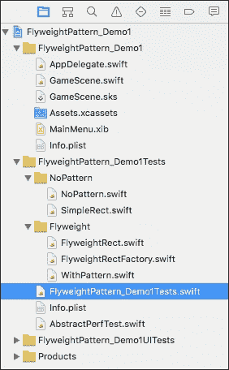

在这个文件中，你会看到已经实现的不同测试方法。在我们开始实现享元模式之前，让我们看看我们目前有什么。

我们已经有一个名为 `AbstractPerfTest` 的抽象类，其中包含一些已经定义的属性、字段和方法：

```swift
class AbstractPerfTest {

  let colors:[SKColor] = [
    SKColor.yellowColor(),
    SKColor.blackColor(),
    SKColor.cyanColor(),
    SKColor.whiteColor(),
    SKColor.blueColor(),
    SKColor.brownColor(),
    SKColor.redColor(),
    SKColor.greenColor(),
    SKColor.grayColor(),
    SKColor.purpleColor()
  ]

  let sks = SKScene()
  let view = SKView(frame: NSRect(x: 0, y: 0, width: 1024, height: 768))

  let maxRectWidth = 100
  let maxRectHeight = 100

  //must be overriden
  func run(){
    preconditionFailure("Must be overriden")
  }

  // - MARK generate Rect Height and Width
  func generateRectWidth() -> Int{
    return Int(arc4random_uniform(UInt32(maxRectWidth)))
  }

  func generateRectHeight() -> Int{
    return Int(arc4random_uniform(UInt32(maxRectHeight)))
  }

  // - MARK generate Position X and Y
  func generateXPos() -> Int{
    return Int(arc4random_uniform(UInt32(view.bounds.size.width)))
  }

  func generateYPos() -> Int{
    return Int(arc4random_uniform(UInt32(view.bounds.size.height)))
  }
}
```

还有一个名为 `NoPattern` 的类，它继承自这个抽象类并重写了 `run` 方法：

```swift
import Foundation
// Inherits from our AbstractPerfTest class
// which contains default methods and init
class NoPattern:AbstractPerfTest {
  // Execute the test
  override func run(){
    var j:Int = 0
    for _ in 1...NUMBER_TO_GENERATE {
      let idx = Int(arc4random_uniform(UInt32(self.colors.count- 1)))

      let rect = SimpleRect(color: self.colors[idx])
      rect.display(generateXPos(), yPos: generateYPos(), width: generateRectWidth(), height: generateRectHeight())
      j++
    }
    print("\(j) rects generated")
  }
}
```

`SimpleRect` 类定义在 `NoPattern` 组文件夹的 `SimpleRect.swift` 文件中。它是一个由颜色、*x* 和 *y* 位置、宽度和高度定义的对象。

我不会对 `NoPattern` 类进行过多的注释，但在这里我们看到的是，`NoPattern` 类的 `run` 方法生成了 `NUMBER_TO_GENERATE`（默认在 `FlyweightPattern_Demo1Tests.swift` 文件中设置为 `100000`）个随机颜色的矩形，这些颜色来自颜色数组列表（在抽象类中定义）。然后为这些矩形中的每一个生成一个位置和尺寸。

现在，让我们检查 `run` 方法的性能。

返回到 `FlyweightPattern_Demo1Tests.swift` 文件，检查名为 `testSimpleScreenFilling_noFlyWeight()` 的方法。在这里，该方法将执行 `NoPattern` 类中实现的代码，正如方法名所告诉我们的，它没有实现飞重量模式。这个方法的执行时间将被用作基线，以比较实现飞重量模式后的相同方法。

因此，让我们通过点击 `func testSimpleScreenFilling_noFlyWeight()` 函数左侧的小图标来执行测试，如下面的截图所示：

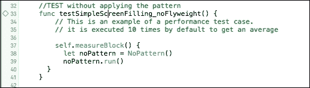

我们需要确保在 Xcode 中可见控制台。在执行过程中，你会看到带有 **200000 个矩形已生成** 的控制台日志被重复了 10 次。这证明了我们的代码已经生成了 200,000 个矩形 10 次。默认情况下，`self.measureBlock` 闭包执行 10 次，并计算这 10 次执行的方差以获得平均执行时间：

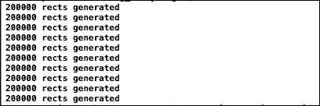

在我的 MacBook Pro 15 Retina Late 2013 上，平均时间是 **0.804** 秒：

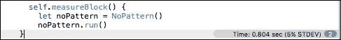

现在，最好的部分是将我们的代码重构以减少生成这些 200,000 个矩形所需的时间。正如你已经在模式的通用结构中看到的那样，我们需要几个类来管理我们的飞重量。

让我们从我们的 `flyweightRect` 类开始。注意，`flyweightRect` 和 `SimpleRect` 类在 `NoPattern` 类中使用，以生成完全相同的矩形。

因此，在下面的代码中，你会找到我们的 `FlyweightRect` 类以及我们矩形的定义。因此，我们有一个颜色，*x* 和 *y* 位置，矩形的高度和宽度。

注意，因为我真的很想看到性能的提升，我添加了两个字段：`image` 和 `sprite`。因为这些字段的值在类实例化时会有性能成本，所以我添加了它们，以便清楚地展示飞重量模式允许你在应用时减少计算成本（和内存使用）。

我们将向固有状态添加一个构造函数作为参数：这将是有色。我们将添加另一个 `display()` 方法，它将接收外延状态作为参数：

```swift
import SpriteKit
import Foundation

class FlyweightRect {

  var color: SKColor!
  var xPos: Int?
  var yPos: Int?
  var width: Int?
  var height: Int?
  var image: NSImage?
  var sprite: SKSpriteNode?

  //the constructor contains our intrinsic state
  init(color: SKColor) {
    self.color = color
    self.image = NSImage()
    self.sprite = SKSpriteNode()
  }

  func display(xPos: Int, yPos: Int, width: Int, height: Int){
    self.xPos = xPos
    self.yPos = yPos
    self.width = width
    self.height = height
  }

  func description() -> String  {
    return "rect position: \(self.xPos), \(self.yPos) : dimension: \(self.width), \(self.height)  : color: \(self.color)"
  }
}
```

一旦我们的飞重量被定义，我们现在可以准备我们的 `FlyweightFactory` 对象。记住，这个工厂将首先检查我们是否已经有了与我们要在屏幕上定位的新矩形相似的矩形；如果不是相似的，那么它将创建一个新的：

```swift
import SpriteKit
import Foundation

class FlyweightRectFactory{
    internal static var rectsMap = Dictionary<SKColor, FlyweightRect>()

  static func getFlyweightRect(color:SKColor) -> FlyweightRect{
    if let result = rectsMap[color]{
        return result
    } else { // if nil add it to our dictionnary
      let result = FlyweightRect(color: color)
      rectsMap[color] = result
      return result
    }
  }
}
```

我们声明一个静态的 `rectsMap` 变量，其类型为 `Dictionary`，它将包含我们的共享对象并管理它们的生存期。字典的 `Key` 将包含一个 `Color` 对象。

然后，我们定义一个名为 `getFlyweightRect` 的静态方法，它将返回一个 `FlyweightRect` 类。

由于 `rectMaps[color]` 返回 `nil`，我们使用 `if let` 语句解包可选值。如果它不是 `nil`，我们返回结果；否则，我们创建一个新的具有适当颜色的享元，将其添加到我们的字典中，并返回结果。

### 注意

在 `FlyweightPattern_Demo1.swift` 文件中，你可以找到几个测试方法，这些方法测试了根据管理我们的享元对象的对象类型，工厂的响应时间。在项目中，我使用了 `Dictionary<SKColor, FlyweightRect>`、`NSMutableDictionary` 和 `NSCache` 类型来测试管理我们的享元对象的对象性能。

`FlyweightRectFactory.swift` 文件的完整代码如下：

```swift
import SpriteKit
import Foundation

class FlyweightRectFactory {

  internal static var rectsMap = Dictionary<SKColor, FlyweightRect>()
  internal static var rectsMapNS = NSMutableDictionary()
  internal static var rectsMapNSc = NSCache()

  static func getFlyweightRect(color:SKColor) -> FlyweightRect{
    if let result = rectsMap[color]{
        return result
    }else {       let result = FlyweightRect(color: color)
      rectsMap[color] = result
      return result
    }
  }

  static func getFlyweightRectWithNS(color: SKColor) -> FlyweightRect{

    let result = rectsMapNS[color.description]

    if result == nil {
      let flyweight= FlyweightRect(color: color)
      rectsMapNS.setObject(flyweight, forKey: color.description)
      return flyweightas FlyweightRect
    }else {
      return result as! FlyweightRect
    }

  }

  static func getFlyweightRectWithNSc(color: SKColor) -> FlyweightRect{

    let result = rectsMapNSc.objectForKey(color.description)

    if result == nil {
      let flyweight= FlyweightRect(color: color)
      rectsMapNSc.setObject(flyweight, forKey:color.description)
      return flyweight as FlyweightRect
    }else {
      return result as! FlyweightRect
    }
  }
}
```

## 使用方法

使用我们的模式非常简单。你需要检查 `WithPattern.swift` 文件中的 `run()` 方法：

```swift
class WithPattern:AbstractPerfTest{
  //Execute the test
  override func run(){
    var j:Int = 0
    for _ in 1...NUMBER_TO_GENERATE{
      let idx = Int(arc4random_uniform(UInt32(self.colors.count- 1)))
      let rect = FlyweightRectFactory.getFlyweightRect(self.colors[idx])
      rect.display(generateXPos(), yPos: generateYPos(), width: generateRectWidth(), height: generateRectHeight())
      j++
    }
    print("\(j) rects generated")
    //print("nb Map: \(FlyweightRectFactory.rectsMap.count)")
  }
```

我们将简单地循环创建 200000 个 `FlyweightRect` 对象（`NUMBER_TO_GENERATE` 是在 `FlyweightPattern_Demo1Tests.swift` 文件顶部定义的一个常量）。

在前面编写的 `WithPattern` 类执行以下操作：

1.  我们首先生成一个随机数，该随机数返回一个值，将对应于颜色数组（在 `AbstractPerfTest.swift` 文件中定义）中可用的颜色的索引。

1.  然后，我们告诉工厂返回具有适当颜色的享元。

1.  然后，我们生成外部的状态（*x* 位置，*y* 位置，宽度，和高度）。

1.  一旦循环完成，我们显示生成的矩形数量。

## 性能结果

要检查性能，项目中有一个 `XCTest` 类，它有一个 `self.measureblock` 闭包，允许我们测量我们代码块的性能。

要启动项目中所有可用的测试，请点击左侧的 **显示测试导航器** 按钮，如图所示：

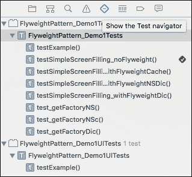

然后，点击高亮行右侧可见的播放按钮：


几秒钟后，所有测试都会完成，你现在可以检查你的性能结果。

返回到 `FlyweightPattern_Demo1Tests.swift` 文件并检查每个 `measureblock()` 方法的末尾。这是使用字典的享元模式的性能结果。你可以看到生成 200000 个矩形平均花费了 0.247 秒，如图所示。你会看到一个带有 `Time xxxx` 文字的文本；这是执行此块的平均时间：

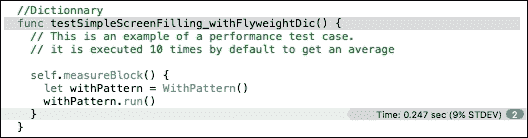

与未使用模式时的平均 **0.877** 秒相比：

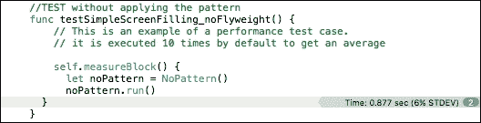

在查看结果后，你会发现生成矩形时（性能最好的先列出来）：

+   使用 `Dictionary` 对象的享元模式用于管理我们的共享对象

+   使用 `NSDictionary` 对象的享元模式用于管理我们的共享对象

+   使用 `NSCache` 对象的享元模式用于管理我们的共享对象

+   没有应用任何模式

在这个例子中，我们可以说，生成 200000 个 `FlyweightRect` 对象比不使用模式快 3,55 倍。

测试项目证明，Swift 比 Objective-C 和封装的 `NSCache` 更快。

在处理缓存时，`NSDictionary` 对象将拥有自己的逻辑。它可以在自己的隐藏代码结构内部创建更多对象，因此比 `NSDictionary` 对象慢。

# 摘要

在本章中，你学习了如何处理多个对象的结构。组合模式允许你以统一的方式访问和修改数据结构，而享元模式则是当存在多个相似对象时，更精确地节省内存空间或计算时间的做法。

享元模式与其他模式结合使用时，有助于将数据保持得尽可能小。组合模式与其他模式结合使用时，有助于管理数据结构。组合模式可以使用享元模式，但反之则不行。

在本章中，我尝试向你展示一些不同之处；使用 `XCTest` 框架来测试我们模式的性能。如果你想深入了解，你可以尝试使用 Xcode 提供的仪器工具查看内存分配的差异。

在下一章中，我们将继续通过学习适配器和外观模式来发现我们的结构模式。
