# 第四章 结构模式 - 适配器和外观

在本章中，我们将讨论两种新的结构模式：适配器模式和外观模式。我们将重点关注适配器模式，它将那些未被设计为相互协作的类型联合起来。然后，我们将讨论外观模式，它简化了一组复杂系统的接口。

# 适配器模式

当处理框架、库和 API 时，这种模式经常被用来轻松地将旧的和现有的接口适应到程序的新需求。

## 角色

适配器模式将另一个现有类的接口转换为现有客户端期望的接口，以便它们可以一起工作。多亏了这个模式，您可以集成那些通常无法修改源代码的组件，以及那些经常与框架使用相关的事物。

注意，如果您已经可以访问组件的源代码，应避免使用此模式。

## 设计

该模式的通用类图如下：

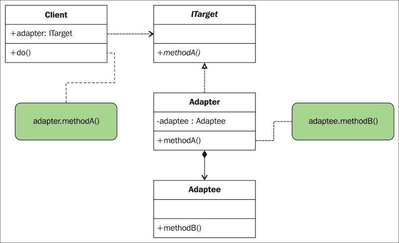

## 参与者

在前面的图中，您可以看到这个模式的四个参与者：

+   `ITarget`：通过这个接口引入了对象的函数签名

+   `Client`：客户端与实现`ITarget`接口的对象交互

+   `Adapter`：这个类实现了`ITarget`接口的方法，并调用适配对象的相应方法

+   `Adaptee`：这是我们需要适配其接口以使其可由客户端操作的对象

## 协作

客户调用`methodA()`适配器，该适配器本身调用`adaptee`对象的`methodB()`适配器。

下面的截图展示了我们项目的组织结构：

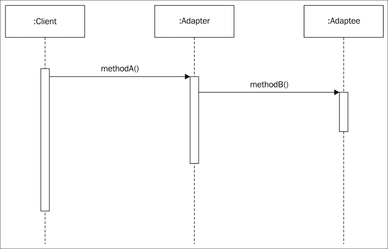

## 示例

您公司的销售总监希望生产一款适用于手机的通用电池充电器。这款充电器可以输出高达 10 伏的电压。作为公司的 CIO，您的开发团队向您展示了这个充电器的第一个原型。

在本章中，我在`first_prototype`文件夹中创建了一个新的 OS X 命令行工具项目，您可以在其中找到它，并将其命名为`ChargerPrototype`。

### 实现我们的第一个原型

我们的项目组织如下：

+   `Interfaces`文件夹包含了客户端将要调用的方法定义，用于给手机充电

+   `PhonePrototype.swift`文件是一个类，它定义了我们的测试手机并实现了`IChargeable`协议

结果如下：

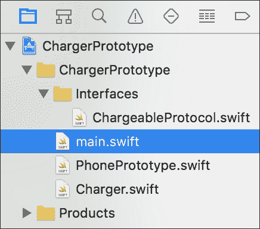

`ChargeableProtocol`接口是一个简单的协议，它定义了`charge`方法的签名：

```swift
import Foundation

protocol ChargeableProtocol {

  /// This function is called to charge a mobile phone
  ///
  /// Usage:
  ///
  ///    charge(5.5)
  ///
  /// - Parameter volts: voltage needed to charge the battery
  ///
  /// - returns: Void
  func charge(volts: Double)
}
```

### 提示

考虑到 Swift 协议与接口有相同的概念。

协议和 Java 接口之间有一些区别，如下所示：

+   Swift 协议也可以指定必须实现（例如，字段）的属性

+   Swift 协议需要通过使用`mutating`关键字来处理值/引用（因为协议可以被结构体和类实现）

你可以在任何位置使用`protocol<>`关键字组合协议，例如，声明一个必须遵循`A`和`B`协议的函数参数，如下所示：

```swift
func foo ( var1 : protocol<A, B> ){}
```

接下来，我们定义一个`PhonePrototype`类，它可以使用`ChargeableProtocol`协议进行充电：

```swift
class PhonePrototype: ChargeableProtocol {
  /// This function is called to charge a mobile phone
  ///
  /// Usage:
  ///
  ///    charge(5.5)
  ///
  /// - Parameter volts: voltage needed to charge the battery
  ///
  /// - returns: Void
  func charge(volts: Double) {
    print("Charging our PhonePrototype")
    print("current voltage \(volts)")
  }
}
```

注意这里添加的代码注释。使用 Swift，你可以添加有组织的注释，这样你可以通过弹出窗口（通过按住*Alt*键并指向鼠标光标在 Swift 方法上）来查看信息。要检查注释的显示结果，请按照以下步骤操作：

1.  打开`Charger.swift`文件。此文件代表我们的通用充电器。

1.  按住并保持*Alt*键。

1.  将鼠标定位在`self.phone.charge(volts)`语句中出现的`charge`上。一个问号`?`会出现。

1.  点击充电。

然后，你会看到以下弹出窗口，如图所示：

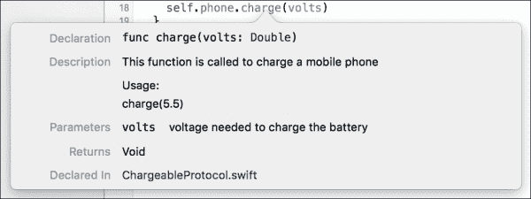

你应该考虑详细注释你的函数作为最佳实践。确保所有你的方法都得到了充分的注释。你可以检查弹出窗口是如何得到良好文档化的，如下所示：

+   使用`///`开始注释你的代码

+   使用`– 参数 parametername: 参数描述`来描述你的参数

+   使用`– 返回: 类型`来描述返回的类型

### 注意

关于现有关键字以文档化你的代码的更多信息，你应该查看以下网站：

[`ericasadun.com/2015/06/14/swift-header-documentation-in-xcode-7/`](http://ericasadun.com/2015/06/14/swift-header-documentation-in-xcode-7/)。

你的工程师向你展示了充电器的原型，它看起来工作得很好。

在 Xcode 中加载`ChargerPrototype.xcodeproject`文件后，点击运行以启动代码。

在控制台上，你会看到以下结果：

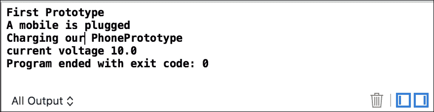

让我们看看`Charger`类是如何实现的：

```swift
import Foundation

class Charger {
  var phone: ChargeableProtocol!
  let volts = 10.0

  func plugMobilePhone(phone: ChargeableProtocol){
    print("A mobile is plugged")
    self.phone = phone
    self.phone.charge(volts)
  }
}
```

上述代码的实现相当简单。通过逐行阅读，我们可以推断出它是如何工作的：

+   我们的充电器包含一个对手机的引用。该手机必须实现`ChargeableProtocol`。当然，我们的通用充电器只会与这个接口通信。

+   然后，我们有一个可以插入手机的方法。

+   我们将手机分配给我们的引用并调用引用手机的充电方法。

因此，你的手机充电器与所有实现`ChargeableProtocol`的手机充电器都工作得很好。

然而，有一个问题。你的充电器与所有实现`ChargeableProtocol`的手机都工作得很好，但与市场上可用的手机不兼容。确实，每个手机制造商都有自己的接口来为其产品充电。

使用我们现有的充电器给手机充电是不可能的！这是想要销售通用手机充电器的公司的屋顶。

你可以安排一个紧急会议，与你的团队一起找到解决方案，以避免你公司的破产。

### 小贴士

Mike，你们公司的新开发人员，提出了解决方案：“为了让所有手机都能使用我们的充电器，它们需要实现`ChargeableProtocol`，但我们不能修改手机，因为我们没有源代码。所以，我们可以告诉每个制造商在他们自己的 iPhone 上实现`ChargeableProtocol`。”

Kevin，IT 项目经理，回答说：“Mike，欢迎加入我们公司，但你的解决方案不是一个好的选择。制造商有自己的系统，他们不想改变它们。对于已经售出且没有实现`ChargeableProtocol`的手机，我们该怎么办？”

Kevin 继续说：“我们遇到的问题不是制造商的问题；他们不需要调整他们的代码来让我们的充电器与他们的产品一起工作，这是我们的公司需要调整的地方。是的，我们必须调整我们的代码。”

Mike 问道：“那么，你打算怎么进行？”

Kevin 回答说：“嗯，这个概念很简单。如果你计划去法国旅行，那里的电源插座规格和形状并不适合我们美国的。我在我家附近的电器店偶然发现了一个适配器。这个适配器接受我的美国电缆的形状和规格，以及可以插入法国电源插座的另一个适配器，因为插入的一侧具有与法国相同的形状和规格。所有美国和法国规格之间的转换都在适配器本身完成。”

“这里的问题也是一样的。我们必须根据制造商调整我们的充电器。所以，我们将为每款手机配备一个适配器，并继续使用一个独特的充电器。”

Julien，首席执行官，回答说：“太好了，Kevin！我们现在就去。我们必须在圣诞节前让我们的通用充电器可用！”

### 实现

我们需要做的第一件事是准备我们的适配器，使其与我们的充电器一起工作。充电器只与实现`ChargeableProtocol`的对象一起工作。我们将需要为我们将要创建的每个适配器实现`ChargeableProtocol`。

一旦通过实现`ChargeableProtocol`完成充电器侧的“插入”适配器，我们将添加一个引用到适配器适配的手机。我们的通用充电器不会操作手机实例；这是适配器的角色来操作它。

打开`ChargerWithAdapter.xcodeproj`项目并检查我们代码的组织结构：

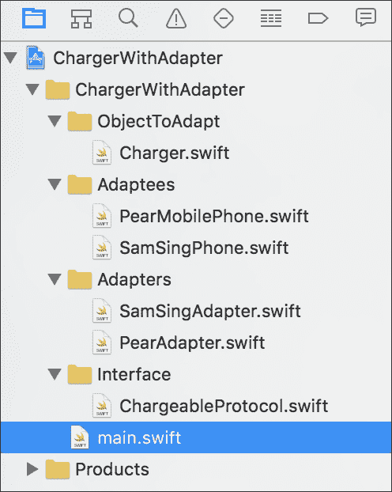

我们已经将我们的演员分成了以下三个文件夹：

+   `适配器`：这包含我们必须适配的组件。如果你没有源代码，可以考虑这个。记住，如果你拥有`适配器`文件夹的源代码，你不应该使用适配器模式。

+   `Adapters`：这包含了根据我们想要充电的手机类型而必须使用的适配器。

+   `Interface`：这包含了我们的适配器实现的接口和客户端操作的接口。

+   `main.swift`：这代表客户端：通用充电器。

+   `Charger.swift`：这是需要适配的对象。

### 适配器的实现

让我们研究两个需要适配的手机：即“Pear”手机和“SamSing”手机：请注意，在现实生活中，你将不会拥有`adaptee`对象的源代码，即需要适配的对象，你将只与它们的已知接口打交道。

让我们先分析一下 SamSing 手机：

```swift
import Foundation
class SamSingMobilePhone {

  enum VoltageError: ErrorType {
    case TooHigh
    case TooLow
  }

  ///Accept only 10 volts
  func chargeBattery(volts: Double) throws {
    if volts > 10 { throw VoltageError.TooHigh }
    if volts < 10 { throw VoltageError.TooLow }

    print("SamSing mobile phone is charging")
    print("Current voltage \(volts)")
  }
}
```

现在，让我们分析一下 Pear 手机：

```swift
import Foundation

class PearMobilePhone {

  enum PearVoltageError: ErrorType {
    case NoPower
    case TooLow
    case TooHigh
  }

  ///Accept only 5.5 volts
  func charge(volts: Double) throws {
    guard volts > 0 else { throw PearVoltageError.NoPower}
    if volts > 5.5 { throw PearVoltageError.TooHigh }
    if volts < 5.5 { throw PearVoltageError.TooLow }

    print("Pear mobile phone is charging")
    print ("Current voltage \(volts)")
  }
}
```

这两个类代表了我们需要适配的对象：第一个是`SamSingMobilePhone`类，它有一个名为`chargeBattery`的方法。这是原始充电器用来为 SamSing 手机充电的方法。

第二个是`PearMobilePhone`类，它允许使用原始充电器来充电电池，但这个类简单地被称作`charge`。请注意，这两种手机需要不同的电压来充电。

所以你在这里看到的是，我们的通用充电器在 Pear 手机插入时需要调用`charge`方法，而在 SamSing 手机插入时需要调用`chargeBattery`方法。

我们将不得不为每种我们想要能够充电的手机类型制作一个适配器。

如前所述，当你使用适配器模式时，你不应该有`adaptee`对象的源代码。这里提供的源代码只是为了演示目的。

你检查过我们两个`adaptee`的源代码了吗？我自愿引入了两个新的 Swift 关键字，我想向你介绍。

首先，这两个类都有一个可能的错误枚举，充电器可以处理。如果电压过高或过低，SamSing 将抛出一个错误；Pear 型号可以抛出相同的错误，如果手机插入充电器时完全没有电，它还可以抛出另一个错误。如文档中所述，在 Swift 中，错误由符合`ErrorType`协议的类型值表示。这就是为什么每个枚举都实现了`ErrorType`协议的原因：

```swift
  enum PearVoltageError: ErrorType {
    case NoPower
    case TooLow
    case TooHigh
  }
```

只有这个枚举是不够的；我们需要在调用`charge`方法时处理错误。为此，我们需要告诉方法抛出一个异常。

为了这个，我们只需在定义返回类型之前简单地添加`throw`关键字，如下所示：

```swift
func chargeBattery(volts:Double) throws {
```

记住，这个函数定义与以下定义完全相同：

```swift
func charge(volts:Double) throws -> Void {
```

不提供返回类型相当于声明返回类型是`Void`类型。

好吧，一旦我们的方法被告知它可以处理错误，我们仍然需要在必要时引发错误。我们在方法开始处进行一些条件检查，如果出现问题，就抛出异常。要引发异常，我们只需在想要引发的（实现 ErrorType 协议的）`ErrorType`对象之前使用`throw`关键字。（这里是一个`VoltageError`）：

```swift
if volts > 10 { throw VoltageError.TooHigh }
if volts < 10 { throw VoltageError.TooLow }
```

如前所述，`PearMobilePhone`类会引发错误；这是当方法从充电器接收`0`电压时。在这种情况下，`PearVoltageError.NoPower`的`PearVoltageError`枚举类型值将被引发。

让我们调查`PearMobilePhone`类的`charge`方法：

```swift
 ///Accept only 5.5 volts
  func charge(volts: Double) throws -> Void {
    guard volts > 0 else { throw PearVoltageError.NoPower}
    if volts > 5.5 { throw PearVoltageError.TooHigh }
    if volts < 5.5 { throw PearVoltageError.TooLow }

    print("Pear mobile phone is charging")
    print("Current voltage \(volts)")
  }
```

我们可以看到，两个`if`语句检查电压是否在第一种情况下高于 5.5 伏，在第二种情况下低于 5.5 伏。每个`if`语句都可以抛出一个错误：`TooHigh`或`TooLow`。

现在，让我们检查如何引发`NoPower`错误：

```swift
    guard volts > 0 else { throw PearVoltageError.NoPower}
```

这个语句引入了 Swift 2 的新关键字`guard … else {`。

`guard`语句类似于`if`语句。它根据表达式的布尔值执行语句。在`guard`语句之后，程序必须继续执行的条件必须为真。`guard`语句始终有一个`else`子句。如果表达式不为真，则执行该子句中的语句。

`guard`语句允许你在检查条件时执行早期退出。

我真的很喜欢`guard`能够这样使用：

```swift
guard let unwrappedVar = myVar else {
  return
}
print("myVar : \(unwrappedVar)")
```

在 Swift 的早期版本中，你会写类似这样的事情：

```swift
If let unwrappedVar = myVar {
  Print("myVar : \(unwrappedVar"))
}else {
  return
}
//now if you call the print statement below this will not work
//because unwrappedVar is no longer available in this scope.
print("myVar : \(unwrappedVar)")
```

因此，回到我们的模式。我们已经看到我们的两个手机接口不同，我们现在需要为每个手机创建一个适配器，如下面的图所示：

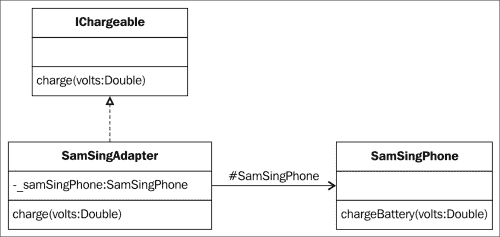

### SamSingAdapter 类的实现

在前面的图中，我们现在可以编写我们的新适配器，使其能够与 SamSing 手机一起工作，如下所示：

```swift
import Foundation

class SamSingAdapter: ChargeableProtocol {

  var samSingPhone: SamSingMobilePhone!

  init(phone: SamSingMobilePhone){
    samSingPhone = phone
  }

  func charge(volts: Double) {
    do {
      print("Adapter started")
      _ = try samSingPhone.chargeBattery(volts)
      print("Adapter ended")
    }catch SamSingMobilePhone.VoltageError.TooHigh{
      print("Voltage is too high")
    }catch SamSingMobilePhone.VoltageError.TooLow{
      print("Voltage is too low")
    }catch{
      print("an error occured")
    }
  }
}
```

我们创建了一个新的`SamSingAdapter`类，该类实现了`ChargeableProtocol`。我们需要提供一个`charge`方法，该方法接受电压作为参数。

我们添加了一个名为`samSingPhone`的常量，它实例化了一个`SamSingMobilePhone()`对象，我们将使用它来调用其自己的`chargeBattery`方法。

我们将`SamSingMobilePhone`作为参数传递给适配器的构造函数，以获取我们想要充电的手机的引用。然后，我们实现`charge`方法的代码。（记住，这是客户端知道的唯一方法。）

再次，我想向你展示一些 Swift 2 带来的新特性。

Swift 2 引入了`do`、`try`、`catch`和`throw`机制。当我们发现我们的两个`Adaptee`类时，我们已经讨论了`throw`语句。

定义中包含`throw`关键字的`方法`如下：

```swift
func chargeBattery(volts:Double) throws {
```

它必须使用`try`语句调用，因为这个设计是为了让开发者更清晰：

```swift
    _ = try samSingPhone.chargeBattery(volts)
```

`_`符号是一个通配符，因为 SamSing 手机上的`chargeBattery`方法不返回任何值（实际上，它返回`Void`）。写这样的语句是没有用的：

```swift
    let myVar = try samSingPhone.chargeBattery(volts)
```

因为您想处理`chargeBattery`方法可能抛出的错误，所以这个语句必须在一个`do { } catch`块内：

```swift
    do {
      print("Adapter started")
      _ = try samSingPhone.chargeBattery(volts)
      print("Adapter ended")
    }catch SamSingMobilePhone.VoltageError.TooHigh{
      print("Voltage is too high")
}
//…..
```

因此，在`do`块中，您将添加可能抛出错误的调用方法，如果您想处理它，可以在`catch`块中捕获它：

```swift
catch SamSingMobilePhone.VoltageError.TooHigh{
      print("Voltage is too high")
    }catch SamSingMobilePhone.VoltageError.TooLow{
      print("Voltage is too low")
    }catch{
      print("an error occured")
    }
```

`catch`语句将静默所有错误，代码将继续运行。如果您想了解更多关于 Swift 2 中错误处理的信息，我建议您查看以下网站：

[`www.hackingwithswift.com/new-syntax-swift-2-error-handling-try-catch`](https://www.hackingwithswift.com/new-syntax-swift-2-error-handling-try-catch)。

我们的`SamSingAdapter`类现在已经准备好了。我们现在将对`PearAdapter`类做同样的事情。

### PearAdapter 类的实现

我们将按照`SamSingAdapter`类的方式继续进行，但使用 Pear 手机：

```swift
import Foundation

class PearAdapter: ChargeableProtocol {

  var pearMobilePhone:PearMobilePhone!

  init(phone: PearMobilePhone){
    pearMobilePhone = phone
  }

  func charge(volts: Double) {
    do {
      print("Adapter started")
      _ = try pearMobilePhone.charge(5.5)
      print("Adapter ended")
    }catch PearMobilePhone.PearVoltageError.TooHigh{
      print("Voltage is too high")
    }catch PearMobilePhone.PearVoltageError.TooLow{
      print("Voltage is too low")
    }catch{
      print("an error occured")
    }
  }
}
```

在这里，主要的不同之处在于我们现在有一个`PearMobilePhone`对象的引用，并且我们的`charge`方法（实现了`ChargeableProtocol`）调用`pearMobilePhone.charge`方法。

我们还需要管理发送到手机的电压。适配器必须将任何值转换为适配对象接口的规范。如果我们发送过高的电压，我们的手机会烧毁，我们的客户将停止购买我们的产品。因此，在我们的适配器中，我们将发送到 Pear 手机的电压值设置为 5.5 伏。

我们还捕获了`pearMobilePhone`对象的`charge`方法可能抛出的所有错误。

### 注意

Swift 2 要求详尽的`try`/`catch`错误处理。最后的`catch`语句是我们的默认捕获所有错误的块。

由于我们已经将电压值设置为 5.5 伏，这是 Pear 手机唯一接受的电压，所以我们永远不会引发错误，因此拥有如此多的捕获块是难以阅读的。

好吧，苹果为您提供了一个替代方案。您可以这样编写我们的适配器：

```swift
  func charge(volts: Double) {
      print("Adapter started")
      _ = try! pearMobilePhone.charge(5.5)
      print("Adapter ended")
  }
```

`try!`方法允许您避免使用`do`/`catch`，因为您承诺调用永远不会失败。

我们已经有了现成的通用充电器，两个适配器和两部手机来测试我们的充电器。请记住，我们的充电器默认提供 10 伏。

让我们在`main.swift`文件中编写我们的简单测试程序：

```swift
import Foundation

print("*** start test program")
// Create our Charger
let charger = Charger()
print("*** charger ready test program")

//Test 1
//Charge a Pear Mobile Phone
print("Will charge a Pear Mobile Phone")
//1 mobile and adapter creation
let pearPhone = PearMobilePhone()
let pearAdapter = PearAdapter(phone: pearPhone)
//we plug the portable to our charger through the adapter
charger.plugMobilePhone(pearAdapter)

print("*** -")
//Test 2
//Charge a SamSing Mobile Phone
print("Will charge a SamSing Mobile Phone")
//1 mobile and adapter creation
let samSingPhone = SamSingMobilePhone()
let samSingAdapter = SamSingAdapter(phone: samSingPhone)
//we plug the portable to our charger through the adapter
charger.plugMobilePhone(samSingAdapter)

print("*** end test program")
```

我认为我不需要提供更多细节，因为完整的代码已经在这里提到了。我们准备我们的充电器，拿起第一部手机，使用适当的适配器，然后将适配器（它也连接到我们的手机）插入充电器。我们对第二部手机也做同样的事情。

让我们运行代码并检查我们的结果：

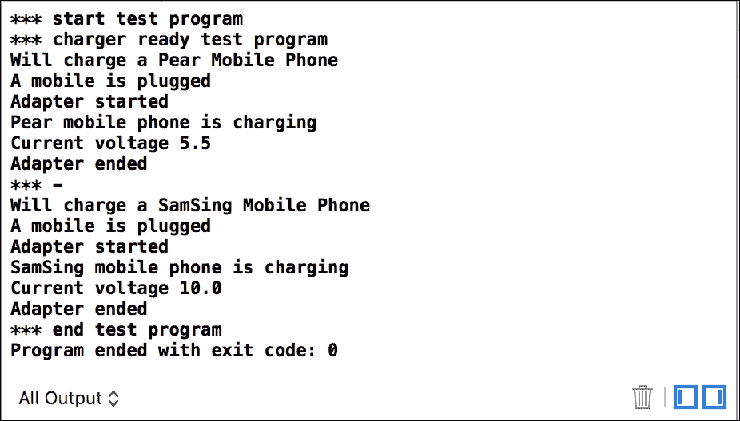

好吧，不管手机是什么型号；使用我们适当的适配器，默认情况下，充电器会将 10 伏电压发送到适配器，然后适配器将转换这种电压（或不会转换）并在手机本身上调用适当的充电方法。

这就完成了适配器模式的发现。

# 门面模式

门面模式是一种简单的模式，用于将一组对象的接口和易于客户端使用的统一接口组合在一起。

## 角色

门面模式允许你提供用户可能需要的操作。该模式封装了每个被视为低级接口的对象的接口。为了构建统一接口，我们可能需要实现一些方法，这些方法将组合低级接口：

+   它必须用来提供一个复杂系统的简单接口。系统的架构可以由几个小型类组成，这些类允许极大的模块化，但客户端不需要这些属性。他们只需要满足他们需求的东西。

+   它可以用来将系统划分为子系统。门面将成为子系统之间通信的接口。

+   它还可以用来封装系统对外部消费者的实现。

## 设计

门面模式旨在隐藏系统的复杂性。它的接口可以是全新的。它必须不符合现有接口。我们可以根据我们拥有的最终用户和想要提供给门面的功能，为同一系统提供几个门面：

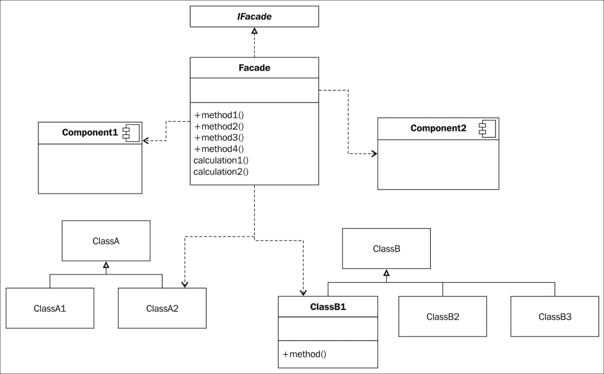

## 参与者

此模式的参与者如下：

+   门面及其接口是系统暴露给客户端的抽象部分。此类包含对系统内其他类和组件的引用，它们使用门面实现统一接口的方法。

+   系统的类和组件实现系统的功能，并响应来自门面的请求。它们不需要门面就能工作。

## 协作

客户端通过门面与系统通信。然后，门面本身调用系统的类和组件。门面不仅向子系统中的类和组件发送请求。它还必须使用特定的代码将自己的接口适配到对象和组件接口，以允许对象通信。

以下序列图描述了这种情况：

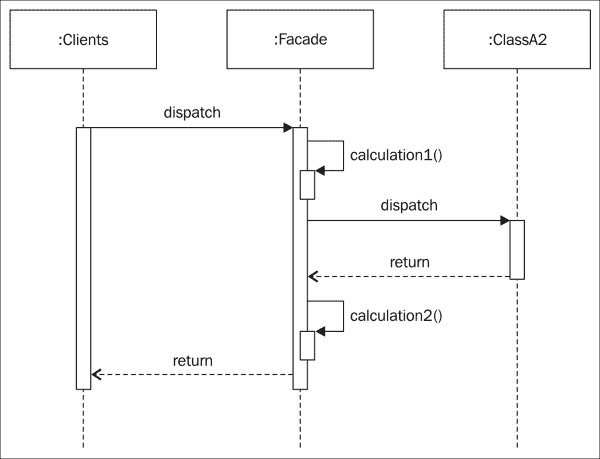

使用门面的客户端不应直接访问系统的对象。

## 说明

我们希望提供一个简单的接口，让我们的客户端能够轻松地找到输入地址附近的酒店，并符合某些标准（如星级数量。）

在我们公司，我们有一个子系统，它提供包含每个酒店位置和星级的酒店目录。

我们已经有一个可以搜索位置点（纬度和经度）附近的酒店的`FindPoi` Web 服务，它使用一些标准：搜索的最大距离和我们想要的星级数量。

如您所见，服务需要一个位置点，这意味着我们传递一个包含纬度和经度的对象。

由于我们建筑立面的消费者只会告诉我们其实际地址，我们需要能够将地址地理编码到具有纬度和经度的 GPS 点的服务。

序列图显示了我们将如何提供简化的接口：

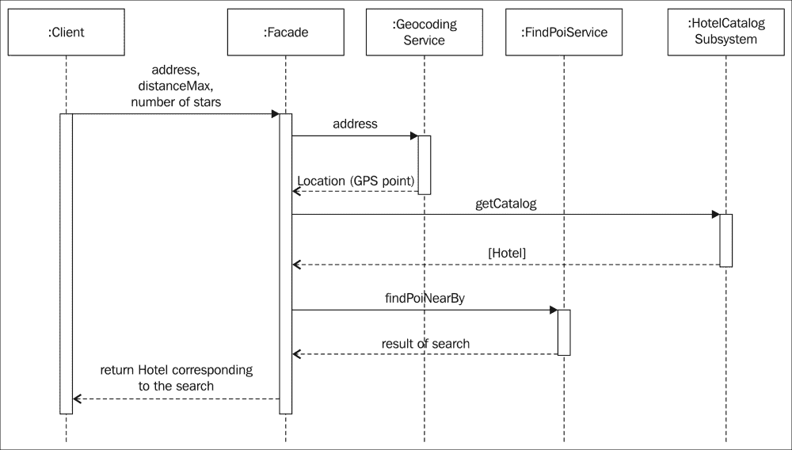

打开名为`FacadePattern`的 Xcode 项目以及`main.swift`文件。此文件代表一个将消费我们的立面的客户端。

我们的立面实际上是一个服务，允许客户端搜索输入位置附近的酒店，该输入有两个标准：`distanceMax`和酒店的星级数量。

这就是服务将被调用的方式：

```swift
var results = svcFacadeFindHotel.findHotel(myAdress, distanceMax: 2.0, stars: 4)
```

客户端的完整代码如下：

```swift
import Foundation

//I am a consumer of the service
// my addess is
// 1 infinite Loop
// Cupertino, CA 95014

let svcFacadeFindHotel = ServiceFindHotelNearBy()

let myAdress = " 1 Infinite Loop Cupertino, CA 95014 USA"
var results = svcFacadeFindHotel.findHotel(myAdress, distanceMax: 2.0, stars: 4)

print("*** RESULTS ")
print("Their is \(results?.count) results :")

if let results = results {
  for var h in results{
    print("Hotel latitude:\(h.location.latitude) longitude:\(h.location.longitude), stars: \(h.stars)")
  }
}
```

我们为`ServiceFindHotelNearBy`服务打开一个连接。我们告诉我们的当前地址，然后显示结果（如果有）。在这里，我们有 125 个结果（来自`HotelCatalog`对象中生成的 1,000 个结果）：


### 面向对象实现

根据序列图和客户端使用的服务方法，我们样本项目中的`ServiceFindHotelNearBy`立面将具有以下代码：

```swift
import Foundation

class ServiceFindHotelNearBy: ServiceFindHotelNearByProtocol {

  //return a list of hotel that corresponds to our criteria
  func findHotel(from: String, distanceMax: Double, stars: Int) -> [Hotel]? {
      let svcGeocoding = Geocoding()
      let svcFindPoi = FindPoi()
      let systemhotelCatalog = HotelCatalog()

      //Geocode our adress to GPS Points
      let fromLocation = svcGeocoding.getGeocoordinates(from)

      //retrieve all hotels in the catalog
      let allHotels = systemhotelCatalog.getCatalog()

      //find POI that corresponds to our criteria
      let results = svcFindPoi.findPoiNearBy(fromLocation, distanceMax: distanceMax, stars: stars, catalog: allHotels)
    return results
  }
}
```

立面可以这样描述：

+   首先，我们连接到所有需要的系统：`Geocoding`、`FindPoi`和`SystemHotelCatalog` Web 服务（我们的子系统）。

+   然后，我们根据序列图编排我们的调用。

+   我们首先将地址地理编码到一个 GPS 点。

+   然后，我们从`systemHotelCatalog`对象（代表一个子系统）中获取`allHotels`，因为我们需要将其作为参数传递给`FindPoi`服务。

+   这是我们下一个语句中需要做的事情。我们需要将`distanceMax`值、星级数量值和刚刚地理编码的 GPS 点作为`FindPoi`服务的`findPoiNearBy`方法的参数传递。

+   然后，我们将结果返回给客户端。

如您所见，立面封装了所有必要的子系统调用，隐藏了获取符合客户愿望的酒店的复杂性。这完成了对外观模式的描述。

# 摘要

本章完成了对七个结构模式的发现。适配器模式与桥接模式有很多共同之处。主要区别在于模式的目的。

桥接将接口与其实现分离，而适配器则改变现有对象的接口。

装饰者在不改变对象接口的情况下添加功能，并且应该对应用程序是透明的。对于适配器来说，情况并非如此，它从客户端的角度来看并不透明：适配器是客户端看到的接口的命名实现，因此适配器不会被客户端隐藏。

代理模式不会改变任何接口。它为其他对象定义了替代对象。

门面模式通过与其他子系统通信，将高级请求转换为低级请求。它通过提供一个简单的客户端可以看到的接口来隐藏这些子系统的复杂性。

在下一章中，我们将从我们的前三个行为模式开始：`策略`、`状态`和`模板`方法。
