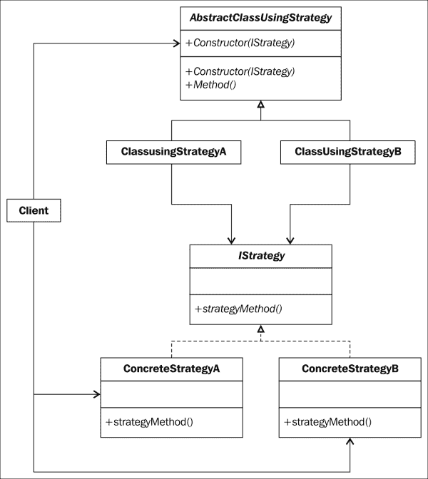
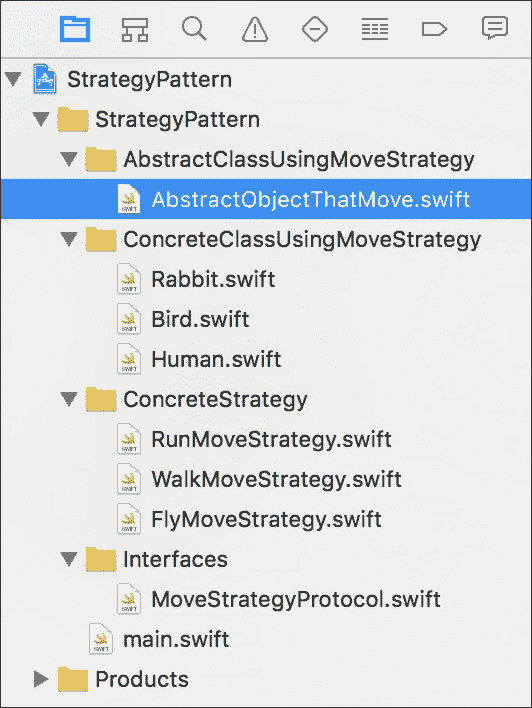
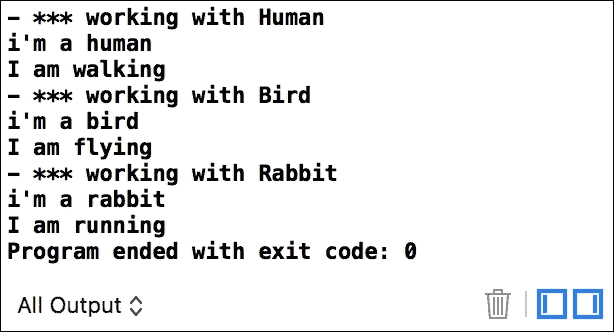
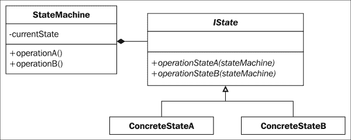
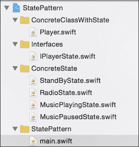
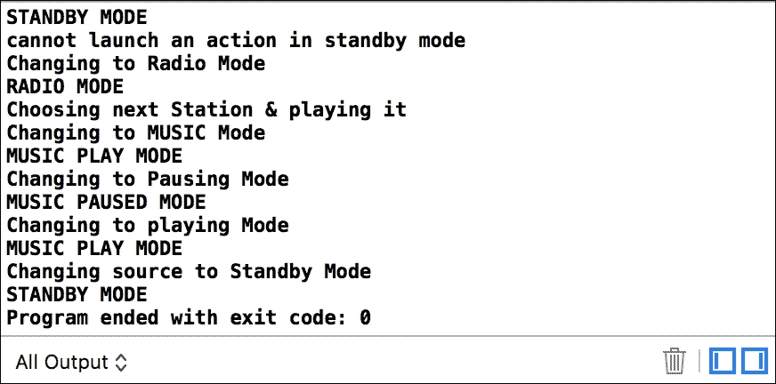
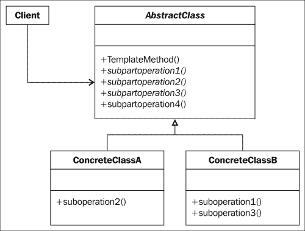
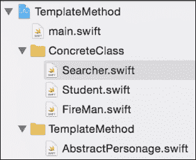
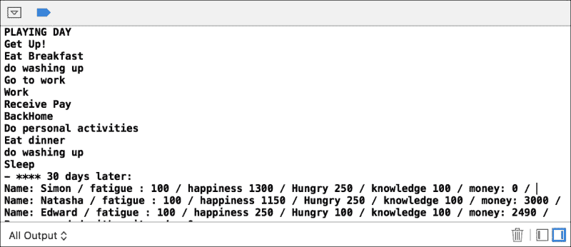

# 第五章. 行为模式 – 策略、状态和模板方法

希望您还在这里；现在，我们将向您介绍设计模式的第三和最后一个类别，它被归类为**四人帮**（**GoF**）设计模式：行为模式。行为模式致力于算法及其之间的通信。

由于算法由多个操作组成，这些操作被分为不同的类，因此行为模式可以处理这些类的组织和它们之间通信的方式。

行为类别包含 11 个模式，我们将通过四章来讨论。在本章中，我们将讨论以下三个模式：

+   策略模式

+   状态模式

+   模板方法模式

# 策略模式

当您需要在运行时更改对象的部分算法，而不修改客户端时，策略模式是合适的模式。

它将算法从其宿主类中移除并移动到单独的类。可以更改的算法部分是**策略**。每个策略都使用相同的接口。使用策略模式的类将算法的处理委托给策略。

## 角色

策略模式用于创建一个可互换的算法系列，在运行时从其中选择所需的过程。

算法变更不会影响客户端部分。此模式可以在以下情况下使用：

+   一个类的行为可以通过不同的算法实现，其中一些在执行时间或内存消耗方面表现更好

+   使用 `if` 条件指令选择合适的算法会使代码复杂化

+   一个系统具有类似类，其中只有行为发生变化；在这种情况下，策略模式允许您将这些类组合到一个类中，这大大简化了客户端的接口

## 设计

策略平台的通用结构如下：



## 参与者

策略模式中的参与者如下：

+   `IStrategy`：此类定义了所有算法实现的通用接口。这是 `ClassUsingStrategy` 类用来调用正确算法的接口。

+   `ConcreteStrategyA` 和 `ConcreteStrategyB`：这些是根据 `IStrategy` 接口实现不同算法的具体类。

+   `ClassUsingStrategyA` 和 `ClassUsingStrategyB`：这些是使用实现 `IStrategy` 接口的类的算法的类。这些类有一个对具体策略类实例的引用。这些类可以向实现类公开一些内部数据。

## 协作

`ClassUsingStrategy` 和 `ConcreteStrategy` 类交互以实现算法。

在大多数情况下，算法所需的数据作为参数发送给构造函数，也可以通过设置属性发送。如果需要，`ClassUsingStrategy`类可以提供一些方法，让您访问其内部数据。

`Client`实例将使用`Strategy`对象初始化`ClassUsingStrategy`，并调用使用策略模式的`ClassUsingStrategy`方法。

然后，这个类将把从客户端接收到的请求发送到策略属性引用的实例。

## 插图

我们将通过一个简单的例子来了解如何实现策略模式。

一些物体可以移动，但它们移动的方式并不相同。每个物体都有其特定的移动方式：有的可以行走，有的可以奔跑和飞翔。移动行为是我们的策略，我们将把`performMove()`动作封装在具体策略类中，该类在具体类中使用策略。

## 实现

打开策略模式 Xcode 项目，查看我们代码的组织结构。该模式的参与者被分为四个文件夹，如下面的截图所示：



我们首先将定义移动策略的接口，然后描述`AbstractClassUsingMoveStrategy`。

移动策略的接口非常简单；我们只需告诉实现策略的类我们正在等待一个`performMove`方法。

`MoveStrategyProtocol.swift`文件如下：

```swift
//Common Interface used by algorithms
protocol MoveStrategyProtocol {
  func performMove()
}
```

我们的抽象类需要有一个角色来保持对将要应用策略的引用，通过封装对当前策略的`performMove`方法的调用到我们自己的方法中，我们将调用该方法为`move()`。策略对象的实例将在实现`AbstractObjectThatMove`类的类的构造函数中接收。

对于我们的演示，我们将添加一个内部计算属性`WhoAmI`，我们将使用策略模式设置或获取具体类的名称。

我们的`AbstractObjectThatMove.swift`文件如下：

```swift
class AbstractObjectThatMove {
  private var strategy: MoveStrategyProtocol!
  private var whoAmI:String = "Unknown Object"

  required init(strategy: MoveStrategyProtocol) {
    self.strategy = strategy
  }

  func move(){
    strategy.performMove()
  }

  internal var WhoAmi: String {
    get {
      return whoAmI
    }
    set {
      whoAmI = newValue
    }
  }
}
```

### 注意

Swift 2.0 目前还没有支持抽象类。在这里，我们命名为`AbstractObjectThatMove`类，即使它不是一个“真正的”抽象类，也是为了尽可能接近模式的一般概念。尽管如此，可能有一种方法可以得到类似抽象类的东西，但它与通过初始化器传递策略的一般模式概念不同。Swift 2.0 有协议扩展，它提供了向协议添加部分实现方法的机会，并在“某种方式”上实现了一个抽象类：

```swift
protocol AbstractObjectThatMove {
   var WhoAmi: String { get set}
}
extension AbstractObjectThatMove {
    func move(strategy: IMoveStrategy) {
       strategy.performMove()
    }
}
class Human : AbstractObjectThatMove {
    var WhoAmi: String = "i'm a human"
}
```

然后，我们可以处理以下代码：

```swift
print("- *** working with Human")
let strategyForHuman = WalkMoveStrategy()
let human = Human()

// Tell who am I
print(human.WhoAmi)

//perform human move:
human.move(strategyForHuman)
```

因此，我们回到模式的实现。在我们的当前示例中，我们有三个具体类实现了抽象类：`Rabbit`、`Bird`和`Human`。由于这三个对象的实现相同，我将只展示具体`Human`类的实现：

```swift
class Human: AbstractObjectThatMove {
  required init(strategy: MoveStrategyProtocol){
    super.init(strategy: strategy)
    self.WhoAmi = "i'm a human"
  }
}
```

我们想在初始化 `WhoAmI` 属性时添加一个值，因此我们通知 `init` 方法这个方法是需要调用的。然后，我们使用简单的 `self.WhoAmI = "I'm a human"` 语句设置属性的值。

### 备注

我们也可以通过在 `AbstractClass` 中定义的构造函数中添加一个额外的参数来实现这一点，该参数接受 `WhoAmI` 的值并将其分配给内部的 `whoAmI` 变量。

现在，我们将实现 `WalkMoveStrategy`，如 `MoveStrategyProtocol` 协议中定义的那样：

```swift
class WalkMoveStrategy: MoveStrategyProtocol {
  func performMove() {
    print("I am walking")
  }
}
```

这里没有复杂的东西；我们实现了 `performMove` 方法并打印移动动作的消息。`RunMoveStrategy` 和 `FlyMoveStrategy` 方法以相同的方式实现；只是 `print` 语句有所不同：

```swift
Last, to complete the example, we will make our human, bird, and rabbit perform a move according to the strategy they apply:print("- *** working with Human")
let strategyForHuman = WalkMoveStrategy()
let human = Human(strategy: strategyForHuman)

// Tell who am I
print(human.WhoAmi)

//perform human move:
human.move()

print("- *** working with Bird")
let strategyForBid = FlyMoveStrategy()
let bird = Bird(strategy: strategyForBid)

// Tell who am I
print(bird.WhoAmi)

//perform human move:
bird.move()

print("- *** working with Rabbit")
let strategyForRabbit = RunMoveStrategy()
let rabbit = Rabbit(strategy: strategyForRabbit)

// Tell who am I
print(rabbit.WhoAmi)

//perform human move:
rabbit.move()
```

在前面的高亮代码中，您可以看到我们如何通过以下步骤将策略应用于 `Human` 类：

1.  首先，我们实例化一个策略。

1.  接下来，我们使用策略模式实例化一个具体类，其中首先声明的策略作为参数传递。

1.  然后，我们在具体类中执行一个移动动作。移动动作会调用具体类所引用的策略的 `performMove` 方法。

1.  点击**运行**按钮查看结果。

您应该在 Xcode 的控制台中看到以下结果：



# 状态模式

在状态模式中，一个类的行为根据其状态而改变。这种设计模式属于行为模式。

在状态模式中，我们创建代表各种状态的对象以及一个上下文对象，其行为随着状态对象的变化而变化。

## 角色

这个模式的角色是根据对象的内部状态调整其行为。当条件语句变得复杂时，可以用来实现状态对象的依赖。

## 设计

状态模式的通用类图结构如下：



## 参与者

状态模式中的参与者如下：

+   `StateMachine`：这是一个具体类，它描述了状态机对象的属性，这意味着它们有一组可以在状态转换图中描述的状态。这个类有一个指向实现状态抽象类的子类实例的引用，并定义了当前状态。

+   `IState`：这是一个抽象类，它向您介绍了状态行为的方法签名。

+   `ConcreteStateA` 和 `ConcreteStateB`：这些是具体子类，根据状态实现行为方法。

## 协作

`StateMachine` 对象根据当前状态将方法调用委派给一个 `ConcreteState` 对象。

如果需要，`StateMachine` 对象可以发送对其自身和对 `ConcreteState` 对象的引用。然后，这个引用可以通过 `concreteState` 对象的初始化或每次调用委派来发送。

## 说明

您的公司需要销售一款只有两个按钮的新设备，这两个按钮可以播放收音机或音乐。您需要根据设备的当前状态实现以下功能：

| 状态 | 动作按钮 | 源按钮 |
| --- | --- | --- |
| 收音机 | 这将切换到下一个电台并播放 | 这将切换到音乐播放模式 |
| 播放音乐 | 这将暂停音乐 | 这将切换到待机模式 |
| 暂停音乐 | 这将播放音乐 | 这将切换到待机模式 |
| 待机 | 这将切换到收音机模式 | 这将不执行任何操作 |

前面的表格显示我们需要实现四个状态。根据状态的不同，按钮的行为将不同。

## 实现方式

首先，打开 `StatePattern.xcodeproj` 文件以查看项目的结构。

我们的音乐播放器设备由 `Player.swift` 类在 `ConcreteClassWithState` 文件夹中表示。

我们定义的公共接口，它定义了状态行为的方法签名，在 `IPlayerState.swift` 文件中。实现 `IPlayerState` 接口的每个状态都分组在 `ConcreteState` 文件夹中。

`main.swift` 文件包含我们的演示客户端：



和往常一样，我们首先定义我们的接口。每个状态将为音频播放器上可见的两个按钮中的每一个实现一个行为，并将设备对象作为参数传递。这将允许当前状态对象操作音频播放器对象的当前状态：

```swift
protocol IAudioPlayerState{
  func buttonAction(player:AudioPlayer)
  func buttonSource(player:AudioPlayer)
}
```

然后，我们可以实现我们的音频播放器。`init` 方法正在等待接收一个 `concreteState` 实例，我们将记住它在状态变量中。

我们定义了两个按钮。每个按钮将通过调用适当的按钮将请求委派给状态对象。

然后我们添加了一个名为 `CurrentState` 的计算属性，允许我们返回音频播放器的当前状态或通过状态对象更改它。

`AudioPlayer` 类的最终代码如下：

```swift
import Foundation

class AudioPlayer {
  private var state:IAudioPlayerState!

  required init(state:IAudioPlayerState){
    self.state = state
  }

  //Press the Action Button
  func ActionButton(){
    state.buttonAction(self)
  }

  //Press the Source Button
  func SourceButton(){
    state.buttonSource(self)
  }

  var CurrentState:IAudioPlayerState{
    get{
      return state
    }
    set{
      state = newValue
    }
  }
}
```

我们的音乐播放器现在已准备就绪，状态对象实现的接口已定义。我们现在可以开始编写我们的第一个状态：`RadioState` 类。

此类表示音频播放器播放收音机的状态：

```swift
import Foundation

class RadioState: IAudioPlayerState {

  init(){
    print("RADIO MODE")
  }

  func buttonSource(player: AudioPlayer) {
    print("Changing to MUSIC Mode")
    player.CurrentState = MusicPlayingState()
  }

  func buttonAction(player: AudioPlayer) {
    print("Choosing next Station & playing it")
  }
}
```

实现相当简单；我们通知 `init()` 方法我们处于收音机模式。我们实现了 `IAudioPlayerState` 协议以及 `buttonSource` 和 `buttonAction` 方法。

由于我们处于收音机模式，按下 `buttonAction` 将将其切换到下一个电台，点击源按钮将将其移动到 `MusicPlaying` 状态。

要更改音频播放器的状态，我们只需要调用播放器对象的 `CurrentState` 属性：

```swift
    player.CurrentState = MusicPlayingState()
```

使用相同的逻辑实现，并基于前一个示例中的表格，我们可以完成我们的代码。以下代码是 `MusicPlayingState` 类的实现：

```swift
class MusicPlayingState: IAudioPlayerState {

  init(){
    print("MUSIC PLAY MODE")
  }

  func buttonSource(player: AudioPlayer) {
    print("Changing source to Standby Mode")
    player.CurrentState = StandByState()
  }

  func buttonAction(player: AudioPlayer) {
    print("Changing to Pausing Mode")
    player.CurrentState = MusicPausedState()
  }
}
```

以下代码是 `MusicPausedState` 类的实现：

```swift
class MusicPausedState: IAudioPlayerState {

  init(){
    print("MUSIC PAUSED MODE")
  }

  func buttonSource(player: AudioPlayer) {
    print("Changing source to Standby Mode")
    player.CurrentState = StandByState()
  }

  func buttonAction(player: AudioPlayer) {
    print("Changing to playing Mode")
    player.CurrentState = MusicPlayingState()
  }
}
```

以下代码是`StandBySTate`类的实现：

```swift
class StandByState: IAudioPlayerState {

  init(){
    print("STANDBY MODE")
  }

  func buttonSource(player: AudioPlayer) {
    print("Changing to Radio Mode")
    player.CurrentState = RadioState()
  }

  func buttonAction(player: AudioPlayer) {
    print("cannot launch an action in standby mode")
  }
}
```

我们的游戏玩家现在已准备好工作。我们将编写我们的演示案例代码来测试实现的功能是否与样本介绍中给出的表格中描述的一致。

打开`main.swift`文件并编写以下代码：

```swift
let standbyMode = StandByState()
let player = AudioPlayer(state: standbyMode)

player.ActionButton()
player.SourceButton()

player.ActionButton()
player.SourceButton()

player.ActionButton()
player.ActionButton()
player.SourceButton()
```

首先，我们实例化第一个状态，我们的音频播放器将处于其中。我们决定将其置于`StandBy`模式。

然后，我们实例化我们的音频播放器，并将`standbymode`状态作为参数传递。最后，我们将通过点击动作或源按钮来模拟一个动作。让我们运行代码，你将看到以下示例中的结果：



我们从待机模式开始。动作按钮告诉我们，在待机模式下不能使用它。因此，我们点击源按钮进入`radioMode`。我们再次按下动作按钮；这会切换到下一个电台并播放。

我们再次按下源按钮，通过播放音乐切换到音乐模式。我们按下动作按钮，音乐暂停。然后我们再次按下动作按钮，音乐再次播放。

最后，我们按下源按钮，音频播放器回到音频模式。

# 模板方法

模板方法模式是一个简单的模式，当需要通用行为但算法的细节必须针对子类具体化时使用。

## 角色

模板方法模式将算法的各个部分隔离开来。算法骨架在抽象类中定义，其中一些算法步骤被委派给其子类，而另一些则固定在抽象类本身中，不能在子类中重写。

## 设计

以下图表描述了模板方法的通用结构：



## 参与者

本模式的参与者如下：

+   定义模板方法并调用算法子部分签名的`AbstractClass`，由模板方法调用。

+   `ConcreteClass`实现了由`AbstractClass`的模板方法使用的抽象方法。可以有多个具体类。

## 协作

模板方法中定义的算法在通用 UML 类图中称为`TemplateMethod()`，并调用子类中算法的部分。

## 说明

你正在开发一个包含多个人物类型的新模拟游戏。每个角色都有几个属性，如金钱、幸福、疲劳、饥饿和知识。

这些人物中的每一个都可以“玩”一天。一天被分解为几个部分：

+   `GetUp`

+   `EatBreakFast`

+   `DoWashingUp`

+   `GoToWork`

+   `Work`

+   `GoHome`

+   `DoPersonalActivites`

+   `EatDinner`

+   `Sleep`

我们有三种人物类型：`Student`、`Searcher`和`FireMan`；他们每个人都可以“玩”一天，但根据一天的不同阶段，他们的反应方式并不相同。

因此，我们将通过定义人物类型来在具体类中覆盖算法的部分。算法中唯一固定的部分是`DoWashingUp`函数。这部分不会也不会在子类中被覆盖。

## 实现

使用 Xcode 打开**TemplateMethod**项目。该项目相当简单。我们将在`AbstractPersonage.Swift`类中的`TemplateMethod`文件夹以及所有具体子类中找到实现算法三部分的具体类：`Searcher`、`Student`和`FireMan`：



为了实现前面的示例，我们首先准备我们的抽象类，该类定义了一个人物。请记住，将此类视为抽象类。你不得直接在代码中实例化它，但必须只实例化`AbstractPersonage`的子类：

```swift
class AbstractPersonage {
  private final var fatigue = 100
  private final var money = 0
  private final var happiness = 100
  private final var hungry = 100
  private final var knowledge = 100
  private final var name:String!

  final var canBePaid: Bool = true

  required init(name: String) {
   self.name = name
  }

  func toString() {
    print("("Name: \(name) / fatigue : \(Fatigue) / happiness \(Happiness) / Hungry \(Hungry) / knowledge \(Fatigue) / money: \(Money) / ")
  }

  //Play a day for the Personage
  func playDay() {
    print("PLAYING DAY")
    print("Get Up!")
    getUp()
    print("Eat Breakfast")
    eatBreakfast()
    doWashingUp()
    print("Go to work")
    goToWork()
    print("Work")
    work()

    if canBePaid {
      print("Receive Pay")
      getPaid()
    }
    print("BackHome")
    backToHome()

    print("Do personal activities")
    doPersonalActivities()

    print("Eat dinner")
    eatDinner()

    print("Sleep")
    sleep()
  }

  func getUp() {
    Fatigue = 0
    Happiness = 25
    Hungry = -25
    Knowledge = 0
  }

  func eatBreakfast() {
    Fatigue = -5
    Happiness = 25
    Hungry = 60
    Knowledge = 0
  }
  final func doWashingUp() {
    print("do washing up")
  }

  func goToWork() {
    Fatigue = -15
    Happiness = -15
    Hungry = -10
    Knowledge = 0
  }
  func work(){
    Fatigue = -40
    Happiness = -25
    Hungry = -40
    Knowledge = 25
  }

  func getPaid() {
    Money = 1000
  }

  func backHome() {
    Fatigue = -15
    Happiness = 10
    Hungry = -10
    Knowledge = 0
  }

  func doPersonalActivities() {
    Fatigue = -15
    Happiness = 15
    Hungry = -10
    Knowledge = 0
  }

  func eatDinner() {
    Fatigue = -10
    Happiness = 5
    Hungry = 40
    Knowledge = 0
  }
  func sleep() {
    Fatigue = 90
    Happiness = 0
    Hungry = -5
    Knowledge = 2
  }

  var Fatigue: Int {
    get{
      return fatigue
    }
    set{
    fatigue += newValue
    }
  }

  var Hungry: Int {
    get{
      return hungry
    }
    set{
      hungry += newValue
    }
  }

  var Happiness: Int {
    get{
      return happiness
    }
    set{
      happiness += newValue
    }
  }

  var Money: Int {
    get{
      return money
    }
    set{
      money += newValue
    }
  }

  var Knowledge: Int {
    get{
      return knowledge
    }
    set{
      knowledge += newValue
    }
  }
}
```

在前面的代码中，我们可以区分三个部分。第一部分是私有变量声明。我们标记访问修饰符以避免在子类中进行修改：

```swift
  private final var fatigue = 100
  private final var money = 0
  …
```

我们的`playDay`模板方法调用算法的所有部分：

```swift
//Play a day for the Personage
  func playDay() {
    print("PLAYING DAY")
    print("Get Up!")
 getUp()
    print("Eat Breakfast")
 eatBreakfast()
 doWashingUp()
    print("Go to work")
 goToWork()
    print("Work")
 work()

    if canBePaid {
      print("Receive Pay")
 getPaid()
    }
    print("BackHome")
 backHome()

    print("Do personal activities")
 doPersonalActivities()

    print("Eat dinner")
 eatDinner()

 doWashingUp()

    print("Sleep")
 sleep()
  }

… 
```

然后，我们定义了算法的一部分的方法签名，我们最终将实现它们。在这里，我们为每个方法定义了一个默认实现：

```swift
func eatBreakfast() {
    Fatigue = -5
    Happiness = 25
    Hungry = 60
    Knowledge = 0
  }

  func goToWork() {
    Fatigue = -15
    Happiness = -15
    Hungry = -10
    Knowledge = 0
  }

//others methods 
```

最后，我们定义了计算属性，通过在属性分配新值时对其自身进行添加来修改 setter 行为：

```swift
  var Fatigue: Int {
    get{
      return fatigue
    }
    set{
    fatigue += newValue
    }
  }

  var Hungry: Int {
    get{
      return hungry
    }
    set{
      hungry += newValue
    }
  }
```

以下两个步骤使我们的示例变得更好：

+   我们添加了一个必需的构造函数，其中注入一个名称到我们将要实例化的人物：

    ```swift
      required init(name: String) {
      self.name = name
      }
    ```

+   我们定义了一个`toString()`方法，它将打印出人物的属性和值：

    ```swift
      func toString() {
        print("Name: \(name) / fatigue : \(Fatigue) / happiness \(Happiness) / Hungry \(Hungry) / knowledge \(Fatigue) / money: \(Money) / ")
      }
    ```

好吧，我们实现模板方法的抽象类已经完成。现在，我们有一个骨架来创建一个新的具体人物，例如，一个学生。

学生没有工作，所以不会获得报酬。学生在个人活动中读书。

因此，我们将创建一个新的`Student`类，该类实现了包含模板方法的抽象类，并且我们只覆盖了父类中改变的部分的算法：

```swift
class Student: AbstractPersonage {

  required init(name: String) {
    super.init(name: name)
    //student cannot be paid
    canBePaid = false
  }

  override func doPersonalActivities() {
    //student Read Books during its personal activities
    //so life indicators must be updated
    Fatigue = -5
    Happiness = 15
    Hungry = -5
    Knowledge = 15
  }
}
```

同样地，我们定义了`Searcher`和`FireMan`类，它们实现了我们的抽象类，并且两者都可以获得报酬，但金额并不相同。此外，每个类都必须覆盖算法的一些部分，以便更精确地反映该类所代表的实体的特定性：

对于`Searcher`类，我们将按照以下方式实现`AbstractPersonage`协议：

```swift
class Searcher: AbstractPersonage {

  override func getPaid() {
    Money = 3000/30
  }

  override func sleep() {
    //Searcher sleep very well
    Fatigue = 90
    Happiness = 0
    Hungry = -5
    Knowledge = 10
  }

  override func doPersonalActivitie() {
    //Searcher Read ScientificBooks during its personal activities
    //so life indicators must be updated
    Fatigue = -5
    Happiness = 10
    Hungry = -5
    Knowledge = 25
  }
}
```

对于`FireMan`类，我们将按照以下方式实现它：

```swift
import Foundation

class FireMan: AbstractPersonage {

  override func getPaid() {
    Money = 2500/30
  }

  override func sleep() {
    //FireMan doesn't sleep a lot
    Fatigue = 80
    Happiness = 5
    Hungry = -5
    Knowledge = 0
  }

  override func doPersonalActivities() {
    //FireMan makes lot of sports during personal activities
    //so life indicators must be updated
    Fatigue = -10
    Happiness = 5
    Hungry = -5
    Knowledge = 15
  }

  override func work() {
    Fatigue = -25
    Happiness = -55
    Hungry = -45
    Knowledge = 10
  }

}
```

我们的模式方法和具体类现在已准备就绪。我们现在可以在`main.swift`文件中编写代码。我们的简单客户端将实例化一个名为`Simon`的学生，一个名为`Natasha`的搜索者，以及一个名为`Edward`的消防员。

我们将在模拟他们 30 天生活之前显示他们的属性。然后，我们将使用以下代码告诉这三个人物生活 30 天：

```swift
student.toString()
searcher.toString()
fireMan.toString()
```

然后，我们将使用`for`循环模拟 30 天的生活：

```swift
for i in 1...30{
  student.playDay()
  searcher.playDay()
  fireMan.playDay()
}
```

在这 30 天生命周期的最后，我们将检查每个对象的属性：

```swift
print("- **** 30 days later:")
student.toString()
searcher.toString()
fireMan.toString()
```

最终的代码如下：

```swift
  import Foundation

let student = Student(name: "Simon")
let searcher = Searcher(name: "Natasha")
let fireMan = FireMan(name:"Edward")

print("- **** Starting with:")
student.toString()
searcher.toString()
fireMan.toString()

//Play a month
for i in 1...30{
  print("**************")
  print("Play Day \(i) ")
  print("**************")
  student.playDay()
  searcher.playDay()
  fireMan.playDay()
}
print("- **** 30 days later:")
student.toString()
searcher.toString()
fireMan.toString()
```

点击**运行**按钮。在控制台，你将在 30 天生命周期的结束后看到结果：



# 摘要

策略模式和状态模式之间存在相似之处，但主要区别在于意图：

+   策略对象封装了一个算法

+   状态对象封装了一个依赖于对象内部状态的行为

在这两种模式中，我们都使用多态。因此，对于这两种模式，我们定义一个父接口或抽象类，然后在具体的子类中实现父接口或抽象类中定义的方法。该模式维护上下文，并根据它决定使用适当的对象。这两种模式之间最大的区别在于，在策略模式中，我们将算法封装到策略类中，但在状态模式中，我们将状态封装到状态类中。

模板方法模式更像是策略模式；它基于算法的正确应用。在这个模式中，所有步骤都在模板方法中指定，一些子部分被延迟到子类中。

在下一章中，我们将学习如何使用两种其他的行为模式：责任链和命令。

两者都用于将动作请求传递给适当的对象。
