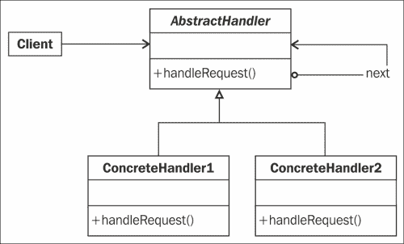
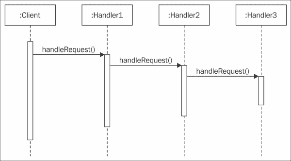
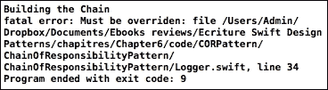
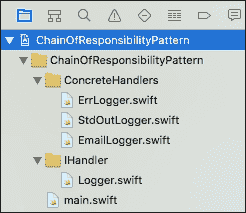
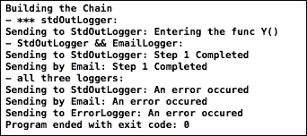
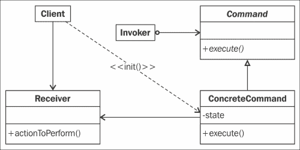
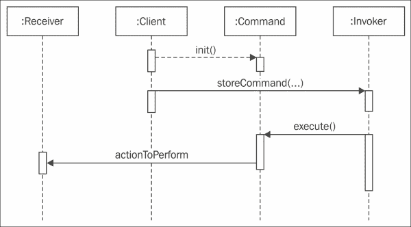
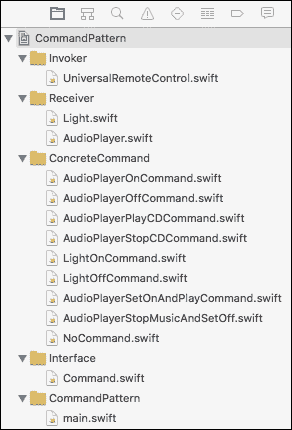
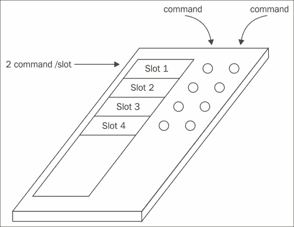
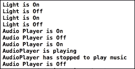

# 第六章。行为模式 – 责任链和命令模式

在本章中，我们将继续探讨行为模式——**责任链**和**命令**模式。这两个模式都涉及将请求传递给将执行操作的适当对象。

这两种模式之间的主要区别在于请求在对象之间传递的方式。

在本章中，我们将讨论以下主题：

+   责任链模式

+   命令模式

# 责任链模式

当你编写应用程序时，可能一个对象生成的事件需要由另一个对象处理。你可能还希望处理对另一个对象不可访问。

## 角色

在本节中，你会注意到责任链模式以这种方式创建对象链，如果链中的对象无法处理请求，它将请求发送到下一个对象，即后续对象，直到其中一个可以处理请求。

此模式允许一个对象发送请求，而无需知道哪个对象将接收并处理它。请求从一个对象发送到另一个对象，使它们成为链的一部分。链中的每个对象都可以处理请求，将其传递给其后续对象，或者两者都做。

当你需要使用此模式时：

+   你希望解耦请求的发送者与接收者，允许其他对象也处理请求

+   能够处理请求的对象是工作链的一部分，请求从一个对象传递到另一个对象，直到至少有一个这些对象可以处理它。

+   你希望允许能够处理请求的对象按照优先级顺序排列，并且可以重新排序，而不影响调用组件

## 设计

以下图展示了责任链模式的通用表示：



## 参与者

此模式有三个参与者，如下所示：

+   `AbstractHandler`：这定义了请求的接口并实现了责任链模式的关联。

+   `ConcreteHandlers`：这些对象可以处理它们负责的请求。如果它们无法处理请求，则将请求传递给其后续对象或停止链。

+   `Client`：客户端将请求发送到可能处理请求的链中的第一个对象。

## 协作

以下序列图展示了对象之间的协作：



客户端将请求发送到链中的第一个对象。然后，此请求在整个链中传播，直到至少有一个链中的对象可以处理它。

## 描述

假设你正在监督一个移动应用程序的开发，并且你想要根据记录器的优先级以不同的方式处理一些日志消息。

你定义了三种类型的优先级，这意味着三种日志级别：`DEBUG`、`INFO`和`ERROR`。

根据日志消息的级别，你可以如下处理：

+   如果级别（或优先级）是 `DEBUG`，那么这将由标准输出记录器处理

+   如果级别是 `INFO`，那么我们将使用标准输出记录器和电子邮件记录器，它们将发送包含消息的电子邮件

+   如果级别是 `ERROR`，那么三个日志记录器都将处理消息：标准输出记录器、电子邮件记录器和错误记录器

如我们所见，我们需要以下顺序定义对象链：`StdOutLogger`、`EmailLogger` 和 `ErrorLogger`。

客户端将只调用第一个具体处理程序，即可能处理请求的类：`StdOutLogger`。

## 实现

要实现我们的模式，我们首先需要准备我们的抽象类。记住，在 Swift 中，抽象类实际上并不存在。我们将以类的方式编写我们的抽象类，但需要重写的方法将具有以下声明：

```swift
preconditionFailure("Must be overridden")
```

在这种情况下，如果调用抽象类的代码而不是派生类中可用的代码，将引发类似于以下异常：



现在我们开始实施。

首先，打开你可以在 `第六章` 文件夹中找到的 `ChainOfResponsibilityPattern` 项目。

项目按照以下结构组织：



这里没有什么是复杂的；我们将定义我们的链并调用 `main.swift` 文件。抽象类在 `Logger.swift` 文件中定义，我们的三个 `concreteHandlers` 类有自己的 Swift 文件。

我们将如下定义抽象类：

```swift
class Logger {
  static var ERROR = 1
  static var INFO = 2
  static var DEBUG = 3

  var mask:Int?
  var next:Logger?

  func nextHandler(nextLogger:Logger) -> Logger? {
    next = nextLogger
    return next
  }

  func message(message: String, priority: Int){
    if priority <= mask {
      writeMessage(message)
      if let next = next {
        next.message(message, priority: priority)
      }
    }
  }

  func writeMessage(message: String) {
    preconditionFailure("Must be overridden")
  }

  static func prepareDefaultChain() -> Logger? {
    var l: Logger?
    var l1: Logger?

    l = StdOutLogger(mask: Logger.DEBUG)
    l1 = l!.nextHandler(EmailLogger(mask: Logger.INFO))
    l1 = l1!.nextHandler(ErrLogger(mask: Logger.ERROR))
    return l
  }}
```

我们定义了三个静态变量，将代表我们不同的日志级别：`ERROR`、`INFO` 和 `DEBUG`。

然后，我们还有两个其他变量被声明，具体如下：

+   **掩码**：这个变量是对象固有的，将在处理程序的初始化期间设置。这个变量将用于将其值与接收到的请求级别进行比较，这意味着如果掩码小于或等于级别，对象将能够处理请求。

+   **下一个**：这个变量也是对象固有的，这允许链式调用。这个变量包含将请求传递的下一个 `ConcreteHandler`。

我们有以下三个函数：

+   `func nextHandler(…)`: 这是一个允许你将下一个具体处理程序分配给 `next` 变量的函数。请注意，这个函数返回一个记录器。这被称为 `nextLogger`。

    因此，如果我们编写以下语句：

    ```swift
    l = StdOutLogger(mask: Logger.DEBUG)
    l1 = l!.nextHandler(EmailLogger(mask: Logger.INFO))
    ```

    然后，`l1` 是一个 `EmailLogger` 实例，而不是 `StdOutLogger`。

+   `func message(…)`: 这是主要函数，它负责（或不）处理请求和/或将其传递给链中的下一个对象。

+   `writeMessage(…)`：此函数由`message(…)`函数调用，以模拟对请求应用的工作。在这里，我们只会显示与当前具体处理器对象相关联的消息。由于我们处于抽象类中，我们添加了一个`preconditionfailure(…)`语句，它将通知我们`this`函数必须在派生类中重写。如果代码执行且派生类没有重写此方法，将引发一个致命错误，这在模式的*实现*部分中有所解释。

+   `prepareDefaultChain(…)`：这是一个类函数，封装了我们默认链的创建。

我们的抽象类现在已经准备好了；我们只需要编写我们的派生类。记住，`writeMessage(…)`函数必须被重写，并且我们需要初始化我们具体处理器的掩码。

首先，让我们看看具体的`StdOutLogger`处理器，如下所示：

```swift
class StdOutLogger: Logger {
  init(mask: Int) {
    super.init()
    self.mask = mask
  }

  override func writeMessage(message: String) {
    print("Sending to StdOutLogger: \(message)")
  }
}
```

接下来，我们有`EmailLogger`类：

```swift
class EmailLogger: Logger {
  init(mask: Int) {
    super.init()
    self.mask = mask
  }

  override func writeMessage(message: String) {
    print("Sending by Email: \(message)")
  }
}
```

此外，我们还有`ErrLogger`类：

```swift
class ErrLogger: Logger {
  init(mask: Int) {
    super.init()
    self.mask = mask
  }

  override func writeMessage(message: String) {
    print("Sending to ErrorLogger: \(message)")
  }
}
```

我们的所有具体处理器现在都准备好了。现在是时候在`main.swift`文件中编写我们的测试了。

我们首先使用`Logger`类的函数`prepareDefaultChain`准备我们的链：

```swift
print("Building the Chain")
var l: Logger?

l = Logger.prepareDefaultChain()
```

然后，我们向链的第一个对象（`l`是`StdOutLogger`）发送一个请求（一个包含日志类型的字符串消息）：

```swift
print("- *** stdOutLogger:")
// Handled by StdOutLogger
l?.message("Entering the func Y()", priority: Logger.DEBUG)

print("- StdOutLogger && EmailLogger:")
// Handled by StdOutLogger && EmailLogger
l?.message("Step 1 Completed", priority: Logger.INFO)

print("- all three loggers:")
// Handled by all Logger
l?.message("An error occurred", priority: Logger.ERR)
```

现在，我们将构建并运行项目。你将在控制台上看到以下结果：



控制台输出非常清晰。第一个处理器只处理了第一个请求，第二个请求由`StdOutLogger`类和`EmailLogger`类处理。第三个请求由所有三个处理器处理。

# 命令模式

此模式背后的概念是将请求转换成一个对象，以便简化某些操作，例如撤销/重做、将请求插入队列或跟踪请求。

## 角色

命令模式在请求操作的客户端和可以执行它的对象之间创建距离。请求被封装成一个对象。此对象包含对将实际执行操作的接收者的引用。

实际操作由接收者管理，命令就像一个指令；它只包含对调用者的引用，即执行动作的对象，以及一个执行函数将调用工作者的实际操作。

此模式允许以下功能：

+   向不同的接收者发送请求

+   排队、记录和拒绝请求

+   可撤销的操作（`execute`方法可以记住状态，并允许你回到那个状态）

+   将请求封装在对象中

+   允许客户端使用不同的请求进行参数化

## 设计

通用图类表示如下：



## 参与者

参与此模式的类如下：

+   `Command`：这声明了执行操作的接口。

+   `ConcreteCommand`：通过在 `Receiver` 上调用相应的操作来实现 `Command` 接口，并使用 `execute` 方法。它定义了 `Receiver` 类和动作之间的链接。

+   `Client`：创建一个 `ConcreteCommand` 对象并设置其接收者。

+   `Invoker`：请求命令执行请求。

+   `Receiver`：知道如何执行操作。

## 协作

以下序列图定义了所有参与命令模式的对象的协作：



让我们详细讨论前面的图示：

+   客户端请求执行命令并指定其接收者

+   客户端随后将命令发送给执行者，执行者将其存储（或将其放入队列系统，如果某些操作需要在执行命令之前执行）以便稍后执行

+   然后，调用执行者来启动命令，通过在适当的命令对象上调用执行函数

+   具体命令请求接收者执行适当的操作

## 插图

想象一下，您的公司正在开发一个新的通用控制器，它可以管理多达四个命令。这个控制器有四个插槽，我们可以为每个插槽添加两个命令。在每个插槽附近，我们有两个按钮：“开”和“关”按钮。

您的团队已经有两个对象及其规格，允许遥控器操作它们：

+   我们将与之交互的对象是一个灯具和一个音频播放器

+   灯具只能打开和关闭

+   音频播放器可以打开或关闭，我们可以播放或停止音乐

您的工作是构思将被存储在通用遥控器中的命令。

当我们按下插槽的开关按钮时，应向适当的设备（音频播放器或灯具）发送适当的命令。

### 注意

在这个例子中，我们不会实现撤销/重做操作。我们将在下一章展示另一个针对这种情况的专用模式。

## 实现

打开名为 `CommandPattern.xcodeproj` 的 Xcode 项目。以下是我们的项目组织结构：



我们项目的结构反映了我们在命令模式的 *设计* 部分看到的类图：

+   我们有 `Invoker` 文件夹，其中包含我们的 `UniversalRemoteController` 对象

+   `Receiver` 文件夹包含两个设备，它们将能够接收命令以执行适当的操作

+   `Interface` 文件夹包含了命令的定义

+   `ConcreteCommand` 文件夹包含了我们想要与我们的通用遥控器一起使用的所有命令

+   最后，`main.swift` 文件包含了允许我们查看演示的代码

为了实现这个例子，让我们从定义我们的 `Command` 接口开始。

我们只需要一个 `execute()` 方法来执行命令：

```swift
protocol ICommand {
  func execute()
}
```

在我们编写具体的命令对象之前，让我们看看我们的 `Light` 和 `AudioPlayer` 对象是如何实现的：

```swift
class Light {

  func on() {
    print("Light is On")
  }

  func off() {
    print("Light is Off")
  }
}
```

这相当简单；`on()` 函数会打开灯光，而 `off()` 函数会关闭它。

现在，让我们定义 `AudioPlayer` 类：

```swift
class AudioPlayer {

  enum AudioPlayerState {
    case On
    case Off
    case Playing
  }

  private var state = AudioPlayerState.Off

  func on() {
    state = AudioPlayerState.On
    print("Audio Player is On")
  }

  func off() {
    state = AudioPlayerState.Off
    print("Audio Player is Off")
  }

  func playCD(){
    if state == AudioPlayerState.Off {
      print("doesn't work : the audio player is currently off")
    } else {
      state = AudioPlayerState.Playing
      print("AudioPlayer is playing")
    }
  }

  func stopCD(){
    if state == AudioPlayerState.Off {
      print("doesn't work : the audio player is currently off")
    }
    if state == AudioPlayerState.On {
      print("doesn't work : the audio player currently doesn't play music")
    } else {
      state = AudioPlayerState.On
      print("AudioPlayer has stopped to play music")
    }
  }
}
```

这个对象更复杂。我们拥有相同的 `on()` 和 `off()` 方法，但我们还有 `playCD()` 和 `StopCD()` 方法。

我们可以看到这个对象有一个内部状态。状态根据调用的函数和状态也会用来控制请求的函数是否可行。

现在我们已经拥有了所有必要的信息，我们可以开始编写我们的命令。

让我们从灯光开始。我们希望能够使用我们的通用遥控器根据插槽附近的按钮来打开或关闭灯光。

因此，我们首先编写我们的 `LightOnCommand` 具体命令对象：

```swift
class LightOnCommand: ICommand {

  var light:Light

  init(light: Light) {
    self.light = light
  }

  func execute() {
    self.light.on()
  }
}
```

在这里，我们创建了一个名为 `LightOnCommand` 的对象，该对象实现了 `ICommand` 接口。

命令需要知道接收器对象是什么，因此我们在初始化对象时传递一个参数给它：

```swift
 init(light: Light) {
    self.light = light
  }
```

然后，`execute` 方法封装了对 `Light` 对象 `on()` 函数的调用，以有效地处理命令。

就这样；你的 `LightOnCommand` 对象现在准备好了。

我们对 `LightOffCommand` 类也做了同样的处理，并在适当的地方进行修改，以便使用 `Light` 对象的 `off()` 函数而不是 `on()`：

```swift
class LightOffCommand: ICommand {

  var light:Light

  init(light: Light) {
    self.light = light
  }

  func execute() {
    self.light.off()
  }
}
```

我们控制灯光的命令都已经准备好了。现在让我们看看我们将为音频播放器做些什么。我们希望能够打开或关闭音频播放器，播放或停止音乐。这些命令与我们之前对灯光所做的是相似的。

`AudioPlayerOnCommand` 类编写如下：

```swift
class AudioPlayerOnCommand: ICommand {
  var audioPlayer:AudioPlayer

  init(audioPlayer:AudioPlayer) {
    self.audioPlayer = audioPlayer
  }

  func execute() {
    audioPlayer.on()
  }
} 
```

`AudioPlayerOffCommand` 类编写如下：

```swift
class AudioPlayerOffCommand: ICommand {
  var audioPlayer:AudioPlayer

  init(audioPlayer:AudioPlayer) {
    self.audioPlayer = audioPlayer
  }

  func execute() {
    audioPlayer.off()
  }
}
```

`AudioPlayerPlayCdCommand` 类编写如下：

```swift
class AudioPlayerPlayCDCommand: ICommand {
  var audioPlayer:AudioPlayer

  init(audioPlayer:AudioPlayer) {
    self.audioPlayer = audioPlayer
  }

  func execute() {
    audioPlayer.playCD()
  }
}
```

`AudioPlayerStopCDCommand` 类编写如下：

```swift
class AudioPlayerStopCDCommand: ICommand {
  var audioPlayer:AudioPlayer

  init(audioPlayer:AudioPlayer) {
    self.audioPlayer = audioPlayer
  }

  func execute() {
    audioPlayer.stopCD()
  }
}
```

到目前为止，所有需要的命令都已经编写完成。

我们希望使用只有四个插槽的遥控器，如下面的图所示。通过遥控器，我们希望能够操作两个灯光：一个在卧室，一个在大厅，以及一个音频播放器来播放和停止音乐：



为什么不创建一个命令，该命令可以在同一个命令对象中打开音频播放器和播放音乐呢？确实，使用我们的遥控器只执行开或关命令是毫无用处的。我们想要的只是播放或停止音乐。

想象一下，你只想通过按一个按钮就能打开音频播放器和播放光盘；同样地，你只想通过按一个按钮就能停止光盘播放器和关闭音频播放器。

为了实现这一点，我们只需要在命令的 `execute` 函数中封装适当的音频播放器对象的函数。当我们的遥控器调用 `execute` 方法时，我们首先调用 `audioPlayer` 类的 `on` 函数，然后调用 `playCD()` 函数：

```swift
class AudioPlayerSetOnAndPlayCommand: ICommand {
  var audioPlayer:AudioPlayer

  init(audioPlayer:AudioPlayer) {
    self.audioPlayer = audioPlayer
  }

  func execute() {
    audioPlayer.on()
    audioPlayer.playCD()
  }

}
```

同样，我们继续我们的 `StopMusicAndSetOff` 命令：

```swift
class AudioPlayerStopMusicAndSetOff: ICommand {
  var audioPlayer:AudioPlayer

  init(audioPlayer:AudioPlayer) {
    self.audioPlayer = audioPlayer
  }

  func execute() {
    audioPlayer.stopCD()
    audioPlayer.off()
  }

}
```

我们设备已准备好接受命令，命令对象也已就绪。在我们开始编写演示代码之前，让我们看看遥控器是如何工作的：

```swift
class UniversalRemoteControl {
  var onCommands = [ICommand]()
  var offCommands = [ICommand]()

  init() {
    for _ in 1...4 {
      onCommands.append(NoCommand())
      offCommands.append(NoCommand())
    }
  }

  func addCommandToSlot(slot:Int, onCommand:ICommand, offCommand:ICommand) {
    onCommands[slot] = onCommand
    offCommands[slot] = offCommand
  }

  func buttonOnIsPushedOnSlot(slot:Int) {
    onCommands[slot].execute()
  }

  func buttonOffIsPushedOnSlot(slot:Int) {
    offCommands[slot].execute()
  }
}
```

当遥控器初始化时，四个槽位分配了一个`NoCommand`对象。该对象如下：

```swift
class NoCommand: ICommand {

  func execute() {
    print("No command associated to this")
  }
}
```

因此，如果我们不使用`addCommandToSlot(…)`函数，每个按钮将调用`NoCommand`对象的`execute`函数，这意味着没有事情要做。

遥控器有两个按钮靠近每个槽。根据按钮和槽，将调用`buttonOnIsPushedOnSlot(…)`或`buttonOffIsPushedOnSlot`。

由于命令存储在`onCommands`和`offCommands`数组中，当调用`addCommandToSlot`时，我们将调用相应对象的`execute`命令。要执行槽的开启命令，我们将运行以下代码：

```swift
    onCommands[slot].execute()
```

要执行相同槽位的关闭命令，我们也将运行以下代码：

```swift
    offCommands[slot].execute()
```

在这里，`slot`是按钮槽的索引。现在，是时候实现我们的演示代码了。

首先，我们初始化我们的遥控器，创建我们的`audioPlayer`，并创建我们的两个灯：卧室灯和走廊灯：

```swift
let uRemoteControl = UniversalRemoteControl()

let audioPlayerLivingRoom = AudioPlayer()
let lightBedroom = Light()
let lightHall = Light()
```

然后，我们创建所有命令对象：

```swift
// MARK: Definition of our commands
let bedroomLightOnCommand = LightOnCommand(light: lightBedroom)
let bedroomLightOffCommand = LightOffCommand(light: lightBedroom)

let hallLightOnCommand = LightOnCommand(light: lightHall)
let hallLightOffCommand = LightOffCommand(light: lightHall)

let audioPlayerLivingRoomOnCommand = AudioPlayerOnCommand(audioPlayer: audioPlayerLivingRoom)
let audioPlayerLivingRoomOffCommand = AudioPlayerOffCommand(audioPlayer: audioPlayerLivingRoom)

let audioPlayerOnAndPlayLivingRoom = AudioPlayerSetOnAndPlayCommand(audioPlayer: audioPlayerLivingRoom)
let audioPlayerStopAndOffLivingRoom = AudioPlayerStopMusicAndSetOff(audioPlayer: audioPlayerLivingRoom)
```

当我们的命令准备就绪后，我们可以使用`addCommandToSlot`函数将它们分配给遥控器：

```swift
// Mark: Assign commands to the remote controller
uRemoteControl.addCommandToSlot(0, onCommand: bedroomLightOnCommand, offCommand: bedroomLightOffCommand)
uRemoteControl.addCommandToSlot(1, onCommand: hallLightOnCommand, offCommand: hallLightOffCommand)

uRemoteControl.addCommandToSlot(2, onCommand: audioPlayerLivingRoomOnCommand, offCommand: audioPlayerLivingRoomOffCommand)
uRemoteControl.addCommandToSlot(3, onCommand: audioPlayerOnAndPlayLivingRoom, offCommand: audioPlayerStopAndOffLivingRoom)
```

演示所需的最后一件事是模拟每个按钮的按下：

```swift
// Mark: Usage of the remote controller
uRemoteControl.buttonOnIsPushedOnSlot(0)
uRemoteControl.buttonOffIsPushedOnSlot(0)

uRemoteControl.buttonOnIsPushedOnSlot(1)
uRemoteControl.buttonOffIsPushedOnSlot(1)

uRemoteControl.buttonOnIsPushedOnSlot(2)
uRemoteControl.buttonOffIsPushedOnSlot(2)

uRemoteControl.buttonOnIsPushedOnSlot(3)
uRemoteControl.buttonOffIsPushedOnSlot(3)
```

### 注意

注意，我们还没有添加并发保护。如果命令被多个组件使用，我们应该确保添加并发保护。

为了实现这一点，我们需要创建一个队列，该队列将接收所有命令，以同步方式执行它们，并且第一个进入队列的命令将是第一个执行的命令（先进先出）。要了解如何实现并发保护，您可以查看第七章中中介者模式的实现，*行为型模式 – 迭代器、中介者和观察者*以及同一章节中关于并发保护的注释。

点击构建并运行演示。

您现在将在控制台看到以下结果，对应于通用遥控器上按下的每个按钮：



# 责任链模式和命令模式之间的比较

这两种模式之间的区别在于请求解耦的方式。

在责任链模式中，请求被传递给潜在的接收者，而命令模式使用一个封装请求的命令对象。

以下表格描述了责任链模式和命令模式之间的区别：

|   | 责任链 | 命令 |
| --- | --- | --- |
| 客户端创建 | 处理器对象 | 命令对象 |
| 不同类型的 | 不同级别的处理器类 | 命令类和接收者类 |
| 客户端可以与 | 多个处理器 | 不同的接收者 |
| 客户端调用 | 处理器对象 | 接收器对象 |
| 在处理器中完成工作 | 处理器中的`HandleRequest` | 接收器中的`ActionToPerform` |
| 基于决策 | 处理器中的掩码 | 命令中的路由 |

# 摘要

我希望这一章对您来说很有趣。在这一章中，我们学习了如何在责任链模式和命令模式中解耦发送者和接收者，从而提高系统的分层和可复用性。

在下一章中，我们将探讨三种新的模式：迭代器模式、中介者模式和观察者模式，这些模式专注于在保持对象独立性的同时进行对象间的通信。
