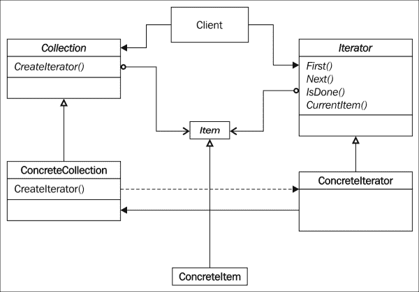
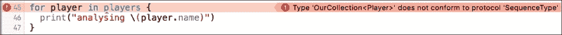
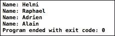
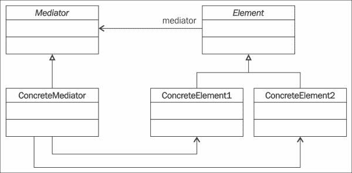
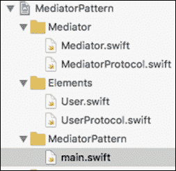
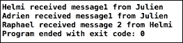
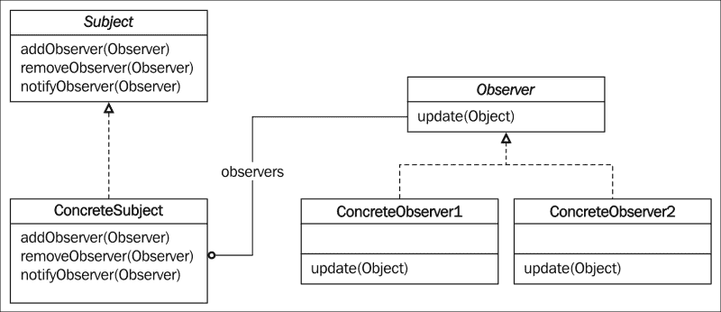
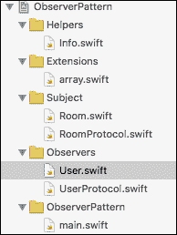
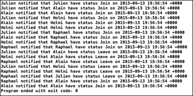

# 第七章。行为模式 – 迭代器、中介者和观察者

本章向您介绍了三种其他的行为模式，这些模式支持对象之间的通信。对象保持其独立性，有时甚至保持匿名性。迭代器模式通常与数组、集合和字典对象一起使用。中介者允许两个对象之间进行通信，而无需知道彼此的身份，观察者模式则反映了在分布式系统中广为人知的发布/订阅方法。

本章分为三个部分：

+   迭代器模式

+   中介者模式

+   观察者模式

# 迭代器模式

这个模式在许多使用数组或对象集合的语言中很常见。它允许遍历集合中包含的对象列表。

## 角色

迭代器模式允许你按顺序遍历对象的聚合对象，而无需知道集合的结构。

## 设计

这里，你可以找到该模式的通用 UML 类图，但请注意，我们不会使用这种方式来实现它。

事实上，Swift 提供了一些类型，可以简化迭代器模式的实现，无需手动生成所有必需的要求。

为什么要重新发明轮子？以下图表示了通用的 UML 类图：



## 参与者

就像到目前为止描述的每一个模式一样，即使在我们实现该模式时不会看到所有参与者，我仍会告诉你这个模式中的参与者：

+   `Collection`: 这是一个抽象类，它实现了集合与项之间的关联以及 `CreateIterator()` 方法

+   `ConcreteCollection`: 这是一个具体的集合子类，它将 `CurrentItem` 对象链接到 `ConcreteItem` 对象，并将 `Iterator` 接口链接到 `ConcreteIterator` 对象

+   `Iterator`: 这是一个抽象类，它实现了迭代器和集合项之间的关联以及方法

+   `ConcreteIterator`: 这是一个具体子类，它将我们的 `currentItem` 链接到 `ConcreteItem` 对象

+   `Item`: 这是集合项的抽象类

+   `ConcreteItem`: 这是一个由 `ConcreteIterator` 和 `ConcreteCollection` 使用的具体 `Item` 子类

## 协作

迭代器会记住集合中的当前项。它还可以计算并预测迭代中的下一个对象。

## 插图

你正在开发一个游戏，你可以有最多四个玩家。你想要能够遍历所有四个玩家来进行某些操作。在我们的示例中，我们将显示每个玩家的名字。

## 实现

这里提供的方法来自在 [`lillylabs.no/2014/09/30/make-iterable-swift-collection-type-sequencetype/`](http://lillylabs.no/2014/09/30/make-iterable-swift-collection-type-sequencetype/) 网站上发现的思路。

好吧，根据我们的说明，我们想要能够使用 `for…in` 循环结构来迭代。

全靠 Swift，我们有一些元素将简化此模式的实现。

事实上，Swift 提出了一个 `SequenceType` 协议和一个 `AnyGeneratorType<T>` 类，该类实现了 `GeneratorType` 协议。

`SequenceType` 协议定义了一个协议，允许我们使用 `for…in` 循环结构迭代集合中的元素。它要求类实现 `generate()` 方法，该方法返回一个符合 `GeneratorType` 协议的对象。

`<T>` 表示任何类型的 `Item`。

说了这么多，我们如何使用所有前面的函数轻松地迭代任何类型的集合？比如说，我们有一个以下类：

```swift
class Player {
  var name: String!

  init(name: String) {
   self.name = name
  }
}
```

因此，我们定义了一个简单的 `Player` 类，我们在构造函数中传递一个字符串，它对应于玩家的名字。

我们假设我们的游戏中我们有四个玩家，并希望能够迭代每个玩家以显示他们的名字。

因此，最终的测试代码将类似于以下内容：

```swift
for player in players {
  print("analysing \(player.name)")
}
```

现在如何用奖金来完善我们的代码，一些可以与任何我们想要迭代的类一起工作的东西？嗯，我们将使用 Swift 提供的另一个概念：**扩展**。

首先要做的事情是创建一个对象或结构体，它将允许我们迭代任何类类型：

```swift
struct OurCollection<T> {
  let items: [T]
} 
```

因此，我们定义了一个我们称之为 `OurCollection` 的结构体，其中项目类型为 `T`。

现在，我们将能够写出以下内容：

```swift
let player1 = Player(name: "Helmi")
let player2 = Player(name: "Raphael")
let player3 = Player(name: "Adrien")
let player4 = Player(name: "Alain")

let players = OurCollection(items:[player1,player2, player3, player4])
```

然而，`for…in` 循环仍然不会工作，如下面的截图所示：



即使玩家没有实现 `SequenceType` 协议。这里就是魔法：

```swift
extension OurCollection: SequenceType {
  typealias Generator = AnyGenerator<T>

  func generate() -> Generator {
    var i = 0
    return anyGenerator {
      return i >= self.items.count ? nil : self.items[i++]
    }
  }
}
```

哇！这里有很多新东西：

首先，我们通过告诉我们要实现 `SequenceType` 协议来创建 `OurCollection` 结构体的一个扩展。

因此，我们实现了 `generate()` 方法，该方法将返回迭代中的下一个类型 `T` 对象。注意以下行：

```swift
 func generate() -> Generator {

```

生成器是 `AnyGenerator<T>` 的别名：

```swift
  typealias Generator = AnyGenerator<T>
```

我们使用这个来简化编写。我们可以移除类型别名声明并写：

```swift
func generate() -> AnyGenerator<T> {

```

另一个函数是这里看到的 `anyGenerator` 函数：

```swift
 return anyGenerator {
 return i >= self.items.count ? nil : self.items[i++]
 }

```

Swift 2.0 文档说明，`anyGenerator` 函数具有以下签名：

```swift
func anyGenerator<Element>(body: () -> Element?) -> AnyGenerator<Element>
```

这个函数的目的是返回一个 `GeneratorType` 实例，其 `next` 方法调用 `body` 并返回结果。

因此，我们从索引 `0` 开始到 `self.items.count` 值的索引，并在新的 `GeneratorType` 实例中添加 `sel.items[i++]`。当 `i` 大于项目数组中的元素数量时，返回新的 `GeneratorType` 实例。

我们也可以写出如下函数：

```swift
  func generate() -> Generator {
    var i = 0
   let seq = anyGenerator {i < self.items.count ? self.items[i++] : nil}
    return seq
 }
```

同样，还有这样的：

```swift
  func generate() -> Generator {
    var i = 0
   return anyGenerator {i < self.items.count ? self.items[i++] : nil}
 }
```

这里，我们使用一个带有 `anyGenerator` 函数的闭包来返回一个我们可以迭代的新的元素序列。我们的最终代码如下：

```swift
import Foundation

struct OurCollection<T> {
  let items: [T]
}

class Player {
  var name: String!

  init(name: String) {
   self.name = name
  }
}

extension OurCollection: SequenceType {
  typealias Generator = AnyGenerator<T>

  func generate() -> Generator{
    var i = 0
    // Construct a AnyGenerator<T> instance, passing a closure
    // that returns the next type T object in the iteration
    return anyGenerator {
      return i >= self.items.count ? nil : self.items[i++]
    }
  }
}

let player1 = Player(name: "Helmi")
let player2 = Player(name: "Raphael")
let player3 = Player(name: "Adrien")
let player4 = Player(name: "Alain")

let players = OurCollection(items:[player1,player2, player3, player4])

for player in players {
  print("Name: \(player.name)")
}
```

打开 `iteratorPattern` 项目，构建并运行它。你现在将看到以下结果：



# 中介者模式

中介者模式用于减少相互通信的类之间的耦合。

## 角色

此模式构建了一个对象，该对象管理两个或更多类之间的通信。

这些类不知道彼此的实现。消息是从类发送到中介器对象的。

中介者模式定义了一个对象，该对象封装了一组对象如何相互通信的方式。中介者通过保持对象不显式地相互引用来促进松散耦合，它还允许你独立地改变它们的交互。

中介器是一个用于解耦许多对等的中间人。当我们想要设计可重用组件，但潜在可重用部分的依赖关系表现出“意大利面代码”现象时，可以使用此模式。

## 设计

以下类图展示了中介者模式的通用结构：



## 参与者

在此模式中，我们发现以下参与者：

+   `Mediator`：这定义了与元素通信的中介器接口

+   `ConcreteMediator`：这实现了元素之间的协调并管理与元素的联系

+   `Elements`：这是一个元素抽象类，它引入了常见的属性、属性和方法

+   `ConcreteElement1` 和 `ConcreteElement2`：这些是混凝土元素类，它们与中介器通信而不是与其他元素通信

## 协作

元素向中介器发送消息并从中接收消息。中介器实现了元素之间的协作和协调。

## 插图

你正在编写一个允许用户相互通信的系统。通信不是直接从对等方发送到另一个对等方。我们将使用一些中介器来管理所有用户及其之间的通信。

对于此，每个由中介器管理的用户都将被注册（添加）到中介器中。然后，当用户发送消息时，我们将中介器对象作为参数传递，通知系统这是将要广播给由中介器管理的所有其他用户的消息，调用 `receiveMessage` 函数。

## 实现

打开 `MediatorPattern` Xcode 项目。这是一个命令行项目，其组织结构如下截图所示：



我们项目的组织结构不超过我们在类图中描述的参与者。我们在 `Mediator` 文件夹中检索 `MediatorProtocol` 和 `ConcreteMediator` 对象，我们的 `Elements` 和具体元素 `UserProtocol` 和 `User` 在 `Elements` 文件夹中，最后，`main.swift` 文件包含我们的客户端代码以模拟项目。

首先，我们在 `UserProtocol.swift` 文件中定义 `userProtocol`：

```swift
protocol UserProtocol {
  func sendMessage(mediator:MediatorProtocol, message:AnyObject)
  func receiveMessage(message:AnyObject)
}
```

`sendMessage` 方法将被用来告诉传入的中介参数当前 `concreteUser` 的消息内容。当中介向所有用户广播消息时，将触发 `receiveMessage` 方法。

然后，在 `User.swift` 文件中，我们实现我们的协议，如下所示：

```swift
class User: UserProtocol {
  var name: String

  init(name: String){
   self.name = name
  }

  func sendMessage(mediator:MediatorProtocol, message:AnyObject){
    mediator.broadcastMessage(self, message: message as AnyObject)
  }

  func receiveMessage(message:AnyObject){
    print("\(self.name) received \(String(message))")
  }
}
```

这里，我们在构造函数中添加一个参数来传递用户的名称。

在 `sendMessage` 方法中，我们看到我们正在调用传入参数的中介的 `broadcastMessage` 方法。

当 `receiveMessage` 方法被触发时，它将显示当前用户的名称以及接收到的消息。

接下来，让我们看看 `MediatorProtocol` 是如何定义的：

```swift
protocol MediatorProtocol {
  var users:[UserProtocol]? { get }

  func broadcastMessage(sender:UserProtocol, message:AnyObject)
  func register(users: UserProtocol)
}
```

`MediatorProtocol` 管理元素集合；这里，它是 `Users`。它还可以向特定用户广播特定消息。

为了将用户添加到中介管理的用户集合中，我们添加了一个 `Register` 方法。

让我们看看我们是如何在 `Mediator.swift` 文件中实现所有这些的：

```swift
class Mediator: MediatorProtocol {
  private let queue = dispatch_queue_create("MediatorPattern", DISPATCH_QUEUE_CONCURRENT)
  var users:[UserProtocol]? = [User]()

  func broadcastMessage(sender:UserProtocol, message:AnyObject){
    dispatch_barrier_sync(self.queue, { () in

      guard let users = self.users else {
        return
      }

      for u in users{
        if u as! User !== sender as! User {
          u.receiveMessage(message)
        }
      }

    })
  }
  func register(user: UserProtocol){
    dispatch_barrier_sync(self.queue, { () in
      users?.append(user)
    })
  }
}
```

首先，我们初始化一个 `User` 数组，它准备好管理用户集合。

在 `register` 方法中，我们接收一个用户参数，该参数被添加到中介管理的集合中。

然后，`broadcastMessage` 方法：

```swift
    guard let users = users else {
      return
    }
```

我们需要确保 `user` 数组没有 `nil` 值，如果是这种情况，我们就不做任何事情，通过留下方法调用 `return` 关键字。

然后，我们遍历集合中的所有用户，如果迭代中的当前用户与发送消息的用户（sender）不同，则我们调用当前用户的 `receiveMessage` 方法，以及要传输的消息。

### 注意

**并发保护**

你可能已经看到了以下这一行：

```swift
  private let queue = dispatch_queue_create("MediatorPattern", DISPATCH_QUEUE_CONCURRENT)
```

当多个用户同时尝试访问同一个用户时，我们需要在这个模式中创建并发保护，因此我们使用了苹果开发的一项技术：Grand Central Dispatch，它允许程序中可以并行运行的任务被排队执行，并且根据处理资源的可用性，将它们调度到任何可用的处理器核心上。

通过这一行，我们使用 `dispatch_queue_create` 初始化 `queue` 为一个并发队列。第一个参数简单地描述了我们的队列是什么（在调试代码时可能很有帮助），第二个参数指定我们希望我们的队列是并发的。

接下来，我们想要保护我们的代码的访问，这些代码是读取和写入数组的。为此，GCD 提供了一个创建读写锁的优雅解决方案，使用 dispatch barrier。因此，我们使用 `dispatch_barrier_sync` 来传递我们的队列和队列要执行的语句。由于我们编写的代码是一个屏障闭包，它将永远不会与队列中的任何其他闭包同时运行。有关 Grand Central Dispatch 的更多信息：[`www.raywenderlich.com/79149/grand-central-dispatch-tutorial-swift-part-1`](http://www.raywenderlich.com/79149/grand-central-dispatch-tutorial-swift-part-1)

我们的所有参与者现在都已就绪。我们现在将在`main.swift`文件中尝试所有这些。我们创建四个用户，每个用户都有一个名字：

```swift
var user1 = User(name: "Julien")
var user2 = User(name: "Helmi")
var user3 = User(name: "Adrien")
var user4 = User(name: "Raphael")
```

然后，我们实例化第一个中介者并将刚刚创建的前三个用户添加到由`mediator1`管理的用户集合中：

```swift
var mediator1 = Mediator()
mediator1.register(user1)
mediator1.register(user2)
mediator1.register(user3)
```

现在，我们想要测试`user1`是否可以向`user2`和`user3`发送消息。我们只需要调用`user1`的`sendMessage`方法，传递`mediator1`和要发送的消息：

```swift
user1.sendMessage(mediator1, message: "message1 from \(user1.name)")
```

因此，在这种情况下，只有`user2`（Helmi）和`user3`（Adrien）应该从`user1`（Julien）那里接收消息。

我们想要尝试使用另一个中介者，但只有两个用户：`user2`和`user4`：

```swift
var mediator2 = Mediator()
mediator2.register(user2)
mediator2.register(user4)

user2.sendMessage(mediator2, message: "message 2 from \(user2.name)")
```

在这里，只有`user4`（Raphael）应该从`user2`（Helmi）那里接收消息。

构建并运行项目。你现在应该能够在控制台对话框中看到以下结果：



# 观察者模式

观察者模式是另一种常用于网络系统的行为模式，其中主题（服务器）将通知一些客户端。iOS 通过`NSNotificationCenter`对象大量使用此模式。

## 角色

观察者模式在主题和观察者之间创建依赖关系，以便在主题被修改时通知观察者以更新它们的状态。

这种组合意味着观察者不需要询问主题的当前状态。他们只需要注册到其通知。

此模式可以在以下情况下使用：

+   对象内部的状态修改需要动态更新其他对象

+   一个对象想要阻止其他对象，而不需要知道它们的类型（不需要与它们高度耦合）

+   我们不希望将两个对象合并成一个

## 设计

以下图表示观察者模式的 UML 类图：



## 参与者

此模式由以下参与者组成：

+   `Subject`：这定义了添加、删除和通知观察者所需的方法。

+   `ConcreteSubject`：这实现了`Subject`方法。当其状态被修改时，它发送一个通知。

+   `Observer`：这是一个具有`update()`方法的通用接口，当观察者需要被通知主题的修改时，主题将调用此方法。

+   `ConcreteObserver1`和`ConcreteObserver2`：这实现了`update()`方法。

## 协作

当`ConcreteSubject`类的内部状态被修改时，它会通知观察者。当一个具体的观察者接收到这个通知时，它会相应地更新。为了完成更新，它可以调用一些主题方法，这些方法可以访问其状态。

## 插图

你正在开发一个新网站，你希望允许互联网用户通过聊天系统相互通信。你的第一项工作将是提供一个房间，这是所有互联网用户的入口点。每次有新用户加入房间时，每个用户都会收到通知。

观察者模式完全适用于实现代码，从而解决了这个问题。

## 实现

打开`ObserverPattern` Xcode 项目，查看我们代码的当前结构：



我们将检索`Subject`文件夹和`Observers`文件夹，在那里我们将找到我们模式的参与者。`Helpers`文件夹包含一个类，我们将在稍后发送消息时使用它。

`Extension`文件夹包含一个数组扩展，这是为了使我们能够从主题管理的用户集合中删除特定的对象。

最后，我们找到用于模拟交互的`main.swift`文件。

因此，让我们从在`UserProtocol.Swift`文件中定义我们的观察者开始我们的代码：

```swift
protocol UserProtocol {
  func update(object:AnyObject)
}
```

我们简单地定义一个带有对象参数的更新方法。`UserProtocol`的实现将如下所示：

```swift
class User: UserProtocol{
  let name: String!

  init(name: String) {
    self.name = name
  }

  func update(object:AnyObject) {
    let info = object as! Info
    print("\(self.name) notified that \(info.message) have status \(info.status) on \(info.date.description)")
  }
}
```

我们在`User`对象的构造函数中传递一个名称。

然后，在`update`方法中，我们准备一个将在控制台上显示的消息。我们将我们的`AnyObject`类型对象向下转换为`Info`对象；这个对象是一个辅助对象。你将在`Helper`文件夹中的`Info.swift`文件中找到它的代码：

```swift
class Info {
  var date = NSDate()
  var message:String!
  var status:InfoStatus!

  init(msg: String, status:InfoStatus) {
    self.message = msg
    self.status = status
  }
}
```

`Info`对象包含三个值：日期、消息和状态。

日期是当前日期，在初始化`Info`对象时定义。消息是在初始化 info 对象时接收到的字符串，状态是在初始化对象时通过参数传递的枚举，它可以有以下值：

```swift
enum InfoStatus {
  case Join
  case Leave
}
```

现在，我们只需要定义我们的主题协议，并在我们的具体主题中实现它。主题代表需要被观察的对象。

我们的主题定义可以在`Subject`文件夹中的`RoomProtocol.swift`文件中找到：

```swift
protocol RoomProtocol {
  func addObserver(user: User)
  func removeObserver(user: User)
  func notifyObserver(object: AnyObject)
}
```

这三个方法是观察者模式中任何主题所必需的最小方法。

`addObserver`函数允许你在主题管理的观察者集合中注册一个观察者。

`removeObserver`方法用于从主题管理的集合中删除观察者。

最后，`notifyObserver`方法用于通知所有我们的观察者。

实现将在`Room.swift`文件中找到，如下所示：

```swift
class Room: RoomProtocol {

  private var users = [User]()

  func addObserver(user: User) {
    users.append(user)
    let info = Info(msg: "\(user.name)", status: .Join)
    notifyObserver(info)
  }

  func removeObserver(user: User) {
    users.removeObject(user)
    let info = Info(msg: "\(user.name)", status: .Leave)
    notifyObserver(info)
  }

  func notifyObserver(object: AnyObject){
    for u in users {
      u.update(object)
    }
  }
}
```

在这里，你检索三个方法，在前两个方法中，你看到对`notifyObserver`方法的调用。

每次调用`addObserver`或`removeObserver`方法时，所有用户都会收到通知，因为当新用户加入房间时，会调用`addObserver`方法，我们在`Info`消息中显示`Join`状态。按照同样的原则，当调用`removeObserver`方法时，我们显示`Leave`状态。

`notifyObserver`方法接收一个类型为`AnyObject`的参数，该参数将通过`Room`方法管理的集合中每个用户对象的`update`方法进行传播。

现在是我们编写演示代码的时候了，打开`main.swift`文件，并编写代码。

首先，我们初始化我们的`Room`方法和四个互联网用户：

```swift
let room = Room()
let user1 = User(name:"Julien")
let user2 = User(name:"Alain")
let user3 = User(name:"Helmi")
let user4 = User(name:"Raphael")
```

然后，我们将每个用户注册到房间中：

```swift
room.addObserver(user1)
room.addObserver(user2)
room.addObserver(user3)
room.addObserver(user4)
```

### 注意

每次调用`addObserver`方法时，所有当前注册的用户都会收到通知，表明当前注册的用户已加入。

因此，当调用`room.addObserver(user1)`时，只有`user1`会被通知，但当注册`user2`时，`user1`和`user2`都会被通知，依此类推。

现在，我们按顺序移除`user2`、`user3`和`user1`：

```swift
room.removeObserver(user2)
room.removeObserver(user3)
room.removeObserver(user1)
```

为了完成我们的示例，我们再次注册`user2`：

```swift
room.addObserver(user2)
```

现在，让我们构建并运行项目。你将得到以下结果：



这里，我们看到了所有的通知。第一行对应于第一次调用的`addObserver`。接下来的两行对应于第二次调用的`addObserver`，依此类推。

# 摘要

中介模式与观察者模式之间的比较显示了它们的一些相似之处和不同之处。两种模式都促进了对象之间的通信，并且都解耦了发送者和接收者之间的链接。主要区别在于，在中介模式中，存在参与者概念，并且它们通过中介作为中心枢纽相互通信，而在观察者模式中，发送者和接收者之间有一个清晰的区分，接收者只是监听发送者的变化。

中介模式中的通信更容易理解。元素向中介发送消息，并将信息的进一步传输处理在当前组中的某个地方。

在观察者模式中，观察者等待从多个主题接收信息而被调用。在中介模式中，耦合比在观察者模式中更紧密。

这就结束了本章的内容。在下一章，我们将讨论最后三个行为模式：访问者模式、解释器模式和备忘录模式。
