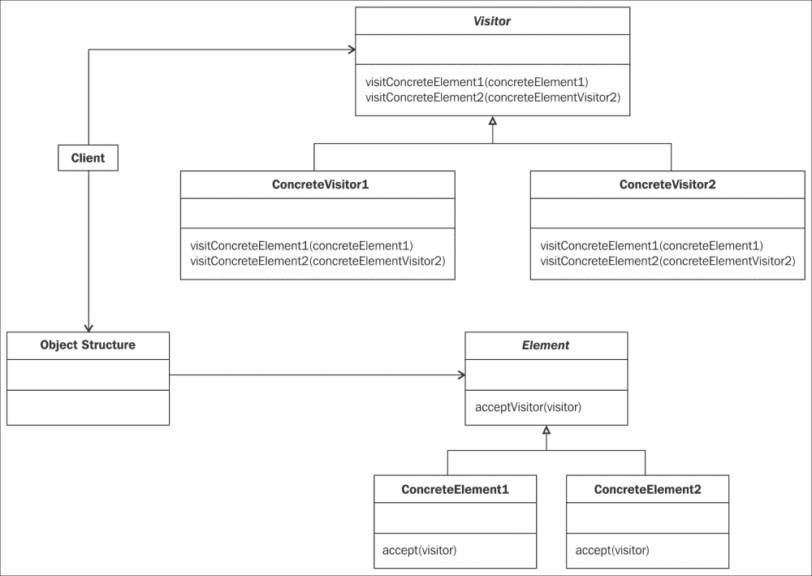
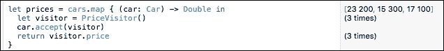
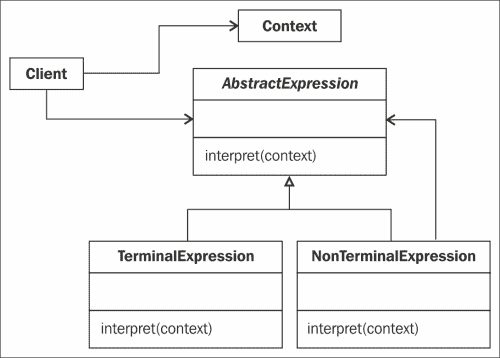
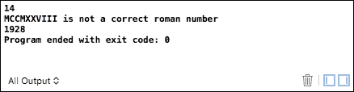
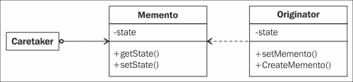

# 第八章。行为模式 – 访问者、解释器和备忘录

在本章中，我们将完成对 23 个设计模式的探索之旅。现在，让我们看看行为模式类别的最后三个设计模式。它们如下：

+   访问者模式

+   解释器模式

+   备忘录模式

# 访问者模式

在本节中，我们将讨论访问者模式，该模式允许我们分离数据和它们相关的处理。

## 角色

访问者模式允许我们将必须在对象上执行的操作外部化和集中化；这些对象之间不能有任何链接。

这些操作将在外部类中实现，而不是在对象的类中实现。

因此，这允许我们在外部类中添加任何操作，甚至是一个实现**IVisitor**的具体访问者。

当需要使用此模式时：

+   我们需要在不需要增加这些类负担的情况下向一组类添加功能。

+   一组类具有固定的结构，我们需要在不修改它们接口的情况下向它们添加一些功能。

当需要在没有共享公共基类或符合公共协议的对象集合上执行操作时，必须应用和使用访问者模式。

## 设计

以下图表展示了对象和处理是如何分离的。处理在`ConcreteVisitor`类中实现。对象在`ConcreteElement`类中实现，如下所示：



## 参与者

以下列出的是访问者模式参与者：

+   `Visitor`：这个接口引入了在一系列类中实现功能的方法签名。每个类都有一个方法，该方法接收这个类的实例作为参数。

+   `ConcreteVisitors`：这实现了与类对应的功能性方法。这些功能分布在不同的元素中。

+   `Element`：这是具体元素类的抽象类。它引入了`accept(visitor)`方法。

+   `ConcreteElements`：这实现了`accept()`方法，该方法包括通过对应于类的的方法调用访问者。

## 协作

使用访问者的客户端需要在其选择的类中创建访问者实例，然后将它作为参数传递给一组元素的`accept`方法。

元素随后调用与其类对应的访问者方法。将对其自身的引用发送回访问者，允许它访问其内部结构。

## 插图

我们是一家汽车销售商，拥有 DS、雷诺和雪铁龙三个品牌，每个品牌都有一个价格。

我们希望能够在不修改我们的汽车具体类的情况下修改价格。为此，我们将引入我们的访问者模式。

## 实现

对于最后一章，我们将使用 Playground。现在，打开`VisitorPattern.playground`文件，让我们看看它是如何工作的。

在这里，我们将使用一种称为**双重分派**的技术，这将允许我们根据对象的类型执行适当的操作。这项技术还可以帮助我们避免进行一些类型转换以执行适当的操作。（有关此技术的更多信息，请参阅以下网址：[`en.wikipedia.org/wiki/Double_dispatch 如果您需要更多关于此技术的信息`](https://en.wikipedia.org/wiki/Double_dispatch 如果您需要更多关于此技术的信息)）

首先，我们定义我们的访问者协议。访问者有三个具有`ConcreteElement`作为参数的`visit`方法，以接受每种汽车类型，如下所示：

```swift
 protocol CarVisitor {
  func visit(car: DSCar)
  func visit(car: RenaultCar)
  func visit(car: CitroenCar)
}
```

然后，我们定义我们的`Car`协议。一辆车可以接受一个具体的`CarVisitor`对象：

```swift
protocol Car {
  func accept(visitor: CarVisitor)
}
```

我们可以轻松实现我们的三个具体车型。每个车型都有一个默认价格，还有一个接受具有具体`Visitor`对象的`accept`方法：

```swift
class DSCar: Car {
  var price = 29000.0
  func accept(visitor: CarVisitor) { visitor.visit(self) }
}
class RenaultCar: Car {
  var price = 17000.0
  func accept(visitor: CarVisitor) { visitor.visit(self) }
}
class CitroenCar: Car {
  var price = 19000.0
  func accept(visitor: CarVisitor) { visitor.visit(self) }
}
```

### 注意

由`Car`协议定义并由类实现的`accept`方法是双重分派技术的关键。通过将`self`作为参数传递给`visitor.visit`方法，其中`visitor`是我们对`CarVisitor`的具体实现，Swift 将选择具有最具体类型的`visit`方法版本。

最后，我们必须实现我们的具体访问者，我们的访问者负责修改`Element`类的价格。`Element`类的修改取决于传递给参数的对象类型。

DS 汽车的价格将增加 20%，雷诺和雪铁龙汽车的价格将增加 10%：

```swift
class PriceVisitor: CarVisitor {
  var price = 0.0
  func visit(car: DSCar)  { price = car.price * 0.8  }
  func visit(car: RenaultCar) { price = car.price * 0.9 }
  func visit(car: CitroenCar)  { price = car.price * 0.9 }
}
```

客户端将通过以下代码进行模拟。我们首先实例化我们的三个汽车对象并将它们添加到`Car`数组中。然后，我们将定义一个新的变量`price`，它是一个包含我们三个新价格的数组。

为了做到这一点，我们将使用`map`函数，它是数组类型的一个扩展。它允许我们对数组的每个元素执行处理。在这里，我们可以（对于每个元素）实例化一个`PriceVisitor`对象，并将其传递给当前`car`对象的`accept`方法。

然后，我们返回新的`visitor.price`，这是当前汽车对象的新价格。

正如我在此模式的*角色*部分所说，访问者模式用于当数组管理一个不共享公共基类或符合公共协议的异构对象集合时。通过应用此模式，所有三个`Cars`类都可以共享并符合相同的协议，使我们能够管理以下数组：

```swift
let cars: [Car] = [DSCar(), RenaultCar(), CitroenCar()]
```

然后，我们可以通过应用适当的访问者计算来计算新的价格：

```swift
let prices = cars.map { (car: Car) -> Double in
  let visitor = PriceVisitor()
  car.accept(visitor)
  return visitor.price
}
```

要显示结果，请检查以下截图的右侧部分。**23200**、**15300**和**17100**是我们汽车的新价格：



# 解释器模式

解释器模式实际上并没有被使用，但它确实非常有用。通常，这种模式是用形式语法来描述的，但可以应用此模式的领域可以扩展。

您可以参考以下内容获取更多信息：罗马数字解读（[`www.oodesign.com/interpreter-pattern.html`](http://www.oodesign.com/interpreter-pattern.html)）和[`en.wikipedia.org/wiki/Roman_numerals`](https://en.wikipedia.org/wiki/Roman_numerals)。

## 角色

解释器模式定义了一种语言语法的对象表示，以便通过解释来评估用此语言编写的某些表达式。

此模式可以用来解释一些以分层树表示的表达式。它可能适用于以下情况：

+   表达式语法很简单

+   评估不需要很快

可以使用此模式的一些示例包括：

+   在规则引擎中

+   要向组合模式添加一些功能

## 设计

此模式的实现体现在将组合模式应用于表示语法（参考第三章中的*组合模式*，*结构型模式 – 组合和享元*）。区别在于解释器模式定义了行为，而组合模式只定义了结构。

该模式的 UML 类图如下：



## 参与者

此模式的参与者如下：

+   `AbstractExpression`: 这定义了抽象语法树中所有节点共有的`interpret()`方法。

+   `TerminalExpression`: 这实现了与语法终止符号相关的解释方法。语法的每个终止符号都需要一个具体的类。

+   `NonTerminalExpression`: 这实现了解释方法，也可以包含其他`AbstractExpression`实例。

+   `Context`: 这包含对解释器全局的信息。例如，变量的实际值。

+   `Client`: 这将构建一个由`NonTerminalExpression`和`TerminalExpression`实例组成的抽象语法树。这是我们演示该模式的使用。

## 协作

客户端构建抽象语法树，初始化解释器的上下文，然后调用解释方法。

在`TerminalExpression`和`NonTerminalExpression`节点上的解释方法使用上下文来存储和访问解释器的状态。

## 插图

我们想要创建一个罗马数字转换器；您知道那些将 XIV 解读为十进制中的 14 的转换器。我们示例的主要目的是编写一个罗马数字，我们的转换器将告诉我们它的十进制值。

## 实现

打开`InterpreterPattern.xcodeproj`文件，看看我们是如何实现该模式的。

### 注意

对于此模式，所有代码都已添加到`main.swift`类中，以便您可以轻松将其导出到 Playground 中，如果您想看到代码的实时执行。

在开始理解代码之前，请查看以下链接了解罗马数字是如何工作以及它们是如何书写的。

你可以在[`4thgradecrocs.weebly.com/roman-numerals.html`](http://4thgradecrocs.weebly.com/roman-numerals.html)看到一些关于罗马数字的规则，以及罗马数字表，同时也可以了解罗马数字系统是如何工作的，详情请见[`en.wikipedia.org/wiki/Roman_numerals`](https://en.wikipedia.org/wiki/Roman_numerals)。

对于模式，我们将使用一个字符串扩展，它允许我们通过传递要忽略的字符数来轻松地执行子字符串操作：

```swift
extension String {
  func subStringFrom(pos: Int) -> String {
    var substr = ""
    let start = self.startIndex.advancedBy(pos)
    let end = self.endIndex
    let range = start..<end
    substr = self[range]
    return substr
  }
}
```

要解释的表达式是一个字符串，它被放入上下文中：

```swift
class Context {
  var input: String!
  var output: Int = 0

  init(input: String){
    self.input = input
  }
}
```

这个类将帮助我们应用模式时进行工作；它包括剩余未解析的罗马数字字符串以及已解析的数字的结果。

根据解释的类型（千位、百位、十位和个位），上下文被传递给四个子解释器之一。在这个例子中，只使用了`TerminalExpressions`。

接下来，我们将定义我们的`AbstractExpression`类。这个类必须实现`interpret()`方法并定义将在子类中重写的方法：

```swift
class Expression {
  func interpret(context: Context) {
    if context.input.characters.count == 0 {
      return
    }

    if context.input.hasPrefix(nine()){
      context.output = context.output + (9 * multiplier())
      context.input = context.input.subStringFrom(2)
    } else  if context.input.hasPrefix(four()){
      context.output = context.output + (4 * multiplier())
      context.input = context.input.subStringFrom(2)
    } else  if context.input.hasPrefix(five()){
      context.output = context.output + (5 * multiplier())
      context.input = context.input.subStringFrom(1)
    }

    while context.input.hasPrefix(one()) {
      context.output = context.output + (1 * multiplier())
      context.input = context.input.subStringFrom(1)
    }
  }

  func one() -> String {
    fatalError("this method must be implemented in a subclass")
  }

  func four() -> String {
      fatalError("this method must be implemented in a subclass")
  }

  func five() -> String {
      fatalError("this method must be implemented in a subclass")
  }
  func nine() -> String {
      fatalError("this method must be implemented in a subclass")
  }
  func multiplier() -> Int {
      fatalError("this method must be implemented in a subclass")
  }
}
```

`Expression`类由接收上下文的`interpret`方法组成。根据当前对象，它使用特定的千位、百位、十位、个位和特定的乘数值。

`Expression`类的`one()`、`four()`、`five()`、`nine()`和`multiplier()`方法是抽象的。它们将在我们的具体`TerminalExpressions`类中实现。

我们现在可以实现我们的四个`TerminalExpression`类。每个类都重写了`one()`、`four()`、`five()`、`nine()`和`multiplier()`方法。这些方法将根据我们是否处于千位、百位、十位或个位表达式来解释。实际上，这些类用于定义每个特定的表达式。通常，这些类实现`interpret`方法，但在这里它已经在基表达式类中定义，每个`TerminalExpression`类通过实现抽象方法：`one()`、`four()`、`five()`、`nine()`和`multiplier()`来定义其行为。这是一个模板方法（请参阅第五章中的*模板方法*部分 Chapter 5，*行为模式 – 策略、状态和模板方法*）：

```swift
class ThousandExpression: Expression {
  override func one() -> String {
    return "M"
  }
  override func four() -> String {
    return " "
  }
  override func five() -> String {
    return " "
  }
  override func nine() -> String {
    return " "
  }
  override func multiplier() -> Int {
    return 1000
  }
}

class HundredExpression: Expression {
  override func one() -> String {
    return "C"
  }
  override func four() -> String {
    return "CD"
  }
  override func five() -> String {
    return "D"
  }
  override func nine() -> String {
    return "CM"
  }
  override func multiplier() -> Int {
    return 100
  }
}

class TenExpression: Expression {
  override func one() -> String {
    return "X"
  }
  override func four() -> String {
    return "XL"
  }
  override func five() -> String {
    return "L"
  }
  override func nine() -> String {
    return "XC"
  }
  override func multiplier() -> Int {
    return 10
  }
}

class OneExpression: Expression {
  override func one() -> String {
    return "I"
  }
  override func four() -> String {
    return "IV"
  }
  override func five() -> String {
    return "V"
  }
  override func nine() -> String {
    return "IX"
  }
  override func multiplier() -> Int {
    return 1
  }
}
```

模式现在已经编写好了；我们只需要测试它。在编写测试代码之前，我们将创建一个辅助的`RomanToDecimalConverter()`类，它有一个`calculate()`方法，该方法返回转换的结果：

```swift
class RomanToDecimalConverter {
  var tree = [ThousandExpression(), HundredExpression(), TenExpression(),OneExpression()]

  func calculate(romanString: String) -> Int {
    let context = Context(input: romanString)
    for t in tree {
      t.interpret(context)
    }
    return context.output
  }
}
```

这个类负责构建表示我们特定值的语法树；罗马数字，在由语法定义的语言中。

注意，我们只能以特定的顺序将我们的终端表达式添加到数组中：从千位到个位表达式，因为我们将从左到右解析罗马数字字符串。

在构建语法树之后，我们调用`interpret`方法。一旦执行了模式的全部表达式，我们返回`context.output`值，这对应于十进制结果。

在编写测试代码之前，我们将向`RomanToDecimalConverter`类添加一个新方法。这将验证我们试图转换的罗马数字是否正确：如果不正确，将显示一条消息，告知我们的数字不是罗马数字。以下代码中添加的代码被突出显示：

```swift
enum FormatError: ErrorType {
 case RomanNumberFormatError
}

//Helper
class RomanToDecimalConverter {
 static let pattern = "^M{0,4}(CM|CD|D?C{0,3})(XC|XL|L?X{0,3})(IX|IV|V?I{0,3})$"
 let validation = NSPredicate(format: "SELF MATCHES %@", pattern)

  var tree = [ThousandExpression(), HundredExpression(), TenExpression(),OneExpression()]

 func calculate(romanString: String) throws -> Int {
 guard validate(romanString) else {
 throw FormatError.RomanNumberFormatError
 }

    let context = Context(input: romanString)
    for t in tree {
      t.interpret(context)
    }
    return context.output
  }

 func validate(romanString: String) -> Bool {
 return validation.evaluateWithObject(romanString)
 }
}
```

我们首先定义一个新的`enum`函数，我们称之为`FormatError`，其类型为`ErrorType`。我们将使用它来抛出异常，当罗马数字的格式不正确时。

然后，在`RomanToDecimalConverter`类中有一个静态字符串`pattern`，其中包含我们的正则表达式，还有一个实例常量`validation`，它将通过`NSPredicate`对象处理验证过程。该对象的目的在于定义约束搜索所需的逻辑条件，无论是用于检索还是内存过滤。

在`calculate`方法中，我们有一个`guard`语句，它执行`validate`函数，如果`validate`函数返回`false`（表示数字不正确），则抛出`FormatError.RomanNumberFormatError`异常；否则，我们将继续操作并使用模式计算十进制值。注意方法返回类型之前添加的`throws`关键字。这意味着此方法可以抛出错误。

`validate()`方法通过传递罗马数字作为参数调用`NSPredicate`实例的`evaluateWithObject`方法。如果格式正确，该方法返回`true`，否则返回`false`。

### 注意

代码中使用的正则表达式来自以下 URL，并且在该网站上解释得非常详细：[`stackoverflow.com/questions/267399/how-do-you-match-only-valid-roman-numerals-with-a-regular-expression`](http://stackoverflow.com/questions/267399/how-do-you-match-only-valid-roman-numerals-with-a-regular-expression)

关于`NSPredicate`的更多信息，您可以参考此网站：[`realm.io/news/nspredicate-cheatsheet/`](https://realm.io/news/nspredicate-cheatsheet/)

现在，我们可以像以下这样编写测试代码：

```swift
let romanNumberToTest = ["XIV", "MCCMXXVIII","MCMXXVIII"]
var converter = RomanToDecimalConverter()
for roman in romanNumberToTest {
  var decimal = try? converter.calculate(roman)
  guard (decimal != nil) else {
    print("\(roman) is not a correct roman number")
    continue
  }
  print(decimal!)
}
```

我们初始化一个包含一些罗马数字的数组，然后初始化我们的`RomanToDecimalConverter`转换器对象，并遍历所有元素进行计算。

我们正在使用以下声明：

```swift
var decimal = try? converter.calculate(roman)
```

如果抛出异常，十进制将返回`nil`。因此，接下来的三行代码帮助我们打印出适当的消息，当罗马数字格式不正确时。

在构建和运行项目后，使用数组的三个值，您将获得以下结果：



程序给出的先前结果告诉我们，**MCCMXXVIII**有一个错误的罗马数字格式，而其他两个数字都很好地转换成了第一个罗马数字的 14 十进制值和第二个罗马数字的 1928。

你可以尝试使用本节开头提供的罗马数字表运行代码。

你可以看到这个模式真的很有趣。你已经看到组合模式和模板方法模式也被用来构建和实现我们的解释器模式，使用我们的用例。

# 备忘录模式

备忘录模式将是我们将要一起发现的最后一个模式。你会发现这个模式与工作非常有趣，并且有很多用途。

## 角色

备忘录模式的作用是捕获对象的内部状态并将其外部保存，以便以后可以恢复，而不会破坏该对象的封装。

## 设计

通用 UML 类图定义为以下：



## 参与者

以下备忘录模式的参与者：

+   `Memento`：这是保存原始对象内部状态（或该状态的一部分）的对象的类，例如，保存状态的实现可以独立于对象本身。备忘录有两个接口：

    +   一个完整的`Originator`对象接口，允许访问需要保存或恢复的所有内容

    +   一个窄接口的看护者，可以保持和传递备忘录引用，但不再有更多

+   `Originator`：这是创建备忘录以保存其内部状态并可以从备忘录中恢复的对象类。

+   `caretaker`：这负责管理备忘录列表，不提供对原始对象内部状态的访问。这也是客户端代码需要访问的类。

+   `CreateMemento`：这个方法用于保存原始对象的状态。它通过将状态变量保存到`Memento`对象中并返回它来创建一个`Memento`对象。这用于记录`Originator`的状态。

+   `SetMemento`：这个类存储了`Originator`对象的历史信息。信息存储在其状态变量中。

## 协作

`Caretaker`实例通过调用`createMemento`方法请求`originator`对象的备忘录并将其保存。在取消操作并返回备忘录中保存的状态时，你可以使用`setMemento`方法将其发送给`originator`对象。

## 插图

你开发了一个平台游戏，每次你的英雄通过一个关卡时，都会存储一个检查点。这允许玩家从他已经通过的任何关卡重新加载。

保存检查点时需要存储的数据是关卡编号、当前武器和得分数量。

## 实现

为了简化我们的代码，我们将使用一个 OS X 命令行项目，其中我们将在`main.swift`文件中编写所有代码。

在 Xcode 中打开`MementoPattern.xcodeproj`文件，让我们看看我们是如何组织我们的代码的。

首先，我们定义我们的`GameState`结构：需要保存的数据是`level`、`weapon`和`points`：

```swift
struct GameState {
  var level: Int
  var weapon: String
  var points: Int
}
```

然后我们定义我们的`Originator`，带有`createMemento`和`setMemento`方法：

```swift
protocol Originator {
  func createMemento() -> GameMemento  func setMemento(memento: GameMemento)
}
```

然后我们实现我们的`GameState Memento`：它包含`CheckPoint`恢复状态所需的所有信息。

首先，我们定义三个变量，这将帮助我们存储状态：

+   `entries`是一个`GameState`列表。

+   `nextId`包含`entries`数组的下一个索引

+   `totalPoints`是一个变量，它包含每个条目的总分数。

我们有一个构造函数，我们可以传递一个`CheckPoint`对象作为参数。检查点的状态被分配给备忘录内部变量。

`apply()`方法接收一个检查点对象作为参数。然后，我们将当前备忘录的值分配给检查点的属性，以便恢复检查点状态：

```swift
struct GameMemento {
  private let entries: [Int: GameState]
  private let nextId: Int
  private let totalPoints: Int

  init(checkPoint: CheckPoint){
    self.entries = checkPoint.entries
    self.nextId = checkPoint.nextId
    self.totalPoints = checkPoint.totalPoints
  }

  func apply(checkPoint: CheckPoint) {
    print("Restoring a game state to a checkpoint...")
    checkPoint.nextId = nextId
    checkPoint.totalPoints = totalPoints
    checkPoint.entries = entries
  }
}
```

现在我们可以保存和恢复一个备忘录。接下来要做的事情是创建我们的发起者：`CheckPoint`对象。在玩游戏的过程中，一个条目将被添加到检查点条目列表中。

就像在`Memento`对象中一样，我们将定义三个变量。不同之处在于我们在这个对象中初始化它们：

+   `Entries`：这是一个将包含所有条目的数组。

+   `totalPoints`：这是一个初始化为`0`的整数，它将包含每个级别的总分数。

+   `nextId`：这是一个从`0`开始的整数。它包含`entries`数组中的下一个索引值。

我们有四个方法：

+   `addGameStateEntry`：此方法用于向我们的条目列表中添加一个新的条目。这将在客户端每次完成游戏的一个级别时被调用。

+   `createMemento`：此方法创建并返回一个备忘录对象。检查点本身作为方法的参数传递。

+   `setMemento`：此方法允许我们恢复一个`Memento`对象。

+   `printCheckPoint`：此方法用于轻松查看`CheckPoint`对象的当前状态。

`CheckPoint`类有以下实现：

```swift
class CheckPoint: Originator {
  private var entries: [Int: GameState] = [:]
  private var totalPoints: Int  = 0
  private var nextId: Int = 0

  func addGameStateEntry(level: Int, weapon: String, points: Int) {
    let entry = GameState(level: level, weapon: weapon, points: points)
    entries[nextId++] = entry
    totalPoints += points
  }

  func createMemento() -> GameMemento {
    return GameMemento(checkPoint: self)
  }

  func setMemento(memento: GameMemento) {
       memento.apply(self)
  }

  func printCheckPoint() {
    print("Printing checkPoint....")
    entries.sort {$0.0 < $1.0 }
.map {
        print("Level: \($0.1.level)   Weapon: \($0.1.weapon)   Points: \($0.1.points) ")
    }
    print("Total Points: \(totalPoints)\n")
  }
}
```

你可能已经看到了以下语句：

```swift
    entries.sort {$0.0 < $1.0 }
.map {
        print("Level: \($0.1.level)   Weapon: \($0.1.weapon)   Points: \($0.1.points) ")
    }
```

这就是我们如何轻松按索引值排序我们的数组。然后我们可以使用`map`函数，只是为了能够在数组的每个条目上执行打印语句。

你可以在以下 URL 中找到更多关于闭包的信息：[`developer.apple.com/library/prerelease/ios/documentation/Swift/Conceptual/Swift_Programming_Language/Closures.html`](https://developer.apple.com/library/prerelease/ios/documentation/Swift/Conceptual/Swift_Programming_Language/Closures.html)

我们的模式现在已经就绪，让我们看看如何使用它：

```swift
let checkPoint = CheckPoint()
checkPoint.addGameStateEntry(0, weapon: "gun", points: 1200)
checkPoint.addGameStateEntry(1, weapon: "tommy gun", points: 2250)
checkPoint.printCheckPoint()

let memento = checkPoint.createMemento()
checkPoint.addGameStateEntry(2, weapon: "bazooka", points: 2400)
checkPoint.addGameStateEntry(4, weapon: "knife", points: 3000)
checkPoint.printCheckPoint()

checkPoint.setMemento(memento)
checkPoint.printCheckPoint()
```

初始化检查点对象后，我们在检查点中添加两个条目。

在调用`checkpoint`对象的`printCheckPoint`方法后：我们得到以下结果：

```swift
Printing checkPoint....
Level: 0   Weapon: gun   Points: 1200 
Level: 1   Weapon: tommy gun   Points: 2250 
Total Points: 3450
```

`printCheckPoint` 方法遍历检查点对象的所有条目并显示每个条目的状态和总分。

在这个时候，我们还没有创建`Memento`对象，因此无法恢复到之前的状态。

要创建一个备忘录，我们只需调用`Originator`对象（在我们的例子中是`checkPoint`对象）的`createMemento`方法：

```swift
let memento = checkPoint.createMemento()

```

此方法返回一个备忘录对象，我们将其分配给我们的备忘录常量，以便在需要时恢复。

我们继续游戏并成功通过两个其他关卡，然后再次打印当前的检查点状态：

```swift
checkPoint.addGameStateEntry(2, weapon: "bazooka", points: 2400)
checkPoint.addGameStateEntry(4, weapon: "knife", points: 3000)
checkPoint.printCheckPoint()
```

结果如下：

```swift
Printing checkPoint....
Level: 0   Weapon: gun   Points: 1200 
Level: 1   Weapon: tommy gun   Points: 2250 
Level: 2   Weapon: bazooka   Points: 2400 
Level: 4   Weapon: knife   Points: 3000 
Total Points: 8850
```

`CheckPoint`现在在其数组中包含四个条目。

我们希望将检查点状态恢复到最后一次保存的状态。为了继续，我们只需调用检查点对象的`setMemento()`方法，并使用我们之前创建的备忘录对象，然后调用`printCheckPoint`方法以显示结果，如下所示：

```swift
checkPoint.setMemento(memento)
checkPoint.printCheckPoint()
```

`printCheckPoint` 调用的结果是以下内容：

```swift
Restoring a game state to a checkpoint...
Printing checkPoint....
Level: 0   Weapon: gun   Points: 1200 
Level: 1   Weapon: tommy gun   Points: 2250 
Total Points: 3450
```

我们可以看到检查点对象已经恢复到其之前的状态。

通过这个简单的例子，你现在应该有一个很好的模式来使用和轻松管理对象的取消和恢复。

备忘录模式是一种在科学计算中被广泛使用的模式，用于保存长时间运行的计算状态。正如这里所看到的，它可以用来保存数小时或数天的游戏状态。在图形工具包中，它可以用来在对象移动时保存显示状态。

### 注意

在以下情况下使用此模式：

+   对象的状态必须保存以便稍后恢复

+   直接暴露状态是不理想的

# 比较三种模式

虽然它们看起来不同，但我们有几种方法可以比较这三个模式：

+   **可重用性**：所有三种模式都旨在减轻开发者重复实现通用代码的负担。实际上，一旦实现了访问者，它们可以与不同类型的对象一起重用，而无需任何更改。为了促进重用，你必须限制访问者需要了解的状态数量。解释器模式旨在解析一个输入，其中结构是数据驱动的。《Memento》模式的`Caretaker`和备忘录类与数据无关，只有`Originator`应该改变。

+   **与结构一起工作**：这些模式旨在与结构一起使用。访问者和解释器模式要求开发者编写遍历代码，而备忘录模式将整个结构移动，依赖于序列化来进行遍历。

+   **作为参数的对象**：在备忘录和访问者模式中，对象作为其结构的一部分被传递，而在解释器模式中，它依赖于一个上下文，基本上是正在被解释以输出到输出的输入的演变状态。

# 摘要

本章总结了由四人帮描述的八个行为模式，并且本章也标志着本书的结束。

我希望这本书能够非常易于跟随，而不会在提供的示例中增加复杂性。本书旨在成为任何想要使用 Swift 实现设计模式的人的参考。

有些我们没有涉及到的点，比如多并发访问、使用闭包的 Swift 2 特殊编码等等。我认为这些点在教材中并不常见。本书的主要目的是在需要时能够轻松找到合适的模式，并且有一个易于理解的示例来跟随。

好的，你现在已经拥有了所有必要的知识来以可扩展的方式组织你的代码。这将帮助你正确地组织代码，提高代码的性能，并降低维护成本。

我真的非常感谢你一直跟随这本书。现在，将所学知识付诸实践就取决于你了。
