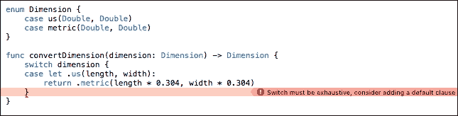
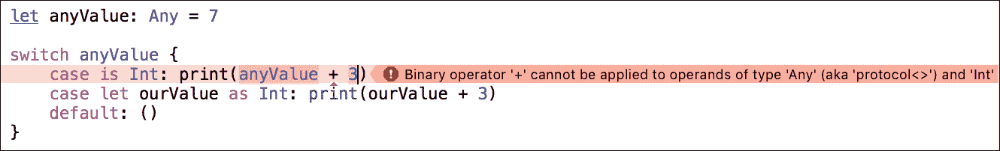

# 第四章：枚举和模式匹配

在第一章中，我们简要介绍了枚举。在本章中，我们将详细介绍枚举和代数数据类型。此外，我们还将探讨 Swift 中的模式和模式匹配。

本章将通过代码示例涵盖以下主题：

+   定义枚举

+   关联值

+   原始值

+   使用枚举

+   代数数据类型

+   模式和模式匹配

# 定义枚举

在 Swift 中，枚举定义了一个相关值的公共类型，并使我们能够以类型安全的方式处理这些值。为每个枚举成员提供的值可以是`String`、`Character`、`Integer`或任何`floating-point`类型。以下示例展示了枚举的一个简单定义：

```swift
enum MLSTeam {
    case montreal
    case toronto
    case newYork
    case columbus
    case losAngeles
    case seattle
}

let theTeam = MLSTeam.montreal

```

`MLSTeam` `enum`为我们提供了选择 MLS 球队的选择。我们每次只能选择一个选项；在我们的示例中，选择了`Montreal`。

可以定义多个情况，用单行上的逗号分隔：

```swift
enum MLSTeam {
    case montreal, toronto, newYork, columbus, losAngeles, Seattle
}

var theTeam = MLSTeam.montreal

```

当使用`MLSTeam.montreal`初始化`theTeam`时，其类型被推断为`MLSTeam`。由于`theTeam`已经定义，我们可以使用更短的语法进行更改，如下所示：

```swift
theTeam = .newYork

```

我们能够使用简短的语法更改`theTeam`，因为`theTeam`已经被推断，并且不是一个常量。

# 关联值

枚举可以存储任何给定类型的关联值，如果需要，枚举的每个成员的值类型可以不同。类似这些的枚举在其他编程语言中被称为有区别的联合、标记联合或变体。以下示例展示了关联值的一个简单用法：

```swift
enum Length {
    case us(Double)
    case metric(Double)
}

let lengthMetric = Length.metric(1.6)

```

枚举类型`Length`可以取`US`值，其关联值为`Double`类型，或者取`metric`值，其关联值为`Double`类型。

`lengthMetric`是一个变量，其值被分配为`Length.metric`，关联值为`1.6`。

如前例所示，当我们基于枚举的某个情况创建新的常量或变量时，会设置关联值，并且每次都可能不同。

# 原始值

枚举成员可以预先填充默认值（称为**原始值**），这些值都是同一类型。以下示例展示了带有原始值的`HttpError`枚举的一个不完整示例：

```swift
enum HttpError: Int {
    case badRequest = 400
    case unauthorized = 401
    case forbidden = 403
}

```

在前例中，`enum`名为`HttpError`的原始值被定义为`Int`类型，并设置为一些整数代码。

原始值可以是`String`、`Character`、`Int`或任何浮点数类型。每个原始值必须在枚举声明内是唯一的。

当我们首次定义枚举时，原始值被设置为预填充值，如前例中的`HttpError`；因此，枚举情况的原始值始终相同，并且不会改变，这与关联值不同。

如果我们定义一个具有原始值类型的枚举，枚举将自动接收一个初始化器，该初始化器接受原始值类型的值并返回枚举 `case` 或 `nil`。我们可以使用这个初始化器来尝试创建枚举的新实例。以下示例展示了 `HttpError` 实例的初始化：

```swift
let possibleError = HttpError(rawValue: 400)
print(possibleError)

```

# 代数数据类型

Swift 中的枚举实际上是代数数据类型，这些类型是通过组合其他类型创建的。代数数据类型对于许多函数式编程语言（如 Haskell）至关重要。

代数数据类型基于代数结构的概念，这是一组可能的值和一个或多个运算符，可以将有限数量的这些值组合成一个单一的值。例如，一个著名的结构是 (`ℤ`, `+`, `-`)，这是一个所有整数的集合，上面有加法和减法运算。

因此，代数数据类型是通过代数运算创建的数据类型，具体来说，使用加法和乘法作为我们的运算。

此外，代数数据类型是复合数据类型，可能包含多个值，例如具有多个字段的数据类型，或者它们可能由变体或多个有限的不同值组成。

## 简单类型

`Boolean` 类型是一种简单的代数数据类型，因为它可能取两个值之一：`true` 或 `false`。一个 `Boolean` 类型的实例应该是 `true` 或 `false` 中的一个，但实例不能同时是两者；它必须是一个或另一个，这与 `struct`/`class` 属性和变量不同。

## 复合类型

代数数据类型也可以是复合类型。例如，两个 `Double` 值的元组是一种简单的代数数据类型。这样的元组可以表示为 `(Double, Double)` 类型，这个类型的示例值可以是 `(1.5, 3.2)`。

## 带有变体的复合类型

代数数据类型也可以是复合类型，具有变体。我们可以创建一个名为 `Dimension` 的 `enum` 来存储长度和宽度。我们可以用 `us` 英尺和 `metric` 米来表示这个 `enum`。在 Swift 中，我们可以如下定义这样的 `enum`：

```swift
enum Dimension {
    case us(Double, Double)
    case metric(Double, Double)
}

```

然后，我们可以使用 `Dimension` 枚举来创建一个变量，如下所示：

```swift
let sizeMetric = Dimension.metric(5.0, 4.0)

```

## 数据类型的代数

我们已经看到，Swift 中的枚举实际上是代数数据类型。让我们通过一些例子来探索这个主题，以便更熟悉它。

以下示例展示了一个简单的 `enum` `NHLTeam`，具有不同的选项。`enum` `Team` 使用我们之前定义的 `NHLTeam` 和 `MLSTeam` 来结合 `Hockey` 和 `Soccer` 队伍。`Team` 可以是一个 `Hockey NHL` 队伍或一个 `Soccer MLS` 队伍：

```swift
enum NHLTeam {
    case canadiens
    case senators
    case rangers
    case penguins
    case blackHawks
    case capitals
}

enum MLSTeam {
    case montreal
    case toronto
    case newYork
    case columbus
    case losAngeles
    case seattle
}

struct HockeyAndSoccerTeams {
    var hockey: NHLTeam
    var soccer: MLSTeam
}

```

`MLSTeam` 和 `NHLTeam` 每个都有六个潜在值。如果我们将它们组合起来，我们将有两个新的类型。`Team` 可以是 `NHLTeam` 或 `MLSTeam`，因此它有 12 个潜在值，这是 `NHLTeam` 和 `MLSTeam` 潜在值的总和。因此，`Team` `enum` 是一个求和类型。

要有一个`HockeyAndSoccerTeams`结构，我们需要为`NHLTeam`和`MLSTeam`选择一个值，因此它有 36 个潜在值，这是`NHLTeam`和`MLSTeam`值的乘积。因此，`HockeyAndSoccerTeams`是一个乘积类型。

在 Swift 中，枚举的可选值可以有多个。如果它恰好是唯一的选择，那么这个枚举就变成了一个乘积类型。以下示例展示了如何将一个`枚举`作为乘积类型：

```swift
enum HockeyAndSoccerTeams {
    case Value(hockey: NHLTeam, soccer: MLSTeam)
}

```

递归类型是另一类代数数据类型。

递归数据类型是用于可能包含相同类型其他值的值的类型。计算机科学中递归的一个重要应用是在定义动态数据结构，如数组。递归数据结构可以根据运行时需求动态增长到理论上无限的大小。

用于执行简单整数算术的操作可以用`枚举`来建模。这些操作让我们能够组合简单的算术表达式。《*Swift 编程语言（3.0）*》由*苹果公司*提供，其中包含了一个简单整数算术的例子。

递归数据结构的另一个例子是作为递归数据类型实现的`Tree`：

```swift
enum Tree {
    case empty
    case leaf(Int)
    indirect case node(Tree, Tree)
}

let ourTree = Tree.node(Tree.leaf(1), Tree.node(Tree.leaf(2),
  Tree.leaf(3)))
print(ourTree)

```

`Tree`可以是空的；它可以有一个叶子或另一个`Tree`作为`node`。

由于数据是嵌套的，用于存储数据的枚举也需要支持嵌套，这意味着枚举需要是递归的。

当编译器与递归枚举一起工作时，它必须插入一层间接层。我们通过在枚举案例前写`indirect`来表示枚举案例是递归的。

以下示例展示了`Tree`上的搜索函数：

```swift
func searchInTree(_ search: Int, tree: Tree) -> Bool {
    switch tree {
    case .leaf(let x):
        return x == search
    case .node(let l as Tree, let r as Tree):
        return searchInTree(search, tree:l) || searchInTree(search, tree:r)
    default:
        return false
    }
}

let isFound = searchInTree(3, tree: ourTree) // will return true
print(isFound)

```

由于我们可以在 Swift 中创建`sum`、`product`或`recursion`类型，因此可以说 Swift 对代数数据类型提供了第一级支持。

# 模式匹配

支持代数数据类型的编程语言通常支持一组用于处理复合类型字段或类型变体的功能。这些功能在以类型安全的方式定义操作不同字段或类型变体的函数时是必不可少的。

一种这样的特性被称为**模式匹配**，它使我们能够定义在不同的类型变体上操作不同的函数，并从复合类型中提取单个字段，同时保持语言的类型安全保证。

事实上，许多具有模式匹配功能的语言的编译器，如果我们没有正确处理类型的所有字段或变体，将会发出警告或错误。这些警告帮助我们编写更安全、更健壮的代码。

以下示例展示了使用`switch`语句进行简单模式匹配：

```swift
let theTeam = MLSTeam.montreal

switch theTeam {
case .montreal:
    print("Montreal Impact")
case .toronto:
    print("Toronto FC")
case .newYork:
    print("Newyork Redbulls")
case .columbus:
    print("Columbus Crew")
case .losAngeles:
    print("LA Galaxy")
case .seattle:
    print("Seattle Sounders")
}

```

在此示例中，Swift 编译器推断出`theTeam`为`MLSTeam`；因此，我们不需要为每个案例编写`MLSTeam`。

我们使用`switch`案例来匹配模式，因为这是 Swift 中枚举的基本模式匹配方式。此代码块将打印`Montreal Impact`，因为它匹配了`.montreal`案例。

要进一步探索模式匹配，我们可以查看其他示例，即 `Dimension` 枚举。使用模式匹配，我们可以轻松编写一个函数 `convertDimension`，它将 `Dimension` 作为参数并转换为其他变体（`US` 测量单位到 `Metric` 以及反之亦然）：

```swift
func convertDimension(dimension: Dimension) -> Dimension {
    switch dimension {
    case let .us(length, width):
        return .metric(length * 0.304, width * 0.304)
    case let .metric(length, width):
        return .us(length * 3.280, width * 3.280)
    }
}

let convertedDimension = convertDimension(dimension:
  Dimension.metric(5.0, 4.0))

```

在这个函数中，我们使用 `switch` `case` 代码块检查维度类型。我们使用 `let` 语句提取关联的值，并在 `return` 语句中使用 `length` 和 `width`。

为了测试我们的函数，我们提供了一个 `metric` 维度为 `5.0` 和 `4.0`，这样最终的 `us length` 将是 `16.4`，而 `us width` 将是 `13.12`。

Swift 要求我们处理枚举类型的所有情况；如果我们没有涵盖所有情况，Swift 编译器将发出警告并阻止我们引入运行时错误。例如，如果我们删除第二个情况，编译器将发出警告，如下面的图像所示：



如果我们有很多想要通用处理的案例，我们可以使用默认关键字。例如，让我们给 `convertDimension` 函数添加一个默认情况：

```swift
func convertDimension(dimension: Dimension) -> Dimension {
    switch dimension {
    case let .us(length, width):
        return .metric(length * 0.304, width * 0.304)
    default:
        return .us(0.0, 0.0)
    }
}

```

前面的示例仅作为默认使用示例，我们应该尽可能避免使用 `default` 情况。

# 模式和模式匹配

在上一节中，我们查看了对枚举的简单模式匹配示例。在本节中，我们将详细探讨模式和模式匹配。

## 通配符模式

通配符模式匹配并忽略任何值。它由一个下划线 `_` 组成。当我们不关心匹配的值时，我们使用通配符模式。

例如，以下代码示例忽略了匹配的值：

```swift
for _ in 1...5 {
    print("The value in range is ignored")
}

```

我们使用 `_` 来忽略迭代中的值。

通配符模式可以与 `optionals` 结合使用如下：

```swift
let anOptionalString: String? = nil

switch anOptionalString {
    case _?: print ("Some")
    case nil: print ("None")
}

```

如前例所示，我们通过 `_?` 匹配了可选值。

通配符模式可以用来忽略我们不需要的数据以及我们不想匹配的值。以下代码示例展示了我们如何使用通配符模式来忽略数据：

```swift
let twoNumbers = (3.14, 1.618)

switch twoNumbers {
    case (_, let phi): print("pi: \(phi)")
}

```

## 值绑定模式

值绑定模式将匹配的值绑定到变量或常量名称。以下示例通过将 `x` 绑定到 `5` 和 `y` 绑定到 `7` 来展示值绑定模式：

```swift
let position = (5, 7)

switch position {
    case let (x, y):
        print("x:\(x), y:\(y)")
}

```

## 标识符模式

标识符模式匹配任何值并将匹配的值绑定到变量或常量名称。例如，在以下示例中，`ourConstant` 是一个标识符模式，它匹配 `7` 的值：

```swift
let ourConstant = 7

switch ourConstant {
    case 7: print("7")
    default: print("a value")
}

```

标识符模式是值绑定模式的子模式。

## 元组模式

元组模式是一个由逗号分隔的零个或多个模式的列表，用括号括起来。元组模式匹配相应元组类型的值。

我们可以使用类型注解来约束元组模式以匹配某些类型的元组。例如，在声明`let (x, y): (Double, Double) = (3, 7)`中，元组模式`(x, y): (Double, Double)`仅匹配两个元素都是`Double`类型的元组类型。

在以下示例中，我们通过绑定名称、检查年龄是否有值，最后如果地址是`String`类型来匹配模式。我们只使用所需的`name`，对于`age`和`address`，我们使用通配符模式来忽略值：

```swift
let name = "John"
let age: Int? = 27
let address: String? = "New York, New York, US"

switch (name, age, address) {
    case (let name, _?, _ as String):
        print(name)
    default: ()
}

```

## 枚举案例模式

枚举案例模式匹配现有枚举类型的`case`。枚举案例模式出现在`switch`语句的`case`标签和`if`、`while`、`guard`和`for-in`语句的`case`条件中。

如果我们试图匹配的枚举`case`有任何关联的值，相应的枚举案例模式必须指定一个包含每个关联值的元组模式。以下示例展示了枚举案例模式：

```swift
let dimension = Dimension.metric(9.0, 6.0)

func convertDimensions(dimension: Dimension) -> Dimension {
    switch dimension {
    case let .us(length, width):
        return .metric(length * 0.304, width * 0.304)
    case let .metric(length, width):
        return .us(length * 3.280, width * 3.280)
    }
}

print(convertDimensions(dimension: dimension))

```

在前面的示例中，我们为每个关联值（`length`和`width`）使用元组模式。

## 可选模式

可选模式匹配`Optional<Wrapped>`或`ImplicitlyUnwrappedOptional<Wrapped>`枚举中`Some(Wrapped)`案例的值。可选模式由一个标识符模式后跟一个问号组成，出现在与枚举案例模式相同的位置。以下示例展示了可选模式匹配：

```swift
let anOptionalString: String? = nil

switch anOptionalString {
    case let something?: print("\(something)")
    case nil: print ("None")
}

```

## 类型转换模式

有两种类型转换模式如下：

+   `is`：这会将类型与表达式的右侧进行匹配

+   `as`：这会将类型转换为表达式的左侧

以下示例展示了`is`和`as`类型转换模式：

```swift
let anyValue: Any = 7

switch anyValue {
    case is Int: print(anyValue + 3)
    case let ourValue as Int: print(ourValue + 3)
    default: ()
}

```

`anyValue`变量是`Any`类型，存储一个`Int`值，那么第一个案例将被匹配，但编译器将报错，如下所示：



我们可以用`as!`将`anyValue`转换为`Int`类型以解决问题。

第一个案例已经匹配。第二个案例将不会达到。假设我们有一个不匹配的案例作为第一个案例，如下例所示：

```swift
let anyValue: Any = 7 

switch anyValue { 
     case is Double: print(anyValue) 
     case let ourValue as Int: print(ourValue + 3) 
     default: () 
} 

```

在这种情况下，第二个案例将被匹配，将`anyValue`转换为`Int`并绑定到`ourValue`，然后我们就能在我们的语句中使用`ourValue`。

## 表达式模式

表达式模式表示表达式的值。表达式模式仅出现在`switch`语句的`case`标签中。表达式模式所表示的表达式使用`~=`运算符与输入表达式的值进行比较。

如果`~=`运算符返回`true`，则匹配成功。默认情况下，`~=`运算符使用`==`运算符比较相同类型的两个值。以下示例展示了表达式模式的示例：

```swift
let position = (3, 5)

switch position {
    case (0, 0):
        print("(0, 0) is at the origin.")
    case (-4...4, -6...6):
        print("(\(position.0), \(position.1)) is near the origin.")
    default:
        print("The position is:(\(position.0), \(position.1)).")
}

```

我们可以重载`~=`运算符以提供自定义的表达式匹配行为。

例如，我们可以重写前面的示例，将位置表达式与位置的`String`表示形式进行比较：

```swift
func ~=(pattern: String, value: Int) -> Bool {
    return pattern == "\(value)"
}

switch position {
    case ("0", "0"):
        print("(0, 0) is at the origin.")
    default:
        print("The position is: (\(position.0), \(position.1)).")
}

```

# 摘要

本章解释了枚举的定义和用法。我们涵盖了关联值和原始值，以及代数数据类型概念的介绍。我们探讨了几个示例，包括求和、乘积和递归类型。在第八章“函数式数据结构”中，当我们讨论函数式数据结构时，我们将使用代数数据类型的概念。在本章中，我们探讨了诸如通配符、值绑定、标识符、元组、枚举情况、可选、类型转换和表达式等模式，以及相关的模式匹配示例。

下一章将涵盖泛型和关联类型协议，这些是函数式编程、泛型编程和协议导向编程中非常有用的工具。
