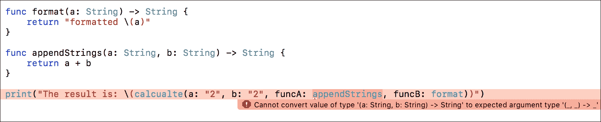

# 第五章：泛型和关联类型协议

泛型使我们能够编写灵活、可重用的函数、方法和类型，它们可以与任何类型一起工作。本章解释了如何定义和使用泛型，并通过示例介绍了 Swift 编程语言中泛型可以解决的问题。

本章将通过代码示例涵盖以下主题：

+   泛型函数和方法

+   泛型参数

+   泛型类型约束和 where 子句

+   泛型数据结构

+   关联类型协议

+   扩展泛型类型

+   子类化泛型类

# 泛型是什么，它们解决了哪些问题？

Swift 是一种类型安全的语言。每次我们与类型一起工作时，我们都需要指定它们。例如，一个函数可以有特定的参数和返回类型。我们不能传递任何类型，而只能是指定的类型。如果我们需要一个可以处理多种类型的函数怎么办？

我们已经知道 Swift 提供了 `Any` 和 `AnyObject`，但除非我们不得不使用它们，否则这不是一个好的实践。使用 `Any` 和 `AnyObject` 将使我们的代码变得脆弱，因为我们无法在编译时捕获类型不匹配。泛型是我们需求的解决方案。让我们先看一个例子。以下函数简单地交换两个值（`a` 和 `b`）。`a` 和 `b` 的类型是 `Int`。我们必须只传递 `Int` 类型的值来编译应用程序：

```swift
func swapTwoValues( a: inout Int, b: inout Int) {
    let tempA = a
    a = b
    b = tempA
}

```

类型安全本应是一件好事，但在这个情况下它让我们的代码变得不那么通用。如果我们想交换两个 `Strings` 呢？我们应该为这个函数创建一个新的副本吗？

```swift
func swapTwoValues( a: inout String, b: inout String) {
    let tempA = a
    a = b
    b = tempA
}

```

这两个函数的主体是相同的。唯一的区别在于函数签名，更具体地说，是参数类型。有些人可能会认为将这些参数的类型更改为 `Any` 或 `AnyObject` 是一个好主意。记住 `AnyObject` 可以代表任何类类型的实例，而 `Any` 可以代表任何类型的实例，除了函数类型，让我们假设我们将类型更改为 `Any`：

```swift
func swapTwoValues(a: Any, b: Any) -> (a: Any, b: Any) {
    let temp = a
    let newA = b
    let newB = temp
    return (newA, newB)
}

```

我们的 API 用户可以继续发送任何类型的参数。它们可能不匹配。编译器不会抱怨。让我们检查以下示例：

```swift
var name = "John Doe"
var phoneNumber = 5141111111

let (a, b) = swapTwoValues(a: name, b: phoneNumber)

```

我们的功能是通过 `String` 和 `Int` 参数调用的。我们的函数交换两个值，所以返回的 `a` 变成了 `Int`，而 `b` 变成了 `String`。这将使我们的代码容易出错，并且很难跟踪。

我们不希望那么灵活。我们不希望使用 `Any` 和 `AnyObject`，但我们仍然需要一定程度的灵活性。泛型是我们问题的解决方案。我们可以使用泛型使这个函数通用且健壮。让我们先看以下例子：

```swift
func swapTwoValues<T>(a: T, b: T) -> (a: T, b: T) {
    let temp = a
    let newA = b
    let newB = temp
    return (newA, newB)
}

```

在这个示例中，我们将 `Any` 替换为 `T`。它可以是代码中未定义的任何东西，或者不是 SDK 的一部分。我们在函数名之后和参数之前将此类型放入 `<>` 中。然后我们在参数或返回类型中使用此类型。这样，我们告诉编译器我们的函数接受一个泛型类型。任何类型都可以传递给此函数，但参数和返回类型都必须是同一类型。因此，我们的 API 用户将无法像以下这样传递 `String` 和 `Int`：

```swift
var name = "John Doe"
var phoneNumber = 5141111111

let (a, b) = swapTwoValues(a: name, b: phoneNumber) // Compile error -
  Cannot convert value of type 'Int' to expected argument type 'String'

```

编译器会抱怨类型不匹配。这样，我们的代码是类型安全的且灵活的，因此我们可以用于不同类型而不用担心类型不匹配问题。

泛型是函数式编程中的伟大工具，因为有了它们，我们能够开发出强大、多用途和通用的函数。让我们考察一个泛型使用的函数式示例。

在 第二章 中，*函数和闭包*，我们有一个如下示例。

假设我们需要开发一个函数来添加两个 `Int` 值，如下所示：

```swift
func addTwoValues(a: Int, b: Int) -> Int {
    return a + b
}

```

此外，我们还需要开发一个函数来计算 `Int` 值的平方：

```swift
func square(a: Int) -> Int {
    return a * a
}

```

假设我们需要添加两个平方值：

```swift
func addTwoSquaredValues(a: Int, b: Int) -> Int {
    return (a * a) + (b * b)
}

```

如果我们需要开发乘法、减法或除法两个平方值的函数怎么办？

答案是使用高阶函数来编写一个灵活的函数，如下所示：

```swift
typealias AddSubtractOperator = (Int, Int) -> Int
typealias SquareTripleOperator = (Int) -> Int

func calcualte(a: Int,
               b: Int,
           funcA: AddSubtractOperator,
           funcB: SquareTripleOperator) -> Int {

    return funcA(funcB(a), funcB(b))
}

```

这个高阶函数接受两个其他函数作为参数并使用它们。我们可以为不同的场景调用它，如下所示：

```swift
print("The result of adding two squared values is: \(calcualte(a: 2, b: 2,
  funcA: addTwoValues, funcB: square))") // prints "The result of adding
  two squared value is: 8"
```

使用高阶函数使它们更加灵活和通用，但仍然不是那么通用。这些函数仅与 `Int` 值一起工作。使用泛型，我们可以使它们与任何数值类型一起工作。让我们使我们的 `calculate` 函数更加通用：

```swift
func calcualte<T>(a: T,
                  b: T,
              funcA: (T, T) -> T,
              funcB: (T) -> T) -> T {

    return funcA(funcB(a), funcB(b))
}

```

`calculate` 函数接受两个相同类型（`T`）的值和两个函数。`funcA` 函数接受两个 `T` 类型的值并返回一个 `T` 类型的值。`funcB` 函数接受一个 `T` 类型的值并返回相同类型的 `T` 值。

现在，我们可以使用 `calculate` 函数处理任何类型。例如，我们可以传递任何数值并让函数为该特定类型计算它。

这里有两个需要注意的地方。首先，相同的技巧可以应用于方法，其次，在 Swift 3.0 之前，我们无法直接在泛型类型中定义 `typealiases`。Swift 3.0 引入了如下泛型 `typealiases`：

```swift
typealias StringDictionary<T> = Dictionary<String, T>
typealias DictionaryOfStrings<T: Hashable> = Dictionary<T, String>
typealias IntFunction<T> = (T) -> Int
typealias Vec3<T> = (T, T, T)
typealias BackwardTriple<T1, T2, T3> = (T3, T2, T1)

```

# 类型约束

我们的函数可以处理任何类型真是太好了，但如果我们 API 用户尝试在无法用于算术计算的类型上使用 `calculate` 函数怎么办？

为了减轻这个问题，我们可以使用类型约束。使用类型约束，我们将能够强制使用某种类型。类型约束指定类型参数必须继承自特定类或符合特定协议或协议组合。集合是我们已经在 Swift 编程语言中熟悉的类型约束的例子。集合是 Swift 中的泛型，因此我们可以有 `Int`、`Double`、`String` 等数组的数组。

与 Objective-C 不同，在 Objective-C 中我们可以在集合中使用不同类型，而在 Swift 中我们需要具有符合类型约束的相同类型。例如，`dictionary` 的键必须符合 `Hashable` 协议。

我们可以使用以下两种语法中的任何一种来指定类型约束：

`<T: Class>` 或 `<T: Protocol>`

让我们回到我们的 `calculate` 示例并定义一个数值类型约束。有如 `Hashable` 和 `Equatable` 这样的不同协议。然而，这些协议中的任何一个都无法解决我们的问题。最简单的解决方案是定义我们的协议并通过符合我们的协议来扩展我们想要使用的类型。这是一个可以用来解决类似问题的通用方法：

```swift
protocol NumericType {
    func +(lhs: Self, rhs: Self) -> Self
    func -(lhs: Self, rhs: Self) -> Self
    func *(lhs: Self, rhs: Self) -> Self
    func /(lhs: Self, rhs: Self) -> Self
    func %(lhs: Self, rhs: Self) -> Self
}

```

我们为数值类型定义了一个包含相关基本数学运算符的协议。我们将要求我们想要使用的类型符合我们的协议。因此，我们按照以下方式扩展它们：

```swift
extension Double : NumericType { }
extension Float  : NumericType { }
extension Int    : NumericType { }
extension Int8   : NumericType { }
extension Int16  : NumericType { }
extension Int32  : NumericType { }
extension Int64  : NumericType { }
extension UInt   : NumericType { }
extension UInt8  : NumericType { }
extension UInt16 : NumericType { }
extension UInt32 : NumericType { }
extension UInt64 : NumericType { }

```

最后，我们需要在我们的函数中定义类型约束，如下所示：

```swift
func calculate<T: NumericType>(a: T,
                               b: T,
                           funcA: (T, T) -> T,
                           funcB: (T) -> T) -> T {

    return funcA(funcB(a), funcB(b))
}

print("The result of adding two squared values is: \(calcualte(a: 2, b: 2,
  funcA: addTwoValues, funcB: square))") // prints "The result of adding
  two squared value is: 8"

```

因此，我们有一个只接受数值类型的函数。

让我们用一个非数值类型来测试它，以确保其正确性：

```swift
func format(a: String) -> String {
    return "formatted \(a)"
}

func appendStrings(a: String, b: String) -> String {
    return a + b
}

print("The result is: \(calculate("2", b: "2", funcA:
  appendStrings, funcB: format))")

```

这个代码示例由于我们的类型约束无法编译，这可以在以下屏幕截图中看到：



## `where` 子句

`where` 子句可以用来定义更复杂类型约束，例如，符合多个协议并带有一些约束。

我们可以通过在泛型参数列表之后包含一个 `where` 子句来指定类型参数及其关联类型的附加要求。`where` 子句由 `where` 关键字后跟一个逗号分隔的要求列表组成。

例如，我们可以表达泛型类型 `T` 继承自 `C` 类并符合 `V` 协议的约束，表示为 `<T where T: C, T: V>`。

我们可以约束类型参数的关联类型符合协议。让我们考虑以下泛型参数子句：

```swift
<Seq: SequenceType where Seq.Generator.Element: Equatable>
```

这里，它指定了 `Seq` 符合 `SequenceType` 协议，并且关联的 `Seq.Generator.Element` 类型符合 `Equatable` 协议。这个约束确保序列中的每个元素都是 `Equatable`。

我们还可以使用 `==` 运算符指定两个类型应该是相同的。让我们考虑以下泛型参数子句：

```swift
<Seq1: SequenceType, Seq2: SequenceType where 
  Seq1.Generator.Element == Seq2.Generator.Element>
```

在这里，它表达了 `Seq1` 和 `Seq2` 符合 `SequenceType` 协议，并且两个序列的元素必须是同一类型的约束。

替换为类型参数的任何类型参数都必须满足对类型参数放置的所有约束和要求。

我们可以通过在泛型参数子句中提供不同的约束、要求或两者来重载泛型函数或初始化器。当我们调用重载的泛型函数或初始化器时，编译器使用这些约束来解决调用哪个重载函数或初始化器。

# 泛型数据结构

除了泛型函数之外，Swift 还允许我们定义自己的泛型类型和数据结构。在第四章，*枚举和模式匹配*中，我们使用枚举开发了一个简单的树。让我们使其泛型化，以便它可以接受不同的类型作为其叶子和节点：

```swift
enum GenericTree <T> {
    case empty
    case leaf(T)
    indirect case node(GenericTree, GenericTree)
}

let ourGenericTree = GenericTree.node(GenericTree.leaf("First"),
  GenericTree.node(GenericTree.leaf("Second"), GenericTree.leaf("Third")))
print(ourGenericTree)
```

使用泛型后，我们的树从只能接受 `Int` 作为叶子的树变成了可以接受任何类型的泛型树。

使用泛型，可以开发简单且通用的类型或数据结构，例如图、链表、栈和队列。

让我们通过创建一个泛型 `struct` 来检查一个队列数据结构的示例。队列是计算机科学中一个众所周知的数据结构，它提供了一种按 **先进先出**（**FIFO**）顺序存储项的方法。一个泛型队列将能够按 FIFO 顺序存储任何类型。以下示例并不是一个完整的队列实现，但它给出了泛型如何帮助开发泛型数据结构的一些想法。此外，它不是一个函数式数据结构，因为它有可变变量和函数。在第八章，*函数式数据结构*中，我们将详细探讨函数式数据结构。

```swift
struct Queue<Element> {
    private var elements = [Element]()
    mutating func enQueue(newElement: Element) {
        elements.append(newElement)
    }

    mutating func deQueue() -> Element? {
        guard !elements.isEmpty else {
            return nil
       }
       return elements.remove(at: 0)
    }
}

```

# 关联类型协议

到目前为止，我们能够使函数、方法和类型泛型化。我们能否使协议泛型化呢？答案是，我们不能，但是协议支持一个名为关联类型的类似功能。关联类型为用作协议一部分的类型提供占位符名称或别名。实际用于关联类型的类型直到协议采用时才指定。关联类型使用 `associatedtype` 关键字指定。让我们通过一个示例来检查：

```swift
protocol Container {
    associatedtype ItemType
    mutating func append(item: ItemType)
}

```

此协议定义了一个 `append` 函数，该函数接受 `ItemType` 类型的任何项。此协议没有指定容器中项的存储方式或它们的类型。该协议仅指定了一个任何类型都必须提供的 `append` 函数，以便被认为是 `Container`。

任何符合 `Container` 协议的类型都应该能够指定它存储的值的类型。具体来说，它必须确保只有正确类型的项被添加到容器中。

为了定义这些要求，`Container`协议需要一个占位符来引用容器将包含的元素类型，而不需要知道对于特定容器这个类型是什么。`Container`协议需要指定传递给`append`方法的任何值必须与容器的元素类型相同。

为了实现这一点，`Container`协议声明了一个名为`ItemType`的相关类型，写作`associatedtype ItemType`。

协议没有定义`ItemType`作为`associatedtype`的类型是什么，并且这个信息留给了任何遵守的类型去提供。尽管如此，`ItemType` `associatedtype`为你提供了一种方式来引用`Container`中项的类型，并定义一个用于`append`的类型。

以下示例展示了我们将如何遵守一个带有相关类型的协议：

```swift
struct IntContainer: Container {
    typealias ItemType = Int
    mutating func append(item: ItemType) {
        // append item to the container
    }
}

```

在这里，我们定义了一个新的`struct`，它遵守`Container`协议并使用`Int`作为`ItemType`。

# 扩展泛型类型

在 Swift 中，可以对泛型类型进行扩展。例如，我们可以扩展我们的`Queue`示例`struct`并为其添加新的行为：

```swift
extension Queue {
    func peek() -> Element? {
        return elements.first
    }
}

```

如此例所示，我们能够在扩展中使用通用的`Element`类型。

# 泛型类的子类化

在 Swift 中，可以对泛型类进行子类化。假设我们有一个泛型`Container`类。有两种不同的方式可以对其子类化。在我们的第一个例子中，`GenericContainer`子类化`Container`类并保持为泛型类。在我们的第二个例子中，`SpecificContainer`子类化`Container`并成为`Int`的`Container`，因此它不再泛型：

```swift
class Container<Item> {
}

// GenericContainer stays generic
class GenericContainer<Item>: Container<Item> {
}

// SpecificContainer becomes a container of Int type
class SpecificContainer: Container<Int> {
}

```

# 概述

在本章中，我们了解了如何定义和使用泛型。我们还了解了泛型解决的问题类型。然后我们通过示例探讨了类型约束、泛型数据结构和相关类型协议。泛型是伟大的工具，一旦习惯使用，可以使我们的代码更加灵活、有用和健壮，因此我们将在本书的其余部分大量使用它们。

在下一章中，我们将介绍一些范畴论概念，例如函子、应用函子和单子。我们还将探索高阶函数，如`map`、`filter`和`reduce`。
