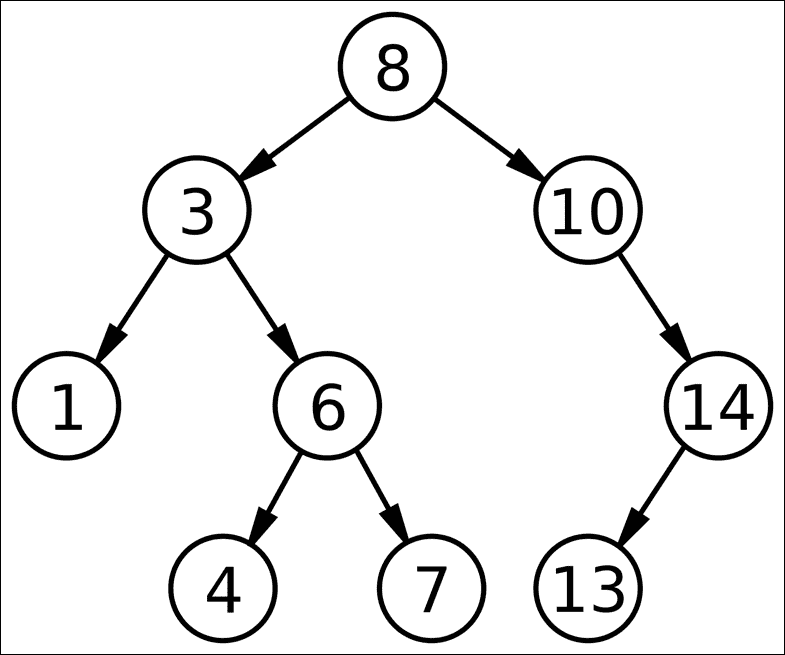
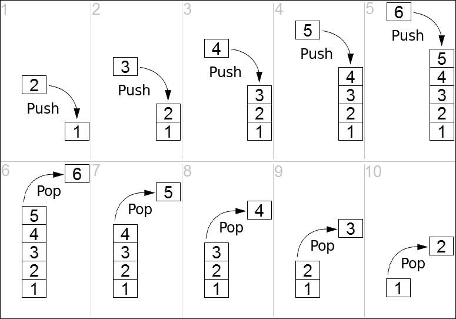

# 第八章. 函数式数据结构

我们熟悉命令式数据结构。实际上，在多种编程语言中都有许多关于命令式数据结构的参考资料。相比之下，关于声明式数据结构或函数式数据结构的参考资料并不多。这是因为函数式编程语言不像命令式编程语言那样主流。此外，由于以下原因，与命令式对应物相比，设计实现函数式数据结构更困难：

+   在函数式编程中不建议使用可变性

+   函数式数据结构预计比它们的命令式对应物更灵活

命令式数据结构严重依赖于可变性和赋值，使它们不可变需要额外的开发工作。每次我们更改命令式数据结构时，我们基本上都会覆盖之前的版本；然而，这与声明式编程不同，我们期望功能数据结构的旧版本和新版本都将继续存在并被使用。

我们可能会想，为什么要在函数式数据结构上费心，因为它们的设计和实现更困难？这个问题有两个答案：首先，函数式数据结构是高效的不可变数据结构。其次，它们支持函数式编程范式。当我们介绍到代数数据类型时，我们已经看到了这些例子，那就是在第四章第四章，*枚举和模式匹配*。

在本章中，我们将通过编码示例进一步探索函数式数据结构。本章内容深受*纯函数式数据结构*、*Chris Okasaki*、*剑桥大学出版社*的启发，这是迄今为止该主题的一个很好的参考，其中包含各种 ML 和 Haskell 编程语言的示例。强烈推荐函数式程序员阅读 Okasaki 的书籍。在本章中，我们将涵盖这个主题，并探索 Okasaki 书籍中的一些示例，使用 Swift 实现。

尤其是我们将利用结构体和枚举来实现以下函数式数据结构：

+   半群

+   幂集

+   二叉搜索树

+   链表

+   栈

+   懒惰列表

这些数据结构的编码示例作为函数式编程范式和技术展示，它们不会是完整的。

我们知道不可变性是函数式数据结构最重要的属性。为了设计和实现不可变数据结构，我们不会改变函数式数据结构，而是创建一个新的版本，它与旧版本一起存在。实际上，我们将复制需要更改的部分，而不触及数据结构的原始版本。因此，我们将使用值类型，如结构体和枚举，以便能够实现这一点。此外，由于我们不会直接更改原始数据结构，我们将能够在新结构中共享原始数据结构的部分，而不用担心更改一个版本会如何影响另一个版本。让我们通过实现不同的函数式数据结构来检查我们将如何实现这一点。

# 半群

在计算机科学中，半群是一个代数结构，它有一个集合和一个二元运算，该运算接受集合中的两个元素并返回一个具有结合运算的半群。

首先，我们需要有一个集合和特定的二元运算，或者我们可以使这种行为通用，并定义以下协议：

```swift
protocol Semigroup {
    func operation(_ element: Self) -> Self
}

```

任何符合此协议的类型都需要实现`operation`方法。在这里，`self`代表符合此协议的类型。例如，我们可以扩展`Int`以符合半群协议，并为其提供求和操作：

```swift
extension Int: Semigroup {
    func operation(_ element: Int) -> Int {
        return self + element
    }
}

```

我们可以这样测试：

```swift
let number: Int = 5
number.operation(3)

```

这个测试并不能确保二元运算的结合律。让我们尝试这个：

```swift
let numberA: Int = 3
let numberB: Int = 5
let numberC: Int = 7

if numberA.operation(numberB.operation(numberC)) == (numberA.operation(
  numberB)).operation(numberC) {
    print("Operation is associative")
}

```

上述代码确保我们的二元运算符是结合的；因此，我们的半群得到了验证。但这看起来并不太美观；让我们实现一个操作符来使它看起来更好，更符合数学风格：

```swift
infix operator <> { associativity left precedence 150 }

func <> <S: Semigroup> (x: S, y: S) -> S {
    return x.operation(y)
}

```

让我们用`<>`运算符重写我们的测试：

```swift
if numberA <> (numberB <> numberC) == (numberA <> numberB) <> numberC {
    print("Operation is associative")
}

```

到目前为止，我们只扩展了`Int`，但我们可以扩展任何类型。让我们以数组为例进行扩展：

```swift
extension Array: Semigroup {
    func operation(_ element: Array) -> Array {
        return self + element
    }
}

```

`operation`方法与我们为`Int`所拥有的非常相似。唯一的区别在于类型，在这种情况下是一个数组：

```swift
print([1, 2, 3, 4] <> [5, 6, 7]) // prints "[1, 2, 3, 4, 5, 6, 7]"

```

此外，我们可以如下扩展`String`：

```swift
extension String: Semigroup {
    func operation(_ element: String) -> String {
        return "\(self)\(element)"
    }
}
```

我们已经使用协议建立了一个组合的一般原则（两个对象结合成一个）。这种模式可以用于不同的目的。例如，我们可以为半群上的数组实现 reduce 的简短版本：

```swift
func sconcat <S: Semigroup> (initial: S, elements: [S]) -> S {
    return elements.reduce(initial, combine: <>)
}

```

`sconcat`函数名代表半群连接；我们可以这样测试它：

```swift
print(sconcat(initial: 0, elements:[1, 2, 3])) // 6
print(sconcat(initial: "", elements: ["A", "B", "C"])) // ABC
print(sconcat(initial: [], elements: [[1, 2], [3, 4, 5]])) // [1, 2, 3,
  4, 5]

```

我们最后的`sconcat`示例像`flatMap`一样工作，它会展平元素。

最后，我们的半群变成了以下形式：

```swift
infix operator <> { associativity left precedence 150 }

func <> <S: Semigroup> (x: S, y: S) -> S {
    return x.operation(y)
}

protocol Semigroup {
    func operation(_ element: Self) -> Self
}

extension Int: Semigroup {
    func operation(_ element: Int) -> Int {
        return self + element
    }
}

extension String : Semigroup {
    func operation(_ element: String) -> String {
        return self + element
    }
}

extension Array : Semigroup {
    func operation(_ element: Array) -> Array {
        return self + element
    }
}

func sconcat <S: Semigroup> (initial: S, elements: [S]) -> S {
    return elements.reduce(initial, combine: <>)
}

```

半群是一个简单的数据结构的绝佳例子，但它不像幂集那样受欢迎，我们将在下一节中探讨。

# 幂集

在计算机科学中，幂集是一个集合、一个二元运算以及集合中的一个元素，遵循以下规则：

+   二元运算的结合律

+   该元素是单位元

简而言之，一个结构是 Monoid，如果这个结构是一个 Semigroup，并且有一个是恒等元的元素。所以让我们定义一个新的协议，它扩展了我们的 Semigroup 协议：

```swift
protocol Monoid: Semigroup {
    static func identity() -> Self
}

extension Int: Monoid {
    static func identity() -> Int {
        return 0
    }
}

extension String: Monoid {
    static func identity() -> String {
        return ""
    }
}

extension Array: Monoid {
    static func identity() -> Array {
        return []
    }
}

```

我们可以像以下这样测试我们的结构：

```swift
numberA <> Int.identity() // 3
"A" <> String.identity() // A

```

由于 Monoid 有一个元素，我们可以使用这个元素作为初始值，并简化我们的 `reduce` 方法如下：

```swift
func mconcat <M: Monoid> (_ elements: [M]) -> M {
    return elements.reduce(M.identity(), combine: <>)
}

```

让我们来测试一下：

```swift
print(mconcat([1, 2, 3])) // 6
print(mconcat(["A", "B", "C"])) // ABC
print(mconcat([[1, 2], [3, 4, 5]])) // [1, 2, 3, 4, 5]

```

# 树

在计算机科学中，树是一个非常流行的 **抽象数据类型**（**ADT**）或实现此 ADT 的数据结构，它模拟了一个具有根值和子树以及父节点的层次树结构，这些子树和父节点由一组链接的节点表示。

树数据结构可以递归地（局部地）定义为从根节点开始的节点集合，其中每个节点是一个包含值以及指向节点（*子节点*）的引用列表的数据结构，约束条件是没有任何引用是重复的，也没有指向根节点。

或者，一个树可以抽象地定义为一个整体（全局）有序树，每个节点都分配了一个值。这两种观点都很有用：虽然树可以作为一个整体进行数学分析，但实际上作为数据结构表示时，通常是由节点单独表示和处理的（而不是像表示有向图那样，作为节点列表和节点之间边的关系列表）。例如，将树作为一个整体来看，可以谈论给定节点的 *父节点*，但在一般情况下，作为一个数据结构，一个给定的节点只包含其子节点的列表，但不包含对其父节点的引用（如果有的话）。

在前一章中，我们实现了 Swift 中的泛型二叉树。以下是一个改进版本：

```swift
enum Tree<Element: Comparable> {
    case leaf(Element)
    indirect case node(lhs: Tree, rhs: Tree)
}

```

我们将 `Tree` 定义为一个具有三个不同情况的 `enum`：

+   **叶子节点**：如果我们处于 `Tree` 的一个分支的末端；简单来说，如果一个节点没有任何子节点，那么它就是一个 `Leaf`

+   **节点**：一个具有左右两侧的结构

下图展示了一个示例 `Tree`：



`Tree` 是一个泛型，其中的元素是可以比较的。

使用这个 `Tree` 的方法如下所示：

```swift
let functionalTree = Tree.node(lhs: Tree.leaf("First"),
                               rhs: Tree.node(lhs:
 Tree.leaf("Second"), 
                               rhs: Tree.leaf("Third")))
```

我们的 `functionalTree` 是不可变的，换句话说，它是持久的。它有一个作为 `lhs` 的叶子节点和一个包含两个叶子节点的节点作为 `rhs`。由于这个结构是不可变的，我们不必担心它是否会改变，并且我们可以与其他树共享这个树：

```swift
let secondFT = Tree.node(lhs: functionalTree, rhs: Tree.node(
                         lhs: Tree.leaf("Fourth"),
                         rhs: Tree.leaf("Fifth")))
let thirdFT = Tree.node(lhs: Tree.node(lhs: Tree.leaf("Fourth"),
                        rhs: Tree.leaf("Fifth")),
                        rhs: functionalTree)
```

在前面的例子中，我们使用了我们的第一个 `Tree`，即 `functionalTree`，作为 `secondFT` 和 `thirdFT` 的一部分。

## 包含

这个 `Tree` 还远未完善，需要很多功能。例如，我们可能需要检查 `Tree` 是否包含特定的值。为了能够做到这一点，我们需要向我们的 `Tree` 添加以下方法：

```swift
static func contains(_ key: Element, tree: Tree<Element>) -> Bool {
    switch tree {
    case .leaf(let element):
        return key == element
    case node(let lhs, let rhs):
        return contains(key, tree:lhs) || contains(key, tree:rhs)
    }
 }

```

我们可以像以下这样测试 `contains` 方法：

```swift
let isFound = Tree.contains("First", tree: functionalTree) // will
  return true
```

## 二叉搜索树

在我们简单的 `Tree` 假设中，只有叶子节点包含值。这并不总是正确的。事实上，存在不同类型的树，它们具有不同的效用，而 **二叉搜索树（BST**） 就是其中之一。

在计算机科学中，二叉搜索树，有时称为有序或排序二叉树，是一种特定的容器：数据结构，它们在内存中存储 *项目*（如数字、名称等）。它们允许快速查找、添加和删除项目，并实现动态项目集或查找表，允许通过其键（例如，通过姓名查找某人的电话号码）来查找项目。

BSTs 将它们的键按排序顺序存储，以便查找和其他操作可以使用二分搜索的原则：当在树中查找一个键（或插入新键的位置）时，它们从根节点遍历到叶子节点，将树节点中存储的键进行比较，并根据比较结果决定是否在左子树或右子树中继续搜索。平均而言，这意味着每次比较都允许操作跳过大约一半的树，因此每次查找、插入或删除的时间与树中存储的项目数量的对数成比例。这比在（未排序的）数组中通过键查找项目所需的线性时间要好得多，但比哈希表上的相应操作要慢。

让我们改进我们的简单树并将其转换为 BST：

```swift
enum BinarySearchTree<Element: Comparable> {
    case leaf
    indirect case node(lhs: BinarySearchTree, element: Element,
                       rhs: BinarySearchTree)
}

```

`BinarySearchTree` 树与之前的 `Tree` 非常相似，唯一的区别是 `node` 包含 `element` 而不是 `leaf`。使用它的方法如下：

```swift
let functionalBST = BinarySearchTree.node(lhs: BinarySearchTree.node(
  lhs: BinarySearchTree.leaf, element: 1,
  rhs: BinarySearchTree.leaf),
  element: 5, rhs: BinarySearchTree.node(lhs:BinarySearchTree.leaf,
  element: 9, rhs: BinarySearchTree.leaf))
```

在这里，我们创建了一个 BST，因为存储在 `lhs` 中的值小于根节点，而存储在 `rhs` 中的值大于根节点。在这个例子中，`lhs` 是一个值为 `1` 的 BST。根节点的值为 `5`，而 `rhs` 是一个值为 `9` 的 BST，这个值大于根节点的值。

### 包含

此外，我们的 `contains` 方法需要修改，因为它将仅在叶子节点中搜索。让我们改进它，假设我们的树是一个 BST：

```swift
static func contains(_ item: Element, tree: BinarySearchTree<Element>)
  -> Bool {
    switch tree {
    case .leaf:
        return false
    case .node(let lhs, let element, let rhs):
        if item < element {
            return contains(item, tree: lhs)
        } else if item > element {
            return contains(item, tree: rhs)
        }
        return true
    }
}

```

此方法搜索特定的 `element`，如果它在 `node` 中找到它，则返回 `true`。

以下展示了此方法的示例用法：

```swift
let isFound = BinarySearchTree.contains(9, tree: functionalBST)

```

`isFound` 变量在这种情况下将被设置为 `true`。

### 大小

为了使这个 BST 更完整，让我们实现一个属性来检查它的大小：

```swift
var size: Int {
    switch self {
    case .leaf:
        return 0
    case .node(let lhs, _, let rhs):
        return 1 + lhs.size + rhs.size
    }
}

```

这个计算属性将提供 BST 的大小，我们可以如下使用它：

```swift
print(functionalBST.size) // prints "3"

```

### 元素

能够从 BST 元素生成一个数组将是非常棒的。这可以如下完成：

```swift
var elements: [Element] {
    switch self {
    case .leaf:
        return []
    case .node(let lhs, let element, let rhs):
        return lhs.elements + [element] + rhs.elements
    }
}

```

### 空的

我们可以实施一个辅助方法来生成空二叉搜索树（BST），如下所示：

```swift
static func empty() -> BinarySearchTree {
    return .leaf
}

```

以下是一个计算属性，用于检查 BST 是否为空：

```swift
var isEmpty: Bool {
    switch self {
    case .leaf:
        return true
    case .node(_, _, _):
        return false
    }
}

```

让我们测试这些函数：

```swift
let emptyBST = BinarySearchTree<Int>.empty()
print(emptyBST.isEmpty)

```

在前面的代码中，我们创建了一个空的 BST 并使用 `isEmpty` 属性检查它是否为空。显然，结果将是 `true`。

这个 BST 实现远未完成，需要通过实现检查它是否为 BST 的方法来改进。

最后，我们的二叉搜索树（BST）变成了以下这样：

```swift
enum BinarySearchTree<Element: Comparable> {
    case leaf
    indirect case node(lhs: BinarySearchTree, element: Element,
                       rhs: BinarySearchTree)

    var size: Int {
        switch self {
        case .leaf:
            return 0
        case .node(let lhs, _, let rhs):
            return 1 + lhs.size + rhs.size
        }
    }

    var elements: [Element] {
        switch self {
        case .leaf:
            return []
        case .node(let lhs, let element, let rhs):
            return lhs.elements + [element] + rhs.elements
        }
    }

    var isEmpty: Bool {
        switch self {
        case .leaf:
            return true
        case .node(_, _, _):
            return false
        }
    }

    init() {
        self = .leaf
    }

    static func empty() -> BinarySearchTree {
        return .leaf
    }

    init(element: Element) {
        self = .node(lhs: .leaf, element: element, rhs: .leaf)
    }

    static func contains(_ item: Element,
                           tree: BinarySearchTree<Element>)
      -> Bool {
        switch tree {
        case .leaf:
            return false
        case .node(let lhs, let element, let rhs):
            if item < element {
                return contains(item, tree: lhs)
            } else if item > element {
                return contains(item, tree: rhs)
            }
            return true
        }
    }
}

```

尽管它并不代表 BST 的完整实现，但我们能够以函数式风格开发它，并且我们将在其他树之间共享和重用这棵树，因为它们是不可变的。

# Lists

列表有多种类型，包括链表、双向链表、多重链表、循环链表、队列和栈。

在本节中，我们将展示一个简单的链表，这是命令式编程语言中最简单且最受欢迎的数据结构之一。

链表是由称为节点的数据元素线性集合，这些节点使用指针指向下一个节点。链表以线性顺序方式存储其数据。简单地说，每个节点由数据和指向序列中下一个节点的引用组成：


让我们从简单版本开始：

```swift
enum LinkedList<Element: Equatable> {
    case end
    indirect case node(data: Element, next: LinkedList<Element>)
}

```

我们的方法与我们的 BST 实现方法类似。区别在于 `node` 情况具有 `data` 元素和指向其下一个元素的指针，该指针也是一个 `LinkedList`。

## Empty LinkedList

我们的 `LinkedList` 需要一个方法来创建它为空：

```swift
static func empty() -> LinkedList {
    return .end
}

```

这就像返回 `.end` 一样简单。

## Cons

我们需要有一种方法来向 `LinkedList` 添加项目，所以我们按照以下方式实现它：

```swift
func cons(_ element: Element) -> LinkedList {
    return .node(data: element, next: self)
}

```

这种简单的方法将数据追加到 `LinkedList` 的前面；换句话说，它就像对栈的推操作。我们可以如下测试它：

```swift
let functionalLinkedList = LinkedList<Int>.end.cons(1).cons(2).cons(3)
print(functionalLinkedList)

```

这个操作的最终结果应该是以下这样：

```swift
node(3, LinkedList<Swift.Int>.node(2, LinkedList<Swift.Int>.node(
  1, LinkedList<Swift.Int>.end)))
```

函数式编程语言，如 Haskell 和 Scala，有 cons 操作符。在 Haskell 中是 `:`，在 Scala 中是 `::`。由于我们无法在 Swift 中使用 `:` 来定义中缀操作符，我们将使用 `<|` 代替：

```swift
infix operator <| { associativity right precedence 100 }

func <| <T>(lhs: T, rhs: LinkedList<T>) -> LinkedList<T> {
    return .node(data: lhs, next: rhs)
}

```

我们可以如下测试它：

```swift
let functionalLLWithCons = 3 <| 2 <| 1 <| .end

```

这个语句会产生完全相同的结果。

再次，这个 `LinkedList` 远未完成，但我们已经实现了很高的可重用性，因为它是以函数式实现的。我们可以使用/共享我们的 `functionalLinkedList` 与其他链表，而不用担心变化和不一致性。让我们检查以下内容：

```swift
let secondLL = functionalLinkedList.cons(4)
let thirdLL = functionalLinkedList.cons(5)
let fourthLL = LinkedList<Int>.node(data: 1, next: secondLL)

```

在前面的例子中，我们使用 `functionalLinkedList` 并向其中添加一个新项目（`4`）以获得 `secondLL`，以及 `5` 以获得 `thirdLL`。我们还使用 `secondLL` 来创建 `fourthLL`。

## Contains

为了使这个 `LinkedList` 更有趣，我们将开发一个类似于为 BST 开发的包含方法：

```swift
static func contains(_ key: Element, list: LinkedList<Element>) -> Bool {
    switch list {
    case .end:
        return false
    case .node(let data, let next):
        if key == data {
            return true
        } else {
            return contains(key, list: next)
        }
    }
}

```

这个方法递归地在 `LinkedList` 中检查特定元素，如果找到该元素则返回 `true`：

```swift
print(LinkedList.contains(1, list: functionalLinkedList))

```

这个表达式的结果是 `true`。

## Size

我们可以实现一个计算出的 `size` 属性来计算链表的大小如下：

```swift
var size: Int {
    switch self {
    case .node(_, let next):
        return 1 + next.size
    case .end:
        return 0
    }
}

```

这个方法递归地遍历 `LinkedList` 并计算节点数：

```swift
print(functionalLinkedList.size)

```

在这个例子中，结果将是 `3`。

## Elements

我们可以实施一个计算属性来提供一个元素数组如下：

```swift
var elements: [Element] {
    switch self {
    case .node(let data, let next):
        return [data] + next.elements
    case .end:
        return []
    }
}

```

在这里，我们递归遍历 LinkedList 并返回一个数据数组。我们将能够使用这个属性如下：

```swift
print(functionalLinkedList.elements)

```

这个语句打印 `[3, 2, 1]`。

## isEmpty

`LinkedList` 需要的另一个常见操作是检查它是否为空。我们可以轻松地以下方式实现它：

```swift
var isEmpty: Bool {
    switch self {
    case .node(_ , _):
        return false
    case .end:
        return true
    }
}

```

为了测试这个计算属性，我们将创建一个空的 `LinkedList` 如下：

```swift
let emptyLL = LinkedList<Int>.end
print(emptyLL.isEmpty)

print(functionalLinkedList.isEmpty)

```

在前面的例子中，第一个 `print` 语句的结果是 `true`，第二个结果是 `false`。

## map, filter, 和 reduce

你可能想知道我们是否能够将高阶函数如 map、filter 和 reduce 应用到我们的链表上。我们已经使用递归 `enum` 实现了我们的链表，递归模式非常适合高阶函数。

让我们从 `map` 开始：

```swift
func map<T>(_ transform: (Element) -> T) -> LinkedList<T> {
    switch self {
    case .end:
        return .end
    case .node(let data, let next):
        return transform(data) <| next.map(transform)
    }
}

```

使用这个方法，我们将能够转换链表中的元素。这里没有什么特别的；我们使用之前定义的相同的 `cons` 操作符。以下语句将测试我们的方法：

```swift
let mappedFunctionalLL = functionalLinkedList.map { $0 * 2 }

```

结果应该是以下这样：

```swift
node(6, LinkedList<Swift.Int>.node(4, LinkedList<Swift.Int>.node(
  2, LinkedList<Swift.Int>.end)))
```

因此，我们可以轻松地将链表中的元素乘以 `2`。

让我们继续 `filter` 方法：

```swift
func filter(_ predicate: ((Element) -> Bool)) -> LinkedList<Element> {
    switch self {
    case .end:
        return .end
    case .node(let data, let next):
        return predicate(data) ? data <| next.filter(predicate) :
          next.filter(predicate)
    }
}

```

在这里，我们首先检查 `predicate` 是否产生结果。如果产生了，然后我们将我们的 `cons` 操作符应用于数据，并递归地 `filter` 下一个元素。否则，我们只是递归地应用 `filter` 到下一个元素。我们可以如下测试这个方法：

```swift
let filteredFunctionalLL = functionalLinkedList.filter { $0 % 2 == 0 }

```

在前面的代码示例中，我们 `filter` 我们链表中的偶数元素。这个语句的结果如下：

```swift
node(2, LinkedList<Swift.Int>.end)

```

能够对链表进行 `map` 和 `filter` 是很棒的，但我们还需要一个 `reduce` 方法。让我们来实现这个：

```swift
func reduce<Value>(_ initial: Value, combine: (Value, Element) -> Value)
  -> Value {
    switch self {
    case .end:
        return initial
    case .node(let data, let next):
        return next.reduce(combine(initial, data), combine: combine)
    }
}

```

在前面的代码示例中，我们递归遍历链表的元素并将值 `reduce` 到单个值。以下代码展示了使用示例：

```swift
let reducedFunctionalLL = functionalLinkedList.reduce(0) { $0 + $1}

```

这个表达式的结果是 `6`。

最后，我们的 `LinkedList` 变成以下形式：

```swift
/// Operator
infix operator <| { associativity right precedence 100 }

func <| <T>(lhs: T, rhs: LinkedList<T>) -> LinkedList<T> {
    return .node(data: lhs, next: rhs)
}

/// LinkedList

enum LinkedList<Element: Equatable> {
    case end
    indirect case node(data: Element, next: LinkedList<Element>)

    var size: Int {
        switch self {
        case .node(_, let next):
            return 1 + next.size
        case .end:
            return 0
        }
    }

    var elements: [Element] {
        switch self {
        case .node(let data, let next):
            return [data] + next.elements
        case .end:
            return []
        }
    }

    var isEmpty: Bool {
        switch self {
        case .node(_ , _):
            return false
        case .end:
            return true
        }
    }

    static func empty() -> LinkedList {
        return .end
    }

    func cons(_ element: Element) -> LinkedList {
        return .node(data: element, next: self)
    }

    func map<T>(_ transform: (Element) -> T) -> LinkedList<T> {
        switch self {
        case .end:
            return .end
        case .node(let data, let next):
            return transform(data) <| next.map(transform)
        }
    }

    func filter(_ predicate: ((Element) -> Bool)) -> LinkedList<Element> {
        switch self {
        case .end:
            return .end
        case .node(let data, let next):
            return predicate(data) ? data <| next.filter(predicate)
              : next.filter(predicate)
        }
    }

    func reduce<Value>(_ initial: Value, combine: (Value, Element)
      -> Value) -> Value {
        switch self {
        case .end:
            return initial
        case .node(let data, let next):
            return next.reduce(combine(initial, data), combine: combine)
        }
    }

    static func contains(_ key: Element, list: LinkedList<Element>)
      -> Bool {
        switch list {
        case .end:
            return false
        case .node(let data, let next):
            if key == data {
                return true
            } else {
                return contains(key, list: next)
            }
        }
    }
}

```

# 栈

栈是一种基于 **后进先出**（**LIFO**）策略的集合。

下面的图展示了示例栈：



要实现一个简单的函数式栈，我们需要提供 `push`、`pop`、`isEmpty` 和 `size` 操作。我们在前面的部分实现了一个函数式 `LinkedList`，它可以用来实现一个简单的函数式栈，具有以下操作：

+   **push**: `LinkedList` 中的 `cons` 操作

+   **pop**

+   **isEmpty**: `LinkedList` 中的 `isEmpty` 操作

+   **大小**: `LinkedList` 中的 `size` 方法

如此看来，唯一缺少的操作是 `pop`。让我们来实现它：

```swift
func pop() -> (element: Element, linkedList: LinkedList)? {
    switch self {
    case .node(let data, let next):
        return (data, next)
    case .end:
        return nil
    }
}

```

为了测试，我们可以执行以下操作：

```swift
if let (element, linkedList) = functionalLinkedList.pop() {
    print(element)
    let newLinkedList = linkedList.pop()
    print(newLinkedList)
}

```

第一个 `print` 的结果将是 `3`，第二个 `print` 的结果将是以下这样：

```swift
Optional((2, LinkedList<Swift.Int>.node(1, LinkedList<Swift.Int>.end)))

```

这只是一个示例实现，我们使用 `Optional` Tuple 作为返回值以获取弹出的元素以及结果新的链表。

我们还需要做的一件事是将我们的 `enum` 名称更改为更通用的名称，例如 list。

最后，我们的栈变得与列表非常相似。

# 惰性列表

到目前为止，我们已经实现了一个链表和一个栈作为列表。函数式编程中的一个关键概念是惰性评估的概念。我们可以使我们的列表成为惰性的，这样元素将在我们访问它们时才被评估。我们需要以这种方式修改 `node`，使其返回一个包含 List 的函数作为 `next`，而不是列表本身。该函数将在调用时进行评估；因此，我们的列表将是惰性的。

我们首先修改我们的 `node` 情况。在我们的 `LinkedList` 示例中，`next` 是 `LinkedList<Element>` 类型。为了使我们的列表成为惰性的，我们将修改 `next` 以使其成为一个返回我们的 List 的函数：

```swift
enum LazyList<Element: Equatable> {
    case end
    case node(data: Element, next: () -> LazyList<Element>)
}

```

正如我们在前面的代码中所看到的，我们的 `Node` 情况并没有定义为间接的，因为 `next` 不是 `LazyList` 类型，而是返回 `LazyList` 的函数的引用。

我们需要将此更改纳入我们的属性和方法中。这就像将任何 `next` 改为 `next()` 一样简单。例如，我们的 `size` 属性变为以下内容：

```swift
var size: Int {
    switch self {
    case .node(_, let next):
        return 1 + next().size
    case .end:
        return 0
    }
}

```

如果我们遵循代码并正确修改它，我们会看到我们的 `map` 和 `filter` 无法编译。我们需要按照以下方式更改操作符：

```swift
infix operator <|| { associativity right precedence 100 }

func <|| <T>(lhs: T, rhs: () -> LazyList<T>) -> LazyList<T> {
    return .node(data: lhs, next: rhs)
}

```

在这里，我们将 `rhs` 更改为与我们的 LazyList 的 `next` 匹配的函数类型。这种更改并没有解决我们的 `map` 和 `filter` 问题。看起来 `infix` 操作符的右侧在传递给它之前就被评估了，而我们不希望这样。

这是因为我们在 `map` 和 `filter` 方法中并没有将闭包传递给我们的操作符：

```swift
func map<T>(_ transform: (Element) -> T) -> LazyList<T> {
    switch self {
    case .end:
        return .end
    case .node(let data, let next):
        return transform(data) <|| next().map(transform)
    }
}

```

在我们的 `map` 方法示例中，`next().map(transform)` 不是一个闭包。如果我们将其包裹在 `{ }` 中，那么它就变成了一个闭包。我们可以按照以下方式修改我们的 `infix` 操作符：

```swift
func <|| <T>(lhs: T, rhs: @autoclosure(escaping) () -> LazyList<T>)
  -> LazyList<T> {
    return .node(data: lhs, next: rhs)
}

```

`@autoclosure` 属性在表达式周围创建一个自动闭包。因此，当我们编写 `next().map(transform)` 这样的表达式时，它会在传递给我们的 `infix` 操作符之前自动包裹在一个闭包中，成为 `{ next().map(transform) }`。

从 Swift 1.2 开始，`autoclosure` 默认为 `noescape`。此属性确保参数不会被存储以供稍后执行，并且不会超出调用范围的生命周期。`noescape` 实现添加了轻微的性能优化，并绕过了对属性和方法使用 `self` 进行注解的需要。

括号中的 `escaping` 注解是必要的，以便表示闭包的持续时间将超过其声明的范围的生命周期。

最后，我们需要通过以下方式将 `cons` 方法包裹在 `{ }` 中进行更改：

```swift
func cons(_ element: Element) -> LazyList {
    return .node(data: element, next: { self })
}

```

让我们测试我们的 `LazyList` 并看看它是否正常工作：

```swift
let ourLazyList = 3 <|| 2 <|| 1 <|| LazyList.end // node(3, (Function))
print(ourLazyList.size) // prints 3

```

我们惰性列表现在如下所示：

```swift
/// Operator
infix operator <|| { associativity right precedence 100 }

func <|| <T>(lhs: T, rhs: @autoclosure(escaping) () -> LazyList<T>)
  -> LazyList<T> {
    return .node(data: lhs, next: rhs)
}

/// Lazy List
enum LazyList<Element: Equatable> {
    case end
    case node(data: Element, next: () -> LazyList<Element>)

    var size: Int {
        switch self {
        case .node(_, let next):
            return 1 + next().size
        case .end:
            return 0
        }
    }

    var elements: [Element] {
        switch self {
        case .node(let data, let next):
            return [data] + next().elements
        case .end:
            return []
        }
    }

    var isEmpty: Bool {
        switch self {
        case .node(_ , _):
            return false
        case .end:
            return true
        }
    }

    static func empty() -> LazyList {
        return .end
    }

    func cons(_ element: Element) -> LazyList {
        return .node(data: element, next: { self })
    }

    func removeLast() -> (element: Element, linkedList: LazyList)? {
        switch self {
        case .node(let data, let next):
            return (data, next())
        case .end:
            return nil
        }
    }

    func map<T>(_ transform: (Element) -> T) -> LazyList<T> {
        switch self {
        case .end:
            return .end
        case .node(let data, let next):
            return transform(data) <|| next().map(transform)
        }
    }

    func filter(_ predicate: ((Element) -> Bool)) -> LazyList<Element> {
        switch self {
        case .end:
            return .end
        case .node(let data, let next):
            return predicate(data) ? data <|| next().filter(predicate)
              : next().filter(predicate)
        }
    }

    func reduce<Value>(_ initial: Value, combine: (Value, Element)
      -> Value) -> Value {
        switch self {
        case .end:
            return initial
        case .node(let data, let next):
            return next().reduce(combine(initial, data), combine: combine)
        }
    }

    static func contains(_ key: Element, list: LazyList<Element>) -> Bool {
        switch list {
        case .end:
            return false
        case .node(let data, let next):
            if key == data {
                return true
            } else {
                return contains(key, list: next())
            }
        }
    }
}

```

# 摘要

在本章中，我们介绍了函数式数据结构的概念，并探讨了以函数方式实现的数据结构示例，例如 Semigroup、Monoid、BST、链表、栈和惰性列表。

尽管这些数据结构都不完整，但它们作为展示函数式编程范式和技术结构的例子是有用的。检查这些数据结构中的任何一个的性能也将是有益的。

在下一章中，我们将通过考察其益处来探讨不可变性的重要性。我们还将检查可变与不可变实现的例子，以及以函数式方式获取和设置不可变对象的方法，例如复制构造函数和透镜。
