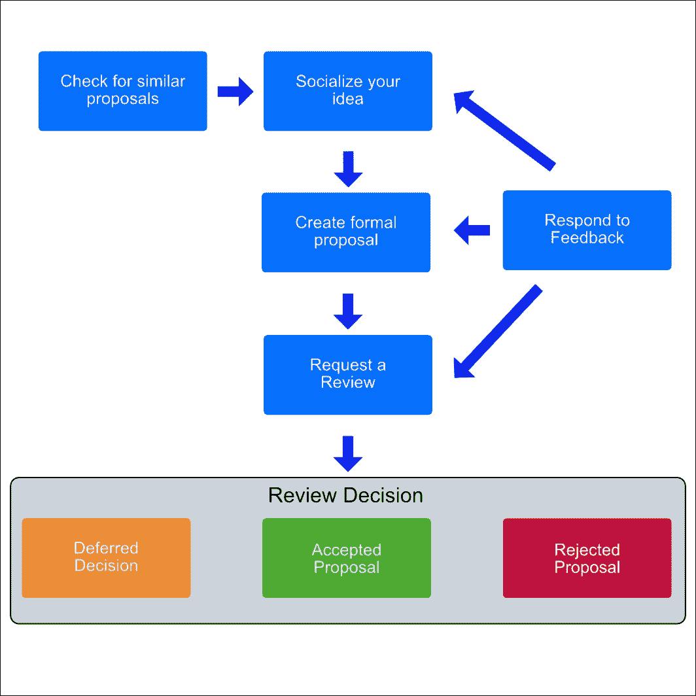

# 第一章。他们是怎么想的？

苹果公司发布的 Swift 从一开始就取得了巨大的成功。这种语言产生了大量的炒作，并且它实现了承诺。当然，随着任何新编程语言的引入，问题和问题也会随之而来。苹果公司已经精心培养了这种年轻的语言，并且一直在稳步改进其基础，引入新的功能、支持和与长期主导的 **Objective-C** 的兼容性。那么，为什么苹果要将语言开源？苹果的目标是什么，这又对我们关于即将发布的 Swift 3 的发布有什么启示？

本章的重点是讨论苹果公司对 Swift 3 的目标，向您展示您可以在哪里找到关于语言新和当前发展的官方信息来源，并解释开发者社区将如何塑造 Swift 作为一门语言的未来。

# 苹果公司对 Swift 3 的目标

在 2016 年苹果公司**全球开发者大会**（**WWDC**）的“*Swift 新特性*”讲座中，苹果工程师概述了即将发布的 Swift 3 的几个目标：

+   建立一个开放的社区

+   可移植性到新平台

+   确保基础正确

+   优化以实现卓越

### 注意

如果您错过了会议，您可以在苹果开发者门户上观看讲座的重播。这里是 *Swift 新特性* 的链接：[`developer.apple.com/videos/play/wwdc2016/42`](https://developer.apple.com/videos/play/wwdc2016/42)。

我想在这里简要地提及几个主题，因为它将为你在剩余章节中找到的材料提供一个基础：

+   苹果公司认为，为了 Swift 的广泛采用，它需要一个强大的社区。快速采用 Swift 的途径是将社区的呼声纳入其开发中。

+   Swift 是一种通用语言，可以在任何平台上运行。想象一下在 Linux 上或在您创建或需要控制的 **物联网**（**IoT**）上运行 Swift。苹果公司相信 Swift 语言的能力如此之强，以至于他们移除了将 Swift 与在 Mac 上运行绑定的障碍，为平台可移植性打开了无限可能。苹果公司希望社区找到让 Swift 在其他平台上运行的方法。今天，Swift 团队正在支持 Linux 的移植。明天，Swift 团队可能会对广泛的平台提供官方支持。

+   为了使前两个主题成为可能，Swift 团队需要在 Swift 3 的开发初期就确保一切正确。不幸的是，这意味着 Swift 3 中的新变化与 Swift 的先前版本不兼容。Swift 3 将修复和删除 Swift 2（及其前身）中不协调的部分。Swift 3 还重新构想了自己与 Cocoa 和 Objective-C 的交互方式，使连接它们的 API 感觉更加 *Swift*。

Swift 对苹果来说意义重大，对语言的期望也很高。苹果已经制定了实现目标的路线图。实际上，您可以通过订阅这里找到的邮件列表之一 [`swift.org/community/#mailing-lists`](https://swift.org/community/#mailing-lists) 来保持 Swift 相关内容的最新状态。与 Swift 社区沟通的主要方式是通过邮件列表。您可以找到针对一般信息的邮件列表，以及针对语言日常更新的列表。Swift 邮件列表可以是一个非常有价值的工具，您不应忽视。

在下一节中，我们将讨论开源社区对您作为 Swift 开发者意味着什么。

# 开源 Swift

2015 年 12 月 3 日，苹果在 Apache 2.0 许可下开源了 Swift（包括语言、支持库、调试器和包管理器），并在同一天启动了 [`Swift.org/`](https://Swift.org/) 网站。[`Swift.org/`](https://Swift.org/) 是查找构成 Swift 的各种项目的官方网站。它是您阅读有关语言所有开发工作的公告的主要来源，从新特性的提案到您可以下载和测试的 Swift 代码开发分支的链接。

[`Swift.org/`](https://Swift.org/) 是一个您希望将其添加到书签以供将来参考的网站。整个 Swift 代码库托管在 GitHub 上，任何人都可以访问。花点时间想想这一点。任何人都可以下载 Swift，玩玩二进制文件，构建一个项目，或者查看内部结构以了解事物实际上是如何工作的。对于一个规模和声誉如此之大的公司来说，将 Swift（他们押注以驱动所有应用程序的语言）开源给社区是惊人的，不应被轻视。这是一件大事！

自然，苹果并没有只是将语言交付后就走开了。相反，苹果成立了一个内部团队来监督开发过程，并负责日常项目管理。Swift 语言的开源版本由一组项目组成，每个项目都在 GitHub 上作为独立的仓库托管。今天，您可以找到六个活跃项目的链接：

+   **Swift 编译器**：命令行工具

+   **标准库**：作为核心语言的一部分分发

+   **核心库**：提供更高级的功能

+   **LLDB 调试器**：包括 Swift REPL

+   **Swift 包管理器**：构建项目和分发它们

每个项目在 [`Swift.org/`](https://Swift.org/) 上都有一个专门的章节，解释项目目标和如何使用 Swift 以及作为社区成员贡献的方法。我鼓励您查看 [`Swift.org/`](https://Swift.org/) 以更好地了解苹果视角下的所有 Swift 相关内容。在我们结束关于 Swift 资源查找的章节之前，我确实想简要讨论一下成为社区贡献者意味着什么。

社区结构已经经过深思熟虑，旨在为社区成员提供强有力的领导。这个结构将指导语言的持续发展，并有望确保随着社区规模的扩大，许多新的社区贡献者都能发出被听到和尊重的声音。以下列出的是构成社区成员角色的内容：

+   **项目负责人**: 苹果公司是项目的负责人，并将从社区中选出其他人担任各种技术领导职位

+   **核心团队**: 这个由工程师组成的小团队负责战略方向

+   **代码负责人**: 这个头衔属于负责 Swift 项目代码库特定领域的任何人

+   **提交者**: 这个角色授予任何拥有 Swift 仓库提交访问权限的人

+   **贡献者**: 这个角色保留给任何为补丁做出贡献或帮助进行代码审查的人

您可以在[`Swift.org/`](https://Swift.org/)的社区部分了解更多关于社区中个人角色的信息。Swift 社区正在增长，并且不出所料，许多开发者都对如何做出贡献感到好奇。考虑到这一点，让我们来探讨一下事情是如何完成的。

# 为 Swift 做出贡献

有几种方式可以帮助使社区和 Swift 变得更好。令人惊讶的是，这不仅仅是通过编写代码。社区需要支持在邮件列表上回答问题。您的回答可能从帮助新手更好地理解新概念到，走向极端，帮助经验丰富的开发者解决微妙的错误。无论如何，贡献您的知识对他人来说可能很有价值，并且会受到极大的欢迎！

为 Swift 项目做出贡献的下一个选项是通过报告或分类错误。Swift 团队使用 Jira 进行缺陷跟踪，您可以在位于[`bugs.swift.org`](https://bugs.swift.org)的项目 Jira 实例上提交错误。

作为开发者，您作为贡献者有最后一个选择，那就是贡献代码。提交代码有一个正式的过程，我们将简要介绍。Swift 项目更喜欢小规模的增量更改，而不是大型提交或长期断开的特性分支。Swift 团队还鼓励，但不强制要求，提交消息详细描述提交的代码更改内容。代码质量非常重要，并通过强制代码审查和拉取请求来强调，以确保至少有另一组眼睛审查了所有代码更改。这样想吧；您的更改最终将进入生产环境，并有可能影响数百万使用 Swift 语言的开发者。您真的想冒险引入可能影响数百万开发者的缺陷吗？

# Swift 进化过程

虽然 Apple 和 Swift 团队各自有很多关于 Swift 发展方向的优秀想法，但重要的是要记住，他们并不是唯一有想法的人。事实上，Swift 团队完全意识到这一点，并为此创建了一个流程，让你可以提交你的大或小想法，以帮助塑造 Swift 语言。

Swift 进化流程涵盖了从构思到讨论和对话，以及希望最终以被接受的提案结束的所有相关事项，该提案可供开发者用于生产发布。该流程的目标是在社区中保持活跃参与，以引导语言的方向，同时保持 Swift 的愿景。在实践中，这可能意味着添加使语言更容易使用的新功能，或删除不再符合 Swift 愿景的功能。你可以通过提出新想法或讨论和审查其他社区成员的提案来参与其中。

Swift 进化提案步骤

这里是将新想法转变为被接受提案所需的步骤：

1.  **检查类似提案**：做你的作业并确保你的想法尚未被提出和/或拒绝。花时间审查提案及其状态。你可以通过查看“常见拒绝提案”列表来完成这项任务。

1.  **告诉他人你的想法**：关于新想法的大部分讨论都发生在 swift-evolution 邮件列表上。这是你应该创建你的想法草稿的地方，包括它解决的问题以及一些关于解决方案的背景信息。

1.  **创建你的提案**：使用此处找到的提案模板 [`github.com/apple/swift-evolution/blob/master/0000-template.md`](https://github.com/apple/swift-evolution/blob/master/0000-template.md)，你详细阐述你的想法，并在进化邮件列表上继续推广它。

1.  **请求审查**：当你认为你的提案已经准备好由核心团队进行正式审查时，你向 swift-evolution 仓库 [`github.com/apple/swift-evolution`](https://github.com/apple/swift-evolution) 提交一个拉取请求。当你的拉取请求被接受时，你的提案将被分配一个提案编号，并指派一位核心团队成员来协助审查。

1.  **回应反馈**：你的任务是回应邮件列表上关于你的提案的问题和反馈。在审查期间这尤为重要。

如果一切顺利，你的提案将在审查过程中通过以下提案状态，并被接受。

+   **等待审查**：直到提案被分配一个审查日期，你的提案将保持此状态。

+   **审查中**：你的提案正在 swift-evolution 邮件列表上进行公开审查。

+   **修订中**：如果你在审查状态期间收到反馈，你将有机会处理和修改你的提案。

+   **延迟**：由于不符合即将到来的主要 Swift 版本的准则，决策被推迟。在此状态下，您的提案将在为下一个主要 Swift 版本规划时重新考虑。

+   **接受**：已接受，并且可以开始或正在积极实施您接受的提案。同时，也会发布公告，让社区了解即将发布的新的接受提案。

+   **拒绝**：被核心团队考虑但被拒绝。

关于审查过程，以下是一些关键事项要记住。它不会开始，直到核心团队成员（审查经理）接受您的提案拉取请求。一旦接受，审查经理将与您和其他提案作者协调审查期，开始正式的公开审查。在大多数情况下，审查期为一周，但根据提交的提案中概述的范围和复杂性，可能会更长。最后，核心团队，而不仅仅是审查经理，将根据 swift-evolution 邮件列表上的评论来做出决策。

# Swift 3 接受的提案概述

Swift 的每个主要版本都将有高层目标，接受的功能必须遵守这些目标。对于 Swift 3 版本，Swift 团队概述了该版本的主要目标是巩固和成熟 Swift 语言和开发体验。

用他们自己的话来说，Swift 团队继续表示，虽然 Swift 1 到 3 的语言源代码破坏性变更一直是常态，但我们希望 Swift 3.x（以及 Swift 4+）语言尽可能与 Swift 3.0 兼容。然而，这仍然是最努力做到的：如果确实有很好的理由在 Swift 3 之外进行破坏性变更，我们将考虑它，并找到最不具侵略性的方式来推出该变更（例如，通过有一个漫长的弃用周期）。

为了实现 Swift 3 的发布目标，以下各项在确保未来发布的基本正确性方面都被认为是重要的：

+   API 设计指南

+   自动应用命名规范到导入的 Objective-C API

+   在关键 API 中采用命名规范

+   导入的 Objective-C API 的 Swift 化

+   焦点和语言精炼

+   工具质量改进

您可以在 Swift Evolution 存储库页面上了解更多关于这些领域的信息，以及查看已实施、已接受但尚未实施以及被拒绝或撤回的提案的完整列表。

# 摘要

在本章中，我们讨论了苹果对 Swift 3 的目标以及社区参与和投入对语言发展的重要性。我还向您展示了如何找到关于语言新和当前发展的官方信息来源。最后，我们学习了社区如何为 Swift 语言的发展做出贡献。在第二章中，*发现新领域 – Linux 终于来了！* 我们探讨了在 Linux 上开发 Swift。
