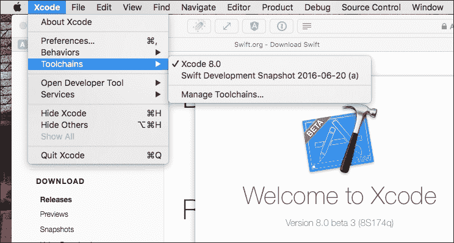
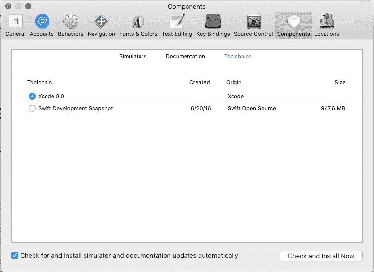

# 第二章. 探索新领域 – Linux 终于来了！

直到最近，为 Swift 开发意味着您需要一个装有 Xcode IDE 的 Mac。然而，所有这些都随着苹果公司在 2015 年 12 月开源 Swift 编程语言而发生了变化。作为开发者，我们进入了一个全新的世界，因为 Swift 现在可以在 Linux 上运行！此外，您现在可以访问预览版本，并可以直接访问开发主干，从中可以下载开发快照（例如，Swift 的非官方预构建二进制文件）。

这将是一个内容丰富的章节，我想强调我们将要涵盖的内容。我的目标是向您展示如何在 Mac 和 Linux 上找到最新的 Swift 源代码。我还会提供如何使用 *工具链* 的说明，并解释 Swift 包管理器的工作原理。最后，我们将在 Linux 上开发我们的第一个程序。

# 下载 Swift

为了开始使用 Swift 3，您需要下载预构建的二进制文件（也称为 *工具链*）或源代码来自己构建 Swift 库。Swift.org ([`swift.org`](https://swift.org)) 网站托管了一个 **下载** 部分 [`swift.org/download/`](https://swift.org/download/)，其中维护了一个发布版本、预览版本和快照的列表：

+   **发布版本**：维护到当前发布版本和旧版官方 Swift 发布版本的链接。

+   **预览版本**：包含开发者预览版本，也称为 *种子* 或 *测试版*。这些二进制文件不被视为最终发布版本，但确实提供了到那时已完成工作的相当稳定的版本，用于即将发布的版本。

+   **开发者快照** - 是开发分支的预构建二进制文件。这些构建包含最新的开发更改，并已通过自动化单元测试，但并不保证稳定性。快照构建没有经过完整的测试流程。

### 注意

由于学习构建二进制文件对于您学习 Swift 3 的知识不是关键，我们将把编译源代码作为一项练习留给您自己尝试，在某个时候自行完成。您可以在苹果的 GitHub ([`github.com/apple`](https://github.com/apple)) 上找到源代码，以及构建说明。

# Mac 上的 Swift 3

要在 Mac 上开始，您只需选择您想要开发的 Swift *工具链* 类型。您可以从 **下载** 部分选择一个版本。Mac 上的 Swift 包含在 Xcode 中，这使得开始使用变得非常容易。Swift 3 要求您拥有 macOS 10.11.5（El Capitan）或更高版本和 Xcode 8。让我们一起来走一遍步骤，并在 Mac 上安装 Swift 3。

1.  **下载工具链** - 从 [`swift.org/`](https://swift.org/) 的下载页面获取最新的 Swift 3 发布版本或预览候选版本。Xcode 由苹果公司创建和维护，从 [`swift.org/`](https://swift.org/) 选择下载的版本将带您到苹果开发者门户上的下载部分。

    ### 注意

    Xcode 工具链是一个特殊的二进制文件，具有工具链扩展，它包括 Xcode 以及构成 Swift 的所有工具和库（LLVM、LLDB、REPL 和其他工具），所有这些都针对特定的 Swift 版本。您可以将工具链视为一个捆绑的开发环境，您将其安装并提取到您的系统上，以便与特定版本一起工作。当您想要尝试不同的版本时，您必须下载并安装与目标版本相对应的工具链。

1.  **运行包安装器** - 这将安装 Xcode（工具链）。

    ### 注意

    您为发布或开发者快照下载的 Xcode 包应该使用开源项目的开发者 ID（开发者 ID 安装器：Swift Open Source (V9AUD2URP3)）进行数字签名，以防止恶意代码和篡改。Swift 安装器应该在标题栏的右侧显示一个锁。当您点击锁时，您应该看到开发者签名的详细信息。

1.  **选择工具链[可选]** - 如果这是您机器上的唯一 Swift 版本，您可以跳过此步骤。但是，如果您有多个开发者快照或预览，您可以通过导航到首选项，选择**组件** | **工具链**或直接使用**首选项...**下列出的**工具链**菜单来告诉 Xcode 使用哪个版本：

    在 Xcode 8 中选择工具链

1.  接下来，您选择要开发的**工具链**，这将仅更改 Xcode 设置。如果您想更改命令行工具设置，您需要使用*xcrun*和*xcodebuild*进行配置。

    Xcode 中的工具链菜单

1.  每个命令都有一个选项，可以指向指定的 Swift `工具链`。

    ```swift
     $ xcrun --toolchain swift 
           $ xcodebuild --toolchain swift

    ```

一旦您在 Mac 上安装了*工具链*，您只需启动 Xcode，就可以开始开发了。由于我们将在接下来的几章中主要使用 Xcode 来处理新的 Swift 特性，我们将转换方向，在本章的剩余部分讨论 Linux 上的 Swift。

# Linux 上的 Swift 3

Swift 团队目前支持在 Ubuntu 14.04 或 15.10（64 位）上安装 Linux。在 Linux 上，Swift 包以 tar 存档的形式分发。每个包都包括 Swift 编译器、LLDB 调试器和与在 Swift 中进行开发相关的工具。

### 注意

如果您无法访问 Linux 服务器，您可以使用 VirtualBox [`www.virtualbox.org`](https://www.virtualbox.org)和 Vagrant [`www.vagrantup.com`](https://www.vagrantup.com)创建虚拟机。

VirtualBox 是一个可以在多个平台上运行的虚拟化应用程序，允许您安装另一个操作系统。您可以从[`www.virtualbox.org/wiki/Downloads`](https://www.virtualbox.org/wiki/Downloads)下载最新版本。

Vagrant 是一个配置和预配包，允许您安装和配置完整的发展环境。您可以在以下位置找到如何安装和配置 Linux 盒子的说明[`www.vagrantup.com/`](https://www.vagrantup.com/)

1.  我们需要安装我们的必需依赖项。运行以下命令：

    ```swift
    $ sudo apt-get install clang libicu-dev

    ```

    +   `clang`：LLVM 编译器的 C 语言前端。

    +   `libicu-dev`：一个用 C++和 C 编写的 Ubuntu 包，提供强大的全面 Unicode 和本地支持。

1.  我们需要下载一个*工具链*以及一个作为*工具链*数字签名的*.sig*文件。*工具链*的格式为`swift-<VERSION>-<PLATFORM>.tar.gz`，数字签名文件的格式相同，但扩展名为*`.sig`*。

1.  我们将为 Ubuntu 14.04 安装一个预览*工具链*。复制*工具链*的链接并将其下载到您的 Linux 机器上。

1.  下载`toolchain`文件：

    ```swift
     $ wget https://swift.org/builds/swift-3.0-preview-2/ubuntu1404/
          swift-3.0-PREVIEW-2/swift-3.0-PREVIEW-2-ubuntu14.04.tar.gz

    ```

1.  下载数字签名文件：

    ```swift
     $ wget https://swift.org/builds/swift-3.0-preview-2/ubuntu1404
          /swift-3.0- PREVIEW-2/swift-3.0-PREVIEW-2-ubuntu14.04.tar.gz.sig 

    ```

1.  导入 PGP 密钥以验证*工具链*的完整性。您只需要下载一次密钥：

    ```swift
     $ wget -q -O - https://swift.org/keys/all-keys.asc | gpg --import -

    ```

1.  我们使用导入的 PGP 密钥验证我们下载的*工具链*。

1.  刷新您的密钥并下载任何新可用的证书：

    ```swift
     $ gpg --keyserver hkp://pool.sks-keyservers.net --refresh-keys Swift

    ```

1.  然后我们验证我们下载的签名文件是否良好：

    ```swift
     $gpg--verify swift-3.0-PREVIEW-2-ubuntu14.04.tar.gz.sig 
          gpg: Signature made Thu 07 Jul 2016 11:12:12 PM UTC using
          RSA key ID 91D306C6 
          gpg: Good signature from "Swift 3.x Release Signing Key <swift-
          infrastructure@swift.org>" 
          gpg: WARNING: This key is not certified with a trusted signature! 
          gpg: There is no indication that the signature belongs to the owner. 
          Primary key fingerprint: A3BA FD35 56A5 9079 C068 94BD 63BC
          1CFE 91D3 06C6

    ```

    ### 注意

    如果我们的`*gpg*`验证语句返回`Bad signature`，则不要打开*工具链*并向`swift-infrastructure@swift.org`报告问题。

1.  从存档中提取*工具链*：

    ```swift
     $ tar xzf swift-3.0-PREVIEW-2-ubuntu14.04.tar.gz

    ```

1.  我们需要将*/usr*目录添加到我们的路径中，这样我们就可以执行用于使用 REPL 环境的 swift 命令。将 Swift *工具链*添加到您的路径：

    ```swift
     $ export PATH=/home/vagrant/swift-3.0-PREVIEW-2-
          ubuntu14.04/usr/bin:"${PATH}"

    ```

# 使用 REPL

一旦我们安装了 Swift，我们就可以使用 Swift REPL（读取评估打印循环）环境，并在 Linux 上对 Swift 进行测试运行。Swift REPL 环境和 LLDB 调试器与*工具链*紧密相连，有助于 Swift 类型推断、语法和表达式评估。基本上，如果一次只关注一个版本的 Swift，它会使编译器、调试器和 REPL 环境的工作变得更简单。让我们启动 REPL 环境并执行一些命令，以熟悉 REPL 环境的功能。

要启动 Swift REPL，您输入 swift 命令：

```swift
$ swift

```

随着我们添加语句，REPL 环境足够智能，只有在您完全输入一个语句后才会执行。我们可以创建赋值语句、函数，甚至整个类。

在 REPL 提示符下，让我们分配：

```swift
1> let oneMillion = 1_000_000 
oneMillion: Int = 1000000 
2> let twoMillion: Int = 2_000_000 
twoMillion: Int = 2000000 
3> oneMillion + twoMillion 
$R0: Int = 3000000 
4> $R0 / 1_000_000 
$R1: Int = 3

```

每次我们执行一个语句时，REPL 环境都会在下一行添加该语句的结果。在我们的例子中，我们已将数值赋给了两个不同的变量（`oneMillion` 和 `twoMillion`）。我们的第三个语句将这两个变量相加。注意，结果显示为 `$R0 Int = 3000000`。如果你没有将表达式赋给变量，Swift REPL 环境会为你创建一个变量名。我们可以在未来的表达式中使用分配的变量。在我们的第四个表达式中，我们使用存储在 `$R0` 中的值创建一个新的表达式，该表达式将值除以 `1,000,000`。

正如我在这部分前面提到的，调试器与 REPL 环境紧密耦合。如果我们添加了一个错误的表达式，REPL 环境会显示错误信息作为结果：

```swift
5> oneMillion = "one million" 
error: repl.swift:11:12: error: cannot assign to value: 'oneMillion' is a 'let' constant 
oneMillion = "one million" 
~~~~~~~~~~~^ 
repl.swift:2:1: note: change 'let' to 'var' to make it mutable` 
let oneMillion = 1\_000\_000` 
^~~~ 
var 

```

REPL 环境也支持多行语句，你可以使用它来创建函数或类。要创建多行语句，你只需箭头向下而不是按回车键。

如果你之前没有使用过 Swift 的 REPL 环境，你应该试一试。我相信 REPL 环境对于实验创建算法或快速开发测试函数非常有用。

# Swift 包管理器

Swift 包管理器是 Swift 的瑞士军刀，它允许你管理你的代码依赖项，分享你自己的包，并使用其他人创建的库。这是一个极其重要的工具，了解它是用 Swift 进行任何有成效工作的必要条件。我的目标是为你提供一个快速概述，然后深入一些示例，这样我们就可以在示例中使用它来巩固核心概念。

与其他语言一样，Swift 允许你组织和分组你的 Swift 代码。Swift 将这些分组称为模块。Swift 中的模块允许开发者对公开（模块外部）的功能性和仅在模块内部可见的功能性进行控制。

作为开发者，我们使用我们创建的或其他开发者创建的模块来编写我们的软件。当我们使用其他开发者的模块时，我们就在他们的代码上创建了一个依赖。Swift 允许我们创建一个包，它由我们编写的 Swift 代码和一个清单文件组成，用于管理我们构建产品所需的一切。我们包含在包中的清单文件定义了我们正在构建的内容，因为它包括一个包名和包含内容的列表。一个 Swift 包可以有一个或多个目标，每个目标指定一个产品或一个或多个依赖项。

如果你曾经使用过 Node.js，你可以很快看到 node 的包管理器和 Swift 的包管理器之间的相似之处。两者都允许开发者定义描述应用程序所需依赖类型的清单文件。Swift 的包管理器要求你提供源代码的相对或绝对 URL 以及所需的版本。一旦提供，包管理器就会接管，为你下载和编译所需的依赖。实际上，包管理器会递归地检查每个依赖，评估依赖是否有任何依赖，并重复此过程，直到覆盖整个图。这可能会是一个很大的任务，取决于你的包的大小。

### 注意

**更多资源**

:

你可以在这里访问 Swift 包管理器的源代码：[`github.com/apple/swift-package-manager`](https://github.com/apple/swift-package-manager).

你可以在这里了解更多关于如何结构化你的清单文件的信息：[`github.com/apple/swift-package-manager/blob/master/Documentation/Package.swift.md`](https://github.com/apple/swift-package-manager/blob/master/Documentation/Package.swift.md)

你可以在这里了解如何创建自己的包：[`github.com/apple/swift-package-manager/blob/master/Documentation/DevelopingPackages.md`](https://github.com/apple/swift-package-manager/blob/master/Documentation/DevelopingPackages.md)

# 我们的第一个 Swift 程序

让我们在 Linux 上使用 Swift 创建我们的第一个程序。我们的第一个项目将是一个包。创建一个名为 `guesswho` 的目录，然后进入该目录：

```swift
$ mkdir guesswho 
$ cd guess who

```

接下来，我们需要初始化一个新的包，类型为可执行文件：

```swift
$ swift package init --type executable 
Creating executable package: guesswho 
Creating Package.swift 
Creating .gitignore 
Creating Sources/ 
Creating Sources/main.swift 
Creating Tests/

```

我想指出关于 swift package init 命令输出的一些事项。首先，使用 swift package init 命令是可选的，它仅作为一个生成你可能需要的文件和目录的工具机制。其次，包管理器期望你在 Sources 目录下放置你的源文件。你可以在 `Sources` 目录下进一步嵌套额外的目录，包管理器会将这些目录视为模块。最后，当你想要创建一个可执行文件时，你需要在该模块的子目录中包含一个 `main.swift` 文件，或者在只有一个目标的情况下，直接在 `Sources` 目录中包含该文件。让我们看看一个 Swift 包的示例。

创建一个包含多个模块的包：

+   `mymodule/Sources/worker/workerbot.swift`

+   `mymodule/Sources/manager/manager.swift`

在上述包上运行 swift build 会创建以下内容：

+   `mymodule/.build/debug/workerbot.a`

+   `mymodule/.build/debug/manager.a`

创建一个包含一个可执行文件和一个库模块的包：

+   `mymodule/Sources/worker/main.swift`

+   `mymodule/Sources/manager/manager.swift`

在这个时间运行 swift build 将会产生以下结果：

+   `mymodule/.build/debug/workerbot`

+   `mymodule/.build/debug/manager.a`

注意，我们的可执行文件没有扩展名；然而，我们的库文件是以 `*.a*` 扩展名创建的。

打开 main.swift 文件，并移除其中现有的代码。我们将用一些新的逻辑替换现有的代码。

让我们添加一个函数，该函数将递归地调用自身，并从其输入字符串的剩余字符中移除第一个字母，重复此任务，直到字符串中没有字母为止。一旦我们完成，我们将执行一个闭包来通知调用者我们已经完成：

```swift
 func breakWord(combine result:String, input:String, done:(String?)->Void){ 
      let characterArray = input.characters 
      let breakoutCharacter = characterArray.first 
      let remainingCharacters = characterArray.dropFirst() 
     if characterArray.count > 0{ 
          let line = "\n\(breakoutCharacter!): \(String(remainingCharacters)) " 

          let newResult = "\(result) \(line)" 
          breakWord(combine: newResult, input:    String(remainingCharacters),
          done: done) 
         return 
     } 
     done(result) 
  } 

```

接下来，我们需要处理在执行 Swift 程序时传递的参数。首先，在第 1 行，我们将参数列表存储为一个数组。然后，在第 2 行，我们检查是否至少有一个参数可以使用我们的 `breakWord(combine:)` 函数进行处理。第 3-8 行遍历我们的参数列表，并对每个参数调用我们的 `breakWord(combine:)` 函数。在第 4 行，我们使用闭包表达式来打印 `breakWord(combine:)` 过程的最终结果：

```swift
  let arguments = Process.arguments 
  if arguments.count > 1{ 
    for n in 1..<arguments.count{ 
       breakWord(combine: "", input: arguments[n]){ (result) in 
           print(result!) 
       } 
    } 
  } 
  else{ 
     print("no arguments passed") 
 }
```

### 注意

如果你希望将源代码全部放在一个地方查看，你可以通过以下链接下载本章的代码。

关闭并保存 `main.swift` 文件，然后使用 swift build 命令编译程序。你可以通过输入 `guesswho` 以及一个或多个参数来执行程序：

```swift
$ .build/debug/guesswho Swift 3 New Features 
S: wift 
w: ift 
i: ft 
f: t 
t: 

3: 

N: ew 
e: w 
w: 

F: eatures 
e: atures 
a: tures 
t: ures 
u: res 
r: es 
e: s 
s: 

```

# 摘要

在本章中，我们介绍了如何将你的开发环境配置为在 Mac 或 Linux 机器上开发 Swift。我们学习了 *工具链*、使用 REPL 环境、以及 Swift 包管理器。我们还创建了我们的第一个 Swift 包，我们能够在 Linux 上执行它。如果你还在这里，我们将在接下来的章节中介绍更多关于 Swift 的精彩内容！如果你足够细心，你可能已经注意到我们的示例包缺少一些东西。请放心，我们将在第九章 改进代码：使用 Xcode 服务器和 LLDB 调试中深入探讨创建和执行测试以及调试技术，*改进代码：使用 Xcode 服务器和 LLDB 调试*。我们还将回到 Linux，处理一个更复杂的使用案例，包括在我们的包中添加依赖项，在第十章 在服务器上探索 Swift，*在服务器上探索 Swift*。
