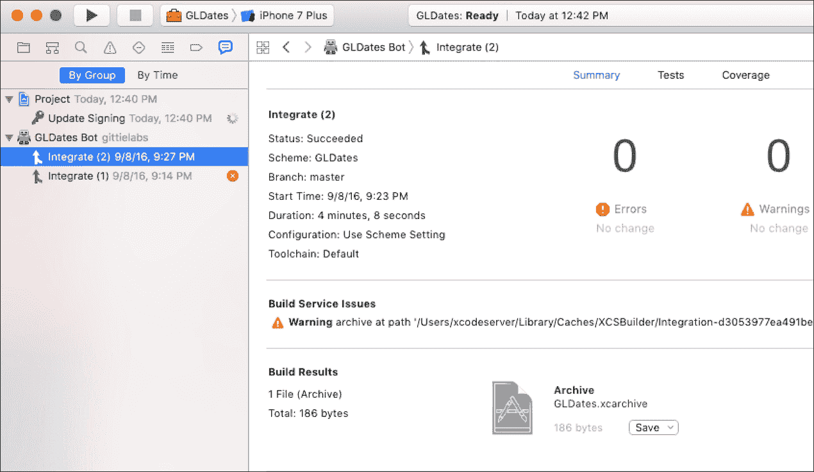
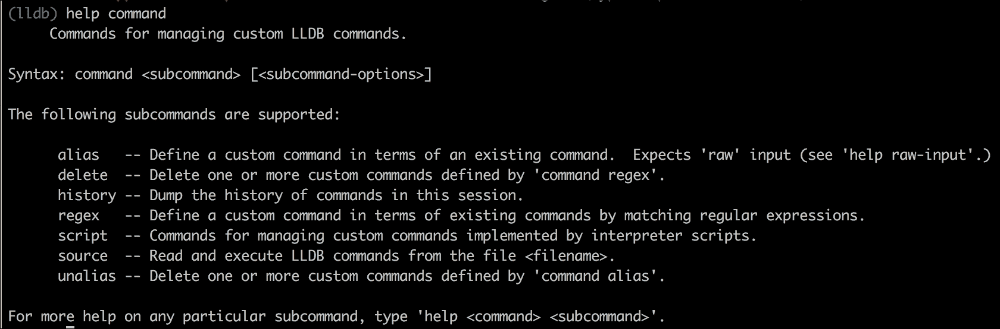
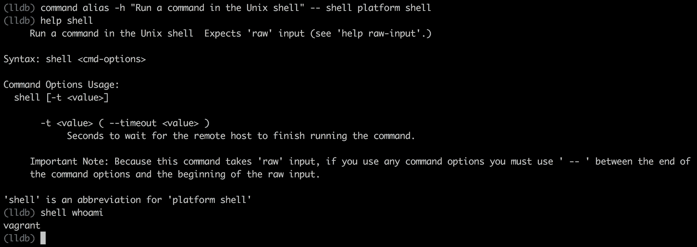

# 第九章：使用 Xcode 服务器和 LLDB 调试改进您的代码

您可以通过学习如何测试代码来提高代码质量的最大技能之一。使用 `XCTest` 测试框架将单元测试添加到您的代码中，将帮助您提高代码质量，并提供了记录代码工作方式的额外好处。当您从个人开发者项目过渡到多成员团队时，维护独立编写的测试变得更加困难。将自动化测试添加到服务器上的持续集成管道中，可以帮助解决这些问题，就像源代码库帮助管理大型项目中的代码一样。

在本章的第一部分，我们将介绍 Xcode 服务器作为持续集成服务器的能力，以及如何将自动化测试包含进来以改进您的测试工作流程。在第二部分，我们将描述如何使用 LLDB 在 Linux 上调试您的代码。

# 使用 Xcode 服务器进行持续集成概述

使用基于服务器的测试具有几个好处，这些好处可能足以证明您团队在时间投资上的合理性。如果您对是否走这条路适合您的团队持怀疑态度，请确保在评估时考虑以下因素：

1.  将构建和单元测试移至服务器可以释放您的本地机器继续工作在功能开发和调试上，同时您的构建和测试套件在远程运行。

1.  构建触发器可以在代码提交时运行测试，并在测试失败导致意外变化时通知您的团队。

1.  服务器上的测试是一致的，每次都以相同的方式运行；这意味着个人开发环境和项目调整不会影响测试运行。

1.  您可以安排完整的测试套件在您方便的时候运行，以及短运行测试在每次代码提交时执行，例如。

1.  您可以让您的测试在多个开发环境和硬件上执行。例如，您可以使用服务器环境轻松地在多个 iPad 模型和操作系统版本以及几部 iPhone 上运行测试。这将是手动执行耗时的工作。

持续集成工作流程是一个从在开发机器上本地开发开始，然后将您的代码提交到仓库的过程。接下来，您将项目迁移到 Xcode 服务器进行处理。为了使 Xcode 服务器能够处理您的代码，您必须以 *bots* 的形式提供一些指令。在您的开发机器上，您创建带有在 Xcode 服务器上运行的规则 *bots*。*bot* 的执行称为 *integration*，可以手动运行或根据计划运行。一旦 *integration* 完成，活动将报告回您的开发 Mac。

## 机器人功能

没有使用*机器人*，您无法利用 Xcode 服务器做任何有用的事情。*机器人*构建您的代码并运行您的测试，使用提供的 Xcode 项目方案。一个精心制作的*机器人*可以控制其运行的时间和如何与您和您的团队沟通其活动。例如，您可以让*机器人*在发生新的提交时运行，并通过电子邮件将*集成*状态（例如，成功或失败）发送给您和/或您的开发团队。您还可以添加预集成和后集成触发器，这些触发器可以执行脚本以与 Web 服务通信或基于初始集成输出运行额外的性能测试。

## 监控和管理机器人

一旦您创建了您的*机器人*，您就可以在 Xcode Server 中管理和监控它们。Xcode 服务器可以被配置为将*机器人*的状态推送到您的开发 Mac，提供一个 web 钩子以在浏览器或第三方应用程序（例如，Slack/HipChat）中查看活动，或者发送电子邮件报告。在您的开发 Mac 上，您可以使用 Xcode 中的报告导航器查看非常详细的报告。

# 配置 Xcode 服务器

要使用 Xcode 服务器，您必须从 Mac 的 App Store 下载并安装 macOS Server（以前称为 OS X Server）。

### 注意

安装过程简单，您可以在[`developer.apple.com/library/prerelease/content/documentation/IDEs/Conceptual/xcode_guide-continuous_integration/adopt_continuous_integration.html - //apple_ref/doc/uid/TP40013292-CH3-SW1`](https://developer.apple.com/library/prerelease/content/documentation/IDEs/Conceptual/xcode_guide-continuous_integration/adopt_continuous_integration.html#//apple_ref/doc/uid/TP40013292-CH3-SW1)找到详细的说明。

## 为 Xcode 服务器添加仓库

Xcode Server 需要一个代码仓库来执行工作，并且与 Git 或 Subversion 兼容。你创建的任何*机器人*都需要访问仓库。机器人会尝试通过 SSH 或 HTTPS 连接到仓库。苹果公司对您的仓库设置选项做了很好的描述。

### 注意

您可以参考他们设置指南的以下部分，以获取如何配置您的仓库以供 Xcode Server 和您的*机器人*访问的逐步说明：[`developer.apple.com/library/prerelease/content/documentation/IDEs/Conceptual/xcode_guide-continuous_integration/PublishYourCodetoaSourceRepository.html - //apple_ref/doc/uid/TP40013292-CH8-SW1`](https://developer.apple.com/library/prerelease/content/documentation/IDEs/Conceptual/xcode_guide-continuous_integration/PublishYourCodetoaSourceRepository.html#//apple_ref/doc/uid/TP40013292-CH8-SW1)。

## 配置机器人

“机器人”是由 Xcode Server 运行以从源代码库构建和测试代码的过程。每次你运行你的“机器人”实例时，你都在执行所谓的“集成”。你创建一个“机器人”，并将一个关联的方案添加到“机器人”中，该方案引用你的开发机器。创建“机器人”向导会引导你选择要使用的方案、设置运行频率以及提供在集成前后运行的任何 shell 脚本。

### 注意

你可以在[如何设置机器人](https://developer.apple.com/library/tvos/documentation/IDEs/Conceptual/xcode_guide-continuous_integration/ConfigureBots.html - //apple_ref/doc/uid/TP40013292-CH9-SW1)中了解更多信息。

去年，Xcode Server 引入了一个新功能，允许我们添加自定义环境变量，我们的“机器人”可以访问。今年 Xcode Server 允许我们添加在每次“集成”前后运行的预和后脚本。此功能可能允许你在“机器人”构建和执行测试之前，预先加载外部文件或数据以进行单元测试。另一个例子可能是后“集成”脚本与 Rest API 通信，以发送成功或失败状态。

# 管理和监控你的集成运行

你可以在 Xcode 的“报告导航器”中访问每个“机器人”的详细报告（**视图** | **导航器** | **显示报告导航器**）。此视图还允许你创建额外的“机器人”或编辑现有的“机器人”。选择侧边栏中列出的任何“机器人”都会给你一个集成结果的摘要报告。



报告导航器

# 使用 LLDB 进行调试

*LLDB*是驱动 Xcode 的调试器。在 Xcode 的调试控制台中，你可以找到一个控制台窗口，它为你提供了访问*LLDB*提示符的权限。在 Linux 或从命令行中，你可以从 Swift *REPL*访问*LLDB*。让我们探索如何使用*LLDB*通过一些你可能已经知道或不知道的命令来调试我们的程序。

### 注意

你可以在 LLDB 调试指南中了解更多关于使用 LLDB 进行调试的信息：[LLDB 调试指南](https://developer.apple.com/library/prerelease/content/documentation/General/Conceptual/lldb-guide/chapters/Introduction.html - //apple_ref/doc/uid/TP40016717-CH1-DontLinkElementID_42).

## LLDB 命令语法

与*LLDB*交互就像在提示符中输入一个命令一样简单。命令结构包含零个或多个子命令，后跟零个或多个选项或参数。

```swift
<command> [<subcommand>...] [--<option> [<option-value>]]... [argument]...

```

子命令和参数是空格分隔的标记；而选项也是空格分隔的，但使用双横线（有时是单横线）作为前缀。一个示例 *LLDB* 命令是设置一个函数的断点。在以下示例中，我们将为`speakToMe()`函数设置一个`breakpoint`：

```swift
(lldb) breakpoint set -n speakToMe

```

你可以通过在*LLDB*提示符下输入`help`来始终获得帮助。不带参数输入`help`将列出所有可用命令及其简短描述：

```swift
(lldb) help

```

你可以通过输入`help`加上命令名称或命令名称和子命令名称来获取特定命令的帮助，以获得更专业化的结果。

```swift
 (lldb) help breakpoint 
(lldb) help breakpoint set

```

# 管理断点

断点是中断正在运行的程序以在特定点进行检查的主要方式。我们可以通过*LLDB*创建、修改、删除或列出断点。

## 创建断点

我们使用`breakpoint set`命令来创建断点：

```swift
4> func sayHello(){ 
  5\.     print("Hi") 
  6\. } 
  7> sayHello() 
Hi 
  8> :breakpoint set --name sayHello 
Breakpoint 1: where = $__lldb_expr5`__lldb_expr_4.sayHello () -> () + 4 at repl.swift:5, address = 0x00000001005c6064 

```

## 列出断点

我们使用`breakpoint list`命令来列出程序中断点的名称和位置：

```swift
(lldb) breakpoint list 
Current breakpoints: 
1: name = 'sayHello', locations = 1, resolved = 1, hit count = 1 
  1.1: where = $__lldb_expr5`__lldb_expr_4.sayHello () -> () + 4 at repl.swift:5, address = 0x00000001005c6064, resolved, hit count = 1 

```

## 修改断点

你可以使用断点添加激活条件。使用`breakpoint modify`命令，你可以使用以下任何选项来更改目标断点的行为。

```swift
-D ( --dummy-breakpoints ) : Sets Dummy breakpoints 

-T <thread-name> ( --thread-name <thread-name> ) The breakpoint stops only for the thread whose thread name matches this argument. 

-c <expr> ( --condition <expr> ) The breakpoint stops only if this condition expression evaluates to true. 

-d ( --disable ) Disable the breakpoint. 

-e ( --enable )Enable the breakpoint. 

-i <count> ( --ignore-count <count> ) Set the number of times this breakpoint is skipped before stopping. 

-o <boolean> ( --one-shot <boolean> ) The breakpoint is deleted the first time it stop causes a stop. 

-q <queue-name> ( --queue-name <queue-name> ) The breakpoint stops only for threads in the queue whose name is given by this argument. 

-t <thread-id> ( --thread-id <thread-id> ) The breakpoint stops only for the thread whose TID matches this argument. 

-x <thread-index> ( --thread-index <thread-index> ) The breakpoint stops only for the thread whose index matches this argument. 

```

## 启用和禁用断点

你可以使用断点 ID 或位置来启用和禁用断点。你将 ID 传递给`enable`或`disable`子命令：

```swift
(lldb) breakpoint enable 1.1 
1 breakpoint enabled. 

(lldb) breakpoint disable 1.1 
1 breakpoint disabled. 

```

## 删除断点

当你不再需要你的断点时，你可以简单地使用带有断点 ID 或位置的删除子命令来移除它：

```swift
(lldb) breakpoint delete 1.1 

```

## 命令别名

命令别名允许你为常用命令创建更短的语法。你还可以提供帮助文本来伴随你的别名。你可以通过输入`help command`来查看如何管理命令别名的更多详细信息。



在以下示例中，我们创建一个命令别名来执行我们传递给别名的命令，使用 Unix shell：



# 摘要

在本章中，我们介绍了使用 Xcode Server 的持续集成工作流程的基本知识。你学习了什么是机器人以及它们是如何在 Xcode Server 上构建和测试你的代码的。随着 Swift 在 Linux 上的加入，我们需要探索 Xcode 之外的其他测试代码的选项。LLDB 功能非常强大，甚至为你的调试会话提供了定制选项。在我们下一章和最后一章中，我们将讨论在 Linux 服务器上编写 Swift。
