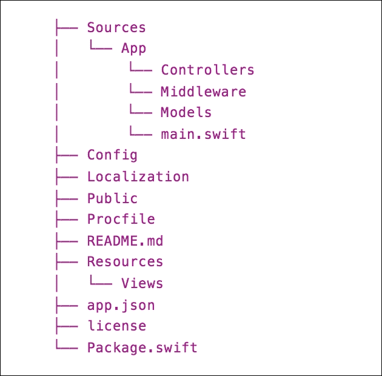
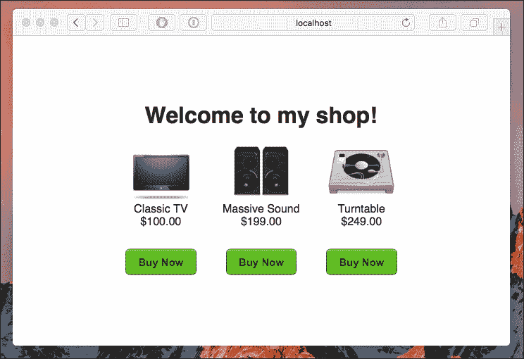
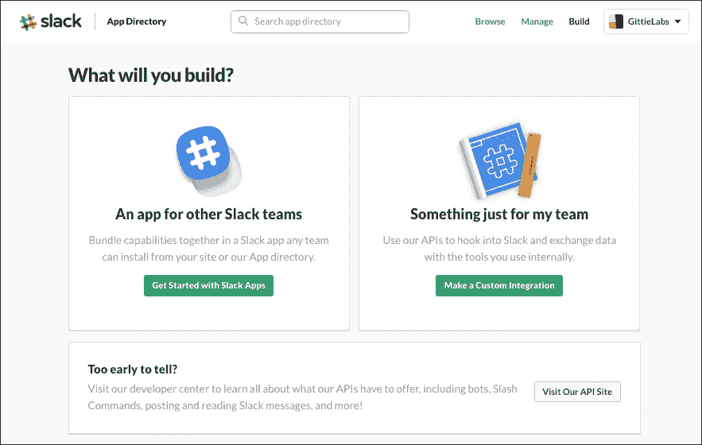
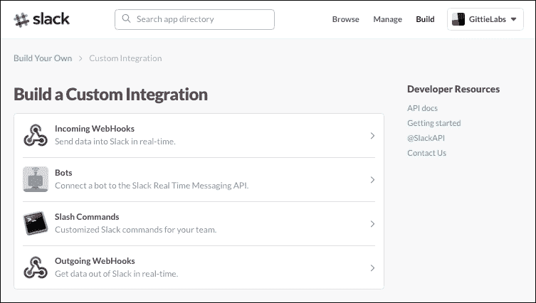
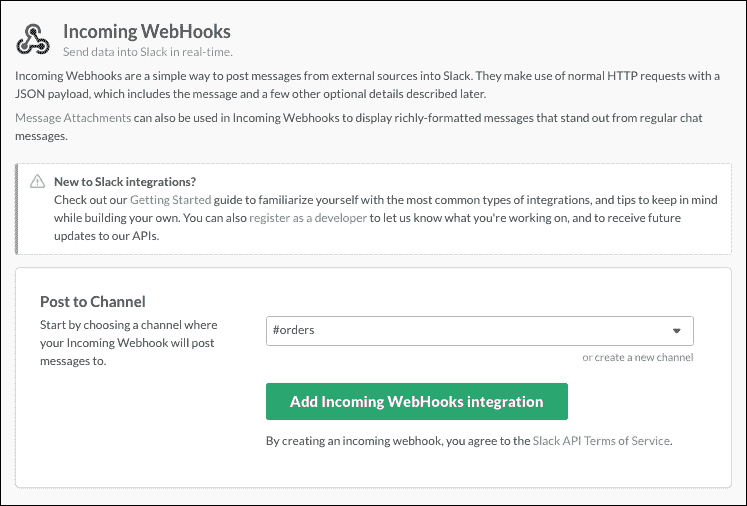
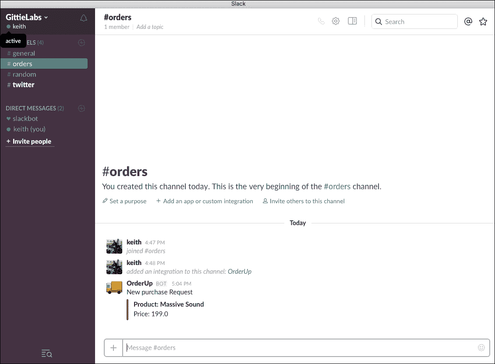

# 第十章. 在服务器上探索 Swift

除非您正在制作一个非常基础的应用程序，否则您很可能需要某种形式的后端服务器来使您的应用程序真正有用。Swift 在 Linux 上运行是一个大事件，尤其是考虑到 Linux 在托管和运行服务器方面的普及。Swift 3 为开发者打开了使用与他们在 iOS、macOS、tvOS 和 watchOS 上创建应用程序相同的 Swift 创建服务器端应用程序的可能性。在本章结束时，您将拥有一个完全使用 Swift 编写的服务器端应用程序，它可以在 Linux 服务器上无缝运行。

# IBM Swift 包目录

在 第二章 中，我们介绍了在 Linux 上安装 Swift 工具链和配置环境的步骤。我们用 Swift 编写了第一个程序，并利用 Swift 包管理器来管理我们的依赖项。在完成基础知识后，我想提及 IBM 的 Swift 包目录。

IBM Swift 包目录是一个托管 Swift 库和模块链接的网站，您可以使用 Swift 包管理器使用这些库和模块。IBM 希望它成为一个社区资源，让开发者能够找到并分享他们项目的代码。您可以在以下链接中找到该网站：[`developer.ibm.com/swift/the-ibm-swift-package-catalog`](https://developer.ibm.com/swift/the-ibm-swift-package-catalog)。您绝对应该保留这个链接，因为它将是一个您经常使用的网站。您可以根据排名、受欢迎程度或关键词探索项目。

# 介绍我们的服务器项目

让我们以一场盛宴结束！对于最后一章，我们将创建一个小项目来测试使用 Swift 开发服务器应用程序。我们将使用 IBM Swift 包目录来查找网络服务器框架。我非常喜欢使用 Slack 进行团队沟通。如果您还没有尝试过，您应该考虑评估它是否可以成为您团队的好工具。Slack 的一个强大功能是您有一系列集成选项可以自定义团队体验。Slack 已经向开发者开放了许多 API，以便进行定制和集成。Slack 甚至为用户提供了一个应用商店，让他们可以添加第三方应用程序，以便团队共同使用。唯一的缺点是，您的第三方应用程序或集成必须托管在外部服务器上。我们将创建一个 Slack 集成，您稍后可以将其修改成您自己的完整 Slack 应用程序。我们的 Slack 集成将完全使用 Swift 编写，并且可以托管在云中的 Linux 虚拟机上，例如 Heroku、Digital Ocean 或亚马逊网络服务。

### 注意

您可以从 [`www.packtpub.com/support`](http://www.packtpub.com/support) 下载此项目的代码。

## 项目描述和依赖项

我们的项目需要一个能够正常工作的网络服务器框架。我们可以从头开始编写一个，或者查看可用的第三方框架。使用 IBM Swift 包目录，我找到了几个高度评价且正在积极开发且深受开发者喜爱的网络应用框架。IBM 的 Kitura、Perfect by PerfectlySoft 和 Vapor by Vapor 都是可行的候选框架。如果你曾经接触过 Node.js 和 Express，或者 Ruby on Rails，那么这些项目对你来说都会感到熟悉。虽然这些框架中的任何一个都可以用于我们的项目，但我选择了 Vapor 项目作为我们的应用程序，因为它在我编写这一章的时候在“基本”类别中排名首位。

根据 Vapor 的说法，他们的项目是最常用的 Swift 编写的网络框架。你可以了解更多关于 Vapor 的信息，包括它支持的 Swift 版本和文档链接，请访问[`swiftpkgs.ng.bluemix.net/package/vapor/vapor`](https://swiftpkgs.ng.bluemix.net/package/vapor/vapor)。

现在我们已经介绍了我们将要使用的库和框架，让我给你描述一下我们将一起构建的服务器应用程序。Slack 为开发者提供了创建自定义集成或制作可供任何团队使用的 Slack 应用程序的选项。我们将为单个团队创建一个自定义集成。然而，你可以轻松地将我们的定制转换为任何团队都可以发现的全功能应用程序。

我们将构建一个用于销售小工具的店面网络应用程序。当用户从我们这里购买小工具时，我们将处理订单并将订单发送到我们的 Slack 订单跟踪频道。为了保持这个应用程序的简单性，我们将采取一些捷径。

## 设置我们的环境和项目

由于你在第二章中学习了如何安装 Swift，我们将跳过这一步，直接进入安装 Vapor 框架。我们将添加 Vapor 的命令行工具包，以便访问快捷命令和常见任务的辅助功能。

### 注意

你可以在[`vapor.github.io/documentation/`](https://vapor.github.io/documentation/)找到详细的文档链接和使用 Vapor 的示例。

这就是如何做的：

要安装工具包，请在终端中运行以下命令：

```swift
curl -sL toolbox.vapor.sh | bash

```

你可以通过运行以下命令来验证命令是否成功：

```swift
vapor -help

```

接下来，让我们创建一个新的 Vapor 项目，并将其命名为`storefront`：

```swift
vapor new storefront

```

我们新创建的项目将具有以下文件结构：



文件结构应该对你来说很熟悉，因为它遵循 Swift Package Manager 所需的结构。在幕后，vapor 使用`swift package init--type executable`创建一个新的项目。Vapor 脚本还将在`Package.swift`中将 vapor 框架作为依赖项添加。我们的`main.swift`是我们的入口点，因为我们创建了一个可执行程序。

我打算在我的 Mac 上开发我的代码，然后将其部署到云中的 Linux 虚拟机。对我来说，好处是，我可以使用 Xcode 及其调试工具进行本地开发。实际上，Vapor 框架通过提供工具包中的命令来生成用于开发的 Xcode 项目，支持这一概念。让我们创建一个可以用于我们*店面*应用开发的 Xcode 项目：

```swift
vapor xcode 

```

当 Vapor 创建一个配套的 Xcode 项目时，它首先检查你是否缺少在`Package.swift`文件中指定的任何依赖项。在创建 Xcode 项目之前，Vapor 会为你下载任何缺少的依赖项。此外，Vapor 将创建一个用于在 Xcode 中运行你的应用程序的方案。最后，Vapor 将显示 Xcode 项目期望链接的哪个工具链：

```swift
$vapor xcode 
No Packages folder, fetch may take a while... 
Fetching Dependencies [Done] 
Generating Xcode Project [Done] 
Select the `App` scheme to run. 
Make sure Xcode > Toolchains > 3.0-GM-CANDIDATE is selected. 
Open Xcode project? 
y/n>nz 

```

每次你为项目创建新的依赖项时，你必须重新构建项目，以便 Swift Package Manager 可以在尝试编译你的代码之前下载你的新依赖项：

```swift
vapor clean or vapor build --clean 

```

让我们快速查看`Package.swift`文件，看看 Vapor 为我们创建了什么。我们可以使用更适合我们项目的名称来配置应用程序的名称。当前的默认名称是`VaporApp`，但我们可以将其更改为`Storefront`。你也应该注意到，vapor 框架已作为依赖项为我们添加。

```swift
import PackageDescription 

let package = Package( 
    name: "VaporApp", 
    dependencies: [ 
        .Package(url: "https://github.com/vapor/vapor.git", majorVersion: 0, minor: 18) 
], 
    exclude: [ 
        "Config", 
        "Database", 
        "Localization", 
        "Public", 
        "Resources", 
        "Tests", 
    ] 
) 

```

当你使用 Vapor CLI 创建新项目时，Vapor 会在项目中添加带有文档的示例代码。打开`main.swift`并浏览包含的路由和注释。删除此文件中的所有内容，我们将从头开始构建我们的应用程序。

### Vapor 框架

在 Vapor 术语中，Droplet 是一个服务容器，充当 Vapor 服务提供的网关。使用 Droplet 注册路由并添加中间件以启动服务器。为了开始，我们需要导入 Vapor 并创建一个 Droplet 实例。

```swift
import Vapor 

let drop = Droplet() 

```

我们还可以通过属性来定制我们的 Droplet 实例的行为。你可以在 Vapor 的文档中了解更多关于选项的信息。

### 路由

现在我们已经有了 Droplet 实例，我们需要讨论路由。路由是每个 Web 框架的基本功能。当接收到一个传入请求时，我们需要有一种适当过滤和处理每个请求的方法。Vapor 为你提供了多种解决路由问题的选项。我们将为我们的应用程序创建两个路由：一个用于服务我们的商店页面，另一个用于当用户在我们的页面上购买商品时响应*post*请求。

在 Vapor 中，一个基本的路由由一个方法、路径和闭包组成。我们的两个路由属于这一类别。Vapor 路由支持标准的 RESTful HTTP 方法（get、post、put、patch、delete 和 options）。我们通过在 Droplet 实例上调用相应的方法来注册路由，传递我们的路由路径，并返回我们定义的闭包。

```swift
drop.get("/") { request in 
    return try drop.view.make("shop.html") 
} 

drop.post("purchase") { request in 

// more stuff happening here but omitted 

var response = try Response(status: .ok, json: json) 
    return response 
} 

```

我们的第一条路由处理我们网站根目录的所有*get*请求。当请求此路由时，我们返回`shop.html`视图。我们的第二条路由处理`/purchase`路由的*post*请求。一旦我们完成工作，我们就向请求者返回一个带有状态和 JSON 有效负载的响应。

Vapor 还支持嵌套路由和参数。创建一个嵌套路由就像在注册路由时将 URL 中的正斜杠替换为逗号一样简单。

```swift
// Nested route 
drop.get("products", "vehicles", "trucks") { request in 
    return "You requested /products/vehicles/trucks" 
} 

```

Vapor 通过使参数类型安全来处理参数。许多 Web 框架默认使用字符串作为路由参数和类型，这可能导致错误。使用 Swift 的闭包允许更安全地访问路由参数。在以下示例中，我们定义了一个接受*Int*参数的路由。我们的路由匹配*artboard/:id*，其中我们的*：id*参数必须是一个整数值。

```swift
// Type Safe parameters 
drop.get("artboard", Int.self) { request, productId in 
    return "You requested Artboard #\(productId)" 
} 

```

我们也可以不使用路由参数来编写这个，然后通过请求对象访问我们的参数。

```swift
drop.get("artboard", ":id") { request in 
    guard let productId = request.parameters["id"]?.int else { 
        throw Abort.badRequest 
    } 

    return "You requested Artboard #\(productId)" 
} 

```

### 创建视图

当你想从你的应用程序发送 HTML 时，你创建视图。你可以从一个 HTML 文档创建视图，或者使用 Mustache 等渲染器构建你的视图。默认情况下，视图存储在*Resources/Views*目录中。回到为我们根目录注册的第一个路由，我们使用视图返回一个 HTML 文档（`shop.html`）。你通过在 Droplet 实例上调用`view.make`方法来创建视图的实例。

```swift
drop.get("/") { request in 
    return try drop.view.make("shop.html") 
} 

```

更复杂的文档，如 mustache 模板，需要更多信息来处理和创建视图。这些附加信息作为第二个参数传递给*view.make*方法。

```swift
drop.get("shop_template") { request in 
    return try drop.view.make("shop.template", [ 
        "countdown": "2 days left", 
        "shopper_count": "1,000" 
        ]) 
} 

```

### 公共资源

对于大部分情况，我们希望我们的服务器代码和文件免受窥探的眼睛和网页爬虫的侵害。Vapor 为我们处理这个问题。当我们需要提供可以从我们的视图中访问的资源时，我们使用在应用程序根目录下创建的`Public`文件夹。我们将我们的图片、脚本和样式存储在`Public`文件夹的嵌套目录中。

### 定义我们的商店视图

当我们在应用程序上提供根级文档时，我们返回一个`shop.html`视图。我们的简单页面显示一条欢迎信息和三个产品的详细信息。



当用户点击“立即购买”按钮时，我们执行一个 jQuery Ajax post 命令与我们的服务器通信。我们将我们想要购买的产品 ID 发送到我们的`"/purchase"`路由。

在服务器上，当我们收到与这个路由匹配的请求时，我们会提取产品 ID 并在我们的本地商店中搜索匹配的产品。当然，在一个生产应用中，我们会使用数据库来存储我们的产品，甚至填充我们的商店列表。在无法在我们的请求对象中找到有效的产品 ID 或无法为提供的产品 ID 找到匹配的产品的情况下，我们会抛出一个错误，并将其发送回客户端。

最后，我们创建一个包含我们产品的一些详细信息的 JSON 负载，并带有成功的状态码将其返回给客户端。

```swift
drop.post("purchase") { request in 
    drop.log.info("purchase request made") 
    guard let product_id = request.data["product_id"]?.int else { 
        throw Abort.badRequest 
    } 

    guard let product = products.filter({ (prod) -> Bool in 
        return prod.id == product_id 
    }).first else{ 
        throw Abort.badRequest 
    } 

    let json = try JSON(node: [ 
        "Product" : "\(product.name)", 
        "price" : "\(product.price)", 
        ]) 

// more work happening and omitted  

    var response = try Response(status: .ok, json: json) 

    return response 
} 

```

当我们的客户端收到 post 响应时，我们会显示一个感谢用户购买的提示对话框。我们还在控制台中显示返回的 JSON 数据。

### Slack 集成

现在我们已经了解了我们网络应用的基础，让我们通过集成 Slack 来让它变得更有趣。使用 Slack 的 API，我们可以扩展 Slack，使我们的工作流程更加完善。在我们的案例中，我们希望通知我们的运营团队新的订单，以便他们可以立即开始处理。我们将利用 incoming webhooks 从我们的 Swift 服务器向 Slack 发送消息。虽然这个 webhook 只会用于我们的团队，但你可以在[`api.slack.com/`](https://api.slack.com/)的文档中阅读，并轻松地将我们的自定义集成转换为任何团队都可以将其纳入其工作流程的 Slack 应用。

### 创建自定义集成

由于我们的自定义集成只与单个 Slack 团队一起工作，如果你还没有，你需要创建一个 Slack 账户和团队。一旦你这样做，你可以导航到 Slack 应用目录的构建部分，位于：

1.  点击“**创建自定义集成**”按钮。

1.  接下来选择“**Incoming WebHooks**”链接。

选择一个频道来发布你的消息或者创建一个新的频道。我选择将我的消息发送到我的订单频道。选择好你的频道后，点击“**添加 incoming WebHooks 集成**”按钮。



在这个视图中，你可以看到设置说明以及你可以为你的用例自定义的字段。你可以为这个集成提供一个可选的描述性标签以及用户名。默认名称是 `incoming-webhook`，但我将其改为了 `OrderUp`。我还添加了一个表情符号，作为我添加到这个频道的消息的图标。一旦你预览了你的设置，你只需点击“**保存设置**”按钮，你的更改就会生效。

### 更新我们的服务器以向 Slack 发布

在我们关闭这个视图之前，我们需要将 Webhook URL 复制到我们的外部服务中。你可以点击 **复制 URL** 按钮，它将被添加到你的剪贴板。让我们回到 Swift 并打开 `main.swift`。更新你的购买路由以创建 Slack 发送 POST 请求到 Slack 服务器的 JSON 有效负载：

```swift

drop.post("purchase") { request in 
 // omitted code above 

    let slack_payload = try JSON(node: [ "attachments": 
        try JSON(node: [ 
            try JSON(node: [ 
                "fallback": "New purchase Request", 
                "pretext": "New purchase Request", 
                "color": "#D00000", 
                "fields": try JSON(node: [ 
                    try JSON(node: [ 
                        "title" : "Product: \(product.name)", 
                        "value" : "Price: \(product.price)", 
                        "short" : "false" 
                        ]) 
                    ]) 
                ]) 
            ]) 
        ]) 

     _ = try drop.client.post("https://hooks.slack.com/services/<your hook id>", headers: [:], query: [:], body: slack_payload) 

    var response = try Response(status: .ok, json: json) 

    return response 
} 

```

我们格式化的消息有效负载发送了一条通用消息，该消息将在你的桌面和移动端 Slack 通知中显示（`"New purchase Request"`）。我们还使用附件语法提供了有关产品订单的详细信息。我们传递了产品名称和价格。

现在，当你在这个网站上购买时，你还会收到一条实时消息发送到 Slack 的订单频道。



# 摘要

在本章中，我们探讨了服务器上的 Swift。我们开发了一个完全用 Swift 运行的 Web 应用程序。我们的应用程序还与 Slack 通信以发布消息。我们使用 Vapor Web 框架创建了一个 Swift Web 服务器，并学习了如何从 Swift 调用 Slack Webhooks。虽然我们的例子相当简单，但很容易看出我们可以如何利用 Swift 的力量将其扩展到更大、更复杂的应用程序。

这就带我们来到了本书的结尾。我们涵盖了大量的内容，并学习了 Swift 3 的新特性。我们讨论了苹果对 Swift 进化的动机和目标。我向你展示了如何找到关于该语言的文档以及如何参与 Swift 的未来方向。我们探讨了 Linux 上的 Swift 以及这为服务器端 Swift 应用程序带来的可能性。Swift 3 添加了新的语言特性，这些特性改进了你将在日常编码项目中使用的许多库。

我希望这本书能成为你在深入开发 Swift 3 时的参考。虽然我们已经探讨了该语言的大部分特性，但全面覆盖语言的所有变化并不现实。虽然这本书为理解 Swift 3 的变化提供了良好的基础，但你仍需要在代码中应用你所学的知识。此外，你应该参考苹果的文档和 Swift 社区，以保持对语言最新发展的了解。最优秀的开发者永远不会依赖他们当前的知识。他们积极寻求学习更多。如果你想掌握 Swift 3，你必须利用你所能利用的所有资源来构建我们共同创建的基础。我知道你可以做到，并祝愿你在旅程中一切顺利。
