# 1

# 为您的消息应用构建 UI

在本章的第一部分，我们将开始构建一个名为 WhatsPackt 的消息应用（指的是您可能已经了解的一个流行的消息应用）。在这个项目的这个阶段，我们必须做出一些重要的技术决策并创建构建它所需的结构。这是我们关注的重点，以及我们将在应用的用户界面上进行工作。

到本章结束时，您将获得从零开始创建消息应用的实际经验，组织并定义应用模块，决定您将使用哪个依赖注入框架，使用 Jetpack Navigation 在应用功能之间导航，以及使用 Jetpack Compose 构建用户界面的主要部分。

本章组织了以下主题：

+   定义应用结构和导航

+   构建主屏幕

+   构建聊天列表

+   构建消息列表

# 技术要求

Android Studio 是官方标准的 **集成开发环境**（**IDE**）用于开发 Android 应用。尽管如果您愿意，可以使用其他 IDE、编辑器和 Android 工具，但本书中的所有示例都将基于此 IDE。

因此，我们建议您使用安装了最新稳定版 Android Studio 的计算机。如果您还没有安装，可以在此处下载：[`developer.android.com/studio`](https://developer.android.com/studio)。按照安装步骤，您将能够安装 IDE 并设置至少一个安装了 Android SDK 的模拟器。

安装完成后，我们可以开始创建项目。Android Studio 将提供一系列模板以供选择。我们将选择 **Empty Activity** 选项，如图下截图所示：

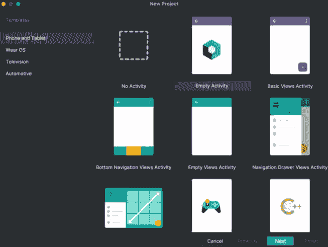

图 1.1：选择 Empty Activity 选项的 Android Studio 新项目模板

然后您将被要求选择项目名称和包名称：

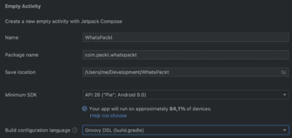

图 1.2：Android Studio – 添加新项目名称和包名称

之后，您就准备就绪了！Android Studio 将生成所需的主要文件夹和文件，以便您可以开始我们的项目。您的项目结构应如下所示：

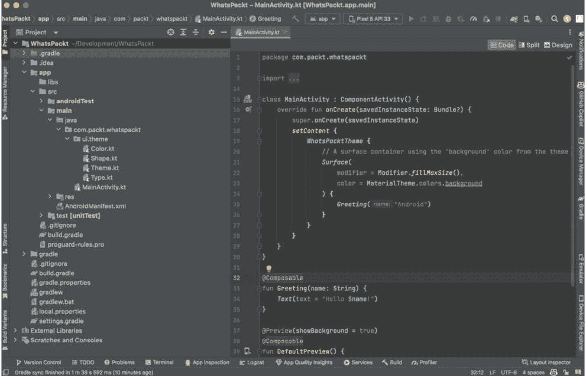

图 1.3：Android Studio – 项目模板结构

注意，本章的所有代码都可以在这个书的 GitHub 仓库中找到：[`github.com/PacktPublishing/Thriving-in-Android-Development-using-Kotlin/tree/main/Chapter-1/WhatsPackt`](https://github.com/PacktPublishing/Thriving-in-Android-Development-using-Kotlin/tree/main/Chapter-1/WhatsPackt)。

现在，我们已经准备好开始编码我们的新消息应用。为此，我们必须做出一些重要的技术决策：我们必须决定我们的项目将如何结构化，我们将如何在不同屏幕或功能之间导航，以及我们将如何设置和提供所需的组件（定义和组织每个组件之间的依赖关系）。

# 定义应用结构和导航

在设计应用结构之前，我们必须对它应包含的基本功能有一个基本的概念。在我们的案例中，我们希望有以下功能：

+   创建新对话或访问已存在的对话的主屏幕

+   包含所有对话的列表

+   单个对话的屏幕

由于这是一个即将投入生产的应用，我们必须在设计代码库时考虑到它应该易于扩展和维护。在这方面，我们应该使用模块化。

## 模块化

**模块化**是将应用程序的代码划分为松散耦合且自包含的部分的实践，每个部分都可以独立编译和测试。这种技术允许开发者将大型和复杂的应用程序分解成更易于维护的更小部分。

通过模块化 Android 应用程序，模块可以并行构建，这可以显著提高构建时间。此外，独立的模块可以单独测试，这使得识别和纠正错误变得更加容易。

虽然在 Android 开发中创建模块最常见的方法是通过 Gradle 依赖项利用 Android 库系统，但 Bazel 和 Buck 等替代构建系统也促进了模块化。Bazel 提供了一个强大的系统来声明模块和依赖项，其并行构建能力可以导致更快的构建时间。同样，Buck 也通过提供细粒度的构建规则和加速增量构建来支持模块化开发。

通过探索各种构建系统，如 Gradle、Bazel 和 Buck，开发者可以找到最适合其 Android 应用程序的模块化方法。每个构建系统都提供独特的功能来管理依赖项和组织代码，使开发者能够实现各种模式以实现模块化架构。

在组织模式中，最常见的是按层进行模块化和按功能模块进行模块化。

### 层次模块化

通常，根据开发者选择的架构，通过将组件分组到一系列层中来结构化应用。一个流行的架构是清洁架构，它将代码库分为数据、领域（或业务）和表示层。

采用这种方法，每个模块都专注于架构的特定层，例如表示层、领域层或数据层。这些模块通常彼此之间更加独立，并且可能根据它们所属的层具有不同的责任和技术。遵循此模式，我们的应用结构将如下所示：

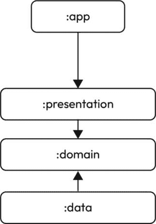

图 1.4：按层进行应用模块化

从这张图中，你可以看到为什么层模块化也被称为垂直模块化。

### 按功能模块化

当按功能（或使用横向模块化）对应用进行模块化时，应用被划分为专注于特定功能或相关任务的模块，例如身份验证或导航。这些横向模块可以共享公共组件和资源。我们可以在以下图中看到这种结构：

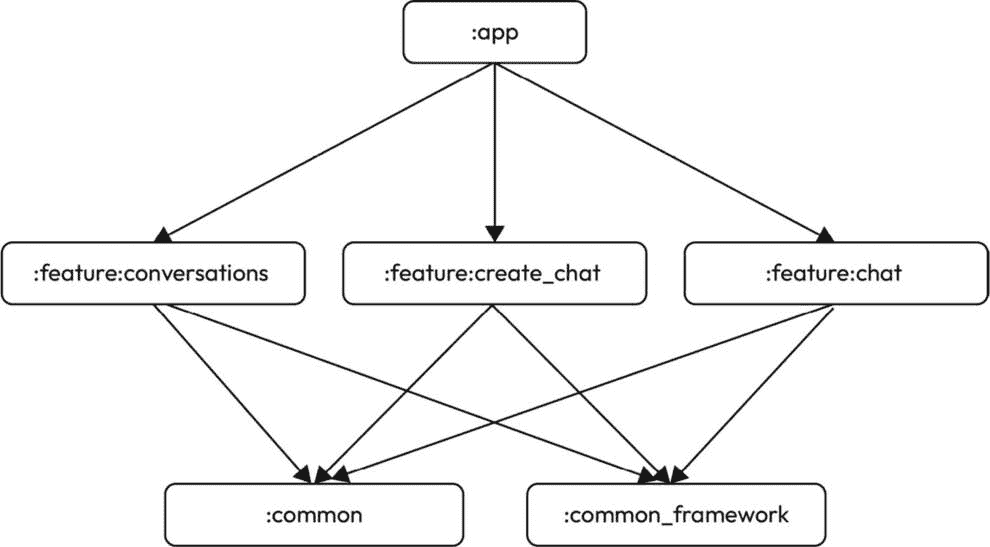

图 1.5：按功能进行应用模块化

在我们的案例中，我们将有一个主要的 `app` 模块，它将依赖于我们应用需要的每个功能模块（每个我们将要实现的功能都有一个）。然后，每个功能模块也将依赖于另外两个公共模块（在这个例子中，我们将它们分为 `common` 和 `common_framework`，第一个用于包含与框架无关的代码，第二个用于使用依赖于 Android 框架的代码）。

这种模式的主要优势之一是它可以随着公司的发展而扩展，如果它演变成基于功能的团队（每个团队都专注于单个或一组功能），那么它就可以实现。这将使每个团队负责一个功能模块，或一组功能模块，他们将对这些模块中的代码拥有所有权。这也允许团队在问题空间和功能方面更容易地实现自治。

### WhatsPackt 模块化

在我们的 WhatsPackt 示例中，我们将结合两种模块化方法：

+   我们将使用基于功能的模块化来构建我们的功能。

+   我们将使用基于层的模块化来构建公共模块。这将允许我们在功能模块之间共享公共代码。

我们模块的结构及其依赖关系如下所示：

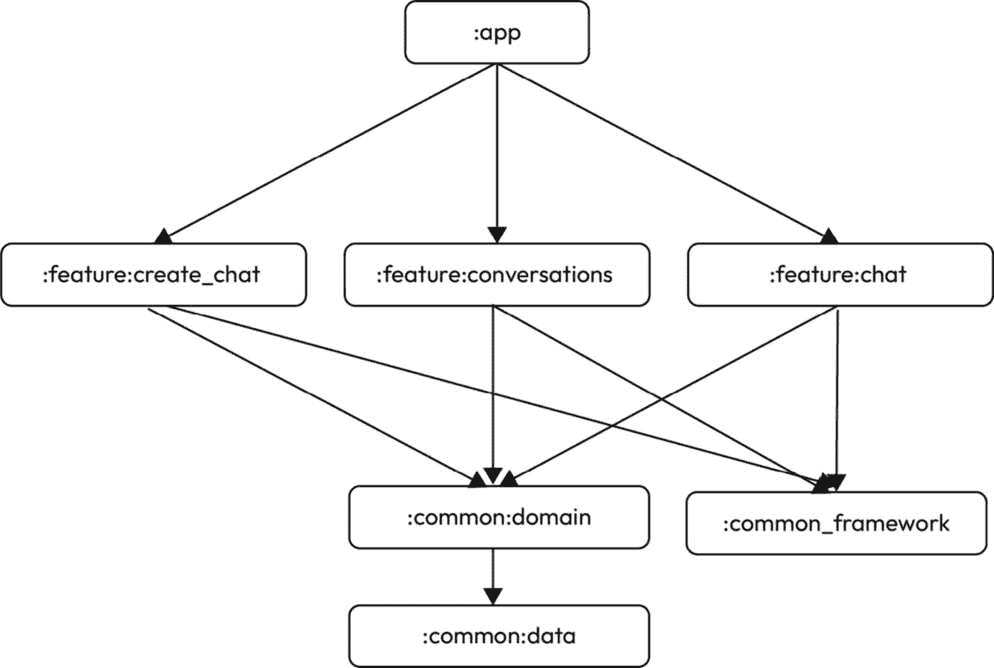

图 1.6：我们的应用模块结构和依赖关系

现在，我们将开始在 Android Studio 中创建这个结构。要创建一个模块，请按照以下步骤操作：

1.  选择**文件** | **新建...** | **新建模块**。

1.  在**创建新模块**对话框中，选择**Android** **库**模板。

1.  填写**模块名称**、**包名称**和**语言**字段，如图所示：

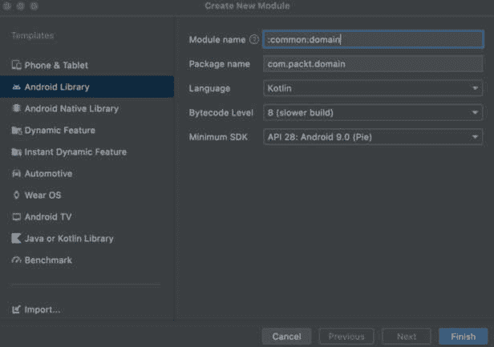

图 1.7：创建新模块对话框

1.  点击**完成**。

我们需要对所有我们想要构建的模块执行此相同的过程，除了 `:app` 模块，它应该在创建项目时已经创建。这将成为我们进入应用的主要入口点。因此，我们必须创建以下模块：

+   **:****通用：领域**

+   **:****通用：数据**

+   **:****通用：框架**

+   **:****功能：创建聊天**

+   **:****功能：会话**

+   **:****功能：聊天**

一旦我们完成这些，我们应该已经构建了以下项目结构：

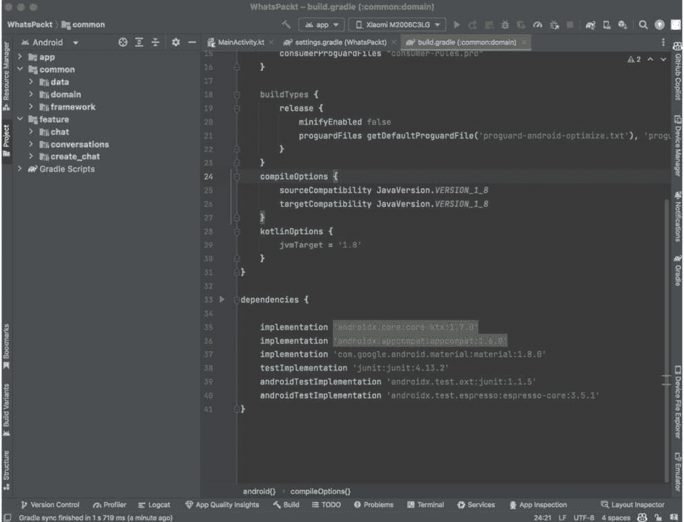

图 1.8：项目结构，包括所有模块

下一步是设置模块之间的依赖关系。我们将在每个模块的 `build.gradle` 文件中执行此操作。例如，在 `:app` 模块的 `build.gradle` 文件中，在 `dependencies` 部分包含以下代码：

```kt
dependencies {
    implementation project(':feature:chat')
    implementation project(':feature:conversations')
    implementation project(':feature:create_chat')
    // The rest of dependencies
}
```

现在我们已经准备好了应用模块，我们可以开始进行下一步：依赖注入。

## 依赖注入

**依赖注入**是一种在软件工程中用于解耦应用程序中对象并减少它们之间依赖的设计模式和技巧。在 Android 中，依赖注入涉及向另一个类提供一个类或组件的实例，而不是在类内部显式创建它。

通过在 Android 应用中实现依赖注入，你可以使应用代码更加模块化、可重用和可测试。依赖注入还有助于提高代码库的可维护性并减少应用程序架构的复杂性。

在 Android 开发中使用的最流行的依赖注入库如下：

+   **Dagger** ([`dagger.dev/`](https://dagger.dev/))：Dagger 是由 Google 开发的一个编译时依赖注入库，它使用注解和代码生成来创建一个依赖图，该图可用于向应用组件提供依赖。其主要优势是它在编译时构建这个依赖图，而其他库（如 Koin）则在运行时进行。对于大型应用，这可能会导致性能问题。

+   **Hilt** ([`dagger.dev/hilt/`](https://dagger.dev/hilt/))：Hilt 是一个基于 Dagger 构建的依赖注入库，它为 Android 应用提供了简化依赖注入的方法。它减少了 Dagger 所需的样板代码，并为 Android 特定组件（如活动和片段）提供了预定义的绑定。

+   **Koin** ([`insert-koin.io/`](https://insert-koin.io/))：Koin 是一个专注于简洁和易用的 Kotlin 轻量级依赖注入库。它使用 **领域特定语言**（**DSL**）来定义依赖并提供给应用组件，这使得设置和开始使用它变得更加容易。

最终，选择依赖注入库取决于你的具体需求和偏好，Dagger 和 Koin 都是值得考虑的选项，具体取决于你的需求。在这种情况下，我们将使用 Hilt，因为它是目前 Google 的推荐。

在我们的项目中设置 Hilt，请按照以下步骤操作：

1.  将 Hilt Gradle 插件添加到你的项目级别的 **build.gradle** 文件中（将 **[版本]** 替换为你可用的最新版本）：

    ```kt
    buildscript {
        repositories {
            google()
        }
        dependencies {
            classpath "com.google.dagger:hilt-android-
                gradle-plugin:[version]"
        }
    }
    ```

1.  在你的应用级别的 **build.gradle** 文件中应用 Hilt Gradle 插件并启用视图绑定：

    ```kt
    apply plugin: 'kotlin-kapt'
    apply plugin: 'dagger.hilt.android.plugin'
    android {
        ...
        buildFeatures {
            viewBinding true
        }
    }
    dependencies {
        implementation "com.google.dagger:hilt-
            android:[version]"
        kapt "com.google.dagger:hilt-android-
            compiler:[version]"
        ...
    }
    ```

1.  最后，在我们的 **:app** 模块中创建一个 **Application** 类。**Application** 类作为维护全局应用状态的基础类（这指的是在整个应用生命周期中需要维护的数据或设置）。虽然它不是默认创建的，但创建一个自定义的 **Application** 类对于初始化任务至关重要，例如设置依赖注入框架或初始化库。在这个特定实例中，为了让 Hilt 正常工作，你应该使用 **@HiltAndroidApp** 注解来标注你的 **Application** 类：

    ```kt
    @HiltAndroidApp
    class WhatsPacktApplication : Application() {
        // ...
    }
    ```

到此，我们已经准备就绪——一旦我们在这个项目中进一步推进，我们将继续定义模块和依赖项。

## 导航

下一步是决定我们处理应用中屏幕和功能之间导航的方法。需要注意的是，我们将使用 Jetpack Compose 来构建应用的用户界面，因此所选方法必须与之兼容。

在这种情况下，我们将使用 Navigation Compose，因为它提供了一种简单且易于使用的处理 Android 应用内导航的方法。以下是使用 Navigation Compose 的好处：

+   **声明式 UI**：Navigation Compose 遵循与 Jetpack Compose 相同的声明式方法，这使得理解和维护应用中的导航流程更加容易。

+   **类型安全**：使用 Navigation Compose，你可以以类型安全的方式定义你的导航图和操作。这有助于防止由错误的导航操作名称和参数引起的运行时崩溃。

+   **动画和过渡支持**：Navigation Compose 提供了内置的动画屏幕过渡支持，这使得创建平滑且视觉上吸引人的导航体验变得容易。

+   **深度链接**：Navigation Compose 支持深度链接，允许你创建可以直接导航到应用中特定屏幕或操作的 URL。这对于实现应用快捷方式、通知或共享内容等功能非常有用。

+   **与 Jetpack Compose 集成**：作为 Jetpack Compose 家族的一部分，Navigation Compose 与其他 Compose 库和组件无缝集成，允许你在整个应用中构建一致的 UI 和导航体验。

+   **模块化和可扩展性**：Navigation Compose 使您能够构建模块化的导航图，这使得扩展您的应用和管理复杂的导航流程变得更加容易。

总结来说，Navigation Compose 简化了导航管理，提高了我们应用的健壮性，并将帮助我们创建一个更一致、更易访问和更具视觉吸引力的用户体验。

要开始使用 Navigation Compose，我们必须做以下事情：

1.  首先，我们需要在我们的 Gradle 文件中包含所需的依赖项：

    ```kt
    dependencies {
        implementation "androidx.navigation:navigation-
        compose:2.5.3"
    }
    ```

注意

在撰写本书时，前一个代码版本是当时最新的稳定版本，但当你阅读本书时，可能已经有一个新版本了。

1.  接下来，在**app**模块中，创建一个名为**ui.navigation**的新包。然后，创建一个名为**WhatsPacktNavigation**的文件。

1.  现在，创建一个**NavHost**可组合项，并提供一个**NavController**实例。**NavHost**可组合项充当管理应用中不同可组合项之间导航的容器。它作为中央枢纽，在这里定义导航路由，并根据导航状态切换可组合项。您的应用程序中的每个屏幕或视图都对应于**NavHost**可以显示的可组合项。在这里，我们将首先创建**WhatsPacktNavigation**可组合项函数。这将负责持有**NavHost**：

    ```kt
    import androidx.compose.runtime.Composable
    import androidx.navigation.compose.NavHost
    import
    androidx.navigation.compose.rememberNavController
    @Composable
    fun WhatsPacktNavigation() {
        val navController = rememberNavController()
        NavHost(navController = navController,
        startDestination = "start_screen") {
            // Add composable destinations here
        }
    }
    ```

1.  一旦我们创建了第一个屏幕（我们将称之为**MainScreen**），我们将完成**NavHost**，如下所示：

    ```kt
        NavHost(navController = navController,
        startDestination = "start_screen") {
            composable("start_screen") {
            MainScreen(navController) }
        }
    ```

1.  我们还可以在路由中包含动态参数，如下所示：

    ```kt
    NavHost(
        navController = navController,
        startDestination = "start_screen"
    ) {
        composable("start_screen") {
            MainScreen(navController) }
        composable("chat/{chatId}") { backStackEntry ->
            val chatId =
                backStackEntry.arguments?.getString(
                    "chatId")
            ChatScreen(navController, chatId)
        }
    }
    ```

    在这里，我们有一个第二个可组合项，它定义了与`"chat/{chatId}"`路由相关联的另一个导航目的地。`{chatId}`部分是一个动态参数，可以在导航到该目的地时传递。

使用这两个配置——即带有和不带有参数的导航——应该可以满足我们的需求，但由于我们正在使用基于功能的模块化，我们可能会遇到必须从一个模块导航到另一个模块，而它们之间没有直接依赖关系的问题。在这种情况下，我们将使用深度链接。

`NavHost`，你需要添加一个带有你想要用于该目的地的 URI 模式的`deepLink`参数。这个模式应该包括一个方案、一个主机和一个可选的路径。在我们的例子中，如果我们有一个`ChatScreen`，它接受一个`chatId`参数，我们可以添加一个类似这样的深度链接`URI`：

```kt
NavHost(
    navController = navController,
    startDestination = "start_screen")
{
    composable("start_screen") { MainScreen(navController)
    }
    composable(
        route = "chat?id={id}",
        deepLinks = listOf(navDeepLink { uriPattern =
            "whatspackt://chat/{id}" })
    ) { backStackEntry ->
        ChatScreen(
            navController,
            backStackEntry.arguments?.getString("id"))
    }
}
```

为了使我们的`NavHost`更简洁，并将路由和 URI 的定义委托给每个屏幕，一个常见的做法是使用常量来定义路由。以下是一个示例：

```kt
@Composable
fun ChatScreen(
    ...
) {
    object {
        val uri = "whatspackt://chat/{id}"
        val name = "chat?id={id}"
    }
}
```

通过这样做，开发者可以轻松地以集中化的方式管理、更新和维护路由。

然后，在`NavHost`中，我们将使用这些常量来定义`uriPattern`：

```kt
composable(
    route = NavRoutes.Chat,
    arguments = listOf(
        navArgument(NavRoutes.ChatArgs.ChatId) {
            type = NavType.StringType
        }
    )
) { backStackEntry ->
    val chatId = backStackEntry.arguments?.getString(
        NavRoutes.ChatArgs.ChatId)
    ChatScreen(chatId = chatId, onBack = {
        navController.popBackStack() })
}
```

而不是将此信息添加到每个屏幕，更好的选择是创建一个类，我们将把所有的路由常量放在这个类中：

```kt
object NavRoutes {
    const val ConversationsList = "conversations_list"
    const val NewConversation = "create_conversation"
    const val Chat = "chat/{chatId}"
    object ChatArgs {
        const val ChatId = "chatId"
    }
}
```

将路由的定义放在同一个地方将有助于阅读和维护我们的代码，这样我们可以轻松地以集中化的方式管理、更新和维护路由，同时提高代码的可读性并减少由于硬编码或代码库中重复字符串引起的错误的可能性。

我们将把这个包含此类的文件放在我们的 `:common:framework` 模块中，因为我们需要从每个功能模块访问这些常量。另一个常见的做法是创建一个专门的 `:common:navigation` 模块，并在其中添加路由定义甚至 `NavHost` 定义。在我们的情况下，我们将使用最新的方法定义路由——即路由常量：

```kt
package com.packt.whatspackt.ui.navigation
import androidx.compose.runtime.Composable
import androidx.navigation.NavGraphBuilder
import androidx.navigation.NavHostController
import androidx.navigation.NavType
import androidx.navigation.compose.NavHost
import androidx.navigation.compose.composable
import com.packt.feature.chat.ui.ChatScreen
import androidx.navigation.navArgument
import com.packt.framework.navigation.NavRoutes
@Composable
fun MainNavigation(navController: NavHostController) {
    NavHost(
        navController,
        startDestination = NavRoutes.ConversationsList)
    {
        addConversationsList(navController)
        addNewConversation(navController)
        addChat(navController)
    }
}
```

在前面的代码中，我们完成了 `NavHost` 的定义。

在我们的应用中，我们希望导航到应用的三个不同部分（会话列表、创建新聊天和单个聊天屏幕）。可以通过在 `NavGraphBuilder` 上使用扩展函数将导航目标添加到 `NavHost`。这些扩展函数定义如下：

```kt
private fun NavGraphBuilder.addConversationsList(
    navController: NavHostController
) {
    composable(NavRoutes.ConversationsList) {
        ConversationsListScreen(
            onNewConversationClick = {
                navController.navigate(
                    NavRoutes.NewConversation)
            },
            onConversationClick = { chatId ->
                navController.navigate(
                NavRoutes.Chat.replace("{chatId}", chatId))
            }
        )
    }
}
private fun NavGraphBuilder.addNewConversation(
navController: NavHostController) {
    composable(NavRoutes.NewConversation) {
        CreateConversationScreen(onCreateConversation = {
            navController.navigate(NavRoutes.Chat)
        })
    }
}
private fun NavGraphBuilder.addChat(navController:
NavHostController) {
    composable(
        route = NavRoutes.Chat,
        arguments = listOf(navArgument(
        NavRoutes.ChatArgs.ChatId) {
            type = NavType.StringType
        })
    ) { backStackEntry ->
        val chatId = backStackEntry.arguments?.getString(
            NavRoutes.ChatArgs.ChatId)
        ChatScreen(chatId = chatId, onBack = {
            navController.popBackStack() })
    }
}
```

这里，`addConversationsList(navController)` 设置 `ConversationsListScreen` 并为导航到 `NewConversation` 和 `Chat` 目标定义了点击监听器。

然后，`addNewConversation(navController)` 设置 `CreateConversationScreen` 并在创建新会话时定义了一个点击监听器，用于导航到 `Chat` 目标。

最后，`addChat(navController)` 设置 `ChatScreen` 并从 `backStackEntry` 中提取 `chatId` 参数。它还定义了一个点击监听器，用于使用 `navController.popBackStack()` 返回到上一个屏幕。

现在，我们几乎准备好第一次点击 **运行** 按钮了。但首先，为了避免编译问题，我们应该在各自的模块中创建屏幕的可组合组件：

+   **ConversationsListScreen** 在 **:feature:conversations**

+   **CreateConversationScreen** 在 **:feature:create_chat**

+   **ChatScreen** 在 **:feature:chat**

例如，我们可以创建 `ChatScreen` 并将其保留如下：

```kt
package com.packt.feature.chat.ui
import androidx.compose.runtime.Composable
@Composable
fun ChatScreen(
    chatId: String?,
    onBack: () -> Unit
) {
}
```

我们还缺少最后一个更改（目前是这样）。我们需要在 `MainActivity` 中包含 `MainNavigation` 可组合组件作为内容：

```kt
class MainActivity : ComponentActivity() {
    override fun onCreate(savedInstanceState: Bundle?) {
        super.onCreate(savedInstanceState)
        setContent {
            WhatsPacktTheme {
                val navHostController =
                    rememberNavController()
                MainNavigation(navController =
                    navHostController)
            }
        }
    }
}
```

如我们所见，我们添加了 `navHostController`，这是通过 `rememberNav Controller()` 创建的。这用于在重组之间记住导航状态。在这里，`navHostController` 管理应用程序中不同可组合组件之间的导航。然后，使用 `navHostController` 调用 `MainNavigation` 可组合组件。

到目前为止，我们已经选择了并创建了应用模块结构，选择了依赖注入框架，添加了所需的依赖项，并结构化了导航，定义了我们的屏幕如何被访问。现在，是我们开始构建构建此应用所需的每个屏幕的时候了。

# 构建主屏幕

现在我们已经准备好了应用的主要结构，是时候开始构建主屏幕了。

让我们分析一下我们的主屏幕将包含哪些组件：

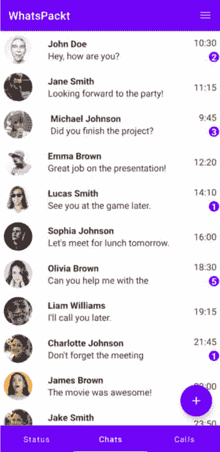

图 1.9：ConversationsList 屏幕截图

如您所见，我们将包括以下内容：

+   一个顶部栏

+   一个标签栏，用于导航到主要部分（请注意，本书将仅涵盖聊天部分的开发；我们不会涵盖状态和通话部分）

+   包含当前对话的列表（我们将在本章后面完成）

+   一个用于创建新聊天的浮动按钮

让我们从主屏幕开始。

## 将 Scaffold 添加到主屏幕

之前，我们创建了一个第一个屏幕的空版本（`ConversationsListScreen`），如下所示：

```kt
package com.packt.feature.conversations.ui
import androidx.compose.runtime.Composable
@Composable
fun ConversationsListScreen(
    onNewConversationClick: () -> Unit,
    onConversationClick: (chatId: String) -> Unit
) {
// We will add here the ConversactionsListScreen components
}
```

现在，是时候开始工作在这个屏幕上了。我们将要添加的第一个组件是 `Scaffold`，您可以使用它轻松组织应用布局，并在不同屏幕之间保持一致的外观和感觉。

这里是 `Scaffold` 的主要组件的简要概述：

+   **topBar**：一个用于放置顶部应用栏的槽位，通常用于显示应用的标题和导航图标。您可以使用 **TopAppBar** 组合组件来创建顶部应用栏。

+   **bottomBar**：一个用于放置底部应用栏的槽位，通常用于操作、导航标签或底部导航栏。您可以使用 **BottomAppBar** 或 **TabRow** 组合组件来创建底部应用栏。

+   **drawerContent**：一个用于放置导航抽屉的槽位，这是一个显示应用导航选项的面板。您可以使用 **Drawer** 或 **ModalDrawer** 组合组件来创建导航抽屉。

+   **floatingActionButton**：一个用于放置浮动操作按钮的槽位，这是一个悬浮在内容上方的圆形按钮，代表屏幕的主要操作。您可以使用 **FloatingActionButton** 组合组件来创建浮动操作按钮。

+   **内容**：一个用于放置屏幕主要内容的槽位，可以是任何可以显示应用数据或 UI 元素的组合组件。

在我们的案例中，我们将使用 `topBar`、`bottomBar` 与 `TabRow`（用于在标签之间导航）、`floatingActionButton`（用于创建新的聊天），以及内容区域，我们将在这里放置我们的主要内容——在我们的案例中，是聊天列表。

让我们在 `ConversationsListScreen` 中创建 `Scaffold` 组合组件。我们将添加所有想要包含的组件的修饰符，但暂时将它们留空：

```kt
@Composable
fun ConversationsListScreen(
    onNewConversationClick: () -> Unit,
    onConversationClick: (chatId: String) -> Unit
) {
    Scaffold(
        topBar = { /* TopAppBar code */ },
        bottomBar = { /* TabRow code */ },
        floatingActionButton =
            { /* FloatingActionButton code */ }
    ) {
        /* Content code */
    }
}
```

我们创建的 `Scaffold` 组合组件包括 `topBar`、`bottomBar`、`floatingAction` **Button** 和屏幕主要区域的内容。我们将继续实现这些组件中的每一个。

现在，根据您的 Android Studio 版本，您可能会看到以下错误：

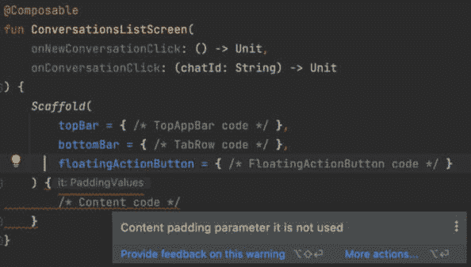

图 1.10：内容填充参数错误

这是因为`Scaffold`可组合组件向内容 Lambda 提供了填充参数。在放置内部组件时，我们需要考虑这个填充，因为如果不考虑，scaffold 可能会覆盖它们。例如，在我们的案例中，我们必须考虑填充，否则我们的内容将保持在`bottomBar`后面。当我们构建内容时，我们将使用这个参数层。

现在，我们将向`Scaffold`可组合组件添加一个`TopAppBar`可组合组件。

## 将`TopAppBar`可组合组件添加到主屏幕

`TopAppBar`可组合组件代表屏幕顶部的工具栏，并为应用中不同屏幕提供一致的外观和感觉。它通常显示以下元素：

+   **标题**：在应用栏中显示的主要文本，通常代表应用名称或当前屏幕的标题

+   **导航图标**：位于应用栏开头的一个可选图标，通常用于打开导航抽屉或导航回应用

+   **操作**：一组可选的图标或按钮，位于应用栏的末尾，代表与当前屏幕相关的常见操作或设置

要添加`TopAppBar`可组合组件，我们必须在模块的`strings.xml`文件中创建`conversations_list_title`字符串。

然后，我们将创建一个`TopAppBar`可组合组件，同时将标题设置为`WhatsPackt`并添加带有菜单图标的`IconButton`。在这里，`IconButton`有一个`onClick`函数，您可以在按钮被点击时定义要执行的操作：

```kt
topBar = {
    TopAppBar(
        title = {
            Text(stringResource(
            R.string.conversations_list_title))
        },
        actions = {
            IconButton(onClick = { /* Menu action */ }) {
                Icon(Icons.Rounded.Menu,
                contentDescription = "Menu")
            }
        }
    )
},
```

接下来，我们将创建一个`TabRow`可组合组件。

## 将`TabRow`可组合组件添加到主屏幕底部

`TabRow`可组合组件是一个水平排列的标签行，允许用户在应用的不同视图或部分之间导航。`TabRow`可组合组件主要由以下元素组成：

+   **标签**：代表应用中不同部分或视图的**Tab**可组合组件集合。每个**Tab**可组合组件可以有一个文本标签、一个图标或两者兼而有之，以描述其内容。

+   **选中标签指示器**：一个视觉指示器，突出显示当前选中的标签，使用户易于理解他们正在查看的哪个部分。

在创建`TabRow`可组合组件之前，我们必须提供一个列表以及它将要包含的标签：

```kt
@Composable
fun ConversationsListScreen(
    onNewConversationClick: () -> Unit,
    onConversationClick: (chatId: String) -> Unit
) {
    val tabs = listOf("Status", "Chats", "Calls")
    Scaffold(
        topBar = {
...
```

然后，我们可以添加`TabRow`：

```kt
bottomBar = {
    TabRow(selectedTabIndex = 1) {
        tabs.forEachIndexed { index, tab ->
            Tab(
                text = { Text(tab) },
                selected = index == 1,
                onClick = { /* Navigation action */ }
            )
        }
    }
},
```

对于每一行，我们都在添加一个`Tab`可组合组件，其中我们指明标题（使用`Text`可组合组件），当标签被选中时的选中值，以及`onClick`操作（我们尚未实现）。

之后，我们可以通过创建一个数据类来存储`Tab`可组合组件的标题来使我们的代码更易于阅读：

```kt
data class ConversationsListTab(
    @StringRes val title: Int
)
fun generateTabs(): List<ConversationsListTab> {
    return listOf(
        ConversationsListTab(
            title = R.string.conversations_tab_status_title
        ),
        ConversationsListTab(
            title = R.string.conversations_tab_chats_title
        ),
        ConversationsListTab(
            title = R.string.conversations_tab_calls_title
        ),
    )
}
```

然后，我们可以更改我们的`TabRow`代码：

```kt
bottomBar = {
    TabRow(selectedTabIndex = 1) {
        tabs.forEachIndexed { index, _ ->
            Tab(
                text = { Text(stringResource(
                    tabs[index].title)) },
                selected = index == 1,
                onClick = {
                    // Navigate to every tab content
                }
            )
        }
    }
}
```

`TabRow`可组合组件通常与分页器结合使用，其中将显示内容。当点击和在不同标签之间导航时，显示的主要内容应该改变。

现在，让我们将分页器添加到我们的屏幕内容中。

## 添加分页器

分页器是一个 UI 组件，允许用户水平或垂直滑动多个页面或屏幕。它通常用于以类似旋转木马的方式显示屏幕或视图。

我们将使用 `HorizontalPager`，正如其名称所暗示的，允许用户在屏幕或可组合组件之间水平滑动。其主要优点是它不会一次性创建所有页面；它只会创建当前页面以及立即的上一页和下一页，这些页面将位于屏幕之外。一旦一个页面超出这个三页窗口，它将被移除。

为了做到这一点，我们可能需要调整我们在 `ConversationsListScreen` 可组合组件中的一些先前代码：

```kt
@OptIn(ExperimentalFoundationApi::class)
@Composable
fun ConversationsListScreen(
    onNewConversationClick: () -> Unit,
    onConversationClick: (chatId: String) -> Unit
) {
    val tabs = generateTabs()
    val selectedIndex = remember { mutableStateOf(1) }
    val pagerState = rememberPagerState(initialPage = 1)
    …
}
```

首先，由于 `HorizontalPager` 是基础 API 的一部分，并且在编写时是一个实验性 API（这意味着它可能会在未来更改其公共接口），我们需要添加 `@OptIn(ExperimentalFoundationApi::class)` 注解。

其次，我们添加了一个名为 `pagerState` 的新字段。它的职责是保持分页器的状态，包括有关页面数量、当前页面、滚动位置和滚动行为的信息。

接下来，我们将按照以下方式将 `HorizontalPager` 添加到内容函数中：

```kt
content = { innerPadding ->
    HorizontalPager(
    modifier = Modifier.padding(innerPadding),
    pageCount = tabs.size,
    state = pagerState
) { index ->
    when (index) {
        0 -> {
            //Status
        }
        1 -> {
            ConversationList(
                conversations = emptyList(),
                onConversationClick = onConversationClick
            )
        }
        2-> {
            // Calls
        }
    }
}
    LaunchedEffect(selectedIndex.value) {
        pagerState.animateScrollToPage(selectedIndex.value)
    }
}
```

在这里，我们将使用 `LaunchedEffect` 函数。此函数用于管理副作用，例如在可组合层次结构上下文中异步完成的任务。副作用是可以在可组合函数本身之外产生影响的操作，例如网络请求、数据库操作，或者在上一个示例中，在分页器中滚动到特定页面。

`LaunchedEffect` 函数接受一个键（或一组键）作为其第一个参数。当键发生变化时，效果将被重新启动，取消之前效果的任何正在进行的工作。第二个参数是一个挂起 Lambda 函数，它将在效果的协程作用域中执行。

使用 `LaunchedEffect` 的主要优势是它与 Compose 生命周期集成良好。当调用 `LaunchedEffect` 的可组合组件离开组合时，效果将被自动取消，清理任何正在进行的工作。

回到我们的代码，在我们的情况下，我们正在更改 `pagerState` 中的当前页面，并动画滚动到下一个选定的页面。这将在 `selectedIndex.value` 发生变化时触发。

下一个组件将允许用户创建一个新的聊天 - 我们将使用 `FloatingActionButton` 可组合组件创建此按钮。

## 添加 FloatingActionButton 可组合组件

`FloatingActionButton`可组合组件是一个表示在 UI 上方浮动的圆形按钮的 Material Design 可组合组件。它通常用于促进应用中的主要操作（例如，添加新项目、编写消息或启动新流程）。遵循 Material Design 指南（您可以在[`m3.material.io/`](https://m3.material.io/)中查看），我们将使用它从`ConversationsListScreen`创建新的聊天：

```kt
floatingActionButton = {
    FloatingActionButton(
        onClick = { onNewConversationClick() }
    ) {
        Icon(
            imageVector = Icons.Default.Add,
            contentDescription = "Add"
        )
    }
}
```

我们的`FloatingActionButton`可组合组件使用了`onClick`修饰符。在这里，我们将包含导航到创建聊天屏幕的代码。在这个按钮内部，我们包含了一个`Icon`可组合组件，我们将其用作`Icons.Default`预定义图像之一。

到目前为止，我们的对话列表屏幕应该看起来类似于这个：

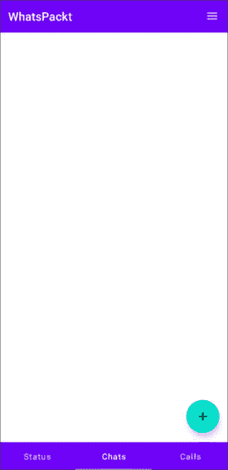

图 1.11：带有顶部栏、标签栏和浮动操作按钮的对话列表屏幕

这样，我们就创建了一个包含所有帮助用户导航的元素的`Scaffold`可组合组件。现在，我们准备好完成屏幕的最后一步（也是最重要的一步）：创建现有对话的列表。为此，我们将开始创建一个对话项。

# 创建对话列表

在本节中，我们将创建展示对话列表所需的所有组件。我们将从 UI 数据模型开始，它将代表应用在列表中将要显示的信息，`Conversation`可组合组件，它将绘制列表中的每个项目，最后是列表本身的可组合组件。

## 模拟对话

首先，我们将模拟我们将在对话列表组件中使用的实体：`Conversation`模型。

作为对话模型的一部分，我们希望显示其他参与者的头像（我们只是进行一对一的对话）、他们的名字、最后一条消息的第一行、接收消息的时间以及表示未读消息数量的数字。

考虑到这些信息，我们将开始创建一个数据类来保存我们需要的数据：

```kt
data class Conversation(
    val id: String,
    val name: String,
    val message: String,
    val timestamp: String,
    val unreadCount: Int,
    val avatar: String
)
```

由于头像可以在整个应用中重复使用，我们将首先创建它。我们可以将其包含在`:common:framework`模块中，以便它可见并可从其他功能模块中重复使用。

Jetpack Compose 默认不包含从 URL 异步加载图像的支持，但有许多第三方库可以帮助我们完成这项任务。最受欢迎的选项是 Coil 和 Glide，在性能、缓存和图像加载方面相当相似。我们将仅为了简单起见并因为它是 Kotlin 优先（而 Glide 是用 Java 编写的）而使用 Coil。

和往常一样，我们需要在我们的模块的`build.gradle`文件中包含依赖项：

```kt
dependencies {
...
implementation "io.coil-kt:coil-compose:${latest_version}"
...
}
```

到目前为止，我们已经准备好创建我们的 `Avatar` 可组合：

```kt
@Composable
fun Avatar(
    modifier: Modifier = Modifier,
    imageUrl: String,
    size: Dp,
    contentDescription: String? = "User avatar"
) {
    AsyncImage(
        model = imageUrl,
        contentDescription = contentDescription,
        modifier = modifier
            .size(size)
            .clip(CircleShape),
        contentScale = ContentScale.Crop
    )
}
```

在这里，我们正在使用 `AsyncImage` 创建头像，该头像将加载由 URL 提供的图像。此图像将被修改为圆形形状。此外，我们应在使用此可组合时传递图像的大小（我们选择了 50 密度无关像素）。

现在，我们可以创建 `ConversationItem`：

```kt
import androidx.compose.foundation.layout.*
import androidx.compose.material.MaterialTheme
import androidx.compose.material.Text
import androidx.compose.runtime.Composable
import androidx.compose.ui.Alignment
import androidx.compose.ui.Modifier
import androidx.compose.ui.text.font.FontWeight
import androidx.compose.ui.unit.dp
import com.packt.feature.conversations.ui.model.Conversation
import com.packt.framework.ui.Avatar
@Composable
fun ConversationItem(conversation: Conversation) {
    Row(
        modifier = Modifier
            .fillMaxWidth()
            .padding(8.dp),
        verticalAlignment = Alignment.CenterVertically
    ) {
        Avatar(
            imageUrl = conversation.avatar,
            size = 50.dp,
            contentDescription =
                "${conversation.name}'s avatar"
        )
        Spacer(modifier = Modifier.width(8.dp))
        Column {
            Text(
                text = conversation.name,
                fontWeight = FontWeight.Bold,
                modifier = Modifier.fillMaxWidth(0.7f)
            )
            Text(text = conversation.message)
        }
        Spacer(modifier = Modifier.width(8.dp))
        Column(horizontalAlignment = Alignment.End) {
            Text(text = conversation.timestamp)
            if (conversation.unreadCount > 0) {
                Text(
                    text =
                    conversation.unreadCount.toString(),
                    color = MaterialTheme.colors.primary,
                    modifier = Modifier.padding(top = 4.dp)
                )
            }
        }
    }
}
```

让我们更仔细地看看这个可组合做了什么：

+   **ConversationItem** 可组合接受以下参数：名称、消息、时间戳、**头像 URL**，以及一个具有默认值 **0** 的可选 **未读消息**。

+   使用 **Row** 布局来水平排列内容。它具有 **fillMaxWidth()** 修饰符，以占用父级的全部宽度，并具有 8 密度无关像素的填充。

+   **Avatar** 可组合用于显示头像。我们已经知道它是如何工作的——唯一需要指出的是，我们希望它的大小为 50 密度无关像素。

+   添加一个宽度为 8 密度像素的 **Spacer** 可组合，以在头像和文本内容之间提供一些空间。

+   使用 **Column** 布局来垂直排列名称和消息文本。**Column** 布局具有 **Modifier.weight()** 修饰符，确保它占据头像和时间戳之间的所有可用空间。

+   在 **Column** 布局内部，使用 **Text** 可组合以粗体字体重量和 16 尺度无关像素的字体大小显示名称。另一个 **Text** 可组合用于显示消息，最多一行，并带有省略号溢出。

+   在主 **Row** 布局中添加另一个 **Column** 布局来垂直排列时间戳和未读消息徽章。**Column** 布局的 **horizontalAlignment** 值为 **Alignment.End**，以将其子项对齐到可用空间的末尾。

+   在这个第二个 **Column** 布局内部，使用 **Text** 可组合以 12 尺度无关像素的字体大小和灰色显示时间。

+   条件语句检查是否有任何未读消息（即 **conversation.unreadMessages > 0**）。如果有未读消息，未读消息计数将显示一个带有圆形背景的文本，该背景使用 **drawBehind** 修饰符绘制。

现在我们有了 `ConversationItem` 可组合，是时候完成这个屏幕了。让我们创建 `ConversationList` 可组合！

## 创建 ConversationList 可组合

作为此屏幕的最后一步，我们将创建对话列表：

```kt
@Composable
fun ConversationList(conversations: List<Conversation>) {
    LazyColumn {
        items(conversations) { conversation ->
            ConversationItem(
                conversation = conversation
            )
        }
    }
}
```

`ConversationList` 可组合接受一个 `Conversation` 对象列表，并使用 `LazyColumn` 高效地显示它们。`items` 函数用于遍历对话列表，并为每个对话渲染 `ConversationItem`。

最后，我们将此列表包含在 `HorizontalPager` 逻辑中，在我们的 `ConversationsListScreen` 可组合中：

```kt
HorizontalPager(
    modifier = Modifier.padding(innerPadding),
    pageCount = tabs.size,
    state = pagerState
) { index ->
    when (index) {
        0 -> {
            //Status
        }
        1 -> {
            ConversationList(
                conversations = emptyList(), // Leaving the
                                                list empty
                                                for now
                onConversationClick = onConversationClick
            )
        }
        2-> {
            // Calls
        }
    }
}
```

如果我们想测试它，我们可以伪造对话的数据：

```kt
fun generateFakeConversations(): List<Conversation> {
    return listOf(
        Conversation(
            id = "1",
            name = "John Doe",
            message = "Hey, how are you?",
            timestamp = "10:30",
            avatar = "https://i.pravatar.cc/150?u=1",
            unreadCount = 2
        ),
        Conversation(
            id = "2",
            name = "Jane Smith",
            message = "Looking forward to the party!",
            timestamp = "11:15",
            avatar = "https://i.pravatar.cc/150?u=2"
        ),
//Add more conversations here
```

注意，在这里，我正在使用一个随机头像生成器，只是为了使其尽可能接近我们将这个 UI 与真实对话连接时的样子。

以下截图显示了我们的应用在更多对话中的样子：

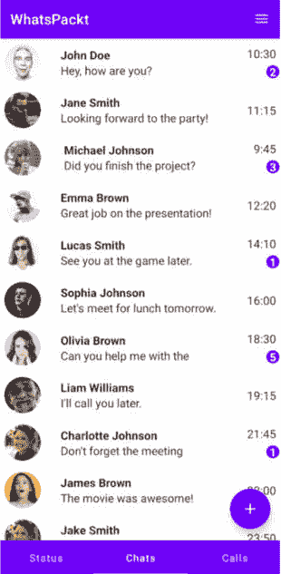

图 1.12：ConversationsList 屏幕完成

现在，让我们切换到聊天屏幕，也称为消息列表。与显示所有对话的对话列表不同，消息列表将显示我们与一个用户（单个聊天屏幕）的对话列表。

# 构建消息列表

在本节中，我们将创建创建聊天屏幕和两个用户可能交换的消息所需的 UI 模型。然后，我们将创建`Message`可组合组件，最后是屏幕的其余部分，包括消息列表。

## 模拟 Chat 和 Message 模型

考虑到我们在聊天屏幕上需要显示的信息，我们将需要两个数据模型：一个用于与对话相关的静态数据（例如，我们正在与之交谈的用户的姓名、他们的头像等），以及每个消息一个数据模型。这将作为`Chat`模型的模型：

```kt
data class Chat(
    val id: String,
    val name: String,
    val avatar: String
)
```

在这种情况下，我们需要聊天 ID、我们正在与之交谈的人的姓名和他们的头像地址。

关于`Message`模型，我们将创建以下类：

```kt
data class Message(
    val id: String,
    val senderName: String,
    val senderAvatar: String,
    val timestamp: String,
    val isMine: Boolean,
    val messageContent: MessageContent
)
sealed class MessageContent {
    data class TextMessage(val message: String) :
        MessageContent()
    data class ImageMessage(val imageUrl: String,
        val contentDescription: String) : MessageContent()
}
```

在这种情况下，我们需要发送者的姓名、他们的头像、时间戳、消息是否是我的（我们将考虑这一点，以便我们可以将消息排列在左边或右边），以及消息的内容。

由于我们的应用将有两种类型的内容（消息和图片），我们需要两种不同类型的`MessageContent`。这就是为什么它被建模为一个密封类。我们有两个数据类，包含每种类型消息内容所需的数据。

现在，我们需要将这些模型转换为一些可组合组件。

## 创建 MessageItem 可组合组件

`MessageItem`可组合组件将绘制我们聊天中的每条消息。

首先，我们将创建一个`Row`布局。我们将根据消息的作者设置行内容的排列：

```kt
@Composable
fun MessageItem(message: Message) {
    Row(
        modifier = Modifier.fillMaxWidth(),
        horizontalArrangement = if (message.isMine)
        Arrangement.End else Arrangement.Start
    ) {
...
}
}
```

然后，在这个行内，我们将放置消息的其余组件。我们将从头像开始；如果消息不是来自用户，我们将只显示头像：

```kt
if (!message.isMine) {
    Avatar(
        imageUrl = message.senderAvatar,
        size = 40.dp,
        contentDescription = "${message.senderName}'s
                              avatar"
    )
    Spacer(modifier = Modifier.width(8.dp))
}
```

然后，我们将添加一个`Column`布局，以便我们可以安排剩余的消息信息：

```kt
Column {
    if (message.isMine) {
        Spacer(modifier = Modifier.height(8.dp))
    } else {
        Text(
            text = message.senderName,
            fontWeight = FontWeight.Bold
        )
    }
    when (val content = message.messageContent) {
        is MessageContent.TextMessage -> {
            Surface(
                shape = RoundedCornerShape(8.dp),
                color = if (message.isMine)
                MaterialTheme.colors.primarySurface else
                MaterialTheme.colors.secondary
            ) {
                Text(
                    text = content.message,
                    modifier = Modifier.padding(8.dp),
                    color = if (message.isMine)
                    MaterialTheme.colors.onPrimary else
                    Color.White
                )
            }
        }
        is MessageContent.ImageMessage -> {
            AsyncImage(
                model = content.imageUrl,
                contentDescription =
                content.contentDescription,
                modifier = Modifier
                    .size(40.dp)
                    .clip(CircleShape),
                contentScale = ContentScale.Crop
            )
        }
    }
    Text(
        text = message.timestamp,
        fontSize = 12.sp
    )
}
```

消息将包含以下信息：

+   **发送者姓名（如果作者不是当前用户）**：为了知道消息是否来自当前用户，应用将检查消息的作者是当前用户使用**if (message.isMine**）。如果是肯定的，我们将添加一个**Space**可组合组件；如果消息作者不是当前用户，我们将显示**Text**可组合组件和他们的名字。

+   **内容**：如果内容是文本，则应用将显示包含文本的气泡。气泡的颜色将取决于消息的发送者是否是当前用户以及消息创建的时间。将在消息底部显示创建日期和时间的戳记。

现在我们有了`MessageItem`，是时候创建聊天屏幕的其余部分了。

## 添加 TopAppBar 和 BottomRow 可组合组件

正如我们对对话列表所做的那样，我们将添加`Scaffold`结构和其`TopAppBar`和`BottomRow`可组合组件到这个屏幕：

```kt
@Composable
fun ChatScreen(
    chatId: String?,
    onBack: () -> Unit
) {
    Scaffold(
        topBar = {
            TopAppBar(
                title = {
                    Text(stringResource(
                    R.string.chat_title, "Alice"))
                }
            )
        },
        bottomBar = {
            SendMessageBox()
        }
    ) { paddingValues->
        ListOfMessages(paddingValues = paddingValues)
    }
}
```

注意，我们正在硬编码聊天标题。这只是为了预览目的；我们将在下一章中纠正这一点。

在底部栏的情况下，我们正在添加一个新的可组合组件，该组件将包含`Textfield`和发送消息所需的发送按钮。这就是这个可组合组件的外观：

```kt
@Composable
fun SendMessageBox() {
    Box(
        modifier = Modifier
            .defaultMinSize()
            .padding(top = 0.dp, start = 16.dp,
                end = 16.dp,
            bottom = 16.dp)
            .fillMaxWidth()
    ) {
        var text by remember { mutableStateOf("") }
        OutlinedTextField(
            value = text,
            onValueChange = { newText -> text = newText },
            modifier = Modifier
                .fillMaxWidth(0.85f)
                .align(Alignment.CenterStart)
                .height(56.dp),
        )
        IconButton(
            modifier = Modifier
                .align(Alignment.CenterEnd)
                .height(56.dp),
            onClick = {
                // Send message here
                text = ""
            }
        ) {
            Icon(
                imageVector = Icons.Default.Send,
                tint = MaterialTheme.colors.primary,
                contentDescription = "Send message"
            )
        }
    }
}
```

在这里，我们创建了一个`Box`可组合组件来相应地排列子可组合组件（左边的文本字段和右边的`Send`按钮）。然后，我们定义了一个名为`text`的属性来存储文本字段的变化，并使用`remember`代理来记住其重组之间的最后一个值。

如前述代码块所示，此可组合组件的主要组件如下：

+   **OutlinedTextField**：用于编写消息。它将从文本属性中获取其值，并在文本字段值每次更改时修改它。

+   **IconButton**：用于发送消息。它的`onClick`参数目前没有任何作用（除了重启**text**属性值）。我们将在下一章中进行配置。

有了这个，我们的聊天屏幕几乎准备好了。我们最后需要做的是添加消息列表。

## 添加消息列表

之前，我们曾将消息列表作为可组合组件添加到`Scaffold`可组合组件的`content`参数中。这个可组合组件将如下所示：

```kt
@Composable
fun ListOfMessages(paddingValues: PaddingValues) {
    Box(modifier = Modifier
        .fillMaxSize()
        .padding(paddingValues)) {
        Row(modifier = Modifier
            .fillMaxWidth()
            .padding(16.dp)
        ) {
            LazyColumn(
                modifier = Modifier
                    .fillMaxSize(),
                verticalArrangement =
                    Arrangement.spacedBy(8.dp),
            ) {
                items(getFakeMessages()) { message ->
                    MessageItem(message = message)
                }
            }
        }
    }
}
```

有了这个，我们添加了`LazyColumn`，它将显示列表——列表中的每个项目都是一个`MessageItem`可组合组件。

由于我们还没有将其连接到任何类型的数据源，我们正在使用一个函数来生成一个仅用于预览目的的假消息列表：

```kt
fun getFakeMessages(): List<Message> {
    return listOf(
        Message(
            id = "1",
            senderName = "Alice",
            senderAvatar =
                "https://i.pravatar.cc/300?img=1",
            isMine = false,
            timestamp = "10:00",
            messageContent = MessageContent.TextMessage(
                message = "Hi, how are you?"
            )
        ),
        Message(
            id = "2",
            senderName = "Lucy",
            senderAvatar =
                "https://i.pravatar.cc/300?img=2",
            isMine = true,
            timestamp = "10:01",
            messageContent = MessageContent.TextMessage(
                message = "I'm good, thank you! And you?"
            )
        ),
)
}
```

如果你想添加更多消息，可以通过将它们添加到`getFakeMessages()`函数内部创建的列表中来实现。

最后，我们应该有一个看起来像这样的屏幕：

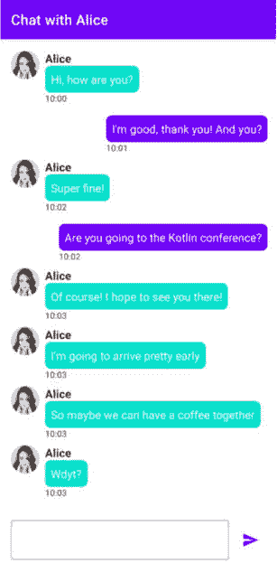

图 1.13：聊天屏幕 UI 完成

有了这个，我们现在已经完成了用户界面。我们将在接下来的两章中继续开发这个应用！

# 摘要

在本章的第一部分，我们开始了我们的第一个项目，WhatsPackt，一个消息应用。

我们完成了构建此应用的一些初始任务，例如组织模块、准备依赖注入和导航、构建主屏幕、创建对话列表和构建消息列表。

在整个过程中，我们学习了模块化以及组织模块的各种方法。我们还了解了用于管理依赖注入的流行库，如何初始化它们，以及如何设置 Compose 导航。此外，我们还熟悉了使用 Jetpack Compose 来创建我们的用户界面。

随着我们继续前进，是时候给我们的聊天添加一些活力和生命力了。在下一章中，我们将探讨如何检索和发送消息，并将它们集成到我们最近创建的用户界面中。
