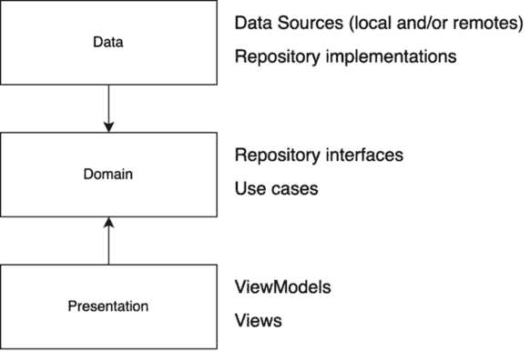
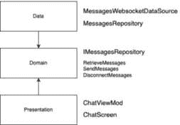

# 第二章：设置 WhatsPackt 的消息功能

在上一章中，我们创建了所需的 WhatsPackt 消息应用的结构和 UI。

任何消息应用的核心功能之一是能够促进两个用户之间的 1:1 对话，因此在本章中，我们将深入研究将我们的消息应用连接到后端服务器使用 WebSocket 的过程，处理`ViewModel`实例内的消息，以及管理同步、错误处理和推送通知。

我们将首先探索**WebSocket**，这是一种强大的技术，它允许客户端和服务器之间进行双向通信，为你的应用中的实时消息提供坚实的基础。你将学习如何建立 WebSocket 连接，发送消息，并处理来自服务器的接收到的消息。

接下来，我们将演示如何在你的**ViewModel**中接收消息。我们将讨论更新 UI、管理消息存储和处理用户交互的最佳实践，确保为用户提供流畅和响应式的消息体验。

本章还将涵盖同步和错误处理的必要方面。你将学习如何管理消息投递状态，处理间歇性连接问题，并优雅地从错误中恢复，从而实现一个弹性可靠的消息系统。

最后，我们将深入探讨推送通知这一主题，这对于在应用不在前台时提醒用户新消息至关重要。

到本章结束时，你将全面了解创建支持使用 WebSocket 和推送通知的 1:1 对话的现代消息应用所涉及的关键组件和技术。

因此，在本章中，我们将涵盖以下主题：

+   使用 WebSocket 连接

+   在我们的**ViewModel**中接收消息

+   处理同步和错误

+   添加推送通知

+   用 Firestore 替换 WebSocket

# 技术要求

如前一章所述，你需要安装 Android Studio（或你偏好的其他编辑器）。

我们还假设你已经跟随了上一章的内容。如果你还没有，你可以从这里下载上一章的完整代码：[`github.com/PacktPublishing/Thriving-in-Android-Development-using-Kotlin/tree/main/Chapter-1/WhatsPackt`](https://github.com/PacktPublishing/Thriving-in-Android-Development-using-Kotlin/tree/main/Chapter-1/WhatsPackt).

本章中完成的部分代码也可以在此链接中找到：[`github.com/PacktPublishing/Thriving-in-Android-Development-using-Kotlin/tree/main/Chapter-2/WhatsPackt`](https://github.com/PacktPublishing/Thriving-in-Android-Development-using-Kotlin/tree/main/Chapter-2/WhatsPackt).

# 使用 WebSocket 连接

正如所述，WebSockets 是一种强大的技术，它使客户端和服务器之间实现双向通信。在本节中，我们将使用 WebSocket 连接与我们的服务器连接，以获取和发送消息。但在我们这样做之前，了解替代方案以及选择 WebSockets 作为我们的消息应用的理由是至关重要的。

## 为什么选择 WebSockets？

实现客户端和服务器之间实时通信有几种选择，包括以下几种：

+   **长轮询**: 这是指客户端向服务器发送请求，服务器在新的数据可用之前保持请求。一旦服务器用新数据响应，客户端发送另一个请求，然后这个过程重复。

+   **服务器发送事件（SSE）**: SSE 是一种单向通信方法，其中服务器通过单个 HTTP 连接向客户端推送更新。

+   **实时云数据库**（例如，Firebase Firestore）：实时云数据库提供了一个易于使用、可扩展的解决方案，用于实时数据同步。它们在数据发生变化时自动向客户端推送更新，这使得它们适用于消息应用。

+   **WebSockets**: WebSockets 提供客户端和服务器之间通过单一、持久连接的全双工、双向通信。它们在各个平台上得到广泛支持，是消息应用中实时通信的理想选择。

考虑这些替代方案，我们选择在我们的消息应用中使用 WebSockets，因为它们提供了以下优势：

+   **双向通信**: WebSockets 允许客户端和服务器之间同时进行数据传输，从而实现更快的消息交换和更响应式的用户体验。

+   **低延迟**: 与长轮询、SSE 和一些实时云数据库不同，WebSockets 提供低延迟通信，这对于实时消息应用至关重要。

+   **资源的高效利用**: WebSockets 为每个客户端维护一个单一连接，与长轮询相比，这减少了客户端和服务器上的开销。

+   **灵活性和控制性**: 实现自定义 WebSocket 通信允许对消息基础设施有更精细的控制，避免了由实时云数据库强加的潜在限制或约束。

当然，WebSockets 也有其缺点，我们必须考虑，如下所示：

+   **电池和数据使用**: 维持持久连接可能导致电池消耗增加和数据使用量增加，这可能会成为移动用户的担忧。

+   **复杂性**: 实现 WebSocket 通信通常比使用 RESTful 服务更复杂。您必须处理各种场景，例如在网络变化时进行重新连接，这在移动环境中很常见。

+   **可扩展性**: 如果您的应用程序扩展到大量用户，维护所有用户的 WebSocket 连接可能会在服务器端消耗大量资源。

虽然有一些缺点，但使用 WebSocket 的优势——如实时双向通信和与传统 HTTP 轮询相比的更低开销——显著超过了这些问题，使其成为交互式应用程序的一个强大选择。

让我们开始学习如何集成 WebSocket。

## 集成 WebSocket

在 Android 应用程序中，有多个库可用于集成 WebSocket。以下是一些流行的选项：

+   **OkHttp**：一个流行的 Android 和 Java 应用程序 HTTP 客户端，也支持 WebSocket 通信

+   **Scarlet**：一个基于 OkHttp 的 Kotlin 和 Java 应用程序的声明式 WebSocket 库

+   **Ktor**：一个基于 Kotlin 的现代框架，用于构建异步服务器和客户端，包括 WebSocket 支持

对于我们的应用程序，我们将使用 Ktor，因为它易于使用，对 Kotlin 有原生支持，并且有广泛的文档。

### 什么是 Ktor？

Ktor 因其基于协程的架构而脱颖而出，这允许进行非阻塞的异步操作，使其特别适合网络通信等 I/O 密集型任务。它轻量级且模块化，允许开发者选择和选择他们需要的功能，从而避免不必要的功能的开销。

该框架建立在协程之上，这是 Kotlin 中的一个特性，可以使你的代码更简洁、更易读，并通过允许函数在稍后时间暂停和恢复来简化异步编程。这提供了一种处理并发的方式，与传统的回调机制相比，语法更直接、更易于表达。

Ktor 多功能，支持服务器端和客户端开发。在服务器端，它可以用来构建健壮且可扩展的 Web 应用程序和服务。在客户端，它提供了一个多平台 HTTP 客户端，可以在 Android 上使用，允许无缝与 Web 服务交互。

Ktor 的 WebSocket 客户端允许轻松设置和管理 WebSocket 连接，处理诸如连接生命周期、错误处理和信息处理等复杂性。它的**领域特定语言**（**DSL**）提供了一种简洁且易于表达的方式来定义 WebSocket 交互的行为，使代码更易于阅读和维护。

### 集成 WebSocket 与 Ktor

要在 Android 应用程序中集成 Ktor，请按照以下步骤操作：

1.  在我们应用程序的 **:feature:chat** 模块的 **build.gradle** 文件中，为 WebSocket 客户端添加以下 Ktor 依赖项。确保将 **$ktor_version** 替换为最新版本（对于本书中的示例，我们使用版本 2.2.4）：

    ```kt
    dependencies {
        implementation "io.ktor:ktor-client-
            websockets:2.2.4"
        implementation "io.ktor:ktor-client-okhttp:2.2.4"
    }
    ```

    每个依赖项都有其独特的作用：

    +   **io.ktor:ktor-client-websockets**: 这个依赖项提供了管理我们应用程序中 WebSocket 连接所需的功能。它包括对打开、向 WebSocket 服务器发送消息和从 WebSocket 服务器接收消息的高级抽象，以无缝的方式促进实时数据交换。通过使用这个库，我们可以轻松实现 WebSocket 通信，无需手动处理复杂的底层协议和握手。

    +   **io.ktor:ktor-client-okhttp**: 虽然 Ktor 是一个多平台框架，但它需要一个引擎来处理网络请求。这个依赖项将 OkHttp 集成为我们应用程序中处理 HTTP 请求和响应的底层引擎。OkHttp 支持 WebSocket，以及其强大的 HTTP 客户端功能，提供高效的网络操作、连接池和强大的接口，用于发送和拦截请求。

    一起，这些依赖项使我们的应用程序能够利用 WebSocket 进行实时通信，并利用 OkHttp 的高效网络功能。这种组合对于需要维护持久连接和管理高频数据交换的应用程序特别强大，例如消息应用或实时数据流。

1.  在您的**AndroidManifest.xml**文件中，添加访问互联网所需的权限，因为我们需要它来连接 WebSocket 和接收/发送消息：

    ```kt
    <uses-permission android:name=
        "android.permission.INTERNET" />
    ```

我们现在已经在项目中包含了这个库。由于我们将使用 Ktor 与 Kotlin Flow，在深入 WebSocket 实现之前，让我们先介绍它。

### 了解 Kotlin Flow

Flow 是 Kotlin 协程库的一部分，它是一种可以按顺序发出多个值的类型，与只返回单个值的挂起函数相反。Flow 建立在协程的基础概念之上，提供了一种声明式的方式来处理异步数据流。

与 Kotlin 中的序列不同，序列是同步和阻塞的，Flow 是异步和非阻塞的。这使得 Flow 非常适合处理可以异步观察和收集的连续数据流，例如 WebSocket 的实时消息。

当将 Flow 与 Ktor WebSockets 集成时，我们可以创建一个强大的组合，其中 WebSocket 消息作为数据流发出，可以使用所有 Flow 操作符进行处理。它允许以干净、响应式的方式处理 WebSocket 的传入和传出消息。

例如，在聊天应用程序中，来自 WebSocket 的传入消息可以表示为字符串流。应用程序可以收集这个流来相应地更新 UI。同样，生成传出消息的用户操作可以收集并通过 WebSocket 连接发送。

Flow API 非常简单易用。例如，想象我们有一个发出三个字符串的流：

```kt
fun main() = runBlocking {
    // Define a simple flow that emits three strings
    val helloFlow = flow {
        emit("Hello")
        emit("from")
        emit("Flow!")
    }
    // Collect and print each value emitted by the flow
    helloFlow.collect { value ->
        println(value)
    }
}
```

在此代码块中，`helloFlow`是通过`flow`构建器定义的，依次发出三个字符串。

注意

除了 **flow** 之外，还有几个其他的构建器，例如 **flowOf**，它从一个值集中创建一个流，或者 **toFlow()**，它从一个集合中创建一个流。

然后在 `helloFlow` 上调用 `collect()` 函数。它作为一个订阅者，对每个发出的值做出反应，并打印出来。

如果你运行这段代码，你应该看到以下输出：

```kt
Hello
from
Flow!
```

现在我们对 Kotlin Flow 有点熟悉了，我们准备进行下一步：使用 Ktor 和 Flow 构建我们的 WebSocket 实现。由于它将是提供消息给我们的应用的数据源之一，我们将称之为 `WebsocketDataSource`。

## 实现 WebSocketDataSource

要实现 WebSocket 数据源，我们首先将创建一个 `HttpClient` 实例。`HttpClient` 是一个 Ktor 类，允许你进行 HTTP 请求并管理网络连接。在 WebSocket 的情况下，它负责在客户端和服务器之间建立和维护连接。

要创建一个具有 WebSocket 支持的 `HttpClient` 实例，我们将在 `feature.chat.data.network` 包中创建一个名为 `WebSocketClient` 的新文件（你需要创建数据和网络包，因为它们还不存在）并包含以下代码：

```kt
object WebsocketClient {
    val client = HttpClient(OkHttp) {
        install(WebSockets)
    }
}
```

在这里，我们使用 `OkHttp` 引擎创建一个 `HttpClient` 实例，然后安装 `WebSockets` 插件以启用 WebSocket 支持。

注意

在 Ktor 中，**插件**（也称为功能）是扩展 Ktor 应用程序功能的功能模块化组件。插件可以安装在客户端和服务器端以提供额外的功能，例如身份验证、日志记录、序列化或自定义行为。Ktor 的基于插件的架构鼓励轻量级和模块化的方法，允许你只将必要的组件包含在应用程序中。

然后，我们将创建我们的 `MessagesSocketDataSource` 类（在同一个包中）。

要开始创建我们的 WebSocket，我们需要一个 `WebSocketSession` 实例。`WebSocketSession` 代表客户端和服务器之间单一的 WebSocket 连接，提供发送和接收消息的方法，以及管理连接的生命周期。在我们的实现中，当我们调用 `connect()` 方法时，将创建一个 `WebSocketSession` 实例，如下所示：

```kt
class MessagesSocketDataSource @Inject constructor(
    private val httpClient: HttpClient,
) {
    private lateinit var webSocketSession:
        DefaultClientWebSocketSession
    suspend fun connect(url: String): Flow<Message>{
        return httpClient.webSocketSession { url(url) }
            .apply { webSocketSession = this }
            .incoming
            .receiveAsFlow()
            .map{ frame ->
                webSocketSession.handleMessage(frame) }
            .filterNotNull()
            .map { it.toDomain() }
    }
//...
}
```

让我们分解一下这段代码将要做什么：

+   **suspend fun connect(url: String): Flow<Message>**：**connect** 函数被定义为接受一个类型为 **String** 的 **url** 参数并返回一个 **Flow<Message>** 实例的挂起（**suspend**）函数。**Flow** 是 Kotlin 中用于以响应式方式处理数据的冷异步流（冷流是只有当有消费者连接时才会发出消息的流）。

+   **httpClient.webSocketSession { url(url) }**：这一行使用 **httpClient** 通过调用 **webSocketSession** 函数并传递一个设置会话 URL 为提供的 URL 的 lambda 表达式来创建一个 WebSocket 会话。

+   **.apply { webSocketSession = this }**：这一行使用 **webSocketSession** 属性中的 **apply** 函数存储新创建的 WebSocket 会话。我们还需要将其存储起来，因为我们稍后会需要这个会话来发送消息。

+   **.incoming**：这一行访问 **webSocketSession** 的 **incoming** 属性。**incoming** 属性是一个通道，它从 WebSocket 服务器接收 **Frame** 对象。

+   **.receiveAsFlow()**：这一行将传入的通道转换为 **Flow<Frame>** 实例，以便可以使用 Flow API 进行处理。

+   **.map { frame -> webSocketSession.handleMessage(frame) }**：这一行将每个传入的 **Frame** 对象映射到调用 **handleMessage** 函数的结果。我们将在稍后定义 **handleMessage** 函数。

+   **.filterNotNull****()**：这一行从流中过滤掉任何 **null** 值，确保只有非 **null** 值被进一步处理。

+   **.map { it.toDomain() }**：这一行将每个非 **null** 值映射到调用 **toDomain()** 函数的结果。这个函数将当前数据相关对象映射到我们很快将创建的域 **Message** 模型。

在处理和消息之前，我们还想向我们的 WebSocket 数据源添加两个额外的函数：

+   我们还想要一个函数来发送消息，因为我们希望我们的用户能够向他们的 WhatsPackt 朋友发送消息。

+   我们还想要一个函数来断开 WebSocket 连接，因为当它不再使用时，我们应该从服务器断开连接。

我们可以像这样添加它们：

```kt
suspend fun sendMessage(message: String) {
    webSocketSession.send(Frame.Text(message))
}
suspend fun disconnect() {
    webSocketSession.close(CloseReason(
        CloseReason.Codes.NORMAL, "Disconnect"))
}
```

当 WebSocket 连接关闭时，它会伴随着一个 `CloseReason` 类，该类包含一个代码和一个可选的描述性文本。代码表示连接关闭的原因，例如正常关闭、协议错误或不支持的数据。在我们的实现中，我们使用 `CloseReason` 类以正常关闭关闭 `WebSocketSession`。

一些常见的 `CloseReason` 代码包括以下内容：

+   **CloseReason.Codes.NORMAL**：表示连接的正常关闭。这是当用户不再使用聊天界面时将提供的理由。

+   **CloseReason.Codes.GOING_AWAY**：表示服务器正在离开或关闭。

+   **CloseReason.Codes.PROTOCOL_ERROR**：表示 WebSocket 协议中发生了错误。

+   **CloseReason.Codes.UNSUPPORTED_DATA**：表示接收到的数据类型不受支持。

现在我们知道了如何关闭我们的 WebSocket 连接，我们需要定义 `handleMessages` 扩展函数来处理连接存活期间的所有消息：

```kt
private suspend fun
DefaultClientWebSocketSession.handleMessage(frame: Frame):
WebsocketMessageModel? {
    return when (frame) {
        is Frame.Text -> converter?.deserialize(frame)
        is Frame.Close -> {
            disconnect()
            null
        }
        else -> null
    }
}
```

在 WebSocket 协议中，数据以离散的单位（称为帧）进行传输。Ktor 提供了一个 `Frame` 类来表示这些单位，每个帧类型都有一个不同的子类，例如 `Frame.Text`、`Frame.Binary`、`Frame.Ping` 和 `Frame.Close`。

在我们的例子中，我们只处理 `Frame.Text` 和 `Frame.Close` 消息。为了接收 `Frame.Close` 消息，我们将关闭 WebSocket（目前是这样 – 未来，我们可能在这里进行重试或向用户反馈问题）。然后，为了接收 `Frame.Text` 消息，我们将进行 `deserialize` 描述的这个转换。

我们可以在 WebSocket 中配置一个转换器，使我们能够轻松反序列化我们的消息。首先，我们需要向我们的 `build.gradle` 文件中添加新的依赖项：

```kt
implementation("io.ktor:ktor-serialization-kotlinx-json:2.2.4)
```

然后，我们准备在 WebSocket 插件中设置 `contentConverter`：

```kt
object WebsocketClient {
    val client = HttpClient(OkHttp) {
        install(WebSockets) {
            contentConverter =
               KotlinxWebsocketSerializationConverter(Json)
        }
    }
}
```

在此情况下，我们正在配置 JSON 格式的 `kotlinx.serialization` 转换器（也有其他标准的转换器可用，例如 XML、Protobuf 和 CBOR）。

此外，我们必须为那些我们希望由转换器反序列化的数据类添加 `@Serializable` 注解。在我们的例子中，我们将创建一个 `WebsocketMessageModel` 类，如下所示：

```kt
@Serializable
class WebsocketMessageModel(
    val id: String,
    val message: String,
    val senderName: String,
    val senderAvatar: String,
    val timestamp: String,
    val isMine: Boolean,
    val messageType: String,
    val messageDescription: String
)
```

我们流程链中的最后一步是将 `WebsocketMessageModel` 类转换为领域。由于我们还没有领域模型，我们应该首先创建它：

```kt
data class Message(
    val id: String,
    val senderName: String,
    val senderAvatar: String,
    val timestamp: String,
    val isMine: Boolean,
    val contentType: ContentType,
    val content: String,
    val contentDescription: String
) {
    enum class ContentType {
        TEXT, IMAGE
    }
}
```

现在，我们可以将映射器实现为 `WebsocketMessageModel` 类的一个函数：

```kt
@Serializable
class WebsocketMessageModel(
    val id: String,
    val message: String,
    val senderName: String,
    val senderAvatar: String,
    val timestamp: String,
    val isMine: Boolean,
    val messageType: String,
    val messageDescription: String
) {
    companion object {
        const val TYPE_TEXT = "TEXT"
        const val TYPE_IMAGE = "IMAGE"
    }
    fun toDomain(): Message {
        return Message(
            id = id,
            content = message,
            senderAvatar = senderAvatar,
            senderName = senderName,
            timestamp = timestamp,
            isMine = isMine,
            contentDescription = messageDescription,
            contentType = toContentType()
        )
    }
    fun toContentType(): Message.ContentType {
        return when(messageType) {
            TYPE_IMAGE -> Message.ContentType.IMAGE
            else -> Message.ContentType.TEXT
        }
    }
}
```

在这里，我们添加了 `toDomain()` 函数，该函数将当前的 `WebsocketMessageModel` 类映射到 `Message` 模型。请注意，数据模型中的几乎所有字段都与我们的领域 `Message` 模型中的字段相似。一个主要的例外是 `messageType` 字段，我们必须将其转换为领域 `Message` 模型中使用的枚举。为了简化这种转换，我们使用了 `toContentType()` 函数，该函数专门将 `messageType` 从 `String` 对象转换为 `ContentType` 枚举。

我们还需要将领域 `Message` 对象转换为 `WebsocketMessageModel` 类。为此，我们需要向 `WebsocketMessageModel` 类中添加一个新函数：

```kt
companion object {
    const val TYPE_TEXT = "TEXT"
    const val TYPE_IMAGE = "IMAGE"
    fun fromDomain(message: Message): WebsocketMessageModel {
        return WebsocketMessageModel(
            id = message.id,
            message = message.content,
            senderAvatar = message.senderAvatar,
            senderName = message.senderName,
            timestamp = message.timestamp,
            isMine = message.isMine,
            messageType = message.fromContentType(),
            messageDescription = message.contentDescription
        )
    }
}
```

这里，我们将 `Message` 领域对象转换为 `WebsocketMessageModel` 类。

然后，在 `send` 函数中，我们将按以下步骤进行：

```kt
suspend fun sendMessage(message: Message) {
    val websocketMessage =
        WebsocketMessageModel.fromDomain(message)
    webSocketSession.converter?
        .serialize(websocketMessage)?.let
    {
        webSocketSession.send(it)
    }
}
```

通过对 `sendMessage` 函数的这些更改，我们现在接收一个领域模型对象，将其转换为 `WebsocketMessageModel`，并将其最终序列化为 `Frame` 对象并通过我们的 WebSocket 发送。

下一步是将此组件（`MessagesWebsocketDataSource`）与 `ViewModel` 连接起来，该 `ViewModel` 将负责向视图提供视图状态，以便它可以相应地渲染。

# 在我们的 ViewModel 中接收消息

我们的应用程序现在可以接收和发送 WebSocket 消息。现在，我们需要让它们达到我们在上一章中创建的 UI。我们将在本节中这样做，但首先，我们需要考虑实现该功能所需架构和组件。

## 理解 Clean Architecture 的实现

在上一章中，我们对应用程序进行了模块化，并讨论了使用基于清洁架构的结构来组织我们的通用和功能模块。我们已经创建了该架构的第一个组件`MessagesWebsocketDataSource`，但理解这种组织背后的原因以及每个组件在架构中扮演的角色是很重要的。

关于为什么以及如何将清洁架构原则应用于 Android 应用程序，有大量的书籍、文章和视频，甚至包括谷歌的官方文档。在这里，我们将提供简短的描述，然后将其分解为其各个层。

**清洁架构**是一种促进代码组织成具有明确责任层的架构模式，使应用程序更加模块化、可维护、可测试和可扩展。使用清洁架构的关键好处如下：

+   **关注点分离（SoC）**：清洁架构将代码组织成具有特定责任的独立层，确保每一层处理应用程序的单独方面。这种 SoC 导致代码库更加模块化和可维护，使其更容易理解、修改和扩展。

+   **可测试性**：通过将不同的关注点分离成独立的层，可以更容易地在隔离状态下测试每一层。这允许开发者编写全面的单元和集成测试，确保应用程序的行为正确，并且更不容易出现错误。

+   **可重用性**：清洁架构的模块化结构通过鼓励创建可以轻松在不同部分的应用程序或不同项目之间共享的组件来促进可重用性。这减少了代码重复，并提高了整体开发过程的效率。

+   **灵活性**：清洁架构通过解耦应用程序的各个层，使得独立更改或更新这些层中的任何一个都更容易，而不会影响其他层。这为重构、修改应用程序或适应新需求提供了更多灵活性。

+   **可扩展性**：清洁架构的模块化特性使得在应用程序复杂度或规模增长时更容易扩展。通过将代码组织成定义良好的层和组件，开发者可以更容易地添加新功能、更新现有功能或提高性能，而不会引入意外的副作用或使代码库难以管理。

+   **更容易协作**：清洁架构通过提供清晰的代码组织结构和指南，帮助团队更有效地工作。这使得开发者更容易理解代码库，找到他们需要的组件，并更高效地贡献到项目中。

+   **面向未来**：通过遵循 Clean Architecture 的原则，你确保了应用建立在坚实的基础之上，可以随着时间的推移而演变和适应。这使得它更能抵御技术、需求或团队成员的变化，从而提高了项目的长期可行性。

总结来说，在项目中使用 Clean Architecture 可以导致更组织化、更易于维护和可扩展的代码库。它提高了应用程序的整体质量，减少了技术债务，并使团队更有效地协作变得更容易。

现在，带着清晰认识到 Clean Architecture 的好处，让我们深入探讨其具体细节。以下是我们将在每一层中包含的代码层和组件：

+   **表示层**：

    +   **视图**：这包括 UI 组件，如**Activity**、**Fragment**、**View**，在我们的案例中还有**Composable**组件。视图负责显示数据和捕获用户输入。

    +   **视图模型**：**视图模型**作为**视图**组件和数据层之间的桥梁。它处理 UI 逻辑，暴露**LiveData**或**StateFlow**对象以进行数据绑定，并与**用例**类进行通信。

+   **领域层**：

    +   **用例**：这一层包含业务逻辑，并协调数据层和表示层之间的数据流。**用例**实现封装了可以在应用中执行的具体操作，例如发送消息、获取聊天历史或更新用户设置。

+   **数据层**：

    +   **仓库**：**仓库**组件负责管理数据流并提供一个干净的 API 来从不同的源（本地数据库、远程 API 等）请求数据。它抽象了底层数据源并处理缓存、同步和数据合并。

    +   **数据源**：这一层包含访问特定数据源的实现，例如本地数据库（使用 Room 或其他**对象关系映射器**（ORM））和远程 API（使用 Retrofit 或其他网络库，正如我们案例中使用的 Ktor）。

在下面的图中，我们可以看到不同层之间的关系以及每一层典型的组件：



图 2.1：Android 中的 Clean Architecture 及其每层的典型组件

在对 Clean Architecture 的好处和结构有了清晰理解之后，现在让我们将这些原则付诸实践。

## 创建我们的 Clean Architecture 组件

我们已经开始构建数据层组件，其中我们创建了`MessagesWebsocket` **数据源**组件。现在，是我们构建 Clean Architecture 的其余层和组件以到达表示层的时候了。

最后，我们的应用 Clean Architecture 的层和组件应该看起来是这样的：



图 2.2：我们将根据 Clean Architecture 原则构建的项目中的层和组件

我们已经构建了`MessagesWebsocketDataSource`组件，下一个组件是仓库。仓库组件将仅与`MessagesWebsocketDataSource`（目前如此；我们将在下一章中为它制定更大的计划）。我们将称之为`MessagesRepository`。让我们开始构建它：

```kt
class MessagesRepository @Inject constructor(
    private val dataSource: MessagesSocketDataSource
) {
    suspend fun getMessages(): Flow<Message> {
        return dataSource.connect()
    }
    suspend fun sendMessage(message: Message) {
        dataSource.sendMessage(message)
    }
    suspend fun disconnect() {
        dataSource.disconnect()
    }
}
```

`MessagesRepository`将只有一个依赖项（`MessagesSocketDataSource`）并实现连接到消息（`getMessages`函数）、发送消息（`sendMessage`函数）和从 WebSocket 断开连接（`disconnect`函数）的功能。

现在，我们需要对`MessagesRepository`进行一点修改：我们需要在领域层创建一个具有`MessagesRepository`功能的接口。在领域层为仓库创建接口并在数据层实现它是一种遵循 SOLID 原则中的**依赖倒置原则**（**DIP**）的技术。

注意

DIP 是 OOP 和设计模式中的 SOLID 原则之一。DIP 指出，高级模块不应依赖于低级模块，两者都应依赖于抽象。同样，抽象不应依赖于细节；细节应依赖于抽象。DIP 背后的主要思想是在软件系统中解耦模块、类或组件，促进灵活性、可重用性和可维护性。通过依赖于抽象而不是具体实现，系统变得更加适应变化，并且更容易进行测试和维护。

让我们创建我们的`IMessagesRepository`接口：

```kt
interface IMessagesRepository {
    suspend fun getMessages(): Flow<Message>
    suspend fun sendMessage(message: Message)
    suspend fun disconnect()
}
```

然后，我们将修改我们的`MessagesRepository`类以实现此接口，并在其函数中添加重写：

```kt
class MessagesRepository @Inject constructor(
    private val dataSource: MessagesSocketDataSource
): IMessagesRepository {
    override suspend fun getMessages(): Flow<Message> {
        return dataSource.connect()
    }
    override suspend fun sendMessage(message: Message) {
        dataSource.sendMessage(message)
    }
    override suspend fun disconnect() {
        dataSource.disconnect()
    }
}
```

现在，我们将继续我们的旅程，进入表示层，实现领域层。

领域层不是强制性的，但强烈推荐。虽然您可以消除领域层并直接在`ViewModel`实例中使用仓库，但这样做会将层的职责混合在一起，可能导致更复杂且难以维护的代码。在某些情况下，不实现它可能被认为是合理的；例如，如果您正在创建`UseCase`层以维护一个干净且可扩展的架构。

跟随`UseCase`实例作为我们业务逻辑中不同的函数/职责。因此，在我们的案例中，我们将创建三个`UseCase`实例：一个用于检索消息，一个用于发送消息，一个用于断开连接或停止消息检索。

注意

SRP（单一职责原则）是 OOP 和设计模式中的 SOLID 原则之一。它指出，一个类、模块或函数应该只有一个改变的理由，这意味着它应该只有一个职责。该原则旨在通过鼓励开发者将代码分解成更小、更专注的组件来处理单个任务或应用程序的某个方面，从而促进 SoC（分离关注点）。这导致代码库更加模块化、易于维护和易于理解。

首先，我们将实现`RetrieveMessages`用例：

```kt
class RetrieveMessages @Inject constructor(
    private val repository: IMessagesRepository
) {
    suspend operator fun invoke(): Flow<Message> {
        return repository.getMessages()
    }
}
```

在这里，我们只有一个依赖项：仓库。请注意，我们正在使用其接口声明它。这是相关的，因为我们之前详细说明过，领域不应该了解任何关于数据层的信息。

`RetrieveMessages`将有一个函数，该函数将返回一个包含`Message`对象的`Flow`实例。为此，它将返回`repository.getMessages()`。不需要映射或修改，因为这个函数已经返回了一个`Message`对象的`Flow`实例。

第二，我们将实现`SendMessage`用例：

```kt
class SendMessage @Inject constructor(
    private val repository: IMessagesRepository
) {
    suspend operator fun invoke(message: Message) {
        repository.sendMessage(message)
    }
}
```

再次强调，这个用例将仅依赖于`IMessagesRepository`接口。它将调用其`sendMessage`函数。

最后，我们将编写`DisconnectMessages`用例：

```kt
class DisconnectMessages @Inject constructor(
    private val repository: IMessagesRepository
) {
    suspend operator fun invoke() {
        repository.disconnect()
    }
}
```

与之前实现的用例一样，`DisconnectMessages`用例依赖于`IMessagesRepository`接口，并将调用其`disconnect`函数。

我们现在完成了领域层。现在，是时候实现将连接到`ChatScreen`组件的`ViewModel`组件了，使用`ChatViewModel`。

## 实现`ChatViewModel`

在 Android 中，`ViewModel`是作为`ViewModel`组件的一部分引入的架构组件。`ViewModel`组件的作用是保存和处理 UI 组件（如`Activity`、`Fragment`或`Composable`组件）所需的数据，同时正确处理配置更改（如设备旋转）并生存 UI 组件的生命周期。

我们的`ChatViewModel`类将负责处理`ChatScreen`组件（我们在*第一章*中之前构建）所需的数据。这些数据将来自我们刚刚创建的用例。因此，首先，我们的`ChatViewModel`类将具有这些用例作为依赖项：

```kt
@HiltViewModel
class ChatViewModel @Inject constructor(
    private val retrieveMessages: RetrieveMessages,
    private val sendMessage: SendMessage,
    private val disconnectMessages: DisconnectMessages
) : ViewModel() {
// ....
}
```

然后，我们需要一个属性来保存状态。这个属性需要从视图中可观察，但只读（这样视图就不能修改它）。我们将通过创建两个不同的属性来解决此问题。第一个属性是`_messages`：

```kt
private val _messages =
MutableStateFlow<List<Message>>(emptyList())
```

这行代码创建了一个包含`Message`对象列表的私有可变状态流。我们将使用它来在`ViewModel`内部管理和更新消息。

第二个属性将是`messages`：

```kt
val messages: StateFlow<List<Message>> = _messages
```

这行代码将私有可变状态流公开为只读状态流。这允许 UI 组件观察消息，但不能直接修改它们。

现在，我们需要实现`loadAndUpdateMessages`函数，该函数将调用`RetrieveMessages`用例：

```kt
private var messageCollectionJob: Job? = null
fun loadAndUpdateMessages() {
    messageCollectionJob =
    viewModelScope.launch(Dispatchers.IO) {
        retrieveMessages()
            .map { it.toUI() }
            .collect { message ->
                withContext(Dispatchers.Main) {
                    _messages.value = _messages.value +
                    message
                }
            }
    }
}
```

在前面的代码块中，可以看到我们需要声明一个`messageCollectionJob`变量。该变量用于在`ViewModel`被清除时取消`messages`集合作业。

`loadAndUpdateMessages`函数负责获取和更新消息。它使用`Dispatchers.IO`上下文启动一个协程以执行网络或磁盘操作。

在协程内部，调用`retrieveMessages`函数，并将结果消息映射到`Message` UI 对象，然后使用`collect`函数进行收集。

对于每个收集到的消息，通过将协程上下文切换到`Dispatchers.Main`，使用新消息更新`_messages state`流。

接下来，为了使映射更易于阅读，我们将创建两个扩展函数：

```kt
private fun DomainMessage.toUI(): Message {
    return Message(
        id = id,
        senderName = senderName,
        senderAvatar = senderAvatar,
        timestamp = timestamp,
        isMine = isMine,
        messageContent = getMessageContent()
    )
}
private fun DomainMessage.getMessageContent():
MessageContent {
    return when (contentType) {
        DomainMessage.ContentType.TEXT ->
            MessageContent.TextMessage(content)
        DomainMessage.ContentType.IMAGE ->
            MessageContent.ImageMessage(content,
            contentDescription)
    }
}
```

因此，在检索和映射消息时，我们只需调用以下内容：

```kt
retrieveMessages()
    .map { it.toUI() }
```

然后，我们继续处理`messages`集合作业。

接着，我们应该添加一个发送新消息的函数。基本思路是在`Dispatchers.IO`上下文中启动协程以发送消息。由于这是一个网络操作，建议使用 I/O 分派器，并将我们从用户那里获取的`String`对象映射到域对象，如下面的代码块所示：

```kt
fun onSendMessage(messageText: String) {
    viewModelScope.launch(Dispatchers.IO) {
        val message = Message(messageText) // We will add
                                              here the rest
                                              of the fields
        sendMessage(message)
    }
}
```

注意，为了创建域对象，我们将缺少一些信息，因为例如，我们没有方法获取发送消息所必需的`senderImage`或`senderName`属性。因此，这个函数现在无法编译，但我们将解决这个问题在下文中。

最后，我们可以使用`onCleared`函数断开与消息检索的连接：

```kt
override fun onCleared() {
    messageCollectionJob?.cancel()
    viewModelScope.launch(Dispatchers.IO) {
        disconnectMessages()
    }
}
```

当`ViewModel`不再使用并将由系统回收时，将调用此函数。这涉及到取消`messageCollectionJob`变量（如果它不是`null`），有效地停止`messages`收集协程。同时，在`Dispatchers.IO`上下文中启动一个新的协程来执行`disconnectMessages`函数。这保证了与消息源断开连接时进行的任何必要清理都得到妥善处理。

这就是`ChatViewModel`组件目前的样子：

```kt
import com.packt.feature.chat.domain.models.Message as
DomainMessage
// We are using this import with an alias to make it easier
   to identify the Message class from the domain layer
@HiltViewModel
class ChatViewModel @Inject constructor(
    private val retrieveMessages: RetrieveMessages,
    private val sendMessage: SendMessage,
    private val disconnectMessages: DisconnectMessages
) : ViewModel() {
    private val _messages =
        MutableStateFlow<List<Message>>(emptyList())
    val messages: StateFlow<List<Message>> = _messages
    private var messageCollectionJob: Job? = null
    fun loadAndUpdateMessages() {
        messageCollectionJob =
        viewModelScope.launch(Dispatchers.IO) {
            retrieveMessages()
                .map { it.toUI() }
                .collect { message ->
                    withContext(Dispatchers.Main) {
                        _messages.value = _messages.value +
                        message
                }
            }
        }
    }
    private fun DomainMessage.toUI(): Message {
        return Message(
            id = id,
            senderName = senderName,
            senderAvatar = senderAvatar,
            timestamp = timestamp,
            isMine = isMine,
            messageContent = getMessageContent()
        )
    }
    private fun DomainMessage.getMessageContent():
    MessageContent {
        return when (contentType) {
            DomainMessage.ContentType.TEXT ->
                MessageContent.TextMessage(content)
            DomainMessage.ContentType.IMAGE ->
                MessageContent.ImageMessage(content,
                contentDescription)
        }
    }
    fun onSendMessage(messageText: String) {
        viewModelScope.launch(Dispatchers.IO) {
            val message = Message(messageText)
            sendMessage(message)
        }
    }
    override fun onCleared() {
        messageCollectionJob?.cancel()
        viewModelScope.launch(Dispatchers.IO) {
            disconnectMessages()
        }
    }
}
```

现在我们已经准备好了`ChatViewModel`组件，我们需要将其连接到视图。我们将对`ChatScreen`组件进行必要的更改，以便它连接到我们的`ChatViewModel`组件。作为第一步，我们已经将`ViewModel`添加到参数中：

```kt
@Composable
fun ChatScreen(
    viewModel: ChatViewModel = hiltViewModel(),
    chatId: String?,
    onBack: () -> Unit
) {
}
```

然后，我们还将添加一个`LaunchEffect`可组合组件，用于启动消息的加载：

```kt
LaunchedEffect(Unit) {
    viewModel.loadAndUpdateMessages()
}
```

接下来，`SendMessageBox`可组合组件接受一个 lambda 参数，我们将使用`ViewModel`函数发送消息：

```kt
SendMessageBox { viewModel.onSendMessage(it) }
```

之后，我们在`SendMessageBox`组合组件定义中添加以下新参数，并在其`IconButton`的`onClick`属性中调用它：

```kt
@Composable
fun SendMessageBox(sendMessage: (String)->Unit) {
    Box(modifier = Modifier
        .defaultMinSize()
        .padding(top = 0.dp, start = 16.dp, end = 16.dp,
            bottom = 16.dp)
        .fillMaxWidth()
    ) {
        var text by remember { mutableStateOf("") }
        OutlinedTextField(
            value = text,
            onValueChange = { newText -> text = newText },
            modifier = Modifier
                .fillMaxWidth(0.85f)
                .align(Alignment.CenterStart)
                .height(56.dp),
        )
        IconButton(
            modifier = Modifier
                .align(Alignment.CenterEnd)
                .height(56.dp),
            onClick = {
                sendMessage(text)
                text = ""
            }
        ) {
            Icon(
                imageVector = Icons.Default.Send,
                tint = MaterialTheme.colors.primary,
                contentDescription = "Send message"
            )
        }
    }
}
```

最后，我们将`messages`属性注入到`ListOfMessages`组合组件中：

```kt
ListOfMessages(paddingValues = paddingValues, messages = messages)
```

当然，这也需要在组合定义和代码中进行更改：

```kt
@Composable
fun ListOfMessages(messages: List<Message>, paddingValues: PaddingValues) {
    Box(modifier = Modifier
        .fillMaxSize()
        .padding(paddingValues)) {
        Row(modifier = Modifier
            .fillMaxWidth()
            .padding(16.dp)
        ) {
            LazyColumn(
                modifier = Modifier
                    .fillMaxSize(),
                verticalArrangement =
                    Arrangement.spacedBy(8.dp),
            ) {
                items(messages) { message ->
                    MessageItem(message = message)
                }
            }
        }
    }
}
```

我们将不再使用构建`ListOfMessages`组合组件时使用的`getFakeMessages()`函数，而是使用我们现在通过属性获得的`messages`列表。

有了这些，我们几乎涵盖了所有内容，但仍有一些挑战需要解决。例如，我们没有显示聊天成员正确头像和名字的必要信息，也没有发送消息所需填充的必要属性的信息。虽然我们连接到 WebSocket 后会收到新消息，但如何获取历史消息的问题仍然存在。我们将在下一节中解决这些问题，以及其他与错误处理和同步相关的问题。

# 处理同步和错误

要使聊天消息功能完整，我们仍有一些问题需要考虑：获取历史消息和接收者信息以及处理可能的错误。我们将在本节中讨论这些问题。

## 获取聊天屏幕初始化数据

除了将通过数据源接收或发送的消息之外，我们还需要获取一些其他信息。这包括以下内容：

+   在 WebSocket 连接之前发送和接收的消息（尽管不是所有消息，因为对话可能有大量消息，收集/加载所有信息将花费很长时间；相反，我们应该优先获取一定数量的最新消息）

+   接收者信息，例如他们的名字或头像 URL

有几种方法可以解决这个问题——例如，当 WebSocket 连接建立时，我们可以有一种包含所有这些信息的不同类型的消息，或者我们可以有一个特定的 API 调用来检索这些信息。因为我们已经使用 Ktor WebSocket 实现了聊天功能，所以我们将使用它来实现一个 API 调用以检索这些信息。

当我们构建`WebsocketMessagesDataSource`时，我们必须提供一个`HttpClient`实例。通常，这些客户端在同一个应用程序中是共享的，但我们应该创建一个新的实例来用于我们的 API 请求。为此，我们需要添加一个新的依赖项：

```kt
implementation "io.ktor:ktor-client-content-negotiation:
$ktor_version"
```

然后，我们可以这样创建客户端（我们可以在定义 WebSocket 客户端的同一文件中这样做）：

```kt
object RestClient {
    val client = HttpClient{
        install(ContentNegotiation) {
            json()
        }
    }
}
```

接下来，我们将创建一个`ChatRoomDataSource`类，该类将负责处理这些数据检索：

```kt
class ChatRoomDataSource @Inject constructor(
    private val client: HttpClient,
    private val url: String
) {
    suspend fun getInitialChatRoom(id: String):
    ChatRoomModel {
        return client.get(url.format(id)).body()
    }
}
```

如此所见，我们将把客户端和 URL 作为依赖项注入。然后，在`getInitialChatRoom`函数中，我们将调用`client.get(url)`函数以向端点发起请求。

使用 Ktor 客户端，你可以使用各种 HTTP 方法。以下是一些常见方法的列表：

+   **GET**：从指定的端点检索数据。要在 Ktor 中使用此方法，你可以调用 **get** 函数：

    ```kt
    val response: HttpResponse =
    client.get("https://api.example.com/data")
    ```

+   **POST**：向指定的端点发送数据，通常用于创建新资源。要在 Ktor 中使用此方法，你可以调用 **post** 函数：

    ```kt
    val response: HttpResponse =
    client.post("https://api.example.com/data") {
    body = yourData }
    ```

+   **PUT**：向指定的端点发送数据，通常用于更新现有资源。要在 Ktor 中使用此方法，你可以调用 **put** 函数：

    ```kt
    val response: HttpResponse =
    client.put("https://api.example.com/data") {
    body = yourUpdatedData }
    ```

+   **DELETE**：删除指定的资源。要在 Ktor 中使用此方法，你可以调用 **delete** 函数：

    ```kt
    val response: HttpResponse =
    client.delete("https://api.example.com/data/ID")
    ```

+   **PATCH**：对资源应用部分修改。要在 Ktor 中使用此方法，你可以调用 **patch** 函数：

    ```kt
    val response: HttpResponse =
    client.patch("https://api.example.com/data") {
    body = yourPartialData }
    ```

在我们的 `getInitialChatRoom` 函数中，我们使用 `client.get(URL)` 函数（注意我们必须以可以替换 `ChatRoom` ID 的格式提供 URL）。我们还需要返回一个新的模型，`ChatRoomModel`：

```kt
@kotlinx.serialization.Serializable
data class ChatRoomModel(
    val id: String,
    val senderName: String,
    val senderAvatar: String,
    val lastMessages: List<WebsocketMessageModel>
)
```

现在，为了提供 `ChatRoomDataSource` 所需的依赖项，我们必须以以下方式设置我们的 `ChatModule` 类：

```kt
@InstallIn(SingletonComponent::class)
@Module
abstract class ChatModule {
    companion object {
        const val WEBSOCKET_URL =
            "ws://whatspackt.com/chat/%s"
        const val WEBSOCKET_URL_NAME = "WEBSOCKET_URL"
        const val WEBSOCKET_CLIENT = "WEBSOCKET_CLIENT"
        const val API_CHAT_ROOM_URL =
            "http://whatspackt.com/chats/%s"
        const val API_CHAT_ROOM_URL_NAME = "CHATROOM_URL"
        const val API_CLIENT = "API_CLIENT"
    }
    @Provides
    @Named(WEBSOCKET_CLIENT)
    fun providesWebsocketHttpClient(): HttpClient {
        return WebsocketClient.client
    }
    @Provides
    @Named(WEBSOCKET_URL_NAME)
    fun providesWebsocketURL(): String {
        return WEBSOCKET_URL
    }
    @Binds
    abstract fun providesMessagesRepository(
        messagesRepository: MessagesRepository
    ): IMessagesRepository
    @Provides
    @Named(API_CLIENT)
    fun providesAPIHttpClient(): HttpClient {
        return RestClient.client
    }
}
```

由于 `providesWebsocketClient` 和 `providesApiHttpClient` 函数都返回相同的类型（`HttpClient`），我们需要使它们可识别，以便我们可以向 Hilt 指明它应该为 `WebsocketDataSource` 提供哪个依赖项，以及哪个依赖项用于 `ChatRoomDataSource`。这就是我们使用限定符的原因。

注意

使用限定符允许 **依赖注入**（**DI**）框架在存在多个相同类型的实例时确定要注入的正确依赖项实例。这确保了提供正确的实例，防止了依赖项管理中的冲突或歧义。

在下一个代码块中，我们使用 `WEBSOCKET_CLIENT` 常量作为 WebSocket `HttpClient` 实例的限定符，以及 `API_CLIENT` 作为 REST API `HttpClient` 实例的限定符：

```kt
@Provides
@Named(WEBSOCKET_CLIENT)
fun providesWebsocketHttpClient(): HttpClient {
    return WebsocketClient.client
}
@Provides
@Named(API_CLIENT)
fun providesAPIHttpClient(): HttpClient {
    return RestClient.client
}
```

我们还应该使用限定符来提供 WebSocket 和 API 的 URL。此外，重要的是要注意，这些 URL 值现在是由 `ChatModule` 中的伴随对象提供的，以简化流程，但更好的方法是将它们定义为 Gradle 文件的一部分。这样，我们就可以根据构建变体（发布、调试、测试等）或风味来覆盖它们。

关于限定符，我们还需要在依赖项的消费者中指明应该注入哪一个。这将通过受影响依赖项中的 `@Named` 注解来完成，如下所示：

```kt
class ChatRoomDataSource @Inject constructor(
    @Named(API_CLIENT) private val client: HttpClient,
    @Named(API_CHAT_ROOM_URL_NAME) private val url: String
) {
    suspend fun getInitialChatRoom(id: String):
    ChatRoomModel {
        return client.get(url.format(id)).body()
    }
}
```

此外，我们还需要修改 `MessagesSocketDataSource` 中的构造函数，以便 Hilt 知道它需要注入哪一个：

```kt
class MessagesSocketDataSource @Inject constructor(
    @Named(WEBSOCKET_CLIENT) private val httpClient:
        HttpClient,
    @Named(WEBSOCKET_URL_NAME) private val websocketUrl:
        String
) { ... }
```

现在我们已经为依赖项正确注入做好了准备，是时候实现 `ChatRoomRepository` 组件了。我们将以与实现 `MessagesRepository` 组件类似的方式来实现它。

首先，我们想在我们的领域包中创建一个接口：

```kt
package com.packt.feature.chat.domain
import com.packt.feature.chat.domain.models.ChatRoom
interface IChatRoomRepository {
    suspend fun getInitialChatRoom(id: String): ChatRoom
}
```

然后，我们将在`data.repository`包中创建实际实现：

```kt
package com.packt.feature.chat.data.network.repository
import com.packt.feature.chat.data.network.datasource
.ChatRoomDataSource
import com.packt.feature.chat.domain.IChatRoomRepository
import com.packt.feature.chat.domain.models.ChatRoom
import javax.inject.Inject
class ChatRoomRepository @Inject constructor(
    private val dataSource: ChatRoomDataSource
): IChatRoomRepository {
    override suspend fun getInitialChatRoom(id: String):
    ChatRoom {
        val chatRoomApiModel =
            dataSource.getInitialChatRoom(id)
        return chatRoomApiModel.toDomain()
    }
}
```

这里，我们从数据源获取初始聊天室信息，然后我们将获取到的数据模型映射到领域模型。

当然，除非我们创建领域模型`ChatRoom`，否则这不会工作：

```kt
package com.packt.feature.chat.domain.models
data class ChatRoom(
    val id: String,
    val senderName: String,
    val senderAvatar: String,
    val lastMessages: List<Message>
)
```

然后，我们应该从`ChatRoomModel`创建映射：

```kt
@Serializable
data class ChatRoomModel(
    val id: String,
    val senderName: String,
    val senderAvatar: String,
    val lastMessages: List<WebsocketMessageModel>
) {
    fun toDomain(): ChatRoom {
        return ChatRoom(
            id = id,
            senderName = senderName,
            senderAvatar = senderAvatar,
            lastMessages = lastMessages.map { it.toDomain() }
        )
    }
}
```

这里，我们刚刚添加了`toDomain()`函数，它将数据对象（`ChatRoomModel`）映射到领域对象（`ChatRoom`）。

现在，我们需要将仓库接口绑定到其实际实现。为此，我们应该在我们的 Hilt 模块中添加一个绑定声明：

```kt
@Binds
abstract fun providesChatRoomRepository(
    chatRoomRepository: ChatRoomRepository
): IChatRoomRepository
```

在这里，我们告诉 Hilt，每次它需要提供`IChatRoomRepository`依赖项时，应该提供`ChatRoomRepository`。

现在，我们已经准备好了数据源和仓库。我们需要实现一个新的用例，其责任是提供此初始信息：

```kt
package com.packt.feature.chat.domain.usecases
import com.packt.feature.chat.domain.IChatRoomRepository
import com.packt.feature.chat.domain.models.ChatRoom
import javax.inject.Inject
class GetInitialChatRoomInformation @Inject constructor(
    private val repository: IChatRoomRepository
) {
    suspend operator fun invoke(id: String): ChatRoom {
        return repository.getInitialChatRoom(id)
    }
}
```

这里，我们将调用仓库的`getInitialChatRoom()`函数，以在`ChatRoom`模型中获取它。

我们现在到达了目的地：`ViewModel`。我们需要将`GetInitial` **ChatRoomInformation**作为`ViewModel`的依赖项，在初始化时获取此信息，并使其对 UI 可用以观察它：

```kt
@HiltViewModel
class ChatViewModel @Inject constructor(
    private val retrieveMessages: RetrieveMessages,
    private val sendMessage: SendMessage,
    private val disconnectMessages: DisconnectMessages,
    private val getInitialChatRoomInformation:
        GetInitialChatRoomInformation
) : ViewModel() {...}
```

接下来，我们需要创建一个新的`StateFlow`实例，以便由 UI 消费。由于它将几乎包含所有 UI 的状态（除了消息；我们稍后会讨论这一点），我们将称之为`uiState`：

```kt
private val _uiState = MutableStateFlow(Chat())
val uiState: StateFlow<Chat> = _uiState
```

现在，我们将添加一个在视图初始化时调用的新函数：

```kt
fun loadChatInformation(id: String) {
    messageCollectionJob =
    viewModelScope.launch(Dispatchers.IO) {
        val chatRoom = getInitialChatRoomInformation(id)
        withContext(Dispatchers.Main) {
            _uiState.value = chatRoom.toUI()
            _messages.value = chatRoom.lastMessages.map {
                it.toUI()}
            updateMessages()
        }
    }
}
```

这里，我们使用`messagesCollectionJob`（我们可以将其名称改为更通用的名称，因为现在它将被用于`messages`收集作业和初始数据检索）。

然后，我们检索初始聊天室信息，更新`uiState`值，并将我们接收到的消息设置为`messages` `StateFlow`对象中的第一条消息（这样聊天会显示旧消息）。

最后，我们调用`updateMessages()`函数，在这里我们将连接到 WebSocket 并开始获取异步消息。

注意，我们还需要一个`Chat`模型，它将成为我们的`uiState`实例；这个模型很重要，因为它将是 UI 消费以配置的对象。添加方式如下：

```kt
data class Chat(
    val id: String? = null,
    val name: String? = null,
    val avatar: String? = null
)
fun ChatRoom.toUI() = run {
    Chat(
        id = id,
        name = senderName,
        avatar = senderAvatar
    )
}
```

现在，我们需要从我们的屏幕组合组件监听这个`uiState`实例，并相应地更新 UI：

```kt
@Composable
fun ChatScreen(
    viewModel: ChatViewModel = hiltViewModel(),
    chatId: String?,
    onBack: () -> Unit
) {
    val messages by viewModel.messages.collectAsState()
    val uiState by viewModel.uiState.collectAsState()
    LaunchedEffect(Unit) {
        viewModel.loadChatInformation(chatId.orEmpty())
    }
    Scaffold(
        topBar = {
            TopAppBar(
                title = {
                   Text(stringResource(R.string.chat_title,
                   uiState.name.orEmpty()))
                }
            )
        },
        bottomBar = {
            SendMessageBox { viewModel.onSendMessage(it) }
        }
    ) { paddingValues->
        ListOfMessages(paddingValues = paddingValues,
        messages = messages)
    }
}
```

这里，我们可以看到我们正在调用`loadChatInformation`函数，一旦`Composable`组件启动。然后，一旦获取到这些信息，我们将在`TopAppBar`组件中显示聊天参与者的名称，从聊天初始化中获取这些信息。同时，消息列表将更新为最后一条消息。

通常，我们希望将所有的 `uiState` 属性封装在一个单一的观察值中，作为 Jetpack Compose 优势之一，它将在检测到与 `Composable` 组件相关的值发生变化时处理重新组合。在这种情况下，遵循的标准是将它们分开，因为实际上，这两个值的变化频率差异很大：

+   **uiState** 属性对于相同的聊天不会改变

+   **消息** 列表很可能会以很高的频率改变（每次我们发送和接收消息时）

在本节中，我们已经设置了我们的聊天初始化，包括架构所需的所有组件，从数据源到 `ViewModel` 的更改。现在，是我们处理可能遇到的可能错误并给我们的聊天屏幕提供一些弹性的时候了。

## 处理 WebSocket 中的错误

错误并不罕见，尤其是在像 WebSocket 这样的长期连接中，在一个如此敏感的环境中，如移动环境，处理这些错误非常重要，否则，我们的用户可能无法继续发送或接收消息，在最坏的情况下，可能发生致命错误导致应用程序崩溃。

我们可以控制这些错误的方式有很多。其中之一是让每一层负责其范围内可能发生的错误，并且只有当应用程序无法从这些错误中恢复时，才将错误传播到 UI（或用户知识）。

这里，我们可能会有几个错误：

+   可恢复的错误连接错误将通过重试来处理

+   解析错误可能无法恢复，因为多次重试不会改变应用程序或后端格式化消息的方式（对于这些类型的错误，我们除了在部署应用程序之前检测它们或拥有用于检测它们的分析工具之外，无能为力）

在本节中，我们将重点关注 `MessagesSocketDataSource`。如果我们看一下我们的 `connect` 函数，我们可以看到它可能有一些故障点（例如，在初始化会话或处理收到的消息时）。解决这个问题的最简单方法是将这些点用 `try`-`catch` 块包装起来：

```kt
suspend fun connect(): Flow<Message> {
    return flow {
        // Wrap the connection attempt with a try-catch
           block
        try {
            httpClient.webSocketSession { url(websocketUrl) }
                .apply { webSocketSession = this }
                .incoming
                .receiveAsFlow()
                .collect { frame ->
                    try {
                        // Handle errors while processing
                           the message
                        val message =
                            webSocketSession.handleMessage(
                                frame)?.toDomain()
                        if (message != null) {
                            emit(message)
                        }
                    } catch (e: Exception) {
                        // Log or handle the error
                           gracefully
                        Log.e(TAG, "Error handling
                            WebSocket frame", e)
                    }
                }
        } catch (e: Exception) {
            // Log or handle the connection error
               gracefully
            Log.e(TAG, "Error connecting to WebSocket", e)
        }
    }.retryWhen { cause, attempt ->
        // Implement a retry strategy based on the cause
           and/or the number of attempts
        if (cause is IOException && attempt < MAX_RETRIES)
        {
            delay(RETRY_DELAY)
            true
        } else {
            false
        }
    }.catch { e ->
        // Handle exceptions from the Flow
        Log.e(TAG, "Error in WebSocket Flow", e)
    }
}
```

我们还需要定义常量 `TAG`（用于在 Logcat 中记录消息），`MAX_RETRIES`（我们将要使用的重试次数，因为我们不能永远重试），以及 `RETRY_DELAY`（我们在重试之间等待的毫秒数）：

```kt
companion object {
    const val TAG = "MessagesSocketDataSource"
    const val RETRY_DELAY = 30000
    const val MAX_RETRIES = 5
}
```

这里，我们将这些值定义为常量，所以如果 WebSocket 连接失败，我们将在 30 秒后（`30000` 毫秒）重试连接。如果它没有成功连接，将会重试 `5` 次，然后放弃。

现在用户在使用应用时正在接收消息，我们仍然需要提供一个方式在用户收到新消息但未使用应用时通知他们。我们可以通过使用推送通知来解决这个问题。

# 添加推送通知

推送通知是从服务器发送到用户设备的消息，即使用户没有积极使用应用。这些消息作为系统通知出现在应用之外，可以用来向用户提供更新、警报或其他相关信息。

为了发送推送通知，我们需要决定我们想要使用哪种可用的选项。最受欢迎的是 **Firebase Cloud Messaging**（**FCM**），但还有更多推送通知服务，如 OneSignal、Pusher 或 **Amazon Simple Notification Service**（**SNS**）。在我们的案例中，我们将走流行的路线并使用 FCM。

**Firebase** 是由 Google 提供的移动和 Web 应用程序开发平台。它提供了一套工具、服务和基础设施，旨在帮助开发者构建、改进和扩展他们的应用。其一些功能包括身份验证、推送通知、云数据库等。我们将使用它来构建本章的最后两个部分。

为了实现这一点，我们首先需要在项目中设置 Firebase。

## 设置 Firebase

要在我们的项目中设置 Firebase，我们需要遵循以下步骤：

1.  前往 Firebase 控制台（[`console.firebase.google.com/`](https://console.firebase.google.com/））并点击 **添加项目**。然后，按照屏幕上的说明设置您的项目。

1.  在 Firebase 控制台中，点击 Android 图标以注册您的应用。输入您的应用包名，并且可选地提供 Google Sign-In 和其他身份验证功能的 SHA-1 指纹。点击 **注册应用** 以继续。

1.  在注册我们的应用后，我们将被提示下载一个 **google-services.json** 文件。下载它并将其放置在我们的 Android 项目的 **app** 模块根目录下。

1.  将 Firebase SDK 依赖项添加到项目中的 **build.gradle** 文件中，如下所示：

    ```kt
    classpath 'com.google.gms:google-services:
    $latest_version'
    ```

1.  然后在我们将使用它的 **app** 模块的 **build.gradle** 文件中（在我们的案例中，**:common:data**），我们应该添加以下特定 Firebase 服务的依赖项：

    ```kt
    implementation platform('com.google.firebase:
        firebase-bom:$latest_version')
    implementation 'com.google.firebase:firebase-auth'
    implementation 'com.google.firebase:
        firebase-firestore'
    implementation 'com.google.firebase:
        firebase-messaging'
    ```

    注意，正如我们处理 Jetpack Compose 依赖项时那样，这里我们将使用 **物料清单**（**BoM**）。其优势在于我们不需要指定每个依赖项的版本，因为兼容的版本将由 BoM 提供。

注意

BoM 是在依赖管理系统中使用的一种机制，用于指定和管理多个库及其传递依赖项的版本，作为一个单一实体。它有助于简化依赖管理，并确保同一生态系统或套件中的不同库之间的兼容性。

1.  此外，为了便于使用协程来处理 Firebase 任务，我们将添加这个额外的依赖项：

    ```kt
    implementation 'org.jetbrains.kotlinx:
    kotlinx-coroutines-play-services:$latest_version'
    ```

现在，在我们能够接收推送通知之前，我们需要识别我们的用户。我们通过将他们的令牌发送到 Firebase 来做到这一点。

## 将 FCM 令牌发送到 Firebase

为了使用 FCM 识别我们的用户并向他们发送特定通知，我们需要使用 FCM **令牌**。每个用户都被分配了一个唯一的 FCM 令牌，用于向他们的设备发送通知。此令牌应在用户登录或应用程序启动时获取和更新。

我们可以通过从`FirebaseMessaging`类中调用`getToken()`方法来获取 FCM 令牌。为此，我们首先将创建一个数据源，该数据源将包装令牌处理功能：

```kt
package com.packt.data
import com.google.firebase.messaging.FirebaseMessaging
import kotlinx.coroutines.tasks.await
import javax.inject.Inject
class FCMTokenDataSource @Inject constructor(
    private val firebaseMessaging: FirebaseMessaging =
    FirebaseMessaging.getInstance()
) {
    suspend fun getFcmToken(): String? {
        return try {
            FirebaseMessaging.getInstance().token.await()
        } catch (e: Exception) {
            null
        }
    }
}
```

在这里，我们正在注入`FirebaseMessaging`实例并从 Firebase 获取 FCM 令牌。

现在，我们需要将这个 FCM 存储在某个地方，以便当向我们的用户发送新消息时，我们知道哪个令牌与他们相关联。没有标准的存储方式。通常，这将在后端处理，但这本书的范围之外。但我们可以准备应用程序组件。我们将创建一个用例，该用例将作为获取并随后将 FCM 存储在后端的协调器。这个用例将需要一个存储库来完成这两个任务：获取令牌并将其存储在我们的系统中。

如往常一样，在领域层（在这种情况下，在`:common:domain`模块）为我们的存储库创建接口：

```kt
interface IFCMTokenRepository {
    suspend fun getFCMToken(): String
}
```

然后，我们将在数据层创建存储库实现（`:common:data`）：

```kt
class FCMTokenRepository @Inject constructor(
    private val tokenDataSource: FCMTokenDataSource
) {
    suspend fun getToken(): String? {
        return tokenDataSource.getFcmToken()
    }
}
```

我们将使用这个存储库从 Firebase 获取令牌。如前所述，我们还需要将令牌存储在某个地方，因此我们将为该目的创建另一个存储库：

```kt
interface IInternalTokenRepository {
    suspend fun storeToken(userId: String, token: String)
}
```

我们将再次留空实现，因为它超出了我们的范围。这里需要理解的相关点是令牌应该被存储，以便稍后当我们的用户收到消息时，我们可以识别令牌并向相关设备发送推送通知。

在下一个代码块中，我们可以看到我们如何实现上述接口，其中您将提供存储您首选数据源的方法：

```kt
class InternalTokenRepository(): IInternalTokenRepository {
    override suspend fun storeToken(userId: String, token:
    String) {
        // Store in the data source of your choosing
    }
}
```

现在我们已经解决了令牌问题，我们需要准备我们的应用程序以接收推送通知。

## 准备应用程序接收推送通知

推送通知是在移动设备上弹出的消息。当用户没有积极使用应用程序而我们需要引起他们的注意时，它们特别有用。在本节中，我们将使我们的应用程序能够在收到新消息时接收它们。

要开始接收推送通知，我们首先需要对现有代码进行一些修改。例如，我们必须考虑如果用户点击通知会发生什么：我们可能希望它打开与消息通知相关的`ChatScreen`组件。让我们从这些更改开始。

要直接打开`ChatScreen`组件，我们需要创建一个链接，告诉系统它应该打开显示`ChatScreen`组件的应用程序。这个链接被称为深度链接。

**深度链接**是一种将用户引导到 Android 应用中特定内容或页面的链接，而不仅仅是启动应用。深度链接通过允许用户从网站、另一个应用，甚至简单的文本消息或电子邮件直接跳转到应用中的特定功能、功能或内容，从而提供更流畅的用户体验。

为了创建我们的深度链接，我们将在`:common:framework`模块中创建一个名为`DeepLinks`的对象，以组织我们在应用中将要使用的所有深度链接：

```kt
package com.packt.framework.navigation
object DeepLinks {
    const val chatRoute =
        "https://whatspackt.com/chat?chatId={chatId}"
}
```

然后，我们需要修改我们的`NavHost`组件——一旦应用接收到带有此深度 comlink 的 intent，应用应导航到`ChatScreen`组件。为了实现这一点，我们需要在`WhatsPacktNavigation`中将`Deeplink`实例作为`ChatScreen`导航图的一个选项添加：

```kt
private fun NavGraphBuilder.addChat(navController:
NavHostController) {
    composable(
        route = NavRoutes.Chat,
        arguments = listOf(
            navArgument(NavRoutes.ChatArgs.ChatId) {
                type = NavType.StringType }),
        deepLinks = listOf(
            navDeepLink {
                uriPattern = DeepLinks.chatRoute
            }
        )
    ) { backStackEntry ->
        val chatId = backStackEntry.arguments?.getString(
            NavRoutes.ChatArgs.ChatId)
        ChatScreen(chatId = chatId, onBack = {
            navController.popBackStack() })
    }
}
```

在这里，我们将我们`DeepLinks`对象中已有的深度链接模式添加为`ChatScreen`组件的路线选项之一。

然后，我们需要实现一个`FirebaseMessagingService`函数，该函数将捕获我们收到的所有推送通知，并允许我们定义一个通知将被发布并由 Android 系统处理，最终显示给用户（如果用户已授予我们的应用执行此操作的权限）：

```kt
class WhatsPacktMessagingService:
FirebaseMessagingService() {
    companion object {
        const val CHANNEL_ID = "Chat_message"
        const val CHANNEL_DESCRIPTION = "Receive a
            notification when a chat message is received"
        const val CHANNEL_TITLE = "New chat message
            notification"
    }
    override fun onMessageReceived(remoteMessage:
    RemoteMessage) {
        super.onMessageReceived(remoteMessage)
        if (remoteMessage.data.isNotEmpty()) {
            // We can extract information such as the
               sender, message content, or chat ID
            val senderName =
                remoteMessage.data["senderName"]
            val messageContent =
                remoteMessage.data["message"]
            val chatId = remoteMessage.data["chatId"]
            val messageId = remoteMessage.data["messageId"]
            // Create and show a notification for the
               received message
            if (chatId != null && messageId != null) {
                showNotification(senderName, messageId,
                messageContent, chatId)
            }
        }
    }
    private fun showNotification(senderName: String?,
    messageId: String, messageContent: String?,
    chatId: String) {
        // Implement here the notification
    }
}
```

在这里，我们从收到的消息中提取一些信息，例如`senderName`、`messageContent`、`chatId`等。理想情况下，我们可以获取我们想要在通知中显示的信息。

虽然这是一个示例，但信息结构将取决于我们与后端实现已定义的负载合同。

一旦我们提取了这些信息，我们需要显示通知：

```kt
private fun showNotification(senderName: String?,
messageId: String, messageContent: String?, chatId: String)
{
    val notificationManager = getSystemService(
       Context.NOTIFICATION_SERVICE) as NotificationManager
    // Create a notification channel
    // (if you want to support versions lower than Android
       Oreo, you will have to check the version here)
    val channel = NotificationChannel(
        CHANNEL_ID,
        CHANNEL_TITLE,
        NotificationManager.IMPORTANCE_DEFAULT
    ).apply {
        description = CHANNEL_DESCRIPTION
    }
    notificationManager.createNotificationChannel(channel)
    // Create an Intent to open the chat when the
       notification is clicked. Here is where we are going
       to use our newly created deeplink
    val deepLinkUrl =
        DeepLinks.chatRoute.replace("{chatId}", chatId)
    val intent = Intent(Intent.ACTION_VIEW,
    Uri.parse(deepLinkUrl)).apply {
        flags = Intent.FLAG_ACTIVITY_NEW_TASK or
        Intent.FLAG_ACTIVITY_CLEAR_TASK
    }
    // Create a PendingIntent for the Intent
    val pendingIntent = PendingIntent.getActivity(this, 0,
        intent, PendingIntent.FLAG_IMMUTABLE)
    // Build the notification
    val notification = NotificationCompat.Builder(this,
        CHANNEL_ID)
        .setSmallIcon(R.drawable.our_notification_icon_for_
            whatspackt)
        .setContentTitle(senderName)
        .setContentText(messageContent)
        .setContentIntent(pendingIntent)
        .setAutoCancel(true)
        .build()
    // Show the notification
    notificationManager.notify(messageId.toInt(),
        notification)
}
```

首先，我们创建一个`NotificationChannel`实例，然后是通知所需的元素（例如`PendingIntent`，当用户点击通知时将使用），然后是通知本身（使用`NotificationCompat`）。最后，我们使用`NotificationManager`将通知通知给系统。

注意

在 Android 8.0（API 级别 26）及更高版本中，创建一个**NotificationChannel**实例是必要的，因为它为用户提供了对应用通知的更好控制。每个**NotificationChannel**实例代表应用可以显示的通知的独特类别，用户可以独立修改每个通道的设置。这使得用户可以根据他们的偏好自定义应用通知的行为。

例如，用户可以为每个通道设置重要性级别、启用/禁用声音或设置自定义振动模式。他们还可以阻止整个通道，这样他们就不会再收到该特定类别的通知。

当你创建一个 **NotificationChannel** 实例时，你需要设置一个重要性级别，这决定了系统如何向用户展示该渠道的通知。重要性级别从高（紧急并有声音）到低（无声音或视觉干扰）不等。

最后一步是将我们的服务添加到 `AndroidManifest.xml` 文件中的 `application` 标签内：

```kt
<application
    android:allowBackup = "true"
    android:dataExtractionRules =
        "@xml/data_extraction_rules"
    android:fullBackupContent = "@xml/backup_rules"
    android:icon = "@mipmap/ic_launcher"
    android:label = "@string/app_name"
    android:supportsRtl = "true"
    android:theme = "@style/Theme.WhatsPackt"
    tools:targetApi = "31">
    <activity
        android:name = ".MainActivity"
        android:exported = "true"
        android:label = "@string/app_name"
        android:theme = "@style/Theme.WhatsPackt">
        <intent-filter>
            <action android:name=
                "android.intent.action.MAIN" />
            <category android:name =
                "android.intent.category.LAUNCHER" />
        </intent-filter>
    </activity>
    <service
        android:name =
            "com.packt.data.WhatsPacktMessagingService"
        android:exported = "false">
        <intent-filter>
            <action android:name =
                "com.google.firebase.MESSAGING_EVENT" />
        </intent-filter>
    </service>
</application>
```

有了这些，我们的应用程序就准备好接收推送通知了。

在下一节中，我们将看到在完成所有使我们的代码可扩展和松耦合的工作之后，我们可以轻松地使用 Firebase 而不是 WebSocket 来发送和接收消息。

# 用 Firestore 替换 Websocket

正如我们在上一节中看到的，Firebase 是一个强大的产品，它简化了我们应用程序后端的实现。现在，我们将看到我们如何使用它来简化聊天消息功能。

## 什么是 Firestore？

**Firestore**，更正式地称为 Cloud Firestore，是由 Firebase 提供的一个灵活、可扩展的实时 NoSQL 数据库。Firestore 设计用于存储和同步客户端应用程序的数据，使其成为构建现代、数据驱动应用程序的理想选择。

其中最重要的功能之一是实时数据同步。Firestore 会自动在所有连接的客户端之间实时同步数据，确保您的应用程序数据始终保持最新。这对于需要实时协作或实时更新的应用程序特别有用，例如我们的聊天应用。

重要的是要注意，作为一个 NoSQL 数据库，我们首先需要定义数据结构。我们如何构建我们的文档？好吧，让我们从那开始。

## 聊天数据结构

要在 Firestore NoSQL 中处理聊天消息，我们可以使用以下结构：

+   创建一个名为 **chats** 的集合。这个集合中的每个文档将代表用户之间的聊天室或对话。文档 ID 可以由 Firestore 自动生成，或者使用自定义方法（例如，用户 ID 的组合）创建。在这里，我们可以包括我们需要的对话的常见数据（例如我们的 **ChatRoom** 模型），如用户的姓名、头像等...

+   对于每个聊天文档，创建一个名为 **messages** 的子集合。这个子集合将存储该聊天室或对话中的单个消息。

+   **messages** 子集合中的每个文档将代表一条单独的消息。消息文档的结构可能包括 **senderId**（发送者 ID）、**senderName**（发送者姓名）、**content**（内容）和 **timestamp**（时间戳）等字段。

随后，我们的结构将如下所示：

```kt
chats (collection)
  |
  └── chatId1 (document)
        |
        ├── users (subcollection)
        │   |
        │   ├── userId1 (document)
        │   │   ├── userId: "user1"
        │   │   ├── avatarUrl:
                      "https://example.com/avatar1.jpg"
        │   │   └── name: "John Doe"
        │   │
        │   └── userId2 (document)
        │       ├── userId: "user2"
        │       ├── avatarUrl:
                      "https://example.com/avatar2.jpg"
        │       └── name: "Jane Smith"
        │
        └── messages (subcollection)
              |
              ├── messageId1 (document)
              │   ├── senderId: "user1"
              │   ├── senderName: "John Doe"
              │   ├── content: "Hello, how are you?"
              │   └── timestamp: 1648749123
              |
              └── messageId2 (document)
                    ├── senderId: "user2"
                    ├── senderName: "Jane Smith"
                    ├── content: "I'm doing great! How
                                 about you?"
                    └── timestamp: 1648749156
```

一个重要的方面是，理想情况下，我们应该设置身份验证来识别我们的用户。我们将在 *第七章* 中学习如何构建它，但到目前为止，我们假设我们的用户将在 Firebase 中进行身份验证。

假设我们的聊天将由认证用户使用，我们可以限制和限制对聊天集合的修改访问权限，仅限于已经认证的用户。为了实现这一点，我们可以在 Firestore 中定义一组规则，使用 Firebase 控制台。以下是一个示例：

```kt
rules_version = '2';
service cloud.firestore {
  match /databases/{database}/documents {
    // Allow authenticated users to create chat documents,
       but not modify or delete them
    match /chats/{chatId} {
      allow create: if request.auth != null;
      allow read, update, delete: if false;
    }
    // Allow chat participants to read the chat's user data
    match /chats/{chatId}/users/{userId} {
      allow read: if request.auth != null &&
        request.auth.uid in resource.data.userId;
      allow write: if false;
    }
    // Allow authenticated users to create/modify messages
       in a chat they are participating in
    match /chats/{chatId}/messages/{messageId} {
      // Get chat participants
      function isChatParticipant() {
        let chatUsersDoc = get(
            /databases/$(database)/documents/chats/
                $(chatId)/users/$(request.auth.uid));
        return chatUsersDoc.exists();
      }
      // Check if the sender is the authenticated user
      function isSender() {
        return request.auth != null && request.auth.uid ==
          request.resource.data.senderId;
      }
      allow create: if isChatParticipant() && isSender();
      allow read: if isChatParticipant();
      allow update, delete: if false;
    }
  }
}
```

现在我们已经定义了这些规则，我们可以切换到我们的 Android 应用代码并创建一个 `FirestoreMessagesDataSource` 类。

## 创建一个 FirestoreMessagesDataSource 类

创建 `FirestoreMessagesDataSource` 类的第一步是创建我们将用于序列化文档的模型。这个模型必须包括我们在设计 `Message` 文档结构时包含的相同字段：

```kt
import com.google.firebase.Timestamp
import com.google.firebase.firestore.PropertyName
import com.packt.feature.chat.domain.models.Message
import java.text.SimpleDateFormat
import java.util.*
data class FirestoreMessageModel(
    @Transient
    val id: String = "",
    @get:PropertyName("senderId")
    @set:PropertyName("senderId")
    var senderId: String = "",
    @get:PropertyName("senderName")
    @set:PropertyName("senderName")
    var senderName: String = "",
    @get:PropertyName("senderAvatar")
    @set:PropertyName("senderAvatar")
    var senderAvatar: String = "",
    @get:PropertyName("content")
    @set:PropertyName("content")
    var content: String = "",
    @get:PropertyName("timestamp")
    @set:PropertyName("timestamp")
    var timestamp: Timestamp = Timestamp.now()
)
```

注意，我们包括了一个名为 `id` 的字段，它带有 `@Transient` 注解——这个字段将存储文档 `id` 值（对我们来说，这将作为消息的唯一标识，因为每条消息都有自己的文档）。我们必须放置 `@Transient` 注解的原因是避免在将数据写入 Firestore 时，这个 `id` 字段被存储在文档本身中。

现在，就像我们处理 `MessagesSocketDataSource` 类一样，我们需要将这个数据模型转换为域模型。我们已经有 `messages` 域模型了，所以在这种情况下，我们只需要实现将 `FirestoreMessageModel` 数据类转换为我们的 `Message` 域模型的函数：

```kt
fun toDomain(userId: String): Message {
    return Message(
        id = id,
        senderName = senderName,
        senderAvatar = senderAvatar,
        isMine = userId == senderId,
        contentType = Message.ContentType.TEXT,
        content = content,
        contentDescription = "",
        timestamp = timestamp.toDateString()
    )
}
private fun Timestamp.toDateString(): String {
    // Create a SimpleDateFormat instance with the desired
       format and the default Locale
    val formatter = SimpleDateFormat("dd/MM/yyyy HH:mm:ss",
        Locale.getDefault())
    // Convert the Timestamp to a Date object
    val date = toDate()
    // Format the Date object using the SimpleDateFormat
       instance
    return formatter.format(date)
}
```

在这个例子中，我们假设我们只会有文本消息（没有图片）以简化问题。然而，通过在 `Firestore` 模型中包含一个字段来指示消息类型，这可以很容易地完成。几乎所有的属性映射都是直接的，除了时间戳。在 `Message` 模型中，我们期望一个包含日期和时间的 `String` 对象，而我们从 Firestore 获取的是一个 `Timestamp` 对象。因此，我们使用 `Timestamp.toDateString()` 扩展从 `Timestamp` 对象中获取格式化的 `String` 对象。

此外，因为我们还想要发送消息，所以我们需要将域 `Message` 对象转换为数据对象：

```kt
companion object {
    fun fromDomain(message: Message): FirestoreMessageModel
    {
        return FirestoreMessageModel(
            id = "",
            senderName = message.senderName,
            senderAvatar = message.senderAvatar,
            content = message.content
        )
    }
}
```

注意，我们并没有设置时间戳（它将在对象创建时自动生成），并且 `id` 字段没有实际的值（因为它不会被存储在 Firestore 中）。

现在，我们可以继续进行 `FirestoreMessagesDataSource` 的实现。首先，我们定义类及其依赖项：

```kt
class FirestoreMessagesDataSource @Inject constructor(
    private val firestore: FirebaseFirestore =
        FirebaseFirestore.getInstance()
) {
```

然后，我们将添加一个 `getMessages` 函数，以获取聊天消息：

```kt
    fun getMessages(chatId: String, userId: String):
    Flow<Message> = callbackFlow {
```

在这个函数内部，我们将获取指定聊天中的 `messages` 子集合的引用：

```kt
        val chatRef =
            firestore.collection("chats").document(chatId)
                .collection("messages")
```

现在，我们将创建一个查询以按时间戳（升序）获取消息：

```kt
        val query = chatRef.orderBy("timestamp",
            Query.Direction.ASCENDING)
```

在下一步中，我们向查询添加一个快照监听器以监听实时更新。每当消息中的文档被添加时，我们都会在那里获取已更改文档的快照，以便我们可以通过流将其发射给连接的消费者（在我们的案例中，是 `MessagesRepository`）：

```kt
        val listenerRegistration =
        query.addSnapshotListener { snapshot, exception ->
            // If there's an exception, close the Flow with
               the exception
            if (exception != null) {
                close(exception)
                return@addSnapshotListener
            }
```

在通过流发送新消息之前，我们需要将它们映射到它们的领域对应物并提供它们的 ID。此外，`userId` 将被需要以确定是新用户编写了新消息，还是其他用户在对话中编写了消息：

```kt
            val messages = snapshot?.documents?.mapNotNull
            { doc ->
                val message =
                    doc.toObject(FirestoreMessageModel::
                    class.java)
                message?.copy(id = doc.id) // Copy the
                                              message with
                                              the document
                                              ID
            } ?: emptyList()
            val domainMessages = messages.map {
                it.toDomain(userId) }
```

最后，我们可以将消息列表发送到 `Flow`：

```kt
            domainMessages.forEach {
                try {
                    trySend(it).isSuccess
                } catch (e: Exception) {
                    close(e)
                }
            }
        }
```

如果不再需要 `Flow`，我们应该移除快照监听器：

```kt
        awaitClose { listenerRegistration.remove() }
    }
```

我们还需要添加一个发送消息的功能。要发送消息，我们只需将其添加到具有相关对话 `chatId` 值的文档中的 `messages` 集合：

```kt
    fun sendMessage(chatId: String, message: Message) {
        val chatRef =
            firestore.collection("chats").document(chatId)
                .collection("messages")
        chatRef.add(FirestoreMessageModel
            .fromDomain(message))
    }
}
```

接下来，我们需要用 `FirestoreMessagesDataSource` 替换 `MessagesRepository` 中的先前 `MessagesSocketDataSource` 实例：

```kt
class MessagesRepository @Inject constructor(
    //private val dataSource: MessagesSocketDataSource
    private val dataSource: FirestoreMessagesDataSource
): IMessagesRepository {
    override suspend fun getMessages(chatId: String,
    userId: String): Flow<Message> {
        return dataSource.getMessages(chatId, userId)
    }
    override suspend fun sendMessage(chatId: String,
    message: Message) {
        dataSource.sendMessage(chatId, message)
    }
    override suspend fun disconnect() {
        // do nothing, Firestore data source is
           disconnected as soon as the flow has no
           subscribers
    }
}
```

经过一些小的修改，我们将集成这个新的提供者。好事是，因为我们一直在遵循 Clean Architecture 的工作方式，并且层与层之间存在映射，所以我们不需要在其他层中进行任何更改；例如，在 `Usecases`、`ViewModel` 或 UI（除了在调用 `getMessages` 和 `sendMessage` 方法时提供 `chatId` 值和 `userId` 值之外）。

我们也可以让两个数据源在同一个应用中共同存在（一个作为另一个的备用），因为仓库的作用是作为某个实体（在这种情况下，是消息）的不同数据源的协调者。我们将在下一章中了解更多关于这一点，因为我们将想要为我们的消息添加本地存储。

# 摘要

在本章中，我们探讨了为 Android 构建消息应用的各个方面。我们讨论了发送和接收消息的不同方法，例如使用 Ktor 的 WebSockets 或 Firebase Firestore。我们还介绍了如何使用 Clean Architecture 原则来构建应用，包括数据、领域和展示的独立层，以确保代码库的井然有序和易于维护，并展示了如何容易地引入更改（例如，消息提供者的更改），如果我们的架构组件很好地解耦。

然后，我们深入探讨了使用 Kotlin coroutines 和 Flow 处理连接错误和同步问题，实现了错误处理和重试机制，以确保无缝的用户体验。此外，我们还探讨了推送通知在消息应用中的重要性，并展示了如何使用 FCM 实现其功能，从在项目中设置 FCM 到处理传入的通知。

到本章结束时，你应该对构建一个健壮的实时消息应用所需的组件和技术有一个全面的理解。

现在，让我们继续学习如何优化我们的 WhatsPackt 应用，以便我们可以备份消息。
