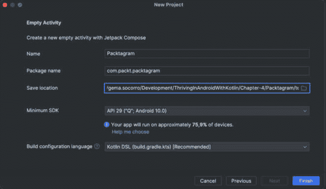
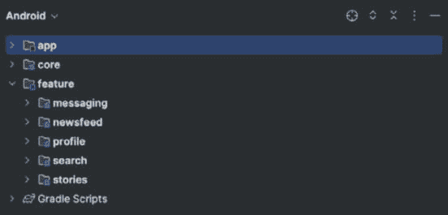
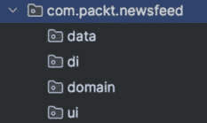
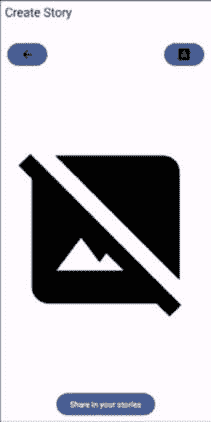
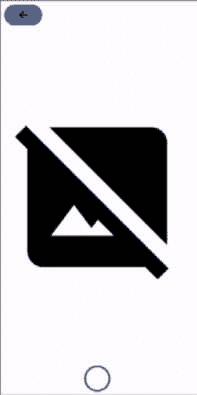

# 第四章：构建 Packtagram UI

随着我们告别令人兴奋的聊天应用世界，是时候接受另一个有趣的挑战——社交网络。在过去十年中，社交网络应用的人气呈指数级增长，成为我们日常生活的重要组成部分。这些平台改变了我们在全球范围内沟通、分享和相互互动的方式。其中，Instagram 以其简洁性、对视觉的重视以及其引人入胜的功能（如新闻源和故事）脱颖而出。

接下来的几章将致力于创建一个类似 Instagram 的社交网络应用的过程，同时利用 Android 强大的功能和特性。我们将称之为 Packtagram！

为了开始这段旅程，我们将从建立一个坚实的基础和构建我们的项目结构开始。Android 应用的结构对开发便利性和应用随时间扩展的伸缩性有重大影响。本章将涵盖项目结构方面的各个方面，例如定义文件层次结构、分离模块以及选择适合我们需求的正确架构模式。

一旦我们的项目结构稳健且可扩展，我们将过渡到 UI 开发的领域。以 Instagram 为例，吸引我们注意的主要组件是其新闻源和故事。我们将深入研究实现这些关键功能的过程，重点关注它们用户友好的界面和流畅的导航流程。

在 UI 之后，我们将转向任何动态应用的核心：数据检索。我们将学习如何与服务器交互以获取数据，重点关注新闻源。

在本章的最后部分，我们将探索数据缓存的领域。社交媒体应用通常涉及大量的数据传输，为了提供无缝且高效的用户体验，有效的数据管理策略，包括缓存，是必要的。我们将探讨如何本地存储故事和新闻条目，从而减少网络调用并提高应用性能。

本章将涵盖以下主题：

+   设置 Packtagram 的模块和依赖项

+   创建故事屏幕

+   创建新闻源屏幕及其组件

+   使用 Retrofit 和 Moshi 获取新闻源信息

+   在新闻源中实现分页

# 技术要求

如前一章所述，您需要安装 Android Studio（或您偏好的其他编辑器）。

在本章中，我们将开始一个新的项目，因此没有必要下载您在上一章中做出的更改。

尽管如此，您可以通过本书的 GitHub 仓库获取我们将在此章节中构建的完整代码：[`github.com/PacktPublishing/Thriving-in-Android-Development-using-Kotlin/tree/main/Chapter-4`](https://github.com/PacktPublishing/Thriving-in-Android-Development-using-Kotlin/tree/main/Chapter-4)。

# 设置 Packtagram 的模块和依赖项

为了设置我们的应用程序结构，我们将创建一个新的项目。我们可以通过遵循我们在*第一章*中介绍的同一条指令来完成这项工作，但在这里我们将引入一个变化：我们的 Gradle 文件将使用 Kotlin 编写，并且我们还将使用版本目录。

## 设置版本目录

**版本目录**是 Gradle 7.0 中引入的一个功能，用于在项目中集中声明依赖项。此功能提供了一种有组织的方式来管理依赖项，使得控制和管理项目不同模块中库的不同版本变得更加容易。

使用版本目录，你将在`libs.versions.toml`中定义所有依赖项及其版本。此文件位于你的项目 Gradle 文件夹中。

版本目录提供了几个好处：

+   它通过提供一个单一的地方来定义和更新依赖项，简化了依赖项管理。

+   它最小化了由于模块间依赖项版本差异引起的错误。

+   它通过将每个依赖项的声明集中在一个独特的文件中，消除了在构建脚本中单独声明每个依赖项的需求，从而提高了构建脚本的可读性。

要使用版本目录，在 Android Studio 中，填写新项目的详细信息，包括**名称** - 这里，我选择了**Packtagram**。对于**构建配置语言**字段，选择**Kotlin** **DSL (build.gradle.kts)**：



图 4.1：在 Android Studio Jellyfish (2023.3.1)中创建新项目

使用此选项，Android Studio 将自动创建一个文件来指定版本。此文件称为`libs.versions.toml`，其默认内容如下所示：

```java
[versions]
agp = "8.1.0-beta01"
org-jetbrains-kotlin-android = "1.8.10"
core-ktx = "1.9.0"
...
[libraries]
core-ktx = { group = "androidx.core", name = "core-ktx", version.ref = "core-ktx" }
junit = { group = "junit", name = "junit", version.ref = "junit" }
...
[plugins]
com-android-application = { id = "com.android.application", version.ref = "agp" }
org-jetbrains-kotlin-android = { id = "org.jetbrains.kotlin.android", version.ref = "org-jetbrains-kotlin-android" }
[bundles]
```

如以下代码（以及 Android Studio 在项目中生成的`libs.version.toml`文件）所示，该文件由几个部分组成：

+   **版本**：本节包含将在你的项目中使用的依赖项的版本。你只需为每个版本号分配一个引用名称。这对于集中版本管理非常有用，尤其是在多个地方使用同一版本的库时。

+   **库**：在这个块中，你通过为它们分配别名并将它们链接到**版本**块中定义的正确版本来定义你的实际依赖项。然后，你可以在整个项目中使用此别名来引用依赖项。

+   **捆绑包**：捆绑包是一组通常一起使用的依赖项。通过创建一个捆绑包，你可以在构建脚本中使用单个别名包含多个依赖项。这可以简化你的构建脚本，并使它们更容易阅读和管理。

+   **插件**: 本节定义了项目中使用的 Gradle 插件。类似于库，每个插件都会被赋予一个别名，并链接到 **versions** 块中的版本号。这个特性使得管理插件与其他依赖项一样简单。

现在，如果我们打开应用模块的 `gradle.build.kts` 文件，我们将看到版本目录声明是如何使用的。例如，在这里，我们可以看到插件是如何现在被应用的：

```java
plugins {
    alias(libs.plugins.com.android.application)
    alias(libs.plugins.org.jetbrains.kotlin.android)
}
```

这里使用的术语 `alias` 是指在 `libs.versions.toml` 文件中指定的预定义插件依赖项。

在这里，我们可以看到依赖项是如何声明的：

```java
dependencies {
    implementation(libs.core.ktx)
    implementation(libs.lifecycle.runtime.ktx)
    implementation(libs.activity.compose)
    implementation(platform(libs.compose.bom))
    implementation(libs.ui)
    implementation(libs.ui.graphics)
    implementation(libs.ui.tooling.preview)
    implementation(libs.material3)
    ...
}
```

如您所见，每个依赖项都通过我们在版本目录文件（`libs.versions.toml`）中给它们命名的名称来引用。现在同步和包含所有项目依赖项到模块中变得更加容易。

说到模块化，现在是时候使用模块化来结构化我们的应用了。我们已经在 *第一章* 中学习了如何模块化我们的应用的不同策略，所以这是一个复习该信息的好时机。

## 模块化我们的应用

在这种情况下，我们将 Packtagram 分割成几个功能模块，每个模块封装了不同的功能：

+   **新闻源模块**: 新闻源模块专注于主要源，是用户查看和与关注者发布的帖子互动的地方。我们将隔离这个功能，因为它是最核心的用户体验，可能是用户首先看到的屏幕。此模块将需要处理帖子的渲染、管理点赞和评论以及刷新源。

+   **故事模块**: 我们将故事功能分离到自己的模块中，因为它是一个独特的用户体验，需要特定的 UI 元素和数据处理。故事模块需要管理不同用户故事的渲染方式，跟踪视图状态，以及管理故事创建。

+   **个人资料模块**: 用户资料是 Instagram 体验的核心部分，因此我们将此功能放在个人资料模块中。此模块将处理显示用户信息、管理特定于用户的帖子以及编辑个人资料详情。

+   **搜索模块**: 搜索功能足够复杂，足以证明其作为一个模块的合理性。此模块将处理用户查询、显示搜索结果以及管理与搜索结果的交互。

+   **消息模块**: 直接消息是 Instagram 中的一个独立功能，因此我们也将它隔离到一个专门的模块中。此模块将管理创建和显示聊天、发送和接收消息以及新消息的通知。

+   **核心模块**: 此模块将包含共享工具、网络接口和其他在应用程序中使用的通用组件。这防止了代码重复，并为管理共享资源提供了一个中心点。

通过选择这种模块化策略，我们有效地将我们的应用程序分解为逻辑组件，这些组件可以独立地进行开发、测试和调试。这也很好地符合**关注点分离**的理念，确保我们的应用程序的每个部分都有一个清晰、单一的目的。在接下来的章节中，我们将详细探讨这些模块，逐一构建功能，最终完成我们的社交网络应用程序。

因此，让我们按照在*第一章*中提供的相同说明来创建模块。我们的模块结构将如下所示：



图 4.2：Packtagram 的模块结构

如我们所见，我们应该有一个名为`:app`的模块（在创建项目时已创建），一个名为`:core`的模块用于核心功能，以及一个名为`:feature`的模块，其中包含所有功能模块（`:messaging`、`:newsfeed`、`:profile`、`:search`和`:stories`）。

作为本项目的一部分，我们将重点关注`newsfeed`和`stories`模块（我们已经知道如何创建消息功能，因为这在过去的三个章节中已经涵盖，所以不需要再次介绍）。

对于功能模块，我们将使用与在 WhatsPackt 项目中遵循的相同方法内部构建它们：按层组织代码和依赖项。例如，我们可以这样构建`:newsfeed`模块：



图 4.3：功能模块的内部结构

在这里，我们可以看到我们已经创建了四个内部包：

+   **数据层**：这是我们放置数据层逻辑的地方，包括从后端和数据源获取信息的组件

+   **依赖注入指令**：这是我们放置定义依赖注入指令所需逻辑的地方

+   **领域层**：这是我们放置领域逻辑的地方，包括仓库和用例

+   **用户界面**：这是我们放置所有与用户界面相关的逻辑的地方，包括 ViewModels、composables 和其他 Android View 组件

我们将实现必要的组件，这些组件将构成本章节和以下章节中模块的一部分。

作为我们模块结构的一部分，我们包含了一个专门用于依赖注入的内部模块。在之前的 WhatsPackt 项目中，我们使用了 Dagger Hilt 框架进行依赖注入。然而，在这个项目中，我们将采取不同的方法，使用 Koin。

## 了解 Koin

Koin 在*第一章*中简要提到，但让我们在这里了解其主要特性：

+   **简单性**：它提供了一个简单的设置过程，并且易于学习

+   **效率**：它轻量级，因为它不依赖于反射

+   **以 Kotlin 为中心**：专门为 Kotlin 设计，它利用 Kotlin 特定的功能，如扩展函数、**领域特定语言**（**DSL**）和属性委托

+   **作用域管理**：它有明确的方式来管理注入实例的生命周期

+   **集成**：它提供了与流行框架（如 ViewModel、Coroutines 等）的无缝集成

+   **测试**：它包括允许依赖项被模拟或覆盖的工具，以简化测试

+   **DSL 配置**：Koin 使用更易读和简洁的配置形式

让我们为这个项目准备 Koin，这样我们就可以在接下来的章节中使用它。

## 设置 Koin

要开始设置 Koin，我们需要将必要的依赖项添加到我们的版本目录中。为此，您将必要的 Koin 依赖项添加到 `libs.versions.toml` 文件中。请确保使用 Koin 的最新版本，并将 `latest-version` 替换为实际版本号：

```java
[versions]
...
koin = "latest-version"
[libraries]
...
koin-core = { group = "io.insert-koin", name = "koin-core", version.ref = "koin" }
koin-android = { group = "io.insert-koin", name = "koin-android", version.ref = "koin" }
koin-androidx-navigation = { group = "io.insert-koin", name = "koin-androidx-navigation", version.ref = "koin" }
koin-androidx-compose = { group = "io.insert-koin", name = "koin-androidx-compose", version.ref = "koin" }
koin-test = { group = "io.insert-koin", name = "koin-test", version.ref = "koin" }
koin-test-junit4 = { group = "io.insert-koin", name = "koin-test-junit4", version.ref = "koin" }
```

如我们所见，我们在 `versions` 块中添加了 `koin` 版本，并在 `libraries` 块中添加了我们可能需要的包。

现在，我们需要将依赖项添加到我们的模块的 Gradle 文件中。为此，将以下行添加到依赖 Lambda：

```java
dependencies {
   …
    implementation(libs.koin.core)
    implementation(libs.koin.android)
    implementation(libs.koin.androidx.compose)
    implementation(libs.koin.androidx.navigation)
    ...
}
```

添加这些依赖项将允许我们在模块中使用 Koin。作为一个开始，您应该将它们添加到 `:app`、`:feature:newsfeed` 和 `:feature:stories` 模块中，这些是我们将在本章节和接下来的两个章节中要处理的模块。

接下来，我们需要创建我们的 `Application` 类。Koin 通常在您的 `Application` 类中初始化。由于我们还没有一个，我们将作为 `:app` 模块的一部分创建一个，并添加以下代码：

```java
class PacktagramApplication : Application() {
    override fun onCreate() {
        super.onCreate()
        startKoin {
            androidLogger()
            androidContext(this@PacktagramApplication)
            modules(appModule)
        }
    }
}
```

在 `startKoin` 块中，我们指定了我们要使用 Android 日志记录器（`androidLogger()`）。`androidLogger()` 函数是 Koin API 的一部分，并配置 Koin 使用 Android 的原生日志机制。本质上，它使 Koin 能够将日志打印到 Logcat。

当您使用 `androidLogger()` 初始化 Koin 时，您将能够在调试应用程序时在 Logcat 中看到有关 Koin 行为和操作的重要信息。这包括有关正在创建哪些依赖项、在创建依赖项过程中是否发生错误、作用域的生命周期等详细信息。

之后，我们将 Android 上下文（`androidContext(this@MyApplication)`）提供给框架，以防我们需要它来创建任何依赖项。

下一条是 `modules(appModule)`。这个函数是您列出包含项目依赖项和提供它们指令的地方。一开始，我们只有 `appModule`，我们可以这样创建它：

```java
import org.koin.dsl.module
val appModule = module {
...
}
```

在 `module` 块内部，一旦我们开始构建它们，我们应该定义我们的依赖项。以下是一个示例：

```java
val exampleModule = module {
    single { MyDataSource(get()) }
    single { MyRepository(get()) }
    factory { MyUseCase(get()) }
    viewModel { MyViewModel(get()) }
}
```

Koin 中的`module`函数用于定义一个模块，在该模块中，你指定如何创建你的各种依赖项。在模块内部，你可以使用`single`、`factory`和`viewModel`等函数来创建依赖项的实例。

下面是对这些函数的分解：

+   **single**: 这个函数创建指定类型的单例对象。一旦这个对象被创建，每次需要此类对象时都将提供相同的实例。例如，**single { MyDataSource(get()) }**定义了如何创建**MyDataSource**的单例实例。大括号内的**get()**函数是一个 Koin 函数，用于获取创建**MyDataSource**实例所需的任何依赖项。

+   **factory**: 当你希望在每次需要依赖项时创建一个新实例，而不是重用相同的实例时，使用此函数。例如，**factory { MyUseCase(get()) }**每次请求**MyUseCase**实例时都会创建一个新的**MyUseCase**对象。

+   **viewModel**: 这个函数用于创建**ViewModel**类的实例。它类似于**single**，但专门用于 Android 的**ViewModel**实例。所有**ViewModel**实例都与活动或片段的生命周期相关联，并且可以在配置更改（如屏幕旋转）中存活。例如，**viewModel { MyViewModel(get()) }**定义了如何创建**MyViewModel**的实例。

+   **bind**: 这个函数与**single**、**factory**或**scoped**一起使用，为这个类提供额外的接口。例如，如果**MyImplementation**类实现了**MyInterface**，你可以输入以下内容：

    ```java
    single { MyImplementation() } bind MyInterface::class
    ```

    你可以在定义中看到的`get()`函数是一个 Koin 函数，它自动获取所需的依赖项。例如，如果`MyDataSource`依赖于一个`MyApi`实例，那么`get()`将获取那个`MyApi`实例，前提是它已经在 Koin 模块中定义过。

返回到我们的项目，我们现在将`appModule`留空 - 一旦我们开始创建新的组件，我们就会完成它。

说到组件，让我们从我们需要显示故事屏幕的 UI 开始。

# 创建故事屏幕

在本节中，我们将专注于开发我们故事功能中创建和编辑新故事的功能。我们将从编写一个名为`StoryEditorScreen`的可组合组件及其相应的`ViewModel`开始，命名为`StoryEditorViewModel`。尽管这个`ViewModel`最初的功能有限，但我们在后续章节中会对其进行扩展。

让我们开始创建我们的`ViewModel`，如下所示：

```java
class StoryEditorViewModel: ViewModel() {
    private val _isEditing = MutableStateFlow(true)
    val isEditing: StateFlow<Boolean> = _isEditing
}
```

在前面的代码中，我们声明了`StoryEditorViewModel`并添加了一个属性，该属性将指示我们的屏幕是否处于编辑模式。编辑模式将在用户拍照或录制视频并想要添加更多组件时使用。

现在，我们需要注意这个 `ViewModel` 的依赖注入，因为它必须可以从我们即将创建的屏幕中访问。我们可以在 `:feature:story` 中创建 `storyModule` 以能够提供它，如下所示：

```java
val storyModule = module {
    viewModel<StoryEditorViewModel>()
}
```

在这里，我们只是告诉 Koin 它需要在需要的地方提供 `StoryEditorViewModel`。

我们还需要将这个新模块添加到 `PacktagramApplication` Koin 初始化中：

```java
class PacktagramApplication : Application() {
    override fun onCreate() {
        super.onCreate()
        startKoin {
            androidLogger()
            androidContext(this@PacktagramApplication)
            modules(appModule, storyModule)
        }
    }
}
```

在 `modules(appModule, storyModule)` 行中，我们包含了 `storyModule` 以提供我们在 stories 功能中需要的所有依赖项。

现在，我们准备好开始使用 Jetpack Compose 的魔法并创建 `StoryEditorScreen`。这个屏幕将 `viewModel` 作为依赖项，并处理 `TopAppBar` 和一个新的组合器 `StoryContent`，它将包含故事创建和编辑的主要功能。我们可以如下创建 `StoryEditorScreen`：

```java
@Preview
@OptIn(ExperimentalMaterial3Api::class)
@Composable
fun StoryEditorScreen(
    viewModel: StoryEditorViewModel = koinViewModel()
) {
    val isEditing = viewModel.isEditing.collectAsState()
    Column(modifier = Modifier.fillMaxSize()) {
        if (isEditing.value) {
            TopAppBar(title = { Text(text = "Create Story") })
        }
        StoryContent(isEditing.value)
    }
}
```

如我们所见，`StoryEditorScreen` 组合器接收 `StoryEditorViewModel` 作为参数，它为这个屏幕提供数据和功能。这个 `ViewModel` 由 Koin 通过 `koinViewModel` 函数提供。

接下来，`isEditing` 是从 `ViewModel` 的 `isEditing` 状态流中派生出来的状态。这个状态将表示用户是否正在编辑故事。`collectAsState()` 函数从状态流中收集最新的值并将其表示为 Compose 中的状态。每当 `isEditing` 状态流发出新的值时，UI 将重新组合以反映新的状态。

在 `StoryEditorScreen` 内部，有一个 `Column` 组合器占据了屏幕的最大尺寸。`Column` 组合器允许我们垂直排列其子元素。在这个 `Column` 中，有一个检查 `isEditing` 状态的条件。如果 `isEditing` 为真，将显示 `TopAppBar`，这是一个表示 Material Design App Bar 的组合器，通常放置在屏幕顶部 – 这个 App Bar 只会在用户处于编辑状态时显示。

`StoryContent` 组合器随后被包含在 `Column` 中，位于 `isEditing` 条件之外。这意味着无论用户是否处于编辑模式，`StoryContent` 总是会显示。`isEditing` 状态被传递给 `StoryContent` 以告知其当前的编辑状态。现在让我们来处理这个组合器。

这个组合器应该有一个背景，这将是用戶想要包含在故事中的图片或视频，并将占据屏幕上的所有空间。通过这样做，屏幕上的选项将根据我们是在捕获媒体还是编辑媒体而有所不同。以下是这个组合器的代码：

```java
@Composable
fun StoryContent(
    isEditing: Boolean = false,
    modifier: Modifier = Modifier
) {
    Box(modifier = Modifier.fillMaxSize().padding(20.dp)) {
        Box(
            modifier = Modifier
                .fillMaxWidth()
                .wrapContentHeight()
        ) {
            Button(
                onClick = { /*Handle back*/},
                modifier =
                    Modifier.align(Alignment.TopStart)
            ) {
                Image(
                    painter = painterResource(id =
                        R.drawable.ic_arrow_back),
                    contentDescription = "Back button")
            }
            if (isEditing) {
                Button(
                    onClick =
                        { /* Handle create caption */ },
                    modifier =
                        Modifier.align(Alignment.TopEnd)
                ) {
                    Image(
                        painter = painterResource(id =
                            R.drawable.ic_caption),
                        contentDescription = "Create label"
                    )
                }
            }
    }
        Image(
            painter = painterResource(id =
                R.drawable.ic_default_image),
            modifier = Modifier.fillMaxSize(),
            contentDescription = "Default image"
        )
        Row(
            modifier = Modifier
                .wrapContentHeight()
                .align(Alignment.BottomCenter)
        ) {
            if (isEditing) {
                Button(
                    onClick =
                        { /* Handle create caption */ }
                ) {
                    Text(stringResource(id =
                        R.string.share_story))
                }
            } else {
                OutlinedButton(
                    onClick =
                        { /* Handle take a photo */ },
                    modifier= Modifier.size(50.dp),
                    shape = CircleShape,
                    border= BorderStroke(4.dp,
                        MaterialTheme.colorScheme.primary),
                    contentPadding = PaddingValues(0.dp),
                    colors =
                       ButtonDefaults.outlinedButtonColors(
                       contentColor =
                       MaterialTheme.colorScheme.primary)
                ) {
                }
            }
        }
    }
}
```

让我们分解这段代码：

+   最外层的 **Box** 是主要容器，它占据其父容器的最大尺寸并添加了 **20.dp** 的填充。

+   **Box** 的第一个子元素是另一个设置为占据完整宽度和包裹内容高度的 **Box**。

+   在此**Box**内部，有一个对齐到其父**Box**顶部左角的**按钮**组件。此按钮用于处理后退导航操作。在此按钮内部是一个带有箭头图标的**Image**组件。

注意

术语“开始”和“结束”用于布局定位，以确保更好地支持**从左到右**（LTR）和**从右到左**（RTL）的语言。当你在布局中使用“开始”和“结束”属性时，Android 会根据当前区域的文本方向自动调整方向。在 LTR 语言，如英语中，“开始”映射到“左”，“结束”映射到“右”，而在 RTL 语言，如阿拉伯语中，“开始”映射到“右”，“结束”映射到“左”。这种方法简化了为多种语言和文本方向本地化应用程序的过程。

+   如果**isEditing**标志为真，则会在**Box**中添加一个额外的**按钮**。此按钮与父**Box**的顶部端点（在 LTR 布局中为右侧）对齐，允许用户为他们的故事创建标题。按钮使用标题图标的图像来传达其功能。

+   最外层**Box**的下一个子元素是**Image**，它显示默认图像。此**Image**占据**Box**的最大尺寸，这意味着此图像将是此屏幕的主要焦点。

+   最外层**Box**的最后一个子元素是一个对齐到**Box**底部中心的**Row**。此**Row**包含两个不同的按钮，这些按钮根据**isEditing**标志有条件地显示。

+   如果**isEditing**为假，则显示**OutlinedButton**。此按钮设计得像一个带边框的圆形按钮，允许用户拍照。请注意，拍照的实际实现不包括在提供的代码中，应在**onClick**函数中处理。

+   如果**isEditing**为真，则会出现一个**按钮**组件。此按钮标记为**分享故事**，旨在允许用户分享创建的故事。如您所见，它正在使用**stringResource**，其键为**R.string.share_story**，因此我们应该将其添加到**string.xml**。同样，分享功能的实际实现应在**onClick**函数中处理。

使用前面的代码，当屏幕处于编辑模式时，它应该看起来像这样：



图 4.4：编辑模式下的故事屏幕

否则，当它不在编辑模式时，它将看起来像这样：



图 4.5：非编辑模式下的故事屏幕

如我们所见，从视图中有条件地添加或删除可组合项既简单又直观。

有了这些，我们就完成了故事屏幕，直到我们在下一章中添加更多功能来捕捉照片和视频。让我们继续处理新闻源用户界面。

# 创建新闻源屏幕及其组件

新闻源是 Packtagram 应用程序的主屏幕，用户将在这里看到他们朋友的最新帖子。它使用多个组件进行结构化：

+   **标题栏**：这是用户可以访问消息功能的地方

+   **帖子列表**：我们应用中显示的帖子列表

+   **底部栏**：用于在应用中导航到不同的部分

我们将开始通过创建 `MainScreen` 组合组件来构建我们的新闻源屏幕。在这里，我们将定义 Packtagram 应用程序主视图的用户界面。

这个 `MainScreen` 组合组件将有一个 `Scaffold` 组合组件作为其主要组件。在这里，我们将定义标题栏和底部栏，以及不同的导航选项：

```java
@Composable
fun MainScreen(
    modifier: Modifier = Modifier,
){
    val tabs = generateTabs()
    val selectedIndex = remember { mutableStateOf(0) }
    val pagerState = rememberPagerState(initialPage = 0)
```

在这里，我们开始使用组合声明和我们需要处理 `bottomBar` 导航中将要使用的选项的属性。

现在，是时候添加 `Scaffold` 组合组件了。这是我们添加 `title` 和 `bottomBar` 的地方。让我们从 `title` 开始：

```java
    Scaffold(
        topBar = {
            TopAppBar(
                title = {
                    Text(stringResource(R.string.app_name))
                },
                actions = {
                    IconButton(onClick =
                    { /* Menu action */ }) {
                        Icon(Icons.Rounded.Send,
                        contentDescription = "Messages")
                    }
                }
            )
        },
```

通过这样，我们已经创建了 `Scaffold` 组合组件并添加了 `TopAppBar`。我们在 *第一章* 中使用了它，但重要的是要记住，容器通常用于包含屏幕的标题以及与屏幕上下文相关的任何操作。在这里，`TopAppBar` 接收两个重要的 Lambda：

+   **标题**：这是定义应用栏标题的地方。在这种情况下，它显示一个 **Text** 组合组件，该组件获取字符串资源——即应用名称（Packtagram）。

+   **操作**：这是定义将出现在应用栏右侧的操作的地方。操作通常用图标表示，并用于执行与当前屏幕相关的功能。在这种情况下，有一个带有信封图标的单个 **IconButton**（点击时将用户导航到消息屏幕）。

下一步是添加 `BottomBar`：

```java
        bottomBar = {
            TabRow(selectedTabIndex = selectedIndex.value)
            {
                tabs.forEachIndexed { index, _ ->
                    Tab(
                        icon = { Icon(tabs[index].icon,
                            contentDescription = null) },
                        selected = index ==
                            selectedIndex.value,
                        onClick = {
                            selectedIndex.value = index
                        }
                    )
                }
            }
        },
```

在这里，`BottomBar` 通常放置应用的导航控件。在本例中，使用的是 `TabRow`，它是一个 `Tab` 组合组件的容器。`TabRow` 的主要 Lambda 用于生成 `Tab` 元素。它遍历 tabs 中的每个 `TabItem`（这是由 `generateTabs()` 生成的 `TabItem` 对象列表），并为每个对象创建一个 `Tab` 元素。`Tab` 元素会提供一个来自 `TabItem` 的图标，无论它是否被选中（基于其索引是否与 `selectedIndex.value` 匹配），以及一个 `onClick` 函数，该函数将 `selectedIndex.value` 设置为点击的 `Tab` 的索引。

现在，我们需要向 `Scaffold` 组合组件添加内容：

```java
        content = { innerPadding ->
            HorizontalPager(
                modifier = Modifier.padding(innerPadding),
                pageCount = tabs.size,
                state = pagerState
            ) { index ->
                when (index) {
                    0 -> {
                        NewsFeed()
                    }
                    1 -> {
                        //Search
                    }
                    2-> {
                        // New publication
                    }
                    3-> {
                        // Reels
                    }
                    4-> {
                        // Profile
                    }
                }
            }
            LaunchedEffect(selectedIndex.value) {
                pagerState.animateScrollToPage(
                selectedIndex.value)
            }
        },
    )
}
```

`content` 部分是放置应用主要内容的地方。在这种情况下，内容是一个 `HorizontalPager` 组合组件，其页面与底部栏中的标签相对应。

`HorizontalPager` 中的主要 Lambda 用于生成每一页。页面的内容由提供给 Lambda 的索引决定：当 `index` 为 `0` 时，显示 `NewsFeed()`，并为其他导航选项留下占位符。

在 `content` 部分内部还有一个 Lambda：`LaunchedEffect` 块。这本质上是一个副作用，当 `selectedIndex.value` 发生变化时执行。在这种情况下，它触发一个动画，将 `HorizontalPager` 滚动到与选定索引对应的页面。

现在 `MainScreen` 已经准备好了，我们可以着手处理 `NewsFeed` 列表。

## 创建 NewsFeed 列表

首先，我们需要创建我们将在 `NewsFeed` 组合器中使用的 `ViewModel` 类。我们将称之为 `NewsFeedViewModel` 并添加以下代码：

```java
class NewsFeedViewModel : ViewModel() {
    private val _posts =
        MutableStateFlow<List<Post>>(emptyList())
    val posts: StateFlow<List<Post>> get() = _posts
}
```

这里，我们正在初始化 `NewsFeedViewModel`。目前，我们只有一个公共属性。我们将使用它来收集信息，以便在用户界面中渲染帖子。

现在，是时候处理这个 `NewsFeedViewModel` 的依赖注入了。我们为每个应用模块创建一个依赖注入模块。所以在这种情况下，因为我们正在处理新闻源模块，我们将创建一个新的依赖注入模块来提供 `NewsFeedViewModel`：

```java
val newsFeedModule = module {
    viewModel<NewsFeedViewModel>()
}
```

然后，我们将将其添加到 `PacktagramApplication` 中的模块列表中：

```java
class PacktagramApplication : Application() {
    override fun onCreate() {
        super.onCreate()
        startKoin {
...
            modules(
                appModule,
                storyModule,
                newsFeedModule
            )
        }
    }
}
```

在这里，我们已将 `newsFeedModule` 添加到 `PacktagramApplication` 中现有的模块列表中。

现在，我们需要创建 `NewsFeed` 组合器，它将包括帖子列表：

```java
@Composable
fun NewsFeed(
    modifier: Modifier = Modifier,
    viewModel: NewsFeedViewModel = koinViewModel()
) {
    LazyColumn{
        itemsIndexed(viewModel.posts){ _, post ->
            PostItem(post = post)
        }
    }
}
```

这里，我们可以使用 `LazyColumn` 来渲染帖子列表。正如我们所看到的，我们需要一个 `PostItem` 组合器来绘制每个列表项。我们将在下一节中构建它。

## 创建 PostItem 组合器

我们的 `PostItem` 组合器将包括渲染帖子所需的所有组件。我们需要以下内容：

+   带有作者图片和名字的标题栏

+   媒体内容（最初是一张图片，但这也可能是视频）

+   带有多个操作（如点赞、分享等）的操作栏

+   显示点赞数量的标签

+   作者撰写的标题

+   帖子发布的时间戳

根据那些要求，我们的 `PostItem` 组合器将看起来像这样：

```java
@Composable
fun PostItem(
    post: Post
){
    Column{
        Spacer(modifier = Modifier.height(2.dp))
        TitleBar(post = post)
        MediaContent(post = post)
        ActionsBar()
        LikesCount(post = post)
        Caption(post = post)
        Spacer(modifier = Modifier.height(2.dp))
        CommentsCount(post = post)
        Spacer(modifier = Modifier.height(4.dp))
        TimeStamp(post = post)
        Spacer(modifier = Modifier.height(10.dp))
    }
}
```

如您所见，它非常易于阅读，几乎是自我解释的。我们将创建一个 `Column` 组合器，并将我们需要的每个组合器垂直放置，根据需要留出一些空间。

现在，让我们创建我们需要的组合器。我们将按顺序开始，首先是 `TitleBar`：

```java
@Composable
fun TitleBar(
    modifier: Modifier = Modifier,
    post: Post
){
    Row(
        modifier = modifier
            .fillMaxWidth()
            .height(56.dp)
        ,
        verticalAlignment = Alignment.CenterVertically
    ) {
        Spacer(modifier = modifier.width(5.dp))
        Image(
            modifier = modifier
                .size(40.dp)
                .weight(1f),
            painter = painterResource(id =
                post.user.image),
            contentDescription =
                "User ${post.user.name} avatar"
        )
        Text(
            text = post.user.name,
            modifier = modifier
                .weight(8f)
                .padding(start = 10.dp),
            fontWeight = FontWeight.Bold
        )
        IconButton(onClick = { /* Menu options */}) {
            Icon(
                Icons.Outlined.MoreVert,
                "More options"
            )
        }
    }
}
```

这个组合器的基是一个 `Row` 组合器，因为它将子项按水平顺序排列。`verticalAlignment` 参数设置为 `Alignment.CenterVertically`，以使行中的项目垂直居中。

这里是对所使用的子组合器的描述：

+   **间隔符**：这用于在界面上提供一些空间。在这里，它为行的开始提供了 **5.dp** 的宽度。

+   **图像**：这是一个用于显示用户个人资料的图像可组合项。图像来源是从传入的**Post**对象中获取的。

+   **文本**：这显示用户的姓名，并从传入的**Post**对象中获取姓名。**fontWeight**参数设置为**FontWeight.Bold**，使文本加粗。

+   **IconButton**：这是一个带有图标的按钮。**onClick**参数是一个 Lambda 函数，当按钮被点击时会被调用。在这种情况下，该函数为空，但这是你放置处理按钮点击代码的地方。内部的**Icon**元素用于显示**更多选项**图标。

现在`TitleBar`已经准备好了，是时候考虑`MediaContent`可组合项了，它将显示用户发布的内 容：

```java
@Composable
fun MediaContent (
    modifier: Modifier = Modifier,
    post: Post
){
    Box(
        modifier = modifier
            .fillMaxWidth()
            .height(300.dp),
        contentAlignment = Alignment.Center,
        ) {
        Image(
            modifier = Modifier
                .fillMaxSize(),
            painter = rememberImagePainter(post.image),
            contentDescription = null
        )
    }
}
```

上述代码生成一个包含图像的框，因为此可组合项用于显示帖子的主要图像内容。这些是主要组件：

+   **Box**：这是一个布局可组合项，堆叠其子元素。在这种情况下，它用于容纳一个**Image**组件。**contentAlignment**参数设置为**Alignment.Center**，以在框中居中图像，并对其应用了一个修改器，以填充最大宽度并设置高度为**300.dp**。

+   **图像**：这是一个用于显示图像的**Image**可组合项。图像来源是从传入的**Post**对象中获取的。修改器用于确保图像填充**Box**可组合项的最大尺寸。在这里，**rememberImagePainter**用于从源（如 URL 或本地文件）加载和显示图像，并且它在重组之间被记住。

现在我们已经完成了`MediaContent`可组合项，我们将考虑`ActionBar`，它将提供渲染操作按钮的指令：

```java
@Composable
fun ActionsBar(
    modifier: Modifier = Modifier,
){
    Column(
        modifier = modifier
            .fillMaxWidth()
            .height(40.dp),
        horizontalAlignment = Alignment.CenterHorizontally,
    ) {
        Row(
            modifier = modifier
                .fillMaxSize()
        ) {
            Row(
                modifier = modifier
                    .fillMaxHeight()
                    .weight(1f)
                ,
                verticalAlignment =
                    Alignment.CenterVertically,
            ) {
                IconButton(onClick = { }) {
                    Icon(
                        imageVector =
                            Icons.Outlined.Favorite,
                        contentDescription = "like",
                        modifier = modifier
                    )
                }
                IconButton(onClick = { }) {
                    Icon(
                        imageVector = Icons.Outlined.Edit,
                        contentDescription = "comment",
                        modifier = modifier
                    )
                }
                IconButton(onClick = { }) {
                    Icon(
                        imageVector = Icons.Outlined.Share,
                        contentDescription = "share",
                        modifier = modifier
                    )
                }
                Row(
                    modifier = modifier
                        .fillMaxHeight()
                        .weight(1f)
                ) {
                }
                Row(
                    modifier = modifier
                        .fillMaxHeight()
                        .weight(1f),
                    verticalAlignment =
                        Alignment.CenterVertically,
                    horizontalArrangement = Arrangement.End
                ) {
                    IconButton(onClick = { }) {
                        Icon(
                            imageVector =
                                Icons.Outlined.Star,
                            contentDescription =
                                "bookmark",
                            )
                    }
                }
            }
        }
    }
}
```

上述代码生成一个 UI，表示帖子下的操作按钮，类似于 Instagram 上的那些，你可以点赞、评论、分享和收藏帖子。以下是函数每个部分的作用：

+   **列**：这创建了一个列，可以在其中垂直放置其他 UI 元素。**horizontalAlignment**参数设置为**Alignment.CenterHorizontally**，这将在列中水平居中元素。

+   **行**：这创建了一个行，其中可以水平放置其他 UI 元素。它填充了父元素的**最大尺寸**，即**列**。

+   前三组**IconButton**可组合项位于一个**Row**可组合项中，用于**点赞**、**评论**和**分享**操作。每个**IconButton**都接受一个 Lambda 用于**onClick**事件，目前这个函数不做任何事情。

+   然后还有两个额外的**Row**可组合项，两者都带有**fillMaxHeight().weight(1f)**，看起来像是占位符，可能是为了将来添加额外的图标。

+   最终的 **Row** 组合器包含一个用于 **Bookmark** 操作的 **IconButton** 组合器。它将 **verticalAlignment** 设置为 **Alignment.CenterVertically**，将 **horizontalArrangement** 设置为 **Arrangement.End** 以在垂直方向上居中图标，并在水平方向上位于可用空间的末尾（在 LTR 布局中为右侧）。

+   **图标**: 每个 **图标** 显示一个图像，并具有一个用于无障碍目的的 **contentDescription** 组合。可以使用 **modifier** 参数来调整图标的布局或其他视觉属性。

在配置了 `ActionsBar` 组合器以提供具有一系列交互按钮的灵活 UI 布局后，我们的下一个重点是点赞数。实现起来非常简单：

```java
@Composable
fun LikesCount(
    modifier: Modifier = Modifier,
    post: Post
){
    Row(
        modifier = modifier
            .fillMaxWidth()
            .height(30.dp)
            .padding(horizontal = 10.dp)
        ,
        verticalAlignment = Alignment.CenterVertically
    ) {
        Text(
            text = post.likesCount.toString().plus(
                «likes"),
            fontWeight = FontWeight.Bold,
            fontSize = 16.sp
        )
    }
}
```

`LikesCount` 函数是一个 `Composable` 函数，用于创建一个行来显示帖子收到的点赞数。以下是函数的每个部分所做的工作：

+   **行**: 这创建了一个行，可以在其中水平放置其他 UI 元素。它使用提供的修饰符来填充父容器的最大宽度，将其高度设置为 **30.dp** 并在水平方向上添加 **10.dp** 的填充。**verticalAlignment** 参数设置为 **Alignment.CenterVertically**，这将在行中垂直居中元素。

+   **文本**: 这创建了一个显示帖子的点赞数的文本元素。它从 **Post** 对象中获取 **likesCount** 字段，将其转换为字符串，并在末尾添加单词 **likes**。它还设置了字体粗细为粗体，字体大小为 **16.sp**。

下一个组合器是标题，这是用户添加到帖子的文本：

```java
@Composable
fun Caption(
    modifier: Modifier = Modifier,
    post: Post
){
    Row(
        modifier = modifier
            .fillMaxWidth()
            .wrapContentHeight()
            .padding(horizontal = 10.dp)
        ,
        verticalAlignment = Alignment.CenterVertically
    ) {
        Text(
            text = buildAnnotatedString {
                val boldStyle = SpanStyle(
                    fontWeight = Bold,
                    fontSize = 14.sp
                )
                val normalStyle = SpanStyle(
                    fontWeight = FontWeight.Normal,
                    fontSize = 14.sp
                )
                pushStyle(boldStyle)
                append(post.user.name)
                append(" ")
                if (post.caption.isNotEmpty()){
                    pushStyle(normalStyle)
                    append(post.caption)
                }
            }
        )
    }
}
```

这里是函数每个部分所做的工作：

+   **行**: 这创建了一个行，可以在其中水平放置其他 UI 元素。它使用提供的修饰符来填充父容器的最大宽度，将其高度包裹为其内容，并在水平方向上添加 **10.dp** 的填充。**verticalAlignment** 参数设置为 **Alignment.CenterVertically**，这将在行中垂直居中元素。

+   **文本**: 这创建了一个显示帖子的标题的文本元素，标题前有用户名。使用 **buildAnnotatedString** 函数构建具有不同文本样式的字符串。多亏了这一点，用户名以粗体字体样式呈现，而标题则以正常字体样式呈现。

在完成 `Caption` 组合器后，让我们来处理 `CommentsCount` 组合器：

```java
@Composable
fun CommentsCount(
    modifier: Modifier = Modifier,
    post: Post
) {
    Row(
        modifier = modifier
            .fillMaxWidth()
            .wrapContentHeight()
            .padding(horizontal = 10.dp),
        verticalAlignment = Alignment.CenterVertically
    ) {
        Text(
            text = stringResource(R.string.comment_count,
                post.commentsCount),
            fontWeight = FontWeight.Normal,
            fontSize = 14.sp
        )
    }
}
```

`CommentsCount` 组合器创建了一个布局来显示帖子的评论数。以下是函数的每个部分所做的工作：

+   **行（Row）**：这将在其中放置其他 UI 元素的行中创建一个行。它使用提供的修饰符来填充父容器最大宽度，将其高度包裹到内容中，并在水平方向上添加**10.dp**的内边距。**verticalAlignment**参数设置为**Alignment.CenterVertically**，使行中的元素垂直居中。

+   **文本（Text）**：这创建了一个显示评论数量的文本元素。使用**stringResource**函数获取字符串资源，这是一个格式字符串，它接受一个数字并将其插入到正确的位置，形成一个表示“阅读 3 条评论”的字符串。然后，该字符串格式用**Post**对象中的评论数量填充。

现在我们已经完成了`CommentsCount`可组合组件的实现，我们将创建`TimeStamp`可组合组件：

```java
fun TimeStamp(
    modifier: Modifier = Modifier,
    post: Post
) {
    Row(
        modifier = modifier
            .fillMaxWidth()
            .wrapContentHeight()
            .padding(horizontal = 10.dp),
        verticalAlignment = Alignment.CenterVertically
    ) {
        Text(
            text = "${post.timeStamp} hours ago ",
            fontSize = 10.sp,
            fontWeight = FontWeight.Light
        )
    }
}
```

`TimeStamp`函数是一个创建用于显示帖子时间戳的布局的可组合组件。以下是函数的每个部分所做的工作：

+   **行（Row）**：这将在其中放置其他 UI 元素的行中创建一个行。它使用提供的**Modifier**值来填充父容器最大宽度，将其高度包裹到内容中，并在水平方向上添加**10.dp**的内边距。**verticalAlignment**参数设置为**Alignment.CenterVertically**，使行中的元素垂直居中。

+   **文本（Text）**：这创建了一个显示时间戳的文本元素。此函数的**text**参数设置为包含**Post**对象中的**timeStamp**属性的字符串。**fontSize**和**fontWeight**参数分别设置字体大小为**10.sp**和**FontWeight.Light**。

使用这个可组合组件，我们已经完成了`Post`可组合组件。如果我们用假数据预览，我们会看到以下屏幕：


图 4.6：新闻源屏幕

现在，是时候实现一种从后端获取所需信息的方法了。

# 使用 Retrofit 和 Moshi 检索新闻源信息

在本节中，我们将准备我们的应用程序，使其能够从后端检索新闻源信息。为此，我们需要创建一个处理对后端服务调用请求的 HTTP 客户端。由于我们在第一个项目中使用了`ktor`，我们将对此采取不同的方法，并使用**Retrofit**。

Retrofit 是一个适用于 Android 和 Java（与 Kotlin 完全兼容）的类型安全 HTTP 客户端。Retrofit 通过将 API 转换为 Kotlin 或 Java 接口，使连接到 REST Web 服务变得简单。以下是它的一些主要功能：

+   **易于使用**：Retrofit 将您的 HTTP API 转换为 Kotlin 或 Java 接口。您只需使用注解定义 API 的 URL 和方法（**GET**、**POST**等）。Retrofit 将自动将 HTTP 响应转换为数据对象。

+   **类型转换**：默认情况下，Retrofit 只能将 HTTP 体反序列化为 OkHttp 的**ResponseBody**类型，并且它只能接受**@Body**的**RequestBody**类型。可以通过添加转换器来支持其他类型。例如，可以使用 JSON 转换器自动将 API 的响应转换为 Kotlin 或 Java 对象。

+   **HTTP 方法注解**：你可以使用注解来描述 HTTP 方法，如**GET**、**POST**、**DELETE**、**UPDATE**等。你还可以使用其他注解，如**Headers**、**Body**、**Field**、**Path**等，使你的请求完全符合需求。

+   **URL 参数替换和查询参数支持**：使用注解向请求添加参数。例如，你可以通过在 URL 中设置特定值来添加路径参数，或者你可以在 URL 末尾添加查询参数。

+   **同步和异步调用**：Retrofit 支持同步（阻塞）调用和异步（非阻塞）调用。对于 Android，异步调用更为重要，因为不建议在主线程上进行网络操作。

+   **协程和 RxJava 支持**：Retrofit 提供了开箱即用的协程和 RxJava 支持。这使得与这些流行的库处理异步操作变得容易。

+   **拦截器**：Retrofit 还允许你使用 OkHttp 的拦截器。你可以为每个请求添加头信息，或者为了调试目的记录请求和响应数据。

我们还需要使用转换器将后端响应解析为对象。我们将使用**Moshi**（[`github.com/square/moshi`](https://github.com/square/moshi)）来完成这项工作。Moshi 是一个现代的 Android 和 Java JSON 库，也是由 Square 构建的。它旨在易于使用且高效，其设计灵感来源于备受推崇的 Gson 库，但它在几个设计方面寻求改进。以下是其主要功能：

+   **易于使用**：Moshi 提供了简单的**toJson()**和**fromJson()**方法，用于将 Java 和 Kotlin 对象转换为 JSON 以及反向转换。

+   **内置和自定义转换器**：Moshi 内置了对许多常见类型的转换支持，并能编码这些类型的任何对象图。对于其他类，你可以编写自定义转换器，称为**适配器**，来定义这些类型如何转换为 JSON 以及从 JSON 转换回来。

+   **Kotlin 支持**：Moshi 支持 Kotlin，并提供**moshi-kotlin-codegen**模块，该模块利用注解处理自动生成 Kotlin 类的适配器。

+   **空值安全**：Moshi 处理 JSON 输入中的**null**值，并且可以配置为允许或禁止 Java 或 Kotlin 对象中的**null**值。

+   **基于注解**：与 Retrofit 类似，Moshi 使用注解来表示某些字段的特殊行为（例如，自定义名称和瞬态值）。

+   **容错性**: Moshi 具有容错性，当它在 JSON 数据中遇到未知属性或不兼容类型时，不会使整个操作失败。当处理可能偶尔改变的 API 时，这可能是有益的。

+   **高效**: Moshi 被设计为在操作中高效，最小化对象分配和垃圾回收开销。

既然我们知道了使用 Retrofit 与 Moshi 的优势，让我们开始将它们集成到我们的项目中。

## 添加 Retrofit 和 Moshi 依赖

要使用 Retrofit 和 Moshi 库，我们需要配置它们的依赖项。首先，我们将它们添加到版本目录文件中：

```java
[versions]
...
retrofit = "2.9.0"
moshi = "1.12.0"
coroutines = "1.5.1"
moshi-converter = "0.8.0"
...
[libraries]
...
retrofit = { group = "com.squareup.retrofit2", name = "retrofit", version.ref="retrofit"}
retrofitMoshiConverter = { group = "com.squareup.retrofit2", name = "converter-moshi", version.ref="retrofit"}
moshi = { group = "com.squareup.moshi", name = "moshi", version.ref = "moshi" }
moshiKotlin = { group = "com.squareup.moshi", name = "moshi-kotlin", version.ref = "moshi" }
moshiKotlinCodegen = { group = "com.squareup.moshi", name = "moshi-kotlin-codegen", version.ref = "moshi" }
moshiKotlinCodegen = { group = "com.squareup.retrofit2", name = "retrofit-kotlinx-serialization-converter", version.ref = "moshi-converter" }
coroutinesCore = {  group = "org.jetbrains.kotlinx", name = "kotlinx-coroutines-core", version.ref = "coroutines" }
coroutinesAndroid = {  group = "org.jetbrains.kotlinx", name = "kotlinx-coroutines-android", version.ref = "coroutines" }
[plugins]
...
kotlin-kapt = { id = "org.jetbrains.kotlin.kapt", version.ref = "org-jetbrains-kotlin-android" }
```

然后，我们将这些依赖项包含在我们的模块的 `build.gradle.kts` 文件中，使它们在我们的模块中可用：

```java
dependencies {
    implementation(libs.retrofit)
    implementation(libs.retrofitMoshiConverter)
    implementation(libs.moshiConverter)
    implementation(libs.moshi)
    implementation(libs.moshiKotlin)
    kapt(libs.moshiKotlinCodegen)
    implementation(libs.coroutinesCore)
    implementation(libs.coroutinesAndroid)
...
}
```

添加这些依赖项后，我们应该准备好使用这两个库。让我们开始创建我们的数据源，以便我们可以获取新闻源的数据。

## 创建新闻源的数据源

在这一点上，我们准备创建我们的数据源。我们将在 `:feature:newsfeed` 模块中完成这项工作。首先，我们需要创建一个接口来定义我们的 API 端点，使用 Retrofit。我们可以使用 `@GET`、`@POST` 等来定义我们想要进行的 HTTP 请求类型：

```java
interface NewsFeedService {
    @GET("feed")
    suspend fun getNewsFeed(): List<PostApiData>
}
```

这是一个用于将 HTTP API 转换为 Kotlin 接口的 Retrofit 库的接口。它还定义了您的 API 的端点：

+   **接口 NewsFeedService**: 这是在声明一个名为 **NewsFeedService** 的新接口。

+   **@GET("feed")**: 这是一个描述 HTTP GET 请求的注解。参数 **"feed"** 是请求将被发送的端点。因此，这个请求的完整 URL 将类似于 [`packtagram.com/feed`](https://packtagram.com/feed)，如果您的 Retrofit 客户端的基本 URL 是 [`packtagram.com/`](https://packtagram.com/)。

+   **挂起函数 getNewsFeed(): List<PostApiData>**: 这是在声明一个名为 **getNewsFeed** 的函数，它预期返回一个 **Post** 对象的列表。关键字 **suspend** 表示这个函数是一个挂起函数，这是一种可以在稍后暂停和恢复的函数类型。这将在稍后从协程中调用。

因此，总的来说，当调用 `getFeed` 时，它将向 [`packtagram.com/feed`](https://packtagram.com/feed) URL 发送 `GET` 请求，并期望接收一个 `PostApiData` 对象的 JSON 数组，然后这些对象在您的 Kotlin 代码中被解析成 `Post` 对象的列表。

要查看包含预期字段的 JSON 文件的示例，请查看 [`api.mockfly.dev/mocks/09e4e43e-7992-4dd7-b99f-e168667a240e/feed`](https://api.mockfly.dev/mocks/09e4e43e-7992-4dd7-b99f-e168667a240e/feed)。

现在，我们需要从这个接口生成一个客户端。为此，我们将使用 Retrofit 构建器：

```java
object RetrofitInstance {
    private const val BASE_URL = "https://packtagram.com/"
    fun getNewsFeedApi(): NewsFeedService = run {
        Retrofit.Builder()
            .baseUrl(BASE_URL)
            .addConverterFactory(
                MoshiConverterFactory.create())
            .build()
            .create(NewsFeedService::class.java)
    }
}
```

在这里，我们正在创建一个名为 `getNewsFeedApi()` 的函数，该函数将构建 `NewsFeedService` 客户端。为此，我们需要一个 `BASE_URL` 函数，我们可以将其硬编码在此文件中。建议将此信息存储在配置文件中，这样我们就可以轻松地更改它，例如，如果我们需要不同 `buildTypes` 的应用程序。

我们还在使用 `.addConverterFactory` **(MoshiConverterFactory.create())** 函数添加 Moshi 转换器。这将允许 Retrofit 使用 Moshi 反序列化后端响应。

现在，我们需要创建 `NewsFeedRemoteDataSource`：

```java
class NewsFeedRemoteDataSource(private val api:
NewsFeedService) {
    suspend fun getNewsFeed(): List<PostApiData> {
        return api.getNewsFeed()
    }
}
```

如我们所见，我们已经创建了一个 `NewsFeedRemoteDataSource` 可组合组件。在这里，我们将有一个名为 `getNewsFeed()` 的函数。此函数将调用 `NewsFeedService` 来获取新闻源。

现在，让我们为这个新闻源创建仓库。

## 创建仓库

下一步是定义将使用不同数据源（目前我们只有一个，`NewsFeedRemoteDataSource`）来协调信息收集和存储的仓库。它还将信息映射到新层：域层。

首先，我们将定义其接口作为域层的一部分：

```java
interface NewsFeedRepository {
    suspend fun getNewsFeed():List<Post>
}
```

第二步，我们将实现其功能作为数据层的一部分：

```java
class NewsFeedRepositoryImpl(
    private val remoteDataSource: NewsFeedRemoteDataSource
): NewsFeedRepository {
    override suspend fun getNewsFeed(): List<Post> {
        return remoteDataSource
            .getNewsFeed()
            .map { it.toDomain() }
    }
}
```

如我们所见，目前它将只有一个 `getNewsFeed()` 函数，该函数将获取 `Post` 对象的列表。它将从远程数据源获取新闻源并将 `PostApiData` 对象映射到 `Post` 对象。

现在，让我们创建一个用例来获取这些数据。

## 创建 GetTheNewsFeedUseCase

随着我们通过层，下一步将是创建所需的用例。在这种情况下，我们将创建一个用于获取新闻源的用例——即 `GetTheNewsFeedUseCase`：

```java
class GetTheNewsFeedUseCase(
    private val repository: NewsFeedRepository
) {
    suspend operator fun invoke(): List<Post> {
        return repository.getNewsFeed()
    }
}
```

在这里，我们正在使用 `repository` 在 `invoke` 函数中获取新闻源。

在继续之前，我们需要创建我们将在数据和域层中使用的数据类。在域层的案例中，我们将创建 `Post` 数据类：

```java
data class Post(
    val id: String,
    val user: UserData,
    val imageUrl: String,
    val caption: String,
    val likesCount: Int,
    val commentsCount: Int,
    val timeStamp: Long
) {
    data class UserData(
        val id: String,
        val name: String,
        val imageUrl: String
    )
}
```

在这里，我们正在声明在域层中 `Post` 对象所需的所有字段。

在数据层的案例中，我们将创建所需的 `PostApiData` 数据类和映射函数，我们将将其映射到域对象：

```java
data class PostApiData(
    @Json(name = "id")
    val id: String,
    @Json(name = "author")
    val user: UserApiData,
    @Json(name = "image_url")
    val imageUrl: String,
    @Json(name = "caption")
    val caption: String,
    @Json(name = "likes_count")
    val likesCount: Int,
    @Json(name = "comments_count")
    val commentsCount: Int,
    @Json(name = "timestamp")
    val timeStamp: Long
) {
    data class UserApiData(
        @Json(name = "id")
        val id: String,
        @Json(name = "name")
        val name: String,
        @Json(name = "image_url")
        val imageUrl: String
    ) {
        fun toDomain(): Post.UserData {
            return Post.UserData(
                id = id,
                name = name,
                imageUrl = imageUrl
            )
        }
    }
    fun toDomain(): Post {
        return Post(
            id = id,
            user = user.toDomain(),
            imageUrl = imageUrl,
            caption = caption,
            likesCount = likesCount,
            commentsCount = commentsCount,
            timeStamp = timeStamp
        )
    }
}
```

在这里，我们应该包括后端响应将返回到我们的应用程序的字段。请注意，我们正在使用 `@Json(name = "")` 注解在属性中指定后端将返回的 JSON 字段名称。

在跳转到 `ViewModel` 中的用例之前，我们必须整理我们刚刚创建的所有组件的依赖注入。我们将在 `newsFeedModule` 中这样做：

```java
val newsFeedModule = module {
    single { RetrofitInstance.getNewsFeedApi() }
    single { NewsFeedRemoteDataSource(get()) }
    single<NewsFeedRepository> {
        NewsFeedRepositoryImpl(get()) }
    factory { GetTheNewsFeedUseCase(get()) }
    viewModel<NewsFeedViewModel>()
}
```

现在，是时候将此用例集成到 `NewsFeedViewModel` 中了。

## 将用例集成到 ViewModel 中

对于 ViewModel，我们需要创建一个新的函数来获取帖子。我们将称其为 `loadPosts()`：

```java
    init {
        loadPosts()
    }
    private fun loadPosts() {
        viewModelScope.launch {
            val newPosts = getTheNewsFeedUseCase()
            _posts.value = newPosts
        }
    }
```

在这里，我们正在加载帖子，一旦应用程序显示视图并且 ViewModel 被创建。

对 `posts` 属性的更改已经被我们的 `NewsFeed` 组合式消费，因此当它收到任何帖子时，它将更新 UI。

我们也可以在这里添加一些错误处理，但由于我们已经在第一个项目中处理了该主题，我们将在这里保留它。

现在，一开始就加载所有现有帖子并不现实（也不高效）。就像我们在消息项目中做的那样，我们需要分页，以便我们可以逐渐获取帖子，跟随用户的滚动。我们将在下一节中看到这一点。

# 在新闻源中实现分页

为了在我们的应用程序中实现分页，我们将首先修改 Retrofit 服务。通常，您需要向您的 API 端点添加参数来控制您请求的数据的“页”。例如，我们可能有一个 `pageNumber` 参数和一个 `pageSize` 参数（尽管这将取决于您后端端点的设计）。

首先，让我们调整 `NewsFeedService`，使其包括我们刚才提到的两个参数：

```java
interface NewsFeedService {
    @GET("/feed")
    suspend fun getNewsFeed(
        @Query("pageNumber") pageNumber: Int,
        @Query("pageSize") pageSize: Int
    ): List<PostApiData>
}
```

现在，我们需要更改数据源函数的签名，使其包括这些字段。在数据源中，我们将更改以下函数：

```java
    suspend fun getNewsFeed(pageNumber: Int, pageSize:
    Int): List<PostApiData> {
        return api.getNewsFeed(pageNumber, pageSize)
    }
```

在存储库中，我们将处理存储当前页和保持所需页面大小（这也可以是某个地方的一个常量）：

```java
class NewsFeedRepositoryImpl(
    private val remoteDataSource:
    NewsFeedRemoteDataSource): NewsFeedRepository
{
    private var currentPage = 0
    private val pageSize = 20 // Or whatever page size we
                                 prefer
    override suspend fun getNewsFeed(): List<Post> {
        return remoteDataSource
            .getNewsFeed(currentPage, pageSize)
            .map { it.toDomain() }
            .also { currentPage++ }
    }
    fun resetPagination() {
        currentPage = 0
    }
}
```

在这里，我们存储当前页，以便当我们调用数据源时，我们可以指定我们是否想要下一页。我们还添加了一个名为 `resetPagination()` 的函数，该函数将重置当前页，以便我们可以重新开始。

接下来，当用户导航到顶部并想要获取出版物列表的第一页时，我们将使用 `resetPagination()` 在 `UseCase` 中：

```java
    suspend operator fun invoke(fromTheBeginning: Boolean):
    List<Post> {
        if (fromTheBeginning) {
            repository.resetPagination()
        }
        return repository.getNewsFeed()
    }
```

下一步是处理何时加载下一页和加载下一批帖子。为此，我们需要修改我们的 `NewsFeed` 组合式和 `NewsFeedViewModel`。

首先，我们将实现 `NewsFeedViewModel` 部分：

```java
init {
        loadInitialPosts()
    }
    private fun loadInitialPosts() {
        viewModelScope.launch {
            val newPosts = withContext(dispatcher) {
                getTheNewsFeedUseCase(fromTheBeginning =
                    true)
            }
            _posts.value = newPosts
        }
    }
    fun loadMorePosts() {
        viewModelScope.launch {
            val newPosts = withContext(dispatcher) {
                getTheNewsFeedUseCase(fromTheBeginning =
                    false)
            }
            val updatedPosts = (_posts.value +
                newPosts).takeLast(60)
            _posts.value = updatedPosts
        }
    }
```

在这里，我们将初始函数重命名为 `loadInitialPosts()`，以便它表明它将加载第一篇帖子。然后，我们创建了一个名为 `loadMorePosts()` 的新函数，该函数将加载新页面。它将把它添加到现有的帖子列表中。

现在，我们需要对 `NewsFeed` 组合式进行一些修改，以便它在需要新页面时调用 ViewModel。为此，我们需要创建一个 `LazyListState` 扩展，我们将在用户到达列表末尾时调用它：

```java
fun LazyListState.OnBottomReached(
    loadMore : () -> Unit
){
    val shouldLoadMore = remember {
        derivedStateOf {
            val lastItemInView =
                layoutInfo.visibleItemsInfo.lastOrNull()
                    ?: return@derivedStateOf true
            lastItemInView.index ==
                layoutInfo.totalItemsCount - 1
        }
    }
    LaunchedEffect(shouldLoadMore){
        snapshotFlow { shouldLoadMore.value }
            .collect {
                if (it) loadMore()
            }
    }
}
```

此扩展函数观察 `LazyColumn` 或 `LazyRow` 的滚动状态。当用户滚动到列表底部时，它将调用提供的 `loadMore` 函数来加载更多项目。这种模式在实现“无限滚动”或“分页”时很常见，这正是我们目前正在实现的。

现在，我们需要在我们的 `LazyColumn` 布局中使用它。为此，我们需要在 `NewsFeed` 组合式中记住 `LazyListState`：

```java
@Composable
fun NewsFeed(
    modifier: Modifier = Modifier,
    viewModel: NewsFeedViewModel = koinViewModel()
) {
    val posts = viewModel.posts.collectAsState()
    val listState = rememberLazyListState()
    LazyColumn{
        itemsIndexed(posts){ _, post ->
            PostItem(post = post)
        }
    }
    listState.OnBottomReached {
        viewModel.loadMorePosts()
    }
}
```

随着这一变化，每次用户到达列表底部时，我们都会调用函数来加载更多帖子并获取下一页。

现在我们已经完成了分页功能的实现，当用户在浏览新闻源时，用户体验将更加高效和流畅。

# 摘要

在本章中，我们主要专注于对 Packtagram 应用进行结构和模块化，同时增强其可维护性。利用 Jetpack Compose，我们设计了界面中一些将在下一章中继续工作的功能组件和屏幕。

此外，本章还深入探讨了将开发的 UI 连接到后端的技术细节，这对于数据管理和操作处理至关重要。我们实现了 Retrofit 用于网络操作和 Moshi 用于 JSON 解析，架起了用户界面和数据源之间的桥梁。此外，我们引入了分页的概念，以有效地管理大量数据集。通过这样做，我们确保了数据加载更加平滑，响应时间更快，整体提升了应用性能，显著改善了用户体验。

在下一章中，我们将深入探讨我们应用的照片功能。我们将使用一个名为 CameraX 的令人难以置信的库，并利用其一些功能。我们还将学习如何使用 ML Kit 将机器学习应用于相机预览。
