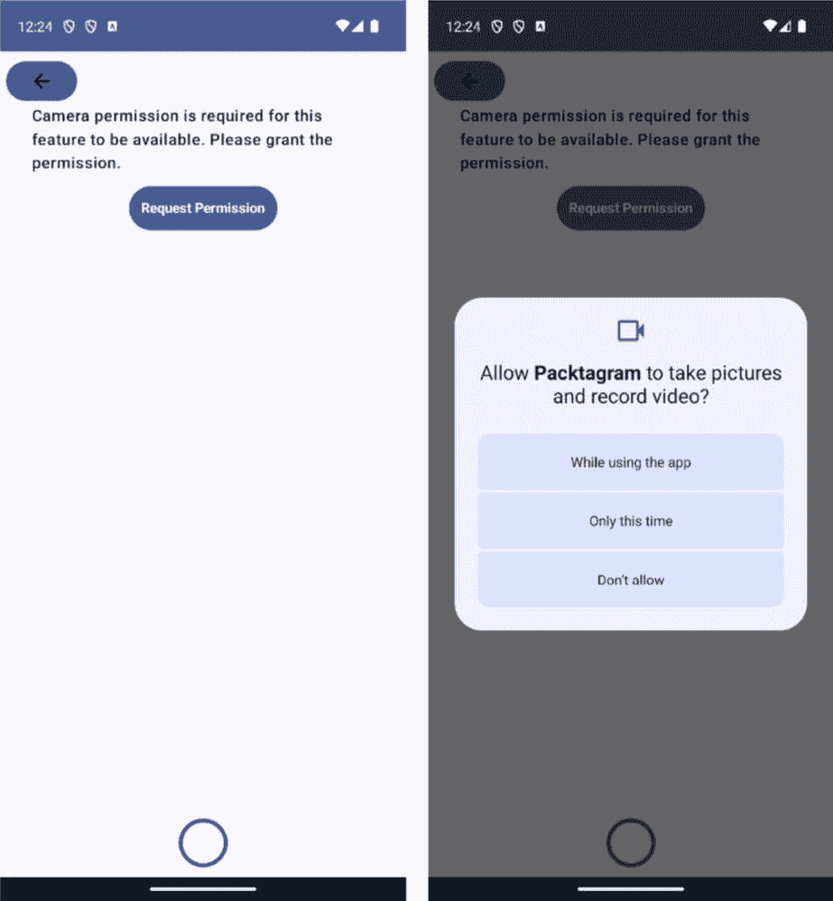

# 使用 CameraX 创建照片编辑器

在智能手机时代，拍照和分享照片已经成为第二本能，像 Instagram 这样的平台向我们展示了单张照片的强大力量。对于这类应用程序，不仅仅是拍一张照片；它还涉及到增强和个性化图像，以讲述一个故事。但你有没有想过那些应用内相机按钮和滤镜背后的东西？

进入 CameraX，这是 Android 在所有与相机相关事务中的首选工具。这个工具不仅使拍照变得无缝，而且也是编辑和精炼照片的桥梁。在本章中，我们将亲身体验 CameraX，了解它如何改变 Packtagram 的摄影体验。我们还将为用户设计一个互动空间，让他们调整和增强他们的照片，增加个人风格。而且，作为点睛之笔？我们将深入研究一些智能技术，教我们的应用程序识别照片主题并建议相关的标签。

在我们之前的工作基础上——为我们的 Instagram 风格应用程序制作屏幕和动态内容——我们现在正在深入探索应用程序的功能。借助 CameraX、直观的编辑工具和一些巧妙的功能，我们准备提升我们的照片分享游戏。

在本章中，我们将涵盖以下主题：

+   了解 CameraX

+   将 CameraX 集成到我们的 Packtagram 应用程序中

+   添加照片编辑功能

+   使用**机器学习**（**ML**）对照片进行分类并生成标签

# 技术要求

如前一章所述，您需要安装 Android Studio（或您偏好的其他编辑器）。

您可以在本书的 GitHub 存储库中找到本章将使用的完整代码：[`github.com/PacktPublishing/Thriving-in-Android-Development-using-Kotlin/tree/main/Chapter-5`](https://github.com/PacktPublishing/Thriving-in-Android-Development-using-Kotlin/tree/main/Chapter-5)。

# 了解 CameraX

自从 Android 平台诞生以来，相机在定义智能手机功能集方面发挥了关键作用。从捕捉瞬间到实现增强现实体验，相机已经从单纯的硬件组件发展成为一个强大的开发工具。然而，这种演变并非没有复杂性。

## Android 中相机库的演变

自从 Android 的第一个版本以来，开发者通过 Camera API 与相机硬件进行交互；这是 Android 首次尝试赋予开发者利用内置相机功能的能力。

随着设备的普及和如更先进的摄影硬件等功能的增长，对更强大的 API 的需求变得明显。因此，Camera2 API 在 API 级别 21（Lollipop）中被引入。虽然这提供了对相机功能的更细粒度控制，并支持新硬件的扩展功能，但其陡峭的学习曲线使得许多人在复杂性和性能开销方面发现相机开发具有挑战性。

由于 Camera2 的复杂性以及不同设备之间相机硬件的差异，开发者发现为最终用户提供一致的相机体验变得越来越困难。这种碎片化，加上 Camera2 的复杂性，使得一个更简洁、更易于开发者使用的解决方案变得至关重要。

进入 CameraX。

## CameraX 的重要性和优势

**CameraX** 是 Android 为相机应用程序开发提供的现代解决方案，其开发的主要目标是简化流程，同时减少设备之间的碎片化。以下是它迅速成为不可或缺的原因：

+   **跨设备一致性**：CameraX 抽象了不同设备特定相机行为之间的差异，确保大多数功能在广泛的设备上都能保持一致。

+   **生命周期感知**：繁琐的生命周期管理时代已经过去。CameraX 与 Android 的生命周期库集成，这意味着更少的样板代码，更多关注核心相机功能。

+   **基于用例的方法**：开发者现在可以专注于特定的用例，例如图像预览、图像捕获和图像分析，而不是处理低级任务。这使得开发更快，且错误更少。

+   **增强功能的扩展**：通过 CameraX 扩展 API，开发者可以访问设备特定的功能，如人像模式、HDR 等，进一步丰富相机体验。

+   **向后兼容性**：CameraX 与运行 Android 5.0（API 级别 21）及更高版本的设备兼容，确保其覆盖范围比 Camera2 更广。

+   **性能和质量**：CameraX 提供了开箱即用的优化性能，无需额外调整即可提供高质量的图像和视频。

总结来说，CameraX 不仅简化了相机应用程序的开发，还弥合了由硬件差异造成的差距。随着我们深入本章，你会逐渐欣赏到 CameraX 带来的细微差别和功能，为在 Android 上构建强大、一致且高质量的相机应用程序奠定基础。

现在，让我们开始使用 CameraX 并在我们的项目中配置其依赖项。

## 设置 CameraX

要设置 CameraX，我们需要将必要的依赖项添加到我们的版本目录文件 `libs.versions.toml` 中，如下所示：

```kt
[versions]
...
camerax = "1.2.1"
accompanist = "0.31.1-alpha"
[libraries]
...
cameraCore = { module = "androidx.camera:camera-core", version.ref = "camerax" }
cameraCamera2 = { module = "androidx.camera:camera-camera2", version.ref = "camerax" }
cameraView = { module = "androidx.camera:camera-view", version.ref = "camerax" }
cameraExtensions = { module = "androidx.camera:camera-extensions", version.ref = "camerax" }
accompanist = { group = "com.google.accompanist", name = "accompanist-permissions", version.ref = "accompanist"}
```

在此代码块中，我们添加了使用 CameraX 所需的依赖项，以及一个名为 Accompanist 的库。

**Accompanist** 是一系列设计用来补充 Jetpack Compose 的扩展库。它通过提供特定用例的实用工具以及简化 Compose 与其他 Android 功能的集成来填补空白。Accompanist 的功能包括图像加载集成、有用的组件（如 ViewPager）、管理系统 UI 嵌入的工具、Compose 导航增强和权限处理。要了解更多信息并扩展这些信息，请参阅官方文档：[`google.github.io/accompanist/`](https://google.github.io/accompanist/)。

在我们的案例中，我们将使用它来简化检查和请求用户相机权限的过程。

关于使用 CameraX 的依赖项，我们将添加以下内容：

+   **cameraCore**: 这个依赖提供了 CameraX 的核心功能，包括管理相机设备、配置捕获会话和从相机接收帧的能力。它是所有其他 CameraX 依赖的基础。

+   **cameraCamera2**: 这个依赖提供了 CameraX 的 Camera2 实现，这是在 Android 设备上访问相机最强大和最灵活的方式。它提供了对相机硬件的低级访问，并允许自定义捕获配置和处理管道。

+   **cameraView**: 这个依赖提供了一个预构建的视图组件，它可以与 CameraX 集成，简化显示相机预览帧的过程。它负责视图的布局和设置，这样你就可以专注于捕捉和处理相机数据。

+   **cameraExtensions**: 这个依赖提供了一组针对 CameraX 的扩展，增加了额外的功能，例如支持焦点峰值、图像稳定和全景捕获。它还包括用于在相机帧上处理 ML 模型的扩展。

注意

之前代码中的版本是在编写本书时最新的稳定版本，但在你阅读本书时可能会有新的版本。

在将这些依赖项添加到版本目录后，我们需要将它们添加到`:feature:stories`模块的`build.gradle.kts`文件中，如下所示：

```kt
    implementation(libs.cameraCore)
    implementation(libs.cameraCamera2)
    implementation(libs.cameraView)
    implementation(libs.cameraExtensions)
    implementation(libs.androidx.camera.lifecycle)
    implementation(libs.accompanist)
```

现在我们项目已经准备好使用 CameraX，让我们更深入地了解这个库。

## 了解 CameraX 的核心概念

在本节中，我们将了解 CameraX 的一些重要概念。

### 视图生命周期

CameraX，一个 Jetpack 支持库，简化了 Android 设备上的相机开发，并且由于其生命周期感知特性，它可以无缝地与 Jetpack Compose 集成，使开发者能够创建健壮且高效的相机应用程序。CameraX 设计哲学的核心是其对 Android 生命周期的内在支持，消除了管理相机资源的复杂性。CameraX 根据生命周期事件自动处理相机的启动、停止和资源释放，从而简化了开发过程。

Jetpack Compose，Android 的声明式 UI 工具包，也深深植根于生命周期概念。可组合组件天生具有生命周期状态，如 `onActive` 和 `onDispose`，这些状态在它们存在于 UI 层级中时会触发。结合 CameraX 和 Compose 的力量，为在可组合 UI 组件中管理摄像头的生命周期提供了一种协调的方法。

### 图像分析

CameraX 不仅仅只是捕获图像。通过 **图像分析**，开发者可以实时处理实时摄像头流。这对于条形码扫描、人脸检测或甚至应用实时滤镜等特性来说非常完美。以下是一个示例：

```kt
@Composable
fun CameraPreviewWithImageAnalysis() {
    val cameraProvider = rememberCameraProvider()
    val preview = remember { Preview.Builder().build() }
    val text = remember { mutableStateOf("Analyzing...") }
    val imageAnalyzer = ImageAnalysis.Builder()
        .setAnalyzer { image ->
            // Process the image data here
            text.value = "Detected image to analyze..."
        }
        .build()
    LaunchedEffect(cameraProvider) {
        val useCaseBinding = UseCaseBinding.Builder()
            .addUseCases(preview, imageAnalyzer)
            .build()
        val camera =
            cameraProvider.bindToLifecycle(useCaseBinding)
        camera.close()
    }
    Box(modifier = Modifier.fillMaxSize()) {
        Preview(preview)
        Text(text.value)
    }
}
```

上述代码定义了一个名为 `CameraPreviewWithImageAnalysis` 的可组合函数，用于显示摄像头预览并分析实时摄像头流，利用 Jetpack Compose 和 CameraX 来实现这一点。

首先，使用 `rememberCameraProvider` 函数检索摄像头提供程序实例，该实例负责管理摄像头的生命周期并提供对摄像头控制的访问。然后，使用 `Preview.Builder` 创建了一个 `Preview` 实例来定义摄像头预览表面。此预览将在屏幕上显示实时摄像头流。

之后，使用 `ImageAnalysis.Builder` 创建了一个 `ImageAnalysis` 实例，用于处理实时摄像头流。`setAnalyzer` 方法用于指定一个分析器函数，每当有新的图像帧可用时，该函数将被调用。

使用 `LaunchedEffect` 块启动一个协程，将摄像头预览和图像分析器绑定到摄像头的生命周期。`bindToLifecycle` 方法用于将用例连接到摄像头的生命周期，确保它们在应用启动和停止时自动开始和停止。

使用 `mutableStateOf` 变量文本来存储分析当前状态。文本变量在分析器函数内更新，以反映图像分析的结果。

最后，使用 `Box` 可组合组件来布局摄像头预览和文本。`fillMaxSize` 修改器用于使 `Box` 占据整个屏幕。`Preview` 可组合组件放置在 `Box` 内以显示摄像头预览。`Text` 可组合组件也放置在 `Box` 内以显示当前分析状态。

这是一个应用图像分析的基本示例，但已经存在一些图像分析器，例如 `BarcodeScanner`。以下代码基于上一个示例，添加了此分析器：

```kt
@Composable
fun BarcodeScannerPreview() {
    val cameraProvider = rememberCameraProvider()
    val preview = remember { Preview.Builder().build() }
    val barcodeText = remember { mutableStateOf("") }
    val barcodeScanner = BarcodeScanner.Builder()
        .setBarcodeFormats(BarcodeScannerOptions.
            BarcodeFormat.ALL_FORMATS)
        .build()
    LaunchedEffect(cameraProvider) {
        val imageAnalyzer = ImageAnalysis.Builder()
            .setAnalyzer { image ->
                val rotation =
                    image.imageInfo.rotationDegrees
                val imageProxy =
                    InputImage.fromMediaImage(image.image,
                        rotation)
                barcodeScanner.processImage(imageProxy)
                    .addOnSuccessListener { barcodes ->
                        if (barcodes.isNotEmpty()) {
                            val barcode = barcodes[0]
                            barcodeText.value =
                                barcode.displayValue
                        } else {
                            barcodeText.value = "No barcode
                                detected"
                        }
                    }
                    .addOnFailureListener { e ->
                        barcodeText.value = "Barcode
                            scanning failed: ${e.message}"
                    }
            }
            .build()
        val useCaseBinding = UseCaseBinding.Builder()
            .addUseCases(preview, imageAnalyzer)
            .build()
        val camera =
            cameraProvider.bindToLifecycle(useCaseBinding)
        camera.close()
    }
    Box(modifier = Modifier.fillMaxSize()) {
        Preview(preview)
        Text(barcodeText.value)
    }
}
```

与上一个示例类似，此代码定义了一个名为 `BarcodeScannerPreview` 的可组合函数，用于显示摄像头预览并分析实时摄像头流中的条形码。然而，此代码特别关注条形码扫描，并使用 ML Kit 的 `BarcodeScanner` 库来实现此功能。

首先，与上一个示例中的用法相同，使用`rememberCameraProvider`和`Preview`函数来检索摄像头提供程序实例并创建一个用于显示实时摄像头流的预览实例。

然后，使用`BarcodeScanner.Builder`创建了一个`BarcodeScanner`实例，指定要检测的条形码格式。在这种情况下，使用`BarcodeScannerOptions.BarcodeFormat.ALL_FORMATS`指定了所有条形码格式。

在此之后，使用`ImageAnalysis.Builder`创建了一个`ImageAnalysis`实例，并定义了分析函数以处理每个图像帧。首先，分析函数从`imageInfo`对象中检索图像旋转。然后，它将`ImageProxy`实例转换为与 ML Kit 的`BarcodeScanner`兼容的`InputImage`格式。

在`InputImage`实例上调用`BarcodeScanner.processImage`方法以检测条形码。在这里，使用`OnSuccessListener`来处理成功的条形码检测，而使用`OnFailureListener`来处理条形码扫描过程中发生的任何错误。

如果检测到条形码，则提取第一个条形码的`displayValue`值并将其存储在可变状态变量`barcodeText`中。此变量用于更新文本字段以包含检测到的条形码信息。

通过这种方式，我们已经创建了我们第一个图像分析器以获取条形码信息。让我们继续到下一个功能：`CameraSelector`。

### CameraSelector

在处理摄像头时，并不总是只关注一个摄像头——许多现代设备都配备了多个摄像头镜头。这就是`CameraSelector`发挥作用的地方，它允许开发者以编程方式在前后摄像头之间进行选择。无论是构建自拍应用还是更标准的照片应用，`CameraSelector`都能确保一致的行为。让我们看看我们如何允许用户选择他们想要使用的摄像头：

```kt
@Composable
fun CameraSelectorExample() {
    val cameraProvider = rememberCameraProvider()
    val preview = remember { Preview.Builder().build() }
    val isUsingFrontCamera = remember {
        mutableStateOf(true) }
    val cameraSelector = remember {
        if (isUsingFrontCamera.value) {
            CameraSelector.DEFAULT_FRONT_CAMERA
        } else {
            CameraSelector.DEFAULT_BACK_CAMERA
        }
    }
    val imageAnalyzer = ImageAnalysis.Builder()
        .setAnalyzer { image ->
            // Process the image data here
        }
        .build()
    LaunchedEffect(cameraProvider) {
        val useCaseBinding = UseCaseBinding.Builder()
            .addUseCases(preview, imageAnalyzer)
            .build()
        val camera =
            cameraProvider.bindToLifecycle(useCaseBinding)
        camera.close()
    }
    Box(modifier = Modifier.fillMaxSize()) {
        Preview(preview)
        Column {
            Button(onClick = {
                isUsingFrontCamera.value =
                    !isUsingFrontCamera.value
            }) {
                Text("Switch Camera")
            }
        }
    }
}
```

上述代码将显示相机预览和一个按钮。点击按钮将在前后摄像头之间切换。使用可变状态变量`isUsingFrontCamera`来跟踪当前正在使用的摄像头。然后，每当`isUsingFrontCamera`变量发生变化时，更新`cameraSelector`。相机预览会自动更新以反映新的摄像头选择。

还可以为用户提供更多对摄像头功能的控制。因此，让我们来谈谈`CameraControls`。

### CameraControls

一个全面的摄像头体验不仅仅是捕捉或分析图像。它还关乎控制。通过`CameraControls`，开发者可以访问一系列功能，允许他们操纵摄像头流。从放大主题并调整焦点以获得清晰的照片到切换手电筒以拍摄夜间快照，`CameraControls`确保用户始终获得完美的拍摄效果。

下面是一个如何使用`CameraControls`来缩放、调整焦点和切换手电筒的示例，从代码的第一部分开始：

```kt
@Composable
fun CameraControlsExample() {
    val cameraProvider = rememberCameraProvider()
    val preview = remember { Preview.Builder().build() }
    val zoomLevel = remember { mutableStateOf(1.0f) }
    val focusPoint = remember { mutableStateOf(0.5f, 0.5f) }
    val isTorchEnabled = remember { mutableStateOf(false) }
    val imageAnalyzer = ImageAnalysis.Builder()
        .setAnalyzer { image ->
            // Process the image data here
        }
        .build()
```

在前面的代码中，我们正在定义`rememberCameraProvider`函数，该函数用于检索相机提供程序实例。它管理相机的生命周期并提供对相机控制器的访问。然后，使用`Preview.Builder()`创建一个`Preview`实例，该实例定义了实时相机流将显示的表面。

使用三个`mutableStateOf`变量来存储缩放级别、焦点和手电筒状态：

+   **zoomLevel**：此变量存储当前的缩放级别，范围从 1.0f（无缩放）到 5.0f（最大缩放）

+   **focusPoint**：此变量存储当前的焦点，表示为预览框架内的坐标对(*x*, *y*)

+   **isTorchEnabled**：此变量存储当前的手电筒状态，指示手电筒是否启用或禁用

让我们继续下一部分的代码：

```kt
    LaunchedEffect(cameraProvider) {
        val cameraControl =
            cameraProvider.getCameraControl(preview)
        cameraControl.setZoomRatio(zoomLevel.value)
        cameraControl.setFocusPoint(focusPoint.value)
        cameraControl.enableTorch(isTorchEnabled.value)
        val useCaseBinding = UseCaseBinding.Builder()
            .addUseCases(preview, imageAnalyzer)
            .build()
        val camera =
            cameraProvider.bindToLifecycle(useCaseBinding)
        camera.close()
    }
```

在这里，`cameraControl.getCameraControl(preview)`方法检索与预览关联的`CameraControl`实例。此实例提供了访问各种相机控制的功能：

+   **cameraControl.setZoomRatio(zoomLevel.value)**：此控制使用存储在**zoomLevel**变量中的值设置缩放级别

+   **cameraControl.setFocusPoint(focusPoint.value)**：此控制使用存储在**focusPoint**变量中的坐标设置焦点

+   **cameraControl.enableTorch(isTorchEnabled.value)**：此控制根据存储在**isTorchEnabled**变量中的值启用或禁用手电筒

现在，让我们继续到最后一段代码：

```kt
    Box(modifier = Modifier.fillMaxSize()) {
        Preview(preview)
        Column {
            Slider(
                value = zoomLevel.value,
                onValueChange = { zoomLevel.value = it },
                valueRange = 1.0f..5.0f,
                steps = 10
            ) {
                Text("Zoom")
            }
            Button(onClick = {
                val newFocusPoint = if (focusPoint.value ==
                0.5f) {
                    0.1f to 0.1f
                } else {
                    0.5f to 0.5f
                }
                focusPoint.value = newFocusPoint
                cameraControl.setFocusPoint(newFocusPoint)
            }) {
                Text("Adjust Focus")
            }
            Button(onClick = {
                isTorchEnabled.value =
                    !isTorchEnabled.value
                cameraControl.enableTorch(
                    isTorchEnabled.value)
            }) {
                Text("Toggle Torch")
            }
        }
    }
}
```

在这个最后的代码块中，控件在`Column`布局中被配置和使用：

+   使用**滑动条**组件来调整缩放级别。**valueRange**属性定义了缩放级别的范围（1.0f 到 5.0f），而**onValueChange**回调将选定的缩放级别更新到**zoomLevel**变量。

+   **按钮**组件触发焦点位置的变化。点击时，它将在两个预定义的位置（0.5f 到 0.5f 和 0.1f 到 0.1f）之间更新**focusPoint**变量。

+   另一个**按钮**组件用于切换手电筒状态。点击时，它会更新**isTorchEnabled**变量，并调用**cameraControl.enableTorch**来相应地设置手电筒。

总之，CameraX 为在 Android 上开发高质量的相机应用提供了一个强大且灵活的平台。它提供了一个简化的 API、流畅的使用案例和一套全面的特性，使其成为构建现代以相机为中心的应用的理想选择。现在，我们已准备好在我们的应用中使用它。

# 将 CameraX 集成到我们的 Packtagram 应用中

现在我们对 CameraX 有了更多的了解，让我们开始将其集成到我们的应用中。首先，我们需要处理相机权限，为用户提供接受权限的方式。然后，我们将设置相机预览并添加相机捕获功能到我们的代码中。

## 使用 Accompanist 设置权限检查器

有几种方法可以检查摄像头权限是否已被授予，如果没有，则请求它们：我们可以手动完成或使用库。在这种情况下，我们将使用 Accompanist 库，正如我们在本章开头所介绍的。

在运行时请求任何权限之前，在应用的`AndroidManifest.xml`文件中声明相同的权限是基本要求。这种声明通知 Android 操作系统应用的目的。对于摄像头权限，您需要在`<manifest>`标签内添加以下行：

```kt
<uses-permission android:name="android.permission.CAMERA" />
```

虽然清单通知系统应用的需求，但运行时权限是关于寻求用户的明确同意。确保在访问受保护的功能或用户数据时，始终具备这两者。

现在，让我们进入权限检查器代码。我们的目标是创建一个可重用的可组合函数，可以优雅地处理摄像头权限。它应该能够请求权限，处理用户决策，并在必要时解释为什么应用需要这个权限。

首先，我们需要导入所需的库：

```kt
import com.google.accompanist.permissions.ExperimentalPermissionsApi
import com.google.accompanist.permissions.PermissionState
import com.google.accompanist.permissions.rememberPermissionState
@OptIn(ExperimentalPermissionsApi::class)
@Composable
fun CameraPermissionRequester(onPermissionGranted: () -> Unit) {
    // ... code ...
}
```

在这里，`@OptIn` 注解表明我们正在使用 Accompanist 权限库中的实验性 API。

现在，在`CameraPermissionRequester`内部，我们需要添加以下内容：

```kt
val cameraPermissionState = rememberPermissionState(Manifest.permission.CAMERA)
```

这里，`rememberPermissionState` 是一个辅助函数，它回忆起摄像头权限的当前状态。它提供有关权限是否已授予、我们是否已经询问过用户或是否应该显示理由等信息。

拥有权限状态后，我们可以创建一个响应此状态的 UI 流程：

+   **权限已授予**：如果权限已经授予，用户可以直接使用摄像头。

+   **显示理由**：有时，如果用户拒绝某个权限，解释应用为什么需要这个权限是有帮助的。这就是理由发挥作用的地方。

+   **尚未请求权限**：如果应用尚未请求权限，我们希望提供一个按钮来启动请求。

+   **未提供理由拒绝权限**：在某些情况下，用户拒绝权限并选择不再被询问。如果他们改变主意，引导他们到应用设置是一个好习惯。

让我们学习如何处理所有这些可能的流程。首先，我们将创建一个新的可组合函数，称为 `CameraPermissionRequester`。`onPermissionGranted` 回调用于处理摄像头权限已被授予的情况：

```kt
@OptIn(ExperimentalPermissionsApi::class)
@Composable
fun CameraPermissionRequester(onPermissionGranted:
@Composable () -> Unit) {
```

接下来，我们将检索 `cameraPermissionState`：

```kt
    // Camera permission state
    val cameraPermissionState = rememberPermissionState(
        android.Manifest.permission.CAMERA
    )
```

`rememberPermissionState(permission)` 函数用于检索指定权限的当前状态。在本例中，我们正在检查`CAMERA`权限的状态，这是访问设备摄像头的必要条件。结果存储在`cameraPermissionState`变量中。

现在，让我们评估它可能具有的不同值：

```kt
    if (cameraPermissionState.status.isGranted) {
        OnPermissionGranted.invoke()
```

在之前的代码块中，我们开始评估`cameraPermissionState`对象的`status.isGranted`属性，该属性指示权限是否已被授予。如果是真的，这意味着权限可用，我们可以调用`onPermissionGranted`回调来继续使用相机功能。

如果是假的，这意味着权限尚未被授予，因此我们必须向用户传达这种情况，并给他们提供授予权限的选项：

```kt
    } else {
                Surface(
                    modifier = Modifier
                        .fillMaxWidth()
                        .padding(16.dp)
                        .padding(top = 24.dp),
                    color =
                      MaterialTheme.colorScheme.background,
        ) {
            Column(
                modifier = Modifier.padding(16.dp),
                verticalArrangement =
                    Arrangement.spacedBy(12.dp),
                horizontalAlignment =
                    Alignment.CenterHorizontally
            ) {
                val textToShow = if
                (cameraPermissionState.shouldShowRationale)
                {
                    "The camera and record audio are
                     important for this app. Please grant
                     the permissions."
                } else {
                    "Camera permission is required for this
                     feature to be available. Please grant
                     the permission."
                }
                Text(
                    text = textToShow,
                    style =
                    MaterialTheme.typography.bodyLarge.copy
                    (
                        fontSize = 16.sp,
                        fontWeight = FontWeight.Medium
                    ),
                    color =
                    MaterialTheme.colorScheme.onBackground
                )
                Button(
                    onClick = { cameraPermissionState
                        .launchMultiplePermissionRequest()
                        },
                    colors = ButtonDefaults.buttonColors(
                        containerColor =
                        MaterialTheme.colorScheme.primary,
                        contentColor =
                        MaterialTheme.colorScheme.onPrimary
                    ),
                    contentPadding = PaddingValues(12.dp)
                ) {
                    Text("Request Permission",
                        fontSize = 14.sp,
                            fontWeight = FontWeight.Bold)
                }
            }
        }
    }
}
```

在之前的代码块中，我们显示了一条消息，解释了请求权限的原因，并提供了一个`Button`组件来启动权限请求过程。按钮的`onClick`处理程序触发`cameraPermissionState`对象的`launchPermissionRequest()`方法，提示用户授予权限。

`launchPermissionRequest()`方法打开一个系统对话框，请求用户授予`CAMERA`权限。对话框提供了清晰的说明并解释了为什么需要此权限。

如果我们现在运行这段代码，我们应该看到两个屏幕。首先，我们会看到我们的屏幕上显示请求权限的消息（左侧）。一旦我们点击**请求权限**，我们会看到系统提示接受权限（右侧）：



图 5.1：在我们的应用中请求相机权限（左侧）和系统提示授予捕获和录制权限（右侧）

一旦权限被授予，`CameraPreview`就可以开始工作了。我们将使用`onPermissionGranted`回调来显示它。

## 创建我们自己的 CameraPreview

以下`CameraPreview`组合函数旨在优雅地将 CameraX 集成到 Jetpack Compose 生态系统。在撰写本文时，还没有官方的组合实现用于 CameraX 预览，因此我们将使用`AndroidView`：

```kt
@Composable
@Composable
fun CameraPreview(cameraController:
LifecycleCameraController, modifier: Modifier = Modifier) {
    AndroidView(
        factory = { context ->
            PreviewView(context).apply {
                implementationMode =
                  PreviewView.ImplementationMode.COMPATIBLE
            }
        },
        modifier = modifier,
        update = { previewView ->
            previewView.controller = cameraController
        }
    )
}
```

这个组合函数接受两个参数：`cameraController`，它是一个`LifecycleCameraController`实例，用于控制相机，以及一个可选的修饰符，用于指定布局选项。

在函数内部，使用了一个`AndroidView`组合来连接传统的 Android 视图与 Jetpack Compose UI 框架。`AndroidView`的工厂参数是一个 Lambda，它提供上下文并返回一个`PreviewView`对象。`PreviewView`对象是一个标准的 Android 视图，用于显示相机流。它配置了`implementationMode`设置为`COMPATIBLE`，以确保与不同设备和场景的兼容性（CameraX 最相关的功能之一）。

`AndroidView`的修饰符参数设置为传递的修饰符，以允许布局被定制。`update`参数是另一个 Lambda，它被调用以在`PreviewView`上执行更新。在这种情况下，它将`cameraController`分配给`PreviewView`的控制器属性，将摄像头预览链接到`LifecycleCameraController`。

现在，让我们将预览集成到我们现有的代码中。在`StoryContent`可组合组件中，我们将包含以下代码，其中我们期望有摄像头图像：

```kt
    CameraPermissionRequester {
        Box(contentAlignment = Alignment.BottomCenter,
        modifier = Modifier.fillMaxSize()) {
            CameraPreview(
                cameraController = cameraController,
                modifier = Modifier.fillMaxSize()
            )
        }
    }
```

这样，我们应该准备好使用摄像头了！在这个阶段，我们已经学习了如何集成`CameraPreview`、检查权限以及显示摄像头图像流。现在，让我们添加保存照片的可能性！

## 添加照片保存功能

捕获功能是每个使用摄像头的应用程序的基本功能。我们需要在我们的现有代码中添加一些逻辑来处理捕获存储。让我们从一个用例（我们将在这里放置我们的领域逻辑）开始，以存储捕获的图像。

### 创建`SaveCaptureUseCase`

`SaveCaptureUseCase`的主要责任将是获取位图对象（我们将用于照片的格式）并将其保存为设备相册中的图像文件。此外，它将处理基于 Android 版本的不同方法，因为根据版本的不同，媒体存储的访问方式也不同。

例如，我们需要获取我们将存储图像的 URI（设备存储中的路径）。如果用户的 Android 版本比 9.0 新，位置将不同于之前的版本。以下代码块显示了获取相应路径的检查将看起来像什么：

```kt
if (Build.VERSION.SDK_INT >= Build.VERSION_CODES.Q) {
            MediaStore.Images.Media.getContentUri(
                MediaStore.VOLUME_EXTERNAL_PRIMARY)
        } else {
            MediaStore.Images.Media.EXTERNAL_CONTENT_URI
        }
}
```

在这里，我们正在评估版本是否为主版本或等于 Android 9.0，并使用`MediaStore.Images.Media.getContentUri(MediaStore.VOLUME_EXTERNAL_PRIMARY)`获取 URI。如果版本不符合这些要求，我们从`MediaStore.Images.Media.EXTERNAL_CONTENT_URI`获取 URI。我们应该考虑所有这些不同的情况，以便我们的用例能够正确处理不同的 Android 版本。

现在，让我们创建`SaveCaptureUse`类：

```kt
class SaveCaptureUseCase(private val context: Context) {
}
```

然后，我们可以创建这个用例的主函数`save()`，它将负责保存捕获的内容：

```kt
    suspend fun save(capturePhotoBitmap: Bitmap):
    Result<Uri> = withContext(Dispatchers.IO) {
        val resolver: ContentResolver =
            context.applicationContext.contentResolver
        val imageCollection = getImageCollectionUri()
        val nowTimestamp = System.currentTimeMillis()
        val imageContentValues =
            createContentValues(nowTimestamp)
        val imageMediaStoreUri: Uri? =
            resolver.insert(imageCollection,
                imageContentValues)
        return@withContext imageMediaStoreUri?.let { uri ->
            saveBitmapToUri(resolver, uri,
                capturePhotoBitmap, imageContentValues)
        } ?: Result.failure(Exception("Couldn't create file
                                       for gallery"))
    }
```

在这个代码块中，我们开始创建保存函数。由于它被标记为`suspend`函数，保存函数被设计为在协程上下文中调用。它使用`withContext(Dispatchers.IO)`来确保所有 I/O 操作都在后台线程上执行。这对于保持 UI 响应性至关重要，因为 I/O 操作可能很耗时。

接下来，我们声明`ContextResolver`。这个解析器用于与`MediaStore`交互，它是 Android 的媒体文件中央存储库。

然后，函数将调用`getImageCollectionUri()`，这是一个辅助函数，根据 Android 版本提供适当的`MediaStore` URI。此 URI 是图像将被保存的位置。我们将在下一个实现此函数。

之后，捕获当前系统时间（`nowTimestamp`），并调用`createContentValues (nowTimestamp)`以准备图像的元数据。此元数据存储在`ContentValues`对象中，包括图像的显示名称、`MIME`类型和时间戳等详细信息。

函数随后尝试使用解析的 URI 和准备好的元数据将新记录插入到`MediaStore`中。`insert`方法返回一个指向新创建记录的 URI。如果此操作成功，则返回非空 URI，表示新图像记录在`MediaStore`中的位置。

最后，如果 URI 不为空，则使用解析器、URI、要保存的位图和图像元数据调用`saveBitmapToUri`函数。此函数处理将位图数据写入 URI 指向的位置的实际过程。我们很快就会实现它。

关于错误处理，我们的`save`函数使用 Kotlin 的`Result`类进行结构化错误处理。如果 MediaStore 中的插入成功且位图正确保存，则函数返回`Result.success(Unit)`。如果在任何点上出现失败（例如，URI 为空，表示插入失败），则函数返回`Result.failure`，封装一个适当的错误消息的异常。

现在，让我们实现`getImageCollectionUri()`函数，该函数将根据 Android 版本返回正确的 URI：

```kt
    private fun getImageCollectionUri(): Uri =
        if (Build.VERSION.SDK_INT >= Build.VERSION_CODES.Q)
        {
            MediaStore.Images.Media.getContentUri(
                MediaStore.VOLUME_EXTERNAL_PRIMARY)
        } else {
            MediaStore.Images.Media.EXTERNAL_CONTENT_URI
        }
```

然后，我们可以创建`createContentValues`函数：

```kt
private fun createContentValues(timestamp: Long):
ContentValues = ContentValues().apply {
        put(MediaStore.Images.Media.DISPLAY_NAME,
            "$FILE_NAME_PREFIX${System.currentTimeMillis()}
                .jpg")
        put(MediaStore.Images.Media.MIME_TYPE, "image/jpg")
        if (Build.VERSION.SDK_INT >= Build.VERSION_CODES.Q)
        {
            put(MediaStore.MediaColumns.DATE_TAKEN,
                timestamp)
            put(MediaStore.MediaColumns.RELATIVE_PATH,
                "${Environment.DIRECTORY_DCIM}/Packtagram")
            put(MediaStore.MediaColumns.IS_PENDING, 1)
        }
        if (Build.VERSION.SDK_INT >= Build.VERSION_CODES.R)
        {
            put(MediaStore.Images.Media.DATE_ADDED,
                timestamp)
            put(MediaStore.Images.Media.DATE_MODIFIED,
                timestamp)
            put(MediaStore.Images.Media.AUTHOR,
                AUTHOR_NAME)
            put(MediaStore.Images.Media.DESCRIPTION,
                DESCRIPTION)
        }
    }
```

`createContentValues`函数旨在在通过`MediaStore`将图像文件保存到设备的相册之前准备图像文件的元数据。此方法对于确保保存的图像具有正确的和必要的信息至关重要。因此，让我们分解其功能：

+   首先，函数初始化一个**ContentValues**对象。在这里，**ContentValues**是一个键值对，在 Android 中用于存储一组**ContentResolver**可以处理的值。它通常用于将数据传递给 Android 的内容提供者。

+   接下来，设置**MediaStore**中图像的显示名称。我们将使用预定义的**FILE_NAME_PREFIX**常量，并将其与当前时间戳连接，然后附加**.jpg**扩展名，确保每个保存的图像都有一个唯一的名称。

+   然后，将图像的**MIME**类型设置为**image/jpg**。此信息由**MediaStore**和其他应用程序用于理解图像的文件格式。

+   我们必须根据设备的 Android 版本以不同的方式存储它：

    +   对于 Android Q（API 级别 29）及以上版本，我们必须执行以下操作：

        +   我们需要添加图像存储时的时间戳，并使用**MediaStore.MediaColumns.DATE_TAKEN**键。

        +   我们必须使用**createContentValues**函数指定图像文件的相对路径，使用**put(MediaStore.MediaColumns.RELATIVE_PATH, "${Environment.DIRECTORY_DCIM}/Packtagram")**指向**数字相机图像**（**DCIM**）文件夹内的一个目录。这有助于在特定子目录中组织保存的图像，使其更容易找到。

        +   我们需要更新**ContentValues**实例并将**IS_PENDING**设置为**1**（true），表示文件创建正在进行中。这是通知系统和其他应用程序文件尚未完全写入，并且应在状态恢复之前不应访问文件的一种方式。

    +   对于 Android R（API 级别 30）及以上版本，我们的函数应该添加更多元数据，包括添加日期、修改日期、作者姓名和描述。这是新版本 Android 中增强的元数据管理的一部分，允许存储与媒体文件相关的更详细的信息。

现在我们正在处理存储文件所需的 URI，以及创建文件所需的值和元数据，让我们继续进行保存操作。为此，我们将创建一个新的私有函数`saveBitmapToUri`，如下所示：

```kt
    private fun saveBitmapToUri(
        resolver: ContentResolver,
        uri: Uri,
        bitmap: Bitmap,
        contentValues: ContentValues
    ): Result<Uri> = kotlin.runCatching {
       resolver.openOutputStream(uri).use { outputStream ->
           checkNotNull(outputStream) { "Couldn't create
               file for gallery, MediaStore output stream
                   is null»}`
           bitmap.compress(Bitmap.CompressFormat.JPEG,
               IMAGE_QUALITY, outputStream)
        }
```

函数首先尝试为给定的 URI 打开`OutputStream`。这个流是位图数据将被写入的地方。在这里，使用`Resolver.openOutputStream(uri)`来获取流，而`use`块确保在操作完成后正确关闭此流，遵循资源管理的最佳实践。

在`use`块内部，该函数会检查`outputStream`是否为`null`，如果是，则会抛出一个带有描述性信息的异常。如果流有效，则将位图压缩并写入此流。压缩格式设置为 JPEG，质量由`IMAGE_QUALITY`常量确定。

现在，如果图像保存成功，我们必须更新并返回结果。如果发生错误，我们必须返回一个错误：

```kt
        if (Build.VERSION.SDK_INT >= Build.VERSION_CODES.Q)
        {
            contentValues.clear()
            contentValues.put(
                MediaStore.MediaColumns.IS_PENDING, 0)
            resolver.update(uri, contentValues, null, null)
        }
        return Result.success(Unit)
    }.getOrElse { exception ->
        exception.message?.let(::println)
        resolver.delete(uri, null, null)
        return Result.failure(exception)
    }
}
```

对于运行 Android Q（API 级别 29）或更高版本的设备，在图像保存后，该函数会更新`MediaStore`条目以指示图像不再挂起。这是通过清除现有的`contentValues`，将`IS_PENDING`设置为`0`（false），然后使用这些新值更新`MediaStore`条目来完成的。这一步对于使图像可供用户和其他应用程序使用至关重要。

整个操作被包裹在一个`runCatching`块中，这是一个 Kotlin 构造，用于简化异常处理。此块捕获在`OutputStream`操作或`MediaStore`更新期间发生的任何异常。如果发生异常，则会记录，并且函数会尝试从`MediaStore`中删除可能已损坏或不完整的文件。这种清理对于防止存储空间被不可用的文件杂乱无章地占用至关重要。

该函数返回 `Result<Uri>`，表示操作的成功或失败。在成功的情况下，返回 `Result.success(uri)`。在发生异常的情况下，返回 `Result.failure(exception)`，封装异常详细信息。

剩下的唯一事情就是添加在开发这些类期间将使用的参数。为了简单起见，我们将它们添加为常量，但它们也可以提供给类：

```kt
companion object {
    private const val IMAGE_QUALITY = 100
    private const val FILE_NAME_PREFIX = "YourImageName"
    private const val AUTHOR_NAME = "Your Name"
    private const val DESCRIPTION = "Your description"
}
```

下一步是将此用例集成到 `StoryEditorViewModel` 中。

### 在 StoryEditorViewModel 中集成 SaveCaptureUseCase

在这里，我们需要在 `StoryEditorViewModel` 中创建一个新的属性和函数来存储捕获的图片：

```kt
class StoryEditorViewModel(
    private val saveCaptureUseCase: SaveCaptureUseCase
): ViewModel() {
    private val _isEditing = MutableStateFlow(false)
    val isEditing: StateFlow<Boolean> = _isEditing
    private val _imageCaptured: MutableStateFlow<Uri> =
        MutableStateFlow(Uri.EMPTY)
    val imageCaptured: StateFlow<Uri> = _imageCaptured
    fun storePhotoInGallery(bitmap: Bitmap) {
        viewModelScope.launch {
            val imageUri =
                saveCaptureUseCase.save(bitmap).getOrNull()
            if (imageUri != null) {
                _imageCaptured.value = imageUri
                _isEditing.value = true
            }
    }
}
```

在这个 `storePhotoInGallery` 函数中，我们只是启动一个协程来调用 `saveCaptureUseCase.save` 方法。然后，一旦我们获得了 URI，我们检查它是否不是 `null` 并更新 `imageCaptured` 属性。

最后，我们准备好将此功能添加到 UI 中。

### 将捕获功能添加到 StoryContent

要将捕获功能添加到 `StoryContent`，我们需要向 `StoryContent` 可组合函数添加一个 Lambda，以便每次使用 `StoryContent` 时，捕获处理将被委派。例如，在我们的案例中，我们将调用已实现的 `storePhotoInGallery` 函数从 `StoryEditorViewModel`：

```kt
@Composable
fun StoryContent(
    isEditing: Boolean = false,
    onImageCaptured: (Bitmap) -> Any,
    modifier: Modifier = Modifier,
) { ... }
```

接下来，让我们集成从我们的相机捕获所需的代码：

```kt
fun capturePhoto(
        context: Context,
        cameraController: LifecycleCameraController,
        onPhotoCaptured: (Bitmap) -> Unit,
        onError: (Exception) -> Unit
    ) {
```

我们在之前的代码块中使用以下参数：

+   **context**：我们将使用它来获取 **MainExecutor** 的 Android 上下文。

+   **cameraController**：来自 **CameraX** 的 **LifecycleCameraController** 对象，用于控制摄像头的生命周期和操作。

+   **onPhotoCaptured**：当照片成功捕获并处理时将被调用的回调函数。它接受一个 **Bitmap** 作为其参数。

+   **onError**：一个回调函数，用于处理拍照过程中发生的任何错误。

让我们继续定义必要的属性：

```kt
val mainExecutor: Executor =
ContextCompat.getMainExecutor(context)
```

这里，我们将检索 `MainExecutor`。这个执行器用于在 Android 主线程上运行任务，这对于 UI 更新和某些 CameraX 操作至关重要。它对于 `CameraController` 是必需的。

接下来，我们将执行拍照动作：

```kt
        cameraController.takePicture(mainExecutor,
        @ExperimentalGetImage object :
        ImageCapture.OnImageCapturedCallback() {
            override fun onCaptureSuccess(image:
            ImageProxy) {
                try {
                    CoroutineScope(Dispatchers.IO).launch {
                        val correctedBitmap: Bitmap? =
                            image
                                ?.image
                                ?.toBitmap()
                                ?.rotateBitmap(image
                                    .imageInfo
                                    .rotationDegrees)
                        correctedBitmap?.let {
                            withContext(Dispatchers.Main) {
                                onPhotoCaptured(
                                    correctedBitmap)
                            }
                        }
                        image.close()
                    }
                } catch (e: Exception) {
                    onError(e)
                } finally {
                    image.close()
                }
            }
            override fun onError(exception:
            ImageCaptureException) {
                Log.e("CameraContent", "Error capturing
                    image", exception)
                onError(exception)
            }
        })
    }
```

这里，我们调用 `cameraController.takePicture` 方法。我们需要提供执行器和 `ImageCapture.OnImageCapturedCallback` 类。这个类提供了在成功捕获图像或发生错误时的回调方法。

在成功的情况下，我们将从主分发器切换到 `onPhotoCaptured` Lambda。或者，如果有任何错误，我们将通过 `onError(exception: ImageCaptureException)` 回调接收它们。然后，我们将错误传递给作为 `capturePhoto()` 函数参数接收的 `onError` 回调函数。

现在，让我们将捕获功能与我们的 UI 链接起来。在我们的`StoryContent`可组合组件中，我们已经有了一个用于捕获的按钮`OutlinedButton`，所以让我们看看我们如何从它调用这个捕获函数：

```kt
OutlinedButton(
                    onClick = { capturePhoto(
                        context = localContext,
                        cameraController =
                            cameraController,
                        onPhotoCaptured = {
                            onImageCaptured(it) },
                        onError = { /* Show error */ }
                            )
                    },
                    modifier = Modifier.size(50.dp),
                    shape = CircleShape,
                    border = BorderStroke(4.dp,
                        MaterialTheme.colorScheme.primary),
                    contentPadding = PaddingValues(0.dp),
                    colors =
                        ButtonDefaults.outlinedButtonColors
                            (contentColor =
                                MaterialTheme.colorScheme
                                    .primary)
                ) {
                }
```

如我们所见，我们是从`onClick`按钮调用`capturePhoto`函数。

这样，我们就准备好捕捉我们的照片了：


图 5.2：带有捕获按钮的图像预览

通过这种方式，我们创建了一个用例，以便我们可以存储我们的照片并将功能与我们的现有 UI 链接起来。我们的用户也可以捕捉并存储他们的照片。接下来，让我们看看我们是否可以启用它们，以便我们可以编辑它们的一些方面。

# 添加照片编辑功能

我们可以为用户启用多个操作来编辑和修改他们的图片：我们可以允许他们裁剪、调整大小和旋转图片，以及调整亮度和对比度，应用过滤器，或添加文字覆盖。

作为本章的一部分，我们将实现两个操作：黑白过滤器和文字覆盖。

## 添加过滤器

在现有图片上创建过滤器就像修改包含图片的位图值一样简单。有几个著名的过滤器，如棕褐色、复古和黑白。作为一个例子，我们将实现黑白过滤器，如下所示：

```kt
@Composable
fun BlackAndWhiteFilter(
    imageUri: Uri,
    modifier: Modifier = Modifier
) {
    var isBlackAndWhiteEnabled by remember {
    mutableStateOf(false) }
    val localContext = LocalContext.current
    Box(modifier = modifier.fillMaxSize()) {
        Canvas(modifier = Modifier.fillMaxSize()) {
            getBitmapFromUri(localContext, imageUri)?.let {
                val imageBitMap = it.asImageBitmap()
                val colorFilter = if
                (isBlackAndWhiteEnabled) {
                    val colorMatrix = ColorMatrix().apply {
                        setToSaturation(0f) }
                    ColorFilter.colorMatrix(colorMatrix)
                } else {
                    null
                }
                val (offsetX, offsetY) =
                    getCanvasImageOffset(imageBitMap)
                val scaleFactor =
                    getCanvasImageScale(imageBitMap)
                with(drawContext.canvas) {
                    save()
                    translate(offsetX, offsetY)
                    scale(scaleFactor, scaleFactor)
                    drawImage(
                        image = imageBitMap,
                        topLeft =
                            androidx.compose.ui.geometry
                                .Offset.Zero,
                        colorFilter = colorFilter
                    )
                    restore()
                }
            }
        }
        Button(
            onClick = { isBlackAndWhiteEnabled =
                !isBlackAndWhiteEnabled },
            modifier = Modifier.padding(16.dp)
        ) {
            Text("Apply Black and White Filter")
        }
    }
}
```

此函数首先接受`imageUri`，它表示要显示的图片的 URI，以及一个可选的修饰符参数来定制布局。

在函数内部，使用`remember`和`mutableStateOf`声明了一个名为`isBlackAndWhiteEnabled`的状态变量，该变量跟踪是否应用了黑白过滤器。在这里，`LocalContext.current`提供了从 URI 加载图片所需的上下文。

使用`Box`可组合组件来包含整个布局，确保内容填充可用空间。在`Box`内部，使用`Canvas`可组合组件来绘制图像。将`Canvas`修饰符设置为填充可用大小。

`Canvas`可组合组件使用`getBitmapFromUri`函数将图片作为`Bitmap`加载，然后使用`asImageBitmap`扩展函数将其转换为`ImageBitmap`。如果`isBlackAndWhiteEnabled`状态为真，则应用一个饱和度为零的`ColorMatrix`值来创建黑白`ColorFilter`。否则，不应用颜色过滤器。

`getCanvasImageOffset`和`getCanvasImageScale`函数用于计算将图像居中和缩放所需的偏移量和缩放因子。`with(drawContext.canvas)`块用于绘制图像。在此块内，调用`save`和`restore`以保存和恢复画布状态，确保变换不会影响后续的绘图操作。`translate`函数应用计算出的偏移量，而`scale`函数应用缩放因子，以将整个`Canvas`填满图像。最后，`drawImage`函数使用可选的颜色过滤器在画布上绘制图像。

在`Canvas`下方，一个`Button` composable 被放置在`Box`内。此按钮用于在点击时切换`isBlackAndWhiteEnabled`状态。按钮的`onClick` Lambda 更新状态变量，按钮的文本设置为**应用黑白过滤器**。按钮的修饰参数包括填充，以确保它不会放置在屏幕边缘。

现在我们已经构建了第一个过滤器，让我们学习如何实现文本叠加。

## 添加文本叠加

添加文本叠加是典型的图像编辑功能，允许我们标记其他人，给图像添加标签，或添加伴随的书面信息。让我们看看我们如何为用户提供此功能。

首先，我们将创建一个包含`Text`和`Image`组件状态的 composable。当用户更新文本时，此状态将更新。以下是代码：

```kt
@Composable
fun ImageWithTextOverlay(capturedBitmap: Bitmap) {
    var textOverlay = remember { mutableStateOf("Add your
        text here") }
    var showTextField = remember { mutableStateOf(false) }
    Box(modifier = Modifier.fillMaxSize()) {
        Image(
            bitmap = capturedBitmap.asImageBitmap(),
            contentDescription = "Captured Image",
            modifier = Modifier.matchParentSize()
        )
        if (showTextField) {
            TextField(
                value = textOverlay,
                onValueChange = { textOverlay = it },
                modifier = Modifier
                    .align(Alignment.Center)
                    .padding(16.dp)
            )
        }
        Text(
            text = textOverlay,
            color = Color.White,
            fontSize = 24.sp,
            modifier = Modifier.align(Alignment.Center)
        )
        FloatingActionButton(
            onClick = { showTextField = !showTextField },
            modifier = Modifier
                .align(Alignment.BottomEnd)
                .padding(16.dp)
        ) {
            Icon(Icons.Default.Edit, contentDescription =
                "Edit Text")
        }
    }
}
```

此示例定义了一个名为`ImageWithTextOverlay`的 composable 函数。它接受一个名为`capturedBitmap`的位图对象，该对象表示将带有文本叠加显示的捕获图像。

函数首先定义了两件状态：

+   首先，我们有**textOverlay**，它包含将在图像上显示的文本。它最初设置为默认值**在此处添加您的文本**。

+   然后，我们有一个**showTextField**布尔值，它确定文本编辑字段（**TextField**）是否可见。它最初设置为**false**。

在函数内部，我们使用`Box` composable 作为容器。`Box` composable 允许我们堆叠其子组件，并将大小设置为填充最大可用空间。这创建了一个可以在图像上叠加文本的区域。

`Box` composable 的第一个子项是一个`Image` composable，它负责显示捕获的照片。照片作为位图传递给此函数，我们确保它填充整个父容器，确保图像占据整个屏幕空间。

接下来，我们检查`showTextField`的状态。如果它是`true`，我们在屏幕中心显示`TextField`。此`TextField`允许用户输入或编辑将叠加到图像上的文本。由于 Jetpack Compose 提供的双向绑定，用户键入时，`textOverlay`中的文本会实时更新。

无论 `showTextField` 的状态如何，我们总是显示一个 `Text` 可组合组件。这个组件负责在图像上渲染叠加文本。我们为这个文本设置白色和合理的字体大小，确保它在各种背景上都是可见的。

最后，在 `Box` 可组合组件的底部角落放置 `FloatingActionButton`。当按钮被点击时，它会切换 `TextField` 的可见性，使用户能够在查看叠加文本和编辑文本之间切换。按钮的设计直观，带有编辑图标，向用户传达其功能。

现在，假设我们想要允许用户在图像中随时移动文本。让我们实现一些拖放魔法。我们将从更新 `ImageWithTextOverlay` 可组合函数开始：

```kt
@Composable
fun ImageWithTextOverlay(capturedBitmap: Bitmap) {
    var textOverlay = remember { mutableStateOf("Your text
        here") }
    var showTextField = remember { mutableStateOf(false) }
    var textPosition by remember {
        mutableStateOf(Offset.Zero) }
```

在这个更新版本的 `ImageWithTextOverlay` 可组合函数中，我们引入了一个交互功能，允许用户将文本叠加拖放到图像上的任何位置。为了实现这一点，我们添加了一个新的状态变量 `textPosition`，初始化为 `Offset.Zero`。这个状态保存文本叠加在屏幕上的当前位置。现在，我们必须创建一个新的可组合函数 `DraggableText` 来处理文本显示及其可拖动功能。

让我们将这个 `DraggableText` 添加到现有的代码中：

```kt
    val imageModifier = Modifier.fillMaxSize()
    Box(modifier = Modifier.fillMaxSize()) {
        Image(
            bitmap = capturedBitmap.asImageBitmap(),
            contentDescription = "Captured Image",
            modifier = imageModifier
        )
        if (showTextField) {
            TextField(
                value = textOverlay,
                onValueChange = { textOverlay = it },
                modifier = Modifier
                    .align(Alignment.Center)
                    .padding(16.dp)
            )
        }
        DraggableText(
            text = textOverlay,
            position = textPosition,
            onPositionChange = { newPosition ->
                textPosition = newPosition },
            modifier = Modifier
                .offset { IntOffset(textPosition.x.toInt(),
                    textPosition.y.toInt()) }
                .align(Alignment.Center)
        )
        FloatingActionButton(
            onClick = { showTextField = !showTextField },
            modifier = Modifier
                .align(Alignment.BottomEnd)
                .padding(16.dp)
        ) {
            Icon(Icons.Default.Edit, contentDescription =
                "Edit Text")
        }
    }
}
```

在这里，通过 `TextField` 编辑文本的现有功能相同。当用户想要编辑文本时，`TextField` 字段会出现，由一个浮动操作按钮提供便利。这个按钮切换 `TextField` 的可见性，使用户能够在编辑文本和调整其位置之间无缝切换。

现在，我们准备好创建 `DraggableText` 可组合组件：

```kt
@Composable
fun DraggableText(
    text: String,
    position: Offset,
    onPositionChange: (Offset) -> Unit,
    modifier: Modifier = Modifier
) {
```

`DraggableText` 可组合组件接受多个参数，包括要显示的文本、其当前位置以及一个回调函数 `onPositionChange`，该函数更新此位置。在 `DraggableText` 中，我们利用 `Text` 可组合组件上的可拖动修饰符。这个修饰符至关重要，因为它允许文本在屏幕上移动。当用户拖动文本时，拖动偏移量会更新，进而更新主 `ImageWithTextOverlay` 函数中的 `textPosition` 状态。

最后，定义所需的变量和用于显示文本的 `Text` 可组合组件：

```kt
    var dragOffset = remember { mutableStateOf(position) }
    Text(
        text = text,
        color = Color.White,
        fontSize = 24.sp,
        modifier = modifier
            .offset {
                IntOffset(dragOffset.value.x.roundToInt(),
                    dragOffset.value.y.roundToInt()) }
            .pointerInput(Unit) {
                detectDragGestures { change, dragAmount ->
                    change.consume()
                    dragOffset.value =
                        Offset((dragOffset.value.x +
                            dragAmount.x),
                                (dragOffset.value.y +
                                    dragAmount.y))
                    onPositionChange(dragOffset.value)
                }
            }
            .background(
                color = Color.Black.copy(alpha = 0.5f),
                shape = RoundedCornerShape(8.dp)
            )
    )
```

我们首先初始化一个状态来保存当前的拖动偏移量。这个状态将跟踪文本被拖动时的位置。

接下来，我们定义 `Text` 可组合组件来显示我们的可拖动文本。为了控制文本的位置，我们使用偏移修饰符，该修饰符根据当前的拖动偏移量定位文本。

`pointerInput`修饰符允许我们处理文本元素上的拖拽手势。在`detectDragGestures`块中，我们通过将拖拽量添加到当前偏移量来更新拖拽偏移量，每次用户拖拽文本时都会这样做。手势变化被消耗以指示拖拽事件已被处理，并且我们调用一个函数来处理位置变化时所需的任何附加操作。

有了这些，以下是我们已经创建的两个滤镜：


图 5.3：黑白滤镜组件（左）和文本叠加（右）

到目前为止，我们已经为用户实现了一些酷炫的功能，例如黑白滤镜和添加字幕的可能性。那么，为什么不利用机器学习来构建出色的功能呢？我们将在下一节中探讨这一点。

# 使用机器学习对照片进行分类并生成标签

机器学习是**人工智能**（**AI**）的一个分支，专注于构建可以从数据中学习和基于数据做出决策的系统。与遵循明确编程指令的传统软件不同，机器学习算法使用统计技术使计算机能够通过经验提高任务性能。机器学习的基本前提是开发能够接收输入数据并使用统计分析来预测或对数据的一些方面做出决策的算法。

机器学习是一个巨大的领域，超出了本书的范围，但我们仍然可以使用现成的库做一些有趣的事情。例如，**ML Kit**是 Google 为移动开发者提供的强大机器学习解决方案，它提供了一系列现成的 API，用于各种机器学习任务，包括设备端和基于云的任务。这些功能被设计成易于集成到移动应用程序中，便于使用机器学习而无需在该领域有深入的专业知识。以下是 ML Kit 提供的关键功能概述：

+   **图像标注**：在图像中识别对象、位置、活动、动物种类、产品等。

+   **文本识别**：从图像中提取文本。这可以用于**光学字符识别**（**OCR**）应用，例如扫描文档、名片或任何打印或手写的文本。

+   **人脸检测**：在图像中检测人脸，包括眼睛和鼻子等关键面部特征，以及微笑或头部倾斜等特征。这在照片标记和面部识别等应用中非常有用。

+   **条码扫描**：读取和扫描条码和二维码。它支持包括 UPC、EAN、Code 39 在内的各种格式。

+   **目标检测和跟踪**：在图像或视频流中识别和跟踪对象。这个功能在实时视频分析等场景中非常有用。

你可以在[`developers.google.com/ml-kit`](https://developers.google.com/ml-kit)了解更多关于 ML Kit 的功能。

作为示例，我们将创建识别和标记照片中元素的逻辑，这些元素将来可用于对图像进行分类或创建自动标签。我们首先将相应的依赖项添加到 `libs.versions.toml`：

```kt
[versions]
...
ml-labeling = "17.0.5"
[libraries]
...
mlKitLabeling= { group = "com.google.mlkit", name = "image-labeling", version.ref="ml-labeling"}
```

然后，我们将将这些依赖项添加到模块的 `build.gradle` 文件中。这是创建此功能的地方 (`feature:stories`)：

```kt
    implementation(libs.mlKitLabeling)
```

现在，我们可以创建实际的代码。我们将利用 CameraX 的图像分析功能，在将结果写入图像之前使用 MLKitLabeling 分析预览。为此，我们将创建一个新的预览组合器，专门用于此功能：

```kt
@Composable
fun CameraPreviewWithImageLabeler(cameraController: LifecycleCameraController, modifier: Modifier = Modifier) {
    val context = LocalContext.current
    var labels by remember {
        mutableStateOf<List<String>>(emptyList()) }
    val cameraProviderFuture = remember {
        ProcessCameraProvider.getInstance(context) }
    val previewView = remember { PreviewView(context) }
    val imageAnalysis = remember {
        ImageAnalysis.Builder()
            .setTargetResolution(Size(1280, 720))
            .setBackpressureStrategy(
                ImageAnalysis.STRATEGY_KEEP_ONLY_LATEST)
            .build()
    }
    DisposableEffect(Unit) {
        val cameraProvider = cameraProviderFuture.get()
        val preview = Preview.Builder().build().also {
            it.setSurfaceProvider(
                previewView.surfaceProvider)
        }
        val cameraSelector =
            CameraSelector.DEFAULT_BACK_CAMERA
        cameraProvider.bindToLifecycle(
            context as LifecycleOwner, cameraSelector,
                preview, imageAnalysis)
        onDispose {
            cameraProvider.unbindAll()
        }
    }
    imageAnalysis.setAnalyzer(ContextCompat.getMainExecutor
    (context)) { imageProxy ->
        processImageProxyForLabeling(imageProxy) {
        detectedLabels ->
            labels = detectedLabels
        }
    }
    Box(modifier = modifier) {
        AndroidView(
            factory = { previewView },
            modifier = modifier
        )
        Canvas(modifier = Modifier.fillMaxSize()) {
            drawIntoCanvas { canvas ->
                val paint = android.graphics.Paint().apply
                {
                    color = android.graphics.Color.RED
                    textSize = 60f
                }
                labels.forEachIndexed { index, label ->
                    canvas.nativeCanvas.drawText(label,
                        10f, 100f + index * 70f, paint)
                }
            }
        }
    }
}
```

此函数的开始与我们的现有 `CameraPreview` 组合器非常相似。在定义相机提供者之后，配置一个 `ImageAnalysis` 实例，目标分辨率为 1,280x720 像素，并将背压策略设置为 `STRATEGY_KEEP_ONLY_LATEST` 以处理最新的图像帧。

`imageAnalysis.setAnalyzer` 方法设置一个分析器，使用 ML Kit 的图像标签器处理图像帧。调用 `processImageProxyForLabeling` 函数来处理每个图像帧。检测到的标签传递给一个 Lambda 函数，该函数更新 `labels` 状态变量。我们很快就会看到如何实现这个函数。

最后，使用 `Box` 组合器将 `PreviewView` 和 `Canvas` 组合器叠加。`Canvas` 组合器用于在相机预览上绘制检测到的标签。`drawIntoCanvas` 方法访问原生的 `canvas` 进行绘制。配置一个 `Paint` 对象，颜色为红色，文本大小为 60 像素。`forEachIndexed` 方法遍历标签列表，在画布上指定位置绘制每个标签。

现在，让我们学习如何实现图像分析器：

```kt
@OptIn(ExperimentalGetImage::class)
private fun processImageProxyForLabeling(imageProxy:
ImageProxy, onLabelsDetected: (List<String>) -> Unit) {
    val mediaImage = imageProxy.image
    if (mediaImage != null) {
        val image = InputImage.fromMediaImage(mediaImage,
            imageProxy.imageInfo.rotationDegrees)
        val labeler =
        ImageLabeling.getClient(
            ImageLabelerOptions.DEFAULT_OPTIONS)
        labeler.process(image)
            .addOnSuccessListener { labels ->
                val labelNames = labels.map { it.text }
                onLabelsDetected(labelNames)
            }
            .addOnFailureListener { e ->
                e.printStackTrace()
            }
            .addOnCompleteListener {
                imageProxy.close()
            }
    }
}
```

此函数接受 `ImageProxy` 对象和一个回调函数 `onLabelsDetected` 作为参数，其中回调函数使用检测到的标签列表调用。

在函数内部，`mediaImage` 从 `ImageProxy` 对象中提取出来。如果 `mediaImage` 不是 `null`，则使用 `InputImage.fromMediaImage` 方法将其转换为 `InputImage`，这需要从 `imageProxy` 获取媒体图像和旋转角度。

通过调用 `ImageLabeling.getClient` 并传入 `ImageLabelerOptions.DEFAULT_OPTIONS` 来获取图像标签器的实例。这设置了具有适合通用图像标签的默认配置选项的标签器。

`labeler.process` 方法异步处理 `InputImage`。之后，处理结果由两个监听器处理：

+   在**addOnSuccessListener**中，如果处理成功，函数将接收一个标签列表。列表中的每个标签代表图像中识别出的元素，并附带一个置信度分数。函数遍历这些标签，记录识别出的元素（**label.text**）及其置信度分数（**label.confidence**）。在未来的迭代中，我们可以使用这些信息来自动创建图像上的自动覆盖，或告知用户哪些可能是最佳的图片标签。

+   在图像处理过程中出现任何故障时，将调用**addOnFailureListener**，该监听器会记录错误。这种错误处理对于诊断 ML 过程中可能发生的问题至关重要，例如输入图像问题或 ML Kit 处理管道中的内部错误。

现在，如果我们用`CameraPreview`可组合组件替换为`CameraPreviewImageLabeler`可组合组件，我们应该能看到图像分析的结果：


图 5.4：在实时预览中进行的 ML[标记](https://developer.android.com/ml)

如果您想了解更多关于 ML Kit 库可以做什么的信息，请查看[`developer.android.com/ml`](https://developer.android.com/ml)。

# 摘要

在本章中，我们首先熟悉了 CameraX，它是 Android Jetpack 套件的关键组件。我们学习了如何在应用中设置 CameraX，同时启用实时相机预览和图像捕获等功能。

接下来，我们深入探讨了使用 CameraX 捕获图像的实际实现。此外，我们介绍了基本的图像编辑功能，指导您创建过滤器并添加文本覆盖的过程。这些技能对于增强摄影应用的交互性和用户体验至关重要。

最后，我们展示了 Google 的 ML Kit 的集成，演示了如何将高级 ML 功能添加到应用中。我们探讨了如何使用 ML Kit 识别图像中的元素，如物体。这次体验突出了这些技术在增强摄影应用功能方面的实际应用。

到目前为止，您应该已经获得了使用 CameraX 和 ML Kit 构建功能丰富摄影应用的有价值见解和实用技能。

在下一章中，我们将学习如何为 Packtagram 应用捕获和编辑视频，为这些图像注入生命。
