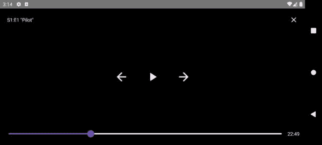
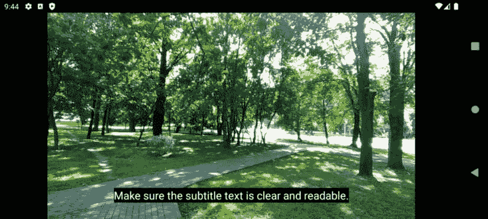

# 第八章：使用 ExoPlayer 将媒体播放添加到 Packtflix

在 Android 开发的旅程中，能够创建丰富、引人入胜的多媒体应用是一项至关重要的技能，它将优秀的应用与良好的应用区分开来。随着我们进一步探索创建类似 Netflix 的应用，我们将从浏览电影列表和详情的基础结构和用户界面过渡到多媒体体验的核心：视频播放。本章致力于挖掘我们应用中视频内容潜力，这一功能将显著提升用户参与度和满意度。在这里，我们将进入 Android 媒体播放的世界，重点关注功能强大且多才多艺的库——ExoPlayer。

ExoPlayer 在 Android 生态系统中脱颖而出，作为一个健壮的开源库，它为标准的 Android MediaPlayer API 提供了替代方案。它提供了广泛的定制选项，并支持广泛的媒体格式，包括那些 Android 本地不支持格式。我们的探索将从 Android 媒体选项概述开始，为为什么 ExoPlayer 是现代寻求提供卓越媒体播放体验的 Android 应用首选库奠定基础。

在介绍媒体选项之后，我们将学习 ExoPlayer 的基础知识，包括其架构、关键组件以及如何在 Android 应用程序中集成。这些基础知识将为我们应对视频播放的实际实现做好准备。本章将指导你创建一个响应式、直观的视频播放用户界面，以满足当今用户的期望。

旅程将继续，通过实际示例和详细指导，使用 ExoPlayer 播放视频。这包括管理播放控制、调整视频质量和处理各种媒体源。此外，在认识到可访问性和全球覆盖的重要性时，你将学习如何为你的视频添加字幕，确保你的内容能够被更广泛的观众所访问。

到本章结束时，你将掌握 Android 视频播放的基本知识，并具备用高质量视频内容丰富你应用的技能，为你的用户提供沉浸式体验。

在本章中，我们将涵盖以下主题：

+   检查 Android 的媒体选项

+   检查 Android 的媒体选项

+   创建视频播放用户界面

+   使用 ExoPlayer 播放视频

+   为视频播放器添加字幕

# 技术要求

如前一章所述，你需要安装 Android Studio（或你偏好的其他编辑器）。

我们将继续在*第七章*中开始的同一个项目中工作。您可以在本书的 GitHub 仓库中找到我们将在本章构建的完整代码：[`github.com/PacktPublishing/Thriving-in-Android-Development-using-Kotlin/tree/main/Chapter-8`](https://github.com/PacktPublishing/Thriving-in-Android-Development-using-Kotlin/tree/main/Chapter-8)。

# 检查 Android 的媒体选项

Android 作为一款多功能的移动操作系统，为各种类型的媒体提供了全面的支持，包括但不限于音频文件（如 MP3、WAV 和 OGG）和视频内容（如 MP4、WebM 和 MKV）。这种广泛的支持使开发者能够将各种媒体类型集成到他们的应用程序中，以满足不同的用户偏好和使用场景。从利用视频教程进行学习的教育应用，到流式传输电影和音乐的娱乐平台，媒体播放是现代移动应用的核心，推动用户参与度和满意度。

为了开始我们的旅程，让我们看看在 Android 生态系统中我们有哪些选项，以便我们可以选择最合适的选项来构建我们应用的视频播放功能。我们将从 MediaPlayer API 和 VideoView 开始，然后再考虑 ExoPlayer。

## 了解 MediaPlayer API

**MediaPlayer** API 是一个强大且灵活的类，它允许 Android 开发者以高度控制的方式处理音频和视频播放。该 API 设计得易于使用，同时能够满足复杂的媒体播放需求。

它的主要功能如下：

+   **多功能的媒体源支持**：MediaPlayer 可以从各种来源播放媒体，包括本地文件（如设备存储或 SD 卡）、原始资源（包含在应用中）和网络流（HTTP/HTTPS）。

+   **播放控制**：它提供了对媒体播放的全面控制，包括播放、暂停、停止、倒退和快进选项，以及寻求特定时间戳的能力。

+   **音量控制**：Android 中的 MediaPlayer API 允许开发者通过编程方式调整音频播放的音量。这是通过如 **setVolume(float leftVolume, float rightVolume)** 这样的方法实现的，它独立控制左右扬声器的音量级别。这一特性对于创建能够根据特定用户设置、环境条件或应用场景动态调整播放音量的应用程序至关重要。例如，一个应用可能会在夜间自动降低音量，或者在嘈杂的环境中提高音量以增强用户体验。

+   **事件处理**：MediaPlayer 提供了可以用于响应媒体生命周期事件的监听器，例如完成、准备、错误处理和缓冲更新。

+   **音频焦点管理**：对于播放音频的应用程序来说至关重要，MediaPlayer 可以处理音频焦点，以确保在多个应用程序可能同时播放声音时提供流畅的用户体验。

如我们所见，MediaPlayer 提供了我们需要的简单音频和视频处理的基本功能，因此它可能是以下情况的良好解决方案：

+   **音乐播放器**：MediaPlayer 非常适合播放音乐或播客文件的应用程序，无论是存储在本地还是通过互联网流式传输。

+   **视频播放器**：虽然与 VideoView 相比，MediaPlayer 需要更多的设置来播放视频，但它非常适合需要控制渲染和播放的自定义视频播放器应用程序。

+   **游戏音效**：对于需要播放短音效的游戏，MediaPlayer 可以因其简单性和处理各种音频格式的能力而被使用。

下面是一个使用 MediaPlayer 重新生成音频文件的示例：

```java
@Composable
fun AudioPlayerComposable() {
    val context = LocalContext.current
    val mediaPlayer = remember { MediaPlayer.create(
        context, R.raw.my_audio_file) }
    // Observe lifecycle to release MediaPlayer
    ObserveLifecycle(owner = ProcessLifecycleOwner.get()) {
        onExit = {
            mediaPlayer.release()
        }
    }
    Column(modifier = Modifier.padding(16.dp)) {
        Button(onClick = {
            if (!mediaPlayer.isPlaying) {
                mediaPlayer.start()
            }
        }) {
            Text("Play")
        }
        Button(onClick = {
            if (mediaPlayer.isPlaying) {
                mediaPlayer.pause() // Use pause or stop
                                       based on your need
            }
        }) {
            Text("Stop")
        }
    }
}
@Composable
fun ObserveLifecycle(owner: LifecycleOwner, onExit: () ->
Unit) {
    // Use DisposableEffect to manage lifecycle
    DisposableEffect(owner) {
        val observer = LifecycleEventObserver { _, event ->
            if (event == Lifecycle.Event.ON_DESTROY) {
                onExit()
            }
        }
        owner.lifecycle.addObserver(observer)
        onDispose {
            owner.lifecycle.removeObserver(observer)
        }
    }
}
```

在本例中，`MediaPlayer.create()` 在 `remember` 块中使用，以确保媒体播放器只实例化一次，并在组合的重组过程中保持此实例。然后，使用 `ObserveLifecycle` 组合函数来观察整个应用程序的生命周期（这里为了简单起见使用 `ProcessLifecycleOwner`）。此函数确保在应用程序销毁时调用 `mediaPlayer.release()` 以释放资源，尽管你可能需要根据需要将其适配到更具体的生命周期事件。

UI 由两个按钮组成，用于播放和停止功能。播放按钮的 `onClick` 逻辑在开始播放之前检查媒体是否当前未播放。这样做是为了避免在播放过程中按下按钮时重新启动音频和视频。同样，停止按钮暂停播放。

本例演示了如何在管理媒体播放器生命周期的同时将 MediaPlayer 与 Jetpack Compose 集成，并提供一个简单的 UI 来控制播放。您可以在官方文档中找到更多示例：[`developer.android.com/media/platform/mediaplayer`](https://developer.android.com/media/platform/mediaplayer)。

尽管我们的示例说明了如何提供播放控制 UI，但我们仍然需要显示视频，以便用户可以观看。这就是 VideoView 发挥作用的地方。

## 了解 VideoView

**VideoView** 是 Android 中的一个高级 UI 组件，它封装了 MediaPlayer 和 SurfaceView 的功能，以提供一种方便播放视频文件的方式。它通过管理底层的媒体播放机制简化了视频播放过程，使其非常适合需要直接视频播放而不需要精细控制媒体管道的场景。

注意

SurfaceView 是 Android 框架中的一个专用组件，它为应用视图层次结构提供了一个专门的绘图表面。与绘制在由 UI 线程管理的单个画布上的标准视图不同，SurfaceView 可以在单独的线程中独立渲染。这允许更高效的重新绘制，特别是对于视频播放或动态图形等要求较高的内容。SurfaceView 在您需要频繁更新视图或渲染过程计算密集时特别有用，因为它在绘图时不会阻塞用户交互。

让我们探索一些 VideoView 的功能，以便我们能够欣赏它提供的实际好处：

+   **简单性**：VideoView 简化了视频播放的实现。您只需几行代码就可以开始播放视频，自动处理视频文件的准备和播放。

+   **控制集成**：它可以轻松集成媒体控件（使用 MediaController），使用户能够播放、暂停和搜索视频。

+   **格式支持**：VideoView 支持 Android 的 MediaPlayer 支持的多种视频格式，包括 MP4、3GP 等，具体取决于设备和平台版本。

+   **布局灵活性**：作为一个视图，VideoView 可以放置在您应用布局的任何位置，可以根据需要调整大小和样式，就像任何其他 UI 组件一样。

理解 VideoView 的功能为其实际应用奠定了基础。现在，让我们精确地找出 VideoView 的亮点。以下是使用 VideoView 在您的应用中的最佳场景：

+   **简单视频播放**：当您需要播放视频而不需要高级播放功能，如自适应流式传输时，VideoView 是一个简单而有效的选择。自适应流式传输，如**HTTP 实时流**（**HLS**）和**HTTP 动态自适应流**（**DASH**），允许根据网络条件以不同的质量传输视频。HLS 在网页上的直播和点播流以及根据观众的网络速度动态调整视频质量方面得到广泛应用。同样，DASH 是一个灵活的标准，它允许在互联网上以高质量流式传输媒体内容。

+   **本地和网络视频**：它适用于播放存储在设备上的本地视频或通过网络流式传输的视频。

+   **嵌入式视频内容**：VideoView 非常适合需要在其 UI 中直接嵌入视频内容的应用程序，例如教程应用、视频播放器或带有视频流的社会媒体应用。

现在我们已经了解了其功能和推荐的使用案例，让我们通过一个示例来了解它是如何工作的。在这个例子中，我们使用的是`androidx.media:media`库的 1.7.0 版本：

```java
@Composable
fun VideoPlayer(modifier: Modifier = Modifier, videoUrl:
String) {
    val context = LocalContext.current
    AndroidView(
        modifier = modifier,
        factory = { ctx ->
            VideoView(ctx).apply {
                val mediaController = MediaController(ctx)
                setMediaController(mediaController)
                mediaController.setAnchorView(this)
                setVideoURI(Uri.parse(videoUrl))
                start() // Auto-start playback
            }
        }
    )
}
```

在这里，我们首先声明一个名为`VideoPlayer`的可组合组件。这个可组合组件接受一个`videoUrl`字符串作为参数。这指定了要播放的视频的位置。

在函数内部，使用`LocalContext.current`从 Compose 环境中获取当前上下文。然后，使用`AndroidView`可组合项来弥合传统 Android UI 组件和 Compose 世界之间的差距。它接受一个工厂 Lambda 表达式，其中通过上下文实例化`VideoView`。

接下来，创建`MediaController`并将其通过`setMediaController()`与`VideoView`关联，提供标准媒体控件，如播放、暂停和搜索，以增强用户与视频播放的交互。

使用`setAnchorView(this)`将媒体控制器锚定到`VideoView`上，确保控制界面在视频视图方面正确显示。传递给函数的视频 URL 被解析为一个`Uri`组件，并通过`setVideoURI()`设置在`VideoView`上，指向播放器的内容。

最后，在设置完成并且视频准备就绪后，通过在`VideoView`上调用`start()`方法来自动启动视频播放。

在本节中，我们简要了解了 MediaPlayer API 和 VideoView 的工作原理及其功能。现在，是时候关注皇冠上的宝石：ExoPlayer。

# 理解 ExoPlayer 的基础知识

**ExoPlayer**在 Android 的基本 MediaPlayer 之上取得了重大进步，提供了 MediaPlayer 无法比拟的灵活性、定制性和对高级流媒体格式的支持。这种优越性使得 ExoPlayer 成为需要强大、功能丰富媒体播放能力的开发者的首选选择。

ExoPlayer 最吸引人的优势之一是其适应性。与相对静态的 MediaPlayer 不同，ExoPlayer 可以轻松地适应和扩展以满足特定应用需求。其模块化架构允许开发者仅包含他们需要的组件，从而减少应用程序的整体大小。此外，ExoPlayer 的定制选项还扩展到其用户界面，能够创建与应用程序设计无缝集成的自定义控件和布局。这种适应性确保了开发者可以打造与他们的应用程序品牌和用户界面指南完美对齐的独特媒体播放体验。

在流媒体领域，ExoPlayer 的优势变得更加明显。它提供了对现代流媒体协议（如 HLS 和 DASH）的即插即用支持。这些自适应流媒体协议对于在互联网上高效传输内容至关重要，可以根据用户的当前网络条件实时调整流的质量。这确保了即使在网络速度波动的情况下，也能提供最佳的观看体验，最小化缓冲和播放中断。

与之相比，MediaPlayer 对此类流式传输协议的支持有限，通常需要开发者实现额外的解决方案或工作区来达到类似的功能。使用 ExoPlayer，开发者可以直接访问这些高级功能，简化开发过程并提升最终用户体验。

如我们所见，由于其灵活性和广泛格式支持，ExoPlayer 的功能非常优越，这也是我们将在项目中使用它的原因。另一方面，由于它更复杂，我们将在开始使用它实现视频播放器之前需要更多地了解它。

好吧，让我们就做这件事，并分解 ExoPlayer 的架构。

## 探索 ExoPlayer 的架构

ExoPlayer 的架构旨在既灵活又可扩展，使其能够处理广泛的媒体播放场景。ExoPlayer 有几个核心组件协同工作，以提供强大而高效的媒体播放体验。理解这些组件对于在应用中充分利用 ExoPlayer 的全部功能至关重要。让我们在这里看看它们。

### ExoPlayer 实例 – 中心媒体播放引擎

ExoPlayer 实例本身充当媒体播放的中心枢纽，协调播放过程中涉及的各个组件之间的交互，管理播放状态，并协调媒体内容的获取、解码和渲染。与作为黑盒操作的 Android 的 MediaPlayer 不同，ExoPlayer 为开发者提供了对播放和播放管道的详细控制，使他们能够进行精细调整以满足应用程序的特定需求。

下面是一个如何初始化 ExoPlayer 并准备播放媒体项的简单示例：

```java
val context = ... // Your context here
val player = ExoPlayer.Builder(context).build().apply {
    // Media item to be played
    val mediaItem =
        MediaItem.fromUri("http://example.com/media.mp3")
    // Set the media item to be played
    setMediaItem(mediaItem)
    // Prepare the player
    prepare()
    // Start playback
    playWhenReady = true
}
```

该过程从创建一个 `ExoPlayer` 实例开始，利用上下文感知的构建器模式确保播放器配置了其操作的环境。在其实例化之后，通过 URI 指定一个媒体项，该 URI 可以指向本地资源或远程媒体文件。然后，将此媒体项与 `ExoPlayer` 实例关联起来，表明它应该准备播放的内容。

一旦设置了媒体项，播放器将通过调用 `prepare()` 方法进入准备阶段。在此阶段，ExoPlayer 分析媒体内容，设置必要的缓冲区和解码资源，以确保流畅的播放。

该过程的最后一步是设置播放器的 `playWhenReady` 属性为 `true`，这是一个在播放器完全准备就绪后触发播放的命令。此属性提供了灵活性，允许开发者控制播放何时开始。这可以是准备完成后立即开始，也可以基于其他条件或用户交互进行延迟。

### MediaItem – 资源来源

在 ExoPlayer 中，**MediaItem**封装了有关媒体源的信息，例如其 URI、元数据和与播放相关的任何配置。它是一个多功能且至关重要的组件，告诉 ExoPlayer 要加载和播放什么内容。这些是 MediaItem 的关键功能：

+   **媒体源指定**：MediaItem 的主要功能是指定要播放的媒体的位置。这可以是文件路径、URL 或内容 URI 等多种格式之一。

+   **媒体配置**：MediaItem 不仅允许指定媒体源，还允许详细配置播放。这包括设置 DRM 配置、指定字幕以及通过元数据定义自定义属性。

+   **自适应流**：对于自适应流内容（如 DASH 和 HLS），MediaItem 可以为 ExoPlayer 提供必要的信息，以便根据网络条件动态调整流的品质。这些信息包括各种流段的 URL、可用的品质级别和编解码器等元数据。

+   **播放选项**：开发者可以使用 MediaItem 配置特定的播放选项，例如起始和结束位置、循环等。这些选项提供了对媒体播放的精细控制。

在实际操作中，一旦创建并配置了 MediaItem，它就会被传递给 ExoPlayer 实例，以便进行播放准备。您可以为简单的播放场景加载单个 MediaItem，或者通过加载多个 MediaItem 来管理播放列表。让我们看一个简短的例子：

```java
val mediaItem =
    MediaItem.fromUri("https://example.com/video.mp4")
player.setMediaItem(mediaItem)
player.prepare() // Prepares the player with the provided
                    MediaItem
player.playWhenReady = true // Starts playback as soon as
                               preparation is complete
```

在这个例子中，我们从一个 URL 创建`mediaItem`并准备它由 ExoPlayer 实例播放。

### 轨道选择器 – 管理媒体轨道

`TrackSelector`实例是 ExoPlayer 的一个关键组件，负责选择要播放的具体轨道。一个视频可能包含多种语言的多个音频轨道、多个视频品质或各种字幕轨道，而`TrackSelector`会根据设备的性能、用户偏好和网络条件，决定这些轨道中哪一个最适合当前的播放环境。这个选择过程对于自适应流场景至关重要，因为单个视频可能以多个品质级别编码并存储在服务器上。

这里是一个使用示例：

```java
val trackSelector =
    DefaultTrackSelector(context).apply {
        setParameters(buildUponParameters()
            .setPreferredAudioLanguage("en")
}
val player = ExoPlayer.Builder(context)
    .setTrackSelector(trackSelector)
    .build()
```

该过程从创建一个`DefaultTrackSelector`实例开始。`DefaultTrackSelector`实例是`ExoPlayer`的一个组件，它根据各种标准（如用户的设备性能和轨道属性）决定从媒体中播放哪些轨道（音频、视频或文本）。在这个例子中，轨道选择器被配置为优先选择英语音频轨道。这种偏好是通过修改轨道选择器的参数来设置的，表示如果媒体包含多种语言的多个音频轨道，则如果可用，应选择英语轨道。

配置完轨道选择器后，它被用于构建 `ExoPlayer` 实例。在这里，`ExoPlayer.Builder` 在构建播放器时提供了应用程序上下文和自定义的轨道选择器。这确保了当 `ExoPlayer` 实例准备和播放媒体时，它使用 `DefaultTrackSelector` 中定义的逻辑进行轨道选择。本质上，这种设置允许在播放期间对选择哪个音频轨道有更多的控制，基于预定义的标准（在这种情况下，是语言偏好）。

这种配置 ExoPlayer 的方法特别适用于处理包含针对不同受众群体的多个轨道的媒体的应用程序，或者在应用程序需要遵守用户偏好或设置（如语言选择选项）的场景中。通过自定义轨道选择器，开发者可以确保媒体播放体验针对用户的特定需求和偏好进行了优化，从而提高整体可用性和满意度。

### LoadControl – 处理缓冲和加载

`LoadControl` 组件负责监控缓冲和加载媒体资源的策略。高效的缓冲对于流畅的播放至关重要，尤其是在网络条件可能大范围变化的流媒体场景中。`LoadControl` 组件决定在任何给定时间需要缓冲多少媒体数据，在减少初始加载时间和最小化播放中断的可能性之间取得平衡。我们可以自定义缓冲策略以满足特定需求，例如优先考虑快速启动时间或确保无缝播放。

以下是一个创建自定义 `LoadControl` 组件以修改缓冲策略的示例：

```java
val loadControl = DefaultLoadControl.Builder().apply {
    // Set minimum buffer duration to 2 minutes
    setBufferDurationsMs(
        minBufferMs = 2 * 60 * 1000,
        maxBufferMs =
            DefaultLoadControl.DEFAULT_MAX_BUFFER_MS,
        bufferForPlaybackMs =
            DefaultLoadControl
            .DEFAULT_BUFFER_FOR_PLAYBACK_MS,
        bufferForPlaybackAfterRebufferMs =
            DefaultLoadControl
            .DEFAULT_BUFFER_FOR_PLAYBACK_AFTER_REBUFFER_MS
    )
}.build()
val player = ExoPlayer.Builder(context)
    .setLoadControl(loadControl)
    .build()
// Continue setting up the player as before
```

示例开始于使用 `Builder` 创建 `DefaultLoadControl` 实例。在这里，`DefaultLoadControl` 是 ExoPlayer 提供的 `LoadControl` 接口的一个实现，它旨在根据我将解释的各种参数来管理媒体缓冲。

在构建器上调用 `setBufferDurationsMs` 方法来指定自定义缓冲持续时间。具体来说，它将最小缓冲持续时间（`minBufferMs`）设置为 2 分钟（120,000 毫秒）。这意味着 ExoPlayer 将尝试在开始播放之前至少缓冲 2 分钟的媒体，这有助于确保在变化多端的网络条件下播放流畅。

其他参数（`maxBufferMs`、`bufferForPlaybackMs` 和 `bufferForPlaybackAfterRebufferMs`）被设置为它们的默认值，这些默认值在 `DefaultLoadControl` 中预定义。这些参数分别控制最大缓冲区大小、必须缓冲的最小媒体量以开始播放，以及重新缓冲后必须缓冲的最小媒体量。

注意

如果你想了解更多关于上述选项的信息，你可以在**DefaultLoadControl.Builder**的文档中找到所有详细信息：[`developer.android.com/reference/androidx/media3/exoplayer/DefaultLoadControl.Builder`](https://developer.android.com/reference/androidx/media3/exoplayer/DefaultLoadControl.Builder)。

配置缓冲持续时间后，调用`build()`方法来创建具有指定设置的`DefaultLoadControl`实例。

然后，通过`ExoPlayer.Builder`的`setLoadControl`方法将此自定义`LoadControl`组件设置在新的`ExoPlayer`实例上。这一步将自定义缓冲策略与播放器集成，意味着播放器将在播放期间使用指定的缓冲持续时间。

最后，在`ExoPlayer.Builder`上调用`build`方法来创建配置了自定义`LoadControl`组件的`ExoPlayer`实例。

### 渲染器 – 将媒体渲染到输出

渲染器是输出媒体到适当目的地的组件，例如将视频帧渲染到屏幕或将音频样本渲染到扬声器。ExoPlayer 使用不同的渲染器处理不同类型的轨道，允许并行处理和渲染音频、视频和文本轨道。这种分离使得 ExoPlayer 能够高效地支持广泛的媒体类型和格式。此外，开发者可以实现自定义渲染器来处理非标准媒体类型或在播放前对媒体应用特殊处理。

为了说明这一点，考虑以下示例，其中使用自定义渲染器将灰度过滤器应用于视频内容：

```java
class GrayscaleVideoRenderer(
    eventHandler: Handler,
    videoListener: VideoRendererEventListener,
    maxDroppedFrameCountToNotify: Int
) : SimpleDecoderVideoRenderer(eventHandler, videoListener, maxDroppedFrameCountToNotify) {
    override fun onOutputFormatChanged(format: Format,
    outputMediaFormat: MediaFormat?) {
        super.onOutputFormatChanged(format,
            outputMediaFormat)
        // Setup to modify the color format to grayscale
    }
    override fun renderOutputBufferToSurface(buffer:
    OutputBuffer, surface: Surface,
    presentationTimeUs: Long) {
        // Apply grayscale effect to the buffer before
           rendering to the surface
    }
}
```

`GrayscaleVideoRenderer`类扩展了 ExoPlayer 的`SimpleDecoderVideoRenderer`，在播放期间将灰度效果应用于视频帧。这种定制允许它不仅解码和显示视频，还能实时将每个帧转换为灰度，增强视觉呈现以适应风格选择或无障碍性。

在初始化时，此渲染器接受一个`Handler`组件用于线程安全的事件分发，一个`VideoRendererEventListener`组件用于管理视频事件，以及一个整数，用于设置通知关于丢失帧的阈值。这种设置有助于保持播放的流畅和响应。

它重写了`onOutputFormatChanged`方法，在这里它为视频格式变化做准备。这是设置灰度处理调整的地方。`renderOutputBufferToSurface`方法是将灰度效果应用于每个视频帧，在它们被渲染到屏幕之前。

现在我们已经熟悉了 ExoPlayer 最重要的组件，让我们将其集成到我们的项目中。

## 将 ExoPlayer 集成到我们的项目中

要集成 ExoPlayer，我们必须在我们的版本目录中包含必要的库依赖项：

```java
[versions]
...
exoPlayer = "1.2.1"
[libraries]
...
exoPlayer-core = { module = "androidx.media3:media3-exoplayer", version.ref = "exoPlayer" }
exoPlayer-ui = { module = " androidx.media3:media3-ui", version.ref = "exoPlayer" }
```

与我们包含的每个依赖项一样，我们必须将它们添加到我们将要使用的模块的`build.gradle`文件中。在这种情况下，我们将将其添加到`build.gradle`文件中的`:feature:playback`：

```java
dependencies {
    implementation(libs.exoPlayer.core)
    implementation(libs.exoPlayer.ui)
}
```

使用这两个依赖项，我们拥有了使用 ExoPlayer 所需的所有组件：

+   **androidx.media3:media3-exoplayer**：这是 Media3 库中 ExoPlayer 的核心模块。它包括媒体播放功能所需的必需类和接口。此模块为媒体播放提供基本组件，包括 ExoPlayer 接口、媒体源处理和播放控制逻辑。它是 Media3 中媒体播放的骨架，提供高性能、低级别的媒体播放功能。

+   **androidx.media3:media3-ui**：此模块为 Media3 库中的媒体播放提供用户界面组件。它包括预构建的 UI 组件，如**PlayerView**（一个显示视频内容和播放控制的视图）以及其他用于控制媒体播放的 UI 元素。如果需要，这些组件可以被自定义或替换为自定义实现。此模块帮助开发者快速将 ExoPlayer 与用于媒体播放的功能性 UI 集成。

现在，我们已经准备好了。在下一节中，我们将构建我们的播放 UI 并将其与 ExoPlayer 连接。

# 创建视频播放用户界面

在本节中，我们将构建视频播放 UI，并关注基本要素：标题栏、关闭按钮、播放/暂停、快进和快退按钮、进度条和时间指示器。我们将首先创建`PlaybackScreen`可组合组件，这是此新屏幕的主要可组合组件，之后我们将添加使它功能化的附加组件。

## 构建`PlaybackScreen`及其可组合组件

让我们开始构建`PlaybackScreen`可组合组件：

```java
@Composable
fun PlaybackScreen() {
    Box(
        modifier = Modifier
            .fillMaxSize()
            .background(Color.Black)
    ) {
        TopMediaRow(Modifier.align(Alignment.TopCenter))
        PlayPauseButton(Modifier.align(Alignment.Center))
        ProgressBarWithTime(Modifier
            .align(Alignment.BottomCenter))
    }
}
```

我们首先声明一个填充整个屏幕并设置其背景为黑色的`Box`容器，模仿视频播放界面通常首选的暗黑模式。在这个`Box`容器内，我们放置了构成我们播放 UI 的三个关键组件：顶部媒体行、播放/暂停按钮和带有时间指示器的进度条。

在这里，`TopMediaRow`位于屏幕顶部中央，可能包含标题栏和关闭按钮。然后，`PlayPauseButton`放置在屏幕中央，使用户能够通过简单的点击开始或暂停播放。最后，`ProgressBarWithTime`对齐在底部中央，使用户能够看到视频播放了多少以及还剩下多少。每个这些组件都使用`Modifier.align`方法在`Box`容器内对齐，确保它们在 UI 中的位置正好是我们想要的。

现在我们已经构建了屏幕的基础，包括每个需要的可组合组件，是时候构建它们了。我们将从`TopMediaRow`可组合组件开始：

```java
@Composable
fun TopMediaRow(modifier: Modifier = Modifier) {
    Row(
        modifier = modifier.fillMaxWidth().padding(20.dp),
        horizontalArrangement = Arrangement.SpaceBetween,
        verticalAlignment = Alignment.CenterVertically
    ) {
        Text(text = "S1:E1 - Pilot", color = Color.White)
        Icon(imageVector = Icons.Default.Close,
            contentDescription = "Close",
                tint = Color.White)
    }
}
```

在这个`TopMediaRow`可组合函数中，我们正在设计视频播放 UI 的顶部部分，该部分专门用于显示剧集信息和关闭按钮。此函数使用`Row`布局在其屏幕上水平排列其元素。应用于此`Row`布局的修饰符确保它扩展以填充其父容器的最大宽度，并在其边缘应用 20 **密度无关像素**（**dp**）的填充，以实现整洁、无杂乱的外观。

在`Row`布局中，我们使用两个主要组件：`Text`和`Icon`：

+   **Text**组件显示剧集信息，例如**S1:E1 ‘Pilot’**，以白色显示，使其在视频播放屏幕典型的深色背景上易于可见。

+   **Icon**组件使用默认的“关闭”符号，其色调也设置为白色，以保持一致性和可见性。**horizontalArrangement**属性设置为**Arrangement.SpaceBetween**，以确保文本和图标位于行的两端，而**verticalAlignment**保持它们在行内垂直居中。

现在，让我们转到下一行，其中包含`PlayPauseButton`可组合元素：

```java
@Composable
fun PlayPauseButton(modifier: Modifier = Modifier) {
    Row(
        horizontalArrangement = Arrangement.Center,
        verticalAlignment = Alignment.CenterVertically,
        modifier = modifier
    ) {
        IconButton(
            modifier = Modifier.padding(20.dp),
            onClick = { /* Rewind action */ })
        {
            Icon(
                modifier = Modifier
                    .height(80.dp)
                    .width(80.dp),
                imageVector = Icons.Default.ArrowBack,
                contentDescription = "Rewind 10s",
                tint = Color.White)
        }
        IconButton(
            modifier = Modifier
                .padding(20.dp),
            onClick = { /* Play/Pause action */ }
        ) {
            Icon(
            modifier = Modifier
                .height(80.dp)
                .width(80.dp),
            imageVector = Icons.Default.PlayArrow,
            contentDescription = "Play/Pause",
            tint = Color.White)
        }
        IconButton(
            modifier = Modifier
                .padding(20.dp),
            onClick = { /* Fast-forward action */ }) {
            Icon(
                modifier = Modifier
                    .height(80.dp)
                    .width(80.dp),
                imageVector = Icons.Default.ArrowForward,
                contentDescription = "Fast-forward 10s",
                tint = Color.White)
        }
    }
}
```

`PlayPauseButton`可组合函数将为视频播放提供中央控制机制，并在单个直观界面上集成倒退、播放/暂停和快进操作。此函数使用`Row`布局水平对齐其子元素——每个控制动作的按钮——使它们在水平和垂直方向上居中。

每个按钮都是使用`IconButton`组件创建的。这些按钮之间有 20 dp 的填充，以确保它们可以舒适地触摸，而不会意外按下。倒退、播放/暂停和快进图标的大小统一为 80 dp x 80 dp，足够大，易于触摸和视觉识别。

每个`IconButton`中的`Icon`组件被特别选择以直观地表示它们各自的操作：一个指向后方的箭头表示倒退，一个播放/暂停的箭头，以及一个指向前方的箭头表示快进，每个操作都伴随着内容描述，以提高可访问性。`onClick`参数中的占位符注释表明每个按钮的功能——通过 10 秒倒退视频、在播放和暂停之间切换，以及通过 10 秒快进——将在何处实现。

最后，我们还有一个需要构建的可组合元素，即`ProgressBarWithTime`可组合元素：

```java
@Composable
fun ProgressBarWithTime(modifier: Modifier = Modifier) {
    Row(
        modifier = modifier
            .fillMaxWidth()
            .wrapContentHeight()
            .padding(horizontal = 16.dp, vertical = 8.dp),
        horizontalArrangement = Arrangement.SpaceBetween,
        verticalAlignment = Alignment.CenterVertically
    ) {
            val progress = remember { mutableStateOf(0.3f)
                } // Dummy progress
            val formattedTime = "22:49" // Dummy time
            Row(
                modifier = Modifier.fillMaxWidth(),
                verticalAlignment =
                    Alignment.CenterVertically
            ) {
                Slider(
                    value = progress.value,
                    onValueChange =
                        { progress.value = it },
                    modifier = Modifier.weight(1f)
                )
                Spacer(modifier = Modifier.width(8.dp))
                Text(text = formattedTime,
                    color = Color.White)
            }
    }
}
```

这个可组合元素被包裹在一个`Row`布局中，它占据最大可用宽度（以适应视频长度）并调整其高度以紧密包裹内容，确保边缘有足够的填充，从而实现平衡的布局。

核心功能围绕两个元素展开：

+   **滑动条**组件代表视频的进度。它使用一个初始化为**0.3**（30%进度）的可变状态来模拟视频播放的当前位置。这个状态是可交互调整的，允许用户在视频中搜索。`onValueChange`事件更新进度状态，反映用户的输入。为了在视觉上将进度条与时间指示器分开，并确保布局保持直观，我们在这些元素之间插入了一个空格，以保持清晰的区分。

+   在**滑动条**组件旁边，**文本**组件以白色显示当前播放时间（目前设置为**22:49**，直到我们集成播放功能）。显示时间是为了向用户提供关于视频播放进度或剩余时间的精确信息，通过提供对视频播放的精确控制来增强用户体验。

虽然我们的播放界面看起来已经完整，但在集成播放功能本身之前，我们仍有一件事需要关注。当我们观看视频时，我们不希望所有这些控件都占据屏幕，使得观看内容变得困难。通常情况下，当用户没有与屏幕交互时，控件会自动消失。因此，让我们实现这个更改。

## 在播放内容时使控件消失

我们知道如果播放控件一段时间内没有被使用，它们应该消失。最简单的方法是有一个值来指示控件是否可见，并且当屏幕空闲一段时间后，我们将修改其值为`false`。让我们在`PlaybackScreen`可组合组件中进行以下修改：

```java
@Composable
fun PlaybackScreen() {
    val isControlsVisible = remember { mutableStateOf(true) }
    val coroutineScope = rememberCoroutineScope()
    Box(
        modifier = Modifier
            .fillMaxSize()
            .background(Color.Black)
            .pointerInput(Unit) {
                detectTapGestures(
                    onPress = {
                        // Reset the visibility timer on
                           user interaction
                        isControlsVisible.value = true
                        coroutineScope.launch {
                            delay(15000) // 15 seconds
                                            delay
                            isControlsVisible.value = false
                        }
                    }
                )
            }
    ) {
        if (isControlsVisible.value) {
            TopMediaRow(Modifier.align(Alignment.TopCenter))
            PlayPauseButton(Modifier.align(
                Alignment.Center))
            ProgressBarWithTime(Modifier.align(
                Alignment.BottomCenter))
        }
    }
}
```

这些修改的核心思想是跟踪用户交互并使用计时器来确定何时隐藏控件。最初，如前所述，我们将引入一个状态来管理控件的可视性。这个状态可能是一个布尔值，根据用户交互和没有交互的时间流逝在可见和不可见（`true`和`false`）之间切换。

为了检测用户交互，我们可以将包含我们的播放界面组件的`Box`布局包裹在`Modifier.pointerInput` Lambda 中。在这个 Lambda 内部，我们可以监听触摸输入事件，每次检测到触摸时，我们可以重置计时器——一个使用`LaunchedEffect`启动的协程，其键是可见状态，可能负责处理这一点。这个协程将在检测到 15 秒的无操作（没有触摸事件）后，将控件的可视状态设置为`false`，从而有效地隐藏它们。为了确保当用户再次与屏幕交互时控件重新出现，相同的触摸输入检测机制将可视状态设置回`true`，并且协程将重新开始倒计时。

集成此功能需要修改`PlaybackScreen`组合函数，以便它包括对可见性的状态处理，并可以修改`TopMediaRow`、`PlayPauseButton`和`ProgressBarWithTime`函数，使它们能够接受并响应可见状态。这意味着这些组件只有在状态指示它们应该可见时才会被渲染。

一旦完成，我们的播放 UI 应看起来像这样：



图 8.1：完成播放 UI（显示控件）

当控件隐藏时，它应仅显示视频内容（目前尚未可见，因为它尚未实现）：


图 8.2：完成播放 UI（隐藏控件）

在本节中，我们创建了一个用于显示视频的 UI。在下一节中，我们将集成 ExoPlayer，以便我们的应用可以开始播放视频。

# 使用 ExoPlayer 播放视频

在本节中，我们将充分利用 ExoPlayer 的强大功能，以便将其集成到我们新创建的视频播放 UI 中。让我们学习如何实现这一点。

## 创建 PlaybackActivity

我们将首先创建一个名为`PlaybackActivity`的新`Activity`来提供此功能：

```java
class PlaybackActivity: ComponentActivity() {
    override fun onCreate(savedInstanceState: Bundle?) {
        super.onCreate(savedInstanceState)
        setContent {
            PlaybackScreen()
        }
    }
}
```

这个`PlaybackActivity`活动将在其内容中显示我们已创建的`PlaybackScreen()`。

我们还希望我们的播放 UI 始终以横屏模式显示。为此，我们将在`AndroidManifest.xml`文件中配置此活动，如下所示：

```java
<?xml version="1.0" encoding="utf-8"?>
<manifest xmlns:android =
"http://schemas.android.com/apk/res/android">
    <application>
        <activity android:name =
        "com.packt.playback.presentation.PlaybackActivity"
        android:screenOrientation="landscape"/>
    </application>
</manifest>
```

在这里，我们声明`PlaybackActivity`，使其具有强制横屏屏幕方向。这将确保它将以横屏模式渲染，无论用户手持手机的方向如何。

## 创建 PlaybackViewModel

现在，我们需要创建播放器，这是负责管理媒体播放的组件。我们将创建`PlaybackViewModel`来处理`ExoPlayer`实例以及视图与视频播放器交互和观看媒体所需的所有逻辑。

首先，我们将构建`PlaybackViewModel`中播放器的基本设置逻辑：

```java
@HiltViewModel
class PlaybackViewModel @Inject constructor(): ViewModel()
{
    lateinit var player: ExoPlayer
    @OptIn(UnstableApi::class)
    private fun preparePlayerWithMediaSource(exoPlayer:
    ExoPlayer) {
        val mediaUrl = "https://example.com/media.mp4"
        val mediaSource = ProgressiveMediaSource.Factory(
            DefaultHttpDataSource.Factory())
            .createMediaSource(MediaItem.fromUri(mediaUrl))
        exoPlayer.setMediaSource(mediaSource)
        exoPlayer.prepare()
    }
    fun setupPlayer(context: Context) {
        player = ExoPlayer.Builder(context).build().also {
        exoPlayer ->
            preparePlayerWithMediaSource(exoPlayer)
        }
    }
    override fun onCleared() {
        super.onCleared()
        player.release()
        progressUpdateJob?.cancel()
    }
}
```

这是我们的`PlaybackViewModel`组合组件的开始，它被设计用来管理 Android 应用的媒体播放功能。

这个`ViewModel`的核心组件是`ExoPlayer`实例，它存储在一个名为`player`的属性中。这个`player`属性负责所有媒体播放操作。然而，当`ViewModel`首次创建时，播放器尚未初始化；它使用`lateinit`声明，意味着它将在稍后初始化，但在任何其他组件需要访问它之前。

`setupPlayer` 函数是公开的，并预期使用一个 `Context` 对象来调用，该对象提供了访问特定应用程序资源和类的权限。在这个函数内部，使用 `ExoPlayer.Builder` 创建 `ExoPlayer` 的实例。这个设置过程包括在构建器上调用 `build()` 方法，该方法返回一个完全配置的 `ExoPlayer` 实例。在创建这个实例后，立即执行 `also` 块，使用新创建的播放器调用 `preparePlayerWithMediaSource` 方法。

`preparePlayerWithMediaSource` 方法是设置实际媒体源的地方。它接受一个 `ExoPlayer` 实例作为参数，并将其配置为播放特定的媒体文件。媒体文件的 URL 定义为 [`example.com/media.mp4`](https://example.com/media.mp4)。为了播放此媒体，创建了一个 `ProgressiveMediaSource`，它适合通过 HTTP 播放常规媒体文件，如 MP4。然后使用 `setMediaSource` 方法将此媒体源附加到 `ExoPlayer` 实例，并调用 `prepare()` 准备播放器。值得注意的是，此方法被标记为私有，意味着它仅打算在 `PlaybackViewModel` 类中使用。`@OptIn(UnstableApi::class)` 注解表示此方法使用尚未稳定的 API，将来可能会更改。

最后，`onCleared` 方法覆盖了 `ViewModel` 生命周期回调，当 `ViewModel` 即将销毁时被调用。此方法通过调用 `player.release()` 释放 `ExoPlayer` 实例，确保释放资源并防止内存泄漏。

现在，我们将在 `PlaybackScreen` 中添加渲染媒体内容的视图并将其连接到播放器：

```java
@Composable
fun PlaybackScreen() {
    val viewModel: PlaybackViewModel = hiltViewModel()
    val isControlsVisible = remember { mutableStateOf(true) }
    val coroutineScope = rememberCoroutineScope()
    viewModel.setupPlayer(LocalContext.current)
    Box(
        modifier = Modifier
            .fillMaxSize()
            .background(Color.Black)
            .pointerInput(Unit) {
                detectTapGestures(
                    onPress = {
                        isControlsVisible.value = true
                        coroutineScope.launch {
                            delay(15000) // 15 seconds
                                            delay
                            isControlsVisible.value = false
                        }
                    }
                )
            }
    ) {
        VideoPlayerComposable(
            modifier = Modifier.matchParentSize(),
            player = viewModel.player
        )
        if (isControlsVisible.value) {
            ...
        }
    }
}
```

在 `PlaybackScreen` 组合组件中，我们使用 `hiltViewModel()` 获取 `PlaybackViewModel` 的实例。这个 `ViewModel` 对于管理媒体播放的生命周期和应用程序内的交互至关重要。

一旦 `ViewModel` 准备就绪，我们调用 `viewModel.setupPlayer(LocalContext.current)` 来初始化 `ExoPlayer`。这个设置至关重要，因为它使用适当的 Android 上下文准备播放器，使其能够有效地加载和播放媒体文件。确保 `ExoPlayer` 使用当前上下文初始化有助于有效地管理资源，这对于流畅的播放至关重要。

负责显示视频的 UI 组件是 `VideoPlayerComposable`。我们将从 `ViewModel` 中初始化的播放器传递给这个组合组件，它被放置在一个 `Box` 布局中。这个布局被配置为填充其父级的最大尺寸，并设置黑色背景以强调视频内容。`Box` 布局还处理用户交互，监听触摸手势以切换播放控制器的可见性。当检测到触摸时，它会使控制器可见，并启动一个协程，如果在 15 秒内没有进一步的交互，则再次隐藏这些控制器。

在 `Box` 布局内部，条件逻辑检查 `isControlsVisible` 的值。如果为 `true`，则播放控制器将渲染在视频上方。这允许用户与视频交互，例如暂停、跳过或调整音量，但仅在他们选择显示控件时。

最后，我们将探讨如何实现 `VideoPlayerComposable`，以便我们能够有效地利用播放器渲染视频，同时动态响应用户对播放控制器的交互。

让我们看看我们如何实现这个新的可组合项。不幸的是，在撰写本文时，该库没有提供 Jetpack Compose 选项来显示播放器，因此我们需要在 `AndroidView` 可组合项内部创建一个，如下所示：

```java
@Composable
fun VideoPlayerComposable(
    modifier: Modifier = Modifier,
    player: ExoPlayer
) {
    AndroidView(
        factory = { ctx ->
            PlayerView(ctx).apply {
                layoutParams = ViewGroup.LayoutParams(
                    MATCH_PARENT, MATCH_PARENT)
                setPlayer(player)
                useController = false
            }
        },
        modifier = modifier,
        update = { view ->
            view.player = player
        }
    )
}
```

`VideoPlayerComposable` 函数接受两个参数：

+   **Modifier** 实例允许你在 UI 的其他地方使用此可组合项时自定义其布局或外观。

+   **ExoPlayer** 实例是处理视频内容实际播放的媒体播放器。

在 `AndroidView` 可组合项内部，工厂 Lambda 是创建传统 Android 视图的地方——在本例中是 `PlayerView`。在这里，`PlayerView` 是由 `ExoPlayer` 库提供的用于显示视频内容和播放控制器的视图。在这里，它使用应用程序上下文 (`ctx`) 进行初始化。

创建 `PlayerView` 后，一些属性被设置在其上：

+   在这里，`layoutParams` 被设置为 **MATCH_PARENT**，用于宽度和高度，使 **PlayerView** 填充分配给它的整个空间。这确保视频将占用尽可能多的空间，通常是整个屏幕或父容器。

+   然后，**setPlayer(player)** 将传递的 **ExoPlayer** 实例附加到 **PlayerView** 上。这种连接允许在 **ExoPlayer** 中加载的视频显示在这个视图中。

+   最后，**useController** 被设置为 **false**，表示不会使用 **PlayerView** 提供的默认播放控制器（如播放、暂停和进度条）。我们将在下一部分实现自己的控件。

最后，`AndroidView` 的更新 Lambda 是你可以根据可组合项的状态或属性的变化来更新 `PlayerView` 属性的地方。

经过这些更改，我们的播放器已经准备好通过 `ViewPlayer` 开始渲染媒体。但我们还有工作要做。我们需要将已经开发的控件绑定到播放器控件上，并保持视频的时间和进度条更新。

## 将控件与 ExoPlayer 连接

让我们从修改 `PlayPauseButton` 可组合项开始。在这种情况下，我们需要将控制函数与 ViewModel 绑定：

```java
@Composable
fun PlayPauseButton(
    isPlaying: Boolean,
    onRewind: () -> Unit,
    onPlayPause: () -> Unit,
    onFastForward: () -> Unit,
    modifier: Modifier = Modifier,
    ) {
    Row(
        horizontalArrangement = Arrangement.Center,
        verticalAlignment = Alignment.CenterVertically,
        modifier = modifier
    ) {
        IconButton(
            onClick = onRewind,
            modifier = Modifier.padding(20.dp)
        ) {
            Icon(
                modifier = Modifier
                    .height(80.dp)
                    .width(80.dp),
                imageVector = Icons.Default.ArrowBack,
                contentDescription = "Rewind 10s",
                tint = Color.White
            )
        }
        IconButton(
            onClick = onPlayPause,
            modifier = Modifier.padding(20.dp)
        ) {
            Icon(
                modifier = Modifier
                    .height(80.dp)
                    .width(80.dp),
                imageVector = if (isPlaying)
                    Icons.Default.Close else
                    Icons.Default.PlayArrow,
                contentDescription = if (isPlaying) "Pause"
                    else "Play",
                tint = Color.White
            )
        }
        IconButton(
            onClick = onFastForward,
            modifier = Modifier.padding(20.dp)
        ) {
            Icon(
                modifier = Modifier
                    .height(80.dp)
                    .width(80.dp),
                imageVector = Icons.Default.ArrowForward,
                contentDescription = "Fast-forward 10s",
                tint = Color.White
            )
        }
    }
}
```

现在，`PlayPauseButton` 可组合项接受几个参数，每个参数在 UI 组件中都有特定的用途：

+   **isPlaying**（布尔值）：此参数指示视频的当前播放状态。它用于确定在播放/暂停按钮上显示哪个图标——当视频暂停时显示播放图标，当视频正在播放时显示暂停图标。这使用户能够从用户的角度进行直观的控制交互。

+   **onRewind**（Lambda 函数）：这是一个在用户按下倒退按钮时触发的回调函数。它应该包含视频倒退时发生的逻辑，例如通过固定量向后移动播放位置。

+   **onPlayPause**（Lambda 函数）：当按下播放/暂停按钮时执行此函数。它根据当前状态处理在播放和暂停之间切换视频，使用户能够无缝控制视频播放。

+   **onFastForward**（Lambda 函数）：类似于 **onRewind**，当按下快进按钮时激活此回调。它控制快进视频的逻辑，通过预定的间隔向前移动播放位置。

+   **modifier**（修饰符）：此参数允许自定义可组合组件内按钮行的外观和布局。正如我们之前所看到的，可以使用它来应用填充、定义对齐方式和设置尺寸。

现在我们已经添加了这些新参数，我们需要从父可组合组件中传递它们。以下是包含并调用此可组合组件所需参数的方法：

```java
val isPlaying = viewModel.isPlaying.collectAsState()
PlayPauseButton(
    isPlaying = isPlaying.value,
    onRewind = { viewModel.rewind() },
    onFastForward = {viewModel.fastForward() },
    onPlayPause = {viewModel.togglePlayPause() },
    modifier = Modifier.align(Alignment.Center)
)
```

如我们所见，我们已经将每个 Lambda 参数绑定到（尚未实现的）`ViewModel` 函数上，并且我们提供了一个 `isPlaying` 状态来反映播放器的当前播放状态。

现在，让我们在 `ViewModel` 中实现这些函数：

```java
private val _isPlaying = MutableStateFlow<Boolean>(false)
val isPlaying: MutableStateFlow<Boolean> = _isPlaying
fun setupPlayer(context: Context) {
    player = ExoPlayer.Builder(context).build().also {
    exoPlayer ->
        preparePlayerWithMediaSource(exoPlayer)
        exoPlayer.addListener(object : Player.Listener {
            override fun onIsPlayingChanged(isPlaying:
            Boolean) {
                _isPlaying.value = isPlaying
            }
            override fun onPlaybackStateChanged(
            playbackState: Int) {
                super.onPlaybackStateChanged(playbackState)
            }
            override fun onPositionDiscontinuity(
            oldPosition: Player.PositionInfo, newPosition:
            Player.PositionInfo, reason: Int) {
                super.onPositionDiscontinuity(oldPosition,
                    newPosition, reason)
            }
            override fun onTimelineChanged(timeline:
            Timeline, reason: Int) {
                super.onTimelineChanged(timeline, reason)
            }
        })
    }
}
fun togglePlayPause() {
    if (player.isPlaying) {
        player.pause()
    } else {
        player.play()
    }
}
fun rewind() {
    val newPosition =
        (player.currentPosition - 10000).coerceAtLeast(0)
    player.seekTo(newPosition)
}
fun fastForward() {
    val newPosition =
        (player.currentPosition + 10000)
            .coerceAtMost(player.duration)
    player.seekTo(newPosition)
}
```

首先，我们定义了一个私有可变状态流 `_isPlaying`，用于跟踪视频是否正在播放。这个相同的状态流被公开作为名为 `isPlaying` 的 `MutableStateFlow` 组件。在这种情况下，`isPlaying` 作为播放状态的单一真相来源，允许我们的 UI 组件根据视频是否播放或暂停进行响应式更新。

我们已经实现的 `setupPlayer` 函数初始化了 `ExoPlayer` 实例。现在，它还附加了一个监听器来响应播放事件。添加的监听器覆盖了多个方法，但最重要的是，使用 `onIsPlayingChanged` 来根据播放器的状态更新 `_isPlaying.value`。

我们还包含了从可组合组件中已经调用的操作播放功能：

+   **togglePlayPause**：此方法检查播放器是否正在播放，并在播放和暂停之间切换。此方法直接控制播放器的状态，成为用户与播放交互的主要方式。

+   **倒退**和**快进**：这些选项基于当前播放位置计算新位置并跳转到该位置。**倒退**函数将播放位置向后移动 10 秒，而**快进**函数将播放位置向前移动 10 秒。这些方法增强了用户对视频的控制，允许在内容中快速导航。

现在，让我们连接下一个（也是最后一个）可组合的组件，`ProgressBarWithTime`：

```java
@Composable
fun ProgressBarWithTime(
    currentPosition: Long,
    duration: Long,
    onSeek: (Long) -> Unit,
    modifier: Modifier = Modifier,
) {
    val progress =
        if (duration > 0) currentPosition.toFloat() /
            duration else 0f
    val formattedTime =
        "${formatTime(currentPosition)} /
            ${formatTime(duration)}"
    Row(
        modifier = modifier
            .fillMaxWidth()
            .wrapContentHeight()
            .padding(horizontal = 16.dp, vertical = 8.dp),
        horizontalArrangement = Arrangement.SpaceBetween,
        verticalAlignment = Alignment.CenterVertically
    ) {
        Slider(
            value = progress,
            onValueChange = { newValue ->
                val newPosition =
                    (newValue * duration).toLong()
                onSeek(newPosition)
            },
            modifier = Modifier.weight(1f),
            valueRange = 0f..1f
        )
        Spacer(modifier = Modifier.width(8.dp))
        Text(text = formattedTime, color = Color.White)
    }
}
```

函数现在接受三个新参数：`currentPosition` 和 `duration` 分别表示当前播放位置和视频总长度（以毫秒为单位），以及一个定义当用户搜索到新位置时要执行的操作的 `onSeek` Lambda 函数。

`progress` 变量计算视频的进度，表示为介于 0 和 1 之间的浮点数。这是通过将 `currentPosition` 除以 `duration` 来实现的，`duration` 指定了已播放视频的比例。如果持续时间是 0（为了避免除以零），进度设置为 `0f`，表示没有进度。

`formattedTime` 字符串通过使用自定义格式化函数 `formatTime()`（我们将在下面看到）将毫秒转换为更易读的格式（HH:MM:SS）来提供用户友好的当前位置和视频总持续时间显示。

最后，滑块进度现在绑定到进度值，并且其 `onValueChange` 事件连接到调用 `onSeek` 并传递新位置，当用户与其交互时。这允许用户通过移动滑块来搜索视频，`onSeek` 函数相应地更新视频播放位置。

关于前面提到的 `formatTime` 函数，它将按以下方式工作：

```java
fun formatTime(millis: Long): String {
    val totalSeconds = millis / 1000
    val hours = totalSeconds / 3600
    val minutes = (totalSeconds % 3600) / 60
    val seconds = totalSeconds % 60
    return if (hours > 0) {
        String.format("%02d:%02d:%02d", hours, minutes,
            seconds)
    } else {
        String.format("%02d:%02d", minutes, seconds)
    }
}
```

函数的输入是 `millis`，它表示以毫秒为单位的时间长度。这是在编程中表示时间的一种常见方式，因为它很精确。然而，毫秒对人类来说并不友好，所以函数中的第一步是将毫秒转换为总秒数，通过除以 `1000` 来实现。我们这样做是因为一秒钟有 1,000 毫秒。

一旦得到总秒数，函数计算小时、分钟和秒。它将总秒数除以 `3600`（一小时中的秒数）来得到小时。然后，使用模运算符（`%`）从那个除法中得到的余数用于通过除以 `60`（因为一分钟有 60 秒）来计算分钟。最后，分钟计算的余数给你秒数。

最后的部分是函数格式化时间字符串的地方。如果持续时间包括小时（即，如果持续时间超过 60 分钟），它将使用 `String.format()` 将时间格式化为 HH:MM:SS。这种方法用于创建带有占位符（`%02d`）的格式化字符串，用于小时、分钟和秒。以下是格式的分解：

+   **%** 符号表示格式说明符的开始。

+   **0** 表示如果数字的位数少于指定位数，则应使用前导零进行填充。

+   **2** 表示数字至少应有两个数字长。

+   **d** 代表“十进制”，指定占位符用于整数。

因此，`%02d` 确保数字至少有两个数字长，并在必要时用零填充。

回到可组合组件，我们还需要修改在 `PlaybackScreen` 中调用 `ProgressBarWithTime` 的位置：

```java
val currentPosition =
    viewModel.currentPosition.collectAsState()
val duration = viewModel.duration.collectAsState()
ProgressBarWithTime(
    currentPosition = currentPosition.value,
    duration = duration.value,
    onSeek = { newPosition ->
        viewModel.seekTo(newPosition)
    },
    modifier = Modifier.align(Alignment.BottomCenter)
)
```

如我们所见，我们将 `seekTo` Lambda 参数绑定到一个（尚未实现）ViewModel 函数上，并且我们还在提供 `duration` 和 `currentPosition` 状态。

现在，让我们修改 `PlaybackViewModel` 以便我们可以实现与进度条相关的待定函数。

## 在 PlaybackViewModel 中实现视频控制

使进度条正常工作的最后一步是修改 `PlaybackViewModel`。我们可以添加控制进度条所需的功能，如下所示：

```java
private val _currentPosition = MutableStateFlow<Long>(0L)
val currentPosition: StateFlow<Long> = _currentPosition
private val _duration = MutableStateFlow<Long>(0L)
val duration: MutableStateFlow<Long> = _duration
private var progressUpdateJob: Job? = null
fun setupPlayer(context: Context) {
    player = ExoPlayer.Builder(context).build().also {
    exoPlayer ->
        preparePlayerWithMediaSource(exoPlayer)
        exoPlayer.addListener(object : Player.Listener {
            override fun onIsPlayingChanged(isPlaying:
            Boolean) {
                _isPlaying.value = isPlaying
                if (isPlaying) {
                    startPeriodicProgressUpdate()
                } else {
                    progressUpdateJob?.cancel()
                }
            }
            override fun onPlaybackStateChanged
            (playbackState: Int) {
                super.onPlaybackStateChanged(playbackState)
                if (playbackState == Player.STATE_READY ||
                playbackState == Player.STATE_BUFFERING) {
                    _duration.value = exoPlayer.duration
                }
            }
            override fun onPositionDiscontinuity(
            oldPosition: Player.PositionInfo, newPosition:
            Player.PositionInfo, reason: Int) {
                super.onPositionDiscontinuity(oldPosition,
                    newPosition, reason)
                _currentPosition.value =
                    newPosition.positionMs
            }
            override fun onTimelineChanged(timeline:
            Timeline, reason: Int) {
                super.onTimelineChanged(timeline, reason)
                if (!timeline.isEmpty) {
                    _duration.value = exoPlayer.duration
                }
            }
        })
    }
}
private fun startPeriodicProgressUpdate() {
    progressUpdateJob?.cancel()
    progressUpdateJob = viewModelScope.launch {
        while (coroutineContext.isActive) {
            val currentPosition = player.currentPosition
            _currentPosition.value = currentPosition
            delay(1000)
        }
    }
}
fun seekTo(position: Long) {
    if (::player.isInitialized && position >= 0 &&
    position <= player.duration) {
        player.seekTo(position)
    }
}
override fun onCleared() {
    super.onCleared()
    player.release()
    progressUpdateJob?.cancel()
}
```

因此，我们已声明名为 `_currentPosition` 和 `_duration` 的私有可变状态流，分别用于跟踪当前播放位置和视频的总时长。这些作为只读 StateFlows 暴露给应用程序的其他部分，确保 UI 组件可以观察这些值并对变化做出反应，但不能直接修改它们。

`setupPlayer` 函数中的监听器也已修改，包括保持两个状态（`_currentPosition` 和 `_duration`）的功能。对监听器回调进行了以下修改：

+   **onIsPlayingChanged**：此更新 **_isPlaying** 状态并控制作业的启动和停止，该作业定期更新当前播放位置。这对于使 UI 与实际播放保持同步是必不可少的。

+   **onPlaybackStateChanged**：此检查播放器是否准备就绪或正在缓冲，并使用视频的总时长更新 **_duration** 状态。这对于设置进度条是必要的。

+   **onPositionDiscontinuity** 和 **onTimelineChanged**：这些确保视频播放位置或时间线（如快进或切换到另一视频）的变化能够正确更新 **_currentPosition** 和 **_duration**。

然后，新的函数 `startPeriodicProgressUpdate` 启动一个协程，定期使用播放器的当前位置更新 `_currentPosition` 状态。这个循环每秒运行一次，为 UI 提供近实时的播放位置更新。这对于使进度条在视频播放时平滑移动至关重要。

基于此功能，`seekTo` 函数允许视频跳转到新的位置。它在调用 ExoPlayer 实例的 `seekTo` 之前检查位置是否在视频的范围内，从而让用户可以通过进度条跳转到视频的不同部分。

最后，`onCleared`方法已被修改，以便在需要释放资源的情况下取消新的`progressUpdateJob`可组合组件。

经过这些更改后，我们的视频播放器已经准备好了。我们只需修改`PlaybackViewModel`中的硬编码媒体 URL（`val mediaUrl = "https://example.com/media.mp4"`），以便我们可以提供一个实际视频的 URL，并让魔法发生！在这个时候，我们应该看到提供的视频的播放。

在本章的最后部分，我们将通过学习如何添加字幕来进一步增强我们的视频播放器的功能。

# 向视频播放器添加字幕

在本节中，我们将向我们的视频播放器添加字幕。字幕对于使视频对每个人可访问至关重要，但它们在嘈杂的环境中观看视频或需要降低音量时也非常有用。在本节中，我们将学习如何在视频的同时加载和显示字幕，并处理各种格式，确保它们与我们的内容完美同步。

要添加字幕，请按照以下步骤操作：

1.  为您的视频文件创建一个 MediaSource，就像在 ExoPlayer 中播放任何视频一样。我们在上一节中做了这件事。

1.  为您的字幕文件创建一个 MediaSource。这通常涉及使用**SingleSampleMediaSource**来处理单个字幕文件或类似方法来处理不同格式。

1.  使用**MergingMediaSource**来合并视频和字幕源。然后将此合并源传递给 ExoPlayer 实例进行播放。

1.  使用合并的源初始化 ExoPlayer；它将处理视频和字幕的播放。

ExoPlayer 支持广泛的字幕格式，以便满足各种用例和标准。以下是一些最受欢迎的格式：

+   **WebVTT**（**.vtt**）：一个广泛使用的 HTML5 视频字幕格式，被许多网络浏览器和平台支持：

    +   **优点**：WebVTT 在大多数现代网络浏览器中得到广泛支持，使其成为在线流媒体服务的理想选择。它提供了样式、定位和提示设置选项，允许自定义观看体验。

    +   **缺点**：与 SRT 等更简单的格式相比，WebVTT 的附加功能可能会使其创建和编辑变得更加复杂。此外，不同的平台和浏览器可能对样式和格式提示的解释不同，导致展示不一致。

+   **SubRip**（**.srt**）：一种结构简单且被广泛媒体播放器支持的常见字幕格式：

    +   **优点**：SRT 文件的结构简单，使其易于创建、编辑和调试。它也几乎被所有媒体播放器支持，使其适用于离线和在线视频播放的通用格式。

    +   **缺点**：它提供基本的文本格式化，这限制了自定义字幕外观的能力。

为了让您了解这种格式的外观，以下是一个 SubRip（`.srt`）文件内容的示例：

```java
1
00:00:01,000 --> 00:00:03,000
Hello, welcome to our video!
2
00:00:05,000 --> 00:00:08,000
Today, we'll be discussing how to create a simple SRT file.
3
00:00:10,000 --> 00:00:12,000
Let's get started.
4
00:00:15,000 --> 00:00:20,000
Subtitles primarily enhance accessibility and also can be very helpful for understanding dialogue, especially in noisy environments.
5
00:00:22,500 --> 00:00:25,000
And that's all there is to it!
```

每个块都从序列号开始（例如，1、2、3 等等），接着是下一行的时序范围（开始时间 --> 结束时间），然后是副标题的文本。这段文本可以是一行或多行，并且后面跟着一个空行来表示副标题条目的结束。这种格式可以用任何文本编辑器进行编辑，并保存为`.srt`扩展名。

现在我们对如何在 ExoPlayer 中添加字幕有了更多的了解，让我们将它们默认添加到我们已实现的播放功能中。我们只需要更改`PlaybackViewModel`中播放器设置的逻辑：

```java
@OptIn(UnstableApi::class)
private fun preparePlayerWithMediaSource(exoPlayer:
ExoPlayer) {
        val mediaUrl = "https://example.com/media.mp4"
        val subtitleUrl =
            "https://example.com/subtitles.srt"
        val videoMediaSource =
            ProgressiveMediaSource.Factory(
                DefaultHttpDataSource.Factory()
        ).createMediaSource(MediaItem.fromUri(mediaUrl))
        val subtitleSource =
            MediaItem.SubtitleConfiguration.Builder(
                Uri.parse(subtitleUrl)).build()
        val subtitleMediaSource =
            SingleSampleMediaSource.Factory(
                DefaultHttpDataSource.Factory()
        ).createMediaSource(subtitleSource, C.TIME_UNSET)
        val mergedSource =
            MergingMediaSource(videoMediaSource,
                subtitleMediaSource)
        exoPlayer.setMediaSource(mergedSource)
        exoPlayer.prepare()
}
```

在前面的代码中，我们修改了已经存在的`preparePlayerWithMediaSource`函数。我们首先添加了一个带有字幕 URL 的新媒体。

然后，我们为字幕创建了`MediaSource`，并从字幕 URL（`subtitleUrl`）创建了一个`MediaItem.SubtitleConfiguration`对象。此配置指定了字幕应该如何加载和显示。

然后，为字幕配置创建了一个`SingleSampleMediaSource`。在这里，使用`SingleSampleMediaSource`是因为字幕文件通常是单一的内容，而不是流式内容。这里的`createMediaSource`方法与视频方法略有不同；它接受字幕配置和一个持续时间参数，该参数设置为`C.TIME_UNSET`，表示持续时间未知或应从内容本身确定。

一旦创建了视频和字幕源，它们就通过`MergingMediaSource`合并成一个单一的源。这个合并源告诉`ExoPlayer`以字幕叠加的方式播放视频。

最后，通过`setMediaSource`将合并的源设置在`ExoPlayer`实例上，并调用`prepare()`。这个动作导致`ExoPlayer`加载媒体并准备播放。当视频播放时，根据文件中定义的正确时间显示指定的 SRT 文件中的字幕。

下图显示了添加的字幕：



图 8.3：带字幕的播放

这样，我们的播放器就准备好播放视频了。通过包含字幕，它为我们的用户提供了更易于访问的体验。

# 摘要

在本章中，我们处理了在 Android 应用中添加视频播放的基本要素，同时关注功能强大的 ExoPlayer 库。我们首先比较了 Android 中的媒体选项，然后很快意识到由于它的灵活性和广泛格式支持，ExoPlayer 的优越性。这为我们学习 ExoPlayer 如何适应应用以及如何使用它来流畅地播放视频奠定了基础。

我们首先讲解了如何构建一个用户友好的视频播放界面，涵盖了从设置 ExoPlayer 到管理播放控制的所有内容。最后，我们探讨了添加字幕以使您的视频对更广泛的观众可访问，并突出了 ExoPlayer 增强包容性的能力。

现在您已经对使用 ExoPlayer 进行视频播放有了扎实的掌握，您就可以通过添加画中画模式和媒体投射功能来提升您的应用了。
