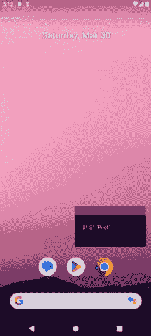
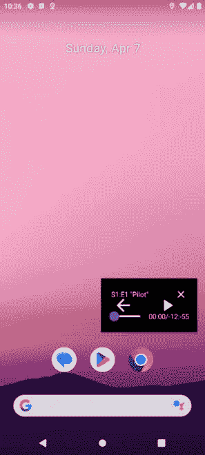
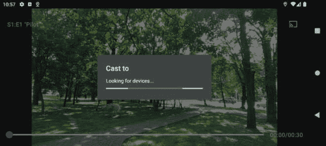
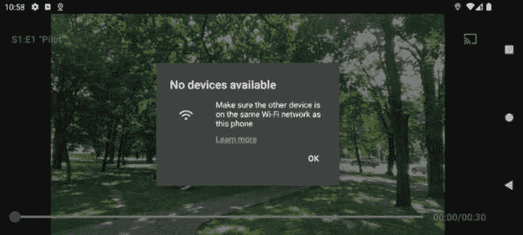

# 第九章：在您的 Packtflix 应用中扩展视频播放

您是否曾希望用户在切换应用或关闭屏幕时仍能继续享受他们最喜欢的视频？本章深入探讨了 Android 上扩展视频播放的世界，为您带来创建更具吸引力和灵活性的用户体验的技能。

我们将探索两个关键功能：`MediaRouter` 和 Cast SDK，它们使用户能够将视频播放传输到更大的屏幕，例如带有 Google Chromecast 的电视。

到本章结束时，您将深入了解 PiP 功能，并解锁我们 Android 应用中扩展视频播放的潜力。

因此，在本章中，我们将涵盖以下主题：

+   了解 PiP API

+   使用 PiP 在后台继续播放

+   了解 **MediaRouter**

+   连接到 Google Chromecast 设备

# 技术要求

如前一章所述，您需要安装 Android Studio（或您偏好的其他编辑器）。

我们将遵循在 *第七章* 中开始的项目，并加入我们在 *第八章* 中所做的更改。

您可以在本仓库中找到本章将要构建的完整代码：[`github.com/PacktPublishing/Thriving-in-Android-Development-using-Kotlin/tree/main/Chapter-9`](https://github.com/PacktPublishing/Thriving-in-Android-Development-using-Kotlin/tree/main/Chapter-9).

# 了解 PiP API

我们扩展视频播放之旅的第一步是了解 PiP API，它使我们能够使用 PiP 模式。**PiP 模式**允许用户最小化您的应用，并在可调整大小和可移动的迷你播放器中继续观看视频。这种功能通过提供灵活性和便利性来增强用户体验。

本节将为您提供在应用中有效利用 PiP 的知识。我们将涵盖最重要的方面，例如理解 PiP 要求、学习如何以编程方式进入和退出 PiP 模式，并回顾一些不同的监听事件。那么，让我们开始吧。

## PiP 要求

在 PiP 方面，并非所有设备都相同。在我们深入探讨令人兴奋的功能之前，让我们通过理解 PiP 模式的需求和兼容性方面来确保用户体验的流畅。

关于需求，有两个变量需要考虑：

+   **最低 Android 版本**：PiP 模式依赖于 Android 8.0（奥利奥）中引入的特定 API。针对运行旧版 Android 的设备不仅会阻止 PiP 功能，还可能导致崩溃或意外行为。

    要检查用户的设备是否与 PiP 兼容，我们可以实现以下代码：

    ```kt
    val minApiLevel = Build.VERSION_CODES.O
    if (android.os.Build.VERSION.SDK_INT < minApiLevel) {
      // PiP not supported on this device
      return false
    }
    ```

    此代码确保我们的应用优雅地处理无法使用 PiP 模式的设备。首先，我们定义了 PiP 所需的最低 Android 版本（通常是 Android 8.0 或奥利奥）。然后，我们检查设备的当前版本。如果它低于最低版本，代码会识别 PiP 功能不可用，并通过（可能通过返回`false`）向应用发出信号，防止应用尝试使用在不兼容设备上会引起问题的 PiP 功能。

    这允许您优雅地处理 PiP 不可用的情况，并可能为旧设备上的用户提供替代功能（例如，我们可以提供让他们将播放发送到另一台设备的功能）。

+   **屏幕尺寸要求**：虽然 PiP 模式可以在各种屏幕尺寸上技术上实现，但较小的显示屏可能无法提供最佳的用户体验。想象一下在 4 英寸屏幕的手机上尝试在微小的 PiP 窗口中看电影！因此，考虑屏幕尺寸限制是至关重要的。

既然我们已经确定了需求，让我们探索一下激动人心的部分：在我们的应用中启动 PiP 模式。

## 以编程方式进入和退出 PiP 模式

正如我们所知，PiP 模式为用户提供在切换应用或关闭屏幕时继续在迷你窗口中播放视频的便利性。为此，我们将使用`Activity`类中可用的`enterPictureInPictureMode()`方法：

```kt
activity.enterPictureInPictureMode()
```

调用此方法允许您在您的活动中以编程方式触发 PiP 模式，系统将处理调整视频播放器窗口大小并将其置于其他应用之上。需要注意的是，您通常只在用户明确请求时调用此方法，例如在您的应用 UI 中轻触专用的 PiP 按钮。

虽然进入 PiP 模式是通过编程方式触发的，但退出主要是用户驱动的。用户可以通过滑动迷你播放器或轻触系统提供的指定**关闭**按钮来退出 PiP 模式。然而，作为开发者，我们仍然可以在确保平滑过渡回全屏体验方面发挥作用。当 PiP 模式退出时，系统会在您的活动中触发特定的回调。以下是我们可以如何利用这些回调：

```kt
override fun onPictureInPictureExited() {
  super.onPictureInPictureExited()
  // Any logic that we want to add when the user comes back
     to the full screen experience in our app
}
```

每当用户关闭 PiP 迷你屏幕时，此函数都会被调用。这不是我们可以用来处理 PiP 状态变化的唯一函数；监听器提供了各种事件，以使我们的应用了解 PiP 窗口的变化。这些事件允许我们做出反应并相应地更新我们的应用行为，确保无缝的用户体验：

+   **OnPictureInPictureEntered()**: 当用户成功进入 PiP 模式时，此事件会被触发。您可以利用这个机会更新 UI 元素以反映 PiP 状态（例如，隐藏不必要的控件）或对 PiP 播放进行任何必要的优化（例如，调整视频质量）。

+   **OnPictureInPictureExited()**：如前所述，此事件表示用户退出 PiP 模式。在这里，你可以清理与 PiP 窗口相关的资源或更新 UI 以反映全屏播放的返回。

+   **OnPictureInPictureUiStateChanged()**：此事件在 PiP 窗口发生任何变化时触发，例如调整大小或移动它。你可能使用此事件根据新的 PiP 窗口尺寸调整 UI 布局或根据调整大小可能导致的性能变化更新视频播放。

通过有效地处理 PiP 事件和监听器回调，你可以使你的应用与变化的 PiP 窗口状态保持同步。现在，让我们看看如何将其集成到我们的现有项目中。

# 使用 PiP 在后台继续播放

在我们可以在项目中使用 PiP 之前的第一步是，我们必须在`AndroidManifest.xml`文件中声明对其的支持。这一步对于通知 Android 系统我们的`PlaybackActivity`类能够以 PiP 模式运行至关重要。我们这样做：

```kt
<?xml version="1.0" encoding="utf-8"?>
<manifest
    xmlns:android =
        "http://schemas.android.com/apk/res/android">
    <application>
        <activity
            android:name = "com.packt.playback.presentation
                .PlaybackActivity"
            android:supportsPictureInPicture="true"
            android:resizeableActivity="true"
            android:screenOrientation="landscape"/>
    </application>
</manifest>
```

对于 PiP 而言，我们清单中的关键属性是`android:supportsPicture` **InPicture="true"**，它明确声明你的活动支持 PiP 模式。

`resizeableActivity`属性，虽然与活动可调整大小的能力相关，但在针对 API 级别 24 或更高版本时，默认设置为`true`。这意味着如果你的应用针对 API 级别 24+，你不需要显式设置`resizeableActivity="true"`以使 PiP 模式工作，因为系统已经默认认为所有活动都是可调整大小的，以支持多窗口模式。

然而，显式设置`resizeableActivity="true"`是一种良好的实践，特别是如果你的应用旨在利用多窗口功能，而不仅仅是 PiP，或者如果你想确保在不同 Android 版本和设备上的兼容性。它对于文档目的也很有用，使任何阅读你的`AndroidManifest.xml`文件的人都能清楚地知道你的活动旨在支持可调整的行为，包括 PiP。

## 实现 PiP

既然我们已经明确选择在我们的`Activity`类中使用 PiP 功能，让我们来实现它。我们将重写`onUserLeaveHint()`回调，该回调在用户按下**主页**按钮或切换到另一个应用时触发：

```kt
override fun onUserLeaveHint() {
    super.onUserLeaveHint()
    val aspectRatio = Rational(16, 9)
    val params = PictureInPictureParams.Builder()
        .setAspectRatio(aspectRatio)
        .build()
    enterPictureInPictureMode(params)
}
```

正如我们所说的，我们正在重写`onUserLeaveHint()`现有函数。在这里，我们仍然必须包含对`super.onUserLeaveHint()`的调用，因为它确保`Activity`类在执行自定义行为之前正确处理 Android 框架定义的任何附加底层操作。

在此方法中，通过使用`Rational`类，将 PiP 窗口的宽高比定义为`16:9`，这是视频内容的常见选择。这个宽高比至关重要，因为它决定了 PiP 窗口宽度和高度之间的比例关系，确保视频在无扭曲的情况下保持其预期的外观。

要应用这个宽高比，使用`PictureInPictureParams.Builder`类构建一个配置对象。通过在构建器上调用`setAspectRatio(aspectRatio)`，将之前定义的宽高比应用于此配置。

当`setAspectRatio(Rational)`设置 PiP 窗口的首选宽高比时，意味着系统在显示 PiP 窗口时会尝试维持这个宽高比，但根据设备和屏幕尺寸的限制，这并不总是可能的。Android 11（API 级别 30）引入了`setMaxAspectRatio(Rational)`和`setMinAspectRatio(Rational)`来定义最大和最小的宽高比。此外，`setMaxSize(int, int)`允许设置 PiP 窗口的最大尺寸，从而提供了对 PiP 窗口在不同设备上显示方式的更多控制。

注意

还有一些其他的**PictureInPictureParams.Builder**选项可以应用。有关这些选项的更多信息，请参阅文档：[`developer.android.com/reference/android/app/PictureInPictureParams.Builder`](https://developer.android.com/reference/android/app/PictureInPictureParams.Builder)。

然后，`build()`方法将这些配置编译成一个`PictureInPictureParams`对象，该对象封装了进入 PiP 模式所需的所有设置。

最后，调用`enterPictureInPictureMode(params)`方法，向系统发出信号，使用指定的参数将当前的`Activity`类转换为 PiP 模式。

现在我们已经集成了这个功能，当我们处于播放屏幕并离开应用程序时，我们仍然应该在 PiP 屏幕上看到视频：



图 9.1：使用 PiP 功能进行播放

Android 中的`PictureInPictureParams.Builder`类提供了一种可定制的配置方法，用于配置应用程序进入 PiP 模式时的行为和外观。除了使用`setAspectRatio()`设置宽高比，如我们在前面的指令中所做的那样，还有其他几个选项可用于定制 PiP 体验：

+   **操作**：通过使用**setActions(List<RemoteAction>)**，开发者可以指定用户在 PiP 模式下可以执行的操作列表。这些操作以**RemoteAction**对象的形式表示，可以包括播放、暂停或跳过等操作。这些操作在 PiP 窗口中作为按钮出现，为用户提供交互元素，而无需返回到完整的应用程序界面。

+   **自动进入/退出**：通过**setAutoEnterEnabled(boolean)**和**setAutoExitEnabled(boolean)**（在后续的 Android 版本中引入），开发者可以控制应用程序是否应根据某些条件（如媒体播放状态）自动进入或退出 PiP 模式。

+   **无缝调整大小**：通过调用 **setSeamlessResizeEnabled(boolean)**，可以启用或禁用 PiP 窗口的无缝调整大小。这个选项在后来的 Android 版本中可用，有助于使进入和退出 PiP 模式的视觉转换更加平滑。

+   **源矩形提示**：**setSourceRectHint(Rect)** 允许开发者建议 PiP 模式进入时应该尝试对齐的屏幕上的首选区域。这可以根据应用程序的 UI 布局指导系统，确定 PiP 窗口理想的位置。

让我们使用这些选项来添加动作，以便用户可以在 PiP 视图中在播放和暂停之间切换。但首先，让我们先来一点理论。

## 理解如何向 PiP 模式添加动作

将动作集成到 PiP 模式通过允许在 PiP 窗口中直接控制应用程序功能而不离开 PiP 窗口，从而增强了用户交互。通过使用 `setActions(List<RemoteAction>)` 方法，您可以创建一个更加沉浸式和用户友好的体验，提供如播放、暂停或直接在 PiP 叠加层中跳过的控制功能。这种能力在媒体应用程序中尤其有价值，因为用户通常需要在不干扰当前屏幕活动的情况下管理播放。

在不久的将来，我们将学习如何有效地创建和管理这些 `RemoteAction` 对象，确保我们的应用程序 PiP 模式既功能性强又引人入胜，补充现有的 PiP 功能。但让我们进一步探讨这些概念。

每个 `RemoteAction` 对象代表 PiP 窗口中的一个可操作元素，例如用于播放、暂停或跳过的按钮。要创建这些动作，我们需要指定一个图标、一个标题、一个定义用户与按钮交互时采取的动作的 `PendingIntent` 对象，以及用于辅助功能的描述。

在这里，`PendingIntent` 对象的使用至关重要，因为它允许动作在调用时触发应用程序中的特定行为。Android 中的 `Intent` 对象就像一条消息，可以表示广泛的事件，包括系统启动完成、网络变化或应用程序定义的自定义事件。通常，这些意图被指向应用程序内的 `BroadcastReceiver` 实例。

Android 中的 `BroadcastReceiver` 实例是一个基本组件，它使应用程序能够监听并响应来自其他应用程序或系统本身的广播消息。当广播一个与 `BroadcastReceiver` 实例的过滤器匹配的意图时，`BroadcastReceiver` 实例的 `onReceive()` 方法会被调用，允许应用程序在事件发生时执行逻辑。这种机制为应用程序提供了一种强大的方式来响应全局系统事件或应用程序间通信，而无需在前景运行，使 `BroadcastReceiver` 实例成为 Android 中事件驱动编程的关键工具。

在我们的情况下，这个`BroadcastReceiver`实例负责监听和处理由 PiP 动作发送的广播意图。例如，当与播放动作关联的`PendingIntent`对象被广播时，你的应用中的相应接收器捕获这个意图并触发媒体播放。

需要一个`BroadcastReceiver`实例的原因是 PiP 动作意图与你的应用中直接方法调用解耦。由于这些动作发生在常规 UI 流程之外，使用广播机制允许你的应用异步响应这些动作并执行必要的操作，例如更新媒体播放状态。这种设置确保你的应用可以有效地处理 PiP 控制，即使在用户从 PiP 窗口与应用交互时也能提供无缝体验。

现在我们知道了如何创建`RemoteAction`对象，让我们将我们的学习应用到我们的项目中。

## 向 PiP 模式添加动作

让我们先创建我们的`BroadcastReceiver`子类。这个类将扩展`BroadcastReceiver`并重写`onReceive()`方法，在那里你将定义你的应用应该如何对 PiP 动作`Intent`对象做出反应：

```kt
class PiPActionReceiver(private val togglePlayPause: () -> Unit) : BroadcastReceiver() {
    override fun onReceive(context: Context?, intent:
    Intent?) {
        when (intent?.action) {
            ACTION_TOGGLE_PLAY -> {
                togglePlayPause()
            }
        }
    }
    companion object {
        const val ACTION_TOGGLE_PLAY =
            "com.packflix.action.TOGGLE_PLAY"
    }
}
```

在`onReceive`方法中，会检查`Intent`动作是否与`ACTION_TOGGLE_PLAY`动作匹配。如果匹配，将执行播放/暂停切换逻辑。在这种情况下，我们将执行一个回调，因为播放或暂停回放的逻辑可能位于此接收器之外。

接下来，我们需要注册`BroadcastReceiver`实例，以便它可以接收`Intent`对象。这可以通过两种方式完成：

+   **Manifest 声明**：在**AndroidManifest.xml**文件中注册适合于即使应用未运行也应接收的动作。然而，对于 PiP 动作，在处理 PiP 模式的 activity 或 service 中进行动态注册通常更为合适。

+   **动态注册**：由于 PiP 动作与我们的应用处于 PiP 模式时特别相关，因此在我们**PlaybackActivity**类中动态注册`BroadcastReceiver`实例可以提供更多控制，并且与上下文相关。

我们将使用动态注册来注册`BroadcastReceiver`实例。在我们的`PlaybackActivity`类中，实现将如下所示：

```kt
private lateinit var pipActionReceiver: PiPActionReceiver
override fun onCreate(savedInstanceState: Bundle?) {
    super.onCreate(savedInstanceState)
    pipActionReceiver = PiPActionReceiver {
        //TODO handle there the play/pause logic
    }
    val filter =
        IntentFilter(PiPActionReceiver.ACTION_TOGGLE_PLAY)
    if (Build.VERSION.SDK_INT >=
    Build.VERSION_CODES.TIRAMISU) {
        registerReceiver(pipActionReceiver, filter,
            RECEIVER_NOT_EXPORTED)
    } else {
        registerReceiver(pipActionReceiver, filter)
    }
    setContent {
        PlaybackScreen()
    }
}
```

首先，我们将声明一个名为`pipActionReceiver`的`BroadcastReceiver`变量。这个接收器不会立即初始化（它被声明为`lateinit var`），因为它将在我们 activity 的`onCreate`方法中设置。

在`onCreate`方法中，我们将初始化`BroadcastReceiver`变量。`pipActionReceiver`变量被实例化并分配了一个 lambda 函数作为其参数。这个函数旨在包含处理播放/暂停动作的逻辑。

然后，我们将注册 `BroadcastReceiver` 变量，指示它将监听的 `Intent` 过滤信号。注册方法取决于 SDK 版本：

+   对于 Tiramisu (Android 13，API 级别 33) 及以上版本的 SDK，您使用带有附加标志的 `registerReceiver` 方法，即 **RECEIVER_NOT_EXPORTED**，以增强安全性，确保您的接收器不会意外地被其他应用访问。

+   对于早期版本，您将注册接收器而不使用此标志。这确保了向后兼容性，同时遵守在新设备上应用安全性的最佳实践。

现在，让我们创建一个将触发启动 `BroadcastReceiver` 实例所需的 `Intent` 操作的动作：

```kt
private fun getIntentForTogglePlayPauseAction():
RemoteAction {
    val icon: Icon = Icon.createWithResource(this,
        R.drawable.baseline_play_arrow_24)
    val intent =
    Intent(PiPActionReceiver.ACTION_TOGGLE_PLAY).let {
   intent ->
        PendingIntent.getBroadcast(this, 0, intent,
            PendingIntent.FLAG_UPDATE_CURRENT or
                PendingIntent.FLAG_IMMUTABLE)
    }
    return RemoteAction(icon, "Toggle Play", "Play or pause
        the video", intent)
}
```

在此代码中，我们创建了一个 `RemoteAction` 方法。方法内部的第一行从可绘制资源 `(R.drawable.baseline_play_arrow_24)` 创建了一个 `Icon` 对象。此图标向用户直观地表示切换播放/暂停操作。

然后，使用 `PiPActionReceiver.ACTION_TOGGLE_PLAY` 操作创建一个新的 `Intent` 对象。此 `Intent` 对象设计为在用户调用 `RemoteAction` 方法时广播。`let` 块被用来直接链式创建一个包装此 `Intent` 对象的 `PendingIntent` 对象，使其可以在应用程序上下文之外执行。

调用 `PendingIntent.getBroadcast` 方法来创建一个广播 `Intent` 对象的 `PendingIntent` 对象。此 `PendingIntent` 对象配置了 `PendingIntent.FLAG_UPDATE_CURRENT` 以确保如果挂起的 `Intent` 对象已经存在，它将被重用，但其额外数据将被更新。`PendingIntent.FLAG_IMMUTABLE` 用于安全目的，将 `Intent` 对象标记为不可变，以防止创建后进行更改。

最后，实例化并返回一个 `RemoteAction` 对象。此对象接受先前创建的图标、标题（`PendingIntent` 对象）作为参数。标题和内容描述应简明扼要，但足以向用户说明操作的目的，符合无障碍标准。

现在，我们需要将此操作配置为我们的 PiP 配置的参数。我们将按以下方式修改现有配置：

```kt
override fun onUserLeaveHint() {
    super.onUserLeaveHint()
    val aspectRatio = Rational(16, 9)
    val params = PictureInPictureParams.Builder()
        .setAspectRatio(aspectRatio)
        .setActions(listOf(
            getIntentForTogglePlayPauseAction()))
        .build()
    enterPictureInPictureMode(params)
}
```

在这里，我们使用 `setActions()` 函数添加一个包含新操作的列表。

最后一步是处理在播放和暂停之间有效切换的逻辑。我们已经在 `ViewModel` 组件中实现了此功能，所以我们只需在 `Activity` 类中注入 `PlaybackViewModel` 组件并调用 `togglePlayPause()` 函数：

```kt
@AndroidEntryPoint
class PlaybackActivity: ComponentActivity() {
    private val viewModel: PlaybackViewModel by
    viewModels()
    override fun onCreate(savedInstanceState: Bundle?) {
        super.onCreate(savedInstanceState)
        pipActionReceiver = PiPActionReceiver {
            viewModel.togglePlayPause()
        }
        ...
    }
}
```

如我们所见，我们正在注入 `PlaybackViewModel`，然后，当接收器检测到用户发送了带有播放/暂停操作的广播时，`viewModel.toggle` **PlayPause()** 函数将被调用。

如果我们使用这些更改执行代码，我们应该在我们的 PiP UI 中看到 **播放** 按钮：



图 9.2：带有一些操作的 PiP 视图

在实现了 PiP 模式后，让我们继续使用`MediaRouter` API 连接到其他设备进行媒体播放，该 API 允许您的应用程序将内容投放到智能电视或 Chromecast 等设备。我们将介绍如何使用`MediaRouter`来识别兼容设备并管理对它们的媒体流式传输，从而增强应用程序的功能。

# 了解 MediaRouter

`MediaRouter`是 Android 开发中的一个关键组件，特别是对于处理多媒体内容的应用程序。它作为运行您的应用程序的设备和外部设备（如 Google Chromecast、智能电视和多种支持媒体路由功能的扬声器）之间的桥梁。

`MediaRouter`的核心功能是促进多媒体内容的流式传输——无论是音频、视频还是图像——从用户的当前设备传输到另一个提供更好或更合适播放体验的设备。它智能地发现可用的媒体路由，并允许应用程序连接到它们，从而将多媒体功能扩展到用户主要设备的限制之外。

Android 的`MediaRouter` API 提供了一个框架，开发人员可以利用它来搜索和与本地网络上注册的媒体路由提供者进行交互。这些提供者代表能够进行媒体播放的设备或服务。使用`MediaRouter`，应用程序不仅可以动态发现这些路由，还可以向用户提供一个简化的界面来选择他们首选的播放设备，同时无缝管理跨设备的连接和播放状态。

在 Android 应用程序中使用`MediaRouter`为增强用户的媒体消费体验提供了无数可能性。以下是一些典型的用例：

+   **将视频投放到更大的屏幕上**：**MediaRouter**最常用的功能之一就是将移动设备上的视频投放到更大的显示设备上，例如智能电视或带有 Chromecast 的显示器。这对于在更大屏幕上观看电影、电视剧或用户生成的内容，以获得更沉浸式的观看体验尤其有吸引力。

+   **将音乐流式传输到外部扬声器**：**MediaRouter**允许应用程序将音乐流式传输到外部扬声器，增强音频体验。这对于派对、锻炼或简单地提升手机或平板电脑内置扬声器的音乐播放质量非常理想。

+   **在共享屏幕上显示图像**：应用程序可以使用**MediaRouter**将图像发送到智能电视或连接的显示器，非常适合与一群人分享照片、进行演示或以更高分辨率查看艺术品。

+   **游戏**：利用将屏幕内容投放到更大显示器的功能，游戏应用可以利用**MediaRouter**在电视上提供类似游戏机的游戏体验，同时使用移动设备作为控制器。

+   **健身和教育**：对于专注于健身或教育的应用，将教学视频或锻炼计划投射到电视上，可以让用户更舒适、更有效地跟随。

在这些用例中，`MediaRouter` 通过利用连接设备的强大功能，显著增强了应用的功能，从而为用户提供更灵活和丰富的媒体播放体验。通过其全面的 API，开发者可以创建不仅限于移动设备小屏幕的应用程序，而是能够在家庭网络中的任何兼容设备上呈现内容的程序。

## 设置 MediaRouter

将 `MediaRouter` 集成到我们的 Android 应用中涉及几个关键的设置步骤，包括将必要的依赖项添加到项目中，并确保您已设置正确的权限。

首先，我们需要在我们的 `libs.versions.toml` 文件中包含 `MediaRouter` 库依赖项。这个库提供了发现和与媒体路由提供者交互所需的类和接口：

```kt
[versions]
...
mediarouter = "1.7.0"
google-cast = "21.4.0"
[libraries]
...
media-router = { group = "androidx.mediarouter", name="mediarouter", version.ref="mediarouter"}
google-cast = { group = "com.google.android.gms", name="play-services-cast-framework", version.ref="google-cast"}
```

由于我们计划支持投射到 Chromecast 设备或其他 Google Cast 兼容设备，我们需要 `play-services-cast-framework` 库。这个库促进了与 Google Cast 设备的集成，并扩展了 `MediaRouter` 的功能。

下一步将是将其添加到我们的 `build.gradle` 模块中：

```kt
    implementation(libs.media.router)
    implementation(libs.google.cast)
```

现在，为了使 `MediaRouter` 能够发现和与本地网络上的设备交互，我们必须在应用的 `AndroidManifest.xml` 文件中声明必要的权限：

```kt
<uses-permission android:name="android.permission.ACCESS_NETWORK_STATE"/>
<uses-permission android:name="android.permission.ACCESS_WIFI_STATE"/>
<uses-permission android:name="android.permission.INTERNET"/>
<uses-permission android:name="android.permission.BLUETOOTH_CONNECT" />
<uses-permission android:name="android.permission.BLUETOOTH_SCAN" />
<uses-permission android:name="android.permission.POST_NOTIFICATIONS" />
```

我们在此包括以下权限：

+   **互联网权限**：由于 **MediaRouter** 可能会使用网络与媒体路由提供者通信，您的应用需要权限来访问互联网。我们已经在之前的章节中需要声明此权限，因此不应是新的。

+   **网络状态权限**：这些权限是应用监控网络连接变化所必需的，这对于在网络中发现设备至关重要。

+   **本地网络权限（Android 12 及以上）**：从 Android 12（API 级别 31）开始，如果您的应用针对 API 级别 31 或更高版本，并且需要发现本地网络上的设备，您还必须声明此权限。

+   **推送通知**：对于 Android 12 及以上版本，为了访问本地网络进行设备发现，必须拥有此权限。

在添加必要的依赖项和权限后，我们的项目就准备好使用 `MediaRouter` 来发现媒体路由提供者并启用媒体流到外部设备。

## 发现媒体路由

一旦您的应用设置了必要的 `MediaRouter` 依赖项和权限，下一步就是发现可用的媒体路由。这涉及到识别您的应用可以流式传输媒体的外部设备或服务。Android 的 `MediaRouter` 框架通过提供发现媒体路由并将其呈现给用户的工具来简化这一过程。

### 了解 MediaRouteProvider

`MediaRouteProvider` 是一个将媒体路由发布到 `MediaRouter` 的组件。它作为您的应用与外部设备或服务（如扬声器、电视或其他 Cast 启用设备）之间的桥梁。使用 `MediaRouteProvider` 有两种选择：

+   默认 **MediaRouteProvider** 实现：对于大多数用例，尤其是在与 Google Cast 设备集成时，Android 提供了一个默认的 **MediaRouteProvider** 实现，因此您不需要实现自己的。Google Cast 框架自动发现兼容设备并将它们作为媒体路由提供。

+   自定义 **MediaRouteProvider** 实现：如果您需要发现自定义协议或 Google Cast 未涵盖的特定类型的媒体路由设备，您可以通过扩展 **MediaRouteProvider** 类来实现自己的 **MediaRouteProvider** 实例。这涉及到定义发现逻辑并向 **MediaRouter** 发布路由。

然而，创建自定义的 `MediaRouteProvider` 实现超出了基本媒体路由的范围，并需要深入了解您针对的具体硬件或协议。如果您想了解更多信息，请参阅创建自定义 `MediaRouteProvider` 实现的官方文档：[`developer.android.com/media/routing/mediarouteprovider`](https://developer.android.com/media/routing/mediarouteprovider)。

我们将使用默认的 `MediaRouteProvider` 实现。

### 使用 MediaRouter 类

`MediaRouter` 类是您与媒体路由交互的主要工具。以下是您如何使用它来发现和监控可用媒体路由的示例。

我们将首先定义一个 `MediaRouteSelector` 实例，并允许它开始发现其他设备以发送媒体。我们将使用 `LaunchedEffect` 将发现过程与可组合组件的生命周期绑定：

```kt
@Composable
fun MediaRouteDiscoveryOptions(mediaRouter: MediaRouter) {
    val context = LocalContext.current
    val routeSelector = remember {
        MediaRouteSelector.Builder()
            .addControlCategory(
                MediaControlIntent.CATEGORY_REMOTE_PLAYBACK
            )
            .build()
    }
    val mediaRoutes = remember {
    mutableStateListOf<MediaRouter.RouteInfo>() }
    DisposableEffect(mediaRouter) {
        mediaRouter.addCallback(routeSelector, callback,
            MediaRouter.CALLBACK_FLAG_PERFORM_ACTIVE_SCAN)
        onDispose {
            mediaRouter.removeCallback(callback)
        }
    }
}
```

这个可组合函数接受一个 `MediaRouter` 实例作为参数，突出了它对该框架发现媒体路由的依赖性。

函数首先使用 `LocalContext.current` 获取当前的 `Context` 值，然后创建一个 `MediaRouterSelector` 实例。此选择器专门配置为筛选支持实时视频内容的路由。使用 `remember` 确保在可组合组件的重构过程中保留 `MediaRouteSelector` 实例，通过防止不必要的重新初始化来优化性能。

然后，我们添加了一个 `DisposableEffect` 可组合组件，它封装了与可组合组件生命周期一致的启动和停止媒体路由发现逻辑。通过将 `MediaRouter` 作为键传递给 `DisposableEffect`，当可组合组件首次组合到 UI 中时，封装的代码块将在协程中执行，当可组合组件被移除时，协程将被取消，从而有效地管理发现过程的生命周期。在这个块中，调用 `MediaRouter` 的 `addCallback` 方法来注册一个带有活动扫描标志的回调，启动与 `routeSelector` 设置的标准匹配的媒体路由的主动扫描。`DisposableEffect` 中的 `onDispose` 块充当清理机制，当可组合组件被销毁时，回调将从 `MediaRouter` 中注销，确保资源得到释放，后台处理最小化。

现在，我们将创建一个回调，它包含在之前描述的 `addCallback` 函数中：

```kt
val callback = remember {
    object : MediaRouter.Callback() {
        override fun onRouteAdded(router: MediaRouter,
        route: MediaRouter.RouteInfo) {
            mediaRoutes.add(route)
        }
        override fun onRouteRemoved(router: MediaRouter,
        route: MediaRouter.RouteInfo) {
            mediaRoutes.remove(route)
        }
    }
}
```

我们正在实例化一个 `MediaRouter.Callback` 监听器，使用 `remember` 来避免每次应用 UI 更新时都需要重新创建它。

这个监听器，`MediaRouter.Callback`，通过其 `onRouteAdded` 和 `onRouteRemoved` 方法有两个主要任务。当一个新设备可用于媒体传输时，`onRouteAdded` 被调用，并且应用将这个新路由添加到名为 `mediaRoutes` 的列表中。这个列表对于应用知道任何时刻可用的设备至关重要。另一方面，当一个设备离线或断开连接时，`onRouteRemoved` 被调用，应用将此路由从列表中删除，确保列表保持最新。

实际上，这种设置允许应用动态调整可用的媒体传输设备的变化。

为了给用户提供一个方便的方式来选择这些可用的设备，我们需要集成一个为此目的设计的按钮。`MediaRouter` API 提供了一个显示可传输设备的现成按钮。尽管这个按钮是一个 Android 视图而不是可组合组件，我们仍然可以使用 `AndroidView` 可组合组件来使用它。以下是我们可以如何做到这一点：

```kt
AndroidView(
    factory = { ctx ->
        MediaRouteButton(ctx).apply {
            setRouteSelector(routeSelector)
        }
    },
    modifier = Modifier
        .wrapContentWidth()
        .wrapContentHeight()
)
```

现在，我们只需使用我们的回放屏幕中的 `MediaRouteDiscoveryOptions` 可组合组件：

```kt
@Composable
fun TopMediaRow(mediaRouter: MediaRouter, modifier:
Modifier = Modifier) {
    Row(
        modifier = modifier
            .fillMaxWidth()
            .padding(20.dp),
        horizontalArrangement = Arrangement.SpaceBetween,
        verticalAlignment = Alignment.CenterVertically
    ) {
        Text(text = "S1:E1 \"Pilot\"", color = Color.White)
        MediaRouteDiscoveryOptions(mediaRouter =
            mediaRouter)
    }
}
```

在这里，我们已经将 `MediaRouteDiscoveryOptions` 可组合组件添加到我们现有的 `TopMediaRow` 函数中。

当调用 `TopMediaRow` 函数时，我们将传递之前获得的 `mediaRouter` 实例，使用 `LocalContext`：

```kt
TopMediaRow(
    mediaRouter =
        MediaRouter.getInstance(LocalContext.current),
    modifier = Modifier.align(Alignment.TopCenter))
```

现在，我们将看到 `PlaybackScreen` 可组合组件。如果我们点击它，`MediaRouter` 将会自动搜索设备：



图 9.3：MediaRouter 搜索设备

如果它找不到任何设备，它将显示一条消息，鼓励用户检查连接：



图 9.4：MediaRouter 功能，提示用户检查设备连接

在使用 `MediaRouter` API 发现可用的媒体路由后，下一步是连接到选定的设备进行媒体播放。这涉及两个主要操作：选择一个媒体路由，然后建立到该路由的连接。以下是你可以如何处理这个流程。

当使用 `MediaRouteButton` 内置的媒体路由选择器时，连接到设备的流程得到了简化。`MediaRouteButton` 会自动根据 `MediaRouteSelector` 实例中定义的标准显示可用的媒体路由。用户可以从 `MediaRouteButton` 展示的 UI 中直接选择他们偏好的设备。

一旦用户从对话框中选择了一条路由，`MediaRouter` 框架就会根据路由的能力和你在 `MediaRouteSelector` 实例中指定的媒体类型自动管理到该设备的连接。在你的应用程序代码中不需要额外的手动连接管理。

在选择了路由并建立了连接后，你可以通过选定的路由控制媒体播放。这通常涉及使用适合你应用程序的媒体内容和所选路由能力的媒体控制 API。我们将在下一节学习如何为 Google Cast 设备投射媒体播放。

# 连接到 Google Chromecast 设备

Google Cast 是由 Google 开发的一项强大技术，它允许用户将智能手机、平板电脑或电脑上的音频和视频内容无线流式传输到支持 Cast 的设备。这项技术嵌入到各种设备中，包括 Chromecast 拓展器、智能电视和扬声器，使其能够服务于广泛的用户群体。在核心上，Google Cast 通过在移动设备或电脑上的支持 Cast 的应用程序和支持 Cast 的接收设备之间建立连接来工作。一旦建立连接，媒体就可以在接收设备上播放，有效地将其转变为被投射内容的远程屏幕或扬声器。

Google Cast 的功能不仅限于从互联网流式传输媒体。它还允许从发送设备屏幕镜像内容，扩展其用途到演示、教育内容等。Google Cast 通过 Wi-Fi 运行，确保高质量流式传输性能，无需物理电缆或适配器。

我们已经完成了一些步骤：我们已经包含了库，并且正在检测允许投射的设备。现在，我们需要建立一个投射会话。这个会话促进了你的应用程序和所选 Cast 设备之间的连接，使得可以在大屏幕上进行媒体控制和播放。这个过程依赖于有效地使用 `CastContext` 和熟练地管理 Cast 会话事件。

`CastContext` 在你的应用程序中启动和管理 Cast 会话中起着核心作用，提供了连接到所选 Cast 设备所需的 API。以下是初始化连接的方法。

首先，我们需要确保你在应用程序中初始化了 `CastContext`。这通常在 `Application` 子类或你的主活动中完成。我们将在 `PlaybackActivity` 类中初始化它：

```kt
val castContext = CastContext.getSharedInstance(context)
```

然后，我们需要选择一个设备。我们已实现了 `MediaRouterbutton`，它将自动处理选择。一旦选择了一个设备，Cast SDK 将自动启动到该设备的连接。这个过程对开发者来说是抽象的，但监听会话事件对于有效地管理连接至关重要。

Cast SDK 为会话事件（如启动、结束、恢复和挂起）提供回调。处理这些事件允许你的应用程序对会话状态的变化做出反应，例如，在会话结束时更新 UI 或暂停媒体播放。

要监听这些会话事件，我们必须实现 `SessionManagerListener`:

```kt
private val sessionManagerListener = object : SessionManagerListener<CastSession> {
    override fun onSessionStarted(session: CastSession,
    sessionId: String) {
        castSession = session
        updateUIForCastSession(true)
    }
    override fun onSessionEnded(p0: CastSession, p1: Int) {
        castSession = null
        updateUIForCastSession(false)
    }
    override fun onSessionResumed(session: CastSession, p1:
    Boolean) {
        castSession = session
        updateUIForCastSession(true)
    }
    override fun onSessionStarting(p0: CastSession) {}
    override fun onSessionStartFailed(
        p0: CastSession, p1: Int) {}
    override fun onSessionResuming(session: CastSession,
        p1: String) {}
    override fun onSessionResumeFailed(session:
        CastSession, p1: Int) { }
    override fun onSessionEnding(session: CastSession) {}
    override fun onSessionSuspended(p0: CastSession,
        p1: Int) {}
}
```

在这里，我们正在实现我们的 `SessionManagerListener<CastSession>` 接口，这对于管理 Google Cast 会话至关重要。这个监听器旨在对与 Cast 会话生命周期相关的各种事件做出反应，包括其开始、结束、恢复和失败情况。让我们更深入地看看这个实现：

+   **onSessionStarted**: 当一个新的 Cast 会话成功启动时，此回调被调用。在这里，**session** 参数，它是一个 **CastSession** 的实例，代表了新建立的会话。该方法将全局 **castSession** 变量设置为该实例，有效地标志着会话的开始。随后，它调用 **updateUIForCastSession(true)**，这是一个将实现的方法，用于更新应用程序的 UI 以反映传输已经开始。

+   **onSessionEnded**: 当现有的 Cast 会话结束时触发，此方法通过将其设置为 **null** 来清除 **castSession** 变量，表示不再有活跃的 Cast 会话。它还调用 **updateUIForCastSession(false)** 来调整 UI，向用户发出信号，表示传输已停止。

+   **onSessionResumed**: 与 **onSessionStarted** 类似，当先前挂起的 Cast 会话恢复时，此回调被调用。它使用当前会话更新 **castSession** 并调用 **updateUIForCastSession(true)** 以在 UI 中反映传输的恢复。

+   **onSessionStarting** 和 **onSessionResuming**: 指示会话正在启动或恢复，但尚未完成。在我们的情况下，这些回调中不采取任何操作。

+   **onSessionStartFailed** 和 **onSessionResumeFailed**: 当尝试启动或恢复会话失败时被调用。同样，在我们的情况下没有指定任何操作，但这些是处理错误（例如，通知用户或尝试重新启动会话）的适当位置。

+   **onSessionEnding** 和 **onSessionSuspended**：这些回调在会话正在结束或暂停过程中被触发。与开始和恢复事件一样，在这些情况下不采取任何特定操作。

一旦我们实现了我们的监听器，我们需要使用 `castContext.sessionManager` 来注册它：

```kt
override fun onStart() {
    super.onStart()
    castContext.sessionManager.addSessionManagerListener(
        sessionManagerListener, CastSession::class.java)
}
override fun onStop() {
    super.onStop()
    castContext.sessionManager.removeSessionManagerListener
        (sessionManagerListener, CastSession::class.java)
}
```

在这里，我们是在 `Activity` 类启动时注册监听器，并在它停止时移除它。这样，我们确保只有在 `Activity` 类处于启动状态时，监听器才会被保留。

现在，让我们实现 `updateUIForCastSession` 函数：

```kt
private fun updateUIForCastSession(isCasting: Boolean) {
    viewModel.setCastingState(isCasting)
}
```

在这里，我们正在调用一个新函数，我们将在 `ViewModel` 组件中包含它，称为 `setCastingState`。我们传递一个布尔值作为参数，指示应用程序是否正在传输。

在我们的 `PlaybackViewModel` 组件中，我们将引入以下更改。我们将开始添加一个新的属性，`isCasting`：

```kt
private val _isCasting = MutableStateFlow<Boolean>(false)
val isCasting: MutableStateFlow<Boolean> = _isCasting
```

然后，当调用 `setCastingState` 函数时，我们将更改其值：

```kt
fun setCastingState(isCasting: Boolean) {
    _isCasting.value = isCasting
}
```

然后，我们将在我们的 `PlaybackScreen` 组合组件中使用它：

```kt
@Composable
fun PlaybackScreen() {
    ...
    val isCasting = viewModel.isCasting.collectAsState()
    Box(
        ...
    ) {
        if (isCasting.value) {
            NowCastingView()
        } else {
            //VideoPlayerComposable and the rest of the UI...
        }
    }
}
```

在我们现有的 `PlaybackScreen` 组合组件中，我们添加了一个新的属性，`isCasting`。这个属性用于选择屏幕是否显示 **正在传输** 消息或完整的播放用户界面。

接下来，我们将构建一个新的 `NowCastingView` 组合组件：

```kt
@Composable
fun NowCastingView() {
    Card(
        modifier = Modifier
            .fillMaxWidth()
            .padding(16.dp),
    ) {
        Column(
            modifier = Modifier.padding(16.dp)
        ) {
            Text(
                text = "Now Casting",
                style =
                    MaterialTheme.typography.headlineMedium
            )
        }
    }
}
```

这个组合组件只是放置并显示一个包含 **正在传输** 内容的文本，只是为了让用户意识到媒体内容目前正在传输到另一个设备。

我们必须做的一件事是：在远程设备上加载媒体。我们将修改 `SessionManagerListener` 接口中的 `onSessionStarted` 回调，包括调用一个新函数来加载媒体：

```kt
override fun onSessionStarted(session: CastSession,
sessionId: String) {
    castSession = session
    updateUIForCastSession(true)
    loadMedia(session)
}
```

最后，我们将如下实现这个函数：

```kt
private fun loadMedia(castSession: CastSession) {
    val mediaInfo = MediaInfo.Builder(viewModel.mediaUrl)
        .setStreamType(MediaInfo.STREAM_TYPE_BUFFERED)
        .setContentType("video/mp4")
        .build()
    val mediaLoadOptions = MediaLoadOptions
        .Builder()
        .setAutoplay(true)
        .setPlayPosition(0)
        .build()
    castSession.remoteMediaClient?.load(mediaInfo,
        mediaLoadOptions)
}
```

函数首先构建一个 `MediaInfo` 对象，它封装了关于要播放的媒体文件的所有必要细节。利用 `MediaInfo.Builder` 模式，它从 `viewModel.mediaUrl` 指定媒体的 URL，这是媒体文件的存储位置，Cast 兼容设备将从中流式传输。然后，构建器将流类型设置为 `MediaInfo.STREAM_TYPE_BUFFERED`，表示内容是预先录制的，可以在播放前进行缓冲，这对于不进行实时流式传输的视频内容来说非常理想。此外，内容类型被设置为 `"video/mp4"`，定义了文件的 **MIME** 类型（**多用途互联网邮件扩展**，不仅用于电子邮件，还用于网页浏览器和应用程序来正确解释和显示内容）作为 MP4 视频。

在创建`MediaInfo`对象之后，函数继续通过`MediaLoadOptions`对象配置额外的播放选项。设置的选项包括`setAutoplay(true)`，该命令指示 Cast 设备在加载后自动开始播放媒体，以及`setPlayPosition(0)`，确保播放从媒体文件的开始处开始，以简化操作。对此的一个改进可能是从`ViewModel`组件获取当前的播放位置，以便如果播放已经开始，视频可以继续在相同的时间点播放。

`loadMedia`函数的最后一步是在`castSession`变量的`remoteMediaClient`实例上调用`load`方法。这个方法调用实际上是向启用 Cast 的设备发送媒体加载和播放命令的地方。`remoteMediaClient`充当中间人，将命令从应用传输到接收器。通过将`MediaInfo`对象和`MediaLoadOptions`传递给此方法，应用指定了要播放的内容以及如何播放，从而有效地启动视频内容到 Cast 设备的流式传输。

现在，我们的应用已经准备好开始向 Google Cast 设备进行投屏。随着这一点，我们完成了这一章节，并学习了在 Android 和其他连接设备上播放的广泛可能性。

# 摘要

在本章中，我们探讨了在 Android 上扩展视频播放的基本知识，重点是让我们的应用在更多上下文中播放视频。我们涵盖了两个主要领域：PiP 模式和媒体投屏，两者都旨在让我们的用户保持与内容的连接，无论他们是在设备上多任务处理还是想要在大屏幕上享受视频。

从 PiP 模式开始，我们探讨了如何在用户离开应用时，让视频在一个小窗口中继续播放。本节详细介绍了从修改应用清单到实现 PiP 模式的所有内容，确保用户在使用其他应用时不需要暂停他们的观看体验。

接下来，我们将焦点转向媒体投屏，特别是针对 Google Chromecast 等设备的`MediaRouter`和 Cast SDK。在这里，你学习了如何让用户从他们的移动设备向电视发送视频。我们讨论了使用`MediaRouteButton`进行轻松的设备发现和连接，以及如何为希望对投屏过程有更多控制的用户创建自定义 UI。

到本章结束时，你应该已经了解了如何实现 PiP 模式以支持应用内多任务处理，并设置外部设备的投屏。这些技能对于创建提供灵活且用户友好的视频播放体验的 Android 应用至关重要。无论是保持视频在屏幕角落运行，还是在大电视上分享喜欢的电影，你的应用现在可以满足各种用户需求，增强与视频内容的整体互动。

就这样，我们的旅程走到了尽头，我们为三种类型的应用构建了关键功能：一个即时通讯应用、一个社交平台和一个视频应用。每个项目都旨在加深您的 Android 和 Kotlin 开发技能，并激发您思考如何将这些想法应用到您自己的工作中。

感谢您阅读这本书。我希望它不仅拓宽了您的知识面，也为您的项目激发了新的想法。凭借您所学的工具和技术，您已经做好了准备，去提升您的职业生涯并开始构建您自己的创新应用。祝您在移动开发领域取得成功——走出去，创造伟大事物吧！
