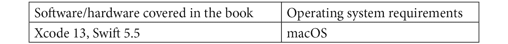

# 前言

自动测试是敏捷软件开发的一个基本组成部分，尤其是单元测试，它们快速可靠的反馈帮助开发者保持项目的可维护性和清洁。**测试驱动开发**（**TDD**）方法为开发者提供了关于如何构建可扩展、可维护的——因此是敏捷的——项目的明确规则。通常，一旦克服了对在编写代码之前编写测试的初始抵触，开发者就会坚持使用 TDD，因为他们觉得他们的代码更好，对结果更有信心。

在本书中，我们将探讨如何为 iOS 15+ 的许多不同方面编写单元测试，所有这些都是在测试驱动开发的环境中完成的。本书从对测试的一般介绍和 iOS 应用中的 TDD 开始，并在整本书中构建一个完整的应用。它涵盖了基本的 UI 结构、Combine 框架、async/await，甚至 SwiftUI。

在完成本书的学习并挑战自我练习后，你将能够为 iOS 开发中的各种代码编写测试，并且你将拥有决定下一步学习什么的工具，以成为测试驱动型 iOS 开发专家。

# 本书面向的对象

TDD 是一种经过验证的早期发现软件缺陷的方法。在编写代码之前编写测试可以提高你应用的架构和可维护性。本书将指导你使用 TDD 创建完整应用，并涵盖 iOS 应用的核心元素：视图控制器、视图、导航、网络、Combine 和 SwiftUI。

如果你已经制作了你的第一个小型 iOS 应用，并想学习如何使用自动化单元测试来改进你的工作，那么这本书就是为你准备的。

# 本书涵盖的内容

*第一章*，*你的第一个单元测试*，展示了第一个单元测试的工作情况。我们为虚构的博客应用编写真实测试，并探索了 XCTest 测试框架中的不同类型的断言，XCTest 是苹果公司的一个测试框架。

*第二章*，*理解测试驱动开发*，探讨了测试驱动开发以及它如何帮助我们开发者编写可维护的代码。

*第三章*，*在 Xcode 中进行测试驱动开发*，将前两章的见解结合起来，并探讨测试驱动开发在 Xcode 中的工作方式。你将学习一些技巧和配置，使 Xcode 成为一个有价值的测试工具。

*第四章*，*我们将要构建的应用*，讨论了本书剩余部分将要构建的应用。这一章以在 Xcode 中设置应用项目结束。

*第五章*，*构建待办事项的结构*，展示了如何构建我们应用的模型层。通过在此处工作，你将学习如何为 Combine 代码编写测试。

*第六章*, *测试、加载数据和保存数据*，讨论了应用程序中使用的数据需要在 iOS 设备的文件系统中保存和加载的事实。在这一章中，我们构建了负责这个任务的类。

*第七章*, *为待办事项构建表格视图控制器*，展示了如何为具有可变数据源的表格视图编写测试。你将学习如何测试表格视图单元格的更新和单元格的选择。

*第八章*, *构建简单的详情视图*，探讨了如何测试用户界面元素，如标签、按钮和地图。我们还看看如何测试用户操作，这些操作会改变模型层中的数据。

*第九章*, *使用 SwiftUI 的测试驱动输入视图*，展示了如何构建和测试使用 SwiftUI 创建的视图。为了能够测试 SwiftUI 代码，我们将第三方测试库添加到测试目标中。

*第十章*, *测试网络代码*，探讨了为 URLSession 的新 async/await API 编写测试。这将允许你编写干净的测试，使用快速模拟对象模拟网络通信。

*第十一章*, *使用协调器轻松导航*，最后一章展示了如何为我们的应用程序视图控制器之间的导航编写测试。这最终使我们能够在模拟器上看到我们的小型应用程序运行。我们使用 TDD 修复最后一个错误，并最终得到一个可工作的应用程序。

# 为了充分利用这本书

你需要在你的 Mac 上安装最新的 Xcode 版本。本书中的代码已在 Xcode 13 和 Swift 5.5 上测试过，但它也应该与 Xcode 和 Swift 的新版本兼容。



**如果你使用的是这本书的数字版，我们建议你亲自输入代码或从书的 GitHub 仓库（下一节中有一个链接）获取代码。这样做将帮助你避免与代码复制和粘贴相关的任何潜在错误。**

你应该尝试完成书中的所有练习。它们旨在为你提供更多见解并加强你的经验。

# 下载示例代码文件

你可以从 GitHub（[`github.com/PacktPublishing/Test-Driven-iOS-Development-with-Swift-Fourth-Edition`](https://github.com/PacktPublishing/Test-Driven-iOS-Development-with-Swift-Fourth-Edition)）下载本书的示例代码文件。如果代码有更新，它将在 GitHub 仓库中更新。

我们还有其他来自我们丰富的书籍和视频目录的代码包，可在[`github.com/PacktPublishing/`](https://github.com/PacktPublishing/)找到。查看它们！

# 下载彩色图像

我们还提供了一份包含本书中使用的截图和图表彩色图像的 PDF 文件。您可以从这里下载：http://[`static.packt-cdn.com/downloads/9781803232485_ColorImages.pdf`](https://static.packt-cdn.com/downloads/9781803232485_ColorImages.pdf)。

# 使用的约定

本书使用了多种文本约定。

`文本中的代码`：表示文本中的代码单词、数据库表名、文件夹名、文件名、文件扩展名、路径名、虚拟 URL、用户输入和 Twitter 昵称。以下是一个示例：“一个表格视图通常由`UITableViewController`表示，它也是表格视图的数据源和代理。”

代码块设置如下：

```swift
// APIClient.swift
lazy var geoCoder: GeoCoderProtocol
  = CLGeocoder()
```

当我们希望您注意代码块中的特定部分时，相关的行或项目将以粗体显示：

```swift
mkdir src/client/apollo touch src/client/apollo/index.js
```

**粗体**：表示新术语、重要单词或屏幕上看到的单词。例如，菜单或对话框中的单词以粗体显示。以下是一个示例：“从**详细信息**屏幕，用户将能够检查一个项目。”

小贴士或重要提示

看起来像这样。

# 联系我们

读者的反馈总是受欢迎的。

**一般反馈**：如果您对本书的任何方面有疑问，请通过电子邮件发送至 customercare@packtpub.com，并在邮件主题中提及书名。

**勘误表**：尽管我们已经尽一切努力确保内容的准确性，但错误仍然可能发生。如果您在这本书中发现了错误，我们将不胜感激，如果您能向我们报告，我们将不胜感激。请访问 [www.packtpub.com/support/errata](http://www.packtpub.com/support/errata) 并填写表格。

**盗版**：如果您在互联网上以任何形式遇到我们作品的非法副本，我们将不胜感激，如果您能提供位置地址或网站名称，我们将不胜感激。请通过电子邮件发送至 copyright@packt.com 并附上材料的链接。

**如果您有兴趣成为作者**：如果您在某个领域有专业知识，并且您有兴趣撰写或为书籍做出贡献，请访问 [authors.packtpub.com](http://authors.packtpub.com)。

# 分享您的想法

一旦您阅读了《使用 Swift 进行测试驱动 iOS 开发》第四版，我们很乐意听到您的想法！请点击此处直接进入此书的亚马逊评论页面并分享您的反馈。

您的评论对我们和科技社区都很重要，并将帮助我们确保我们提供高质量的内容。
