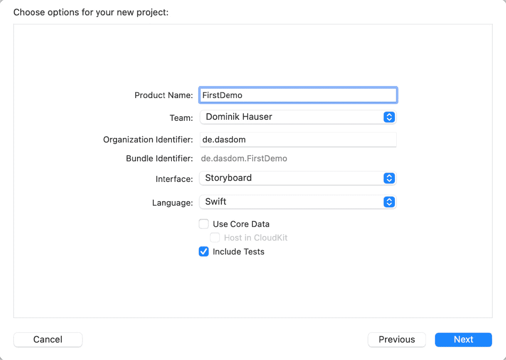
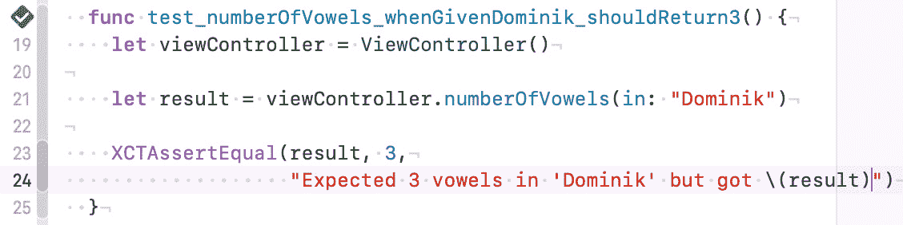
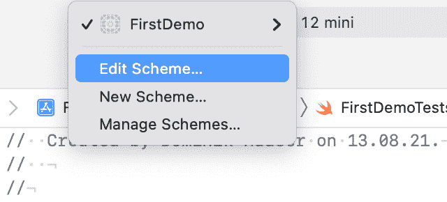
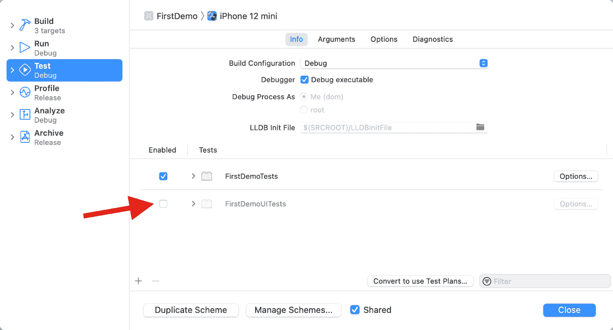
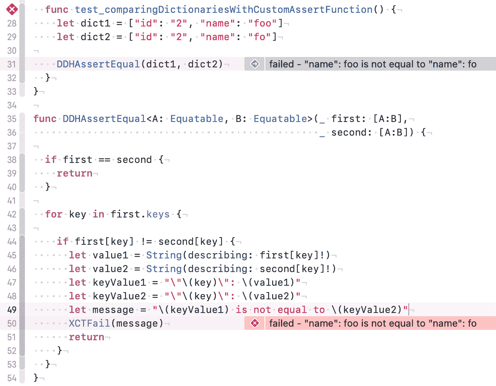
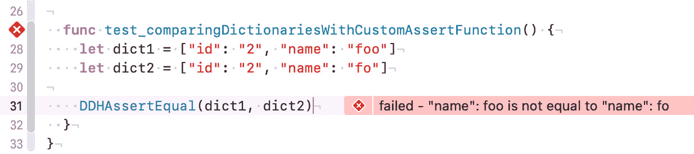

# 第一章：*第一章*：你的第一个单元测试

当 iPhone 平台首次推出时，应用程序很小，只关注一个功能。制作一个只做一件事的应用程序（例如，只显示白色屏幕的手电筒应用程序）很容易赚钱。这些早期应用程序的代码只有几百行，可以通过在屏幕上轻敲几分钟轻松测试。

从那时起，App Store 和可用的应用程序已经发生了很大变化。App Store 中仍然有一些专注于明确功能的较小应用程序，但从中赚钱变得困难得多。一个常见的应用程序具有许多功能，但仍需要易于使用。有一些公司有多个开发者全职工作在一个应用程序上。这些应用程序有时具有通常在桌面应用程序中找到的功能集。手动测试这些应用程序的所有功能非常困难且耗时。对于每次更新，都需要手动测试所有功能。

这其中的一个原因是手动测试需要通过**用户界面**（**UI**）进行，加载要测试的应用程序需要时间。除此之外，与计算机在测试和验证计算机程序等任务上的能力相比，人类非常慢。大多数时候，计算机（或智能手机）都在等待用户的下一个输入。如果我们能让计算机插入值，测试可以大大加速。事实上，计算机可以在几秒钟内运行几百次测试。这正是单元测试的全部内容。

单元测试是一段执行其他代码并检查结果是否符合开发者预期的代码。单词“单元”意味着测试执行一小块代码。通常，那是一个类的一个函数或类似类型的结构。单元实际上有多大取决于要测试的功能和编写测试的人。

起初编写单元测试似乎很难，因为对大多数开发者来说，这是一个新的概念。本章旨在帮助你开始编写你的第一个简单的单元测试。

本章我们将涵盖的主要主题包括：

+   构建你的第一个自动单元测试

+   `XCTest`框架中的断言函数

+   理解与其他测试类型的区别

# 技术要求

本章中所有的代码都已上传（完整形式）在此：

[`github.com/PacktPublishing/Test-Driven-iOS-Development-with-Swift-Fourth-Edition/tree/main/chapter01`](https://github.com/PacktPublishing/Test-Driven-iOS-Development-with-Swift-Fourth-Edition/tree/main/chapter01)

# 构建你的第一个自动单元测试

如果你已经进行了一些 iOS 开发（或一般的应用程序开发），以下示例可能对你来说很熟悉。

你正在计划构建一个应用程序。你开始收集功能，绘制一些草图，或者你的项目经理将需求交给你。在某个时候，你开始编码。你设置项目并开始实现应用程序所需的功能。

假设该应用有一个输入表单，用户输入的值在数据发送到服务器之前必须经过验证。验证检查，例如，电子邮件地址和电话号码是否有有效的格式。在实现表单后，你想要检查一切是否正常工作。但在你可以手动测试之前，你需要编写代码在屏幕上显示表单。然后，你在 iOS 模拟器中构建并运行你的应用。表单在视图层次结构的深处，所以你导航到视图并将值放入表单。它不起作用——电话号码验证代码有问题。你回到代码中并尝试修复问题。有时，这也意味着启动调试器并逐步通过代码来找到错误。

最终，验证将适用于你放入的测试数据。通常，你需要测试所有可能的值以确保验证不仅适用于你的姓名和你的数据，而且适用于所有有效数据。但是，你桌上有这么长的需求列表，而你已经开始晚了。在模拟器中导航到表单需要三次点击，输入所有不同的值需要太长时间。毕竟，你是一名程序员。

如果有一个机器人能为你进行这项测试就好了。

## 单元测试是什么？

自动单元测试就像这个机器人为你做的那样。它们执行代码，但不需要导航到要测试的功能屏幕。而不是一次又一次地运行应用，你用不同的输入数据编写测试，让计算机在眨眼间测试你的代码。让我们看看在简单示例中它是如何工作的。

## 实现单元测试示例

在这个例子中，我们编写了一个简单的函数，用于计算字符串中的元音数量。按照以下步骤进行：

1.  打开 Xcode 并转到**文件** | **新建** | **项目**。

1.  导航到**iOS** | **应用程序** | **App**并点击**下一步**。

1.  输入名称`FirstDemo`，选择**语言**字段中的`Swift`，并勾选**包含测试**。

1.  取消选择**使用 Core Data**并点击**下一步**。以下截图显示了 Xcode 中的选项：



图 1.1 – 设置你的新项目

Xcode 设置了一个用于开发的项目，此外还为你设置了两个单元测试和 UI 测试的目标。

1.  在项目导航器中打开`FirstDemoTests`文件夹。在文件夹内，有一个文件：`FirstDemoTests.swift`。

1.  选择`FirstDemoTests.swift`以在编辑器中打开它。

你在这里看到的是一个测试用例。测试用例是一个包含几个测试的类。一开始，为每个主要目标类创建一个测试用例是一个好习惯。

让我们一步一步地查看这个文件，如下所示：

文件从导入测试框架和主要目标开始，如下所示：

```swift
import XCTest
@testable import FirstDemo
```

每个测试用例都需要导入`XCTest`框架。它定义了`XCTestCase`类以及你将在本章后面看到的测试断言。

第二行导入了`FirstDemo`模块。你为演示应用编写的所有代码都将在这个模块中。默认情况下，类、结构体、枚举及其方法使用内部访问控制定义。这意味着它们只能从模块内部访问。但是测试代码存在于模块之外。为了能够编写测试代码，你需要使用`@testable`关键字导入模块。这个关键字使得模块的内部元素在测试用例中可访问。

接下来，我们将查看类声明，如下所示：

```swift
class FirstDemoTests: XCTestCase {
```

这里没有特别之处。这定义了`FirstDemoTests`类为`XCTestCase`的子类。

类中的前两种方法在以下代码片段中显示：

```swift
override func setUpWithError() throws {
  // Put setup code here. This method ...
}
override func tearDownWithError() throws {
  // Put teardown code here. This method ...
}
```

`setUpWithError()`方法在类中每个测试方法调用之前被调用。在这里，你可以插入应该在每次测试之前运行的代码。你将在本章后面的例子中看到这个例子。

`setUpWithError()`的对立面是`tearDownWithError()`。这个方法在类中每个测试方法调用之后被调用。如果你需要在测试后进行清理，请将必要的代码放在这个方法中。

下面的两个方法是苹果模板作者提供的模板测试：

```swift
func testExample() throws {
  // This is an example of a functional test case.
  // Use XCTAssert and related functions to ...
}
func testPerformanceExample() throws {
  // This is an example of a performance test case.
  self.measure {
    // Put the code you want to measure the time of here.
  }
}
```

第一种方法是常规单元测试。在这本书的过程中，你将大量使用这种测试。

第二种方法是性能测试。它用于测试执行时间关键计算的方法或函数。你放入度量闭包中的代码被调用 10 次，并测量平均持续时间。性能测试在实现或改进复杂算法时非常有用，并确保它们的性能不会下降。我们在这本书中不会使用性能测试。

你编写的所有测试方法都必须有`test`前缀；否则，测试运行器找不到并运行它们。这种行为允许轻松禁用测试——只需移除方法名称中的`test`前缀。稍后，你将了解其他在不重命名或删除的情况下禁用一些测试的可能性。

现在，让我们实现我们的第一个测试。假设你有一个计算字符串中元音的方法。一个可能的实现如下：

```swift
func numberOfVowels(in string: String) -> Int {
  let vowels: [Character] = ["a", "e", "i", "o", "u",
                             "A", "E", "I", "O", "U"]
  var numberOfVowels = 0
  for character in string {
    if vowels.contains(character) {
      numberOfVowels += 1
    }
  }
  return numberOfVowels
}
```

我猜这段代码让你感到不舒服。请保持冷静。不要把这本书扔到角落里——我们很快就会让这段代码变得更加“Swift 式”。将此方法添加到`ViewController`类中的`ViewController.swift`。

此方法执行以下操作：

1.  首先，定义了一个包含英语字母表中所有元音的字符数组。

1.  接下来，我们定义一个变量来存储元音的数量。计数是通过遍历字符串中的字符来完成的。如果当前字符包含在`vowels`数组中，`numberOfVowels`就增加一。

1.  最后，返回`numberOfVowels`。

打开 `FirstDemoTests.swift` 并删除带有 `test` 前缀的方法。然后，添加以下方法：

```swift
func test_numberOfVowels_whenGivenDominik_shouldReturn3() {
  let viewController = ViewController()
  let result = viewController.numberOfVowels(in: "Dominik")
  XCTAssertEqual(result, 3,
    "Expected 3 vowels in 'Dominik' but got \(result)")
}
```

这个测试创建了一个 `ViewController` 实例并将其分配给 `viewController` 常量。它调用我们想要测试的函数并将结果分配给一个常量。最后，测试方法中的代码调用 `XCTAssertEqual(_:, _:)` 函数来检查结果是否是我们预期的。如果 `XCTAssertEqual` 中的前两个参数相等，则测试通过；否则，它失败。

要运行测试，选择您选择的模拟器，然后转到**产品** | **测试**，或使用 *U* 快捷键。Xcode 编译项目并运行测试。您将看到类似以下内容：



图 1.2 – Xcode 在测试通过时显示带有勾选标记的绿色菱形

编辑器左侧的带有勾选标记的绿色菱形表示测试通过。所以，这就完成了——你的第一个单元测试。退后一步，庆祝一下。这可能对你来说是一个新的开发范式的开始。

现在我们有一个快速的测试，证明了 `numberOfVowels(in:)` 方法确实做了我们想要的事情，我们将改进实现。这个方法看起来像是被从 `ViewController.swift` 转换过来的，并用这个更“Swift 式”的实现替换了 `numberOfVowels(in:)` 方法：

```swift
func numberOfVowels(in string: String) -> Int {
  let vowels: [Character] = ["a", "e", "i", "o", "u",
                             "A", "E", "I", "O", "U"]
  return string.reduce(0) {
    $0 + (vowels.contains($1) ? 1 : 0)
  }
}
```

在这里，我们使用了定义在数组类型上的 `reduce` 函数。`reduce` 函数使用提供的闭包将序列的所有元素组合成一个值。`$0` 和 `$1` 是代表组合的当前值和序列中的下一个项目的匿名简写参数。再次运行测试 (*U*) 以确保这个实现与之前的实现工作相同。

## 禁用缓慢的 UI 测试

你可能已经意识到 Xcode 也会在 `FirstDemoUITests` 目标中运行 UI 测试。UI 测试非常慢。我们不希望在每次输入 *U* 快捷键时都运行这些测试。要禁用 UI 测试，请按照以下步骤操作：

1.  打开方案选择并点击**编辑方案…**，如下截图所示：



![图 1.3 – 选择目标选择器以打开方案编辑器 1.  Xcode 打开方案编辑器。选择 `FirstDemoUITests` 目标，如下截图所示：

U* 快捷键运行测试。

在我们继续之前，让我们回顾一下到目前为止我们所看到的内容。首先，你了解到你可以轻松编写测试代码来测试你的代码。其次，你看到测试有助于改进代码，因为现在，你不必担心在更改实现时破坏功能。

为了检查方法的结果是否符合我们的预期，我们使用了`XCTAssertEqual(_:, _:)`。这是在 XCTest 框架中定义的许多`XCTAssert`函数之一。下一节将展示最重要的几个。

# XCTest 框架中的断言函数

每个测试都需要断言一些预期的行为。使用`XCTAssert`函数告诉 Xcode 预期的内容。

一个没有`XCTAssert`函数且不抛出错误的测试方法将始终通过。

最重要的断言函数列在这里：

+   `XCTAssertTrue(_:_:file:line:)`: 这条断言表示一个表达式是真的。

+   `XCTAssert(_:_:file:line:)`: 这条断言与`XCTAssertTrue(_:_:file:line:)`相同。

+   `XCTAssertFalse(_:_:file:line:)`: 这条断言表示一个表达式是假的。

+   `XCTAssertEqual(_:_:_:file:line:)`: 这条断言表示两个表达式相等。

+   `XCTAssertEqual(_:_:accuracy:_:file:line:)`: 这条断言表示两个表达式相同，考虑到`accuracy`参数中定义的精度。

+   `XCTAssertNotEqual(_:_:_:file:line:)`: 这条断言表示两个表达式不相等。

+   `XCTAssertNotEqual(_:_:accuracy:_:file:line:)`: 这条断言表示两个表达式不相同，考虑到`accuracy`参数中定义的精度。

+   `XCTAssertNil(_:_:file:line:)`: 这条断言表示一个表达式是 nil。

+   `XCTAssertNotNil(_:_:file:line:)`: 这条断言表示一个表达式不是 nil。

+   `XCTFail(_:file:line:)`: 这条断言总是失败。

要查看可用的`XCTAssert`函数的完整列表，请按*Ctrl*并点击您刚刚编写的测试中的`XCTAssertEqual`单词。然后，在弹出菜单中选择**跳转到定义**，如图下所示：


图 1.5 – 跳转到所选函数的定义

注意，大多数`XCTAssert`函数都可以用`XCTAssert(_:_:file:line)`替换。例如，以下断言函数断言的是同一件事情：

```swift
// This assertion asserts the same as...
XCTAssertEqual(2, 1+1, "2 should be the same as 1+1")
// ...this assertion
XCTAssertTrue(2 == 1+1, "2 should be the same as 1+1")
```

但你应该尽可能使用更精确的断言，因为更精确的断言方法的日志输出会告诉你失败时确切发生了什么。例如，看看以下两个断言的日志输出：

```swift
XCTAssertEqual(1, 2)
// Log output:
// XCTAssertEqual failed: ("1") is not equal to ("2")
XCTAssert(1 == 2)
// Log output:
// XCTAssertTrue failed
```

在第一种情况下，你不需要查看测试就能理解发生了什么。日志会告诉你确切出了什么问题。

## 自定义断言函数

但有时，即使是更精确的断言函数也可能不够精确。在这种情况下，你可以编写自己的断言函数。例如，假设我们有一个断言两个字典具有相同内容的测试。如果我们使用 `XCTAssertEqual` 来测试，日志输出将如下所示：

```swift
func test_dictsAreQual() {
  let dict1 = ["id": "2", "name": "foo"]
  let dict2 = ["id": "2", "name": "fo"]
  XCTAssertEqual(dict1, dict2)
  // Log output:
  // XCTAssertEqual failed: ("["name": "foo", "id":
    "2"]")...
  // ...is not equal to ("["name": "fo", "id": "2"]")
}
```

对于本例中的短字典，找到差异相当容易。但如果字典有 20 个条目甚至更多呢？当我们向测试目标添加以下断言函数时，我们得到更好的日志输出：

```swift
func DDHAssertEqual<A: Equatable, B: Equatable>
  (_ first: [A:B],
   _ second: [A:B]) {
  if first == second {
    return
  }
  for key in first.keys {
    if first[key] != second[key] {
      let value1 = String(describing: first[key]!)
      let value2 = String(describing: second[key]!)
      let keyValue1 = "\"\(key)\": \(value1)"
      let keyValue2 = "\"\(key)\": \(value2)"
      let message = "\(keyValue1) is not equal to
        \(keyValue2)"
      XCTFail(message)
      return
    }
  }
}
```

此方法比较每个键的值，如果其中一个值不同则失败。此外，此断言函数还应检查字典是否具有相同的键。此功能留给读者作为练习。在这里，我们专注于如何编写自定义断言函数。通过保持示例简短，主要观点更容易理解。

当我们使用前面的字典运行此测试时，我们在 Xcode 中看到以下输出：



图 1.6 – Xcode 显示两个不同位置的失败

如前一个截图所示，Xcode 在断言函数中显示测试失败。在测试方法中，它只显示对失败的引用。幸运的是，有一个简单的解决方案。我们只需要将 `file` 和 `line` 参数传递给自定义断言函数，并在 `XCTFail` 调用中使用这些参数，如下所示：

```swift
 func DDHAssertEqual<A: Equatable, B: Equatable>(
  _ first: [A:B],
  _ second: [A:B],
  file: StaticString = #filePath,        // << new
  line: UInt = #line) {                  // << new
    if first == second {
      return
    }
    for key in first.keys {
      if first[key] != second[key] {
        let value1 = String(describing: first[key]!)
        let value2 = String(describing: second[key]!)
        let keyValue1 = "\"\(key)\": \(value1)"
        let keyValue2 = "\"\(key)\": \(value2)"
        let message = "\(keyValue1) is not equal to
          \(keyValue2)"
        XCTFail(message, file: file, line: line)  // << new
        return
      }
    }
  }
```

注意，我们的断言函数现在有两个新的参数：`file` 和 `line`，分别具有默认值 `#filePath` 和 `#line`。当在测试方法中调用该函数时，这些默认参数确保将调用点的文件路径和行传递给该断言函数。然后，这些参数被转发到 `XCTAssert` 函数（在我们的情况下是 `XCTFail`，但这适用于所有 XCT... 函数）。因此，失败现在显示在调用 `DDHAssertEqual` 函数的行中，我们不需要更改断言函数的调用。以下截图说明了这一点：



图 1.7 – 改进的失败报告

本例展示了编写自己的断言函数，使其行为类似于 Xcode 中的函数是多么容易。自定义断言函数可以提高测试代码的可读性，但请记住，这也是你必须维护的代码。

# 理解与其他类型测试的区别

单元测试是良好测试套件的一部分。在我看来，它们是最重要的测试，因为当正确执行时，它们是快速、专注且易于理解的。但为了增加你对代码的信心，你还应该添加集成、UI/快照和手动测试。那些是什么？

## 集成测试

在集成测试中，正在测试的功能没有从其余代码中隔离出来。使用这些类型的测试，开发者试图弄清楚不同的单元（这些单元已经通过单元测试彻底测试）是否按要求相互交互。因此，集成测试执行真实的数据库查询并从实时服务器获取数据，这使得它们比单元测试慢得多。它们不像单元测试那样经常运行，并且失败更难以理解，因为错误必须在所有涉及的代码单元中追踪。

## UI 测试

如其名所示，UI 测试在应用的 UI 上运行。一个计算机程序（测试运行器）以用户的方式执行应用。通常，这意味着在这种测试断言中，我们也必须使用屏幕上可访问的信息。这意味着 UI 测试只能测试当结果在屏幕上可见时，功能是否按预期工作。此外，这些测试通常相当慢，因为测试运行器通常必须等待动画和屏幕更新完成。

## 快照测试

快照测试比较 UI 与之前拍摄的快照。如果定义的像素百分比与快照图像不同，则测试失败。这使得它们非常适合在某个应用屏幕的 UI 已经完成，并且你想要确保它不会在给定的测试数据中发生变化的情况。

## 手动测试

在应用开发中，最后的测试类型是手动测试。即使你有数百个单元和集成测试，真实用户使用你的应用时很可能会发现一个错误。为了最小化用户可以发现的错误数量，你需要在团队中拥有测试人员或要求一些用户对你的应用测试版提供反馈。测试人员群体越多样化，他们在你的应用发货前发现的错误就越多。

在这本书中，我们只涵盖单元测试，因为**测试驱动开发**（**TDD**）只有在快速可靠的反馈下才能合理地工作。

# 摘要

在本章中，我们讨论了单元测试是什么，并看到了一些简单的单元测试实例。我们了解了在 Apple 提供的测试框架`XCTest`中可用的不同断言函数。通过编写我们自己的断言函数，我们学会了如何改进日志输出以及需要做什么才能使其表现得像内置函数。本章以其他类型的测试以及它们与单元测试的不同之处结束。

在下一章中，我们将学习什么是 TDD（测试驱动开发），以及它的优缺点。

# 练习

1.  编写一个断言函数，该函数仅在两个字典中的键不同时失败。如果其中一个字典中缺少键，该断言函数也应失败。

1.  改进`DDHAssertEqual<A: Equatable, B: Equatable>(_:_:file:line:)`，使其也检查字典的键。
